## Instrutor:

- Juliana Mascarenhas (Tech Education Specialist / Sócia (Content Creator) @SimplificandoRedes / Me Modelagem Computacional / Cientista de dados)
- Contato Linkedin: / [juliana-mascarenhas-ds](https://www.linkedin.com/in/juliana-mascarenhas-ds/)

### 🟩 Vídeo 01 - Entendendo o que deve ser Criado no Relatório do Desafio

<video width="60%" controls>
  <source src="000-Midia_e_Anexos/bootcamp_ntt_data-modulo.06-curso.04-video_01.webm" type="video/webm">
    Seu navegador não suporta vídeo HTML5.
</video>

link do vídeo: https://web.dio.me/lab/criando-um-relatorio-de-vendas-elegante-com-power-bi/learning/a9f091aa-5d5c-40c6-bb91-0aa2b30981c4?back=/track/engenharia-dados-python

Este guia resume as estratégias e técnicas apresentadas para transformar dados brutos em um relatório analítico de alto impacto. O foco vai além da simples exibição de números, priorizando a experiência do usuário (UX) e a profundidade da análise.

### Anotações

<p align="center">

</p>

O objetivo deste projeto é a criação de um relatório analítico estruturado para fornecer uma visão clara e imediata da saúde financeira da empresa. A interface é composta por cartões na parte superior que exibem as métricas de alto nível (KPIs), como a soma de vendas, unidades vendidas, descontos e o valor bruto de vendas. Essa disposição permite que o usuário compreenda a situação geral rapidamente antes de decidir se aprofundar nos detalhes técnicos dos gráficos inferiores.

O relatório utiliza a base de dados *Financial Sample* do Power BI e inclui um segmentador de data no topo, permitindo filtrar todo o conjunto de dados para intervalos específicos. Abaixo dos KPIs, os dados são detalhados através de diferentes perspectivas:

* **Soma de Sales por Mês:** Gráfico de linhas para análise temporal.
* **Sale x Segmento:** Gráfico de rosca para distribuição por segmento.
* **Soma de Sales por Product:** Gráfico de barras horizontais.
* **Sales por País:** Mapa para visualização geográfica das vendas.

<p align="center">

</p>

A interatividade é um ponto central deste relatório. Foram adicionados botões funcionais que permitem ao usuário alternar entre diferentes visões de um mesmo contexto. Por exemplo, no quadrante de vendas por segmento, é possível alternar entre a visualização de gráfico de rosca e gráfico de barras. Da mesma forma, no quadrante de vendas por país, o usuário pode escolher entre uma visualização em mapa ou em barras.

Além da alternância de visuais, o relatório conta com um botão de limpeza de filtros (ícone de borracha). No ambiente de desenvolvimento do Power BI Desktop, o acionamento dessas ações requer o uso da tecla `Ctrl` combinada ao clique, funcionalidade que se torna direta após a publicação no Power BI Service.

<p align="center">

</p>

Para otimizar a experiência do usuário, os botões de seleção de gráfico (como "Bar Chart" e "Pie Chart") funcionam como gatilhos para alterar o que está sendo exibido na tela sem ocupar espaço adicional. Ao passar o mouse sobre esses botões, um aviso indica a necessidade de usar `Ctrl + clique` para seguir o link da ação configurada. Esse recurso de navegação interna torna o relatório dinâmico, permitindo que o consumidor escolha a forma de visualização que melhor atende à sua necessidade de análise no momento.

<p align="center">

</p>

A estrutura da primeira página do relatório está completa, apresentando um layout equilibrado entre métricas agregadas e detalhamento visual. No canto inferior esquerdo, um botão de navegação (seta) é configurado para levar o usuário à segunda página do relatório. O design mantém uma paleta de cores consistente e utiliza recursos de segmentação para garantir que todos os visuais respondam simultaneamente aos filtros aplicados, mantendo a integridade da análise em diferentes períodos temporais.

<p align="center">

</p>

A segunda página, intitulada "Report de Lucro Detalhado", foca na análise de rentabilidade e utiliza visuais personalizados para enriquecer a experiência analítica:

* **Chiclet Slicer:** Utilizado no topo para a seleção de anos (2013 e 2014), oferecendo uma interface de botões mais amigável que o segmentador padrão.
* **Gráfico de Radar (Radar Chart):** Exibe a soma de lucro por produto, permitindo identificar visualmente qual item possui a maior proporção de lucro.
* **Árvore Hierárquica (Decomposition Tree):** Localizada à esquerda, permite decompor a soma de lucro por ano e país de forma expansível.
* **Gráfico de Cascata (Waterfall Chart):** Demonstra a variação do lucro por trimestre, evidenciando aumentos e diminuições ao longo do tempo.
* **Treemap:** Categoriza o lucro por segmento, sendo ideal para visualizar proporções hierárquicas quando há múltiplos elementos.

<p align="center">

</p>

Para avançar na customização do relatório, podem ser criados menus laterais retráteis. Utilizando formas, botões invisíveis e os painéis de **Seleção** e **Indicadores** (Bookmarks), é possível configurar ações para abrir e fechar painéis de filtros ou navegação. Essa técnica permite maximizar a área útil do relatório, escondendo controles de segmentação quando não estão em uso. A recomendação final é manter a coerência visual na paleta de cores e explorar as diversas ações de botões para tornar a navegação fluida e intuitiva para o usuário final.


### 🟩 Vídeo 02 - Criando elementos da Primeira Página do Relatório

<video width="60%" controls>
  <source src="000-Midia_e_Anexos/bootcamp_ntt_data-modulo.06-curso.04-video_02.webm" type="video/webm">
    Seu navegador não suporta vídeo HTML5.
</video>

link do vídeo: https://web.dio.me/lab/criando-um-relatorio-de-vendas-elegante-com-power-bi/learning/cc4d0da6-799a-466d-9589-d8f4732595c5

Este tutorial foca na construção da interface visual (UI) de um dashboard no Power BI, utilizando formas, cores e organização de elementos para criar um relatório profissional e intuitivo. O instrutor demonstra como preparar o "esqueleto" do dashboard antes de inserir os dados e gráficos reais.

### Anotações

<p align="center">
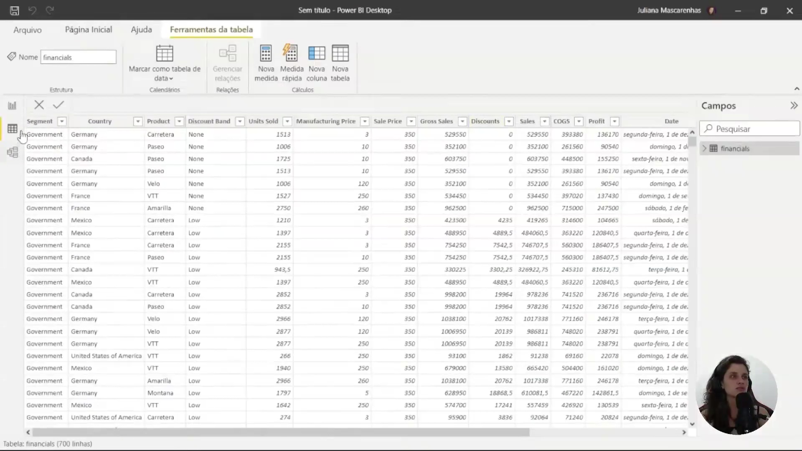
</p>

O processo de criação do dashboard começa com a validação dos dados na **Exibição de Tabela**. O conjunto de dados utilizado é o *Financial Sample*, que contém informações de vendas, segmentos e países. Antes de iniciar o design, é fundamental conferir se as colunas (como *Segment*, *Country*, *Product* e *Sales*) foram importadas corretamente.

```csv
"Segment","Country","Product","Discount Band","Units Sold","Manufacturing Price","Sale Price","Gross Sales","Discounts","Sales","COGS","Profit","Date"
"Government","Germany","Carretera","None","1513","3","350","529550","0","529550","393380","136170","segunda-feira, 1 de dezembro"
"Government","Germany","Paseo","None","1006","10","350","352100","0","352100","261560","90540","domingo, 1 de dezembro"
"Government","Canada","Paseo","None","1725","10","350","603750","0","603750","448500","155250","sexta-feira, 1 de novembro"

```

<p align="center">
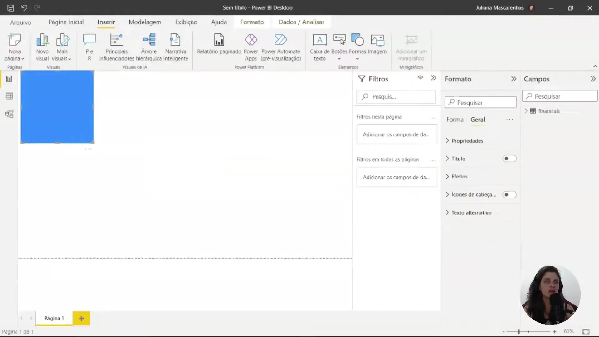
</p>

Após a conferência dos dados, acessamos a **Exibição de Relatório** (Canvas). Neste estágio inicial, a tela está em branco, servindo como a área de trabalho onde utilizaremos os elementos do menu "Inserir", como formas e caixas de texto, para estruturar o layout visual antes de adicionar os gráficos.

<p align="center">
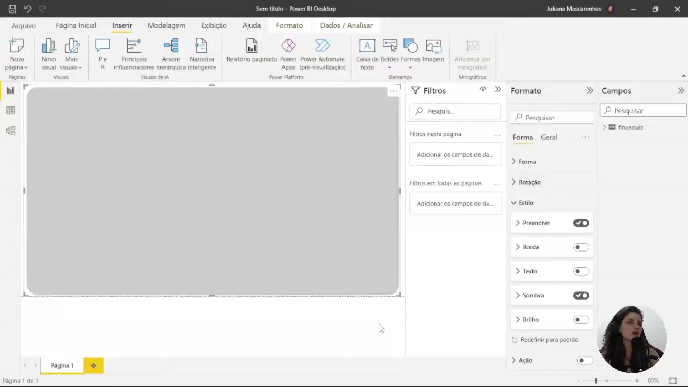
</p>

A construção do fundo do relatório é feita utilizando uma **Forma Retangular**. No painel de formatação, o raio dos cantos é ajustado (em aproximadamente 35) para criar um visual arredondado. A cor de preenchimento é definida como um cinza neutro e uma leve sombra é aplicada para dar profundidade ao elemento, destacando-o do fundo da página.

<p align="center">
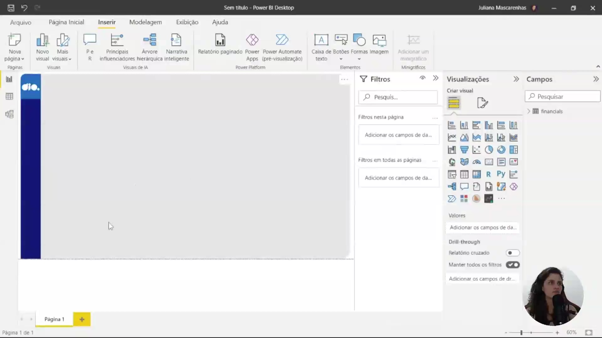
</p>

Para compor o cabeçalho, é inserida uma forma com o **canto superior direito arredondado**. Como a orientação original da forma nem sempre atende ao layout, utiliza-se a propriedade de **Rotação** (ajustada para 270°) no painel de Formato para inverter a posição da curva e encaixá-la no topo do dashboard.

<p align="center">
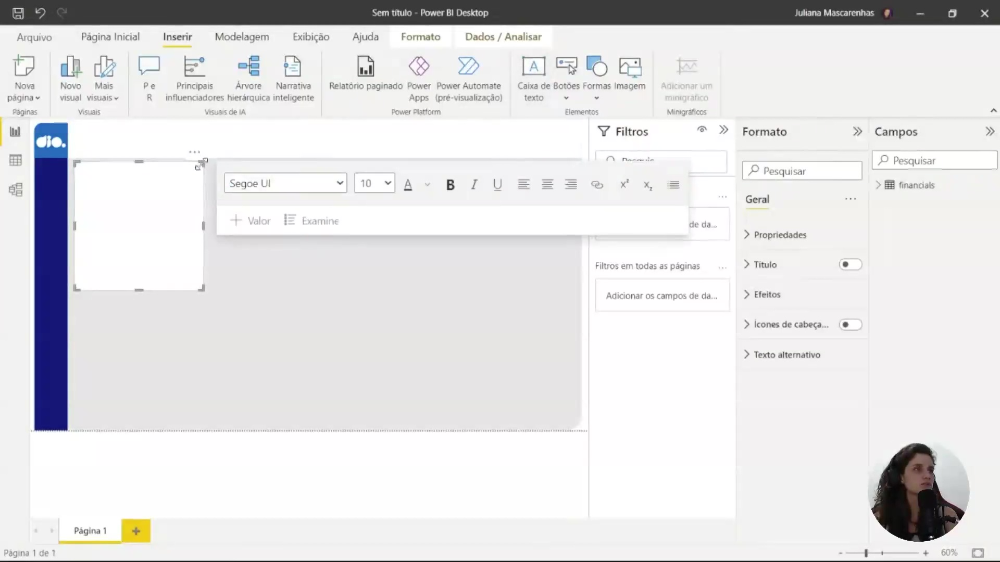
</p>

A identidade visual é reforçada com a sobreposição de formas. Utiliza-se um tom de azul mais escuro para a base do cabeçalho e uma forma menor, em azul mais claro, posicionada logo acima. Essa técnica de camadas ajuda a criar um design mais sofisticado e dinâmico para a área de identificação do relatório.

<p align="center">
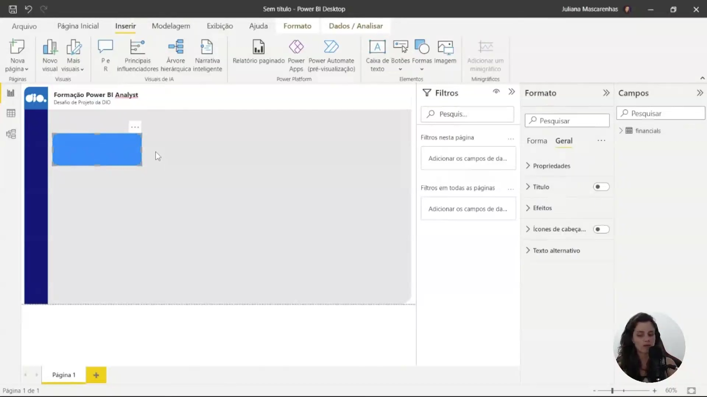
</p>

O logotipo da DIO é inserido para identificar o projeto. Diferente das formas nativas, imagens não possuem a mesma flexibilidade de rotação dentro do Power BI, portanto, o logo é redimensionado manualmente para se integrar perfeitamente ao espaço delimitado pelas formas azuis do cabeçalho.

<p align="center">
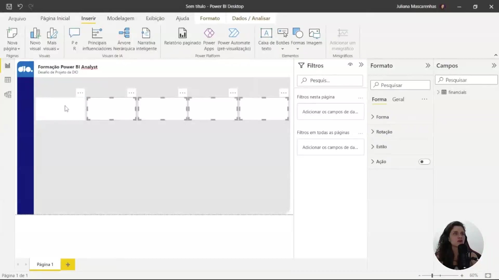
</p>

Uma faixa branca horizontal é adicionada abaixo do cabeçalho azul para servir de base para o título. Nela, insere-se uma **Caixa de Texto** com as informações "Formação Power BI Analyst" e "Desafio de Projeto da DIO", utilizando ajustes de tamanho de fonte e negrito para garantir a hierarquia da informação.

<p align="center">

</p>

Com o aumento do número de elementos na tela, o **Painel de Seleção** (Menu Exibição > Seleção) torna-se essencial. Ele permite gerenciar todos os objetos inseridos (formas, imagens e caixas de texto), permitindo renomeá-los, alterar a ordem de sobreposição (frente/trás) ou ocultar itens temporariamente para facilitar o ajuste do layout.

<p align="center">
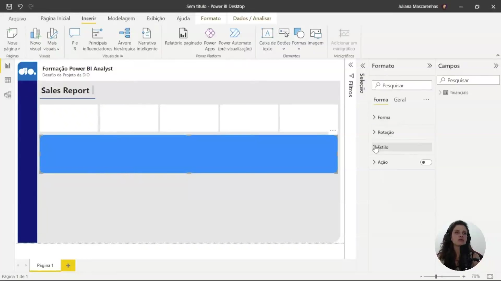
</p>

A fase seguinte envolve a criação de áreas para as métricas principais. O título principal do relatório, "**Sales Report**", é inserido em destaque. Abaixo dele, pequenas formas brancas retangulares são posicionadas horizontalmente para servir de base para os cartões de indicadores (KPIs) que exibirão os números totais das vendas.

<p align="center">
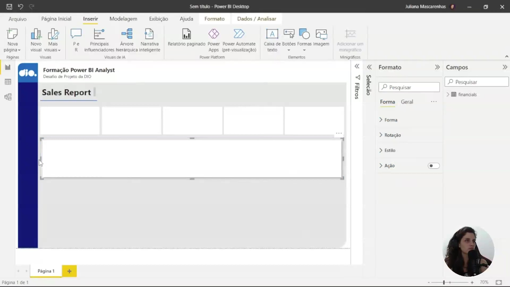
</p>

Para manter o projeto organizado, os elementos que compõem as métricas de topo são selecionados e **agrupados** através do painel de seleção. O grupo é renomeado para "Cartões", facilitando futuras manutenções ou a criação de interações que envolvam todo esse conjunto de objetos simultaneamente.

<p align="center">
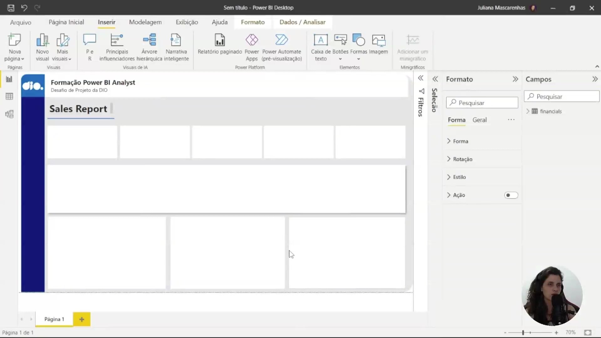
</p>

Uma **linha de separação** horizontal é inserida logo abaixo da área de títulos e métricas iniciais. Esse detalhe visual ajuda a delimitar as diferentes seções do dashboard, separando as informações de resumo (cabeçalho) da área de análise detalhada (corpo do relatório).

<p align="center">
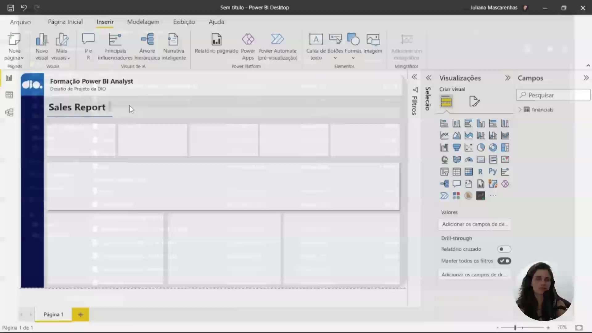
</p>

Containers principais são adicionados ao corpo do relatório utilizando formas retangulares brancas sem borda. Estes espaços são dimensionados para abrigar os futuros gráficos. Um destaque especial é dado ao container central, que recebe uma leve sombra para sobressair em relação aos demais, criando um ponto focal para a análise mais importante.

<p align="center">

</p>

Um ícone de borracha azul é inserido no layout. Este elemento gráfico funcionará como um **botão de reset**, permitindo que o usuário limpe todos os filtros aplicados (como segmentações de dados) com um único clique, melhorando a experiência de navegação e usabilidade do dashboard.

<p align="center">
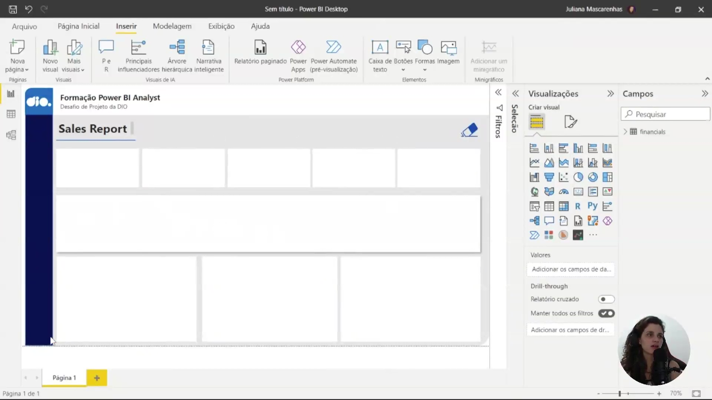
</p>

O "esqueleto" visual do relatório está concluído. Com todas as formas, containers, títulos e ícones de navegação devidamente posicionados e agrupados, o ambiente está preparado para a etapa final: a inserção dos visuais de dados e a configuração das métricas calculadas.


### 🟩 Vídeo 03 - Criando Gráficos da Primeira Página do Relatório

<video width="60%" controls>
  <source src="000-Midia_e_Anexos/bootcamp_ntt_data-modulo.06-curso.04-video_03.webm" type="video/webm">
    Seu navegador não suporta vídeo HTML5.
</video>

link do vídeo: https://web.dio.me/lab/criando-um-relatorio-de-vendas-elegante-com-power-bi/learning/e08d4a53-fe11-4c42-a8a7-3a92063c6058?back=/track/engenharia-dados-python

Este guia resume o processo de construção de um relatório dinâmico, desde a escolha dos gráficos iniciais até a personalização estética e funcional para uma melhor experiência do usuário.

### Anotações

<p align="center">
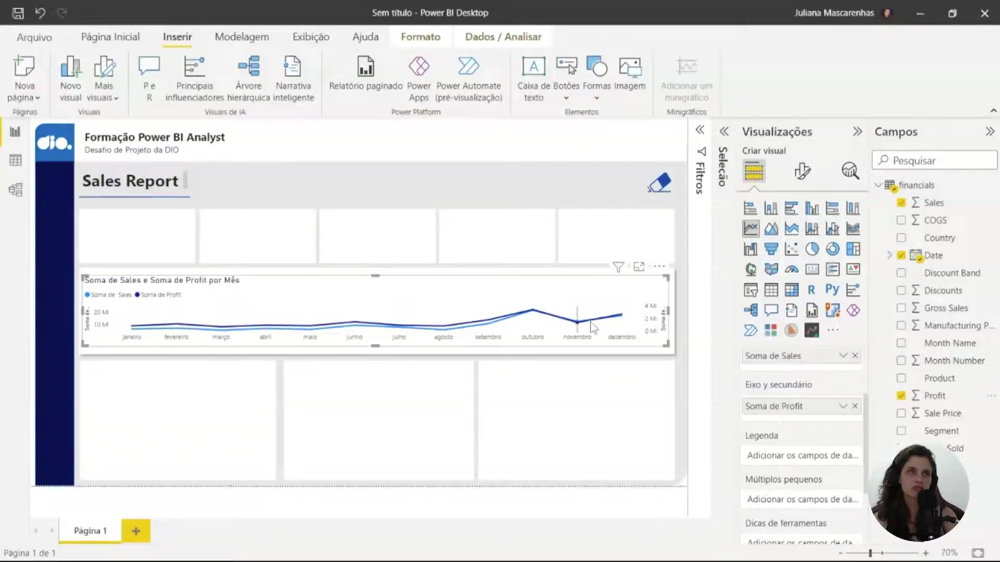
</p>

Nesta etapa inicial, a interface do Power BI Desktop exibe a configuração de um gráfico de combinação (colunas e linhas) que analisa a **Soma de Sales** e a **Soma de Profit** distribuídas por **Mês**. No painel lateral de campos, observamos a tabela `financials` com suas colunas prontas para uso, enquanto o gráfico principal começa a delinear a sazonalidade dos dados financeiros ao longo do ano.

<p align="center">

</p>

A visualização foca na preparação da área de trabalho para a inclusão de novos elementos de análise. O painel de **Visualizações** está aberto, destacando a capacidade de arrastar campos da tabela `financials`, como `Country`, `Product` e `Segment`, para criar representações visuais que permitam o detalhamento (drill-through) e a filtragem cruzada entre os relatórios.

<p align="center">
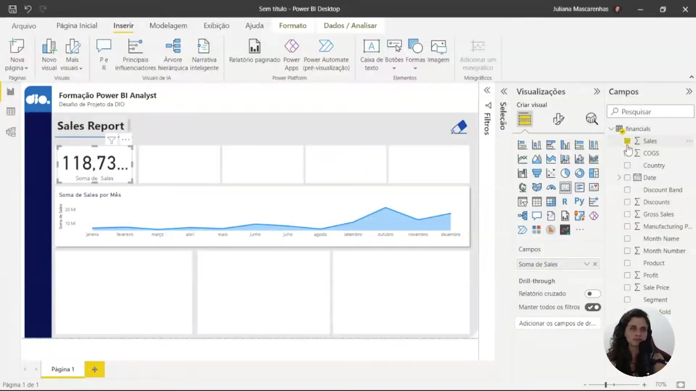
</p>

O relatório começa a tomar forma com a inserção de um cartão de destaque apresentando a **Soma de Sales** total de **118,73 Mi**. Logo abaixo, o gráfico de linhas detalha a evolução das vendas mês a mês, permitindo identificar picos de desempenho, como o observado no mês de dezembro, facilitando a análise temporal do faturamento.

<p align="center">
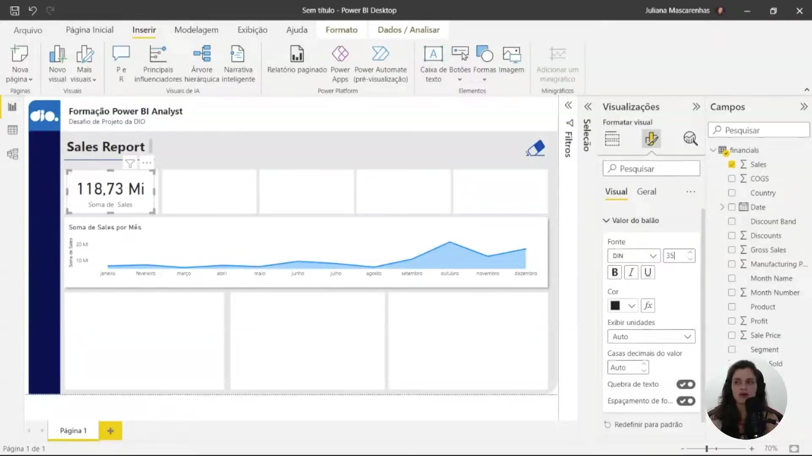
</p>

Neste momento, o foco está na formatação estética e funcional dos visuais. Através do painel **Formatar visual**, são ajustadas as propriedades do "Valor do balão", incluindo a fonte (DIN), o tamanho (35) e a exibição de unidades. Essas configurações garantem que os indicadores-chave, como o total de vendas, sejam legíveis e visualmente consistentes com a identidade do relatório.

<p align="center">
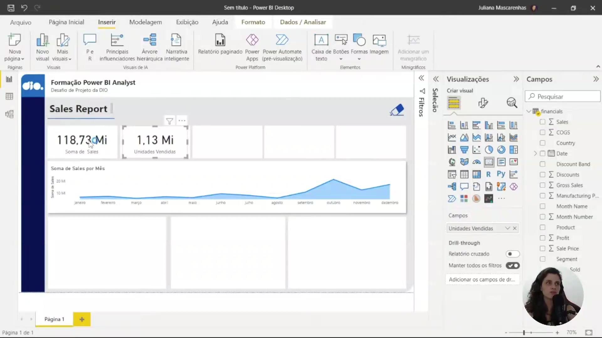
</p>

A expansão do dashboard continua com a adição de um segundo cartão informativo, desta vez focado na métrica de **Unidades Vendidas**, que totaliza **1,13 Mi**. Esta adição permite confrontar o volume de vendas com o valor financeiro (Soma de Sales) exibido anteriormente, oferecendo uma visão mais completa da operação comercial.

<p align="center">
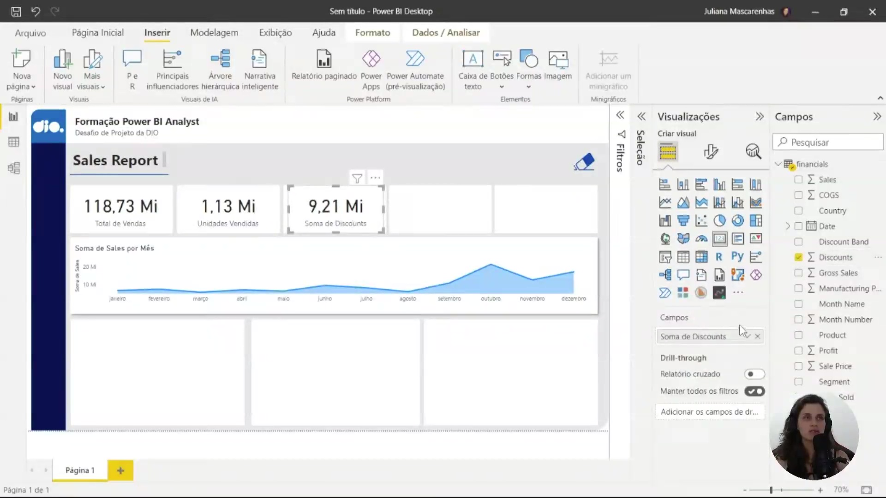
</p>

Para aprofundar a análise de rentabilidade, é inserido um novo cartão exibindo a **Soma de Discounts** (9,21 Mi). No painel de campos à direita, vemos a seleção ativa do campo `Discounts` da tabela `financials`, reforçando como o Power BI facilita o monitoramento de variáveis que impactam diretamente a margem de lucro.

<p align="center">
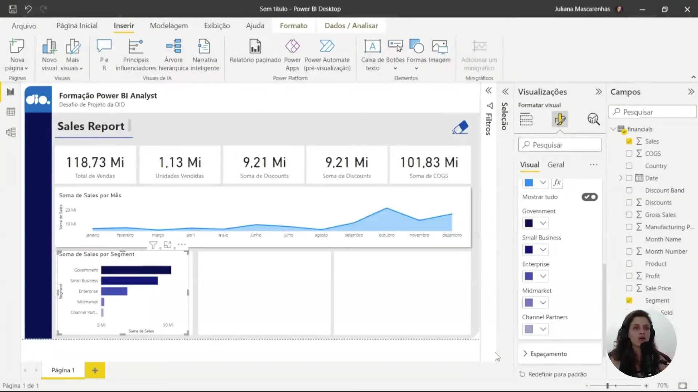
</p>

A tela demonstra a criação de uma análise por segmento de mercado. Um gráfico de barras horizontais é introduzido para mostrar a **Soma de Sales por Segment**, permitindo comparar o desempenho entre os setores *Government*, *Small Business*, *Enterprise*, *Midmarket* e *Channel Partners*. Observa-se também a inclusão da métrica de **Soma de COGS** (101,83 Mi) em um novo cartão, essencial para entender o custo das mercadorias vendidas.

<p align="center">
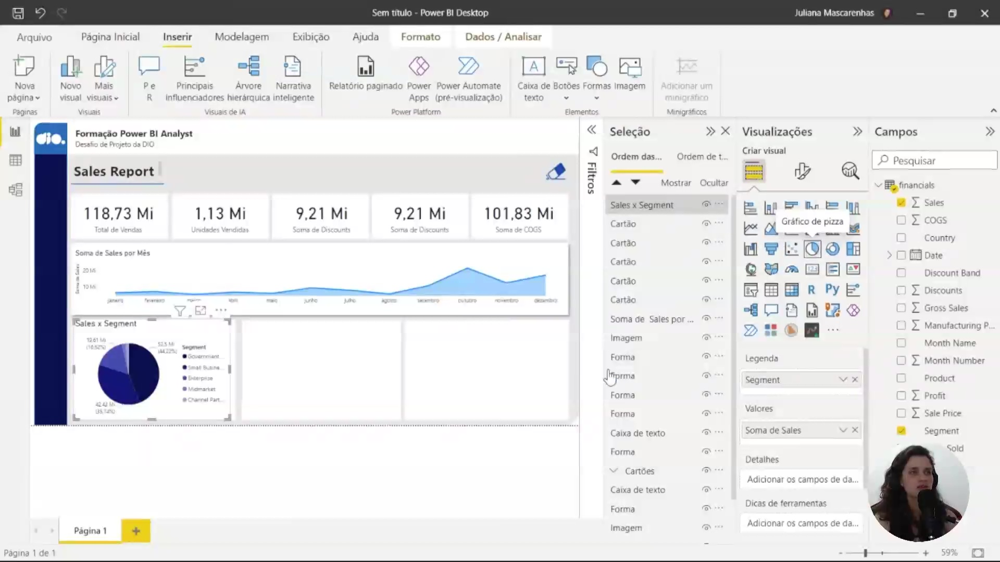
</p>

Esta visualização foca no gerenciamento das camadas e elementos do relatório através do painel de **Seleção**. É possível visualizar a organização de todos os objetos inseridos — cartões, gráficos de pizza, formas e caixas de texto. Essa estrutura organizada é fundamental para garantir que a interatividade e a sobreposição dos elementos funcionem corretamente no design final.

<p align="center">
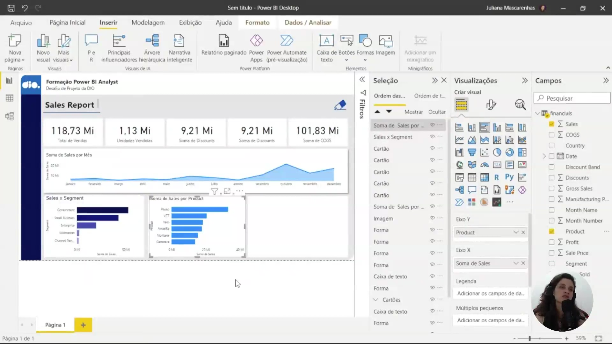
</p>

O relatório atinge um nível avançado de detalhamento com a inclusão do gráfico de **Soma de Sales por Product**. Esta visualização de barras permite identificar quais produtos, como *Paseo* e *VTT*, lideram as vendas. A interface mostra como os eixos X (Soma de Sales) e Y (Product) estão configurados para gerar este ranking de performance por item.

<p align="center">
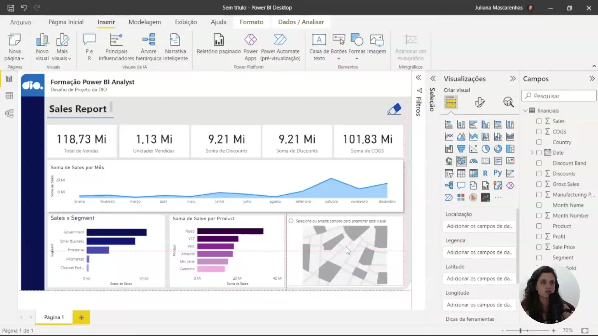
</p>

A imagem final demonstra a capacidade de análise geográfica e interativa do Power BI. Ao selecionar o produto *Paseo*, o relatório filtra automaticamente todos os outros visuais para mostrar apenas os dados relativos a esse item. Além disso, a configuração do mapa está visível no painel lateral, pronta para receber campos de localização como `Country`, permitindo a visualização espacial da distribuição das vendas globais.      


### 🟩 Vídeo 04 - Criando o Segmentador e Visuais Alternativos

<video width="60%" controls>
  <source src="000-Midia_e_Anexos/bootcamp_ntt_data-modulo.06-curso.04-video_04.webm" type="video/webm">
    Seu navegador não suporta vídeo HTML5.
</video>

link do vídeo: https://web.dio.me/lab/criando-um-relatorio-de-vendas-elegante-com-power-bi/learning/04960d21-e3fb-4765-90bf-26024871691f

### 🟩 Vídeo 05 - Criando os Botões do Relatórios e utilizando Indicadores para Gravar Estado do Relatório

<video width="60%" controls>
  <source src="000-Midia_e_Anexos/bootcamp_ntt_data-modulo.06-curso.04-video_05.webm" type="video/webm">
    Seu navegador não suporta vídeo HTML5.
</video>

link do vídeo:

### 🟩 Vídeo 06 - Criando a Interação por Botões com a Segunda Página do Relatório

<video width="60%" controls>
  <source src="000-Midia_e_Anexos/bootcamp_ntt_data-modulo.06-curso.04-video_06.webm" type="video/webm">
    Seu navegador não suporta vídeo HTML5.
</video>

link do vídeo:

### 🟩 Vídeo 07 - Publicando Relatório no Power BI Service e Considerações Finais

<video width="60%" controls>
  <source src="000-Midia_e_Anexos/bootcamp_ntt_data-modulo.06-curso.04-video_07.webm" type="video/webm">
    Seu navegador não suporta vídeo HTML5.
</video>

link do vídeo:

### 🟩 Vídeo 08 - Entendendo o desafio

<video width="60%" controls>
  <source src="000-Midia_e_Anexos/bootcamp_ntt_data-modulo.06-curso.04-video_08.webm" type="video/webm">
    Seu navegador não suporta vídeo HTML5.
</video>

link do vídeo:


##  Materiais de Apoio

# Certificado: 

- Link na plataforma: 
- Certificado em pdf: