## Instrutor:

- Juliana Mascarenhas (Tech Education Specialist / Sócia (Content Creator) @SimplificandoRedes / Me Modelagem Computacional / Cientista de dados)
- Contato Linkedin: / [juliana-mascarenhas-ds](https://www.linkedin.com/in/juliana-mascarenhas-ds/)
- Repositório deste curso (e pasta): https://github.com/ahaerdy/fork-DIO-power_bi_analyst/tree/main/M%C3%B3dulo%202/Desafio%20de%20Projeto

### 🟩 Vídeo 01 - Entendendo o que deve ser Criado no Relatório do Desafio

<video width="60%" controls>
  <source src="000-Midia_e_Anexos/bootcamp_ntt_data-modulo.06-curso.04-video_01.webm" type="video/webm">
    Seu navegador não suporta vídeo HTML5.
</video>

link do vídeo: https://web.dio.me/lab/criando-um-relatorio-de-vendas-elegante-com-power-bi/learning/a9f091aa-5d5c-40c6-bb91-0aa2b30981c4?back=/track/engenharia-dados-python

Este guia resume as estratégias e técnicas apresentadas para transformar dados brutos em um relatório analítico de alto impacto. O foco vai além da simples exibição de números, priorizando a experiência do usuário (UX) e a profundidade da análise.

### Anotações

<p align="center">
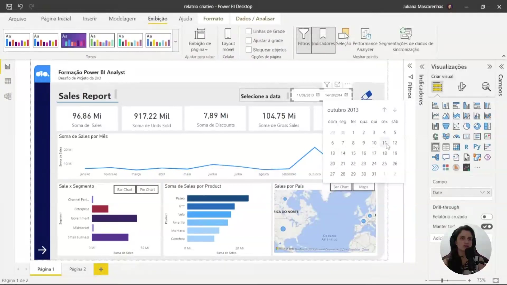
</p>

O objetivo deste projeto é a criação de um relatório analítico estruturado para fornecer uma visão clara e imediata da saúde financeira da empresa. A interface é composta por cartões na parte superior que exibem as métricas de alto nível (KPIs), como a soma de vendas, unidades vendidas, descontos e o valor bruto de vendas. Essa disposição permite que o usuário compreenda a situação geral rapidamente antes de decidir se aprofundar nos detalhes técnicos dos gráficos inferiores.

O relatório utiliza a base de dados *Financial Sample* do Power BI e inclui um segmentador de data no topo, permitindo filtrar todo o conjunto de dados para intervalos específicos. Abaixo dos KPIs, os dados são detalhados através de diferentes perspectivas:

* **Soma de Sales por Mês:** Gráfico de linhas para análise temporal.
* **Sale x Segmento:** Gráfico de rosca para distribuição por segmento.
* **Soma de Sales por Product:** Gráfico de barras horizontais.
* **Sales por País:** Mapa para visualização geográfica das vendas.

<p align="center">
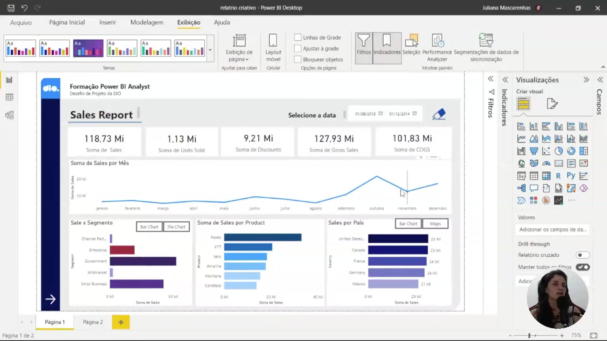
</p>

A interatividade é um ponto central deste relatório. Foram adicionados botões funcionais que permitem ao usuário alternar entre diferentes visões de um mesmo contexto. Por exemplo, no quadrante de vendas por segmento, é possível alternar entre a visualização de gráfico de rosca e gráfico de barras. Da mesma forma, no quadrante de vendas por país, o usuário pode escolher entre uma visualização em mapa ou em barras.

Além da alternância de visuais, o relatório conta com um botão de limpeza de filtros (ícone de borracha). No ambiente de desenvolvimento do Power BI Desktop, o acionamento dessas ações requer o uso da tecla `Ctrl` combinada ao clique, funcionalidade que se torna direta após a publicação no Power BI Service.

<p align="center">
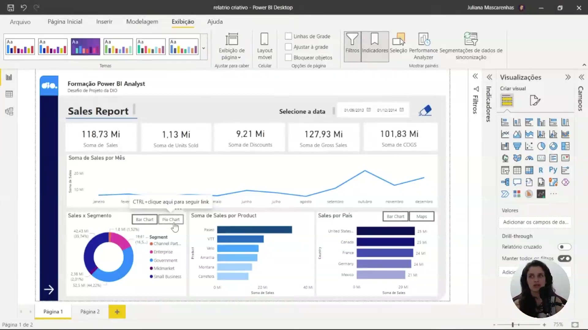
</p>

Para otimizar a experiência do usuário, os botões de seleção de gráfico (como "Bar Chart" e "Pie Chart") funcionam como gatilhos para alterar o que está sendo exibido na tela sem ocupar espaço adicional. Ao passar o mouse sobre esses botões, um aviso indica a necessidade de usar `Ctrl + clique` para seguir o link da ação configurada. Esse recurso de navegação interna torna o relatório dinâmico, permitindo que o consumidor escolha a forma de visualização que melhor atende à sua necessidade de análise no momento.

<p align="center">
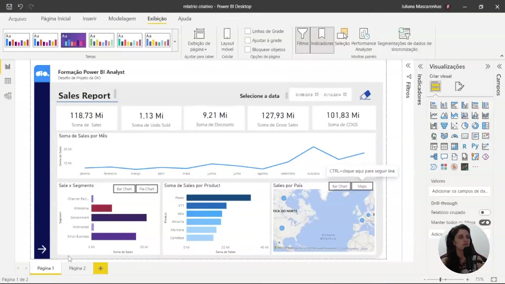
</p>

A estrutura da primeira página do relatório está completa, apresentando um layout equilibrado entre métricas agregadas e detalhamento visual. No canto inferior esquerdo, um botão de navegação (seta) é configurado para levar o usuário à segunda página do relatório. O design mantém uma paleta de cores consistente e utiliza recursos de segmentação para garantir que todos os visuais respondam simultaneamente aos filtros aplicados, mantendo a integridade da análise em diferentes períodos temporais.

<p align="center">
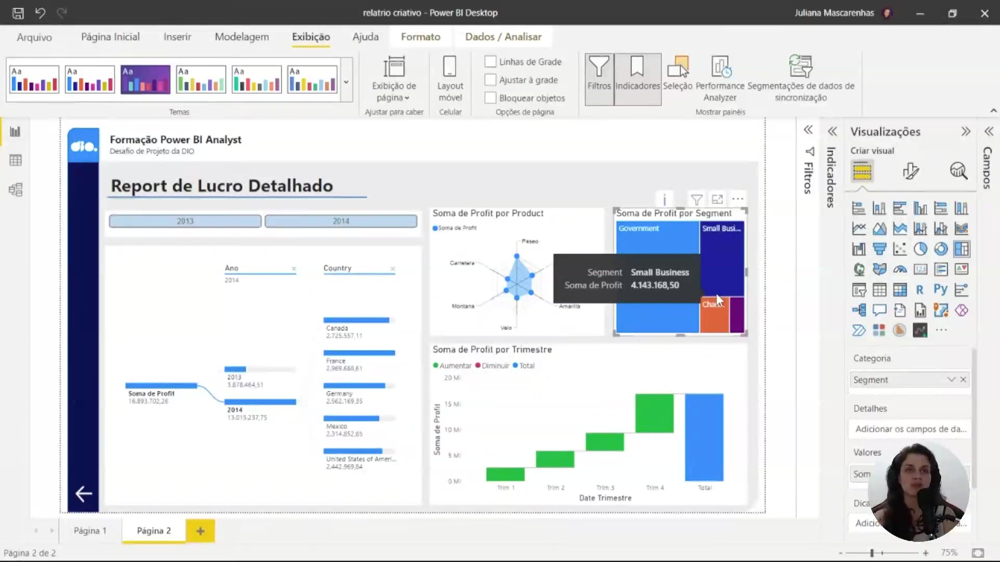
</p>

A segunda página, intitulada "Report de Lucro Detalhado", foca na análise de rentabilidade e utiliza visuais personalizados para enriquecer a experiência analítica:

* **Chiclet Slicer:** Utilizado no topo para a seleção de anos (2013 e 2014), oferecendo uma interface de botões mais amigável que o segmentador padrão.
* **Gráfico de Radar (Radar Chart):** Exibe a soma de lucro por produto, permitindo identificar visualmente qual item possui a maior proporção de lucro.
* **Árvore Hierárquica (Decomposition Tree):** Localizada à esquerda, permite decompor a soma de lucro por ano e país de forma expansível.
* **Gráfico de Cascata (Waterfall Chart):** Demonstra a variação do lucro por trimestre, evidenciando aumentos e diminuições ao longo do tempo.
* **Treemap:** Categoriza o lucro por segmento, sendo ideal para visualizar proporções hierárquicas quando há múltiplos elementos.

<p align="center">

</p>

Para avançar na customização do relatório, podem ser criados menus laterais retráteis. Utilizando formas, botões invisíveis e os painéis de **Seleção** e **Indicadores** (Bookmarks), é possível configurar ações para abrir e fechar painéis de filtros ou navegação. Essa técnica permite maximizar a área útil do relatório, escondendo controles de segmentação quando não estão em uso. A recomendação final é manter a coerência visual na paleta de cores e explorar as diversas ações de botões para tornar a navegação fluida e intuitiva para o usuário final.


### 🟩 Vídeo 02 - Criando elementos da Primeira Página do Relatório

<video width="60%" controls>
  <source src="000-Midia_e_Anexos/bootcamp_ntt_data-modulo.06-curso.04-video_02.webm" type="video/webm">
    Seu navegador não suporta vídeo HTML5.
</video>

link do vídeo: https://web.dio.me/lab/criando-um-relatorio-de-vendas-elegante-com-power-bi/learning/cc4d0da6-799a-466d-9589-d8f4732595c5

Este tutorial foca na construção da interface visual (UI) de um dashboard no Power BI, utilizando formas, cores e organização de elementos para criar um relatório profissional e intuitivo. O instrutor demonstra como preparar o "esqueleto" do dashboard antes de inserir os dados e gráficos reais.

### Anotações

<p align="center">
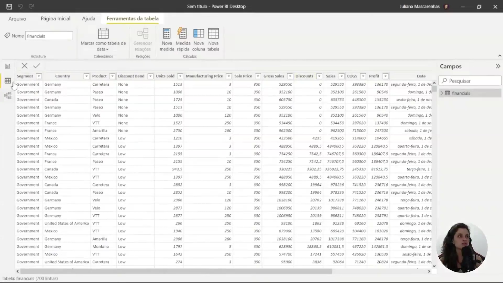
</p>

O processo de criação do dashboard começa com a validação dos dados na **Exibição de Tabela**. O conjunto de dados utilizado é o *Financial Sample*, que contém informações de vendas, segmentos e países. Antes de iniciar o design, é fundamental conferir se as colunas (como *Segment*, *Country*, *Product* e *Sales*) foram importadas corretamente.

```csv
"Segment","Country","Product","Discount Band","Units Sold","Manufacturing Price","Sale Price","Gross Sales","Discounts","Sales","COGS","Profit","Date"
"Government","Germany","Carretera","None","1513","3","350","529550","0","529550","393380","136170","segunda-feira, 1 de dezembro"
"Government","Germany","Paseo","None","1006","10","350","352100","0","352100","261560","90540","domingo, 1 de dezembro"
"Government","Canada","Paseo","None","1725","10","350","603750","0","603750","448500","155250","sexta-feira, 1 de novembro"

```

<p align="center">
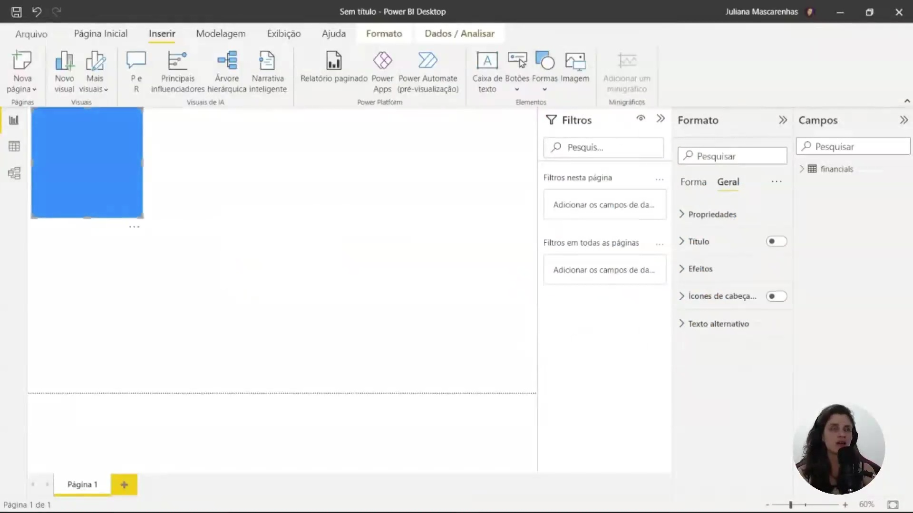
</p>

Após a conferência dos dados, acessamos a **Exibição de Relatório** (Canvas). Neste estágio inicial, a tela está em branco, servindo como a área de trabalho onde utilizaremos os elementos do menu "Inserir", como formas e caixas de texto, para estruturar o layout visual antes de adicionar os gráficos.

<p align="center">
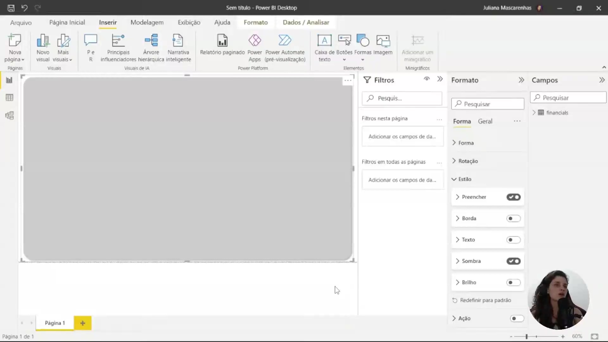
</p>

A construção do fundo do relatório é feita utilizando uma **Forma Retangular**. No painel de formatação, o raio dos cantos é ajustado (em aproximadamente 35) para criar um visual arredondado. A cor de preenchimento é definida como um cinza neutro e uma leve sombra é aplicada para dar profundidade ao elemento, destacando-o do fundo da página.

<p align="center">
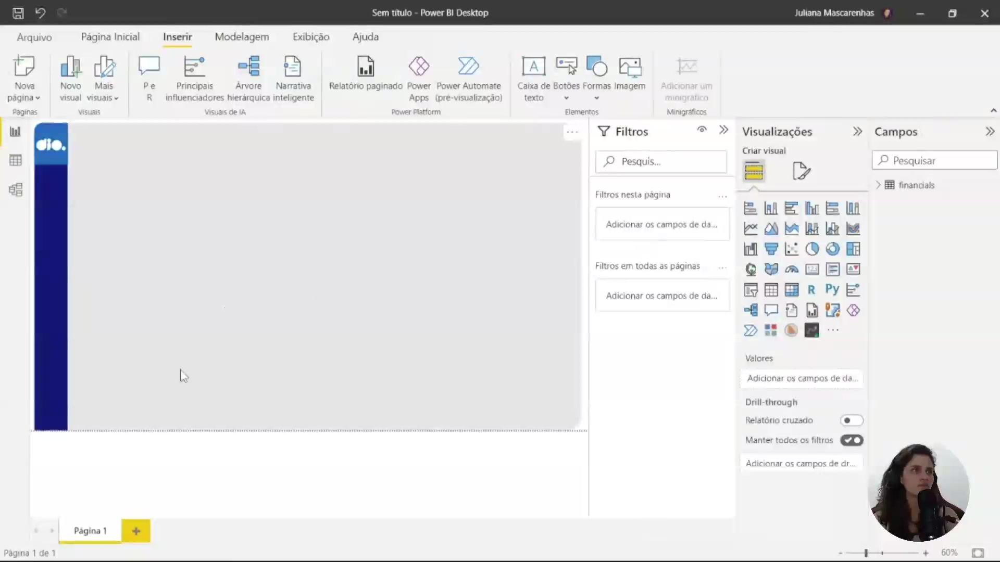
</p>

Para compor o cabeçalho, é inserida uma forma com o **canto superior direito arredondado**. Como a orientação original da forma nem sempre atende ao layout, utiliza-se a propriedade de **Rotação** (ajustada para 270°) no painel de Formato para inverter a posição da curva e encaixá-la no topo do dashboard.

<p align="center">
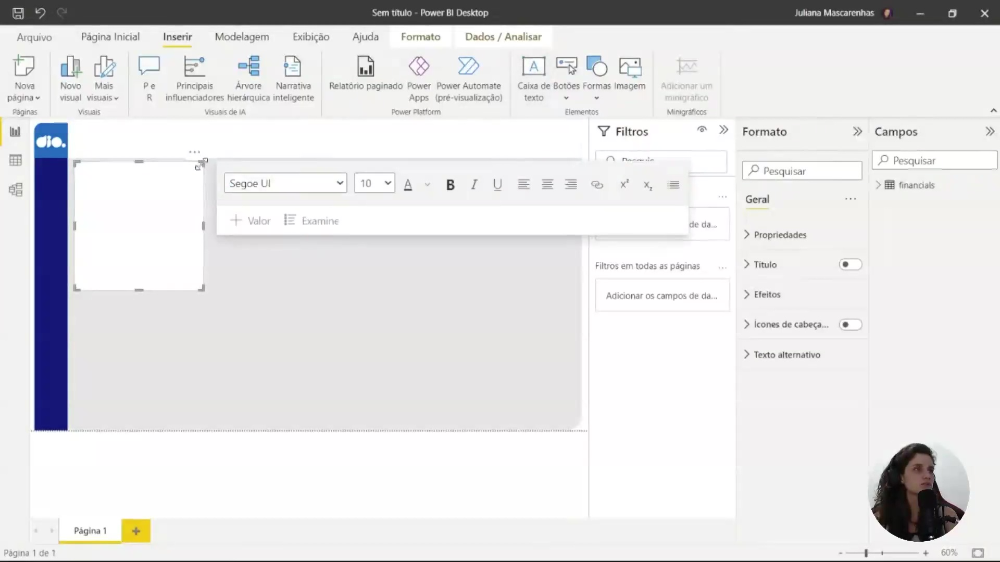
</p>

A identidade visual é reforçada com a sobreposição de formas. Utiliza-se um tom de azul mais escuro para a base do cabeçalho e uma forma menor, em azul mais claro, posicionada logo acima. Essa técnica de camadas ajuda a criar um design mais sofisticado e dinâmico para a área de identificação do relatório.

<p align="center">
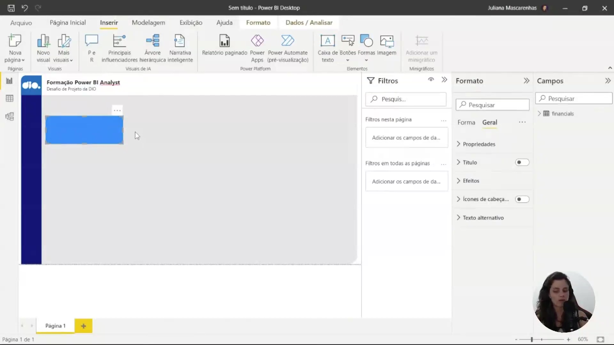
</p>

O logotipo da DIO é inserido para identificar o projeto. Diferente das formas nativas, imagens não possuem a mesma flexibilidade de rotação dentro do Power BI, portanto, o logo é redimensionado manualmente para se integrar perfeitamente ao espaço delimitado pelas formas azuis do cabeçalho.

<p align="center">
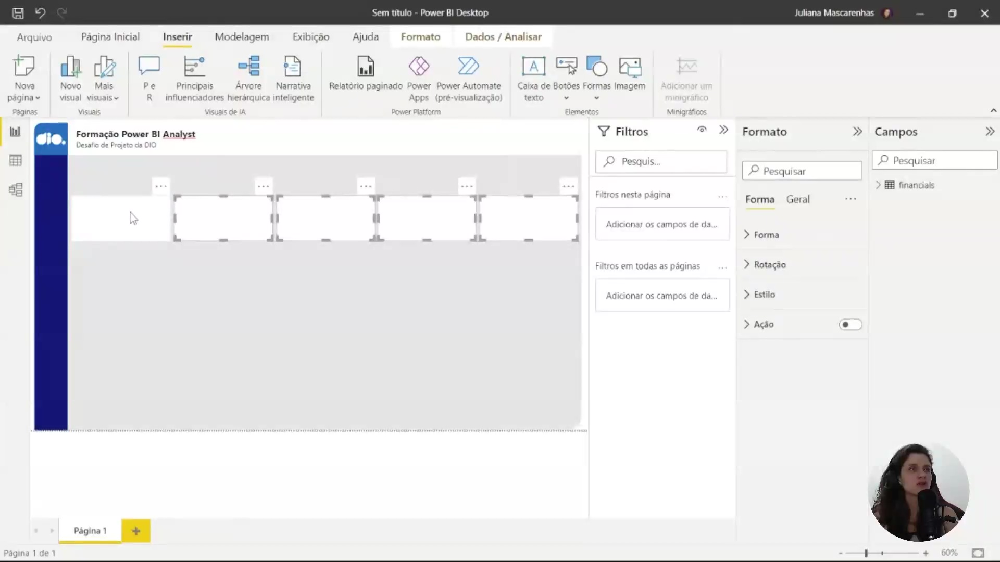
</p>

Uma faixa branca horizontal é adicionada abaixo do cabeçalho azul para servir de base para o título. Nela, insere-se uma **Caixa de Texto** com as informações "Formação Power BI Analyst" e "Desafio de Projeto da DIO", utilizando ajustes de tamanho de fonte e negrito para garantir a hierarquia da informação.

<p align="center">
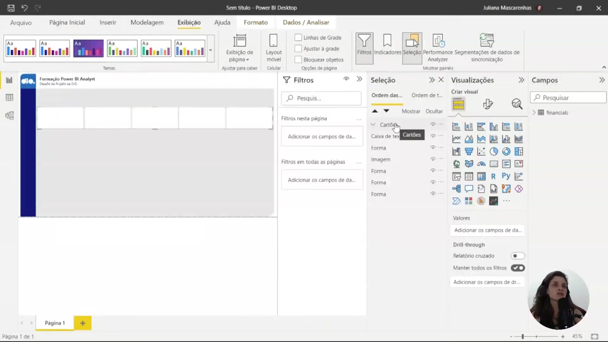
</p>

Com o aumento do número de elementos na tela, o **Painel de Seleção** (Menu Exibição > Seleção) torna-se essencial. Ele permite gerenciar todos os objetos inseridos (formas, imagens e caixas de texto), permitindo renomeá-los, alterar a ordem de sobreposição (frente/trás) ou ocultar itens temporariamente para facilitar o ajuste do layout.

<p align="center">
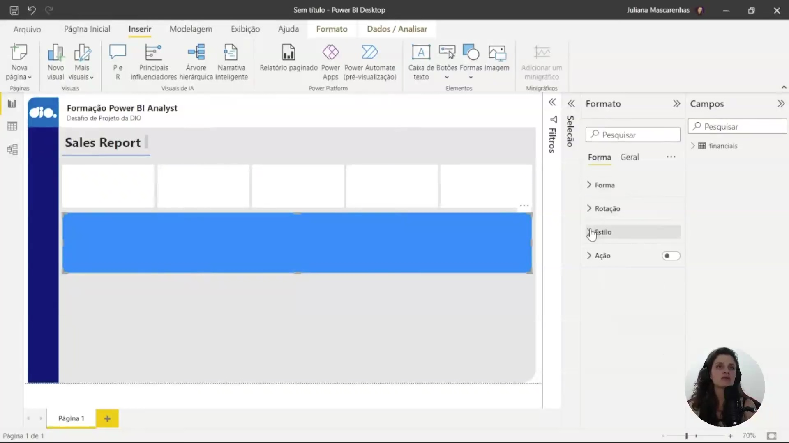
</p>

A fase seguinte envolve a criação de áreas para as métricas principais. O título principal do relatório, "**Sales Report**", é inserido em destaque. Abaixo dele, pequenas formas brancas retangulares são posicionadas horizontalmente para servir de base para os cartões de indicadores (KPIs) que exibirão os números totais das vendas.

<p align="center">
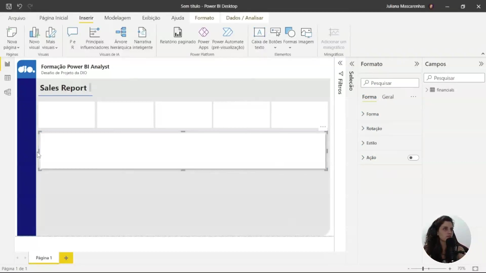
</p>

Para manter o projeto organizado, os elementos que compõem as métricas de topo são selecionados e **agrupados** através do painel de seleção. O grupo é renomeado para "Cartões", facilitando futuras manutenções ou a criação de interações que envolvam todo esse conjunto de objetos simultaneamente.

<p align="center">
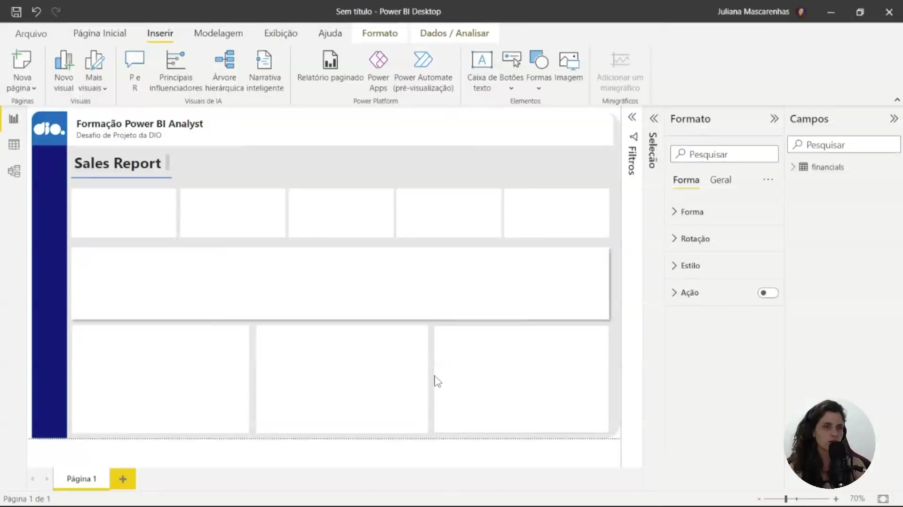
</p>

Uma **linha de separação** horizontal é inserida logo abaixo da área de títulos e métricas iniciais. Esse detalhe visual ajuda a delimitar as diferentes seções do dashboard, separando as informações de resumo (cabeçalho) da área de análise detalhada (corpo do relatório).

<p align="center">
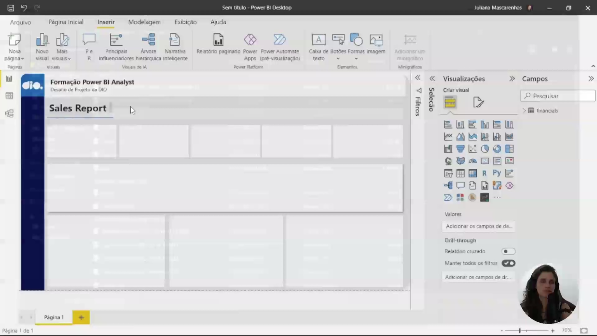
</p>

Containers principais são adicionados ao corpo do relatório utilizando formas retangulares brancas sem borda. Estes espaços são dimensionados para abrigar os futuros gráficos. Um destaque especial é dado ao container central, que recebe uma leve sombra para sobressair em relação aos demais, criando um ponto focal para a análise mais importante.

<p align="center">
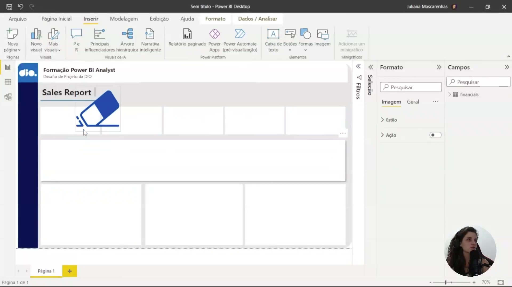
</p>

Um ícone de borracha azul é inserido no layout. Este elemento gráfico funcionará como um **botão de reset**, permitindo que o usuário limpe todos os filtros aplicados (como segmentações de dados) com um único clique, melhorando a experiência de navegação e usabilidade do dashboard.

<p align="center">
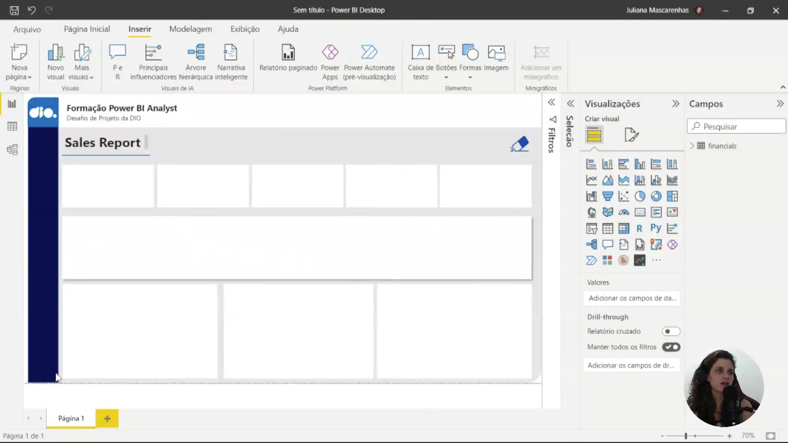
</p>

O "esqueleto" visual do relatório está concluído. Com todas as formas, containers, títulos e ícones de navegação devidamente posicionados e agrupados, o ambiente está preparado para a etapa final: a inserção dos visuais de dados e a configuração das métricas calculadas.


### 🟩 Vídeo 03 - Criando Gráficos da Primeira Página do Relatório

<video width="60%" controls>
  <source src="000-Midia_e_Anexos/bootcamp_ntt_data-modulo.06-curso.04-video_03.webm" type="video/webm">
    Seu navegador não suporta vídeo HTML5.
</video>

link do vídeo: https://web.dio.me/lab/criando-um-relatorio-de-vendas-elegante-com-power-bi/learning/e08d4a53-fe11-4c42-a8a7-3a92063c6058?back=/track/engenharia-dados-python

Este guia resume o processo de construção de um relatório dinâmico, desde a escolha dos gráficos iniciais até a personalização estética e funcional para uma melhor experiência do usuário.

### Anotações

<p align="center">
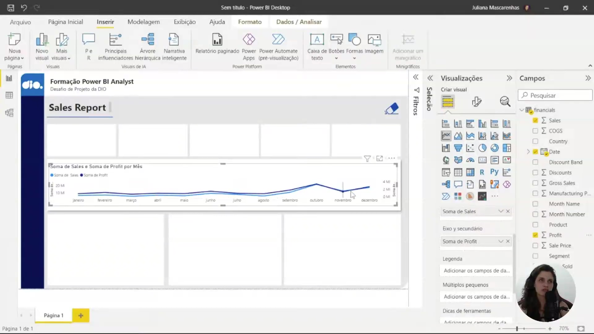
</p>

Para iniciar a construção do relatório de vendas, utiliza-se um gráfico de linhas para demonstrar a evolução dos dados ao longo do tempo. Neste cenário, as vendas (*Sales*) são plotadas mensalmente. É possível adicionar um eixo Y secundário para comparar métricas com grandezas diferentes, como *Sales* e *Profit*. Embora as curvas possam apresentar tendências similares, a diferença de escala (ordem de grandeza) entre o lucro e o valor total de vendas pode dificultar a visualização se não forem ajustadas adequadamente.

<p align="center">
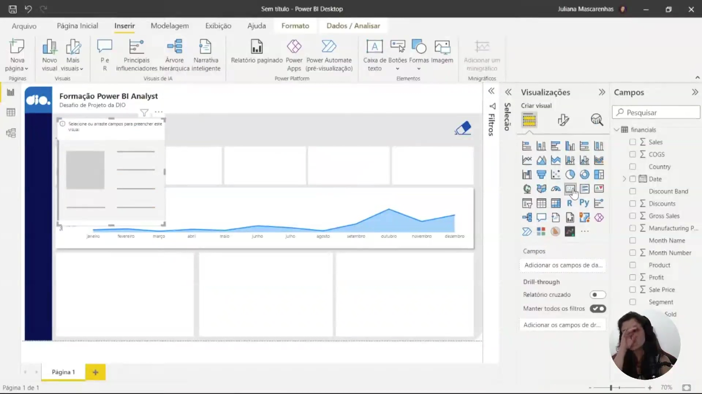
</p>

Opta-se por simplificar a visualização removendo a métrica de lucro (*Profit*) para focar exclusivamente nas vendas ao longo do período. O tipo de gráfico é alterado para um gráfico de área. Essa escolha visual permite não apenas acompanhar a variação temporal, mas também fornece uma noção mais clara da magnitude e intensidade do volume de vendas acumulado mês a mês.

<p align="center">
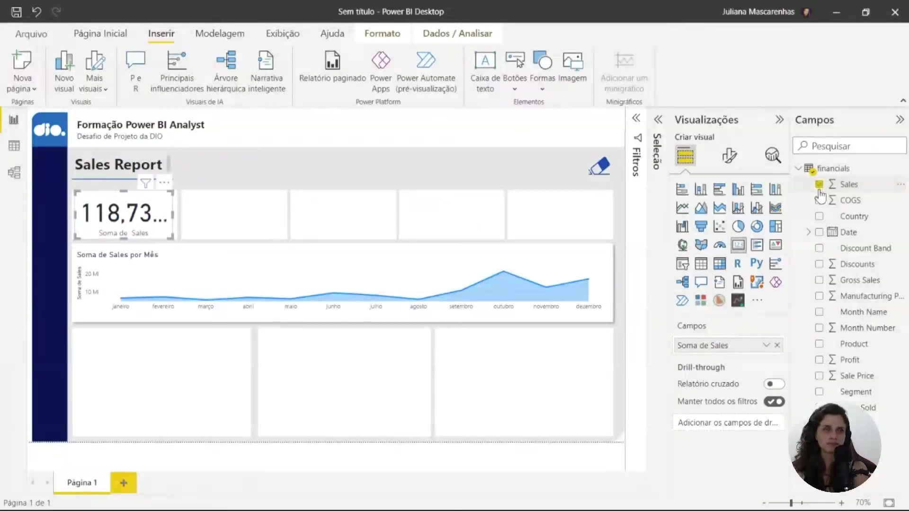
</p>

O próximo passo é a inserção de métricas de alto nível utilizando o visual de "Cartão" (*Card*). O objetivo é apresentar informações consolidadas de forma direta e simples. Inicialmente, cria-se um cartão para exibir o valor total de vendas (*Soma de Sales*), permitindo que o usuário obtenha o dado agregado instantaneamente ao visualizar o painel.

<p align="center">
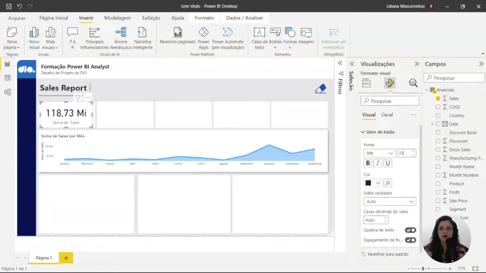
</p>

Após inserir o cartão, realiza-se a formatação visual para adequá-lo ao layout do relatório. No painel de formatação, ajustam-se as propriedades do "Valor do balão" (*Callout value*), como a redução do tamanho da fonte (neste caso, para 35) e a configuração das unidades de exibição. O cartão é redimensionado para ocupar o espaço reservado no topo do dashboard, preparando-o para ser replicado para outras métricas.

<p align="center">
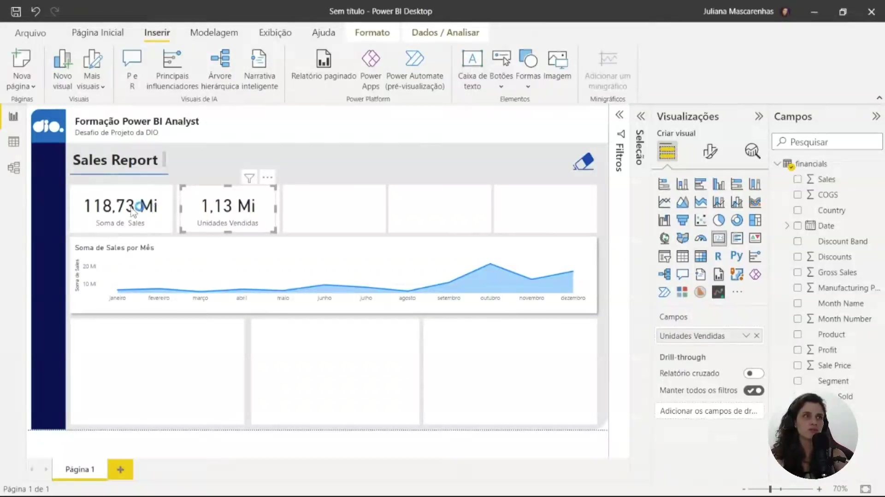
</p>

Para ganhar eficiência, o cartão já formatado é copiado e colado ao lado. Em seguida, altera-se apenas o campo de dados que alimenta o visual. O segundo cartão passa a exibir as "Unidades Vendidas" (*Units Sold*), mantendo a consistência visual de tamanho e fonte definida anteriormente. O título ou rótulo também pode ser ajustado para refletir a nova métrica.

<p align="center">
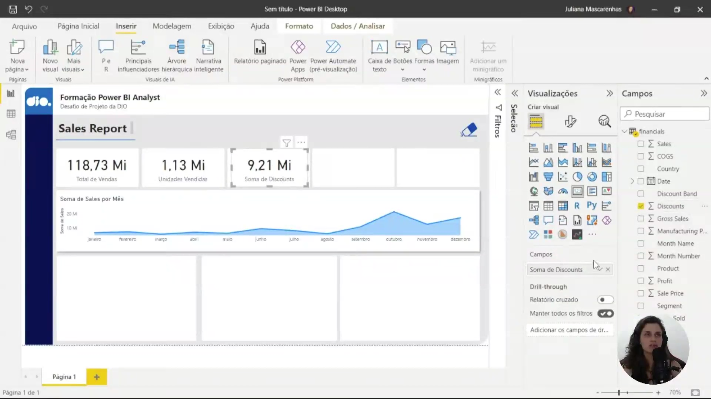
</p>

O processo de replicação continua para incluir outras métricas essenciais. Um terceiro cartão é adicionado para mostrar a "Soma de Discounts" (Total de descontos concedidos). Essa métrica permite analisar o volume de concessões financeiras realizadas ao longo do período analisado, compondo a linha de KPIs (*Key Performance Indicators*) no topo do relatório.

<p align="center">
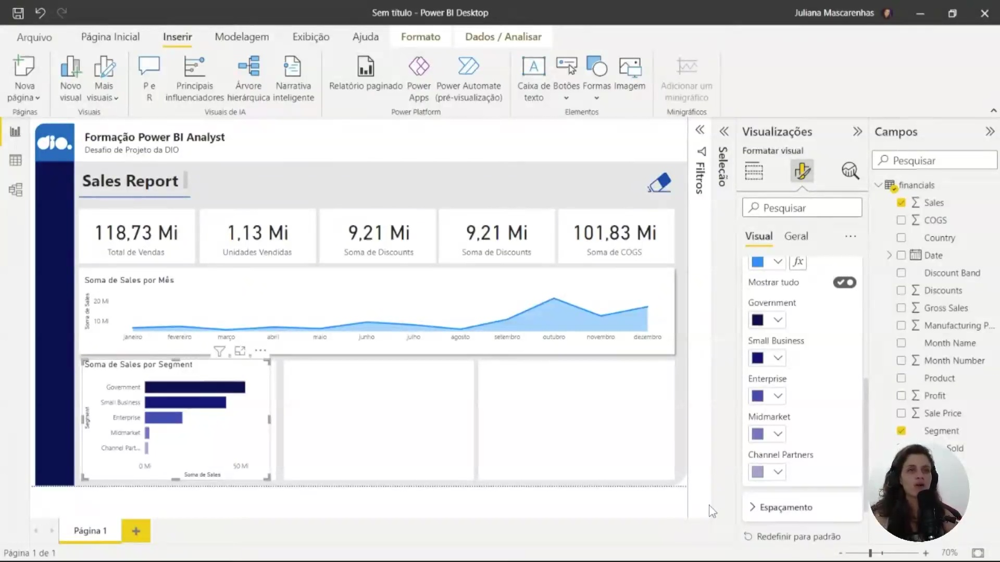
</p>

Com a linha de cartões finalizada (incluindo *Sales*, *Units Sold*, *Discounts* e *COGS*), inicia-se o preenchimento da área principal com gráficos detalhados. O primeiro visual adicionado é um gráfico de barras clusterizado para analisar as vendas por segmento (*Sales por Segment*). Inicialmente, o gráfico apresenta todas as barras na mesma cor, o que permite a visualização dos dados, mas ainda carece de refinamento estético para facilitar a leitura.

<p align="center">
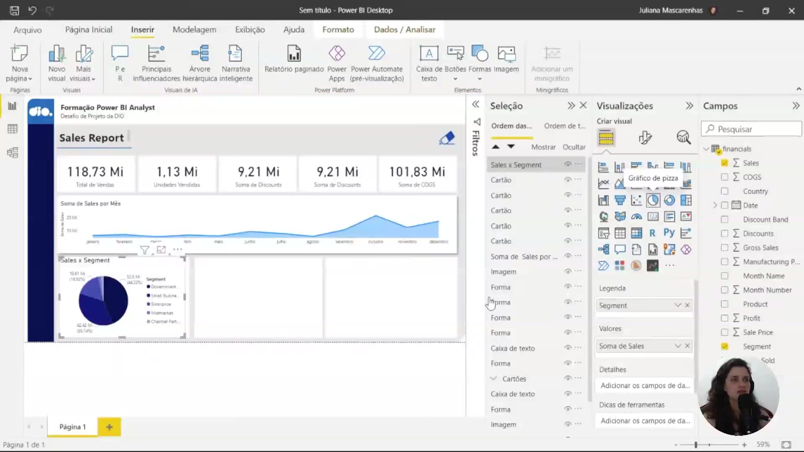
</p>

Para melhorar a legibilidade e destacar a hierarquia dos dados, aplica-se uma formatação condicional manual nas cores das barras. Define-se uma tonalidade mais escura para o segmento com maior volume de vendas (*Government*) e clareia-se gradualmente a cor para os segmentos subsequentes. Essa técnica visual torna evidente a classificação dos dados, permitindo que o usuário identifique rapidamente quais segmentos têm melhor e pior desempenho sem precisar ler os eixos detalhadamente.

<p align="center">
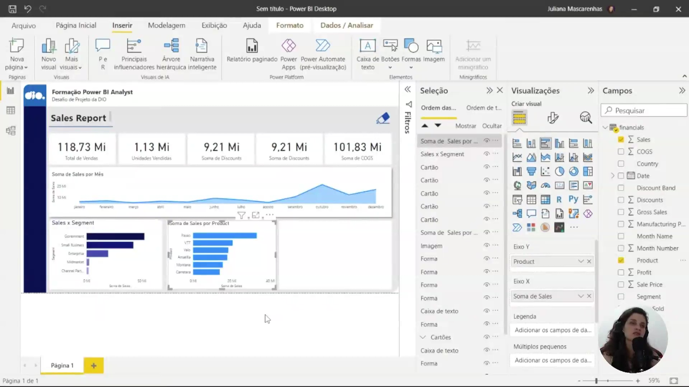
</p>

Adiciona-se mais um gráfico de barras, desta vez orientado horizontalmente, para analisar as vendas por produto (*Sales por Product*). A orientação horizontal é frequentemente preferida quando há rótulos de categorias mais longos, facilitando a leitura. O gráfico é posicionado ao lado do gráfico de segmentos.

<p align="center">
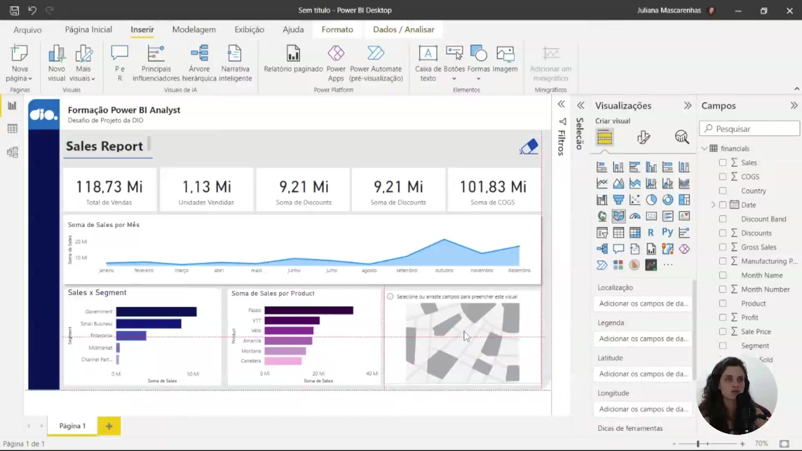
</p>

Seguindo a mesma lógica aplicada anteriormente, as cores do gráfico de produtos são personalizadas. Utiliza-se uma paleta de roxos/rosas, onde o produto com maior venda (*Paseo*) recebe a cor mais forte, criando um gradiente visual até o produto com menor venda. Isso mantém a consistência de design do relatório, onde a intensidade da cor reflete a magnitude do valor.

<p align="center">
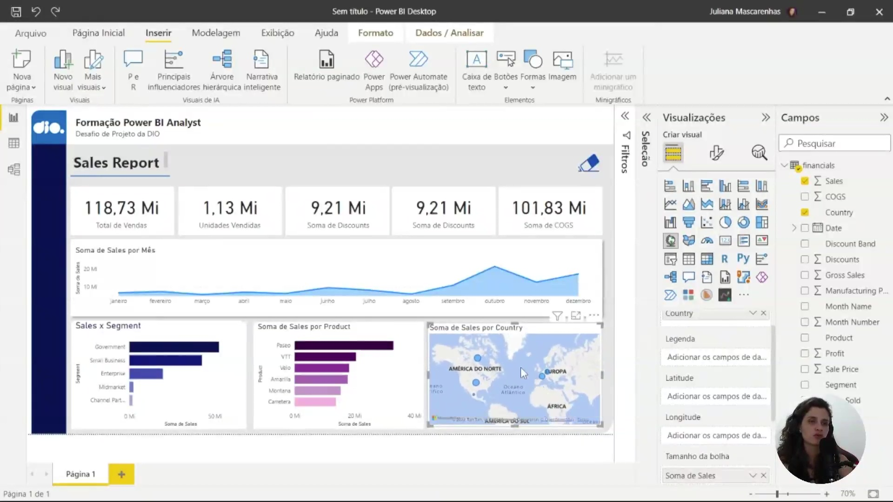
</p>

O último elemento visual adicionado à página é um gráfico de mapa (*Map*). Ele é configurado para mostrar as vendas por país (*Sales por Country*), utilizando o tamanho das bolhas para representar o volume de vendas em cada localidade. Esse visual fornece uma perspectiva geográfica dos dados, complementando as análises temporal, por segmento e por produto já existentes.

<p align="center">
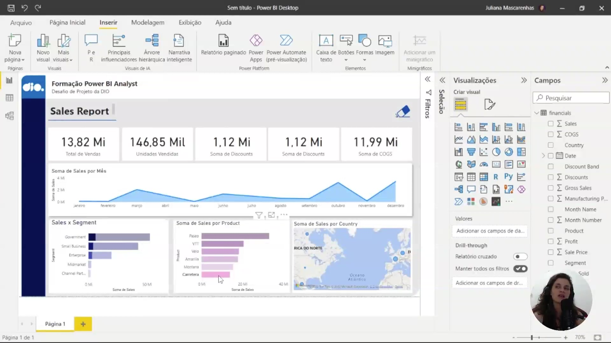
</p>

Com o dashboard estruturado, demonstra-se o poder de interatividade do Power BI. Ao clicar em um item específico, como o produto "Paseo" no gráfico de barras central, todos os outros visuais (mapa, gráfico de linha, cartões e gráfico de segmentos) são automaticamente filtrados e realçados para refletir apenas os dados correspondentes a essa seleção (*cross-filtering*). Isso permite uma análise profunda (*dig in*) e transparente das proporções e do desempenho específico de cada elemento dentro do contexto geral.      


### 🟩 Vídeo 04 - Criando o Segmentador e Visuais Alternativos

<video width="60%" controls>
  <source src="000-Midia_e_Anexos/bootcamp_ntt_data-modulo.06-curso.04-video_04.webm" type="video/webm">
    Seu navegador não suporta vídeo HTML5.
</video>

link do vídeo: https://web.dio.me/lab/criando-um-relatorio-de-vendas-elegante-com-power-bi/learning/04960d21-e3fb-4765-90bf-26024871691f

Este tutorial foca na etapa de polimento e organização de um dashboard no Power BI. O conteúdo abrange desde a criação de filtros (segmentadores) e botões personalizados até a estruturação lógica das camadas do relatório para facilitar a interatividade futura.

### Anotações

<p align="center">
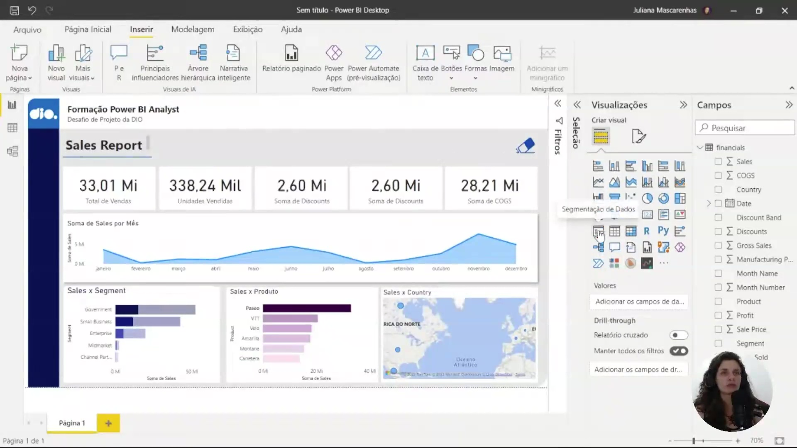
</p>

Nesta etapa, o foco está na organização dos elementos que compõem o filtro de data. Após criar o segmentador de dados, remover cabeçalhos e ajustar a formatação, foi inserida uma caixa de texto com o título "Selecione a data" e um ícone de borracha (imagem "Clean") sobreposto por um botão transparente para limpar os filtros.

A imagem destaca o painel **Seleção** à direita, onde todos esses elementos — o botão, a caixa de texto, o segmentador ("Date") e a imagem — foram selecionados e unidos em um único grupo nomeado como **"Filtro por data"**. Esse agrupamento é essencial para manter o relatório organizado e facilitar a manipulação conjunta desses objetos.

<p align="center">
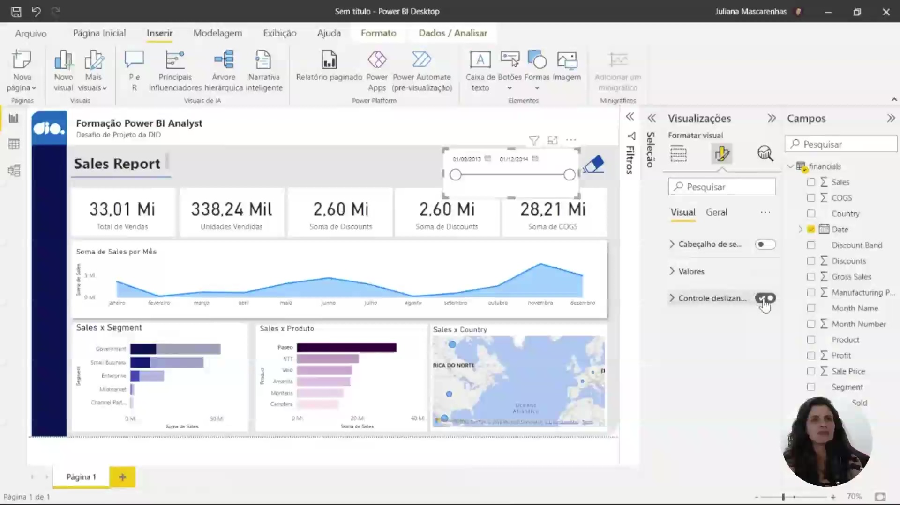
</p>

Aqui, inicia-se o processo de criação de visuais alternativos para permitir a troca dinâmica de gráficos posteriormente. Foi criada uma cópia do gráfico de barras de vendas por segmento, que foi alterada para um gráfico de Pizza (ou Donut).

No painel de **Seleção**, observa-se a renomeação cuidadosa dos itens para diferenciar as visualizações. O novo gráfico foi nomeado como **"Pie"** (ou similar), enquanto o original de barras foi identificado como **"Sales Segment Bar"**. Essa distinção de nomenclatura é fundamental para a configuração correta dos indicadores (bookmarks) que controlarão qual gráfico é exibido para o usuário.

<p align="center">
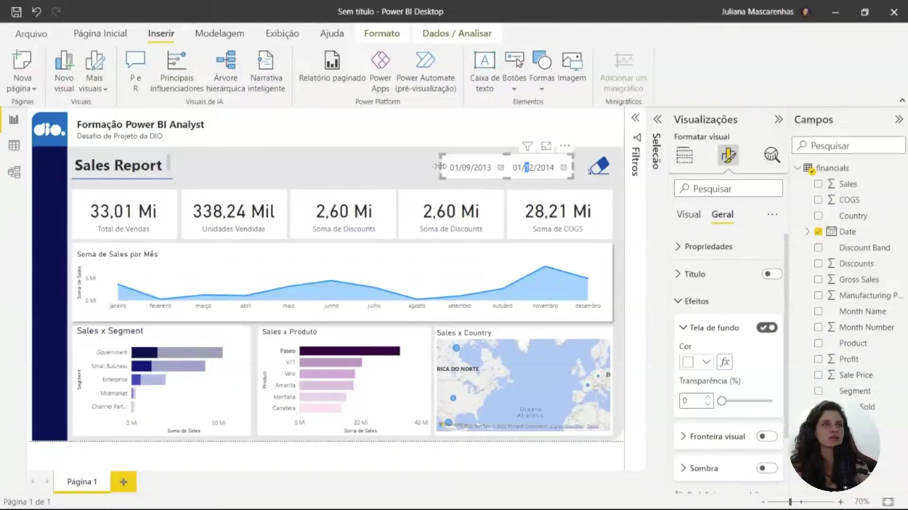
</p>

Seguindo a lógica de visuais alternativos, esta imagem mostra a manipulação do gráfico de vendas por país ("Sales x Country"). A instrutora mantém o visual de Mapa para uma das visões, permitindo a análise geográfica da distribuição de vendas.

O painel de formatação e o painel de seleção estão sendo utilizados para ajustar as propriedades e garantir que este elemento esteja devidamente identificado (neste caso, como **"Map"**). Isso prepara o terreno para que ele possa ser alternado com outro tipo de visualização (como um *Tree Map* ou gráfico de barras) dependendo da interação do usuário com os botões de navegação.

<p align="center">
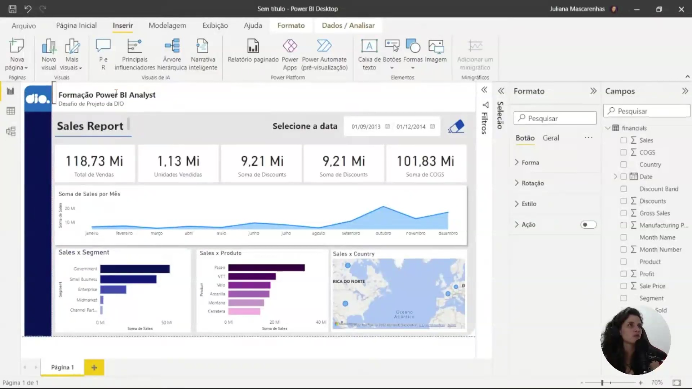
</p>

A imagem final desta sequência exibe a organização avançada no painel **Seleção**. Todos os pares de gráficos criados (o original e sua alternativa) foram organizados em grupos hierárquicos.

Podemos ver grupos como **"Sales por país"** (contendo o mapa e sua alternativa) e **"Sales Segmento"** (contendo o gráfico de barras e o gráfico de pizza). Essa estrutura de agrupamento é o passo final de preparação antes da criação dos *Bookmarks* (Indicadores), pois permite controlar a visibilidade de conjuntos inteiros de visuais de forma lógica e estruturada.      


### 🟩 Vídeo 05 - Criando os Botões do Relatórios e utilizando Indicadores para Gravar Estado do Relatório

<video width="60%" controls>
  <source src="000-Midia_e_Anexos/bootcamp_ntt_data-modulo.06-curso.04-video_05.webm" type="video/webm">
    Seu navegador não suporta vídeo HTML5.
</video>

link do vídeo: https://web.dio.me/lab/criando-um-relatorio-de-vendas-elegante-com-power-bi/learning/657f2b8b-f566-42bb-89f9-3b2735d96129

Este tutorial foca na criação de uma interface de usuário dinâmica dentro do Power BI. O objetivo principal é permitir que o usuário alterne entre diferentes tipos de visualizações (gráficos de mapa, treemap, pizza e barras) usando botões personalizados e a funcionalidade de Indicadores (Bookmarks).

### Anotações

<p align="center">
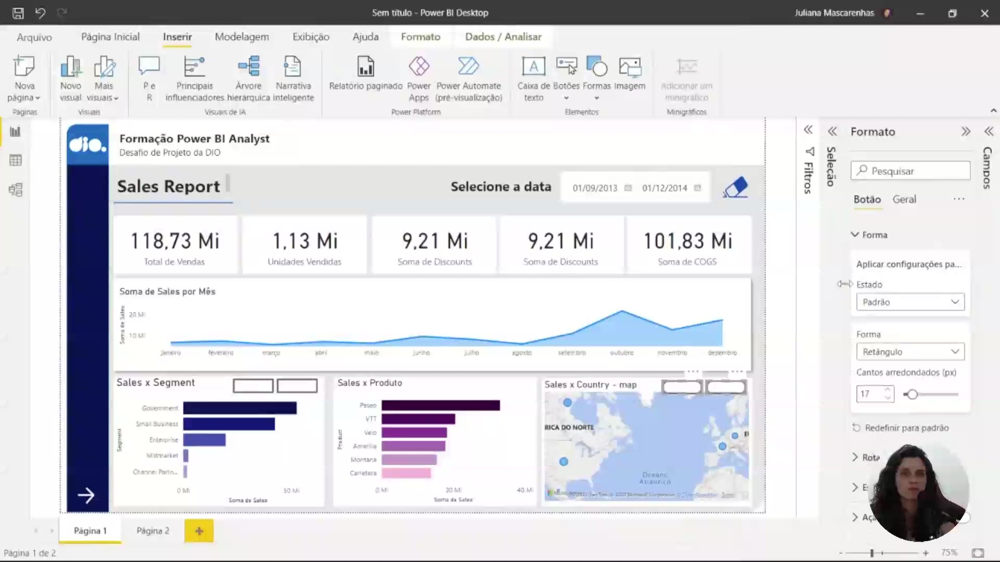
</p>

Nesta etapa inicial, é inserida uma seta que servirá como botão de navegação para a próxima página do relatório. No painel de formato, as propriedades do ícone são ajustadas, alterando a cor para branco para garantir contraste e visibilidade sobre o plano de fundo do dashboard. O objetivo é que este elemento aponte claramente a direção da continuidade do fluxo de dados.

<p align="center">
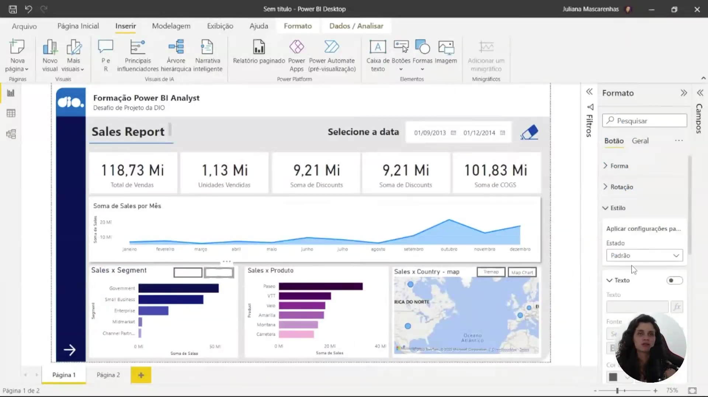
</p>

Após a configuração da seta, inicia-se a criação dos botões em branco que atuarão como seletores de visuais. O foco aqui é a formatação do estilo do botão, especificamente para a visualização de "Map Chart". São definidos detalhes como o texto do botão e ajustes na fonte, preparando a interface para receber múltiplos seletores que, embora possam variar levemente em proporção manual, manterão a funcionalidade de alternância.

<p align="center">
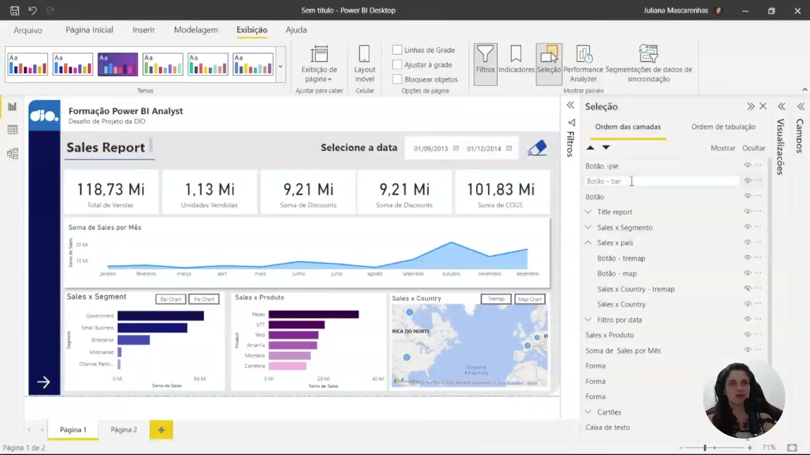
</p>

Os botões "Map Chart" e "Treemap Chart" são posicionados e formatados com textos claros. A configuração busca manter um design reto e consistente com os demais elementos do relatório. Estes botões servirão de gatilho para trocar a visualização de vendas por país ("Sales x Country"), permitindo que o usuário escolha entre a representação em mapa geográfico ou em blocos proporcionais (treemap).

<p align="center">

</p>

Além dos botões de mapa, são criados os botões "Pie Chart" e "Bar Chart" para a seção de vendas por segmento ("Sales by Segment"). O processo de formatação é repetido, adicionando texto e ajustando o tamanho da fonte. Com todos os botões posicionados, a interface agora possui os elementos físicos necessários para a implementação da interatividade via indicadores.

<p align="center">
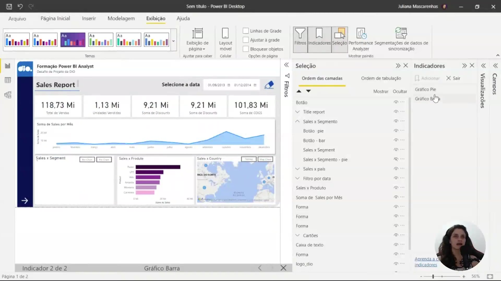
</p>

Nesta fase, o painel de "Indicadores" (bookmarks) é utilizado para criar estados específicos do relatório. São adicionados os indicadores "Grafico Pie" e "Grafico Barra". O procedimento consiste em usar o painel de "Seleção" para ocultar um gráfico e mostrar outro, capturando esse estado exato para que os botões possam alternar entre a visão de pizza e a visão de barras dinamicamente.

<p align="center">
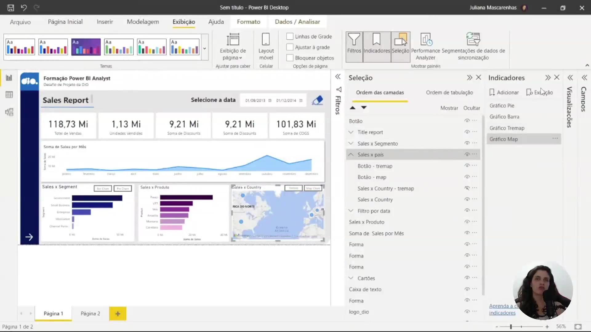
</p>

A lista de indicadores é expandida para contemplar as visões geográficas, com a criação dos nomes "Gráfico Tremap" (sic) e "Grafico Map". A organização no painel de seleção é crucial aqui: para o indicador de mapa, o visual de treemap deve estar oculto, e vice-versa. Essa gestão de camadas garante que um gráfico não fique sobreposto ao outro de forma desordenada durante a navegação.

<p align="center">
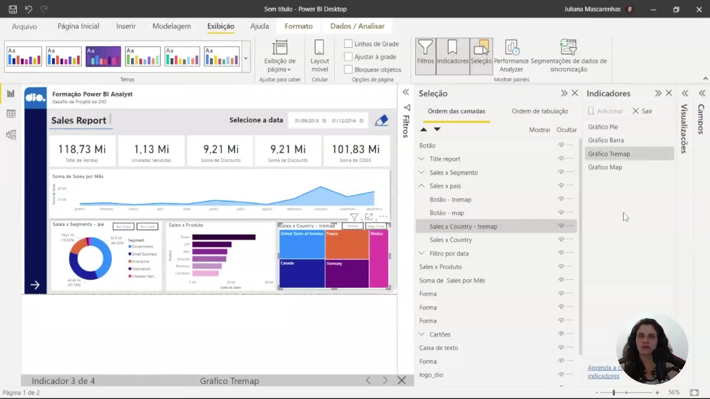
</p>

A imagem demonstra a atualização do indicador para o "Gráfico Tremap". Com o visual de Treemap devidamente selecionado e visível no palco do Power BI, o indicador registra essa configuração. Nomes explicativos são fundamentais neste momento para facilitar a associação posterior entre o botão físico e a ação que ele deve executar.

<p align="center">
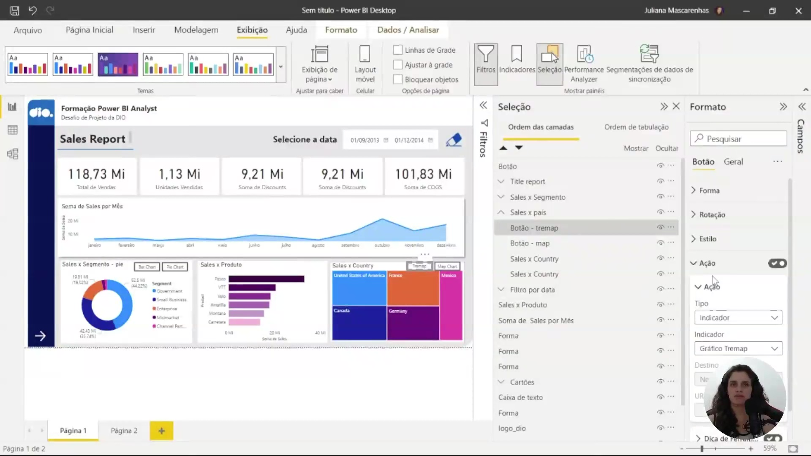
</p>

Neste ponto, realiza-se a ativação da "Ação" para os botões. Ao selecionar um botão, como o de Treemap, define-se o tipo de ação como "Indicador" e seleciona-se o destino correspondente (ex: "Gráfico Tremap"). Este passo conecta a interface visual à lógica de exibição configurada nos passos anteriores, permitindo que o clique do usuário execute a troca de visuais.

<p align="center">
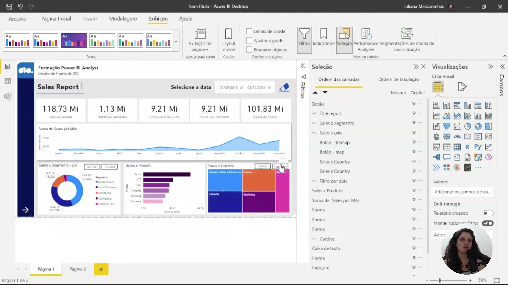
</p>

O resultado final apresenta o dashboard interativo em pleno funcionamento. Ao testar os botões (utilizando Ctrl + Clique no Desktop), os gráficos alternam instantaneamente. A configuração de "apenas visão selecionada" nos indicadores é destacada como uma boa prática, pois permite que a troca de um gráfico (como mudar de pizza para barra) ocorra sem interferir em outros filtros ou seleções ativos no restante do relatório.      


### 🟩 Vídeo 06 - Criando a Interação por Botões com a Segunda Página do Relatório

<video width="60%" controls>
  <source src="000-Midia_e_Anexos/bootcamp_ntt_data-modulo.06-curso.04-video_06.webm" type="video/webm">
    Seu navegador não suporta vídeo HTML5.
</video>

link do vídeo: https://web.dio.me/lab/criando-um-relatorio-de-vendas-elegante-com-power-bi/learning/56b095fb-8ba6-4dfe-94c7-c4d2e5616195

O vídeo descreve a finalização de um desafio de criação de relatórios interativos, focando em duas funcionalidades essenciais: a navegação entre páginas e a implementação de um botão para limpar filtros e seleções. O objetivo é criar uma experiência de usuário fluida e eficiente.

### Anotações

<p align="center">
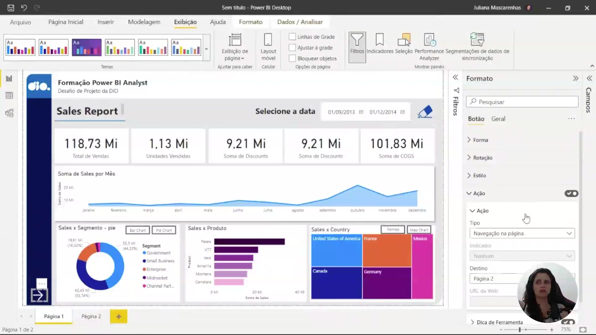
</p>

Nesta etapa do relatório de vendas (**Sales Report**), o foco é a implementação de interatividade através da navegação entre páginas. Para facilitar a experiência do usuário, utiliza-se um ícone de seta que servirá como botão de navegação. A configuração é feita selecionando o objeto e acessando o painel de **Formato**, onde a seção **Ação** é ativada.

Para configurar o redirecionamento:

* **Tipo**: Selecione **Navegação na página**.
* **Destino**: Defina a **Página 2**.

Essa abordagem é preferível em relação ao uso de indicadores para mudanças simples de tela, permitindo que o usuário transite entre diferentes visões do relatório de forma direta.

<p align="center">
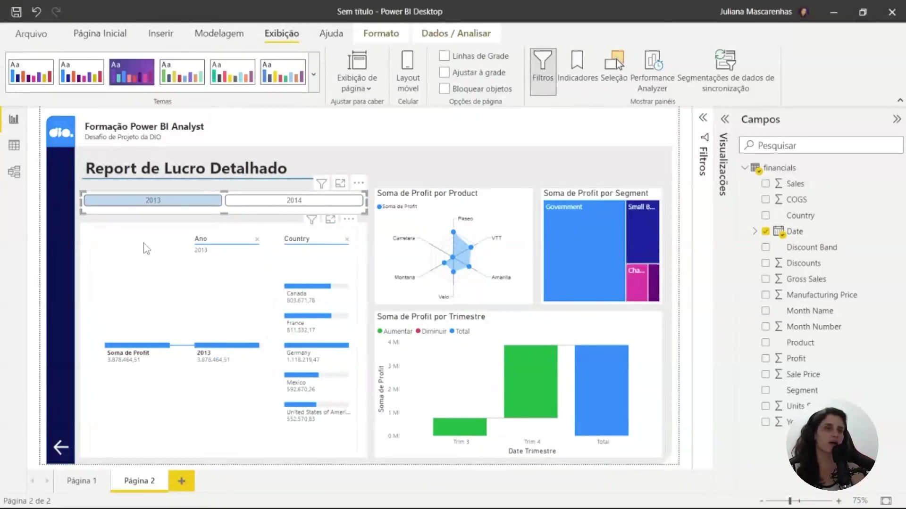
</p>

O **Report de Lucro Detalhado** (Página 2) apresenta visuais complementares que exploram a rentabilidade. Entre os destaques estão:

* **Soma de Profit por Product**: Um gráfico de radar (radar chart) que demonstra a proporção do volume de lucro entre diferentes produtos, facilitando a identificação de tendências e predominâncias.
* **Soma de Profit por Segment**: Um gráfico de compartimentação (*treemap*) que organiza o lucro por categorias como *Government* e *Small Business*.
* **Soma de Profit por Trimestre**: Um gráfico de cascata que exibe as variações positivas e negativas do lucro ao longo dos períodos.

A árvore hierárquica à esquerda permite filtrar esses dados por ano (2013/2014) e país, ajustando dinamicamente todos os visuais da página.

<p align="center">
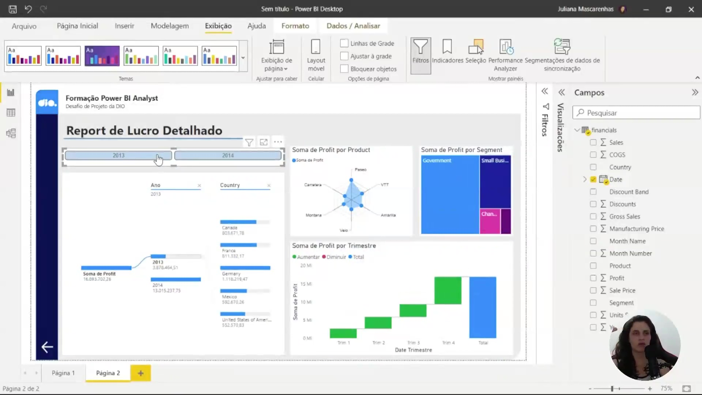
</p>

Ao interagir com a árvore hierárquica, é possível observar mudanças drásticas na composição do lucro. Por exemplo, ao selecionar o ano de **2014**, nota-se uma predominância muito acentuada do segmento governamental (*Government*) em comparação ao ano de **2013**, onde a distribuição entre os segmentos era mais equilibrada.

Para retornar à página principal, utiliza-se o botão de seta invertida posicionado no canto inferior esquerdo, configurado com uma **Ação** de **Navegação na página** apontando para a **Página 1**.

<p align="center">
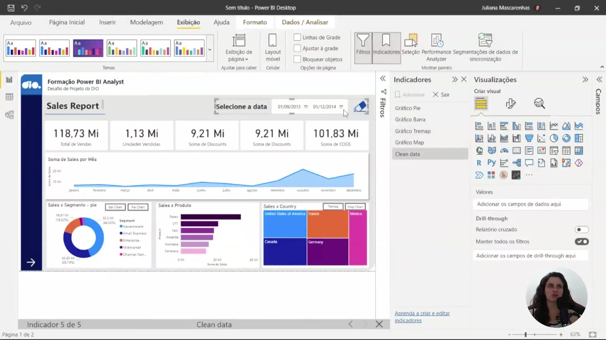
</p>

Para gerenciar filtros complexos, como intervalos de datas e seleções múltiplas, utiliza-se o recurso de **Indicadores** (Bookmarks). Nesta interface, foi criado um indicador chamado **Clean data**, associado a um ícone de borracha.

A configuração do botão de reset segue estes passos:

1. Limpe todos os filtros e seleções para deixar o relatório no estado inicial.
2. No painel de **Indicadores**, adicione um novo e nomeie-o como `Clean data`.
3. Selecione o botão da borracha e, em **Formato** > **Ação**, defina o tipo como **Indicador** e escolha o `Clean data`.

Isso permite que o usuário resete instantaneamente todas as visualizações do dashboard para o estado original, independentemente de quantas segmentações tenham sido aplicadas.      


### 🟩 Vídeo 07 - Publicando Relatório no Power BI Service e Considerações Finais

<video width="60%" controls>
  <source src="000-Midia_e_Anexos/bootcamp_ntt_data-modulo.06-curso.04-video_07.webm" type="video/webm">
    Seu navegador não suporta vídeo HTML5.
</video>

link do vídeo: https://web.dio.me/lab/criando-um-relatorio-de-vendas-elegante-com-power-bi/learning/3d122e34-d704-4a6a-a51c-7f376d83ecd7

### 🟩 Vídeo 08 - Entendendo o desafio

<video width="60%" controls>
  <source src="000-Midia_e_Anexos/bootcamp_ntt_data-modulo.06-curso.04-video_08.webm" type="video/webm">
    Seu navegador não suporta vídeo HTML5.
</video>

link do vídeo: https://web.dio.me/lab/criando-um-relatorio-de-vendas-elegante-com-power-bi/learning/3d122e34-d704-4a6a-a51c-7f376d83ecd7?back=/play

Este vídeo demonstra o processo de publicação de um relatório Power BI Desktop para o serviço Power BI, abordando desafios comuns com visuais personalizados e a importância da resolução de problema

### Anotações

<p align="center">
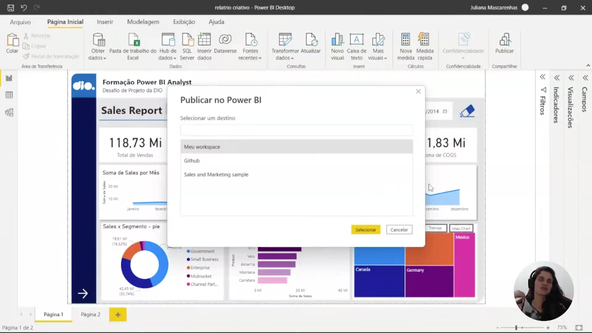
</p>

O processo de publicação de um relatório no Power BI Desktop começa pela guia **Página Inicial**, selecionando a opção **Publicar**. Antes de concluir o envio para a nuvem, o sistema solicita que as alterações recentes sejam salvas no arquivo local (neste caso, o arquivo `relatório criativo`). Após salvar, o usuário deve selecionar o destino da publicação, como o "Meu workspace" ou outros workspaces disponíveis caso possua uma licença Pro ou esteja em um período de teste gratuito.

<p align="center">
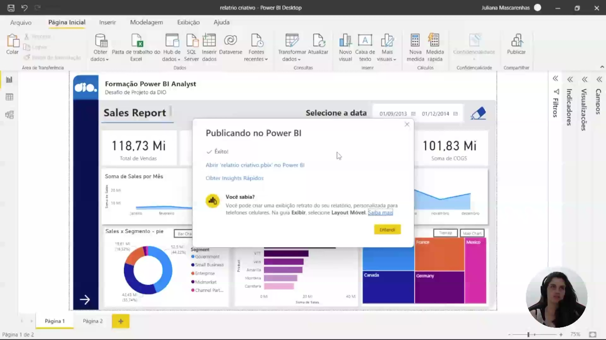
</p>

Após o término do carregamento, o Power BI exibe uma mensagem de sucesso confirmando a publicação. A partir desse momento, o relatório deixa de ser apenas um arquivo local `.pbix` e passa a estar disponível no **Power BI Serviço (Web)**. O diálogo de confirmação oferece links diretos para abrir o relatório no navegador ou obter insights rápidos sobre os dados publicados.

<p align="center">
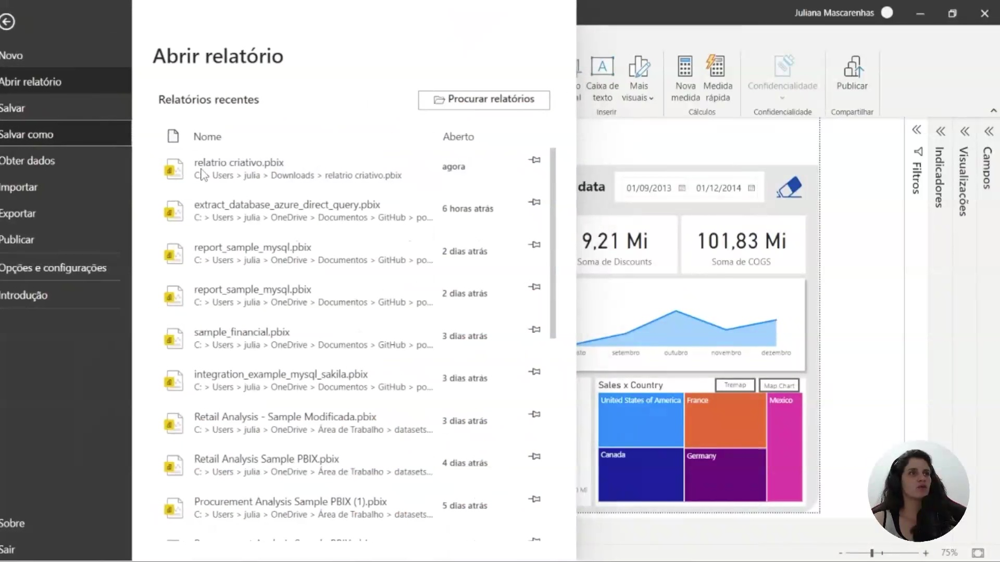
</p>

No ambiente web, é comum encontrar desafios com **visuais personalizados** (como o Radar Chart). Caso um visual não seja exibido corretamente por questões de permissão ou configuração de segurança, o usuário pode entrar no modo **Editar** diretamente no navegador. Muitas vezes, uma simples interação ou ajuste no segmentador de dados força a atualização do componente visual, normalizando a exibição para o modo de leitura e permitindo a navegação completa entre as páginas do relatório.

<p align="center">
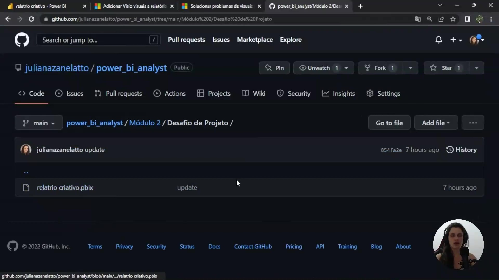
</p>

Para concluir o projeto e submetê-lo para análise, o arquivo deve ser organizado em um repositório no **GitHub**. É fundamental incluir não apenas o arquivo `.pbix` salvo na pasta local sincronizada, mas também elementos que comprovem a execução, como capturas de tela do relatório publicado no Power BI Serviço e a base de dados utilizada. A estrutura do repositório deve refletir os módulos do curso, garantindo que todos os visuais, botões e indicadores criados estejam devidamente documentados no arquivo README.

```bash
# Exemplo de caminho de diretório para organização do desafio
julianazanelatto / power_bi_analyst
└── Módulo 2
    └── Desafio de Projeto
        ├── relatrio criativo.pbix
        ├── figuras/
        └── base_de_dados/

```      

## Detalhes o Desafio
 
Agora é a sua hora de brilhar e construir um perfil de destaque na DIO! Explore todos os conceitos explorados até aqui e replique (ou melhore, porque não?) este projeto prático. Para isso, crie seu próprio repositório e aumente ainda mais seu portfólio de projetos no GitHub, o qual pode fazer toda diferença em suas entrevistas técnicas 😎
 
Neste repositório, insira todos os links e arquivos necessários para seu projeto, seja um arquivo de banco de dados ou um link para o template no Figma.
 
Dica: Se o expert forneceu um repositório Github, você pode dar um "fork" no repositório dele para organizar suas alterações e evoluções mantendo uma referência direta ao código-fonte original.
 
Instruções de Entrega do Desafio
Descrição do desafio: Você irá criar um relatório mais elaborado com base na sample financials do Power BI. Os arquivos de dados estão disponíveis no github: 

https://github.com/julianazanelatto/power_bi_analyst 

Fiquem atentos a: 

- Estrutura definida 
- Botões de navegação que fornecem navegabilidade 
- Segmentadores utilizados e botões com imagem associado 
- Utilize os indicadores e botões para selecionar diferentes visuais sobre um mesmo assunto 
- Utilize os vídeos de passo a passo para criação dos elementos que compõem a primeira página do relatório: 
- Objetos que definem o layout do relatório 
- Gráficos (visuais) e os campos que os compõem 
- Botões para navegabilidade 
- Segmentadores de dados 

## Entrega do Desafio 

- Link do repositório: https://github.com/ahaerdy/DIO-powerbi-financial-analysis

# Certificado: Criando Um Relatório Gerencial de Vendas com Power BI

Link do certificado: https://hermes.dio.me/certificates/Y56KZQRD.pdf
Certificado em PDF: [Certificado-Criando_Um_Relatorio_Gerencial_de_Vendas_com_Power_BI.pdf](000-Midia_e_Anexos/Certificado-Criando_Um_Relatorio_Gerencial_de_Vendas_com_Power_BI.pdf)
