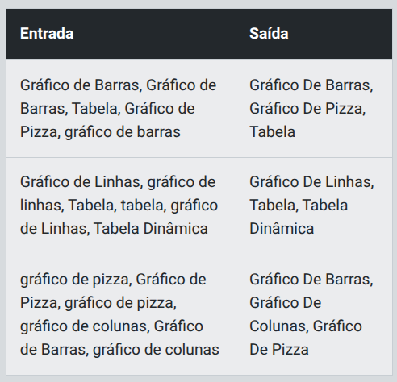

## Instrutor:

- Juliana Mascarenhas (Tech Education Specialist / Sócia (Content Creator) @SimplificandoRedes / Me Modelagem Computacional / Cientista de dados)
- Contato Linkedin: / [juliana-mascarenhas-ds](https://www.linkedin.com/in/juliana-mascarenhas-ds/)


# Desafio 1 - Filtragem de Visuais 

## Descrição

Descrição
Você tem uma lista de tipos de visuais e precisa processar essa lista para remover duplicatas e normalizar os nomes dos visuais. O objetivo é garantir que cada visual apareça apenas uma vez na lista e que todos os nomes estejam em um formato uniforme.

1. Remover Duplicatas: É comum em listas que certos itens apareçam mais de uma vez. Para evitar isso, precisamos garantir que cada tipo de visual apareça apenas uma vez na lista final.
2. Normalizar Nomes: Quando os usuários digitam nomes, eles podem usar diferentes formatos de capitalização (maiúsculas e minúsculas). Por exemplo, "gráfico de barras" e "Gráfico de Barras" são essencialmente o mesmo visual, mas escritos de maneiras diferentes. Precisamos padronizar esses nomes para que todos sigam o mesmo formato, facilitando a comparação e a remoção de duplicatas.

Para normalizar os nomes, vamos usar a capitalização do tipo "Título Capitalizado", onde a primeira letra de cada palavra é maiúscula e as demais letras são minúsculas. Por exemplo, "gráfico de barras" se tornará "Gráfico De Barras".

## Entrada

O usuário irá fornecer uma lista de tipos de visuais como uma única string, onde cada visual é separado por vírgulas. A lista pode conter visuais repetidos ou escritos de maneira inconsistente.

## Saída

Uma lista com visuais únicos e normalizados.

## Exemplos

A tabela abaixo apresenta exemplos com alguns dados de entrada e suas respectivas saídas esperadas. Certifique-se de testar seu programa com esses exemplos e com outros casos possíveis.

<p align="center">
  
</p>

> Atenção: É extremamente importante que as entradas e saídas sejam exatamente iguais às descritas na descrição do desafio de código. 

## Solução

```python
def filtrar_visuais(lista_visuais):
    # Converter a string de entrada em uma lista
    visuais = lista_visuais.split(", ")
    
    # TODO: Normalize e remova duplicatas usando um conjunto
    visuais_normalizados = set()
    for visual in visuais:
        # Normalizar para Title Case (primeira letra de cada palavra maiúscula)
        visual_normalizado = visual.title()
        visuais_normalizados.add(visual_normalizado)
    
    # TODO: Converta o conjunto de volta para uma lista ordenada:
    lista_final = sorted(visuais_normalizados)
    
    # Unir a lista em uma string, separada por vírgulas
    return ", ".join(lista_final)

# Capturar a entrada do usuário
entrada_usuario = input()
# Processar a entrada e obter a saída
saida = filtrar_visuais(entrada_usuario)
print(saida)
```

# Desafio 2 - 

## Descrição

## Entrada

## Saída

## Solução

#