## Instrutor:

- Juliana Mascarenhas (Tech Education Specialist / Sócia (Content Creator) @SimplificandoRedes / Me Modelagem Computacional / Cientista de dados)
- Contato Linkedin: / [juliana-mascarenhas-ds](https://www.linkedin.com/in/juliana-mascarenhas-ds/)

## Parte 1 - Coleta e Extração de Dados com Power BI

### 🟩 Vídeo 01 - Power BI Suporta Dados de fontes distintas com Power BI

<video width="60%" controls>
  <source src="000-Midia_e_Anexos/bootcamp_ntt_data-modulo.07-curso.01-video_01.webm" type="video/webm">
    Seu navegador não suporta vídeo HTML5.
</video>

link do vídeo: https://web.dio.me/track/engenharia-dados-python/course/coleta-e-extracao-de-dados-com-power-bi/learning/0ed1f1c5-601d-402b-9230-eccb791a184d?autoplay=1

Este vídeo serve como introdução ao curso de Coleta e Extração de Dados utilizando o Power BI. O instrutor desmistifica a ideia de que o Power BI é apenas uma ferramenta de visualização, enfatizando que a base de qualquer relatório ou dashboard de alta qualidade reside na capacidade de conectar, extrair e integrar dados de fontes diversas e complexas.

### Anotações

<p align="center">

</p>

Esta introdução marca o início do curso focado em **Coleta e Extração de Dados com Power BI**. A formação, denominada **Power BI Analyst**, é conduzida por **Juliana Mascarenhas**, especialista em educação tecnológica e mestre em modelagem computacional. O conteúdo aborda a necessidade fundamental de coletar informações de diversas fontes para sustentar a criação de relatórios e dashboards integrados a diferentes sistemas. A instrutora destaca a versatilidade da ferramenta, que permite conexões com:

* **Bancos de dados heterogêneos**, incluindo relacionais e NoSQL.
* **Arquivos locais** nos formatos Excel, CSV e ficheiros SQL.
* **Serviços de nuvem**, como sistemas de analytics na Azure e instâncias Cloud em plataformas como AWS.

<p align="center">

</p>

O **Objetivo Geral** desta etapa do treinamento é capacitar o analista a dominar o fluxo inicial de dados dentro do ecossistema Microsoft. Os tópicos principais incluem:

* **Identificação e conexão** eficiente a qualquer origem de dados.
* **Obtenção de dados** provenientes de bases de dados de diferentes fontes e do **Azure Analysis Services**.
* **Seleção de modos de armazenamento**, como o método de "importar", compreendendo as vantagens técnicas de cada escolha.
* **Otimização e suporte**, focando em corrigir problemas de desempenho e resolver erros comuns de importação.      


### 🟩 Vídeo 02 - Conversando sobre Integração do Power Bi com outros Sistemas

<video width="60%" controls>
  <source src="000-Midia_e_Anexos/bootcamp_ntt_data-modulo.07-curso.01-video_02.webm" type="video/webm">
    Seu navegador não suporta vídeo HTML5.
</video>

link do vídeo: https://web.dio.me/track/engenharia-dados-python/course/coleta-e-extracao-de-dados-com-power-bi/learning/687b5b43-185f-493a-b575-a39620d71ba5?autoplay=1

Este vídeo aborda a versatilidade do Power BI em conectar-se a uma infinidade de fontes de dados heterogêneas. O foco principal é entender como realizar a integração desses dados, o papel fundamental do Power Query no processo de ETL (Extração, Transformação e Carregamento) e o fluxo de trabalho padrão, desde a coleta bruta até a publicação de relatórios e dashboards no Power BI Service.

### Anotações

<p align="center">

</p>

O cenário atual de análise de dados é caracterizado pela geração constante de uma infinidade de informações. Diversas fontes de dados, cada uma com estruturas peculiares e contextos distintos, criam uma necessidade crescente de integração para que esses dados brutos possam ser devidamente processados e transformados em conhecimento.

<p align="center">

</p>

Na prática, as organizações lidam com fontes heterogêneas de dados que precisam ser integradas ao Microsoft Power BI para análise. Essas fontes podem variar significativamente em formato e origem:

* **Microsoft SQL Server:** Utilizado geralmente para armazenar dados estruturados de vendas em bancos de dados relacionais.
* **Microsoft Excel:** Ainda vastamente utilizado por setores como RH e Marketing devido à sua simplicidade e flexibilidade.
* **Cosmos DB:** Um banco de dados NoSQL orientado a documentos, onde os dados são comumente tratados em formato JSON.
* **Azure Analysis Services:** Focado em finanças e modelagem dimensional, trabalhando com cubos de servidor.
* **SharePoint:** Ambiente corporativo para compartilhamento de documentos e controle de objetivos de vendas.

<p align="center">

</p>

O **Power Query** é o motor de conectividade e preparação de dados que permite ao Power BI Desktop se comunicar com esses sistemas distintos. Ele atua na organização dos dados, oferecendo recursos para:

* **Manipular dados:** Realizar ajustes estruturais e transformações necessárias.
* **Remover erros:** Limpar a base de dados de inconsistências e valores nulos.
* **Combinar resultados:** Integrar tabelas e fontes diferentes para criar um conjunto de dados unificado.

Essa ferramenta permite realizar operações complexas sem a necessidade de escrever código, embora suporte o uso de **DAX (Data Analysis Expressions)** para a criação de medidas e colunas calculadas mais avançadas.

<p align="center">

</p>

O fluxo de trabalho dentro do Power BI segue uma lógica sequencial que garante a integridade da informação:

1. **Coleta:** A fase inicial onde os dados são extraídos das fontes originais.
2. **Transformação (Power Query):** Onde os dados brutos são limpos e tratados.
3. **Criação do Dashboard/Relatório:** Desenvolvimento das visualizações a partir dos dados já tratados.
4. **Publicação do relatório:** Envio do trabalho para o Power BI Serviço para compartilhamento.
5. **Inserção em um Dashboard:** Consolidação de visuais importantes em uma visão única de alto nível.

Atualmente, o foco principal do aprendizado está concentrado nas etapas de **Coleta** e **Transformação**, fundamentais para garantir que os relatórios subsequentes sejam precisos.      

### 🟩 Vídeo 03 - Como podemos importar os dados de diferentes fontes?

<video width="60%" controls>
  <source src="000-Midia_e_Anexos/bootcamp_ntt_data-modulo.07-curso.01-video_03.webm" type="video/webm">
    Seu navegador não suporta vídeo HTML5.
</video>

link do vídeo: https://web.dio.me/track/engenharia-dados-python/course/coleta-e-extracao-de-dados-com-power-bi/learning/51d8922c-5934-4dca-aa6b-bb059c775040?autoplay=1

O vídeo aborda o papel fundamental do Power BI como um intermediário capaz de consolidar informações de fontes heterogêneas para análise estratégica. O foco principal é entender como dados de diferentes origens (locais, nuvem, bancos de dados) e formatos (Excel, SQL, CSV) podem ser harmonizados para criar relatórios coesos e eficientes.

### Anotações

<p align="center">

</p>

O Power Query é apresentado como o motor primordial para a obtenção e tratamento de dados no ecossistema Microsoft. Uma das formas mais fundamentais de iniciar um projeto é através da conexão com **Ficheiros** (arquivos) locais. Os formatos mais comuns e suportados nativamente incluem arquivos de texto plano como **CSV** e **txt**, além de planilhas do **Excel**.

<p align="center">

</p>

A versatilidade do Power Query reside na diversidade de suas fontes de origem. Os dados podem ser extraídos de:

* **Local:** Arquivos armazenados na própria máquina ou rede local.
* **Nuvem:** Serviços de armazenamento como **OneDrive** (pessoal ou corporativo) e **SharePoint**.
* **Estruturas Complexas:** Conexões diretas com **Bancos de Dados**, integração com **Sistemas** de gestão (ERP/CRM) e consumo de dados via **APIs**.

<p align="center">

</p>

É comum que, durante o desenvolvimento de um projeto, ocorram mudanças na infraestrutura ou no local onde os dados estão salvos. O Power BI permite lidar com a **Mudança durante projeto** através da **Atualização do local do dataset**. Esse ajuste é realizado nas **Definições da origem de dados**, garantindo que o relatório aponte para o novo caminho correto sem comprometer o trabalho de modelagem já realizado.

<p align="center">
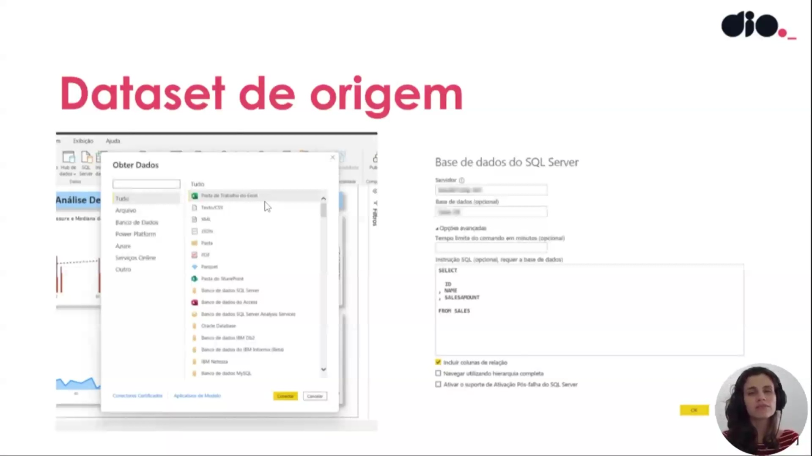
</p>

Para integrar informações provenientes de ambientes corporativos robustos, utiliza-se a opção de **Obter Dados** voltada para bancos relacionais. O exemplo destaca a conexão com uma **Base de dados do SQL Server**, onde é possível configurar o acesso ao servidor e ao banco específico para realizar a extração.

```sql
SELECT
  ID,
  NAME,
  SALESAMOUNT
FROM SALES

```

<p align="center">
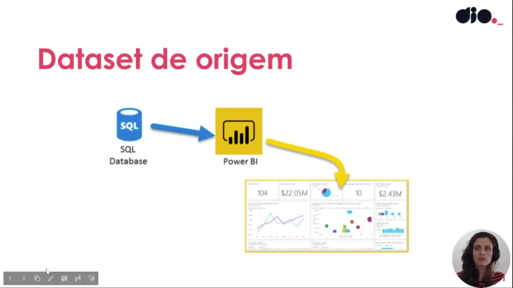
</p>

A conexão com um banco de dados SQL funciona como uma ponte direta. Enquanto o **SQL Database** atua como o repositório centralizado de dados brutos, o **Power BI** consome essa fonte para processar os volumes financeiros e operacionais (como demonstrado pelos valores de faturamento e quantidades), transformando registros de banco de dados em indicadores visuais.

<p align="center">

</p>

Ao trabalhar com outros sistemas, como o **MySQL**, o Power BI pode apresentar um aviso de que "este conector exige que um ou mais componentes adicionais sejam instalados". Isso ocorre porque drivers específicos de comunicação (como conectores .NET ou ODBC) precisam estar presentes no sistema operacional para que o Power BI consiga "conversar" com o banco de dados. Uma vez estabelecida a conexão, é possível aplicar instruções SQL para refinar a busca:

```sql
SELECT
  ID,
  NAME,
  SALESAMOUNT
FROM SALES

```

<p align="center">

</p>

Para gerenciar as conexões existentes, o usuário deve navegar até a guia **Home** e selecionar **Definições da origem de dados** (ou *Transformar dados* -> *Definições da origem*). Nesta interface, é possível **Alterar a origem** para apontar para um novo arquivo ou servidor, além de editar permissões de acesso e credenciais de login.

<p align="center">

</p>

O uso de scripts SQL (através da opção "Instrução SQL") é recomendado em cenários específicos, como:

* **Volume Histórico:** Quando há uma base de dados muito antiga (ex: desde 2009) e você deseja filtrar apenas o necessário antes de carregar no Power BI.
* **Foco no Negócio:** Para relatórios de metas de vendas onde o processamento de agregação de dados pode ser feito de forma mais eficiente pelo próprio servidor do banco de dados (SQL Server).

<p align="center">

</p>

O **Armazenamento de dados** (Storage Mode) define como o Power BI lida com as informações. Existem três modalidades principais que equilibram facilidade de uso e disponibilidade:

1. **Importar:** Os dados são carregados para a memória do Power BI (mais rápido para análises, mas exige atualização manual/agendada).
2. **DirectQuery:** O Power BI consulta o banco de dados em tempo real (ideal para grandes volumes que não cabem na memória).
3. **Composto:** Uma combinação dos dois métodos anteriores.

É importante ressaltar que o desenvolvimento e a execução plena dessas funcionalidades estão atrelados ao sistema operacional Windows, ambiente nativo da ferramenta.      


### 🟩 Vídeo 04 - Substituindo Origem do Dataset local para Onedrive no Power BI Desktop

<video width="60%" controls>
  <source src="000-Midia_e_Anexos/bootcamp_ntt_data-modulo.07-curso.01-video_04.webm" type="video/webm">
    Seu navegador não suporta vídeo HTML5.
</video>

link do vídeo: https://web.dio.me/track/engenharia-dados-python/course/coleta-e-extracao-de-dados-com-power-bi/learning/68ece6ae-b2f4-4f47-bc46-eb4376eeb671?autoplay=1

Este tutorial foca em uma tarefa essencial para analistas de dados: migrar a fonte de um relatório do Power BI de um caminho local (computador) para um caminho na nuvem (OneDrive Business ou SharePoint), garantindo maior colaboração e disponibilidade dos dados.

### Anotações

<p align="center">
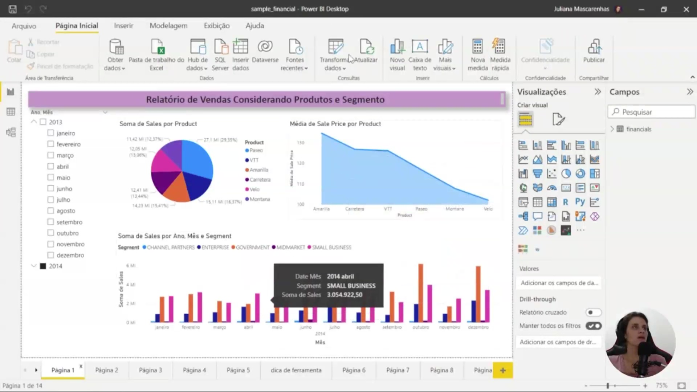
</p>

A aula inicia com a abertura do Power BI Desktop e o carregamento do "Relatório de Vendas Considerando Produtos e Segmento". O dashboard exibe visualizações preliminares de vendas por produto e segmento, preparando o ambiente para a demonstração de como alterar a origem desses dados.

<p align="center">

</p>

Ao acessar as configurações da fonte de dados, identifica-se que o arquivo de exemplo (`Financial Sample.xlsx`) está localizado localmente no diretório de instalação. O objetivo central é modificar esse caminho para uma fonte baseada em nuvem para facilitar a colaboração.

<p align="center">
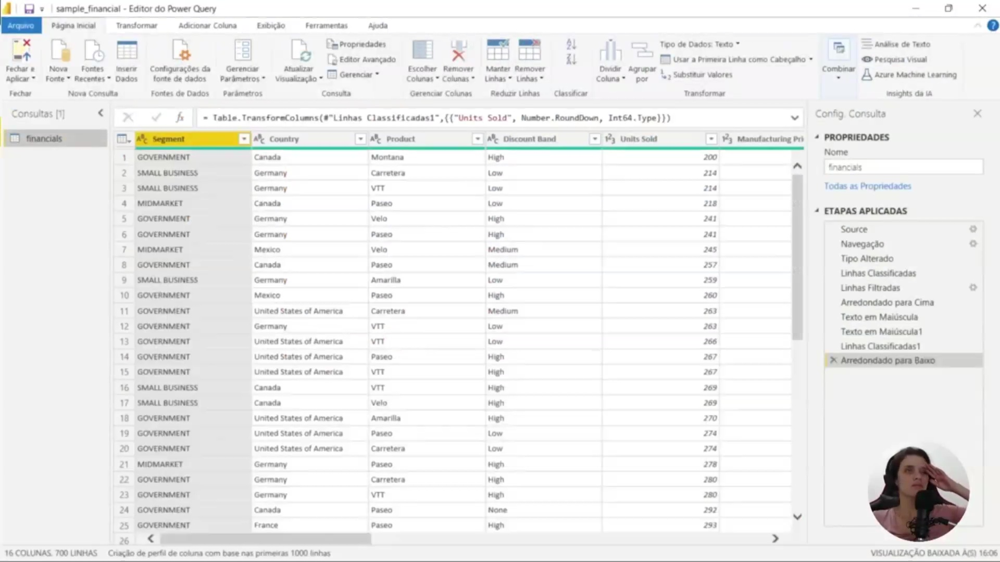
</p>

A interface do Editor do Power Query é apresentada, exibindo as etapas de transformação já aplicadas aos dados, como classificação de linhas e ajustes relacionados aos dados. Este ambiente é utilizado para gerenciar consultas e parâmetros antes de consolidar as alterações na fonte.

<p align="center">
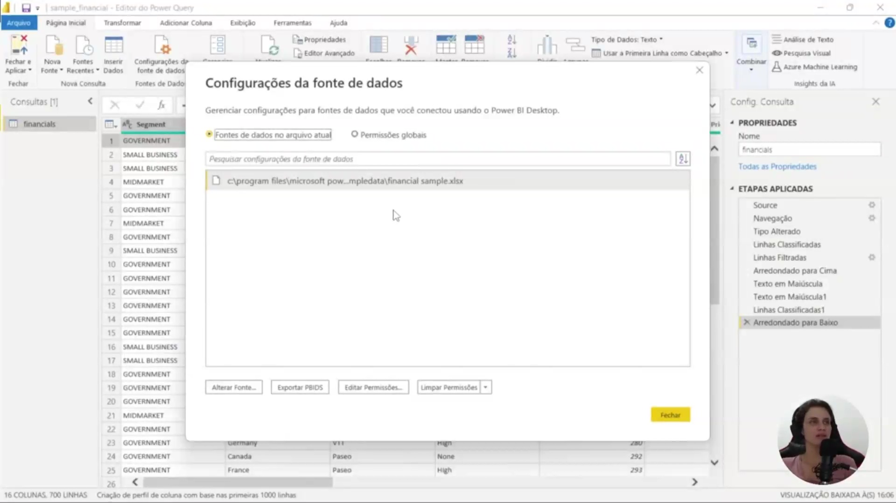
</p>

Dentro do Power Query, a janela de "Configurações da fonte de dados" é aberta novamente para realizar a troca da origem local. É a partir desta etapa que o usuário inicia o processo de substituição do caminho físico pelo endereço de rede.

<p align="center">

</p>

Para realizar a conexão com a nuvem, acessa-se o OneDrive for Business. O procedimento envolve localizar o arquivo desejado na pasta "dataset_powerbi" para obter suas informações de caminho detalhadas.

<p align="center">

</p>

No painel de detalhes do arquivo no OneDrive, deve-se copiar o link direto que aponta para a localização do arquivo na estrutura do SharePoint. Esse link, encontrado na seção de caminho dos detalhes, servirá como o novo endereço de origem.

<p align="center">
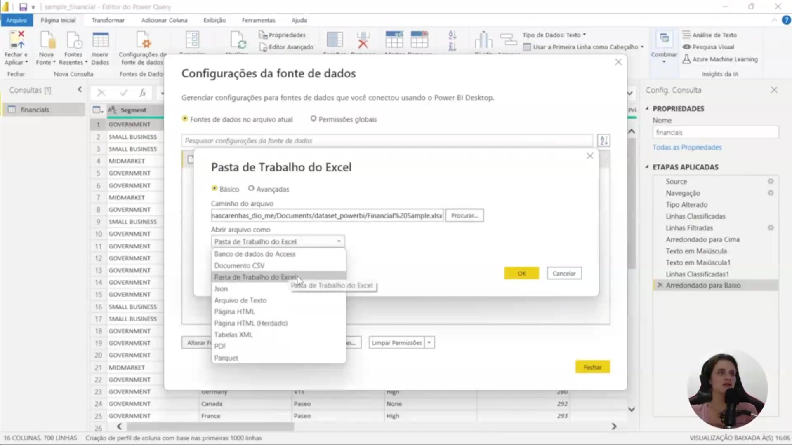
</p>

O endereço URL copiado é colado na configuração de origem do arquivo no Power BI. O sistema processa o caminho do OneDrive e permite a importação dos dados de forma automatizada via web.

```bash
https://academiapme-my.sharepoint.com/personal/juliana_mascarenhas_dio_me/Documents/dataset_powerbi/Financial%20Sample.xlsx

```

<p align="center">
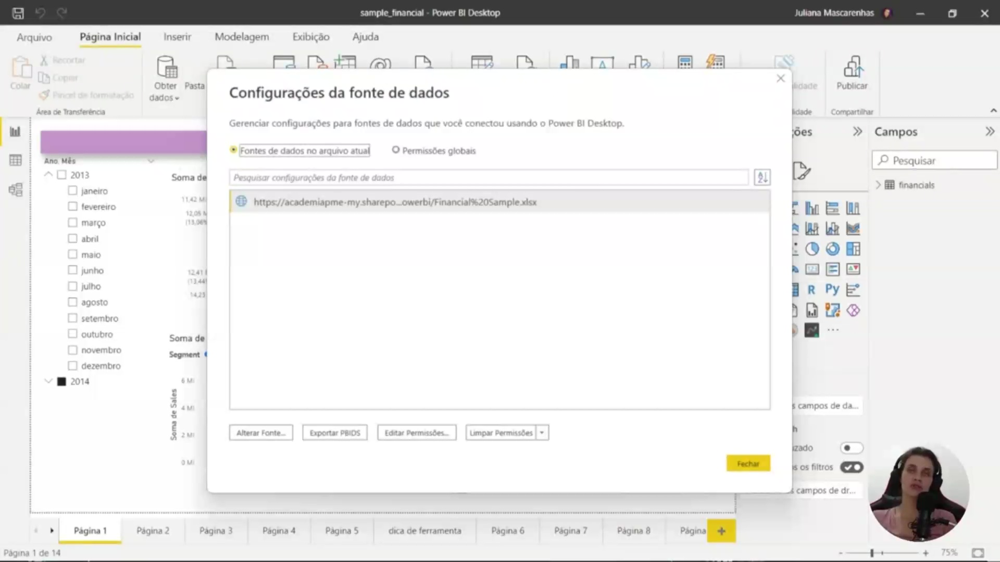
</p>

Após aplicar as mudanças, as configurações da fonte de dados confirmam que o relatório agora está consumindo informações diretamente do OneDrive. Isso garante a disponibilidade total dos dados e permite atualizações automáticas sem dependência de arquivos locais no computador.      


### 🟩 Vídeo 05 - Obtendo dados do excel com Power BI no Onedrive (Outra maneira)

<video width="60%" controls>
  <source src="000-Midia_e_Anexos/bootcamp_ntt_data-modulo.07-curso.01-video_05.webm" type="video/webm">
    Seu navegador não suporte vídeo HTML5.
</video>

link do vídeo: https://web.dio.me/track/engenharia-dados-python/course/coleta-e-extracao-de-dados-com-power-bi/learning/81595e7f-22d5-438f-aff7-96a9c6a47ae2?autoplay=1

Este vídeo demonstra duas abordagens principais para obter dados no Power BI, com foco especial na importação de dados a partir da web, destacando a importância da correta especificação do caminho do arquivo versus o caminho da pasta para uma autenticação bem-sucedida.

### Anotações

<p align="center">
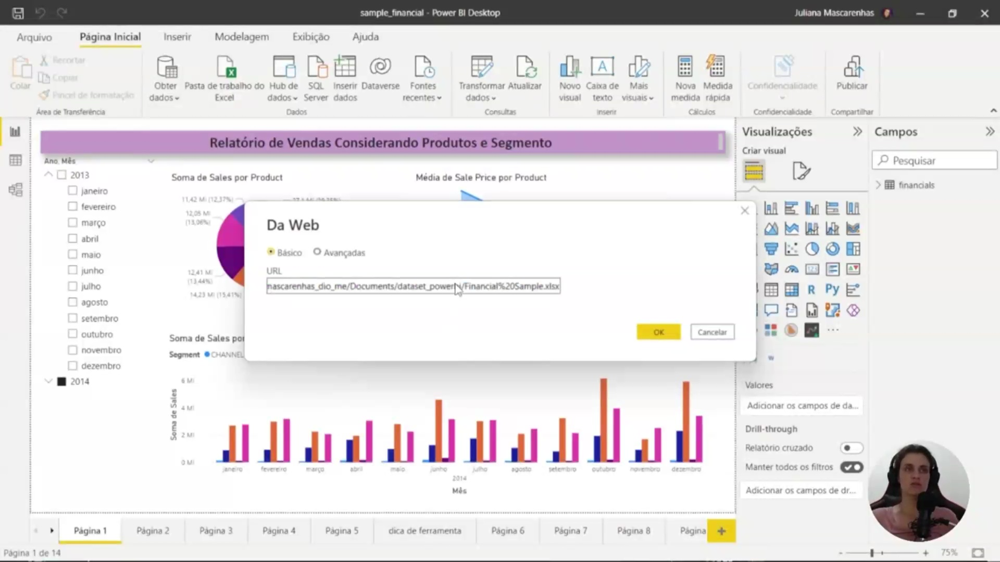
</p>

O processo de obtenção de dados externos inicia-se pela interface principal do Power BI Desktop, utilizando a opção **Obter dados**. No exemplo apresentado, utiliza-se o conector **Web**, onde é necessário inserir a URL que aponta diretamente para o arquivo de dados hospedado, neste caso, um arquivo Excel armazenado no OneDrive/SharePoint.

```text
mascarenhas_dio_me/Documents/dataset power Financial%20Sample.xlsx

```

<p align="center">
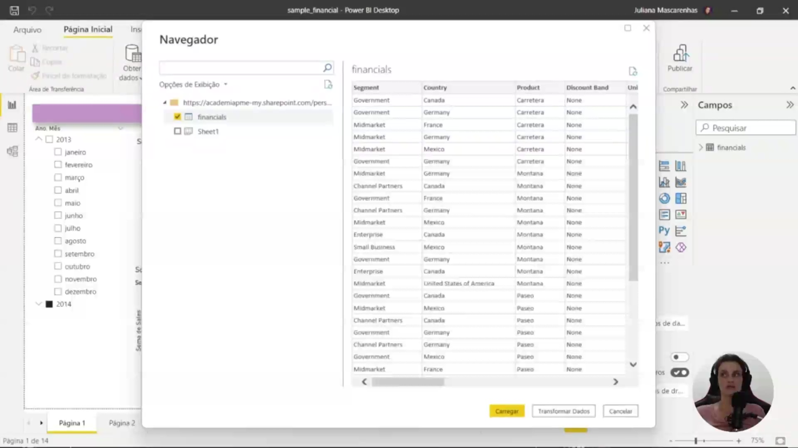
</p>

Após inserir a URL e confirmar, o Power BI abre a janela do **Navegador**. Esta tela exibe uma prévia dos dados contidos na fonte (tabela `financials`), permitindo verificar a estrutura das colunas como `Segment`, `Country`, `Product` e `Units Sold` antes de realizar a importação definitiva para o modelo.

<p align="center">

</p>

A imagem demonstra a localização do arquivo `Financial Sample.xlsx` dentro do ambiente do **OneDrive for Business**. Para que a conexão via Web funcione corretamente no Power BI, é fundamental identificar o caminho exato onde o conjunto de dados está armazenado na nuvem.

<p align="center">
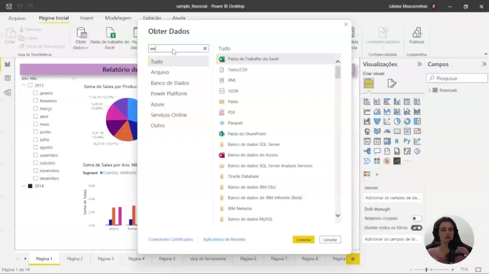
</p>

O Power BI oferece uma vasta gama de conectores de dados. Na janela **Obter Dados**, é possível visualizar categorias como Arquivo (Excel, Texto/CSV, XML, JSON, PDF), Banco de Dados (SQL Server, Access, Oracle), Power Platform e Serviços Online, permitindo a integração de diversas fontes de informação.

<p align="center">
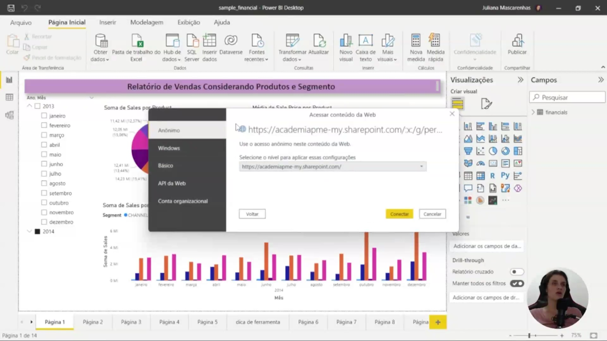
</p>

Ao configurar o acesso a conteúdos da Web que exigem autenticação, como arquivos no SharePoint, o Power BI solicita a definição do nível de acesso. Nesta etapa, deve-se selecionar **Conta organizacional** para garantir que as credenciais do usuário sejam validadas corretamente antes da conexão ser estabelecida.

<p align="center">

</p>

A janela de login da Microsoft é apresentada para que o usuário insira sua senha e complete o processo de autenticação. Este passo é obrigatório quando o acesso organizacional foi selecionado anteriormente, garantindo a segurança dos dados acessados.

<p align="center">
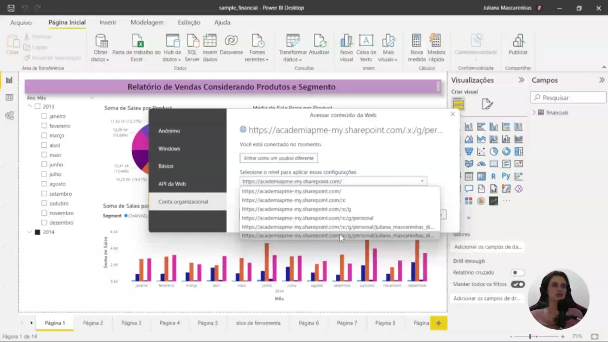
</p>

Uma vez autenticado, o Power BI confirma que o usuário está conectado ("Você está conectado no momento"). Agora, é possível selecionar o nível de aplicação das configurações de URL e clicar em **Conectar** para prosseguir com a importação dos dados da Web.

<p align="center">
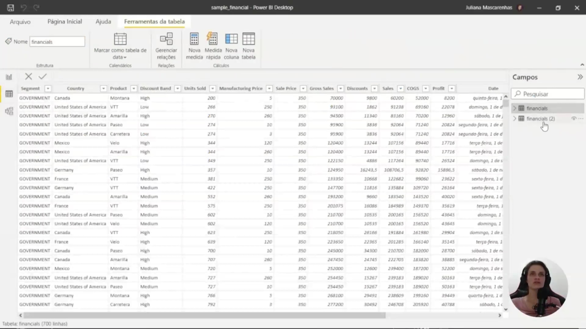
</p>

Ao carregar os dados novamente ou de uma fonte duplicada, podem surgir múltiplas tabelas no modelo, como `financials` e `financials (2)`. O Power BI permite gerenciar essas fontes através das **Configurações da fonte de dados**, onde é possível excluir tabelas redundantes ou corrigir caminhos de arquivos para manter o relatório organizado.      


### 🟩 Vídeo 06 - Conectando ao MySQL Local Utilizando o Power BI Desktop

<video width="60%" controls>
  <source src="000-Midia_e_Anexos/bootcamp_ntt_data-modulo.07-curso.01-video_06.webm" type="video/webm">
    Seu navegador não suporta vídeo HTML5.
</video>

link do vídeo: https://web.dio.me/track/engenharia-dados-python/course/coleta-e-extracao-de-dados-com-power-bi/learning/0f3c847b-e1a8-4c01-8877-00e24d631910?autoplay=1

### Anotações

Este guia resume o processo de conexão entre o Power BI e um banco de dados MySQL, abordando desde a preparação do ambiente até a visualização inicial dos dados no Power Query.

### Anotações

<p align="center">

</p>

A interface inicial apresenta a funcionalidade de obtenção de dados no Power BI, destacando a capacidade de realizar consultas customizadas via SQL. No campo "Instrução SQL", é possível observar um exemplo de consulta para extrair informações específicas de uma base de dados de vendas.

```sql
SELECT
    ID,
    NAME,
    SALESAMOUNT
FROM SALES

```

<p align="center">
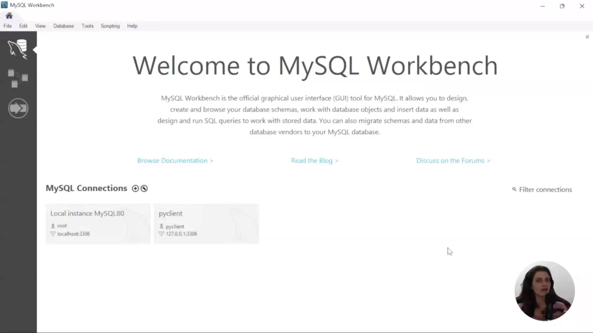
</p>

O MySQL Workbench é apresentado como a ferramenta oficial de interface gráfica (GUI) para o MySQL. Ele permite que o usuário projete, crie e navegue por esquemas de banco de dados, trabalhe com objetos de banco de dados, insira dados e execute consultas SQL. Além disso, a ferramenta oferece suporte para a migração de esquemas e dados de outros fornecedores de bancos de dados para o MySQL.

<p align="center">
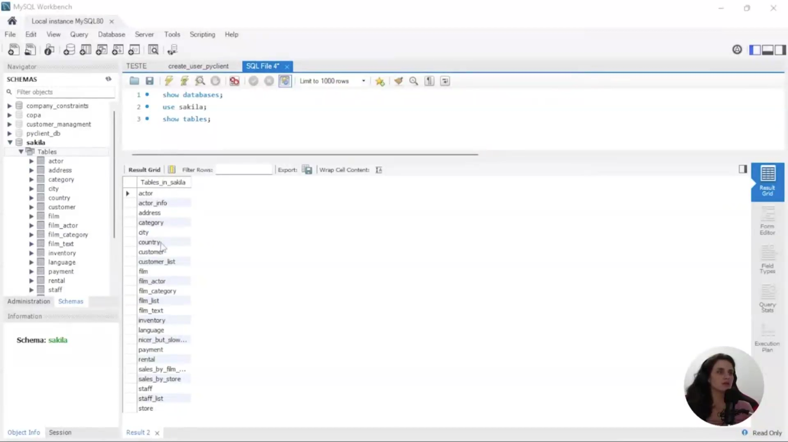
</p>

Dentro do ambiente do MySQL Workbench, são executados comandos básicos para a exploração do servidor de banco de dados. O comando `show databases;` é utilizado para listar os bancos de dados disponíveis, como o `company_constraints` e o `sakila`. Na sequência, o comando `use sakila;` seleciona o banco de dados para uso, e `show tables;` exibe todas as tabelas contidas nele, como `actor`, `address` e `category`.

```sql
show databases;
use sakila;
show tables;

```

<p align="center">
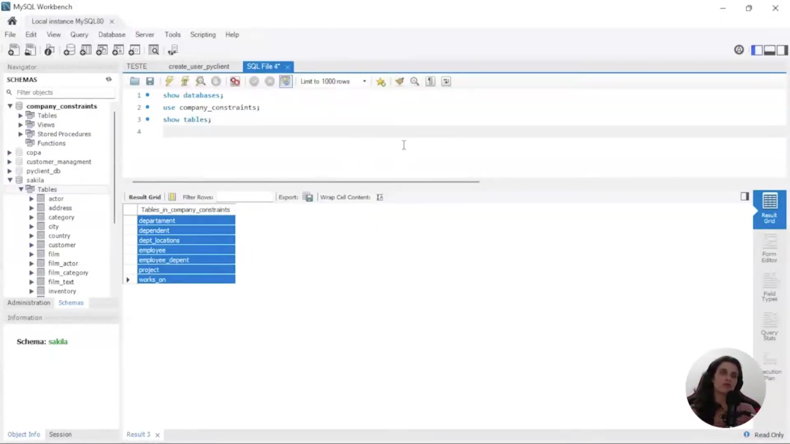
</p>

Após a exploração inicial, o foco muda para o banco de dados `company_constraints`. Ao selecioná-lo e listar suas tabelas, identificamos as entidades que compõem este esquema, como `departament`, `employee`, `project` e `works_on`. Essas tabelas contêm as restrições e relacionamentos que serão trabalhados durante a aula.

```sql
show databases;
use company_constraints;
show tables;

```

<p align="center">
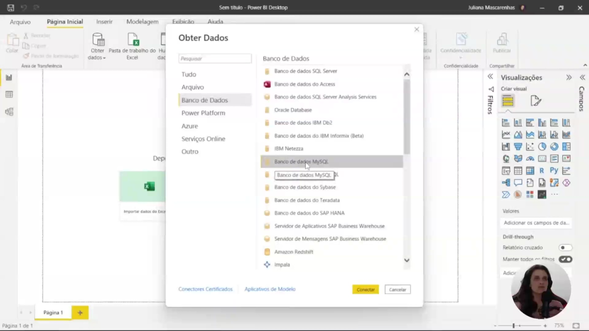
</p>

De volta ao Power BI Desktop, acessamos a janela "Obter Dados" para selecionar o conector específico para o MySQL. Esta etapa é fundamental para estabelecer a comunicação entre a ferramenta de Business Intelligence e o banco de dados local onde as tabelas de exemplo foram criadas.

<p align="center">
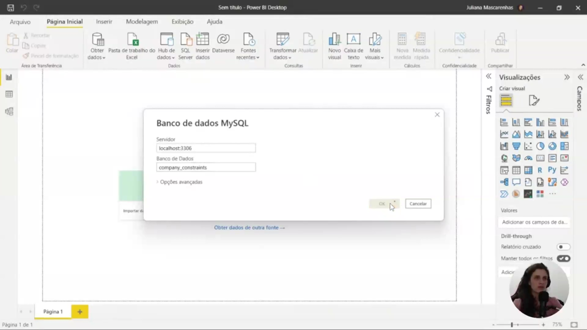
</p>

Na configuração da conexão com o banco de dados MySQL, definimos o servidor como `localhost:3306` e especificamos o banco de dados `company_constraints`. Esta ação direciona o Power BI para a instância correta do MySQL instalada na máquina local, preparando a importação dos dados.

<p align="center">
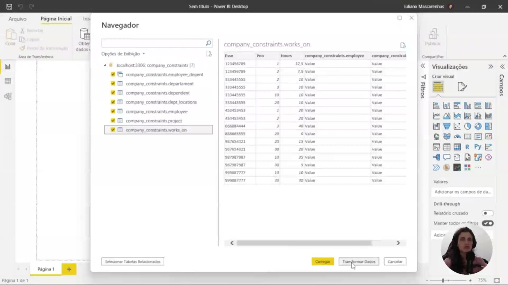
</p>

O "Navegador" exibe a lista de tabelas disponíveis no banco `company_constraints`. Nesta interface, é possível visualizar as tabelas como `departament`, `dependent`, `dept_locations`, `employee`, `project` e `works_on`. O usuário pode selecionar quais tabelas deseja carregar para o modelo ou transformar antes da importação.

<p align="center">
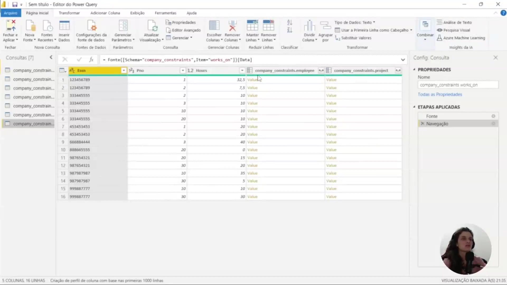
</p>

Ao entrar no Editor do Power Query (Transformar Dados), visualizamos a estrutura da tabela `works_on`. O Power BI identifica automaticamente a fonte e a navegação dentro do esquema. Aqui, os dados brutos são apresentados em colunas como `Essn`, `Pno` e `Hours`, permitindo o tratamento inicial das informações.

```sql
Fonte = MySQL.Database("localhost:3306", "company_constraints"),
Item = "works_on"

```

<p align="center">
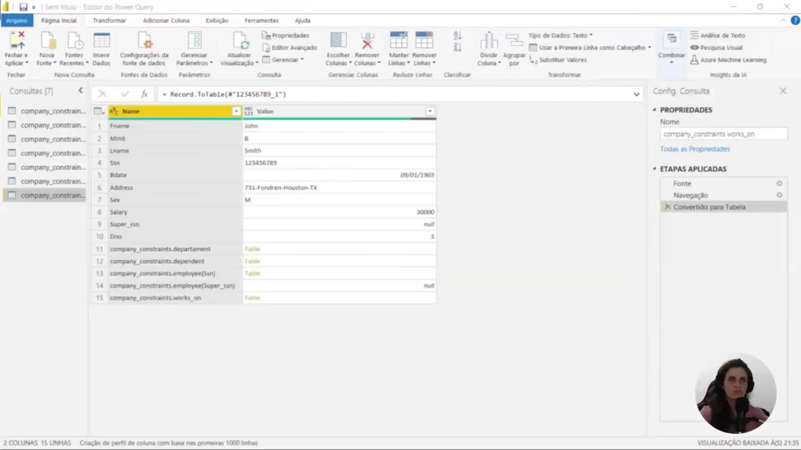
</p>

Ao analisar os detalhes de uma linha específica (como um registro de funcionário), o Power Query mostra os metadados e os valores associados. No exemplo, vemos detalhes do funcionário "John Smith", incluindo seu SSN, data de nascimento, endereço e salário, além de referências a outras tabelas relacionadas, indicadas como `Table` ou `Value`.

```sql
Fname: John
Lname: Smith
Ssn: 123456789
Salary: 30000

```

<p align="center">
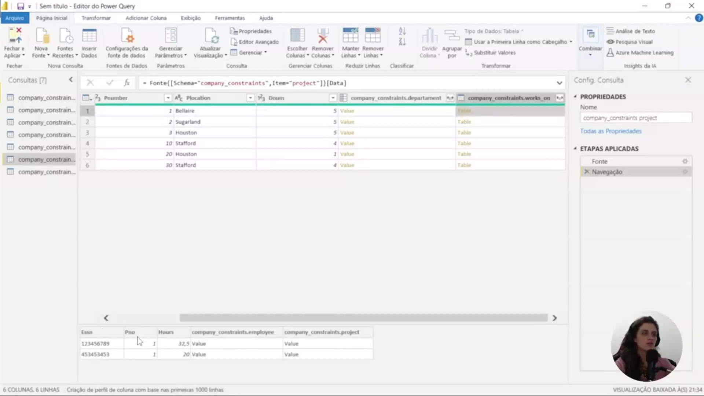
</p>

A imagem final detalha a tabela `project` dentro do Power Query. É possível observar as colunas `Pname` (nome do projeto), `Pnumber` (número), `Plocation` (localização) e `Dnum` (número do departamento). Além dos dados da própria tabela, o Power BI sinaliza as relações de "constraints" com outras tabelas, como `departament` e `works_on`, representadas por colunas que podem ser expandidas.

```sql
Fonte = MySQL.Database("localhost:3306", "company_constraints"),
Item = "project"

```      
 
### 🟩 Vídeo 07 - Analisando os Dados Importados do MySQL com Power Query

<video width="60%" controls>
  <source src="000-Midia_e_Anexos/bootcamp_ntt_data-modulo.07-curso.01-video_07.webm" type="video/webm">
    Seu navegador não suporta vídeo HTML5.
</video>

link do vídeo: https://web.dio.me/track/engenharia-dados-python/course/coleta-e-extracao-de-dados-com-power-bi/learning/162643b1-fb9c-4e4c-a00d-90a858f361e3?autoplay=1

Este tutorial foca na etapa de limpeza e refinamento de dados utilizando o Power Query e a visualização de Modelagem no Power BI. O objetivo principal é otimizar o modelo de dados, removendo informações redundantes (metadados), corrigindo relacionamentos entre tabelas e garantindo que a estrutura esteja pronta para a criação de relatórios e análises com DAX.

### Anotações

<p align="center">
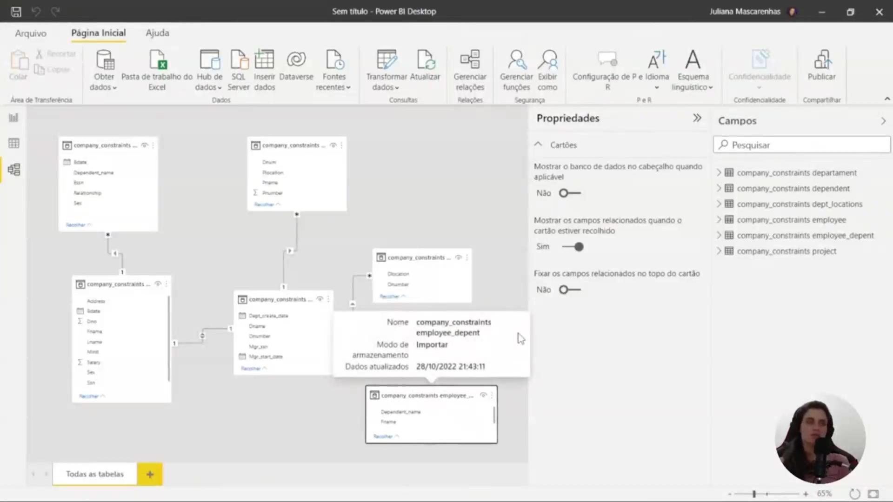
</p>

Nesta visualização do modelo no Power BI, observamos a estrutura das tabelas importadas do banco de dados relacional. O foco recai sobre as **constraints** (restrições) de integridade e referência que definem como as tabelas se conectam. No centro, o destaque é para a tabela `employee_depent`, onde o sistema exibe metadados sobre o modo de armazenamento (Importar) e a última data de atualização dos dados.

<p align="center">
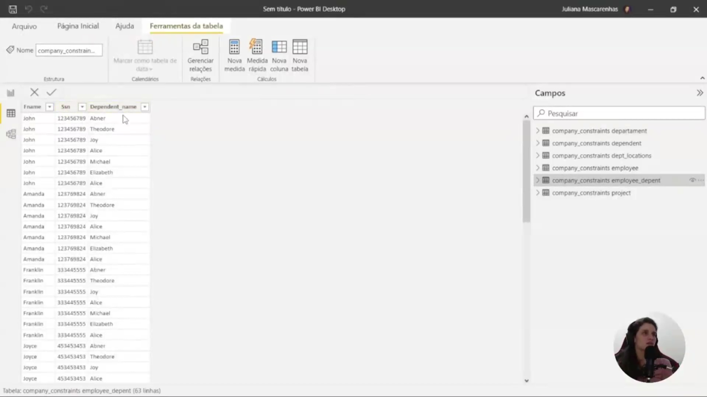
</p>

Abaixo, os dados brutos extraídos da tabela de dependentes. Note que colunas como "Age" (Idade) ou metadados de relacionamento podem ser redundantes se já possuímos a data de nascimento ou se a integridade referencial já está garantida pelas chaves primárias e estrangeiras.

| Name (Frame) | Ssn (Salt) | Dependent_name |
| --- | --- | --- |
| John | 123456789 | Abner |
| John | 123456789 | Theodore |
| John | 123456789 | Joy |
| Amanda | 123769824 | Alice |
| Franklin | 333445555 | Michael |

<p align="center">
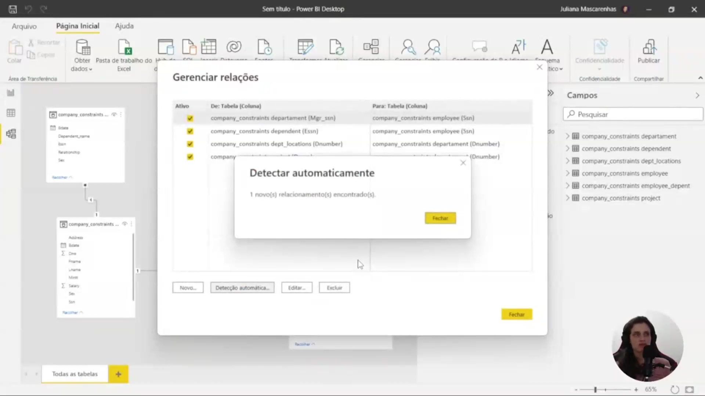
</p>

O Power BI permite gerenciar as relações de forma automatizada. A ferramenta **"Gerenciar relações"** exibe quais tabelas estão conectadas (ex: `departament` para `employee` via `Mgr_ssn` ou `Ssn`). A função **"Detectar automaticamente"** é utilizada para que o sistema identifique novos relacionamentos com base nos nomes das colunas e nos dados, facilitando a configuração inicial do modelo sem a necessidade de criar cada ligação manualmente.

<p align="center">
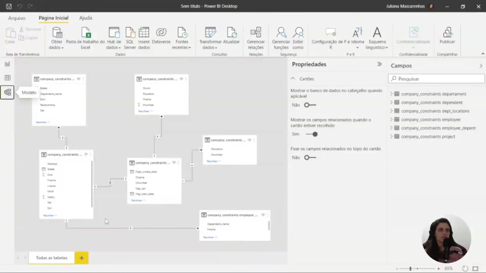
</p>

Após a detecção, o diagrama do modelo reflete as conexões estabelecidas. É possível visualizar as cardinalidades (1:1, 1:N) representadas pelas linhas que unem as tabelas. Neste estágio, o objetivo é garantir que o modelo esteja limpo, removendo colunas de metadados ou informações desnecessárias que apenas ocupam espaço de processamento, mantendo a integridade das relações intacta.

<p align="center">
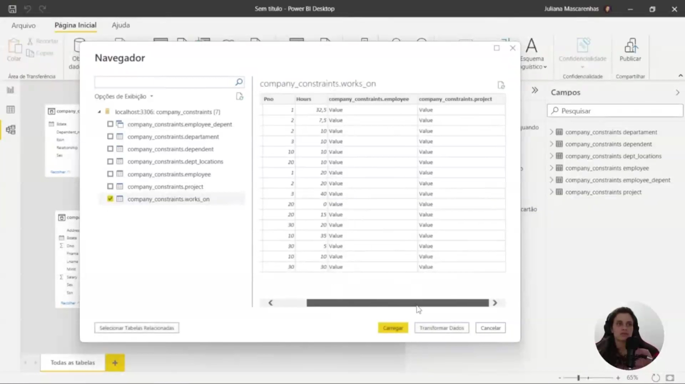
</p>

Ao importar novas tabelas, como a `works_on` (que atua como uma tabela associativa entre funcionários e projetos), o Navegador exibe uma prévia dos dados. Observamos colunas de valores numéricos (Horas) e as chaves que fazem referência a outras entidades.

| Pno | Hours | company_constraints.employee |
| --- | --- | --- |
| 1 | 32,5 | Value |
| 2 | 7,5 | Value |
| 3 | 10 | Value |
| 30 | 10 | Value |

<p align="center">
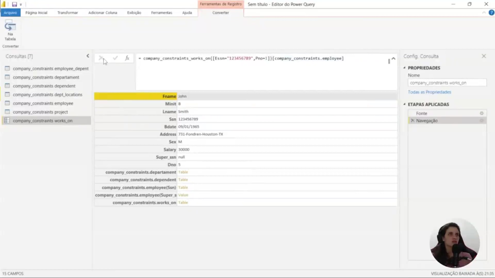
</p>

No **Editor do Power Query**, realizamos o tratamento fino dos dados. Na barra de fórmulas, vemos a navegação específica dentro da tabela `works_on`. À direita, o painel de **Etapas Aplicadas** registra as transformações, como a remoção de colunas desnecessárias para otimizar o desempenho do modelo.

```powerquery
= company_constraints_works_on{[Essn="123456789", Pno=1]}[company_constraints.employee]

```

<p align="center">
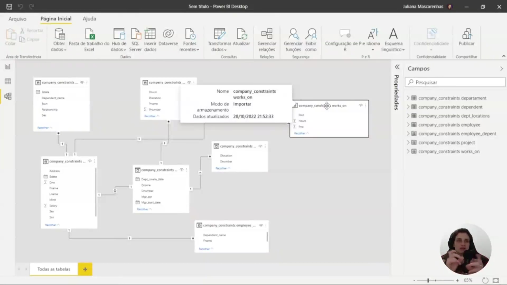
</p>

O resultado final apresenta o modelo de dados consolidado com a inclusão da tabela `works_on`. Com as transformações aplicadas e as colunas irrelevantes removidas, o modelo está pronto para ser utilizado em relatórios. A integridade referencial é preservada através das chaves, permitindo cálculos complexos entre funcionários, departamentos e projetos de forma eficiente.      


### 🟩 Vídeo 08 - Quando utilizar o SQL para Importar Dados de um Banco de Dados?

<video width="60%" controls>
  <source src="000-Midia_e_Anexos/bootcamp_ntt_data-modulo.07-curso.01-video_08.webm" type="video/webm">
    Seu navegador não suporta vídeo HTML5.
</video>

link do vídeo: https://web.dio.me/track/engenharia-dados-python/course/coleta-e-extracao-de-dados-com-power-bi/learning/81bc702f-b0d2-4e17-8dc3-a5acc4f550dc?autoplay=1

Este tutorial foca na transição entre o uso básico de conectores e a implementação de consultas SQL para otimizar a performance e a precisão no tratamento de dados dentro do Power BI. O vídeo explora desde a alteração de origens de dados até estratégias avançadas para lidar com grandes volumes de informações.

### Anotações

<p align="center">

</p>

A interface "Obter Dados" é o ponto de partida para a integração de diferentes fontes de informação no Power BI. Através dela, é possível selecionar conectores específicos para arquivos locais, como Excel e CSV, ou estabelecer conexões com diversos sistemas de gerenciamento de bancos de dados e serviços em nuvem. Essa etapa inicial é fundamental para definir de onde os dados serão extraídos antes de qualquer processo de modelagem ou visualização.

<p align="center">

</p>

Para gerenciar conexões existentes, o Power BI oferece a opção de "Definições da origem" dentro do menu "Transformar dados". Este recurso é essencial quando há necessidade de alterar o caminho de um arquivo ou migrar a fonte de dados, como trocar um banco de dados local por uma instância na nuvem (Azure), garantindo que o relatório aponte para a origem correta sem a necessidade de reconstruir todas as transformações já realizadas.

<p align="center">

</p>

A utilização de instruções SQL diretamente na conexão é uma estratégia eficaz para otimizar a performance. Em cenários onde a base de dados possui registros históricos extensos (por exemplo, desde 2009), mas o objetivo do relatório é analisar apenas um período recente ou metas específicas, o SQL permite realizar uma seleção prévia dos dados. Isso resulta em um carregamento parcial, trazendo para o Power BI apenas o subconjunto necessário de informações e evitando o processamento desnecessário de volumes massivos de dados no Power Query.

```sql
SELECT
ID,
NAME,
SALESAMOUNT
FROM SALES

```

<p align="center">

</p>

Nas configurações avançadas da conexão com o SQL Server, é possível inserir a instrução SQL que delimitará o conjunto de dados. Além de definir a consulta, o usuário pode configurar o tempo limite do comando para evitar que processos excessivamente longos travem a aplicação. Uma recomendação importante é validar a consulta em ferramentas externas, como o MySQL Workbench, antes de aplicá-la no Power BI, garantindo que o código retorne exatamente o esperado e poupando recursos de processamento do servidor.

```sql
SELECT
ID,
NAME,
SALESAMOUNT
FROM SALES

```      

### 🟩 Vídeo 09 - Criando um Relatório Simples para Entender os Dados Recuperados do MySQL

<video width="60%" controls>
  <source src="000-Midia_e_Anexos/bootcamp_ntt_data-modulo.07-curso.01-video_09.webm" type="video/webm">
    Seu navegador não suporta vídeo HTML5.
</video>

link do vídeo: https://web.dio.me/track/engenharia-dados-python/course/coleta-e-extracao-de-dados-com-power-bi/learning/1434c4b2-6248-4eae-9915-1e8414a8c192?autoplay=1

Este guia resume o processo de criação de um dashboard no Power BI voltado para a otimização de processos e caracterização de uma base de dados (originada de testes em SQL). O foco é transformar dados brutos em informações visuais sobre horas trabalhadas, distribuição de funcionários e dependentes.

### Anotações

<p align="center">
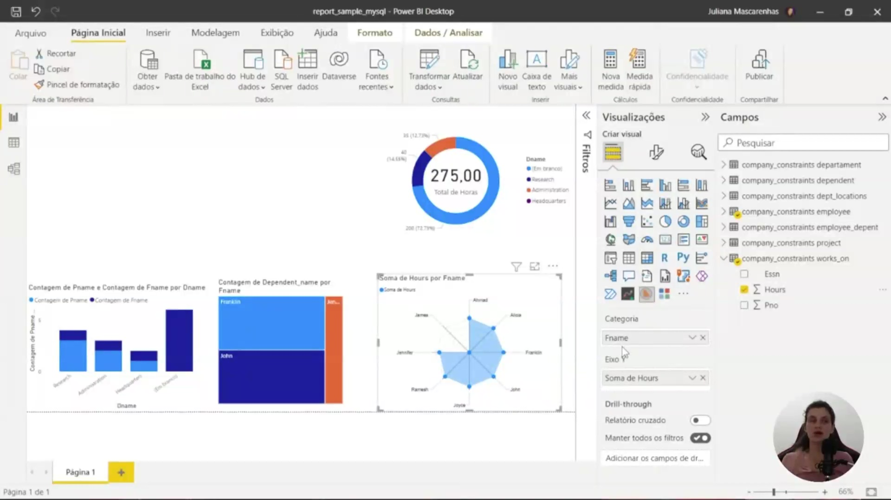
</p>

Nesta etapa da aula, é apresentado o desenvolvimento de um gráfico de barras empilhadas para analisar a distribuição de colaboradores e projetos por departamento. O visual revela uma discrepância nos dados de teste: uma coluna proeminente classificada como "Blank" (em branco), indicando que muitos colaboradores no banco de dados não possuem um departamento associado. Esta visualização é utilizada para demonstrar como o Power BI ajuda a identificar lacunas de dados e inconsistências em um dataset, comparando o volume de projetos (legenda clara) em relação ao número de funcionários (legenda escura) dentro de setores como *Research* e *Administration*.

<p align="center">
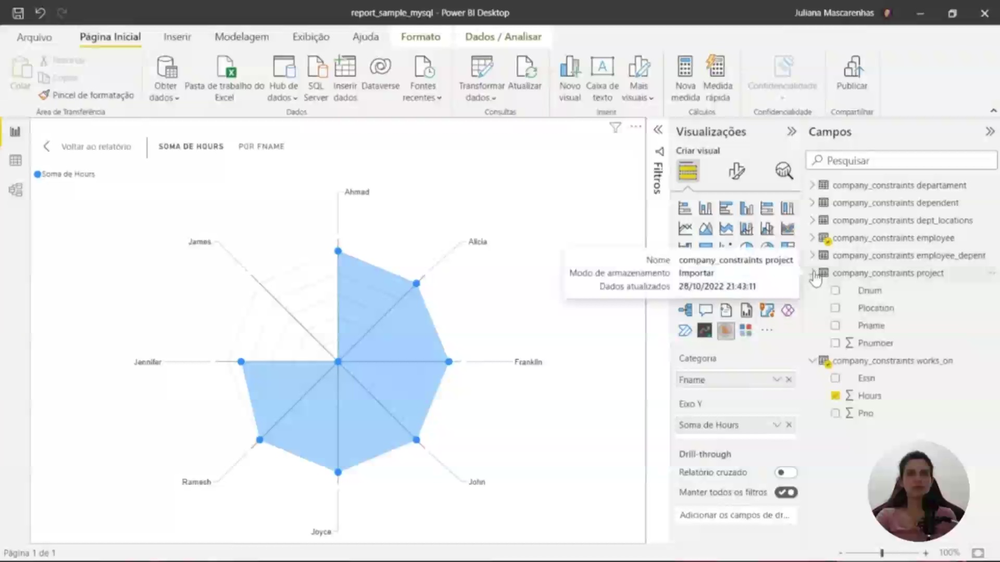
</p>

A imagem detalha a configuração de um gráfico de Radar (Radar Chart), um visual personalizado utilizado para detectar tendências e forças entre diferentes categorias. No contexto da aula, o gráfico mapeia a soma de horas trabalhadas por colaborador. A disposição radial permite visualizar o equilíbrio da carga horária entre nomes como Franklin, John, Alice e Ahmad, destacando que a maioria mantém um nível de horas similar, com exceção de Jennifer, que apresenta um volume menor. O instrutor ressalta que este tipo de gráfico é ideal para análises de perfil e identificação de comportamentos dominantes em grupos pequenos de dados.

<p align="center">
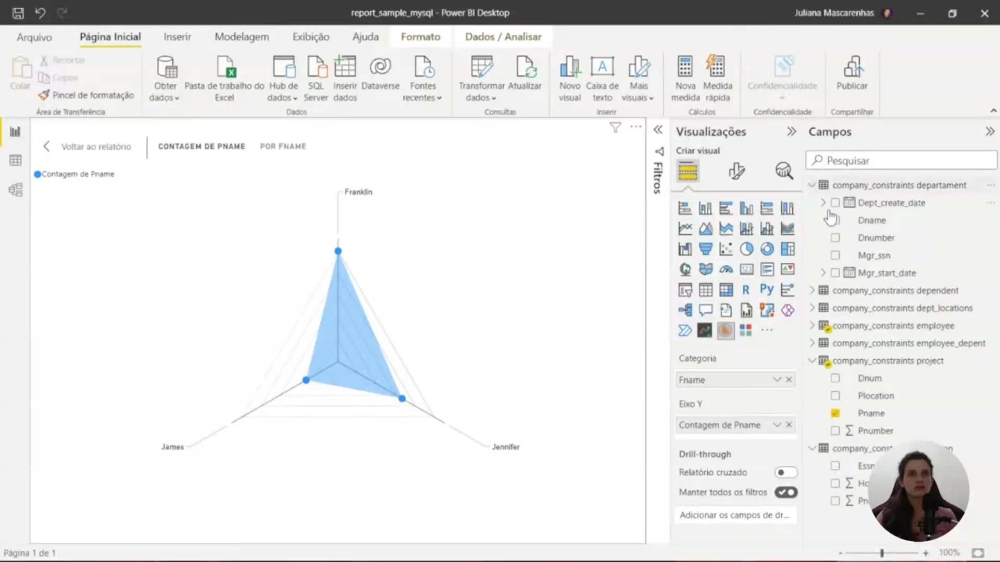
</p>

Aqui observa-se a interface de configuração do campo de dados para o gráfico de Radar. O foco está na associação entre a categoria (neste caso, o nome do colaborador, `Fname`) e o eixo de valores (Soma de `Hours`). O gráfico ilustra graficamente a distribuição de esforço, permitindo uma comparação visual rápida da "área" ocupada por cada funcionário no radar de horas. A explicação enfatiza que, embora o gráfico mostre nomes individuais, em cenários com grandes volumes de dados, a categoria poderia ser substituída por departamentos (`Dname`) para manter a legibilidade.

<p align="center">
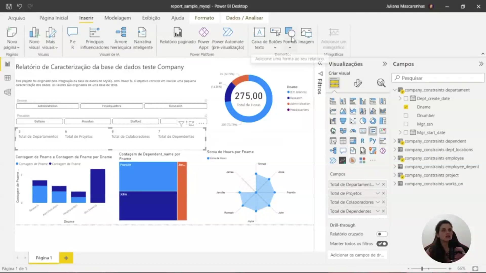
</p>

O estágio final do relatório apresenta a consolidação de diferentes visuais para a caracterização da base de dados. O painel inclui:

* **Gráfico de Donut**: Mostrando a distribuição de horas por departamento, com um destaque central para o "Total de Horas" (275,00) via cartão.
* **Cartão de Linha Múltipla**: Localizado à direita, fornecendo métricas rápidas como Total de Departamentos, Projetos, Colaboradores e Dependentes.
* **Segmentadores (Slicers)**: Utilização do visual personalizado *Chiclet Slicer* para filtrar o relatório por Departamento e Localização, permitindo uma navegação interativa pelos dados da empresa.
* **Descrição Textual**: Um bloco de texto inserido para contextualizar o relatório de caracterização da base de dados teste "Company".      


### 🟩 Vídeo 10 - Utilizando SQL para Restringir os Dados Recuperados do MySQL com Power BI

<video width="60%" controls>
  <source src="000-Midia_e_Anexos/bootcamp_ntt_data-modulo.07-curso.01-video_10.webm" type="video/webm">
    Seu navegador não suporta vídeo HTML5.
</video>

link do vídeo: https://web.dio.me/track/engenharia-dados-python/course/coleta-e-extracao-de-dados-com-power-bi/learning/b81b6595-80d7-42ed-8ff9-bf60cde0c3d8?autoplay=1

Este tutorial demonstra como utilizar consultas SQL avançadas para importar dados de forma seletiva para o Power BI. O foco principal é a eficiência: em vez de carregar tabelas inteiras e tratá-las no Power BI, o instrutor mostra como realizar junções (joins), filtragens e agregações diretamente na fonte de dados (MySQL), resultando em um modelo de dados mais leve e rápido.

### Anotações

<p align="center">
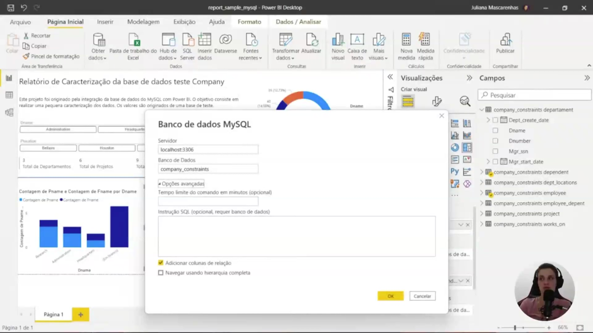
</p>

Nesta etapa, a instrutora demonstra a configuração da conexão entre o **Power BI Desktop** e o banco de dados **MySQL**. Na janela de diálogo, são preenchidos os parâmetros de conectividade essenciais: o servidor (`localhost:3306`) e o nome do banco de dados (`company_constraints`).

Além das configurações padrão, é explorada a seção de **Opções avançadas**, que permite a inserção de uma **Instrução SQL** personalizada. Esta funcionalidade é fundamental para otimizar a performance, permitindo que apenas um subconjunto específico de dados (como um cenário restrito de gerentes com dependentes) seja importado, em vez de carregar todas as tabelas da base.

<p align="center">
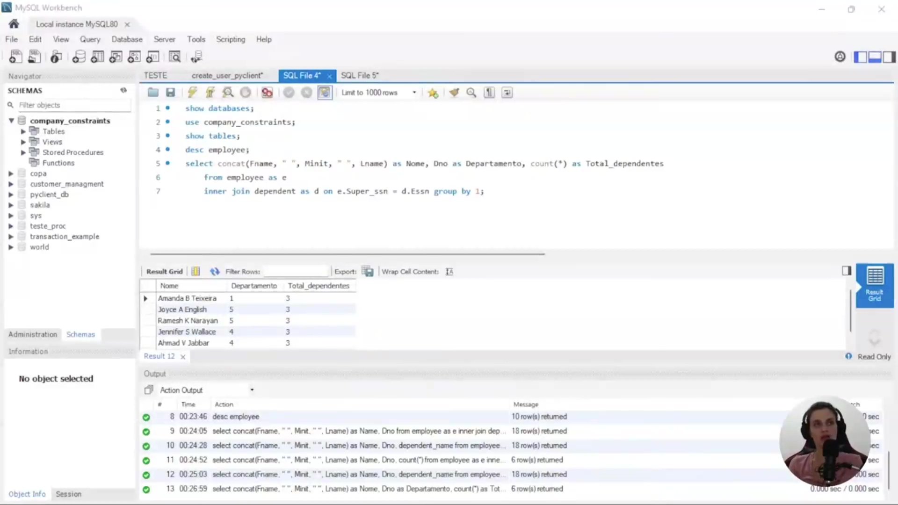
</p>

Para definir exatamente quais dados levar ao Power BI, a consulta é validada no **MySQL Workbench**. O objetivo é realizar um `INNER JOIN` entre as tabelas `employee` e `dependent` para retornar apenas os colaboradores que possuem dependentes, utilizando funções de agregação para sumarizar as informações.

O código SQL desenvolvido e testado no Workbench é:

```sql
SELECT 
    CONCAT(Fname, ' ', Minit, ' ', Lname) AS Nome, 
    Dno AS Departamento, 
    COUNT(*) AS Total_dependentes
FROM employee AS e
INNER JOIN dependent AS d ON e.Ssn = d.Essn 
GROUP BY Nome, Departamento;

```

A imagem exibe o **Result Grid** com o retorno da query, confirmando nomes como Amanda B. Teixeira e Joyce A. English, cada uma associada ao seu respectivo departamento e contagem de dependentes.

<p align="center">

</p>

Após a validação no banco de dados, a instrução SQL é copiada e colada diretamente no campo **Instrução SQL (opcional, requer banco de dados)** dentro do Power BI.

Este método garante que a lógica de filtragem e junção de tabelas ocorra no nível do servidor de banco de dados, resultando em uma importação mais rápida e em um modelo de dados mais enxuto, contendo apenas as colunas "Nome", "Departamento" e "Total_dependentes" conforme definido na query.

<p align="center">
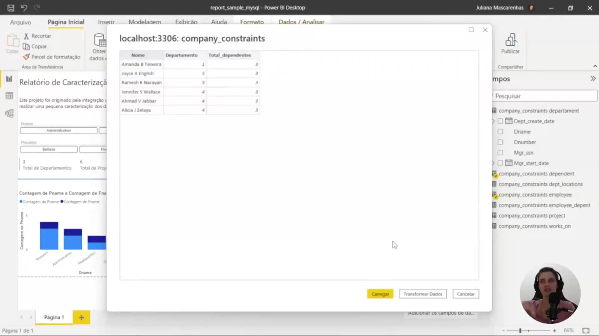
</p>

Com os dados importados, a interface do Power BI exibe a nova tabela (inicialmente nomeada como "Consulta 1", posteriormente renomeada para "gerentes com dependentes"). A instrutora utiliza esses dados para criar um visual de **Gráfico de Área** para análise da magnitude dos dependentes por colaborador.

No painel de **Campos**, observa-se a estrutura simplificada resultante da query personalizada:

* **Departamento**
* **Nome**
* **Total de dependentes**

O gráfico gerado no relatório permite visualizar rapidamente a distribuição, evidenciando que, nesta base de testes específica, os gerentes listados possuem uma contagem uniforme de três dependentes cada.      


### 🟩 Vídeo 11 - Instanciando um Banco de Dados com SQL Server na Azure

<video width="60%" controls>
  <source src="000-Midia_e_Anexos/bootcamp_ntt_data-modulo.07-curso.01-video_11.webm" type="video/webm">
    Seu navegador não suporta vídeo HTML5.
</video>

link do vídeo: https://web.dio.me/track/engenharia-dados-python/course/coleta-e-extracao-de-dados-com-power-bi/learning/2c7b7f47-2290-4882-9ef4-f450149c4921?autoplay=1

Este guia descreve o processo passo a passo para configurar um banco de dados SQL na nuvem Microsoft Azure, focado em um ambiente de teste para integração com o Power BI. O tutorial abrange desde a criação da conta até a implantação final com dados de exemplo.

### Anotações

<p align="center">

</p>

A interface inicial do portal do Microsoft Azure apresenta o **Centro de Início Rápido**, onde é possível visualizar diversas opções de serviços para iniciar um projeto. Entre as alternativas em destaque, encontra-se a opção **Configurar um banco de dados**, que permite explorar as opções para gerenciar bancos de dados relacionais e não relacionais na nuvem.

<p align="center">
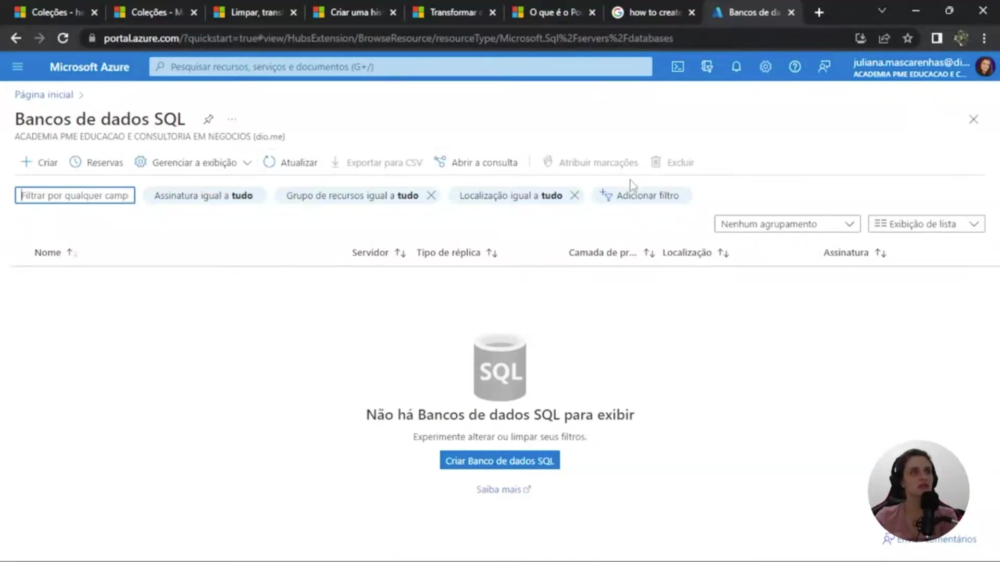
</p>

Ao acessar a seção de **Bancos de dados SQL**, o portal exibe uma lista (atualmente vazia) dos recursos disponíveis. Nesta tela, o usuário tem acesso a comandos principais como **Criar**, para instanciar um novo banco de dados, além de opções para gerenciar reservas e atualizar a visualização da lista de recursos.

<p align="center">
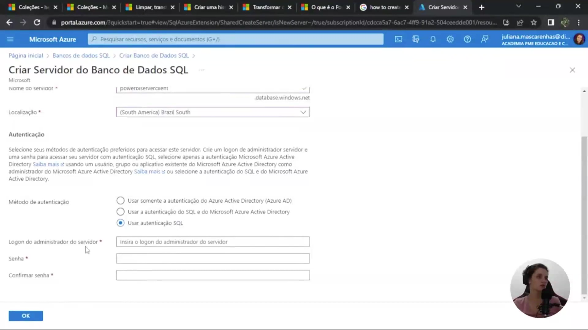
</p>

Na etapa de criação do servidor do Banco de Dados SQL, é necessário definir configurações básicas como o **Nome do servidor** (neste exemplo, `powerbiserverclient`) e a **Localização** geográfica do data center, selecionada como `(South America) Brazil South`. Abaixo, iniciam-se as configurações de **Autenticação**, onde o usuário deve escolher o método de acesso ao servidor.

<p align="center">

</p>

Ao optar pelo método **Usar autenticação SQL**, o sistema exige a criação de um **Logon do administrador do servidor** (definido como `powerbi`) e uma senha robusta. O Azure valida se a senha atende aos requisitos de segurança, como ter pelo menos 8 caracteres e incluir letras maiúsculas, minúsculas, números e caracteres especiais.

<p align="center">

</p>

Nas configurações de **Computação e Armazenamento**, define-se a camada de preço e a capacidade do banco de dados. No exemplo, foi selecionada a camada **Standard S0** com **10 DTUs** e **250 GB** de armazenamento. Também é possível configurar a redundância do armazenamento de backup para garantir a recuperação de dados em caso de interrupções regionais.

<p align="center">

</p>

A aba de **Rede** permite configurar as **Regras de Firewall** e a conectividade. Duas opções críticas são apresentadas: **Permitir que serviços e recursos do Azure acessem este servidor** e **Adicionar o endereço IP do cliente atual**. Além disso, a **Política de conexão** pode ser definida como "Padrão", que utiliza redirecionamento para conexões internas ao Azure e Proxy para conexões externas.

<p align="center">
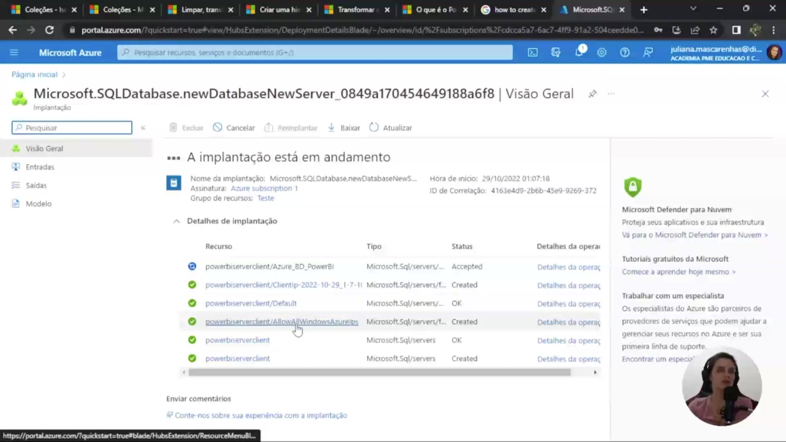
</p>

A tela de **Visão Geral da Implantação** mostra o progresso da criação dos recursos. O sistema lista os componentes sendo instanciados no servidor `powerbiserverclient`, incluindo o banco de dados `Azure_BD_PowerBI`, as configurações de firewall para o IP do cliente e as regras para IPs do Windows Azure, indicando o status de cada operação como "Created" ou "Accepted".

<p align="center">
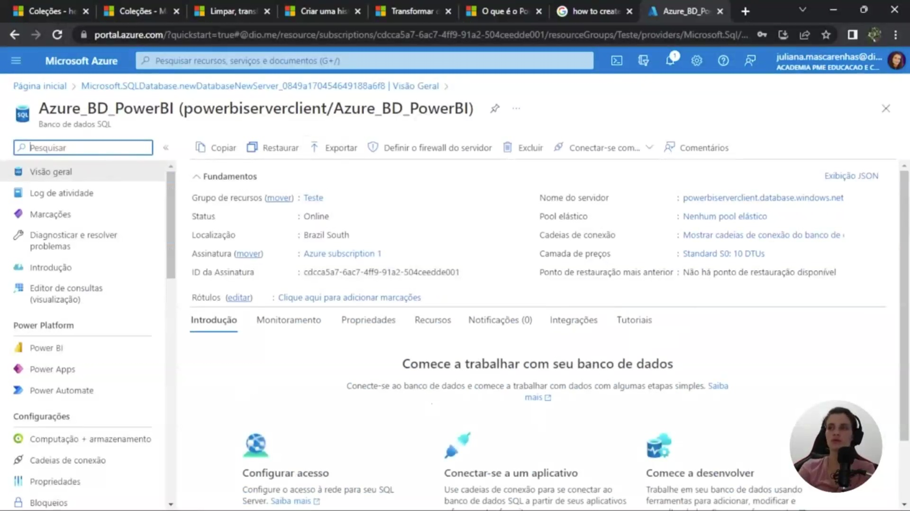
</p>

Após a conclusão, a página do recurso exibe os **Fundamentos** do banco de dados `Azure_BD_PowerBI`. Estão visíveis o nome do servidor (`powerbiserverclient.database.windows.net`), o status "Online", a localização em "Brazil South" e a camada de preços configurada. O painel lateral oferece ferramentas para monitoramento, configuração de acesso e o editor de consultas para manipulação direta dos dados.      


### 🟩 Vídeo 12 - Analisando as Configurações da nossa Instância do SQL Server na Azure

<video width="60%" controls>
  <source src="000-Midia_e_Anexos/bootcamp_ntt_data-modulo.07-curso.01-video_12.webm" type="video/webm">
    Seu navegador não suporta vídeo HTML5.
</video>

link do vídeo: https://web.dio.me/track/engenharia-dados-python/course/coleta-e-extracao-de-dados-com-power-bi/learning/575ae1d4-72cc-44b0-ad1a-ccc521cf1553?autoplay=1

Este guia resume os passos para explorar as configurações de um banco de dados SQL no Azure, as ferramentas de desenvolvimento disponíveis e o processo de integração direta com o Power BI.

### Anotações

<p align="center">
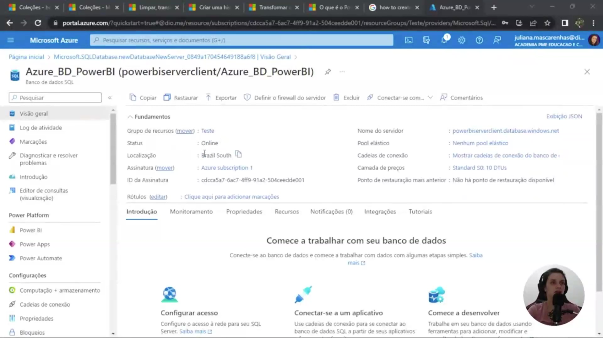
</p>

A interface inicial apresenta a visão geral do banco de dados SQL no Azure, identificado como **Azure_BD_PowerBI**. Nesta tela, é possível visualizar informações fundamentais como o **nome do servidor** (`powerbiserverclient.database.windows.net`), o status operacional **Online**, e a localização configurada em **Brazil South**. O menu lateral destaca as opções de configuração e as plataformas de integração, como a **Power Platform**, essenciais para o gerenciamento do recurso.

<p align="center">
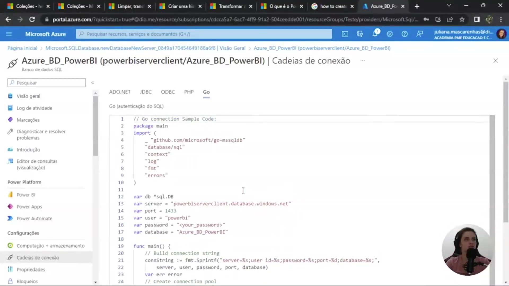
</p>

Esta seção detalha as **Cadeias de conexão** (Connection Strings) necessárias para que aplicações externas se comuniquem com o banco de dados. O exemplo visual foca na linguagem **Go**, fornecendo um esqueleto de código para criar um pool de conexões utilizando o driver `go-mssqldb`.

```go
// Go connection Sample Code:
package main

import (
    "github.com/microsoft/go-mssqldb"
    "database/sql"
    "context"
    "log"
    "errors"
)

var db *sql.DB
var server = "powerbiserverclient.database.windows.net"
var port = 1433
var user = "powerbi"
var password = "<your_password>"
var database = "Azure_BD_PowerBI"

func main() {
    // Build connection string
    connString := fmt.Sprintf("server=%s;user id=%s;password=%s;port=%d;database=%s;",
        server, user, password, port, database)
    
    var err error
    // Create connection pool

```


<p align="center">

</p>

Na aba de **Introdução**, o Azure facilita o fluxo de trabalho inicial oferecendo atalhos para configurar o acesso à rede (firewall) e ferramentas de desenvolvimento. São disponibilizadas opções para abrir o banco diretamente no **Azure Data Studio** ou no **Visual Studio**, além de links rápidos para visualizar as cadeias de conexão em diferentes linguagens.

<p align="center">
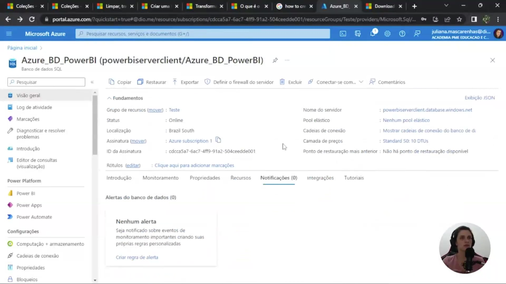
</p>

A seção de **Monitoramento** exibe o status dos alertas do banco de dados. No momento capturado, não há alertas ativos ("Nenhum alerta"), mas a plataforma permite a criação de regras personalizadas para notificar o administrador sobre eventos importantes de desempenho ou segurança através do botão **Criar regra de alerta**.

<p align="center">
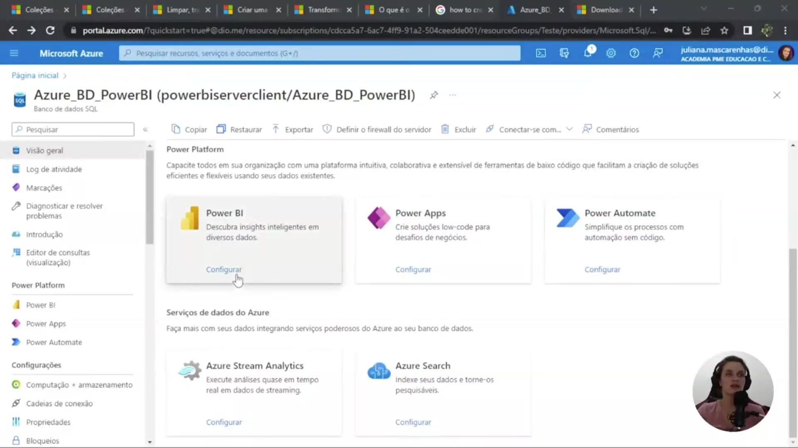
</p>

A interface de **Integrações** demonstra a capacidade de expansão do ecossistema Azure. É possível conectar o banco de dados a serviços como o **Azure Stream Analytics**, para análise de dados em tempo real, e o **Azure Search**, para tornar os dados indexáveis e pesquisáveis, além das ferramentas da **Power Platform**.

<p align="center">
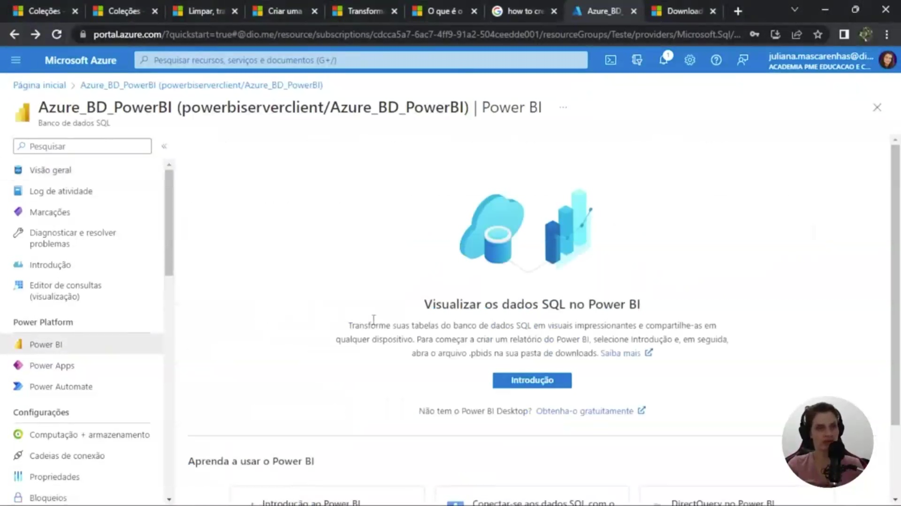
</p>

Focando especificamente na integração com o **Power BI**, esta tela permite transformar tabelas SQL em relatórios visuais. O usuário pode baixar um arquivo de conexão (`.pbids`) clicando em **Introdução**, facilitando a abertura do projeto diretamente no Power BI Desktop para iniciar a visualização dos dados.

<p align="center">
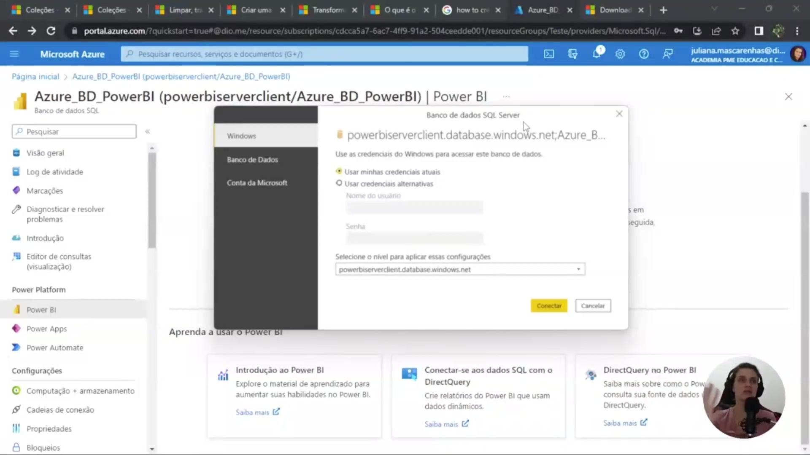
</p>

Ao iniciar a conexão com o Power BI, é exibida a janela de configuração de acesso ao banco de dados SQL Server. Nela, deve-se confirmar o endereço do servidor e escolher o método de autenticação, como o uso de **credenciais do Windows**, **Banco de Dados** ou **Conta da Microsoft**, além de definir o nível de aplicação das configurações para o servidor especificado.      


### 🟩 Vídeo 13 - Considerações sobre Integração com NoSQL e Armazenamento de Dados do Power BI

<video width="60%" controls>
  <source src="000-Midia_e_Anexos/bootcamp_ntt_data-modulo.07-curso.01-video_13.webm" type="video/webm">
    Seu navegador não suporta vídeo HTML5.
</video>

link do vídeo: https://web.dio.me/track/engenharia-dados-python/course/coleta-e-extracao-de-dados-com-power-bi/learning/92e36d2b-3431-4eaa-9c0e-b8e853bc6783?autoplay=1

Este resumo aborda as estratégias de conexão do Power BI com diferentes fontes de dados, destacando as diferenças entre bancos relacionais e não relacionais, além de explorar os métodos de armazenamento de dados e suas implicações em segurança e performance.

### Anotações

<p align="center">
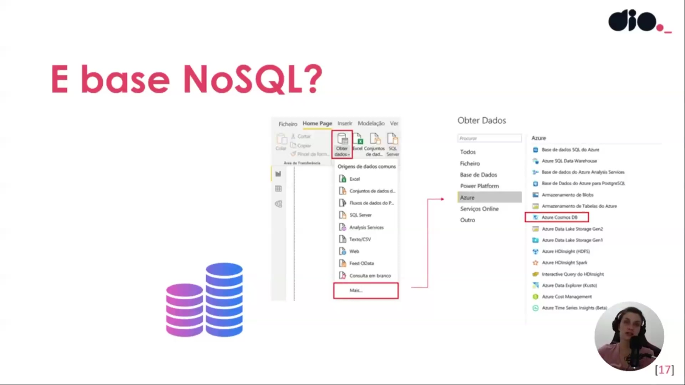
</p>

Nesta etapa, a interface do Power BI exibe a janela **Obter Dados**, destacando a categoria **Azure**. A ferramenta oferece uma ampla gama de conectores nativos para o ecossistema de nuvem da Microsoft, permitindo a integração com diversos serviços de armazenamento e processamento de dados. Entre as opções visíveis, destacam-se:

* **Base de dados SQL do Azure**: Para conexões com bancos de dados relacionais.
* **Azure SQL Data Warehouse**: Para grandes volumes de dados estruturados.
* **Azure Analysis Services**: Para modelos de dados tabulares.
* **Base de Dados do Azure para PostgreSQL**: Refletindo a flexibilidade da plataforma em suportar diferentes tecnologias de banco de dados.

<p align="center">
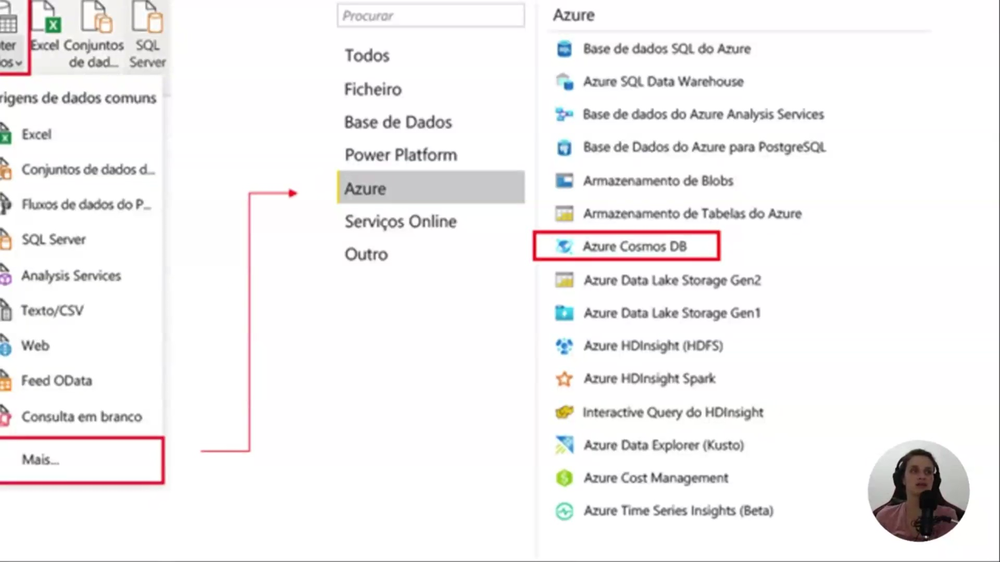
</p>

A imagem detalha o menu suspenso de **Origens de dados comuns** dentro da guia "Home Page". Este menu de acesso rápido lista as fontes mais frequentes utilizadas em projetos de Business Intelligence, como Excel, SQL Server, Analysis Services e feeds de dados Web/OData. A opção **Mais...** na parte inferior é o caminho necessário para abrir a janela completa de conectores (como a do Azure vista anteriormente), caso a fonte desejada não esteja na lista de atalhos iniciais.

<p align="center">
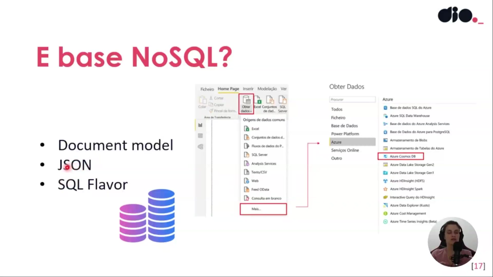
</p>

Neste ponto, o foco volta-se para as bases **NoSQL**, especificamente o **Azure Cosmos DB**. Ao contrário dos bancos relacionais tradicionais que utilizam tabelas, o Cosmos DB trabalha com um modelo orientado a documentos (**Document Model**), onde as informações são frequentemente persistidas no formato **JSON**.

Apesar de ser uma estrutura não relacional, ele oferece o que é chamado de **SQL Flavor**: uma linguagem de consulta que possui uma sintaxe similar ao SQL tradicional, facilitando a extração de dados por profissionais que já possuem experiência com bancos relacionais.

<p align="center">

</p>

A escolha de como os dados serão armazenados no Power BI é uma decisão estratégica que equilibra **facilidade versus disponibilidade**. As principais modalidades visíveis na interface são:

* **Importar (Import)**: Os dados são carregados e armazenados no ficheiro do Power BI, garantindo alta performance de interação, mas exigindo publicação conjunta com o relatório.
* **DirectQuery**: O Power BI não armazena os dados, realizando consultas diretamente à origem sem importar os dados originais. É ideal para garantir a versão mais atualizada ou lidar com requisitos de segurança de dados sensíveis.
* **Dual (Misto)**: Permite que o modo de armazenamento varie de acordo com o recurso ou necessidade específica.

Essa definição impacta o acesso aos dados, o tempo de carregamento e as permissões de acesso necessárias para os usuários. Enquanto o SQL Server permite as opções Importar e DirectQuery, outros conectores, como o MySQL, podem suportar apenas a importação direta.      

### 🟩 Vídeo 14 - Como lidar com Problemas de Desempenho no Power BI

<video width="60%" controls>
  <source src="000-Midia_e_Anexos/bootcamp_ntt_data-modulo.07-curso.01-video_14.webm" type="video/webm">
    Seu navegador não suporta vídeo HTML5.
</video>

link do vídeo: https://web.dio.me/track/engenharia-dados-python/course/coleta-e-extracao-de-dados-com-power-bi/learning/1458b942-0e31-4476-8ddb-d013900a097a?autoplay=1

Este guia resume as estratégias para melhorar o desempenho de relatórios no Power BI, focando na técnica de Dobragem de Consulta (Query Folding) e em boas práticas de manipulação de dados.

### Anotações

<p align="center">

</p>

Nesta etapa inicial, o foco recai sobre a análise de performance em projetos de Business Intelligence. Após a compreensão técnica de como conectar diversas fontes de dados — como Excel, CSV, APIs e bancos de dados SQL — o analista deve se preocupar com o impacto direto que o processamento dessas informações causa na renderização dos relatórios no Power BI.

<p align="center">

</p>

Existem diversos problemas técnicos (issues) que podem comprometer a experiência do usuário final. Entre os principais gargalos identificados, destacam-se:

* **Gargalo de acesso:** Dificuldade ou demora na conexão com a fonte de dados.
* **Tempo de execução:** Consultas complexas que levam muito tempo para retornar resultados.
* **Lentidão no carregamento:** Impacto causado pela importação de grandes volumes de dados (milhares de linhas).
* **Erros de importação e falhas físicas:** Problemas relacionados a integridade de arquivos, falhas em discos ou servidores.

<p align="center">

</p>

Uma das principais soluções para otimizar o desempenho é a técnica de **Dobragem de Consultas** (Query Folding). Este processo permite que as transformações aplicadas no Power Query sejam convertidas em instruções que a fonte de origem entende, resultando em:

* **Aumento de desempenho:** Otimização do tempo de resposta.
* **Transformações controladas pela tool:** O Power BI gerencia como a consulta será enviada.
* **Execução no servidor (SQL):** A carga de processamento é empurrada para o banco de dados original, evitando sobrecarga local.

<p align="center">

</p>

De acordo com a definição da Microsoft, o objetivo central da dobragem de consultas é garantir que as transformações de dados ocorram diretamente no servidor de origem. Isso libera os recursos computacionais do Power BI, que não precisará processar cada etapa de limpeza e edição localmente, utilizando a capacidade de processamento do hardware onde os dados residem.

<p align="center">

</p>

A aplicação da dobragem de consultas traz benefícios práticos em todo o ecossistema de ferramentas, do Excel ao Power BI:

* **Mais eficiência em atualizações de dados:** O Power BI aloca melhor os recursos e atualiza as tabelas de forma acelerada.
* **Compatibilidade automática com modos de armazenamento:** Essencial para o funcionamento de conexões do tipo **DirectQuery** e **Dual** (Duplo), que dependem da capacidade do back-end para processar as solicitações em tempo real.

<p align="center">

</p>

Além da dobragem de consultas, outras boas práticas são fundamentais para garantir a performance máxima:

1. **Processar dados na origem:** Realizar o máximo de filtros e tratamentos antes dos dados chegarem ao Power BI.
2. **Utilizar SQL nativo:** Priorizar consultas diretas em bancos relacionais, evitando procedimentos armazenados ou expressões de tabela muito complexas que impeçam o folding.
3. **Separar data e hora:** Dividir campos de *DateTime* em colunas distintas de data e de hora para tornar a indexação e a pesquisa mais eficientes.
4. **Manter a base atualizada:** Garantir a manutenção constante da base de dados utilizada para sustentar o desempenho ao longo do tempo.      

### 🟩 Vídeo 15 - Integrando Power BI com SQL Server na Azure com DirectQuery

<video width="60%" controls>
  <source src="000-Midia_e_Anexos/bootcamp_ntt_data-modulo.07-curso.01-video_15.webm" type="video/webm">
    Seu navegador não suporta vídeo HTML5.
</video>

link do vídeo: https://web.dio.me/track/engenharia-dados-python/course/coleta-e-extracao-de-dados-com-power-bi/learning/1cf45d76-d80f-4ce9-b951-f9ce80d1a677?autoplay=1

Este guia prático detalha o processo de conexão, transformação e visualização de dados entre o Power BI e uma instância de banco de dados SQL hospedada no Azure. O foco principal está na utilização do método DirectQuery e nas nuances de autenticação e modelagem.

# Certificado: Coleta e Extração de Dados com Power BI

- Link na plataforma: https://hermes.dio.me/certificates/2FW0YSCV.pdf
- Certificado em pdf: [tCertificado-Coleta_e_Extracao_de_Dados_com_Power_BI.pdf](<000-Midia_e_Anexos/Certificado-Coleta e Extração de Dados com Power BI.pdf>)