## Instrutor:

- Juliana Mascarenhas (Tech Education Specialist / Sócia (Content Creator) @SimplificandoRedes / Me Modelagem Computacional / Cientista de dados)
- Contato Linkedin: / [juliana-mascarenhas-ds](https://www.linkedin.com/in/juliana-mascarenhas-ds/)

## Parte 1 - Limpeza e Transformação de Dados com Power BI

### 🟩 Vídeo 01 - Limpeza de Dados: Dados brutos e tratados (limpos)

<video width="60%" controls>
  <source src="000-Midia_e_Anexos/bootcamp_ntt_data-modulo.07-curso.02-video_01.webm" type="video/webm">
    Seu navegador não suporta vídeo HTML5.
</video>

link do vídeo: https://web.dio.me/track/engenharia-dados-python/course/limpeza-e-transformacao-de-dados-com-power-bi/learning/4163c1d1-0f47-47ec-bbc6-313ca6f26720?autoplay=1

Este módulo foca na etapa crítica do pipeline de dados: o processamento. O instrutor adota uma abordagem "top-down", partindo da visão geral do relatório para os detalhes técnicos de como tornar os dados brutos em informações legíveis e confiáveis. O objetivo central é utilizar o Power BI (especificamente o Power Query) para tratar inconsistências e preparar os dados para análises precisas.

### Anotações

#### Introdução à Limpeza e Transformação de Dados

<p align="center">

</p>

Esta aula introduz a fase de processamento de dados dentro de um pipeline, adotando uma abordagem "top-down" que parte do alto nível (relatórios) para a prática técnica. O foco central deste módulo é o processamento de dados, abrangendo desde a coleta até a análise final. O objetivo é capacitar o uso do Power BI para transformar dados brutos em informações legíveis e livres de inconsistências ou redundâncias.

#### Objetivos do Curso e Interface do Power BI

<p align="center">

</p>

O objetivo principal é a execução de processos de limpeza e transformação de dados utilizando a interface amigável do Power BI. Embora existam recursos avançados como a linguagem DAX (*Data Analysis Expressions*) para a criação de medidas e colunas, estes tópicos serão abordados em módulos futuros dedicados à modelagem.

#### Desafios com Fontes de Dados Heterogêneas

<p align="center">

</p>

Na prática, os dados são extraídos de diversas fontes heterogêneas, como SQL Server, Excel, Cosmos DB e SharePoint. Cada uma dessas fontes possui estruturas e padrões próprios, o que exige um processo de aglutinação coerente realizado através do Power Query antes que a análise final ocorra no Microsoft Power BI.

#### Identificação de Problemas nos Dados

<p align="center">

</p>

Dados brutos frequentemente não estão prontos para análise devido a problemas como:

* **Tipagem incoerente:** Colunas de status definidas erroneamente como tipos numéricos.
* **Erros e Redundâncias:** Erros de digitação, nomenclaturas mal definidas e duplicações.
* **Valores Nulos:** Presença de campos vazios que dificultam funções matemáticas de agregação.
* **Atributos Compostos:** Colunas complexas, como endereços completos em um único campo, que precisam ser divididas.

#### Consequências de Dados Não Tratados

<p align="center">

</p>

A despadronização dos dados acarreta resultados incorretos e relatórios equivocados. O impacto final é uma má tomada de decisão por parte dos gestores, baseada em informações que não refletem a realidade factual.

#### Resultados Alcançados com Dados Limpos

<p align="center">

</p>

Ao realizar a limpeza, garantimos:

* **Precisão:** Cálculos e funções matemáticas geram resultados confiáveis.
* **Organização:** Tabelas bem estruturadas e remoção de duplicatas desnecessárias.
* **Simplicidade:** Divisão de colunas complexas em colunas mais simples e combinação de dados para facilitar a leitura.
* **Humanização:** Substituição de códigos inteiros (como 0 e 1) por valores legíveis, como "Confirmado" ou "Enviado".

#### O Foco no Fluxo de Transformação

<p align="center">

</p>

O pipeline do Power BI envolve coleta, transformação, criação de dashboards e publicação. Este curso foca especificamente na etapa de **Transformação (Power Query)**. A abordagem inverte a ordem tradicional para que o aluno veja primeiro os resultados visuais e depois entenda a necessidade crítica de limpar os dados para corrigir as imperfeições do mundo real.

#### Estratégias de Resolução no Power BI Desktop

<p align="center">

</p>

Para resolver inconsistências, o Power BI Desktop permite substituir valores, analisar a qualidade das colunas e combinar consultas. Além da interface visual, é possível entender e modificar o **Código M**, que é a linguagem de script executada em segundo plano durante cada etapa de transformação.

#### Acesso ao Editor de Consultas

<p align="center">
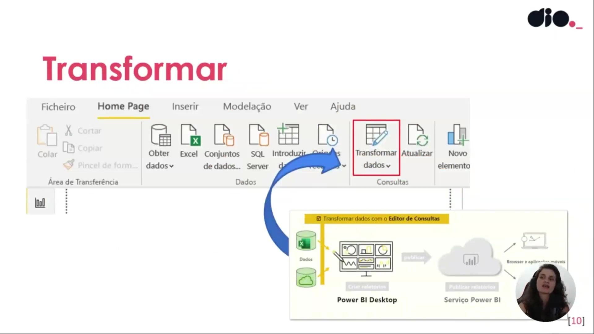
</p>

A transformação prática começa através da guia "Página Inicial" (Home Page) do Power BI Desktop, utilizando a opção **Transformar dados**. Este comando abre o editor de consultas onde todas as operações de limpeza mencionadas são realizadas.


### 🟩 Vídeo 02 - Explorando Power Query com 1° Exemplo Prático

<video width="60%" controls>
  <source src="000-Midia_e_Anexos/bootcamp_ntt_data-modulo.07-curso.02-video_02.webm" type="video/webm">
    Seu navegador não suporta vídeo HTML5.
</video>

link do vídeo: https://web.dio.me/track/engenharia-dados-python/course/limpeza-e-transformacao-de-dados-com-power-bi/learning/64e2651a-a4b6-4c5e-9625-ab2cda79ec07?autoplay=1

Este resumo aborda as técnicas essenciais de tratamento de dados demonstradas no vídeo, focando no uso do Power Query para resolver inconsistências comuns em datasets, como erros de cabeçalho, tipos de dados incorretos e linhas desnecessárias.

### Anotações

<p align="center">
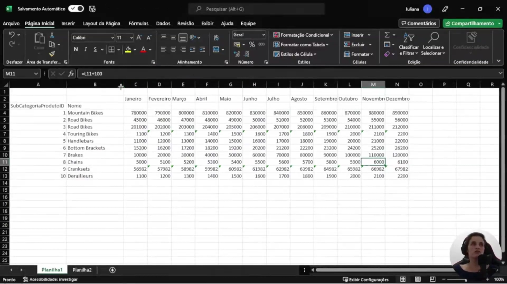
</p>

Para simular situações reais de inconsistência que o analista pode encontrar ao importar dados de arquivos manuais (como CSV ou Excel), é apresentado um dataset de teste no Microsoft Excel. O objetivo é demonstrar como o Power BI lida com estruturas de dados mal formuladas, como a presença de linhas extras no topo do arquivo que podem impedir a identificação automática das colunas e cabeçalhos.

<p align="center">
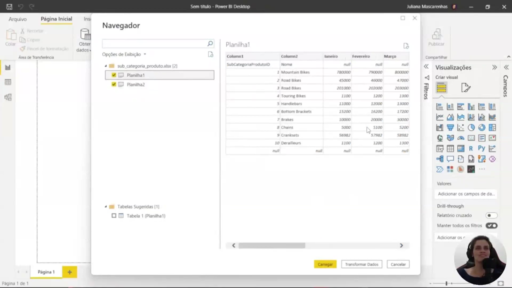
</p>

Ao importar o arquivo para o Power BI, a janela de Navegador revela que a ferramenta não conseguiu identificar automaticamente os cabeçalhos das colunas devido à formatação irregular da planilha original. Em vez de carregar os dados diretamente, utiliza-se a opção **Transformar Dados** para abrir o **Editor do Power Query**, onde as etapas de limpeza e normalização serão executadas e registradas.

<p align="center">
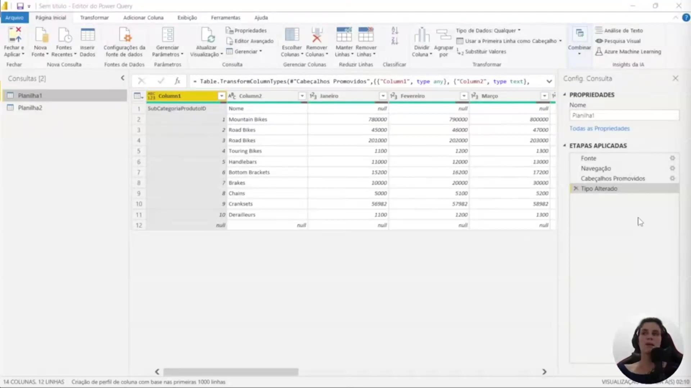
</p>

Dentro do Power Query, as transformações são aplicadas sobre uma visão dos dados, sem alterar o arquivo original. Uma das primeiras ações de saneamento é a definição correta dos tipos de dados. Como os valores de vendas por mês são numéricos, é possível alterar o tipo da coluna para **Número Decimal** ou **Decimal Fixo** através do menu de contexto ou da guia Transformar, garantindo que o Power BI consiga realizar cálculos de agregação (soma, média, etc.) posteriormente.

```powerquery
Table.TransformColumnTypes(#"Cabeçalhos Promovidos", {{"Column1", type any}, {"Column2", type text}})

```

<p align="center">
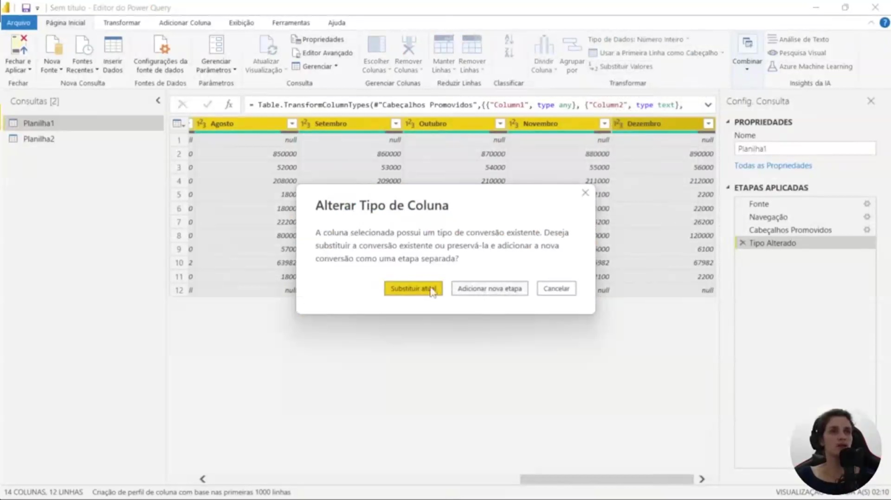
</p>

Para corrigir problemas de posicionamento de cabeçalhos, o Power Query oferece ferramentas para manipulação de linhas. No caso de haver linhas indesejadas no topo (como títulos ou espaços vazios), utiliza-se a função **Remover Linhas Superiores**. Ao definir a quantidade de linhas a serem removidas (ex: 1 linha), os dados reais sobem na estrutura da tabela, permitindo que a linha correta seja promovida a cabeçalho.

<p align="center">
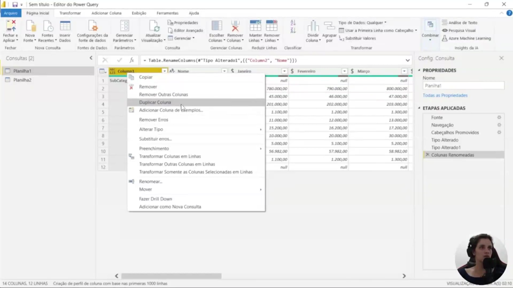
</p>

Além do tratamento de linhas, a gestão de colunas é essencial para otimizar o modelo de dados. Através do menu **Gerenciar Colunas**, é possível remover colunas desnecessárias ou selecionar especificamente quais devem ser mantidas (como o nome do produto e os meses de um trimestre específico). Caso a tabela seja muito extensa, a função **Ir para a coluna** facilita a navegação rápida entre campos distantes, como localizar a coluna de "Dezembro" sem a necessidade de rolagem manual.

```powerquery
Table.RenameColumns(#"Tipo Alterado1", {{"Column2", "Nome"}})

```

### 🟩 Vídeo 03 - Quando Devemos Remover Dados do Projeto com Power BI

<video width="60%" controls>
  <source src="000-Midia_e_Anexos/bootcamp_ntt_data-modulo.07-curso.02-video_03.webm" type="video/webm">
    Seu navegador não suporta vídeo HTML5.
</video>

link do vídeo: https://web.dio.me/track/engenharia-dados-python/course/limpeza-e-transformacao-de-dados-com-power-bi/learning/5cc8bf28-8b75-45cb-b355-ae45a06d37d3?autoplay=1

Este guia aborda a importância da limpeza de dados, focando na remoção de colunas desnecessárias para melhorar a performance e a clareza dos relatórios. O conteúdo explora como a estrutura dos dados influencia diretamente as visualizações e as funções matemáticas aplicadas pelo Power BI.

### Anotações

<p align="center">
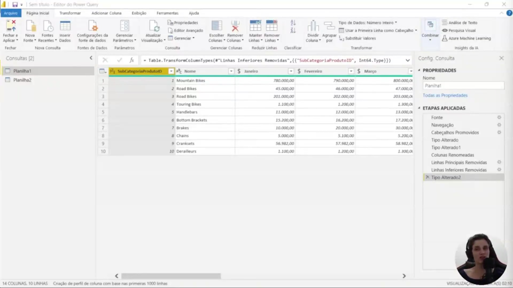
</p>

Nesta etapa inicial dentro do **Editor do Power Query**, observamos a base de dados bruta antes das principais limpezas. A interface apresenta colunas de identificação e valores distribuídos mensalmente. O foco recai sobre a coluna `SubCategoriaProdutoID`, que contém identificadores numéricos que, embora úteis para o sistema, podem ser irrelevantes para o consumidor final do relatório.

Um ponto crítico destacado é a **performance**: carregar colunas desnecessárias em bases de dados com milhares ou milhões de linhas exige mais processamento para renderizar o relatório, afetando o desempenho geral da ferramenta.

```powerquery
Table.TransformColumnTypes("Linhas Inferiores Removidas", {{"SubCategoriaProdutoID", Int64.Type}})

```

<p align="center">
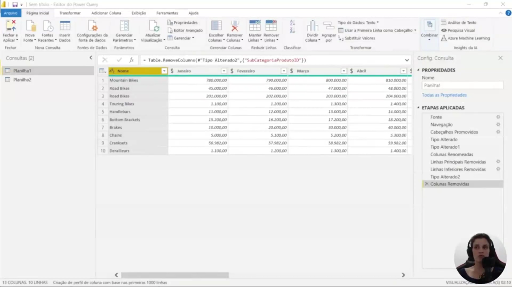
</p>

Aqui é executada a ação de **remover colunas** que não agregam valor à análise de negócio. Ao eliminar o ID do produto, simplificamos o modelo de dados. Esta é uma boa prática de design de relatórios: priorizar atributos e nomes que o usuário consiga entender imediatamente ao "bater o olho", como o nome da categoria ou o valor das vendas.

A remoção precoce de dados não utilizados facilita a etapa de **modelagem**, pois reduz a complexidade dos relacionamentos que o Power BI criará automaticamente entre as tabelas.

```powerquery
Table.RemoveColumns("Tipo Alterado2", {"SubCategoriaProdutoID"})

```

<p align="center">
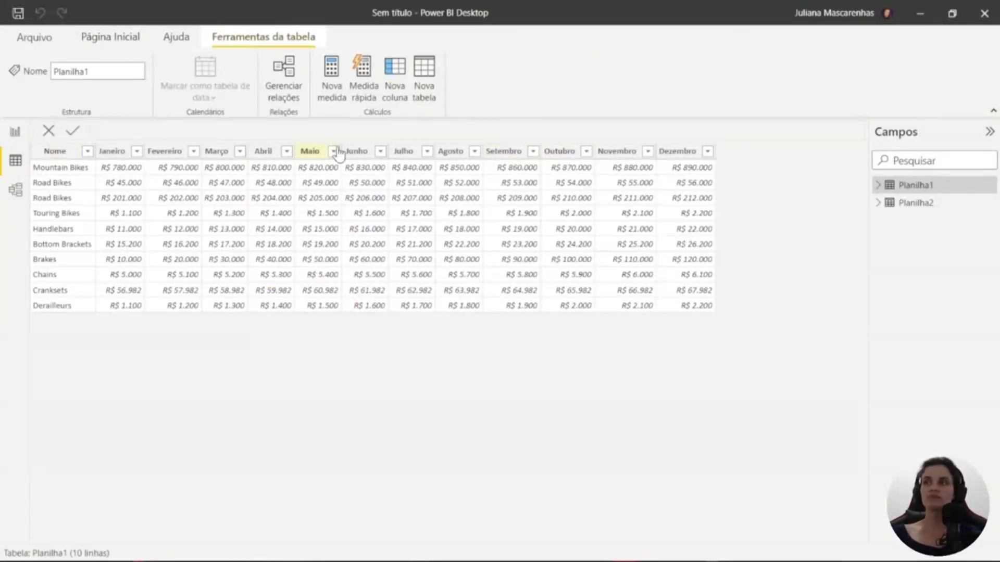
</p>

Após aplicar as transformações e carregar os dados para o Power BI Desktop, visualizamos a tabela tratada. Os dados estão estruturados de forma que cada linha representa uma categoria de produto e cada coluna representa um mês do ano (Janeiro, Fevereiro, Março, etc.), com seus respectivos valores formatados em moeda (R$).

Nesta visualização, é possível renomear campos diretamente na estrutura do modelo para tornar a interface mais intuitiva, como alterar o nome da coluna principal para **Categoria**.

<p align="center">
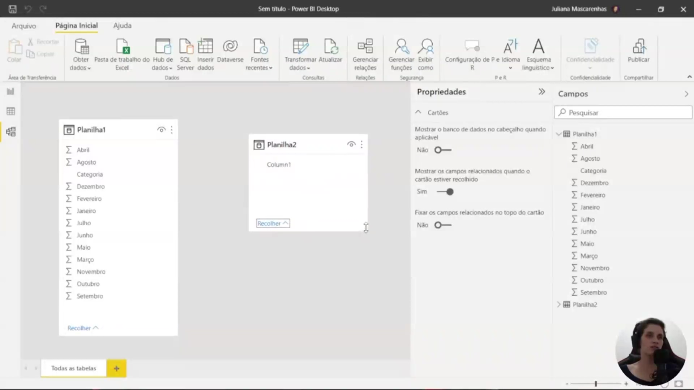
</p>

No painel de **Campos**, observamos como o Power BI interpreta a estrutura da tabela carregada. Note o símbolo de somatório () ao lado de cada mês. Isso indica que, devido à forma como os dados foram importados (com meses em colunas separadas), a ferramenta entende cada mês como um campo numérico individual passível de agregação.

Essa estrutura dita como os visuais serão construídos, tratando cada mês como uma métrica de valor independente no relatório atual.

<p align="center">
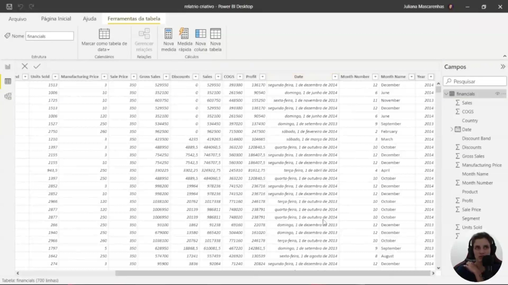
</p>

Para fins de comparação, este exemplo utiliza a tabela `financials` para demonstrar uma estrutura de dados diferente. Diferente do exemplo anterior, aqui temos:

* **Coluna de Data única:** Em vez de colunas para cada mês, existe uma coluna `Date` que permite criar hierarquias (ano, trimestre, mês e dia).
* **Métricas Consolidadas:** Campos como `Sales` (Vendas) e `Profit` (Lucro) aparecem como colunas únicas.

A estrutura dos dados influencia diretamente as funções matemáticas que o Power BI aplicará e a flexibilidade das visões que podem ser geradas.      


### 🟩 Vídeo 04 - Transformando Colunas em Linhas com Power BI

<video width="60%" controls>
  <source src="000-Midia_e_Anexos/bootcamp_ntt_data-modulo.07-curso.02-video_04.webm" type="video/webm">
    Seu navegador não suporta vídeo HTML5.
</video>

link do vídeo: https://web.dio.me/track/engenharia-dados-python/course/limpeza-e-transformacao-de-dados-com-power-bi/learning/d7b40444-f4eb-4a5c-a49b-dff8aad693f7?autoplay=1

Este guia foca na técnica de "Unpivot" (Transformar Colunas em Linhas), uma das etapas mais cruciais na preparação de dados. O objetivo é converter planilhas no "estilo Excel" (onde os dados estão espalhados horizontalmente) em tabelas no "estilo Banco de Dados" (onde os dados estão organizados verticalmente), facilitando cálculos e visualizações.

### Anotações

<p align="center">
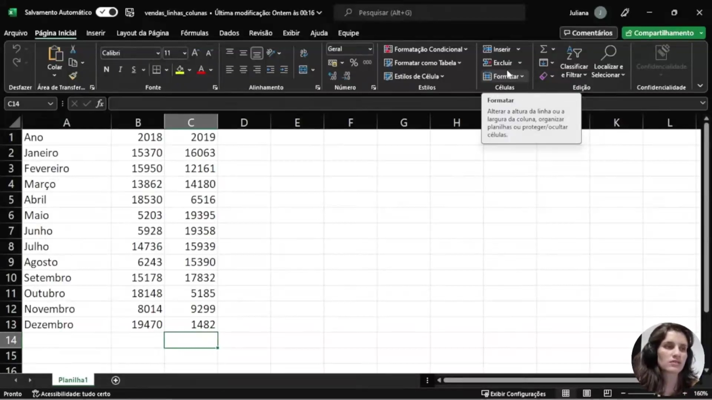
</p>

A estrutura inicial apresentada no Excel exibe uma organização comum de dados, onde o **Mês** ocupa as linhas e os anos (**2018** e **2019**) estão dispostos como cabeçalhos de colunas. Embora visualmente clara para humanos, essa disposição cria dificuldades no Power BI para a execução de funções matemáticas de agregação, como somatórios e contagens, pois as vendas não estão consolidadas em um único campo, mas sim distribuídas por colunas de anos distintos.

<p align="center">
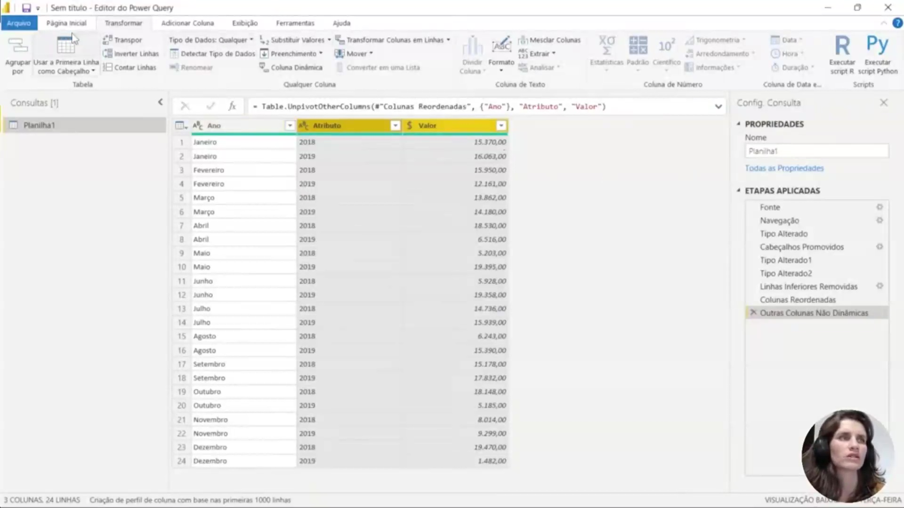
</p>

Ao importar os dados para o Editor do Power Query, é aplicada a operação de **Transformar Colunas em Linhas** (Unpivot). O objetivo é "rotacionar" a tabela para que os anos deixem de ser cabeçalhos e passem a ser valores dentro de uma coluna de atributos, permitindo que cada linha represente uma combinação única de mês, ano e valor de venda.

```powerquery
= Table.UnpivotOtherColumns("Colunas Reordenadas", {"Ano"}, "Atributo", "Valor")

```

<p align="center">
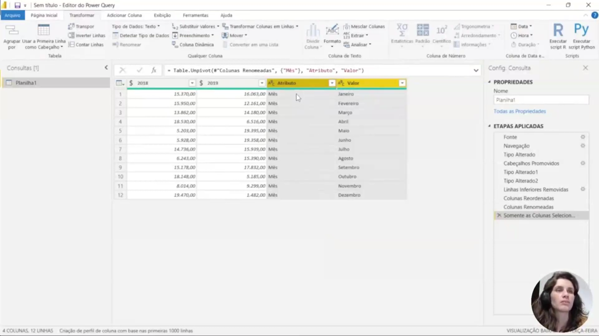
</p>

Além do unpivot, o editor permite explorar outras formas de reorganização, como a função **Transpor**, que inverte totalmente a orientação de linhas e colunas. No entanto, se os cabeçalhos não forem tratados corretamente, a tabela pode resultar em uma estrutura confusa com inúmeras colunas numeradas (Coluna 1, Coluna 2, etc.), o que dificulta a agregação e análise automática dos dados pelo Power BI.

```powerquery
Table.Unpivot("Colunas Renomeadas", {"Mês"}, "Atributo", "Valor")

```

<p align="center">
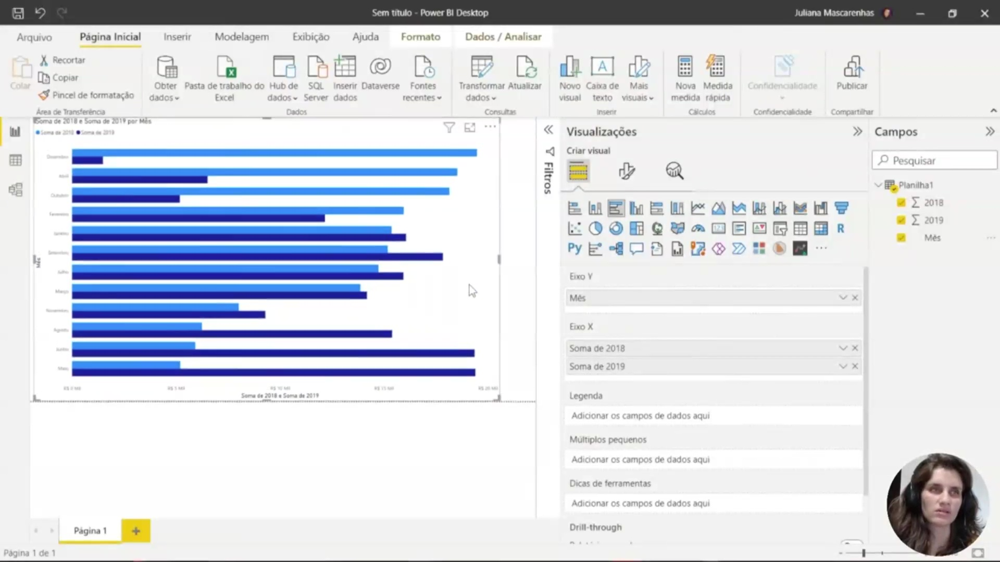
</p>

Nesta visualização de relatório, observa-se o comportamento do Power BI quando os dados ainda estão organizados com os anos em colunas separadas. O gráfico de área resultante precisa lidar com a **Soma de 2018** e a **Soma de 2019** como dois campos de dados independentes, em vez de uma única métrica de "Vendas" filtrada por uma dimensão de "Ano".

<p align="center">
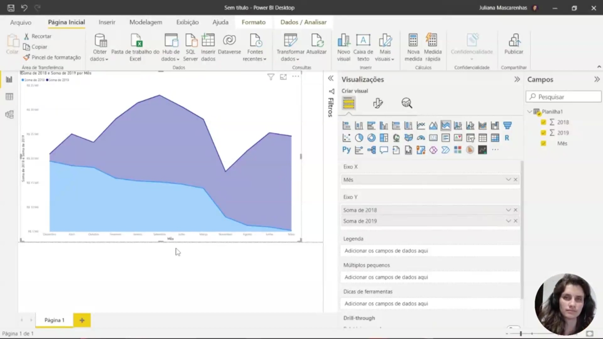
</p>

O painel de **Visualizações** e **Campos** detalha como essa estrutura "amarrada" limita a flexibilidade do analista. Como as vendas estão diretamente conectadas aos campos fixos de cada ano (**Σ 2018** e **Σ 2019**), torna-se mais complexo criar visões comparativas dinâmicas ou adicionar novas métricas, como lucros, que precisariam ser repetidas para cada nova coluna de ano inserida na planilha original.

<p align="center">
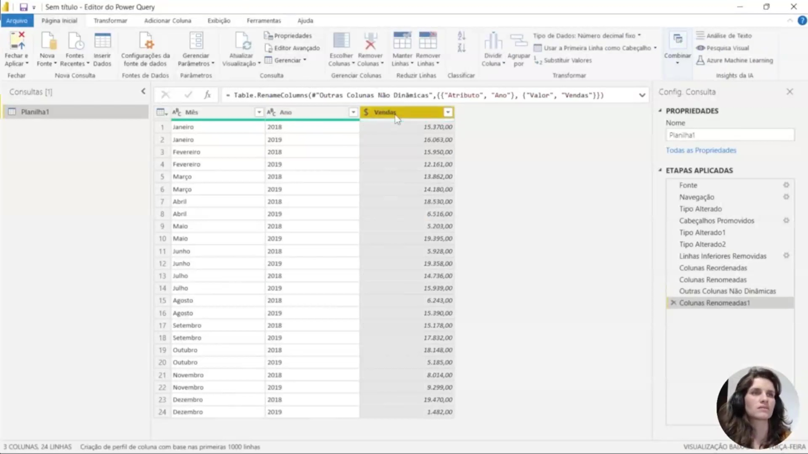
</p>

A solução definitiva consiste em renomear as colunas geradas após o unpivot para nomes semanticamente corretos: **Ano** (antigo Atributo) e **Vendas** (antigo Valor). Com essa estrutura normalizada, os elementos Ano, Mês e Vendas tornam-se independentes na estrutura de dados, mas interconectados para a visualização, permitindo que o Power BI gere relatórios muito mais dinâmicos e fáceis de manter.

```powerquery
Table.RenameColumns("Outras Colunas Não Dinâmicas", {{"Atributo", "Ano"}, {"Valor", "Vendas"}})

```      

### 🟩 Vídeo 05 - Colunas Dinâmicas – Pivot Column

<video width="60%" controls>
  <source src="000-Midia_e_Anexos/bootcamp_ntt_data-modulo.07-curso.02-video_05.webm" type="video/webm">
    Seu navegador não suporta vídeo HTML5.
</video>

link do vídeo: https://web.dio.me/track/engenharia-dados-python/course/limpeza-e-transformacao-de-dados-com-power-bi/learning/46a3f29c-caa4-4250-9419-b5932d7035c0?autoplay=1


### 🟩 Vídeo 06 - Explorando Diversos Recursos de Transformação de Dados com Power BI

<video width="60%" controls>
  <source src="000-Midia_e_Anexos/bootcamp_ntt_data-modulo.07-curso.02-video_06.webm" type="video/webm">
    Seu navegador não suporta vídeo HTML5.
</video>

link do vídeo: https://web.dio.me/track/engenharia-dados-python/course/limpeza-e-transformacao-de-dados-com-power-bi/learning/efb10386-e56f-48a1-97de-51c934f19ed5?autoplay=1

### 🟩 Vídeo 07 - Transformando a Estrutura de Dados com Terceiro Exemplo

<video width="60%" controls>
  <source src="000-Midia_e_Anexos/bootcamp_ntt_data-modulo.07-curso.02-video_07.webm" type="video/webm">
    Seu navegador não suporta vídeo HTML5.
</video>

link do vídeo:

### 🟩 Vídeo 08 - Mesclando Colunas com Power Query

<video width="60%" controls>
  <source src="000-Midia_e_Anexos/bootcamp_ntt_data-modulo.07-curso.02-video_08.webm" type="video/webm">
    Seu navegador não suporta vídeo HTML5.
</video>

link do vídeo:

### 🟩 Vídeo 09 - Explorando Exibição de Estatísticas da Base de Dados com Power Query

<video width="60%" controls>
  <source src="000-Midia_e_Anexos/bootcamp_ntt_data-modulo.07-curso.02-video_09.webm" type="video/webm">
    Seu navegador não suporta vídeo HTML5.
</video>

link do vídeo:

### 🟩 Vídeo 10 - Explorando a Linguagem M com Power Query

<video width="60%" controls>
  <source src="000-Midia_e_Anexos/bootcamp_ntt_data-modulo.07-curso.02-video_10.webm" type="video/webm">
    Seu navegador não suporta vídeo HTML5.
</video>

link do vídeo:


##  Materiais de Apoio

# Certificado: 

- Link na plataforma: 
- Certificado em pdf: