## Instrutor:

- Juliana Mascarenhas (Tech Education Specialist / Sócia (Content Creator) @SimplificandoRedes / Me Modelagem Computacional / Cientista de dados)
- Contato Linkedin: / [juliana-mascarenhas-ds](https://www.linkedin.com/in/juliana-mascarenhas-ds/)

### 🟩 Vídeo 01 - Descrevendo o desafio de projeto

<video width="60%" controls>
  <source src="000-Midia_e_Anexos/bootcamp_ntt_data-modulo.07-curso.03-video_01.webm" type="video/webm">
    Seu navegador não suporta vídeo HTML5.
</video>

link do vídeo: https://web.dio.me/project/processando-e-transformando-dados-com-power-bi/learning/a23f05bd-2d61-46b8-be0e-8d2ada4ef06a?back=/track/engenharia-dados-python&tab=undefined&moduleId=undefined

Nesta aula introdutória, Juliana Mascarenhas apresenta o desafio de projeto focado na coleta e processamento de dados utilizando o Power BI. O objetivo é capacitar o analista na manipulação de dados desde a sua origem até a sua preparação para análise, integrando conhecimentos de modelagem computacional e ciência de dados.

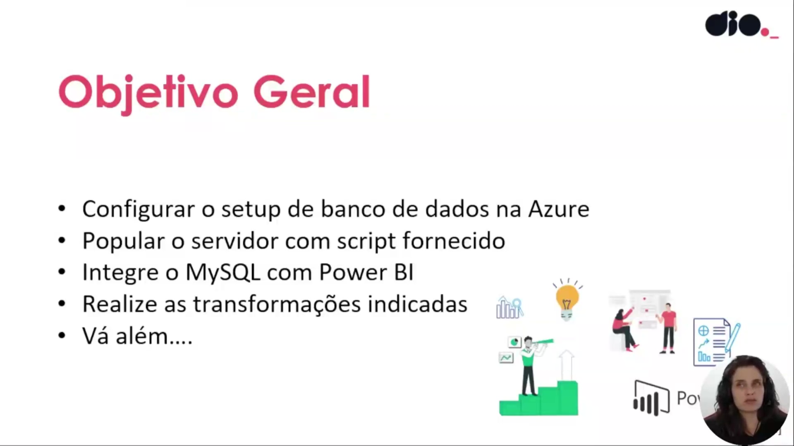

Os objetivos gerais deste desafio incluem a configuração de um ambiente de banco de dados na nuvem via Azure, o povoamento deste servidor utilizando scripts SQL fornecidos e a integração direta do MySQL com o Power BI. Além disso, o foco principal reside na execução das transformações de dados indicadas para refinar a base de informações.

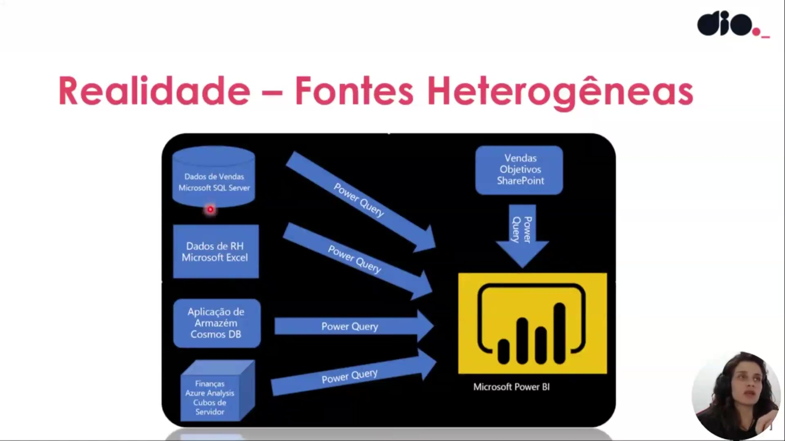

A realidade da análise de dados frequentemente envolve fontes heterogêneas. O diagrama ilustra como o Power Query atua como o motor de integração, conectando-se a diversas origens como Microsoft SQL Server (vendas), planilhas Excel (RH), Cosmos DB (armazém), SharePoint e Azure Analysis Services (finanças) para unificar essas informações dentro do ecossistema do Microsoft Power BI.

O fluxo de trabalho padrão no Power BI é dividido em etapas críticas: primeiro a coleta dos dados, seguida pela transformação e limpeza através do Power Query. Após o tratamento, os dados são utilizados na criação do dashboard, que é então publicado como um relatório final para consumo e inserção em painéis de indicadores.

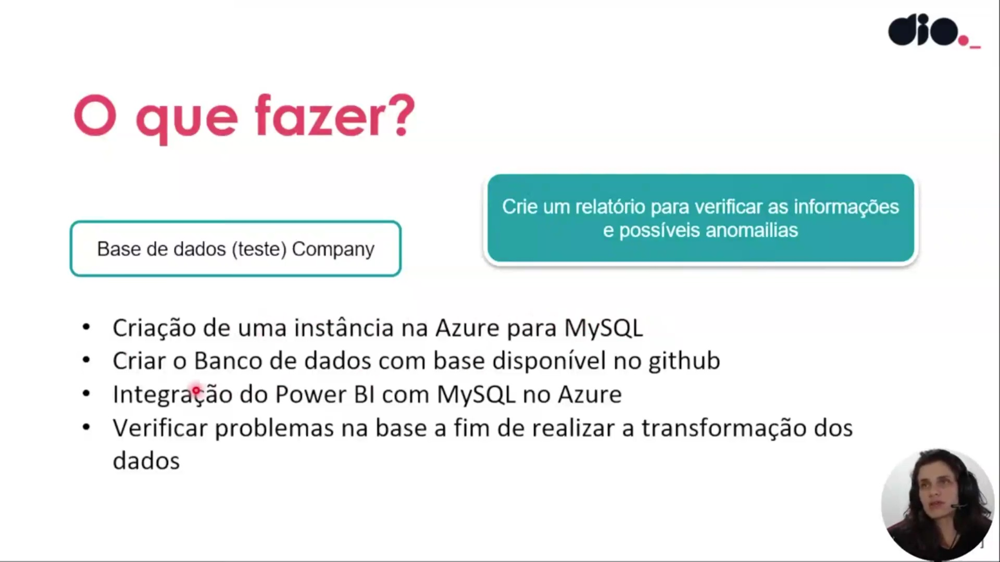

Para executar o desafio, o aluno deve seguir os seguintes passos práticos:

* Utilizar a base de dados de teste denominada "Company".

* Criar uma instância de MySQL no portal Azure.

* Configurar o banco de dados utilizando o script disponível no GitHub.

* Realizar a integração entre o Power BI e o banco MySQL hospedado na Azure.

* Verificar a base de dados para identificar anomalias antes de iniciar a transformação.

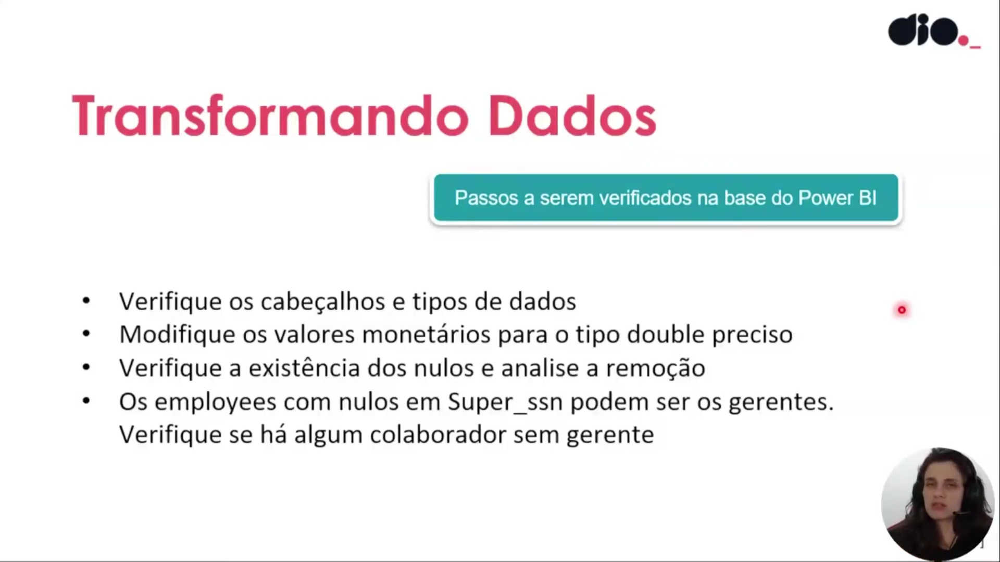

A primeira fase da transformação de dados no Power BI consiste na verificação de cabeçalhos e na correção dos tipos de dados. Valores monetários devem ser ajustados para o tipo "double preciso". É fundamental analisar a existência de valores nulos; especificamente, nota-se que colaboradores com o campo `Super_ssn` vazio geralmente representam os gerentes da organização.

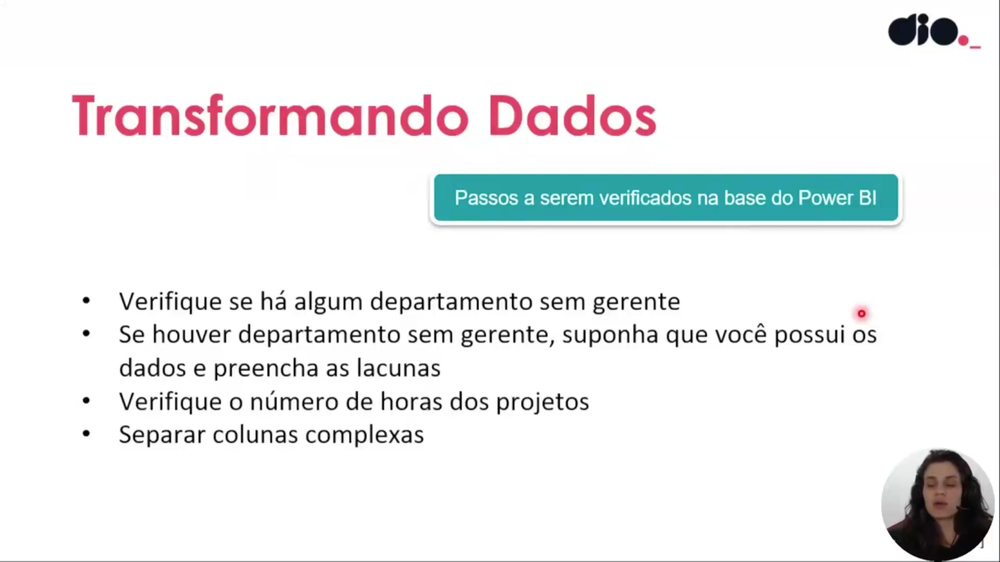

Dando continuidade à limpeza, deve-se verificar se existem departamentos sem gerentes designados, preenchendo as lacunas caso os dados estejam disponíveis. Outro ponto de atenção é a análise da contagem de horas dedicadas aos projetos e a separação de colunas complexas para facilitar a análise posterior.

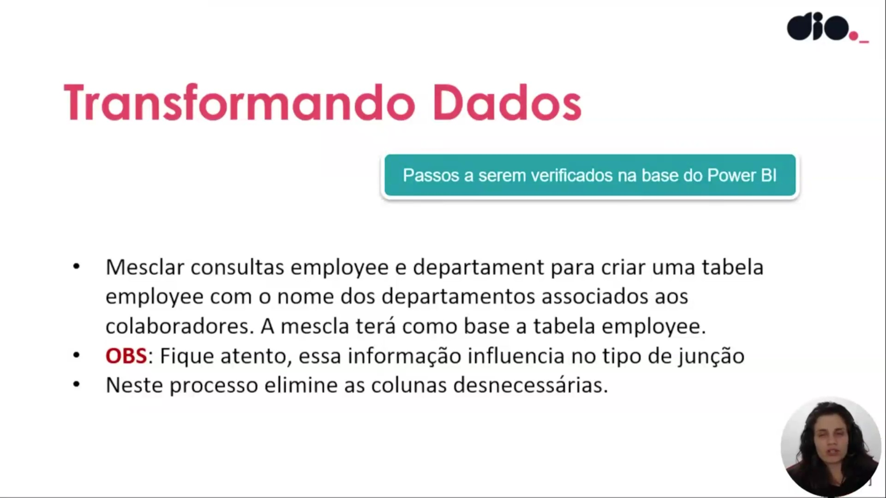

Nesta etapa, deve-se mesclar as consultas de colaboradores (`employee`) e departamentos (`department`) para que cada registro de funcionário contenha o nome do departamento associado. A operação deve utilizar a tabela `employee` como base, exigindo atenção cuidadosa ao tipo de junção (join) selecionado para não perder informações, além da exclusão de colunas redundantes após a mescla.

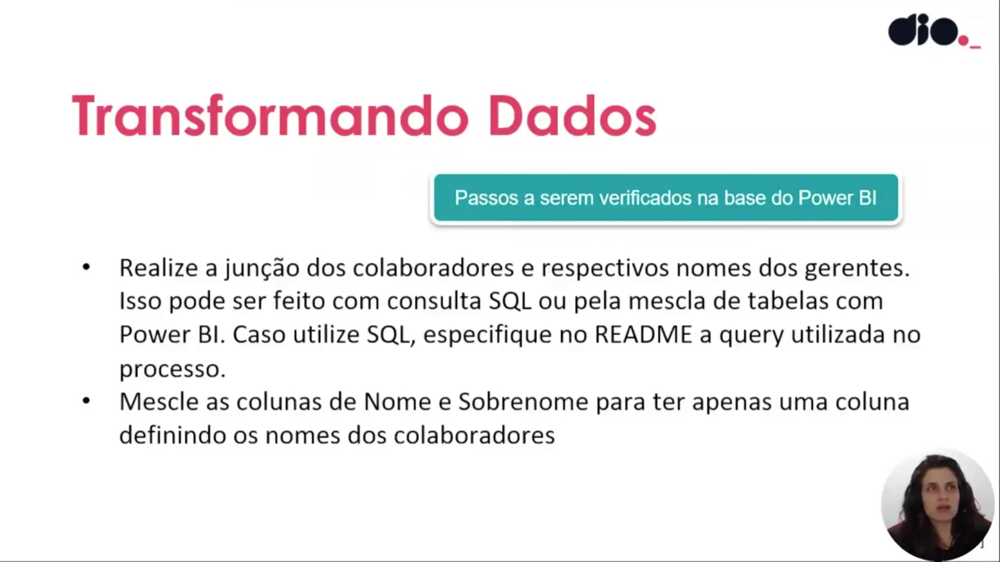

O processo segue com a junção entre colaboradores e seus respectivos gerentes, o que pode ser realizado via mescla no Power BI ou através de uma consulta SQL customizada. Além disso, é solicitado que as colunas de "Nome" e "Sobrenome" sejam mescladas em uma única coluna para padronizar a identificação dos colaboradores na base.

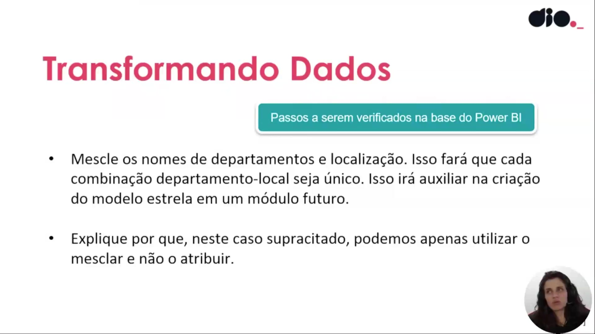

Para auxiliar na criação de um modelo estrela (star schema) futuro, deve-se mesclar os nomes de departamentos e suas localizações. Essa ação garante que cada combinação de departamento e local seja única dentro do modelo. É importante que o aluno saiba justificar por que, neste cenário específico, utiliza-se a operação de mesclagem em vez da atribuição.

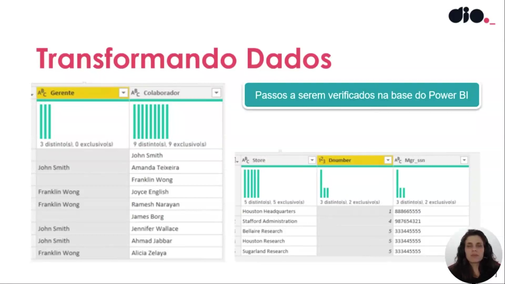

Neste ponto, a explicação foca na diferenciação entre as operações de "Mesclar" e "Atribuir/Acrescentar" no Power Query. A justificativa para o uso da mesclagem deve ser documentada no arquivo README do projeto, detalhando como essa escolha técnica impacta a estrutura final da base de dados.

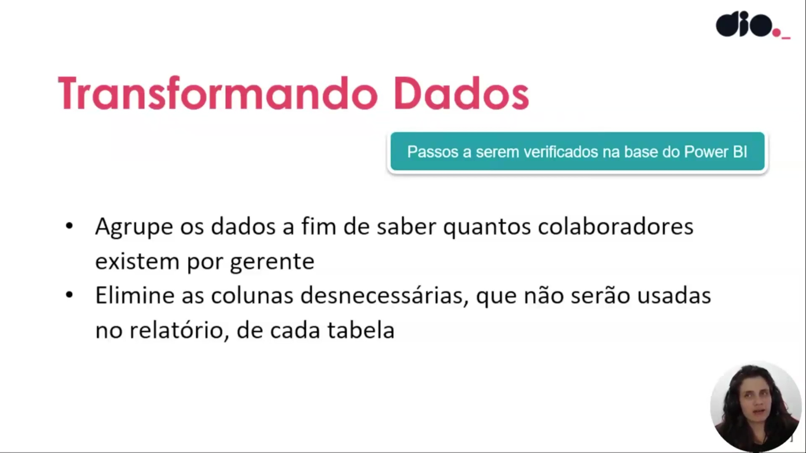

Ao lidar com relacionamentos muitos-para-muitos, o Power BI pode identificar automaticamente essa complexidade na base. O analista deve estar atento a como essas conexões são interpretadas pela ferramenta para garantir que as métricas calculadas reflitam a realidade organizacional sem distorções.

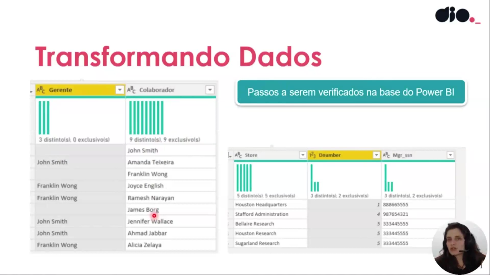

A etapa final consiste em agrupar os dados para contabilizar quantos colaboradores estão associados a cada gerente. Este procedimento permite validar a estrutura de gestão e identificar rapidamente anomalias, como gerentes sem subordinados ou colaboradores sem uma gerência definida, garantindo a integridade do relatório final.

### 🟩 Vídeo 02 - Criando uma instância do MySQL na Azure

<video width="60%" controls>
  <source src="000-Midia_e_Anexos/bootcamp_ntt_data-modulo.07-curso.03-video_02.webm" type="video/webm">
    Seu navegador não suporta vídeo HTML5.
</video>

link do vídeo: https://web.dio.me/lab/processando-e-transformando-dados-com-power-bi/learning/5d36411a-b5d9-416c-b759-2dde3cc8348d

### 🟩 Vídeo 03 - Explorando o Recurso - Instância do MySQL

<video width="60%" controls>
  <source src="000-Midia_e_Anexos/bootcamp_ntt_data-modulo.07-curso.03-video_03.webm" type="video/webm">
    Seu navegador não suporta vídeo HTML5.
</video>

link do vídeo:

### 🟩 Vídeo 04 - Se conectando ao Banco de Dados com Cloud Shell

<video width="60%" controls>
  <source src="000-Midia_e_Anexos/bootcamp_ntt_data-modulo.07-curso.03-video_04.webm" type="video/webm">
    Seu navegador não suporta vídeo HTML5.
</video>

link do vídeo:

### 🟩 Vídeo 05 - Criando Regra no Firewall na Azure para Acesso ao banco de dados

<video width="60%" controls>
  <source src="000-Midia_e_Anexos/bootcamp_ntt_data-modulo.07-curso.03-video_05.webm" type="video/webm">
    Seu navegador não suporta vídeo HTML5.
</video>

link do vídeo:

### 🟩 Vídeo 06 - Conectando ao MySQL na Azure utilizando Workbench

<video width="60%" controls>
  <source src="000-Midia_e_Anexos/bootcamp_ntt_data-modulo.07-curso.03-video_06.webm" type="video/webm">
    Seu navegador não suporta vídeo HTML5.
</video>

link do vídeo:

### 🟩 Vídeo 07 - Integrando Power BI com MySQL na Azure

<video width="60%" controls>
  <source src="000-Midia_e_Anexos/bootcamp_ntt_data-modulo.07-curso.03-video_07.webm" type="video/webm">
    Seu navegador não suporta vídeo HTML5.
</video>

link do vídeo:

### 🟩 Vídeo 08 - Entendendo o desafio

<video width="60%" controls>
  <source src="000-Midia_e_Anexos/bootcamp_ntt_data-modulo.07-curso.03-video_08.webm" type="video/webm">
    Seu navegador não suporta vídeo HTML5.
</video>

link do vídeo:

##  Materiais de Apoio

# Certificado: 

- Link na plataforma: 
- Certificado em pdf: