## Instrutor:

- Juliana Mascarenhas (Tech Education Specialist / Sócia (Content Creator) @SimplificandoRedes / Me Modelagem Computacional / Cientista de dados)
- Contato Linkedin: / [juliana-mascarenhas-ds](https://www.linkedin.com/in/juliana-mascarenhas-ds/)

### 🟩 Vídeo 01 - Descrevendo o desafio de projeto

<video width="60%" controls>
  <source src="000-Midia_e_Anexos/bootcamp_ntt_data-modulo.07-curso.03-video_01.webm" type="video/webm">
    Seu navegador não suporta vídeo HTML5.
</video>

link do vídeo: https://web.dio.me/project/processando-e-transformando-dados-com-power-bi/learning/a23f05bd-2d61-46b8-be0e-8d2ada4ef06a?back=/track/engenharia-dados-python&tab=undefined&moduleId=undefined

<p align="center">

</p>

Nesta aula introdutória, Juliana Mascarenhas apresenta o desafio de projeto focado na coleta e processamento de dados utilizando o Power BI. O objetivo é capacitar o analista na manipulação de dados desde a sua origem até a sua preparação para análise, integrando conhecimentos de modelagem computacional e ciência de dados.

<p align="center">

</p>

Os objetivos gerais deste desafio incluem a configuração de um ambiente de banco de dados na nuvem via Azure, o povoamento deste servidor utilizando scripts SQL fornecidos e a integração direta do MySQL com o Power BI. Além disso, o foco principal reside na execução das transformações de dados indicadas para refinar a base de informações.

<p align="center">

</p>

A realidade da análise de dados frequentemente envolve fontes heterogêneas. O diagrama ilustra como o Power Query atua como o motor de integração, conectando-se a diversas origens como Microsoft SQL Server (vendas), planilhas Excel (RH), Cosmos DB (armazém), SharePoint e Azure Analysis Services (finanças) para unificar essas informações dentro do ecossistema do Microsoft Power BI.

<p align="center">

</p>

O fluxo de trabalho padrão no Power BI é dividido em etapas críticas: primeiro a coleta dos dados, seguida pela transformação e limpeza através do Power Query. Após o tratamento, os dados são utilizados na criação do dashboard, que é então publicado como um relatório final para consumo e inserção em painéis de indicadores.

<p align="center">

</p>

Para executar o desafio, o aluno deve seguir os seguintes passos práticos:

* Utilizar a base de dados de teste denominada "Company".
* Criar uma instância de MySQL no portal Azure.
* Configurar o banco de dados utilizando o script disponível no GitHub.
* Realizar a integração entre o Power BI e o banco MySQL hospedado na Azure.
* Verificar a base de dados para identificar anomalias antes de iniciar a transformação.

<p align="center">

</p>

A primeira fase da transformação de dados no Power BI consiste na verificação de cabeçalhos e na correção dos tipos de dados. Valores monetários devem ser ajustados para o tipo "double preciso". É fundamental analisar a existência de valores nulos; especificamente, nota-se que colaboradores com o campo `Super_ssn` vazio geralmente representam os gerentes da organização.

<p align="center">

</p>

Dando continuidade à limpeza, deve-se verificar se existem departamentos sem gerentes designados, preenchendo as lacunas caso os dados estejam disponíveis. Outro ponto de atenção é a análise da contagem de horas dedicadas aos projetos e a separação de colunas complexas para facilitar a análise posterior.

<p align="center">

</p>

Nesta etapa, deve-se mesclar as consultas de colaboradores (`employee`) e departamentos (`department`) para que cada registro de funcionário contenha o nome do departamento associado. A operação deve utilizar a tabela `employee` como base, exigindo atenção cuidadosa ao tipo de junção (join) selecionado para não perder informações, além da exclusão de colunas redundantes após a mescla.

<p align="center">

</p>

O processo segue com a junção entre colaboradores e seus respectivos gerentes, o que pode ser realizado via mescla no Power BI ou através de uma consulta SQL customizada. Além disso, é solicitado que as colunas de "Nome" e "Sobrenome" sejam mescladas em uma única coluna para padronizar a identificação dos colaboradores na base.

<p align="center">

</p>

Para auxiliar na criação de um modelo estrela (star schema) futuro, deve-se mesclar os nomes de departamentos e suas localizações. Essa ação garante que cada combinação de departamento e local seja única dentro do modelo. É importante que o aluno saiba justificar por que, neste cenário específico, utiliza-se a operação de mesclagem em vez da atribuição.

<p align="center">

</p>

Neste ponto, a explicação foca na diferenciação entre as operações de "Mesclar" e "Atribuir/Acrescentar" no Power Query. A justificativa para o uso da mesclagem deve ser documentada no arquivo README do projeto, detalhando como essa escolha técnica impacta a estrutura final da base de dados.

<p align="center">

</p>

Ao lidar com relacionamentos muitos-para-muitos, o Power BI pode identificar automaticamente essa complexidade na base. O analista deve estar atento a como essas conexões são interpretadas pela ferramenta para garantir que as métricas calculadas reflitam a realidade organizacional sem distorções.

<p align="center">

</p>

A etapa final consiste em agrupar os dados para contabilizar quantos colaboradores estão associados a cada gerente. Este procedimento permite validar a estrutura de gestão e identificar rapidamente anomalias, como gerentes sem subordinados ou colaboradores sem uma gerência definida, garantindo a integridade do relatório final.

### 🟩 Vídeo 02 - Criando uma instância do MySQL na Azure

<video width="60%" controls>
  <source src="000-Midia_e_Anexos/bootcamp_ntt_data-modulo.07-curso.03-video_02.webm" type="video/webm">
    Seu navegador não suporta vídeo HTML5.
</video>

link do vídeo: https://web.dio.me/lab/processando-e-transformando-dados-com-power-bi/learning/5d36411a-b5d9-416c-b759-2dde3cc8348d

Este guia resume o processo de provisionamento de um servidor MySQL na nuvem Microsoft Azure, destacando as etapas de configuração, segurança e gestão de custos para ambientes de desenvolvimento.

### Anotações

<p align="center">

</p>

A jornada no Microsoft Azure começa pela sua página principal, onde é apresentado o conceito de "inventar com propósito". O portal destaca a flexibilidade da plataforma, permitindo que novos usuários explorem os serviços gratuitamente por até 30 dias ou iniciem com o modelo de pagamento conforme o uso, sem compromissos iniciais.

<p align="center">
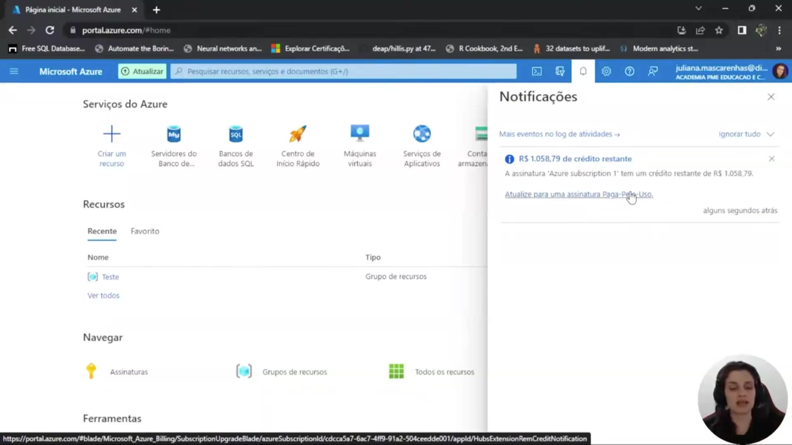
</p>

Uma vez autenticado no console do Azure, o usuário tem acesso ao Dashboard principal. A partir desta interface, é possível gerenciar recursos recentes e navegar por categorias de serviços essenciais, como Máquinas Virtuais, Serviços de Aplicativos e Bancos de Dados SQL. Para iniciar a configuração de um novo banco de dados, utiliza-se a barra de pesquisa ou o botão "Criar um recurso".

<p align="center">
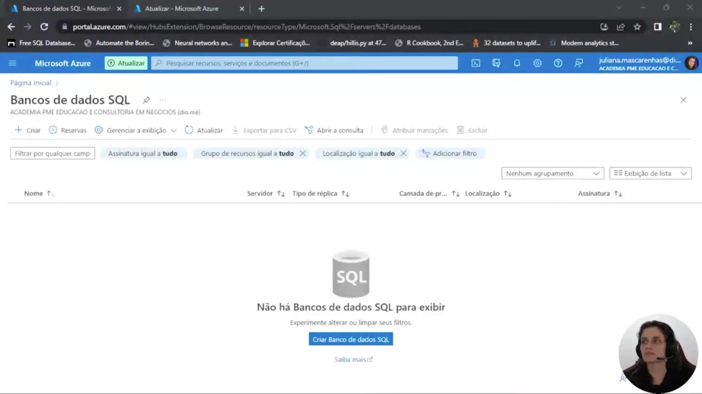
</p>

Ao acessar a área de Bancos de Dados SQL, o portal exibe a listagem de instâncias existentes. Caso não haja recursos configurados, o sistema orienta o usuário a criar um novo banco de dados. Para este cenário específico, o objetivo é localizar e selecionar o serviço dedicado para instâncias MySQL.

<p align="center">
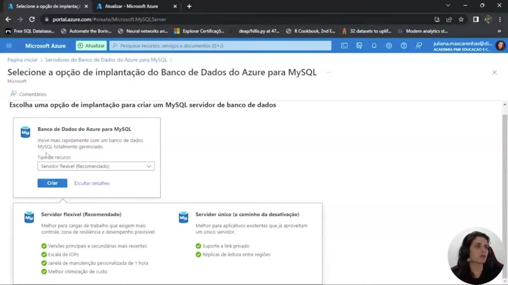
</p>

Na seleção da opção de implantação para o MySQL, o Azure oferece dois caminhos distintos: o **Servidor Flexível** e o **Servidor Único**. O Servidor Flexível é a opção recomendada por proporcionar maior controle sobre as janelas de manutenção, otimização de custos e alta disponibilidade com zonas de resiliência, enquanto o Servidor Único é mantido apenas para suporte a aplicações legadas, estando em processo de desativação.

<p align="center">
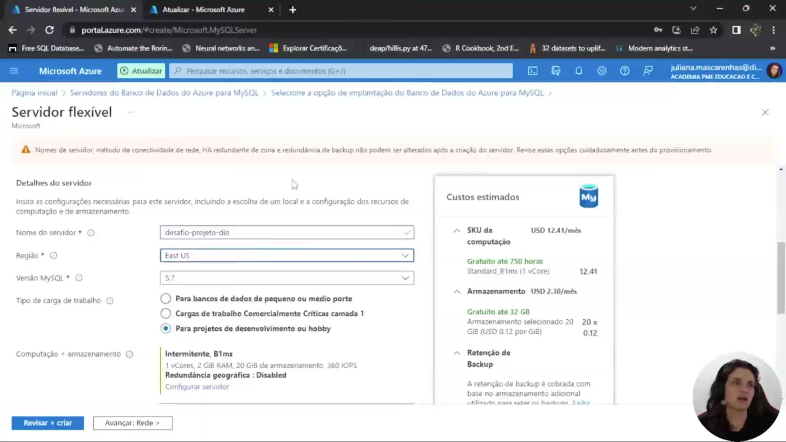
</p>

A etapa de configuração dos "Detalhes do servidor" exige a definição de parâmetros fundamentais. É necessário nomear o servidor (ex: `desafio-projeto-dio`), selecionar a região geográfica (como East US) e a versão do motor MySQL (como a 5.7). Na seção de computação e armazenamento, escolhe-se o tipo de carga de trabalho; para projetos iniciais ou de estudo, a opção "Intermitente" (Burstable) é ideal por oferecer um custo reduzido com recursos básicos de CPU e memória.

<p align="center">
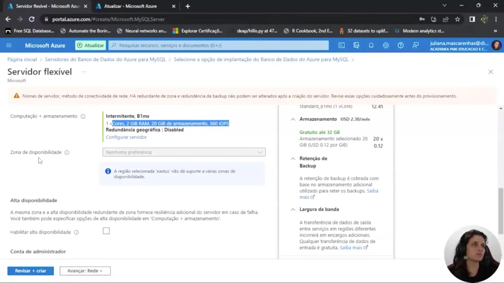
</p>

Ainda nas configurações de infraestrutura, é possível ajustar as zonas de disponibilidade. Dependendo da região escolhida, como `eastus`, o sistema pode informar limitações sobre o suporte a múltiplas zonas. A alta disponibilidade garante que o servidor possua resiliência adicional em caso de falhas na zona local, permitindo ao usuário decidir se deseja habilitar esse recurso com base na criticidade da aplicação.

<p align="center">
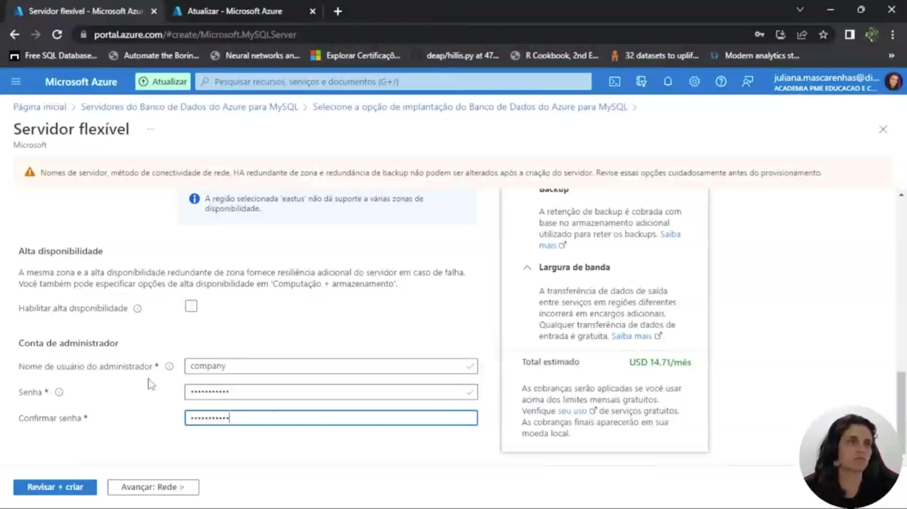
</p>

Para garantir o acesso administrativo, deve-se configurar a "Conta de administrador". Esta seção requer a criação de um nome de usuário (ex: `company`) e a definição de uma senha segura. No painel lateral, o Azure apresenta um resumo do custo total estimado por mês com base em todas as especificações técnicas selecionadas até o momento.

<p align="center">
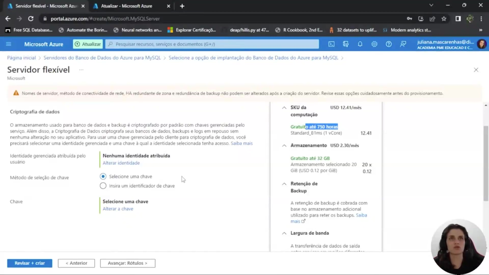
</p>

Em termos de segurança, a plataforma aborda a criptografia de dados. Por padrão, o armazenamento utilizado para o banco de dados e seus respectivos backups é criptografado utilizando chaves gerenciadas pelo próprio serviço do Azure. Isso assegura que as informações estejam protegidas em repouso sem que o desenvolvedor precise realizar alterações manuais no código da aplicação.

<p align="center">
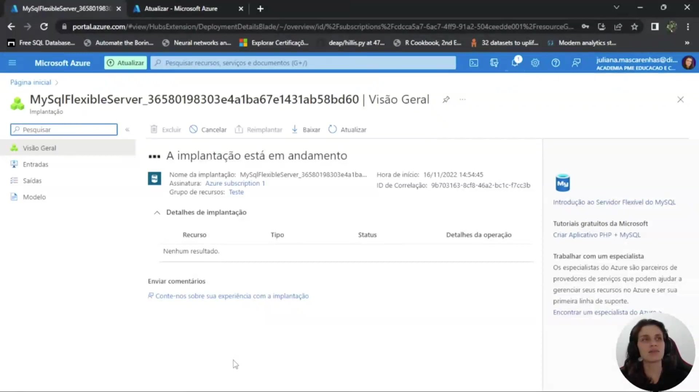
</p>

Após a revisão final e o início do processo, o portal exibe a tela de "Implantação em andamento". Nesta fase, o Azure provisiona todos os componentes necessários, informando o ID de correlação e o status de cada recurso. O tempo de conclusão pode variar, e o usuário deve aguardar até que a mensagem de sucesso confirme que a instância de MySQL está pronta para receber conexões.      


### 🟩 Vídeo 03 - Explorando o Recurso - Instância do MySQL

<video width="60%" controls>
  <source src="000-Midia_e_Anexos/bootcamp_ntt_data-modulo.07-curso.03-video_03.webm" type="video/webm">
    Seu navegador não suporta vídeo HTML5.
</video>

link do vídeo: https://web.dio.me/lab/processando-e-transformando-dados-com-power-bi/learning/f75be1fe-4c9f-4a46-9eeb-50c8bea4ec4b

O vídeo demonstra o processo de gerenciamento e conexão a um servidor flexível de banco de dados MySQL no Azure, utilizando o portal do Azure e diversas ferramentas e métodos de conexão. Ele também faz referência a recursos externos, como um repositório GitHub com scripts de banco de dados e um curso de especialização em SQL.

### Anotações

<p align="center">
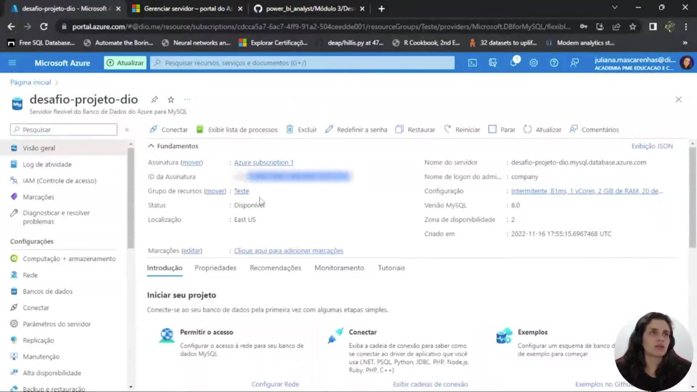
</p>

Nesta tela, visualizamos a página de "Visão geral" (Overview) do servidor flexível MySQL recém-criado na Azure, nomeado como `desafio-projeto-dio`. Aqui estão consolidadas as informações principais do recurso, permitindo o gerenciamento do banco de dados. Podemos identificar o grupo de recursos associado ("Teste"), o status ("Disponível"), a localização geográfica do servidor ("East US"), o nome completo do servidor, o login do administrador e a versão do MySQL (8.0).

<p align="center">
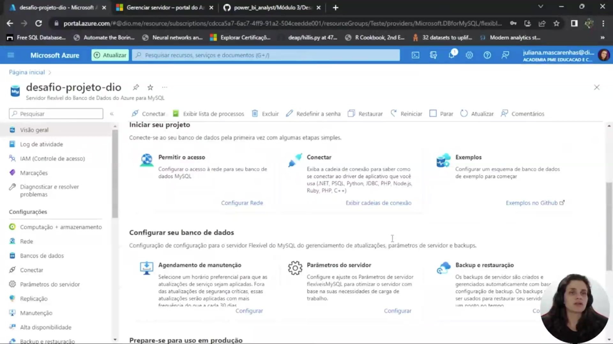
</p>

Rolando a mesma página de visão geral, encontramos atalhos para configurações adicionais essenciais do servidor. É possível acessar opções de configuração rápida como o acesso à rede, além de menus para agendamento de manutenção do servidor, ajuste de parâmetros para otimização de carga de trabalho e configurações de backup e restauração automatizados.

<p align="center">

</p>

Para dar continuidade ao projeto prático e obter os scripts necessários para a criação e inserção de dados no banco, é necessário acessar o repositório público no GitHub. A imagem mostra a página de repositórios do perfil `julianazanelatto`.

<p align="center">
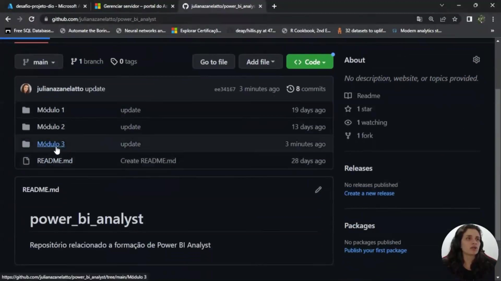
</p>

Dentro do perfil do GitHub, o repositório específico que contém o material do curso é o `power_bi_analyst`. A página inicial deste repositório exibe sua estrutura principal, com os arquivos divididos em pastas por módulos de estudo.

<p align="center">
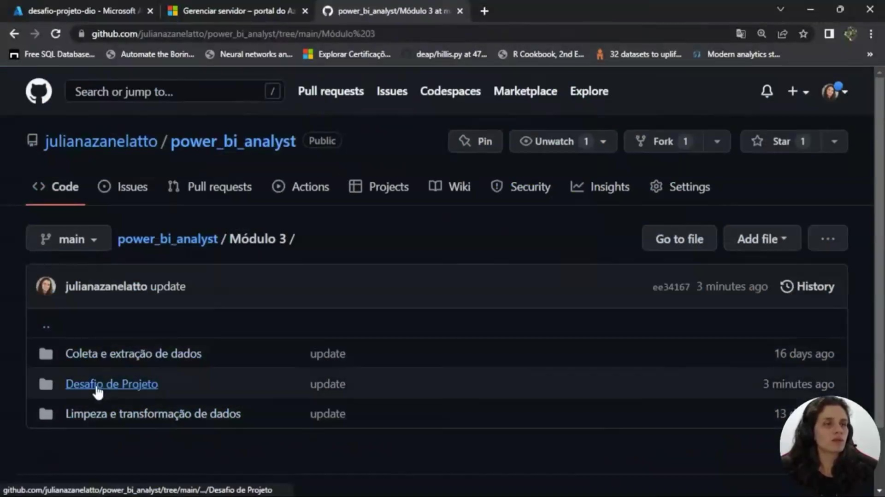
</p>

Navegando pela estrutura do repositório, entramos no diretório correspondente ao `Módulo 3`. Esta pasta guarda todos os arquivos, conteúdos e subpastas relacionados à etapa atual do projeto.

<p align="center">
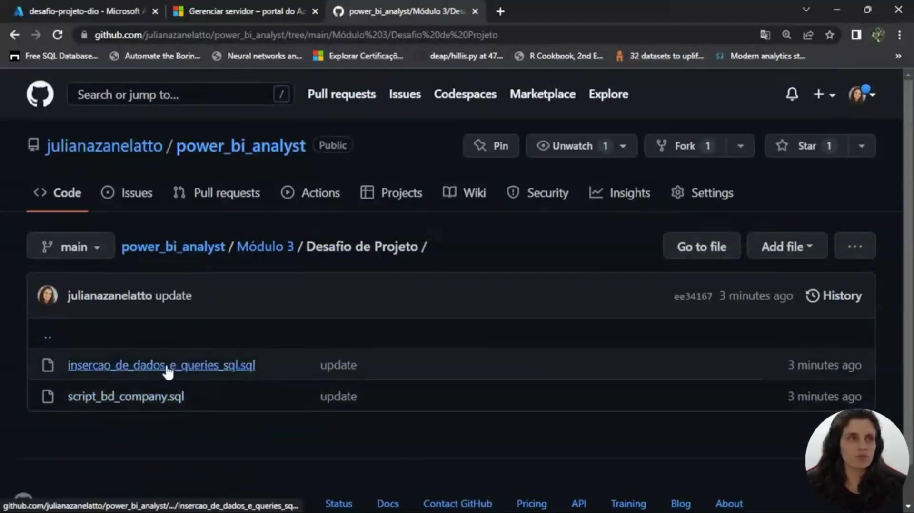
</p>

Ao acessar a subpasta `Desafio de Projeto` dentro do Módulo 3, encontramos os scripts de banco de dados que devem ser utilizados no servidor Azure criado anteriormente. Os dois principais arquivos SQL disponibilizados são o `insercao_de_dados_e_queries_sql.sql` e o `script_bd_company.sql`.

<p align="center">
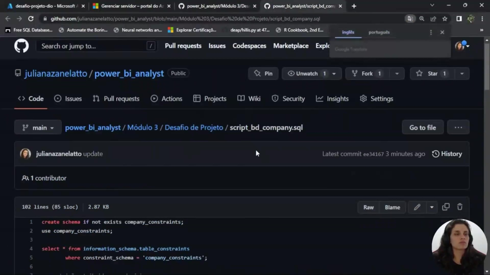
</p>

O conteúdo do arquivo `script_bd_company.sql` revela os comandos iniciais de DDL (Data Definition Language). Este script é responsável por criar o schema principal do banco de dados (caso ele ainda não exista) e selecioná-lo para uso. Em seguida, ele executa uma consulta para listar as "constraints" (restrições) criadas no schema da companhia.

```sql
create schema if not exists company_constraints;
use company_constraints;

select * from information_schema.table_constraints
where constraint_schema = 'company_constraints';
```

<p align="center">
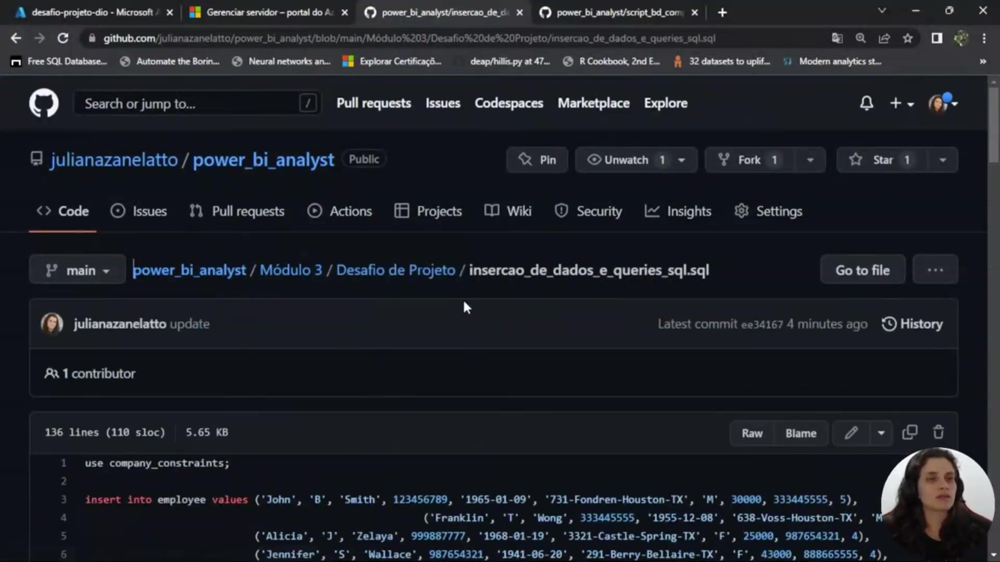
</p>

O segundo arquivo visualizado é o `insercao_de_dados_e_queries_sql.sql`. Ele contém os comandos DML (Data Manipulation Language) de inserção (`INSERT INTO`) projetados para povoar as tabelas do banco de dados com registros de exemplo. A imagem ilustra a inserção de dados fictícios na tabela `employee`, fornecendo nomes, números de identificação, datas de nascimento, endereços e salários.

```sql
use company_constraints;
insert into employee values ('John', 'B', 'Smith', 123456789, '1965-01-09', '731-Fondren-Houston-TX', 'M', 30000, 333445555, 5),
('Franklin', 'T', 'Wong', 333445555, '1955-12-08', '638-Voss-Houston-TX', 'M', 40000, 888665555, 5),
('Alicia', 'J', 'Zelaya', 999887777, '1968-01-19', '3321-Castle-Spring-TX', 'F', 25000, 987654321, 4),
('Jennifer', 'S', 'Wallace', 987654321, '1941-06-20', '291-Berry-Bellaire-TX', 'F', 43000, 888665555, 4);
```

<p align="center">
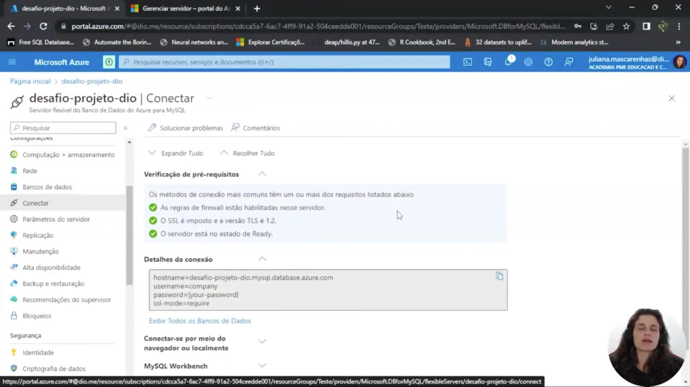
</p>

Retornando ao portal da Azure, acessamos a aba "Conectar" localizada no menu lateral. Esta seção fornece todos os parâmetros e credenciais necessários para estabelecer uma comunicação externa com o banco de dados. Em destaque, estão os detalhes básicos da conexão, informando o endereço do host (`hostname`), o usuário administrador (`username`) e a configuração obrigatória de segurança indicando a exigência de certificado SSL (`ssl-mode`).

<p align="center">
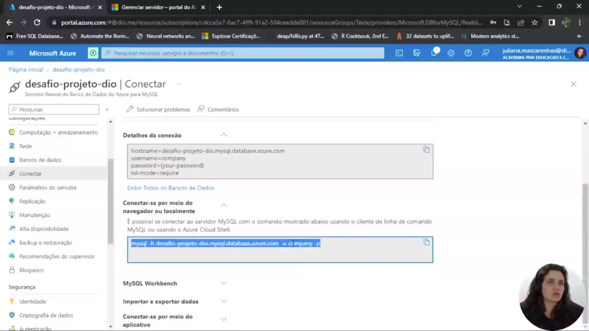
</p>

Explorando ainda a página "Conectar", a interface da Azure facilita o acesso via terminal ao fornecer o comando exato necessário para conectar-se ao banco. Este comando pode ser copiado e colado em um cliente de linha de comando MySQL local ou no próprio Azure Cloud Shell.

```bash
mysql -h desafio-projeto-dio.mysql.database.azure.com -u company -p
```

<p align="center">
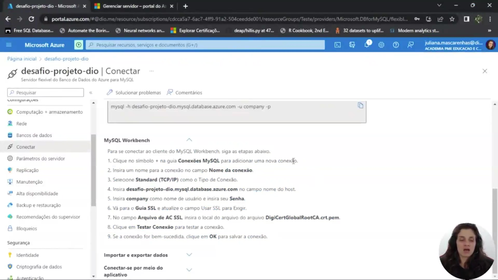
</p>

A Azure também fornece instruções específicas para conexões via clientes gráficos. Ao expandir a seção "MySQL Workbench", é exibido um passo a passo detalhado para configurar a conexão nesta ferramenta. As orientações cobrem o preenchimento do Nome da conexão, a configuração do tipo de conexão (Standard TCP/IP), a inserção do Hostname e Username, e, crucialmente, as configurações na aba SSL, exigindo o fornecimento do caminho para o arquivo de autoridade certificadora (CA) devido à imposição de SSL do servidor.

<p align="center">
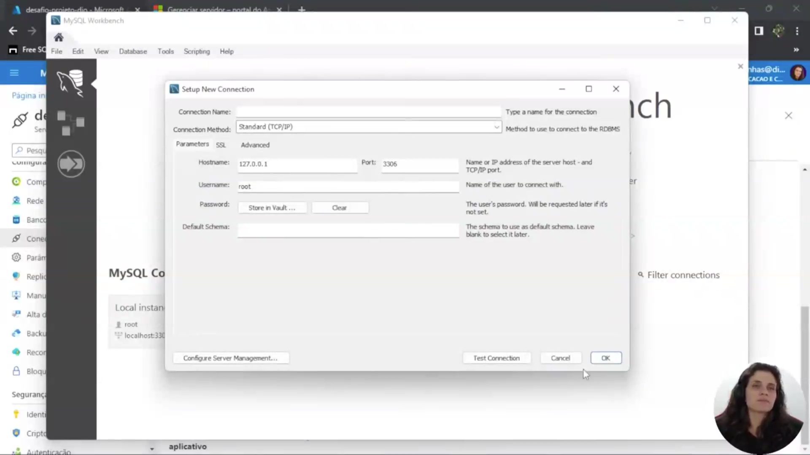
</p>

Aqui visualizamos a aplicação prática das instruções anteriores diretamente no aplicativo MySQL Workbench. A janela "Setup New Connection" está aberta, demonstrando onde os parâmetros fornecidos pela Azure, como o endereço IP ou Hostname e a porta padrão (3306), devem ser inseridos para preparar a comunicação com o servidor flexível.

<p align="center">
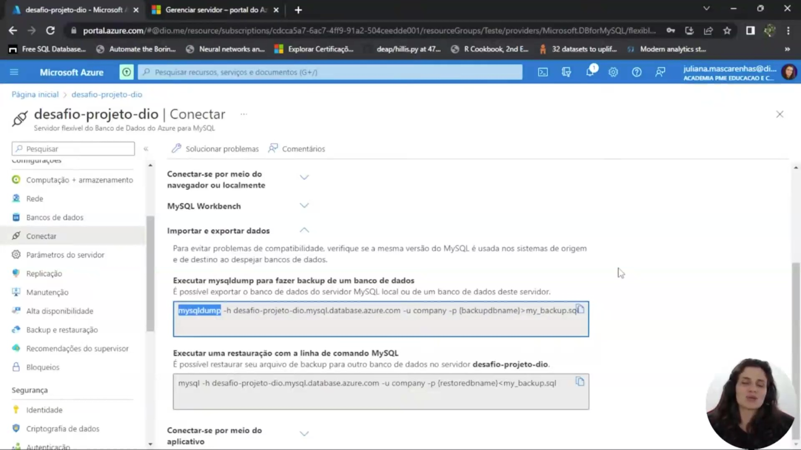
</p>

A página "Conectar" no portal Azure também traz orientações sobre rotinas de administração. Na aba "Importar e exportar dados", a interface disponibiliza o comando completo utilizando o utilitário `mysqldump`. Este comando permite realizar um backup lógico do banco de dados inteiro pela linha de comando, já incluindo nativamente as exigências de conexão SSL e os parâmetros de host.

```bash
mysqldump -h desafio-projeto-dio.mysql.database.azure.com -u company -p --ssl-mode=REQUIRE --set-gtid-purged=OFF my_database > my_backup.sql
```

<p align="center">
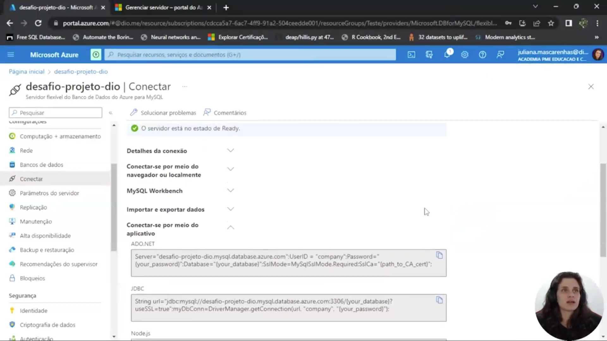
</p>

Por fim, logo abaixo do comando de dump, a Azure expõe o comando correspondente para executar uma restauração de dados via linha de comando. Utilizando o cliente `mysql`, este comando é configurado para ler um arquivo de backup (`my_backup.sql`) e restaurá-lo diretamente no banco de dados hospedado na nuvem, respeitando o modo SSL obrigatório.

```bash
mysql -h desafio-projeto-dio.mysql.database.azure.com -u company -p --ssl-mode=REQUIRE my_database < my_backup.sql
```      

### 🟩 Vídeo 04 - Se conectando ao Banco de Dados com Cloud Shell

<video width="60%" controls>
  <source src="000-Midia_e_Anexos/bootcamp_ntt_data-modulo.07-curso.03-video_04.webm" type="video/webm">
    Seu navegador não suporta vídeo HTML5.
</video>

link do vídeo: https://web.dio.me/lab/processando-e-transformando-dados-com-power-bi/learning/e37368a6-4fb3-4ac7-bdbb-b40ddb49b6ac

Este guia resume os procedimentos para acessar, configurar e manipular um banco de dados MySQL diretamente pelo portal da Azure, utilizando a interface de linha de comando (CLI) integrada.

### Anotações

<p align="center">
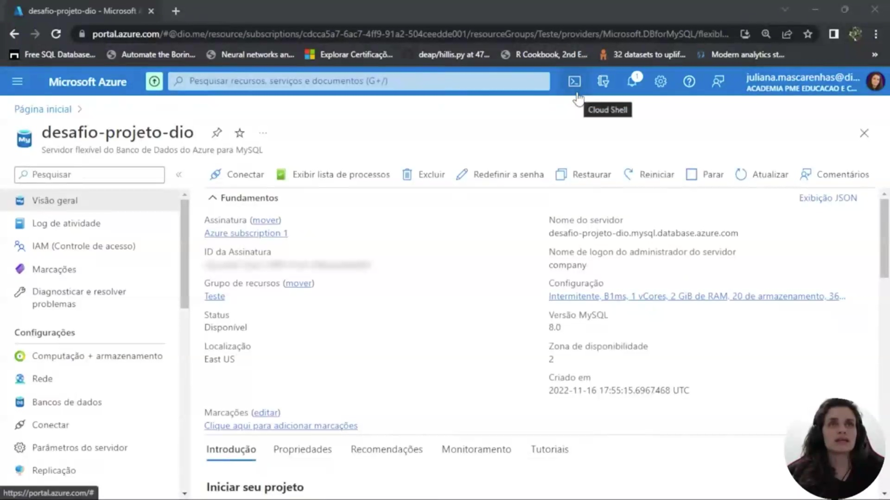
</p>

Para acessar o banco de dados diretamente pelo portal do Azure, podemos utilizar o recurso Cloud Shell. Ele está disponível no menu superior da interface de gerenciamento do servidor flexível MySQL.

<p align="center">
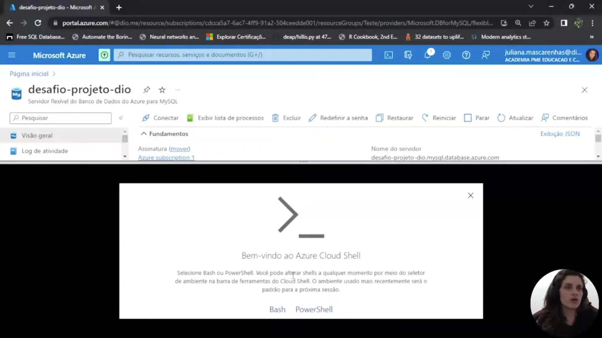
</p>

Ao iniciar o Cloud Shell, o ambiente solicita a escolha da interface de linha de comando preferida. As opções disponíveis são Bash e PowerShell. Neste caso, a opção escolhida para o ambiente de terminal foi o Bash.

<p align="center">
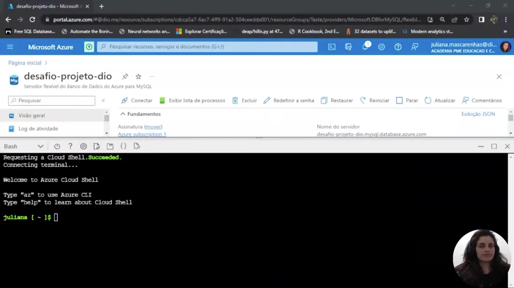
</p>

Após a seleção, o Azure inicia o processo de requisição e provisionamento do terminal. É necessário aguardar a conexão ser estabelecida para começar a interagir e inserir os comandos.

```bash
Requesting a Cloud Shell.Succeeded.
Connecting terminal...
Welcome to Azure Cloud Shell
```

<p align="center">
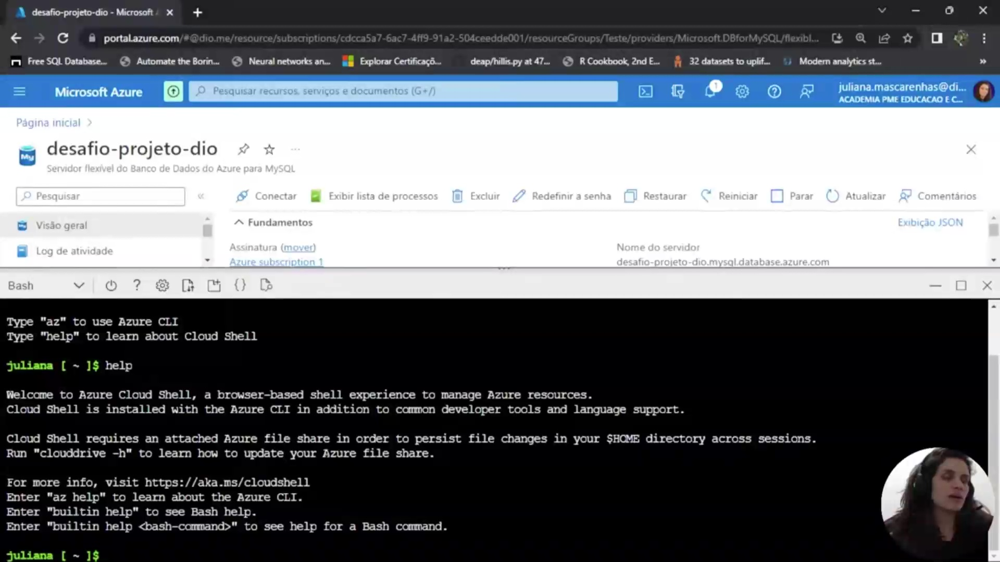
</p>

Com o terminal conectado, é possível utilizar comandos básicos de sistemas Unix. A execução do comando `help` exibe uma mensagem de boas-vindas e informações úteis de suporte para o uso do Azure CLI e do Bash.

```bash
juliana [ ~ ]$ help
Welcome to Azure Cloud Shell, a browser-based shell experience to manage Azure resources.
```

<p align="center">
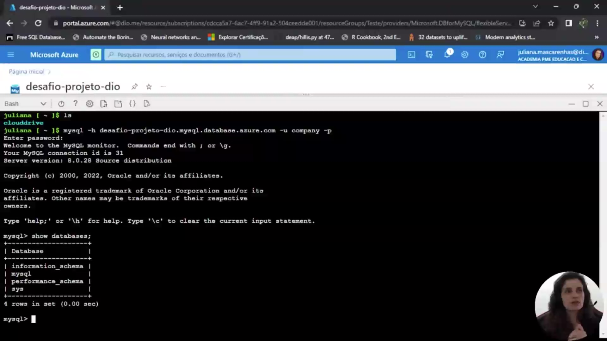
</p>

Para estabelecer a conexão com o banco de dados MySQL, utiliza-se o comando de cliente definindo o host (`-h`), o usuário (`-u`) e solicitando a inserção da senha (`-p`). Após o login bem-sucedido, o comando `show databases;` lista os bancos de dados padrões já existentes no servidor.

```bash
juliana [~]$ mysql -h desafio-projeto-dio.mysql.database.azure.com -u company -p
Enter password:
mysql> show databases;
```

<p align="center">
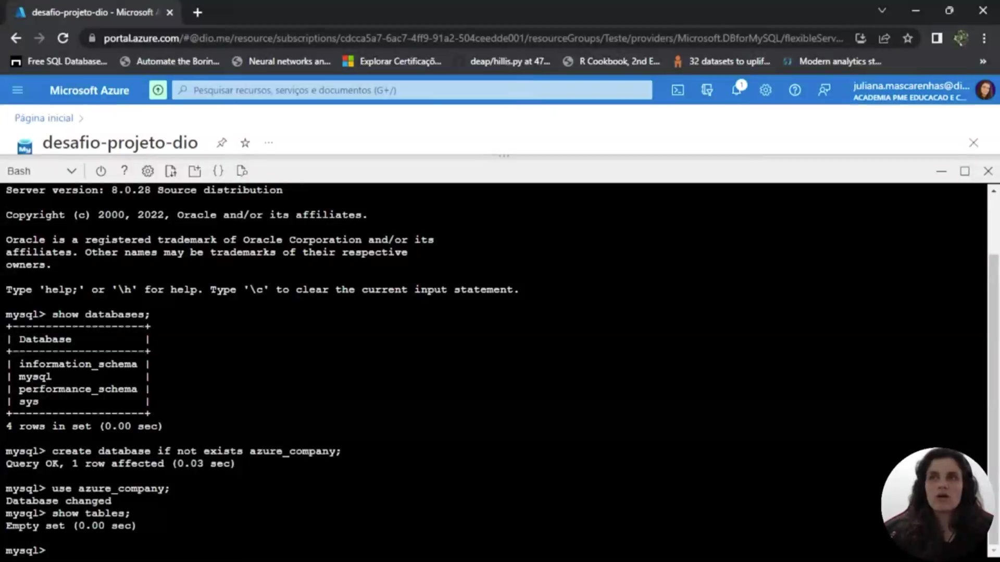
</p>

O próximo passo é criar o banco de dados específico para o projeto utilizando a instrução `create database`. Em seguida, o comando `use` seleciona este novo banco de dados para uso. A verificação com `show tables;` confirma que ele acaba de ser criado e ainda está vazio.

```sql
mysql> create database if not exists azure_company;
Query OK, 1 row affected (0.03 sec)
mysql> use azure_company;
Database changed
mysql> show tables;
Empty set (0.00 sec)
```

<p align="center">
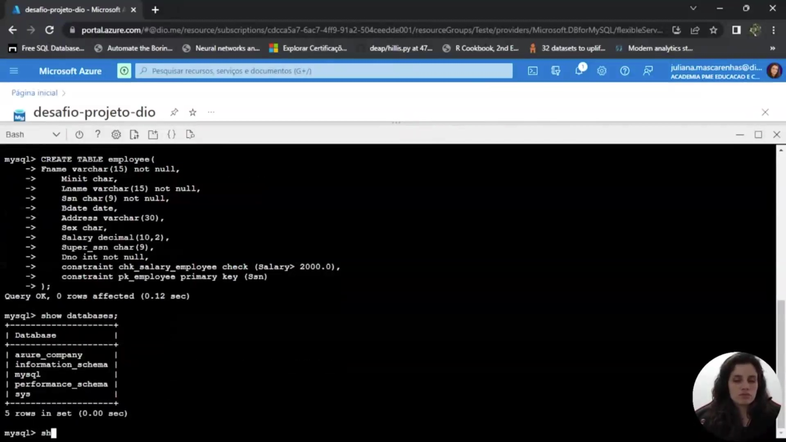
</p>

Com o banco de dados selecionado, inicia-se a criação da estrutura de tabelas. A tabela `employee` é criada definindo seus atributos, tipos de dados e restrições estruturais, como a chave primária (`Ssn`) e a validação de salário (`chk_salary_employee`).

```sql
mysql> CREATE TABLE employee (
    -> Fname varchar(15) not null,
    -> Minit char,
    -> Lname varchar(15) not null,
    -> Ssn char(9) not null,
    -> Bdate date,
    -> Address varchar(30),
    -> Sex char,
    -> Salary decimal(10,2),
    -> Super_ssn char(9),
    -> Dno int not null,
    -> constraint chk_salary_employee check (Salary> 2000.0),
    -> constraint pk_employee primary key (Ssn)
    -> );
Query OK, 0 rows affected (0.12 sec)
```

<p align="center">
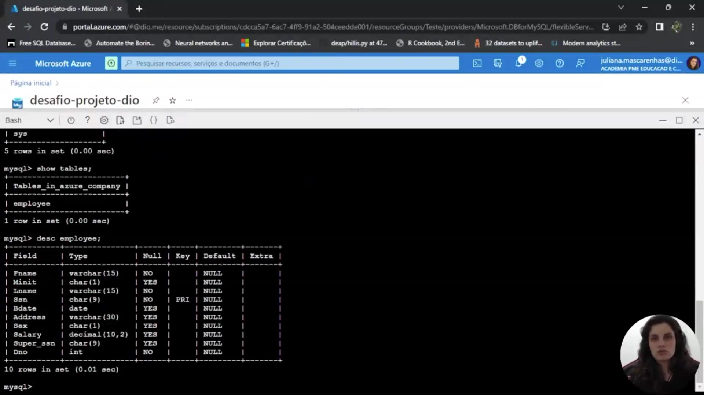
</p>

Para validar a criação correta, o comando `show tables;` é executado novamente, listando agora a tabela recém-criada. O comando `desc employee;` detalha a estrutura da tabela, exibindo as colunas, tipos esperados e chaves configuradas.

```sql
mysql> show tables;
mysql> desc employee;
```

<p align="center">
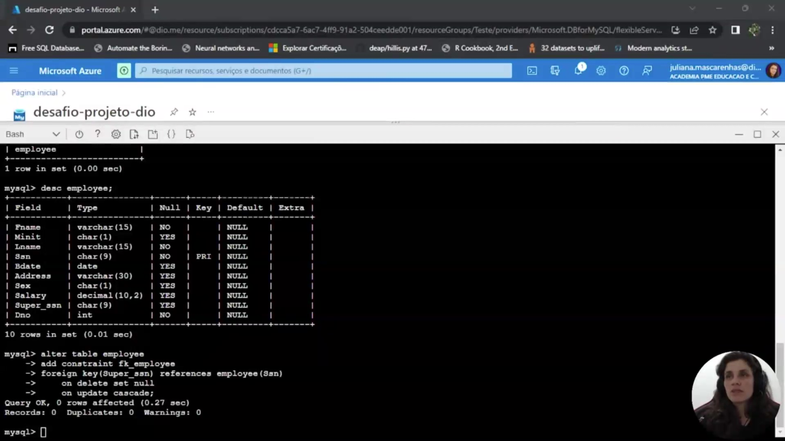
</p>

Por fim, a estrutura da tabela é modificada com o comando `alter table` para incluir uma nova restrição. Uma chave estrangeira (`fk_employee`) é adicionada referenciando a própria tabela (relacionando `Super_ssn` com `Ssn`) e configurando os comportamentos de exclusão (`on delete set null`) e atualização (`on update cascade`).

```sql
mysql> alter table employee
    -> add constraint fk_employee
    -> foreign key (Super_ssn) references employee (Ssn)
    -> on delete set null
    -> on update cascade;
Query OK, 0 rows affected (0.27 sec)
```      

### 🟩 Vídeo 05 - Criando Regra no Firewall na Azure para Acesso ao banco de dados

<video width="60%" controls>
  <source src="000-Midia_e_Anexos/bootcamp_ntt_data-modulo.07-curso.03-video_05.webm" type="video/webm">
    Seu navegador não suporta vídeo HTML5.
</video>

link do vídeo: https://web.dio.me/lab/processando-e-transformando-dados-com-power-bi/learning/2d2ec838-3976-45c0-a5bb-e04a1aec7b29

Este guia detalha os passos críticos para configurar o acesso externo a uma instância de banco de dados MySQL hospedada na nuvem Azure, garantindo que ferramentas como Power BI e MySQL Workbench possam se comunicar com os dados de forma segura e eficiente.

### Anotações

<p align="center">
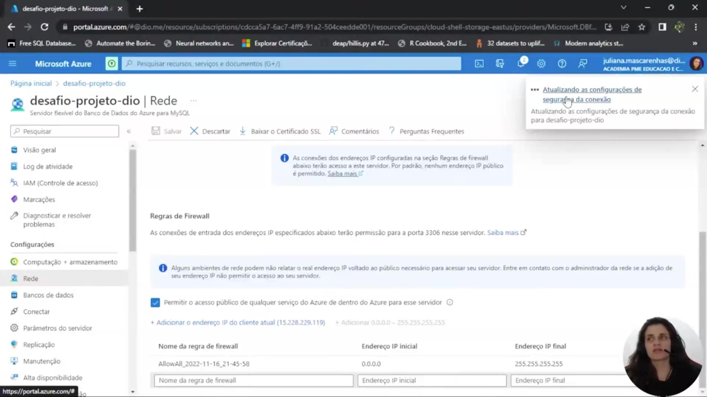
</p>

Para permitir o acesso externo ao **Servidor Flexível do Banco de Dados do Azure para MySQL**, é necessário configurar as **Regras de Firewall**. Por padrão, o ambiente de nuvem é restritivo e nenhum endereço IP público possui permissão de entrada.

Nesta etapa, é criada uma regra denominada **AllowAll 2022-11-16 21-45-58** para liberar o tráfego de entrada na porta **3306**. A configuração utiliza o seguinte intervalo de IPs para permitir conexões de qualquer origem:

* 
**Endereço IP inicial**: `0.0.0.0` 


* 
**Endereço IP final**: `255.255.255.255` 


O portal exibe a mensagem **"Atualizando as configurações de segurança da conexão"** para o recurso `desafio-projeto-dio`. Conforme mencionado em aula, expor o banco de dados a qualquer IP público pode ser um risco de segurança; por isso, em cenários reais, recomenda-se restringir o acesso apenas ao seu IP atual ou utilizar uma **VPN** para mascarar a conexão.

<p align="center">
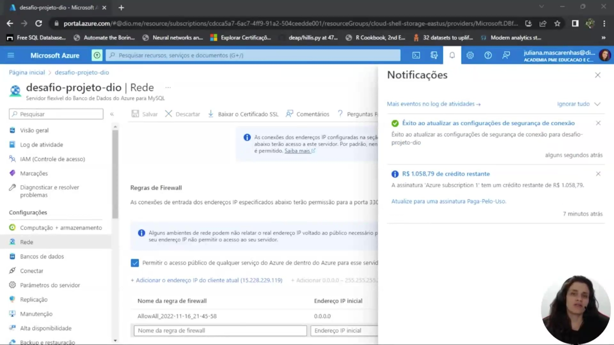
</p>

Após o processamento, o Azure confirma a alteração com a notificação: **"Éxito ao atualizar as configurações de segurança de conexão"**. Esse status garante que as barreiras de rede foram ajustadas corretamente e o servidor agora aceita requisições externas.

Com essa configuração concluída, o ambiente está pronto para:

1. Realizar a conexão remota através do **MySQL Workbench**.
2. Integrar os dados com o **Power BI** utilizando o domínio do servidor.

A interface também destaca que a assinatura possui um crédito restante de **R$ 1.058,79**, reforçando a importância de monitorar o uso dos recursos para não esgotar o saldo disponível na conta.


### 🟩 Vídeo 06 - Conectando ao MySQL na Azure utilizando Workbench

<video width="60%" controls>
  <source src="000-Midia_e_Anexos/bootcamp_ntt_data-modulo.07-curso.03-video_06.webm" type="video/webm">
    Seu navegador não suporta vídeo HTML5.
</video>

link do vídeo: https://web.dio.me/lab/processando-e-transformando-dados-com-power-bi/learning/419c616f-b982-4a6a-88a1-6c331a7cf8e7

### 🟩 Vídeo 07 - Integrando Power BI com MySQL na Azure

<video width="60%" controls>
  <source src="000-Midia_e_Anexos/bootcamp_ntt_data-modulo.07-curso.03-video_07.webm" type="video/webm">
    Seu navegador não suporta vídeo HTML5.
</video>

link do vídeo:

### 🟩 Vídeo 08 - Entendendo o desafio

<video width="60%" controls>
  <source src="000-Midia_e_Anexos/bootcamp_ntt_data-modulo.07-curso.03-video_08.webm" type="video/webm">
    Seu navegador não suporta vídeo HTML5.
</video>

link do vídeo:


##  Materiais de Apoio

# Certificado: 

- Link na plataforma: 
- Certificado em pdf: