## Instrutor:

- Juliana Mascarenhas (Tech Education Specialist / Sócia (Content Creator) @SimplificandoRedes / Me Modelagem Computacional / Cientista de dados)
- Contato Linkedin: / [juliana-mascarenhas-ds](https://www.linkedin.com/in/juliana-mascarenhas-ds/)

## Parte 1 - Fundamentos de Modelagem Dimensional

### 🟩 Vídeo 01 - Apresentando a ementa do curso

<video width="60%" controls>
  <source src="000-Midia_e_Anexos/bootcamp_ntt_data-modulo.08-curso.01-video_01.webm" type="video/webm">
    Seu navegador não suporta vídeo HTML5.
</video>

link do vídeo: https://web.dio.me/track/engenharia-dados-python/course/fundamentos-de-modelagem-dimensional/learning/cfd67c81-3158-4c81-a31f-0a338544aadc?autoplay=1

Este curso, ministrado por Juliana Mascarenhas, aborda a transição fundamental entre a modelagem de dados tradicional (relacional/transacional) e a modelagem dimensional. O foco é capacitar profissionais de dados (analistas de BI, cientistas e engenheiros) a estruturarem informações de forma que facilitem a análise e a tomada de decisão estratégica.

### Anotações

  

Este slide apresenta o tema central da aula: **Introdução à Modelagem Dimensional**. O conteúdo faz parte da **Formação Power BI Analyst** e é ministrado por **Juliana Mascarenhas**, especialista em educação tecnológica, mestre em modelagem computacional e cientista de dados. A imagem introduz o contexto do curso, indicando que os conceitos abordados são fundamentais para profissionais que trabalham com dados, desde analistas até engenheiros, pois a modelagem dimensional é uma prática essencial para estruturar informações de forma analítica e otimizada.

  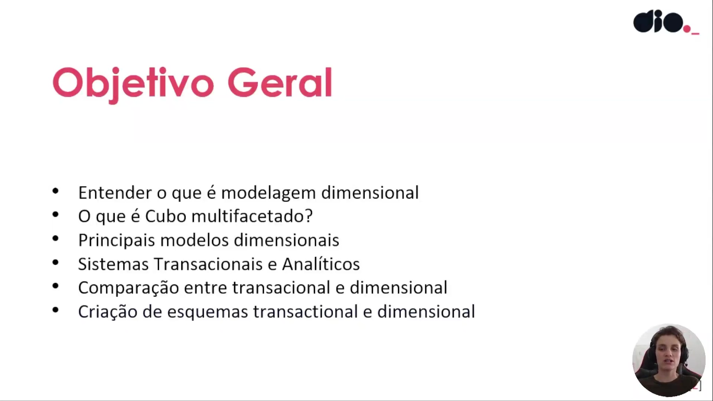

Neste slide são listados os principais objetivos que serão explorados ao longo do conteúdo:
- **Entender o que é modelagem dimensional** – conceito base para organizar dados voltados à análise.
- **O que é Cubo multifacetado?** – estrutura que permite visualizar dados sob múltiplas perspectivas.
- **Principais modelos dimensionais** – conhecer os esquemas mais utilizados na prática.
- **Sistemas Transacionais e Analíticos** – diferenciar os ambientes de operação (OLTP) e de análise (OLAP).
- **Comparação entre transacional e dimensional** – entender as vantagens e aplicações de cada abordagem.
- **Criação de esquemas transactional e dimensional** – aplicação prática dos conceitos por meio da construção de modelos.

Esses tópicos servem como roteiro para a jornada de aprendizado, destacando a importância da modelagem dimensional para a construção de soluções de Business Intelligence eficientes.

### 🟩 Vídeo 02 - Desmistificando a Modelagem Dimensional

<video width="60%" controls>
  <source src="000-Midia_e_Anexos/bootcamp_ntt_data-modulo.08-curso.01-video_02.webm" type="video/webm">
    Seu navegador não suporta vídeo HTML5.
</video>

link do vídeo: https://web.dio.me/track/engenharia-dados-python/course/fundamentos-de-modelagem-dimensional/learning/772fc7ed-b21b-404b-9f0c-045e69a5bd87?autoplay=1

Este vídeo explora os fundamentos da modelagem dimensional, contrastando-a com a modelagem relacional tradicional. O foco principal é entender por que as empresas precisam de estruturas de dados diferentes para operações do dia a dia e para análises estratégicas de grande escala.

### Anotações

  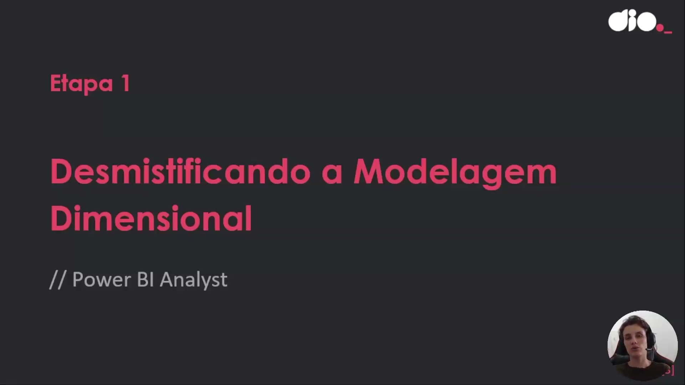

A modelagem dimensional costuma gerar ruído e dúvidas, especialmente para quem está acostumado com bancos de dados relacionais. Nesta aula, vamos desmistificar esse conceito, mostrando que ele pode ser até mais simples do que a modelagem relacional tradicional. O objetivo é construir uma base sólida para que você entenda por que e como aplicar esse tipo de modelagem em projetos analíticos, especialmente no Power BI.

  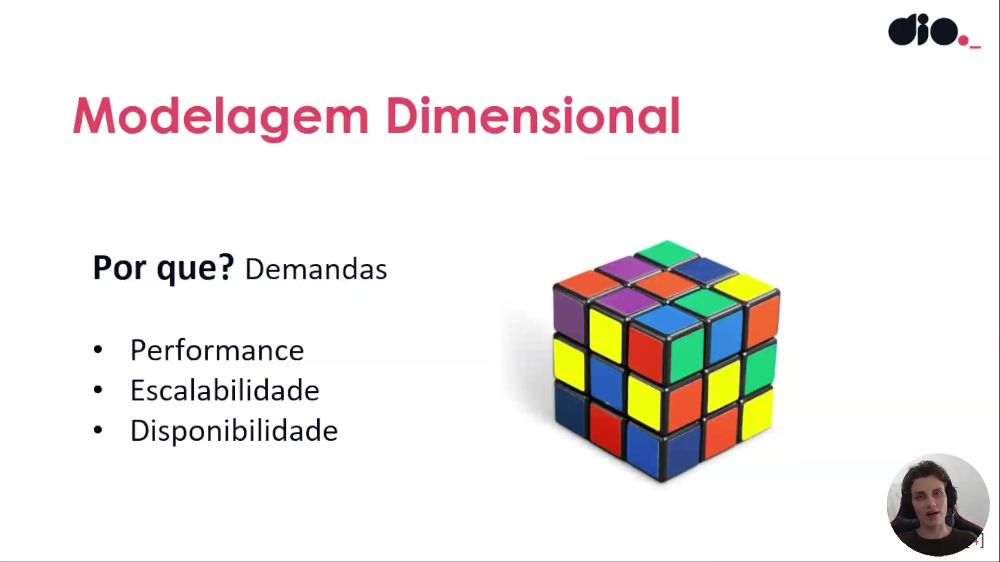

A modelagem dimensional surgiu de uma lacuna: o modelo relacional, excelente para transações do dia a dia, mostrou-se insuficiente para atender às demandas de análise de grandes volumes de dados. Por isso, novas necessidades emergiram – **performance**, **escalabilidade** e **disponibilidade**. Em vez de executar consultas complexas diretamente no banco de dados operacional (o que poderia comprometer sua performance), passamos a usar um modelo separado, otimizado para consultas analíticas, garantindo que os dados estejam sempre acessíveis e que as respostas sejam rápidas.

  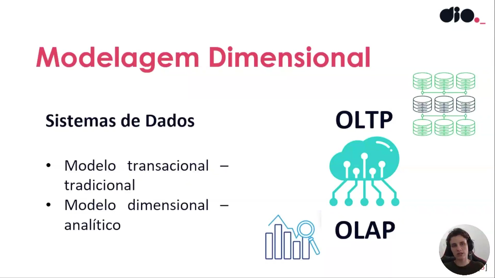

Para entender a modelagem dimensional, é preciso diferenciar os dois grandes tipos de sistemas de dados:
- **Modelo transacional (tradicional)**: voltado para operações diárias (inserir, atualizar, deletar). Possui estrutura rígida, normalizada, e foco em integridade e concorrência.
- **Modelo dimensional (analítico)**: voltado para consultas e análises. Permite estruturas desnormalizadas, com foco em leitura rápida e facilidade de interpretação para negócios.

Cada um atende a um propósito distinto, e a escolha depende do cenário: operacional ou analítico.

  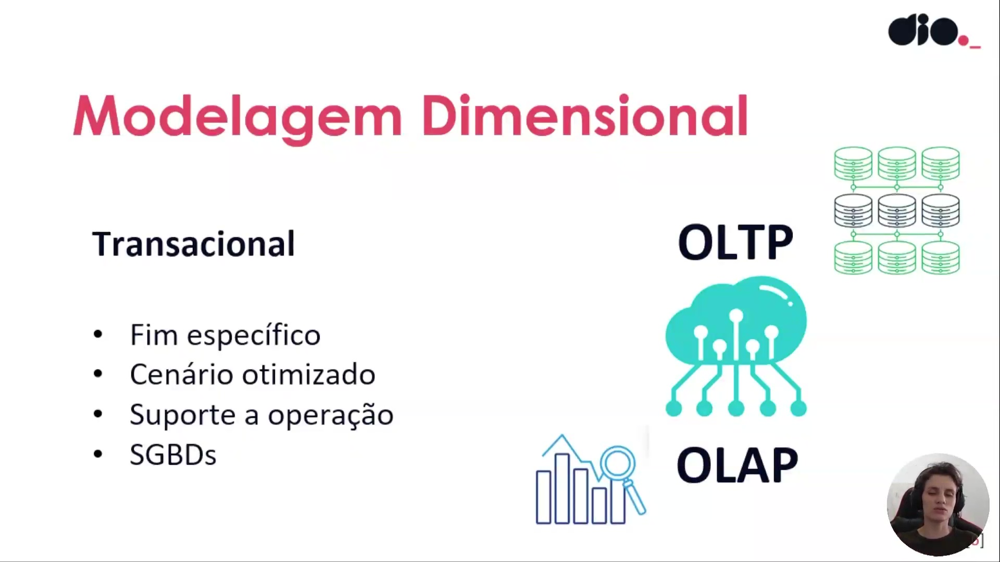

O **modelo transacional** é desenhado para:
- **Fim específico**: suportar uma aplicação ou processo de negócio.
- **Cenário otimizado**: estrutura bem definida, com chaves, índices e restrições de integridade.
- **Suporte a operação**: lida com as transações do dia a dia (vendas, cadastros, movimentações).
- **SGBDs**: utiliza sistemas de gerenciamento de banco de dados relacionais (como SQL Server, Oracle, PostgreSQL) que garantem ACID (Atomicidade, Consistência, Isolamento, Durabilidade).

É a base dos sistemas operacionais das empresas, mas não é o ambiente ideal para grandes consultas analíticas.

  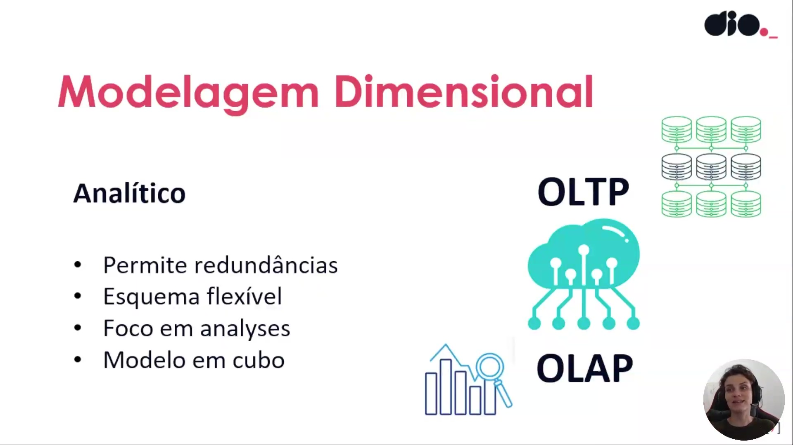

Já o **modelo analítico** (dimensional) possui características que o tornam poderoso para BI e análises:
- **Permite redundâncias**: a desnormalização é bem-vinda, pois reduz a necessidade de joins complexos e acelera as consultas.
- **Esquema flexível**: estruturas como star schema e snowflake schema facilitam a navegação pelos dados.
- **Foco em análises**: tudo é pensado para responder perguntas de negócio rapidamente.
- **Modelo em cubo**: os dados são organizados em torno de fatos (medidas) e dimensões (atributos descritivos), formando uma visão multidimensional que facilita a exploração e a descoberta de insights.

Esse é o modelo que usamos em ferramentas como Power BI para construir relatórios performáticos e intuitivos.      

### 🟩 Vídeo 03 - O que significa Modelagem em Cubo?

<video width="60%" controls>
  <source src="000-Midia_e_Anexos/bootcamp_ntt_data-modulo.08-curso.01-video_03.webm" type="video/webm">
    Seu navegador não suporta vídeo HTML5.
</video>

link do vídeo: https://web.dio.me/track/engenharia-dados-python/course/fundamentos-de-modelagem-dimensional/learning/e56fe8c0-7fef-40c1-aca1-92aef529cf35?autoplay=1

Este vídeo explora o conceito de "Cubo" na ciência de dados, comparando-o com modelos tabulares tradicionais e discutindo as diferenças fundamentais entre sistemas transacionais e analíticos.

### Anotações

  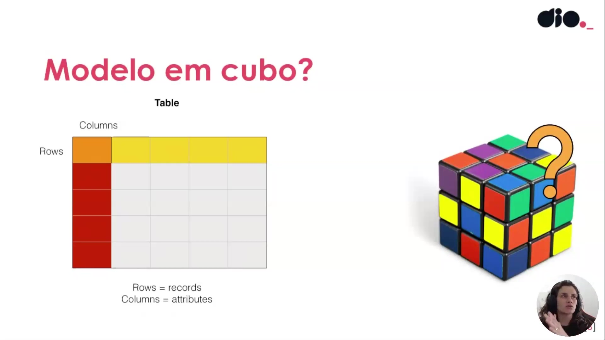

O slide apresenta a estrutura de uma tabela tradicional, com linhas representando registros e colunas representando atributos. A pergunta “Modelo em cubo?” introduz a reflexão sobre como essa representação bidimensional se relaciona com o conceito de cubo, que adiciona uma terceira dimensão para armazenar e analisar dados sob múltiplas perspectivas.

  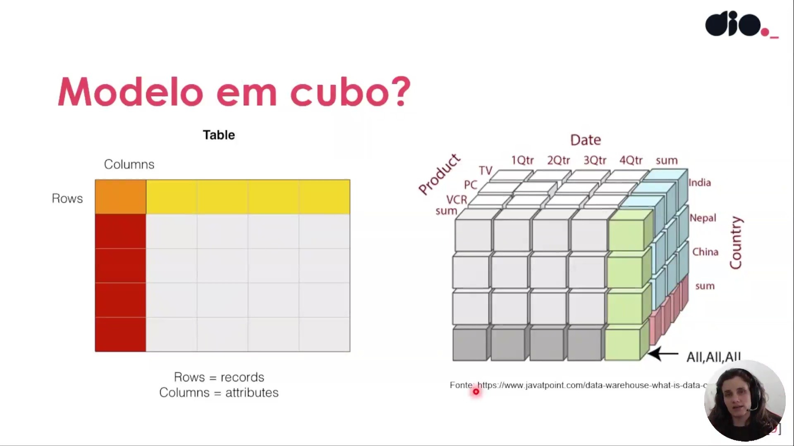

Nesta segunda representação tabular, reforça-se a ideia de que a tabela permite apenas combinações entre duas dimensões (por exemplo, produto e país ou produto e data). Essa limitação bidimensional contrasta com o modelo em cubo, onde uma terceira dimensão (como trimestre fiscal) possibilita análises mais ricas e consolidadas.

  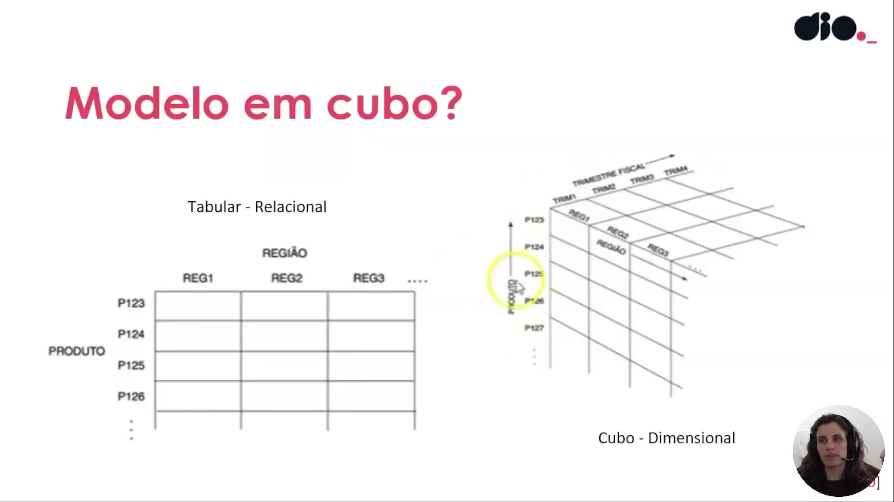

Este quadro compara visualmente dois modelos: Tabular (Relacional) e Cubo (Dimensional). No lado tabular aparecem listas de regiões e produtos organizadas como registros; no lado dimensional aparece a noção de trimestre fiscal como uma dimensão adicional, ilustrando como o cubo agrega uma face extra (altura) que permite consultas por produto, região e período fiscal ao mesmo tempo. A imagem enfatiza que o cubo é uma representação orientada à análise, projetada para facilitar múltiplas perspectivas sobre os mesmos dados.
 

  

O slide formaliza as principais características do cubo:
- **Eixos:** correspondem aos componentes do esquema (dimensões), como produto, país e data.
- **Interseção:** ponto de encontro entre os eixos, onde são armazenadas as medidas e os dados do contexto analisado.
- **Visão consolidada:** o cubo oferece uma perspectiva integrada e mais elaborada que uma tabela isolada.
- **Análises de perspectivas distintas:** ao dispor de múltiplas faces, permite examinar os dados sob diferentes ângulos.

  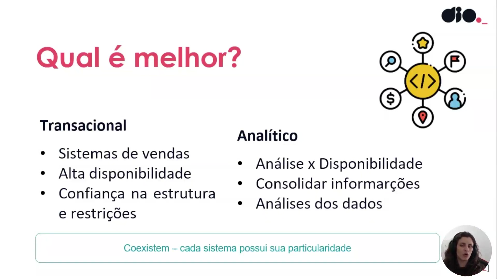

A imagem compara os ambientes transacional e analítico, destacando que não há um “melhor” — eles coexistem e atendem a objetivos distintos.  
- **Transacional:** voltado para sistemas operacionais (ex.: vendas), prioriza alta disponibilidade e integridade por meio de restrições e estrutura confiável.  
- **Analítico:** focado em análise de dados, consolida informações de múltiplas fontes e aceita redundâncias em prol da performance das consultas.  
Ambos se complementam, sendo a escolha definida pela necessidade do cenário.      

### 🟩 Vídeo 04 - Entendendo Modelagem com Start Schema

<video width="60%" controls>
  <source src="000-Midia_e_Anexos/bootcamp_ntt_data-modulo.08-curso.01-video_04.webm" type="video/webm">
    Seu navegador não suporta vídeo HTML5.
</video>

link do vídeo: https://web.dio.me/track/engenharia-dados-python/course/fundamentos-de-modelagem-dimensional/learning/089b141c-5cec-4747-bcdc-eb4168580a41?autoplay=1

Este vídeo explora os fundamentos da modelagem dimensional, focando especialmente no Star Schema (Esquema em Estrela), comparando-o com os modelos relacionais tradicionais e destacando sua importância para a análise de dados.

### Anotações

  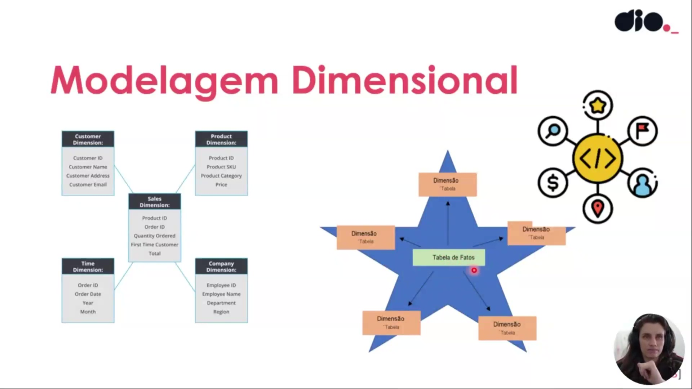

Este é um esquema estrela (*star schema*), o modelo dimensional mais comum e mais simples de implementar. No centro temos a **tabela fato** (em vermelho), que concentra as métricas ou eventos a serem analisados. Ao redor estão as **tabelas dimensão** (em azul), que trazem os contextos ou descritivos de cada análise — como produto, cliente, tempo e empresa. As ligações entre a fato e as dimensões são diretas, formando um desenho que lembra uma estrela. Essa estrutura é otimizada para consultas de *business intelligence*, pois reduz a quantidade de junções (*joins*) necessárias para responder a perguntas de negócio.

  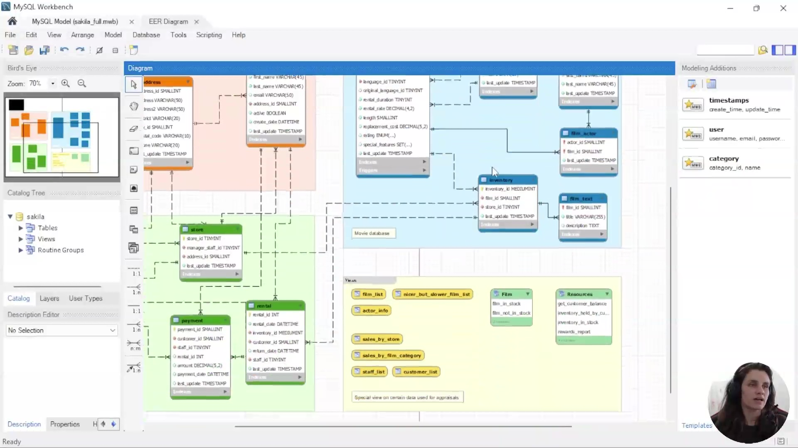

A imagem apresenta um modelo relacional (DER — Diagrama Entidade-Relacionamento) gerado por uma ferramenta como o MySQL Workbench. Diferente do esquema estrela, aqui não há uma tabela fato centralizada. As tabelas são organizadas de forma normalizada, com relacionamentos variados (um-para-muitos, muitos-para-muitos) entre diferentes entidades. Essa estrutura é adequada para sistemas transacionais (OLTP), onde a prioridade é a consistência e a redução de redundância de dados, mas exige múltiplas junções em consultas analíticas mais complexas.

  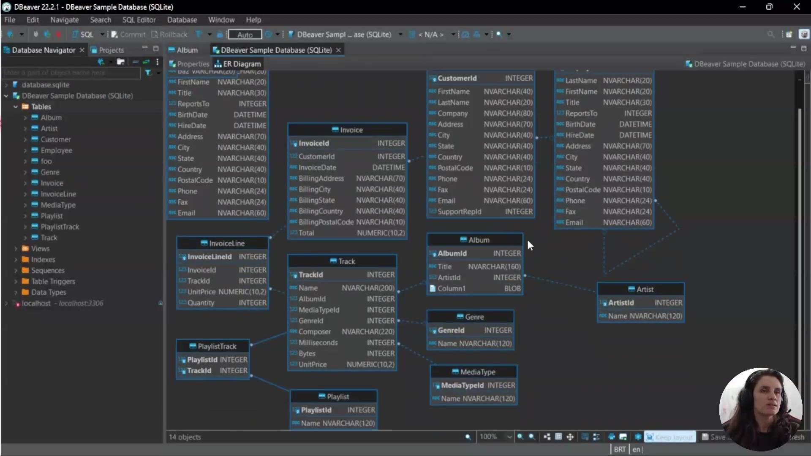

Agora temos um exemplo concreto de diagrama relacional obtido a partir de uma ferramenta como o DBeaver, conectada a um banco de dados de exemplo. É possível visualizar as tabelas (como *álbum*, *artista*, *track*, *gênero*), suas colunas e os relacionamentos entre elas — representados por linhas que conectam chaves estrangeiras. Observa-se, inclusive, um autorrelacionamento (um círculo), situação em que uma tabela se relaciona consigo mesma. Esse tipo de diagrama reflete a complexidade de um banco de dados transacional, onde as tabelas são especializadas e os relacionamentos se distribuem entre várias entidades.

### 🟩 Vídeo 05 - Tipos de modelos dimensionais: Start Schema, Snowflake e Constellation

<video width="60%" controls>
  <source src="000-Midia_e_Anexos/bootcamp_ntt_data-modulo.08-curso.01-video_05.webm" type="video/webm">
    Seu navegador não suporta vídeo HTML5.
</video>

link do vídeo: https://web.dio.me/track/engenharia-dados-python/course/fundamentos-de-modelagem-dimensional/learning/beb2b1a4-c34d-4799-86b0-18e426d48098?autoplay=1

Este vídeo explora as diferentes arquiteturas de modelagem de dados utilizadas em Business Intelligence e Data Warehousing, destacando as vantagens de cada uma e por que a modelagem dimensional é preferida em relação à relacional para fins analíticos.

### Anotações

  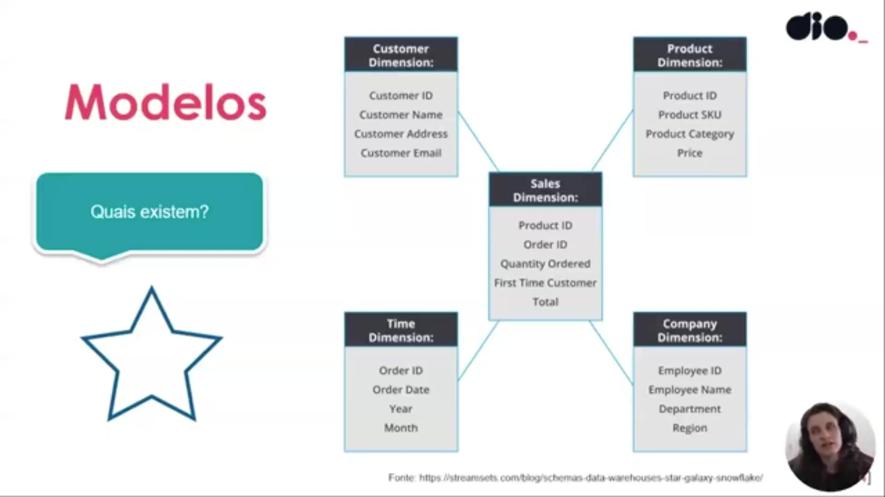

  
Esta imagem mostra um **modelo estrela (star schema)** em zoom: um **fato central** rodeado por várias **tabelas dimensão**. O ponto principal é que a tabela do meio (a *fact table*) concentra as medidas que queremos analisar (por exemplo, vendas, unidades, receita) e cada dimensão (cliente, produto, tempo, companhia) fornece atributos descritivos que enriquecem as análises. A estrutura em “raio” facilita consultas analíticas simples e desempenho em leitura, pois as junções são diretas entre a fact table e cada dimensão. 

  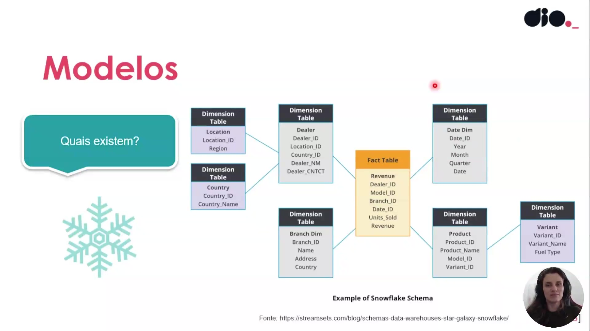

A imagem ilustra a **variação Snowflake** do star schema: as dimensões são **normalizadas** em sub‑tabelas (por exemplo, *Product → Variant*, *Branch → Country*). Em vez de uma única dimensão larga, o snowflake divide atributos em tabelas relacionadas, reduzindo redundância e modelando hierarquias explícitas (Location → Dealer → Branch, Product → Variant). Esse desenho é útil quando se quer manter consistência e economizar espaço, embora aumente o número de junções nas consultas. Elementos visíveis no diagrama incluem *Date Dim*, *Branch Dim*, *Product* e *Variant*, com a fact table central contendo medidas como *Units_Sold* e *Revenue*. 

  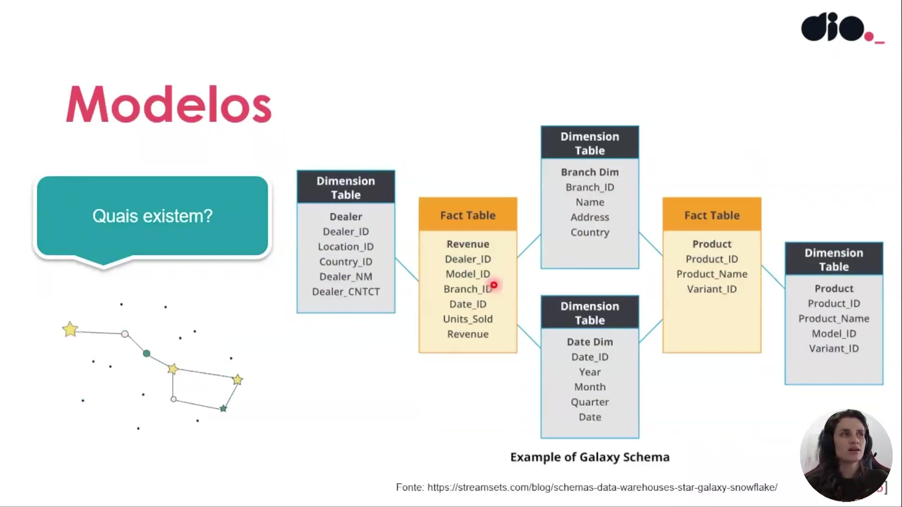

Esta imagem mostra um **Galaxy schema** (também chamado de *constellation*): múltiplas **fact tables** compartilham dimensões comuns. No exemplo, diferentes fatos de receita/unidades referenciam as mesmas dimensões de *Product*, *Date* e *Branch*, permitindo análises integradas entre processos distintos (por exemplo, vendas por dealer e vendas por filial). O galaxy é indicado quando há vários processos analíticos relacionados que precisam reutilizar dimensões padronizadas, facilitando consistência entre relatórios. 

  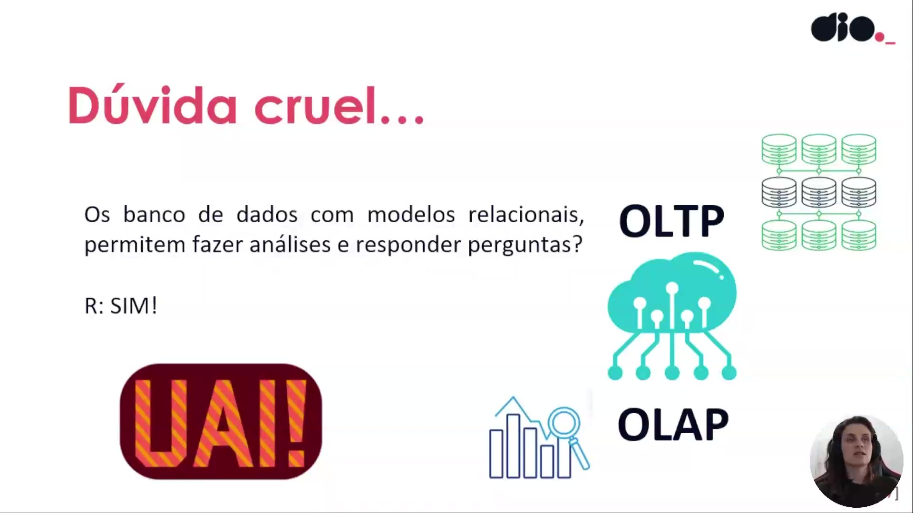

O slide contrapõe **OLTP** e **OLAP** para lembrar que, embora bancos relacionais transacionais (OLTP) sejam projetados para operações rápidas e consistentes (inserções/atualizações), eles também podem servir como fonte para análises. Em ambientes analíticos, modelos como star, snowflake e galaxy são usados para organizar dados de forma que consultas OLAP sejam eficientes. Em resumo: **modelos relacionais bem projetados permitem responder perguntas analíticas**, mas a escolha entre normalização (snowflake), desnormalização (star) ou múltiplas facts (galaxy) depende dos requisitos de desempenho, manutenção e consistência. 

### 🟩 Vídeo 06 - Explorando Brevemente os Modelos Dimensionais

<video width="60%" controls>
  <source src="000-Midia_e_Anexos/bootcamp_ntt_data-modulo.08-curso.01-video_06.webm" type="video/webm">
    Seu navegador não suporta vídeo HTML5.
</video>

link do vídeo: https://web.dio.me/track/engenharia-dados-python/course/fundamentos-de-modelagem-dimensional/learning/3c4c0e59-829d-4c41-a450-3e61c737f725?autoplay=1

O vídeo explora os conceitos fundamentais da modelagem dimensional, focando nos modelos Star Schema, Snowflake e Constelação, e como eles são utilizados para otimizar a análise de dados e a tomada de decisões.

### Anotações

  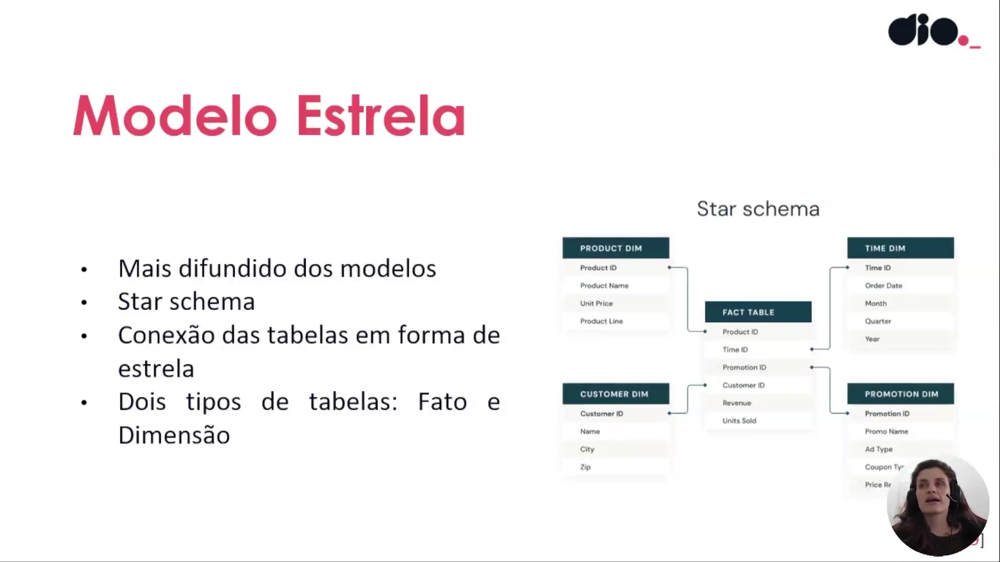

O **Modelo Estrela (Star Schema)** é o esquema dimensional mais difundido em *data warehousing*. Seu nome deriva da disposição das tabelas: uma tabela **fato** no centro e diversas tabelas **dimensão** ao redor, formando uma estrutura similar a uma estrela. A tabela fato armazena as métricas ou medidas de negócio (ex.: valor de venda, quantidade), enquanto as tabelas dimensão contêm os atributos descritivos (ex.: cliente, produto, data). Esse formato desnormalizado simplifica as consultas analíticas e proporciona alto desempenho, pois reduz a necessidade de múltiplos junções entre tabelas.

  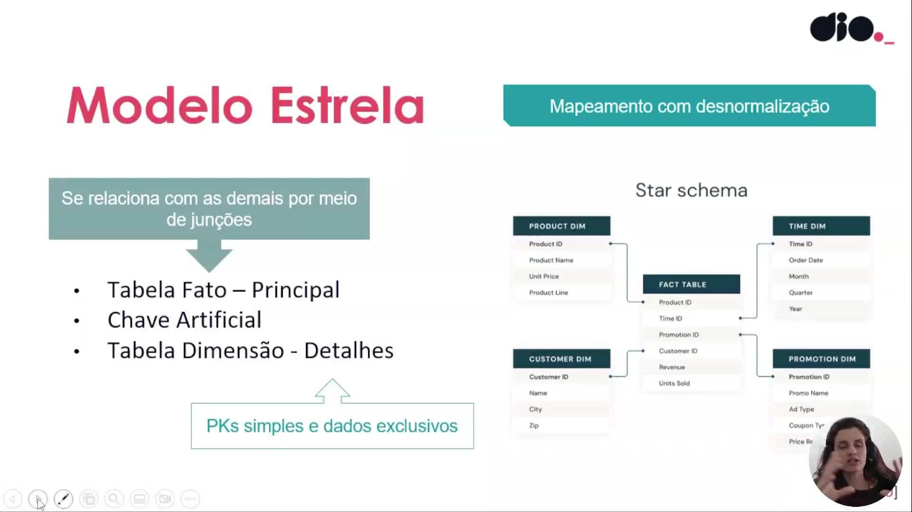

A imagem detalha os componentes principais do Modelo Estrela. A **tabela fato** é a tabela principal; ela contém as chaves estrangeiras que se conectam às dimensões e as medidas quantitativas de interesse. Frequentemente utiliza uma **chave artificial** (surrogate key) para garantir integridade e simplificar a junção. As **tabelas dimensão** guardam os detalhes descritivos de cada aspecto analisado, com chaves primárias simples e dados exclusivos. O esquema opera com **desnormalização** – as dimensões não são divididas em várias tabelas, o que introduz certa redundância, mas essa característica é intencional: ela acelera as consultas, uma vez que reduz o número de junções e mantém a estrutura intuitiva para o usuário final.

  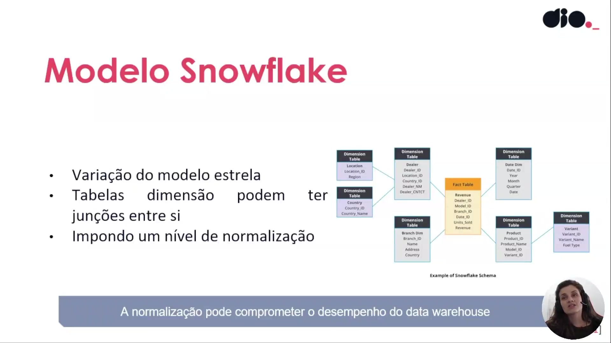

O **Modelo Snowflake** é uma variação do modelo estrela. Nesse esquema, as tabelas dimensão são normalizadas, ou seja, divididas em subdimensões relacionadas entre si, eliminando duplicidades e criando uma estrutura que lembra um floco de neve. Essa normalização reduz o espaço de armazenamento, mas introduz níveis adicionais de junções, aumentando a complexidade das consultas e potencialmente comprometendo o desempenho analítico. Por esse motivo, o modelo estrela costuma ser preferido em ambientes de *data warehouse*, onde a velocidade de resposta é mais relevante que a economia de espaço.

  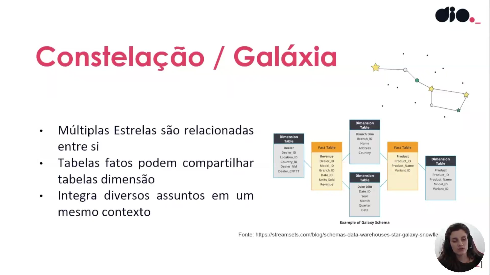

O esquema **Constelação** (também chamado de **Galáxia**) expande a abordagem estrela ao conter **múltiplas tabelas fato** que podem compartilhar tabelas dimensão entre si. Cada tabela fato representa um processo de negócio diferente (ex.: vendas, estoque, devoluções), mas as dimensões comuns – como tempo, cliente e produto – são reutilizadas, formando uma constelação de estrelas interconectadas. Esse modelo integra diversos assuntos em um mesmo contexto analítico, permitindo uma visão unificada e rica para a tomada de decisão.

  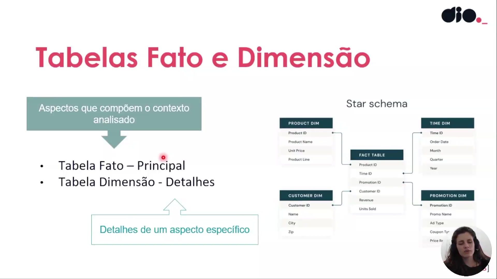

As **tabelas fato e dimensão** constituem a base de qualquer modelo dimensional. A **tabela fato** é o ponto de partida das análises: ela armazena eventos ou transações (vendas, pedidos, etc.) e contém as medidas que se deseja analisar – valores numéricos que podem ser somados, calculados ou agregados. A **tabela dimensão** fornece o contexto: seus atributos descritivos (categoria do produto, nome do cliente, data, região) permitem filtrar, agrupar e segmentar os dados da tabela fato. Durante a construção do modelo, costuma-se adicionar **chaves artificiais** (surrogate keys) às dimensões, garantindo independência entre o sistema de origem e o ambiente analítico, além de preservar a chave natural do sistema transacional. Essa estrutura desnormalizada é essencial para que ferramentas de BI (Business Intelligence) entreguem respostas rápidas e intuitivas aos usuários.      

### 🟩 Vídeo 07 - O que é Granularidade de dados?

<video width="60%" controls>
  <source src="000-Midia_e_Anexos/bootcamp_ntt_data-modulo.08-curso.01-video_07.webm" type="video/webm">
    Seu navegador não suporta vídeo HTML5.
</video>

link do vídeo: https://web.dio.me/track/engenharia-dados-python/course/fundamentos-de-modelagem-dimensional/learning/9b5a732f-c653-4ea5-b8c8-09f599893560?autoplay=1

Este vídeo explora o conceito de granularidade, um pilar fundamental na modelagem de dados e Business Intelligence (BI). O vídeo detalha como o nível de detalhamento dos dados afeta tanto a qualidade das análises quanto a performance dos sistemas.

### Anotações

  

Esta imagem introduz o conceito de granularidade, elemento central na modelagem dimensional. Ela apresenta a definição de granularidade como o **nível de detalhamento dos dados armazenados em uma tabela fato**. O esquema ilustra a relação inversa entre o “grão” (tamanho da unidade de análise) e o nível de detalhe: quanto maior o grão, menor a quantidade de detalhes; quanto menor o grão, mais refinados são os dados. Além disso, destaca a necessidade de um **trade-off** na definição da granularidade, equilibrando a riqueza analítica com a viabilidade técnica e de performance.

  

A imagem traz um exemplo prático para fixar o conceito de granularidade. Utilizando um mapa da América do Norte (Estados Unidos e Canadá), ela sugere um cenário de análise de vendas por território. A definição da granularidade aqui está associada à dimensão geográfica: é possível analisar as vendas no nível mais agregado (todo o continente, um país) ou em níveis mais detalhados (regiões, estados, cidades). Essa escolha impacta diretamente a forma como os dados serão sumarizados e apresentados, mostrando que a granularidade não se limita ao tempo, mas se aplica a qualquer dimensão analítica.

  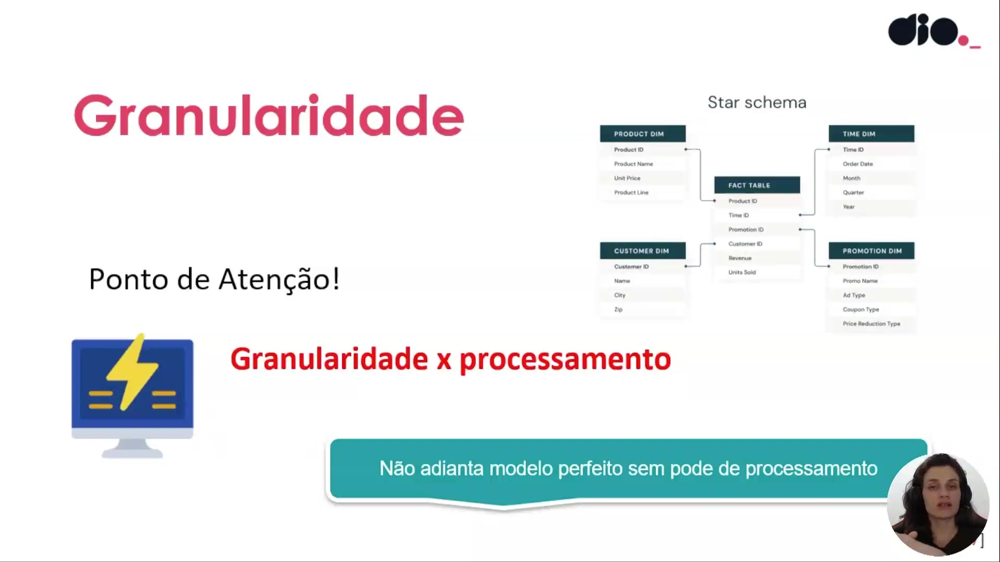

Este slide enfatiza um ponto de atenção crítico: a relação entre granularidade e capacidade de processamento. A imagem alerta que optar por uma granularidade muito baixa (alto nível de detalhe) exige maior poder computacional para processar e exibir os dados. A frase “Não adianta modelo perfeito sem poder de processamento” resume o trade-off: um modelo bem estruturado, com detalhamento excessivo, pode se tornar inviável se o ambiente computacional não der suporte à complexidade exigida. Assim, a definição da granularidade deve considerar tanto os requisitos analíticos quanto a infraestrutura disponível.      

### 🟩 Vídeo 08 - Chave Artificial com Start Schema

<video width="60%" controls>
  <source src="000-Midia_e_Anexos/bootcamp_ntt_data-modulo.08-curso.01-video_08.webm" type="video/webm">
    Seu navegador não suporta vídeo HTML5.
</video>

link do vídeo: https://web.dio.me/track/engenharia-dados-python/course/fundamentos-de-modelagem-dimensional/learning/570e32ab-f424-43e8-9e86-460e2e9054a2?autoplay=1

Este vídeo explora o conceito de Chaves Artificiais (Surrogate Keys), sua importância na transição de sistemas transacionais para analíticos e como elas otimizam a performance de bancos de dados OLAP.

### Anotações

  

A imagem apresenta o título “Chave Artificial” acompanhado das perguntas “O que isso? Como uso esse trem?”.  
Os três pontos listados resumem as principais características desse conceito no modelo dimensional:

- **Chave relacionada ao modelo dimensional** – a chave artificial é um elemento próprio da modelagem dimensional (usada em data warehouses e sistemas OLAP), não do sistema transacional original.
- **Substitui a identificação sem sobreposição** – ela substitui a chave primária do sistema de origem (chave natural) sem apagá‑la ou conflitar com ela; ambas podem coexistir.
- **Facilita a identificação de registros no modelo atual** – por ser mais simples (geralmente numérica e sequencial), agiliza a localização e a junção dos dados nas tabelas fato e dimensão.

O slide introduz a ideia de que a chave artificial é uma solução para tornar a navegação e a performance do ambiente analítico mais eficientes, mantendo a rastreabilidade dos dados originais.

  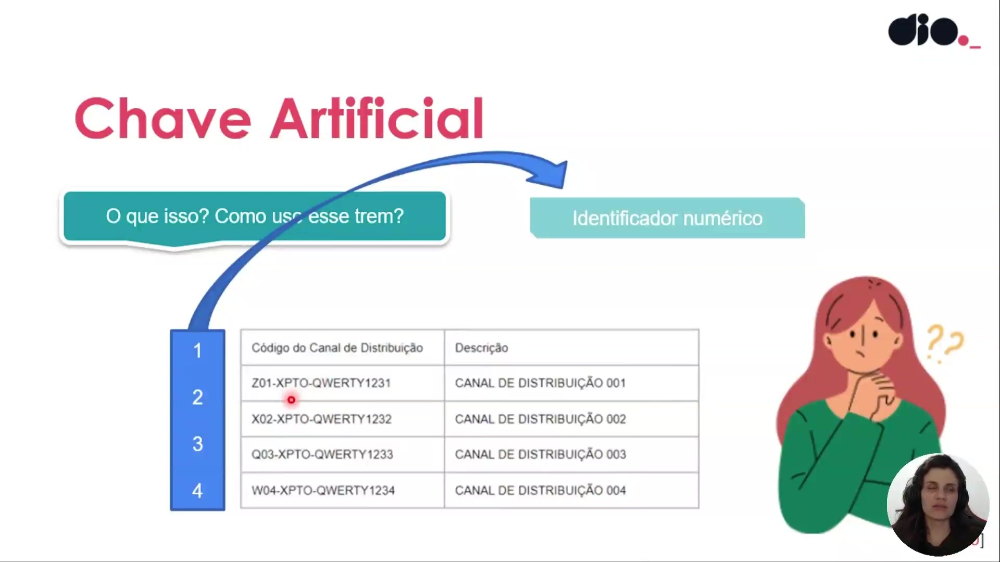

Este segundo slide reforça a pergunta “O que isso? Como usar esse trem?” e destaca a característica central da chave artificial: **Identificador numérico**.

Enquanto os sistemas transacionais podem utilizar chaves complexas (como códigos hexadecimais, sequências alfanuméricas longas ou chaves compostas), a chave artificial simplifica esse identificador para um valor numérico sequencial.  
Essa conversão traz benefícios diretos:

- Melhor performance em buscas e junções (índices numéricos são mais rápidos que strings grandes);
- Facilidade de leitura e depuração durante o desenvolvimento;
- Independência em relação ao sistema de origem – se o código do canal ou do produto mudar no ERP, a chave artificial permanece estável.

Na prática, a chave artificial convive com a chave natural do sistema original, garantindo tanto a eficiência do modelo dimensional quanto a rastreabilidade dos dados.      

### 🟩 Vídeo 09 - Modelando o Esquema Relacional Base

<video width="60%" controls>
  <source src="000-Midia_e_Anexos/bootcamp_ntt_data-modulo.08-curso.01-video_09.webm" type="video/webm">
    Seu navegador não suporta vídeo HTML5.
</video>

link do vídeo: https://web.dio.me/track/engenharia-dados-python/course/fundamentos-de-modelagem-dimensional/learning/cfdc47ec-b552-44d9-824e-06051d063ff1?autoplay=1

Este vídeo tutorial apresenta o processo inicial de criação de um esquema de banco de dados relacional simplificado para um sistema de e-commerce, utilizando a plataforma online SQLDBM. O objetivo é preparar a base para uma futura transição para a modelagem dimensional.

### Anotações

  

Esta imagem mostra a tela inicial e elementos de navegação do **SQLDBM**, uma plataforma web para modelagem de bancos de dados. É possível identificar menus de acesso a recursos (como *Resources*, *Changelog*, *Pricing*), opções de login/registro e banners de integrações (por exemplo, *databricks*, *Google BigQuery*, *snowflake*), indicando que a ferramenta suporta múltiplos destinos de implementação. A captura contextualiza o uso da plataforma como ambiente para criar projetos e diagramas de banco de dados sem escrever código.  

  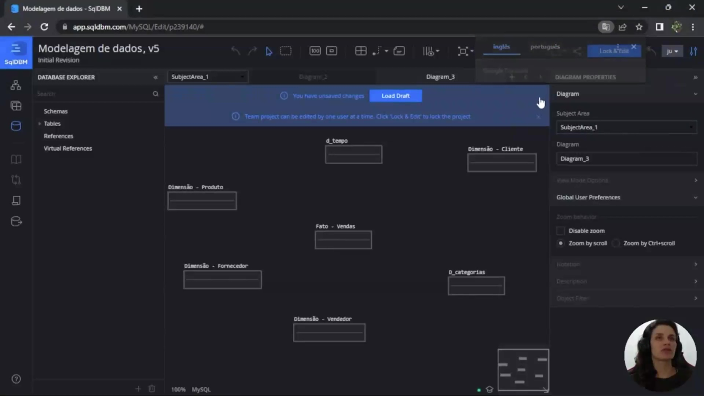

A imagem apresenta o painel de **Diagramas / Database Explorer** do projeto: lista de diagramas (SubjectArea_1, Diagram_2, etc.), propriedades do diagrama e seções para *Schemas*, *Tables*, *References* e *Virtual References*. Também aparecem nomes de áreas dimensionais e fatos (por exemplo, *Dimensão - Cliente*, *Fato - Vendas*), o que indica que o autor está organizando um modelo relacional com foco posterior em modelagem dimensional. Esse quadro é onde se adicionam, editam e navegam as tabelas antes de criar relacionamentos.  

  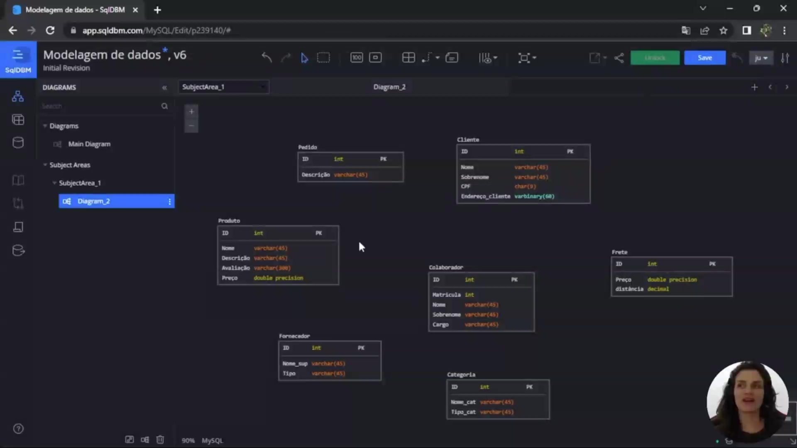

Esta captura mostra definições de tabelas e colunas exemplares usadas no modelo: **Produto** (ID int PK; Nome varchar(45); Descrição varchar(45); Avaliação varchar(300); Preço double precision), **Fornecedor** (ID int PK; Nome_sup varchar(45); Tipo varchar(45)), **Cliente** (ID int PK; Nome varchar(45); Sobrenome varchar(45); CPF char(9); Endereço_cliente varbinary(60)) e outras entidades como **Colaborador**, **Frete** e **Categoria**. Note que a interface exibe tipos de dados e chaves primárias, e que o instrutor opta por um modelo simplificado (atributos agregados em vez de normalização completa) para fins didáticos. A imagem também evidencia distinção visual entre tipos numéricos e textuais na ferramenta, ajudando a revisar rapidamente a modelagem.  
    

### 🟩 Vídeo 10 - Definindo os Relacionamentos do Modelo Relacional

<video width="60%" controls>
  <source src="000-Midia_e_Anexos/bootcamp_ntt_data-modulo.08-curso.01-video_10.webm" type="video/webm">
    Seu navegador não suporta vídeo HTML5.
</video>

link do vídeo: https://web.dio.me/track/engenharia-dados-python/course/fundamentos-de-modelagem-dimensional/learning/107aa7d5-048e-4066-9338-4894ccfdc93f?autoplay=1

Este vídeo explica como construir um modelo de dados relacional focado em um sistema de vendas e pedidos. O instrutor demonstra a criação de entidades, a definição de relacionamentos (1:N e N:M) e boas práticas de organização visual e nomenclatura para facilitar a transição futura para modelos dimensionais.

### Anotações

  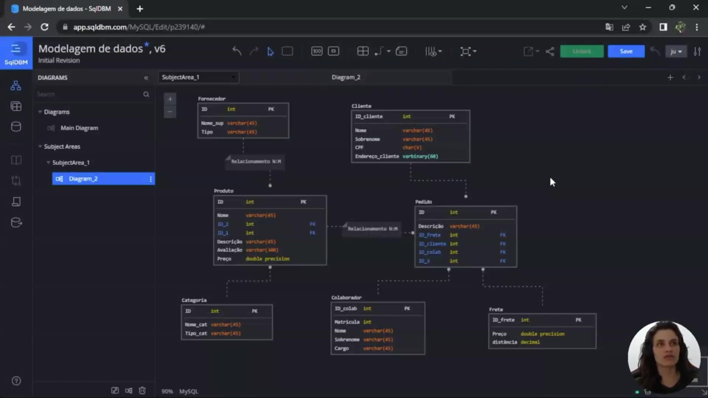

A imagem mostra um diagrama de modelagem relacional extraído do SQLDBM com várias **entidades** e seus **atributos** visíveis, além de anotações sobre **chaves primárias (PK)**, **chaves estrangeiras (FK)** e **relacionamentos**.  
Os elementos principais identificáveis são **Fornecedor**, **Cliente**, **Produto**, **Pedido**, **Categoria**, **Colaborador** e **Frete**; alguns atributos exibidos incluem **Nome varchar(45)**, **Preço double precision** e **CPF char(9)**.  

**Pontos observáveis**
- **Relacionamentos N:M** estão anotados entre *Produto ↔ Fornecedor* e *Pedido ↔ Produto*, indicando que essas associações exigem uma tabela associativa (tabela de junção) para modelagem relacional correta.  
- **Chaves e atributos**: várias tabelas mostram um campo `ID` como inteiro e marcado como **PK**; há também campos identificados como **FK** dentro da tabela *Pedido* (por exemplo, `ID_cliente`, `ID_colab`, `ID_frete`), o que sinaliza dependências entre tabelas.  
- **Boas práticas sugeridas pela visualização**: evitar redundância (por exemplo, não colocar o ID do pedido dentro da tabela Cliente), renomear atributos com nomes únicos quando o mesmo rótulo aparece em tabelas diferentes (ex.: `ID`, `ID_colab`) e criar tabelas de junção para relacionamentos muitos‑para‑muitos.

**Ações de modelagem recomendadas**
- **Criar tabelas associativas** para cada relacionamento N:M (por exemplo, `Produto_Fornecedor` e `Pedido_Produto`) contendo as FKs correspondentes e, se necessário, atributos adicionais (quantidade, preço unitário, data).  
- **Normalizar atributos redundantes**: mover FKs para a tabela que representa o lado “muitos” do relacionamento e remover colunas redundantes da tabela do lado “um”.  
- **Padronizar nomes de colunas** para evitar ambiguidade (por exemplo, usar `cliente_id`, `colaborador_id`, `frete_id`, `produto_id` em vez de múltiplos `ID` genéricos).  
- **Documentar as FKs** explicitamente no modelo (origem e destino) para facilitar a geração automática de DDL em ferramentas como Workbench ou SQLDBM.

### 🟩 Vídeo 11 - Criando o Modelo Dimensional com Base no Relacional

<video width="60%" controls>
  <source src="000-Midia_e_Anexos/bootcamp_ntt_data-modulo.08-curso.01-video_11.webm" type="video/webm">
    Seu navegador não suporta vídeo HTML5.
</video>

link do vídeo: https://web.dio.me/track/engenharia-dados-python/course/fundamentos-de-modelagem-dimensional/learning/077bd450-c43f-444d-b750-beec1cdaacc6?autoplay=1

Este vídeo apresenta um guia prático sobre como estruturar um modelo de dados analítico voltado para vendas. A instrutora, Juliana, demonstra a criação de um Esquema Estrela (Star Schema), diferenciando tabelas de Fato e Dimensão, e detalhando os atributos necessários para uma análise de negócios eficiente.

### Anotações

#### 

  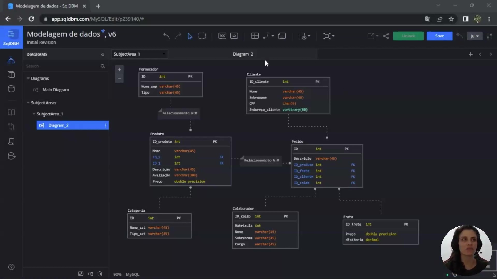

A imagem mostra um recorte inicial do diagrama lógico/relacional e uma tabela de atributos para **produto**. Do lado esquerdo há uma tabela com os campos principais do produto — **ID_produto (PK)**, **Nome**, **ID_2 (FK)**, **ID_1 (FK)**, **Descrição**, **Avaliação** e **Preço** — com tipos de dados indicados (varchar, int, double precision). À direita aparece um esboço de diagrama com entidades relacionadas ao domínio de vendas: **Fornecedor**, **Cliente**, **Produto**, **Pedido**, **Categoria**, **Colaborador** e **Frete**, incluindo chaves primárias e alguns atributos (por exemplo, CPF do cliente, distância e preço no frete). Essa visão corresponde à etapa inicial de levantamento de entidades e atributos antes de definir chaves e relacionamentos finais.

  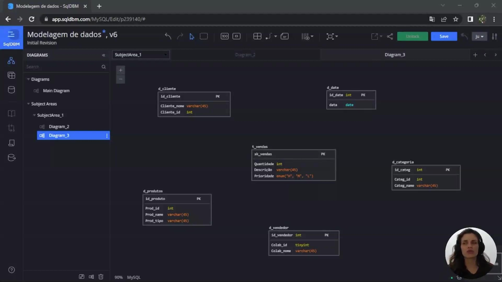

A segunda imagem apresenta o **esqueleto dimensional** do modelo em formato estrela. No centro está a tabela fato **t_vendas** (com **sk_vendas** como chave) e atributos de fato como **Quantidade**, **Descrição** e **Prioridade** (enum com valores H, M, L). Ao redor aparecem as dimensões previstas: **d_date** (com **id_date** e campo data), **d_cliente** (ID e nome), **d_vendedor** (ID e nome do colaborador), **d_categoria** (ID e nome da categoria) e **d_produtos** (ID, nome e tipo do produto). A imagem reflete a padronização de nomes de chaves (por exemplo, **ID_date**, **ID_cliente**, **ID_vendedor**, **ID_categ**, **ID_produto**) e a intenção de manter a tabela fato conectada a essas dimensões para análises temporais e por entidade.

### 🟩 Vídeo 12 - Criando os Relacionamentos do Star Schema

<video width="60%" controls>
  <source src="000-Midia_e_Anexos/bootcamp_ntt_data-modulo.08-curso.01-video_12.webm" type="video/webm">
    Seu navegador não suporta vídeo HTML5.
</video>

link do vídeo: https://web.dio.me/track/engenharia-dados-python/course/fundamentos-de-modelagem-dimensional/learning/9aadd40b-2f98-4f83-a18d-e03450a98211?autoplay=1

Este vídeo apresenta uma demonstração prática de como construir um modelo de dados dimensional (Star Schema) em uma ferramenta de design, comparando-o com a modelagem relacional tradicional. O foco está na organização de entidades como Clientes, Produtos e Vendas, e como essas estruturas servem a propósitos diferentes no ecossistema de dados.

### Anotações

### Modelagem dimensional — diagrama

  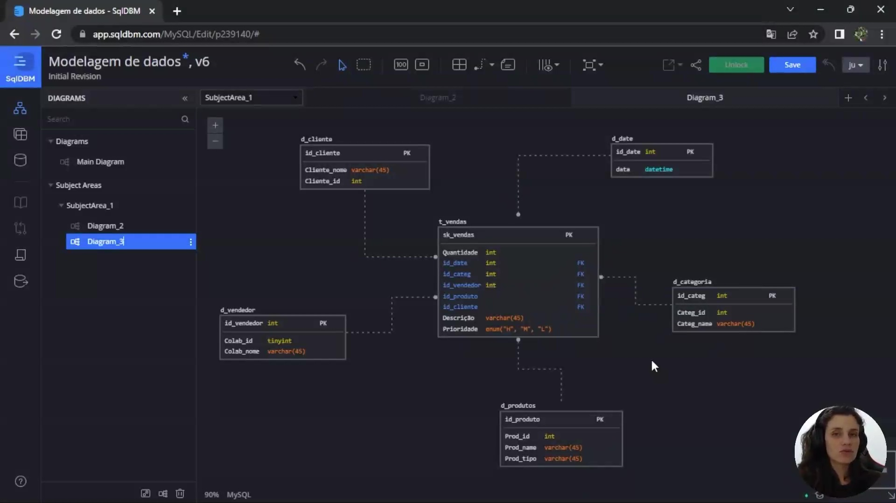

**Explicação didática (foco nesta imagem):**

- **Visão geral:** o diagrama apresenta um *fato* central **t_vendas** ligado a várias *dimensões* — **d_cliente**, **d_produtos**, **d_categoria**, **d_vendedor** e **date**.  
- **Chaves e relacionamentos:** em **t_vendas** o campo **sk_vendas** aparece como **PK**; os campos **id_date**, **id_categ**, **id_vendedor**, **id_produto** e **id_cliente** funcionam como **FK** apontando para as dimensões correspondentes.  
- **Atributos relevantes:** a tabela de fatos inclui **Quantidade**, **Descrição** e **Prioridade** (enumeração **"H", "M", "L"**), enquanto as dimensões trazem identificadores e atributos descritivos (por exemplo, **Cliente_nome varchar(45)**; **Prod_name varchar(45)**; **Categ_name varchar(45)**).  
- **Data como atributo de análise:** o autor destaca a necessidade de registrar a data do pedido e opta por **datetime** para permitir múltiplos pedidos no mesmo dia e granularidade temporal maior.  
- **Propósito do esquema:** o desenho segue a lógica de um **esquema em estrela** (star schema) — dimensão desnormalizada para facilitar consultas analíticas — em contraste com modelos normalizados (ou snowflake), que seriam mais adequados a ambientes transacionais (OLTP).  
  - **Implicação prática:** esse formato prioriza desempenho de leitura e simplicidade nas consultas analíticas (OLAP), sacrificando normalização e algumas constraints típicas de um SGBD transacional. 

**Pontos de atenção ao implementar:**

- **Definir tipos e tamanhos** (varchar, enum, int) conforme volume e cardinalidade esperados.  
- **Garantir integridade referencial** ao carregar dados de fontes externas (ETL), especialmente para as FKs do fato.  
- **Considerar tabelas de junção** (N:N) quando houver relacionamentos muitos‑para‑muitos entre entidades (por exemplo, pedido ↔ produto), conforme mencionado pelo autor. 

### 🟩 Vídeo 13 - Rastreando Modificações no Modelo - Slowly Changing Dimensions

<video width="60%" controls>
  <source src="000-Midia_e_Anexos/bootcamp_ntt_data-modulo.08-curso.01-video_13.webm" type="video/webm">
    Seu navegador não suporta vídeo HTML5.
</video>

link do vídeo: https://web.dio.me/track/engenharia-dados-python/course/fundamentos-de-modelagem-dimensional/learning/a6b7d91c-ce80-44c4-bdd7-a450610f2845?autoplay=1

As Slowly Changing Dimensions (SCD) são estratégias fundamentais no modelagem dimensional de dados. Elas determinam como o sistema deve reagir quando as informações de uma dimensão (como o cargo de um cliente ou seu status de assinatura) mudam ao longo do tempo.

### Anotações

  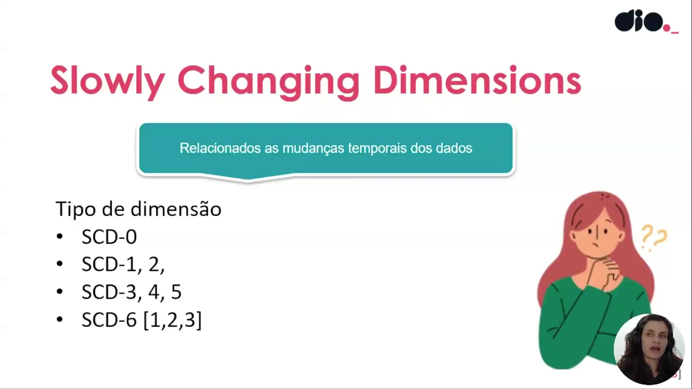

**Slowly Changing Dimensions (SCD)** são técnicas usadas em modelagem dimensional para tratar mudanças nos dados de dimensão ao longo do tempo. Elas permitem definir como as alterações (como a mudança de estado civil, cargo ou status de um cliente) serão refletidas no Data Warehouse. Os principais tipos variam de SCD‑0 (nenhuma modificação) até SCD‑6 (combinação de abordagens), cada um adequado a diferentes requisitos de rastreamento histórico e desempenho.

  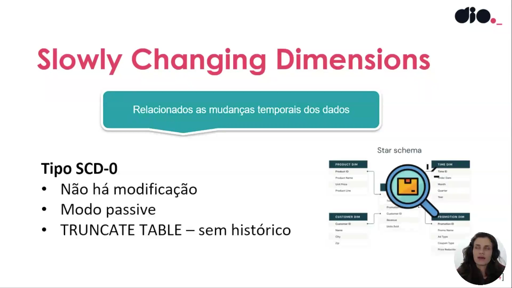

**SCD – Tipo 0**  
Neste tipo, os dados não sofrem modificação após serem inseridos. Qualquer mudança na origem é simplesmente ignorada pelo Data Warehouse. É o modo passivo, sem rastreamento de histórico. Em termos de implementação, equivale a um `TRUNCATE TABLE` seguido de nova inserção dos dados, ou seja, a tabela é recarregada periodicamente sem guardar versões anteriores.

  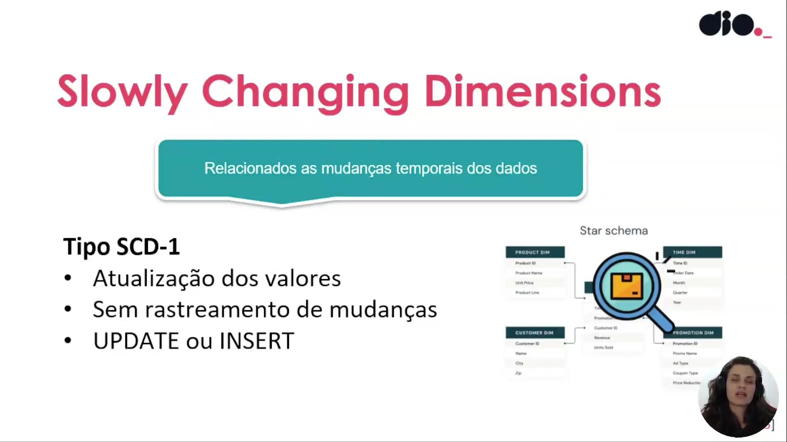

**SCD – Tipo 1**  
O tipo 1 sobrescreve os valores antigos pelos novos, sem manter qualquer histórico da mudança. Quando um atributo é alterado na origem, o Data Warehouse realiza um `UPDATE` no registro existente. Caso o registro não exista, é feito um `INSERT`. Essa abordagem é simples e preserva o tamanho da tabela, mas não permite analisar como os dados evoluíram ao longo do tempo.

  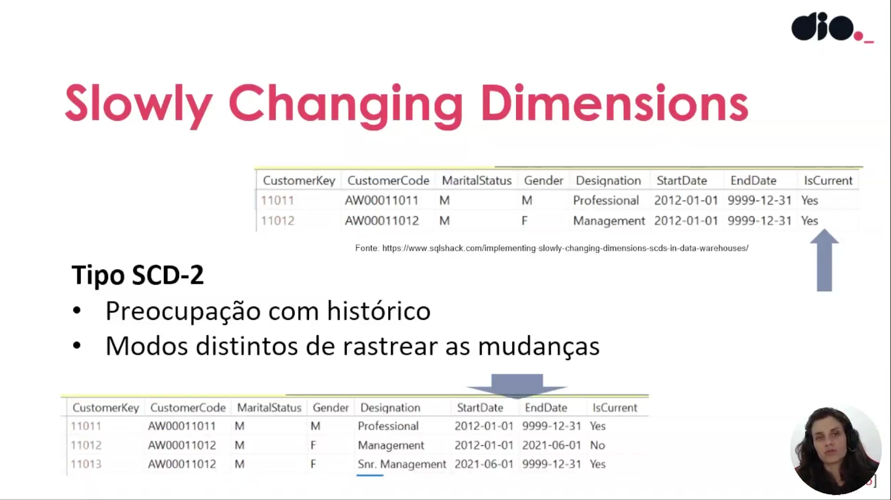

**SCD – Tipo 2**  
O tipo 2 mantém o histórico completo das mudanças, criando uma nova linha para cada versão do registro. São adicionadas colunas de controle, como `StartDate` (data de início da versão), `EndDate` (data de término) e `IsCurrent` (flag que indica a versão ativa). No exemplo, o cliente com `CustomerKey` 11012 teve sua `Designation` alterada de “Management” para “Snr. Management” em 2021‑06‑01. A versão anterior é marcada com `EndDate` e `IsCurrent = No`, enquanto a nova versão tem `StartDate` atual e `IsCurrent = Yes`. Essa técnica permite reconstruir o estado da dimensão em qualquer momento do tempo.

  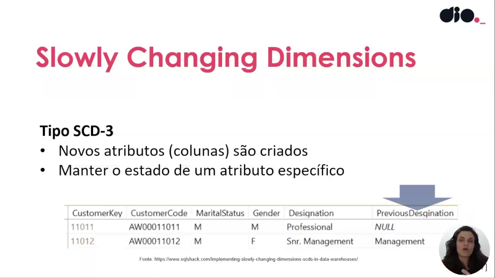

**SCD – Tipo 3**  
No tipo 3, em vez de adicionar novas linhas, são criadas colunas extras na mesma linha para armazenar valores anteriores. Normalmente, mantém‑se apenas o valor imediatamente anterior de um atributo específico. No exemplo, a coluna `PreviousDesignation` guarda o cargo anterior (“Management”) quando o cargo atual (“Snr. Management”) é alterado. Embora economize espaço, esse método limita o rastreamento a apenas uma mudança por atributo.

  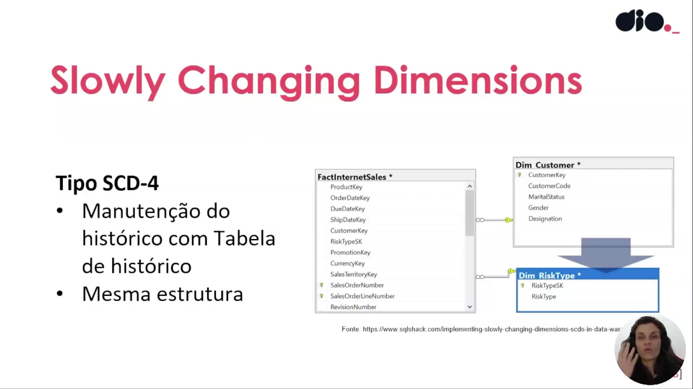

**SCD – Tipo 4**  
O tipo 4 utiliza duas tabelas: a tabela principal mantém apenas os registros atuais (sem histórico), e uma tabela de histórico, com a mesma estrutura, armazena todas as versões antigas. Quando um registro é alterado, o valor atual é movido para a tabela de histórico antes de ser sobrescrito. Essa separação melhora o desempenho das consultas que precisam apenas dos dados atuais, mantendo o histórico acessível para análises retrospectivas.

  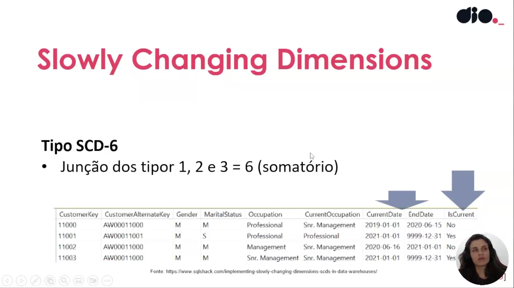

**SCD – Tipo 6**  
O tipo 6 combina as características dos tipos 1, 2 e 3 – daí o nome (1+2+3 = 6). Ele mantém o histórico completo com linhas versionadas (SCD‑2), uma coluna com o valor atual (SCD‑1) e uma coluna com o valor anterior (SCD‑3). Na tabela exemplo, `CurrentOccupation` representa o cargo atual (atualizado sempre), `Occupation` mantém o valor da linha naquele período (histórico) e as colunas de controle (`CurrentDate`, `EndDate`, `IsCurrent`) permitem navegar pelas versões. Essa abordagem oferece máxima flexibilidade para análises temporais, mas exige mais espaço e lógica de manutenção.      

### 🟩 Vídeo 14 - Modificando o Star Schema para mapear Modificações nos Dados

<video width="60%" controls>
  <source src="000-Midia_e_Anexos/bootcamp_ntt_data-modulo.08-curso.01-video_14.webm" type="video/webm">
    Seu navegador não suporta vídeo HTML5.
</video>

link do vídeo: https://web.dio.me/track/engenharia-dados-python/course/fundamentos-de-modelagem-dimensional/learning/b12037b1-fd99-4527-b7ed-d69a40df8d58?autoplay=1

Este vídeo tutorial foca na transformação de tabelas de dimensão estáticas em dimensões históricas (comumente conhecidas como Slowly Changing Dimensions - SCD Tipo 2). O objetivo é permitir que analistas rastreiem mudanças no comportamento ou status de clientes e colaboradores ao longo do tempo, garantindo a integridade histórica dos dados.

### Anotações

  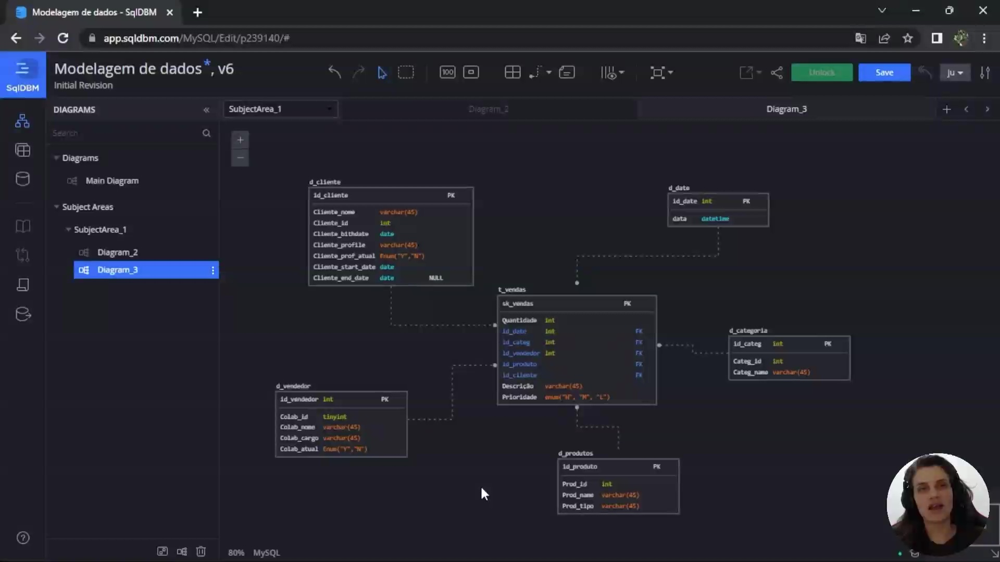

 
A imagem mostra um diagrama de modelagem dimensional com várias tabelas de dimensão e fatos dispostas em estilo de diagrama (ex.: **d_cliente**, **d_date**, **t_vendas**, **d_vendedor**, **d_produtos**, **d_categoria**). Na **dimensão cliente (d_cliente)** aparecem atributos textuais como **Cliente_nom (varchar)**, **birthdate (date)**, **Cliente_profile (varchar)** e colunas de rastreio temporal/estado: **Cliente_prof_atual (enum Y/N)**, **Cliente_start_date (date)** e **Cliente_end_date (date, NULL permitido)**. Outros elementos visíveis incluem chaves primárias (PK) e chaves estrangeiras (FK) ligando fatos e dimensões, e atributos de produto e vendedor com tipos e tamanhos indicados.

**Pontos didáticos e práticos extraídos da imagem e do texto associado**  
- **Rastreabilidade temporal:** a presença de `start_date`, `end_date` e um flag `prof_atual` indica a intenção de transformar a dimensão cliente em uma **dimensão histórica** (SCD), permitindo acompanhar mudanças de perfil ao longo do tempo.  
- **Flag simplifica consultas:** o campo **Cliente_prof_atual** com valores **Y/N** é uma otimização para facilitar buscas pelo estado corrente do cliente, em vez de depender apenas de `NULL` em `end_date`.  
- **Chave natural vs. chave surrogate:** o diagrama e o comentário associado mostram que a **chave natural** do cliente permanece constante enquanto o **surrogate key** (ID da linha) muda a cada versão histórica, permitindo recuperar o histórico completo por cliente.  
- **Consistência de tipos:** os atributos textuais usam `varchar(45)` e datas usam `date`, conforme anotado no diagrama; isso ajuda a padronizar o modelo e evitar ambiguidade na ingestão de dados.  
- **Aplicabilidade:** a mesma abordagem (atributo, flag atual, start/end dates) pode ser aplicada a outras dimensões que mudam ao longo do tempo, como **vendedor/colaborador** (cargo, cargo_atual, etc.), conforme indicado no material.

# Certificado: Fundamentos de Modelagem Dimensional

- Link na plataforma: https://hermes.dio.me/certificates/QPJVJ4HM.pdf
- Certificado em pdf: [Fundamentos de Modelagem Dimensional](000-Midia_e_Anexos/Certificado-Fundamentos_de_Modelagem_Dimensional.pdf)