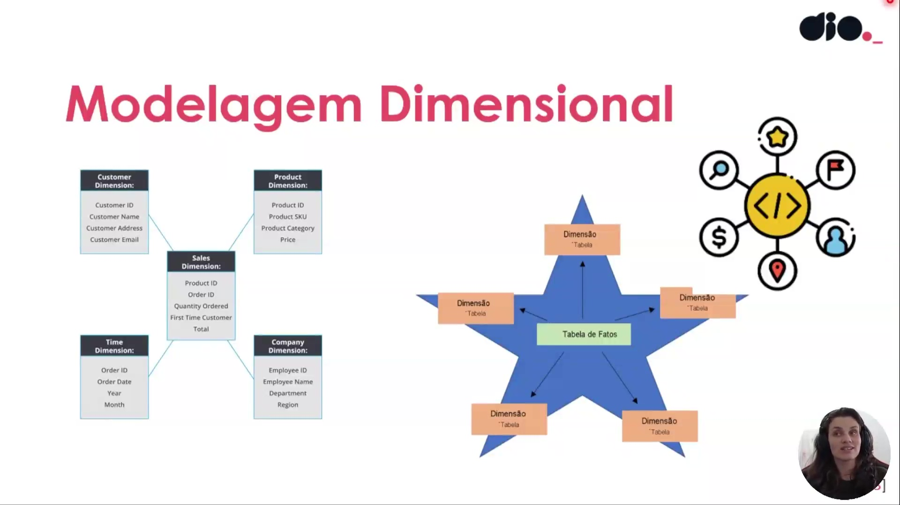

## Instrutor:

- Juliana Mascarenhas (Tech Education Specialist / Sócia (Content Creator) @SimplificandoRedes / Me Modelagem Computacional / Cientista de dados)
- Contato Linkedin: / [juliana-mascarenhas-ds](https://www.linkedin.com/in/juliana-mascarenhas-ds/)

## Parte 1 - Fundamentos de Modelagem Dimensional

### 🟩 Vídeo 01 - Apresentando a ementa do curso

<video width="60%" controls>
  <source src="000-Midia_e_Anexos/bootcamp_ntt_data-modulo.08-curso.01-video_01.webm" type="video/webm">
    Seu navegador não suporta vídeo HTML5.
</video>

link do vídeo: https://web.dio.me/track/engenharia-dados-python/course/fundamentos-de-modelagem-dimensional/learning/cfd67c81-3158-4c81-a31f-0a338544aadc?autoplay=1

Este curso, ministrado por Juliana Mascarenhas, aborda a transição fundamental entre a modelagem de dados tradicional (relacional/transacional) e a modelagem dimensional. O foco é capacitar profissionais de dados (analistas de BI, cientistas e engenheiros) a estruturarem informações de forma que facilitem a análise e a tomada de decisão estratégica.

### Anotações

  

Este slide apresenta o tema central da aula: **Introdução à Modelagem Dimensional**. O conteúdo faz parte da **Formação Power BI Analyst** e é ministrado por **Juliana Mascarenhas**, especialista em educação tecnológica, mestre em modelagem computacional e cientista de dados. A imagem introduz o contexto do curso, indicando que os conceitos abordados são fundamentais para profissionais que trabalham com dados, desde analistas até engenheiros, pois a modelagem dimensional é uma prática essencial para estruturar informações de forma analítica e otimizada.

  

Neste slide são listados os principais objetivos que serão explorados ao longo do conteúdo:
- **Entender o que é modelagem dimensional** – conceito base para organizar dados voltados à análise.
- **O que é Cubo multifacetado?** – estrutura que permite visualizar dados sob múltiplas perspectivas.
- **Principais modelos dimensionais** – conhecer os esquemas mais utilizados na prática.
- **Sistemas Transacionais e Analíticos** – diferenciar os ambientes de operação (OLTP) e de análise (OLAP).
- **Comparação entre transacional e dimensional** – entender as vantagens e aplicações de cada abordagem.
- **Criação de esquemas transactional e dimensional** – aplicação prática dos conceitos por meio da construção de modelos.

Esses tópicos servem como roteiro para a jornada de aprendizado, destacando a importância da modelagem dimensional para a construção de soluções de Business Intelligence eficientes.

### 🟩 Vídeo 02 - Desmistificando a Modelagem Dimensional

<video width="60%" controls>
  <source src="000-Midia_e_Anexos/bootcamp_ntt_data-modulo.08-curso.01-video_02.webm" type="video/webm">
    Seu navegador não suporta vídeo HTML5.
</video>

link do vídeo: https://web.dio.me/track/engenharia-dados-python/course/fundamentos-de-modelagem-dimensional/learning/772fc7ed-b21b-404b-9f0c-045e69a5bd87?autoplay=1

Este vídeo explora os fundamentos da modelagem dimensional, contrastando-a com a modelagem relacional tradicional. O foco principal é entender por que as empresas precisam de estruturas de dados diferentes para operações do dia a dia e para análises estratégicas de grande escala.

### Anotações

  

A modelagem dimensional costuma gerar ruído e dúvidas, especialmente para quem está acostumado com bancos de dados relacionais. Nesta aula, vamos desmistificar esse conceito, mostrando que ele pode ser até mais simples do que a modelagem relacional tradicional. O objetivo é construir uma base sólida para que você entenda por que e como aplicar esse tipo de modelagem em projetos analíticos, especialmente no Power BI.

  

A modelagem dimensional surgiu de uma lacuna: o modelo relacional, excelente para transações do dia a dia, mostrou-se insuficiente para atender às demandas de análise de grandes volumes de dados. Por isso, novas necessidades emergiram – **performance**, **escalabilidade** e **disponibilidade**. Em vez de executar consultas complexas diretamente no banco de dados operacional (o que poderia comprometer sua performance), passamos a usar um modelo separado, otimizado para consultas analíticas, garantindo que os dados estejam sempre acessíveis e que as respostas sejam rápidas.

  

Para entender a modelagem dimensional, é preciso diferenciar os dois grandes tipos de sistemas de dados:
- **Modelo transacional (tradicional)**: voltado para operações diárias (inserir, atualizar, deletar). Possui estrutura rígida, normalizada, e foco em integridade e concorrência.
- **Modelo dimensional (analítico)**: voltado para consultas e análises. Permite estruturas desnormalizadas, com foco em leitura rápida e facilidade de interpretação para negócios.

Cada um atende a um propósito distinto, e a escolha depende do cenário: operacional ou analítico.

  

O **modelo transacional** é desenhado para:
- **Fim específico**: suportar uma aplicação ou processo de negócio.
- **Cenário otimizado**: estrutura bem definida, com chaves, índices e restrições de integridade.
- **Suporte a operação**: lida com as transações do dia a dia (vendas, cadastros, movimentações).
- **SGBDs**: utiliza sistemas de gerenciamento de banco de dados relacionais (como SQL Server, Oracle, PostgreSQL) que garantem ACID (Atomicidade, Consistência, Isolamento, Durabilidade).

É a base dos sistemas operacionais das empresas, mas não é o ambiente ideal para grandes consultas analíticas.

  

Já o **modelo analítico** (dimensional) possui características que o tornam poderoso para BI e análises:
- **Permite redundâncias**: a desnormalização é bem-vinda, pois reduz a necessidade de joins complexos e acelera as consultas.
- **Esquema flexível**: estruturas como star schema e snowflake schema facilitam a navegação pelos dados.
- **Foco em análises**: tudo é pensado para responder perguntas de negócio rapidamente.
- **Modelo em cubo**: os dados são organizados em torno de fatos (medidas) e dimensões (atributos descritivos), formando uma visão multidimensional que facilita a exploração e a descoberta de insights.

Esse é o modelo que usamos em ferramentas como Power BI para construir relatórios performáticos e intuitivos.      

### 🟩 Vídeo 03 - O que significa Modelagem em Cubo?

<video width="60%" controls>
  <source src="000-Midia_e_Anexos/bootcamp_ntt_data-modulo.08-curso.01-video_03.webm" type="video/webm">
    Seu navegador não suporta vídeo HTML5.
</video>

link do vídeo: https://web.dio.me/track/engenharia-dados-python/course/fundamentos-de-modelagem-dimensional/learning/e56fe8c0-7fef-40c1-aca1-92aef529cf35?autoplay=1

Este vídeo explora o conceito de "Cubo" na ciência de dados, comparando-o com modelos tabulares tradicionais e discutindo as diferenças fundamentais entre sistemas transacionais e analíticos.

### Anotações

  

O slide apresenta a estrutura de uma tabela tradicional, com linhas representando registros e colunas representando atributos. A pergunta “Modelo em cubo?” introduz a reflexão sobre como essa representação bidimensional se relaciona com o conceito de cubo, que adiciona uma terceira dimensão para armazenar e analisar dados sob múltiplas perspectivas.

  

Nesta segunda representação tabular, reforça-se a ideia de que a tabela permite apenas combinações entre duas dimensões (por exemplo, produto e país ou produto e data). Essa limitação bidimensional contrasta com o modelo em cubo, onde uma terceira dimensão (como trimestre fiscal) possibilita análises mais ricas e consolidadas.

  

Este quadro compara visualmente dois modelos: Tabular (Relacional) e Cubo (Dimensional). No lado tabular aparecem listas de regiões e produtos organizadas como registros; no lado dimensional aparece a noção de trimestre fiscal como uma dimensão adicional, ilustrando como o cubo agrega uma face extra (altura) que permite consultas por produto, região e período fiscal ao mesmo tempo. A imagem enfatiza que o cubo é uma representação orientada à análise, projetada para facilitar múltiplas perspectivas sobre os mesmos dados.
 

  

O slide formaliza as principais características do cubo:
- **Eixos:** correspondem aos componentes do esquema (dimensões), como produto, país e data.
- **Interseção:** ponto de encontro entre os eixos, onde são armazenadas as medidas e os dados do contexto analisado.
- **Visão consolidada:** o cubo oferece uma perspectiva integrada e mais elaborada que uma tabela isolada.
- **Análises de perspectivas distintas:** ao dispor de múltiplas faces, permite examinar os dados sob diferentes ângulos.

  

A imagem compara os ambientes transacional e analítico, destacando que não há um “melhor” — eles coexistem e atendem a objetivos distintos.  
- **Transacional:** voltado para sistemas operacionais (ex.: vendas), prioriza alta disponibilidade e integridade por meio de restrições e estrutura confiável.  
- **Analítico:** focado em análise de dados, consolida informações de múltiplas fontes e aceita redundâncias em prol da performance das consultas.  
Ambos se complementam, sendo a escolha definida pela necessidade do cenário.      

### 🟩 Vídeo 04 - Entendendo Modelagem com Start Schema

<video width="60%" controls>
  <source src="000-Midia_e_Anexos/bootcamp_ntt_data-modulo.08-curso.01-video_04.webm" type="video/webm">
    Seu navegador não suporta vídeo HTML5.
</video>

link do vídeo: https://web.dio.me/track/engenharia-dados-python/course/fundamentos-de-modelagem-dimensional/learning/089b141c-5cec-4747-bcdc-eb4168580a41?autoplay=1

Este vídeo explora os fundamentos da modelagem dimensional, focando especialmente no Star Schema (Esquema em Estrela), comparando-o com os modelos relacionais tradicionais e destacando sua importância para a análise de dados.

### Anotações

  

Este é um esquema estrela (*star schema*), o modelo dimensional mais comum e mais simples de implementar. No centro temos a **tabela fato** (em vermelho), que concentra as métricas ou eventos a serem analisados. Ao redor estão as **tabelas dimensão** (em azul), que trazem os contextos ou descritivos de cada análise — como produto, cliente, tempo e empresa. As ligações entre a fato e as dimensões são diretas, formando um desenho que lembra uma estrela. Essa estrutura é otimizada para consultas de *business intelligence*, pois reduz a quantidade de junções (*joins*) necessárias para responder a perguntas de negócio.

  

A imagem apresenta um modelo relacional (DER — Diagrama Entidade-Relacionamento) gerado por uma ferramenta como o MySQL Workbench. Diferente do esquema estrela, aqui não há uma tabela fato centralizada. As tabelas são organizadas de forma normalizada, com relacionamentos variados (um-para-muitos, muitos-para-muitos) entre diferentes entidades. Essa estrutura é adequada para sistemas transacionais (OLTP), onde a prioridade é a consistência e a redução de redundância de dados, mas exige múltiplas junções em consultas analíticas mais complexas.

  

Agora temos um exemplo concreto de diagrama relacional obtido a partir de uma ferramenta como o DBeaver, conectada a um banco de dados de exemplo. É possível visualizar as tabelas (como *álbum*, *artista*, *track*, *gênero*), suas colunas e os relacionamentos entre elas — representados por linhas que conectam chaves estrangeiras. Observa-se, inclusive, um autorrelacionamento (um círculo), situação em que uma tabela se relaciona consigo mesma. Esse tipo de diagrama reflete a complexidade de um banco de dados transacional, onde as tabelas são especializadas e os relacionamentos se distribuem entre várias entidades.

  

A imagem apresenta os três principais tipos de modelagem dimensional: **Star Schema** (esquema estrela), **Snowflake Schema** (floco de neve) e **Constellation ou Galaxy Schema** (constelação). No *star*, as dimensões estão diretamente ligadas à tabela fato, sem normalização adicional. No *snowflake*, algumas dimensões são normalizadas em subdimensões, economizando espaço mas aumentando o número de junções. Já o *galaxy* reúne múltiplas tabelas fato que compartilham dimensões entre si, formando uma estrutura mais complexa, adequada para ambientes analíticos com diferentes processos de negócio interligados. Cada variação oferece um equilíbrio diferente entre simplicidade de consulta, desempenho e uso de armazenamento.      

### 🟩 Vídeo 05 - Tipos de modelos dimensionais: Start Schema, Snowflake e Constellation

<video width="60%" controls>
  <source src="000-Midia_e_Anexos/bootcamp_ntt_data-modulo.08-curso.01-video_05.webm" type="video/webm">
    Seu navegador não suporta vídeo HTML5.
</video>

link do vídeo: https://web.dio.me/track/engenharia-dados-python/course/fundamentos-de-modelagem-dimensional/learning/beb2b1a4-c34d-4799-86b0-18e426d48098?autoplay=1

### 🟩 Vídeo 06 - Explorando Brevemente os Modelos Dimensionais

<video width="60%" controls>
  <source src="000-Midia_e_Anexos/bootcamp_ntt_data-modulo.08-curso.01-video_06.webm" type="video/webm">
    Seu navegador não suporta vídeo HTML5.
</video>

link do vídeo:

### 🟩 Vídeo 07 - O que é Granularidade de dados?

<video width="60%" controls>
  <source src="000-Midia_e_Anexos/bootcamp_ntt_data-modulo.08-curso.01-video_07.webm" type="video/webm">
    Seu navegador não suporta vídeo HTML5.
</video>

link do vídeo:

### 🟩 Vídeo 08 - Chave Artificial com Start Schema

<video width="60%" controls>
  <source src="000-Midia_e_Anexos/bootcamp_ntt_data-modulo.08-curso.01-video_08.webm" type="video/webm">
    Seu navegador não suporta vídeo HTML5.
</video>

link do vídeo:

### 🟩 Vídeo 09 - Modelando o Esquema Relacional Base

<video width="60%" controls>
  <source src="000-Midia_e_Anexos/bootcamp_ntt_data-modulo.08-curso.01-video_09.webm" type="video/webm">
    Seu navegador não suporta vídeo HTML5.
</video>

link do vídeo:

### 🟩 Vídeo 10 - Definindo os Relacionamentos do Modelo Relacional

<video width="60%" controls>
  <source src="000-Midia_e_Anexos/bootcamp_ntt_data-modulo.08-curso.01-video_10.webm" type="video/webm">
    Seu navegador não suporta vídeo HTML5.
</video>

link do vídeo:

### 🟩 Vídeo 11 - Criando o Modelo Dimensional com Base no Relacional

<video width="60%" controls>
  <source src="000-Midia_e_Anexos/bootcamp_ntt_data-modulo.08-curso.01-video_11.webm" type="video/webm">
    Seu navegador não suporta vídeo HTML5.
</video>

link do vídeo:

### 🟩 Vídeo 12 - Criando os Relacionamentos do Star Schema

<video width="60%" controls>
  <source src="000-Midia_e_Anexos/bootcamp_ntt_data-modulo.08-curso.01-video_12.webm" type="video/webm">
    Seu navegador não suporta vídeo HTML5.
</video>

link do vídeo:

### 🟩 Vídeo 13 - Rastreando Modificações no Modelo - Slowly Changing Dimensions

<video width="60%" controls>
  <source src="000-Midia_e_Anexos/bootcamp_ntt_data-modulo.08-curso.01-video_13.webm" type="video/webm">
    Seu navegador não suporta vídeo HTML5.
</video>

link do vídeo:

### 🟩 Vídeo 14 - Modificando o Star Schema para mapear Modificações nos Dados

<video width="60%" controls>
  <source src="000-Midia_e_Anexos/bootcamp_ntt_data-modulo.08-curso.01-video_14.webm" type="video/webm">
    Seu navegador não suporta vídeo HTML5.
</video>

link do vídeo:

##  Materiais de Apoio

# Certificado: 

- Link na plataforma: 
- Certificado em pdf: