## Instrutor:

- Juliana Mascarenhas (Tech Education Specialist / Sócia (Content Creator) @SimplificandoRedes / Me Modelagem Computacional / Cientista de dados)
- Contato Linkedin: / [juliana-mascarenhas-ds](https://www.linkedin.com/in/juliana-mascarenhas-ds/)

## Parte 1 - Modelagem de Dados no Power BI

### 🟩 Vídeo 01 - Apresentando a ementa do curso

<video width="60%" controls>
  <source src="000-Midia_e_Anexos/bootcamp_ntt_data-modulo.08-curso.02-video_01.webm" type="video/webm">
    Seu navegador não suporta vídeo HTML5.
</video>

link do vídeo: https://web.dio.me/track/engenharia-dados-python/course/modelagem-de-dados-no-power-bi/learning/5ba15e32-7d9f-4a3b-b885-f9707c7c9890?autoplay=1

O vídeo explora os fundamentos da modelagem de dados dentro do ecossistema Power BI, destacando a transição do modelo relacional para o dimensional e como uma estrutura bem definida impacta diretamente a performance e a manutenção de relatórios analíticos.

### Anotações

<p align="center">
  
</p>

Este slide apresenta o tema "Modelagem de Dados com Power BI", inserido na Formação Power BI Analyst. A instrutora, Juliana Mascarenhas, é apresentada com suas credenciais: Tech Education Specialist na DIO, proprietária dos projetos Simplificandoredes e SimplificandoProgramaço, além de mestre em modelagem computacional e cientista de dados. A imagem introduz o módulo, destacando que o foco será na construção de modelos de dados eficientes dentro da ferramenta Power BI.

<p align="center">
  
</p>

Este slide lista os objetivos gerais da aula. Serão abordados: trabalho com modelagem no Power BI, tratamento de relações (relacionamentos) circulares, aplicação da modelagem dimensional, manipulação de tabelas fato e dimensões, e identificação de desafios comuns na fase de modelagem. Esses pontos orientam o aprendizado prático para estruturar dados de forma analítica e otimizada.

<p align="center">
  
</p>

A imagem exibe um fluxo de dados no Power BI, enfatizando a etapa de modelagem. O diagrama mostra que, após a transformação dos dados (normalmente com Power Query), entra‑se na fase de modelagem, onde são definidas as tabelas e os relacionamentos. A seta indica a posição da modelagem no processo. O instrutor menciona que, embora a transformação geralmente venha antes, a modelagem pode ser aperfeiçoada posteriormente. O slide também referencia o Star Schema, o modelo relacional e o MongoDB para contextualizar o escopo analítico.

<p align="center">
  
</p>

Este slide enumera as vantagens de um bom modelo de dados no Power BI: exploração de dados mais rápida, agregações mais simples de criar, relatórios mais precisos, menor tempo de escrita dos relatórios e facilidade de manutenção futura. O instrutor reforça que, embora a modelagem exija um esforço inicial, ela evita retrabalho e garante desempenho e confiabilidade aos relatórios.

<p align="center">
  
</p>

O slide apresenta o princípio da simplicidade na modelagem. Um modelo menor é executado mais rapidamente, mais fácil de entender e ocupa menos espaço. Apesar de não ser trivial construir um modelo reduzido e eficiente, essa abordagem é essencial para sistemas analíticos, pois melhora a performance e simplifica a manutenção no Power BI.

<p align="center">
  
</p>

A imagem destaca dois componentes fundamentais: o Power Query, utilizado para transformação e preparação dos dados, e o Star Schema (esquema estrela). O Star Schema é a modelagem dimensional mais adequada para sistemas analíticos, pois organiza tabelas fato e dimensões de forma otimizada para consultas e agregações, proporcionando eficiência na recuperação dos dados.

<p align="center">
  
</p>

Este slide conclui que o Power BI e o Star Schema formam um “casamento perfeito”. O Power BI é uma ferramenta analítica que se beneficia diretamente da estrutura dimensional, permitindo agregações rápidas e relatórios performáticos. A imagem reforça que adotar o Star Schema potencializa o uso do Power BI, alinhando a ferramenta às boas práticas de modelagem para análise de dados.      


### 🟩 Vídeo 02 - Trabalhando com Tabelas

<video width="60%" controls>
  <source src="000-Midia_e_Anexos/bootcamp_ntt_data-modulo.08-curso.02-video_02.webm" type="video/webm">
    Seu navegador não suporta vídeo HTML5.
</video>

link do vídeo: https://web.dio.me/track/engenharia-dados-python/course/modelagem-de-dados-no-power-bi/learning/938542ec-27cc-4f0f-add0-348e2b0fba3a?autoplay=1

Este segmento aborda a importância da modelagem de dados e da simplificação de tabelas no contexto do Power BI, visando otimizar a legibilidade, a navegabilidade e a qualidade dos relatórios e visuais gerados.

### Anotações

<p align="center">
  
</p>

A imagem apresenta duas vantagens principais de se trabalhar com tabelas simples em modelagem de dados. A primeira destaca a **navegabilidade**: tanto a navegação entre colunas quanto a navegação geral da tabela tornam-se mais amigáveis para o usuário, facilitando a exploração dos dados. A segunda reforça a importância de se manter **relações de boa qualidade** entre as tabelas, ou seja, conexões claras e bem definidas que fazem sentido para o negócio. Esses pontos são fundamentais para garantir que o modelo seja compreensível e eficiente na prática.

<p align="center">
  
</p>

Aqui a imagem enfatiza outra estratégia para simplificar a estrutura de dados: **mesclar ou acrescentar tabelas**. Ao unir tabelas que possuem relacionamentos simples (especialmente relacionamentos um-para-um), é possível reduzir a quantidade de tabelas no modelo, tornando-o mais enxuto e fácil de gerenciar. Essa prática é incentivada em ambientes analíticos como o Power BI, pois evita complexidade desnecessária e facilita a construção de relatórios com foco na análise, sem perder a integridade dos dados.      

### 🟩 Vídeo 03 - Explorando Recursos das Tabelas no Power BI Desktop

<video width="60%" controls>
  <source src="000-Midia_e_Anexos/bootcamp_ntt_data-modulo.08-curso.02-video_03.webm" type="video/webm">
    Seu navegador não suporta vídeo HTML5.
</video>

link do vídeo: https://web.dio.me/track/engenharia-dados-python/course/modelagem-de-dados-no-power-bi/learning/cc87fcb8-a586-46fa-a53b-c628f37e6604?autoplay=1

Este vídeo foca na importância da modelagem de dados eficiente dentro do Power BI. O instrutor utiliza um relatório de exemplo para demonstrar como organizar tabelas, criar relacionamentos e a importância de manter o modelo "enxuto". O conteúdo prepara o terreno para o uso avançado de DAX (Data Analysis Expressions) e a transição para modelos dimensionais (Star Schema).

### Anotações

<p align="center">
  
</p>

A imagem apresenta a visualização do modelo de dados (Model View) no Power BI, mostrando as tabelas do relatório *Report Sample*. É possível identificar as principais entidades: **Sales** (foco das análises), **Time**, **Store**, **District**, **DM** (District Manager) e outras. As setas entre as tabelas indicam os relacionamentos, todos do tipo um‑para‑muitos (1:N), que são os mais comuns em modelos dimensionais. O layout inicial ainda está um pouco desorganizado, destacando a importância de arrumar a disposição das tabelas para facilitar a leitura do modelo.

<p align="center">
  
</p>

Após reorganizar a disposição, o modelo fica mais claro e legível. Aqui vemos as tabelas alinhadas e as relações de forma mais intuitiva. A tabela **Time** (calendário) se relaciona com **Sales** pelo campo de data, permitindo análises temporais. A tabela **Store** está ligada a **Sales** e também a **District**, que por sua vez se conecta a **DM**. Essa estrutura reflete a busca pela simplicidade: manter apenas as tabelas e relacionamentos necessários para o negócio, evitando complexidade desnecessária.

<p align="center">
  
</p>

Agora a atenção se volta para a tabela **Sales**, com seus campos expandidos. Observamos que o Power BI já criou automaticamente medidas de soma (Σ) para colunas numéricas como *Sum Gross Margin Amount*, *Markdown Sales Dollar*, etc. Além disso, há colunas de ID (identificadores), que em geral não são ideais para exibição direta em relatórios – o recomendado é utilizar os nomes descritivos (como *District Name*, *Store Name*) para tornar os visuais mais compreensíveis. Essa seleção de quais colunas manter ou ocultar faz parte do trabalho de enxugamento do modelo.

<p align="center">
  
</p>

Este slide apresenta visuais analíticos (por exemplo Total Sales Variance e Sales per Sq Ft) e rótulos que comparam desempenho por store number e district. É um exemplo de visualização que combina métricas de variação e densidade de vendas por área, útil para identificar lojas com desempenho atípico e para orientar decisões operacionais. A imagem ilustra também a importância de hierarquias e drill‑down para investigar concentrações de vendas.

<p align="center">
  
</p>

Aqui vemos a ferramenta de colunas/tabela com propriedades de campo (nome, tipo de dados, resumo) e uma lista de valores do Distrito (District) — incluindo identificadores e nomes. Também aparece o cartão do DM (District Manager), indicando que o Power BI reconhece campos de pessoa e pode exibir imagens/avatars associados. Esse painel é usado para ajustar metadados das colunas (tipo, formato, categorização) antes de construir relacionamentos e medidas.

<p align="center">
  
</p>

A imagem ilustra o uso de hierarquias e a funcionalidade de *drill down* (aprofundamento) no Power BI. Ao clicar no botão de expandir (seta dupla) em um gráfico ou tabela, é possível navegar pelos níveis hierárquicos – por exemplo, partir de uma visão agregada por distrito e descer até o detalhe por loja ou por gerente. Esse recurso, combinado com as medidas DAX, permite explorar os dados em diferentes granularidades sem a necessidade de criar vários visuais separados, mantendo o relatório enxuto e interativo.      

### 🟩 Vídeo 04 - Gerenciando Relacionamentos no Power BI Desktop

<video width="60%" controls>
  <source src="000-Midia_e_Anexos/bootcamp_ntt_data-modulo.08-curso.02-video_04.webm" type="video/webm">
    Seu navegador não suporta vídeo HTML5.
</video>

link do vídeo: https://web.dio.me/track/engenharia-dados-python/course/modelagem-de-dados-no-power-bi/learning/f62de80f-f7ac-4ae1-a69c-0f2289b9f3f1?autoplay=1

O vídeo apresenta as nuances da configuração de relacionamentos entre tabelas no Power BI, focando na interface de gerenciamento, nos tipos de cardinalidade (especialmente o "Muitos para Muitos") e na importância da direção dos filtros. O objetivo é garantir a integridade dos dados e a eficiência das consultas ao modelar bases complexas.

### Anotações

<p align="center">
  
</p>

A imagem mostra a janela **Gerenciar Relações** do Power BI, onde o instrutor está verificando os relacionamentos existentes entre as tabelas do modelo. Neste momento, ele observa os campos `MonfID` e `ItemID`, indicando a relação entre as tabelas que contêm esses identificadores. A interface permite editar a cardinalidade, a direção do filtro e até mesmo ativar a detecção automática de relacionamentos. É a partir dessa janela que o instrutor começará a explorar as opções de cardinalidade, incluindo a configuração “muitos para muitos”.

<p align="center">
  
</p>

A imagem exibe o diálogo **Editar Relação**, com a opção **Muitos para muitos** selecionada. Abaixo da seleção, aparece o aviso típico do Power BI: “Esta relação tem cardinalidade muitos para muitos. Isso só deve ser usado se for esperado que nenhuma das colunas contenha valores exclusivos e que o comportamento significativamente diferente das relações muitos para muitos seja compreendido”. O instrutor utiliza essa tela para demonstrar quando e por que esse tipo de cardinalidade pode ser aplicado, alertando sobre a necessidade de compreender seu impacto na modelagem dos dados.      

### 🟩 Vídeo 05 - Considerações sobre Relacionamentos e Esquema Company com Power BI Desktop

<video width="60%" controls>
  <source src="000-Midia_e_Anexos/bootcamp_ntt_data-modulo.08-curso.02-video_05.webm" type="video/webm">
    Seu navegador não suporta vídeo HTML5.
</video>

link do vídeo: https://web.dio.me/track/engenharia-dados-python/course/modelagem-de-dados-no-power-bi/learning/3959f3d2-16fc-4454-8415-1ec3bbcde659?autoplay=1

O vídeo apresenta o processo de transição de um banco de dados relacional para um modelo dimensional (Star Schema), destacando as melhores práticas de tratamento de dados, resolução de erros e estratégias de análise de processos internos.

### Anotações

<p align="center">
  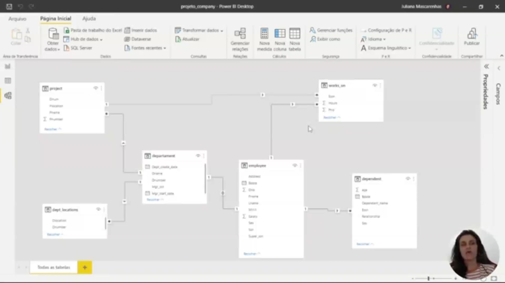
</p>

Nesta imagem vemos a interface do Power BI aberta com um projeto derivado de um banco de dados relacional. O ponto central aqui é que não se trata de uma *sample* padrão do Power BI, mas sim de um projeto próprio, justamente porque as amostras não permitem modificações nos dados. A explicação destaca que, para criar um modelo em estrela, é necessário importar e transformar os dados de forma controlada. O professor alerta que erros podem surgir durante as transformações — como tabelas não importadas — e recomenda desfazer a última ação e salvar frequentemente para identificar o que funcionou ou não.  

O objetivo didático é mostrar como partir de tabelas relacionais (Project, Department, Employee, Dep_Locations, etc.) e reorganizá-las em um esquema dimensional. Esse processo é fundamental para análises de carga de trabalho, projetos e departamentos, evitando problemas de relacionamentos muitos-para-muitos. Assim, a imagem serve como introdução prática ao desafio de transformar dados relacionais em um **Star Schema** dentro do Power BI.
     

### 🟩 Vídeo 06 - Construindo Company Star Schema: Mesclando Colunas e Modificando Campos

<video width="60%" controls>
  <source src="000-Midia_e_Anexos/bootcamp_ntt_data-modulo.08-curso.02-video_06.webm" type="video/webm">
    Seu navegador não suporta vídeo HTML5.
</video>

link do vídeo: https://web.dio.me/track/engenharia-dados-python/course/modelagem-de-dados-no-power-bi/learning/dc372358-e1b3-42af-b870-0d34f5378114?autoplay=1

O vídeo descreve o processo técnico de converter um banco de dados relacional (baseado no modelo "Company" do MySQL) em um Star Schema (Esquema Estrela) otimizado para análise no Power BI. O foco está na criação de uma tabela fato consolidada através de mesclagens e limpeza de dados.

### Anotações

<p align="center">
  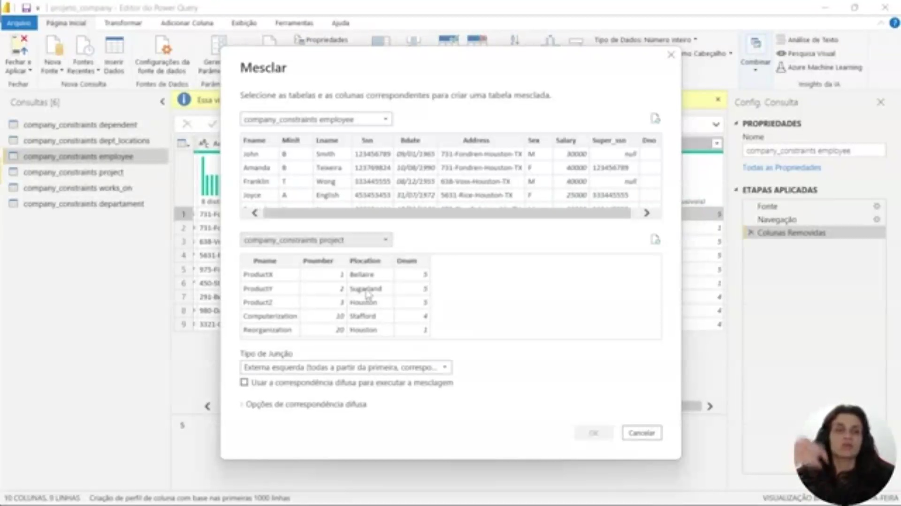
</p>

Esta imagem mostra a interface do **Power Query** durante o processo de *mesclagem* de consultas para construir uma tabela fato a partir das tabelas relacionais da base `company`. O foco visual é a seleção de tabelas/colunas para mesclar (por exemplo, **employee** com **project**) e as opções de junção (orientação à esquerda), indicando que o autor está consolidando informações de colaboradores e projetos para formar uma nova consulta/tabela.  
**Passos visíveis e seu propósito**:  
- **Selecionar tabelas e colunas correspondentes** para criar a mescla (join) que trará os projetos associados a cada colaborador.  
- **Remover colunas irrelevantes** (birth date, middle name, address, salary) para deixar apenas atributos úteis à análise.  
- **Expandir/selecionar** apenas o `pname` (nome do projeto) ao invés de agregar, preservando instâncias redundantes esperadas em uma tabela fato.  
- **Adicionar coluna de índice** para criar uma surrogate key (ID SK) que servirá como chave artificial da nova tabela fato.  

Trecho do material de apoio: "Work zone e department. Ok. Aí o que que eu quero fazer? Eu quero criar uma nova tabela, certo? Então essa nova tabela eu posso gerar a partir de uma mescla." 


<p align="center">
  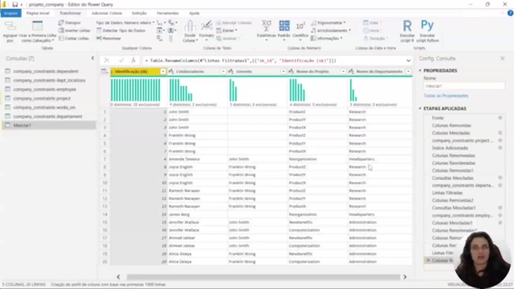


A imagem apresenta o painel de **Etapas Aplicadas** e anotações das transformações realizadas no Power Query: remoção e renomeação de colunas, mesclas sucessivas (project, department, employee para obter gerente), adição de índice e criação de colunas compostas (por exemplo, mesclar `fname` + `lastname` para formar **gerente**). Também há evidência de limpeza e verificação de inconsistências (colaboradores sem gerente atribuído).  
 
- Ao mesclar o campo de gerente (`super ssn`) com a tabela **employee**, o autor expande apenas `fname` e `lastname` e depois **mescla colunas** com um espaço para criar a coluna **gerente**.  
- É esperado haver **redundância** na tabela fato (várias linhas por colaborador quando associado a múltiplos projetos); por isso a surrogate key e a remoção de IDs numéricos são usadas para tornar a tabela mais legível.  
Trecho do material de apoio: "Eu venho para cá e agora o que que eu tenho, tá gente? Pera aí, primeiro eu tenho que conseguir puxar para cá, né? Agora sim. Eu tenho aqui o ID de cada um deles, o nome, a matrícula e no caso o projeto que ele trabalha." 

      
### 🟩 Vídeo 07 - Construindo Company Star Schema: Trabalhando nas Tabela Fato e Dimensão

<video width="60%" controls>
  <source src="000-Midia_e_Anexos/bootcamp_ntt_data-modulo.08-curso.02-video_07.webm" type="video/webm">
    Seu navegador não suporta vídeo HTML5.
</video>

link do vídeo: https://web.dio.me/track/engenharia-dados-python/course/modelagem-de-dados-no-power-bi/learning/4928cdbf-99ab-4516-8f1c-2c764f8f9b93?autoplay=1

Este vídeo descreve a transformação de dados brutos em um modelo relacional eficiente (Star Schema). O objetivo principal é criar uma Tabela Fato (F_Equipe) que consolide informações de horas trabalhadas, projetos e colaboradores, além de organizar as Tabelas de Dimensão.

### Anotações

<p align="center">
  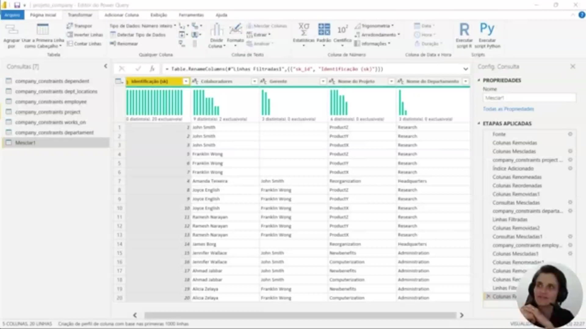
</p>

A imagem mostra a interface do Power Query com várias consultas listadas e colunas de uma tabela de colaboradores visíveis.  
**Explicação didática:** aqui o instrutor está preparando as tabelas de referência (employee, project, works_on) para iniciar mesclas; o foco visual é a lista de consultas e a identificação das colunas que serão usadas para relacionar colaboradores e projetos. Essa tela serve para ilustrar a etapa inicial de inspeção das fontes antes de criar a tabela fato.

<p align="center">
  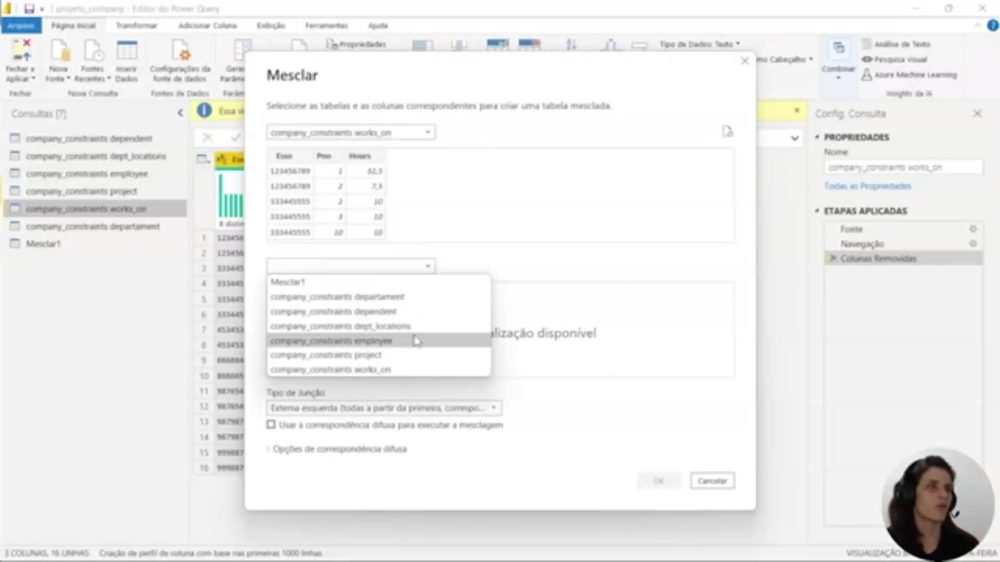
</p>

A imagem apresenta a caixa de diálogo de mesclagem (merge) onde o usuário seleciona tabelas e colunas correspondentes para combinar dados. O slide evidencia o passo em que se escolhem as chaves de junção (por exemplo, SSN/Essn e Pno/Pnumber) e o tipo de junção (ex.: externa esquerda). É nessa etapa que se define se a mescla será criada como nova consulta — prática recomendada para testar sem alterar as originais.

<p align="center">
  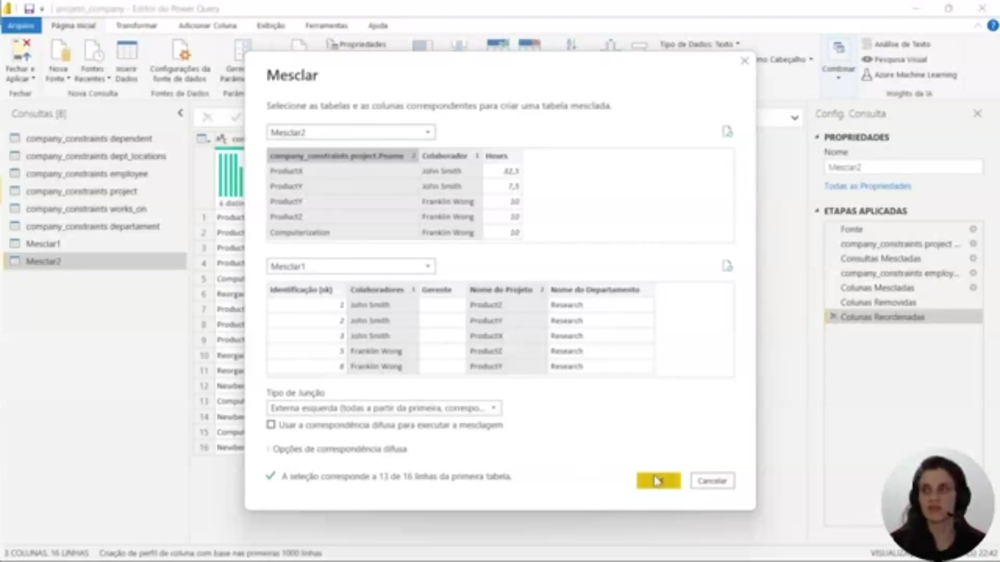
</p>

A imagem mostra a pré-visualização do resultado da mesclagem, com linhas correspondentes entre colaboradores e projetos e valores numéricos visíveis. O instrutor verifica se a mescla trouxe a coluna desejada (por exemplo, Pname) e confere se os pares colaborador–projeto apresentam os valores esperados (como horas atribuídas). Essa verificação visual é essencial para garantir que as chaves escolhidas produziram correspondências corretas.

<p align="center">
  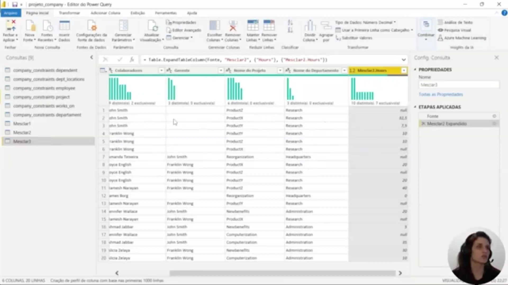
</p>

A imagem exibe uma tabela resultante com colunas como colaborador, gerente, nome do projeto, departamento e uma coluna de horas. Este é o momento em que a nova consulta já contém a **quantidade de horas por colaborador por projeto** — a base para construir a tabela fato. O instrutor renomeia a coluna para "horas trabalhadas" e prepara a tabela (F_equipe) para uso posterior como fato no modelo.
 

<p align="center">
  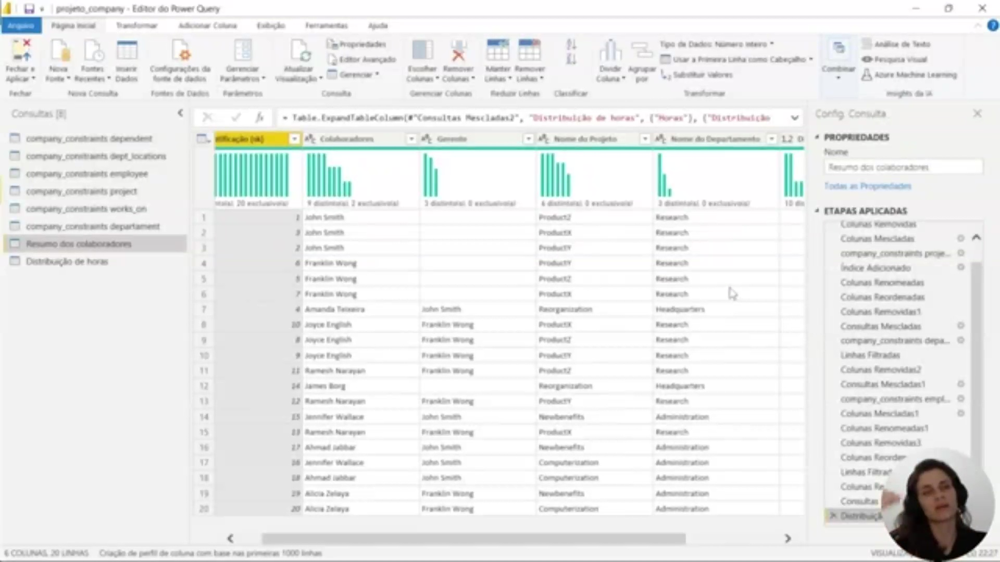
</p>

A imagem mostra o painel de etapas aplicadas (Applied Steps) e a organização das consultas, indicando renomeações e mesclas realizadas. O painel evidencia o histórico de transformações (mesclas, remoção/renomeação de colunas, criação de índice). Isso permite rastrear e reverter alterações se necessário; também demonstra a boa prática de criar consultas intermediárias (ex.: distribuição de horas) antes de consolidar a tabela fato.

<p align="center">
  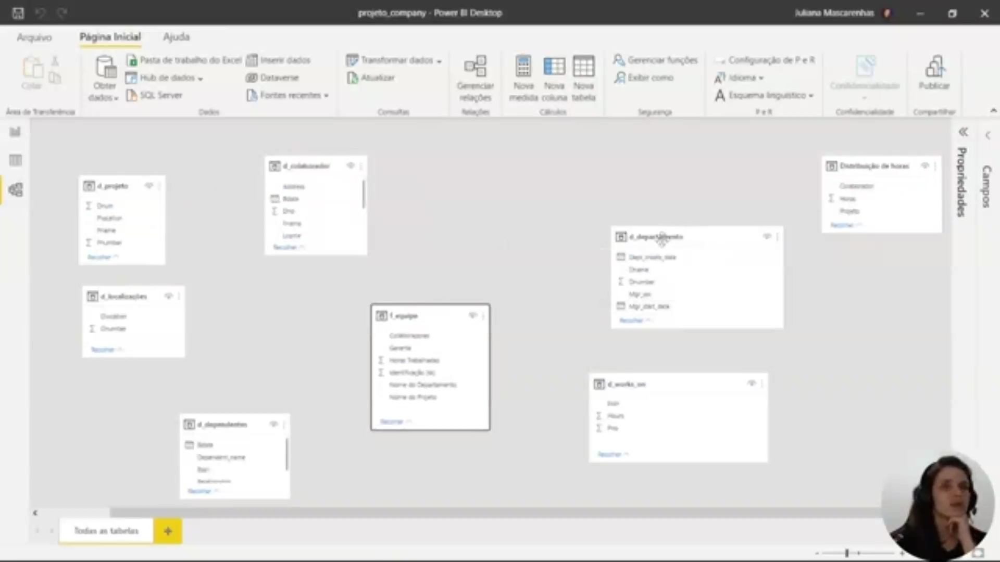
</p>

A imagem mostra o objetivo final: ter uma **tabela fato** (F_equipe / distribuição de horas) conectada a dimensões (colaborador, projeto, departamento, localizações, dependentes). O próximo passo natural é criar os relacionamentos entre essas tabelas no modelo para possibilitar análises por colaborador, projeto e local.      


### 🟩 Vídeo 08 - Construindo Company Star Schema: Realizando adequações e Estabelecendo Relacionamentos

<video width="60%" controls>
  <source src="000-Midia_e_Anexos/bootcamp_ntt_data-modulo.08-curso.02-video_08.webm" type="video/webm">
    Seu navegador não suporta vídeo HTML5.
</video>

link do vídeo: https://web.dio.me/track/engenharia-dados-python/course/modelagem-de-dados-no-power-bi/learning/4ddf4681-85d8-470e-a586-4b4d3638eb19?autoplay=1

Este vídeo foca no processo prático de gerenciamento de relacionamentos e transformação de dados em uma ferramenta de Business Intelligence (como o Power BI). O instrutor demonstra como lidar com inconsistências de nomes, realizar limpezas necessárias e estruturar tabelas para garantir que os dados se conectem de forma lógica e eficiente.

### Anotações

<p align="center">
  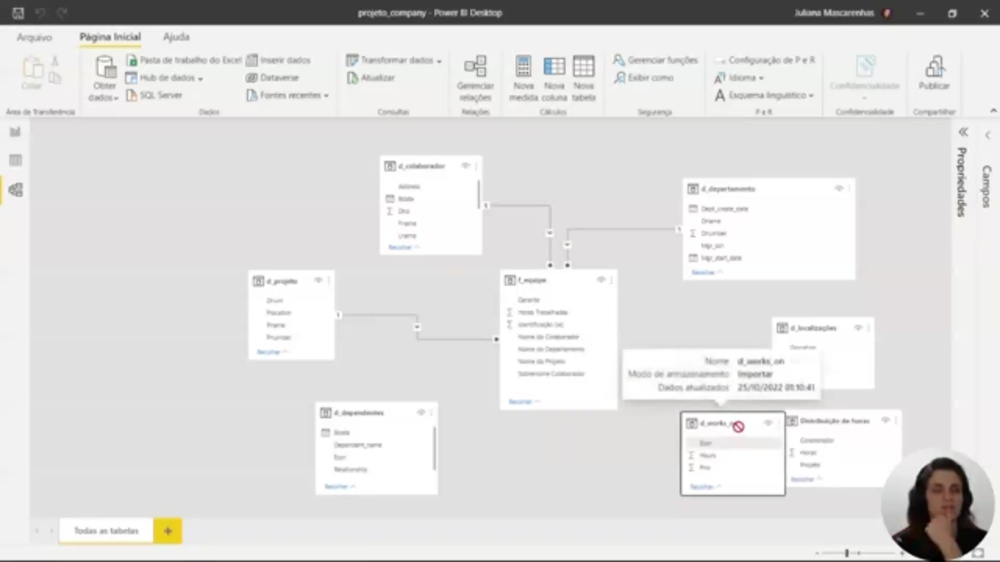
</p>

A captura apresenta a interface de um projeto Power BI / Power Query com menus de navegação e opções de transformação de dados (por exemplo, *Transformar dados*, *Gerenciar relações*, *Mesclar colunas*). A imagem evidencia o fluxo típico de preparação: identificação de tabelas (equipe, colaboradores), tentativa de criar relacionamentos e ações de transformação (mesclar, dividir colunas) para garantir chaves consistentes entre tabelas.

**Por que é importante:** o slide ilustra um problema prático comum ao modelar dados relacionais: *matching parcial* entre campos de nomes que impede relacionamentos unívocos. A solução demonstrada no vídeo é aplicar transformações (mesclar quando necessário, depois dividir por delimitador) para obter colunas com formato adequado e permitir a criação de relacionamentos corretos entre fatos e dimensões. "[00:00:00] OK, pessoal, então vamos ver aqui, ó. Primeira coisa que eu tenho: equipe, colaboradores, né? E aqui o colaborador." 

<p align="center">
  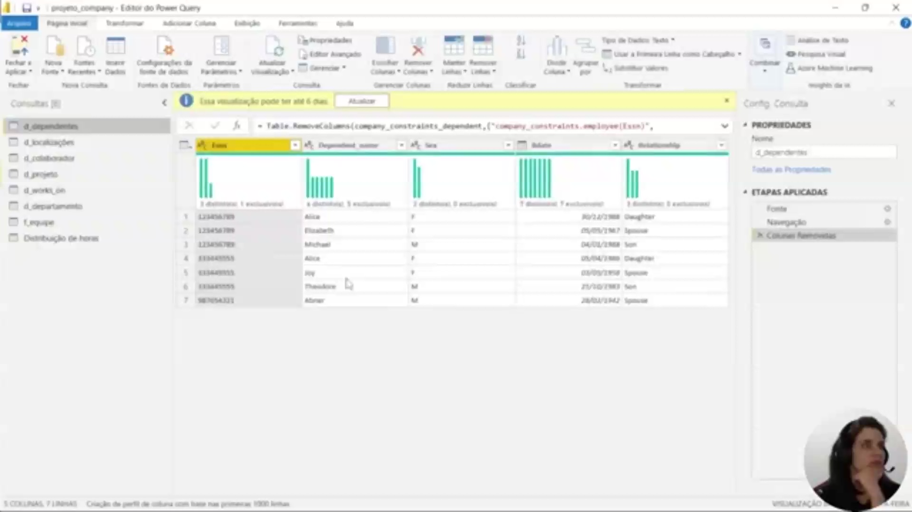
</p>

Aqui são mostrados trechos da tela do Editor do Power Query e exemplos de transformações aplicadas (etapas como *Colunas mescladas*, *Colunas reordenadas*, e operações sobre tabelas dependentes). Ela também exibe uma expressão/linha que remete à remoção de colunas ou referência a constraints em uma tabela, indicando manipulação programática das etapas de transformação.

No vídeo o instrutor testa a aplicação das etapas e resolve falhas de carregamento voltando etapa a etapa (por exemplo, aplicar mesclagem, testar, dividir coluna por delimitador quando necessário). Essa abordagem — aplicar transformações incrementalmente e validar o carregamento — evita retrabalho e ajuda a identificar exatamente qual etapa causa erro. 

### 🟩 Vídeo 09 - Construindo Company Star Schema: Mesclando Tabelas e Adicionando Colunas de Exemplos

<video width="60%" controls>
  <source src="000-Midia_e_Anexos/bootcamp_ntt_data-modulo.08-curso.02-video_09.webm" type="video/webm">
    Seu navegador não suporta vídeo HTML5.
</video>

link do vídeo: https://web.dio.me/track/engenharia-dados-python/course/modelagem-de-dados-no-power-bi/learning/d3765e14-b696-46a1-9723-c2fced4a70fa?autoplay=1

O vídeo como manipular tabelas no Power BI, focando em mesclagem de consultas, resolução de erros de modelagem e a importância de escolher o relacionamento correto entre as tabelas (1:N vs. N:N). O instrutor demonstra como decisões precoces na preparação dos dados podem facilitar ou complicar o desenvolvimento posterior.

### Anotações

<p align="center">
  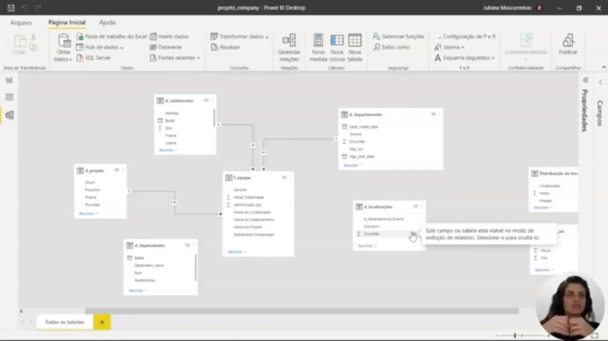
</p>

A captura mostra a **interface do Power BI Desktop** com foco nas áreas de **ribbon** (Arquivo, Página Inicial, Ajuda), no painel lateral de **Campos / Propriedades** e em trechos da tela de consultas onde aparecem listas de colunas e elementos de transformação. Visualmente destacam‑se: a barra superior com comandos de transformação, o painel de **Campos** à direita com itens colapsados/expandidos, e caixas de texto que indicam operações sobre colunas (por exemplo, divisão ou mesclagem). Esses elementos indicam que a imagem registra um momento de edição/transformação de dados, com atenção para **colunas mescladas** e para a visibilidade de campos no modo de exibição de relatório.

**Complexidade na modelagem**: nomes compostos exibidos em uma única coluna, opções de dividir por delimitador e mensagens de erro/estado no editor (por exemplo, avisos sobre colunas usadas em outras etapas). Isso sugere que a operação mostrada envolve criar uma coluna de **nome completo** para permitir junções, e que essa ação pode gerar dependências que impedem a remoção posterior da coluna sem causar erros.

**Observação**: ao replicar esse tipo de operação, mantenha cópias intermediárias ou use nomes temporários para colunas derivadas, para evitar que etapas posteriores fiquem quebradas ao remover campos usados em junções.       

### 🟩 Vídeo 10 - Considerações sobre Transformação de Dados no Power BI Desktop

<video width="60%" controls>
  <source src="000-Midia_e_Anexos/bootcamp_ntt_data-modulo.08-curso.02-video_10.webm" type="video/webm">
    Seu navegador não suporta vídeo HTML5.
</video>

link do vídeo: https://web.dio.me/track/engenharia-dados-python/course/modelagem-de-dados-no-power-bi/learning/ce5a1fb1-db67-4d57-a441-4c669e0e7d11?autoplay=1

Este vídeo foca no processo de ETL (Extração, Transformação e Carga) e modelagem dimensional utilizando o Power Query no Power BI. A instrutora demonstra como resolver problemas de redundância, mesclar tabelas para enriquecer dados e preparar a estrutura para uma análise de produtividade eficiente.

### Anotações

<p align="center">
  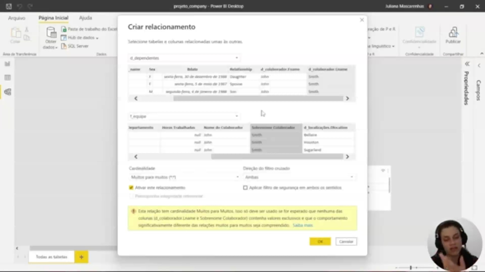
</p>

A tela mostra a caixa de diálogo **Criar relacionamento** do Power BI, onde se escolhem a tabela e as colunas que serão relacionadas. Observe os controles de **cardinalidade** e **direção do filtro cruzado** — aqui a relação está configurada como **Muitos para Muitos**, com opção para ativar o relacionamento e aplicar filtros de segurança em ambos os sentidos. Use essa janela para validar se as chaves escolhidas realmente representam a relação esperada entre as tabelas antes de confirmar; relações muitos‑para‑muitos exigem cuidado porque alteram o comportamento de agregações e filtros no modelo.

<p align="center">
  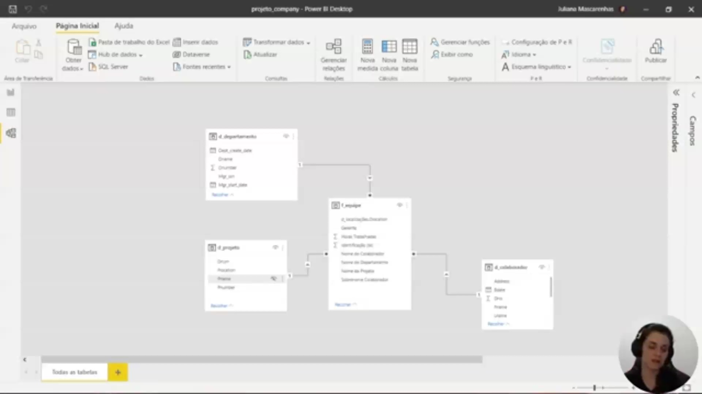
</p>

A tela exibe o ambiente principal do Power BI Desktop com o **Painel de Campos** e a faixa de opções voltada para transformação e mesclagem de consultas. O fluxo mostrado corresponde ao processo de **mesclar tabelas de dimensão** (por exemplo, departamento com localização) para trazer atributos descritivos — como nome do departamento e localização — para a tabela de fatos ou para enriquecer a dimensão. A prática demonstrada inclui: escolher a coluna de junção correta (ID ou nome), expandir apenas os campos necessários (a localização, por exemplo) e fechar/aplicar para validar se não surgiram erros nas consultas. Quando houver redundância ou múltiplos atributos que não serão usados nas análises, o instrutor recomenda ocultar ou suprimir esses campos para simplificar o modelo; por fim, lembra‑se que falta ainda criar a **tabela de datas**, componente essencial em modelagem dimensional.   

### 🟩 Vídeo 11 - Por que Precisamos Criar uma Tabela Calendário?

<video width="60%" controls>
  <source src="000-Midia_e_Anexos/bootcamp_ntt_data-modulo.08-curso.02-video_11.webm" type="video/webm">
    Seu navegador não suporta vídeo HTML5.
</video>

link do vídeo: https://web.dio.me/track/engenharia-dados-python/course/modelagem-de-dados-no-power-bi/learning/06bffb3c-7573-4fcc-8d54-51ed0673030b?autoplay=1

Neste vídeo a instrutora sugere que a utilização de consultas SQL é o método mais eficiente para transformar informações complexas, como a concatenação de localizações ou a contagem de dependentes. Embora ferramentas de programação como Python também sejam mencionadas, o foco permanece na flexibilidade do SQL para gerar novas perspectivas de dados. Essa abordagem facilita a estruturação de um modelo dimensional mais ágil e organizado. Ao manipular os dados diretamente na fonte, o profissional consegue preparar o ambiente de forma robusta para análises futuras.

### Anotações

*   **A Versatilidade do SQL:** O maior benefício do SQL em bancos relacionais não é apenas extrair dados, mas a capacidade de visualizar o mesmo conjunto de dados sob diferentes ângulos, permitindo que o analista "molde" a informação antes mesmo de chegar à ferramenta de visualização.
*   **Transformação na Origem:** Ao realizar concatenações e definições de IDs via SQL, você reduz a carga de processamento em ferramentas de BI (como Power BI ou Tableau), tornando os relatórios mais rápidos.
*   **Foco no Modelo Dimensional:** A modelagem de dados não é apenas técnica, é sobre criar uma "perspectiva de dados" que faça sentido para o negócio. O uso de SQL e Python são meios para atingir um fim: um modelo dimensional claro e funcional.
*   **Decisão de Ferramenta:** A escolha entre SQL e Python deve ser baseada no ambiente. Se os dados já estão em um banco relacional, o SQL oferece um caminho mais direto e performático para a modelagem dimensional.

### 🟩 Vídeo 12 - Criando a Tabela Calendário por Medida utilizando Calendar() com Power BI Desktop

<video width="60%" controls>
  <source src="000-Midia_e_Anexos/bootcamp_ntt_data-modulo.08-curso.02-video_12.webm" type="video/webm">
    Seu navegador não suporta vídeo HTML5.
</video>

link do vídeo: https://web.dio.me/track/engenharia-dados-python/course/modelagem-de-dados-no-power-bi/learning/199f6339-0d67-47d0-801a-1673bedaf25d?autoplay=1

O vídeo aborda a importância estratégica das dimensões temporais na modelagem de dados, os desafios de integrar múltiplas fontes e os métodos para criar uma tabela de datas robusta para análises de negócio.

### Anotações

<p align="center">
  
</p>

Ao desenvolver relatórios no Power BI, é comum encontrar tabelas diferentes que possuem colunas de datas distintas – por exemplo, uma tabela de vendas (Sales) com a coluna *Ship Date* e uma tabela de pedidos (Orders) com a coluna *Order Date*. Cada tabela referencia seu próprio conjunto de datas, sem uma relação direta entre si. O desafio apresentado é: **como criar um visual (gráfico, tabela etc.) que utilize várias tabelas e suas respectivas datas de forma integrada?** Sem uma base comum, não é possível, por exemplo, comparar vendas e pedidos no mesmo período de tempo de maneira simples.

<p align="center">
  
</p>

Para resolver o problema de tabelas com datas independentes, existem três abordagens principais:
- **Dados de origem**: a fonte de dados já fornece uma tabela de datas pronta, geralmente vinda de um Data Warehouse bem estruturado.
- **DAX (Data Analysis Expressions)**: criar a tabela de datas diretamente no modelo do Power BI usando linguagem DAX.
- **Power Query**: construir a tabela de datas por meio de transformações na etapa de obtenção e limpeza dos dados.

Cada uma dessas soluções permite criar uma **tabela de datas única**, que servirá como referência comum para todas as outras tabelas do modelo. Assim, é possível relacionar vendas e pedidos a um mesmo calendário e responder a perguntas como “total de vendas e pedidos por ano/mês”.

<p align="center">
  
</p>

Se o trabalho de construção da tabela de datas já foi realizado pelo **engenheiro de dados** (chamado de *trabalho completo*), essa tabela virá pronta e enriquecida com informações importantes para o negócio, como:
- **Feriados da empresa** – dias em que a organização não opera ou opera em regime especial.
- **Separação entre ano civil e ano fiscal** – útil para relatórios gerenciais que seguem calendário fiscal diferente do calendário tradicional.
- **Identificação de finais de semana** – permite calcular indicadores de dias úteis, metas por dia da semana etc.

Quando essa tabela já existe no modelo, **nenhuma etapa adicional é necessária** – basta utilizá-la como dimensão de tempo e relacioná-la às demais tabelas por meio de chaves estrangeiras de data. Isso garante consistência e evita retrabalho.      


### 🟩 Vídeo 13 - O que é Hierarquia de Dados?

<video width="60%" controls>
  <source src="000-Midia_e_Anexos/bootcamp_ntt_data-modulo.08-curso.02-video_13.webm" type="video/webm">
    Seu navegador não suporta vídeo HTML5.
</video>

link do vídeo: https://web.dio.me/track/engenharia-dados-python/course/modelagem-de-dados-no-power-bi/learning/5997b796-9a14-493f-9f50-f84e49790340?autoplay=1

Tutorial sobre a criação de tabelas de datas (Calendário) utilizando a linguagem DAX (Data Analysis Expressions) no Power BI. O vídeo explora desde funções básicas até a personalização de colunas para análise temporal avançada.

### Anotações

<p align="center">
  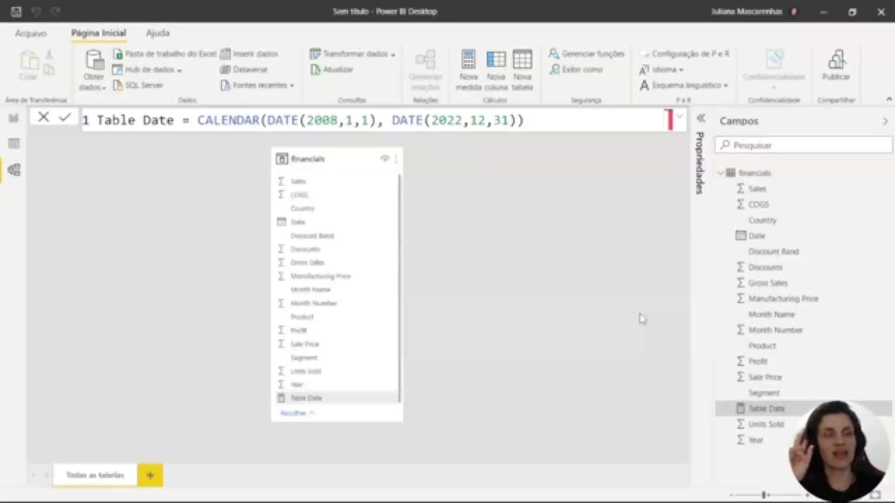
</p>

Este slide mostra a criação de uma tabela de datas utilizando a função **CALENDAR** no DAX.  
A função recebe duas datas como parâmetros: início e fim, e retorna um intervalo contínuo de datas.  
O exemplo apresentado define o intervalo de **01/01/2008 até 31/12/2022**, permitindo que o modelo trabalhe com uma base temporal completa para análises.

```DAX
Table Date = CALENDAR(DATE(2008,1,1), DATE(2022,12,31))
``` 

<p align="center">
  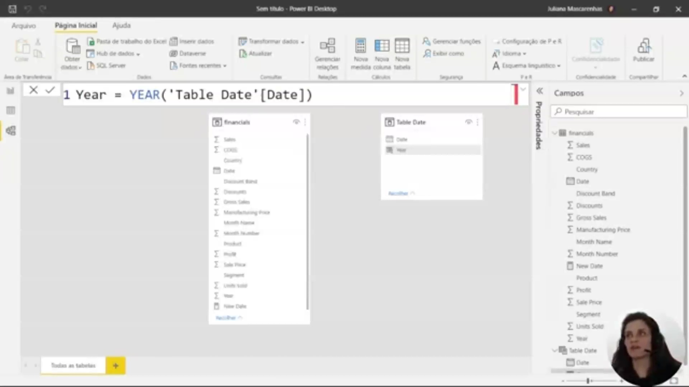
</p>

Aqui vemos a criação de uma nova coluna chamada **Year**, que extrai o ano da coluna de datas da tabela.  
A função utilizada é **YEAR**, que retorna apenas o componente do ano de uma data.

```DAX
Year = YEAR('Table Date'[Date])
```

<p align="center">
  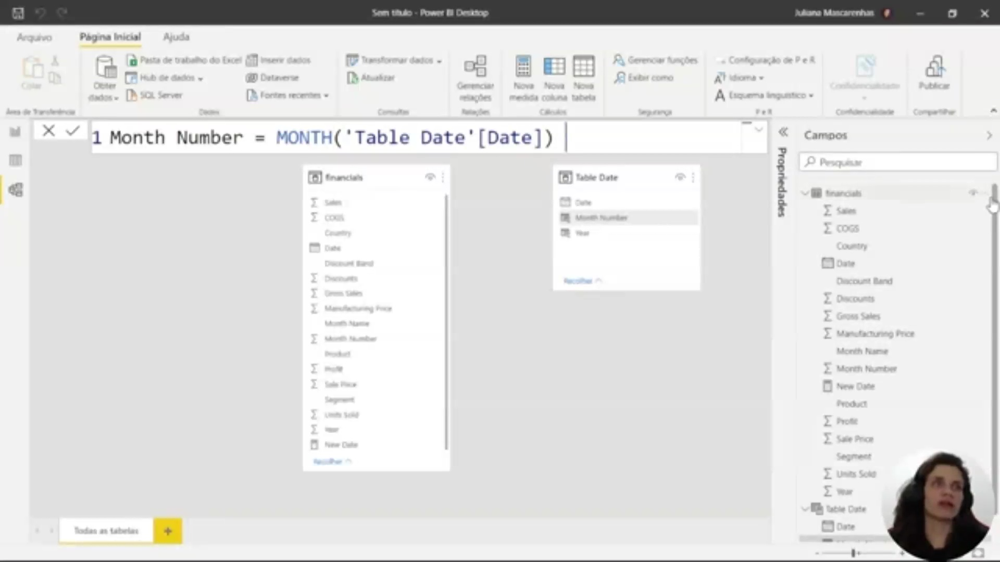
</p>

Neste ponto, é criada a coluna **Month Number**, responsável por identificar o número do mês (de 1 a 12) a partir da data.  
A função utilizada é **MONTH**, que retorna o mês correspondente.

```DAX
Month Number = MONTH('Table Date'[Date])
```

<p align="center">
  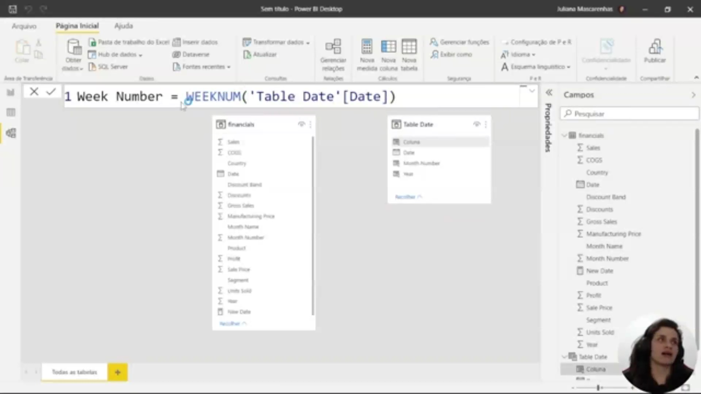
</p>

Aqui é adicionada a coluna **Week Number**, que indica o número da semana dentro do ano.  
A função utilizada é **WEEKNUM**, que retorna um valor entre 1 e 52 (ou 53, dependendo do ano).

```DAX
Week Number = WEEKNUM('Table Date'[Date])
```

<p align="center">
  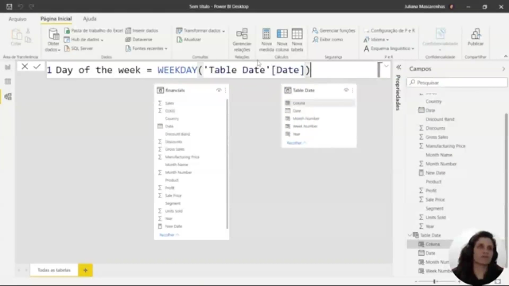
</p>

Neste slide, é criada a coluna **Day of the week**, que retorna o número do dia da semana (de 1 a 7).  
A função utilizada é **WEEKDAY**, que identifica o dia da semana de uma data.

```DAX
Day of the week = WEEKDAY('Table Date'[Date])
```

<p align="center">
  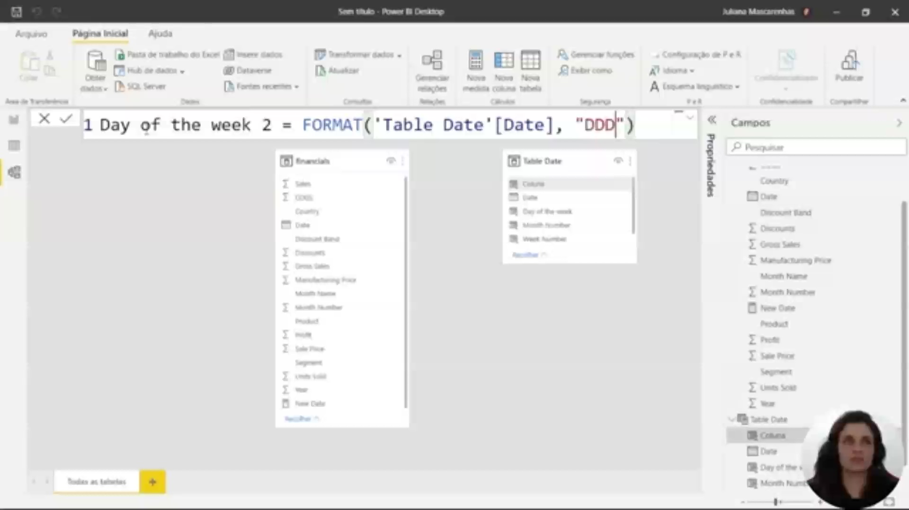
</p>

Aqui temos a criação da coluna **Day of the week 2**, que retorna o nome do dia da semana por extenso.  
A função utilizada é **FORMAT**, que converte a data em texto com o formato desejado.

```DAX
Day of the week 2 = FORMAT('Table Date'[Date], "dddd")
```

<p align="center">
  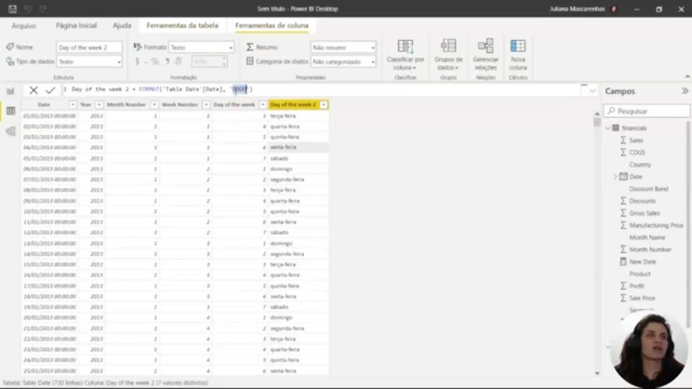
</p>

Este slide mostra a tabela resultante com as colunas criadas:  
- **Year**  
- **Month Number**  
- **Week Number**  
- **Day of the week**  
- **Day of the week 2**  

Assim, cada data possui informações detalhadas que permitem análises temporais mais ricas.

<p align="center">
  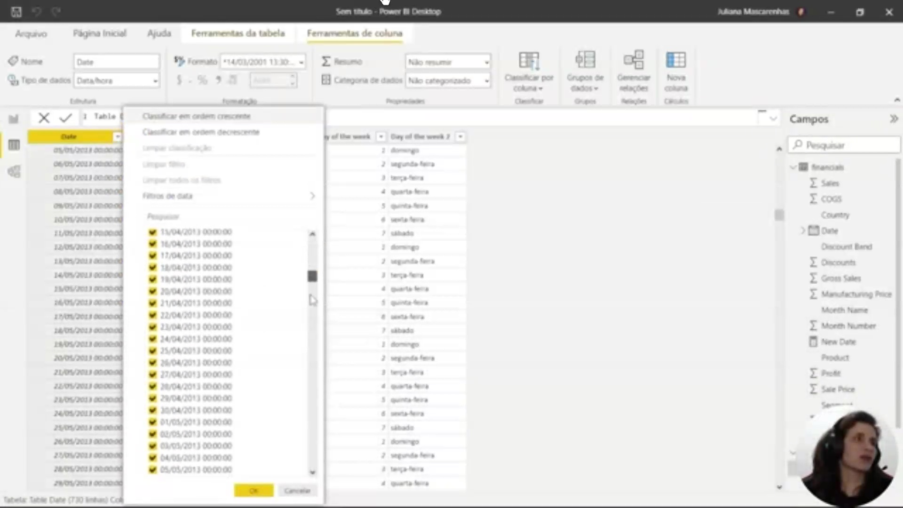
</p>

Este último slide apresenta a visualização dos dados já enriquecidos com as colunas criadas.  
Ele mostra como a tabela de datas se integra ao modelo, permitindo segmentações por ano, mês, semana e dia da semana.  
Esse processo é fundamental para estruturar um **modelo em estrela** no Power BI, garantindo flexibilidade nas análises temporais.


### 🟩 Vídeo 14 - Criando Hierarquia de Dados com Power BI Desktop

<video width="60%" controls>
  <source src="000-Midia_e_Anexos/bootcamp_ntt_data-modulo.08-curso.02-video_14.webm" type="video/webm">
    Seu navegador não suporta vídeo HTML5.
</video>

link do vídeo: https://web.dio.me/track/engenharia-dados-python/course/modelagem-de-dados-no-power-bi/learning/4b0c572d-fb84-44f8-9555-a674dc306fb6?autoplay=1

O vídeo trata de hierarquia de dados, explicando como organizar informações de forma subordinada para criar visualizações profundas e limpas, permitindo análises detalhadas (drill-down) sem sobrecarregar o usuário final.

### Anotações

<p align="center">
  
</p>

O slide apresenta o conceito base de hierarquia: uma organização que estabelece ordem de prioridade entre elementos de um conjunto, com relações de subordinação entre membros de um grupo. Na prática, isso significa que cada nível possui graus sucessivos de poder, situação e responsabilidade.

Na área de dados, uma hierarquia permite estruturar informações em níveis – por exemplo, continente → país → estado → cidade → bairro. Cada nível está contido no anterior, criando uma dependência lógica. Essa organização é essencial para permitir análises que vão do geral ao detalhe sem perder a clareza visual.

<p align="center">
  
</p>

A pergunta central “O que podemos fazer?” remete à utilidade prática das hierarquias de dados. Ao construir uma hierarquia bem definida, é possível:

- Navegar entre níveis de detalhe (drill down) em um mesmo visual, sem adicionar filtros separados.
- Mostrar categorias e subcategorias de forma integrada, mantendo o relatório enxuto.
- Aproveitar hierarquias automáticas (como datas: ano → trimestre → mês → dia) ou criar hierarquias personalizadas para domínios específicos (ex.: produtos, localizações geográficas, organizações).

Essa abordagem evita a poluição visual e permite análises mais aprofundadas com poucos cliques.

<p align="center">
  
</p>

Exemplo prático aplicado a categorias e subcategorias de produto (por exemplo Components; Clothing; Accessories e subitens como Road Bikes; Mountain Bikes; Jerseys; Wheels; Helmets) junto com a métrica # TotalSales. O objetivo visual é ilustrar como uma hierarquia de categoria → subcategoria permite que um único gráfico apresente níveis distintos de detalhe: ao agrupar por Category e depois por SubCategory, o usuário pode navegar (drill down) entre agregados e detalhes mantendo a mesma métrica de vendas.
Trecho do documento: "E dessa forma a gente consegue em um mesmo visual apresentar diversas informações, como por exemplo categoria e subcategoria."

<p align="center">
  
</p>

Diferente da hierarquia em “escadinha” (ex.: continente → país → estado), a hierarquia pai/filho permite que um mesmo elemento superior (pai) tenha múltiplos dependentes (filhos) em uma estrutura semelhante a uma árvore. Cada filho pode, por sua vez, se tornar pai de outros níveis.

Conforme definição da Microsoft: “O processo de exibição de vários níveis filho com base em um pai de nível superior é conhecido como nivelar a hierarquia.” Esse tipo de estrutura é muito usado em cenários como organogramas, categorias de produtos com ramificações assimétricas ou qualquer conjunto de dados onde a relação não seja linear, mas sim uma árvore de dependências.


### 🟩 Vídeo 15 - Criando Hierarquia de Dados com Estrutura de Pais/Filhos com Power BI Desktop

<video width="60%" controls>
  <source src="000-Midia_e_Anexos/bootcamp_ntt_data-modulo.08-curso.02-video_15.webm" type="video/webm">
    Seu navegador não suporta vídeo HTML5.
</video>

link do vídeo: https://web.dio.me/track/engenharia-dados-python/course/modelagem-de-dados-no-power-bi/learning/bcbfbdb6-ab71-42cc-b709-038c774ee997?autoplay=1

Como criar e utilizar hierarquias no Power BI para organizar dados de forma estruturada, permitindo uma análise detalhada (drill-down) sem sobrecarregar visualmente os relatórios.

### Anotações

<p align="center">
  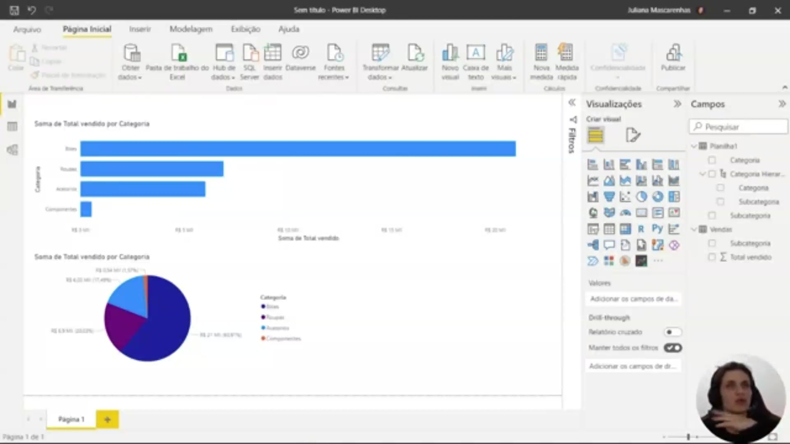
</p>

- **Hierarquia e drill-down**: a presença de *Categoria* e *Subcategoria* no painel de campos e o título do gráfico indicam que o autor está demonstrando como montar uma hierarquia para permitir subir/descer níveis de análise (drill up / drill down) sem poluir o relatório.
- **Preparação dos dados**: os menus e botões visíveis (Transformar, Obter Dados, Decimal fixo) sugerem que os dados foram ajustados no Power Query antes de serem usados no visual, garantindo tipos e agregações corretas.
- **Escolha de visual**: o gráfico central (barras/pizza/clusterizado conforme elementos visuais) ilustra como diferentes visuais afetam a legibilidade quando há muitos elementos; a imagem evidencia a necessidade de escolher o visual adequado para mostrar categorias e subcategorias.


### 🟩 Vídeo 16 - Granularidade de Dados com Power BI

<video width="60%" controls>
  <source src="000-Midia_e_Anexos/bootcamp_ntt_data-modulo.08-curso.02-video_16.webm" type="video/webm">
    Seu navegador não suporta vídeo HTML5.
</video>

link do vídeo: https://web.dio.me/track/engenharia-dados-python/course/modelagem-de-dados-no-power-bi/learning/06c67c6e-a693-49e4-859a-49642132147d?autoplay=1

### 🟩 Vídeo 17 - Definindo a Granularidade de Dados para Datas com Power BI

<video width="60%" controls>
  <source src="000-Midia_e_Anexos/bootcamp_ntt_data-modulo.08-curso.02-video_17.webm" type="video/webm">
    Seu navegador não suporta vídeo HTML5.
</video>

link do vídeo:

### 🟩 Vídeo 18 - Criando um Relacionamento entre Financials e Tabela Calendário

<video width="60%" controls>
  <source src="000-Midia_e_Anexos/bootcamp_ntt_data-modulo.08-curso.02-video_18.webm" type="video/webm">
    Seu navegador não suporta vídeo HTML5.
</video>

link do vídeo:

### 🟩 Vídeo 19 - Criando uma Coluna Personalizada no Power BI

<video width="60%" controls>
  <source src="000-Midia_e_Anexos/bootcamp_ntt_data-modulo.08-curso.02-video_19.webm" type="video/webm">
    Seu navegador não suporta vídeo HTML5.
</video>

link do vídeo:

### 🟩 Vídeo 20 - Criando um Campo Data com Maior Granularidade

<video width="60%" controls>
  <source src="000-Midia_e_Anexos/bootcamp_ntt_data-modulo.08-curso.02-video_20.webm" type="video/webm">
    Seu navegador não suporta vídeo HTML5.
</video>

link do vídeo:

### 🟩 Vídeo 21 - Relembrando Conceitos

<video width="60%" controls>
  <source src="000-Midia_e_Anexos/bootcamp_ntt_data-modulo.08-curso.02-video_21.webm" type="video/webm">
    Seu navegador não suporta vídeo HTML5.
</video>

link do vídeo:

### 🟩 Vídeo 22 - Resolvendo Desafios de Modelagem no Power BI

<video width="60%" controls>
  <source src="000-Midia_e_Anexos/bootcamp_ntt_data-modulo.08-curso.02-video_22.webm" type="video/webm">
    Seu navegador não suporta vídeo HTML5.
</video>

link do vídeo:

### 🟩 Vídeo 23 - Considerações sobre o curso

<video width="60%" controls>
  <source src="000-Midia_e_Anexos/bootcamp_ntt_data-modulo.08-curso.02-video_23.webm" type="video/webm">
    Seu navegador não suporta vídeo HTML5.
</video>

link do vídeo:


##  Materiais de Apoio

# Certificado: 

- Link na plataforma: 
- Certificado em pdf: