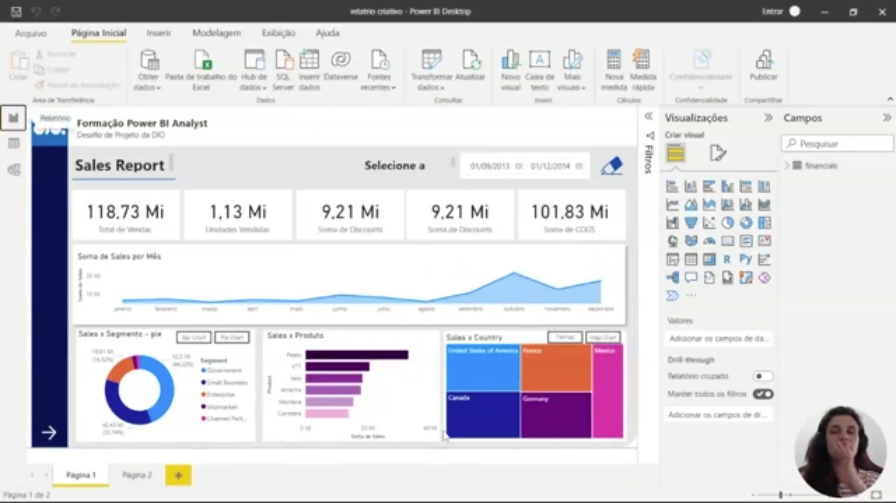
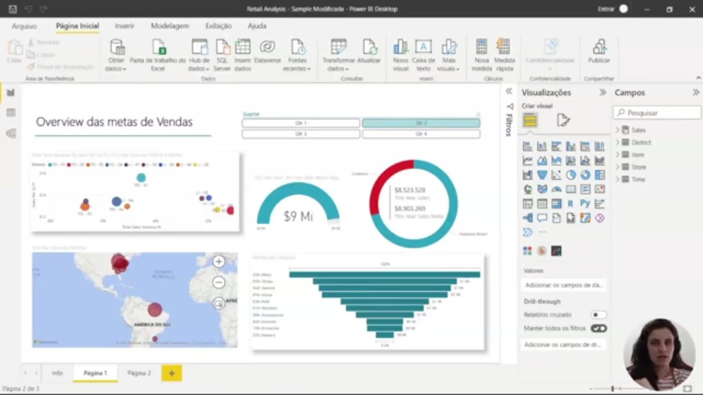
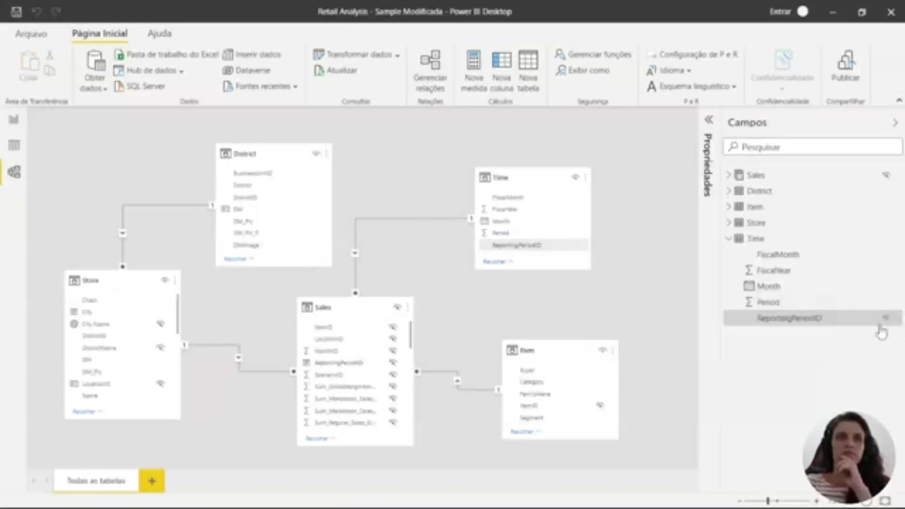
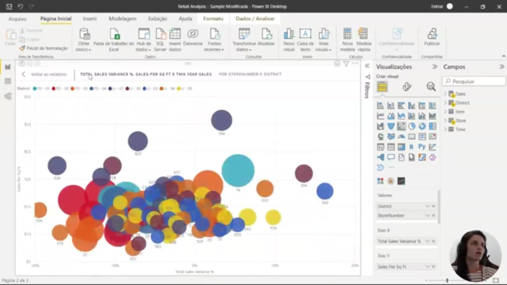
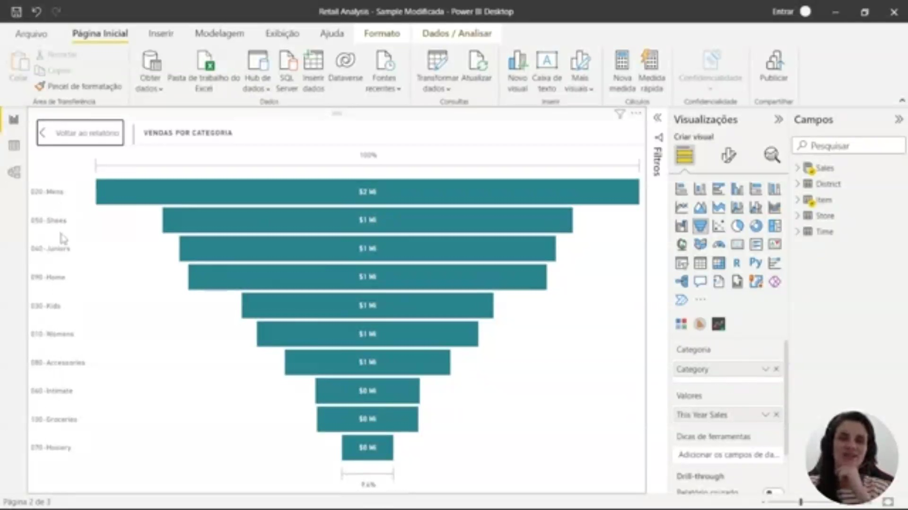
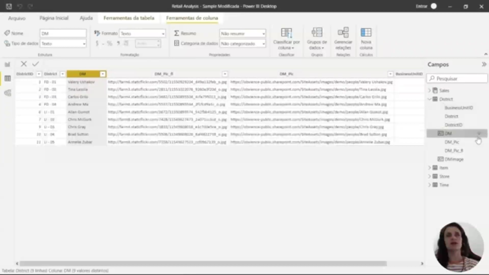
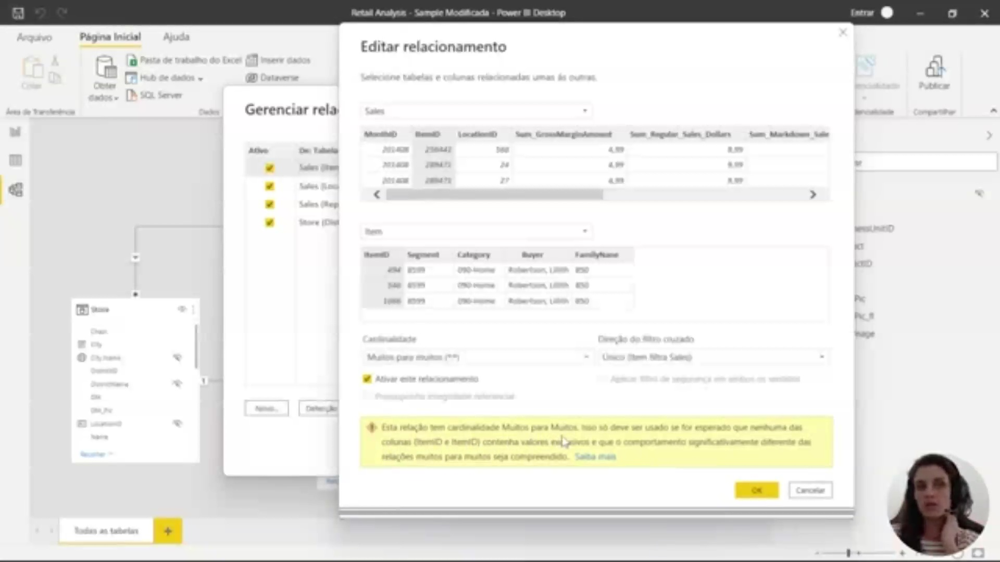
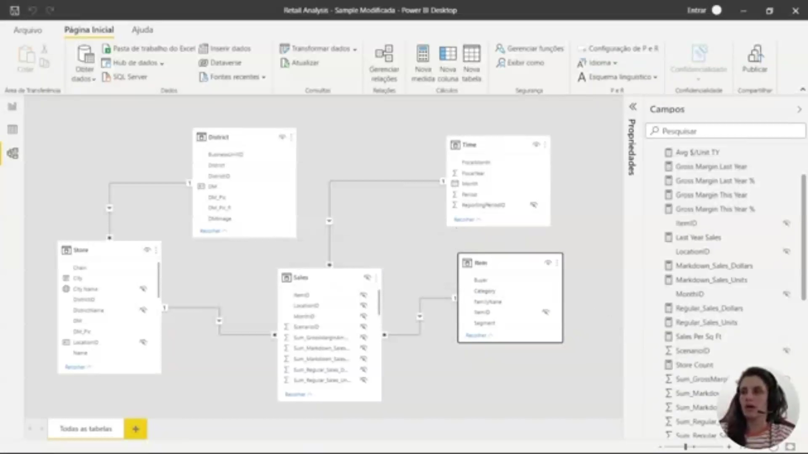

## Instrutor:

- Juliana Mascarenhas (Tech Education Specialist / Sócia (Content Creator) @SimplificandoRedes / Me Modelagem Computacional / Cientista de dados)
- Contato Linkedin: / [juliana-mascarenhas-ds](https://www.linkedin.com/in/juliana-mascarenhas-ds/)

## Parte 1 - Modelagem de Dados no Power BI

### 🟩 Vídeo 01 - Apresentando a ementa do curso

<video width="60%" controls>
  <source src="000-Midia_e_Anexos/bootcamp_ntt_data-modulo.08-curso.02-video_01.webm" type="video/webm">
    Seu navegador não suporta vídeo HTML5.
</video>

link do vídeo: https://web.dio.me/track/engenharia-dados-python/course/modelagem-de-dados-no-power-bi/learning/5ba15e32-7d9f-4a3b-b885-f9707c7c9890?autoplay=1

O vídeo explora os fundamentos da modelagem de dados dentro do ecossistema Power BI, destacando a transição do modelo relacional para o dimensional e como uma estrutura bem definida impacta diretamente a performance e a manutenção de relatórios analíticos.

### Anotações

  

Este slide apresenta o tema "Modelagem de Dados com Power BI", inserido na Formação Power BI Analyst. A instrutora, Juliana Mascarenhas, é apresentada com suas credenciais: Tech Education Specialist na DIO, proprietária dos projetos Simplificandoredes e SimplificandoProgramaço, além de mestre em modelagem computacional e cientista de dados. A imagem introduz o módulo, destacando que o foco será na construção de modelos de dados eficientes dentro da ferramenta Power BI.

  

Este slide lista os objetivos gerais da aula. Serão abordados: trabalho com modelagem no Power BI, tratamento de relações (relacionamentos) circulares, aplicação da modelagem dimensional, manipulação de tabelas fato e dimensões, e identificação de desafios comuns na fase de modelagem. Esses pontos orientam o aprendizado prático para estruturar dados de forma analítica e otimizada.

  

A imagem exibe um fluxo de dados no Power BI, enfatizando a etapa de modelagem. O diagrama mostra que, após a transformação dos dados (normalmente com Power Query), entra‑se na fase de modelagem, onde são definidas as tabelas e os relacionamentos. A seta indica a posição da modelagem no processo. O instrutor menciona que, embora a transformação geralmente venha antes, a modelagem pode ser aperfeiçoada posteriormente. O slide também referencia o Star Schema, o modelo relacional e o MongoDB para contextualizar o escopo analítico.

  

Este slide enumera as vantagens de um bom modelo de dados no Power BI: exploração de dados mais rápida, agregações mais simples de criar, relatórios mais precisos, menor tempo de escrita dos relatórios e facilidade de manutenção futura. O instrutor reforça que, embora a modelagem exija um esforço inicial, ela evita retrabalho e garante desempenho e confiabilidade aos relatórios.

  

O slide apresenta o princípio da simplicidade na modelagem. Um modelo menor é executado mais rapidamente, mais fácil de entender e ocupa menos espaço. Apesar de não ser trivial construir um modelo reduzido e eficiente, essa abordagem é essencial para sistemas analíticos, pois melhora a performance e simplifica a manutenção no Power BI.

  

A imagem destaca dois componentes fundamentais: o Power Query, utilizado para transformação e preparação dos dados, e o Star Schema (esquema estrela). O Star Schema é a modelagem dimensional mais adequada para sistemas analíticos, pois organiza tabelas fato e dimensões de forma otimizada para consultas e agregações, proporcionando eficiência na recuperação dos dados.

  

Este slide conclui que o Power BI e o Star Schema formam um “casamento perfeito”. O Power BI é uma ferramenta analítica que se beneficia diretamente da estrutura dimensional, permitindo agregações rápidas e relatórios performáticos. A imagem reforça que adotar o Star Schema potencializa o uso do Power BI, alinhando a ferramenta às boas práticas de modelagem para análise de dados.      

### 🟩 Vídeo 02 - Trabalhando com Tabelas

<video width="60%" controls>
  <source src="000-Midia_e_Anexos/bootcamp_ntt_data-modulo.08-curso.02-video_02.webm" type="video/webm">
    Seu navegador não suporta vídeo HTML5.
</video>

link do vídeo: https://web.dio.me/track/engenharia-dados-python/course/modelagem-de-dados-no-power-bi/learning/938542ec-27cc-4f0f-add0-348e2b0fba3a?autoplay=1

Este segmento aborda a importância da modelagem de dados e da simplificação de tabelas no contexto do Power BI, visando otimizar a legibilidade, a navegabilidade e a qualidade dos relatórios e visuais gerados.

### Anotações

  

A imagem apresenta duas vantagens principais de se trabalhar com tabelas simples em modelagem de dados. A primeira destaca a **navegabilidade**: tanto a navegação entre colunas quanto a navegação geral da tabela tornam-se mais amigáveis para o usuário, facilitando a exploração dos dados. A segunda reforça a importância de se manter **relações de boa qualidade** entre as tabelas, ou seja, conexões claras e bem definidas que fazem sentido para o negócio. Esses pontos são fundamentais para garantir que o modelo seja compreensível e eficiente na prática.

  

Aqui a imagem enfatiza outra estratégia para simplificar a estrutura de dados: **mesclar ou acrescentar tabelas**. Ao unir tabelas que possuem relacionamentos simples (especialmente relacionamentos um-para-um), é possível reduzir a quantidade de tabelas no modelo, tornando-o mais enxuto e fácil de gerenciar. Essa prática é incentivada em ambientes analíticos como o Power BI, pois evita complexidade desnecessária e facilita a construção de relatórios com foco na análise, sem perder a integridade dos dados.      

### 🟩 Vídeo 03 - Explorando Recursos das Tabelas no Power BI Desktop

<video width="60%" controls>
  <source src="000-Midia_e_Anexos/bootcamp_ntt_data-modulo.08-curso.02-video_03.webm" type="video/webm">
    Seu navegador não suporta vídeo HTML5.
</video>

link do vídeo: https://web.dio.me/track/engenharia-dados-python/course/modelagem-de-dados-no-power-bi/learning/cc87fcb8-a586-46fa-a53b-c628f37e6604?autoplay=1

Este vídeo foca na importância da modelagem de dados eficiente dentro do Power BI. O instrutor utiliza um relatório de exemplo para demonstrar como organizar tabelas, criar relacionamentos e a importância de manter o modelo "enxuto". O conteúdo prepara o terreno para o uso avançado de DAX (Data Analysis Expressions) e a transição para modelos dimensionais (Star Schema).

### Anotações

  

A imagem apresenta a visualização do modelo de dados (Model View) no Power BI, mostrando as tabelas do relatório *Report Sample*. É possível identificar as principais entidades: **Sales** (foco das análises), **Time**, **Store**, **District**, **DM** (District Manager) e outras. As setas entre as tabelas indicam os relacionamentos, todos do tipo um‑para‑muitos (1:N), que são os mais comuns em modelos dimensionais. O layout inicial ainda está um pouco desorganizado, destacando a importância de arrumar a disposição das tabelas para facilitar a leitura do modelo.

  

Após reorganizar a disposição, o modelo fica mais claro e legível. Aqui vemos as tabelas alinhadas e as relações de forma mais intuitiva. A tabela **Time** (calendário) se relaciona com **Sales** pelo campo de data, permitindo análises temporais. A tabela **Store** está ligada a **Sales** e também a **District**, que por sua vez se conecta a **DM**. Essa estrutura reflete a busca pela simplicidade: manter apenas as tabelas e relacionamentos necessários para o negócio, evitando complexidade desnecessária.

  

Agora a atenção se volta para a tabela **Sales**, com seus campos expandidos. Observamos que o Power BI já criou automaticamente medidas de soma (Σ) para colunas numéricas como *Sum Gross Margin Amount*, *Markdown Sales Dollar*, etc. Além disso, há colunas de ID (identificadores), que em geral não são ideais para exibição direta em relatórios – o recomendado é utilizar os nomes descritivos (como *District Name*, *Store Name*) para tornar os visuais mais compreensíveis. Essa seleção de quais colunas manter ou ocultar faz parte do trabalho de enxugamento do modelo.

  

Este slide apresenta visuais analíticos (por exemplo Total Sales Variance e Sales per Sq Ft) e rótulos que comparam desempenho por store number e district. É um exemplo de visualização que combina métricas de variação e densidade de vendas por área, útil para identificar lojas com desempenho atípico e para orientar decisões operacionais. A imagem ilustra também a importância de hierarquias e drill‑down para investigar concentrações de vendas.

  

Aqui vemos a ferramenta de colunas/tabela com propriedades de campo (nome, tipo de dados, resumo) e uma lista de valores do Distrito (District) — incluindo identificadores e nomes. Também aparece o cartão do DM (District Manager), indicando que o Power BI reconhece campos de pessoa e pode exibir imagens/avatars associados. Esse painel é usado para ajustar metadados das colunas (tipo, formato, categorização) antes de construir relacionamentos e medidas.

  

A imagem ilustra o uso de hierarquias e a funcionalidade de *drill down* (aprofundamento) no Power BI. Ao clicar no botão de expandir (seta dupla) em um gráfico ou tabela, é possível navegar pelos níveis hierárquicos – por exemplo, partir de uma visão agregada por distrito e descer até o detalhe por loja ou por gerente. Esse recurso, combinado com as medidas DAX, permite explorar os dados em diferentes granularidades sem a necessidade de criar vários visuais separados, mantendo o relatório enxuto e interativo.      

### 🟩 Vídeo 04 - Gerenciando Relacionamentos no Power BI Desktop

<video width="60%" controls>
  <source src="000-Midia_e_Anexos/bootcamp_ntt_data-modulo.08-curso.02-video_04.webm" type="video/webm">
    Seu navegador não suporta vídeo HTML5.
</video>

link do vídeo: https://web.dio.me/track/engenharia-dados-python/course/modelagem-de-dados-no-power-bi/learning/f62de80f-f7ac-4ae1-a69c-0f2289b9f3f1?autoplay=1

O vídeo apresenta as nuances da configuração de relacionamentos entre tabelas no Power BI, focando na interface de gerenciamento, nos tipos de cardinalidade (especialmente o "Muitos para Muitos") e na importância da direção dos filtros. O objetivo é garantir a integridade dos dados e a eficiência das consultas ao modelar bases complexas.

### Anotações

  

A imagem mostra a janela **Gerenciar Relações** do Power BI, onde o instrutor está verificando os relacionamentos existentes entre as tabelas do modelo. Neste momento, ele observa os campos `MonfID` e `ItemID`, indicando a relação entre as tabelas que contêm esses identificadores. A interface permite editar a cardinalidade, a direção do filtro e até mesmo ativar a detecção automática de relacionamentos. É a partir dessa janela que o instrutor começará a explorar as opções de cardinalidade, incluindo a configuração “muitos para muitos”.

  

A imagem exibe o diálogo **Editar Relação**, com a opção **Muitos para muitos** selecionada. Abaixo da seleção, aparece o aviso típico do Power BI: “Esta relação tem cardinalidade muitos para muitos. Isso só deve ser usado se for esperado que nenhuma das colunas contenha valores exclusivos e que o comportamento significativamente diferente das relações muitos para muitos seja compreendido”. O instrutor utiliza essa tela para demonstrar quando e por que esse tipo de cardinalidade pode ser aplicado, alertando sobre a necessidade de compreender seu impacto na modelagem dos dados.      

### 🟩 Vídeo 05 - Considerações sobre Relacionamentos e Esquema Company com Power BI Desktop

<video width="60%" controls>
  <source src="000-Midia_e_Anexos/bootcamp_ntt_data-modulo.08-curso.02-video_05.webm" type="video/webm">
    Seu navegador não suporta vídeo HTML5.
</video>

link do vídeo: https://web.dio.me/track/engenharia-dados-python/course/modelagem-de-dados-no-power-bi/learning/3959f3d2-16fc-4454-8415-1ec3bbcde659?autoplay=1

### 🟩 Vídeo 06 - Construindo Company Star Schema: Mesclando Colunas e Modificando Campos

<video width="60%" controls>
  <source src="000-Midia_e_Anexos/bootcamp_ntt_data-modulo.08-curso.02-video_06.webm" type="video/webm">
    Seu navegador não suporta vídeo HTML5.
</video>

link do vídeo:

### 🟩 Vídeo 07 - Construindo Company Star Schema: Trabalhando nas Tabela Fato e Dimensão

<video width="60%" controls>
  <source src="000-Midia_e_Anexos/bootcamp_ntt_data-modulo.08-curso.02-video_07.webm" type="video/webm">
    Seu navegador não suporta vídeo HTML5.
</video>

link do vídeo:

### 🟩 Vídeo 08 - Construindo Company Star Schema: Realizando adequações e Estabelecendo Relacionamentos

<video width="60%" controls>
  <source src="000-Midia_e_Anexos/bootcamp_ntt_data-modulo.08-curso.02-video_08.webm" type="video/webm">
    Seu navegador não suporta vídeo HTML5.
</video>

link do vídeo:

### 🟩 Vídeo 09 - Construindo Company Star Schema: Mesclando Tabelas e Adicionando Colunas de Exemplos

<video width="60%" controls>
  <source src="000-Midia_e_Anexos/bootcamp_ntt_data-modulo.08-curso.02-video_09.webm" type="video/webm">
    Seu navegador não suporta vídeo HTML5.
</video>

link do vídeo:

### 🟩 Vídeo 10 - Considerações sobre Transformação de Dados no Power BI Desktop

<video width="60%" controls>
  <source src="000-Midia_e_Anexos/bootcamp_ntt_data-modulo.08-curso.02-video_10.webm" type="video/webm">
    Seu navegador não suporta vídeo HTML5.
</video>

link do vídeo:

### 🟩 Vídeo 11 - Por que Precisamos Criar uma Tabela Calendário?

<video width="60%" controls>
  <source src="000-Midia_e_Anexos/bootcamp_ntt_data-modulo.08-curso.02-video_11.webm" type="video/webm">
    Seu navegador não suporta vídeo HTML5.
</video>

link do vídeo:

### 🟩 Vídeo 12 - Criando a Tabela Calendário por Medida utilizando Calendar() com Power BI Desktop

<video width="60%" controls>
  <source src="000-Midia_e_Anexos/bootcamp_ntt_data-modulo.08-curso.02-video_12.webm" type="video/webm">
    Seu navegador não suporta vídeo HTML5.
</video>

link do vídeo:

### 🟩 Vídeo 13 - O que é Hierarquia de Dados?

<video width="60%" controls>
  <source src="000-Midia_e_Anexos/bootcamp_ntt_data-modulo.08-curso.02-video_13.webm" type="video/webm">
    Seu navegador não suporta vídeo HTML5.
</video>

link do vídeo:

### 🟩 Vídeo 14 - Criando Hierarquia de Dados com Power BI Desktop

<video width="60%" controls>
  <source src="000-Midia_e_Anexos/bootcamp_ntt_data-modulo.08-curso.02-video_14.webm" type="video/webm">
    Seu navegador não suporta vídeo HTML5.
</video>

link do vídeo:

### 🟩 Vídeo 15 - Criando Hierarquia de Dados com Estrutura de Pais/Filhos com Power BI Desktop

<video width="60%" controls>
  <source src="000-Midia_e_Anexos/bootcamp_ntt_data-modulo.08-curso.02-video_15.webm" type="video/webm">
    Seu navegador não suporta vídeo HTML5.
</video>

link do vídeo:

### 🟩 Vídeo 16 - Granularidade de Dados com Power BI

<video width="60%" controls>
  <source src="000-Midia_e_Anexos/bootcamp_ntt_data-modulo.08-curso.02-video_16.webm" type="video/webm">
    Seu navegador não suporta vídeo HTML5.
</video>

link do vídeo:

### 🟩 Vídeo 17 - Definindo a Granularidade de Dados para Datas com Power BI

<video width="60%" controls>
  <source src="000-Midia_e_Anexos/bootcamp_ntt_data-modulo.08-curso.02-video_17.webm" type="video/webm">
    Seu navegador não suporta vídeo HTML5.
</video>

link do vídeo:

### 🟩 Vídeo 18 - Criando um Relacionamento entre Financials e Tabela Calendário

<video width="60%" controls>
  <source src="000-Midia_e_Anexos/bootcamp_ntt_data-modulo.08-curso.02-video_18.webm" type="video/webm">
    Seu navegador não suporta vídeo HTML5.
</video>

link do vídeo:

### 🟩 Vídeo 19 - Criando uma Coluna Personalizada no Power BI

<video width="60%" controls>
  <source src="000-Midia_e_Anexos/bootcamp_ntt_data-modulo.08-curso.02-video_19.webm" type="video/webm">
    Seu navegador não suporta vídeo HTML5.
</video>

link do vídeo:

### 🟩 Vídeo 20 - Criando um Campo Data com Maior Granularidade

<video width="60%" controls>
  <source src="000-Midia_e_Anexos/bootcamp_ntt_data-modulo.08-curso.02-video_20.webm" type="video/webm">
    Seu navegador não suporta vídeo HTML5.
</video>

link do vídeo:

### 🟩 Vídeo 21 - Relembrando Conceitos

<video width="60%" controls>
  <source src="000-Midia_e_Anexos/bootcamp_ntt_data-modulo.08-curso.02-video_21.webm" type="video/webm">
    Seu navegador não suporta vídeo HTML5.
</video>

link do vídeo:

### 🟩 Vídeo 22 - Resolvendo Desafios de Modelagem no Power BI

<video width="60%" controls>
  <source src="000-Midia_e_Anexos/bootcamp_ntt_data-modulo.08-curso.02-video_22.webm" type="video/webm">
    Seu navegador não suporta vídeo HTML5.
</video>

link do vídeo:

### 🟩 Vídeo 23 - Considerações sobre o curso

<video width="60%" controls>
  <source src="000-Midia_e_Anexos/bootcamp_ntt_data-modulo.08-curso.02-video_23.webm" type="video/webm">
    Seu navegador não suporta vídeo HTML5.
</video>

link do vídeo:

##  Materiais de Apoio

# Certificado: 

- Link na plataforma: 
- Certificado em pdf: