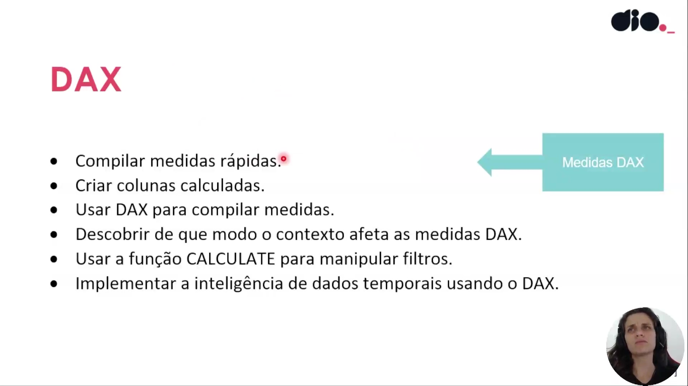
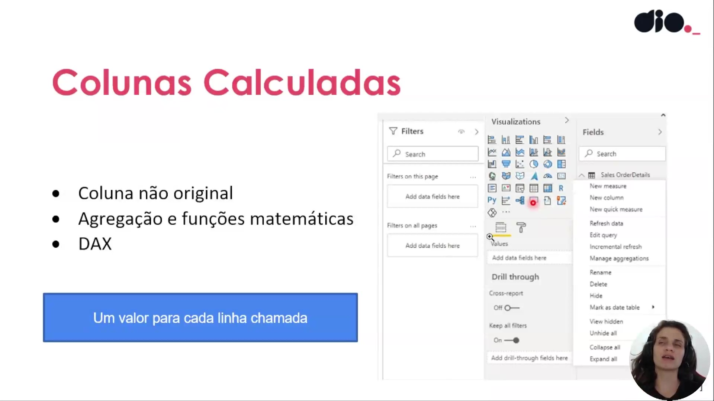
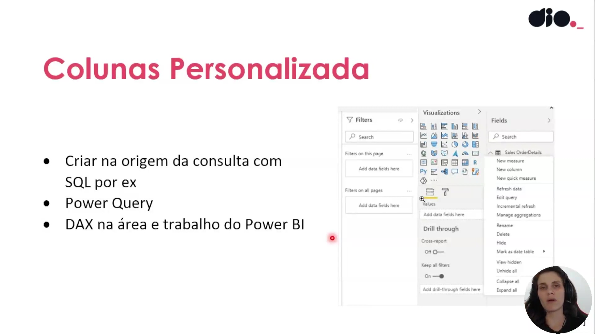
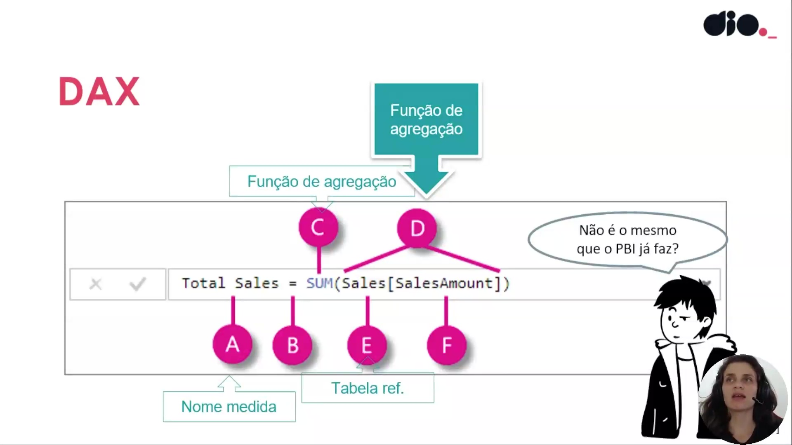

## Instrutor:

- Juliana Mascarenhas (Tech Education Specialist / Sócia (Content Creator) @SimplificandoRedes / Me Modelagem Computacional / Cientista de dados)
- Contato Linkedin: / [juliana-mascarenhas-ds](https://www.linkedin.com/in/juliana-mascarenhas-ds/)

### Parte 1 - Primeiros passos com DAX e Cálculos com Power BI

<video width="60%" controls>
  <source src="000-Midia_e_Anexos/bootcamp_ntt_data-modulo.08-curso.03-video_01.webm" type="video/webm">
    Seu navegador não suporta vídeo HTML5.
</video>

link do vídeo: https://web.dio.me/track/engenharia-dados-python/course/primeiros-passos-com-dax-e-calculos-com-power-bi/learning/1b459584-9961-4461-bc6b-c1309af402f6?autoplay=1

O vídeo apresenta o universo das DAX (Data Analysis Expressions), as expressões de análise de dados que permitem ir além das funções automáticas do Power BI. O foco principal é entender quando e como utilizar DAX para criar cálculos complexos, a diferença entre colunas calculadas e medidas, e como a escolha da ferramenta certa (SQL, Power Query ou DAX) impacta diretamente a performance dos relatórios.

### Anotações

<p align="center">
  
</p>

Este slide apresenta o tema da aula: **FS com DAX e Cálculos com Power BI**, parte da formação Power BI Analyst. A instrutora é Juliana Mascarenhas, especialista em educação tecnológica, mestre em modelagem computacional e cientista de dados. A aula focará no uso da linguagem DAX para criar cálculos e medidas no Power BI.

<p align="center">
  
</p>

Este slide lista os principais tópicos sobre DAX que serão abordados: compilar medidas rápidas, criar colunas calculadas, entender como o contexto afeta as medidas, usar a função `CALCULATE` para manipular filtros e implementar inteligência de tempo (time intelligence) com DAX. Esses conceitos são fundamentais para análises mais avançadas no Power BI.

<p align="center">
  
</p>

O slide explica o conceito de **colunas calculadas** no Power BI. Diferente das colunas originais, elas são criadas a partir de expressões DAX e geram um valor para cada linha da tabela. Utilizam funções de agregação e matemáticas, processando linha por linha. É importante entender que esse tipo de coluna impacta o desempenho do modelo, pois o cálculo é feito durante o carregamento dos dados.

<p align="center">
  
</p>

Aqui são apresentadas três formas de criar **colunas personalizadas**: diretamente na origem dos dados (ex.: com SQL, delegando o processamento ao SGBD), utilizando o Power Query (linguagem M) ou empregando o DAX na área de trabalho do Power BI. A recomendação é priorizar a transformação na origem sempre que possível, para evitar processamento desnecessário dentro do Power BI.

<p align="center">
  
</p>

Este slide traz a definição oficial da Microsoft para **DAX** (Data Analysis Expressions): uma coleção de funções, operadores e constantes que podem ser usados em fórmulas ou expressões para calcular e retornar um ou mais valores. O DAX permite criar cálculos personalizados e medidas dinâmicas dentro do Power BI, indo além das agregações automáticas da ferramenta.

<p align="center">
  
</p>

```plaintext
Total Sales = SUM(Sales[SalesAmount])
```

- Total Sales é o nome da medida.
- O sinal de igual atribui a expressão.
- SUM é a função de agregação.
- Sales é a tabela de referência.
- SalesAmount é o campo sobre o qual a soma é aplicada.

Embora o Power BI já crie agregações automáticas, o DAX permite reutilizar e combinar essas medidas em cálculos mais complexos.

<p align="center">
  
</p>

O slide aponta uma **desvantagem do DAX**: suas expressões não são tão bem compactadas quanto outros métodos (como transformações no Power Query ou na origem dos dados). Isso pode influenciar no tamanho do arquivo `.pbix` e, consequentemente, no desempenho. Por isso, a orientação é usar o DAX apenas quando não houver alternativa mais eficiente, reservando-o para cenários que exigem maior flexibilidade ou lógica complexa.

<p align="center">
  
</p>

Este slide introduz as **funções iterator (funções X)** no DAX, como `SUMX`, `COUNTX` e `MINX`. Diferente das funções de agregação tradicionais (`SUM`, `COUNT`, `MIN`), as versões com X iteram linha por linha sobre uma tabela, aplicando uma expressão a cada registro antes de agregar. Essas funções geralmente oferecem melhor desempenho e menor uso de espaço quando bem aplicadas, sendo uma alternativa poderosa para cálculos mais complexos.      


### 🟩 Vídeo 01 - Contextualizando – O que é DAX?

<video width="60%" controls>
  <source src="000-Midia_e_Anexos/bootcamp_ntt_data-modulo.08-curso.03-video_01.webm" type="video/webm">
    Seu navegador não suporta vídeo HTML5.
</video>

link do vídeo: Curso: Primeiros passos com DAX e Cálculos com Power BI

### 🟩 Vídeo 02 - O que são Funções X?

<video width="60%" controls>
  <source src="000-Midia_e_Anexos/bootcamp_ntt_data-modulo.08-curso.03-video_02.webm" type="video/webm">
    Seu navegador não suporta vídeo HTML5.
</video>

link do vídeo:

### 🟩 Vídeo 03 - Criando Medidas Rápidas com Power BI Desktop

<video width="60%" controls>
  <source src="000-Midia_e_Anexos/bootcamp_ntt_data-modulo.08-curso.03-video_03.webm" type="video/webm">
    Seu navegador não suporta vídeo HTML5.
</video>

link do vídeo:

### 🟩 Vídeo 04 - Comparando os tipos de Medidas

<video width="60%" controls>
  <source src="000-Midia_e_Anexos/bootcamp_ntt_data-modulo.08-curso.03-video_04.webm" type="video/webm">
    Seu navegador não suporta vídeo HTML5.
</video>

link do vídeo:

### 🟩 Vídeo 05 - Criando as primeiras medidas com DAX

<video width="60%" controls>
  <source src="000-Midia_e_Anexos/bootcamp_ntt_data-modulo.08-curso.03-video_05.webm" type="video/webm">
    Seu navegador não suporta vídeo HTML5.
</video>

link do vídeo:

### 🟩 Vídeo 06 - Usando AVARAGEX & AVARAGE

<video width="60%" controls>
  <source src="000-Midia_e_Anexos/bootcamp_ntt_data-modulo.08-curso.03-video_06.webm" type="video/webm">
    Seu navegador não suporta vídeo HTML5.
</video>

link do vídeo:

### 🟩 Vídeo 07 - Colunas Personalizadas

<video width="60%" controls>
  <source src="000-Midia_e_Anexos/bootcamp_ntt_data-modulo.08-curso.03-video_07.webm" type="video/webm">
    Seu navegador não suporta vídeo HTML5.
</video>

link do vídeo:

### 🟩 Vídeo 08 - Falando um pouco mais sobre medidas

<video width="60%" controls>
  <source src="000-Midia_e_Anexos/bootcamp_ntt_data-modulo.08-curso.03-video_08.webm" type="video/webm">
    Seu navegador não suporta vídeo HTML5.
</video>

link do vídeo:

### 🟩 Vídeo 09 - Entendendo o Contexto com DAX

<video width="60%" controls>
  <source src="000-Midia_e_Anexos/bootcamp_ntt_data-modulo.08-curso.03-video_09.webm" type="video/webm">
    Seu navegador não suporta vídeo HTML5.
</video>

link do vídeo:

### 🟩 Vídeo 10 - Tipos de contextos do Power BI

<video width="60%" controls>
  <source src="000-Midia_e_Anexos/bootcamp_ntt_data-modulo.08-curso.03-video_10.webm" type="video/webm">
    Seu navegador não suporta vídeo HTML5.
</video>

link do vídeo:

### 🟩 Vídeo 11 - Explorando as possibilidades com filtros

<video width="60%" controls>
  <source src="000-Midia_e_Anexos/bootcamp_ntt_data-modulo.08-curso.03-video_11.webm" type="video/webm">
    Seu navegador não suporta vídeo HTML5.
</video>

link do vídeo:

### 🟩 Vídeo 12 - Contexto em fórmulas

<video width="60%" controls>
  <source src="000-Midia_e_Anexos/bootcamp_ntt_data-modulo.08-curso.03-video_12.webm" type="video/webm">
    Seu navegador não suporta vídeo HTML5.
</video>

link do vídeo:

### 🟩 Vídeo 13 - Explorando seções de DAX e tipos de funções

<video width="60%" controls>
  <source src="000-Midia_e_Anexos/bootcamp_ntt_data-modulo.08-curso.03-video_13.webm" type="video/webm">
    Seu navegador não suporta vídeo HTML5.
</video>

link do vídeo:

### 🟩 Vídeo 14 - Explorando as funções existentes de: agregação, data e hora, lógicas e outros

<video width="60%" controls>
  <source src="000-Midia_e_Anexos/bootcamp_ntt_data-modulo.08-curso.03-video_14.webm" type="video/webm">
    Seu navegador não suporta vídeo HTML5.
</video>

link do vídeo:

### 🟩 Vídeo 15 - Explorando funções de informação e inteligência de dados temporais

<video width="60%" controls>
  <source src="000-Midia_e_Anexos/bootcamp_ntt_data-modulo.08-curso.03-video_15.webm" type="video/webm">
    Seu navegador não suporta vídeo HTML5.
</video>

link do vídeo:

### 🟩 Vídeo 16 - Criando mais medidas com DAX – CALCULATE, SUM e Funções DATE

<video width="60%" controls>
  <source src="000-Midia_e_Anexos/bootcamp_ntt_data-modulo.08-curso.03-video_16.webm" type="video/webm">
    Seu navegador não suporta vídeo HTML5.
</video>

link do vídeo:

### 🟩 Vídeo 17 - Realizando considerações e explorando as medidas DAX

<video width="60%" controls>
  <source src="000-Midia_e_Anexos/bootcamp_ntt_data-modulo.08-curso.03-video_17.webm" type="video/webm">
    Seu navegador não suporta vídeo HTML5.
</video>

link do vídeo:

### 🟩 Vídeo 18 - Criando uma página do relatório com as novas medidas

<video width="60%" controls>
  <source src="000-Midia_e_Anexos/bootcamp_ntt_data-modulo.08-curso.03-video_18.webm" type="video/webm">
    Seu navegador não suporta vídeo HTML5.
</video>

link do vídeo:

### 🟩 Vídeo 19 - Outros recursos do DAX

<video width="60%" controls>
  <source src="000-Midia_e_Anexos/bootcamp_ntt_data-modulo.08-curso.03-video_19.webm" type="video/webm">
    Seu navegador não suporta vídeo HTML5.
</video>

link do vídeo:

### 🟩 Vídeo 20 - Simulando e Criando uma medida com base em um relacionamento inativo

<video width="60%" controls>
  <source src="000-Midia_e_Anexos/bootcamp_ntt_data-modulo.08-curso.03-video_20.webm" type="video/webm">
    Seu navegador não suporta vídeo HTML5.
</video>

link do vídeo:

### 🟩 Vídeo 21 - Analisando aspecto temporal dos dados com DAX

<video width="60%" controls>
  <source src="000-Midia_e_Anexos/bootcamp_ntt_data-modulo.08-curso.03-video_21.webm" type="video/webm">
    Seu navegador não suporta vídeo HTML5.
</video>

link do vídeo:

### 🟩 Vídeo 22 - Calculando valores com SAMEPERIODLASTYEAR

<video width="60%" controls>
  <source src="000-Midia_e_Anexos/bootcamp_ntt_data-modulo.08-curso.03-video_22.webm" type="video/webm">
    Seu navegador não suporta vídeo HTML5.
</video>

link do vídeo:

### 🟩 Vídeo 23 - Calculando valores com PREVIOUSMONTH e Considerações finais

<video width="60%" controls>
  <source src="000-Midia_e_Anexos/bootcamp_ntt_data-modulo.08-curso.03-video_23.webm" type="video/webm">
    Seu navegador não suporta vídeo HTML5.
</video>

link do vídeo:

##  Materiais de Apoio

# Certificado: 

- Link na plataforma: 
- Certificado em pdf: