## Instrutor:

- Juliana Mascarenhas (Tech Education Specialist / Sócia (Content Creator) @SimplificandoRedes / Me Modelagem Computacional / Cientista de dados)
- Contato Linkedin: / [juliana-mascarenhas-ds](https://www.linkedin.com/in/juliana-mascarenhas-ds/)

### Parte 1 - Primeiros passos com DAX e Cálculos com Power BI

### 🟩 Vídeo 01 - Contextualizando – O que é DAX?

<video width="60%" controls>
  <source src="000-Midia_e_Anexos/bootcamp_ntt_data-modulo.08-curso.03-video_01.webm" type="video/webm">
    Seu navegador não suporta vídeo HTML5.
</video>

link do vídeo: https://web.dio.me/track/engenharia-dados-python/course/primeiros-passos-com-dax-e-calculos-com-power-bi/learning/1b459584-9961-4461-bc6b-c1309af402f6?autoplay=1

O vídeo apresenta o universo das DAX (Data Analysis Expressions), as expressões de análise de dados que permitem ir além das funções automáticas do Power BI. O foco principal é entender quando e como utilizar DAX para criar cálculos complexos, a diferença entre colunas calculadas e medidas, e como a escolha da ferramenta certa (SQL, Power Query ou DAX) impacta diretamente a performance dos relatórios.

### Anotações

<p align="center">
  
</p>

Este slide apresenta o tema da aula: **FS com DAX e Cálculos com Power BI**, parte da formação Power BI Analyst. A instrutora é Juliana Mascarenhas, especialista em educação tecnológica, mestre em modelagem computacional e cientista de dados. A aula focará no uso da linguagem DAX para criar cálculos e medidas no Power BI.

<p align="center">
  
</p>

Este slide lista os principais tópicos sobre DAX que serão abordados: compilar medidas rápidas, criar colunas calculadas, entender como o contexto afeta as medidas, usar a função `CALCULATE` para manipular filtros e implementar inteligência de tempo (time intelligence) com DAX. Esses conceitos são fundamentais para análises mais avançadas no Power BI.

<p align="center">
  
</p>

O slide explica o conceito de **colunas calculadas** no Power BI. Diferente das colunas originais, elas são criadas a partir de expressões DAX e geram um valor para cada linha da tabela. Utilizam funções de agregação e matemáticas, processando linha por linha. É importante entender que esse tipo de coluna impacta o desempenho do modelo, pois o cálculo é feito durante o carregamento dos dados.

<p align="center">
  
</p>

Aqui são apresentadas três formas de criar **colunas personalizadas**: diretamente na origem dos dados (ex.: com SQL, delegando o processamento ao SGBD), utilizando o Power Query (linguagem M) ou empregando o DAX na área de trabalho do Power BI. A recomendação é priorizar a transformação na origem sempre que possível, para evitar processamento desnecessário dentro do Power BI.

<p align="center">
  
</p>

Este slide traz a definição oficial da Microsoft para **DAX** (Data Analysis Expressions): uma coleção de funções, operadores e constantes que podem ser usados em fórmulas ou expressões para calcular e retornar um ou mais valores. O DAX permite criar cálculos personalizados e medidas dinâmicas dentro do Power BI, indo além das agregações automáticas da ferramenta.

<p align="center">
  
</p>

```plaintext
Total Sales = SUM(Sales[SalesAmount])
```

- Total Sales é o nome da medida.
- O sinal de igual atribui a expressão.
- SUM é a função de agregação.
- Sales é a tabela de referência.
- SalesAmount é o campo sobre o qual a soma é aplicada.

Embora o Power BI já crie agregações automáticas, o DAX permite reutilizar e combinar essas medidas em cálculos mais complexos.

<p align="center">
  
</p>

O slide aponta uma **desvantagem do DAX**: suas expressões não são tão bem compactadas quanto outros métodos (como transformações no Power Query ou na origem dos dados). Isso pode influenciar no tamanho do arquivo `.pbix` e, consequentemente, no desempenho. Por isso, a orientação é usar o DAX apenas quando não houver alternativa mais eficiente, reservando-o para cenários que exigem maior flexibilidade ou lógica complexa.

<p align="center">
  
</p>

Este slide introduz as **funções iterator (funções X)** no DAX, como `SUMX`, `COUNTX` e `MINX`. Diferente das funções de agregação tradicionais (`SUM`, `COUNT`, `MIN`), as versões com X iteram linha por linha sobre uma tabela, aplicando uma expressão a cada registro antes de agregar. Essas funções geralmente oferecem melhor desempenho e menor uso de espaço quando bem aplicadas, sendo uma alternativa poderosa para cálculos mais complexos.      


### 🟩 Vídeo 02 - O que são Funções X?

<video width="60%" controls>
  <source src="000-Midia_e_Anexos/bootcamp_ntt_data-modulo.08-curso.03-video_02.webm" type="video/webm">
    Seu navegador não suporta vídeo HTML5.
</video>

link do vídeo: https://web.dio.me/track/engenharia-dados-python/course/primeiros-passos-com-dax-e-calculos-com-power-bi/learning/72819f5f-3677-4e06-b53e-06ed8df93bb5?autoplay=1

O vídeo aborda o conceito, o funcionamento e as vantagens das chamadas "Funções X" na linguagem DAX do Power BI, destacando como elas otimizam a performance e o armazenamento de dados.

### Anotações

<p align="center">
  
</p>

A imagem apresenta a diferença entre funções tradicionais (`SUM`, `COUNT`, `MIN`) e suas versões com sufixo `X` (`SUMX`, `COUNTX`, `MINX`). Essas funções são chamadas de **iteradores** (ou *iterator functions*). Em vez de operarem sobre uma coluna inteira de uma só vez, elas percorrem linha a linha da tabela, aplicando uma expressão a cada registro individual.

**Vantagens principais:**
- **Melhor desempenho** – a iteração controlada permite cálculos mais eficientes em grandes volumes de dados.
- **Menor espaço de armazenamento** – ao evitar colunas calculadas desnecessárias, as funções `X` reduzem o modelo de dados.

**Quando usar DAX?**  
A nota "Use o DAX quando não houver outra alternativa" reforça que, embora poderoso, o DAX deve ser empregado com critério – preferindo soluções nativas do Power Query ou relacionamentos bem modelados sempre que possível. As funções `X` são recomendadas quando você precisa de agregações personalizadas ou cálculos linha a linha sem criar colunas físicas.

<p align="center">
  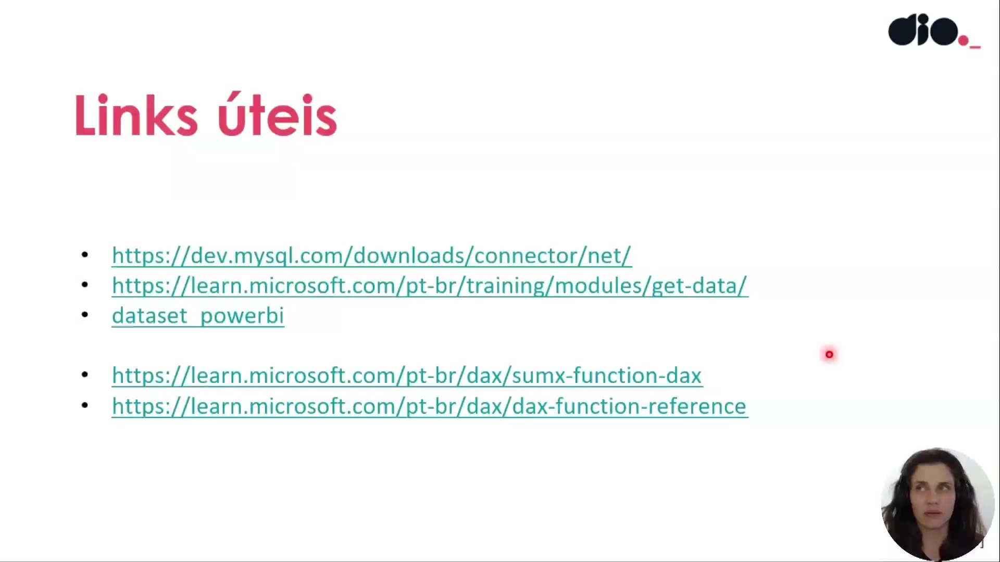
</p>

**Referências e recursos oficiais**

- **Download do Conector MySQL/.NET** – essencial para conectar o Power BI a bancos MySQL.
- **Treinamento da Microsoft sobre obtenção de dados** – módulo oficial para aprender a importar dados de diversas fontes.
- **Dataset Power BI** – conjunto de dados de exemplo para exercícios práticos.
- **Documentação oficial DAX** – referências diretas para as funções `SUMX` e o guia geral de funções DAX.

Utilize esses materiais para consolidar o entendimento sobre funções iteradoras (`X`) e boas práticas de modelagem. A documentação da Microsoft é a fonte primária para sintaxe, exemplos e comportamento detalhado de cada função.
      

### 🟩 Vídeo 03 - Criando Medidas Rápidas com Power BI Desktop

<video width="60%" controls>
  <source src="000-Midia_e_Anexos/bootcamp_ntt_data-modulo.08-curso.03-video_03.webm" type="video/webm">
    Seu navegador não suporta vídeo HTML5.
</video>

link do vídeo: https://web.dio.me/track/engenharia-dados-python/course/primeiros-passos-com-dax-e-calculos-com-power-bi/learning/bcca8288-ee47-4eab-a511-f2464a86942a?autoplay=1

O vídeo foca na utilização do recurso de Medidas Rápidas (Quick Measures) no Power BI, uma funcionalidade que permite criar cálculos complexos em DAX (Data Analysis Expressions) sem a necessidade de escrever código manualmente. O instrutor demonstra como a ferramenta automatiza a lógica de negócios e serve como uma ponte para entender funções avançadas.

### Anotações

<p align="center">
  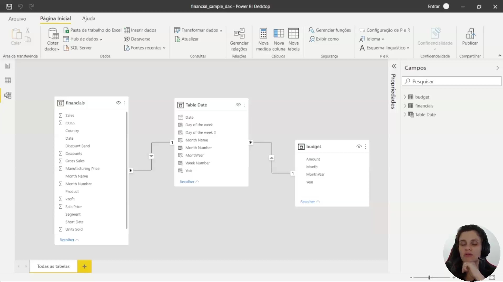
</p>

Este é o ponto de partida para a criação de medidas rápidas, onde o usuário pode selecionar tabelas e colunas para aplicar cálculos automáticos sem precisar escrever fórmulas manualmente.

<p align="center">
  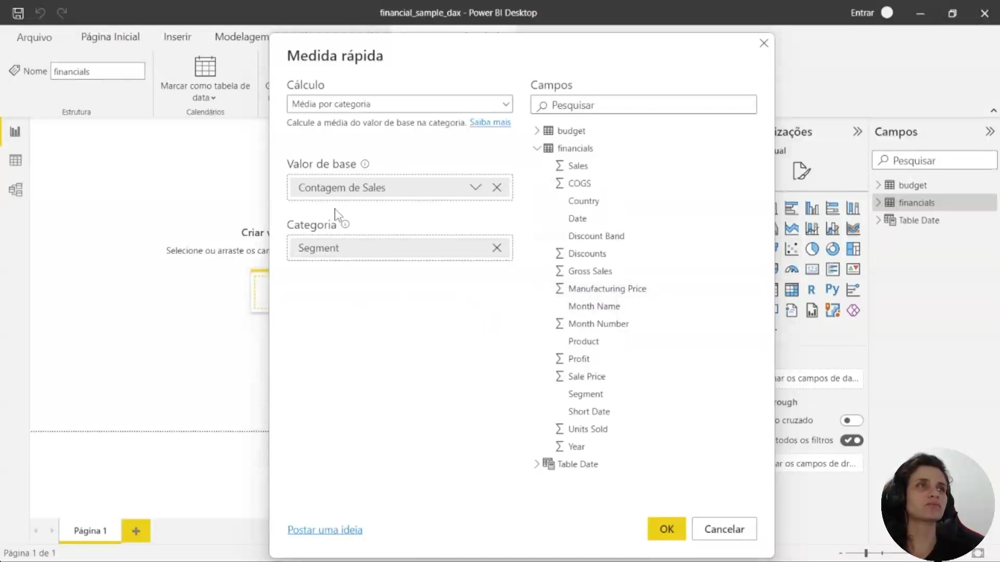
</p>

Aqui vemos a janela de criação de uma medida rápida. O Power BI gera automaticamente o código DAX correspondente, neste caso utilizando a função `AVERAGEX` para calcular a média da contagem de vendas por segmento. O usuário escolhe os campos e o cálculo, e o sistema monta a expressão.

```DAX
Média de Contagem de Sales por Segment =
AVERAGEX(
    KEEPFILTERS(VALUES('financials'[Segment])),
    CALCULATE(COUNTA('financials'[Sales]))
)
```

<p align="center">
  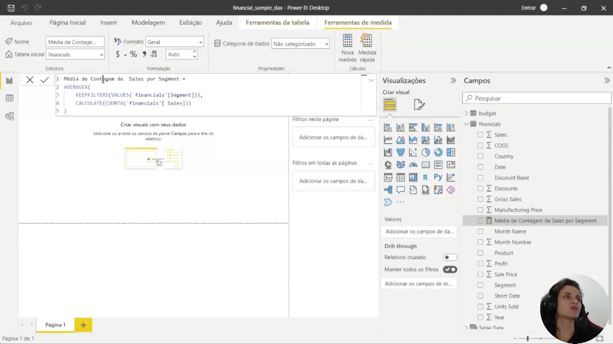
</p>

O gráfico exibe a média da contagem de vendas por segmento, permitindo comparar rapidamente os resultados entre diferentes categorias. É um exemplo prático de como medidas rápidas podem ser usadas para gerar insights sem escrever código manualmente.

<p align="center">
  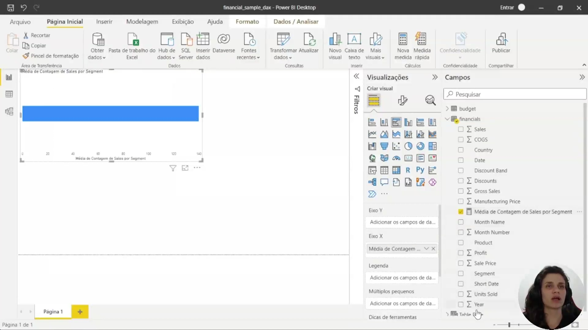
</p>

Neste ponto, a medida é representada em um gráfico de barras, mostrando a distribuição da média de vendas por segmento. O visual ajuda a identificar padrões e diferenças entre os segmentos de forma clara e intuitiva.


<p align="center">
  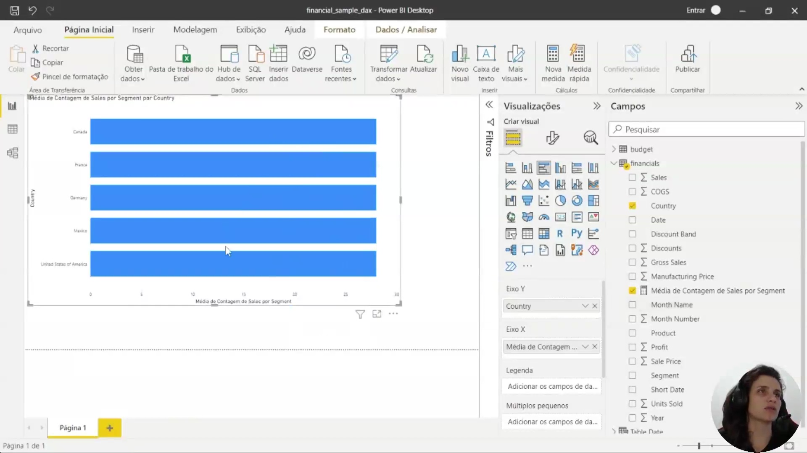
</p>

Aqui o gráfico é detalhado por país, exibindo a média da contagem de vendas por segmento em cada região. Isso permite analisar variações geográficas e comparar o desempenho entre diferentes mercados.

<p align="center">
  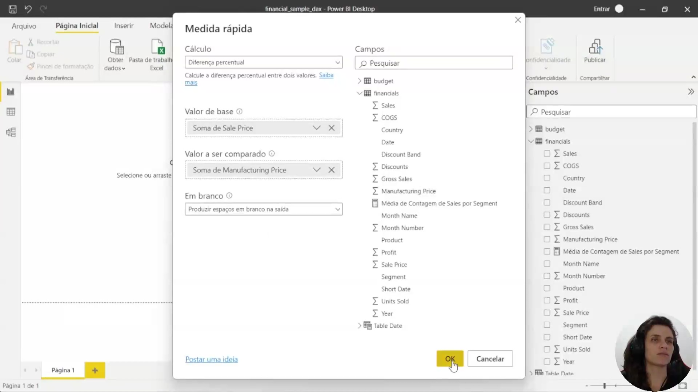
</p>

A imagem mostra a configuração de uma nova medida rápida, desta vez para calcular a diferença percentual entre dois valores: preço de venda e preço de manufatura. O Power BI gera automaticamente a fórmula em DAX utilizando variáveis.

<p align="center">
  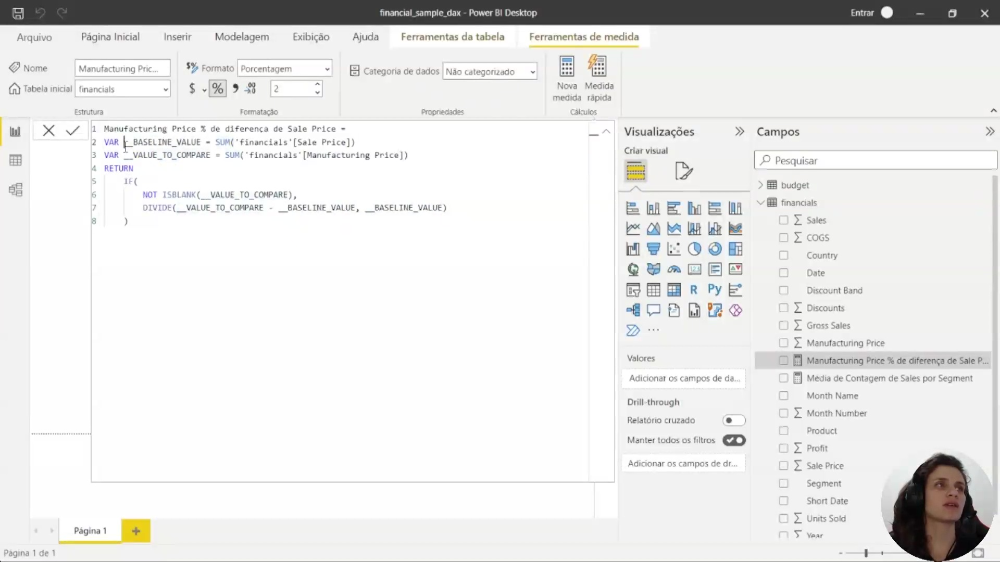
</p>

O código gerado para a diferença percentual aparece aqui. Ele utiliza variáveis para armazenar os valores de comparação e retorna o cálculo apenas quando o valor não está em branco.

```DAX
Manufacturing Price % de diferença de Sale Price =
VAR _BASELINE_VALUE = SUM('financials'[Sale Price])
VAR _VALUE_TO_COMPARE = SUM('financials'[Manufacturing Price])
RETURN
IF(
    NOT ISBLANK(_VALUE_TO_COMPARE),
    DIVIDE(_VALUE_TO_COMPARE - _BASELINE_VALUE, _BASELINE_VALUE)
)
```

<p align="center">
  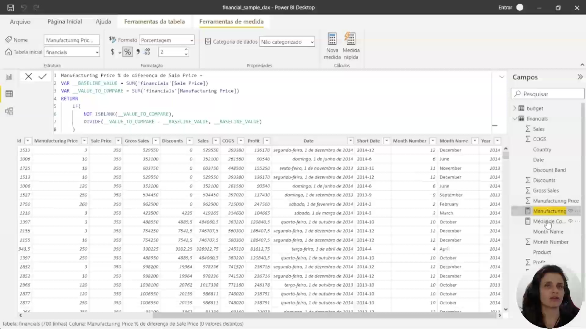
</p>

Aqui vemos a tabela de dados utilizada para validar a medida criada. Nela aparecem colunas como preço de manufatura, preço de venda, vendas brutas e lucro, permitindo verificar se os cálculos estão corretos.

<p align="center">
  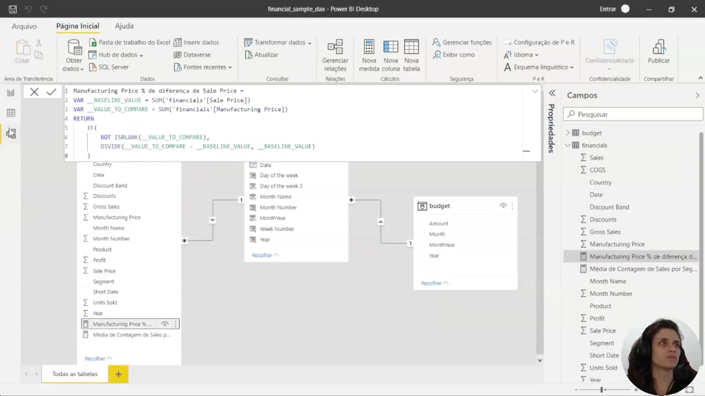
</p>

Aqui vemos novamente a medida de diferença percentual sendo aplicada em um visual. O resultado mostra que o preço de manufatura é cerca de 18,54% diferente do preço de venda, evidenciando a utilidade da medida para análise de margens.

<p align="center">
  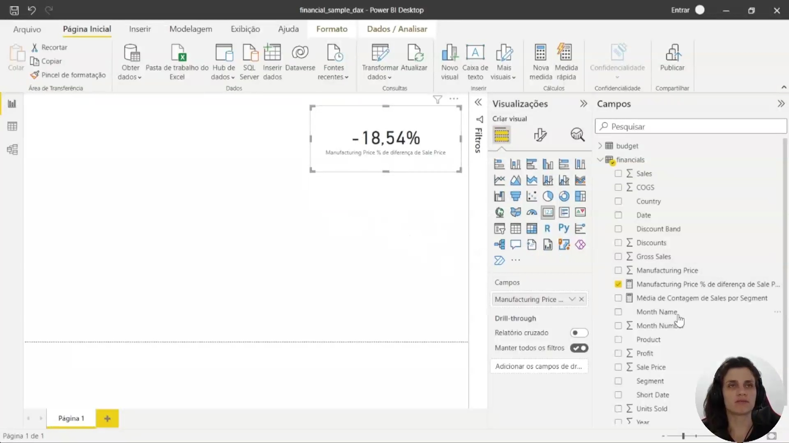
</p>

O gráfico exibe o valor percentual calculado, permitindo visualizar rapidamente a diferença entre os preços. Esse tipo de medida é útil para análises de custo e precificação.

<p align="center">
  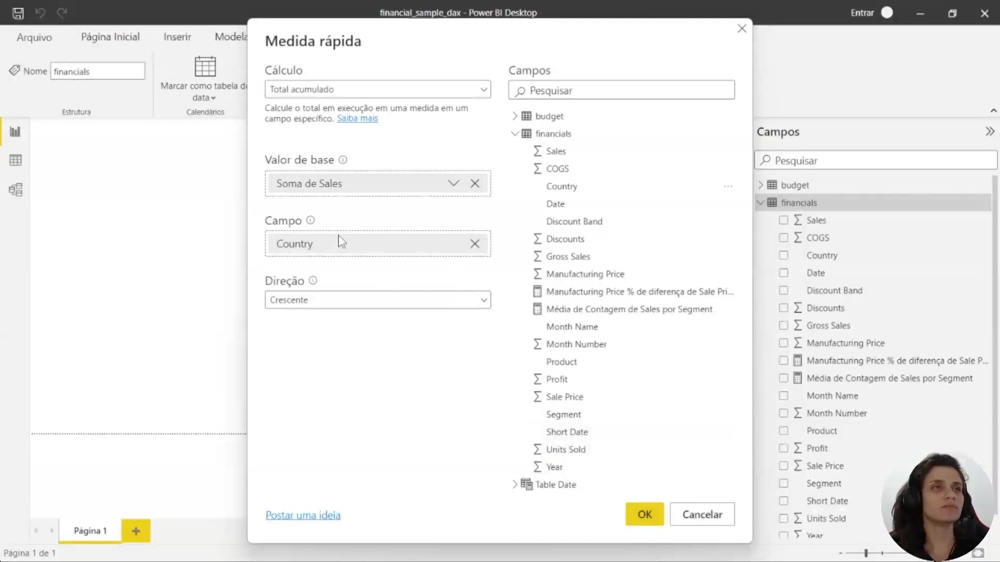
</p>

A imagem mostra a configuração de outra medida rápida: o cálculo de total acumulado. O usuário seleciona o campo base (Sales) e o campo de agrupamento (como Country ou Date), e o Power BI gera automaticamente a expressão correspondente.

<p align="center">
  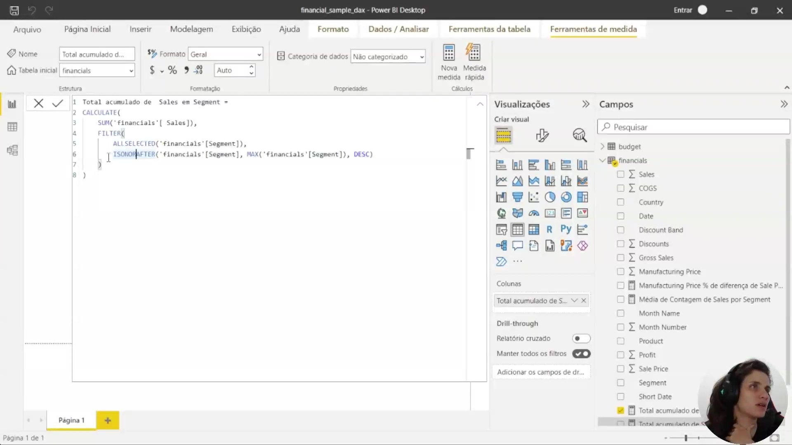
</p>

Aqui aparece o código DAX gerado para o total acumulado de vendas por segmento. Ele utiliza funções como `CALCULATE`, `FILTER` e `ISONORAFTER` para construir o cálculo.

```DAX
Total acumulado de Sales em Segment =
CALCULATE(
    SUM('financials'[Sales]),
    FILTER(
        ALLSELECTED('financials'[Segment]),
        ISONORAFTER('financials'[Segment], MAX('financials'[Segment]), DESC)
    )
)
```

<p align="center">
  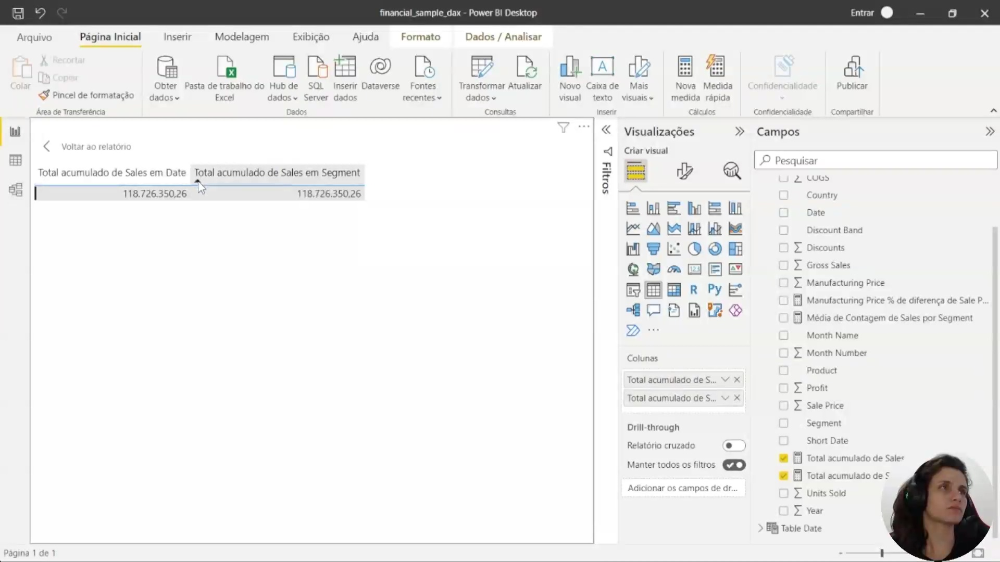
</p>

O resultado da medida acumulada é exibido em um cartão, mostrando o total de vendas acumuladas tanto por data quanto por segmento. Esse tipo de medida é útil para acompanhar evolução de vendas ao longo do tempo ou por categorias específicas.      

### 🟩 Vídeo 04 - Comparando os tipos de Medidas

<video width="60%" controls>
  <source src="000-Midia_e_Anexos/bootcamp_ntt_data-modulo.08-curso.03-video_04.webm" type="video/webm">
    Seu navegador não suporta vídeo HTML5.
</video>

link do vídeo: https://web.dio.me/track/engenharia-dados-python/course/primeiros-passos-com-dax-e-calculos-com-power-bi/learning/452309db-17b4-46aa-85f3-a35d8feae63b?autoplay=1

O vídeo explora a transição de uma visão de vendas pontuais para uma visão acumulada, utilizando as "Medidas Rápidas" do Power BI. O objetivo é entender não apenas quanto foi vendido em um dia, mas como o volume de vendas cresce e se concentra ao longo do tempo.

### Anotações

<p align="center">
  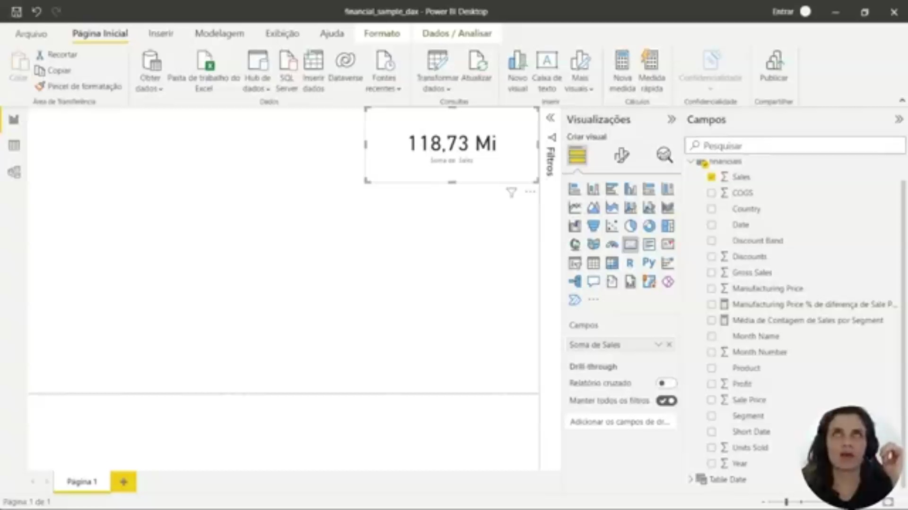
</p>

O foco aqui é configurar um cálculo de **total acumulado** sobre o campo *Sales*, utilizando a dimensão *Date*. Esse recurso permite gerar um gráfico cumulativo que mostra a progressão das vendas ao longo do tempo, facilitando a análise de tendências e a identificação de períodos de maior concentração de vendas.

<p align="center">
  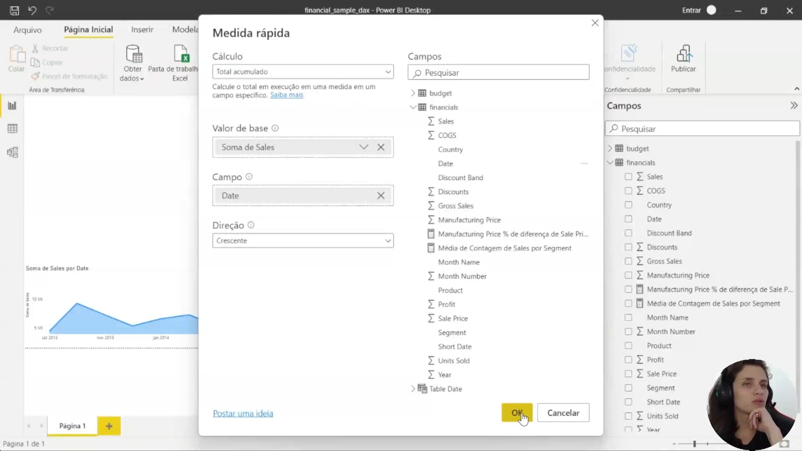
</p>

O trecho mostra a função `CALCULATE` combinada com `FILTER` e `ISONORAFTER`, que garante que os valores sejam somados de forma cumulativa até a data selecionada.  

```DAX
CALCULATE (
    SUM('financials'[Sales]),
    FILTER(
        ALLSELECTED('financials'[Date]),
        ISONORAFTER('financials'[Date], MAX('financials'[Date]), DESC)
    )
)
```

Esse código cria uma medida personalizada que acumula as vendas ao longo do tempo, permitindo comparar períodos e visualizar a evolução histórica.

<p align="center">
  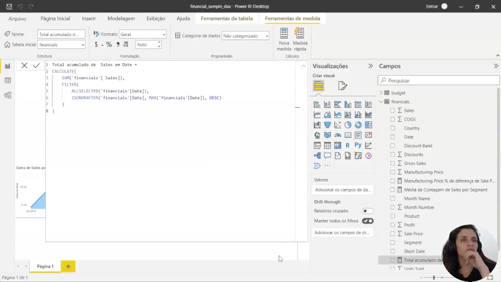
</p>

O eixo horizontal representa as datas e o eixo vertical o valor acumulado de *Sales*. A curva crescente evidencia como as vendas se somam ao longo do tempo, destacando períodos de maior crescimento. Esse tipo de visualização é útil para entender a distribuição acumulada (CDF – *Cumulative Distribution Function*) e identificar tendências de longo prazo.

<p align="center">
  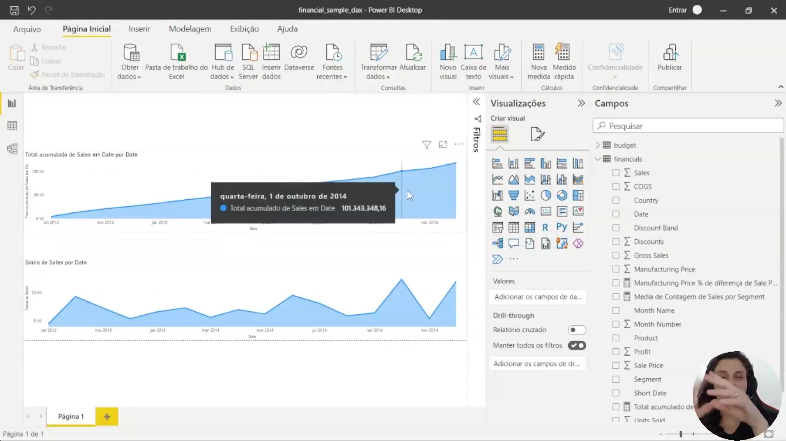
</p>

Neste último quadro, o gráfico de vendas acumuladas continua sendo detalhado, com destaque para valores específicos em datas selecionadas. O marcador mostra, por exemplo, o total acumulado em 1º de outubro de 2014, permitindo verificar o crescimento progressivo. Essa análise ajuda a perceber onde está concentrada a maior parte das vendas e como elas evoluem ao longo dos anos, sendo uma ferramenta essencial para decisões estratégicas.      


### 🟩 Vídeo 05 - Criando as primeiras medidas com DAX

<video width="60%" controls>
  <source src="000-Midia_e_Anexos/bootcamp_ntt_data-modulo.08-curso.03-video_05.webm" type="video/webm">
    Seu navegador não suporta vídeo HTML5.
</video>

link do vídeo: https://web.dio.me/track/engenharia-dados-python/course/primeiros-passos-com-dax-e-calculos-com-power-bi/learning/35e9f828-84b7-47ae-81c3-d3fb8e7bf42e?autoplay=1

O vídeo aborda a criação de Medidas Customizadas utilizando a linguagem DAX no Power BI, demonstrando como elas se comportam de forma diferente das agregações automáticas e como podem ser usadas para definir metas dinâmicas.

### Anotações

<p align="center">
  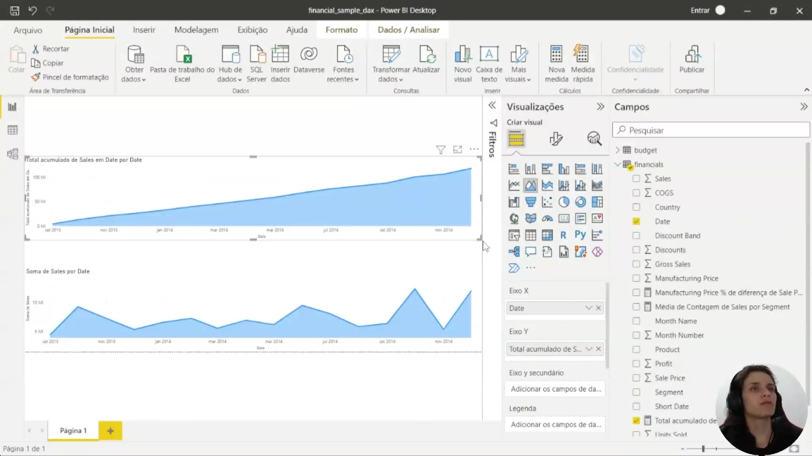
</p>

O eixo X está configurado com **Date** e o eixo Y com o **Total acumulado de Sales**, permitindo visualizar a evolução das vendas ao longo do tempo. Esse tipo de gráfico é útil para acompanhar tendências e comparar períodos, mostrando como o valor acumulado cresce mês a mês. A explicação conecta-se ao momento da aula em que o instrutor demonstra a criação de medidas e a utilização delas em visuais para análise.

<p align="center">
  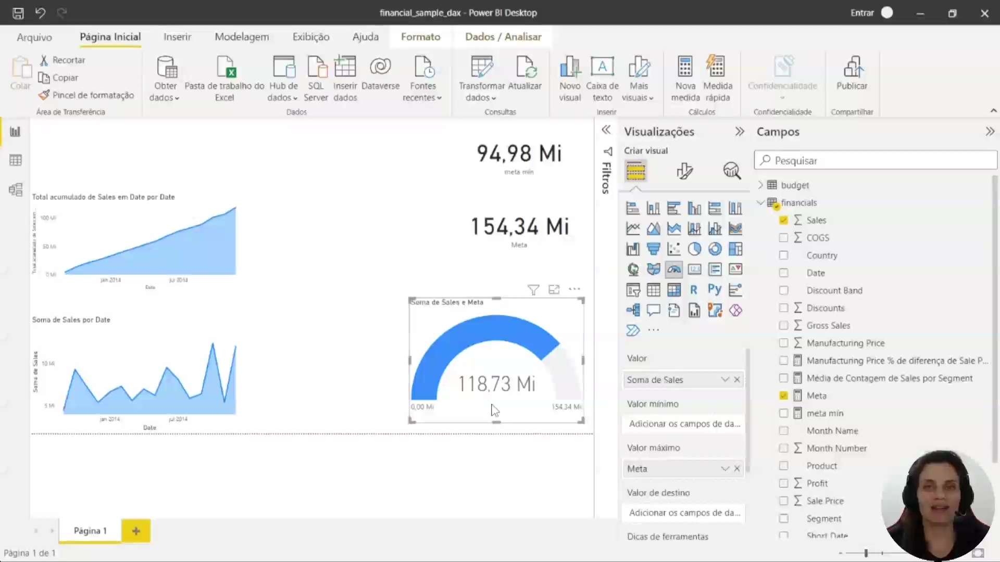
</p>

Aqui, o foco está em um cartão que mostra valores de **Sales** comparados com metas. O instrutor explica como criar medidas personalizadas em DAX, como o **Total Sales**, e depois derivar novas métricas, como **Meta** e **Meta mínima**, multiplicando ou ajustando os valores de vendas. A imagem ilustra a comparação entre o valor alcançado (118,73 milhões), a meta mínima (94,98 milhões) e a meta máxima (154,34 milhões). Esse recurso evidencia como medidas permitem estabelecer objetivos e acompanhar o desempenho em relação a metas definidas.


### 🟩 Vídeo 06 - Usando AVARAGEX & AVARAGE

<video width="60%" controls>
  <source src="000-Midia_e_Anexos/bootcamp_ntt_data-modulo.08-curso.03-video_06.webm" type="video/webm">
    Seu navegador não suporta vídeo HTML5.
</video>

link do vídeo: https://web.dio.me/track/engenharia-dados-python/course/primeiros-passos-com-dax-e-calculos-com-power-bi/learning/774bce68-72d4-4639-a9f9-01b1453e4056?autoplay=1

O vídeo descreve as nuances entre colunas calculadas e medidas no Power BI, demonstrando como utilizar expressões DAX para criar visualizações dinâmicas, hierarquias de datas e relatórios eficientes.

### Anotações

<p align="center">
  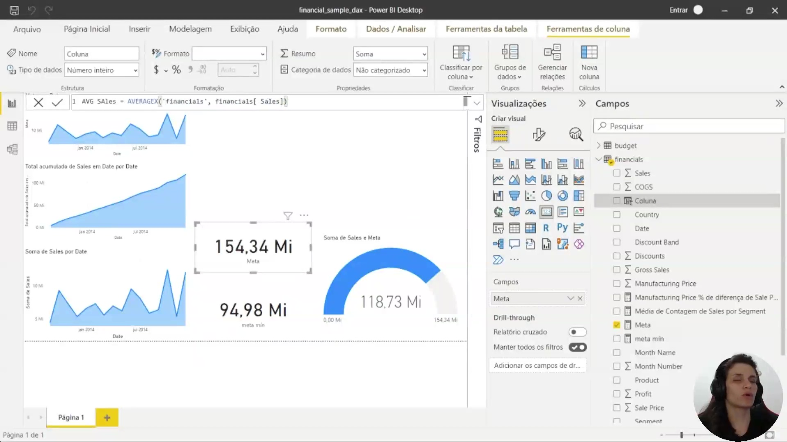
</p>

Nesta tela vemos a criação de uma medida em Power BI utilizando DAX. O exemplo mostra a tentativa de calcular a média de vendas com `AVERAGEX`, mas sem definir corretamente a expressão, o que resulta em valores repetidos. Isso ilustra a diferença entre colunas calculadas (que armazenam valores linha a linha) e medidas (que são calculadas sob demanda e podem ser dimensionadas por tempo ou outra dimensão).

<p align="center">
  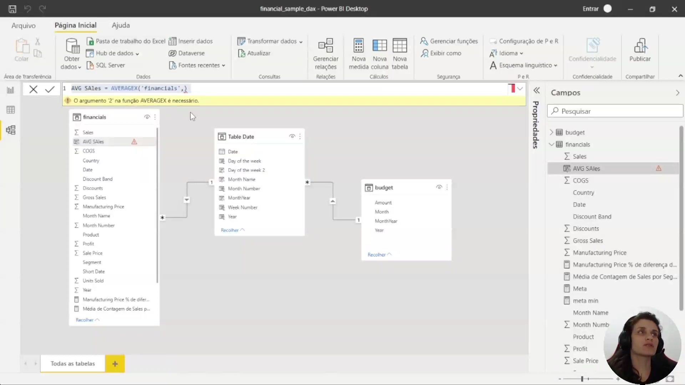
</p>

Aqui aparece a mensagem de erro ao tentar usar `AVERAGEX` sem fornecer todos os argumentos necessários. O Power BI indica que a função precisa da tabela e da expressão para funcionar corretamente. Esse exemplo reforça a importância de compreender a sintaxe das funções DAX e de diferenciar quando usar `AVERAGE` (apenas coluna) e `AVERAGEX` (tabela + expressão).

<p align="center">
  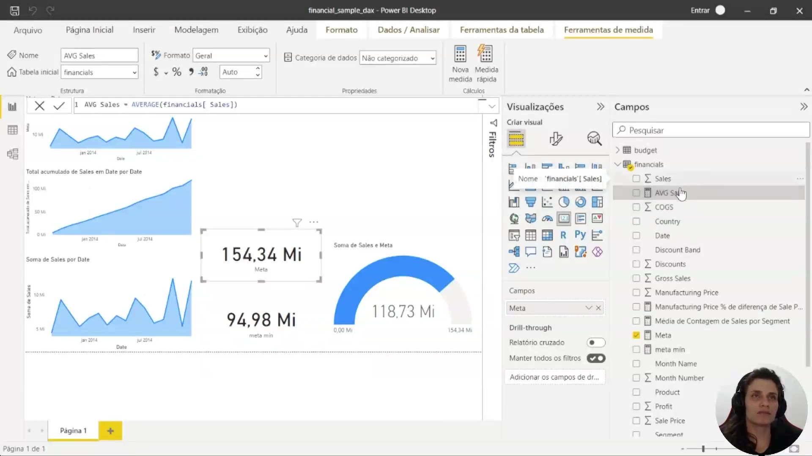
</p>

Nesta imagem vemos a medida corrigida: `AVG Sales = AVERAGE(financials[Sales])`. Agora o cálculo é válido e retorna a média de vendas. A medida pode ser usada em visuais, como tabelas ou gráficos, e dimensionada por hierarquias de tempo (ano, mês), permitindo análises comparativas entre períodos.


<p align="center">
  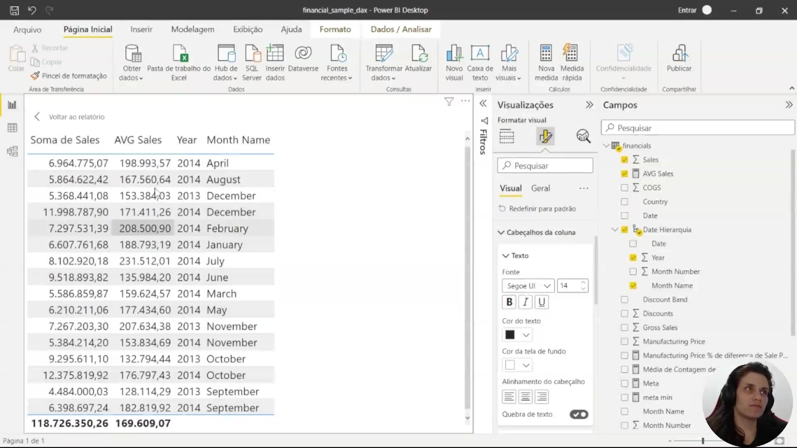
</p>

O visual mostra como medidas podem ser combinadas com dimensões temporais para identificar variações mensais e anuais. É um exemplo prático de como medidas são recalculadas dinamicamente conforme o contexto do visual.

<p align="center">
  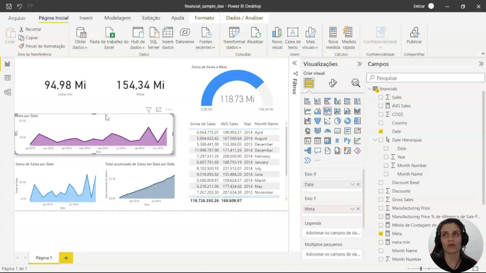
</p>

Aqui vemos a comparação entre metas e vendas acumuladas ao longo do tempo. O gráfico mostra linhas de meta e de vendas, destacadas por cores diferentes. Esse tipo de visualização é útil para avaliar desempenho em relação a objetivos, reforçando o papel das medidas como cálculos dinâmicos que podem ser aplicados em diferentes contextos visuais.

### 🟩 Vídeo 07 - Colunas Personalizadas

<video width="60%" controls>
  <source src="000-Midia_e_Anexos/bootcamp_ntt_data-modulo.08-curso.03-video_07.webm" type="video/webm">
    Seu navegador não suporta vídeo HTML5.
</video>

link do vídeo: https://web.dio.me/track/engenharia-dados-python/course/primeiros-passos-com-dax-e-calculos-com-power-bi/learning/1b92e821-50f4-4d9f-bd35-d79a16534e7c?autoplay=1

Este vídeo apresenta as diferentes metodologias para criar dados personalizados no Power BI, destacando quando processar informações na origem (SQL), na transformação (Power Query) ou na análise (DAX).

### Anotações

<p align="center">
  
</p>

**Colunas personalizadas** são campos que você adiciona ao modelo, mas que não existem originalmente na fonte de dados. Elas podem ser criadas de três maneiras:

1. **Na origem dos dados** – durante a extração, por exemplo com uma consulta SQL que já calcula o campo. Isso transfere o processamento para o banco de dados.
2. **Com Power Query** – usando a interface ou a linguagem M para transformar os dados após a importação.
3. **Com DAX** – criando colunas calculadas ou medidas diretamente no Power BI, o que mantém o processamento no próprio arquivo.

A escolha entre essas formas afeta onde o cálculo é executado e como o desempenho do relatório se comporta.

<p align="center">
  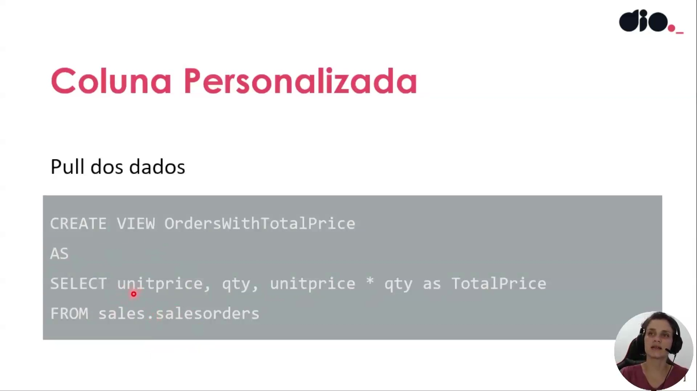
</p>

Exemplo de criação de coluna personalizada **na origem dos dados**, utilizando SQL:

```sql
CREATE VIEW OrdersWithTotalPrice
AS
SELECT unitprice, qty, unitprice * qty as TotalPrice
FROM sales.salesorders
```

A instrução cria uma view chamada `OrdersWithTotalPrice` que contém os campos originais `unitprice` e `qty`, mais uma coluna derivada `TotalPrice` (resultado da multiplicação). Essa coluna não precisa ser armazenada fisicamente – ela é calculada no momento da consulta, no próprio SGBD, aliviando a carga do Power BI.

<p align="center">
  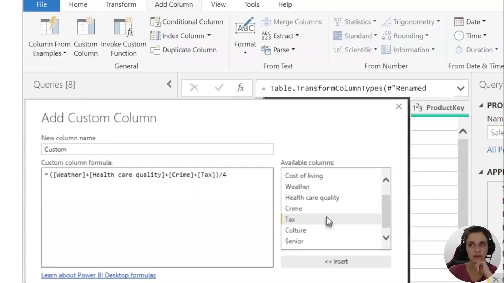
</p>

No Power Query você define a expressão (linguagem M) que gera a nova coluna durante a etapa de transformação; isso mantém o cálculo na camada de ETL antes de carregar os dados ao modelo. Quando a criação é feita no Power BI com DAX, o processamento pode ocorrer no modelo e a escolha entre coluna persistida ou medida por demanda afeta armazenamento e performance.

Custom Column Formula:
```
= ([Weather] + [Health care quality] + [Crime] + [Tax]) / 4
```

### 🟩 Vídeo 08 - Falando um pouco mais sobre medidas

<video width="60%" controls>
  <source src="000-Midia_e_Anexos/bootcamp_ntt_data-modulo.08-curso.03-video_08.webm" type="video/webm">
    Seu navegador não suporta vídeo HTML5.
</video>

link do vídeo: https://web.dio.me/track/engenharia-dados-python/course/primeiros-passos-com-dax-e-calculos-com-power-bi/learning/d86acac7-3659-4da3-ae9e-787f6778395a?autoplay=1

O vídeo apresenta as definições fundamentais de Medidas e Colunas no Power BI, destacando suas diferenças operacionais, impactos na performance e a importância do contexto de filtro para a análise de dados. O conteúdo é voltado tanto para a prática do dia a dia quanto para a preparação para a certificação oficial da Microsoft.

### Anotações

<p align="center">
  
</p>

O slide apresenta o conceito de **medidas** na ferramenta. Medidas são cálculos criados sob demanda, úteis para operar linha por linha das tabelas. Podem ser criadas como *Medidas Rápidas* (sem usar DAX) ou com expressões DAX personalizadas. Diferente de colunas calculadas, as medidas não são armazenadas no arquivo `.pbix` – são avaliadas apenas no momento da interação do usuário, com base nos filtros aplicados ao relatório. A combinação desses filtros forma o *contexto de filtro*, que determina quais linhas serão consideradas no cálculo.

<p align="center">
  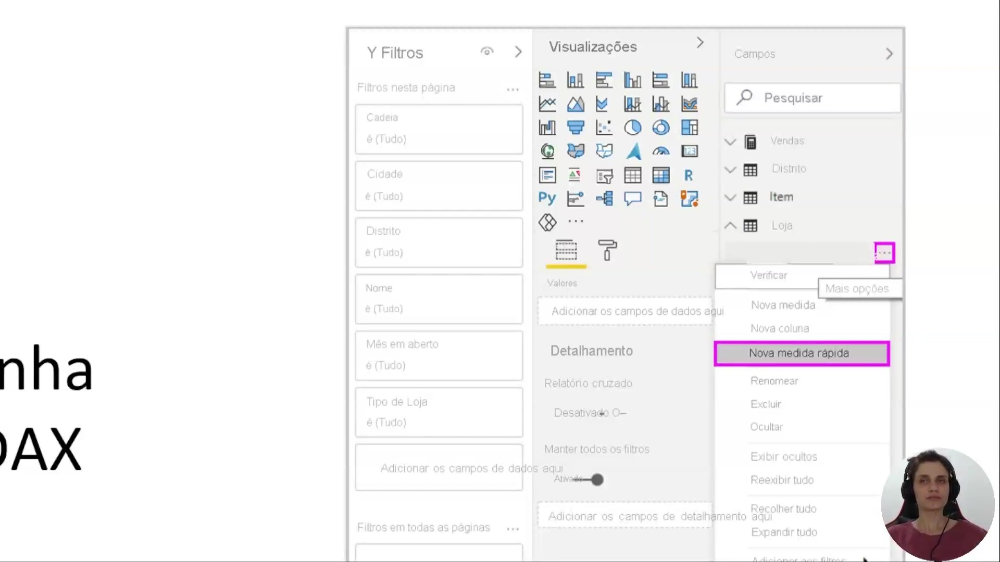
</p>

Este slide contrasta medidas com colunas: as colunas são persistidas no arquivo (.pbix) e ocupam espaço, enquanto medidas são calculadas apenas quando solicitadas. Uma coluna calculada cria um valor para cada linha em uma tabela.   
Regra prática: crie colunas calculadas quando precisar do valor armazenado por linha (por exemplo, para relacionamentos ou segmentações); evite colunas desnecessárias para não aumentar o tamanho do modelo.

<p align="center">
  
</p>
 
A imagem repete a definição anterior, enfatizando que medidas são calculadas com base nos filtros do relatório. O *contexto de filtro* é o conjunto de seleções (como slicers, filtros de página ou de visual) que restringem os dados antes da aplicação da medida. Entender esse contexto é fundamental para criar medidas que se comportem corretamente em diferentes cenários de análise.

<p align="center">
  
</p>

Diferentemente das medidas, as **colunas** (ou colunas calculadas) são persistidas no arquivo `.pbix`. Cada nova coluna aumenta o espaço de armazenamento do modelo e pode impactar negativamente o desempenho, elevando o tempo de atualização dos dados. Colunas são avaliadas linha a linha durante o carregamento ou a atualização, e os resultados ficam gravados. Por isso, devem ser usadas com critério, preferindo medidas sempre que o cálculo puder ser feito sob demanda.

<p align="center">
  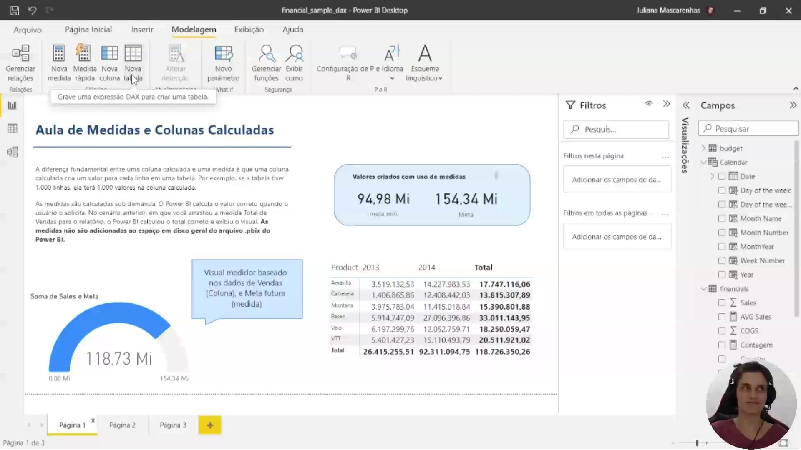
</p>

O trecho mostra exemplos de criação de coluna personalizada no Power Query e a interface de edição de consultas, destacando que colunas personalizadas usam a linguagem M e aparecem no modelo final. Aumento de espaço que possivelmente aumentará o tempo de atualização. Prefira transformar e limpar dados no Power Query quando a lógica puder ser aplicada uma vez; reserve medidas para cálculos que dependem do contexto do relatório.

<p align="center">
  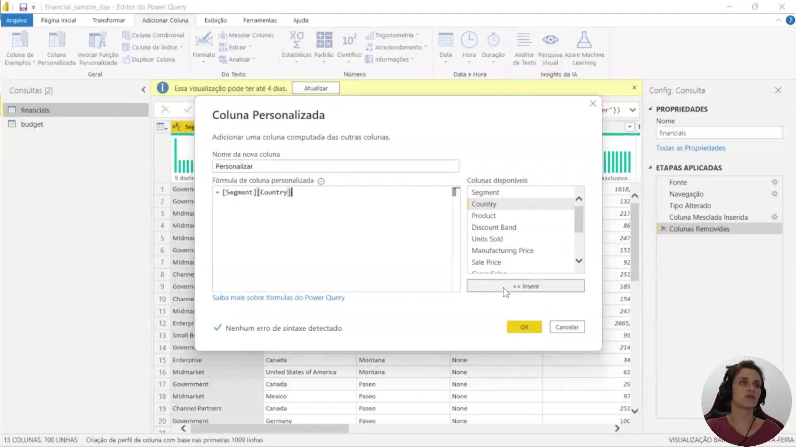
</p>

Por fim, são exibidos elementos do editor do Power Query (fases aplicadas, tipos de transformação e pré-visualização), reforçando que operações no Power Query afetam o modelo antes da carga. Colunas disponíveis Segment Country Product Discount Band Units Sold Manufacturing Price Sale Price.     

### 🟩 Vídeo 09 - Entendendo o Contexto com DAX

<video width="60%" controls>
  <source src="000-Midia_e_Anexos/bootcamp_ntt_data-modulo.08-curso.03-video_09.webm" type="video/webm">
    Seu navegador não suporta vídeo HTML5.
</video>

link do vídeo: https://web.dio.me/track/engenharia-dados-python/course/primeiros-passos-com-dax-e-calculos-com-power-bi/learning/9d32a368-7569-42e7-ac0f-52a4677fa6b2?autoplay=1

O vídeo apresenta o conceito de "contexto" dentro do Power BI, demonstrando como uma única medida DAX pode produzir resultados variados dependendo de como os dados são filtrados, visualizados e interagidos.

### Anotações

<p align="center">
  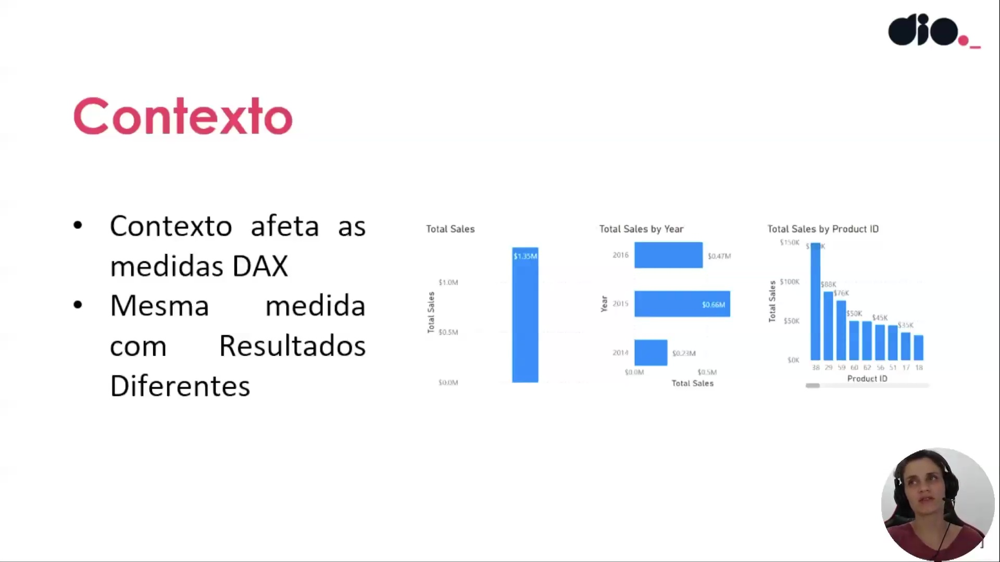
</p>

A imagem mostra um slide conceitual que introduz a ideia central: **o contexto altera o resultado de medidas DAX mesmo quando a fórmula da medida é a mesma**. Visualmente há três cartões/visuais que representam a mesma medida *Total Sales* exibida em diferentes cortes (valor total, por ano e por Product ID), ilustrando que a mesma expressão agregada pode retornar números distintos conforme o contexto de exibição.  

<p align="center">
  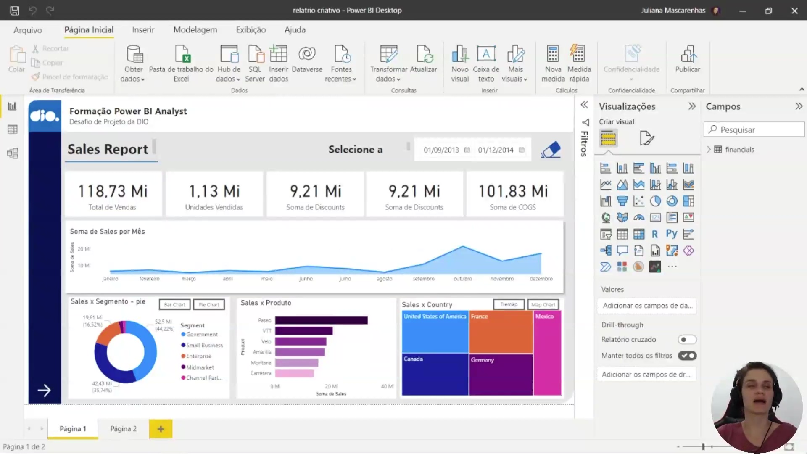
</p>

A captura mostra a interface do Power BI com um relatório aberto e vários visuais de *Sales* (cartões, gráficos de barras, mapas e treemap). O foco desta imagem é demonstrar a interação: ao clicar em um segmento (por exemplo, um país ou produto) o relatório aplica esse elemento como filtro e todos os visuais se atualizam, alterando o contexto em que a medida é avaliada.  

<p align="center">
  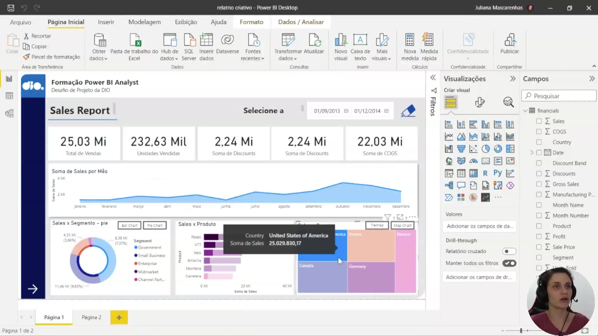
</p>

Esta imagem enfatiza exemplos numéricos e visuais de como *Sales* aparece em diferentes cortes (por segmento, produto e país) dentro do mesmo relatório. Serve para reforçar que, embora a medida seja a mesma (por exemplo, `Total Sales = SUM(Sales[TotalPrice])`), os valores exibidos mudam conforme os filtros aplicados pelos visuais e pela interação do usuário.  

<p align="center">
  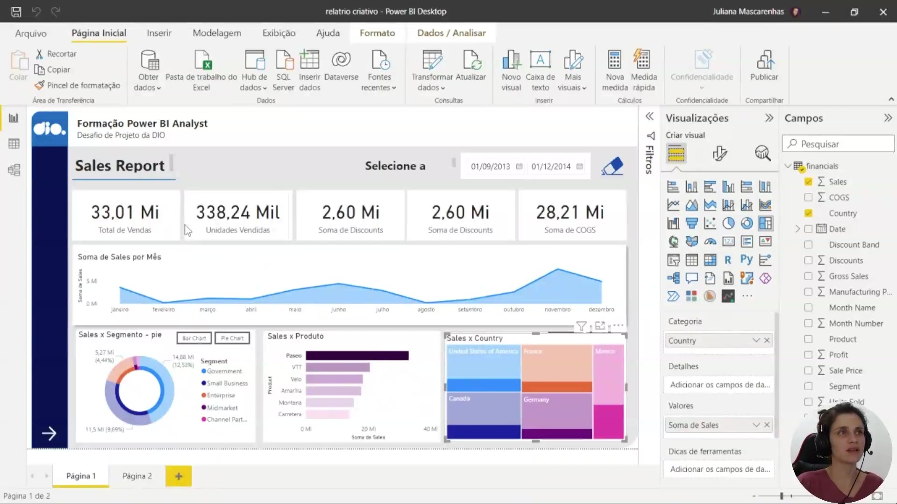
</p>

O slide final sintetiza a classificação dos contextos relevantes para DAX: **contexto de linha, contexto de consulta e contexto de filtro**. Cada tipo atua em um nível diferente — o contexto de linha é inerente à iteração sobre linhas (por exemplo, em colunas calculadas), o contexto de consulta é o conjunto de linhas retornadas por uma expressão, e o contexto de filtro é formado por filtros explícitos (visuais, slicers, `CALCULATE`, etc.).  

### 🟩 Vídeo 10 - Tipos de contextos do Power BI

<video width="60%" controls>
  <source src="000-Midia_e_Anexos/bootcamp_ntt_data-modulo.08-curso.03-video_10.webm" type="video/webm">
    Seu navegador não suporta vídeo HTML5.
</video>

link do vídeo: https://web.dio.me/track/engenharia-dados-python/course/primeiros-passos-com-dax-e-calculos-com-power-bi/learning/22a1d392-0b19-44a1-b271-5a1fdbda11c2?autoplay=1

O vídeo apresenta os conceitos fundamentais de Contexto no Power BI, essencial para entender como as fórmulas DAX (Data Analysis Expressions) se comportam e como os dados são filtrados e calculados dinamicamente.

### Anotações

<p align="center">
  
</p>

Slide introdutório que lista os três tipos de contexto usados em DAX: **contexto de linha**, **contexto de consulta** e **contexto de filtro**. A imagem funciona como um índice conceitual: apresenta que o *contexto* é o mecanismo que permite executar análises dinâmicas em que o resultado de uma fórmula varia conforme a seleção atual (linha/elemento) e os dados relacionados. Esta definição orienta a leitura dos slides seguintes e estabelece o foco didático da aula.  

<p align="center">
  
</p>

Imagem que ilustra o **contexto de linha** e traz um exemplo prático de expressão DAX que combina um valor da linha atual com um valor relacionado em outra tabela. O ponto central é que, no contexto de linha, a avaliação considera a *linha atual* e segue automaticamente as relações entre tabelas para recuperar valores associados (por exemplo, uma taxa por região). O exemplo mostra como usar `RELATED` para buscar um campo em uma tabela relacionada e somá‑lo ao valor da linha atual.  

<p align="center">
  
</p>
 
A imagem contextualiza que essas funções são poderosas e diferentes das funções do Excel, pois operam sobre tabelas e relações, permitindo manipular o contexto de dados para cálculos dinâmicos. Serve como ponte entre a explicação conceitual e a lista concreta de funções que serão usadas para controlar filtros em expressões DAX.  


<p align="center">
  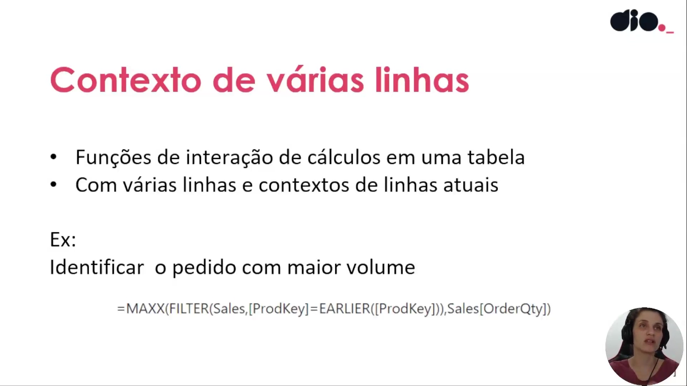
</p>

A ideia é que funções iteradoras (como `MAXX` combinada com `FILTER`) percorrem várias linhas, mantendo contextos de linha internos e externos; `EARLIER` é usado para referenciar o contexto de avaliação anterior (loop externo) durante essa comparação. O foco didático é demonstrar como DAX realiza varreduras e comparações entre contextos de linha para produzir agregações complexas.  

<p align="center">
  
</p>
 
O exemplo mostra uma medida simples de soma (`SUM('Sales'[Profit])`) para explicar que, quando usada como medida, a expressão é avaliada no subconjunto de dados definido pelo contexto de consulta (por exemplo, por região, produto ou segmento), e que esse resultado pode variar conforme esse subconjunto. A imagem reforça a distinção entre medida e coluna calculada no comportamento do contexto.  
 
<p align="center">
  
</p>
  
A imagem apresenta exemplos de funções de manipulação de filtros (por exemplo, `ALLEXCEPT`, `ALL`, `REMOVEFILTERS`, `CALCULATE`, `FILTER`, `KEEPFILTERS`, `SELECTEDVALUE`) e uma tabela-resumo com descrições curtas. O objetivo é mostrar como essas funções alteram o contexto de avaliação para produzir cálculos dinâmicos controlando quais filtros são mantidos, removidos ou substituídos.  

<p align="center">
  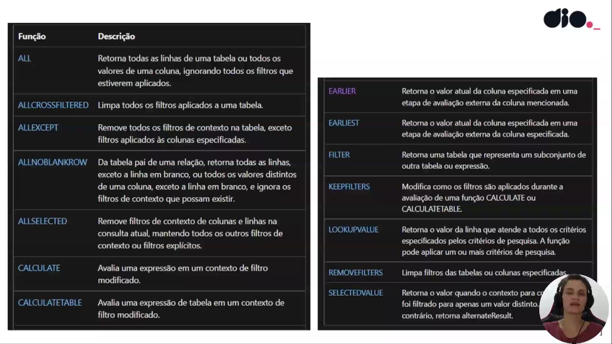
</p>
 
Resumo para consulta rápida durante a prática no Power BI, indicando que o próximo passo é ver exemplos práticos no ambiente e aprofundar o uso de `CALCULATE`, `FILTER`, `ALLEXCEPT` e funções relacionadas.  

### 🟩 Vídeo 11 - Explorando as possibilidades com filtros

<video width="60%" controls>
  <source src="000-Midia_e_Anexos/bootcamp_ntt_data-modulo.08-curso.03-video_11.webm" type="video/webm">
    Seu navegador não suporta vídeo HTML5.
</video>

link do vídeo: https://web.dio.me/track/engenharia-dados-python/course/primeiros-passos-com-dax-e-calculos-com-power-bi/learning/db2d0536-c746-4e31-a90f-71b6ec3f3f66?autoplay=1

O vídeo descreve a aplicação prática de filtros em relatórios do Power BI, diferenciando conceitos de visualização e demonstrando como o "Contexto de Filtro" altera a perspectiva dos dados sem modificar sua estrutura subjacente.

### Anotações

<p align="center">
  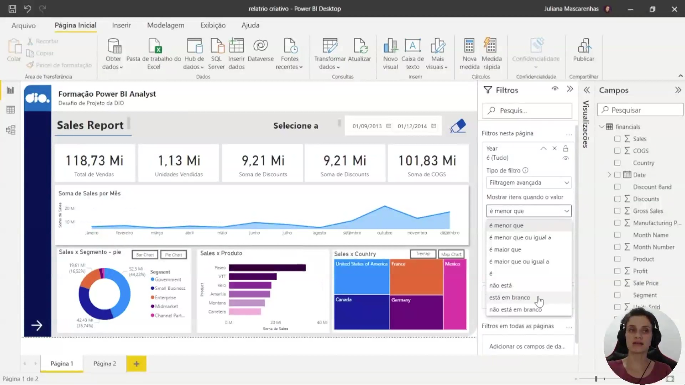
</p>

A captura mostra a interface de um relatório Power BI intitulado **Sales Report** com múltiplos elementos de análise: um seletor de período (date slicer), cartões de KPI (Total de Vendas; Unidades Vendidas; Discounts; COGS), um gráfico de vendas por mês, um gráfico de pizza por segmento, visuais de vendas por produto e um mapa de vendas por país. À direita aparece o painel de **Filtros**, onde se vê o campo **Year** e opções de filtragem (básica e avançada), indicando que o autor demonstra como aplicar filtros a nível de página versus a nível de relatório.  

<p align="center">
  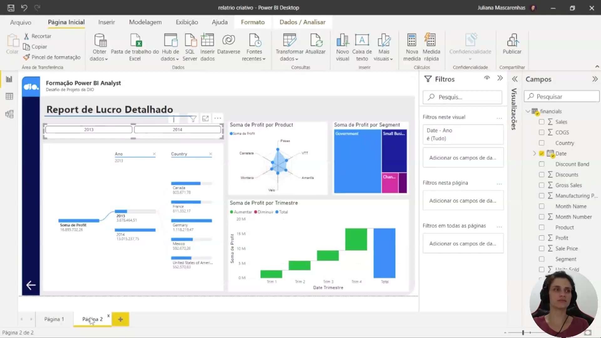
</p>

A imagem apresenta a página de **Report de Lucro Detalhado** com visuais focados em *Profit*: soma de profit por produto, por segmento, por trimestre e por país, além de seletores de ano (2013 / 2014). Observam‑se valores numéricos por país (por exemplo, entradas para Canada, France, Germany, Mexico, United States) e um total agregado de profit, o que indica uma análise de rentabilidade segmentada por dimensões diferentes.  

### 🟩 Vídeo 12 - Contexto em fórmulas

<video width="60%" controls>
  <source src="000-Midia_e_Anexos/bootcamp_ntt_data-modulo.08-curso.03-video_12.webm" type="video/webm">
    Seu navegador não suporta vídeo HTML5.
</video>

link do vídeo: https://web.dio.me/track/engenharia-dados-python/course/primeiros-passos-com-dax-e-calculos-com-power-bi/learning/b1578951-feb2-4396-aa2b-bafd6f1ffb50?autoplay=1

O vídeo explica como o Power BI interpreta e executa fórmulas DAX, destacando a importância do "contexto" — um agrupamento de tabelas, filtros e relacionamentos que define como os dados são calculados. O conteúdo abrange desde a verificação básica de sintaxe até funções avançadas de recursividade como `EARLIER` e `EARLIEST`.

### Anotações

<p align="center">
  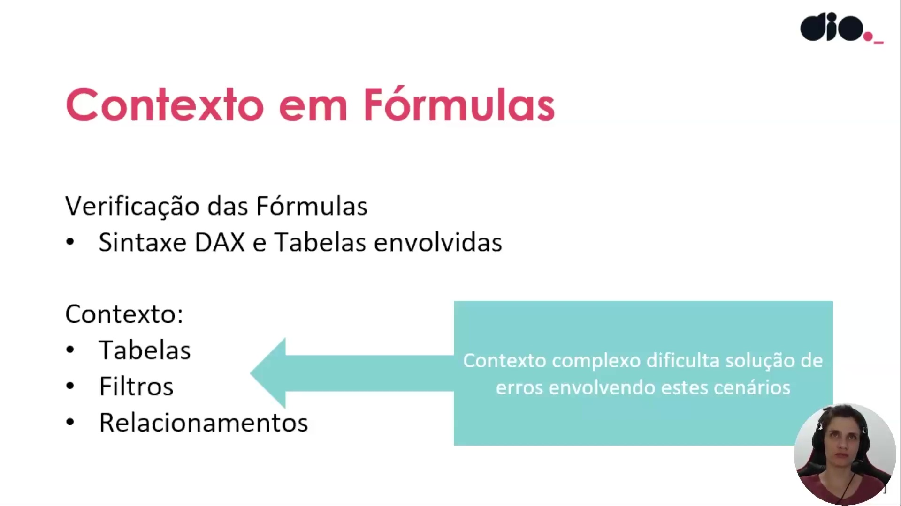
</p>

O slide introduz o conceito de **contexto em fórmulas DAX**. O contexto é formado pela combinação de tabelas, filtros e relacionamentos ativos no momento do cálculo. Antes de executar uma fórmula, o Power BI verifica a sintaxe DAX e a existência das tabelas e colunas referenciadas. Contextos muito complexos dificultam a identificação de erros; por isso, recomenda-se começar com fórmulas simples e restritivas para entender o comportamento do contexto antes de avançar para expressões mais elaboradas.

<p align="center">
  
</p>

Aqui são apresentas duas funções DAX usadas para manipular contexto. **RELATED** expande o contexto da linha atual, permitindo acessar valores de uma coluna em uma tabela relacionada (lado "um" do relacionamento). **FILTER** retorna uma tabela contendo apenas as linhas que atendem a uma condição específica, modificando o contexto atual para incluir somente essas linhas. Ambas são fundamentais para trabalhar com modelos relacionais.

<p align="center">
  
</p>

A instrutora destaca as funções **ALL** e **ALLEXCEPT**. **ALL** remove todos os filtros do contexto atual, ignorando qualquer segmentação ou filtro aplicado pela consulta. **ALLEXCEPT** remove todos os filtros exceto aqueles especificados explicitamente nos argumentos. Essas funções são essenciais para criar cálculos que desconsideram parte do contexto, como totais gerais ou percentuais sobre totais, ajudando a compreender e controlar contextos complexos.

<p align="center">
  
</p>

O slide explica as funções **EARLIER** e **EARLIEST**, usadas principalmente em colunas calculadas. Elas permitem "voltar" a níveis externos de avaliação durante cálculos aninhados, funcionando como uma espécie de loop sobre as linhas da tabela. **EARLIER** aceita um segundo argumento opcional para especificar quantos níveis externos retroceder (1 = nível imediatamente externo, 2 = dois níveis, etc.). **EARLIEST** sempre retorna o valor do nível mais externo. Esses conceitos envolvem recursividade e são úteis para comparações entre linhas ou subconsultas.

<p align="center">
  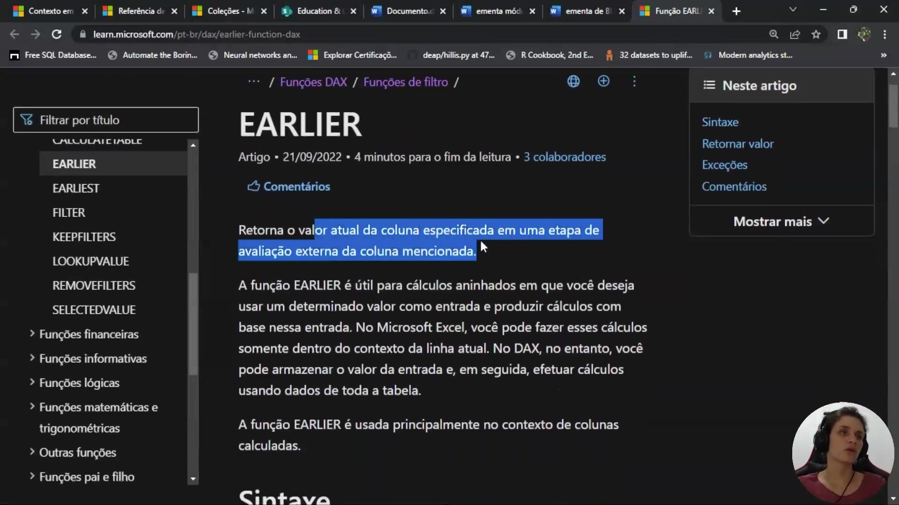
</p>

O slide destaca a documentação oficial da função **EARLIER** no DAX. A sintaxe é `EARLIER(<coluna>[, <número>])`, onde `coluna` é a referência à coluna avaliada e `número` (opcional) indica quantas etapas de avaliação externa retroceder. A função retorna o valor atual da coluna em uma etapa externa à avaliação atual. É útil para cálculos aninhados em que se deseja usar um valor como entrada e produzir cálculos com base nesse valor. No DAX, diferentemente do Excel, essa função é usada principalmente no contexto de colunas calculadas.

### 🟩 Vídeo 13 - Explorando seções de DAX e tipos de funções

<video width="60%" controls>
  <source src="000-Midia_e_Anexos/bootcamp_ntt_data-modulo.08-curso.03-video_13.webm" type="video/webm">
    Seu navegador não suporta vídeo HTML5.
</video>

link do vídeo: https://web.dio.me/track/engenharia-dados-python/course/primeiros-passos-com-dax-e-calculos-com-power-bi/learning/5c549361-0718-46c1-866d-c544e66dd1aa?autoplay=1

Visão geral das funções DAX (Data Analysis Expressions), destacando a importância da documentação oficial da Microsoft e mergulhando em funções específicas como `NETWORKDAYS` e a fundamental `CALCULATE`.

### Anotações

<p align="center">
  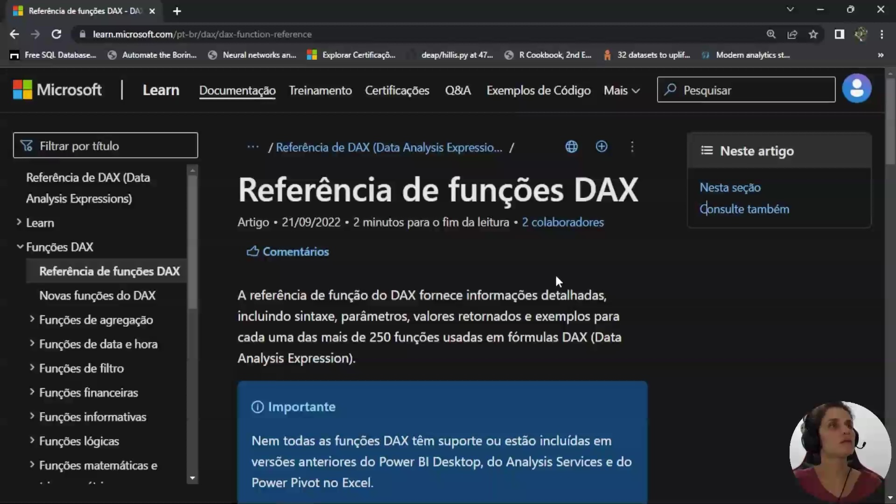
</p>

Esta imagem mostra a **página inicial da referência de funções DAX** na documentação da Microsoft. Ela apresenta o propósito do material: listar e documentar as funções DAX (sintaxe, parâmetros, valor de retorno e exemplos) e indica que a biblioteca contém **mais de 250 funções** usadas em fórmulas DAX. Use esta página como ponto de partida para localizar categorias (data/hora, agregação, filtro, etc.) e para confirmar compatibilidade entre Power BI Desktop, Analysis Services e Power Pivot no Excel.

<p align="center">
  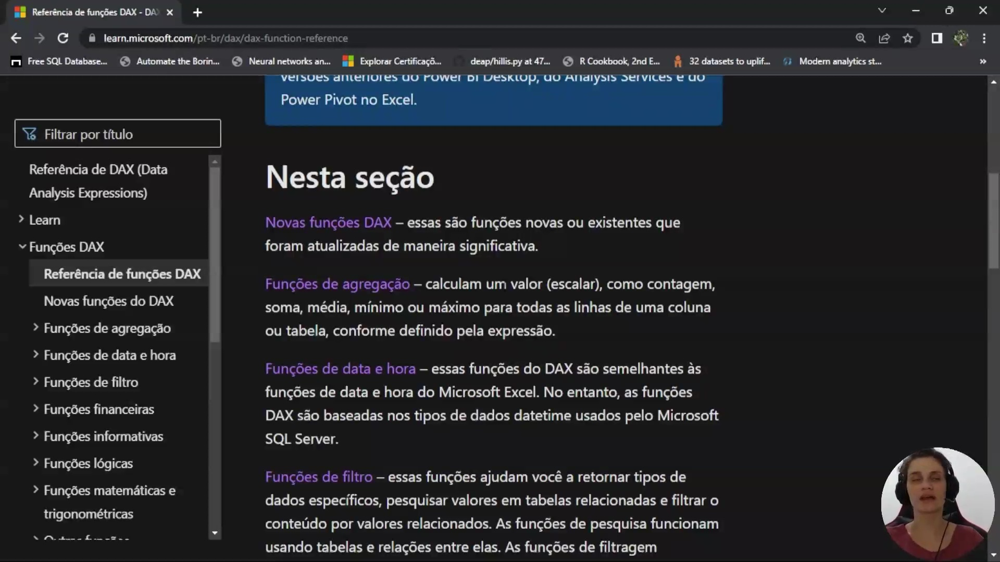
</p>

A imagem destaca a seção **"Novas funções do DAX"** e a organização por categorias. Ela enfatiza que o DAX é atualizado com frequência (novas funções e melhorias) e que a documentação lista apenas as alterações com impacto visível para o usuário. Ao estudar DAX, verifique essa seção para identificar funções recentes e mudanças relevantes para a sua versão do Power BI.

<p align="center">
  
</p>

Aqui aparece uma tabela resumida das **novas funções** (ex.: `NETWORKDAYS`, `BITAND`, `BITLSHIFT`, `BITOR`, `BITRSHIFT`, `BITXOR`) com o mês de introdução e uma breve descrição. Use essa tabela para identificar rapidamente funções que podem resolver problemas específicos (por exemplo, operações bitwise ou cálculo de dias úteis) antes de abrir a página de referência completa de cada função.

<p align="center">
  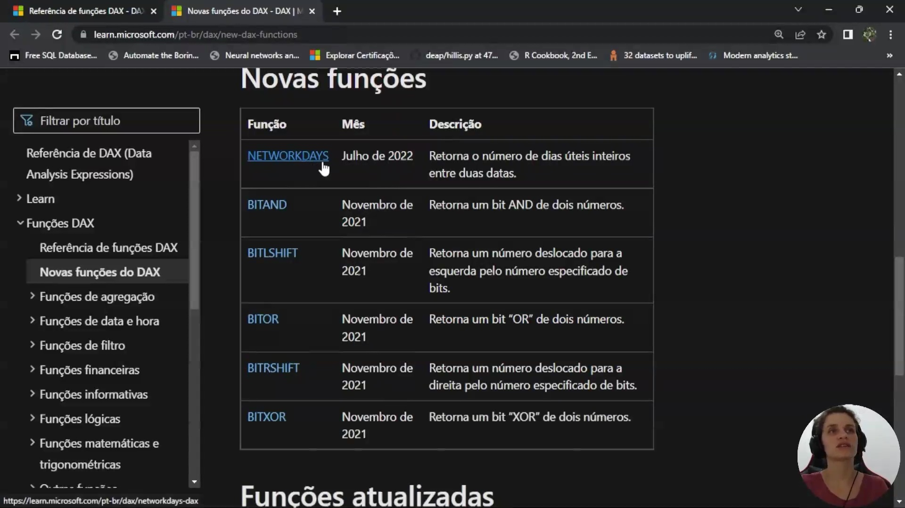
</p>

A imagem mostra o índice da categoria **Funções de data e hora**, listando funções relacionadas (por exemplo, `NETWORKDAYS`, `NOW`, `TODAY`, `WEEKDAY`, `YEARFRAC`). Quando precisar manipular datas ou calcular intervalos, consulte essa seção para escolher a função adequada e revisar parâmetros como formato de data, inclusão/exclusão de extremos e tratamento de feriados.

<p align="center">
  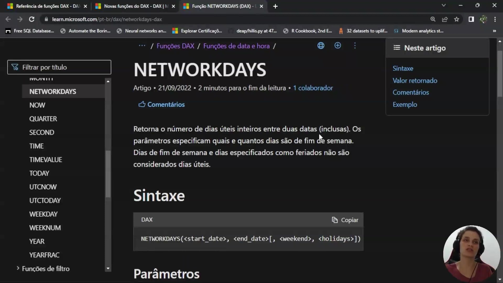
</p>

Esta imagem apresenta a **descrição geral da função `NETWORKDAYS`**: objetivo (retornar número de dias úteis inteiros entre duas datas), comportamento (inclusão das datas de início e fim) e observação sobre como fins de semana e feriados são excluídos do cálculo. Ao usar `NETWORKDAYS`, preste atenção aos parâmetros opcionais que definem quais dias da semana são considerados fim de semana e à tabela de feriados que pode ser passada para exclusão.

<p align="center">
  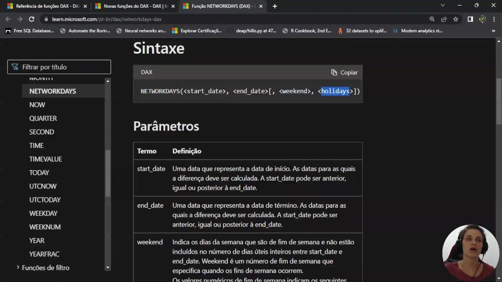
</p>

A imagem detalha os **parâmetros** de `NETWORKDAYS`: `start_date`, `end_date`, `weekend` e `holidays`.  
- **start_date / end_date:** datas que definem o intervalo.  
- **weekend:** código numérico que especifica quais dias da semana são considerados fim de semana (por exemplo, `1` ou omitido = sábado e domingo; `11` = domingo apenas; `17` = sábado apenas).  
- **holidays:** tabela/coluna com datas a excluir do calendário de dias úteis. Configure `weekend` conforme o calendário da sua organização antes de contar dias úteis.

<p align="center">
  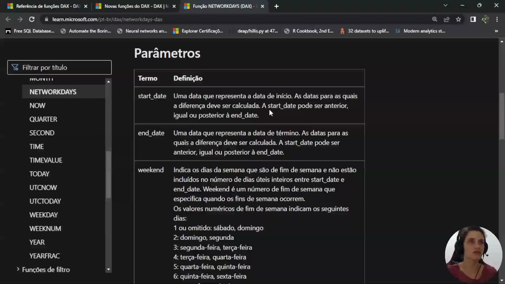
</p>

A imagem lista os **valores possíveis para o parâmetro `weekend`**, mostrando combinações e códigos que permitem adaptar a função a diferentes convenções de fim de semana (ex.: países ou empresas com fins de semana não convencionais). Consulte essa tabela sempre que trabalhar com calendários regionais ou regimes de trabalho que não usem sábado/domingo como fim de semana padrão.

<p align="center">
  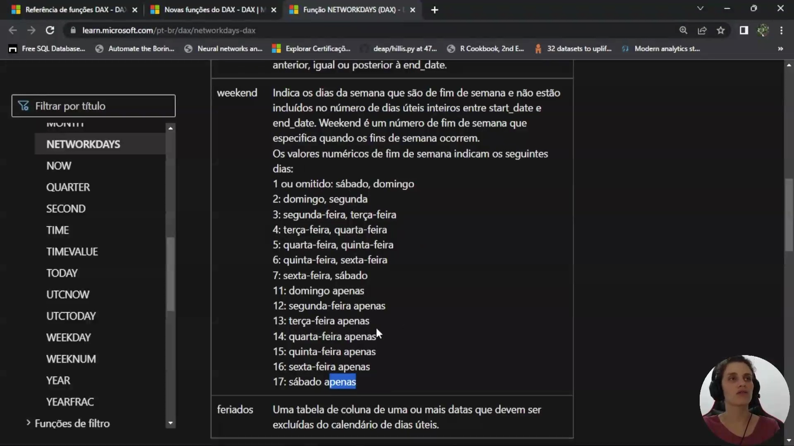
</p>
 
Esta imagem reforça a definição de `weekend` e lembra que **feriados** devem ser passados como uma tabela de datas para serem excluídos do cálculo. Em cenários práticos, mantenha uma tabela de feriados atualizada no modelo e passe-a como argumento para `NETWORKDAYS` para obter contagens corretas de dias úteis.

<p align="center">
  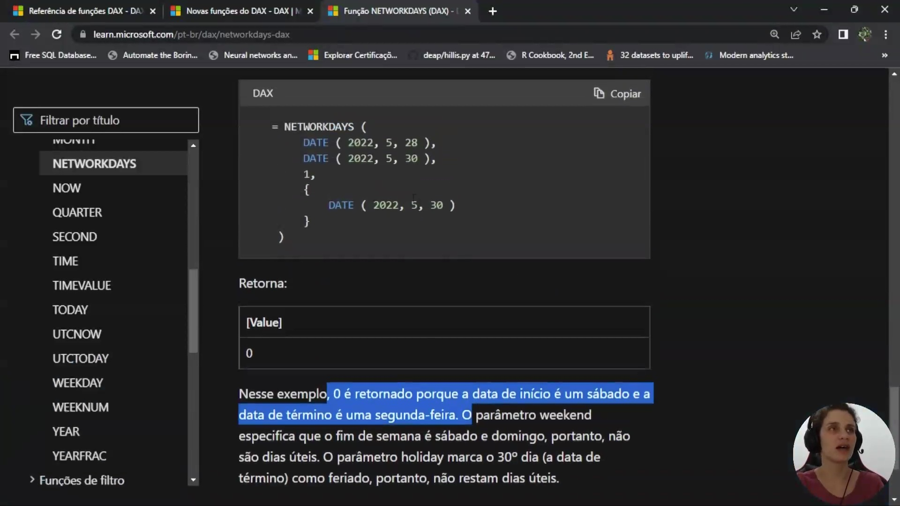
</p>

A imagem mostra um **exemplo prático** de uso da função `NETWORKDAYS` com sintaxe DAX e o resultado retornado. O exemplo ilustra como combinar `start_date`, `end_date`, `weekend` e `holidays` para obter o número de dias úteis entre duas datas, incluindo o caso em que o resultado é zero por causa de fim de semana e feriado.

```dax
= NETWORKDAYS (
  DATE ( 2022, 5, 28 ),
  DATE ( 2022, 5, 30 ),
  1,
  {
    DATE ( 2022, 5, 30 )
  }
)
```

**Observação sobre o exemplo:** o resultado retornado é `0` porque 28/05/2022 é sábado, 30/05/2022 foi marcado como feriado e `weekend = 1` considera sábado e domingo como fim de semana.

<p align="center">
  
</p>

A imagem volta ao índice de **novas funções** e destaca que a documentação também lista funções bitwise (`BITAND`, `BITOR`, `BITXOR`, `BITLSHIFT`, `BITRSHIFT`) — úteis para manipulação de bits e operações de baixo nível em cenários específicos de modelagem ou integração.

<p align="center">
  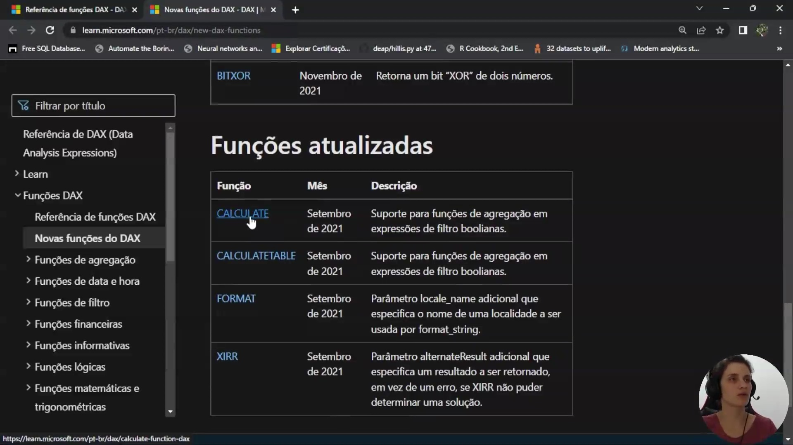
</p>

 
Esta imagem inicia a seção da função **`CALCULATE`**, uma das mais usadas em DAX. Ela indica que `CALCULATE` avalia uma expressão em um **contexto de filtro modificado**, permitindo aplicar filtros adicionais ou substituir filtros existentes para calcular medidas condicionais.


<p align="center">
  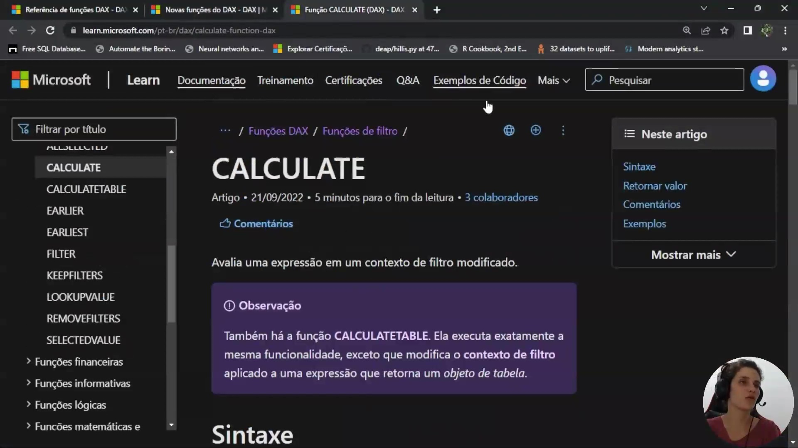
</p>


A imagem apresenta o **índice de funções de filtro** (onde `CALCULATE` e `CALCULATETABLE` aparecem) e lembra que `CALCULATETABLE` tem comportamento análogo ao `CALCULATE`, mas retorna uma tabela em vez de um valor escalar. Use `CALCULATETABLE` quando precisar de uma tabela filtrada como resultado.

<p align="center">
  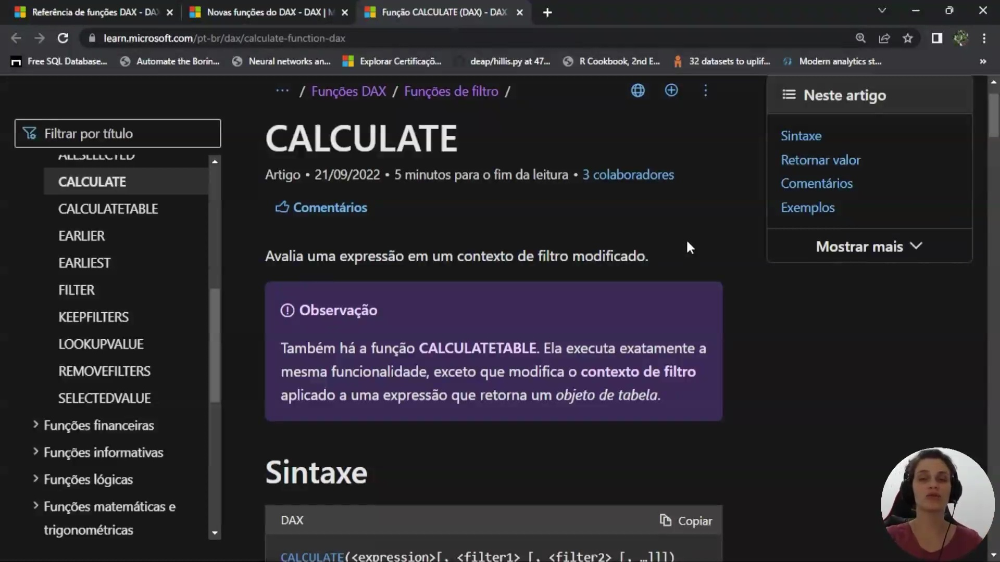
</p>

A imagem mostra a **sintaxe** de `CALCULATE` e os parâmetros principais: a expressão a ser avaliada e filtros opcionais (`filter1`, `filter2`, ...). Esses filtros podem ser expressões booleanas, expressões de tabela ou funções modificadoras de filtro; quando múltiplos filtros são fornecidos, eles são combinados logicamente (AND/OR conforme a expressão).

```dax
CALCULATE(<expression>[, <filter1> [, <filter2> [, ... ]]])
```

<p align="center">
  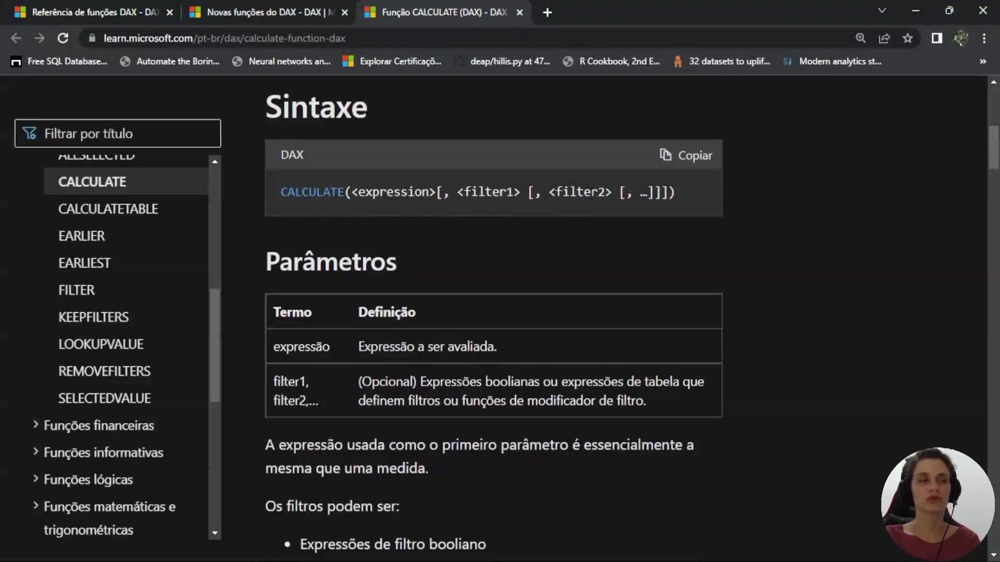
</p>

A imagem detalha **regras e tipos de filtros** aceitos por `CALCULATE`:  
- **Expressões de filtro booleanas** (devem avaliar TRUE/FALSE, não podem referenciar medidas nem usar `CALCULATE` aninhado).  
- **Expressões de filtro de tabela** (objetos de tabela usados como filtros, frequentemente gerados por funções como `FILTER`).  
- **Funções de modificação de filtro** (ex.: `ALL`, `KEEPFILTERS`).  
Essas regras são importantes para evitar erros e garantir que os filtros se comportem conforme esperado.

<p align="center">
  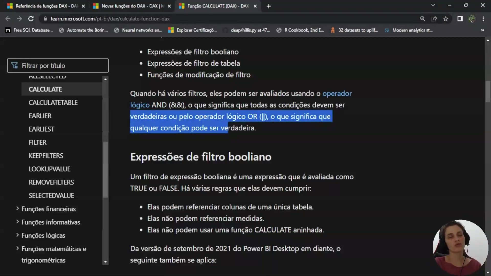
</p>

A imagem lista restrições adicionais introduzidas em atualizações recentes (por exemplo, regras a partir de setembro de 2021): filtros booleanos não podem usar funções que retornam tabelas, a menos que essas tabelas sejam passadas a funções de agregação; porém, agregações escalares são permitidas dentro de filtros booleanos. Verifique a versão do Power BI se encontrar comportamentos diferentes do esperado.

<p align="center">
  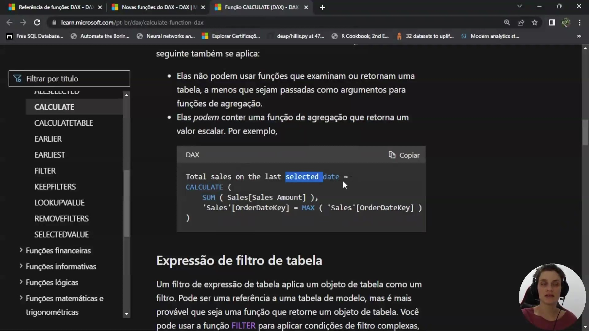
</p>

A imagem ilustra um **exemplo prático** de uso de `CALCULATE` com uma agregação dentro de uma expressão de filtro (uso de `MAX` dentro do filtro). Esse padrão é comum para calcular valores condicionais com base em um valor agregado do contexto atual.

```dax
Total sales on the last selected date =
CALCULATE (
  SUM ( Sales[Sales Amount] ),
  'Sales'[OrderDateKey] = MAX ( 'Sales'[OrderDateKey] )
)
```

<p align="center">
  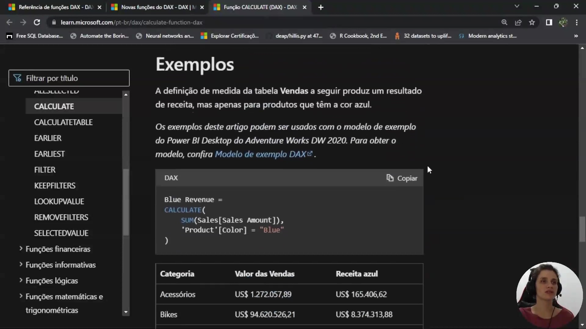
</p>

A imagem final mostra um **exemplo de medida** (`Blue Revenue`) que usa `CALCULATE` para somar vendas apenas para produtos com cor azul. É um exemplo direto de como `CALCULATE` aplica filtros de coluna para produzir medidas condicionais no modelo.

```dax
Blue Revenue =
CALCULATE(
  SUM(Sales[Sales Amount]),
  'Product'[Color] = "Blue"
)
```

### 🟩 Vídeo 14 - Explorando as funções existentes de: agregação, data e hora, lógicas e outros

<video width="60%" controls>
  <source src="000-Midia_e_Anexos/bootcamp_ntt_data-modulo.08-curso.03-video_14.webm" type="video/webm">
    Seu navegador não suporta vídeo HTML5.
</video>

link do vídeo: https://web.dio.me/track/engenharia-dados-python/course/primeiros-passos-com-dax-e-calculos-com-power-bi/learning/ecc60d49-acfa-4c69-8c15-0377562e0070?autoplay=1

Este vídeo as principais categorias de funções DAX, detalhando como cada uma contribui para a criação de medidas e colunas calculadas eficientes no Power BI. O DAX é a linguagem fundamental para transformar dados brutos em insights de negócio.

### Anotações

<p align="center">
  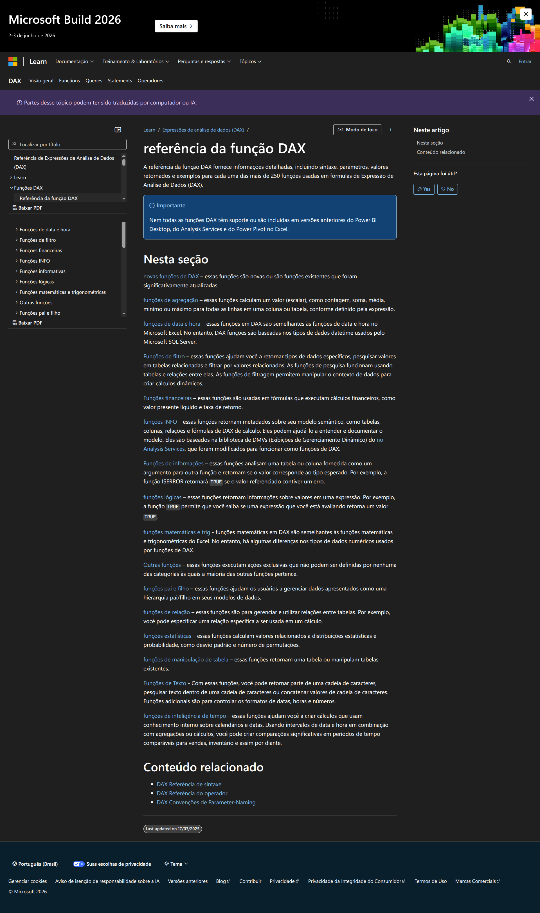
</p>

#### Referência de Funções DAX

Documentação detalhada para mais de 250 funções utilizadas em fórmulas de Expressão de Análise de Dados (DAX). Ela atua como um guia completo que detalha sintaxe, parâmetros, valores de retorno e exemplos para cada função.

> **Aviso de Compatibilidade:** Nem todas as funções DAX têm suporte ou estão disponíveis em versões mais antigas do Power BI Desktop, do SQL Server Analysis Services e do Power Pivot no Excel.

##### Quadro de Categorias de Funções

A documentação divide as funções DAX nas seguintes categorias, dependendo de suas finalidades:

| Categoria | Descrição |
| :--- | :--- |
| **Novas funções de DAX** | Agrupa funções recém-adicionadas à linguagem ou funções já existentes que receberam atualizações significativas. |
| **Funções de agregação** | Calculam um valor escalar (como soma, contagem, média, mínimo ou máximo) para todas as linhas de uma coluna ou tabela. |
| **Funções de data e hora** | Semelhantes às funções do Excel, mas baseiam-se nos tipos de dados *datetime* padronizados pelo Microsoft SQL Server. |
| **Funções de filtro** | Permitem pesquisar valores em tabelas, filtrar dados por relações e manipular o contexto de avaliação de dados para a criação de cálculos dinâmicos. |
| **Funções financeiras** | Utilizadas na execução de cálculos financeiros, como taxas de retorno e valor presente líquido. |
| **Funções INFO** | Retornam metadados sobre o modelo semântico (tabelas, colunas, relações). São baseadas em Exibições de Gerenciamento Dinâmico (DMVs) do Analysis Services. |
| **Funções de informações** | Analisam se um valor em uma tabela ou coluna corresponde a um tipo esperado (por exemplo, a função `ISERROR` para detectar erros). |
| **Funções lógicas** | Retornam informações ou resultados booleanos com base na avaliação de expressões. |
| **Funções matemáticas e trigonométricas** | Executam cálculos matemáticos (muito semelhantes ao Excel), mas com comportamentos adaptados aos tipos numéricos do DAX. |
| **Funções pai e filho** | Ajudam a gerenciar e extrair métricas de dados estruturados em uma hierarquia de modelo pai/filho. |
| **Funções de relação** | Servem para gerenciar, invocar ou utilizar ativamente as relações estabelecidas entre as tabelas durante os cálculos. |
| **Funções estatísticas** | Calculam valores ligados a probabilidades e distribuições estatísticas, como desvio padrão e permutações. |
| **Funções de manipulação de tabela** | Realizam operações que retornam tabelas inteiras como resultado ou manipulam a estrutura/conteúdo de tabelas já existentes. |
| **Funções de Texto** | Executam operações com cadeias de caracteres, como concatenar, buscar textos, extrair partes da *string* e controlar formatos de datas/números. |
| **Funções de inteligência de tempo** | Utilizam o motor de calendário e datas do DAX para facilitar a criação de comparações de períodos e métricas acumuladas (ex: vendas de um período com o mesmo período do ano anterior). |
| **Outras funções** | Agrupa operações ou ações exclusivas do sistema que não se encaixam naturalmente nas categorias acima. |

      
Link: https://learn.microsoft.com/pt-br/dax/dax-function-reference

### 🟩 Vídeo 15 - Explorando funções de informação e inteligência de dados temporais

<video width="60%" controls>
  <source src="000-Midia_e_Anexos/bootcamp_ntt_data-modulo.08-curso.03-video_15.webm" type="video/webm">
    Seu navegador não suporta vídeo HTML5.
</video>

link do vídeo: https://web.dio.me/track/engenharia-dados-python/course/primeiros-passos-com-dax-e-calculos-com-power-bi/learning/64f32a9d-c802-496d-8482-cb5bc7fb2112?autoplay=1

O vídeo apresenta uma visão panorâmica das diversas categorias de funções DAX, a lógica por trás de sua aplicação e como utilizá-las para transformar dados brutos em informações significativas dentro do Power BI. O instrutor enfatiza que, embora o DAX seja uma linguagem de alto nível (quase um "pseudocódigo"), sua aplicação exige bom senso, especialmente no que diz respeito à performance do relatório.

### Anotações

#### 📂 Tópicos Principais

##### 1. Funções de Informação e Lógica
As funções de informação permitem examinar atributos de uma tabela ou coluna para verificar se correspondem a um tipo esperado.
*   **Lógica Booleana:** Uso de operadores como `AND`, `OR`, `XOR` e `NOT`.
*   **BITAND:** Uma função específica que retorna o "Bitwise AND" de dois números (ex: `BITAND(13, 11)` resulta em 9).
*   **Verificação de Dados:** Capacidade de verificar se uma coluna contém um determinado valor ou estatística específica.

##### 2. Estruturas Condicionais (`IF` e `SWITCH`)
O DAX permite criar fluxos lógicos para tratar dados ausentes ou categorizar informações.
*   **Função IF:** Utilizada para testes lógicos simples (ex: se um campo estiver em branco, não mostre nada; caso contrário, mostre o valor).
*   **Função SWITCH:** Uma alternativa mais limpa ao `IF` aninhado. É ideal para mapear valores, como transformar o número do mês (1, 2, 3) em nomes (Janeiro, Fevereiro, Março), incluindo uma cláusula `ELSE` para valores desconhecidos.

##### 3. Funções Matemáticas, Trigonométricas e de Texto
*   **Matemática:** Além das operações básicas, o DAX oferece funções avançadas como `ACOS`, `ASIN` e `LOG`. A função `CURRENCY` é usada para converter dados para o formato de moeda.
*   **Texto (Strings):** Funções para manipular cadeias de caracteres, como `CONCATENATE`, `LEFT`, `REPLACE`, `SEARCH` e `FIND`.
    *   *Diferença importante:* `SEARCH` localiza a posição de um caractere específico, enquanto `FIND` procura uma cadeia de texto dentro de outra.

##### 4. Manipulação de Tabelas e Performance
O DAX é fortemente baseado no modelo relacional (SQL).
*   **Operações de Tabela:** Funções como `CROSSJOIN` (produto cartesiano), `DISTINCT` (valores únicos), `EXCEPT` (diferença entre tabelas) e `FILTER`.
*   **SUMMARIZE vs. GROUPBY:** Ambas agrupam dados, mas possuem comportamentos diferentes em relação a cálculos implícitos.
*   **Performance:** O instrutor alerta que recursos nativos da interface do Power BI são mais "compactados" e performáticos que expressões DAX complexas. A regra de ouro é: **use a interface sempre que possível; use DAX quando necessário.**

##### 5. Inteligência de Dados Temporais (Time Intelligence)
Esta é uma das categorias mais vitais para análise de negócios, permitindo comparar períodos e tendências.
*   **Funções de Balanço:** `CLOSINGBALANCEMONTH`, `QUARTER` e `YEAR`.
*   **Criação de Calendários:** Uso de `CALENDAR` e `CALENDARAUTO` para gerar tabelas de datas dinâmicas.
*   **Acumulados:** Funções como `MTD` (Month-to-Date), `QTD` (Quarter-to-Date) e `YTD` (Year-to-Date) para analisar o desempenho acumulado até o momento.

#### 💡 Insights Relevantes

*   **DAX como Pseudocódigo:** Embora a Microsoft a classifique como uma linguagem, ela pode ser interpretada como um pseudocódigo de alto nível, facilitando a leitura para quem já tem lógica de programação.
*   **A Utilidade da Escala Logarítmica:** O uso da função `LOG` é um insight poderoso para visualização de dados. Quando há uma variação muito grande entre os valores (dados muito pequenos misturados com dados muito grandes), a escala logarítmica ajuda a tornar o gráfico inteligível.
*   **Visão Temporal vs. Snapshot:** Dados temporais são superiores a "snapshots" (fotos estáticas). Enquanto um snapshot mostra o total de vendas, a inteligência temporal permite ver a *saúde* da empresa, identificando se ela está crescendo ou declinando ao longo dos meses.
*   **Modelagem Star Schema:** Para melhor performance, deve-se buscar modelar os dados em um esquema de estrela (*Star Schema*) antes de aplicar DAX pesado. Isso envolve processos de ETL (Extração, Transformação e Carga) eficientes.
*   **Granularidade:** O DAX permite manipular a granularidade dos dados. É possível criar tabelas com menos detalhes (ex: apenas ano e mês) usando produtos cartesianos para simplificar análises de metas anuais.
*   **Documentação é Fundamental:** Dada a vastidão de funções, o instrutor recomenda o uso constante da documentação oficial da Microsoft para consultar sintaxe e exemplos práticos.

Link: https://learn.microsoft.com/pt-br/dax/information-functions-dax      


### 🟩 Vídeo 16 - Criando mais medidas com DAX – CALCULATE, SUM e Funções DATE

<video width="60%" controls>
  <source src="000-Midia_e_Anexos/bootcamp_ntt_data-modulo.08-curso.03-video_16.webm" type="video/webm">
    Seu navegador não suporta vídeo HTML5.
</video>

link do vídeo: https://web.dio.me/track/engenharia-dados-python/course/primeiros-passos-com-dax-e-calculos-com-power-bi/learning/95ea99a8-08b7-454e-8927-cf84b36bfe2a?autoplay=1

Aplicação prática de expressões DAX (*Data Analysis Expressions*) no Power BI, com ênfase na organização de medidas e no uso da função `CALCULATE` para filtragem temporal.

### Anotações

<p align="center">
  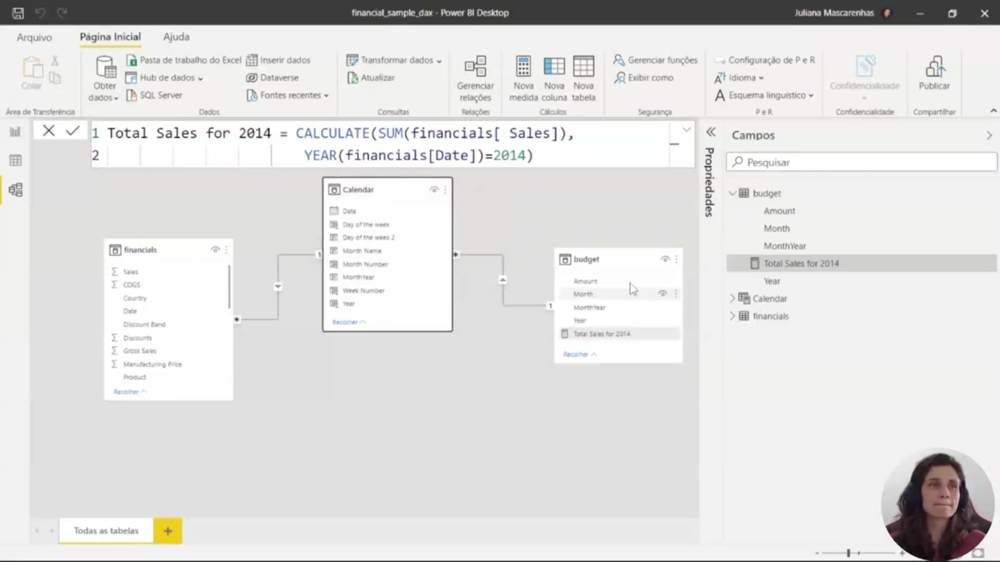
</p>

Soma-se a coluna **Sales** aplicando um filtro para o ano de 2014, usando a função **CALCULATE** e a função de data **YEAR**.  

`Total Sales for 2014 = CALCULATE(SUM(financials[ Sales]), YEAR(financials[Date])=2014)`. 

A medida apresentada aplica primeiro a agregação `SUM(financials[Sales])` e, em seguida, restringe o contexto de avaliação ao conjunto de linhas cuja data pertence a 2014. Na prática, isso permite reutilizar a mesma medida em visuais e painéis, garantindo que o valor exibido represente apenas as vendas daquele ano específico.

<p align="center">
  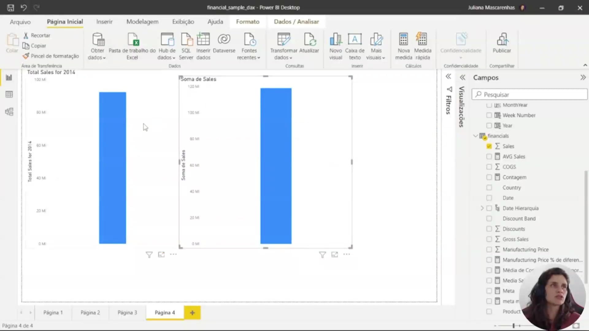
</p>

A segunda imagem apresenta os visuais do relatório (gráficos de barras e cartões) mostrando o resultado da medida **Total Sales for 2014** aplicada ao relatório: os elementos visuais exibem o total agregado de vendas restrito a 2014, com rótulos de magnitude (por exemplo, **120 M**) no eixo/indicador. Esse slide ilustra como a medida DAX criada anteriormente se materializa em um visual do relatório, confirmando que o filtro por ano funcionou conforme o esperado.  

O ponto-chave é entender a separação entre **cálculo** (a medida DAX) e **apresentação** (o visual). A medida encapsula a lógica (soma + filtro por ano) e qualquer visual que a consuma exibirá automaticamente o valor filtrado, sem necessidade de recriar a lógica no próprio visual.      

### 🟩 Vídeo 17 - Realizando considerações e explorando as medidas DAX

<video width="60%" controls>
  <source src="000-Midia_e_Anexos/bootcamp_ntt_data-modulo.08-curso.03-video_17.webm" type="video/webm">
    Seu navegador não suporta vídeo HTML5.
</video>

link do vídeo: https://web.dio.me/track/engenharia-dados-python/course/primeiros-passos-com-dax-e-calculos-com-power-bi/learning/934d63d8-e0ba-4db7-be0d-6ee9d73664e0?autoplay=1

O vídeo orienta sobre a criação de medidas personalizadas utilizando a linguagem DAX (Data Analysis Expressions), destacando funções de agregação, filtros inteligentes e a importância da documentação técnica para o desenvolvimento de dashboards preciso.

### Anotações

<p align="center">
  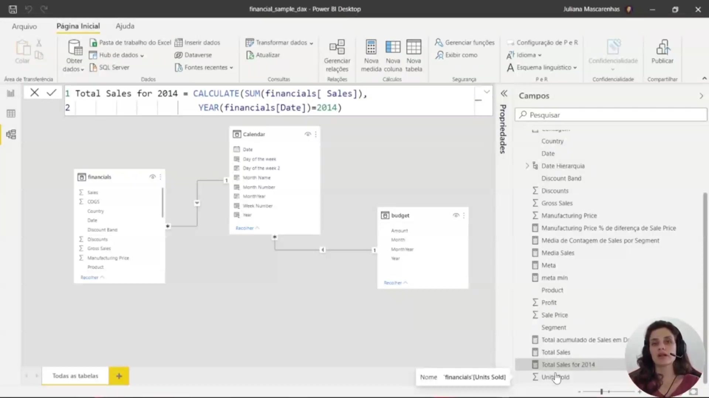
</p>

Nesta imagem vemos a criação de uma medida em DAX para calcular o total de vendas em 2014. O código utiliza a função `CALCULATE` junto com `SUM` e um filtro de ano:

```dax
Total Sales for 2014 = CALCULATE(
    SUM(financials[Sales]),
    YEAR(financials[Date]) = 2014
)
```

Essa medida retorna a soma das vendas apenas para o ano de 2014, permitindo análises específicas por período.
 
<p align="center">
  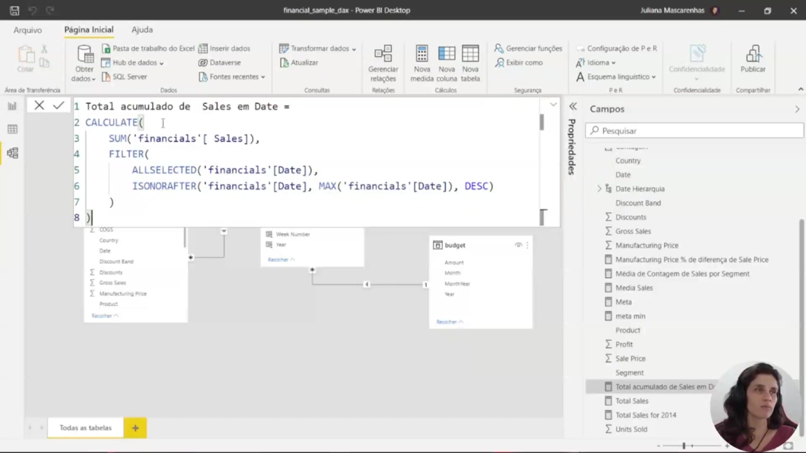
</p>

Aqui temos uma medida de vendas acumuladas ao longo do tempo. O Power BI gera automaticamente uma expressão em DAX que combina `CALCULATE`, `SUM`, `FILTER` e a função booleana `ISONORAFTER`:

```dax
Total acumulado de Sales em Date =
CALCULATE(
    SUM('financials'[Sales]),
    FILTER(
        ALLSELECTED('financials'[Date]),
        ISONORAFTER('financials'[Date], MAX('financials'[Date]), DESC)
    )
)
```

Essa medida soma as vendas de forma acumulada, respeitando o contexto de seleção de datas.

<p align="center">
  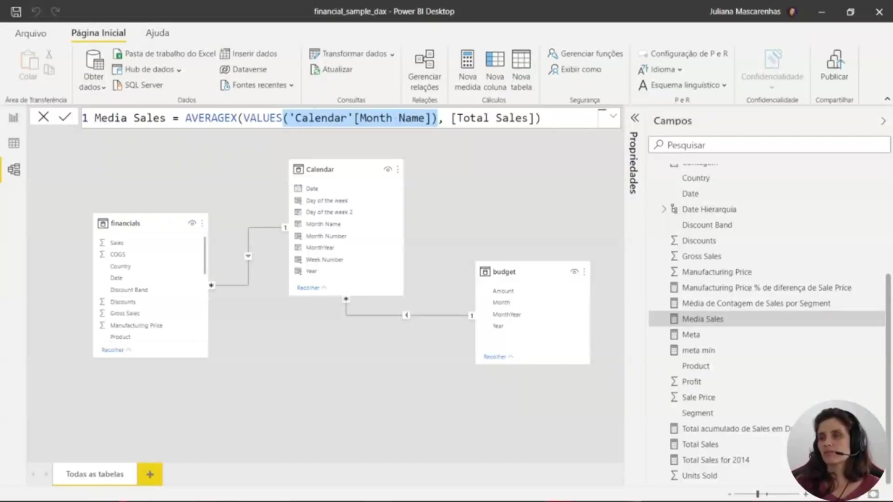
</p>

A imagem mostra a criação de uma medida de média de vendas por mês. O DAX utilizado é:

```dax
Media Sales =
AVERAGEX(
    VALUES('Calendar'[Month Name]),
    [Total Sales]
)
```

Essa fórmula calcula a média das vendas totais considerando os meses distintos, retornados pela função `VALUES`.


<p align="center">
  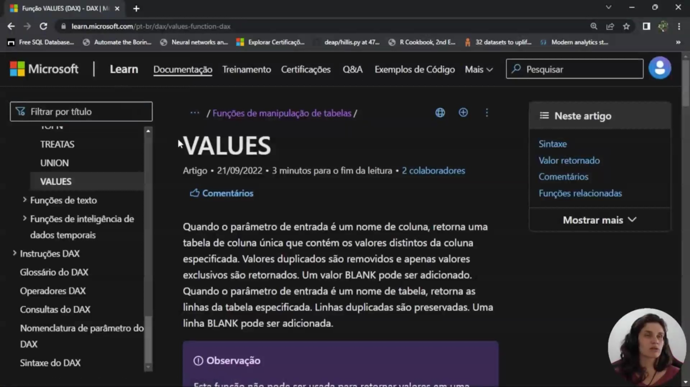
</p>

Aqui vemos a documentação da função `VALUES` em DAX. Ela retorna valores distintos de uma coluna ou todas as linhas de uma tabela. Um exemplo prático é contar o número de faturas únicas:

```dax
= COUNTROWS(VALUES('InternetSales_USD'[SalesOrderNumber]))
```

Esse código retorna a quantidade de ordens de venda distintas, útil para análises de volume de transações.
 

<p align="center">
  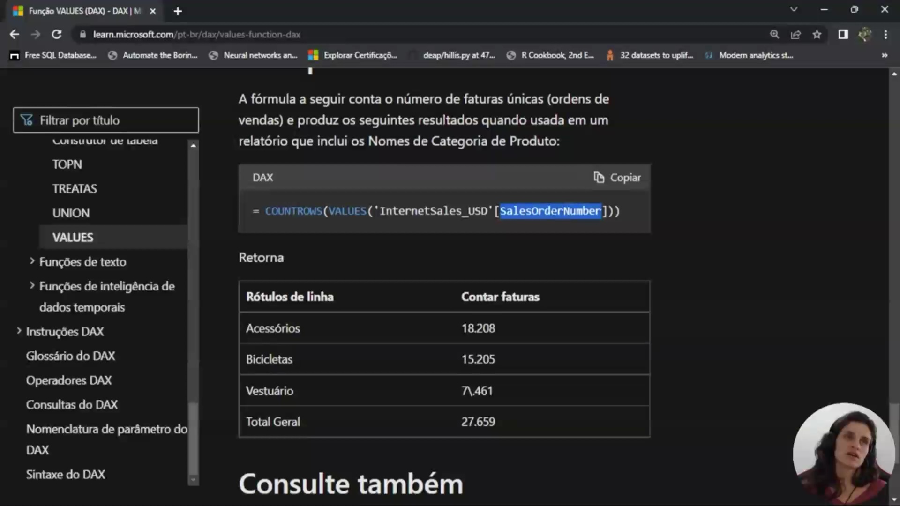
</p>

A imagem mostra os resultados da medida anterior aplicada em categorias de produtos. O cálculo de `COUNTROWS(VALUES(...))` gera a contagem de faturas por categoria, como acessórios, bicicletas e vestuário, permitindo visualizar o total de pedidos únicos por segmento.

<p align="center">
  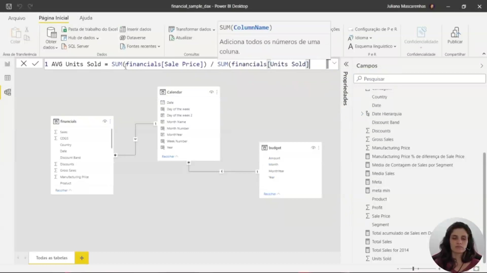
</p>

Nesta etapa, é criada uma medida para calcular a média de preço por unidade vendida. O DAX utilizado é:

```dax
AVG Units Sold =
SUM(financials[Sale Price]) /
SUM(financials[Units Sold])
```

Essa medida divide o valor total das vendas pelo número de unidades vendidas, resultando em um preço médio por unidade.
 

<p align="center">
  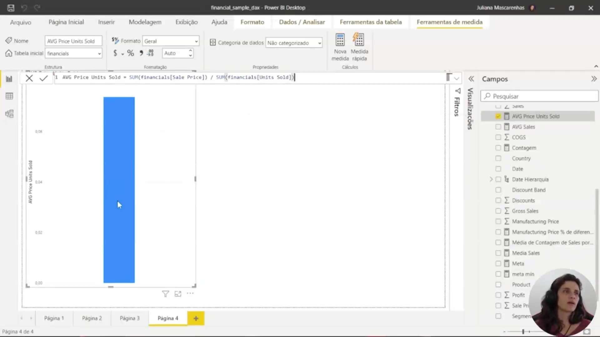
</p>

A última imagem mostra a medida `AVG Price Units Sold` sendo aplicada em um gráfico. O cálculo reflete a média de preço por unidade vendida, permitindo visualizar a variação desse indicador ao longo do tempo ou em diferentes categorias de produtos.      

### 🟩 Vídeo 18 - Criando uma página do relatório com as novas medidas

<video width="60%" controls>
  <source src="000-Midia_e_Anexos/bootcamp_ntt_data-modulo.08-curso.03-video_18.webm" type="video/webm">
    Seu navegador não suporta vídeo HTML5.
</video>

link do vídeo: https://web.dio.me/track/engenharia-dados-python/course/primeiros-passos-com-dax-e-calculos-com-power-bi/learning/3c7fb8e4-a2d9-424c-8223-6263636ddfb2?autoplay=1

O vídeo trata da aplicação prática de medidas DAX, na importância do contexto de filtro e na personalização de visuais para criar dashboards interativos e informativos. O instrutor demonstra como as medidas se comportam dinamicamente conforme o usuário interage com o relatório.

### Anotações

<p align="center">
  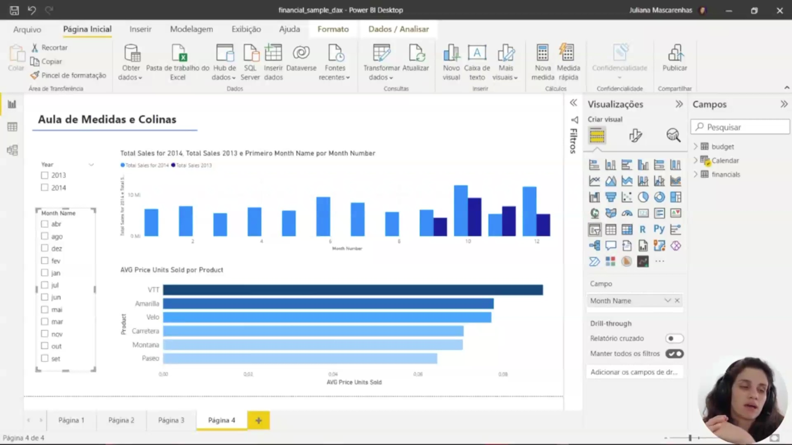
</p>

Este slide mostra a interface do Power BI com um gráfico de barras configurado para exibir **Total Sales for 2014** por **Month Name**. Observe os painéis laterais de **Campos** e **Filtros**: a explicação visual destaca que a ordenação por nome de mês pode ficar fora da sequência cronológica (ordem alfabética) se não houver um campo numérico de ordenação (por exemplo, *Month Number*). A lição prática é: quando precisar de ordem temporal correta, associe o rótulo textual a um campo numérico de ordenação.

<p align="center">
  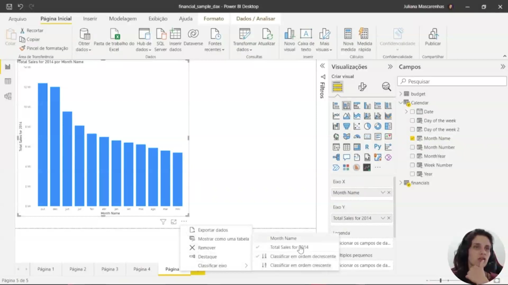
</p>

Aqui vemos o mesmo gráfico com opções de formatação e classificação abertas. O destaque é para os controles de **Classificar eixo**, **Eixo X / Eixo Y** e propriedades de título. A imagem ilustra como alterar o eixo para contínuo/categórico, ajustar rótulos e usar o **Month Number** como eixo enquanto mantém **Month Name** nas dicas de ferramenta — técnica que preserva a leitura cronológica sem perder o rótulo amigável.

<p align="center">
  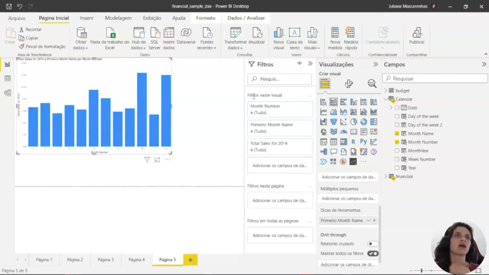
</p>

Este recorte mostra o painel de **Filtros** aplicado ao visual: filtros no nível do visual, da página e de todas as páginas. A imagem evidencia que uma medida pode ser afetada por filtros em diferentes níveis e que é possível inspecionar quais campos estão disponíveis para filtragem (por exemplo, *Month Number*, *Primeiro Month Name*, *Total Sales for 2014*). Use esse painel para entender o **contexto de filtro** que está influenciando a medida exibida.

<p align="center">
  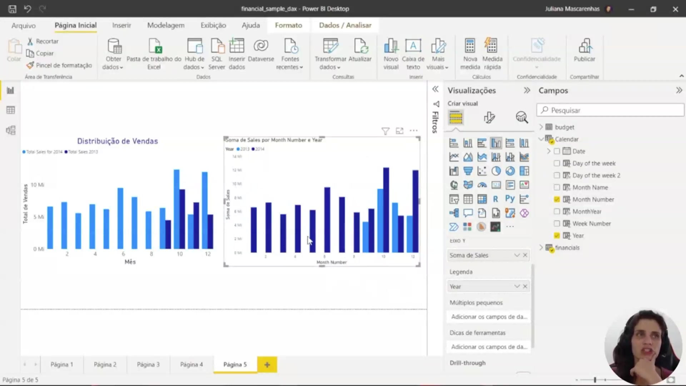
</p>

Slide conceitual que compara duas abordagens: (1) criar medidas específicas (ex.: *Total Sales for 2014*) e usá‑las nos visuais; (2) usar o campo bruto *Sales* e aplicar filtros de data no visual. A imagem sugere que medidas pré‑definidas oferecem maior reuso e previsibilidade (podem ser referenciadas em outros cálculos), enquanto o uso direto do campo bruto depende do contexto do visual e da agregação aplicada.

<p align="center">
  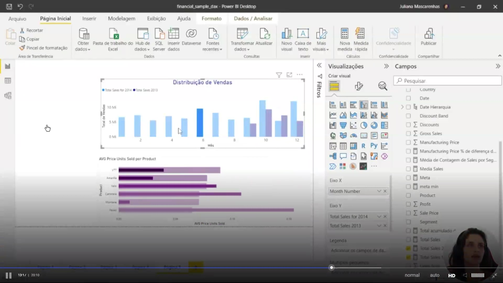
</p>

Este trecho mostra um visual de barras configurado para **Average Price Units Sold por Product** e o painel de formatação de cores/estilo. A explicação prática: ao transformar um escalar (métrica única) em uma dimensão (por produto), o Power BI recalcula a medida por contexto — aqui evidenciado pela variação entre produtos (ex.: VTT com maior média). Também ilustra como a escolha de cores e tipo de visual melhora a inteligibilidade.

<p align="center">
  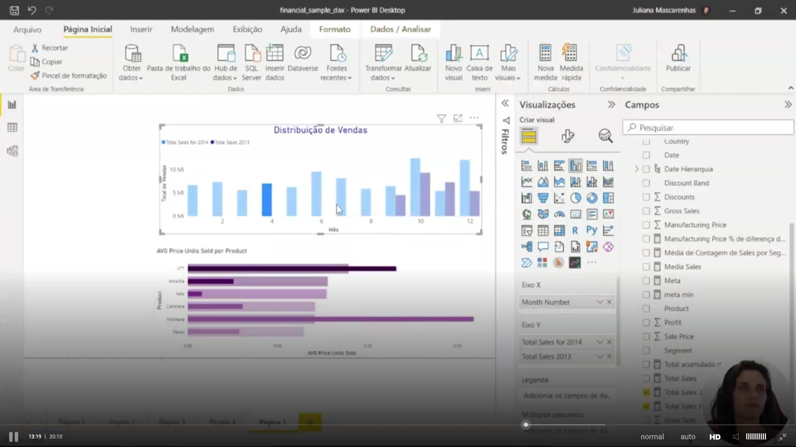
</p>

A imagem mostra a criação e o comportamento de **segmentadores** (slicers) para *Year* e *Month Name*, além da dificuldade de ordenar meses quando o slicer usa apenas o nome textual. A recomendação visual é usar um par (Month Number + Month Name) ou ordenar o campo de texto por um campo numérico para manter a sequência cronológica nos segmentadores e nos eixos dos gráficos.

<p align="center">
  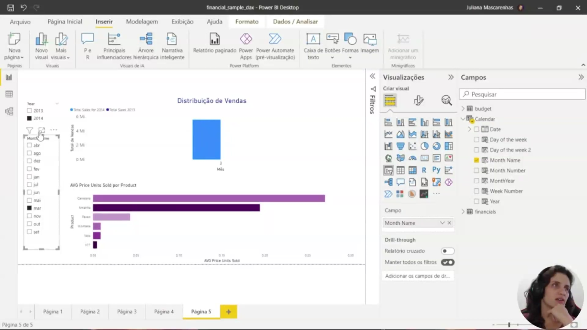
</p>

Este slide reúne vários visuais do relatório (distribuição de vendas, soma por mês, filtros ativos) e enfatiza a interatividade: selecionar ano/mês em um segmentador altera automaticamente os visuais relacionados, mostrando como o **contexto de filtro** impacta resultados agregados e rankings por produto. Use essa configuração para explorar variações temporais e comparar períodos lado a lado (barras clusterizadas vs. empilhadas).

<p align="center">
  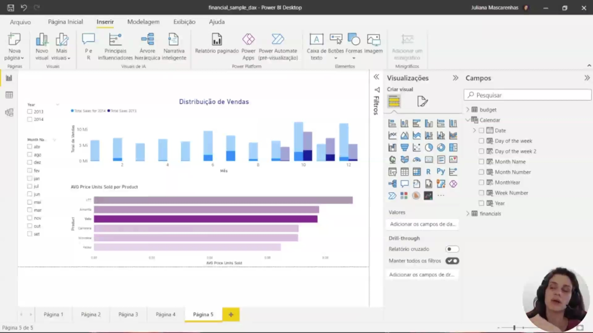
</p>

Imagem final que sintetiza o painel: lista de campos, visuais e filtros aplicados, com foco em **Distribuição de Vendas** e **AVG Price Units Sold por Product**. Serve como referência prática para montar relatórios interativos: defina medidas reutilizáveis, controle ordenação temporal com campos numéricos, e use segmentadores bem projetados para manter clareza e permitir análises ad hoc sem distorcer as medidas por contexto.

### 🟩 Vídeo 19 - Outros recursos do DAX

<video width="60%" controls>
  <source src="000-Midia_e_Anexos/bootcamp_ntt_data-modulo.08-curso.03-video_19.webm" type="video/webm">
    Seu navegador não suporta vídeo HTML5.
</video>

link do vídeo: https://web.dio.me/track/engenharia-dados-python/course/primeiros-passos-com-dax-e-calculos-com-power-bi/learning/2dd0b1f4-6f8e-41f8-884f-121a330076ca?autoplay=1

O vídeo mostra como gerenciar diferentes conexões entre tabelas no Power BI, permitindo análises flexíveis (como vendas por data de pedido vs. data de envio) sem comprometer a integridade do modelo de dados.

### Anotações

<p align="center">
  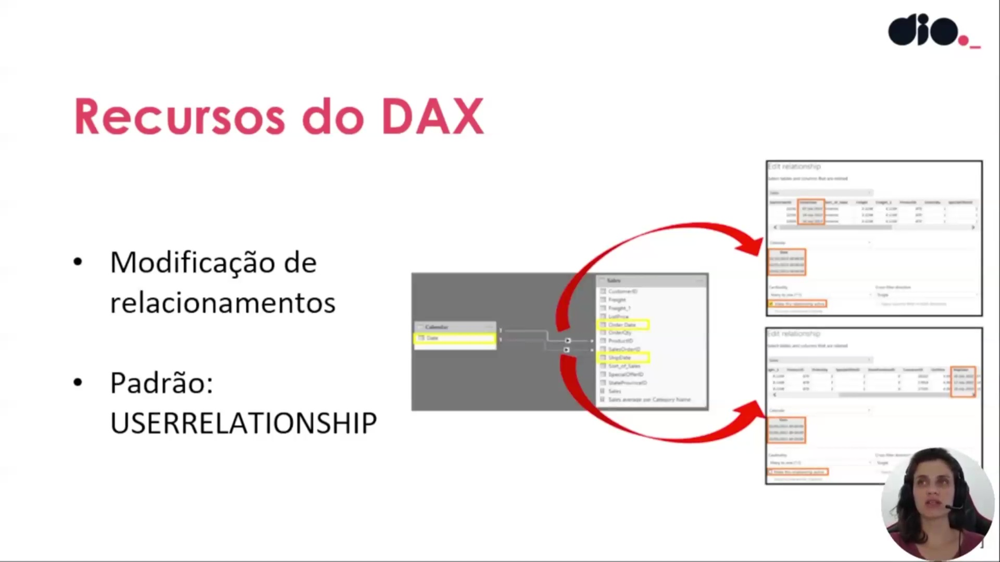
</p>

Este slide apresenta a introdução ao recurso **USERRELATIONSHIP** no DAX. Ele destaca que o Power BI permite modificar relacionamentos entre tabelas, diferenciando entre relacionamentos ativos e inativos. O ponto central é que a função USERRELATIONSHIP pode ser usada para ativar um relacionamento específico durante o cálculo de uma medida, sem alterar o modelo original.

<p align="center">
  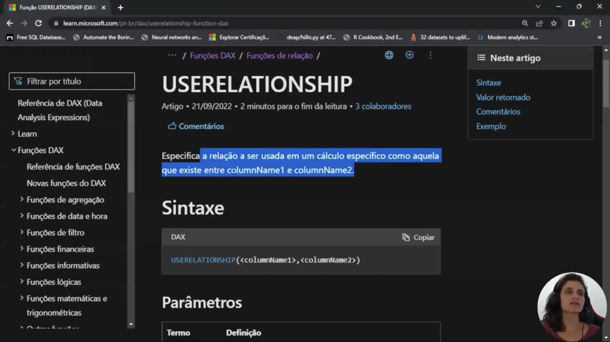
</p>

Aqui vemos a documentação oficial da função **USERRELATIONSHIP**.  
A sintaxe é simples:

```dax
USERRELATIONSHIP(<columnName1>, <columnName2>)
```

Essa função não retorna valores diretamente, mas habilita o relacionamento indicado durante o cálculo. É usada dentro de funções como **CALCULATE**, permitindo que relacionamentos inativos sejam ativados temporariamente para uma medida específica.
 
<p align="center">
  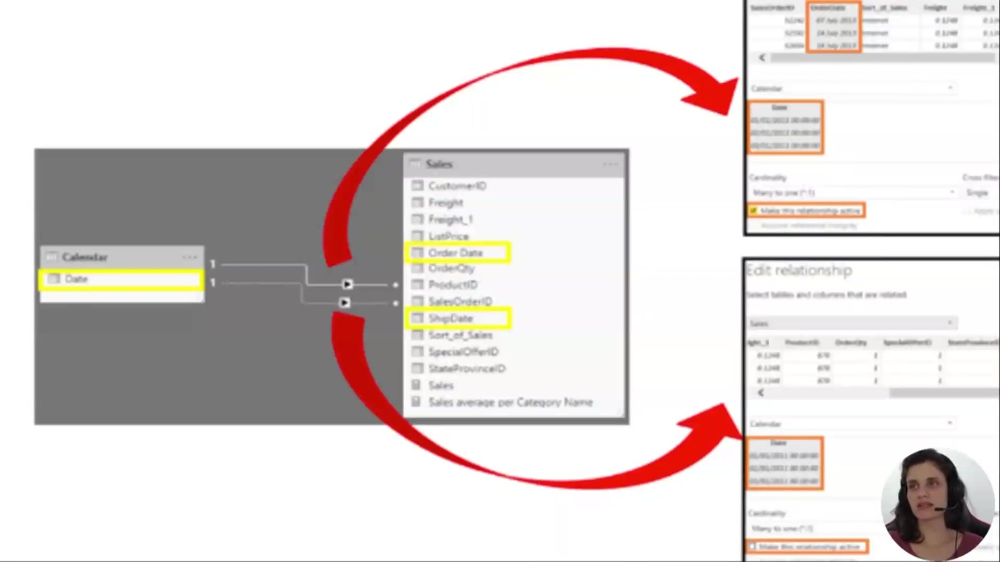
</p>

Este slide conceitual mostra o modelo de dados com tabelas **Sales** e **Calendar**.  
As linhas sólidas representam relacionamentos ativos (por exemplo, entre *OrderDate* e *Date*), enquanto as linhas tracejadas indicam relacionamentos inativos (como *ShipDate* e *Date*). O Power BI mantém apenas um relacionamento ativo por vez, mas permite que relacionamentos inativos sejam ativados com USERRELATIONSHIP quando necessário.

<p align="center">
  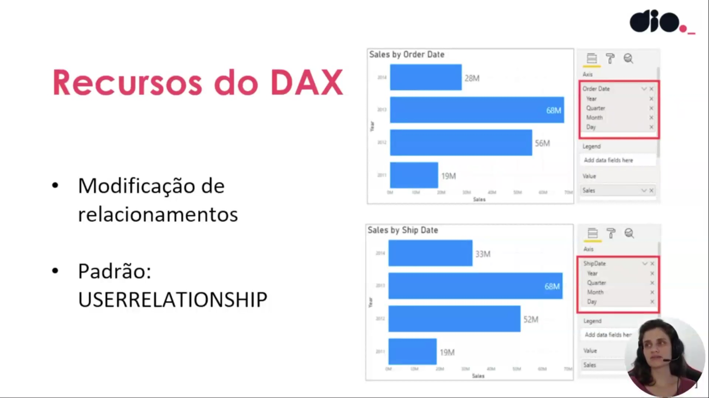
</p>

Este bloco mostra visuais comparando **Sales by Order Date** e **Sales by Ship Date**.  
A diferença nos valores evidencia que cada relacionamento (ativo ou inativo) gera resultados distintos. Para usar o relacionamento baseado em *ShipDate*, é necessário ativá-lo explicitamente em uma medida com USERRELATIONSHIP, já que o padrão ativo é o *OrderDate*.

<p align="center">
  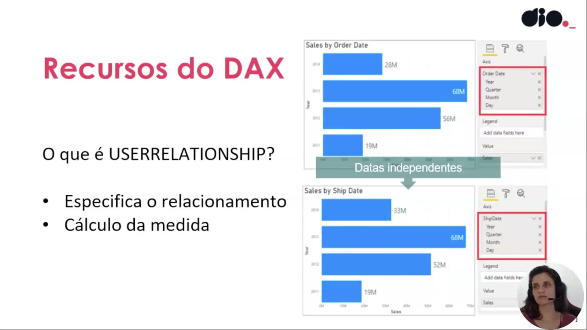
</p>

Aqui temos o exemplo prático da documentação oficial.  
A medida é criada para calcular vendas pela data de envio (*ShipDate*) em vez da data do pedido (*OrderDate*). O código é:

```dax
InternetSales by ShipDate :=
CALCULATE (
    SUM ( InternetSales[SalesAmount] ),
    USERRELATIONSHIP ( InternetSales[ShipDate], DateTime[Date] )
)
```

Esse exemplo mostra como ativar o relacionamento inativo entre *ShipDate* e *DateTime* apenas durante o cálculo da medida, sem substituir o relacionamento ativo existente.

### 🟩 Vídeo 20 - Simulando e Criando uma medida com base em um relacionamento inativo

<video width="60%" controls>
  <source src="000-Midia_e_Anexos/bootcamp_ntt_data-modulo.08-curso.03-video_20.webm" type="video/webm">
    Seu navegador não suporta vídeo HTML5.
</video>

link do vídeo: https://web.dio.me/track/engenharia-dados-python/course/primeiros-passos-com-dax-e-calculos-com-power-bi/learning/1c78b3e6-a645-4315-8faf-599856d10f48?autoplay=1

Este vídeo mostra como gerenciar múltiplos relacionamentos entre tabelas, especificamente quando se tem mais de uma data associada a um registro (como data de venda e data de envio). O vídeo demonstra como ativar relacionamentos "inativos" usando funções DAX para cálculos específicos sem alterar a estrutura global do modelo.

### Anotações

<p align="center">
  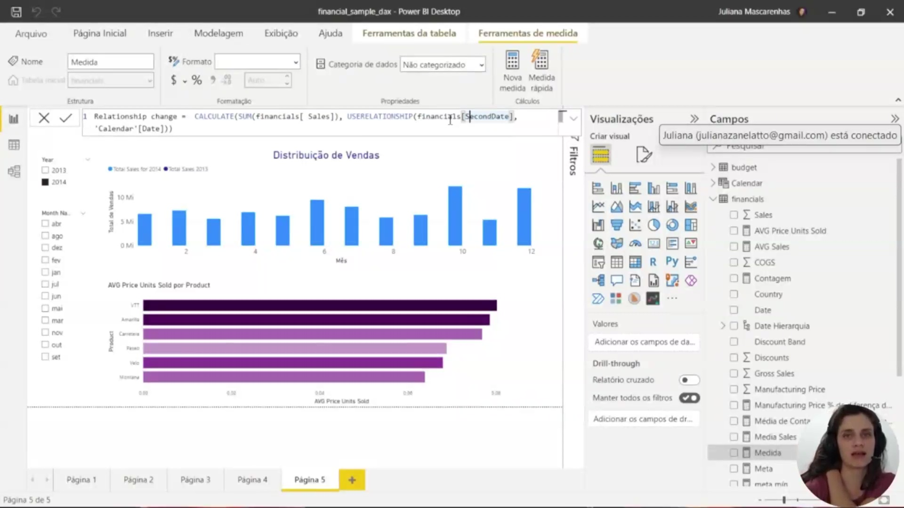
</p>

O elemento central é a **medida** chamada **Relationship change** e a expressão DAX que utiliza `CALCULATE` junto com `USERELATIONSHIP` para forçar o uso da coluna `secondDate` da tabela `financials` em relação à coluna `Date` da tabela `Calendar`. Essa construção permite que, apenas dentro do escopo dessa medida, o Power BI utilize o relacionamento alternativo (inativo por padrão) para calcular somas de vendas.

```dax
Relationship change =
CALCULATE(
  SUM(financials[Sales]),
  USERELATIONSHIP(financials[secondDate], 'Calendar'[Date])
)
```

<p align="center">
  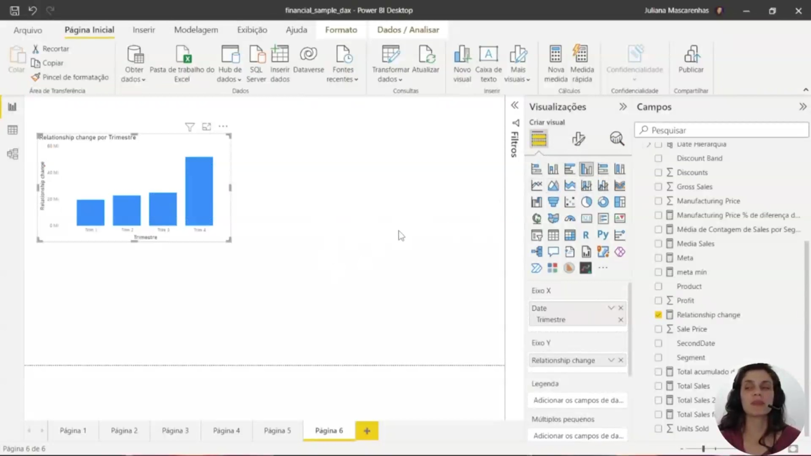
</p>


A imagem mostra o resultado visual esperado ao aplicar a medida: um visual (por exemplo, por trimestre) que exibe os valores calculados usando o relacionamento alternativo. O destaque é que, ao arrastar a medida **Relationship change** para o eixo/legenda do visual, o Power BI passa a considerar **secondDate** como a coluna de ligação para aquele cálculo específico, sem alterar o relacionamento padrão do modelo. Em suma, a imagem ilustra o comportamento prático — a medida força temporariamente outro relacionamento para gerar o visual desejado.

### 🟩 Vídeo 21 - Analisando aspecto temporal dos dados com DAX

<video width="60%" controls>
  <source src="000-Midia_e_Anexos/bootcamp_ntt_data-modulo.08-curso.03-video_21.webm" type="video/webm">
    Seu navegador não suporta vídeo HTML5.
</video>

link do vídeo: https://web.dio.me/track/engenharia-dados-python/course/primeiros-passos-com-dax-e-calculos-com-power-bi/learning/eac31621-51ae-4c51-b9ab-9fd40d1ef190?autoplay=1

O vídeo explica como utilizar funções DAX (Data Analysis Expressions) para realizar análises temporais sofisticadas no Power BI, focando especificamente na função TOTALYTD para cálculos acumulados de ano até a data (Year-to-Date).

### Anotações

<p align="center">
  
</p>

Esta imagem mostra a documentação oficial das funções de inteligência de dados temporais em DAX. Aqui são listadas funções como `CLOSINGBALANCEMONTH`, `DATEADD`, `DATESBETWEEN` e outras, que permitem manipular períodos de tempo em cálculos. O objetivo é destacar que o DAX possui recursos específicos para análises temporais, como somar valores até determinada data ou comparar períodos distintos.

<p align="center">
  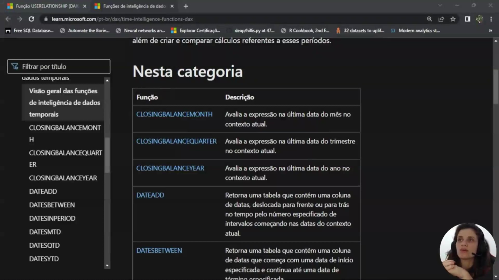
</p>

Nesta imagem vemos uma tabela de vendas mensais distribuídas por ano (2013 e 2014). O visual mostra como os valores variam mês a mês e permite comparar os totais entre anos. Esse exemplo ilustra como a interface do Power BI pode organizar dados temporais em matriz, mas também prepara o terreno para aplicar funções DAX que automatizam esse tipo de cálculo.

<p align="center">
  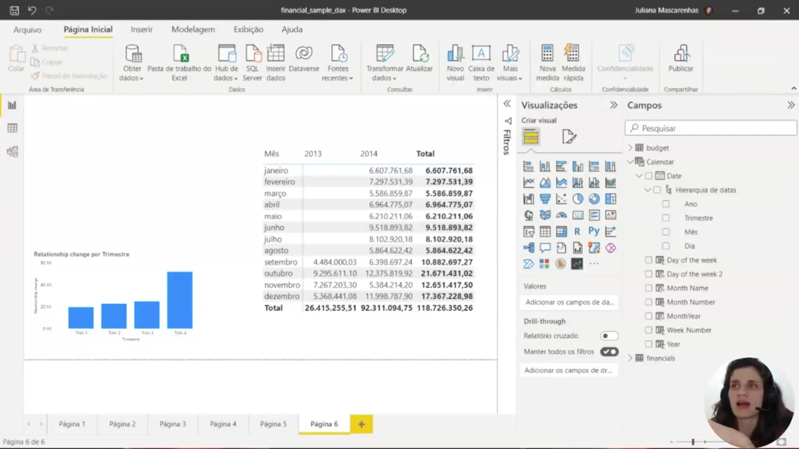
</p>

Aqui aparece a interface do Power BI com campos e medidas disponíveis, como `Total Sales`, `Profit`, `Calendar[Date]` e outros. O foco é mostrar onde criar uma nova medida utilizando funções temporais, como `TOTALYTD`, para calcular acumulados ao longo do ano. É o ponto de partida para aplicar DAX diretamente na modelagem.

<p align="center">
  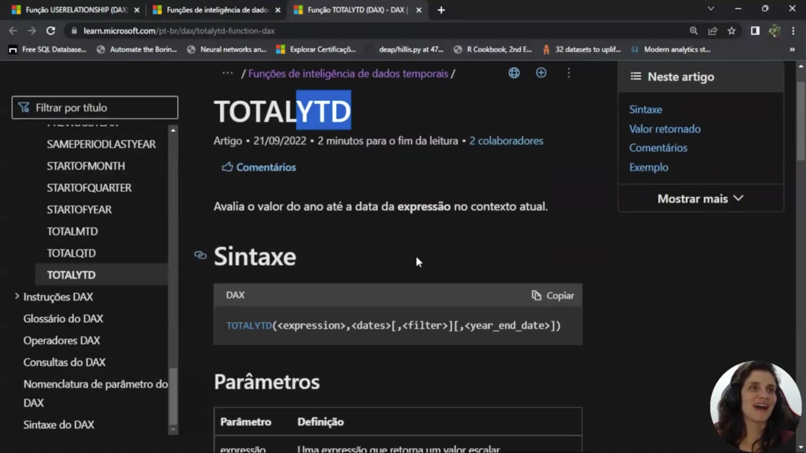
</p>

Esta imagem apresenta a documentação da função `TOTALYTD`. Ela avalia o valor acumulado do ano até a data especificada. A sintaxe é:

```dax
TOTALYTD(<expression>, <dates>[, <filter>][, <year_end_date>])
```

Essa função é usada para calcular totais acumulados em análises temporais, permitindo comparar valores parciais dentro de um ano com o total anual.

<p align="center">
  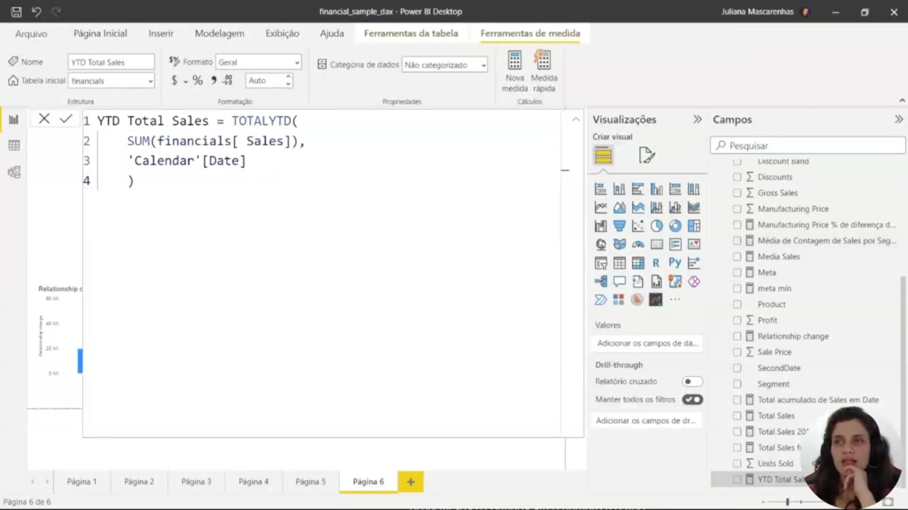
</p>

Nesta imagem vemos a criação de uma medida no Power BI chamada `YTD Total Sales`. O código utilizado é:

```dax
YTD Total Sales =
    TOTALYTD(
        SUM(financials[Sales]),
        'Calendar'[Date]
    )
```

Essa medida soma as vendas acumuladas até a data atual dentro do ano, permitindo análises comparativas entre períodos. É um exemplo prático de como aplicar a função `TOTALYTD` para obter insights temporais diretamente nos relatórios.      

### 🟩 Vídeo 22 - Calculando valores com SAMEPERIODLASTYEAR

<video width="60%" controls>
  <source src="000-Midia_e_Anexos/bootcamp_ntt_data-modulo.08-curso.03-video_22.webm" type="video/webm">
    Seu navegador não suporta vídeo HTML5.
</video>

link do vídeo: https://web.dio.me/track/engenharia-dados-python/course/primeiros-passos-com-dax-e-calculos-com-power-bi/learning/4c4b2ccd-ea90-408c-8a5a-6d2b73660086?autoplay=1

O vídeo ensina como visualizar e comparar dados de vendas ao longo do tempo no Power BI, utilizando desde matrizes simples até medidas avançadas em DAX para comparações anuais precisas.

### Anotações

<p align="center">
  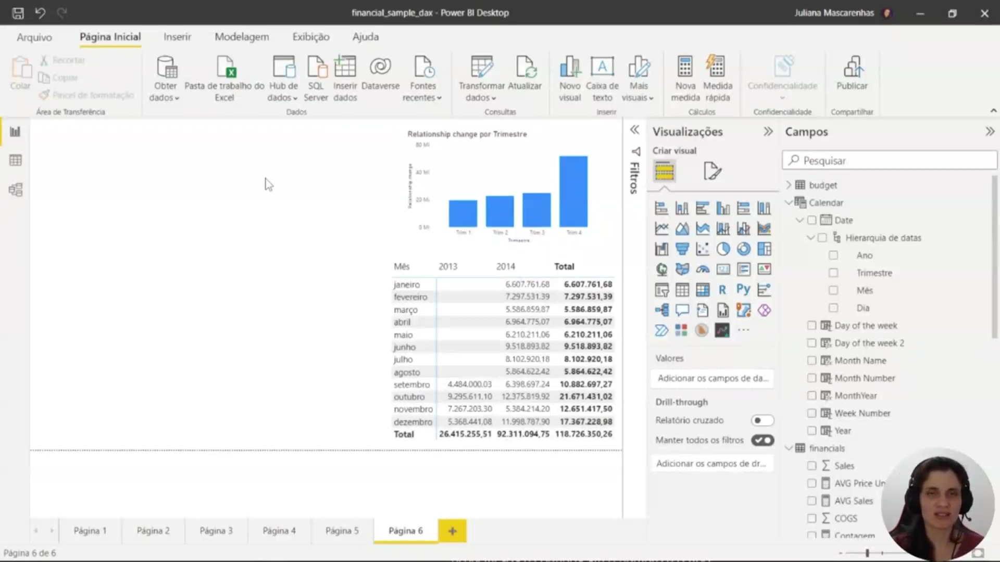
</p>

O slide mostra a **construção de uma matriz/relatório no Power BI** usando a tabela **Calendar** e a hierarquia de datas (Ano, Trimestre, Mês, Dia). À direita há um **resumo tabular de vendas por mês** com os totais por ano: **2013 = 26.415.255,51**, **2014 = 92.311.094,75** e **Total = 118.726.350,26**. Esse slide ilustra o ponto inicial da aula: montar a matriz com *Total Sales* por ano e mês para comparar períodos. 

<p align="center">
  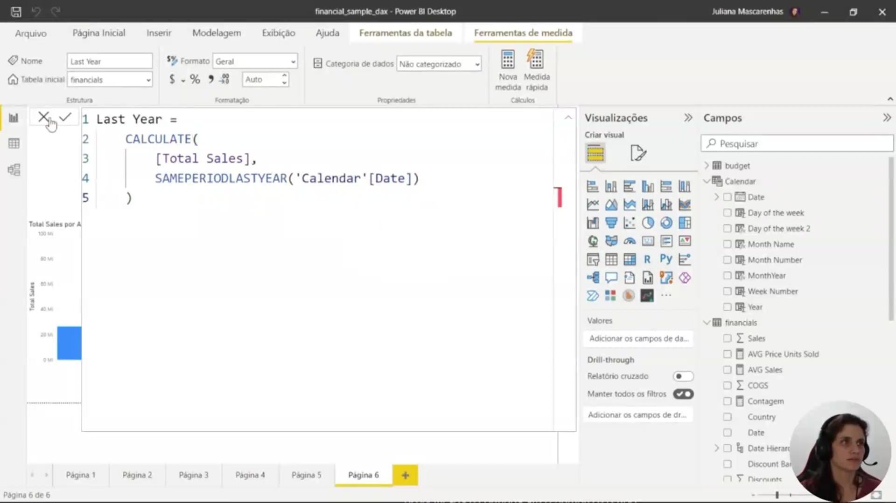
</p>

**Código DAX da imagem:** a medida que calcula o valor do **ano anterior** é construída com `CALCULATE` e `SAMEPERIODLASTYEAR`, referenciando a coluna de data da tabela calendário. A imagem destaca a criação da medida **Last Year** a partir da medida existente **Total Sales** e a importância de usar a coluna `Date` da tabela `Calendar` como contexto temporal.  

```dax
CALCULATE(
  [Total Sales],
  SAMEPERIODLASTYEAR('Calendar'[Date])
)
```

<p align="center">
  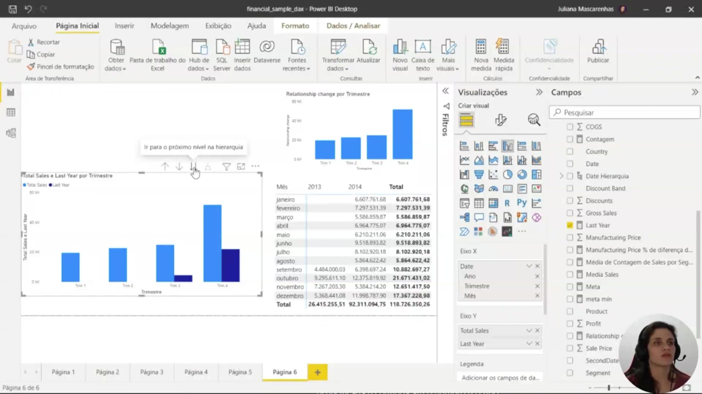
</p>

A imagem mostra a **configuração do visual** (eixo X e valores): o **Eixo X** está definido para `Date` com os níveis **Ano → Trimestre → Mês**, e os **Valores** incluem **Total Sales** e **Last Year**. Esse layout permite **drill-down** e roll-up na hierarquia temporal, possibilitando comparar o período atual com o mesmo período do ano anterior em diferentes granularidades. A captura também ilustra controles de formatação e campos usados no painel de visualizações. 

<p align="center">
  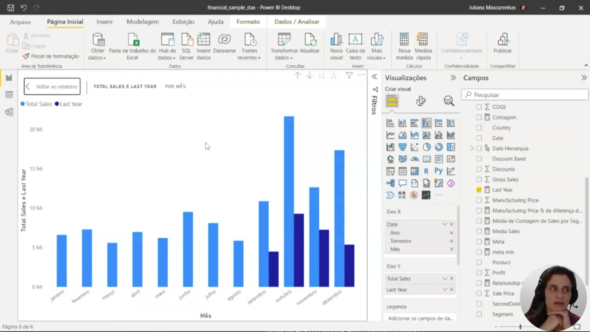
</p>

Este slide final apresenta o **gráfico comparativo por mês** com duas séries: **Total Sales** e **Last Year**. O objetivo é visualizar, mês a mês, quanto foi vendido no período atual versus o mesmo período do ano anterior, usando a medida `Last Year` criada anteriormente. O visual facilita identificar meses com crescimento ou queda ano a ano e funciona corretamente graças à hierarquia de datas e à tabela calendário. 

### 🟩 Vídeo 23 - Calculando valores com PREVIOUSMONTH e Considerações finais

<video width="60%" controls>
  <source src="000-Midia_e_Anexos/bootcamp_ntt_data-modulo.08-curso.03-video_23.webm" type="video/webm">
    Seu navegador não suporta vídeo HTML5.
</video>

link do vídeo: https://web.dio.me/track/engenharia-dados-python/course/primeiros-passos-com-dax-e-calculos-com-power-bi/learning/3ee9af32-84cd-42d6-8f4c-b6d3384626ac?autoplay=1

O vídeo resume as técnicas apresentadas para melhorar a legibilidade de relatórios e a criação de medidas avançadas utilizando DAX (Data Analysis Expressions) para análise temporal e comparativa.

### Anotações

<p align="center">
  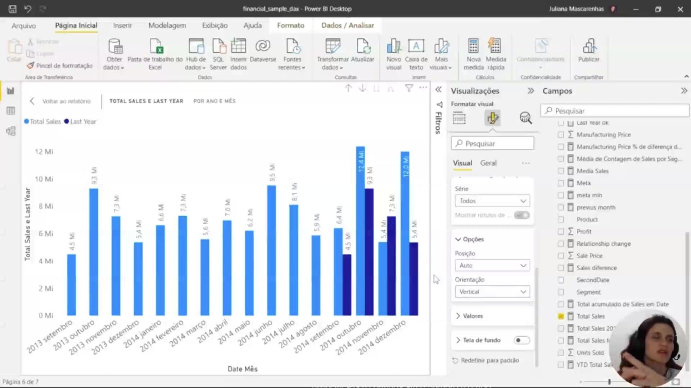
</p>

A imagem mostra a interface do Power BI com foco nas opções de formatação de um visual de série temporal. Observe controles de rótulo, orientação e tamanho de fonte do eixo; a instrução prática é ajustar **tamanho** e **orientação** dos rótulos do eixo X (por exemplo, aumentar de 10 para 12 ou 13 e rotacionar para vertical) para melhorar a legibilidade quando há muitos pontos no eixo temporal. Ajustes simples de formatação tornam o gráfico mais claro sem alterar os dados.

<p align="center">
  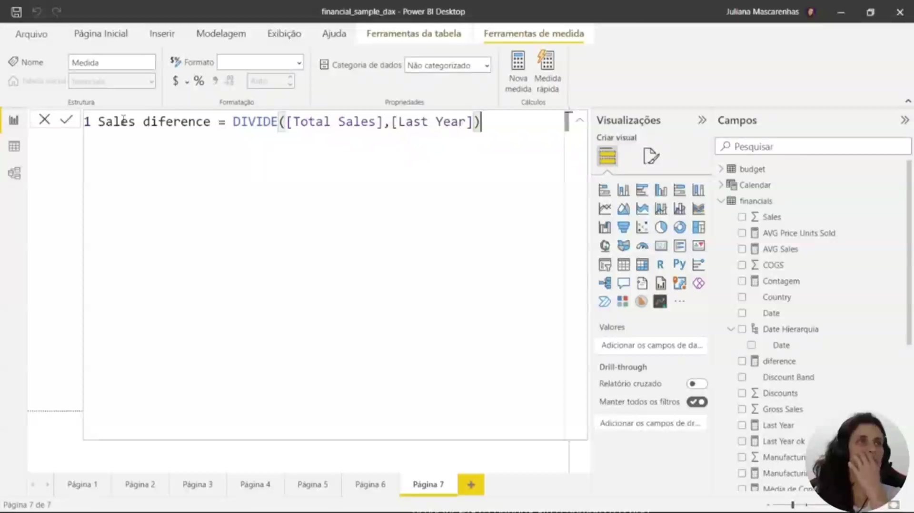
</p>

O slide ilustra a criação de uma **nova medida** no painel de medidas do Power BI. O exemplo conceitual apresentado é a medida *Sales difference*, que pode ser construída usando `DIVIDE([Total Sales], [Last Year])` para evitar erros de divisão por zero. A recomendação é usar `DIVIDE` quando a operação envolve possíveis zeros no denominador.

<p align="center">
  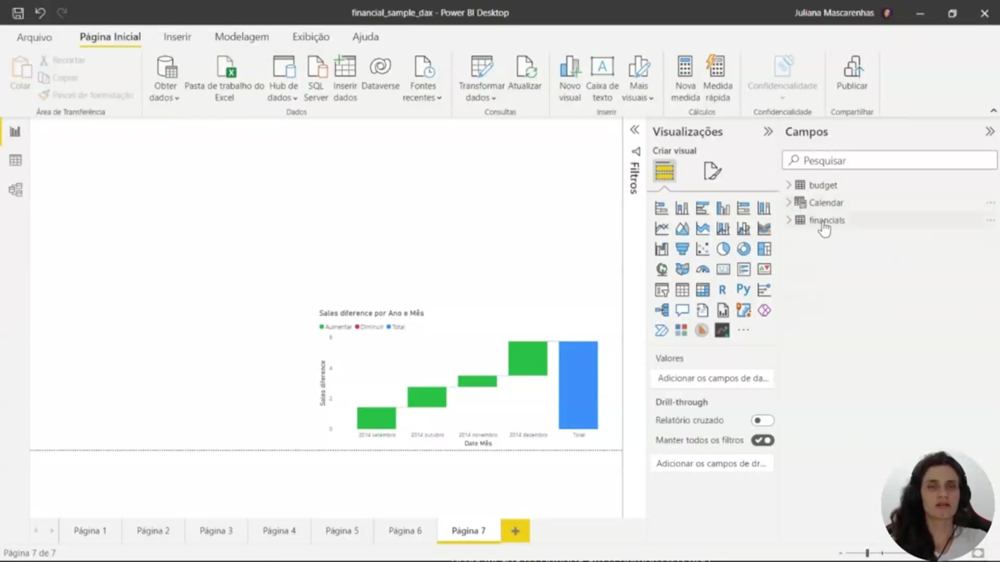
</p>

Aqui vemos a inclusão de duas medidas em um visual de área: o valor atual (por exemplo, **Profit**) e o valor do **mês anterior**. A imagem enfatiza que, após criar a medida que calcula o valor do mês anterior, é possível plotar ambas as séries no mesmo gráfico e usar segmentadores (slicers) por ano para comparar comportamento temporal entre períodos.

<p align="center">
  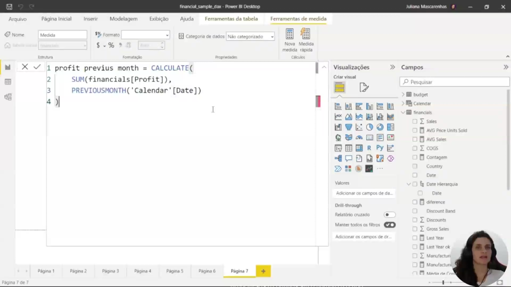
</p>

A captura mostra a construção da medida que recupera o valor do mês anterior usando `CALCULATE` combinado com a função de deslocamento temporal (por exemplo, `PREVIOUSMONTH`). A ideia é: calcular a soma de `Profit` dentro de um contexto modificado pela função temporal para obter o valor correspondente ao mês anterior e, assim, permitir comparações mês a mês.

<p align="center">
  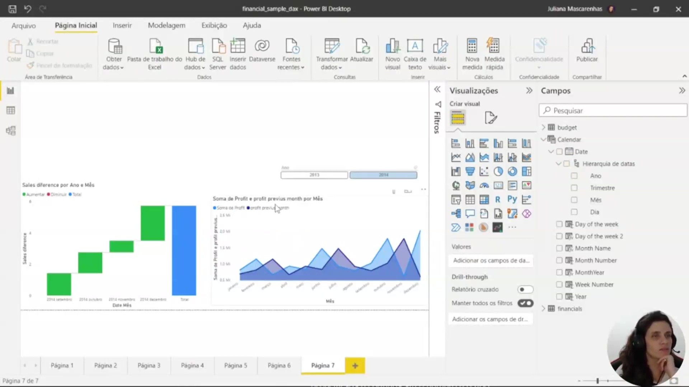
</p>

Nesta imagem aparece o layout do relatório com múltiplos visuais e segmentadores. O ponto prático é organizar os elementos (gráficos, segmentadores de ano, listas) para facilitar a interação: por exemplo, usar um segmentador de ano para filtrar rapidamente a série temporal e comparar `Profit` com `Profit Previous Month` em diferentes granularidades (mês, trimestre, ano).

<p align="center">
  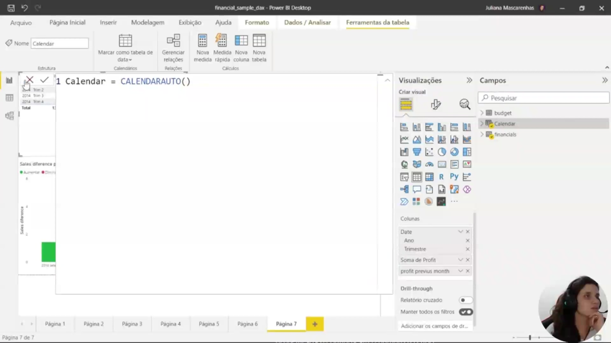
</p>

A imagem mostra o painel de campos e a hierarquia de datas (`Date Hierarchy`) com níveis como Ano, Trimestre, Mês e Dia. A recomendação prática é usar essa hierarquia para navegar entre níveis de agregação (descer para mês, subir para trimestre/ano) sem recriar colunas, e considerar `CALENDARAUTO()` para gerar uma tabela de calendário quando necessário.

<p align="center">
  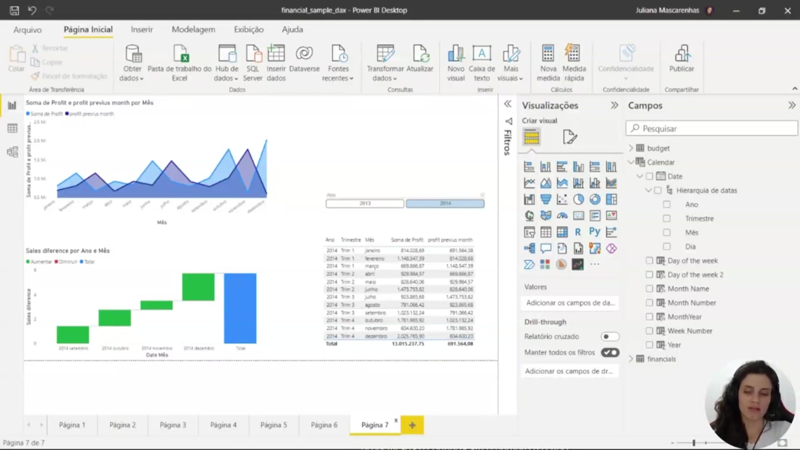
</p>

Aqui vemos um gráfico de colunas/área comparando soma de `Profit` e `profit previous month` por mês e por ano. Use esse tipo de visual para identificar rapidamente meses em que o lucro aumentou ou diminuiu em relação ao mês anterior; combinar com segmentadores permite isolar anos ou trimestres específicos para análise detalhada.

<p align="center">
  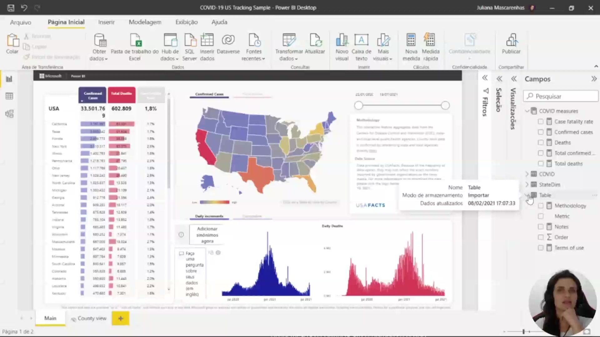
</p>

A última imagem mostra uma tabela de valores mensais (ex.: janeiro a dezembro) com totais e subtotais por trimestre e um total anual. Ela ilustra como apresentar números tabulares ao lado de visuais gráficos para fornecer contexto numérico preciso; ao combinar tabela e gráfico, o leitor obtém tanto a visão agregada quanto os valores exatos por período.

# Certificado: Primeiros passos com DAX e Cálculos com Power BI

- Link na plataforma: https://hermes.dio.me/certificates/8EASFFBR.pdf
- Certificado em pdf: [Certificado-Primeiros_passos_com_DAX_e_Calculos_com_Power_BI.pdf](000-Midia_e_Anexos/Certificado-Primeiros_passos_com_DAX_e_Calculos_com_Power_BI.pdf)