## Instrutor:

- Juliana Mascarenhas (Tech Education Specialist / Sócia (Content Creator) @SimplificandoRedes / Me Modelagem Computacional / Cientista de dados)
- Contato Linkedin: / [juliana-mascarenhas-ds](https://www.linkedin.com/in/juliana-mascarenhas-ds/)

## Parte 1 - Otimização de Modelo de Dados com Foco em Desempenho no Power BI

### 🟩 Vídeo 01 - O que é otimização no Power BI?

<video width="60%" controls>
  <source src="000-Midia_e_Anexos/bootcamp_ntt_data-modulo.08-curso.03-video_01.webm" type="video/webm">
    Seu navegador não suporta vídeo HTML5.
</video>

link do vídeo: https://web.dio.me/track/engenharia-dados-python/course/otimizacao-de-modelo-de-dados-com-foco-em-desempenho-no-power-bi/learning/6d6d7864-64e2-4c92-86e2-1c2eb847ebe4?autoplay=1

O vídeo aborda a transição entre a criação de relatórios visualmente atraentes e a entrega de soluções de alta performance. O foco central é a otimização de modelos de dados, garantindo que os relatórios não apenas forneçam insights valiosos, mas o façam de maneira rápida, eficiente e escalável, evitando gargalos comuns quando os projetos saem do ambiente de teste para a produção.

### Anotações

<p align="center">
  
</p>

Slide de abertura da aula ministrada por **Juliana Mascarenhas**, Tech Education Specialist da DIO, Mestre em Modelagem Computacional e Cientista de Dados. O tema central é **"Otimizando Modelos com Foco em Performance"**, inserido na trilha da **Formação Power BI Analyst**. Este módulo dá continuidade aos conteúdos anteriores — criação de visuais, ETL, modelagem de dados e modelagem dimensional — e introduz agora os fundamentos de otimização de desempenho em relatórios do Power BI.

<p align="center">
  
</p>

Slide de transição que marca o início da **Etapa 1: Fundamentos de Otimização com Power BI**. Não há código nesta imagem. O slide sinaliza que a aula entrará em conceitos fundamentais sobre o que é otimização, por que ela importa e quais são suas consequências práticas no contexto de relatórios Power BI.

<p align="center">
  
</p>

O slide apresenta a definição formal de **otimização** no contexto de modelos de dados:

> **Realização de modificações no estado atual do modelo de dados a fim de executar suas operações com maior eficiência. Dessa forma, aumentamos seu desempenho.**

Essa definição delimita o escopo do conceito: otimizar não é refazer o relatório do zero, mas intervir cirurgicamente no modelo existente para que ele processe e entregue informações com mais eficiência. O objetivo final é sempre o aumento de desempenho — tanto na atualização dos dados quanto na renderização dos visuais para o usuário final.

<p align="center">
  
</p>

O slide destaca uma distinção crítica que muitos analistas negligenciam: o **desempenho do relatório em fase de testes** e o **desempenho do relatório em fase de produção** são realidades diferentes.

Durante o desenvolvimento, o relatório roda em ambiente controlado, geralmente com poucos usuários e volume de dados reduzido. Ao ser publicado e consumido por múltiplos usuários simultaneamente, surgem gargalos que não existiam na fase de testes. Compreender essa diferença é o ponto de partida para justificar o investimento em otimização desde o início do projeto.

<p align="center">
  
</p>

Do ponto de vista do usuário final, o mau desempenho se manifesta de duas formas objetivas:

- **Lentidão no carregamento** — páginas do relatório demoram mais do que o aceitável para abrir.
- **Demora na atualização dos visuais** — gráficos e tabelas levam tempo excessivo para refletir filtros e interações.

Ambas as situações geram uma **experiência negativa**, o que contraria o propósito de qualquer relatório analítico: entregar informação de forma rápida, clara e confiável. Um relatório visualmente impecável perde valor se o usuário precisar esperar para interagir com ele.

<p align="center">
  
</p>

O slide aponta que, em **90% dos casos**, o mau desempenho de um relatório Power BI tem origem em um (ou na combinação) dos seguintes fatores:

- **Modelagem inadequada** — estrutura de tabelas mal planejada, relações incorretas ou desnecessariamente complexas.
- **Mau uso da linguagem DAX** — funções mal construídas ou escolhas de medidas que consomem mais recursos do que o necessário.
- **Combinação dos dois** — o caso mais comum na prática.

O número 90% reforça que esses dois problemas dominam a maioria dos diagnósticos de performance, tornando-os o foco prioritário de qualquer processo de otimização.

<p align="center">
  
</p>

O slide elenca os benefícios diretos de um modelo de dados bem otimizado:

- **Melhor experiência do usuário** — navegação fluida e interações responsivas.
- **Desempenho e bons resultados** — relatório robusto, capaz de sustentar o crescimento dos dados ao longo do tempo.
- **Cliente satisfeito** — seja um cliente interno ou externo, a qualidade percebida do relatório está diretamente ligada à sua velocidade e confiabilidade.

Tratar os problemas de desempenho durante o desenvolvimento evita retrabalho custoso na fase de produção e permite manter o relatório otimizado de forma contínua ao longo de sua vida útil.

<p align="center">
  
</p>

O slide lista as principais diretrizes práticas do processo de otimização de um modelo de dados no Power BI:

- **Garantir que os tipos de dados corretos sejam usados** — tipos inadequados aumentam o consumo de memória e tornam os cálculos mais lentos.
- **Excluir colunas e linhas desnecessárias** — importar apenas o que será efetivamente utilizado nos relatórios.
- **Evitar valores repetidos** — redundâncias aumentam o tamanho do modelo sem agregar valor analítico.
- **Substituir colunas numéricas por medidas** — medidas são calculadas sob demanda, reduzindo o volume de dados armazenados no modelo.
- **Reduzir cardinalidades** — colunas com muitos valores únicos exigem mais recursos para processar relacionamentos e filtros.
- **Analisar metadados do modelo** — assim como bancos de dados relacionais, o Power BI expõe metadados que permitem identificar gargalos.
- **Resumir dados sempre que possível** — trabalhar com dados agregados em vez de dados granulares reduz o volume processado e acelera as consultas.

<p align="center">
  
</p>

O slide ilustra o **fluxo completo de dados** no ecossistema Power BI, destacando um princípio central de otimização:

> **Diminua o tamanho dos dados para otimizar o desempenho.**

O fluxo representado segue a seguinte sequência:

1. **Fonte de dados** (tabelas externas) → a seleção e filtragem dos dados deve acontecer **na origem**, antes de qualquer importação.
2. **Power BI Desktop** → os dados já filtrados são transformados e servem de base para a criação dos relatórios.
3. **Serviço do Power BI** → o relatório é publicado na nuvem.
4. **Navegador e aplicativos móveis** → os usuários finais consomem o relatório por diferentes canais.

A recomendação prática é: sempre que possível, aplicar filtros, remover colunas e agregar dados **antes** de carregar no Power BI Desktop, reduzindo o volume que precisa ser processado em todas as etapas seguintes.

<p align="center">
  
</p>

O slide aborda as **três modalidades de armazenamento de dados** disponíveis no Power BI e o trade-off central entre elas:

| Modalidade | Características |
|---|---|
| **Import** | Dados copiados para o modelo; consultas rápidas; atualizações agendadas; sem necessidade de permissão contínua à fonte. |
| **DirectQuery** | Dados permanecem na fonte; menor uso de disco; consultas em tempo real; maior latência conforme o volume de dados cresce. |
| **Composto (Dual)** | Combinação das duas abordagens; tabelas podem operar em Import ou DirectQuery conforme a necessidade. |

Os três fatores que determinam qual modalidade escolher são: **acesso aos dados**, **tempo de carregamento** e **permissão de acesso**. A escolha entre facilidade de uso (Import) e disponibilidade em tempo real (DirectQuery) é um dos principais pontos de decisão arquitetural na construção de um modelo otimizado no Power BI.

### 🟩 Vídeo 02 - Exemplificando um cenário com problemas e otimização

<video width="60%" controls>
  <source src="000-Midia_e_Anexos/bootcamp_ntt_data-modulo.08-curso.03-video_02.webm" type="video/webm">
    Seu navegador não suporta vídeo HTML5.
</video>

link do vídeo: https://web.dio.me/track/engenharia-dados-python/course/otimizacao-de-modelo-de-dados-com-foco-em-desempenho-no-power-bi/learning/944308ac-a504-4111-aab2-5062b78bab08?autoplay=1

O vĩdeo explica como transformar relatórios visualmente atraentes em ferramentas de alta performance, focando em usabilidade, eficiência de dados e experiência do usuário (UX).

### Anotações

<p align="center">
  
</p>

O slide apresenta um **cenário hipotético** para contextualizar os problemas de desempenho em relatórios Power BI. À direita, é exibido um exemplo de relatório com visual elaborado, destacado pelas etiquetas *"Resultados significativos"* e *"Relatório com visual agradável"* — indicando que o produto entrega valor visual e analítico para os usuários. À esquerda, no entanto, uma caixa aponta para o ponto crítico do cenário: o modelo de dados recebeu **comentários negativos por conta do mau desempenho**. A seta ligando os dois elementos evidencia a contradição central: um relatório visualmente satisfatório, mas tecnicamente comprometido — situação agravada pelo fato de o colaborador que o criou já ter saído da organização.

<p align="center">
  
</p>

O slide enumera os **problemas identificados** no cenário hipotético, respondendo à pergunta *"Quais os problemas?"*. São listados dois sintomas principais enfrentados pelos usuários: o **carregamento lento das páginas** do relatório e o fato de que as **tabelas não são atualizadas com rapidez em seleções** — o que compromete a visualização de métricas com dados atualizados. Ao fundo, uma terceira evidência vem da área de TI: o **arquivo está muito grande**, consumindo armazenamento de forma desnecessária no ambiente Power BI. Esses três pontos delimitam o escopo técnico do problema a ser resolvido.

<p align="center">
  
</p>

O slide responde à pergunta *"O que fazer para resolver?"*, listando as cinco estratégias de otimização aplicáveis ao cenário:

- **Examinar o desempenho de medidas, relações e visuais** — analisar cada componente individualmente para identificar onde estão as ineficiências.
- **Usar variáveis para aprimorar o desempenho e solucionar problemas** — ao armazenar em variável um cálculo reutilizado em uma medida DAX, o Power BI evita reexecutá-lo a cada avaliação, ganhando eficiência.
- **Aprimorar o desempenho reduzindo os níveis de cardinalidade** — substituir relacionamentos muitos-para-muitos (N:M) por relacionamentos um-para-muitos (1:N), preferidos pelo motor do Power BI.
- **Otimizar modelos do DirectQuery com o armazenamento no nível de tabela** — configurar o modo de armazenamento adequado para cada tabela, reduzindo consultas desnecessárias à fonte de dados.
- **Criar e gerenciar agregações** — utilizar tabelas de agregação para acelerar consultas sobre grandes volumes de dados.

<p align="center">
  
</p>

O slide ilustra, de forma esquemática, **como os elementos internos do relatório afetam diretamente a experiência do usuário final**. O diagrama apresenta dois blocos de entrada — **Relações** (representadas por um modelo de tabelas interligadas) e **Visuais e medidas** (representados pelo painel de visualizações do Power BI) — que convergem para o **Desempenho do relatório do Power BI**. Este, por sua vez, determina a qualidade da **Experiência do usuário final**. A leitura do fluxo reforça que relações mal configuradas e medidas ineficientes impactam o desempenho do relatório e, consequentemente, a percepção de qualidade do produto pelo usuário.

<p align="center">
  
</p>

O slide encerra a sequência do cenário hipotético apresentando os **três passos práticos para iniciar a resolução do problema**, sob o mesmo questionamento *"Como resolver?"*:

- **Identificação de gargalos de desempenho no relatório** — primeiro passo, que consiste em localizar exatamente onde o relatório perde eficiência.
- **Analisar o desempenho com o Performance Analyser** — ferramenta nativa do Power BI que será explorada na sequência da aula para medir o tempo de resposta de cada visual e consulta.
- **Examinar os resultados** — avaliar as métricas coletadas e determinar quais ajustes são realmente necessários.

Esses três pontos definem a metodologia de diagnóstico que será aprofundada nos próximos vídeos do curso.      


### 🟩 Vídeo 03 - Quando ocorrem os problemas de otimização?

<video width="60%" controls>
  <source src="000-Midia_e_Anexos/bootcamp_ntt_data-modulo.08-curso.03-video_03.webm" type="video/webm">
    Seu navegador não suporta vídeo HTML5.
</video>

link do vídeo: https://web.dio.me/track/engenharia-dados-python/course/otimizacao-de-modelo-de-dados-com-foco-em-desempenho-no-power-bi/learning/ce4f06e5-8686-4e3a-8b0c-515b092fb294?autoplay=1

O vídeo mostra como identificar gargalos de desempenho em relatórios de BI, a importância de uma modelagem de dados eficiente e técnicas práticas para reduzir o tamanho do modelo e aumentar a velocidade de resposta para o usuário final.

### Anotações

<p align="center">
  
</p>

O slide apresenta a seção **Visuais** dentro do tema *Resolvendo Problemas*, com foco em **onde otimizar** no relatório. Três princípios são destacados:

- **Melhorar o desempenho** — o objetivo central da otimização é garantir que o relatório carregue e responda de forma ágil.
- **Mínimo impacto na experiência do usuário** — as intervenções de performance não devem degradar a usabilidade nem a clareza visual para quem consome o relatório.
- **Menos visuais → mais desempenho** — cada elemento visual adicionado à tela representa uma consulta extra ao modelo de dados. Reduzir a quantidade de visuais é, portanto, uma das formas mais diretas de ganhar velocidade.

Complementando esses pontos, o slide destaca dois vetores de análise: **Campos no visual** (quais campos estão sendo usados e se são realmente necessários) e **Pense em como representar os Detalhes…** (questionar se um visual dedicado é indispensável ou se a mesma informação pode ser entregue por outro meio, como dicas de ferramenta ou segmentadores já existentes).

<p align="center">
  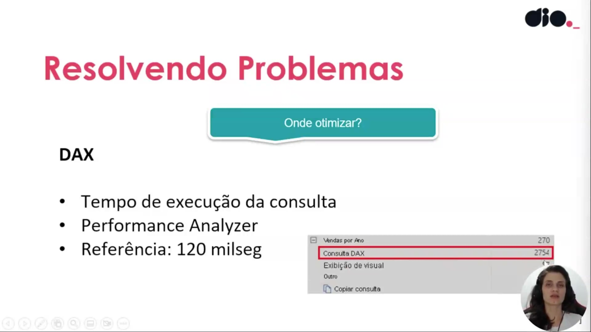
</p>

O slide trata do segundo eixo de otimização: as **consultas DAX**. Os três pontos apresentados são:

- **Tempo de execução da consulta** — cada medida DAX que alimenta um visual tem um custo de processamento mensurável; identificar os tempos é o ponto de partida para qualquer tuning.
- **Performance Analyzer** — ferramenta nativa do Power BI Desktop utilizada para capturar e inspecionar o tempo gasto por cada visual ao executar sua consulta DAX.
- **Referência: 120 milsseg** — valor de referência considerado aceitável para uma consulta DAX. Tempos muito acima disso indicam que há algo a revisar na lógica da medida ou no modelo.

À direita, o painel do **Performance Analyzer** exibido no slide mostra um exemplo real: o visual *Vendas por Ano* registrou **2754 ms** apenas na etapa de *Consulta DAX* — um tempo muito superior ao parâmetro de referência, sinalizando claramente a necessidade de revisão.

<p align="center">
  
</p>

O slide lista os **Pontos de atenção** relacionados à modelagem de dados, acompanhado de um diagrama esquemático que representa a estrutura de tabelas e seus relacionamentos. São quatro diretrizes práticas:

- **Verifique as relações e cardinalidades** — relações incorretas ou com cardinalidade inadequada impactam diretamente o resultado das medidas DAX e o desempenho das consultas.
- **Delete as colunas desnecessárias** — colunas que não são utilizadas por visuais, medidas ou filtros ocupam espaço no modelo sem agregar valor, aumentando o custo de memória e processamento.
- **Preferência exclusão: na importação** — sempre que possível, a remoção de colunas deve ocorrer na origem, via SQL ou durante o processo de importação, antes que os dados entrem no modelo.
- **Use o Power Query quando necessário** — nos casos em que a exclusão na fonte não é viável, o Power Query é o ambiente correto para eliminar colunas e linhas antes que os dados sejam carregados.

<p align="center">
  
</p>

O slide apresenta a seção **Modelo de dados** e contextualiza por que esse é o elemento central de toda a estratégia de desempenho. Três consequências diretas de um modelo bem estruturado são listadas:

- **Visuais com bom desempenho** — um modelo eficiente permite que os visuais consultem e renderizem dados com rapidez, independentemente da complexidade do relatório.
- **DAX com execução rápida** — medidas calculadas sobre um modelo otimizado executam em menos iterações, reduzindo o tempo de resposta.
- **Provável: relações, colunas ou metadados** — quando há lentidão, a causa mais provável está em algum desses três elementos: relações mal configuradas, colunas desnecessárias presentes no modelo ou metadados incorretos.

O diagrama à direita reforça visualmente a ideia de um modelo relacional com tabelas em diferentes níveis hierárquicos, conectadas por relacionamentos.

<p align="center">
  
</p>

O slide retoma os **Pontos de atenção** do modelo de dados — os mesmos apresentados anteriormente — reforçando-os como checklist de revisão prática antes de qualquer publicação do relatório:

- **Verifique as relações e cardinalidades**
- **Delete as colunas desnecessárias**
- **Preferência exclusão: na importação**
- **Use o Power Query quando necessário**

A repetição do slide no contexto da aula funciona como consolidação: após entender *por que* o modelo impacta o desempenho, o aluno é relembrado de *como* agir diretamente no modelo para corrigir os problemas identificados.

<p align="center">
  
</p>

O slide enumera as principais **Técnicas para redução de dados** aplicáveis a modelos de importação no Power BI:

- **Remover colunas desnecessárias** — eliminar atributos que não contribuem para análises ou filtros.
- **Remover linhas desnecessárias** — filtrar registros irrelevantes antes da carga (ex.: dados históricos fora do escopo do relatório).
- **Otimizar tipos de dados de coluna** — usar o tipo mais enxuto possível (ex.: inteiro em vez de texto para códigos numéricos), o que reduz o espaço ocupado no mecanismo VertiPaq.
- **Colunas personalizadas** — preferir colunas calculadas criadas no Power Query (M) em vez de colunas DAX quando a lógica for simples, pois o VertiPaq compacta de forma mais eficiente dados originados do Power Query.
- **Desabilitar data/hora automática** — o recurso automático cria tabelas de calendário ocultas para cada coluna de data, inflando o modelo; desativá-lo e criar uma tabela de datas única é a prática recomendada.
- **…** — o slide indica que há outras técnicas documentadas, remetendo à **Documentação oficial** da Microsoft (link exibido no canto inferior direito).

<p align="center">
  
</p>

A imagem exibe uma captura de tela do **Microsoft Learn**, na página oficial de diretrizes do Power BI intitulada **"Técnicas de redução de dados para Modelagem de importação"**, acessível em:

```
learn.microsoft.com/pt-br/power-bi/guidance/import-modeling-data-reduction
```

Tópicos cobertos pela documentação, incluindo: *Remover colunas desnecessárias*, *Remover linhas desnecessárias*, *Agrupar por e resumir* e *Otimizar tipos de dados de coluna*, entre outros.

A professora recorre a essa página para demonstrar que as técnicas apresentadas no slide anterior têm respaldo na documentação oficial da Microsoft, servindo como referência de consulta para aprofundamento. Não se trata de código Python — a classificação automática foi incorreta; a imagem contém exclusivamente uma página web de documentação.      


### 🟩 Vídeo 04 - Primeiro contato com Performance Analyzer

<video width="60%" controls>
  <source src="000-Midia_e_Anexos/bootcamp_ntt_data-modulo.08-curso.03-video_04.webm" type="video/webm">
    Seu navegador não suporta vídeo HTML5.
</video>

link do vídeo: https://web.dio.me/track/engenharia-dados-python/course/otimizacao-de-modelo-de-dados-com-foco-em-desempenho-no-power-bi/learning/43d8bce6-4d00-4161-9ff1-77d514663d33?autoplay=1

O vídeo mostra como utilizar o Performance Analyzer no Power BI Desktop para diagnosticar e melhorar o desempenho de relatórios, garantindo carregamentos rápidos e uma experiência de usuário fluida.

### Anotações

<p align="center">
  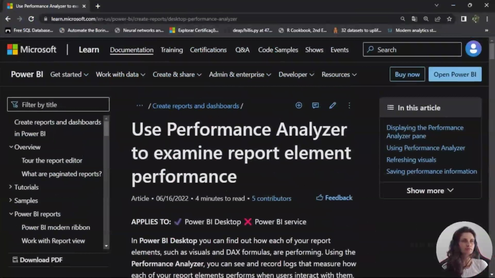
</p>

Neste slide vemos a página de documentação oficial da Microsoft Learn intitulada **"Use Performance Analyzer to examine report element performance"**. A página está enquadrada na seção *Create reports and dashboards* do Power BI e indica que o recurso se aplica ao **Power BI Desktop** (marcado com ✔) e **não** ao Power BI Service (marcado com ✘). O sumário lateral à direita antecipa as seções do artigo: *Displaying the Performance Analyzer pane*, *Using Performance Analyzer*, *Refreshing visuals* e *Saving performance information*. Esse material é indicado como leitura complementar para aprofundamento no tema.

<p align="center">
  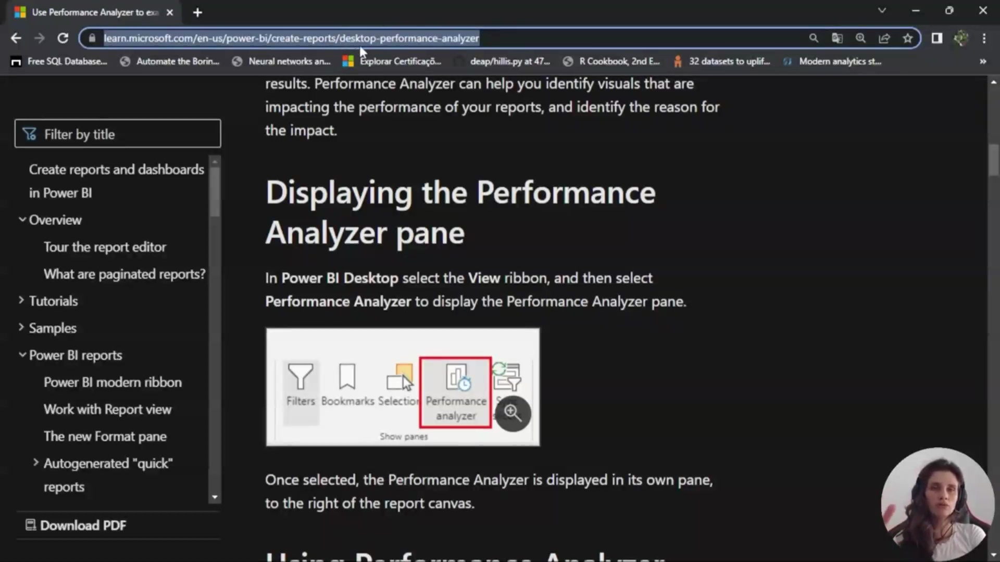
</p>

Seção **"Displaying the Performance Analyzer pane"** da mesma documentação da Microsoft. O texto instrui o usuário a acessar a aba **View** (Exibição) no Power BI Desktop e clicar em **Performance Analyzer** para abrir o painel. Abaixo da instrução, há uma captura de tela da barra de ferramentas do Power BI destacando o botão *Performance Analyzer* em vermelho, ao lado de *Filters*, *Bookmarks* e *Selection*. Uma vez ativado, o painel é exibido à direita do canvas do relatório.

<p align="center">
  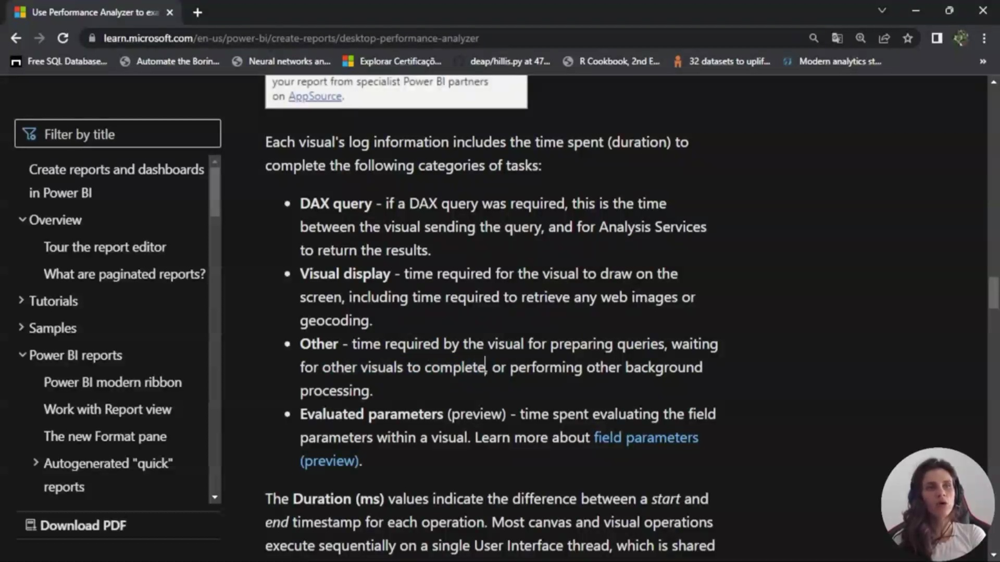
</p>

São quatro categorias:

- **DAX query** — tempo decorrido entre o envio da consulta pelo visual e o retorno dos resultados pelo Analysis Services.
- **Visual display** — tempo necessário para o visual ser renderizado na tela, incluindo carregamento de imagens web ou geocodificação.
- **Other** (Outro) — tempo que o visual precisa para preparar queries, aguardar outros visuais concluírem ou executar processos em segundo plano (*background*).
- **Evaluated parameters** (preview) — tempo gasto para avaliar parâmetros de campo dentro de um visual.

A coluna **Duration (ms)** registra a diferença entre os timestamps de *início* e *fim* de cada operação, e a maioria das operações é executada sequencialmente em uma única *thread* de interface do usuário.

<p align="center">
  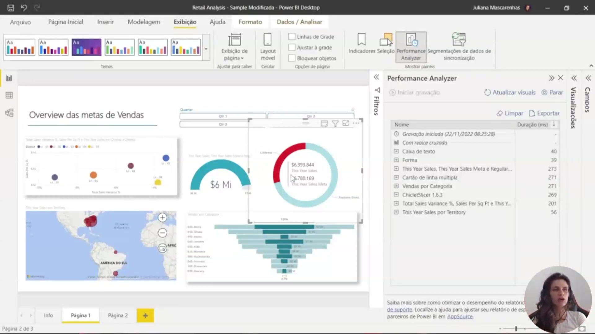
</p>

A gravação já foi iniciada (indicada pelo carimbo *"Gravação iniciada (22/11/2022 08:25:28)"*) e a primeira interação — um clique no filtro *Lindsey* — foi registrada. O painel lista os visuais da página com suas durações em milissegundos:

| Visual | Duração (ms) |
|---|---|
| Caixa de texto | 40 |
| Forma | 39 |
| This Year Sales, This Year Sales Meta e Regular... | 273 |
| Cartão de linha múltipla | 271 |
| Vendas por Categoria | 271 |
| ChicletSlicer 1.6.3 | 269 |
| Total Sales Variance %, Sales Per Sq Ft e This Y... | 201 |
| This Year Sales por Territory | 56 |

Essa listagem permite identificar quais visuais consomem mais tempo de carregamento em resposta à interação do usuário.

<p align="center">
  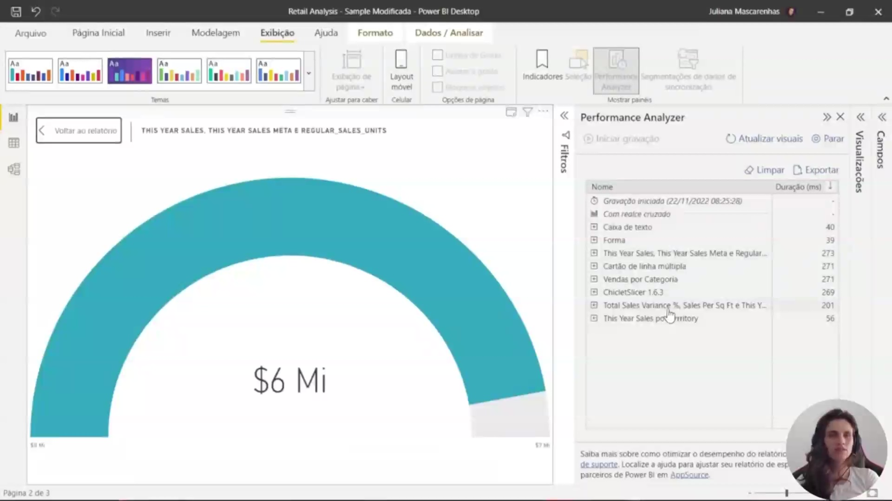
</p>

Aqui o resultado de um clique de expansão (*drill-through*) no visual do **medidor (gauge)** "This Year Sales, This Year Sales Meta e Regular_Sales_Units". O visual ocupa toda a área do canvas e exibe o valor **$6 Mi**, com a barra do medidor preenchida predominantemente em azul-petróleo. O botão **"Voltar ao relatório"** aparece no canto superior esquerdo. O painel do Performance Analyzer à direita permanece com os mesmos registros da gravação anterior, pois a expansão de visual não gera uma nova interação de consulta — apenas redimensiona a exibição.

<p align="center">
  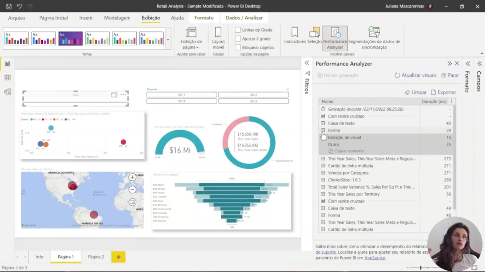
</p>

O painel ilustra na prática o que a documentação descreveu: o tempo total de um visual é composto por diferentes camadas. A categoria **"Outro"** (25 ms neste caso) representa o processamento realizado em *background* — preparação de queries, espera por outros visuais ou processamentos paralelos — enquanto a **"Exibição de visual"** (15 ms) é o tempo puro de renderização na tela. O relatório também mostra uma segunda rodada de eventos (com realce cruzado) acumulada logo abaixo na lista.

<p align="center">
  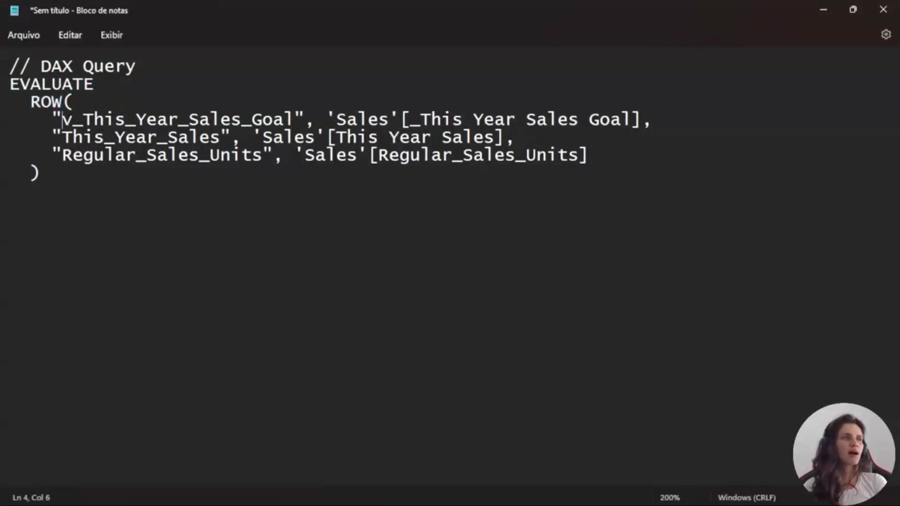
</p>

**Bloco de Notas (Notepad)** com a **consulta DAX** copiada a partir do Performance Analyzer via a opção *"Copiar consulta"*. O código revela exatamente quais medidas o visual "This Year Sales, This Year Sales Meta e Regular Sales Units" executou internamente para exibir seus dados:

```dax
// DAX Query
EVALUATE
  ROW(
    "V_This_Year_Sales_Goal", 'Sales'[_This Year Sales Goal],
    "This_Year_Sales", 'Sales'[This Year Sales],
    "Regular_Sales_Units", 'Sales'[Regular_Sales_Units]
  )
```

A função `EVALUATE` executa a expressão e a função `ROW` retorna uma tabela de linha única com as três medidas mapeadas: a meta de vendas do ano atual, as vendas do ano atual e as unidades de vendas regulares. Essa funcionalidade é útil para depurar e entender o que cada visual está consultando no modelo de dados.

<p align="center">
  
</p>

Arquivo **PowerBIPerformanceData.json** — exportado pelo Performance Analyzer — aberto no **Firefox**, que oferece uma visualização estruturada do JSON. O arquivo registra todos os eventos capturados durante a sessão de gravação. Cada evento contém campos como `name`, `component`, `start`, `end`, `id` e `metrics`. Por exemplo:

- **Evento 0** (`User Action` / `Report Canvas`): `sourceLabel: "userAction_StartedMonitoring"` — marca o início da gravação.
- **Evento 1** (`User Action` / `Report Canvas`): `sourceLabel: "userAction_CrossHighlight"` — registra uma interação de realce cruzado.
- **Evento 2** (`Visual Container Lifecycle` / `Report Canvas`): métricas incluem `visualTitle: "Caixa de texto"`, `visualType: "textbox"`, `initialLoad: false` — indicando o carregamento do visual de caixa de texto.

Esse formato JSON permite análises programáticas externas, exportação para ferramentas de BI ou comparações de desempenho ao longo do tempo. A visualização no navegador (em vez do VS Code) facilita a leitura hierárquica dos dados.

### 🟩 Vídeo 05 - Explorando e Analisando os dados de análise de performance exportada

<video width="60%" controls>
  <source src="000-Midia_e_Anexos/bootcamp_ntt_data-modulo.08-curso.03-video_05.webm" type="video/webm">
    Seu navegador não suporta vídeo HTML5.
</video>

link do vídeo: https://web.dio.me/track/engenharia-dados-python/course/otimizacao-de-modelo-de-dados-com-foco-em-desempenho-no-power-bi/learning/2ea1fe17-1b79-40cf-885b-73b58a8f8202?autoplay=1

A instrutora demonstra como elementos visuais aparentemente inofensivos (como formas e caixas de texto) podem acumular milissegundos preciosos, prejudicando a experiência do usuário. A principal solução proposta é a substituição de múltiplos elementos de design por uma única imagem de fundo estática, criada em ferramentas externas como Figma ou Canva.

### Anotações

<p align="center">
  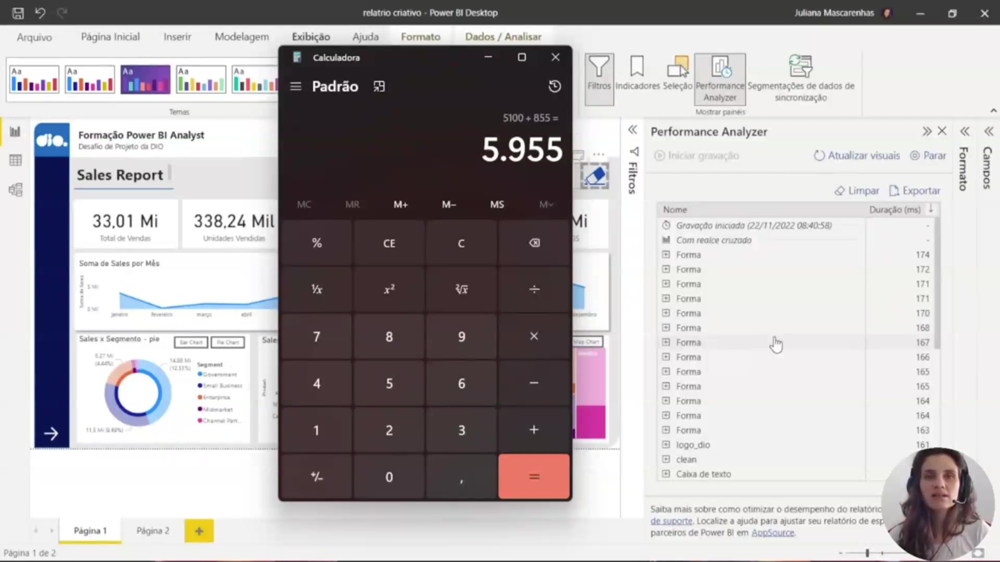
</p>

A imagem mostra a exportação do **Performance Analyzer** do Power BI com a lista de eventos registrados (eventos numerados, session ID e hashes) e detalhes de cada ação capturada no relatório.  

- Cada linha representa um evento monitorado (por exemplo, *User Action*, *Query*, *Report Canvas*), com timestamps e IDs que permitem rastrear a sequência de execução.  
- Esse tipo de exportação é útil para isolar o comportamento de um visual específico: ao salvar apenas as interações daquele visual, você consegue analisar com precisão quais chamadas e queries impactaram o tempo de resposta.  
- A soma acumulada desses tempos pode chegar a segundos perceptíveis para o usuário final, mesmo quando cada item isolado parece pequeno.  
- Priorize clareza dos dados sobre ornamentos visuais; quando precisar de imagens de fundo complexas, prefira imagens estáticas otimizadas (tamanho e formato) ou usar imagens paginadas para reduzir renderização em tempo real.     

### 🟩 Vídeo 06 - Instalando e utilizando o DAX Studio na avaliação das medidas DAX

<video width="60%" controls>
  <source src="000-Midia_e_Anexos/bootcamp_ntt_data-modulo.08-curso.03-video_06.webm" type="video/webm">
    Seu navegador não suporta vídeo HTML5.
</video>

link do vídeo: https://web.dio.me/track/engenharia-dados-python/course/otimizacao-de-modelo-de-dados-com-foco-em-desempenho-no-power-bi/learning/51d5f11a-6fdb-4878-b295-f9f45041d023?autoplay=1

O vídeo explica como o DAX Studio atua como uma ferramenta essencial para analistas que desejam ir além das métricas superficiais do Power BI, permitindo uma investigação profunda da performance de medidas e consultas.

### Anotações

<p align="center">
  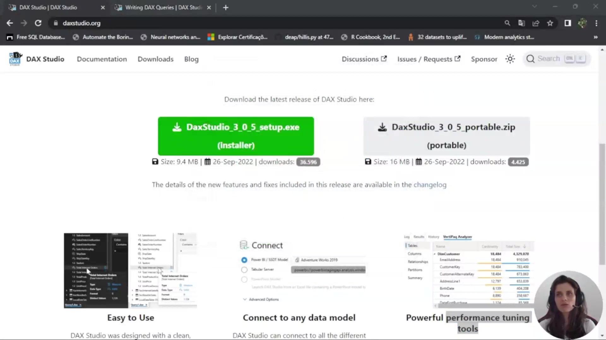
</p>

A tela mostra a página oficial de download do **DAX Studio** (versão 3.0.5).  
No centro aparece o botão verde para baixar o instalador completo (`DaxStudio_3_0_5_setup.exe`) e, ao lado, a versão portátil (`DaxStudio_3_0_5_portable.zip`).  
Essa é a primeira etapa prática da aula: instalar a ferramenta que permite analisar e otimizar medidas DAX diretamente no modelo do Power BI.

<p align="center">
  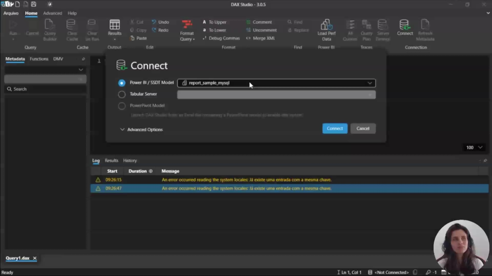
</p>

Aqui vemos a janela **Connect** do DAX Studio.  
O instrutor selecionou o modelo `report_sample_mysql` (Power BI / SSDT Model) e clicou em **Connect**.  
Logo abaixo, no painel **Log**, aparece um erro de sistema operacional:  
> “An error occurred reading the system locales: Já existe uma entrada com a mesma chave.”  

Esse é um problema comum quando o DAX Studio é instalado apenas para o usuário atual. O vídeo mostra a solução: reinstalar escolhendo a opção **“for all users”**.

<p align="center">
  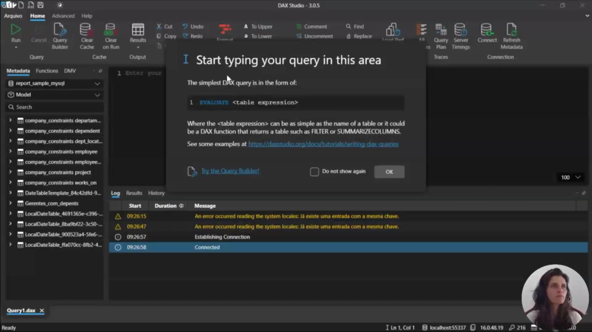
</p>

Após a conexão bem-sucedida com o modelo `financial_sample_dax`, o DAX Studio exibe a janela de boas-vindas:  
**“Start typing your query in this area”**.  
Ele explica que a forma mais simples de consulta DAX é:

```dax
EVALUATE <table expression>
```

O painel esquerdo já mostra todas as tabelas e medidas do modelo carregado. O log confirma: **“Connected”** e **“Establishing Connection”**.

<p align="center">
  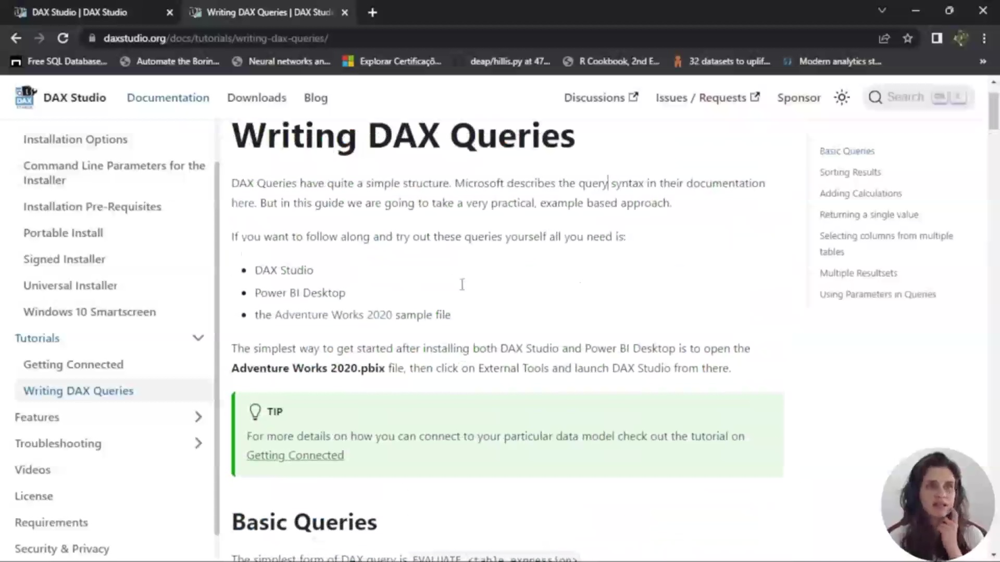
</p>

O navegador abre o tutorial oficial **“Writing DAX Queries”** do site daxstudio.org.  
Essa página explica a sintaxe básica das consultas DAX e serve como guia para quem está começando a usar o DAX Studio.  
O instrutor recomenda acessá-la sempre que precisar de exemplos práticos de `EVALUATE`, `DEFINE MEASURE`, ordenação, múltiplas tabelas, etc.

<p align="center">
  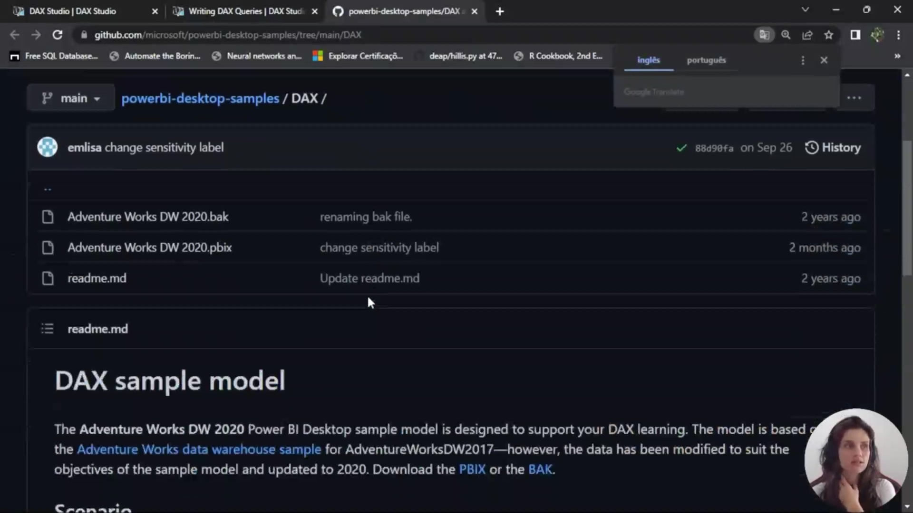
</p>

Tela do repositório GitHub **microsoft/powerbi-desktop-samples** → pasta **DAX**.  
Contém os arquivos de exemplo oficiais do Adventure Works DW 2020 (`.pbix` e `.bak`).  
O instrutor indica que esses arquivos são ideais para praticar as consultas mostradas no DAX Studio sem precisar criar um modelo do zero.

<p align="center">
  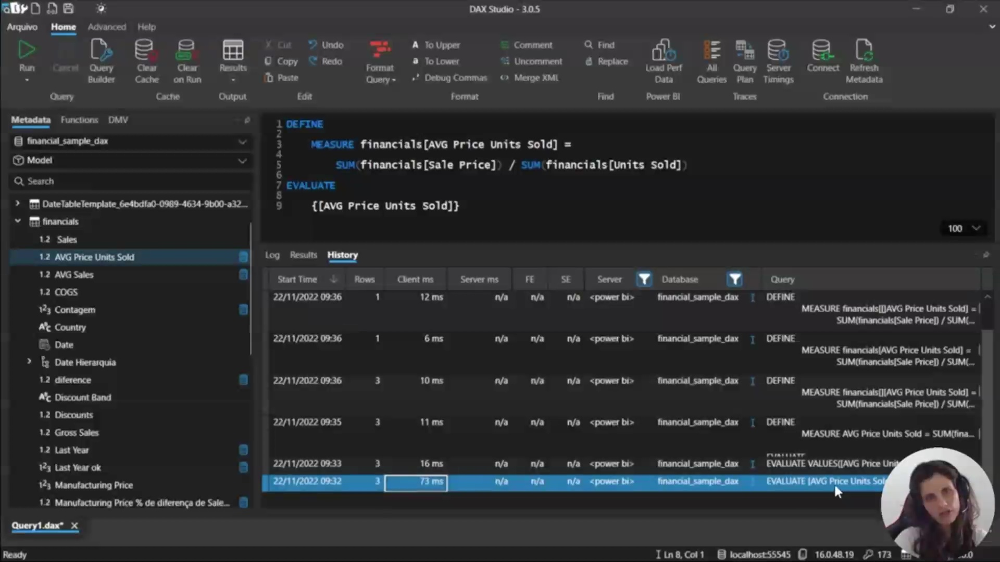
</p>

Primeiro exemplo prático de código no DAX Studio:

```dax
DEFINE
    MEASURE financials[AVG Price Units Sold] =
        SUM(financials[Sale Price]) / SUM(financials[Units Sold])

EVALUATE
    {[AVG Price Units Sold]}
```

O painel **History** mostra que a consulta foi executada em **73 ms** e retornou 1 linha.  
Essa é a forma correta de testar uma medida já existente no modelo: primeiro `DEFINE` e depois `EVALUATE`.

<p align="center">
  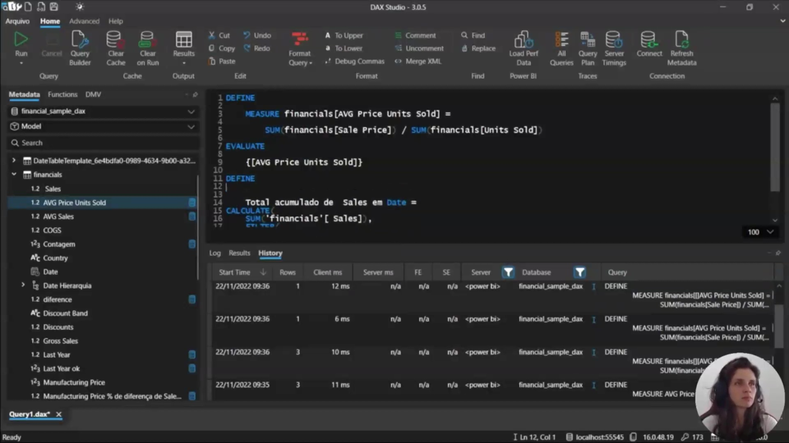
</p>

Início da definição de uma medida mais complexa (acumulado de vendas):

```dax
DEFINE
    MEASURE financials[Total acumulado de Sales em Date] =
        CALCULATE(
            SUM(financials[Sales]),
```

O cursor está posicionado para continuar a cláusula `FILTER`.  
O instrutor está demonstrando como construir uma medida de running total usando `CALCULATE` + `FILTER` + `ALLSELECTED` + `ISONDATER` / `MAX`.

<p align="center">
  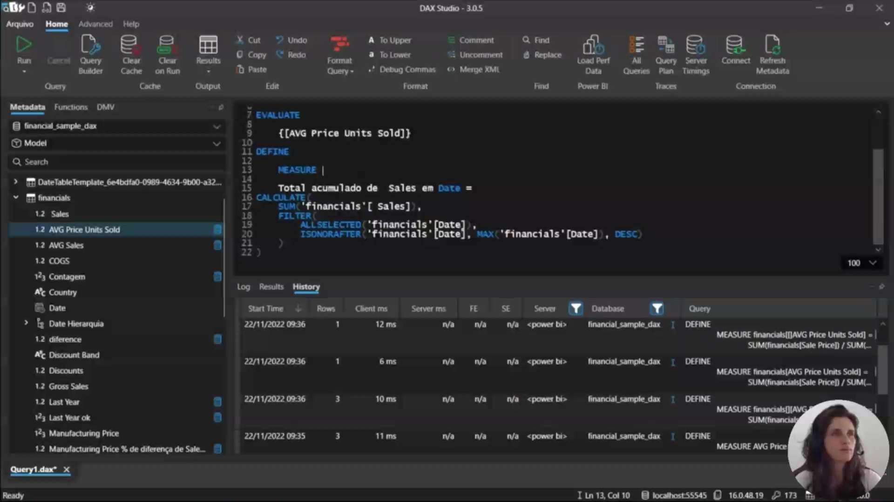
</p>

Continuação da medida de acumulado:

```dax
DEFINE
    MEASURE financials[Total acumulado de Sales em Date] =
        CALCULATE(
            SUM(financials[Sales]),
            FILTER(
                ALLSELECTED(financials[Date]),
                ISONORAFTER(financials[Date], MAX(financials[Date]), DESC)
            )
        )
```

O código completo aparece no editor. Essa é a expressão típica de **total acumulado até a data selecionada**.

<p align="center">
  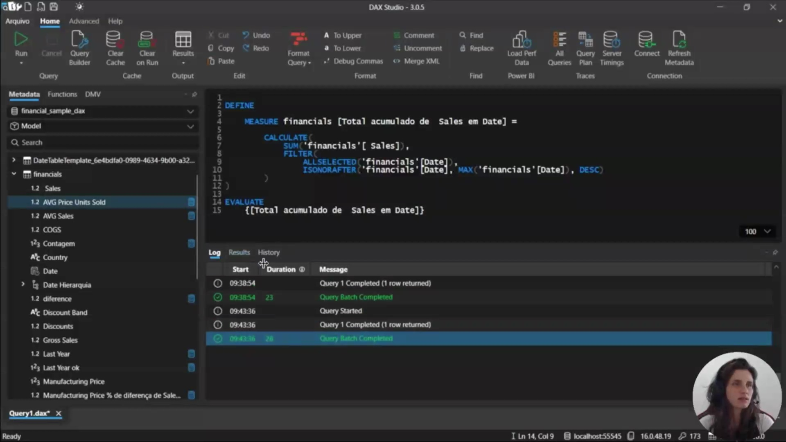
</p>

Consulta final pronta para execução:

```dax
DEFINE
    MEASURE financials[Total acumulado de Sales em Date] = ...

EVALUATE
    {[Total acumulado de Sales em Date]}
```

No painel **Log** vemos o resultado:  
- **Query 1 Completed** → 23 ms  
- **Query Batch Completed** → 28 ms  

O instrutor compara o tempo de execução com a medida simples anterior (5 ms) para mostrar o impacto da complexidade da DAX na performance.      

### 🟩 Vídeo 07 - Falando sobre cache na avaliação de desempenho dos relatórios

<video width="60%" controls>
  <source src="000-Midia_e_Anexos/bootcamp_ntt_data-modulo.08-curso.03-video_07.webm" type="video/webm">
    Seu navegador não suporta vídeo HTML5.
</video>

link do vídeo: https://web.dio.me/track/engenharia-dados-python/course/otimizacao-de-modelo-de-dados-com-foco-em-desempenho-no-power-bi/learning/9abb020c-14a5-4a07-bd51-d693a19843ea?autoplay=1

Este vídeo apresenta as estratégias essenciais para realizar uma análise de desempenho precisa no Power BI, focando especificamente em como o Cache Visual e o Cache do Mecanismo de Dados podem mascarar os resultados reais de performance.

### Anotações

<p align="center">
  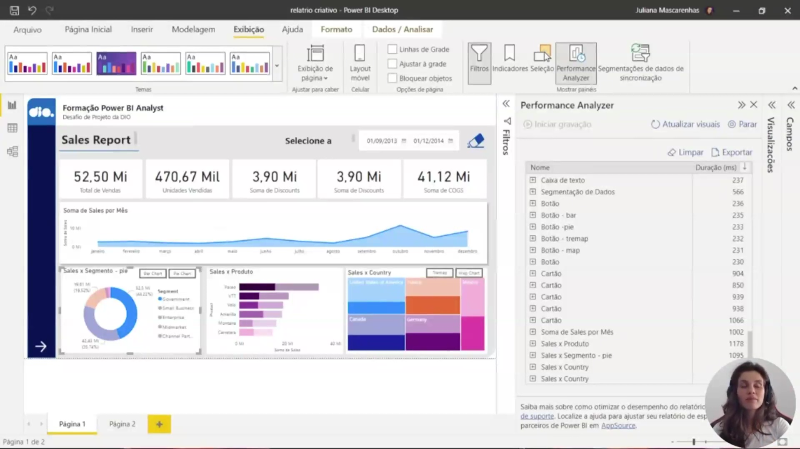
</p>

Nesta tela a instrutora está demonstrando o **Performance Analyzer** aberto ao lado do relatório “Sales Report”.  

Quando abrimos o relatório pela primeira vez, o Power BI já carrega **cache visual** (imagens e layouts dos visuais) e **cache do mecanismo de dados** (resultados das consultas DAX). Isso faz com que os tempos mostrados no Performance Analyzer sejam **artificialmente baixos**. Para analisar o desempenho real do relatório, precisamos eliminar a influência do cache.

<p align="center">
  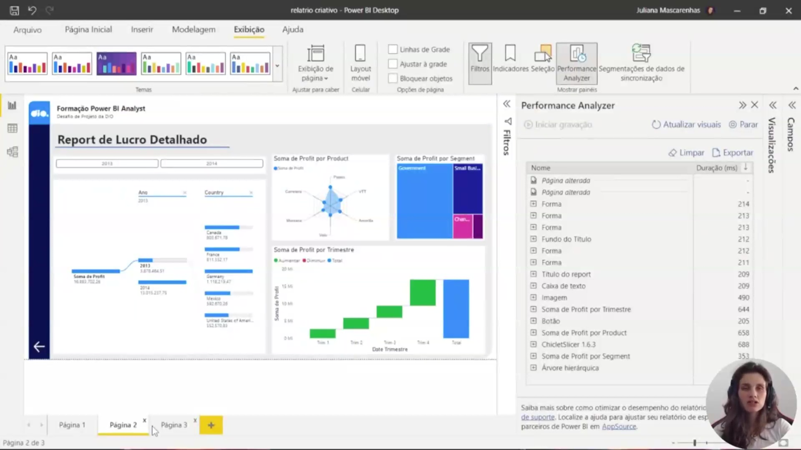
</p>

Agora a instrutora abriu a segunda página (“Report de Lucro Detalhado”). O Performance Analyzer continua aberto e mostra novos itens (Página alterada, Formas, Fundo do Título, Imagem, gráficos de profit, etc.).

**Solução prática:**

1. Crie uma **página nova vazia** no relatório.
2. Salve o arquivo (.pbix).
3. Feche completamente o Power BI Desktop.
4. Reabra o arquivo.

Dessa forma o cache visual e de dados é descartado e o Performance Analyzer mostrará os tempos **reais** de carregamento dos visuais. Essa é a técnica padrão para fazer uma análise confiável de performance antes de otimizar o relatório.

### 🟩 Vídeo 08 - Como avaliar o desempenho do relatório sem a influência do cache?

<video width="60%" controls>
  <source src="000-Midia_e_Anexos/bootcamp_ntt_data-modulo.08-curso.03-video_08.webm" type="video/webm">
    Seu navegador não suporta vídeo HTML5.
</video>

link do vídeo: https://web.dio.me/track/engenharia-dados-python/course/otimizacao-de-modelo-de-dados-com-foco-em-desempenho-no-power-bi/learning/089a3aa7-b3c0-4ad7-9a01-c3cbc077dc30?autoplay=1

Este vídeo demonstra de forma prática como o cache de visualização influencia o tempo de carregamento de relatórios no Power BI. Através da ferramenta Performance Analyzer, a apresentadora compara métricas de carregamento com e sem o cache ativado, revelando a importância de considerar a experiência do usuário final no primeiro acesso.

### Anotações

<p align="center">
  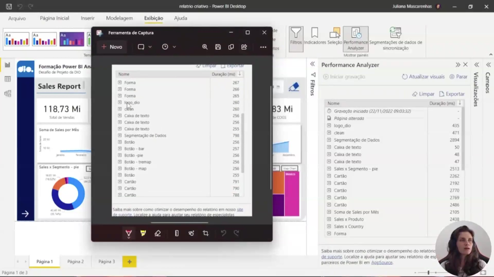
</p>

Nesta captura de tela do Power BI Desktop, vemos simultaneamente duas ferramentas essenciais para análise de desempenho: a **Ferramenta de Captura** (janela central) e o **Performance Analyzer** (painel à direita).  

A Ferramenta de Captura lista os elementos visuais da página (Formas, logo_dio, clean, caixas de texto, Segmentação de Dados, botões, cartões etc.) e registra o tempo exato de cada um em milissegundos. Já o Performance Analyzer mostra o resultado de uma gravação completa, incluindo o tempo total de carregamento de cada visual quando a página é acessada.

Observe os valores comparativos destacados:

- **logo_dio**: 260 ms (captura) × 435 ms (analyzer)  
- **clean**: 260 ms × 471 ms  
- **Segmentação de Dados**: 798 ms × 2.894 ms  

A diferença clara entre os dois conjuntos de números demonstra o impacto real do **cache de visuais** do Power BI. Quando o cache está preenchido (primeira execução), os tempos são menores. Quando o cache é limpo (simulando o primeiro acesso de um usuário), os mesmos elementos demoram consideravelmente mais para renderizar.

Essa comparação prática reforça por que otimizar o desempenho do relatório é fundamental: o usuário final não terá o cache pré-carregado como temos durante o desenvolvimento, e cada milissegundo extra afeta a experiência de navegação. O foco principal aqui é entender como o cache influencia o carregamento de segmentações, cartões e visuais complexos, preparando o terreno para as técnicas de otimização que serão exploradas a seguir.      

### 🟩 Vídeo 09 - Verificando desempenho com relação a atualização dos dados

<video width="60%" controls>
  <source src="000-Midia_e_Anexos/bootcamp_ntt_data-modulo.08-curso.03-video_09.webm" type="video/webm">
    Seu navegador não suporta vídeo HTML5.
</video>

link do vídeo: https://web.dio.me/track/engenharia-dados-python/course/otimizacao-de-modelo-de-dados-com-foco-em-desempenho-no-power-bi/learning/9bc7f3e9-72cb-4e56-91e9-bd5882ed7abc?autoplay=1

Este vídeo apresenta as principais estratégias e ferramentas para analisar e melhorar o tempo de carregamento de relatórios no Power BI, focando no gerenciamento de cache, comparação de fontes de dados e uso de ferramentas externas como o DAX Studio.

### Anotações

<p align="center">
  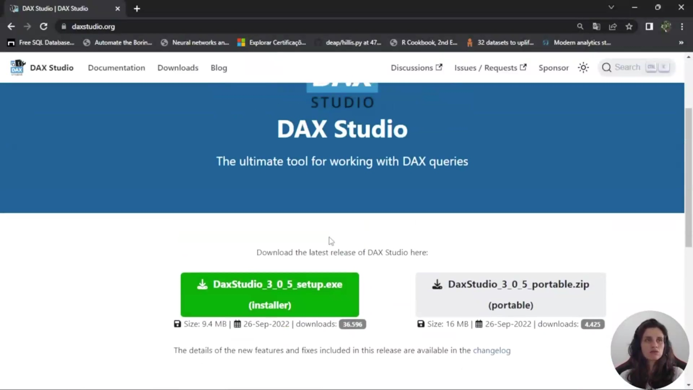
</p>

O **DAX Studio** é a ferramenta oficial e mais completa para trabalhar com consultas DAX. Nesta tela da página inicial (daxstudio.org) vemos claramente as duas opções de download da versão 3.0.5:

- **DaxStudio_3_0_5_setup.exe** (instalador – 9,4 MB)  
- **DaxStudio_3_0_5_portable.zip** (versão portátil – 16 MB)  

Ambas foram lançadas em 26 de setembro de 2022. O DAX Studio permite conectar-se a qualquer modelo de dados tabular (Power BI, Analysis Services, Azure, etc.) e é especialmente útil para análise de performance, execução de consultas DAX e troubleshooting de medidas e cálculos.

<p align="center">
  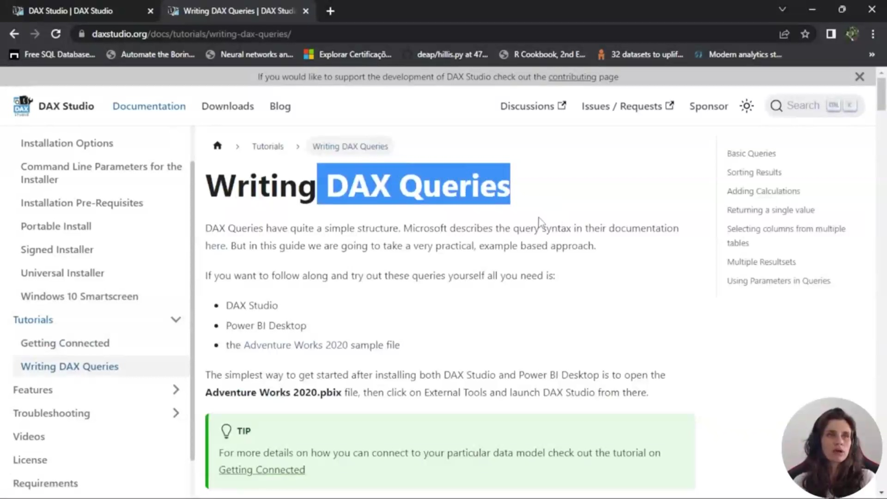
</p>

Dentro da documentação oficial do DAX Studio, a seção **Writing DAX Queries** apresenta uma abordagem 100 % prática e baseada em exemplos. O tutorial explica a estrutura simples das consultas DAX e mostra exatamente o que é necessário para acompanhar os exercícios:

- DAX Studio  
- Power BI Desktop  
- Arquivo de exemplo **Adventure Works 2020**  

<p align="center">
  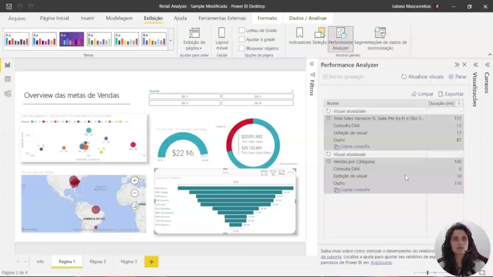
</p>

No menu lateral direito estão listados todos os tópicos importantes: Basic Queries, Sorting Results, Adding Calculations, Returning a single value, Selecting columns from multiple tables, Multiple Resultsets e Using Parameters in Queries. É o local ideal para quem quer aprender a escrever DAX de forma eficiente e profissional.

No **Power BI Desktop**, com o **Performance Analyzer** aberto, conseguimos medir o tempo real de cada visual do relatório “Retail Analysis”.  

O painel à direita mostra, em milissegundos, a divisão exata do processamento:

- **Consulta DAX**  
- **Exibição do visual**  
- **Outros processos** (background)  

Clicando no ícone “Analisar este visual” (presente em cada gráfico), o Performance Analyzer foca apenas naquele elemento, permitindo identificar rapidamente qual visual está consumindo mais tempo e quais medidas ou cálculos precisam ser otimizados. Essa é a forma mais precisa de fazer performance tuning diretamente no relatório.      


### 🟩 Vídeo 10 - Considerações finais sobre otimização de relatórios

<video width="60%" controls>
  <source src="000-Midia_e_Anexos/bootcamp_ntt_data-modulo.08-curso.03-video_10.webm" type="video/webm">
    Seu navegador não suporta vídeo HTML5.
</video>

link do vídeo: https://web.dio.me/track/engenharia-dados-python/course/otimizacao-de-modelo-de-dados-com-foco-em-desempenho-no-power-bi/learning/d9798f3f-379c-4fc5-a71c-9d6ffa3943b5?autoplay=1

O vídeo aborda estratégias fundamentais para a otimização de performance em relatórios do Power BI, enfatizando que lentidões nem sempre derivam de fórmulas DAX complexas. A instrutora destaca a importância de remover colunas e tabelas desnecessárias ainda na fase de coleta de dados para reduzir o peso do modelo e evitar redundâncias. É essencial realizar uma modelagem de dados eficiente, priorizando cardinalidades adequadas e o tratamento de metadados para garantir a consistência das informações. O uso do Performance Analyzer é sugerido como uma ferramenta técnica para identificar se o gargalo está nos visuais ou no processamento de segundo plano. O conteúdo serve como um guia para enxugar a base de dados e focar apenas no que é essencial para o desempenho do projeto.

### Anotações

<p align="center">
  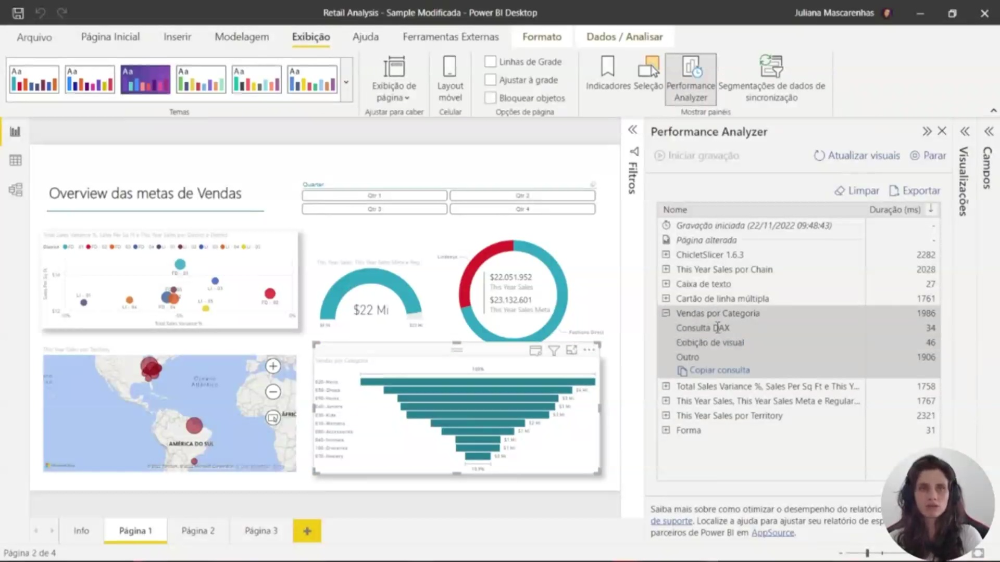
</p>

Nesta captura de tela do Power BI Desktop, o painel **Performance Analyzer** está aberto à direita, exibindo o tempo de execução (em milissegundos) de cada consulta DAX e visual da página “Overview das metas de Vendas”. O relatório contém vários elementos visuais (gráfico de dispersão, medidor, rosca, mapa e funil) e a ferramenta está registrando o desempenho completo da página, incluindo consultas em segundo plano. Esse recurso é utilizado para identificar se o problema de lentidão está nas medidas DAX, nos visuais ou em outros fatores do modelo.

<p align="center">
  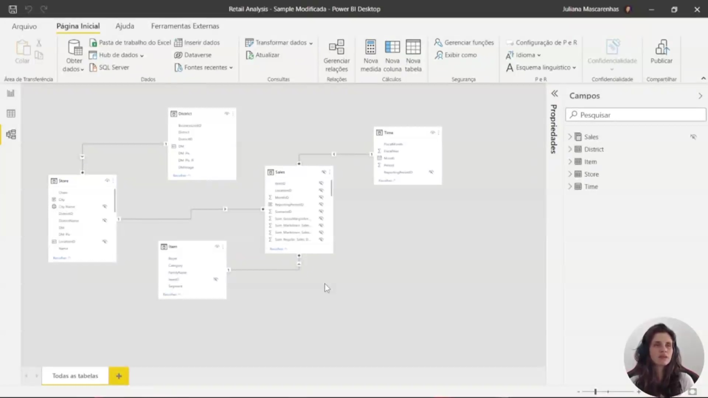
</p>

Na visualização **Modelo de Dados** do Power BI Desktop, vemos o esquema estrela completo com as tabelas **District**, **Store**, **Item**, **Sales** e **Time** e as relações entre elas. O painel Campos à direita lista todas as tabelas e colunas disponíveis. Essa visão é fundamental para compreender a estrutura do modelo e identificar possíveis impactos na performance causados por colunas ou tabelas desnecessárias.

<p align="center">
  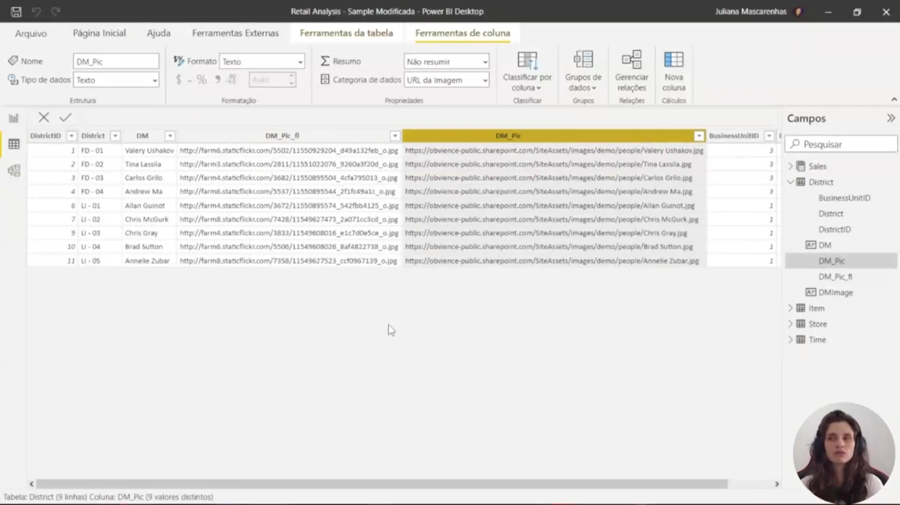
</p>

Na visualização em tabela da tabela **District**, destacam-se as colunas **DM_Pic** e **DM_Pic_fl**, que armazenam URLs completas de imagens (fotos de pessoas). As propriedades da coluna mostram que **DM_Pic** está configurada como “URL da Imagem”. Essas colunas contêm dados que não são utilizados nos visuais do relatório e representam um exemplo clássico de informação desnecessária que pode ser removida para reduzir o tamanho do modelo.

<p align="center">
  
</p>

A página exibe o artigo oficial do Microsoft Learn intitulado **“Técnicas de redução de dados para Modelagem de importação”**. O conteúdo apresenta diretrizes práticas para otimizar modelos de importação no Power BI, incluindo a remoção de colunas e linhas desnecessárias, agrupamento e resumo de dados, e otimização de tipos de dados. Esse material serve como referência complementar para aplicar as melhores práticas de redução de volume de dados e melhorar significativamente o desempenho do relatório.      

# Certificado: Otimização de Modelo de Dados com Foco em Desempenho no Power BI

- Link na plataforma: https://hermes.dio.me/certificates/6JMKE9BD.pdf
- Certificado em pdf: [Certificado-Otimizacao_de_Modelo_de_Dados_com_Foco_em_Desempenho_no_Power_BI.pdf](000-Midia_e_Anexos/Certificado-Otimizacao_de_Modelo_de_Dados_com_Foco_em_Desempenho_no_Power_BI.pdf)