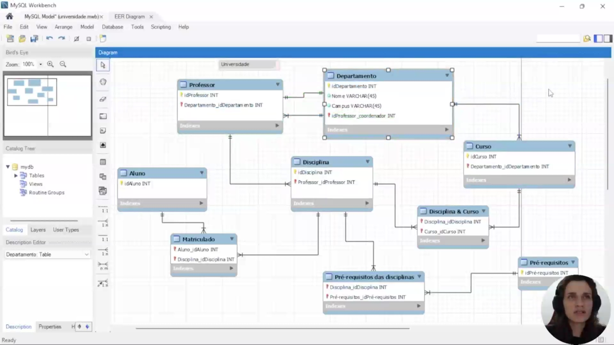
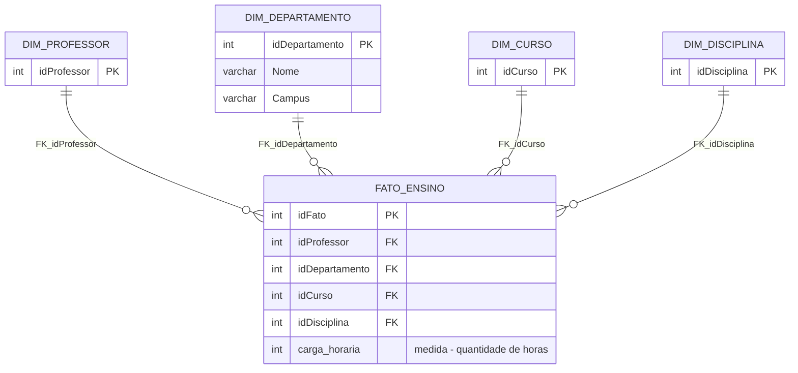
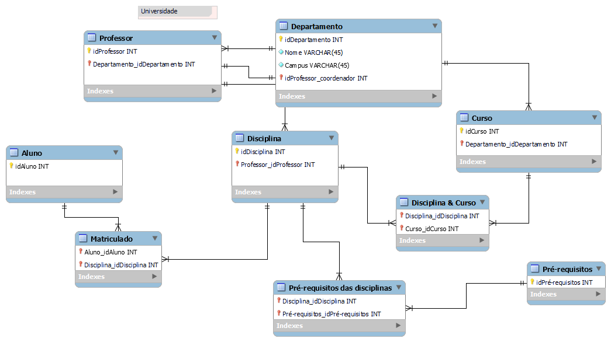

## Instrutor:

- Juliana Mascarenhas (Tech Education Specialist / Sócia (Content Creator) @SimplificandoRedes / Me Modelagem Computacional / Cientista de dados)
- Contato Linkedin: / [juliana-mascarenhas-ds](https://www.linkedin.com/in/juliana-mascarenhas-ds/)

## Vídeo 01 - Criando um Star Schema para Cenários de Vendas com Power BI

<video width="60%" controls>
  <source src="000-Midia_e_Anexos/bootcamp_ntt_data-modulo.08-curso.05-video_01.webm" type="video/webm">
    Seu navegador não suporta vídeo HTML5.
</video>

link do vídeo: https://web.dio.me/lab/criando-um-star-schema-para-cenarios-de-vendas-com-power-bi/learning/c97e6b8e-f5d4-46bc-adea-0b9c67fb8b3c?back=/track/engenharia-dados-python

O desafio foca na prática de modelagem dimensional, transformando um esquema de banco de dados relacional (transacional) em um esquema em estrela (Star Schema), otimizado para análise de dados.

### Anotações

  

O diagrama EER exibido no MySQL Workbench apresenta o modelo relacional completo da universidade. Nele estão representadas todas as entidades e os relacionamentos necessários para o banco de dados transacional, incluindo as tabelas associativas geradas a partir de relacionamentos muitos-para-muitos.

As entidades e seus principais atributos são:

- **Professor**  
  `idProfessor` (INT)  
  `Departamento_idDepartamento` (INT)

- **Departamento**  
  `idDepartamento` (INT)  
  `Nome` (VARCHAR(45))  
  `Campus` (VARCHAR(45))  
  `idProfessor_coordenador` (INT)

- **Curso**  
  `idCurso` (INT)  
  `Departamento_idDepartamento` (INT)

- **Disciplina**  
  `idDisciplina` (INT)  
  `Professor_idProfessor` (INT)

- **Aluno**  
  `idAluno` (INT)

- **Matriculado** (tabela associativa)  
  `Aluno_idAluno` (INT)  
  `Disciplina_idDisciplina` (INT)

- **Disciplina & Curso** (tabela associativa)  
  `Disciplina_idDisciplina` (INT)  
  `Curso_idCurso` (INT)

- **Pré-requisitos das disciplinas** (tabela associativa)  
  `Disciplina_idDisciplina` (INT)  
  `Pré-requisitos_idPré-requisitos` (INT)

- **Pré-requisitos**  
  `idPré-requisitos` (INT)

As linhas de relacionamento mostram claramente as chaves estrangeiras que ligam as tabelas (por exemplo, Professor → Departamento, Disciplina → Professor, Curso → Departamento, etc.).

Este é o esquema relacional de origem que servirá de base para o desafio: transformar o modelo transacional em um **star schema** (esquema em estrela). Com o foco definido em Professor, será possível identificar as dimensões relevantes (Professor, Departamento, Curso, Disciplina) e construir uma tabela de fatos central contendo as medidas de negócio (quantidade de disciplinas ministradas, horas-aula, etc.), eliminando tabelas auxiliares como Aluno e as tabelas associativas puramente operacionais para simplificar as análises dimensionais.      

#### **Star Schema preliminar** (foco em Professor, conforme o desafio)

Descrição:

- **Tabela Fato central (prefixo FATO_)**: `FATO_ENSINO` – contém as medidas de negócio (ex.: carga horária) e as chaves estrangeiras para as dimensões.
- **Dimensões (prefixo DIM_)**: `DIM_PROFESSOR`, `DIM_DEPARTAMENTO`, `DIM_CURSO` e `DIM_DISCIPLINA`. São as tabelas que guardam os atributos descritivos (quem, o quê, quando, onde, como).
- Tabelas `ALUNO`, `MATRICULADO`, `PRÉ-REQUISITOS` e `DISCIPLINA_&amp;_CURSO` foram eliminadas para simplificar a análise dimensional, mantendo apenas o necessário para responder às perguntas sobre professores, departamentos, cursos ministrados e quantidade de horas.

## 🟩 Descrição do desafio de modelagem dimensional

### Objetivo

Criar o diagrama dimensional – star schema – com base no diagrama relacional disponibilizado.

### Foco: Professor (objeto de análise)

Vocês irão montar o esquema em estrela com o foco na análise dos dados dos professores. Sendo assim, a tabela fato deve refletir diversos dados sobre professor, cursos ministrados, departamento ao qual faz parte.... Por aí vocês já têm uma ideia do que deve compor a tabela fato do modelo em questão. 

Obs.: Não é necessário refletir dados sobre os alunos!

### O que deve ser feito?

Deverá ser criada a tabela Fato que contêm o contexto analisado. Da mesma forma, é necessária a criação das tabelas dimensão que serão compostas pelos detalhes relacionados ao contexto.

Por fim, mas não menos importante, adicione uma tabela dimensão de datas. Para compensar a falta de dados de datas do modelo relacional, suponha que você tem acesso aos dados e crie os campos necessários para modelagem. 

Ex: data de oferta das disciplinas, data de oferta dos cursos, entre outros. O formato, ou melhor, a granularidade, não está fixada. Podem ser utilizados diferentes formatos que correspondem a diferentes níveis de granularidade.

### Imagem de referência

  

# Certificado: Dashboard de Vendas com Power BI utilizando Star Schema

- Link na plataforma: 
- Certificado em pdf: 
