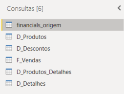
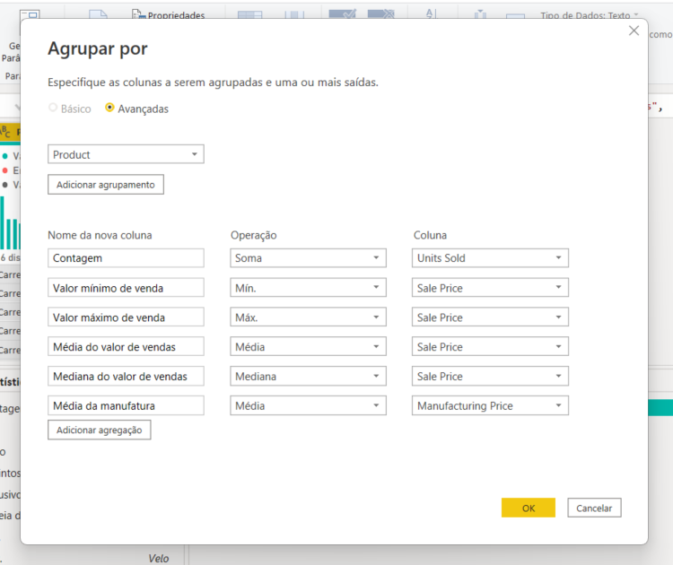
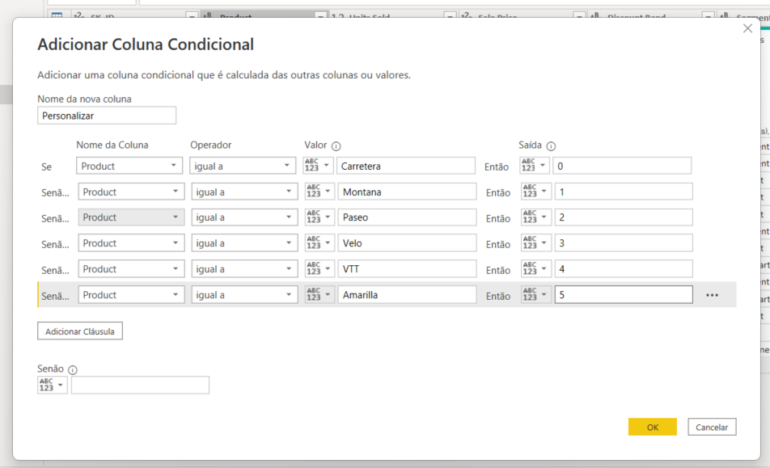
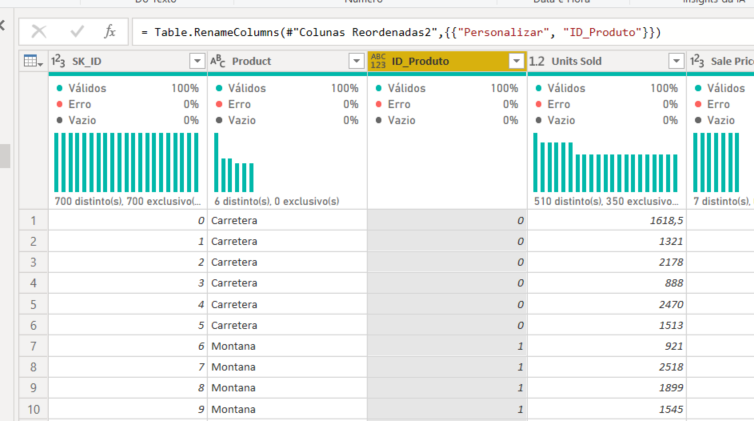

## Instrutor:

- Juliana Mascarenhas (Tech Education Specialist / Sócia (Content Creator) @SimplificandoRedes / Me Modelagem Computacional / Cientista de dados)
- Contato Linkedin: / [juliana-mascarenhas-ds](https://www.linkedin.com/in/juliana-mascarenhas-ds/)

### 🟩 Vídeo 01 - Modelagem e Transformação de dados com DAX com Power BI

<video width="60%" controls>
  <source src="000-Midia_e_Anexos/bootcamp_ntt_data-modulo.08-curso.06-video_01.webm" type="video/webm">
    Seu navegador não suporta vídeo HTML5.
</video>

link do vídeo: https://web.dio.me/project/modelagem-e-transformacao-de-dados-com-dax-com-power-bi/learning/b1c8ea6c-0b78-4d47-a873-9d911d79660b?back=/track/engenharia-dados-python&tab=undefined&moduleId=undefined

## Descrição do Desafio de Projeto

Utilizaremos a tabela única de Financial Sample para criar as tabelas dimensão e fato do nosso modelo baseado em star schema.
O processo consiste na criação das tabelas com base na tabela original. A partir da cópia serão selecionadas as colunas que irão compor a visão da nova tabela. Sendo assim, a partir da tabela principal serão criadas as tabelas: 

- Financials_origem (modo oculto – backup)
- D_Produtos (ID_produto, Produto, Média de Unidades Vendidas, Médias do valor de vendas, Mediana do valor de vendas, Valor máximo de Venda, Valor mínimo de Venda)
- D_Produtos_Detalhes(ID_produtos, Discount Band, Sale Price,  Units Sold, Manufactoring Price)
- D_Descontos (ID_produto, Discount, Discount Band)
- D_Detalhes (*)
- D_Calendário – Criada por DAX com calendar()
- F_Vendas (SK_ID , ID_Produto, Produto, Units Sold, Sales Price, Discount  Band, Segment, Country, Salers, Profit, Date (campos))

  

*Verifique as informações que não foram contempladas nas demais tabelas dimensão que fornecem maiores detalhes sobre vendas.
Exemplo de tabela criada por agrupamento das informações:

  

Exemplo de coluna sendo construída a partir de condicional – Índice de Produtos:

  

Reorganize as colunas:

  

Não se esqueça de salvar seu projeto para submeter ao Github. O link do seu repositório é utilizado na submissão do seu desafio de projeto. 

Você pode utilizar os seguintes pontos como base:
    • Salve o projeto .pbix
    • Salve uma imagem do seu esquema em estrela
    • Escreva no readme o processo de construção do seu diagrama
    • Fale sobre as etapas as funcionalidades e funções DAX utilizadas neste projeto

Utilize o repositório do Github como uma descrição do seu projeto para auxiliar outras pessoas e ser visto pelos recrutadores.

# Certificado: 

- Link na plataforma: 
- Certificado em pdf: 
