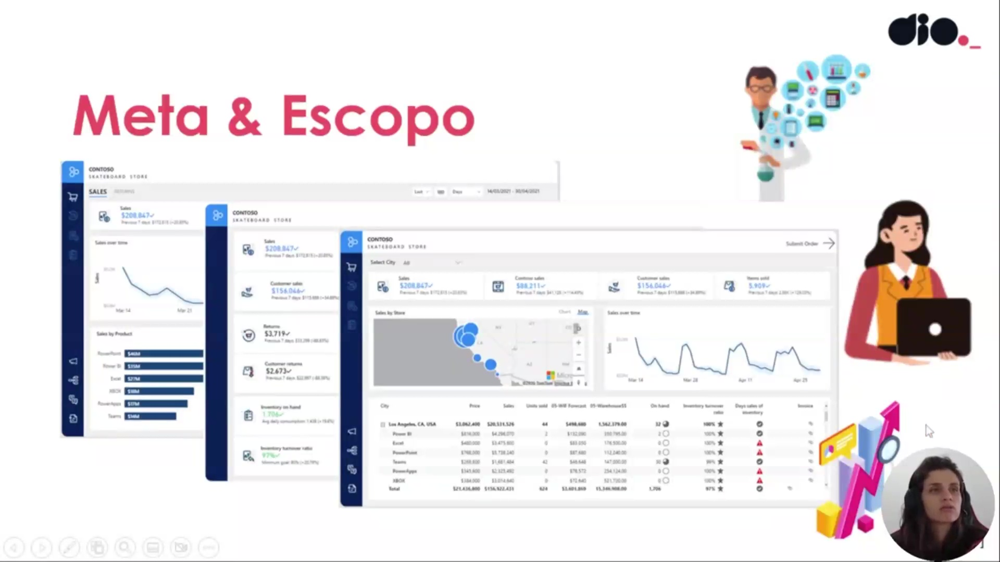
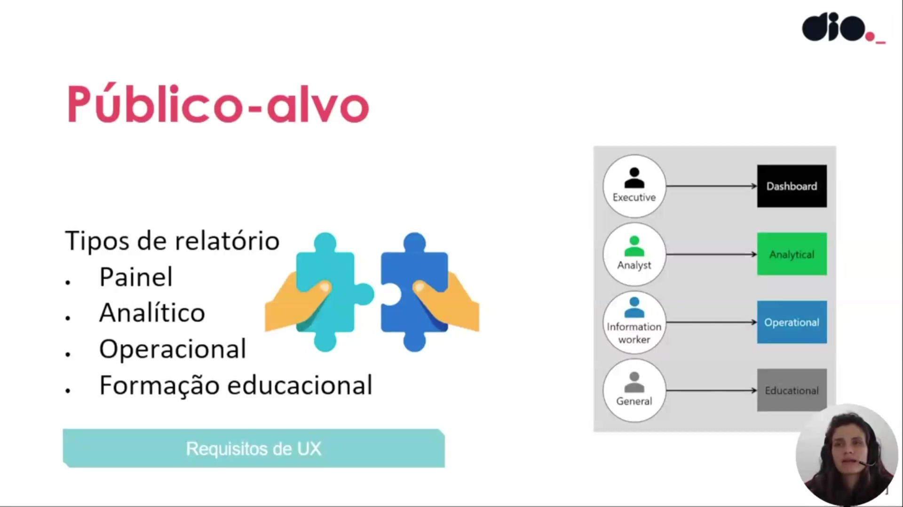
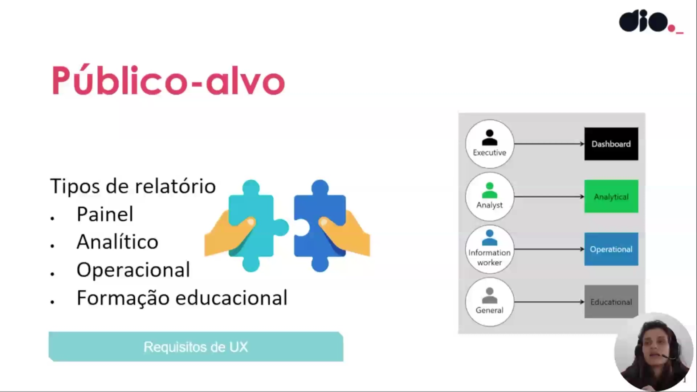
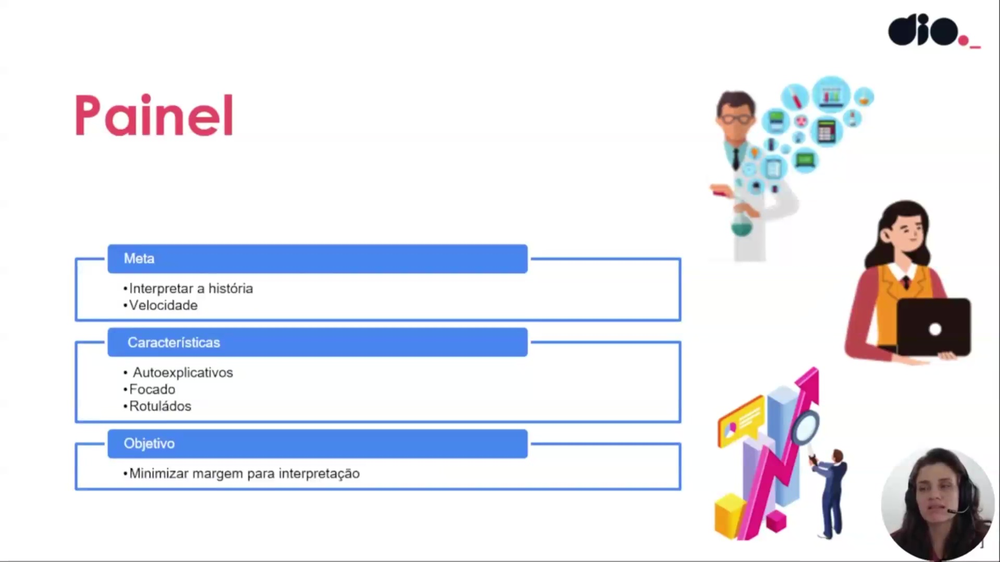
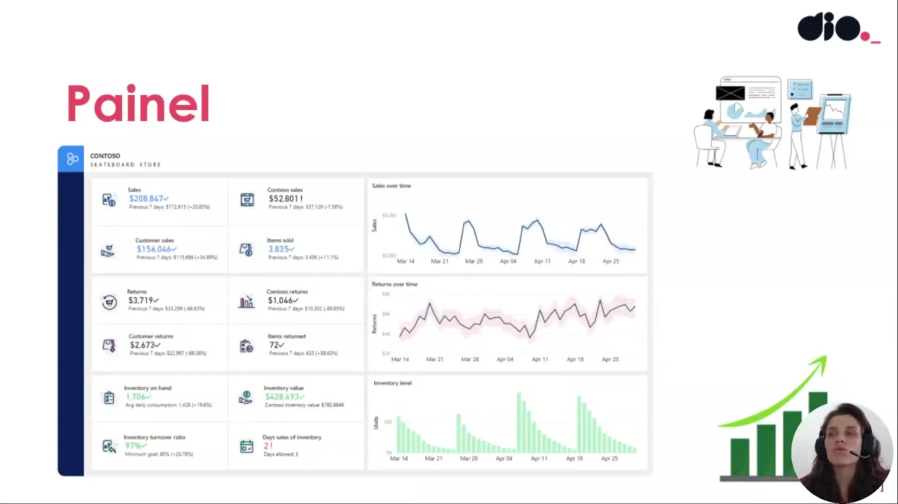
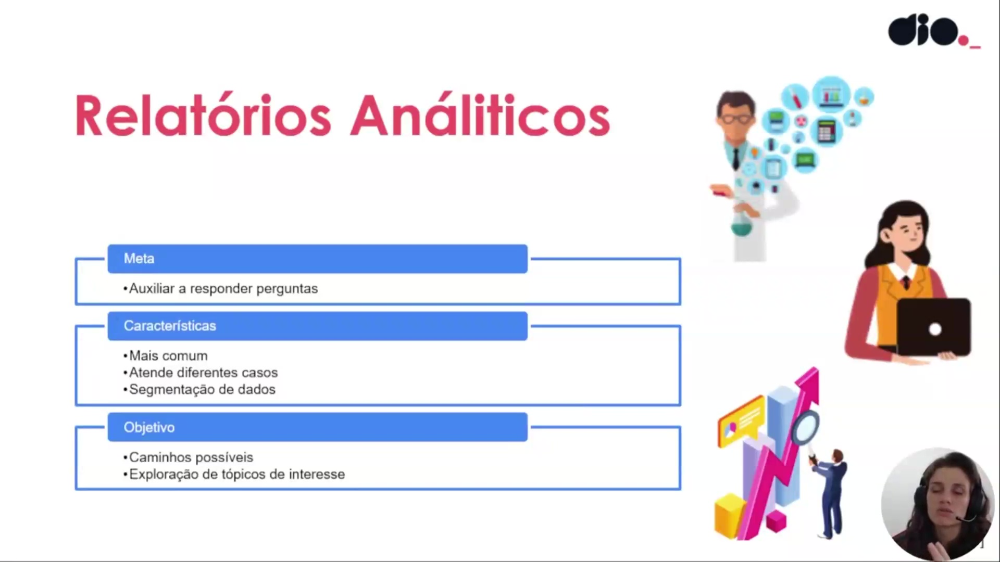
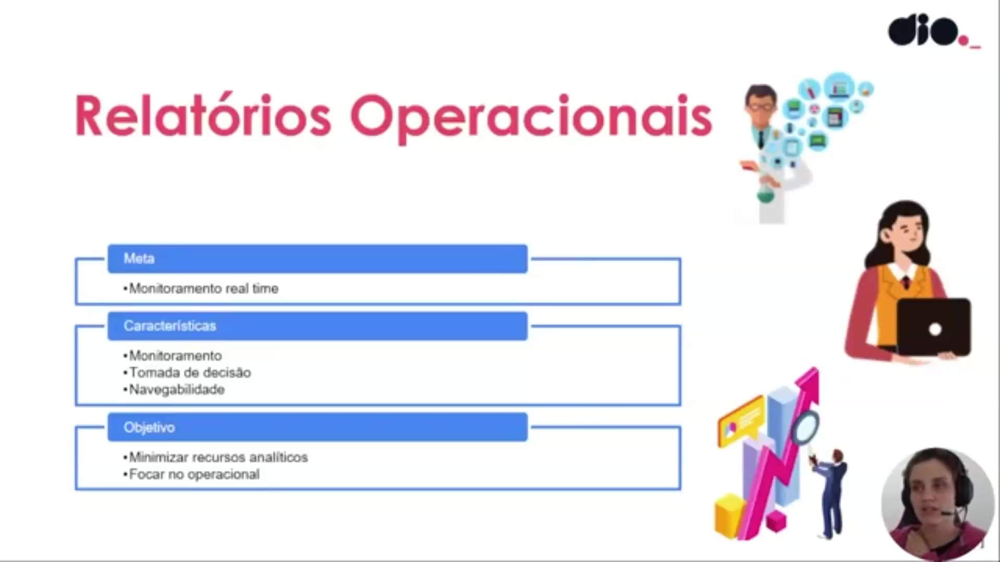
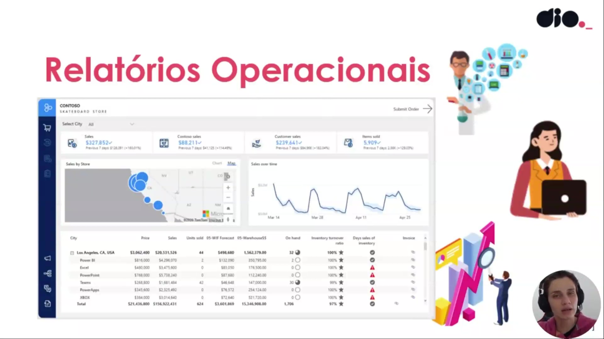
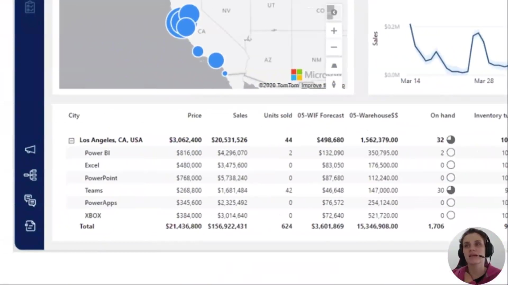
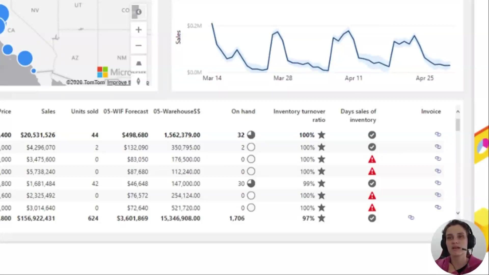

## Instrutor:

- Juliana Mascarenhas (Tech Education Specialist / Sócia (Content Creator) @SimplificandoRedes / Me Modelagem Computacional / Cientista de dados)
- Contato Linkedin: / [juliana-mascarenhas-ds](https://www.linkedin.com/in/juliana-mascarenhas-ds/)

## Parte 1 - Relatórios & Experiência do Usuário no Power BI

### 🟩 Vídeo 01 - Criando Relatórios com foco em experiência do usuário

<video width="60%" controls>
  <source src="000-Midia_e_Anexos/bootcamp_ntt_data-modulo.09-curso.01-video_01.webm" type="video/webm">
    Seu navegador não suporta vídeo HTML5.
</video>

link do vídeo: https://web.dio.me/track/engenharia-dados-python/course/relatorios-experiencia-do-usuario-no-power-bi/learning/164f5141-d5c3-4e4e-ba89-f9fb54269c32?autoplay=1

Este módulo do curso de Power BI Analyst foca na transição do papel técnico do analista de dados para uma abordagem centrada no usuário. O objetivo principal é entender que a disposição dos resultados, a escolha das cores e o posicionamento dos elementos são cruciais para a eficácia de um relatório, já que o destino final de qualquer dado é a tomada de decisão por pessoas.

### Anotações

  

Este slide de abertura introduz o módulo da Formação Power BI Analyst dedicado à criação de relatórios com foco em experiência do usuário. Apresenta o título principal do conteúdo, o nome da instrutora Juliana Mascarenhas e suas credenciais como Tech Education Specialist na DIO, proprietária dos canais @Simplificandoredes e @SimplificandoProgramacao, mestre em modelagem computacional e cientista de dados. O layout limpo e o destaque visual estabelecem o tom do curso: priorizar a usabilidade e o design centrado no usuário ao construir dashboards no Power BI.

  

Este slide conceitual define a seção “Meta & Escopo” e lista os quatro pilares iniciais que devem guiar a construção de qualquer relatório no Power BI: identificar o público-alvo (“Quem quero alcançar?”), definir o tipo de relatório necessário, estabelecer os requisitos de interface e, principalmente, projetar com foco na experiência do usuário. A ilustração à direita, com ícones de dados e personas, reforça visualmente que o sucesso do dashboard depende de alinhamento estratégico desde o início do projeto.

  

Neste slide são apresentados três exemplos reais de dashboards criados com o mesmo conjunto de dados da Contoso Skateboard Store. À esquerda, um layout mais simples com gráfico de linha de vendas ao longo do tempo e barras de produtos. No centro, uma visão intermediária com cards de KPIs e métricas resumidas. À direita, um dashboard completo com mapa geográfico, gráfico de série temporal, tabela detalhada e filtros interativos. A comparação demonstra como um único modelo de dados pode gerar visualizações completamente distintas conforme o objetivo e o perfil do usuário final.

  

Este slide detalha os requisitos técnicos e de governança essenciais para relatórios no Power BI. São destacados dois pontos fundamentais: a exibição padrão dos dados e da lógica de negócios (garantindo consistência visual e interpretativa) e a criação de uma “fonte única da verdade”. A seção “Entregar dados atualizados” especifica os prazos recomendados: vendas atualizadas a cada 24 horas e inventário a cada 1 hora. Esses critérios garantem que o relatório seja confiável e alinhado às demandas operacionais da empresa.

  

Continuando a lista de requisitos necessários, este slide enfatiza quatro aspectos complementares: disponibilidade contínua dos dados, criação de relatórios naturais e amigáveis, capacidade de fornecer novos insights e o cumprimento do padrão de marca corporativa. A ilustração à direita reforça a ideia de que o relatório deve ser intuitivo, visualmente atraente e consistente com a identidade visual da organização, transformando dados brutos em uma ferramenta de decisão acessível e profissional.      

### 🟩 Vídeo 02 - Requisitos mínimos dos relatórios & Público-alvo

<video width="60%" controls>
  <source src="000-Midia_e_Anexos/bootcamp_ntt_data-modulo.09-curso.01-video_02.webm" type="video/webm">
    Seu navegador não suporta vídeo HTML5.
</video>

link do vídeo: https://web.dio.me/track/engenharia-dados-python/course/relatorios-experiencia-do-usuario-no-power-bi/learning/15f11935-e71f-4ef6-86a3-75499cad535a?autoplay=1

O vídeo aborda as melhores práticas para a criação de relatórios de dados, destacando a importância da profundidade das informações, a consistência da marca corporativa e a personalização do conteúdo para diferentes perfis de usuários: Executivos, Analistas e Operadores.

### Anotações

  

O slide apresenta os **Requisitos Necessários** para a construção de relatórios de dados eficazes.  

São listados quatro pilares fundamentais:  
- **Disponibilidade de dados**  
- **Relatórios naturais e amigáveis**  
- **Fornecendo novos insights**  
- **Padrão de marca corporativa**  

Esses elementos garantem que o relatório seja acessível, intuitivo, capaz de gerar valor real para o usuário e alinhado à identidade visual da organização. As ilustrações reforçam visualmente a ideia de análise e visualização de informações, com ícones de gráficos, profissionais e elementos de dados.

  

Este slide introduz o **Público-alvo** e sua influência direta no relatório final.  

- **Executivo**: precisa de um painel objetivo com KPIs claros e de alto nível para decisões de médio e longo prazo.
- **Analista**: necessita de dados mais descritivos e detalhados para verificar metas, KPIs e propor otimizações de processos.
- **Operador de informações**:  busca informações atualizadas e operacionais (por exemplo, níveis de estoque) para ações do dia a dia.

  

Este slide organiza tipos de relatório e requisitos de UX: tipos listados incluem Painel, Analítico, Operacional e Formação educacional. 

A seção de UX mapeia perfis (Executive; Analyst; Analytical; Information worker; Operational; General; Educational) para necessidades de interface — por exemplo, dashboards executivos para visão rápida, painéis analíticos para exploração e relatórios operacionais para acompanhamento em tempo real.

 O objetivo é alinhar formato e interatividade do relatório ao tipo de usuário e ao propósito (monitoramento, análise ou operação). 

### 🟩 Vídeo 03 - Tipos de Relatórios de acordo com perfil do usuário

<video width="60%" controls>
  <source src="000-Midia_e_Anexos/bootcamp_ntt_data-modulo.09-curso.01-video_03.webm" type="video/webm">
    Seu navegador não suporta vídeo HTML5.
</video>

link do vídeo: https://web.dio.me/track/engenharia-dados-python/course/relatorios-experiencia-do-usuario-no-power-bi/learning/3296d0bc-805f-4a09-af25-d6ade544b6c5?autoplay=1

O vídeo destaca a importância de alinhar o design e o tipo de relatório ao público-alvo específico. A escolha correta do formato garante que as necessidades dos usuários sejam atendidas com assertividade, seja para uma visão executiva rápida ou para uma análise operacional detalhada.

### Anotações

  

Nesta imagem, o foco está na relação entre **público-alvo** e os **tipos de relatório** que podem ser utilizados.  
O ponto central é que cada perfil de usuário demanda uma abordagem distinta:

- **Executivos** → utilizam **dashboards**, pois precisam de uma visão consolidada e rápida para tomada de decisão.  
- **Analistas** → trabalham com relatórios **analíticos**, que permitem explorar dados em maior profundidade.  
- **Profissionais operacionais** → dependem de relatórios **operacionais**, voltados para o acompanhamento de processos e execução de tarefas.  
- **Usuários gerais ou educacionais** → recebem relatórios de **formação educacional**, que apresentam informações de forma mais acessível, sem exigir conhecimento prévio do contexto dos dados.

A ideia é que o design do relatório seja sempre mapeado às necessidades do público, garantindo uma experiência de usuário (UX) adequada e assertiva.
      
### 🟩 Vídeo 04 - Destrinchando os tipos de relatórios

<video width="60%" controls>
  <source src="000-Midia_e_Anexos/bootcamp_ntt_data-modulo.09-curso.01-video_04.webm" type="video/webm">
    Seu navegador não suporta vídeo HTML5.
</video>

link do vídeo: https://web.dio.me/track/engenharia-dados-python/course/relatorios-experiencia-do-usuario-no-power-bi/learning/791d9a43-1a29-4399-9908-e7d7b9a9e18c?autoplay=1https://web.dio.me/track/engenharia-dados-python/course/relatorios-experiencia-do-usuario-no-power-bi/learning/791d9a43-1a29-4399-9908-e7d7b9a9e18c?autoplay=1

O vídeo explora as diferentes abordagens para a criação de relatórios de dados, focando em dois tipos principais: Dashboards Executivos e Relatórios Analíticos. O objetivo é alinhar a complexidade e o formato da visualização com as necessidades específicas do público-alvo, garantindo que a "história" dos dados seja contada de forma eficaz, seja para uma tomada de decisão rápida ou para uma investigação profunda.

### Anotações

  

Este slide conceitual introduz o conceito de **Painel** (dashboard), um formato de relatório otimizado para executivos que precisam interpretar rapidamente a história por trás dos dados.

- **Meta**: Interpretar a história com velocidade, priorizando a agilidade na compreensão das informações.
- **Características**: Os visuais devem ser autoexplicativos, focados e rotulados de forma clara, limitando interações desnecessárias.
- **Objetivo**: Minimizar a margem para interpretação, garantindo que o significado dos dados seja comunicado de maneira direta e inequívoca.

Essa abordagem é ideal para decisões estratégicas baseadas em métricas de alto nível apresentadas em uma única página.

  

Este é um exemplo prático de painel executivo para a loja de skateboards Contoso. O layout concentra métricas chave em uma única tela: vendas totais, vendas por cliente, retornos, itens vendidos e devolvidos, além de indicadores de inventário (quantidade em estoque, valor, rotatividade e dias de estoque).

Os gráficos de linha destacam a evolução das vendas e retornos ao longo do tempo (últimos 7 dias), enquanto o histograma mostra o nível de inventário. Destaques visuais, como setas de variação e alertas, reforçam a clareza e a rapidez na leitura, alinhando-se perfeitamente aos princípios de painéis autoexplicativos e focados.

  

Este exemplo ilustra o conceito de **dados temporais implícitos**. Trata-se do célebre mapa da campanha de Napoleão na Rússia (1812-1813), criado por Charles Minard.

A espessura da linha representa o tamanho do exército em cada etapa da marcha, com a cor diferenciando o avanço (claro) da retirada (escuro). A parte inferior inclui um gráfico de temperatura, correlacionando as condições climáticas às perdas sofridas.

Sem eixos temporais explícitos, o design espacial conta uma narrativa impactante sobre as perdas progressivas, demonstrando como visualizações criativas podem incorporar o tempo de forma implícita e poderosa para storytelling.

  

Este slide apresenta os **Relatórios Analíticos**, direcionados ao público de analistas de dados.

- **Meta**: Auxiliar na resposta a perguntas, facilitando a descoberta de insights.
- **Características**: É o tipo mais comum de relatório, atende a diversos casos de uso e suporta segmentação de dados.
- **Objetivo**: Proporcionar caminhos possíveis e a exploração de tópicos de interesse, permitindo análises mais investigativas e interativas.

Diferentemente dos painéis executivos, esses relatórios oferecem maior flexibilidade para perguntas exploratórias e múltiplas perspectivas sobre os mesmos dados.      

### 🟩 Vídeo 05 - O que são relatórios Operacionais e educacionais?

<video width="60%" controls>
  <source src="000-Midia_e_Anexos/bootcamp_ntt_data-modulo.09-curso.01-video_05.webm" type="video/webm">
    Seu navegador não suporta vídeo HTML5.
</video>

link do vídeo: https://web.dio.me/track/engenharia-dados-python/course/relatorios-experiencia-do-usuario-no-power-bi/learning/080a17e9-4b55-449f-bed5-aa5b27790a2d?autoplay=1

O vídeo apresenta as nuances entre diferentes tipos de dashboards, focando em como o design e a funcionalidade devem se adaptar ao público-alvo e ao objetivo final, seja ele a tomada de decisão imediata ou a disseminação de informações complexas para o grande público.

### Anotações

  

Os relatórios operacionais são projetados para que o usuário final consiga **monitorar dados em tempo real** e tomar decisões operacionais imediatas.  

Como destacado no slide, a **meta** é o monitoramento contínuo, as **características** principais são monitoramento, tomada de decisão e navegabilidade, e o **objetivo** é minimizar recursos analíticos para manter o foco exclusivamente na operação do dia a dia.  

Essa estrutura transforma o relatório em um verdadeiro “hub” de ação, com botões, marcadores e fluxos lógicos que permitem ao usuário navegar, executar ações externas e verificar o status operacional sem precisar realizar análises profundas.

  

Exemplo prático de relatório operacional: painel da **Contoso Skateboard Store**.  

O dashboard apresenta, em uma única tela, os principais indicadores de vendas em tempo real (vendas totais, vendas da Contoso, vendas por cliente e itens vendidos), um mapa com distribuição geográfica (bolhas na Califórnia), um gráfico de evolução de vendas ao longo do tempo e uma tabela detalhada com dados por localização e produto.  

A tabela inclui colunas como preço, vendas, unidades vendidas, forecast de WI-FI, custo de warehouse, estoque disponível, turnover de inventário, dias de venda de estoque e status de invoice. Ícones visuais (estrelas, círculos, alertas) facilitam a leitura rápida do estado da operação.

  

Visão ampliada da parte superior da tabela do relatório operacional.  

Aqui é possível observar com clareza os dados do item “Los Angeles, CA, USA” e os valores específicos para cada produto (Power BI, Excel, PowerPoint, Teams, PowerApps e Xbox), incluindo preço, vendas realizadas, unidades vendidas, forecast, custo de armazém e quantidade em estoque.  

Essa granularidade permite ao operador verificar rapidamente o desempenho de cada linha de produto ou fonte de dados.

  

Detalhe da seção inferior da tabela do relatório operacional, com foco nas métricas de eficiência de estoque.  

São exibidas as colunas de “On hand”, “Inventory turnover ratio” (com percentual e estrelas), “Days sales of inventory” e o status do “Invoice” (ícones de check ou alerta).  

Esses indicadores visuais ajudam o usuário a identificar imediatamente gargalos operacionais, níveis de estoque críticos ou problemas de faturamento sem necessidade de cálculos adicionais.

  

Os relatórios educacionais têm como foco principal a **narrativa e a explicação clara** dos dados.  

Diferentemente dos relatórios operacionais, eles partem da premissa de que o público **não tem familiaridade** prévia com os dados. Por isso, são amplamente utilizados por jornais e órgãos governamentais.  

O objetivo é difundir informação de forma acessível, nivelando a compreensão entre pessoas com graus variados de conhecimento sobre o tema.

  

Exemplo clássico de relatório educacional: dashboard público de **Vacinações COVID-19**.  

O painel apresenta dados agregados (total de pessoas vacinadas, percentuais por faixa etária, atualização de dados), um mapa dos Estados Unidos colorido por progresso em relação à meta federal, um termômetro de avanço (59,7 % da meta), lista de estados com percentuais detalhados e opções de visualização por localização ou por data.  

Textos explicativos, gráficos e recursos visuais claros ajudam o grande público a entender o contexto e a evolução da campanha de vacinação sem necessidade de conhecimento técnico prévio.     

### 🟩 Vídeo 06 - Acessibilidade & Requisitos dos Usuários

<video width="60%" controls>
  <source src="000-Midia_e_Anexos/bootcamp_ntt_data-modulo.09-curso.01-video_06.webm" type="video/webm">
    Seu navegador não suporta vídeo HTML5.
</video>

link do vídeo: https://web.dio.me/track/engenharia-dados-python/course/relatorios-experiencia-do-usuario-no-power-bi/learning/244f5921-d7db-4a14-86d9-982a0bd94b73?autoplay=1

### 🟩 Vídeo 07 - Fluxo de exploração em relatórios Analíticos

<video width="60%" controls>
  <source src="000-Midia_e_Anexos/bootcamp_ntt_data-modulo.09-curso.01-video_07.webm" type="video/webm">
    Seu navegador não suporta vídeo HTML5.
</video>

link do vídeo:

### 🟩 Vídeo 08 - Estrutura e boas práticas em relatórios

<video width="60%" controls>
  <source src="000-Midia_e_Anexos/bootcamp_ntt_data-modulo.09-curso.01-video_08.webm" type="video/webm">
    Seu navegador não suporta vídeo HTML5.
</video>

link do vídeo:

### 🟩 Vídeo 09 - Explorando bons e maus exemplos de gráficos – parte 1

<video width="60%" controls>
  <source src="000-Midia_e_Anexos/bootcamp_ntt_data-modulo.09-curso.01-video_09.webm" type="video/webm">
    Seu navegador não suporta vídeo HTML5.
</video>

link do vídeo:

### 🟩 Vídeo 10 - Explorando bons e maus exemplos de gráficos – parte 2

<video width="60%" controls>
  <source src="000-Midia_e_Anexos/bootcamp_ntt_data-modulo.09-curso.01-video_10.webm" type="video/webm">
    Seu navegador não suporta vídeo HTML5.
</video>

link do vídeo:

### 🟩 Vídeo 11 - Explorando bons e maus exemplos de gráficos – parte 3

<video width="60%" controls>
  <source src="000-Midia_e_Anexos/bootcamp_ntt_data-modulo.09-curso.01-video_11.webm" type="video/webm">
    Seu navegador não suporta vídeo HTML5.
</video>

link do vídeo:

##  Materiais de Apoio

# Certificado: 

- Link na plataforma: 
- Certificado em pdf: