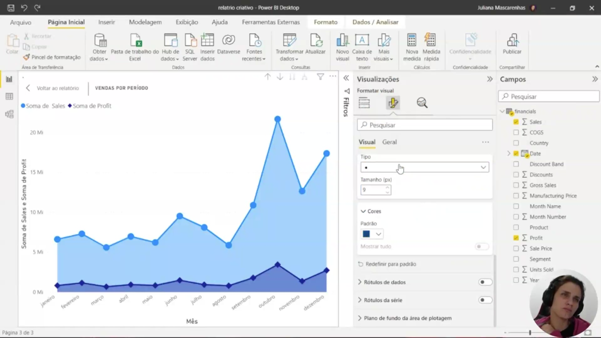
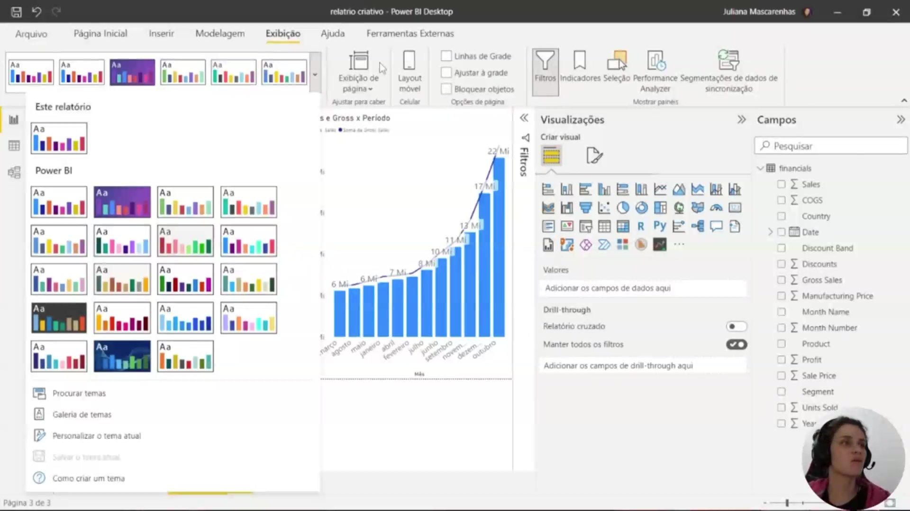
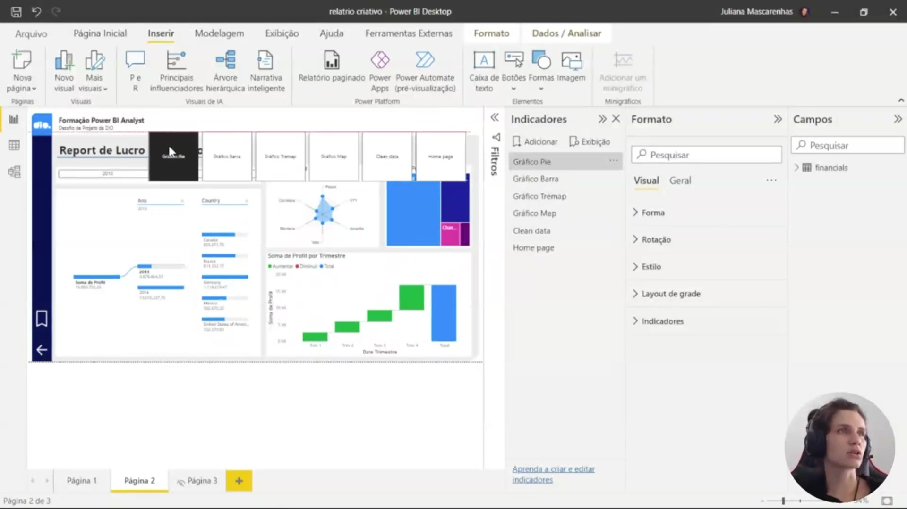
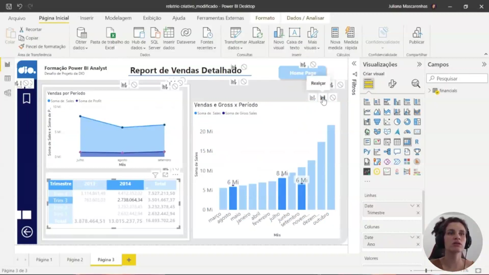
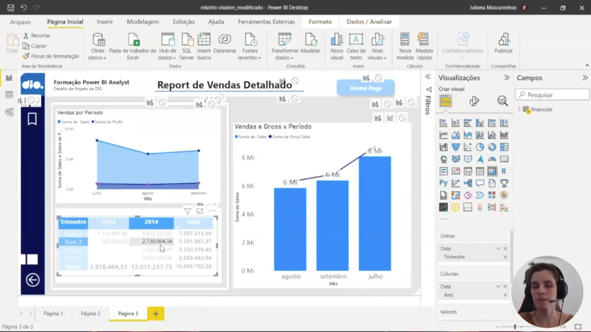
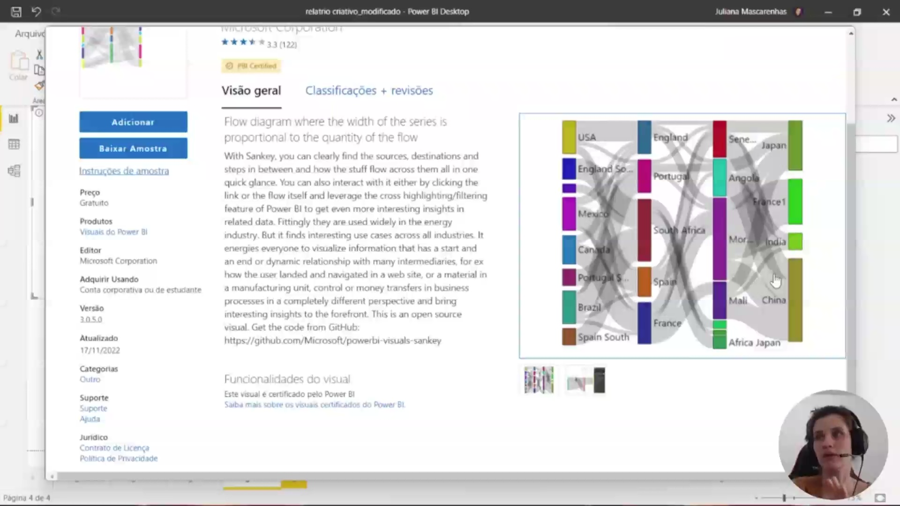
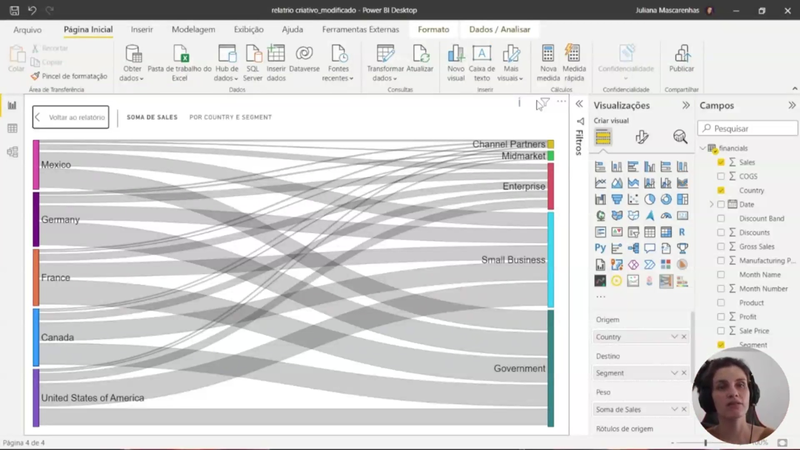
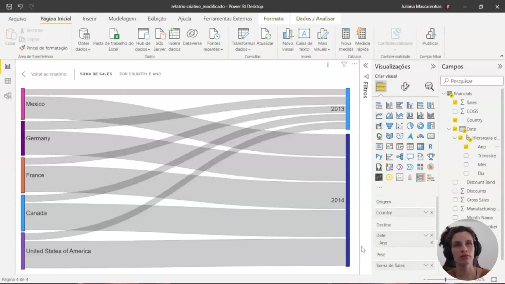

## Instrutor:

- Juliana Mascarenhas (Tech Education Specialist / Sócia (Content Creator) @SimplificandoRedes / Me Modelagem Computacional / Cientista de dados)
- Contato Linkedin: / [juliana-mascarenhas-ds](https://www.linkedin.com/in/juliana-mascarenhas-ds/)

## Parte 1 - Explorando Recursos para criar Storytelling dos dados com Power BI

### 🟩 Vídeo 01 - O que devemos considerar na construção do relatório?

<video width="60%" controls>
  <source src="000-Midia_e_Anexos/bootcamp_ntt_data-modulo.09-curso.02-video_01.webm" type="video/webm">
    Seu navegador não suporta vídeo HTML5.
</video>

link do vídeo: https://web.dio.me/track/engenharia-dados-python/course/explorando-recursos-para-criar-storytelling-dos-dados-com-power-bi/learning/9aa3b598-97f9-4b07-8f29-48c640097bab?autoplay=1

O vídeo explora como a construção de relatórios no Power BI vai além da simples disposição de dados, focando na criação de uma narrativa visual (storytelling) que atenda às necessidades específicas de diferentes públicos-alvo e requisitos de negócio.

### Anotações

  

A instrutora inicia a abordagem sobre a construção de storytelling utilizando relatórios no Power BI. O objetivo é identificar pontos específicos que agregam valor e fazem diferença no consumo das informações pelo público-alvo. 

  

O desenvolvimento do layout de um relatório depende diretamente de requisitos empresariais, do contexto dos dados e dos requisitos de saída. É essencial compreender as características de quem solicitou a informação para criar uma experiência adequada:

**Público Técnico**: Geralmente prefere detalhes específicos e complexidade, permitindo o uso de visuais elaborados, drill downs, segmentações interativas e navegabilidade avançada.

**Executivos**: Demandam informações objetivas e claras, com foco em resultados que não deixem espaço para múltiplas interpretações.A disposição dos visuais deve considerar elementos como a proporção áurea, repetição e contraste para otimizar o relatório.

  

Uma das principais diretrizes para a criação de relatórios é o desenho de um esboço inicial. Esta prática auxilia na definição da aparência do projeto antes de se dedicar tempo à construção efetiva na ferramenta. Assim como no planejamento de uma casa, o "rabisco" permite:

- Experimentar ideias diferentes e visualizar a estrutura geral.
- Discutir conceitos com a equipe para encontrar a melhor solução para o problema apresentado.Concentrar-se no que é realmente importante, incluindo a escolha do fundo ideal para os visuais.

### 🟩 Vídeo 02 - Diretrizes – O que é importante na construção do relatório?

<video width="60%" controls>
  <source src="000-Midia_e_Anexos/bootcamp_ntt_data-modulo.09-curso.02-video_02.webm" type="video/webm">
    Seu navegador não suporta vídeo HTML5.
</video>

link do vídeo: https://web.dio.me/track/engenharia-dados-python/course/explorando-recursos-para-criar-storytelling-dos-dados-com-power-bi/learning/ce4dcb34-3f1b-47a1-a728-e6cb523d3922?autoplay=1

O vídeo explica como transformar dados brutos em relatórios visualmente atraentes e funcionalmente eficientes, utilizando técnicas de design, psicologia das cores e hierarquia visual.

### Anotações

  

**Diretrizes para a construção de relatórios eficazes**

Este slide resume as três diretrizes fundamentais para projetar dashboards profissionais no Power BI:

- **Desenhe um esboço** – Planeje a disposição dos visuais antes de implementar qualquer elemento no Power BI.  
- **Concentre-se no que é importante** – Identifique e destaque apenas as métricas e informações realmente relevantes para o público-alvo, evitando sobrecarga visual.  
- **Escolha o fundo ideal** – Utilize fundos neutros (como branco ou cinza muito claro) para transmitir limpeza, organização e profissionalismo.

Essas orientações servem como base para todas as decisões de design que serão demonstradas a seguir.

  

**Aplicação prática das diretrizes no Power BI Desktop**

Nesta captura de tela do Power BI estamos editando o relatório **Sales Report**. O instrutor demonstra, em tempo real, como aplicar a diretriz “Concentre-se no que é importante”:

- Um cartão de métrica (**Total de Vendas**) recebe um fundo cinza suave com transparência ajustada.  
- Essa cor de destaque cria contraste com o restante do layout, guiando imediatamente a atenção do usuário para a informação mais relevante.  
- Observamos também o painel **Formato → Efeitos** aberto, onde são configurados cor de fundo, transparência e bordas.

O exemplo mostra como um simples ajuste visual transforma um cartão comum em um elemento de destaque, reforçando a mensagem principal do relatório.

  

**Exemplo do que NÃO fazer**

O slide apresenta um dashboard da **Tailwind Traders** como contraponto didático. Nele é possível identificar diversos erros comuns:

- Espaçamento desproporcional e elementos desalinhados  
- Quantidade excessiva de visuais e informações redundantes  
- Cores vibrantes sem critério (muitos amarelos e azuis competindo)  
- Falta de hierarquia visual clara  
- Legendas ausentes ou incompletas em alguns gráficos  

Esse layout confuso dificulta a leitura rápida e transmite pouca credibilidade. Serve como referência negativa para que possamos reconhecer e evitar esses problemas no nosso próprio projeto.

  

**Agora sim… um relatório bem projetado**

Aqui vemos a versão corrigida e profissional do mesmo dashboard. As melhorias aplicadas seguem rigorosamente as diretrizes apresentadas:

- Fundo branco limpo e neutro  
- Redução drástica de elementos, mantendo apenas o essencial  
- Segmentação clara: Product Category, Top 10 Products, Top 10 Customers, Gross Sales by Month e Net Sales by Country  
- Hierarquia visual correta com tamanhos proporcionais e alinhamento perfeito  
- Cores consistentes e legendas legíveis  
- Espaçamento equilibrado e layout limpo

O resultado é um relatório objetivo, profissional e fácil de compreender — exatamente o padrão que devemos buscar no projeto final.      

### 🟩 Vídeo 03 - Verificando pontos de configuração do relatório

<video width="60%" controls>
  <source src="000-Midia_e_Anexos/bootcamp_ntt_data-modulo.09-curso.02-video_03.webm" type="video/webm">
    Seu navegador não suporta vídeo HTML5.
</video>

link do vídeo: https://web.dio.me/track/engenharia-dados-python/course/explorando-recursos-para-criar-storytelling-dos-dados-com-power-bi/learning/f7921b7d-3a4e-47f5-a949-7ab1ef8a3e84?autoplay=1

O vídeo aborda as melhores práticas para a configuração de relatórios no Power BI, focando em acessibilidade entre dispositivos, modos de exibição, personalização de painéis e a importância da identidade visual corporativa.

### Anotações

  

A interface apresenta o relatório "COVID-19 US Tracking", uma amostra desenvolvida pela equipe do Power BI da Microsoft para monitorar dados da pandemia nos Estados Unidos. Este projeto é utilizado para ilustrar como diferentes configurações de exibição e elementos de storytelling impactam a percepção do usuário final. 

No painel lateral de "Visualizações", sob a aba de formatação, encontram-se ajustes essenciais para a identidade visual do relatório, incluindo "Configurações de tela" (definida em 16:9), "Tela de fundo" e "Papel de parede". 

Se a explicação precisar ser mais curta ou focada em um único aspecto (por exemplo, apenas **layout mobile** ou apenas **painel de filtros**), eu adapto o texto para esse foco.      

### 🟩 Vídeo 04 - Como alinhar elementos na página do relatório

<video width="60%" controls>
  <source src="000-Midia_e_Anexos/bootcamp_ntt_data-modulo.09-curso.02-video_04.webm" type="video/webm">
    Seu navegador não suporta vídeo HTML5.
</video>

link do vídeo: https://web.dio.me/track/engenharia-dados-python/course/explorando-recursos-para-criar-storytelling-dos-dados-com-power-bi/learning/415c782d-6552-4a86-aba9-2c0ec423b32e?autoplay=1

O vídeo aborda as melhores práticas para criar visualizações legíveis, estratégias para gerenciar grandes volumes de dados sem poluir o relatório e técnicas de alinhamento de precisão para um acabamento profissional.

### Anotações

  

A imagem mostra um conjunto de cinco cartões (cards) com indicadores numéricos: **8 Bi**, **1,8%**, **151 Mi**, **34 Mi** e **603 Mi**. Esse tipo de visual é comum em dashboards para apresentar métricas resumidas de forma rápida e legível.

No contexto da aula, o instrutor utiliza esses cartões como exemplo para demonstrar técnicas de **alinhamento e distribuição** de visuais. Os valores representam, respectivamente, total de casos (8 bilhões), percentual (1,8%), total de mortes (151 milhões) e outros dois totais (34 milhões e 603 milhões) — provavelmente casos confirmados adicionais ou métricas relacionadas.

A ênfase aqui não está nos números em si, mas no **layout profissional**: ao selecionar todos os cartões simultaneamente e usar as opções de **formato → alinhar → distribuir horizontalmente**, o instrutor organiza os elementos com espaçamento uniforme e alinhamento preciso, evitando aparência desleixada e melhorando a usabilidade do relatório.
 

### 🟩 Vídeo 05 - Conversando sobre acessibilidade no Power BI

<video width="60%" controls>
  <source src="000-Midia_e_Anexos/bootcamp_ntt_data-modulo.09-curso.02-video_05.webm" type="video/webm">
    Seu navegador não suporta vídeo HTML5.
</video>

link do vídeo: https://web.dio.me/track/engenharia-dados-python/course/explorando-recursos-para-criar-storytelling-dos-dados-com-power-bi/learning/fdd6c888-0d6a-44ff-aead-c8092efdcfe1?autoplay=1

O vídeo destaca a importância de projetar relatórios no Power BI que sejam acessíveis a todos os usuários, incluindo aqueles com necessidades especiais (auditivas, motoras, visuais, etc.). O foco está na utilização de recursos nativos da ferramenta e na adesão aos padrões internacionais de acessibilidade.

### Anotações

  

A imagem apresenta os três princípios essenciais da WCAG (Diretrizes de Acessibilidade de Conteúdo da Web), que o Power BI segue para tornar relatórios e dashboards acessíveis ao maior número possível de pessoas.  

- **Perceptível**: as informações e os componentes da interface devem ser apresentados de modo que todos os usuários, inclusive aqueles com deficiências sensoriais, possam percebê-los.  
- **Operável**: os componentes de navegação e interface precisam ser operáveis por diferentes dispositivos e métodos de interação (teclado, leitor de telas, etc.).  
- **Compreensível**: as informações e o funcionamento da interface devem ser claros e fáceis de entender, evitando ambiguidades.  

Esses pilares guiam a criação de relatórios que atendem a necessidades especiais, como dificuldades motoras, auditivas ou visuais.      

### 🟩 Vídeo 06 - Maneiras de adicionar um texto alternativo em um visual

<video width="60%" controls>
  <source src="000-Midia_e_Anexos/bootcamp_ntt_data-modulo.09-curso.02-video_06.webm" type="video/webm">
    Seu navegador não suporta vídeo HTML5.
</video>

link do vídeo: https://web.dio.me/track/engenharia-dados-python/course/explorando-recursos-para-criar-storytelling-dos-dados-com-power-bi/learning/85d47507-fd51-4ed4-8ee5-522dfdba09ca?autoplay=1

O vídeo destaca a importância e a implementação do texto alternativo (Alt Text) em relatórios do Power BI, destacando como esse recurso simples pode transformar a experiência de usuários com deficiência visual ou em situações de erro de carregamento.

### Anotações

  

A imagem mostra a interface de configuração de um visual no Power BI, com foco na seção de **formatação**. Nela, é possível observar o caminho para configurar propriedades gerais do visual, incluindo a opção de **texto alternativo**.

Dentro dessa área, o usuário pode inserir uma descrição detalhada do gráfico exibido. Essa descrição deve explicar o propósito do visual, o tipo de gráfico utilizado e os principais insights apresentados. Por exemplo, ao descrever um gráfico de vendas por produto, é possível indicar qual item teve maior desempenho e qual teve menor.

A interface sugere que o texto alternativo pode ser estático ou construído dinamicamente com base em campos de dados, permitindo maior flexibilidade. O objetivo final é garantir que qualquer pessoa, mesmo sem acesso visual ao gráfico, consiga compreender as informações apresentadas.
      

### 🟩 Vídeo 07 - Navegabilidade com acessibilidade – Ordenando as camadas e tabulação

<video width="60%" controls>
  <source src="000-Midia_e_Anexos/bootcamp_ntt_data-modulo.09-curso.02-video_07.webm" type="video/webm">
    Seu navegador não suporta vídeo HTML5.
</video>

link do vídeo: https://web.dio.me/track/engenharia-dados-python/course/explorando-recursos-para-criar-storytelling-dos-dados-com-power-bi/learning/552b1966-8cb1-4696-82fd-13b5ed111d49?autoplay=1

O vídeo ensina como otimizar a experiência de usuários com deficiência em relatórios do Power BI, focando na organização da ordem de tabulação e no uso estratégico do painel de seleção.

### Anotações

  

A imagem apresenta o painel de **Seleção** no Power BI, onde são listados todos os elementos visuais presentes no relatório, como gráficos, cartões, botões, formas e caixas de texto. Esse painel permite visualizar a hierarquia e organização dos objetos na página.

Cada item exibido corresponde a um componente do relatório, e a ordem em que aparecem está diretamente relacionada à navegação por teclado (ordem de tabulação). Isso significa que usuários que não utilizam o mouse irão percorrer esses elementos exatamente na sequência definida aqui.

Também é possível observar que alguns elementos estão agrupados, indicando que pertencem a uma mesma estrutura visual (por exemplo, formas associadas a gráficos). Essa organização é importante para manter consistência tanto visual quanto funcional.

Além disso, o painel permite:

* Reordenar os elementos (alterando a navegação)
* Agrupar componentes relacionados
* Ocultar itens que não devem ser acessíveis na navegação

Elementos puramente decorativos (como formas de fundo ou sombras) aparecem na lista, mas idealmente devem ser ocultados da ordem de tabulação para não interferirem na experiência de navegação do usuário.

### 🟩 Vídeo 08 - Nomeações claras, concisas, diretas e sem abreviações

<video width="60%" controls>
  <source src="000-Midia_e_Anexos/bootcamp_ntt_data-modulo.09-curso.02-video_08.webm" type="video/webm">
    Seu navegador não suporta vídeo HTML5.
</video>

link do vídeo: https://web.dio.me/track/engenharia-dados-python/course/explorando-recursos-para-criar-storytelling-dos-dados-com-power-bi/learning/e3099fba-8315-4298-afcb-0fff6a52bba1?autoplay=1

O vídeo apresenta um guia prático sobre como otimizar a visualização de dados no Power BI, focando na experiência do usuário final. A premissa central é que a clareza e a concisão são fundamentais para que os dados sejam transformados em insights acionáveis sem gerar confusão.

### Anotações

  

A imagem mostra um gráfico no Power BI com as medidas **Sales** e **Gross Sales** distribuídas por mês. O ponto central da explicação é a importância de títulos claros e concisos nos visuais. Em vez de usar termos técnicos ou abreviações como *Sum of Sales por mês*, a recomendação é adotar títulos descritivos e acessíveis, como **Vendas por Período**. Isso facilita a compreensão para qualquer usuário, independentemente de familiaridade com jargões. Além disso, o gráfico pode ser configurado para explorar diferentes níveis da hierarquia temporal (ano, trimestre, mês), permitindo análises mais detalhadas ou agregadas conforme necessário. O cuidado com a nomenclatura e a clareza visual é uma boa prática essencial na criação de relatórios.

### 🟩 Vídeo 09 - Utilizando marcadores para facilitar a leitura dos visuais

<video width="60%" controls>
  <source src="000-Midia_e_Anexos/bootcamp_ntt_data-modulo.09-curso.02-video_09.webm" type="video/webm">
    Seu navegador não suporta vídeo HTML5.
</video>

link do vídeo: https://web.dio.me/track/engenharia-dados-python/course/explorando-recursos-para-criar-storytelling-dos-dados-com-power-bi/learning/00fe601a-834d-4a58-b997-6b36003c2619?autoplay=1

Este vídeo ilustra técnicas avançadas de visualização de dados, focando em como tornar gráficos de linha e área mais legíveis e informativos através do uso de marcadores e eixos secundários.

### Anotações

  

No Power BI, a utilização de **marcadores** é um recurso fundamental para melhorar a legibilidade e a precisão na interpretação de dados em gráficos de linhas ou áreas. Ao selecionar um visual e acessar as opções de **Formato**, é possível ativar a exibição desses pontos para identificar exatamente onde cada instância de dado (como os meses do ano) está posicionada no gráfico.

Nesta interface, observamos a aplicação de marcadores para diferenciar as métricas de **Soma de Sales** (representada pela área preenchida em azul) e **Soma de Profit** (representada pela linha com marcadores em formato de losango). A customização desses elementos permite:

* **Diferenciação de Séries:** Definir tipos de marcadores distintos (como bolinhas ou losangos) para cada categoria, facilitando a distinção visual quando há sobreposição de informações.
* **Ajuste Estético e Contraste:** Modificar as cores e o tamanho dos marcadores para dar ênfase a pontos específicos ou garantir que o visual permaneça harmonioso e profissional.
* **Noção de Magnitude:** Auxiliar na visualização de pontos de dados em eixos secundários ou em situações onde as ordens de grandeza das métricas são muito distintas.

Essa abordagem transforma um gráfico de tendência genérico em uma ferramenta de análise pontual, onde o usuário consegue identificar rapidamente o comportamento dos dados em cada período selecionado.      

### 🟩 Vídeo 10 - Explorando temas próprios do Power BI

<video width="60%" controls>
  <source src="000-Midia_e_Anexos/bootcamp_ntt_data-modulo.09-curso.02-video_10.webm" type="video/webm">
    Seu navegador não suporta vídeo HTML5.
</video>

link do vídeo: https://web.dio.me/track/engenharia-dados-python/course/explorando-recursos-para-criar-storytelling-dos-dados-com-power-bi/learning/402577c4-9de7-4555-a0b8-7e6764ff5ae2?autoplay=1

Este vídeo ensina como utilizar a galeria de temas do Power BI para transformar a estética de relatórios, garantindo não apenas beleza visual, mas também legibilidade e alinhamento com identidades corporativas.

### Anotações

  

A interface do Power BI Desktop apresenta, na guia **Exibição**, uma galeria de temas que permite configurar a identidade visual do relatório para garantir maior legibilidade e impacto visual. O software disponibiliza diversos conjuntos de cores predefinidos, incluindo opções com planos de fundo escuros ou "cinza chumbo", que servem para dar destaque aos dados e fazer com que os gráficos "saltem aos olhos" do usuário.

Além da seleção de temas prontos, a ferramenta oferece recursos de gestão e customização avançada:

* **Procurar e Galeria de temas:** Permite explorar temas específicos ou acessar a galeria online para buscar novas composições visuais.
* **Personalizar o tema atual:** Abre um menu detalhado onde é possível definir cores, fontes de texto, estilos de visuais, configurações de página e painéis de filtro.
* **Salvar tema atual:** Após realizar ajustes para alinhar o relatório à identidade visual de uma empresa, o usuário pode salvar as configurações para aplicá-las em outros projetos.

Essa flexibilidade é essencial para que o desenvolvedor possa criar dashboards que respeitem requisitos empresariais ou preferências estéticas específicas, mantendo a consistência técnica e visual da apresentação.      

### 🟩 Vídeo 11 - Aprofundando nos recursos: indicadores, botões, seleções e segmentadores

<video width="60%" controls>
  <source src="000-Midia_e_Anexos/bootcamp_ntt_data-modulo.09-curso.02-video_11.webm" type="video/webm">
    Seu navegador não suporta vídeo HTML5.
</video>

link do vídeo: https://web.dio.me/track/engenharia-dados-python/course/explorando-recursos-para-criar-storytelling-dos-dados-com-power-bi/learning/d81e1463-3dac-4535-b57f-43ced01e0c99?autoplay=1

O vídeo mostra como transformar relatórios estáticos em experiências interativas e dinâmicas utilizando recursos avançados de navegação e filtragem no Power BI.

### Anotações

  

Esta imagem apresenta os três principais recursos de navegação e interatividade no Power BI: **Indicadores**, **Botões** e **Seleções**.  
- **Indicadores** (bookmarks) capturam um estado específico de uma página do relatório (filtros, slicers, visuais visíveis). Permitem retomar rapidamente aquela visualização mais tarde, funcionando como um *snapshot* configurável.  
- **Botões** criam uma experiência interativa: ao clicar, o usuário pode navegar entre páginas, alterar tipos de gráfico, executar ações como redefinir filtros ou acionar um indicador.  
- **Seleções** controlam a visibilidade dos itens no relatório, definindo quais objetos aparecem e quais ficam ocultos em determinado momento.

Esses recursos são fundamentais para construir dashboards dinâmicos e de fácil navegação, sem depender apenas de filtros padrão.

  

A imagem introduz o **Segmentador** (slicer), um visual específico do Power BI que age como um filtro direto e sempre visível. Suas principais vantagens são:  
- **Acesso rápido aos filtros mais usados** – evita que o usuário tenha que abrir listas suspensas ou painéis laterais.  
- **Visualização imediata do estado filtrado** – o próprio segmentador mostra quais valores estão selecionados, simplificando a leitura do contexto atual.  
- **Filtragem sobre colunas ocultas** – é possível segmentar por colunas que não aparecem nos dados principais, mantendo a tabela de origem organizada e sem expor campos desnecessários.

Na prática, o segmentador torna a filtragem mais intuitiva e reduz a carga cognitiva do analista.

  

O conteúdo desta imagem é textual e não contém código. Ela descreve dois usos estratégicos do **Segmentador** para relatórios eficientes:  
1. **Relatórios mais direcionados** – posicione o segmentador ao lado de visuais importantes (como gráficos principais), facilitando a interação sem desviar a atenção.  
2. **Adiar consultas ao modelo de dados** – em cenários com *DirectQuery*, o uso de segmentadores suspensos (dropdown) evita atualizações automáticas a cada clique, melhorando o desempenho.  

Além disso, há uma observação importante: segmentadores **não suportam** campos de entrada (digitação livre) nem funções de *drill down* (detalhamento hierárquico). Essas limitações devem ser consideradas no momento do projeto.

  

A imagem detalha três configurações de seleção disponíveis para o Segmentador no Power BI:  
- **Seleção única** (desativada por padrão) – permite que apenas um item seja escolhido por vez. Útil quando se deseja uma filtragem exclusiva.  
- **Seleção múltipla com CTRL** (ativada por padrão) – possibilita selecionar vários itens pressionando a tecla Ctrl. É o comportamento padrão para análises comparativas.  
- **Mostrar "Selecionar tudo"** (desativada por padrão) – se habilitada, adiciona uma caixa de seleção ao segmentador que permite marcar ou desmarcar todos os itens de uma vez.  

Essas opções dão flexibilidade ao designer do relatório para adaptar o comportamento do segmentador à necessidade de negócio, seja para análises pontuais ou abrangentes.   

### 🟩 Vídeo 12 - Explorando as possibilidades com botões

<video width="60%" controls>
  <source src="000-Midia_e_Anexos/bootcamp_ntt_data-modulo.09-curso.02-video_12.webm" type="video/webm">
    Seu navegador não suporta vídeo HTML5.
</video>

link do vídeo: https://web.dio.me/track/engenharia-dados-python/course/explorando-recursos-para-criar-storytelling-dos-dados-com-power-bi/learning/ed5fc1cc-e0ec-4f75-96d3-57140034fc0a?autoplay=1

O vídeo explora como utilizar botões para transformar relatórios estáticos em experiências interativas e intuitivas, focando em navegação, ações personalizadas e design de interface (UI).

### Anotações

  

#### Funcionalidades e Configurações de Botões

Para gerenciar como o usuário interage com o relatório, o Power BI oferece diversas opções técnicas:

* **Tipos de Botões**: Estão disponíveis ícones pré-definidos como setas (esquerda/direita), botões de redefinir, voltar e informações. Todos esses possuem funcionalidades associadas.
* **Navigator**: Uma ferramenta que mapeia automaticamente as páginas do relatório, permitindo transições rápidas. É possível ocultar páginas específicas ou defini-las apenas como dicas de ferramenta (tooltips) para que não apareçam na navegação principal.
* **Personalização Visual**: Através do painel de **Formato**, pode-se ajustar a estética dos botões, como a aplicação de **cantos arredondados** para tornar a transição visual menos brusca. Além disso, é possível configurar estados dinâmicos, alterando cores e ícones "ao focalizar" ou "ao pressionar" o botão.

#### Ações e Indicadores

A inteligência por trás de um botão reside em sua **Ação**. Além da simples navegação entre abas, os botões podem ser vinculados a:

1.  **Indicadores (Bookmarks)**: Permitem salvar estados específicos de filtros e visuais, funcionando como atalhos para "favoritos" dentro do relatório.
2.  **Drillthrough**: Utilizado para aumentar o nível de detalhamento de uma informação baseando-se em variáveis categóricas, como **Produto** ou **País**.
3.  **Perguntas e Respostas (P&R)**: Um recurso baseado em IA que permite ao usuário realizar consultas em linguagem natural diretamente no relatório.      

### 🟩 Vídeo 13 - Modificando interações no Power BI

<video width="60%" controls>
  <source src="000-Midia_e_Anexos/bootcamp_ntt_data-modulo.09-curso.02-video_13.webm" type="video/webm">
    Seu navegador não suporta vídeo HTML5.
</video>

link do vídeo: https://web.dio.me/track/engenharia-dados-python/course/explorando-recursos-para-criar-storytelling-dos-dados-com-power-bi/learning/0fc87e6b-46c7-49a6-b32c-a82c81473a8c?autoplay=1

O vídeo explica como personalizar a forma como os diferentes elementos de um relatório Power BI conversam entre si. Aprender a manipular essas interações é fundamental para criar dashboards dinâmicos, intuitivos e que contem a história correta dos dados.

### Anotações

  

A imagem exibe o **Power BI Desktop** na Página 3 do relatório "Report de Vendas Detalhado". Três visuais são visíveis: o gráfico de área **Vendas por Período**, uma **tabela de matriz** com os trimestres de 2013 e 2014, e o gráfico de barras/colunas **Vendas e Gross x Período**. O ponto central desta tela é a ativação do modo **Editar Interações**: perceba os ícones flutuantes que aparecem acima de cada visual — um ícone de gráfico de barras (**Realçar**), um ícone de funil (**Filtrar**) e um ícone de proibição (**Sem impacto**). No canto superior direito do gráfico "Vendas e Gross x Período" o tooltip **"Realçar"** está visível, indicando que o cursor está posicionado sobre o ícone correspondente. Este é o estado padrão de interação para esse visual: quando outro visual é clicado, ele **realça** proporcionalmente os dados, mantendo a visão do todo em segundo plano.

  

A imagem mostra o resultado prático de alterar o tipo de interação de **Realçar** para **Filtrar** no mesmo relatório. Na tabela de matriz à esquerda, a linha **Trim 3** está selecionada (destacada em azul). O efeito imediato no gráfico **Vendas e Gross x Período** é visível: em vez de exibir todos os meses com realce proporcional, o gráfico agora apresenta **apenas os três meses do Trimestre 3** — agosto, setembro e julho — eliminando completamente os demais períodos da visualização. Isso ilustra a diferença fundamental entre as duas modalidades: o modo **Realçar** preserva o contexto geral e destaca a fatia selecionada, enquanto o modo **Filtrar** restringe o visual exclusivamente aos dados do item selecionado, exibindo os valores absolutos daquele recorte sem referência ao total.      

### 🟩 Vídeo 14 - Gráfico de Sankey e Considerações finais

<video width="60%" controls>
  <source src="000-Midia_e_Anexos/bootcamp_ntt_data-modulo.09-curso.02-video_14.webm" type="video/webm">
    Seu navegador não suporta vídeo HTML5.
</video>

link do vídeo: https://web.dio.me/track/engenharia-dados-python/course/explorando-recursos-para-criar-storytelling-dos-dados-com-power-bi/learning/3a353361-1384-4d88-9d82-a6964ea5b080?autoplay=1

O vídeo descreve o uso de gráficos avançados no Power BI, com foco especial no Diagrama de Sankey, e discute a importância do Storytelling para transformar dados brutos em narrativas claras e acionáveis para o cliente final.

### Anotações

  

Esta imagem exibe a tela de importação de visuais personalizados do Power BI, onde é possível adicionar o gráfico "Sankey". Este visual específico, que possui certificação oficial, é utilizado para mapear e demonstrar o fluxo de dados entre diferentes categorias. A ferramenta permite visualizar graficamente a proporção e o caminho percorrido por uma métrica, mostrando de forma orgânica como os valores fluem de uma origem (Source) para um destino (Target).

  

Neste exemplo, o gráfico de Sankey foi configurado utilizando "Country" (País) no campo Origem, "Segment" (Segmento) no campo Destino e a soma de "Sales" (Vendas) no campo Peso. Essa configuração destaca o comportamento de fluxo das vendas; nota-se visualmente que a maior parte das vendas do México é direcionada ao setor governamental, enquanto nos Estados Unidos o maior volume se concentra em pequenas empresas (Small Business). O gráfico também evidencia de forma clara que as categorias "Channel Partners" e "Midmarket" compõem as menores proporções de vendas.

  

Aqui, o campo de destino foi alterado de Segmento para "Ano" (Year), extraído da hierarquia de datas do conjunto de dados. Com essa nova disposição, o fluxo visual passa a demonstrar a distribuição temporal do volume de vendas por país. A largura das faixas comprova de maneira imediata que a esmagadora maioria da receita de vendas está concentrada no ano de 2014, em nítido contraste com a proporção sensivelmente menor gerada durante o ano de 2013.      

##  Materiais de Apoio

### Dicas/Links Úteis

Por fim, disponibilizamos alguns links úteis para que você possa se desenvolver ainda mais através de referências oficiais das tecnologias, páginas de documentação e/ou fóruns de discussão relevantes. Nesse contexto, seguem algumas sugestões:

* https://powerbi.microsoft.com/en-us/data-storytelling/
* https://learn.microsoft.com/en-us/power-bi/create-reports/service-reports-visual-interactions?tabs=powerbi-desktop
* https://learn.microsoft.com/en-us/power-bi/create-reports/desktop-drill-through-buttons

* **Artigos/Fórum:** você pode compartilhar conteúdos técnicos através de Artigos (visíveis globalmente na plataforma da DIO). Por outro lado, você também pode compartilhar suas conquistas e dúvidas usando os Fóruns (que são específicos para cada experiência educacional na DIO, como um Bootcamp por exemplo);
* **Rooms:** caso você esteja inscrito(a) em uma experiência educacional na DIO (como um Bootcamp, por exemplo) você terá acesso ao Rooms. O Rooms é uma ferramenta de bate-papo em tempo real onde todos os inscritos podem interagir, compartilhando dúvidas e dicas (que podem conter imagens e snippets de código-fonte);
* **Pesquise na Web:** pode parecer óbvio, mas é importante frisar a importância das engines de busca no dia-a-dia de um profissional de TI. Caso não encontre o que procura dentro da DIO, pesquise sobre o assunto (conceito, dúvida, erro etc) na Internet (dê um Google), pois na maioria das vezes você será levado à páginas incríveis como o StackOverflow que salvarão o seu dia 😎

# Certificado: Explorando Recursos para criar Storytelling dos dados com Power BI

- Link na plataforma: https://hermes.dio.me/certificates/JTCKSRFX.pdf
- Certificado em pdf: [Certificado-Explorando_Recursos_para_criar_Storytelling_dos_dados_com_Power_BI.pdf](000-Midia_e_Anexos/Certificado-Explorando_Recursos_para_criar_Storytelling_dos_dados_com_Power_BI.pdf)