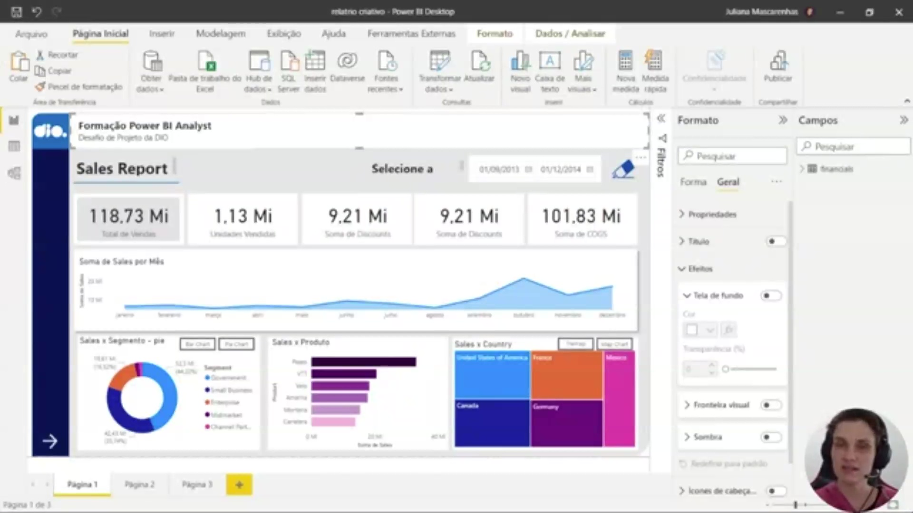
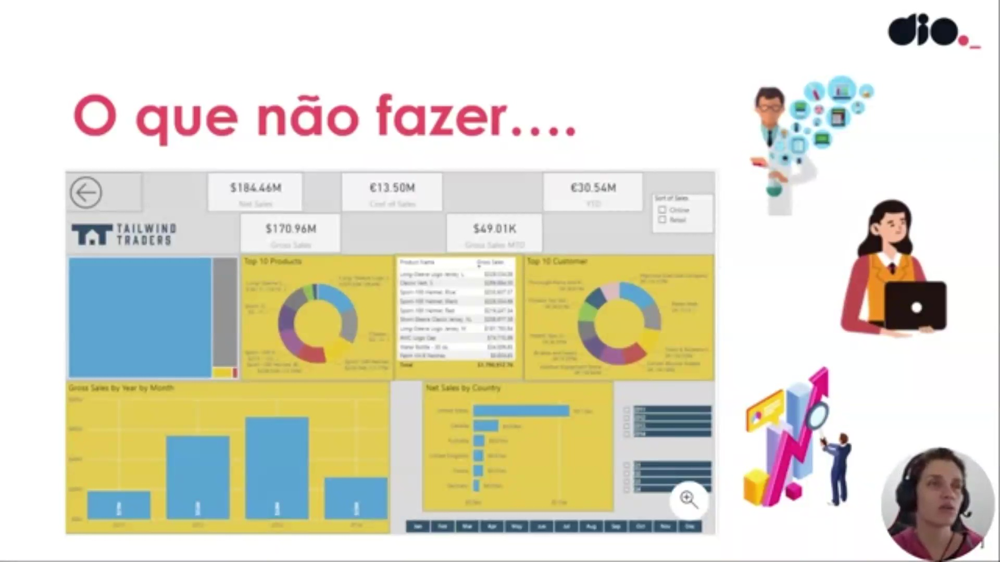
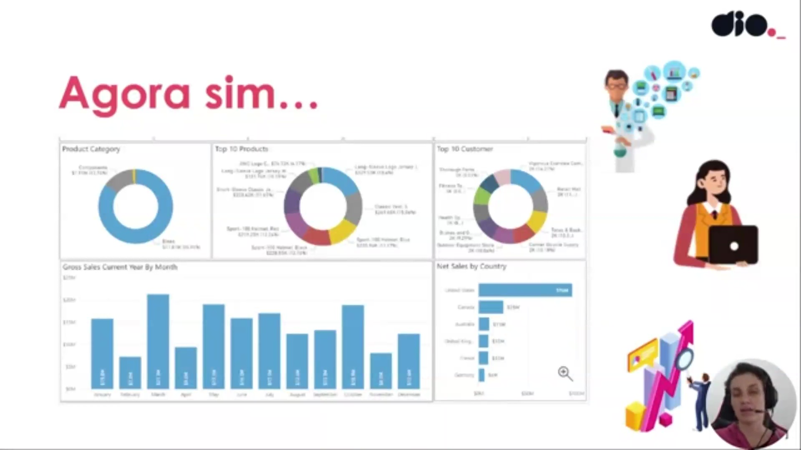
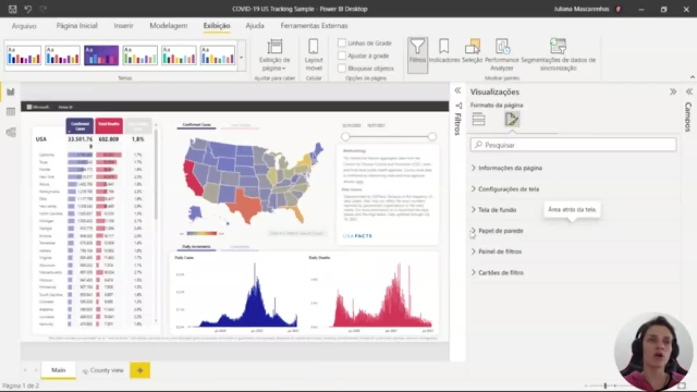
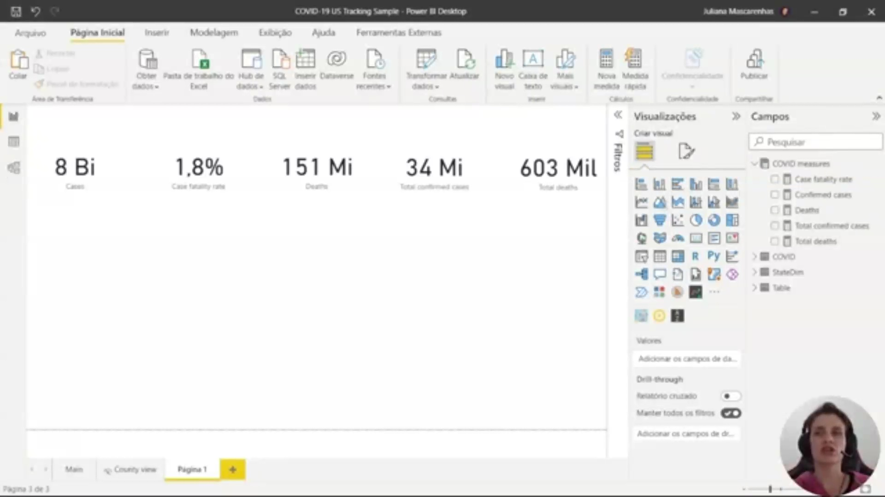
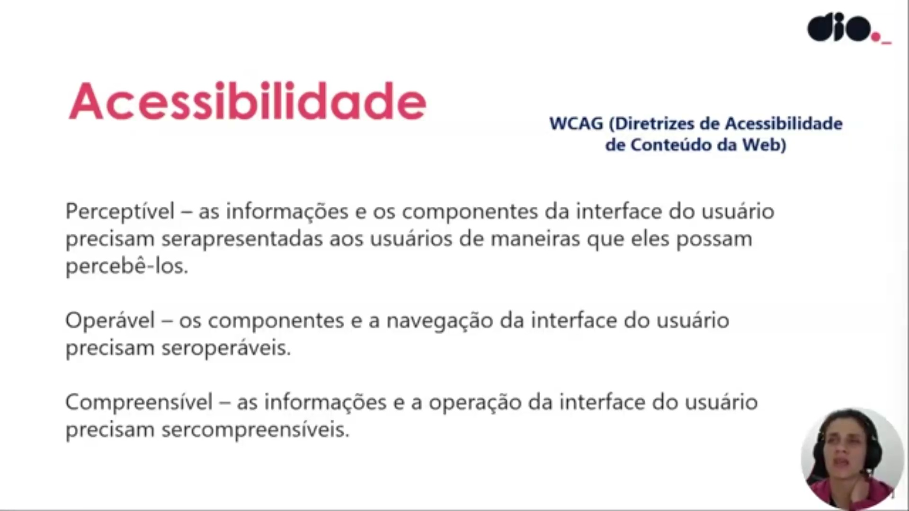
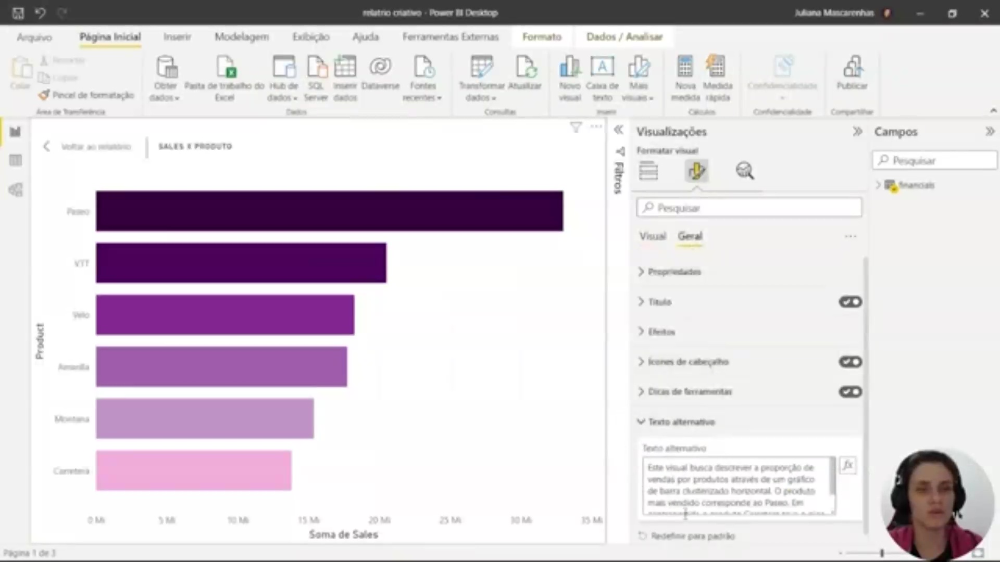
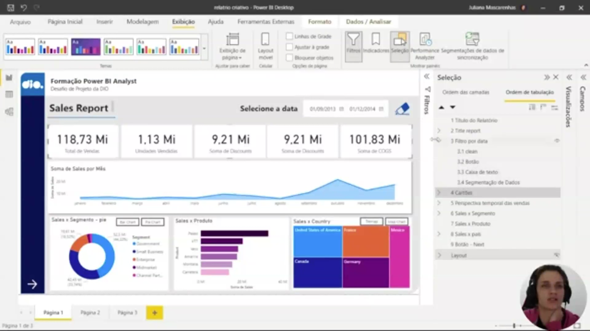
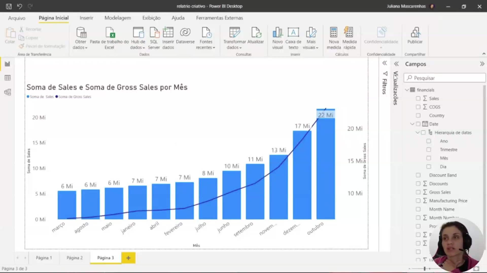

## Instrutor:

- Juliana Mascarenhas (Tech Education Specialist / Sócia (Content Creator) @SimplificandoRedes / Me Modelagem Computacional / Cientista de dados)
- Contato Linkedin: / [juliana-mascarenhas-ds](https://www.linkedin.com/in/juliana-mascarenhas-ds/)

## Parte 1 - Explorando Recursos para criar Storytelling dos dados com Power BI

### 🟩 Vídeo 01 - O que devemos considerar na construção do relatório?

<video width="60%" controls>
  <source src="000-Midia_e_Anexos/bootcamp_ntt_data-modulo.09-curso.02-video_01.webm" type="video/webm">
    Seu navegador não suporta vídeo HTML5.
</video>

link do vídeo: https://web.dio.me/track/engenharia-dados-python/course/explorando-recursos-para-criar-storytelling-dos-dados-com-power-bi/learning/9aa3b598-97f9-4b07-8f29-48c640097bab?autoplay=1

O vídeo explora como a construção de relatórios no Power BI vai além da simples disposição de dados, focando na criação de uma narrativa visual (storytelling) que atenda às necessidades específicas de diferentes públicos-alvo e requisitos de negócio.

### Anotações

<p align="center">
  
</p>

A instrutora inicia a abordagem sobre a construção de storytelling utilizando relatórios no Power BI. O objetivo é identificar pontos específicos que agregam valor e fazem diferença no consumo das informações pelo público-alvo. 

<p align="center">
  
</p>

O desenvolvimento do layout de um relatório depende diretamente de requisitos empresariais, do contexto dos dados e dos requisitos de saída. É essencial compreender as características de quem solicitou a informação para criar uma experiência adequada:

**Público Técnico**: Geralmente prefere detalhes específicos e complexidade, permitindo o uso de visuais elaborados, drill downs, segmentações interativas e navegabilidade avançada.

**Executivos**: Demandam informações objetivas e claras, com foco em resultados que não deixem espaço para múltiplas interpretações.A disposição dos visuais deve considerar elementos como a proporção áurea, repetição e contraste para otimizar o relatório.

<p align="center">
  
</p>

Uma das principais diretrizes para a criação de relatórios é o desenho de um esboço inicial. Esta prática auxilia na definição da aparência do projeto antes de se dedicar tempo à construção efetiva na ferramenta. Assim como no planejamento de uma casa, o "rabisco" permite:

- Experimentar ideias diferentes e visualizar a estrutura geral.
- Discutir conceitos com a equipe para encontrar a melhor solução para o problema apresentado.Concentrar-se no que é realmente importante, incluindo a escolha do fundo ideal para os visuais.

### 🟩 Vídeo 02 - Diretrizes – O que é importante na construção do relatório?

<video width="60%" controls>
  <source src="000-Midia_e_Anexos/bootcamp_ntt_data-modulo.09-curso.02-video_02.webm" type="video/webm">
    Seu navegador não suporta vídeo HTML5.
</video>

link do vídeo: https://web.dio.me/track/engenharia-dados-python/course/explorando-recursos-para-criar-storytelling-dos-dados-com-power-bi/learning/ce4dcb34-3f1b-47a1-a728-e6cb523d3922?autoplay=1

O vídeo explica como transformar dados brutos em relatórios visualmente atraentes e funcionalmente eficientes, utilizando técnicas de design, psicologia das cores e hierarquia visual.

### Anotações

<p align="center">
  
</p>

**Diretrizes para a construção de relatórios eficazes**

Este slide resume as três diretrizes fundamentais para projetar dashboards profissionais no Power BI:

- **Desenhe um esboço** – Planeje a disposição dos visuais antes de implementar qualquer elemento no Power BI.  
- **Concentre-se no que é importante** – Identifique e destaque apenas as métricas e informações realmente relevantes para o público-alvo, evitando sobrecarga visual.  
- **Escolha o fundo ideal** – Utilize fundos neutros (como branco ou cinza muito claro) para transmitir limpeza, organização e profissionalismo.

Essas orientações servem como base para todas as decisões de design que serão demonstradas a seguir.

<p align="center">
  
</p>

**Aplicação prática das diretrizes no Power BI Desktop**

Nesta captura de tela do Power BI estamos editando o relatório **Sales Report**. O instrutor demonstra, em tempo real, como aplicar a diretriz “Concentre-se no que é importante”:

- Um cartão de métrica (**Total de Vendas**) recebe um fundo cinza suave com transparência ajustada.  
- Essa cor de destaque cria contraste com o restante do layout, guiando imediatamente a atenção do usuário para a informação mais relevante.  
- Observamos também o painel **Formato → Efeitos** aberto, onde são configurados cor de fundo, transparência e bordas.

O exemplo mostra como um simples ajuste visual transforma um cartão comum em um elemento de destaque, reforçando a mensagem principal do relatório.

<p align="center">
  
</p>

**Exemplo do que NÃO fazer**

O slide apresenta um dashboard da **Tailwind Traders** como contraponto didático. Nele é possível identificar diversos erros comuns:

- Espaçamento desproporcional e elementos desalinhados  
- Quantidade excessiva de visuais e informações redundantes  
- Cores vibrantes sem critério (muitos amarelos e azuis competindo)  
- Falta de hierarquia visual clara  
- Legendas ausentes ou incompletas em alguns gráficos  

Esse layout confuso dificulta a leitura rápida e transmite pouca credibilidade. Serve como referência negativa para que possamos reconhecer e evitar esses problemas no nosso próprio projeto.

<p align="center">
  
</p>

**Agora sim… um relatório bem projetado**

Aqui vemos a versão corrigida e profissional do mesmo dashboard. As melhorias aplicadas seguem rigorosamente as diretrizes apresentadas:

- Fundo branco limpo e neutro  
- Redução drástica de elementos, mantendo apenas o essencial  
- Segmentação clara: Product Category, Top 10 Products, Top 10 Customers, Gross Sales by Month e Net Sales by Country  
- Hierarquia visual correta com tamanhos proporcionais e alinhamento perfeito  
- Cores consistentes e legendas legíveis  
- Espaçamento equilibrado e layout limpo

O resultado é um relatório objetivo, profissional e fácil de compreender — exatamente o padrão que devemos buscar no projeto final.      


### 🟩 Vídeo 03 - Verificando pontos de configuração do relatório

<video width="60%" controls>
  <source src="000-Midia_e_Anexos/bootcamp_ntt_data-modulo.09-curso.02-video_03.webm" type="video/webm">
    Seu navegador não suporta vídeo HTML5.
</video>

link do vídeo: https://web.dio.me/track/engenharia-dados-python/course/explorando-recursos-para-criar-storytelling-dos-dados-com-power-bi/learning/f7921b7d-3a4e-47f5-a949-7ab1ef8a3e84?autoplay=1

O vídeo aborda as melhores práticas para a configuração de relatórios no Power BI, focando em acessibilidade entre dispositivos, modos de exibição, personalização de painéis e a importância da identidade visual corporativa.

### Anotações

<p align="center">
  
</p>

A interface apresenta o relatório "COVID-19 US Tracking", uma amostra desenvolvida pela equipe do Power BI da Microsoft para monitorar dados da pandemia nos Estados Unidos. Este projeto é utilizado para ilustrar como diferentes configurações de exibição e elementos de storytelling impactam a percepção do usuário final. 

No painel lateral de "Visualizações", sob a aba de formatação, encontram-se ajustes essenciais para a identidade visual do relatório, incluindo "Configurações de tela" (definida em 16:9), "Tela de fundo" e "Papel de parede". 

Se a explicação precisar ser mais curta ou focada em um único aspecto (por exemplo, apenas **layout mobile** ou apenas **painel de filtros**), eu adapto o texto para esse foco.      

### 🟩 Vídeo 04 - Como alinhar elementos na página do relatório

<video width="60%" controls>
  <source src="000-Midia_e_Anexos/bootcamp_ntt_data-modulo.09-curso.02-video_04.webm" type="video/webm">
    Seu navegador não suporta vídeo HTML5.
</video>

link do vídeo: https://web.dio.me/track/engenharia-dados-python/course/explorando-recursos-para-criar-storytelling-dos-dados-com-power-bi/learning/415c782d-6552-4a86-aba9-2c0ec423b32e?autoplay=1

O vídeo aborda as melhores práticas para criar visualizações legíveis, estratégias para gerenciar grandes volumes de dados sem poluir o relatório e técnicas de alinhamento de precisão para um acabamento profissional.

### Anotações

<p align="center">
  
</p>

A imagem mostra um conjunto de cinco cartões (cards) com indicadores numéricos: **8 Bi**, **1,8%**, **151 Mi**, **34 Mi** e **603 Mi**. Esse tipo de visual é comum em dashboards para apresentar métricas resumidas de forma rápida e legível.

No contexto da aula, o instrutor utiliza esses cartões como exemplo para demonstrar técnicas de **alinhamento e distribuição** de visuais. Os valores representam, respectivamente, total de casos (8 bilhões), percentual (1,8%), total de mortes (151 milhões) e outros dois totais (34 milhões e 603 milhões) — provavelmente casos confirmados adicionais ou métricas relacionadas.

A ênfase aqui não está nos números em si, mas no **layout profissional**: ao selecionar todos os cartões simultaneamente e usar as opções de **formato → alinhar → distribuir horizontalmente**, o instrutor organiza os elementos com espaçamento uniforme e alinhamento preciso, evitando aparência desleixada e melhorando a usabilidade do relatório.
 

### 🟩 Vídeo 05 - Conversando sobre acessibilidade no Power BI

<video width="60%" controls>
  <source src="000-Midia_e_Anexos/bootcamp_ntt_data-modulo.09-curso.02-video_05.webm" type="video/webm">
    Seu navegador não suporta vídeo HTML5.
</video>

link do vídeo: https://web.dio.me/track/engenharia-dados-python/course/explorando-recursos-para-criar-storytelling-dos-dados-com-power-bi/learning/fdd6c888-0d6a-44ff-aead-c8092efdcfe1?autoplay=1

O vídeo destaca a importância de projetar relatórios no Power BI que sejam acessíveis a todos os usuários, incluindo aqueles com necessidades especiais (auditivas, motoras, visuais, etc.). O foco está na utilização de recursos nativos da ferramenta e na adesão aos padrões internacionais de acessibilidade.

### Anotações

<p align="center">
  
</p>

A imagem apresenta os três princípios essenciais da WCAG (Diretrizes de Acessibilidade de Conteúdo da Web), que o Power BI segue para tornar relatórios e dashboards acessíveis ao maior número possível de pessoas.  

- **Perceptível**: as informações e os componentes da interface devem ser apresentados de modo que todos os usuários, inclusive aqueles com deficiências sensoriais, possam percebê-los.  
- **Operável**: os componentes de navegação e interface precisam ser operáveis por diferentes dispositivos e métodos de interação (teclado, leitor de telas, etc.).  
- **Compreensível**: as informações e o funcionamento da interface devem ser claros e fáceis de entender, evitando ambiguidades.  

Esses pilares guiam a criação de relatórios que atendem a necessidades especiais, como dificuldades motoras, auditivas ou visuais.      


### 🟩 Vídeo 06 - Maneiras de adicionar um texto alternativo em um visual

<video width="60%" controls>
  <source src="000-Midia_e_Anexos/bootcamp_ntt_data-modulo.09-curso.02-video_06.webm" type="video/webm">
    Seu navegador não suporta vídeo HTML5.
</video>

link do vídeo: https://web.dio.me/track/engenharia-dados-python/course/explorando-recursos-para-criar-storytelling-dos-dados-com-power-bi/learning/85d47507-fd51-4ed4-8ee5-522dfdba09ca?autoplay=1

O vídeo destaca a importância e a implementação do texto alternativo (Alt Text) em relatórios do Power BI, destacando como esse recurso simples pode transformar a experiência de usuários com deficiência visual ou em situações de erro de carregamento.

### Anotações

<p align="center">
  
</p>

A imagem mostra a interface de configuração de um visual no Power BI, com foco na seção de **formatação**. Nela, é possível observar o caminho para configurar propriedades gerais do visual, incluindo a opção de **texto alternativo**.

Dentro dessa área, o usuário pode inserir uma descrição detalhada do gráfico exibido. Essa descrição deve explicar o propósito do visual, o tipo de gráfico utilizado e os principais insights apresentados. Por exemplo, ao descrever um gráfico de vendas por produto, é possível indicar qual item teve maior desempenho e qual teve menor.

A interface sugere que o texto alternativo pode ser estático ou construído dinamicamente com base em campos de dados, permitindo maior flexibilidade. O objetivo final é garantir que qualquer pessoa, mesmo sem acesso visual ao gráfico, consiga compreender as informações apresentadas.
      

### 🟩 Vídeo 07 - Navegabilidade com acessibilidade – Ordenando as camadas e tabulação

<video width="60%" controls>
  <source src="000-Midia_e_Anexos/bootcamp_ntt_data-modulo.09-curso.02-video_07.webm" type="video/webm">
    Seu navegador não suporta vídeo HTML5.
</video>

link do vídeo: https://web.dio.me/track/engenharia-dados-python/course/explorando-recursos-para-criar-storytelling-dos-dados-com-power-bi/learning/552b1966-8cb1-4696-82fd-13b5ed111d49?autoplay=1

O vídeo ensina como otimizar a experiência de usuários com deficiência em relatórios do Power BI, focando na organização da ordem de tabulação e no uso estratégico do painel de seleção.

### Anotações

<p align="center">
  
</p>

A imagem apresenta o painel de **Seleção** no Power BI, onde são listados todos os elementos visuais presentes no relatório, como gráficos, cartões, botões, formas e caixas de texto. Esse painel permite visualizar a hierarquia e organização dos objetos na página.

Cada item exibido corresponde a um componente do relatório, e a ordem em que aparecem está diretamente relacionada à navegação por teclado (ordem de tabulação). Isso significa que usuários que não utilizam o mouse irão percorrer esses elementos exatamente na sequência definida aqui.

Também é possível observar que alguns elementos estão agrupados, indicando que pertencem a uma mesma estrutura visual (por exemplo, formas associadas a gráficos). Essa organização é importante para manter consistência tanto visual quanto funcional.

Além disso, o painel permite:

* Reordenar os elementos (alterando a navegação)
* Agrupar componentes relacionados
* Ocultar itens que não devem ser acessíveis na navegação

Elementos puramente decorativos (como formas de fundo ou sombras) aparecem na lista, mas idealmente devem ser ocultados da ordem de tabulação para não interferirem na experiência de navegação do usuário.

### 🟩 Vídeo 08 - Nomeações claras, concisas, diretas e sem abreviações

<video width="60%" controls>
  <source src="000-Midia_e_Anexos/bootcamp_ntt_data-modulo.09-curso.02-video_08.webm" type="video/webm">
    Seu navegador não suporta vídeo HTML5.
</video>

link do vídeo: https://web.dio.me/track/engenharia-dados-python/course/explorando-recursos-para-criar-storytelling-dos-dados-com-power-bi/learning/e3099fba-8315-4298-afcb-0fff6a52bba1?autoplay=1

O vídeo apresenta um guia prático sobre como otimizar a visualização de dados no Power BI, focando na experiência do usuário final. A premissa central é que a clareza e a concisão são fundamentais para que os dados sejam transformados em insights acionáveis sem gerar confusão.

### Anotações

Aqui está o documento enriquecido conforme as regras:

```markdown
#### 

<p align="center">
  
</p>

A imagem mostra um gráfico no Power BI com as medidas **Sales** e **Gross Sales** distribuídas por mês. O ponto central da explicação é a importância de títulos claros e concisos nos visuais. Em vez de usar termos técnicos ou abreviações como *Sum of Sales por mês*, a recomendação é adotar títulos descritivos e acessíveis, como **Vendas por Período**. Isso facilita a compreensão para qualquer usuário, independentemente de familiaridade com jargões. Além disso, o gráfico pode ser configurado para explorar diferentes níveis da hierarquia temporal (ano, trimestre, mês), permitindo análises mais detalhadas ou agregadas conforme necessário. O cuidado com a nomenclatura e a clareza visual é uma boa prática essencial na criação de relatórios.

### 🟩 Vídeo 09 - Utilizando marcadores para facilitar a leitura dos visuais

<video width="60%" controls>
  <source src="000-Midia_e_Anexos/bootcamp_ntt_data-modulo.09-curso.02-video_09.webm" type="video/webm">
    Seu navegador não suporta vídeo HTML5.
</video>

link do vídeo: https://web.dio.me/track/engenharia-dados-python/course/explorando-recursos-para-criar-storytelling-dos-dados-com-power-bi/learning/00fe601a-834d-4a58-b997-6b36003c2619?autoplay=1

### 🟩 Vídeo 10 - Explorando temas próprios do Power BI

<video width="60%" controls>
  <source src="000-Midia_e_Anexos/bootcamp_ntt_data-modulo.09-curso.02-video_10.webm" type="video/webm">
    Seu navegador não suporta vídeo HTML5.
</video>
link do vídeo:

### 🟩 Vídeo 11 - Aprofundando nos recursos: indicadores, botões, seleções e segmentadores

<video width="60%" controls>
  <source src="000-Midia_e_Anexos/bootcamp_ntt_data-modulo.09-curso.02-video_11.webm" type="video/webm">
    Seu navegador não suporta vídeo HTML5.
</video>
link do vídeo:

### 🟩 Vídeo 12 - Explorando as possibilidades com botões

<video width="60%" controls>
  <source src="000-Midia_e_Anexos/bootcamp_ntt_data-modulo.09-curso.02-video_12.webm" type="video/webm">
    Seu navegador não suporta vídeo HTML5.
</video>
link do vídeo:

### 🟩 Vídeo 13 - Modificando interações no Power BI

<video width="60%" controls>
  <source src="000-Midia_e_Anexos/bootcamp_ntt_data-modulo.09-curso.02-video_13.webm" type="video/webm">
    Seu navegador não suporta vídeo HTML5.
</video>
link do vídeo:

### 🟩 Vídeo 14 - Gráfico de Sankey e Considerações finais

<video width="60%" controls>
  <source src="000-Midia_e_Anexos/bootcamp_ntt_data-modulo.09-curso.02-video_14.webm" type="video/webm">
    Seu navegador não suporta vídeo HTML5.
</video>
link do vídeo:


##  Materiais de Apoio

# Certificado: 

- Link na plataforma: 
- Certificado em pdf: