## Instrutor:

- Juliana Mascarenhas (Tech Education Specialist / Sócia (Content Creator) @SimplificandoRedes / Me Modelagem Computacional / Cientista de dados)
- Contato Linkedin: / [juliana-mascarenhas-ds](https://www.linkedin.com/in/juliana-mascarenhas-ds/)

## Parte 1 - Fundamentos de Data Analytics com Power BI

### 🟩 Vídeo 01 - Análise de dados com Power BI

<video width="60%" controls>
  <source src="000-Midia_e_Anexos/bootcamp_ntt_data-modulo.09-curso.03-video_01.webm" type="video/webm">
    Seu navegador não suporta vídeo HTML5.
</video>

link do vídeo: https://web.dio.me/track/engenharia-dados-python/course/fundamentos-de-data-analytics-com-power-bi/learning/5fc95f58-62ea-4300-abc6-0c17fc831047?autoplay=1

O vídeo explica como o Power BI atua como uma ponte entre dados brutos e decisões empresariais inteligentes, democratizando processos que antes eram restritos a especialistas técnicos.

### Anotações

<p align="center">
  
</p>

Esta aula introdutória de **Data Analytics com Power BI** é conduzida por Juliana Mascarenhas, Mestre em modelagem computacional e Cientista de Dados. O objetivo central é explorar funcionalidades avançadas do Power BI, permitindo a criação de histogramas e análises de "Top N". A abordagem foca em transformar grandes volumes de dados brutos em categorias que permitam inferir informações, analisar padrões e definir comportamentos.

<p align="center">
  
</p>

A análise avançada de dados tem como propósito fundamental a redução do trabalho manual. Ao automatizar processos, as organizações conseguem tomar melhores decisões empresariais e criar resultados significativos e acionáveis. Esse processo permite que a empresa se torne orientada a dados (*data-driven*), garantindo que as consequências das decisões sejam benéficas para a saúde da organização como um todo.

<p align="center">
  
</p>

Historicamente, a análise de dados era uma tarefa complexa realizada quase exclusivamente por engenheiros, devido à necessidade de diversos recursos da computação para tarefas como análises preditivas. O Power BI simplifica esse cenário ao oferecer recursos visuais, estatísticos e de Inteligência Artificial (IA). Embora o Power BI possua limitações técnicas em abordagens específicas, como *Machine Learning* avançado ou ciência de dados orientada a grafos, ele permite que o analista foque em aspectos como visualização de dados e *storytelling*.

<p align="center">
  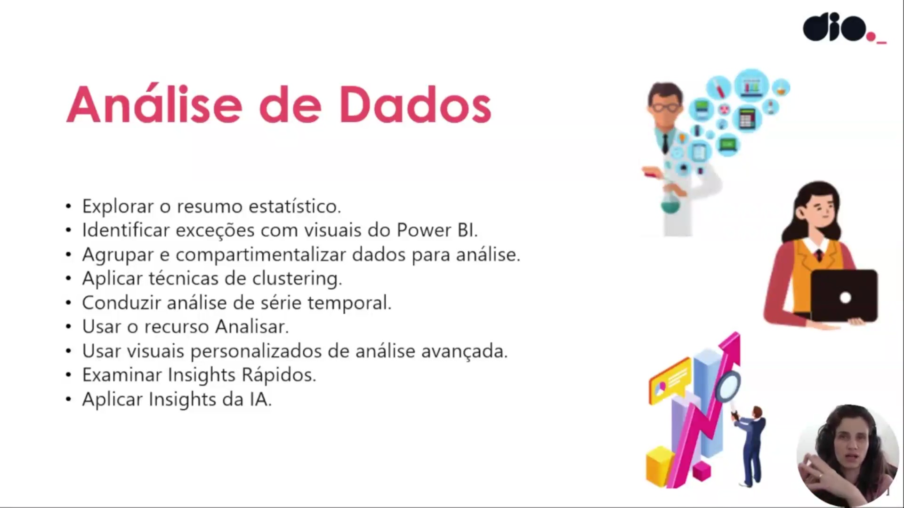
</p>

O Power BI oferece uma série de funcionalidades para uma análise de dados robusta, incluindo a exploração de resumos estatísticos e a identificação de exceções (outliers) através de visuais. É possível agrupar e compartimentalizar dados, aplicar técnicas de *clustering* e conduzir análises de série temporal. Além disso, a ferramenta disponibiliza recursos como o botão "Analisar", visuais personalizados para análises avançadas, "Insights Rápidos" e a aplicação de "Insights de IA" para aprofundar a compreensão dos dados.      


### 🟩 Vídeo 02 - Resumo estatísticos

<video width="60%" controls>
  <source src="000-Midia_e_Anexos/bootcamp_ntt_data-modulo.09-curso.03-video_02.webm" type="video/webm">
    Seu navegador não suporta vídeo HTML5.
</video>

link do vídeo: https://web.dio.me/track/engenharia-dados-python/course/fundamentos-de-data-analytics-com-power-bi/learning/44318103-5dcb-4814-8290-5e0280b9edd9?autoplay=1

O vídeo aborda a interseção fundamental entre a análise de dados e a estatística. A estatística é apresentada não apenas como um conjunto de fórmulas, mas como uma ferramenta essencial para explorar dados de forma quantitativa e qualitativa, permitindo a identificação de tendências, exceções e padrões comportamentais que fundamentam a tomada de decisão estratégica.

### Anotações

#### Resumo Estatístico em Análise de Dados

<p align="center">
  
</p>

A estatística é a base para explorar dados de maneira quantitativa e qualitativa, permitindo a mensuração de KPIs e a extração de qualidade das informações disponíveis. O **resumo estatístico**, especificamente, é uma ferramenta que fornece uma descrição rápida, simples e de alto valor sobre o conjunto de dados.

Através dessa análise, é possível identificar pontos cruciais para o negócio, como:
* **Distribuição e Tendências:** Compreender como os dados se comportam ao longo do tempo ou categorias.
* **Identificação de Exceções:** Detectar anomalias ou "novidades" que fogem do padrão esperado.
* **Padrões Comportamentais:** Visualizar dados como clusters ou médias para orientar decisões estratégicas.

Para operacionalizar essas análises no Power BI, utilizam-se diversos recursos técnicos:
* **DAX (Data Analytics Expressions):** Linguagem utilizada para aplicar o viés matemático e criar cálculos personalizados sobre os dados.
* **Visuais Especializados:** Uso de histogramas e curvas de sino para demonstrar frequências e variabilidades.
* **Análise Avançada:** Inclusão de elementos como margem de erro, desvio padrão e a possibilidade de integração com linguagens como R e Python para análises mais profundas.
* **Rankings e Frequência:** Aplicação de lógicas como o "Top N" para identificar, por exemplo, os produtos mais vendidos ou a frequência de pedidos em uma cadeia de suprimentos.      

### 🟩 Vídeo 03 - Funções Estatísticas e Histograma

<video width="60%" controls>
  <source src="000-Midia_e_Anexos/bootcamp_ntt_data-modulo.09-curso.03-video_03.webm" type="video/webm">
    Seu navegador não suporta vídeo HTML5.
</video>

link do vídeo: https://web.dio.me/track/engenharia-dados-python/course/fundamentos-de-data-analytics-com-power-bi/learning/022f4574-9f97-43a9-84cb-fbdbfb1e3fe8?autoplay=1

O vídeo explora as nuances entre gráficos de barras tradicionais e histogramas, demonstrando como configurar agrupamentos (buckets) para visualizar a distribuição de dados de forma eficaz.

### Anotações

<p align="center">
  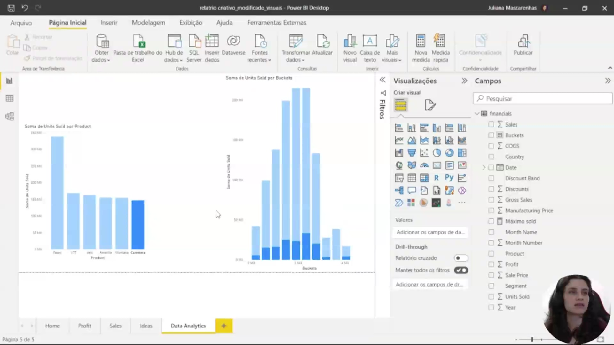
</p>

A imagem apresenta a interface do **Power BI Desktop**, onde está sendo construído um **histograma** para análise de dados. O objetivo central desta visualização é ilustrar como uma amostra de dados está distribuída dentro de um determinado contexto, permitindo observar a frequência com que determinados valores ocorrem por meio de uma visão agrupada.

No painel de visualização central, observa-se o gráfico intitulado "**Soma de Units Sold per Buckets**". Este gráfico difere de uma coluna clusterizada tradicional pois utiliza **grupos (buckets)** criados a partir do campo de unidades vendidas para mostrar a distribuição das instâncias de venda.

No painel lateral de **Campos (Fields)**, é possível identificar a estrutura dos dados utilizada:
* **Buckets**: O grupo criado para segmentar as unidades vendidas em compartimentos.
* **Units Sold**: O campo original de unidades vendidas que serviu de base para a criação do histograma.
* **Product**: Campo que permite analisar a distribuição de forma segmentada por produto.

A criação deste visual envolve a configuração de "compartimentos" (bins), onde se define o tamanho ou a quantidade de grupos para refinar a precisão da curva de distribuição observada. Isso permite abstrair nuances específicas de produtos ou países para focar no comportamento nominal dos grupos de unidades vendidas.      

### 🟩 Vídeo 04 - Outros Recursos de Data Analytics no Power BI

<video width="60%" controls>
  <source src="000-Midia_e_Anexos/bootcamp_ntt_data-modulo.09-curso.03-video_04.webm" type="video/webm">
    Seu navegador não suporta vídeo HTML5.
</video>

link do vídeo: https://web.dio.me/track/engenharia-dados-python/course/fundamentos-de-data-analytics-com-power-bi/learning/290bd938-6e6f-4dc3-94af-24aa95450e0d?autoplay=1

O vídeo aborda a aplicação da análise de N Superiores, uma técnica essencial para identificar os elementos de maior impacto em um conjunto de dados, como os produtos mais vendidos ou os clientes mais lucrativos.

### Anotações

#### N Superiores: DAX e P&R

<p align="center">
  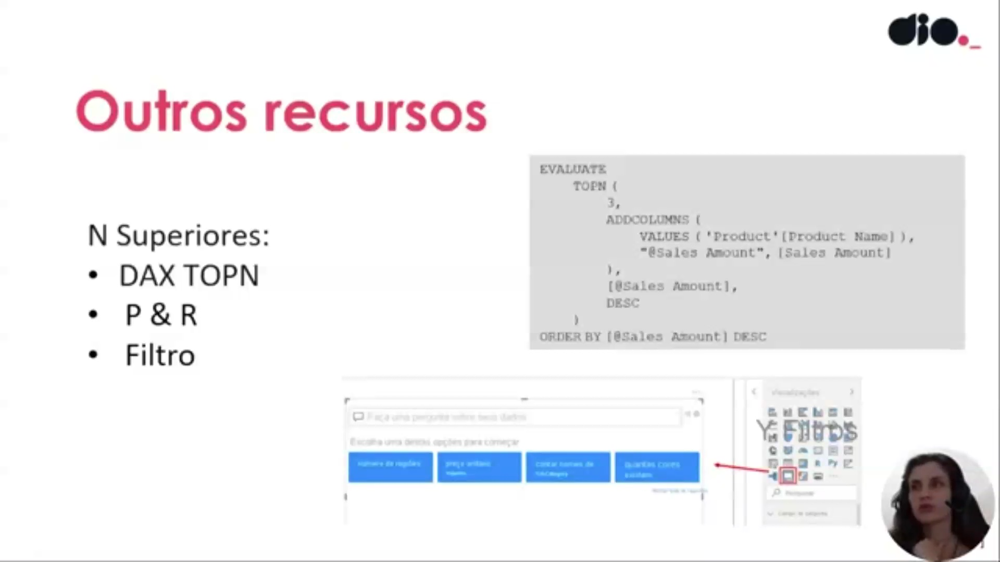
</p>

A análise de **N superiores**, comumente chamada de **Top N**, permite identificar os elementos de maior impacto dentro de um contexto específico. Essa métrica é essencial para destacar fatos relevantes, como os principais produtos vendidos, os segmentos mais lucrativos ou os países com maior demanda. No Power BI, essa funcionalidade pode ser explorada tanto através do recurso de **P&R (Perguntas e Respostas)**, que utiliza IA para interpretar consultas, quanto pela aplicação direta da função **DAX TOPN**.

Abaixo, observa-se um exemplo de expressão DAX estruturada para retornar os três principais produtos baseados no montante de vendas:

```dax
EVALUATE
TOPN (
    3,
    ADDCOLUMNS (
        VALUES ('Product'[Product Name]),
        "@Sales Amount", [Sales Amount]
    ),
    [@Sales Amount],
    DESC
)
ORDER BY [@Sales Amount] DESC
```

Nesta construção, a função `TOPN` é utilizada para filtrar as três primeiras linhas de uma tabela gerada pela função `ADDCOLUMNS`, que associa cada produto ao seu respectivo valor de venda. O comando `EVALUATE` é empregado para executar a avaliação desta expressão específica, enquanto o parâmetro `DESC` garante que o ranking seja ordenado de forma descendente (do maior para o menor). Embora essa estrutura possua uma lógica semelhante a consultas SQL e seja considerada mais complexa, ela oferece um controle preciso sobre os dados analisados no relatório.      


### 🟩 Vídeo 05 - Criando visual com visão N Superiores com P&R

<video width="60%" controls>
  <source src="000-Midia_e_Anexos/bootcamp_ntt_data-modulo.09-curso.03-video_05.webm" type="video/webm">
    Seu navegador não suporta vídeo HTML5.
</video>

link do vídeo: https://web.dio.me/track/engenharia-dados-python/course/fundamentos-de-data-analytics-com-power-bi/learning/106f9735-db26-4495-a1ba-716b02733b64?autoplay=1

Este guia resume as técnicas apresentadas para transformar dados brutos em dashboards profissionais, utilizando recursos de Inteligência Artificial (P&R), árvores hierárquicas e design avançado.

### Anotações

#### Q&A e Formatação Condicional no Power BI

<p align="center">
  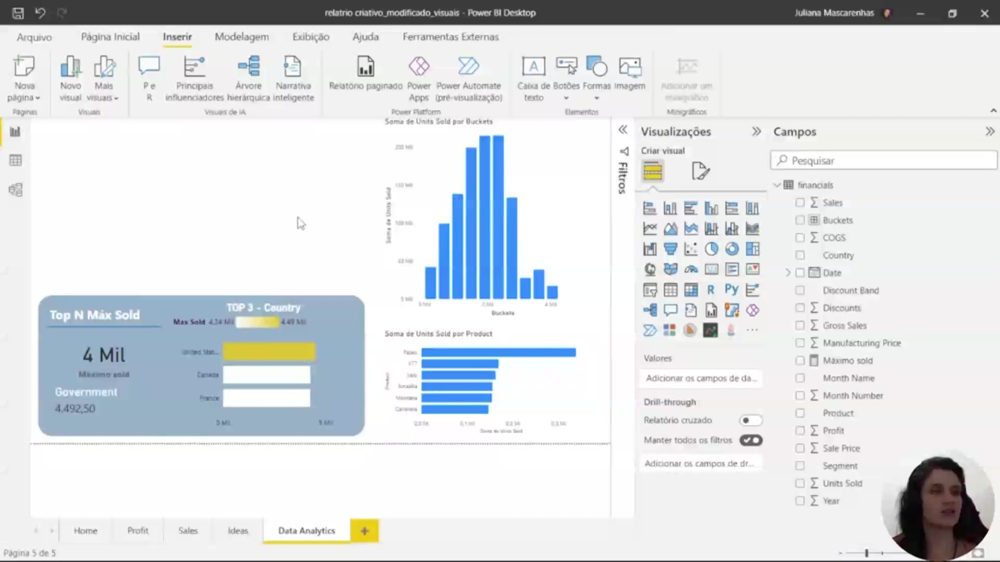
</p>

A interface do Power BI Desktop apresenta a utilização do recurso de **P&R (Perguntas e Respostas)**, localizado na aba de visualizações. Esta ferramenta permite a criação de visuais a partir de consultas em linguagem natural, oferecendo sugestões automáticas baseadas nos dados disponíveis, como o "Top Country by Maximum Sold".

**Métricas e Visualização de Dados**
* **Métrica Maximum Sold**: Foi estabelecida uma medida para identificar o valor máximo da coluna de unidades (`Units Sold`) na tabela `financials`.
* **Cartão de Resumo**: Um visual de cartão é utilizado para destacar que a maior instância de venda registrada é de aproximadamente **4,49 mil unidades**. Este valor representa o pico de vendas em um contexto específico de país e segmento.
* **Ranking Top 3**: O visual de P&R foi convertido em um gráfico de barras padrão para exibir os três principais países em vendas: **United States**, **Canada** e **France**.

**Refinamento Estético e Funcional**
Para tornar a análise mais intuitiva, foi aplicada uma **formatação condicional** nas barras do gráfico. Utilizando um gradiente que varia entre tons de amarelo (menor valor) e azul forte (maior valor), o relatório enfatiza visualmente a liderança dos Estados Unidos, mesmo que a diferença nominal para o Canadá e a França não seja tão acentuada. Essa técnica de cores ajuda a refletir a proximidade dos valores entre os países do topo enquanto destaca o vencedor absoluto.      


### 🟩 Vídeo 06 - Criando visão N Superiores com Filtros

<video width="60%" controls>
  <source src="000-Midia_e_Anexos/bootcamp_ntt_data-modulo.09-curso.03-video_06.webm" type="video/webm">
    Seu navegador não suporta vídeo HTML5.
</video>

link do vídeo: https://web.dio.me/track/engenharia-dados-python/course/fundamentos-de-data-analytics-com-power-bi/learning/71785669-0b33-4c19-b03a-f04cc0f39b4a?autoplay=1

O vídeo ensina como utilizar filtros de "Top N" para identificar os períodos mais lucrativos e como visualizar correlações entre diferentes métricas (Vendas vs. Lucro) utilizando escalas logarítmicas e ajustes de design para melhorar a legibilidade dos dados.

### Anotações

<p align="center">
  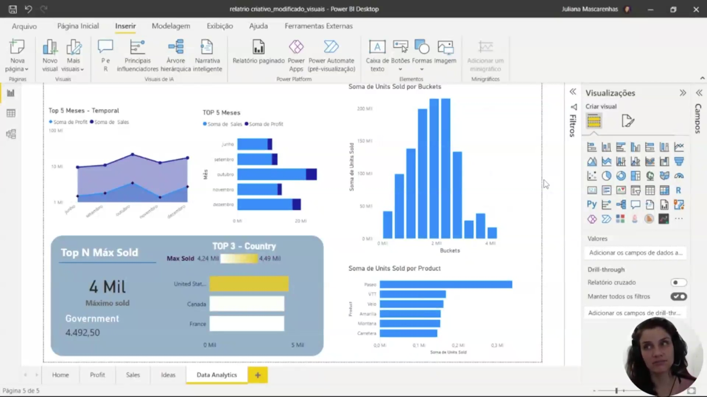
</p>

A interface do Power BI Desktop apresenta a configuração final de um painel voltado para a análise de desempenho temporal e por categoria. O foco central da demonstração é o visual "Top 5 Meses - Temporal", que utiliza um gráfico de área para correlacionar a **Soma de Sales** (Vendas) e a **Soma de Profit** (Lucro). Para resolver a disparidade entre as ordens de grandeza dessas duas métricas, foi aplicada uma **escala logarítmica** no eixo, permitindo que a variação de ambas seja observada de forma proporcional e visualmente clara.

A lógica por trás deste visual envolve a aplicação de um filtro de **N superior** (Top N) no painel de filtros lateral. Este filtro foi configurado para exibir apenas os 5 meses com maior volume de lucro, utilizando o campo "Month" como base de agrupamento. Adicionalmente, o visual foi refinado esteticamente através da remoção dos títulos dos eixos X e Y para maximizar o espaço útil, além da inclusão de marcadores específicos nas linhas para facilitar a distinção entre as séries de dados de vendas e lucro.      

### 🟩 Vídeo 07 - Criando visão N Superiores com DAX

<video width="60%" controls>
  <source src="000-Midia_e_Anexos/bootcamp_ntt_data-modulo.09-curso.03-video_07.webm" type="video/webm">
    Seu navegador não suporta vídeo HTML5.
</video>

link do vídeo: https://web.dio.me/track/engenharia-dados-python/course/fundamentos-de-data-analytics-com-power-bi/learning/81968e76-3f32-481e-aa3f-58075d3a4b74?autoplay=1

O tutorial foca na construção de uma medida complexa que utiliza a combinação das funções CALCULATE, TOPN, ALL e VALUES. O objetivo é criar um filtro dinâmico que identifique o ranking de vendas, permitindo que apenas os itens do topo sejam destacados em relatórios e tabelas, independentemente dos filtros laterais aplicados.

### Anotações

<p align="center">
  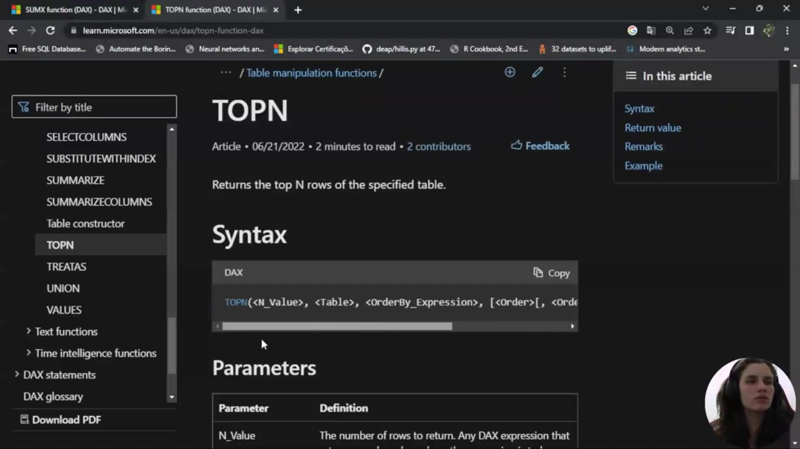
</p>

Nesta etapa, exploramos a documentação da função **TOPN** no DAX. Esta função é fundamental para retornar as primeiras N linhas de uma tabela específica com base em um critério de ordenação. Diferente da SUMX, a TOPN foca em ranqueamento e filtragem de dados.

A sintaxe da função exige a definição de quatro argumentos principais:
* **N_Value**: O número de linhas que devem ser retornadas.
* **Table**: A tabela ou expressão de tabela de onde as linhas serão extraídas.
* **OrderBy_Expression**: O critério ou medida que definirá a ordem do ranqueamento.
* **Order**: A direção da ordenação (ascendente ou descendente).

<p align="center">
  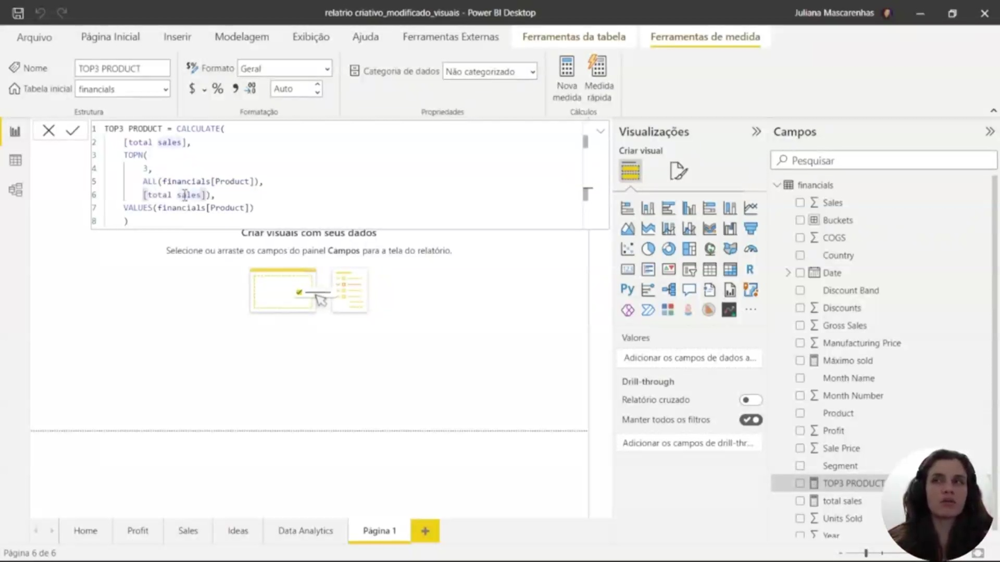
</p>

Para identificar os produtos com maior volume de vendas, criamos a medida **TOP3 PRODUCT** utilizando uma combinação avançada de funções. O raciocínio lógico baseia-se no uso da função **CALCULATE** como motor principal para modificar o contexto de filtro.

Dentro desta medida, aplicamos os seguintes componentes:
* **Total Sales**: A medida de referência que soma as vendas da tabela *financials*.
* **ALL (financials[Product])**: Utilizada dentro da TOPN para remover filtros pré-existentes na coluna de produtos, garantindo que o ranking considere todos os itens disponíveis.
* **VALUES (financials[Product])**: Atua como um fator de filtragem final na CALCULATE para garantir que o resultado respeite o contexto visual do relatório.

```dax
TOP3 PRODUCT = 
CALCULATE(
    [total sales],
    TOPN(
        3, 
        ALL(financials[Product]), 
        [total sales]
    ),
    VALUES(financials[Product])
)
```

<p align="center">
  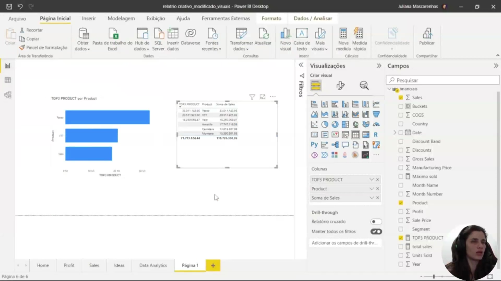
</p>

Ao aplicar a medida em elementos visuais, confirmamos a eficácia do filtro de ranking. No gráfico de barras "TOP3 PRODUCT por Product", o Power BI exibe isoladamente os três produtos com melhor desempenho em vendas.

A validação dos dados através de uma tabela comparativa permite observar que a medida `TOP3 PRODUCT` retorna valores apenas para os itens ranqueados no topo:
1.  **Paseo**
2.  **VTT**
3.  **Velo**

Enquanto a coluna de vendas totais exibe os valores para todos os produtos, a nova medida ignora os itens que não pertencem ao Top 3, facilitando a análise de destaque e a criação de visuais focados em performance.      


### 🟩 Vídeo 08 - Criando visuais com base na visão N superiores

<video width="60%" controls>
  <source src="000-Midia_e_Anexos/bootcamp_ntt_data-modulo.09-curso.03-video_08.webm" type="video/webm">
    Seu navegador não suporta vídeo HTML5.
</video>

link do vídeo: https://web.dio.me/track/engenharia-dados-python/course/fundamentos-de-data-analytics-com-power-bi/learning/4b0f9e22-64a2-44ae-8665-c0b5fc7a9660?autoplay=1

O vídeo demonstra a criação e personalização de uma visualização de dados no Power BI (ou ferramenta similar) utilizando um gráfico de barras empilhadas. O foco é analisar dados de vendas, especificamente destacando a proporção dos três produtos mais vendidos ("top 3 produtos") em relação ao total de vendas por país, e como essa informação pode ser contextualizada e apresentada de forma clara.

### Anotações

<p align="center">
  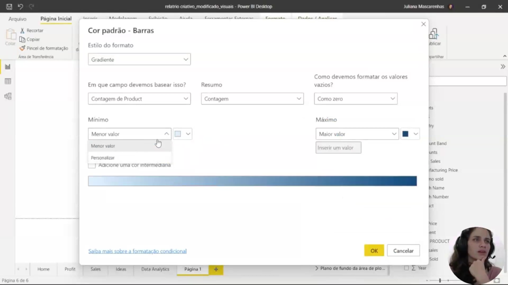
</p>

A visualização apresenta a construção de um gráfico de colunas empilhadas para comparar a "Soma de Sales" (vendas totais) e o "TOP3 PRODUCT" (os três produtos mais vendidos) por país. O objetivo é analisar a proporção que esses produtos principais representam dentro do contexto total de vendas de cada nação, como Estados Unidos, Canadá e França. 

Nesta fase inicial, o gráfico utiliza uma paleta de cores com azul e um tom de amarelo mais aberto. Abaixo, um gráfico de barras detalha especificamente o "TOP3 PRODUCT per Product", identificando os itens individuais que compõem essa métrica. Essa estrutura permite observar como a modificação de informações altera o contexto dos dados exibidos.

<p align="center">
  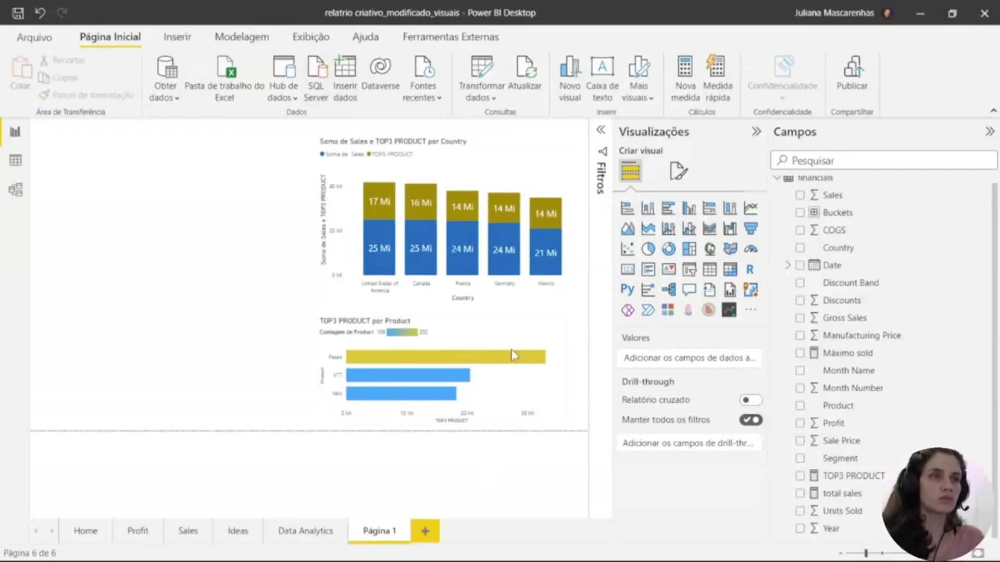
</p>

Nesta etapa, o relatório no Power BI Desktop exibe ajustes finais de formatação e identidade visual. As cores foram modificadas para tons mais "fechados", utilizando um azul e um amarelo mais escuros para destacar melhor as proporções entre as séries de dados. Os rótulos de dados foram aumentados para o tamanho 15, facilitando a leitura dos valores, como os "25 Mi" em vendas e "17 Mi" correspondentes ao top 3 nos Estados Unidos.

O painel de campos à direita revela a estrutura de dados utilizada, incluindo campos como `Country`, `Product`, `TOP3 PRODUCT` e `total sales`. O resultado final oferece duas visões complementares: uma focada nos produtos mais vendidos individualmente e outra que demonstra o impacto e a influência desses produtos no montante total de vendas por país.      


### 🟩 Vídeo 09 - Conversando sobre anomalias em dados

<video width="60%" controls>
  <source src="000-Midia_e_Anexos/bootcamp_ntt_data-modulo.09-curso.03-video_09.webm" type="video/webm">
    Seu navegador não suporta vídeo HTML5.
</video>

link do vídeo: https://web.dio.me/track/engenharia-dados-python/course/fundamentos-de-data-analytics-com-power-bi/learning/4abd7195-1b04-48cb-a980-f966205bbdbf?autoplay=1

Este segmento aborda a importância e os métodos para identificar exceções (anomalias) em conjuntos de dados, com foco na utilização de visuais do Power BI. A palestrante enfatiza que a detecção dessas anomalias é crucial para a tomada de decisões estratégicas, a compreensão de padrões de comportamento e a revelação de eventos inesperados que podem impactar o negócio.

### Anotações

<p align="center">
  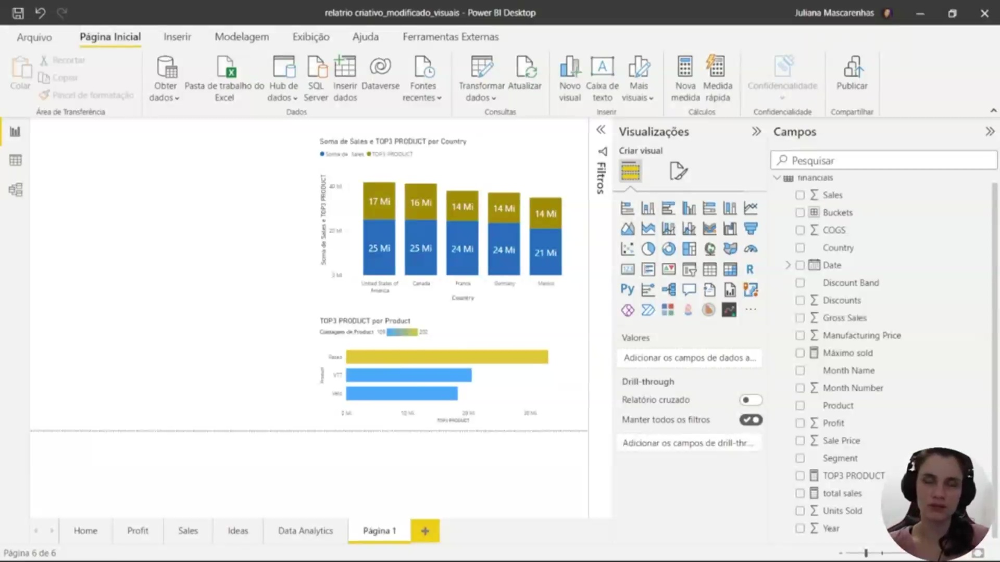
</p>

Nesta etapa da análise, utilizamos o Power BI para identificar exceções, que são caracterizadas como um tipo de anomalia. Trata-se de dados que fogem ao padrão esperado, surpreendendo o analista por não caracterizarem o comportamento normal da base.

A identificação dessas exceções é fundamental para isolar pontos que diferem significativamente do restante dos dados, permitindo uma investigação profunda sobre as causas raiz dessas ocorrências. No painel visual apresentado, observamos a análise de vendas e produtos específicos (como o "TOP3 PRODUCT") distribuídos por países como United States of America, Canada, France, Germany e Mexico.

A análise de anomalias pode impactar decisões empresariais ao revelar questões ligadas à cultura da empresa ou a falhas operacionais. Por exemplo, ao observar um volume de pedidos acima da média para uma categoria específica em um determinado depósito, o analista deve questionar se o evento foi pontual, se houve influência externa (como uma promoção não prevista) ou se existe uma periodicidade (trimestral ou anual) que transforme essa anomalia em um novo padrão de comportamento.

Para operacionalizar essa identificação no Power BI, o processo envolve:
* Segmentação de dados: Divisão entre o grupo que representa a exceção e o grupo que mantém o comportamento normal.
* Métodos de implementação: Embora seja possível utilizar colunas calculadas, os resultados seriam estáticos. A abordagem recomendada prioriza o uso de visuais (elementos gráficos) ou fórmulas DAX para uma identificação dinâmica e eficiente.      


### 🟩 Vídeo 10 - Identificando Exceções com visuais

<video width="60%" controls>
  <source src="000-Midia_e_Anexos/bootcamp_ntt_data-modulo.09-curso.03-video_10.webm" type="video/webm">
    Seu navegador não suporta vídeo HTML5.
</video>

link do vídeo: https://web.dio.me/track/engenharia-dados-python/course/fundamentos-de-data-analytics-com-power-bi/learning/ac42c3e0-ef41-4df3-a7da-7cb46dc4d3a5?autoplay=1

O vídeo explora o uso de gráficos de dispersão para identificar e analisar anomalias em conjuntos de dados, com um foco especial na visualização da evolução temporal através do "eixo de reprodução".

### Anotações

<p align="center">
  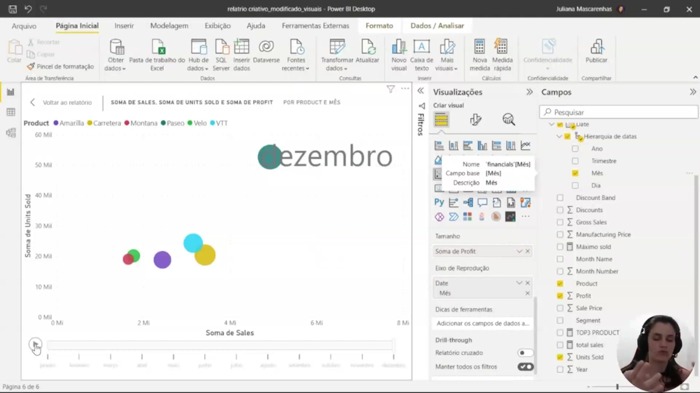
</p>

A utilização do visual de dispersão permite identificar anomalias que, muitas vezes, não representam erros, mas sim comportamentos reais que se consolidam ao longo do tempo. Ao analisar a distribuição dos dados, é possível verificar se um ponto fora da curva é resultado de uma transformação equivocada ou de uma etapa esquecida no processo de tratamento de dados. Este tipo de visualização traz segurança na análise, garantindo que as oscilações identificadas estejam realmente relacionadas à natureza dos dados e não a falhas técnicas.

<p align="center">
  
</p>

Neste exemplo prático, observa-se o comportamento do número de pedidos em uma grande massa de dados, onde a maioria dos pontos converge para um padrão esperado. No entanto, o gráfico destaca pontos isolados que divergem drasticamente dessa convergência. Essas ocorrências únicas provocam questionamentos essenciais sobre a origem desses pedidos e por que esse fenômeno ocorreu em depósitos específicos, exemplificando como o gráfico de dispersão é fundamental para a identificação visual imediata de anomalias.      


### 🟩 Vídeo 11 - Criando DAX para identificar outliers

<video width="60%" controls>
  <source src="000-Midia_e_Anexos/bootcamp_ntt_data-modulo.09-curso.03-video_11.webm" type="video/webm">
    Seu navegador não suporta vídeo HTML5.
</video>

link do vídeo: https://web.dio.me/track/engenharia-dados-python/course/fundamentos-de-data-analytics-com-power-bi/learning/81bb522b-bcc8-4c6a-8ecc-bfceaa0eeca7?autoplay=1

O vĩdeo explica como identificar e visualizar outliers de forma dinâmica no Power BI. Em vez de depender apenas das ferramentas nativas de filtragem, o método utiliza a linguagem DAX para criar medidas personalizadas que isolam produtos ou transações que superam determinados limites de vendas. O objetivo final é criar um gráfico de dispersão que destaque visualmente os pontos "fora da curva" e permita análises temporais dessas exceções.

### Anotações

<p align="center">
  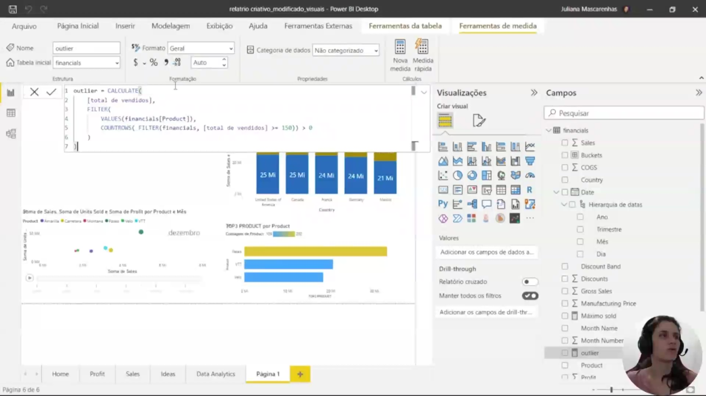
</p>

O cálculo de um **outlier** utilizando a linguagem DAX no Power BI é iniciado através da criação de uma nova medida. O processo baseia-se na análise das unidades vendidas, filtrando os produtos conforme critérios específicos de volume de informação. 

A estrutura da fórmula utiliza a função `CALCULATE` para definir a expressão principal, que neste caso é a medida `total de vendidos`. Esta medida pré-existente representa a soma das unidades vendidas (utilizando `SUMX` ou uma soma simples), facilitando a interação entre diferentes cálculos dentro do modelo. 

Para isolar os dados desejados, aplica-se a função `FILTER`, especificando a tabela e a expressão de filtragem baseada no campo de produtos.

```dax
outlier = 
CALCULATE(
    [total de vendidos],
    FILTER(
        VALUES(Financials[Product]),
        COUNTROWS(
            FILTER(Financials, [total de vendidos] > 150)
        ) > 0
    )
)
```

<p align="center">
  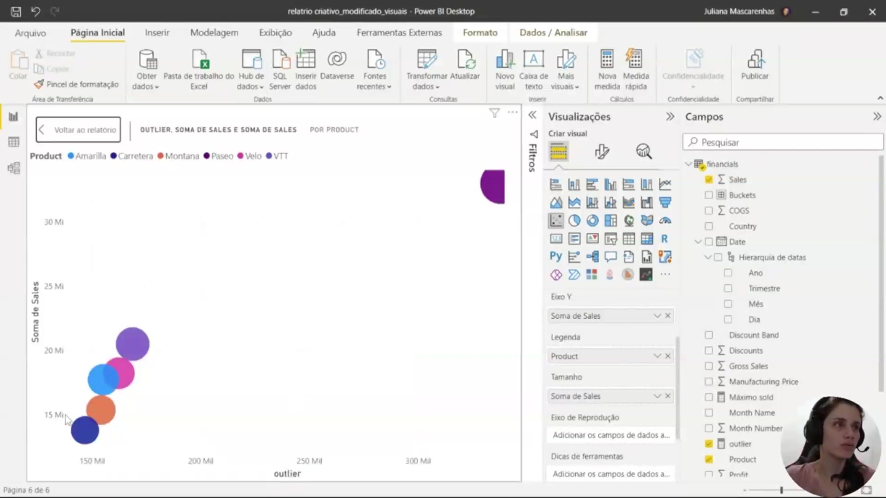
</p>

Após a criação da métrica, a configuração visual no painel de **Visualizações** permite a representação gráfica dos dados. O gráfico selecionado organiza a "Soma de Sales" (Soma de Vendas) e a medida de "outlier" por produto. 

No painel de campos, os dados da tabela `financials` são distribuídos nos eixos do gráfico:
* O campo **Product** é utilizado para definir a legenda e a segmentação dos dados.
* A **Soma de Sales** é atribuída aos eixos de valores e tamanho, permitindo a comparação visual da magnitude das vendas.
* A medida **outlier** é incluída no campo de dicas de ferramentas (tooltips) para fornecer informações contextuais adicionais durante a interação com o relatório.

<p align="center">
  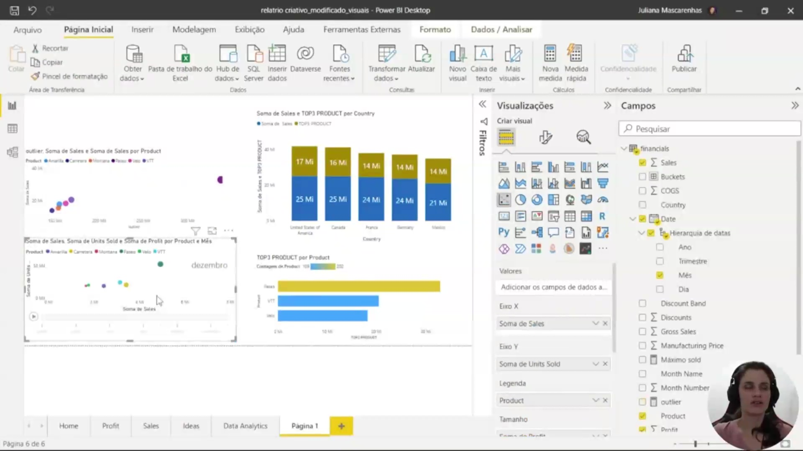
</p>

O painel final consolidado apresenta uma análise de **Data Analytics** composta por diferentes perspectivas de desempenho:

* **Gráfico de Dispersão (Outliers):** Localizado no topo superior esquerdo, correlaciona a Soma de Sales por Produto para identificar desvios estatísticos.
* **Análise de Vendas e Lucro:** Um gráfico de bolhas dinâmico apresenta a relação entre a Soma de Sales, a Soma de Units Sold (unidades vendidas) e a Soma de Profit (lucro) por produto e mês.
* **Distribuição Geográfica:** Um gráfico de colunas empilhadas compara a Soma de Sales e os "TOP3 PRODUCT" por país, destacando mercados como Estados Unidos, Canadá e França.
* **Ranking de Produtos:** Um gráfico de barras horizontais detalha o "TOP3 PRODUCT" por categoria, permitindo uma visualização rápida da contagem de produtos líderes em vendas.      


### 🟩 Vídeo 12 - Criando agrupamento dos dados

<video width="60%" controls>
  <source src="000-Midia_e_Anexos/bootcamp_ntt_data-modulo.09-curso.03-video_12.webm" type="video/webm">
    Seu navegador não suporta vídeo HTML5.
</video>

link do vídeo: https://web.dio.me/track/engenharia-dados-python/course/fundamentos-de-data-analytics-com-power-bi/learning/abd5979f-36b0-445e-9b0f-87de0c53758d?autoplay=1

Este vídeo explora as técnicas de agrupamento (grouping) e compartimentação (binning) no Power BI. O objetivo central é demonstrar como a organização de dados granulares em categorias maiores pode refinar a análise, facilitar a visualização e fornecer uma perspectiva estratégica (como visões regionais ou por destaque de mercado) que dados isolados não permitem.

### Anotações

<p align="center">
  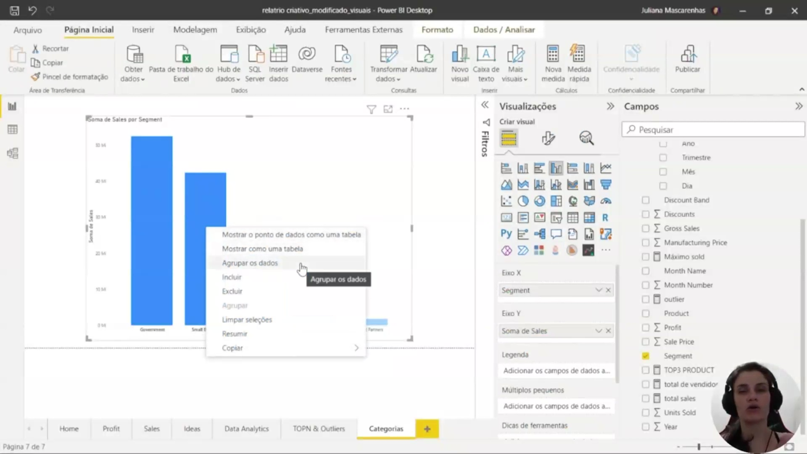
</p>

O agrupamento é uma técnica essencial para refinar análises e obter uma visão mais clara do contexto dos dados, permitindo ir além das segmentações padrão do Power BI. Para criar um grupo manualmente a partir de um gráfico de barras, selecionam-se os pontos de dados desejados e, com o botão direito, utiliza-se a opção **Agrupar os dados**. Esse processo permite consolidar categorias específicas que não estavam originalmente unidas na base de dados.

<p align="center">
  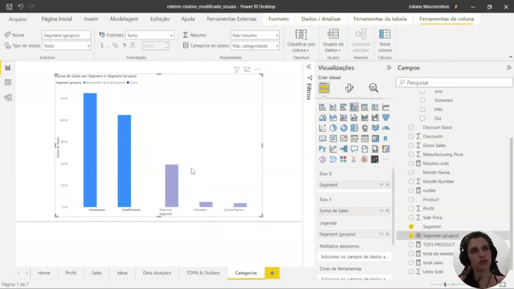
</p>

Após a criação do grupo, o Power BI gera automaticamente um novo campo no painel de campos, geralmente identificado pelo sufixo **(grupos)**. Visualmente, as barras no gráfico passam a refletir essa nova organização, e é possível aplicar formatações distintas, como cores contrastantes, para diferenciar os grupos criados (como um grupo de "Destaque") dos demais elementos ou do grupo "Outros". Essa distinção visual facilita a abstração e a identificação imediata dos segmentos mais relevantes para a análise.

<p align="center">
  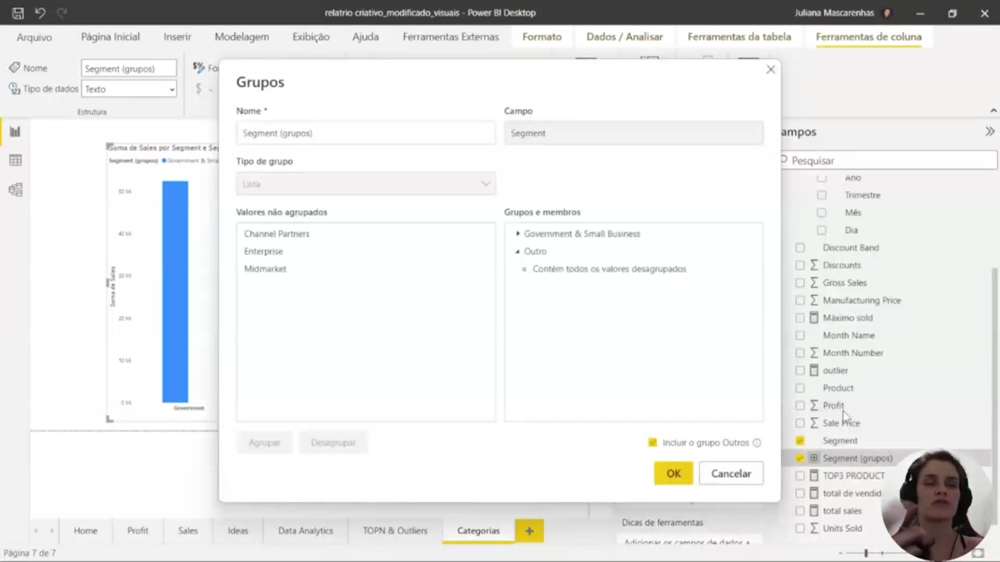
</p>

A janela **Grupos** permite o gerenciamento detalhado e a edição das categorias criadas. Através dessa interface, é possível renomear o campo de grupo, alterar o nome de grupos específicos e organizar os membros em listas. Uma funcionalidade importante é a opção **Incluir o grupo Outros**, que aglutina automaticamente todos os valores não selecionados individualmente em uma categoria única, garantindo que nenhum dado seja omitido da visualização final.

### 🟩 Vídeo 13 - Criando compartimentos com dados

<video width="60%" controls>
  <source src="000-Midia_e_Anexos/bootcamp_ntt_data-modulo.09-curso.03-video_13.webm" type="video/webm">
    Seu navegador não suporta vídeo HTML5.
</video>

link do vídeo: https://web.dio.me/track/engenharia-dados-python/course/fundamentos-de-data-analytics-com-power-bi/learning/057cc513-a356-4f6f-a6d1-80d07ef247ee?autoplay=1


### 🟩 Vídeo 14 - O que é Clusterização de dados?

<video width="60%" controls>
  <source src="000-Midia_e_Anexos/bootcamp_ntt_data-modulo.09-curso.03-video_14.webm" type="video/webm">
    Seu navegador não suporta vídeo HTML5.
</video>

link do vídeo: https://web.dio.me/track/engenharia-dados-python/course/fundamentos-de-data-analytics-com-power-bi/learning/e7b3e9d2-25f0-43bc-95d4-dfb125b30b7b?autoplay=1

### 🟩 Vídeo 15 - Como criar uma análise temporal com Power BI?

<video width="60%" controls>
  <source src="000-Midia_e_Anexos/bootcamp_ntt_data-modulo.09-curso.03-video_15.webm" type="video/webm">
    Seu navegador não suporta vídeo HTML5.
</video>

link do vídeo:

### 🟩 Vídeo 16 - Um aliado no processo - Recurso analisar

<video width="60%" controls>
  <source src="000-Midia_e_Anexos/bootcamp_ntt_data-modulo.09-curso.03-video_16.webm" type="video/webm">
    Seu navegador não suporta vídeo HTML5.
</video>

link do vídeo:

### 🟩 Vídeo 17 - Visuais personalizados de análise avançada - Parte 1

<video width="60%" controls>
  <source src="000-Midia_e_Anexos/bootcamp_ntt_data-modulo.09-curso.03-video_17.webm" type="video/webm">
    Seu navegador não suporta vídeo HTML5.
</video>

link do vídeo:

### 🟩 Vídeo 18 - Visuais personalizados de análise avançada - Parte 2

<video width="60%" controls>
  <source src="000-Midia_e_Anexos/bootcamp_ntt_data-modulo.09-curso.03-video_18.webm" type="video/webm">
    Seu navegador não suporta vídeo HTML5.
</video>

link do vídeo:

### 🟩 Vídeo 19 - Como examinar insights rápidos?

<video width="60%" controls>
  <source src="000-Midia_e_Anexos/bootcamp_ntt_data-modulo.09-curso.03-video_19.webm" type="video/webm">
    Seu navegador não suporta vídeo HTML5.
</video>

link do vídeo:

##  Materiais de Apoio

# Certificado: 

- Link na plataforma: 
- Certificado em pdf: 