## Instrutor:

- Juliana Mascarenhas (Tech Education Specialist / Sócia (Content Creator) @SimplificandoRedes / Me Modelagem Computacional / Cientista de dados)
- Contato Linkedin: / [juliana-mascarenhas-ds](https://www.linkedin.com/in/juliana-mascarenhas-ds/)

### 🟩 Vídeo 01 - Apresentação do desafio

<video width="60%" controls>
  <source src="000-Midia_e_Anexos/bootcamp_ntt_data-modulo.09-curso.04-video_01.webm" type="video/webm">
    Seu navegador não suporta vídeo HTML5.
</video>

link do vídeo: https://web.dio.me/project/criando-relatorios-dinamicos-com-o-uso-de-parametros/learning/c099881b-acad-4972-9020-c79f58b5f1a4?back=/track/engenharia-dados-python&tab=undefined&moduleId=undefined

O vídeo introduz o primeiro desafio do módulo, focado na transformação de um relatório de dados padrão em uma ferramenta de alta performance visual. O objetivo central é aplicar princípios de Experiência do Usuário (UX) e design estético para melhorar a legibilidade e a eficácia da comunicação dos dados.

### Anotações

  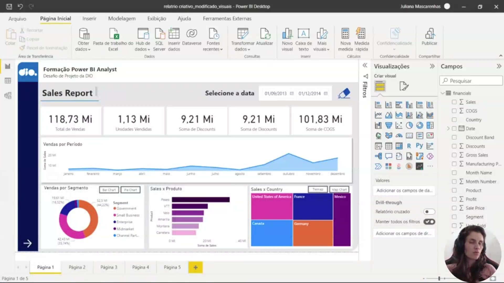

Esta imagem apresenta o relatório de vendas inicial que serve de base para o desafio do módulo. O objetivo proposto é modificar este dashboard com foco total na experiência do usuário (UX), transformando um visual padrão em um relatório esteticamente coerente e funcional. O layout atual conta com um gráfico de linhas para vendas por período e segmentações por produto, país e segmento.

  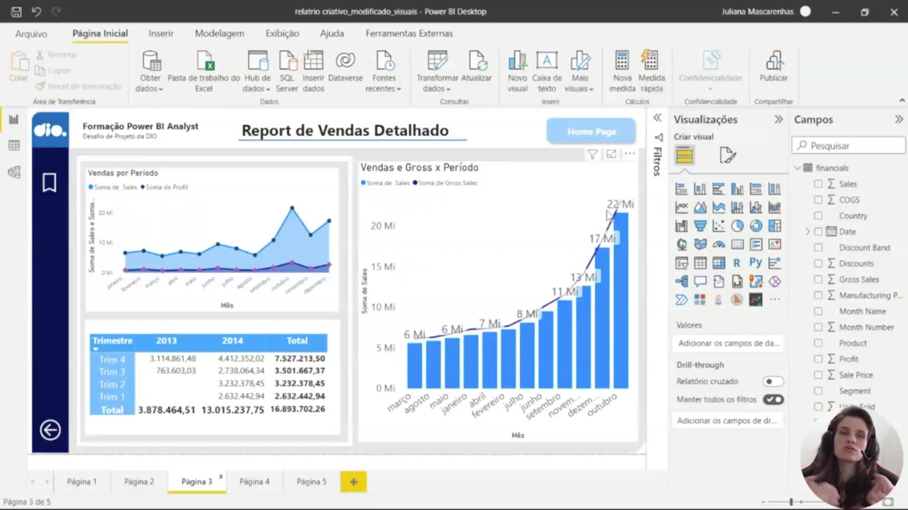

O slide aborda a aplicação da proporção áurea e a importância da hierarquia visual no design de dashboards. A estruturação deve respeitar o fluxo natural de leitura humana — da esquerda para a direita e de cima para baixo — garantindo que as informações mais críticas ocupem as áreas de maior atenção visual.

  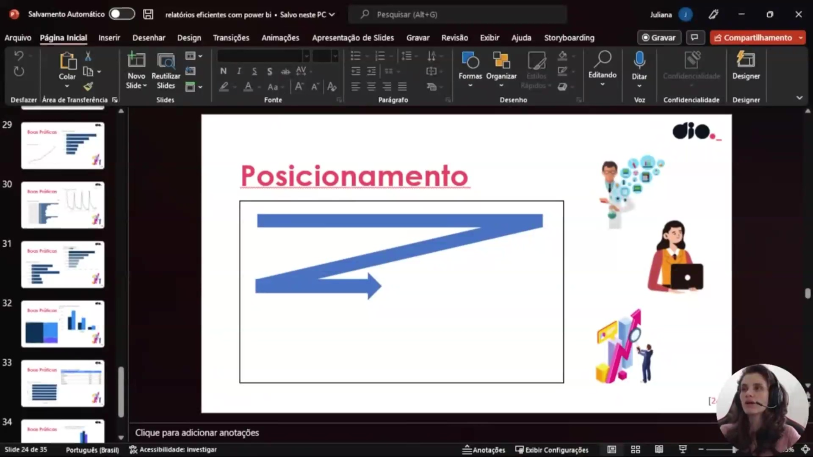

Aqui é ilustrado o conceito de organização espacial através da divisão do relatório em "baias" ou áreas delimitadas. Essa prática ajuda a manter o contraste necessário e a coerência visual, evitando o uso excessivo de cores e garantindo que cada grupo de informações tenha seu espaço definido sem gerar poluição visual.

  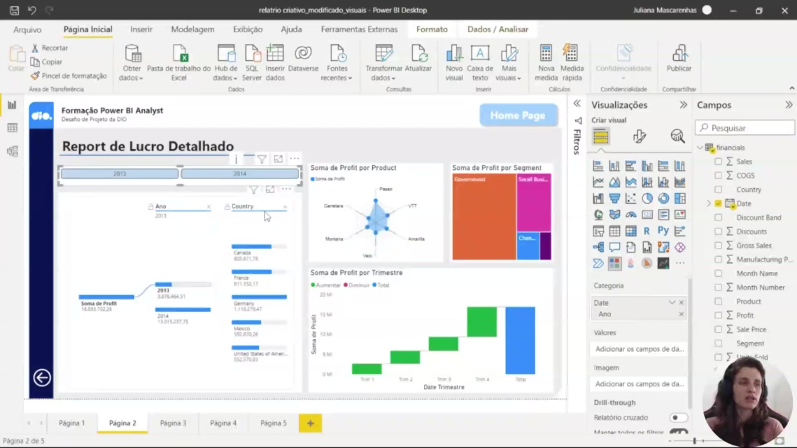

Este exemplo demonstra como a redução da densidade de informações pode aumentar a clareza do relatório. Ao concentrar os dados em visuais maiores e mais específicos, como a árvore de decomposição apresentada, permite-se que o usuário foque no que é realmente importante para a análise de lucro e desempenho.

  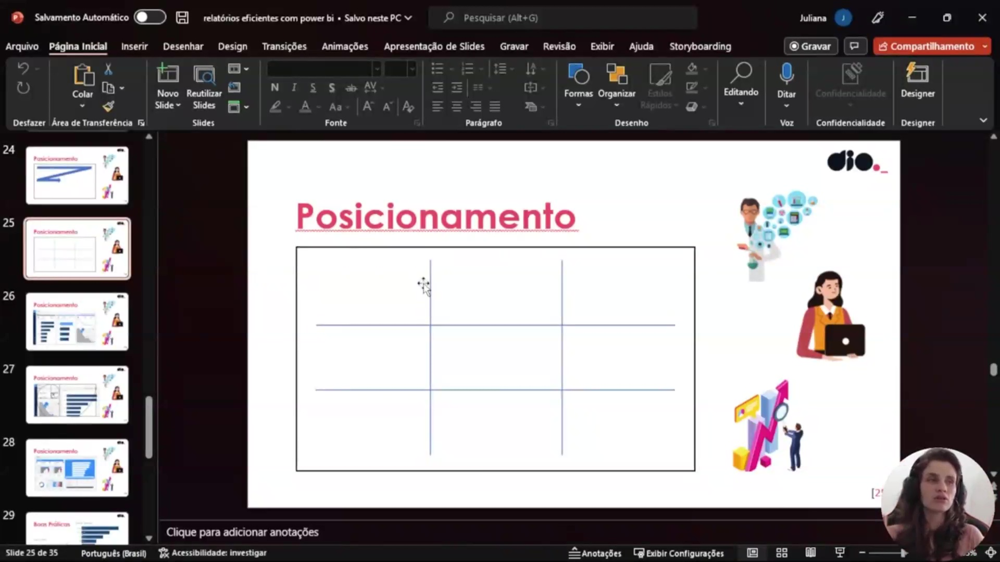

A imagem reforça a necessidade de respeitar o espaçamento entre as três áreas principais de conteúdo definidas no planejamento. Manter zonas de respiro e uma distribuição equilibrada entre métricas e gráficos é fundamental para uma experiência de usuário fluida e profissional.

  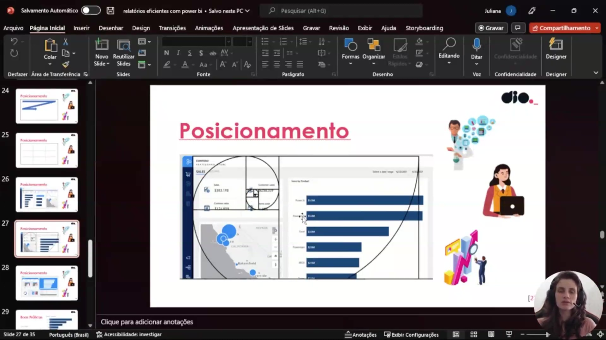

Nesta etapa, discute-se como direcionar a atenção do usuário para pontos focais específicos. O design deve ser utilizado de forma estratégica para destacar tendências, como o crescimento de vendas, utilizando o posicionamento e o contraste para guiar o olhar do analista para os insights mais relevantes.

  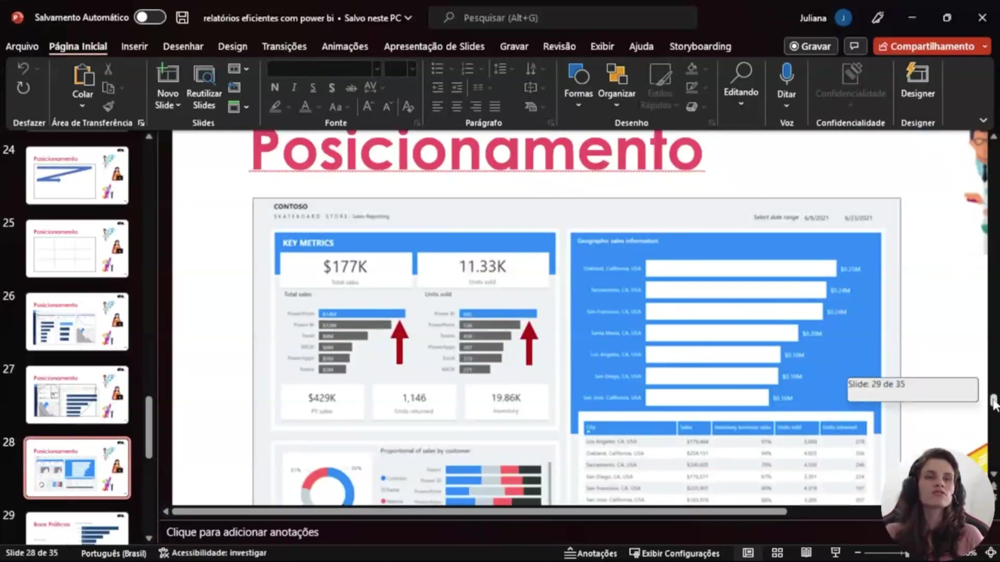

O visual apresenta a organização das "Key Metrics" (métricas principais) em um painel lateral dedicado. Este layout agrupa indicadores fundamentais como Vendas Totais, Unidades Vendidas, Inventário e Devoluções, permitindo uma leitura rápida do desempenho geral antes de se aprofundar nos detalhes geográficos ou por categoria.

  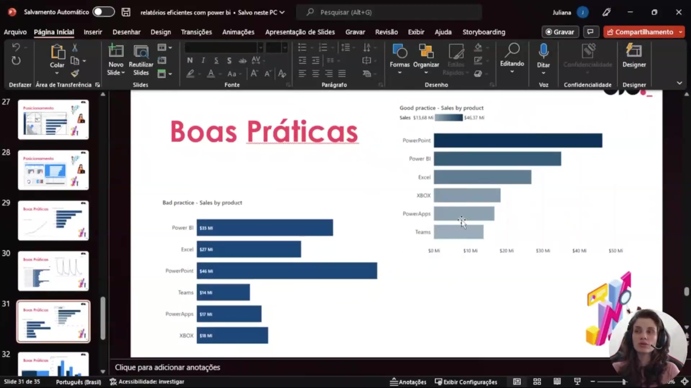

Esta imagem compara boas e más práticas de visualização de dados. No exemplo de "Sales by Product", demonstra-se que a ordenação decrescente das barras facilita a comparação imediata entre itens, enquanto a ausência de ordem lógica dificulta a identificação dos produtos com maior e menor impacto nas vendas.

  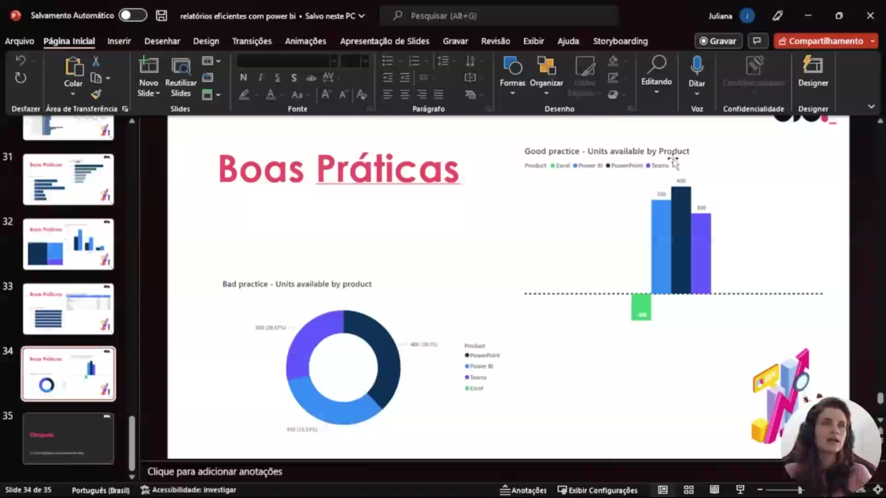

O slide final aborda a escolha correta do tipo visual, alertando contra o uso de gráficos de rosca ou pizza quando há muitas categorias. Em vez disso, recomenda-se o uso de gráficos de colunas ou barras para representar a disponibilidade de unidades por produto, o que proporciona uma percepção muito mais precisa das proporções e diferenças entre os valores.      

### 🟩 Vídeo 02 - Adequando Relatório – Parte 1

<video width="60%" controls>
  <source src="000-Midia_e_Anexos/bootcamp_ntt_data-modulo.09-curso.04-video_02.webm" type="video/webm">
    Seu navegador não suporta vídeo HTML5.
</video>

link do vídeo: https://web.dio.me/lab/criando-relatorios-dinamicos-com-o-uso-de-parametros/learning/840387b5-4e21-4495-80d9-e8e293b48d54

O vídeo resume as técnicas apresentadas para transformar um relatório de dados bruto em um dashboard visualmente atraente e funcionalmente otimizado. O foco está na economia de espaço, identidade visual e experiência do usuário (UX).

### Anotações

  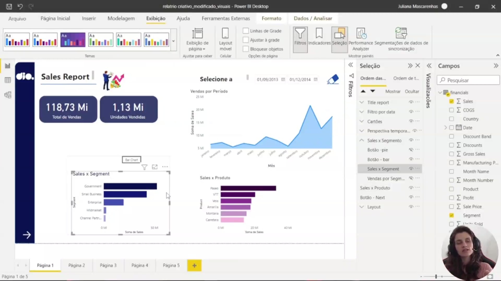

Nesta etapa do desenvolvimento do relatório no Power BI Desktop, o foco reside na otimização estética e funcional da interface. A modificação inicial consiste na remoção de elementos visuais redundantes, como faixas de fundo desnecessárias, para liberar espaço útil na tela de exibição. O título "Sales Report" é reposicionado para o topo, e novos elementos gráficos, como logos e imagens personalizadas (ex.: criadas no Canva), são importados através do menu "Inserir" para conferir uma identidade visual mais profissional ao dashboard.

A personalização dos cartões de indicadores (KPIs) é um ponto central desta aula. Para melhorar a legibilidade e o design, são aplicadas as seguintes configurações nos objetos visuais:

* **Estilo e Forma:** Definição de cantos arredondados para suavizar o layout.
* **Cores e Transparência:** Aplicação de preenchimento em tons de azul (seguindo a paleta do projeto) com ajuste de transparência para não sobrecarregar o visual.
* **Formatação de Texto:** Alteração da cor do valor do balão e dos rótulos de categoria para branco, garantindo contraste sobre o fundo escuro.
* **Eficiência com Pincel de Formatação:** Utilização do "Pincel de Formatação" para replicar rapidamente o estilo visual de um cartão (ex.: Total de Vendas) para outros (ex.: Unidades Vendidas), mantendo a consistência sem a necessidade de reconfiguração manual.

Além da estética, a estrutura de dados é simplificada. Elementos de detalhamento secundário, como somas de descontos, são removidos ou movidos para tabelas, mantendo em destaque apenas os indicadores principais de vendas e unidades vendidas. Para organizar a área de análise, o relatório utiliza mecanismos de segmentação por produto, segmento e período temporal, preparando o terreno para a criação de indicadores que permitam alternar dinamicamente entre diferentes visões de distribuição de vendas.

### 🟩 Vídeo 03 - Adequando Relatório – Parte 2

<video width="60%" controls>
  <source src="000-Midia_e_Anexos/bootcamp_ntt_data-modulo.09-curso.04-video_03.webm" type="video/webm">
    Seu navegador não suporta vídeo HTML5.
</video>

link do vídeo: https://web.dio.me/lab/criando-relatorios-dinamicos-com-o-uso-de-parametros/learning/42904050-a242-4f6b-ade0-ef71d9c7aa8e

Este vídeo foca na criação de um dashboard interativo no Power BI, demonstrando como alternar entre diferentes visões de dados (Produto vs. Segmento) utilizando botões, indicadores (bookmarks) e técnicas avançadas de formatação visual.

### Anotações

  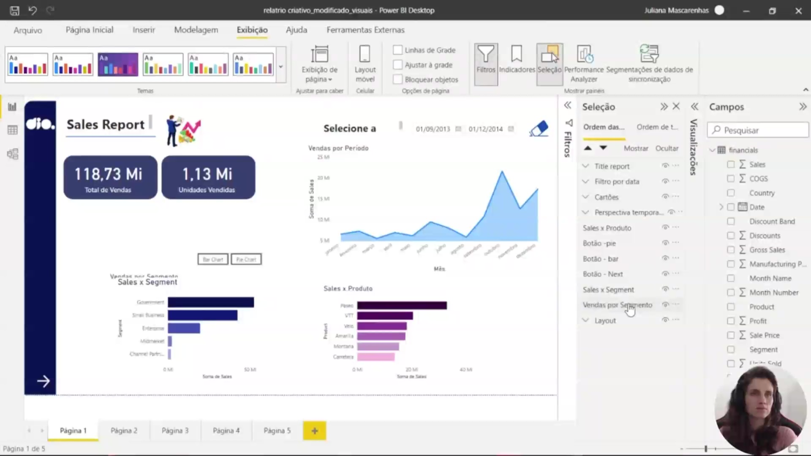

O layout inicial do relatório "Sales Report" apresenta métricas consolidadas, como o Total de Vendas de 118,73 Mi e 1,13 Mi de Unidades Vendidas. O painel inclui um gráfico de "Vendas por Período" e segmentadores de data configurados entre setembro de 2013 e dezembro de 2014. Nesta fase, o foco está na organização dos elementos visuais e na preparação de botões que permitirão ao usuário alternar interativamente entre as visões de produto e segmento. Para isso, inicia-se o agrupamento de objetos para garantir que fiquem corretamente sobrepostos e funcionais.

  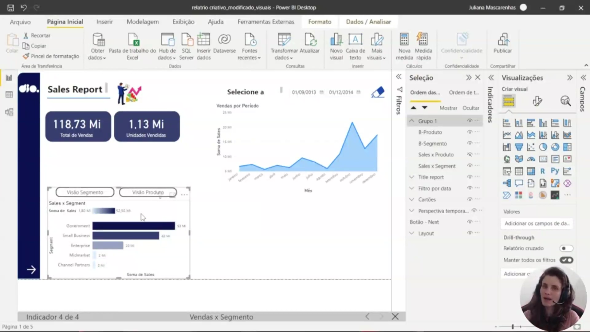

A interface destaca a "Visão Segmento", onde o gráfico de barras "Sales x Segment" detalha o desempenho por categoria de mercado. O segmento "Government" apresenta o maior volume de vendas, seguido por "Small Business" e "Enterprise". Para operacionalizar essa troca de visualização, utiliza-se o painel de Indicadores (Bookmarks) para criar a entrada "vendas por segmento". Esta configuração é ajustada para afetar apenas os visuais selecionados, garantindo que a alternância entre os botões oculte ou exiba os gráficos corretos sem interferir em outros elementos do relatório.

  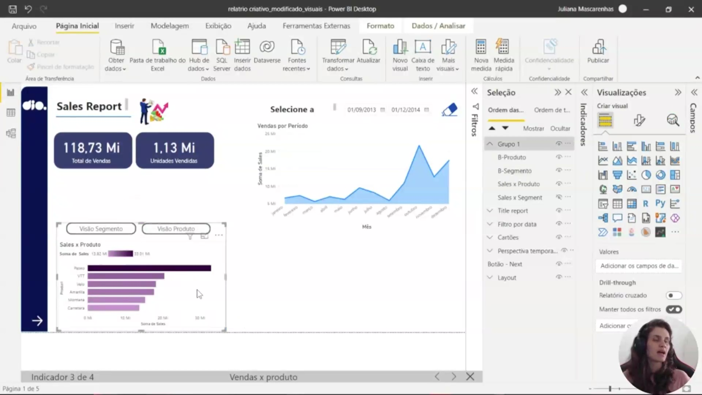

Ao selecionar a "Visão Produto", o relatório exibe o gráfico "Sales x Produto", que revela a performance individual de cada item. O produto "Paseo" demonstra uma liderança clara em vendas em comparação com "VTT" e "Velo". Esta visualização é controlada pelo indicador "vendas por produto", que torna o gráfico de segmentos invisível enquanto destaca os dados de produto. Adicionalmente, aplica-se uma formatação de gradiente nas barras para facilitar a percepção visual da disparidade de valores entre os itens mais vendidos e os demais.      

### 🟩 Vídeo 04 - Realizando considerações sobre os visuais e modificando gráfico de área

<video width="60%" controls>
  <source src="000-Midia_e_Anexos/bootcamp_ntt_data-modulo.09-curso.04-video_04.webm" type="video/webm">
    Seu navegador não suporta vídeo HTML5.
</video>

link do vídeo: https://web.dio.me/lab/criando-relatorios-dinamicos-com-o-uso-de-parametros/learning/aabf4be7-c3c8-4d25-98b8-3c8edf9608aa

Este vídeo é um tutorial prático focado no refinamento visual e estrutural de um dashboard no Power BI. A apresentadora demonstra como alternar entre diferentes visões de vendas (por segmento e produto), ajustar a hierarquia temporal para melhor legibilidade e corrigir problemas comuns de ordenação de eixos, garantindo que os dados sejam apresentados de forma lógica e detalhada.

### Anotações

  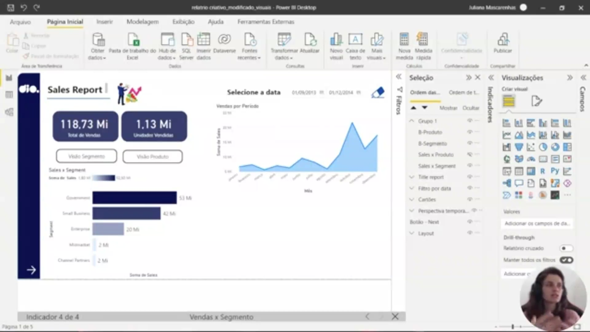

A interface do relatório de vendas foca na visualização de métricas de desempenho distribuídas por categorias estratégicas. No topo, um gráfico de área detalha a evolução das **Vendas por Período**, permitindo a identificação de tendências temporais. Logo abaixo, o gráfico de barras horizontais, intitulado **Vendas x Segmento**, apresenta a distribuição do faturamento entre diferentes perfis de clientes, como *Government*, *Small Business* e *Enterprise*. Essa organização visual é projetada para facilitar a alternância entre a visão de produto e a visão de segmento, garantindo que as diferenças de performance entre elas sejam percebidas imediatamente através da interação com o dashboard.

  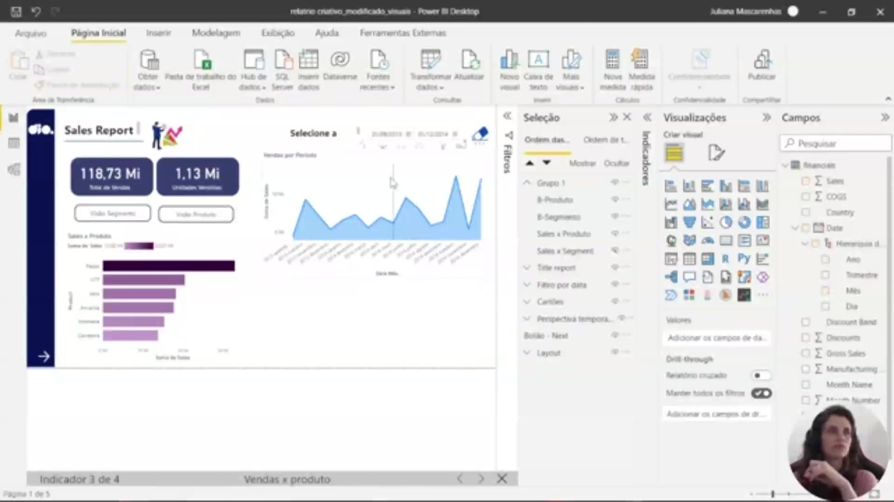

A configuração da hierarquia de datas é fundamental para o ajuste da profundidade da análise no Power BI. Através do painel de **Campos**, é possível gerenciar a estrutura temporal composta por **Ano, Trimestre, Mês e Dia**. Para corrigir comportamentos inesperados no eixo X — como a exibição desordenada de meses — realiza-se a alteração do tipo de eixo de "Contínuo" para "Categoria". Esse ajuste assegura a linearidade e o comportamento correto dos dados durante a navegação hierárquica (*drill down*). Ao concatenar os rótulos de ano e trimestre, o visual passa a representar com clareza a sucessão temporal, permitindo que a análise desça do nível anual para o trimestral de forma organizada e precisa.      

### 🟩 Vídeo 05 - Criando matriz de descrição de vendas

<video width="60%" controls>
  <source src="000-Midia_e_Anexos/bootcamp_ntt_data-modulo.09-curso.04-video_05.webm" type="video/webm">
    Seu navegador não suporta vídeo HTML5.
</video>

link do vídeo: https://web.dio.me/lab/criando-relatorios-dinamicos-com-o-uso-de-parametros/learning/c1680d14-e04d-4cc8-8985-c8c35f5b1886

### 🟩 Vídeo 06 - Ajustando estilização dos visuais e página

<video width="60%" controls>
  <source src="000-Midia_e_Anexos/bootcamp_ntt_data-modulo.09-curso.04-video_06.webm" type="video/webm">
    Seu navegador não suporta vídeo HTML5.
</video>

link do vídeo:

### 🟩 Vídeo 07 - Botões de navegação e próximos passos

<video width="60%" controls>
  <source src="000-Midia_e_Anexos/bootcamp_ntt_data-modulo.09-curso.04-video_07.webm" type="video/webm">
    Seu navegador não suporta vídeo HTML5.
</video>

link do vídeo:

### 🟩 Vídeo 08 - Entendendo o desafio

<video width="60%" controls>
  <source src="000-Midia_e_Anexos/bootcamp_ntt_data-modulo.09-curso.04-video_08.webm" type="video/webm">
    Seu navegador não suporta vídeo HTML5.
</video>

link do vídeo:

##  Materiais de Apoio

# Certificado: Criando um Dashboard Gerencial para Tomada de Decisões Com Power BI

- Link na plataforma: 
- Certificado em pdf: