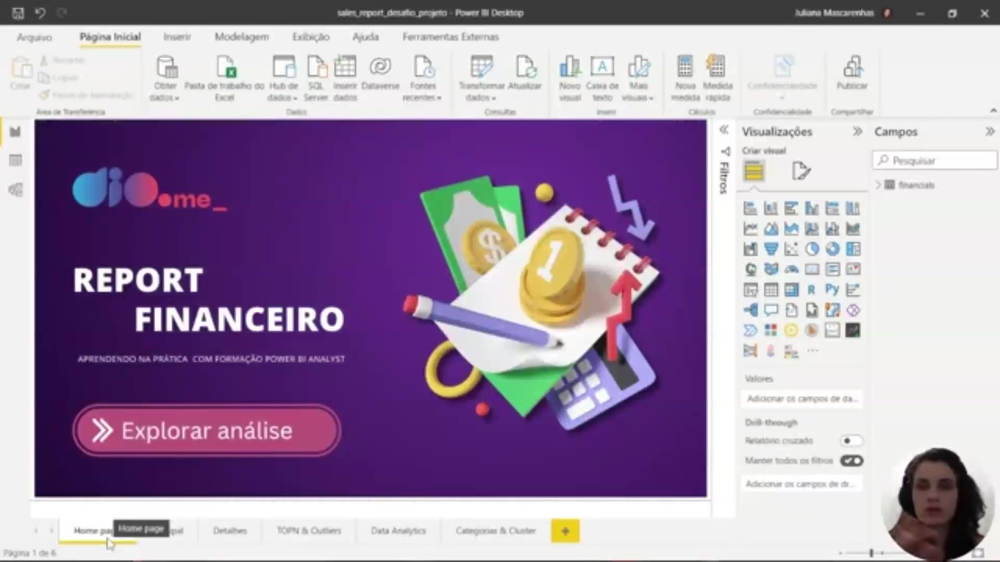
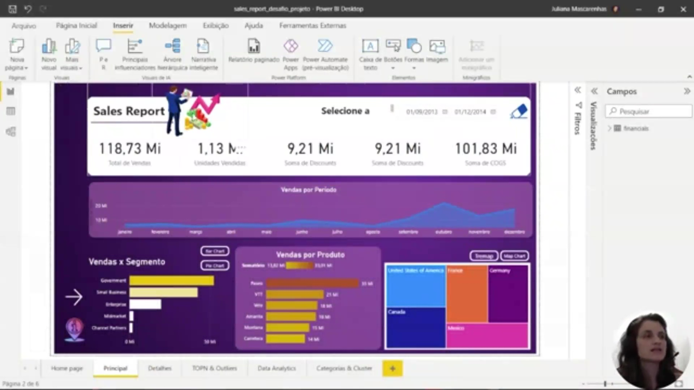
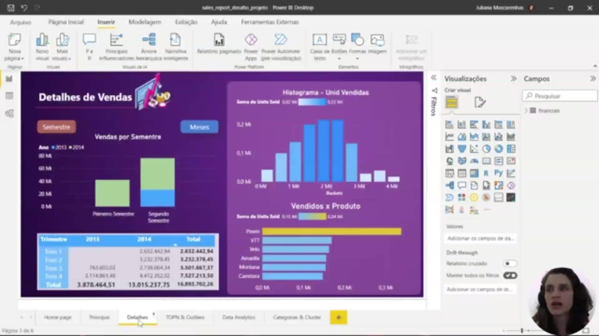
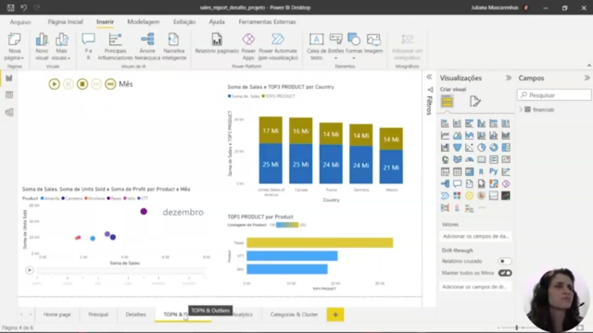
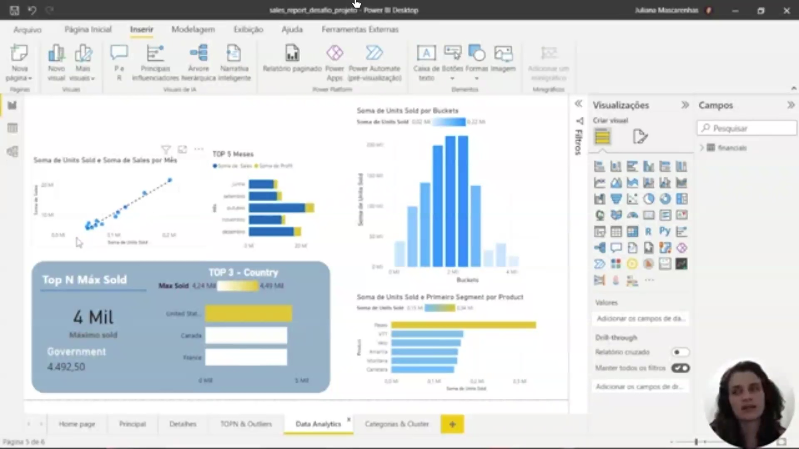
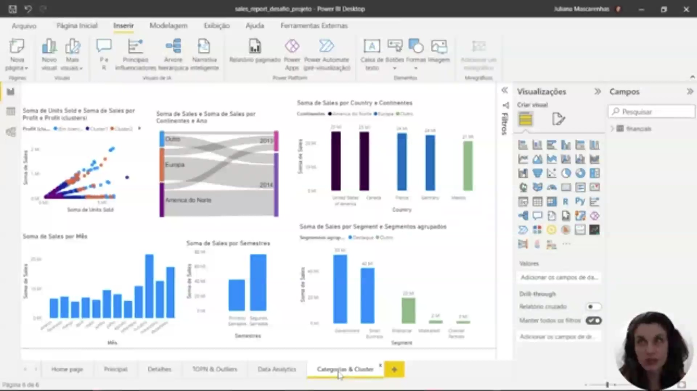
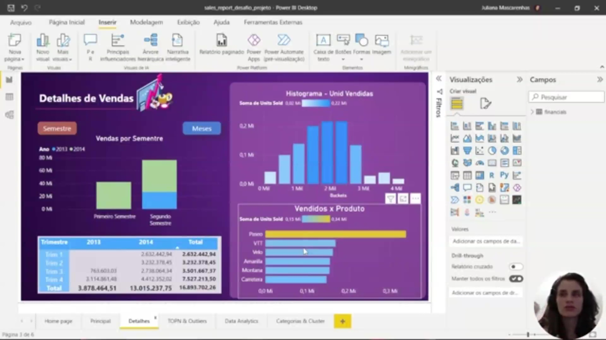
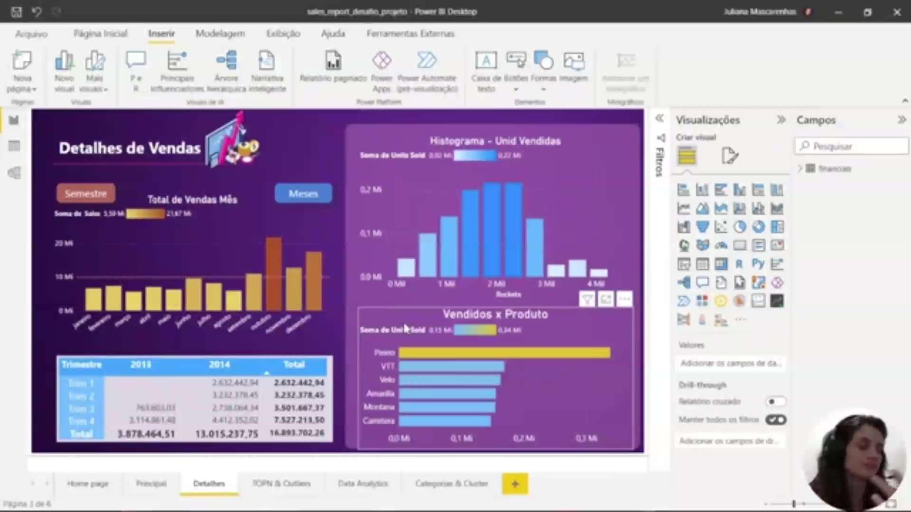
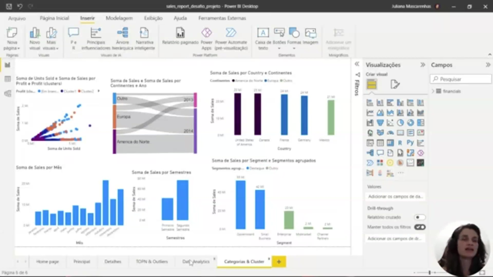

## Instrutor:

- Juliana Mascarenhas (Tech Education Specialist / Sócia (Content Creator) @SimplificandoRedes / Me Modelagem Computacional / Cientista de dados)
- Contato Linkedin: / [juliana-mascarenhas-ds](https://www.linkedin.com/in/juliana-mascarenhas-ds/)

### 🟩 Vídeo 01 - Apresentação do desafio

<video width="60%" controls>
  <source src="000-Midia_e_Anexos/bootcamp_ntt_data-modulo.09-curso.05-video_01.webm" type="video/webm">
    Seu navegador não suporta vídeo HTML5.
</video>

link do vídeo: https://web.dio.me/project/projeto-de-data-analytics-com-power-bi/learning/dca0e972-4eff-4f81-9f3b-a52603a04f29?back=/track/engenharia-dados-python&tab=undefined&moduleId=undefined

O v;ideo consolida as estratégias para criar um relatório de alto impacto, unindo Experiência do Usuário (UX), design visual sofisticado e recursos analíticos avançados. O objetivo é transformar dados brutos em uma narrativa visual coesa e profissional.

### Anotações

  

Esta imagem apresenta a capa do projeto "Report Financeiro", servindo como a porta de entrada para o desafio de consolidação dos conhecimentos do módulo. O design foca na experiência do usuário (UX), utilizando um fundo personalizado criado externamente no Canva para garantir um visual mais atraente e profissional. No centro, o botão "Explorar análise" possui um elemento transparente sobreposto (botão em branco) que funciona como um gatilho de navegação, direcionando o usuário para a primeira página de relatórios ativos. O objetivo inicial é integrar recursos visuais avançados com uma navegação intuitiva.

  

A página principal do "Sales Report" demonstra a aplicação de técnicas de design para suavizar a interface e destacar informações críticas. Os elementos visuais utilizam retângulos com cantos arredondados (ajustados em aproximadamente 10 unidades) para evitar bordas rígidas. Para criar hierarquia visual, foi aplicado um efeito de sombra com transparência de 36% em gráficos específicos, conferindo profundidade e destaque. A organização das camadas é feita através do painel de seleção (Exibição > Seleção), onde a imagem de fundo é enviada para trás de todos os outros elementos, garantindo que os cartões de métricas (como Total de Vendas e Descontos) e os gráficos de área e barras permaneçam plenamente visíveis e interativos.

  

A página de "Detalhes de Vendas" foca em análises estatísticas e segmentação temporal. Um dos destaques é o uso de uma linha média pontilhada no gráfico de vendas por meses, permitindo identificar rapidamente quais períodos performaram acima ou abaixo da média histórica. A página também incorpora um histograma para a distribuição de unidades vendidas e um gráfico baseado em compartimentos (bins) para separar os dados entre primeiro e segundo semestre. Semanticamente, o histograma e a categorização de produtos foram agrupados dentro de um mesmo retângulo visual para indicar que os dados estão diretamente relacionados, facilitando a interpretação de segmentação por parte do analista.      

### 🟩 Vídeo 02 - Próximos passos

<video width="60%" controls>
  <source src="000-Midia_e_Anexos/bootcamp_ntt_data-modulo.09-curso.05-video_02.webm" type="video/webm">
    Seu navegador não suporta vídeo HTML5.
</video>

link do vídeo: https://web.dio.me/lab/projeto-de-data-analytics-com-power-bi/learning/cdec6e7a-7019-4521-9501-eb392c3f2030

O vídeo resume as instruções para a criação de uma página de relatório avançada, focando na integração de métricas, design estratégico e experiência do usuário (UX) em ferramentas de BI (como Power BI).

### Anotações

  

Na análise de dados, é fundamental explorar conceitos como Top N, anomalias, categorização e clusterização. Um exemplo prático e valioso para relatórios é a observação da proporção do total de vendas por país e como os três principais produtos influenciam esse montante. Essa análise permite identificar se a participação desses produtos é significativa em relação ao volume total de vendas em cada região.

  

A construção de uma página de relatório deve ser feita de maneira coerente, selecionando visuais que agreguem valor à análise em vez de apenas "jogar" informações na tela. Entre as opções interessantes para compor essa visão estão a distribuição dos principais meses e os rankings de Top N, que ajudam a organizar os dados de forma lógica.

  

Ao criar relatórios, o objetivo principal deve ser mostrar os dados de maneira coesa e agregada. Para isso, é necessário pensar estrategicamente no posicionamento dos elementos, na proporção das tabelas, no contraste das cores e no uso correto da segmentação de dados. Esse cuidado garante que as informações estejam visualmente integradas e fáceis de interpretar.

  

Para análises detalhadas, o uso de histogramas permite visualizar a distribuição de unidades vendidas. Através da definição de "buckets" (compartimentos) de unidades dentro da quantidade total de vendas, é possível relacionar o volume comercializado com os produtos específicos, oferecendo uma visão clara da frequência de vendas por categoria de quantidade.

  

A utilização de matrizes no relatório é eficaz para apresentar duas ou mais visões diferentes de forma simultânea e organizada. Esse tipo de estrutura facilita a visualização de dados complexos, permitindo que o usuário compreenda como diferentes métricas interagem dentro de um mesmo contexto informativo.

  

A navegabilidade é um ponto crucial no design de dashboards, exigindo a inclusão de ícones funcionais para guiar o usuário. É necessário configurar botões para "avançar", "voltar" e, principalmente, um ícone de "página inicial" (home), que permita o retorno rápido à tela principal do projeto. Além disso, a documentação através de um arquivo Readme no GitHub é recomendada para explicar o projeto e as medidas criadas para as operações.      

## Entendendo o desafio

É o momento de criar um perfil de destaque na DIO, explorando conceitos aprendidos e replicando o projeto prático. Oriente-se a criar um repositório próprio no GitHub para aumentar o portfólio e destaque a importância disso em entrevistas técnicas. Também há instruções para inserir links e arquivos necessários, como banco de dados ou templates do Figma. Uma dica menciona a possibilidade de fazer “fork” de um repositório GitHub para manter referência ao código original.

### Instruções para o desenvolvimento

- [Projeto de Data Analytics com Power BI](https://hermes.dio.me/files/assets/7ebecd9e-23de-4755-ab91-6659b7f641d2.docx)  
- [Relatório Criativo](https://hermes.dio.me/files/assets/7107b111-0651-436c-a49d-1d340d218db9.pbix)

Bons estudos 😉

## Desafio de Projeto - Atualizando Relatório Financeiro com Foco na Experiência do Usuário

### Objetivo do desafio

Modificar o relatório criativo, o primeiro que criamos juntos, focando na experiência do usuário.  
Acompanhe o vídeo para que você entenda o que foi feito neste processo.  
Além disso, leve em consideração os seguintes pontos:

- Posicionamento  
- Contraste  
- Proporção áurea  
- Segmentação dos dados  

Como comentamos no curso, não é uma regra rígida.  
Entenda os pontos e cria seu relatório levando-os em consideração.  
Contudo, saiba quando você deve quebrar as regras.  
Isso vai trazer mais criatividade ao seu relatório.  
Esses pontos fora da curva deixam seu relatório mais interessante.

# Certificado: Criando um Relatório Vendas e Lucros com Data Analytics com Power BI

- Link na plataforma: https://hermes.dio.me/certificates/GQYUR4N8.pdf
- Certificado em pdf: [Certificado-Criando_um_Relatorio_Vendas_e_Lucros_com_Data_Analytics_com_Power_BI.pdf](000-Midia_e_Anexos/Certificado-Criando_um_Relatorio_Vendas_e_Lucros_com_Data_Analytics_com_Power_BI.pdf)
