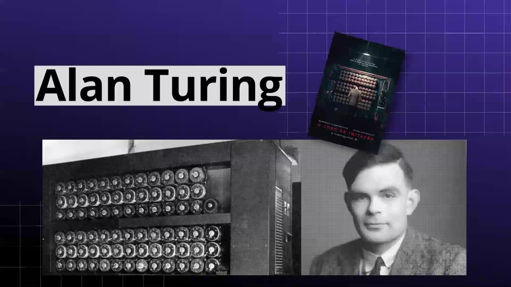
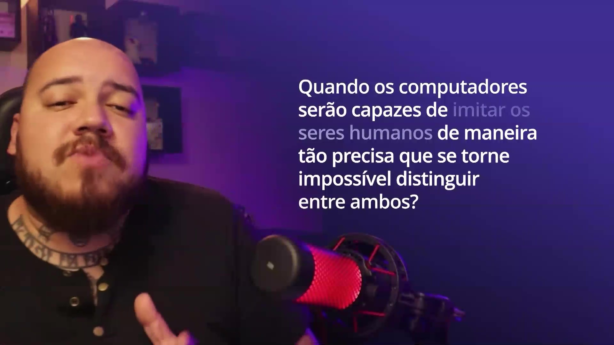
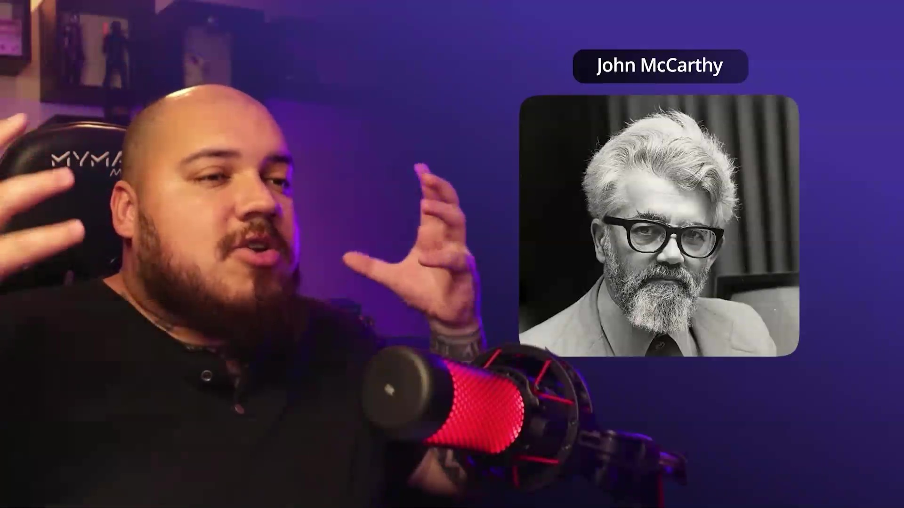
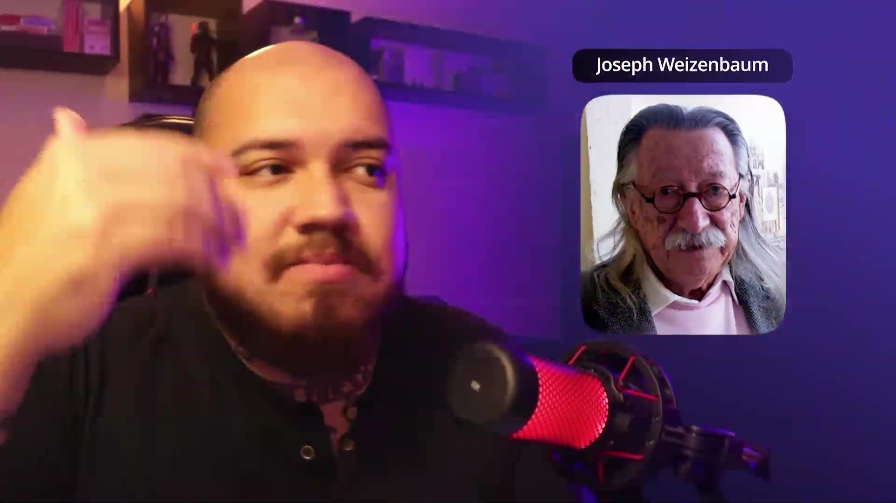
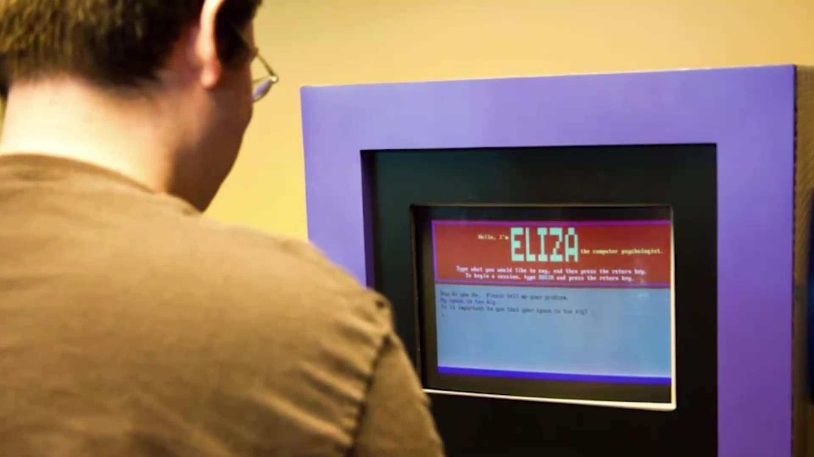
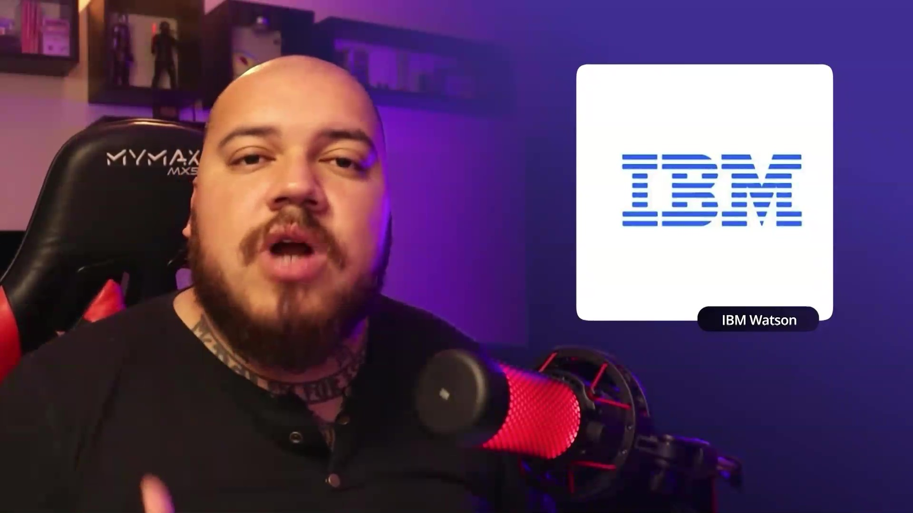
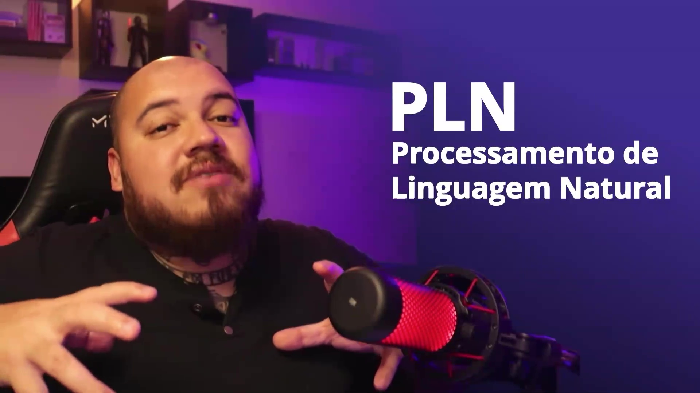
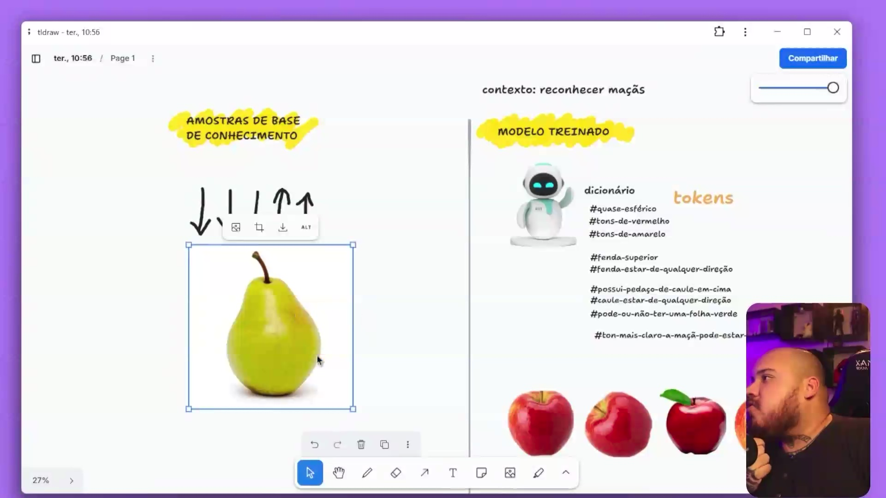

## Instrutor

- Felipe Aguiar (DIO - Tech Educator)
- Contato Linkedin: / [felipeaguiar-exe](https://www.linkedin.com/in/felipeaguiar-exe/)

## Introdução a Inteligência Artificial

### 🟩 Vídeo 01 - Como a Inteligência Artificial Nasceu

<video width="60%" controls>
  <source src="000-Midia_e_Anexos/bootcamp_ntt_data_java_spring_ai-modulo.01-curso.02-video_01.webm" type="video/webm">
    Seu navegador não suporta vídeo HTML5.
</video>

link do vídeo: https://web.dio.me/track/ntt-data-2026-ai-java-back-end/course/era-da-ia-machine-learning-llms-ia-generativa-e-agentes/learning/93b09cec-f92f-4810-ad1e-ff916216f022?autoplay=1

 O vídeo apresenta a evolução histórica dos chatbots e da Inteligência Artificial, revelando como passamos de simples regras de substituição de palavras para modelos matemáticos complexos que simulam a linguagem humana com precisão surpreendente.

### Anotações

  

Alan Turing, matemático e cientista da computação, propôs em 1950 o famoso Teste de Turing, também conhecido como Jogo da Imitação. Esse teste investiga a capacidade de uma máquina de exibir comportamento inteligente equivalente ao de um ser humano, dando origem ao campo da inteligência artificial.

  

A pergunta central do Teste de Turing: "Quando os computadores serão capazes de imitar os seres humanos de maneira tão precisa que se torne impossível distinguir entre ambos?" Esse questionamento desafiou a visão de que computadores apenas executam instruções pré-programadas e inspirou décadas de pesquisa em inteligência artificial.

  

John McCarthy, cientista da computação, foi responsável por cunhar o termo "Inteligência Artificial" em 1956, durante a Conferência de Dartmouth. Ele propôs que, para simular o comportamento humano de forma computacional, seria necessário criar uma inteligência não biológica, mas artificial — capaz de processar perguntas e respostas a partir de um banco de conhecimento, de maneira mais flexível do que simples regras pré-programadas.

  

Joseph Weizenbaum, cientista do MIT, criou em 1966 o primeiro chatbot da história, chamado ELIZA. Inspirado no Teste de Turing, ELIZA simulava uma conversa usando padrões de substituição de palavras, imitando um psicoterapeuta. Essa inovação deu origem ao campo do Processamento de Linguagem Natural (PLN), permitindo que computadores se comunicassem em linguagem humana.

  

A imagem mostra o terminal com o programa ELIZA carregado e em execução. Conforme explicado na aula, o ELIZA funcionava como um psicoterapeuta virtual: ele identificava palavras‑chave nas frases do usuário e aplicava regras de substituição para gerar respostas genéricas, como “Por que você está triste hoje?” ou “Me fale um pouco mais sobre a sua mãe”. Esse mecanismo simulava uma conversa natural sem que o computador realmente entendesse o significado. A cada interação, o ELIZA também enriquecia seu vocabulário — um princípio inicial do aprendizado de máquina. O próprio Weizenbaum ficou surpreso ao perceber que as pessoas atribuíam emoções e humanidade ao programa, antecipando discussões éticas que continuam atuais com assistentes como o ChatGPT.

  

A IBM impulsionou a popularização desses modelos em 2010 com o lançamento do IBM Watson. Focado em responder perguntas complexas através de processamento de linguagem natural massivo, o Watson ganhou fama mundial em 2011 ao derrotar competidores humanos no programa Jeopardy!, provando a eficácia da IA em processar e recuperar informações de grandes bases de dados.

  

O Processamento de Linguagem Natural (PLN) define a maneira como humanos e computadores trocam informações. Longe de ser um processo "mágico", ele se baseia em modelos matemáticos que calculam a probabilidade de sequências de palavras. Ao armazenar volumes gigantescos de dados, as máquinas realizam uma substituição de padrões em alta escala para criar diálogos coerentes e naturais. 

### 🟩 Vídeo 02 - Como uma Inteligência Artificial é treinada e o que são LLMs

<video width="60%" controls>
  <source src="000-Midia_e_Anexos/bootcamp_ntt_data_java_spring_ai-modulo.01-curso.02-video_02.webm" type="video/webm">
    Seu navegador não suporta vídeo HTML5.
</video>

link do vídeo: https://web.dio.me/track/ntt-data-2026-ai-java-back-end/course/era-da-ia-machine-learning-llms-ia-generativa-e-agentes/learning/ad7cc7c5-c657-4f2c-92e9-651b71c60375?autoplay=1

O vídeo desxreve o processo prático de treinamento de uma Inteligência Artificial, utilizando a analogia de reconhecimento de maçãs para explicar como máquinas "aprendem" a identificar padrões, lidar com variações e expandir seu vocabulário através de parâmetros e tokens.

### Anotações

  

#### 1. O Ponto de Partida: O Modelo Zero
Toda IA começa como um "modelo zero", sem conhecimento prévio. Para que ela funcione, é necessário fornecer um **contexto**. No exemplo do vídeo, o contexto é "reconhecer maçãs". Sem dados e instruções, a IA é incapaz de distinguir qualquer objeto.

#### 2. Tokens e Parâmetros: A "Linguagem" da IA
A IA não armazena imagens como nós; ela armazena **padrões**. Esses padrões são traduzidos em **tokens** e **parâmetros**.
*   **Exemplos de parâmetros para uma maçã:** Formato esférico, presença de caule, tons de vermelho/amarelo, fenda superior.
*   **Insight:** A computação de IA é, essencialmente, sobre reconhecimento de padrões e estatística.

#### 3. Reforço Positivo e Refinamento
Quando a IA encontra algo que foge do padrão inicial (ex: uma maçã com o caule de lado), ela fica em dúvida (probabilidade de 50%). É aqui que entra o **Reforço Positivo**:
*   O humano confirma: "Sim, isso é uma maçã".
*   A IA atualiza sua base: "O caule e a fenda podem estar em qualquer direção".
*   Esse processo de "tentativa, erro e correção" é o que torna a IA mais inteligente.

#### 4. Generalização e Probabilidade
A IA aprende a lidar com o novo baseando-se no que já conhece. 
*   **Maçã cortada:** Mesmo nunca tendo visto uma maçã aberta, a IA analisa os tokens existentes (formato, cor, caule) e conclui que, por **probabilidade**, aquilo ainda é uma maçã.
*   **Diferenciação:** Ao ver uma pera, a IA compara os tokens. Como o formato e a cor não batem com a maioria dos parâmetros de "maçã", ela conclui que não é o objeto em questão.

#### 5. LLMs vs. SLMs: A Escala do Conhecimento
O vídeo diferencia os dois principais tipos de modelos baseados em sua "bagagem":
*   **LLM (Large Language Model):** Modelos gigantescos (como o ChatGPT) com bilhões de parâmetros. Eles parecem mais inteligentes porque têm um "vocabulário" de padrões vasto sobre quase tudo.
*   **SLM (Small Language Model):** Modelos menores e especializados. São eficientes para tarefas específicas (ex: reconhecer apenas objetos de madeira) e não exigem tanto processamento.

#### ✨ Insights e Conclusões

💡 **A IA é "Burra" por Natureza**
No início, uma IA é comparável a um bebê. Ela não tem "intuição". Toda a sua inteligência vem da bagagem de dados e do treinamento fornecido por humanos. A "mágica" é, na verdade, um acúmulo massivo de parâmetros.

💡 **Alucinação é uma Questão Estatística**
Quando uma IA "alucina" (dá uma resposta sem sentido), geralmente é porque a probabilidade estatística entre dois caminhos foi ambígua ou os parâmetros de entrada foram insuficientes para uma decisão clara.

💡 **Qualidade > Quantidade (em certos casos)**
Nem toda solução precisa de um LLM bilionário. Para problemas específicos e nichados, um SLM bem treinado com tokens precisos pode ser mais rápido e barato do que uma IA generalista.

💡 **O Significado de "Artificial"**
O termo "Artificial" no nome é literal: é algo simulado, produzido pelo homem para parecer inteligência natural. A IA não "sente" o que é uma maçã; ela apenas valida uma lista de requisitos estatísticos que definimos para ela. 

### 🟩 Vídeo 03 - Entendendo Deep Learning

<video width="60%" controls>
  <source src="000-Midia_e_Anexos/bootcamp_ntt_data_java_spring_ai-modulo.01-curso.02-video_03.webm" type="video/webm">
    Seu navegador não suporta vídeo HTML5.
</video>

link do vídeo: https://web.dio.me/track/ntt-data-2026-ai-java-back-end/course/era-da-ia-machine-learning-llms-ia-generativa-e-agentes/learning/66b70f5b-904c-4759-bcc6-78dd43d8c23e?autoplay=1

### 🟩 Vídeo 04 - A Era das IAs Generativas

<video width="60%" controls>
  <source src="000-Midia_e_Anexos/bootcamp_ntt_data_java_spring_ai-modulo.01-curso.02-video_04.webm" type="video/webm">
    Seu navegador não suporta vídeo HTML5.
</video>

link do vídeo: https://web.dio.me/track/ntt-data-2026-ai-java-back-end/course/era-da-ia-machine-learning-llms-ia-generativa-e-agentes/learning/ac73b928-c152-43a8-9d2e-d9be15d348fa?autoplay=1

# Certificado: 

- Link na plataforma: 
- Certificado em pdf: