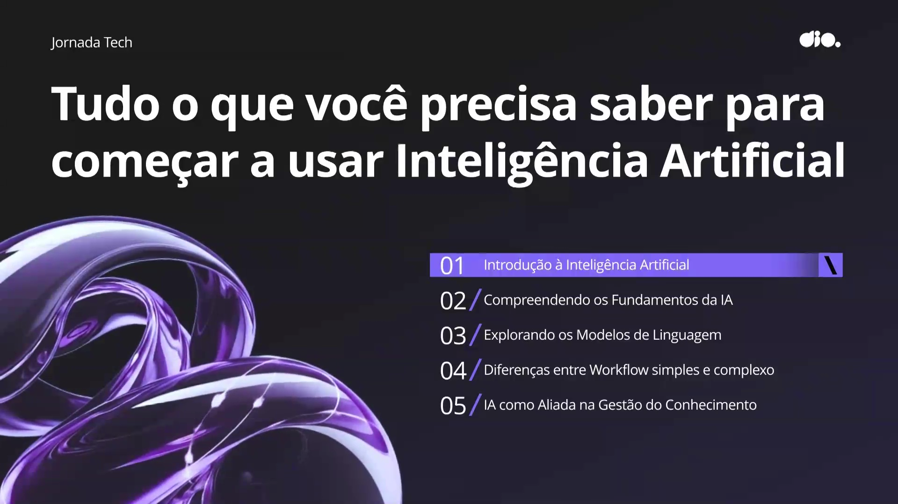
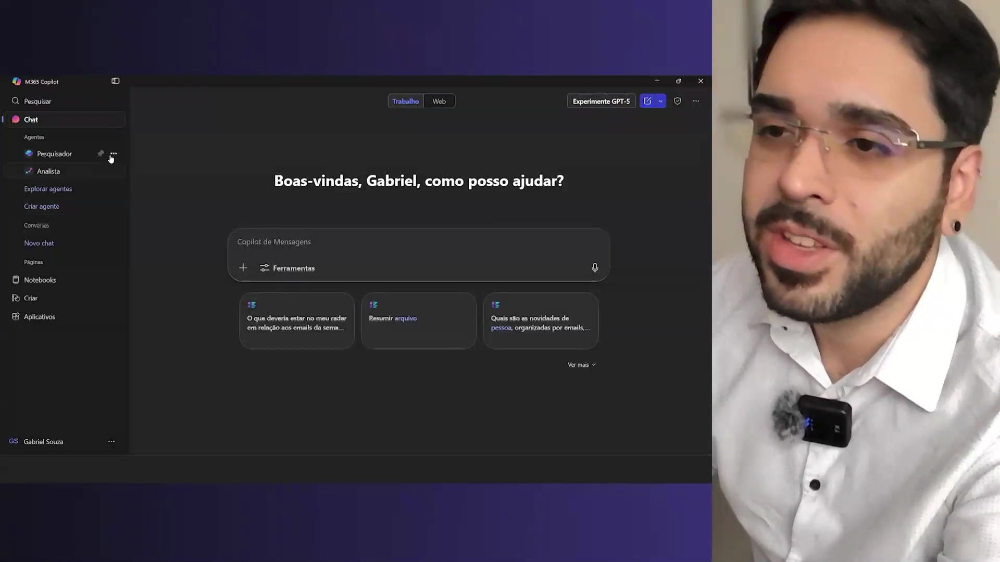
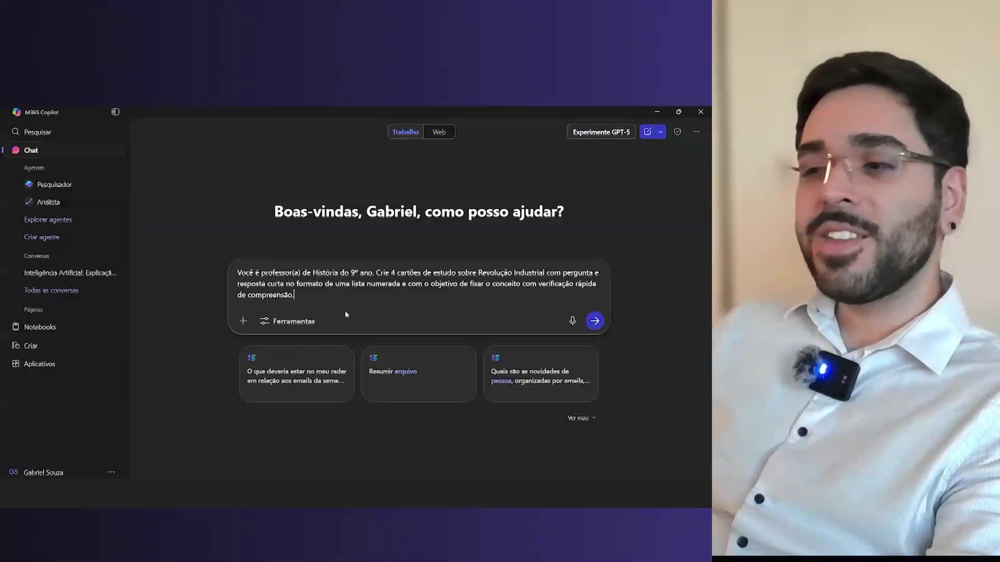
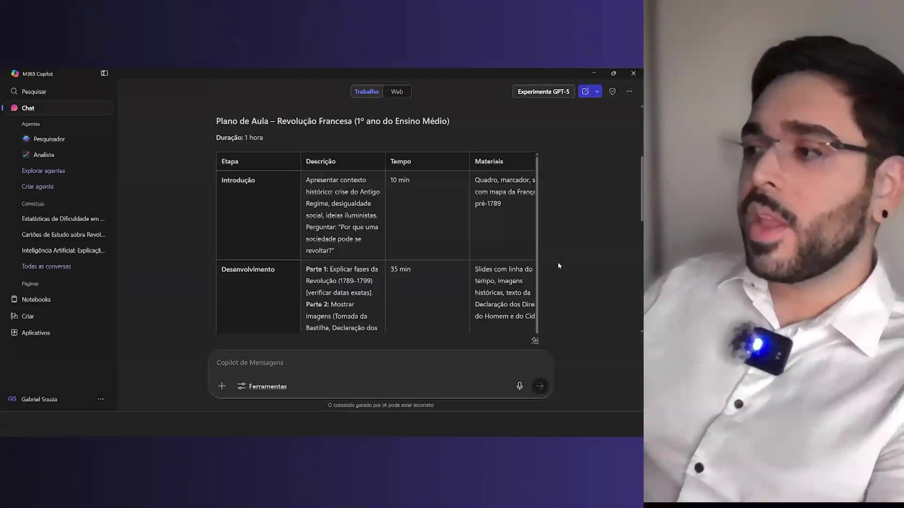

## Instrutor

- Gabriel Vieira (CTO, US @ Ubivis / Industrial AI & Digital Twins for Manufacturing / Industry 4.0)
- Contato Linkedin: / [devgvieira](https://www.linkedin.com/in/devgvieira/)

## Parte 1 - Introdução à Inteligência Artificial

### 🟩 Vídeo 01 - Introdução à Inteligência Artificial

<video width="60%" controls>
  <source src="000-Midia_e_Anexos/bootcamp_ntt_data_java_spring_ai-modulo.01-curso.02-video_01.webm" type="video/webm">
    Seu navegador não suporta vídeo HTML5.
</video>

link do vídeo: https://web.dio.me/track/ntt-data-2026-ai-java-back-end/course/tudo-o-que-voce-precisa-saber-para-comecar-a-usar-inteligencia-artificial/learning/8c68136b-5c04-4ee6-be01-f7324addae36?autoplay=1

A Inteligência Artificial (IA) não é apenas uma ferramenta de automação, mas um sistema capaz de aprender padrões e gerar soluções personalizadas. Para professores, ela atua como um "copiloto" que economiza tempo, melhora a qualidade do material didático e permite a personalização do ensino em escala. No entanto, seu uso exige supervisão crítica e cuidados rigorosos com a privacidade de dados.

### Anotações

  

#### 1. O que é (e o que não é) Inteligência Artificial
*   **Definição:** É a capacidade de sistemas aprenderem padrões a partir de dados para gerar respostas, previsões ou decisões.
*   **Diferença de Automação Rígida (ex: Excel):** Enquanto o Excel segue fórmulas fixas, a IA se adapta e contextualiza as informações.
*   **Diferença de Buscadores (ex: Google):** O Google retorna links; a IA retorna a resposta ou o conteúdo pronto.

#### 2. Os Três Pilares de Ganho para o Professor
*   **Tempo:** Agilidade na criação de rascunhos, resumos e organização de tarefas.
*   **Qualidade:** Auxílio na revisão de materiais, clareza na comunicação e diversificação de formatos (textos, imagens, apresentações).
*   **Personalização:** Capacidade de adaptar o mesmo conteúdo para diferentes níveis (Ensino Fundamental, Médio ou EJA) e perfis de alunos.

#### 3. Aplicações Práticas no Cotidiano Escolar
*   **Comunicação:** Redação de e-mails e comunicados claros para pais e responsáveis.
*   **Material Didático:** Transformação de textos longos em cartões de estudo (flashcards) ou apresentações.
*   **Avaliação:** Criação de rubricas (critérios) de avaliação para provas e trabalhos.
*   **Gestão:** Transcrição e resumo de reuniões pedagógicas, destacando apenas os pontos mais relevantes.

#### 4. Boas Práticas e Ética (Onde ter cuidado)
*   **Alucinação da IA:** A IA pode errar com "total confiança". O professor deve sempre revisar o conteúdo gerado.
*   **Especificidade (Prompts):** A qualidade da resposta depende da clareza do pedido. Cada palavra no comando conta.
*   **Privacidade de Dados:** **Nunca** inserir dados sensíveis (CPF, endereços, fotos ou vídeos de alunos). A IA utiliza esses dados para continuar aprendendo, o que pode expor informações privadas a terceiros.
    
### 🟩 Vídeo 02 - Primeiros passos com a Inteligência Artificial

<video width="60%" controls>
  <source src="000-Midia_e_Anexos/bootcamp_ntt_data_java_spring_ai-modulo.01-curso.02-video_02.webm" type="video/webm">
    Seu navegador não suporta vídeo HTML5.
</video>

link do vídeo: https://web.dio.me/track/ntt-data-2026-ai-java-back-end/course/tudo-o-que-voce-precisa-saber-para-comecar-a-usar-inteligencia-artificial/learning/a92d0bd8-83ca-4058-a833-70fe219058c3?autoplay=1

O vídeo é uma aula prática sobre como utilizar o Microsoft Copilot para criar conteúdos educacionais, focando na jornada desde a escrita do primeiro prompt até o refinamento necessário para atingir o público-alvo ideal (neste caso, alunos do 7º ano).

### Anotações

  

#### 1. Interface e Funcionalidades do Copilot
O Microsoft Copilot é apresentado como uma ferramenta robusta integrada ao ecossistema Microsoft.
*   **Campo de Prompt:** Onde a interação acontece.
*   **Recursos Adicionais:** Acesso a agentes, notebooks, criação de imagens e integração direta com aplicativos como Excel e Word.
*   **Dica de Organização:** O instrutor recomenda salvar todos os prompts utilizados em arquivos `.txt`. Isso garante a **auditabilidade** (saber o que foi feito) e facilita a reutilização em aulas futuras.

#### 2. A Estrutura do Prompt Inicial
Para obter um resultado de qualidade, o prompt deve ser contextualizado. O exemplo utilizado foi:
*   **Persona:** Professor(a) do 7º ano.
*   **Tarefa:** Explicar o que é Inteligência Artificial.
*   **Restrições:** Apenas 3 frases.
*   **Elementos Obrigatórios:** Um exemplo do cotidiano escolar e um alerta de privacidade.

#### 3. Análise Crítica do Primeiro Resultado
A IA entregou uma resposta tecnicamente correta, mas com ressalvas pedagógicas:
*   **Pontos Positivos:** Seguiu a estrutura de 3 frases e incluiu o exemplo e o alerta.
*   **Pontos Negativos:** O vocabulário foi considerado um pouco avançado para o 7º ano (uso de termos como "coerência", "armazenados" e "indevidamente").

#### 4. O Poder do Refinamento (Iteração)
A aula demonstra que a primeira resposta da IA raramente é a final. O instrutor utiliza um comando simples: **"Seja mais simples"**.
*   **Resultado Refinado:** A IA substituiu termos complexos por palavras mais acessíveis ("forma errada" em vez de "indevidamente", "programa que corrige provas" em vez de "critérios de gramática e coerência").

## Parte 2 - Compreendendo os Fundamentos da IA

### 🟩 Vídeo 03 - Compreendendo os Fundamentos da IA

<video width="60%" controls>
  <source src="000-Midia_e_Anexos/bootcamp_ntt_data_java_spring_ai-modulo.01-curso.02-video_03.webm" type="video/webm">
    Seu navegador não suporta vídeo HTML5.
</video>

link do vídeo: https://web.dio.me/track/ntt-data-2026-ai-java-back-end/course/tudo-o-que-voce-precisa-saber-para-comecar-a-usar-inteligencia-artificial/learning/689af521-bbad-4e5f-aa74-85804837599e?autoplay=1

### Anotações

  

      

#### 1. O que é (e o que não é) Inteligência Artificial
*   **Definição:** IA é um sistema que aprende através de **padrões** e toma decisões com base em dados. Essencialmente, é o aprendizado de padrões em escala.
*   **O que NÃO é IA:** 
    *   **Excel:** É uma ferramenta de cálculo e organização, não aprende sozinha.
    *   **Google Search:** É um buscador de links. Ele te direciona para onde a resposta pode estar, enquanto a IA gera a resposta a partir do que aprendeu.

#### 2. IA Fraca vs. IA Forte
*   **IA Fraca (Narrow AI):** Especialista em tarefas nichadas (traduzir, resumir, classificar). **Importante:** Todas as IAs atuais (ChatGPT, Gemini, Claude) são consideradas IAs fracas, pois operam dentro de limites específicos.
*   **IA Forte (General AI):** Uma IA generalista, capaz de realizar qualquer tarefa intelectual humana. Ainda é um conceito teórico/futurista.

#### 3. Machine Learning (Aprendizado de Máquina)
*   **O Processo:** Envolve treinar a IA com exemplos (dados) e algoritmos (passos matemáticos).
*   **Metáfora Professor-Aluno:** Nós (humanos) somos os professores que fornecem a base de dados. A IA é o aluno que aprende essa base e consegue generalizar o conhecimento para responder novas perguntas.
*   **Aplicações Escolares:** Classificação automática de respostas (certo/errado) e sugestão de conteúdos personalizados.

#### 4. PLN e Visão Computacional
*   **PLN (Processamento de Linguagem Natural):** Focado em **texto**. Capacidade de resumir, adaptar e gerar conteúdo escrito em diferentes níveis de complexidade (ex: adaptar um texto científico para um aluno do 8º ano).
*   **Visão Computacional:** Focado em **imagem**. Permite que a IA "veja", interprete cenas, reconheça objetos e descreva imagens (essencial para acessibilidade, como gerar áudio-descrição para alunos com deficiência visual).

#### 5. Engenharia de Prompt (Prompt Engineering)
Para obter a melhor resposta da IA, deve-se seguir o "Guia de Bolso" das 5 perguntas:
1.  **Papel:** Quem a IA deve ser? (Ex: Professor de Ciências).
2.  **Público:** Para quem ela está falando? (Ex: Alunos do 8º ano).
3.  **Formato:** Qual a estrutura da saída? (Ex: Título, 2 parágrafos, 3 perguntas).
4.  **Tamanho:** Qual a extensão? (Ex: 4 a 6 linhas por parágrafo).
5.  **Objetivo:** Para que serve a resposta? (Ex: Fixar o conceito de fotossíntese).

### 🟩 Vídeo 04 - Projeto Hands-on: Explorando Interfaces de IA Simplificadas

<video width="60%" controls>
  <source src="000-Midia_e_Anexos/bootcamp_ntt_data_java_spring_ai-modulo.01-curso.02-video_04.webm" type="video/webm">
    Seu navegador não suporta vídeo HTML5.
</video>

link do vídeo: https://web.dio.me/track/ntt-data-2026-ai-java-back-end/course/tudo-o-que-voce-precisa-saber-para-comecar-a-usar-inteligencia-artificial/learning/a7cf963c-b4c7-4778-8851-17f8b52c5dd4?autoplay=1

### Anotações

  

#### 1. Estrutura de um Prompt de Alta Performance
Para que a IA entregue exatamente o que você precisa, o prompt deve seguir critérios específicos (o "Guia de Bolso"):
*   **Papel (Role):** Definir quem a IA deve ser (ex: Professor de História).
*   **Público-alvo:** Para quem a resposta se destina (ex: Alunos do 9º ano).
*   **Formato:** Como a informação deve ser entregue (ex: 4 cartões de estudo com pergunta e resposta).
*   **Tamanho:** Limitação quantitativa (ex: Lista numerada de 4 itens).
*   **Objetivo:** O que se pretende alcançar (ex: Fixar conceitos com verificação rápida).

#### 2. O Processo de Refinamento (Iteração)
A primeira resposta da IA nem sempre é a ideal. O refinamento consiste em:
*   **Substituir termos vagos:** Trocar generalizações por conceitos técnicos ou específicos.
*   **Adicionar evidências observáveis:** Pedir que a IA especifique o que se espera da resposta do aluno (ex: "O aluno deve mencionar a transição do trabalho artesanal para o mecanizado").
*   **Aumento de complexidade:** Tornar a resposta mais robusta mantendo a estrutura original.

#### 3. Teste de Alucinação e Especificidade
O vídeo demonstra um teste de estresse pedindo dados estatísticos muito específicos (alunos com dificuldade em matemática no ensino médio em Curitiba).
*   **Comportamento da IA:** Quando a IA não possui dados exatos para um nicho geográfico/temporal muito restrito, ela tende a ser **generalista**.
*   **O Risco:** A IA pode "mentir com confiança", apresentando dados nacionais como se fossem locais ou criando números plausíveis, mas falsos.      

## Parte 3 - Explorando os Modelos de Linguagem

### 🟩 Vídeo 05 - Explorando os Modelos de Linguagem

<video width="60%" controls>
  <source src="000-Midia_e_Anexos/bootcamp_ntt_data_java_spring_ai-modulo.01-curso.02-video_05.webm" type="video/webm">
    Seu navegador não suporta vídeo HTML5.
</video>

link do vídeo: https://web.dio.me/track/ntt-data-2026-ai-java-back-end/course/tudo-o-que-voce-precisa-saber-para-comecar-a-usar-inteligencia-artificial/learning/a7cf963c-b4c7-4778-8851-17f8b52c5dd4?autoplay=1

### Anotações

  

      

#### **1. Anatomia de um Prompt Otimizado**
Para obter resultados precisos, o vídeo sugere um "guia de bolso" para a estruturação de prompts, dividindo-os em quatro pilares essenciais:
*   **Papel (Role):** Definir quem a IA deve ser (ex: Professor de História).
*   **Público-alvo:** Para quem o conteúdo se destina (ex: Alunos do 9º ano).
*   **Formato e Tamanho:** Especificar a estrutura da saída (ex: 4 cartões de estudo em lista numerada).
*   **Objetivo:** O que se pretende alcançar (ex: Fixar conceitos da Revolução Industrial com verificação rápida).

#### **2. Refinamento e Rubricas de Qualidade**
A técnica de refinamento é usada para elevar o nível da resposta inicial. No exemplo prático:
*   **Substituição de termos vagos:** Trocar explicações genéricas por termos técnicos e históricos mais precisos.
*   **Inclusão de Evidências Observáveis:** Adicionar uma seção que descreve o que o professor deve esperar como resposta ideal do aluno, facilitando a avaliação pedagógica.

#### **3. O Teste de Alucinação**
O vídeo demonstra como a IA se comporta diante de perguntas extremamente específicas (ex: estatísticas de dificuldades em matemática no ensino médio especificamente em Curitiba).
*   **Comportamento da IA:** O Copilot tendeu a ser generalista, trazendo dados nacionais (Brasil) e estaduais (Paraná) quando não encontrou o dado ultraespecífico.
*   **Risco:** A IA pode "mentir com confiança". Embora neste caso ela tenha divagado em vez de inventar números, o alerta permanece para a necessidade de validação humana.

### 🟩 Vídeo 06 - Projeto Hands-on: Criando Conteúdos Educacionais com LLMs

<video width="60%" controls>
  <source src="000-Midia_e_Anexos/bootcamp_ntt_data_java_spring_ai-modulo.01-curso.02-video_06.webm" type="video/webm">
    Seu navegador não suporta vídeo HTML5.
</video>

link do vídeo: https://web.dio.me/track/ntt-data-2026-ai-java-back-end/course/tudo-o-que-voce-precisa-saber-para-comecar-a-usar-inteligencia-artificial/learning/eb55a39c-9db7-4225-a664-840bf25721d3?autoplay=1

### Anotações

  

#### Geração de Plano de Aula com LLM: Um Guia Prático

Este vídeo demonstra como utilizar uma LLM para gerar um plano de aula completo e detalhado, aplicando técnicas de prompt engineering para garantir a precisão e a qualidade do resultado.

##### 1. Introdução e Objetivo (0:00 - 0:18)
*   **Tópico:** Apresentação do objetivo do vídeo.
*   **Conteúdo:** Gerar um plano de aula completo utilizando uma LLM.

##### 2. Metodologia de Prompt Engineering: O "Guia de Bolso" (0:19 - 0:42)
*   **Tópico:** Definição da abordagem para criar prompts eficazes.
*   **Conteúdo:** Utilização de um "Guia de Bolso" para contextualização precisa, definindo:
    *   **Papel (Role):** Quem a IA deve ser (ex: professor).
    *   **Público (Audience):** Para quem o conteúdo é destinado (ex: alunos do 1º ano do Ensino Médio).
    *   **Formato (Format):** Como a resposta deve ser estruturada (ex: tabela).
    *   **Tamanho (Size):** Escala ou duração (ex: plano de aula de 1 hora).
    *   **Objetivo (Objective):** Qual o propósito final da saída.
*   **Insight:** Essa estrutura de prompt garante que a LLM compreenda o contexto e as expectativas, resultando em respostas mais alinhadas e úteis.

##### 3. Configuração e Prompt Detalhado (0:43 - 1:58)
*   **Tópico:** Demonstração prática da criação do prompt.
*   **Ferramenta:** Microsoft Copilot (0:45).
*   **Detalhes do Prompt:**
    *   **Papel:** Professor(a) de História (1:07).
    *   **Público:** Alunos do 1º ano do Ensino Médio (1:11).
    *   **Formato e Tempo:** Plano de aula de 1 hora (1:15).
    *   **Tema:** Revolução Francesa (1:19).
    *   **Inclusões Específicas:** Objetivos de aprendizagem, etapas detalhadas, materiais, avaliação formativa, diferenciação (para diferentes níveis de alunos), e acessibilidade (1:22).
    *   **Formato de Saída:** Uma tabela com colunas específicas (1:37).
    *   **Cláusula Anti-Alucinação (1:43 - 1:58):** Instrução crucial para a LLM: "Se não tiver certeza de um fato, escreva verificar."
*   **Insight:** A cláusula anti-alucinação é uma técnica avançada de prompt engineering que aumenta a confiabilidade do conteúdo gerado, especialmente em contextos educacionais onde a precisão é fundamental.

##### 4. Análise da Resposta da LLM (2:07 - 6:06)

###### 4.1. Formato e Tempo (2:07 - 2:47)
*   **Tópico:** Verificação do cumprimento das especificações de formato e duração.
*   **Conteúdo:** A LLM respeita o formato de tabela (2:08). A duração total das atividades é de 55 minutos, deixando 5 minutos "vagos" (2:33).
*   **Insight:** Os 5 minutos restantes podem ser intencionalmente úteis para acompanhamento contínuo, perguntas adicionais ou flexibilidade, demonstrando uma resposta prática e não apenas literal da LLM.

###### 4.2. Conteúdo do Plano de Aula

*   **Introdução (2:48 - 3:09):**
    *   **Conteúdo:** Histórico, temas (crise do Antigo Regime, desigualdade social, ideias iluministas) e uma pergunta avaliativa para engajar os alunos ("Por que uma sociedade pode se revoltar?").
    *   **Insight:** A inclusão de uma pergunta avaliativa na introdução estimula o pensamento crítico e a curiosidade desde o início da aula.
*   **Materiais (3:10 - 3:18):**
    *   **Conteúdo:** Quadro, marcadores, slides com mapa da França.
*   **Avaliação (3:19 - 3:26):**
    *   **Conteúdo:** Pergunta oral para sondar conhecimentos prévios.
*   **Desenvolvimento (3:27 - 4:25):**
    *   **Conteúdo:** Dividido em duas partes, explicando as fases da Revolução.
    *   **Aplicação da Cláusula Anti-Alucinação (3:37 - 3:45):** A LLM sugere "verificar essas datas", demonstrando a eficácia da instrução no prompt.
    *   **Recursos Visuais:** Proposta de mostrar imagens relacionadas à Revolução (3:48), com sugestões de quais imagens buscar (3:53).
    *   **Atividade:** Alunos em duplas para criar listas de causas e consequências (3:57).
    *   **Materiais:** Slides com linha do tempo, imagens, texto da Declaração dos Direitos do Homem e do Cidadão (4:01).
    *   **Avaliação:** Observação da participação e coleta das listas (4:17).
*   **Fechamento (4:26 - 4:56):**
    *   **Conteúdo:** Debate rápido, com registro da contribuição de cada aluno.
    *   **Avaliação Formativa:** Acompanhamento contínuo, perguntas durante a explicação, análise das listas geradas e participação no debate.

###### 4.3. Diferenciação (4:57 - 5:27)
*   **Tópico:** Estratégias para atender diferentes níveis de aprendizado.
*   **Conteúdo:**
    *   **Alunos com maior domínio:** Pesquisa rápida sobre o impacto da Revolução em outros países (5:08).
    *   **Alunos com dificuldade:** Fornecimento de um resumo simplificado com palavras-chave e imagens (5:15).
*   **Insight:** A LLM consegue propor estratégias pedagógicas variadas, adaptando o conteúdo e as atividades para diferentes perfis de alunos, promovendo a inclusão e o engajamento.

###### 4.4. Acessibilidade (5:28 - 5:52)
*   **Tópico:** Medidas para tornar o plano de aula acessível.
*   **Conteúdo:**
    *   **Slides:** Contraste adequado e fonte ampliada (5:31).
    *   **Recurso Adicional:** Disponibilização de um áudio explicativo para alunos com deficiência visual (5:39).
*   **Insight:** A menção da possibilidade de gerar áudio explicativo via IA (5:46-5:52) destaca o potencial das LLMs para criar materiais didáticos inclusivos de forma eficiente.

###### 4.5. Garantia de Participação (5:53 - 6:06)
*   **Tópico:** Assegurar que todos os alunos possam contribuir.
*   **Conteúdo:** Garantia de espaço para participação oral e escrita de todos os alunos nas atividades.

##### 5. Conclusão da Avaliação (6:07 - 6:22)
*   **Tópico:** Resumo do sucesso da geração do plano de aula.
*   **Conteúdo:** O objetivo foi cumprido, resultando em um plano de aula completo baseado em inteligência artificial.

##### 6. Refinamento e Ajustes (6:23 - 7:09)
*   **Tópico:** Demonstração da capacidade de iterar e refinar a saída da LLM.
*   **Conteúdo:** É sempre possível pedir ajustes. Exemplo: solicitar que a avaliação formativa seja retirada da tabela e apresentada como uma seção separada (6:26 - 6:48). A LLM realiza a alteração conforme solicitado (6:54 - 7:06).
*   **Insight:** A interação iterativa com a LLM é fundamental para personalizar e otimizar o resultado final, transformando um bom output em um excelente, adaptado às necessidades específicas do usuário.

##### 7. Considerações Finais (7:10 - 7:29)
*   **Tópico:** Reflexões sobre o potencial das LLMs.
*   **Conteúdo:** O vídeo demonstra as capacidades de uma LLM e a diferença em relação a uma LLM comum, mostrando uma ótima aplicação para professores.
*   **Insight:** As LLMs, quando bem direcionadas, podem ser ferramentas poderosas para educadores, auxiliando na criação de materiais didáticos completos, personalizados e inclusivos.

## Parte 4 - Entendendo Viés, Explicabilidade e Raciocínio em IA

### 🟩 Vídeo 07 - Entendendo Viés, Explicabilidade e Raciocínio em IA

<video width="60%" controls>
  <source src="000-Midia_e_Anexos/bootcamp_ntt_data_java_spring_ai-modulo.01-curso.02-video_07.webm" type="video/webm">
    Seu navegador não suporta vídeo HTML5.
</video>

link do vídeo: https://web.dio.me/track/ntt-data-2026-ai-java-back-end/course/tudo-o-que-voce-precisa-saber-para-comecar-a-usar-inteligencia-artificial/learning/aa0ce976-d0c7-49e4-8c75-cdcf06ee7744?autoplay=1

### Anotações

  

#### 1. A Origem do Viés na IA
O viés não é "criado" pela máquina, mas sim **reproduzido** por ela.
*   **Padrões nos Dados:** A IA aprende com grandes volumes de dados. Se esses dados contêm preconceitos sociais ou desequilíbrios regionais, o modelo irá replicar esses padrões.
*   **Exemplo:** Se uma IA for treinada com mais exemplos de uma região específica, ela tenderá a favorecer essa cultura ou contexto em detrimento de outras.

#### 2. Viés no Contexto Educacional
A aula destaca três áreas críticas onde o viés pode prejudicar o ensino:
*   **Gênero:** Estereotipar profissões (ex: associar certas carreiras apenas a homens ou mulheres).
*   **Regionalismo:** Desvalorizar sotaques, dialetos ou variedades linguísticas, focando em uma "norma" centralizada.
*   **Estilo de Linguagem:** Penalizar alunos que usam linguagens consideradas "informais", mas que são legítimas e ricas em seu contexto, em favor de uma formalidade rígida da IA.

#### 3. Explicabilidade: Abrindo a "Caixa Preta"
A explicabilidade é a capacidade de entender **como** a IA chegou a uma resposta.
*   **Justificativa:** Pedir que a IA explique os critérios usados e o passo a passo do raciocínio.
*   **Ferramenta de Estudo:** Ao exigir explicações, a IA deixa de ser apenas uma fornecedora de respostas e se torna um material de apoio pedagógico.

#### 4. Raciocínio e Reflexão Provocada
Podemos "forçar" a IA a ser mais precisa através de técnicas de interação:
*   **Pensamento em Etapas:** Solicitar que o sistema considere alternativas antes de concluir.
*   **Auto-checagem (Reflexão):** Pedir que a IA revise sua própria saída em busca de contradições ou erros lógicos.

#### 5. Boas Práticas para Educadores
Estratégias práticas para o dia a dia escolar:
*   **Checklists:** Usar listas de verificação para garantir que a resposta da IA não contém vieses.
*   **Marcações (Tags):** Pedir que a IA destaque dados numéricos ou fatos específicos para facilitar a conferência humana.
*   **Educação Digital:** Ensinar os alunos a também questionarem a IA, promovendo o uso responsável desde cedo.

### 🟩 Vídeo 08 - Projeto Hands-on: Analisando Respostas da IA com Olhar Crítico

<video width="60%" controls>
  <source src="000-Midia_e_Anexos/bootcamp_ntt_data_java_spring_ai-modulo.01-curso.02-video_08.webm" type="video/webm">
    Seu navegador não suporta vídeo HTML5.
</video>

link do vídeo: https://web.dio.me/track/ntt-data-2026-ai-java-back-end/course/tudo-o-que-voce-precisa-saber-para-comecar-a-usar-inteligencia-artificial/learning/5ef22cbf-7dd3-4c21-aa5c-7c667cf30625?autoplay=1

## Parte 5 - IA como Aliada na Gestão do Conhecimento

### 🟩 Vídeo 09 - IA como Aliada na Gestão do Conhecimento

<video width="60%" controls>
  <source src="000-Midia_e_Anexos/bootcamp_ntt_data_java_spring_ai-modulo.01-curso.02-video_09.webm" type="video/webm">
    Seu navegador não suporta vídeo HTML5.
</video>

link do vídeo:

### 🟩 Vídeo 10 - Projeto Hands-on: Construindo um Sistema de Gestão de Conhecimento com IA

<video width="60%" controls>
  <source src="000-Midia_e_Anexos/bootcamp_ntt_data_java_spring_ai-modulo.01-curso.02-video_10.webm" type="video/webm">
    Seu navegador não suporta vídeo HTML5.
</video>

link do vídeo:

##  Materiais de Apoio

# Certificado:  

- Link na plataforma:  
- Certificado em pdf: