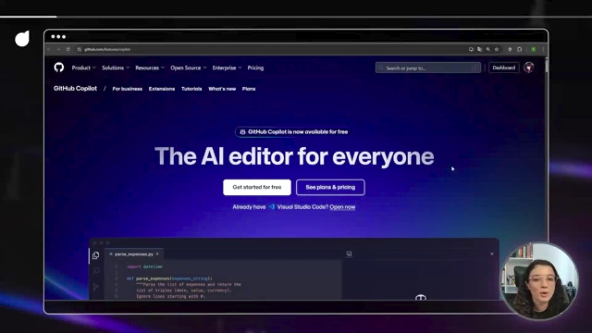
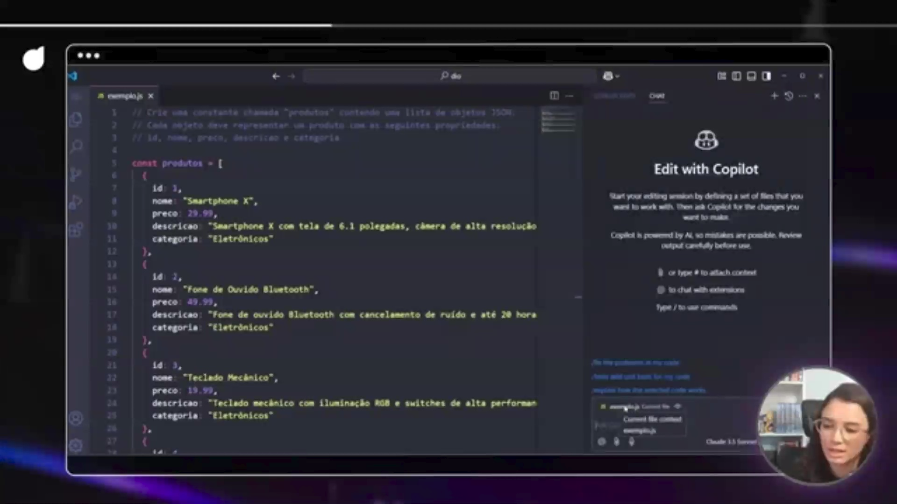
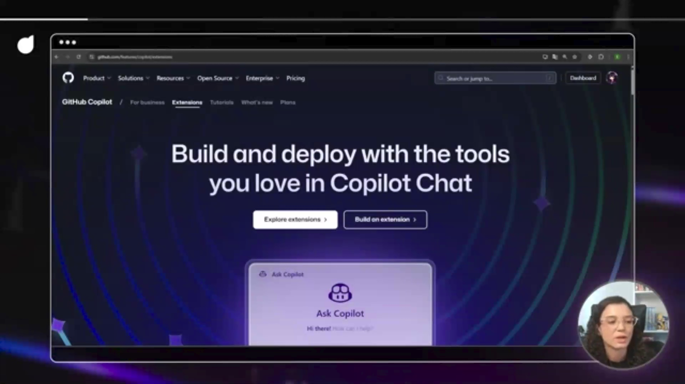

## Instrutor

- Instrutor: Elidiana Andrade (Tech Education Analyst at DIO)
- Contato Linkedin: https://www.linkedin.com/in/elidiana/

## Parte 1 - Introdução

### 🟩 Vídeo 01 - O que vamos explorar?

<video width="60%" controls>
  <source src="000-Midia_e_Anexos/bootcamp_ntt_data_java_spring_ai-modulo.01-curso.04-video_01.webm" type="video/webm">
    Seu navegador não suporta vídeo HTML5.
</video>

link do vídeo: https://web.dio.me/track/ntt-data-2026-ai-java-back-end/course/conhecendo-o-github-copilot-aumentando-sua-produtividade-na-programacao/learning/2ad05908-b0da-454f-81b5-53aec595abe9?autoplay=1

### Anotações

  

#### 1. O que é o GitHub Copilot?
*   **Definição:** É um assistente de programação baseado em IA que sugere código em tempo real.
*   **Além do Autocomplete:** Diferente de ferramentas de preenchimento automático tradicionais, o Copilot entende o contexto e a intenção do desenvolvedor, muitas vezes antecipando o que será digitado.

#### 2. Funcionalidades Chave
*   **Sugestões em Tempo Real:** Oferece trechos de código completos enquanto você digita.
*   **Correção de Erros:** Auxilia na identificação e resolução de bugs durante o desenvolvimento.
*   **Explicdocs(copilot): finaliza curso 04 e atualiza status no READMEação de Conceitos:** Ajuda o desenvolvedor a entender trechos de código ou conceitos complexos.
*   **Sugestão de Comentários:** Pode gerar documentação ou comentários baseados na lógica do código.

#### 3. Benefícios para o Desenvolvedor
*   **Aumento de Produtividade:** Reduz o tempo gasto em tarefas repetitivas e na busca por sintaxes específicas.
*   **Otimização do Desenvolvimento:** Permite focar na lógica de alto nível enquanto a IA lida com partes mais mecânicas da codificação.
*   **Parceria de Programação:** Atua como um "Pair Programmer" virtual, disponível 24/7.

#### 4. Objetivos do Curso (DIO)
*   Fornecer uma visão geral da ferramenta.
*   Ensinar como utilizar o Copilot para maximizar a produtividade diária.
*   Manter o desenvolvedor atualizado com os recursos e atualizações mais recentes da plataforma.      

## Parte 2 - Conhecendo o GitHub Copilot
### 🟩 Vídeo 02 - O que é GitHub Copilot e Como Ele Pode Aumentar sua Produtividade

<video width="60%" controls>
  <source src="000-Midia_e_Anexos/bootcamp_ntt_data_java_spring_ai-modulo.01-curso.04-video_02.webm" type="video/webm">
    Seu navegador não suporta vídeo HTML5.
</video>

link do vídeo: https://web.dio.me/track/ntt-data-2026-ai-java-back-end/course/conhecendo-o-github-copilot-aumentando-sua-produtividade-na-programacao/learning/6c5e7726-27b7-42ee-acf3-5c337d7ff5ef?autoplay=1

### Anotações

  

O vídeo resume as principais funcionalidades, benefícios e formas de acesso ao GitHub Copilot, uma ferramenta que está transformando a maneira como desenvolvedores escrevem e otimizam código.

#### 1. Como ele aumenta a produtividade?
A ferramenta foca em remover os "atritos" do dia a dia do desenvolvedor:
*   **Automação de tarefas repetitivas:** Sugere códigos "boilerplate" e funções comuns automaticamente.
*   **Redução de pesquisas externas:** Evita que o desenvolvedor precise sair da IDE para buscar soluções em fóruns ou documentações, economizando tempo precioso.
*   **Sugestões Contextuais:** O Copilot analisa o código que você já escreveu para oferecer sugestões que façam sentido dentro do seu projeto específico.

#### 2. Qualidade e Criatividade
Além de velocidade, o Copilot auxilia na qualidade técnica:
*   **Boas Práticas:** Sugere padrões de projeto conhecidos e melhorias na estrutura do código.
*   **Suporte à Criatividade:** Pode oferecer abordagens e soluções que o desenvolvedor talvez não tivesse considerado inicialmente.

#### 3. Planos e Acesso
O GitHub oferece diferentes níveis de licenciamento:
*   **Planos Disponíveis:** Free, Pro, Business e Enterprise.
*   **GitHub Education:** Um grande diferencial. Estudantes, professores e mantenedores de projetos de código aberto podem ter acesso ao **GitHub Pro gratuitamente**, incluindo o Copilot, através do programa educacional.

### 🟩 Vídeo 03 - Explorando o GitHub Copilot na Prática

<video width="60%" controls>
  <source src="000-Midia_e_Anexos/bootcamp_ntt_data_java_spring_ai-modulo.01-curso.04-video_03.webm" type="video/webm">
    Seu navegador não suporta vídeo HTML5.
</video>

link do vídeo: https://web.dio.me/track/ntt-data-2026-ai-java-back-end/course/conhecendo-o-github-copilot-aumentando-sua-produtividade-na-programacao/learning/60aec6d3-e308-43db-adb6-bfa00b1d8d63?autoplay=1

### Anotações

  

O vídeo explora as diversas formas de utilizar o GitHub Copilot, desde ambientes de desenvolvimento integrados (IDEs) até a linha de comando (CLI), interface web e dispositivos móveis. Ele detalha o processo de instalação, demonstra exemplos práticos e aborda as melhores práticas para otimizar a interação com a ferramenta.

#### 1. Introdução e Plataformas Suportadas

O GitHub Copilot é uma ferramenta de inteligência artificial que auxilia desenvolvedores na escrita de código, oferecendo sugestões e completando trechos de código. Sua versatilidade permite integração em múltiplos ambientes.

*   **Plataformas de Uso:**
    *   **IDEs:** Ambientes de Desenvolvimento Integrados (Visual Studio Code, Visual Studio, Xcode, JetBrains - PyCharm, IntelliJ, Neovim, Eclipse).
    *   **CLI:** Linha de Comando (via GitHub CLI).
    *   **Web:** Site do GitHub.
    *   **Mobile:** Aplicativo GitHub Mobile.
    *   **Outros:** Azure Data Studio.

*   **Insight:** A ampla compatibilidade do Copilot com as ferramentas mais populares do mercado o torna uma adição valiosa para a maioria dos fluxos de trabalho de desenvolvimento, democratizando o acesso à assistência de IA.

#### 2. Instalação e Configuração em IDEs (Exemplo: VS Code)

A instalação do GitHub Copilot em IDEs é um processo direto, geralmente envolvendo a adição de uma extensão e a autenticação com a conta GitHub.

*   **Processo de Instalação no VS Code:**
    1.  Acessar a barra lateral de **Extensões** (ícone de blocos).
    2.  Pesquisar por "GitHub Copilot".
    3.  Selecionar a extensão oficial do `github.com` e clicar em **Instalar**.
    4.  Após a instalação, o Copilot solicitará a conexão com sua conta GitHub para autorizar o acesso.
    5.  Ao retornar ao VS Code, a licença vinculada à sua conta será automaticamente ativada.

*   **Acesso e Configurações no VS Code:**
    *   **Acesso Rápido:** O Copilot pode ser acessado diretamente no editor (sugestões inline) ou através do ícone de chat no canto superior direito da interface.
    *   **Configurações da Extensão:** As configurações específicas do Copilot podem ser acessadas via `File > Preferences > Settings` e, na aba de extensões, buscando por "GitHub Copilot". Embora não detalhadas no vídeo, é útil saber onde encontrá-las para personalização.

*   **Insight:** A integração nativa e o processo de instalação simplificado nas IDEs mais populares minimizam a barreira de entrada para os desenvolvedores que desejam experimentar e incorporar o Copilot em seu dia a dia.

#### 3. Exemplos Práticos de Uso em IDEs

O Copilot oferece diversas funcionalidades para otimizar a escrita e compreensão de código.

*   **3.1. Geração de Dados Mock (Exemplo: E-commerce)**
    *   **Cenário:** Criar uma constante `products` com uma lista de objetos para um projeto de e-commerce.
    *   **Interação:**
        1.  Em um arquivo `.js` vazio, iniciar um comentário descrevendo a intenção: `// create a constant called products containing a list of objects`.
        2.  O Copilot começará a sugerir o código.
        3.  Para refinar, adicionar mais detalhes no comentário: `// ID, name, price, description, category`.
        4.  O Copilot gerará a estrutura de dados mock com base nas especificações.
    *   **Melhoria do Prompt:**
        1.  A resposta inicial pode ser genérica. Para melhorar, pode-se usar o chat inline (Ctrl+I) ou o chat do Copilot.
        2.  **Exemplo de Prompt Refinado:** `substitua o nome para nome de produtos eletrônicos e altere a descrição para uma mais detalhada acerca do produto correspondente`.
        3.  O Copilot ajustará o código, fornecendo nomes e descrições mais específicos e detalhados.

*   **3.2. Explicação de Trechos de Código:**
    *   **Cenário:** Entender um trecho de código existente.
    *   **Interação:**
        1.  Selecionar o trecho de código desejado.
        2.  Clicar com o botão direito e selecionar `Copilot > Explain`.
        3.  O Copilot abrirá o chat e, após permissão para acessar o repositório (se versionado) e autenticação GitHub, fornecerá uma explicação detalhada do código.
    *   **Funcionalidades Adicionais:**
        *   Pedir para **melhorar** ou **corrigir** o código.
        *   Solicitar a explicação em **outras linguagens** (ex: `retornar em português de forma resumida`).

*   **3.3. Geração de Mensagens de Commit:**
    *   **Cenário:** Criar uma mensagem de commit descritiva para alterações no código.
    *   **Interação:**
        1.  Realizar alterações no código.
        2.  Adicionar as alterações à *staging area* do Git.
        3.  No painel de controle do Git no VS Code, clicar em **"Generate Commit Message with Copilot"**.
        4.  O Copilot analisará as alterações e sugerirá uma mensagem de commit relevante.

*   **Observações:** A capacidade do Copilot de gerar, explicar e refinar código, além de auxiliar em tarefas como a criação de commits, o posiciona como um verdadeiro "copiloto" no processo de desenvolvimento, acelerando tarefas repetitivas e auxiliando na compreensão. A qualidade da saída, no entanto, depende fortemente da clareza e especificidade das instruções fornecidas.      

### 🟩 Vídeo 04 - Como Conferir as Novidades do GitHub Copilot

<video width="60%" controls>
  <source src="000-Midia_e_Anexos/bootcamp_ntt_data_java_spring_ai-modulo.01-curso.04-video_04.webm" type="video/webm">
    Seu navegador não suporta vídeo HTML5.
</video>

link do vídeo: https://web.dio.me/track/ntt-data-2026-ai-java-back-end/course/conhecendo-o-github-copilot-aumentando-sua-produtividade-na-programacao/learning/8b03a344-f493-4ca7-8a75-4e038a1a3e3e?autoplay=1

### Anotações

  

     

#### 1. Extensões do GitHub Copilot
As extensões representam um salto na personalização da ferramenta. Elas permitem:
*   **Integração de Serviços Externos:** Conectar ferramentas e serviços de terceiros diretamente ao GitHub Copilot Chat.
*   **Fluxo de Trabalho Unificado:** Realizar consultas e ações em outras plataformas sem sair do ambiente de desenvolvimento (IDE).

#### 2. Novos Modos de Operação: Edição e Agente
O Copilot está introduzindo formas mais poderosas de interagir com o código:
*   **Modo de Edição (Edit Mode):** Focado na execução de mudanças em múltiplos arquivos simultaneamente. Ele utiliza o contexto de todo o projeto para garantir que as alterações sejam coerentes em diferentes partes do sistema.
*   **Modo Agente (Agent Mode):** Atualmente em fase de *preview*, este modo opera de forma mais autônoma e dinâmica. Ele não apenas sugere código, mas pode "raciocinar" sobre tarefas complexas e utilizar um conjunto de ferramentas para resolvê-las.

#### 3. VS Code Insiders: O Laboratório de Inovações
Para desenvolvedores que desejam testar as funcionalidades antes do lançamento oficial:
*   **Acesso Antecipado:** Recursos como o "Modo Agente" estão disponíveis primeiro no **VS Code Insiders**.
*   **Experimentação:** É o ambiente ideal para explorar a interface de chat atualizada e as novas capacidades de contexto multi-arquivos.

#### 4. Fontes de Atualização e Documentação
A tecnologia de IA evolui rapidamente, e o vídeo destaca canais essenciais para se manter atualizado:
*   **Site Oficial do GitHub Copilot:** Seção "O que há de novo" (What's new).
*   **Documentação do VS Code:** Detalhes técnicos sobre a integração da IDE com a IA.
*   **Materiais de Apoio:** Links úteis e cursos complementares na plataforma de ensino.

# Certificado: Explorando o GitHub Copilot: Aumentando sua Produtividade com IA na Programação

- Link na plataforma: 
- Certificado em pdf: