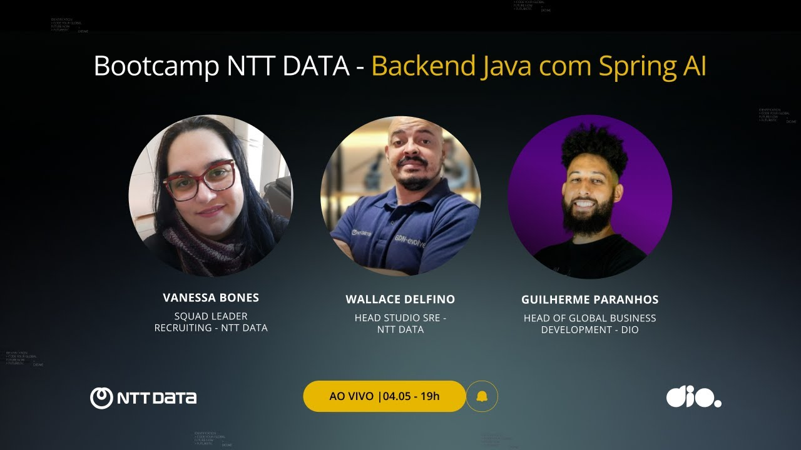

# Mentoria: Live de Lançamento Bootcamp NTT DATA: Backend Java com Spring AI

▶️ [Assista no Youtube](https://youtu.be/tT4dUzg0ny8)

<video width="60%" controls>
  <source src="000-Midia_e_Anexos/bootcamp_ntt_data_java_spring_ai-modulo.01-curso.05-video_01.mp4" type="video/webm">
    Seu navegador não suporta vídeo HTML5.
</video>

### Anotações

  

#### Visão Geral

O vídeo apresenta a abertura oficial do novo bootcamp da **NTT DATA** em parceria com a **DIO**. O foco principal é a formação de desenvolvedores Backend utilizando as versões mais recentes do ecossistema Java, com ênfase na integração de Inteligência Artificial através do **Spring AI**.

* **Parceiros:** DIO & NTT DATA (Consultoria global com mais de 300 mil colaboradores).
* **Vagas:** 5.000 bolsas gratuitas.
* **Foco Técnico:** Java 25, Spring Boot 3 e Spring AI.
* **Prazo de Inscrição:** Até 08 de junho.

---

#### Estrutura do Programa e Carreira

A NTT DATA reforça que o bootcamp não é apenas uma trilha de estudos, mas uma vitrine para contratação.

##### O Profissional do Futuro (Visão NTT DATA)

* **Evolução do Dev Backend:** Deixa de ser apenas "quem faz consulta em banco" para se tornar um orquestrador de ferramentas.
* **Integração Nativa de IA:** O desenvolvedor deve usar IA (como o Spring AI) para abstrair complexidades e focar na geração de valor.
* **Fundamentos são Inegociáveis:** A IA não substitui a base. É essencial dominar Orientação a Objetos, herança, polimorfismo e lógica para validar se a IA está "alucinando" ou entregando soluções coerentes.

---

#### Requisitos e Habilidades Valorizadas

##### Hard Skills (Conhecimentos Técnicos)

1. **Linguagem:** Java (versões recentes).
2. **Frameworks:** Spring Boot 3 e a abstração do Spring AI.
3. **Tecnologias Acessórias:**
* **Cloud & DevOps:** Entendimento de nuvem e automação.
* **Observabilidade:** Conhecimento básico para troubleshooting e debug.
* **SRE:** Noções de resiliência e estabilidade de sistemas.

##### Soft Skills (Habilidades Comportamentais)

* **Curiosidade:** Desejo ativo de aprender e "brilho nos olhos".
* **Comunicação Assertiva:** Saber explicar o raciocínio por trás de uma solução.
* **Resolução de Problemas:** Foco na solução, não apenas em apontar o erro.
* **Ownership:** Assumir a responsabilidade pelo próprio aprendizado e carreira.
* **Colaboração:** "Levantar a mão" quando travar (regra dos 30 minutos) e ajudar colegas.

---

#### Cultura e Onboarding na NTT DATA

* **"Júnior é Júnior":** A empresa não espera experiência prévia de quem está começando, mas espera fundamentação teórica e vontade de aprender.
* **Sistema de Apoio:**
* **Shadowing:** O iniciante acompanha profissionais experientes para entender o dia a dia.
* **Buddy System:** Um "padrinho" auxilia no aculturamento.
* **Universidade Corporativa:** Trilhas de conhecimento síncronas e assíncronas.
* **Diversidade:** Grupos focais para PCDs, mulheres, pretos, 40+ e neurodivergentes, garantindo suporte além da contratação.

---

#### Dicas de Ouro dos Mentores

1. **Conclua o que começou:** O certificado é importante, mas a persistência de finalizar o bootcamp demonstra resiliência ao recrutador.
2. **Prática constante:** Aplique a teoria em projetos pequenos e alimente seu GitHub.
3. **Raciocínio sobre Ferramenta:** Em entrevistas, foque em explicar **como** você resolveu um problema e por que tomou certas decisões arquiteturais.
4. **LinkedIn:** Mantenha seu perfil atualizado e interaja com a comunidade e recrutadores.

# Certificado: 

- Link na plataforma: 
- Certificado em pdf: 
