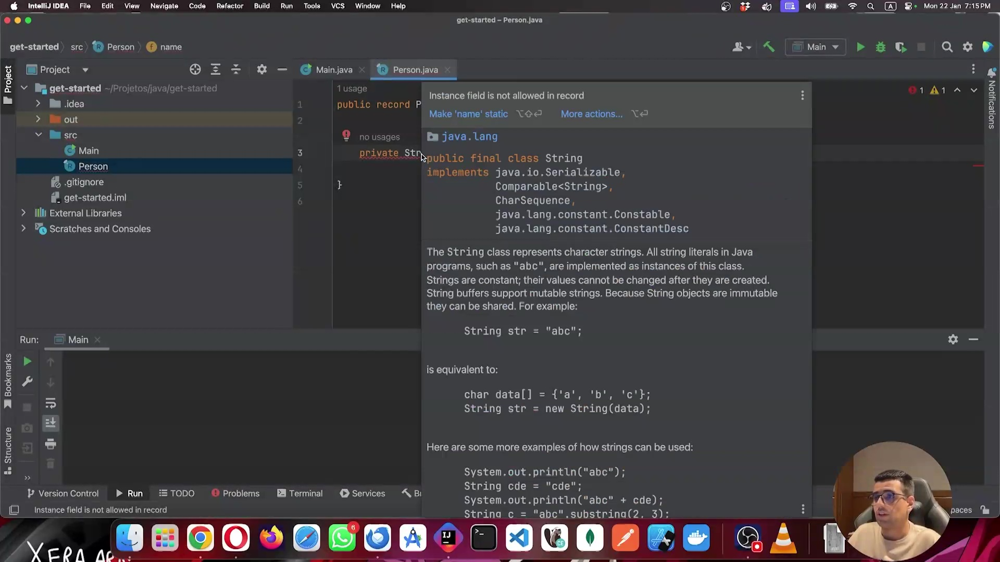
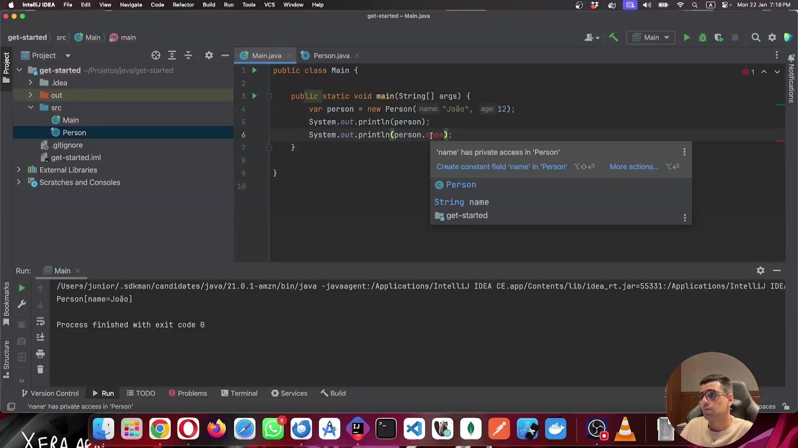
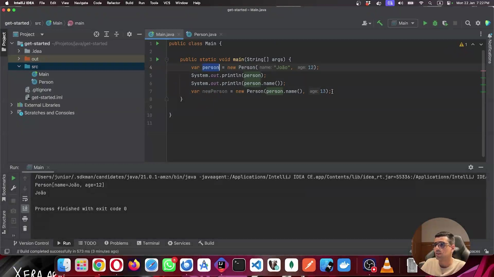
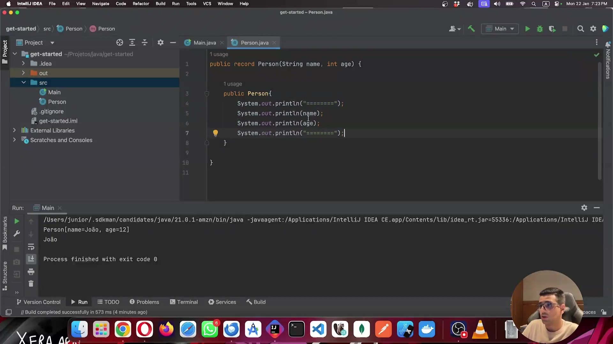
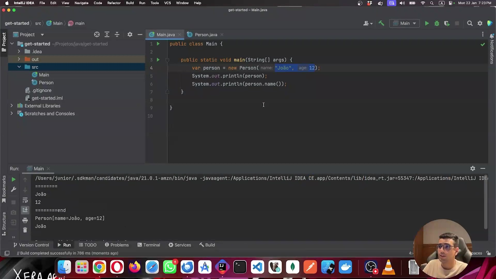
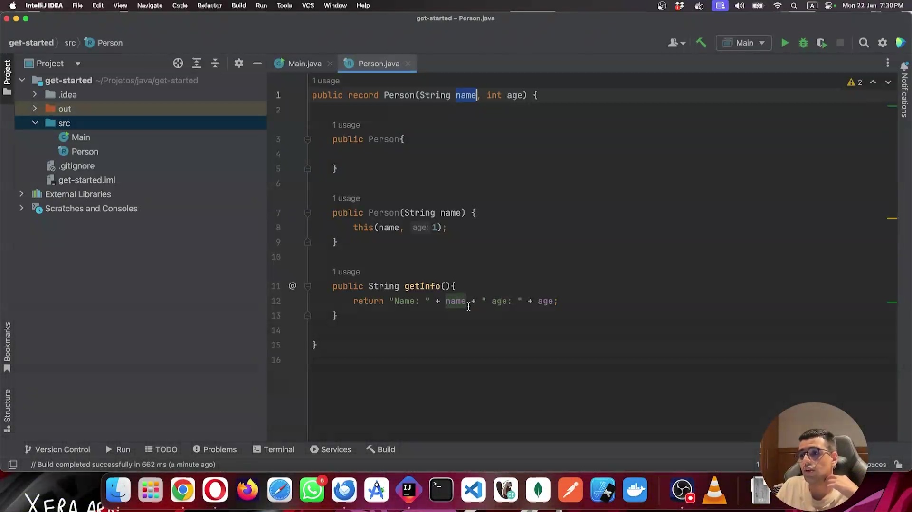

# Parte 1 — Java e a Arte da Abstração com Classes e Encapsulamento

## 🎬 Vídeo 01 — Criando a Primeira Classe

<video width="60%" controls>
  <source src="000-Midia_e_Anexos/bootcamp_ntt_data_java_spring_ai-modulo.01-curso.05-video_03.webm" type="video/webm">
    Seu navegador não suporta vídeo HTML5.
</video>

link do vídeo: https://web.dio.me/track/ntt-data-2026-ai-java-back-end/course/java-e-a-arte-da-abstracao-com-classes-e-encapsulamento/learning/8367cdbe-ddde-4555-987a-5821f7e05e7f?autoplay=1)

O vídeo revisa os fundamentos da Programação Orientada a Objetos (POO) em Java, com foco na **abstração de conceitos do mundo real para o software**, garantindo segurança, organização e reuso de código.

### Anotações

#### Exemplo 1 — O que acontece a cada `new`?

O professor apresenta o código abaixo para ilustrar que cada `new` aloca um novo objeto na memória Heap:

```java
public class Main {
    public static void main(String[] args) {
        var scanner  = new Scanner(System.in);
        var scanner1 = new Scanner(System.in);
        var scanner2 = new Scanner(System.in);
    }
}
```

##### ⚠️ Problemas desse código

Embora a alocação de três objetos distintos na Heap esteja tecnicamente correta, o compartilhamento do mesmo recurso (`System.in`) gera três problemas sérios:

| Problema | Descrição |
|---|---|
| **Conflito de I/O** | Os três objetos disputam o controle do mesmo fluxo de entrada (`System.in`). |
| **Vazamento de memória** | `Scanner` é um recurso "pesado"; instâncias desnecessárias desperdiçam memória. |
| **Risco de exceção** | Fechar qualquer um dos scanners encerra `System.in` para todos os outros, causando erros em tempo de execução. |

##### ✅ A forma correta

A solução é separar o **mecanismo de leitura** (um único `Scanner`) dos **dados lidos** (variáveis independentes). O scanner deve ser único; os dados capturados é que podem ocupar espaços distintos na memória.

```java
import java.util.Scanner;

public class Main {

    public static void main(String[] args) {

        // 1. Um único mecanismo de leitura na memória Heap
        var leitor = new Scanner(System.in);

        // 2. Variáveis distintas armazenam cada dado capturado
        System.out.println("Digite um nome:");
        String nome = leitor.nextLine();

        System.out.println("Digite um ID:");
        String id = leitor.nextLine();

        System.out.println("Digite uma cidade:");
        String cidade = leitor.nextLine();

        // 3. Exibição dos dados armazenados
        System.out.println("\n--- Conteúdo Armazenado ---");
        System.out.println("Nome:   " + nome);
        System.out.println("ID:     " + id);
        System.out.println("Cidade: " + cidade);

        // 4. Boa prática: fechar o recurso ao final
        leitor.close();
    }
}
```

> 💡 **Conclusão:** o objeto `Scanner` é o *instrumento* de leitura; as variáveis `String` são os *recipientes* dos dados. Confundir os dois papéis é um erro de design comum em iniciantes.

---

#### Exemplo 2 — Criando e Usando uma Classe Própria

O professor cria a classe `Person` para demonstrar como modelar entidades do mundo real em Java.

##### Classe `Person` (versão do professor)

```java
public class Person {
    public String name;
    public int age;
}
```

##### Classe `Main` (versão do professor)

```java
public class Main {

    public static void main(String[] args) {
        var male = new Person();
        male.name = "João";
        male.age  = 12;

        var female = new Person();
        female.name = "Maria";
        female.age  = 10;

        System.out.println("Male name: "   + male.name   + " age: " + female.age); // ← bug!
        System.out.println("Female name: " + female.name + " age: " + female.age);
    }
}
```

##### Saída do programa

```
Male name: João age: 10
Female name: Maria age: 10
```

> 🔴 **Bug na saída:** a primeira linha imprime a idade de `female` no lugar de `male`. Esse erro passou despercebido justamente porque os atributos são acessados diretamente, sem nenhuma camada de controle — evidenciando um problema estrutural de design.

---

##### 🔍 Análise Técnica — Por Que Atributos `public` São um Problema?

O código acima viola um dos pilares fundamentais da POO: o **Encapsulamento**. Expor atributos com `public` apresenta quatro riscos principais:

**1. Falta de validação**
Qualquer parte do código pode inserir valores inválidos sem que a classe possa reagir:
```java
male.age  = -50;   // age negativo: inválido, mas aceito
male.name = null;  // null: pode causar NullPointerException
```

**2. Quebra do encapsulamento**
O mundo externo passa a conhecer *como* os dados são armazenados internamente, criando um acoplamento forte entre as classes. O ideal é que o exterior saiba apenas *o que* a classe faz, não *como* ela faz.

**3. Dificuldade de manutenção**
Se o atributo `age` precisar ser renomeado para `birthDate` no futuro, será necessário alterar manualmente todas as referências diretas espalhadas pelo projeto.

**4. Erros de lógica silenciosos**
Como demonstrado no exemplo, misturar referências (`male.name` com `female.age`) não gera erro de compilação — o bug só aparece na saída, tornando-o difícil de rastrear.

---

##### ✅ A Solução Correta — Encapsulamento com Getters e Setters

A correção é declarar os atributos como `private` e fornecer métodos públicos controlados de acesso (getters) e modificação (setters), com validações embutidas.

###### Classe `Person` refatorada

```java
public class Person {

    // Atributos privados: inacessíveis diretamente de fora da classe
    private String name;
    private int age;

    // --- Getter e Setter para 'name' ---
    public String getName() {
        return name;
    }

    public void setName(String name) {
        if (name != null && !name.isEmpty()) {
            this.name = name; // 'this.name' → atributo da classe
                              // 'name'      → parâmetro do método
        }
    }

    // --- Getter e Setter para 'age' ---
    public int getAge() {
        return age;
    }

    public void setAge(int age) {
        if (age >= 0) {       // Validação: idade não pode ser negativa
            this.age = age;
        }
    }
}
```

###### Classe `Main` refatorada

```java
public class Main {

    public static void main(String[] args) {

        // Objeto masculino
        var male = new Person();
        male.setName("João");
        male.setAge(12);

        // Objeto feminino
        var female = new Person();
        female.setName("Maria");
        female.setAge(10);

        // Impressão via getters — clara, sem risco de trocar referências
        System.out.println("Dados do masculino:");
        System.out.println("Nome: " + male.getName() + " | Idade: " + male.getAge());

        System.out.println("\nDados do feminino:");
        System.out.println("Nome: " + female.getName() + " | Idade: " + female.getAge());
    }
}
```

##### Saída correta

```
Dados do masculino:
Nome: João | Idade: 12

Dados do feminino:
Nome: Maria | Idade: 10
```

#### O que foi visto nesta aula

Ao final da aula, o aluno saiu com um entendimento prático de como:

- Modelar entidades do mundo real como classes Java;
- Compreender que cada new cria um objeto independente na memória;
- Aplicar encapsulamento com private e métodos de acesso;
- Usar this para resolver conflitos de escopo;
- Distinguir membros estáticos (da classe) de membros de instância;
- Usar construtores para controlar como um objeto nasce, tornando obrigatório o fornecimento de dados essenciais desde a criação.

### 🟩 Vídeo 02 - Trabalhando com Records

<video width="60%" controls>
  <source src="000-Midia_e_Anexos/bootcamp_ntt_data_java_spring_ai-modulo.01-curso.05-video_02.webm" type="video/webm">
    Seu navegador não suporta vídeo HTML5.
</video>

link do vídeo: https://web.dio.me/track/ntt-data-2026-ai-java-back-end/course/java-e-a-arte-da-abstracao-com-classes-e-encapsulamento/learning/64263a12-13af-4f4c-b2ec-cb4c27b04d99?autoplay=1

Este vídeo aprofunda o conceito de **Records** no Java, uma funcionalidade introduzida para simplificar a criação de classes que servem puramente como transportadoras de dados imutáveis.  

### Anotações

#### Tentativa de declarar campo de instância em um `record`

<p align="center">
  
</p>

O editor exibe o arquivo `Person.java` com a declaração de um `record`. Logo abaixo do cabeçalho `public record P...`, foi tentada a declaração de um campo de instância `private Str...`, o que gerou imediatamente o aviso **"Instance field is not allowed in record"**. O IntelliJ oferece a sugestão de transformar o campo em `static` como alternativa viável. No painel lateral, a documentação da classe `String` é exibida como contexto da IDE, sem relação direta com o erro.

> **Ponto-chave:** Em um `record`, **não é permitido declarar campos de instância no corpo da declaração**. A única forma aceita de definir atributos é na lista de parâmetros do cabeçalho do `record` — que também funciona como o seu construtor canônico.

```java
// Incorreto — gera erro de compilação em um record
public record Person {
    private String name; // ❌ Instance field is not allowed in record
}
```

#### Instanciando um `record` sem argumentos

<p align="center">
  
</p>

O arquivo `Main.java` mostra a criação de uma instância de `Person` sem qualquer argumento: `var person = new Person();`. Um ícone de aviso (⚠) aparece na linha, indicando que o `record` ainda não possui atributos definidos no cabeçalho — portanto o construtor gerado automaticamente também não exige argumentos neste momento. 

```java
public class Main {

    public static void main(String[] args) {
        var person = new Person(); // ⚠ record sem atributos declarados
    }

}
```

> Neste estágio, `Person` é um `record` vazio. A instanciação funciona, mas o objeto ainda não carrega nenhum dado.

#### Acesso a atributos privados e o getter gerado automaticamente

<p align="center">
  
</p>

O `record Person` já possui os atributos `String name` e `int age` declarados no cabeçalho. Em `Main.java`, a instância é criada com `new Person(name: "João", age: 12)` e impressa com `System.out.println(person)`. Na linha 6, a tentativa de acessar `person.name` (sem parênteses, como se fosse campo público) gerou o aviso **"'name' has private access in 'Person'"**, visível tanto no popup de sugestão quanto na barra de status inferior.

O console, referente a uma execução anterior, já exibiu a saída correta via `toString`:

```
Person[name=João]
```

> **Regra do `record`:** todos os atributos declarados no cabeçalho são automaticamente `private final`. O acesso de leitura se dá por meio de um **método getter gerado automaticamente**, cujo nome é idêntico ao do atributo — `name()` em vez do convencional `getName()`.

```java
// Incorreto
System.out.println(person.name);   // ❌ private access

// Correto
System.out.println(person.name()); // ✅ getter gerado pelo record
```

#### Usando o getter e criando uma segunda instância

<p align="center">
  
</p>

`Main.java` demonstra o uso correto do getter `person.name()` e a criação de um segundo objeto `newPerson` reaproveitando o nome do primeiro mas com idade diferente. O console confirma o comportamento esperado:

```
Person[name=João, age=12]
João
```

```java
public class Main {

    public static void main(String[] args) {
        var person = new Person(name: "João", age: 12);
        System.out.println(person);
        System.out.println(person.name()); // getter gerado automaticamente

        var newPerson = new Person(person.name(), age: 13); // nova instância independente
    }

}
```

> Como `record`s são **imutáveis**, não existe setter. Para "alterar" um valor, é necessário criar uma nova instância — exatamente como ilustrado com `newPerson`. Os dois objetos são independentes entre si.

#### Construtor compacto (*compact constructor*)

<p align="center">
  
</p>

`Person.java` exibe o `record` com um **construtor compacto** declarado explicitamente (`public Person{...}`). Dentro dele, quatro chamadas a `System.out.println` imprimem separadores e os valores de `name` e `age`. O console ao fundo mostra a saída produzida quando esse construtor foi executado durante a instanciação:

```
========
João
12
========end
Person[name=João, age=12]
João
```

```java
public record Person(String name, int age) {

    // Construtor compacto — executado após a atribuição automática dos campos
    public Person {
        System.out.println("========");
        System.out.println(name);
        System.out.println(age);
        System.out.println("========");
    }

}
```

> O construtor compacto **não recebe parâmetros explícitos** e **não atribui os campos** — essa atribuição já é feita automaticamente pelo `record` antes de entrar no bloco. Seu uso mais comum é a **validação de dados**: rejeitar valores nulos, verificar regras de negócio, etc.

#### Visualizando o fluxo completo de execução

<p align="center">
  
</p>

`Main.java` revisado, sem a linha `newPerson`, mostra o fluxo limpo de criação e leitura. O console exibe a ordem completa de execução, confirmando que o construtor compacto é chamado **durante a instanciação**, antes que qualquer `println` do `main` seja executado:

```
========
João
12
========end
Person[name=João, age=12]
João
```

```java
public class Main {

    public static void main(String[] args) {
        var person = new Person(name: "João", age: 12); // construtor compacto dispara aqui
        System.out.println(person);         // Person[name=João, age=12]
        System.out.println(person.name()); // João
    }

}
```

> A sequência do console deixa claro o ciclo de vida: primeiro o `record` atribui os campos, depois executa o construtor compacto, e só então o controle retorna ao `main`.

#### Construtor secundário e método personalizado no `record`

<p align="center">
  
</p>

`Person.java` apresenta três elementos adicionais do `record`:

1. **Construtor compacto vazio** (linhas 3–5) — declarado sem conteúdo, apenas para evidenciar sua existência.
2. **Construtor secundário** (linhas 7–9) — aceita apenas `String name` e delega ao construtor canônico via `this(name, age: 1)`, definindo `age` com valor padrão `1`.
3. **Método personalizado `getInfo()`** (linhas 11–13) — retorna uma `String` formatada com `name` e `age`.

```java
public record Person(String name, int age) {

    // Construtor compacto (vazio — sem lógica adicional)
    public Person {

    }

    // Construtor secundário — obrigatório delegar ao construtor canônico
    public Person(String name) {
        this(name, 1); // age recebe valor padrão
    }

    // Método personalizado
    public String getInfo() {
        return "Name: " + name + " age: " + age;
    }

}
```

> **Regra importante:** qualquer construtor secundário em um `record` **deve obrigatoriamente chamar o construtor canônico** via `this(...)`. Isso garante que todos os campos — que são `final` — recebam um valor antes de qualquer uso.      

#### Conclusão

O `record` não é um substituto da classe convencional — tem um propósito específico: **representar dados imutáveis de forma concisa**. Enquanto uma classe exige construtor, getters, `equals`, `hashCode` e `toString` escritos manualmente, o `record` gera tudo isso automaticamente a partir dos atributos declarados no cabeçalho.

A diferença central está na imutabilidade. Uma vez instanciado, os valores de um `record` não podem ser alterados — os campos são implicitamente `private final` e não existe setter. Essa não é uma limitação acidental, mas uma decisão de design: o objeto deve carregar sempre um estado consistente e previsível.

Um exemplo direto: imagine um sistema que consulta um CEP e recebe o endereço correspondente. Rua, bairro, cidade e estado são dados que vieram de fora e representam uma realidade já existente — não faz sentido alterá-los depois.

```java
public record Endereco(String rua, String bairro, String cidade, String estado) {}
```

Só isso. Nenhum boilerplate, nenhum setter indevido, e a intenção fica clara para qualquer um que leia o código: `Endereco` é um dado, não uma entidade com estado mutável. Esse é o cenário ideal para o `record` — respostas de APIs, DTOs, parâmetros agrupados — qualquer situação onde o objetivo é transportar valores, não transformá-los.

Introduzido experimentalmente no Java 14 e consolidado no **Java 17 (LTS)**, o `record` acompanha uma tendência já presente no Kotlin (`data class`) e no C# (`record type`): tratar dados como dados, com a linguagem garantindo isso em vez de depender da disciplina do desenvolvedor.


## Parte 2 - Exercícios: Classes e Encapsulamento

### 🟩 Vídeo 03 - Exercícios

<video width="60%" controls>
  <source src="000-Midia_e_Anexos/bootcamp_ntt_data_java_spring_ai-modulo.01-curso.05-video_03.webm" type="video/webm">
    Seu navegador não suporta vídeo HTML5.
</video>

link do vídeo: https://web.dio.me/track/ntt-data-2026-ai-java-back-end/course/java-e-a-arte-da-abstracao-com-classes-e-encapsulamento/learning/cb67cd06-4a75-4378-b6b6-c9526185a882?autoplay=1

### Anotações

<p align="center">
  
</p>

O vídeo apresenta uma série de exercícios de programação orientada a objetos (POO) para prática, com foco na aplicação de conceitos aprendidos. O palestrante detalha três exercícios e, em seguida, demonstra a resolução do terceiro, incluindo a criação de classes, métodos e um menu interativo.

#### Especificações do terceiro exercício:

```plaintext
3. Escreva um código onde temos o controle de banho de um petshop, a maquina de banhos dos pets deve ter as seguintes operações:
   - Dar banho no pet;
   - Abastecer com água;
   - Abastecer com shampoo;
   - verificar nivel de água;
   - verificar nivel de shampoo;
   - verificar se tem pet no banho;
   - colocar pet na maquina;
   - retirar pet da máquina;
   - limpar maquina.

Siga as seguintes regras para implementação

   - A maquina de banho deve permitir somente 1 pet por vez;
   - Cada banho realizado irá consumir 10 litros de água e 2 litros de shampoo;
   - A máquina tem capacidade máxima de 30 litros de água e 10 litros de shampoo;
   - Se o pet for retirado da maquina sem estar limpo será necessário limpar a máquina para permitir a entrada de outro pet;
   - A limpeza da máquina ira consumir 3 litros de água e 1 litro de shampoo;
   - O abastecimento de água e shampoo deve permitir 2 litros por vez que for acionado;
```

#### Resumo das Especificações

| Regra | Detalhe |
|---|---|
| Capacidade máxima de água | 30 litros |
| Capacidade máxima de shampoo | 10 litros |
| Consumo por banho | 10 L de água + 2 L de shampoo |
| Consumo por limpeza da máquina | 3 L de água + 1 L de shampoo |
| Abastecimento por acionamento | 2 litros (água ou shampoo) |
| Máximo de pets simultâneos | 1 pet por vez |

#### Estrutura das Classes

O projeto é composto por **três arquivos Java**, cada um com uma responsabilidade bem definida:

```
src/
├── Pet.java           → Representa o animal (nome + estado de limpeza)
├── PetMachine.java    → A máquina de banho com todas as regras de negócio
└── Main.java          → Ponto de entrada com menu interativo no terminal
```

#### Classe `Pet.java`

> **Por que separar em uma classe própria?**  
> Na transcrição da aula, o professor destaca que o `pet` é uma entidade com identidade própria — tem **nome** e **estado de limpeza** — e, portanto, merece ser modelado como uma classe separada, não apenas como uma variável primitiva dentro da máquina.

```java
/**
 * Representa um animal (pet) que será submetido ao banho.
 *
 * Atributos:
 *  - name  → nome do pet, definido na criação e imutável (final)
 *  - clean → indica se o pet está limpo (false por padrão ao entrar)
 */
public class Pet {

    // O nome é imutável após a criação do pet (uso de final)
    private final String name;

    // Estado de limpeza: inicia como false (sujo) ao ser criado
    private boolean clean;

    /**
     * Construtor: todo pet precisa de um nome ao ser criado.
     * O estado inicial de limpeza é FALSE, pois ele entra sujo na máquina.
     *
     * @param name Nome do animal
     */
    public Pet(String name) {
        this.name = name;
        this.clean = false;
    }

    // -------------------------
    // Getters e Setters
    // -------------------------

    /**
     * Retorna o nome do pet.
     * Não existe setter para name pois ele é final (imutável).
     */
    public String getName() {
        return name;
    }

    /**
     * Retorna se o pet está limpo.
     *
     * @return true se limpo, false se sujo
     */
    public boolean isClean() {
        return clean;
    }

    /**
     * Atualiza o estado de limpeza do pet.
     * Chamado internamente pela PetMachine ao realizar o banho.
     *
     * @param clean true para marcar como limpo
     */
    public void setClean(boolean clean) {
        this.clean = clean;
    }
}
```

#### 🚿 Classe `PetMachine.java`

> Esta é a classe principal do exercício. Ela concentra **todas as regras de negócio** da máquina de banho. O professor orienta a aplicar validações (`if` guards) no início de cada método para garantir que as regras sejam respeitadas antes de qualquer operação.

```java
/**
 * Representa a máquina de banho do petshop.
 *
 * Responsabilidades:
 *  - Gerenciar o pet dentro da máquina (1 por vez)
 *  - Controlar os níveis de água e shampoo
 *  - Realizar o banho e a limpeza da máquina
 *  - Aplicar todas as regras de negócio definidas no enunciado
 */
public class PetMachine {

    // -------------------------
    // Constantes de negócio
    // -------------------------

    /** Capacidade máxima de água em litros */
    private static final int MAX_WATER   = 30;

    /** Capacidade máxima de shampoo em litros */
    private static final int MAX_SHAMPOO = 10;

    /** Litros de água consumidos por banho */
    private static final int WATER_PER_BATH    = 10;

    /** Litros de shampoo consumidos por banho */
    private static final int SHAMPOO_PER_BATH  = 2;

    /** Litros de água consumidos por limpeza da máquina */
    private static final int WATER_PER_WASH    = 3;

    /** Litros de shampoo consumidos por limpeza da máquina */
    private static final int SHAMPOO_PER_WASH  = 1;

    /** Litros adicionados a cada acionamento de abastecimento */
    private static final int REFILL_AMOUNT     = 2;

    // -------------------------
    // Atributos de estado
    // -------------------------

    /** Nível atual de água na máquina */
    private int water;

    /** Nível atual de shampoo na máquina */
    private int shampoo;

    /**
     * Estado de limpeza da MÁQUINA (não do pet).
     * Uma máquina nova ou recém-lavada começa limpa (true).
     * Se um pet sair sem tomar banho, a máquina fica suja (false).
     */
    private boolean clean;

    /**
     * Referência ao pet que está atualmente na máquina.
     * null = máquina vazia.
     */
    private Pet pet;

    // -------------------------
    // Construtor
    // -------------------------

    /**
     * Inicializa a máquina em estado pronto para uso:
     *  - Sem pet
     *  - Limpa (clean = true)
     *  - Sem água e sem shampoo (precisará ser abastecida)
     */
    public PetMachine() {
        this.pet     = null;
        this.clean   = true;
        this.water   = 0;
        this.shampoo = 0;
    }

    // =========================================================
    // 1. DAR BANHO NO PET
    // =========================================================

    /**
     * Realiza o banho do pet que está na máquina.
     *
     * Regras aplicadas:
     *  - A máquina deve ter um pet para realizar o banho
     *  - Deve haver ao menos 10 L de água disponíveis
     *  - Deve haver ao menos 2 L de shampoo disponíveis
     *  - O banho consome 10 L de água e 2 L de shampoo
     *  - Ao final, o pet é marcado como limpo
     */
    public void takeAShower() {
        // Regra: precisa ter pet na máquina
        if (!hasPet()) {
            System.out.println("⚠️  Coloque o pet na máquina para iniciar o banho.");
            return;
        }

        // Regra: verificar se há água suficiente
        if (this.water < WATER_PER_BATH) {
            System.out.println("⚠️  Água insuficiente! Nível atual: " + this.water
                    + " L. Necessário: " + WATER_PER_BATH + " L.");
            return;
        }

        // Regra: verificar se há shampoo suficiente
        if (this.shampoo < SHAMPOO_PER_BATH) {
            System.out.println("⚠️  Shampoo insuficiente! Nível atual: " + this.shampoo
                    + " L. Necessário: " + SHAMPOO_PER_BATH + " L.");
            return;
        }

        // Realiza o banho: consome insumos e marca o pet como limpo
        this.water   -= WATER_PER_BATH;
        this.shampoo -= SHAMPOO_PER_BATH;
        this.pet.setClean(true);

        System.out.println("🛁 " + this.pet.getName() + " foi banhado com sucesso!");
        System.out.println("   Água restante: " + this.water + " L | Shampoo restante: " + this.shampoo + " L");
    }

    // =========================================================
    // 2. ABASTECER COM ÁGUA
    // =========================================================

    /**
     * Abastece a máquina com 2 litros de água.
     *
     * Regras aplicadas:
     *  - Não ultrapassa a capacidade máxima de 30 litros
     *  - Se já estiver no máximo, avisa e não executa
     *  - Se 2 litros ultrapassarem o máximo, completa apenas até o limite
     */
    public void addWater() {
        // Regra: verificar se já está no máximo
        if (this.water >= MAX_WATER) {
            System.out.println("⚠️  A capacidade de água da máquina já está no máximo (" + MAX_WATER + " L).");
            return;
        }

        // Garante que não ultrapasse o limite mesmo que o refill seja parcial
        int novoNivel = Math.min(this.water + REFILL_AMOUNT, MAX_WATER);
        int adicionado = novoNivel - this.water;
        this.water = novoNivel;

        System.out.println("💧 " + adicionado + " L de água adicionados. Nível atual: " + this.water + " L / " + MAX_WATER + " L");
    }

    // =========================================================
    // 3. ABASTECER COM SHAMPOO
    // =========================================================

    /**
     * Abastece a máquina com 2 litros de shampoo.
     *
     * Regras aplicadas:
     *  - Não ultrapassa a capacidade máxima de 10 litros
     *  - Se já estiver no máximo, avisa e não executa
     */
    public void addShampoo() {
        // Regra: verificar se já está no máximo
        if (this.shampoo >= MAX_SHAMPOO) {
            System.out.println("⚠️  A capacidade de shampoo da máquina já está no máximo (" + MAX_SHAMPOO + " L).");
            return;
        }

        int novoNivel = Math.min(this.shampoo + REFILL_AMOUNT, MAX_SHAMPOO);
        int adicionado = novoNivel - this.shampoo;
        this.shampoo = novoNivel;

        System.out.println("🧴 " + adicionado + " L de shampoo adicionados. Nível atual: " + this.shampoo + " L / " + MAX_SHAMPOO + " L");
    }

    // =========================================================
    // 4. VERIFICAR NÍVEL DE ÁGUA
    // =========================================================

    /**
     * Exibe o nível atual de água da máquina.
     *
     * @return quantidade atual de água em litros
     */
    public int getWater() {
        return this.water;
    }

    public void checkWater() {
        System.out.println("💧 Nível de água: " + this.water + " L / " + MAX_WATER + " L");
    }

    // =========================================================
    // 5. VERIFICAR NÍVEL DE SHAMPOO
    // =========================================================

    /**
     * Exibe o nível atual de shampoo da máquina.
     *
     * @return quantidade atual de shampoo em litros
     */
    public int getShampoo() {
        return this.shampoo;
    }

    public void checkShampoo() {
        System.out.println("🧴 Nível de shampoo: " + this.shampoo + " L / " + MAX_SHAMPOO + " L");
    }

    // =========================================================
    // 6. VERIFICAR SE TEM PET NO BANHO
    // =========================================================

    /**
     * Verifica se há um pet dentro da máquina no momento.
     *
     * Retorna true se há um pet, false se a máquina está vazia.
     * Técnica ensinada na aula: em vez de um if/else, usa-se
     * diretamente a expressão booleana (pet != null).
     *
     * @return true se há pet, false se vazio
     */
    public boolean hasPet() {
        return this.pet != null;
    }

    public void checkHasPet() {
        if (hasPet()) {
            System.out.println("🐾 Pet na máquina: " + this.pet.getName()
                    + " | Limpo: " + (this.pet.isClean() ? "Sim ✅" : "Não ❌"));
        } else {
            System.out.println("🐾 Não há pet na máquina no momento.");
        }
    }

    // =========================================================
    // 7. COLOCAR PET NA MÁQUINA
    // =========================================================

    /**
     * Coloca um pet na máquina de banho.
     *
     * Regras aplicadas:
     *  - A máquina só aceita 1 pet por vez
     *  - Se houver pet, recusa a entrada de outro
     *  - Se a máquina estiver suja (pet saiu sem banho), também recusa
     *    até que a limpeza seja feita
     *
     * @param pet O pet a ser inserido na máquina
     */
    public void setPet(Pet pet) {
        // Regra: somente 1 pet por vez
        if (hasPet()) {
            System.out.println("⚠️  " + this.pet.getName() + " já está na máquina. Retire-o primeiro.");
            return;
        }

        // Regra: máquina suja bloqueia entrada de novo pet
        if (!this.clean) {
            System.out.println("⚠️  A máquina está suja! Limpe-a antes de colocar outro pet.");
            return;
        }

        this.pet = pet;
        System.out.println("✅ " + this.pet.getName() + " foi colocado na máquina.");
    }

    // =========================================================
    // 8. RETIRAR PET DA MÁQUINA
    // =========================================================

    /**
     * Retira o pet da máquina.
     *
     * Regra importante ensinada na aula:
     *  - O estado de limpeza da MÁQUINA herda o estado do pet ao sair.
     *  - Pet saiu limpo → máquina continua limpa.
     *  - Pet saiu sujo  → máquina fica suja (exigirá limpeza antes do próximo pet).
     *
     * ⚠️ Atenção à ordem: o estado do pet deve ser lido ANTES de
     *    setar this.pet = null, caso contrário ocorre NullPointerException.
     */
    public void removePet() {
        // Verifica se há pet para remover
        if (!hasPet()) {
            System.out.println("⚠️  Não há pet na máquina para retirar.");
            return;
        }

        String nomePet = this.pet.getName();

        // A máquina assume o mesmo estado de limpeza do pet (regra de negócio)
        this.clean = this.pet.isClean();

        // Agora sim pode setar null (ORDEM IMPORTA!)
        this.pet = null;

        if (this.clean) {
            System.out.println("✅ " + nomePet + " foi retirado da máquina. Pet limpo!");
        } else {
            System.out.println("⚠️  " + nomePet + " foi retirado sem tomar banho. "
                    + "A máquina está suja. Realize a limpeza antes de colocar outro pet.");
        }
    }

    // =========================================================
    // 9. LIMPAR A MÁQUINA
    // =========================================================

    /**
     * Realiza a limpeza interna da máquina de banho.
     *
     * Regras aplicadas:
     *  - A limpeza consome 3 L de água e 1 L de shampoo
     *  - Verifica se há insumos suficientes antes de iniciar
     *  - Ao final, marca a máquina como limpa (clean = true)
     *  - Não pode ser feita com um pet dentro da máquina
     */
    public void wash() {
        // Não faz sentido limpar com pet dentro
        if (hasPet()) {
            System.out.println("⚠️  Retire o pet da máquina antes de limpá-la.");
            return;
        }

        // Verifica água suficiente para limpeza
        if (this.water < WATER_PER_WASH) {
            System.out.println("⚠️  Água insuficiente para limpeza. Necessário: "
                    + WATER_PER_WASH + " L. Disponível: " + this.water + " L.");
            return;
        }

        // Verifica shampoo suficiente para limpeza
        if (this.shampoo < SHAMPOO_PER_WASH) {
            System.out.println("⚠️  Shampoo insuficiente para limpeza. Necessário: "
                    + SHAMPOO_PER_WASH + " L. Disponível: " + this.shampoo + " L.");
            return;
        }

        this.water   -= WATER_PER_WASH;
        this.shampoo -= SHAMPOO_PER_WASH;
        this.clean    = true;

        System.out.println("🧹 Máquina limpa com sucesso!");
        System.out.println("   Água restante: " + this.water + " L | Shampoo restante: " + this.shampoo + " L");
    }
}
```

#### Classe `Main.java` — Menu Interativo

> Conforme instrução da aula: *"todos os exercícios devem ter um menu interativo para chamar as funções e ter uma opção de sair para finalizar."*  
> O menu utiliza estrutura `do-while` com `Scanner` e um `switch` para despachar cada operação.

```java
import java.util.Scanner;

/**
 * Ponto de entrada do programa.
 *
 * Apresenta um menu interativo no terminal que permite
 * ao usuário exercitar todas as funções da PetMachine.
 *
 * Estrutura do loop:
 *  - do-while garante que o menu apareça pelo menos uma vez
 *  - A condição de saída é a opção 0 (Sair)
 *  - O Scanner é declarado como atributo estático para ser
 *    reutilizado dentro dos métodos auxiliares (conforme
 *    abordagem demonstrada na aula)
 */
public class Main {

    // Scanner estático para ser acessado pelos métodos auxiliares
    private static final Scanner scanner = new Scanner(System.in);

    public static void main(String[] args) {

        // Cria a máquina de banho
        PetMachine maquina = new PetMachine();

        int opcao;

        do {
            exibirMenu();
            opcao = scanner.nextInt();

            switch (opcao) {
                case 1 -> maquina.takeAShower();
                case 2 -> maquina.addWater();
                case 3 -> maquina.addShampoo();
                case 4 -> maquina.checkWater();
                case 5 -> maquina.checkShampoo();
                case 6 -> maquina.checkHasPet();
                case 7 -> setPetNaMaquina(maquina);
                case 8 -> maquina.removePet();
                case 9 -> maquina.wash();
                case 0 -> System.out.println("👋 Encerrando o sistema. Até logo!");
                default -> System.out.println("❌ Opção inválida. Tente novamente.");
            }

            // Linha em branco para separar visualmente as execuções
            System.out.println();

        } while (opcao != 0);

        scanner.close();
    }

    // -------------------------------------------------------------------------
    // Método auxiliar: exibe o menu de opções no terminal
    // -------------------------------------------------------------------------

    /**
     * Imprime o menu de opções no console.
     * Separado em método próprio para manter o main limpo e legível.
     */
    private static void exibirMenu() {
        System.out.println("==============================");
        System.out.println("   🐾 PETSHOP — MÁQUINA DE BANHO");
        System.out.println("==============================");
        System.out.println("1. Dar banho no pet");
        System.out.println("2. Abastecer com água (+2 L)");
        System.out.println("3. Abastecer com shampoo (+2 L)");
        System.out.println("4. Verificar nível de água");
        System.out.println("5. Verificar nível de shampoo");
        System.out.println("6. Verificar se tem pet no banho");
        System.out.println("7. Colocar pet na máquina");
        System.out.println("8. Retirar pet da máquina");
        System.out.println("9. Limpar a máquina");
        System.out.println("0. Sair");
        System.out.println("------------------------------");
        System.out.print("Escolha uma opção: ");
    }

    // -------------------------------------------------------------------------
    // Método auxiliar: lê o nome do pet e o insere na máquina
    // -------------------------------------------------------------------------

    /**
     * Solicita o nome do pet ao usuário e chama setPet na máquina.
     *
     * Na aula, o professor demonstra como extrair essa lógica
     * para um método separado, evitando poluir o bloco do switch
     * com leitura de dados e criação de objetos.
     *
     * @param maquina A instância da PetMachine em uso
     */
    private static void setPetNaMaquina(PetMachine maquina) {
        System.out.print("📝 Informe o nome do pet: ");
        scanner.nextLine(); // Consome o \n residual do nextInt()
        String nome = scanner.nextLine();

        Pet pet = new Pet(nome);
        maquina.setPet(pet);
    }
}
```

#### Fluxo de Uso — Exemplo Passo a Passo

O diagrama abaixo resume o ciclo típico de operação da máquina:

```
[Início]
   │
   ▼
Abastecer água (opção 2) → repetir até ter 10+ litros
Abastecer shampoo (opção 3) → repetir até ter 2+ litros
   │
   ▼
Colocar pet na máquina (opção 7) → informa o nome
   │
   ▼
Dar banho (opção 1) → pet.clean = true, consome insumos
   │
   ▼
Retirar pet (opção 8) → máquina.clean = pet.isClean()
   │
   ├─── Pet saiu LIMPO → máquina.clean = true → próximo pet pode entrar
   │
   └─── Pet saiu SUJO  → máquina.clean = false
             │
             ▼
         Limpar máquina (opção 9) → consome 3L água + 1L shampoo
             │
             ▼
         máquina.clean = true → próximo pet pode entrar
```

#### Conceitos de POO Aplicados

| Conceito | Onde foi aplicado |
|---|---|
| **Classe e Objeto** | `Pet` e `PetMachine` são classes; instâncias criadas em `Main` |
| **Encapsulamento** | Atributos `private`, acesso via getters e métodos públicos |
| **Construtor** | `Pet(String name)` inicializa nome e estado; `PetMachine()` inicializa a máquina |
| **`final`** | Atributo `name` em `Pet` é imutável após a criação |
| **`static`** | `Scanner` e constantes compartilhados entre métodos sem instância |
| **Guard clauses** | Verificações com `return` antecipado evitam lógica aninhada |
| **Expressão booleana direta** | `return this.pet != null` em vez de `if/else` com `true`/`false` |
| **Constantes (`static final`)** | Centraliza valores como `MAX_WATER`, `WATER_PER_BATH` evitando _magic numbers_ |

#### ⚠️ Armadilha Importante — Ordem de Operações em `removePet()`

Na aula, o professor alerta especificamente sobre este ponto:

```java
// ❌ ERRADO — NullPointerException garantido!
this.pet = null;                         // pet já é null aqui...
this.clean = this.pet.isClean();         // ...esta linha explode!

// ✅ CORRETO — lê o estado ANTES de anular a referência
this.clean = this.pet.isClean();         // lê o estado do pet
this.pet = null;                         // só então anula a referência
```

> 🔴 *"Muita atenção: se você der o set nulo antes de fazer isso, quando você tentar acessar o isClean você vai ter um erro."* 

## ▶️ Como Executar

```bash
# 1. Compile todos os arquivos
javac Pet.java PetMachine.java Main.java

# 2. Execute
java Main
```

Ou, se estiver usando uma IDE como IntelliJ IDEA ou Eclipse, basta abrir o projeto e executar a classe `Main`.

##  Materiais de Apoio

Os materiais complementares e de apoio que oferecemos têm como objetivo fornecer informações para facilitar e enriquecer a sua jornada de aprendizado no curso "Java e a Arte da Abstração com Classes e Encapsulamento". Aqui você encontrará links úteis, como slides, repositórios e páginas oficiais, além de dicas sobre como se destacar na DIO e no mercado de trabalho 😉

### Recursos Adicionais

Para ajudá-lo a aprofundar o conhecimento, disponibilizamos a seguir o material complementar contendo os conteúdos e links apresentados no curso:

* **Repositório:** https://github.com/digitalinnovationone/exercicios-java-basico

### Dicas e Links Úteis

Para se desenvolver ainda mais e se destacar na DIO e no mercado de trabalho, sugerimos os seguintes recursos:

* **Artigos e Fórum da DIO:** Compartilhe seus conhecimentos e dúvidas através dos artigos (visíveis globalmente na plataforma da DIO) e nos fóruns específicos para cada experiência educacional, como nossos Bootcamps.
* **Rooms:** Participe do *Rooms*, uma ferramenta de bate-papo em tempo real onde você pode interagir com outros participantes dos nossos Bootcamps, compartilhando dúvidas, dicas e snippets de código.
* **Exploração na Web:** Utilize motores de busca para aprofundar seu conhecimento sobre temas específicos. Páginas como o StackOverflow são recursos valiosos para encontrar soluções e expandir seu entendimento.

# Certificado: Java e a Arte da Abstração com Classes e Encapsulamento

- Link na plataforma: 
- Certificado em pdf: