## Instrutor

- José Luiz Abreu Cardoso Junior (Engenheiro de software sênior)
- Contato Linkedin: / [juniorjrjl](https://www.linkedin.com/in/juniorjrjl/)

## Parte 1 - Herança e Polimorfismo em Java

### 🟩 Vídeo 01 - Introdução a Herança e Polimorfismo

<video width="60%" controls>
  <source src="000-Midia_e_Anexos/bootcamp_ntt_data_java_spring_ai-modulo.02-curso.02-video_01.webm" type="video/webm">
    Seu navegador não suporta vídeo HTML5.
</video>

link do vídeo: https://web.dio.me/track/ntt-data-2026-ai-java-back-end/course/heranca-e-polimorfismo-em-java/learning/6a5ac493-307f-422f-a1fe-5ec59e442e03?autoplay=1

O vídeo aprofunda os conceitos fundamentais da Programação Orientada a Objetos (POO) aplicados à linguagem Java, focando em como estruturar hierarquias de classes eficientes, promover o reuso de código e controlar a extensibilidade do sistema.

### Anotações

#### 1. O Conceito de Herança

A herança é apresentada através de uma analogia com o mundo real: assim como filhos herdam características genéticas dos pais (cor dos olhos, cabelo, predisposições), na programação, uma **subclasse** herda atributos e métodos de uma **superclasse**.
*   **Palavra-chave `extends`:** Utilizada para estabelecer a relação de herança.
*   **Reuso de Código:** Evita a duplicidade ao permitir que classes específicas (como `Manager` ou `Salesman`) aproveitem campos comuns definidos em uma classe base (`Employee`), como nome, idade e endereço 

#### Classe `Employee` — Definindo a Superclasse

<p align="center">
  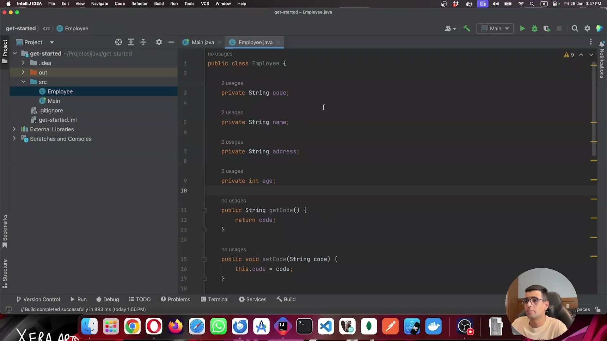
</p>

A imagem mostra o arquivo `Employee.java` aberto no IntelliJ IDEA. É a classe base da hierarquia que será construída ao longo da aula. Ela define quatro atributos privados — `code`, `name`, `address` e `age` — e apresenta o início dos métodos de acesso (`getCode` e `setCode`). Todos os atributos seguem a boa prática de encapsulamento com modificador `private`.

```java
public class Employee {

    private String code;

    private String name;

    private String address;

    private int age;

    public String getCode() {
        return code;
    }

    public void setCode(String code) {
        this.code = code;
    }
}
```

#### Classe `Manager` — Primeira Subclasse (sem herança ainda)

<p align="center">
  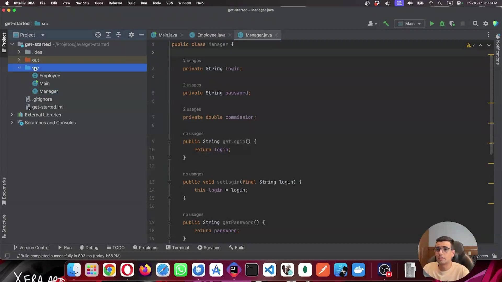
</p>

A imagem exibe o arquivo `Manager.java` ainda sem a palavra-chave `extends`. A classe define atributos próprios do gerente: `login`, `password` e `commission`. Os métodos `getLogin`, `setLogin` e `getPassword` são visíveis. Neste momento, a classe existe de forma isolada — o problema da duplicação de código (repetir `name`, `age`, etc.) ainda não foi resolvido.

```java
public class Manager {

    private String login;

    private String password;

    private double commission;

    public String getLogin() {
        return login;
    }

    public void setLogin(final String login) {
        this.login = login;
    }

    public String getPassword() {
        return password;
    }
}
```

#### Herança aplicada — `Employee` com `salary`, `Manager` e `Salesman` no projeto

<p align="center">
  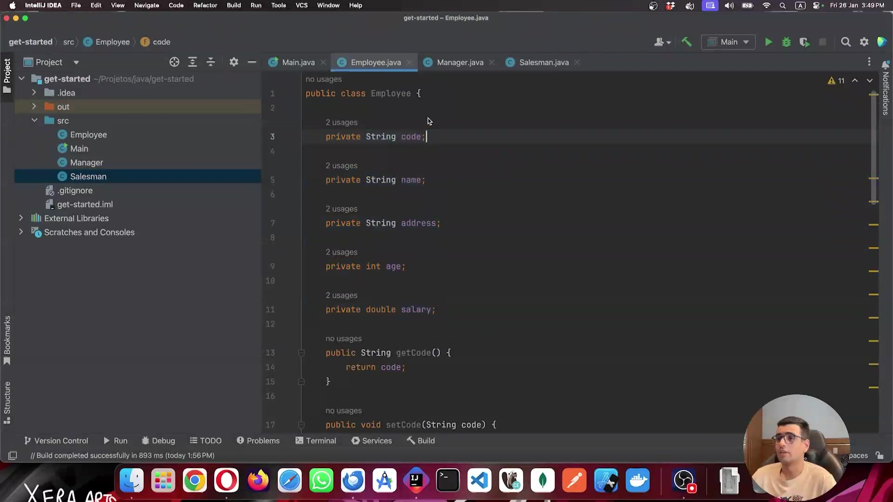
</p>

O painel lateral agora mostra três classes no pacote `src`: `Employee`, `Main` e `Manager`, além da nova classe `Salesman` sendo adicionada ao projeto. O arquivo `Employee.java` exibido no editor já inclui um quinto atributo, `salary`, que passou a fazer parte da superclasse. Isso demonstra que atributos comuns a todos os colaboradores devem residir na classe pai, evitando duplicação nas subclasses.

```java
public class Employee {

    private String code;

    private String name;

    private String address;

    private int age;

    private double salary;

    public String getCode() {
        return code;
    }

    public void setCode(String code) {
        this.code = code;
    }
}
```

#### Herança em uso — `Main.java` utilizando atributos herdados e próprios de `Manager`

<p align="center">
  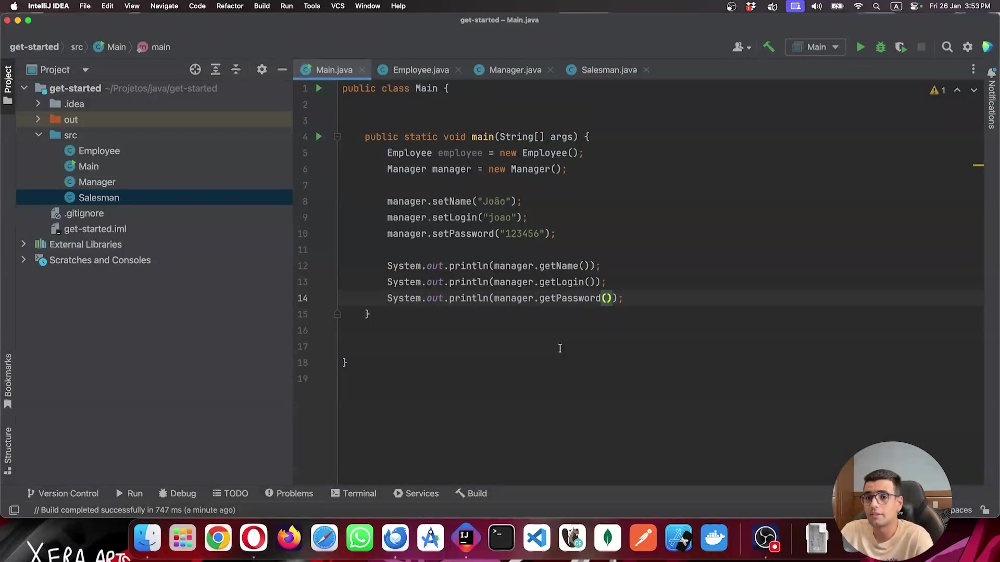
</p>

A imagem mostra o `Main.java` instanciando `Employee` e `Manager` diretamente, e em seguida utilizando métodos dos dois tipos. `manager.setName("João")` é chamado com sucesso mesmo `name` não estando declarado em `Manager` — ele vem de `Employee` via herança. Da mesma forma, `getLogin()` e `getPassword()` pertencem ao próprio `Manager`. As três chamadas a `System.out.println` confirmam que ambos os grupos de atributos estão acessíveis no mesmo objeto, que é o resultado prático da relação de herança estabelecida com `extends`.

```java
public class Main {

    public static void main(String[] args) {
        Employee employee = new Employee();
        Manager manager = new Manager();

        manager.setName("João");
        manager.setLogin("joao");
        manager.setPassword("123456");

        System.out.println(manager.getName());
        System.out.println(manager.getLogin());
        System.out.println(manager.getPassword());
    }
}
```

#### Classe abstrata — `Employee` deixa de poder ser instanciada

<p align="center">
  
</p>

A palavra-chave `abstract` foi adicionada à declaração de `Employee`. Com isso, a classe se torna abstrata: ela define a estrutura comum a todos os colaboradores, mas não pode ser instanciada diretamente com `new Employee()`. Essa restrição força o uso das subclasses concretas (`Manager`, `Salesman`), garantindo que apenas tipos específicos de colaborador existam em tempo de execução.

```java
public abstract class Employee {

    private String code;

    private String name;

    private String address;

    private int age;

    private double salary;

    public String getCode() {
        return code;
    }

    public void setCode(String code) {
        this.code = code;
    }
}
```

#### Erro de compilação — tentativa de instanciar classe abstrata

<p align="center">
  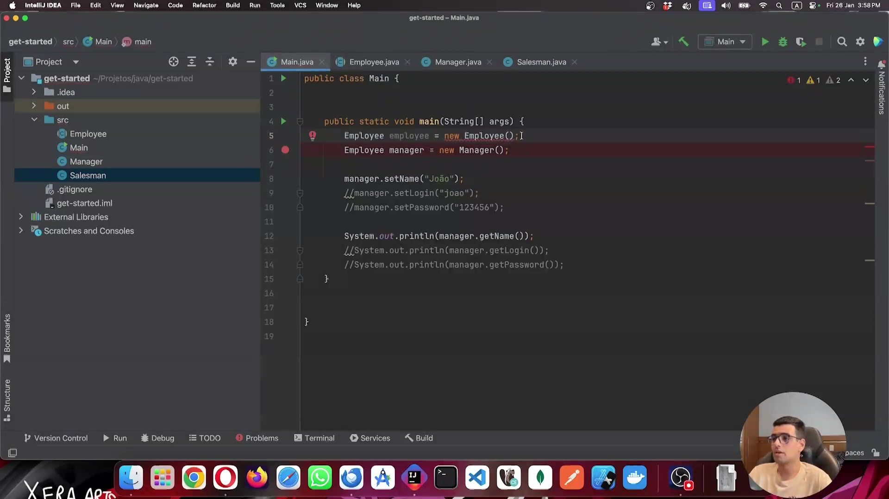
</p>

O `Main.java` exibe dois erros imediatamente após `Employee` ser declarada como abstrata. A linha 5 (`new Employee()`) é marcada com erro porque não é mais possível criar uma instância direta da classe abstrata. Já a linha 6 apresenta um erro diferente: `Employee manager = new Manager()` — o Java aponta incompatibilidade porque, neste momento, a variável do tipo `Employee` está recebendo um objeto do tipo `Manager`. Essa segunda situação introduz o conceito de polimorfismo, que será explorado na sequência.

```java
public class Main {

    public static void main(String[] args) {
        Employee employee = new Employee(); // ❌ Erro: Employee é abstrata
        Employee manager = new Manager();  // ❌ Erro indicado pelo IDE

        manager.setName("João");
        //manager.setLogin("joao");
        //manager.setPassword("123456");

        System.out.println(manager.getName());
        //System.out.println(manager.getLogin());
        //System.out.println(manager.getPassword());
    }
}
```

### 2. Polimorfismo: A Flexibilidade das Formas
O polimorfismo é a capacidade de um objeto ser referenciado de múltiplas formas dentro de uma hierarquia.
*   **Analogia da Maquininha de Cartão:** Uma máquina de cartão está preparada para receber um "Cartão". Não importa se o cartão específico é de "Crédito" ou "Débito"; a máquina trata ambos como o tipo genérico "Cartão" para iniciar a operação.
*   **Aplicação Prática:** É possível declarar uma variável do tipo `Employee` e instanciá-la como um `Manager`. Isso permite que o código trate diferentes subtipos de forma genérica, facilitando a manutenção.

#### Polimorfismo — variável do tipo `Employee` referenciando um `Manager`

<p align="center">
  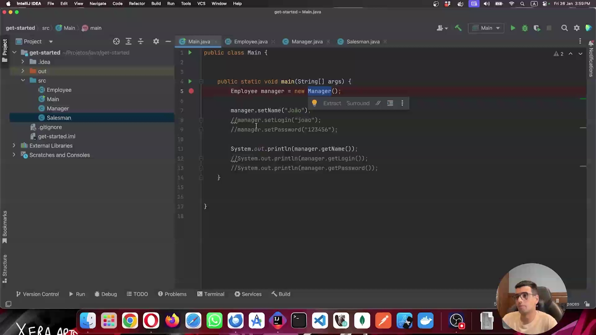
</p>

O IDE exibe o `Main.java` com a linha `Employee manager = new Manager()` marcada com erro e um tooltip de correção rápida. Isso ilustra um ponto central do polimorfismo: é possível declarar uma variável de um tipo mais genérico (`Employee`) e atribuir a ela um objeto de um tipo mais específico (`Manager`), desde que exista relação de herança entre eles. O erro visível aqui ocorre porque a linha acima (`new Employee()`) foi removida, mas a atribuição polimórfica em si é válida em Java. O menu de sugestão do IntelliJ confirma que o IDE reconhece a intenção e oferece opções de refatoração.

```java
public class Main {

    public static void main(String[] args) {
        Employee manager = new Manager(); // polimorfismo: tipo genérico, objeto específico

        manager.setName("João");
        //manager.setLogin("joao");
        //manager.setPassword("123456");

        System.out.println(manager.getName());
        //System.out.println(manager.getLogin());
        //System.out.println(manager.getPassword());
    }
}
```

#### Detalhamento

Em ambos os casos o **objeto criado é sempre um `Manager`**. O `new Manager()` é quem define o tipo real do objeto, independentemente do tipo da variável.

A diferença está apenas na **variável de referência**:

- Se fizéssemos `Manager manager = new Manager()` — variável do tipo `Manager`, apontaria para um objeto `Manager`. O compilador permitiria acessar tudo: membros de `Employee` e de `Manager`.

- `Employee manager = new Manager()` — variável do tipo `Employee`, ainda aponta para o **mesmo tipo de objeto**, um `Manager`. Mas o compilador só permite acessar os membros de `Employee` através dessa variável.

O objeto em si não está "errado" na segunda forma — ele continua sendo um `Manager` de verdade na memória. O que muda é a **lente** pela qual o compilador enxerga esse objeto: ao declarar a variável como `Employee`, você está dizendo ao compilador "trate isso aqui como um colaborador genérico", **PERDENDO ACESSO DIRETO** às especificidades do gerente como `getLogin()`.

**Isso é justamente o ponto do polimorfismo**: você pode ter uma variável genérica que em tempo de execução aponta para objetos de tipos diferentes (`Manager`, `Salesman`, etc.), e o código que usa essa variável não precisa saber qual é o tipo real.

#### Classe `Client` estendendo `Salesman` — herança fora do modelo de negócio

<p align="center">
  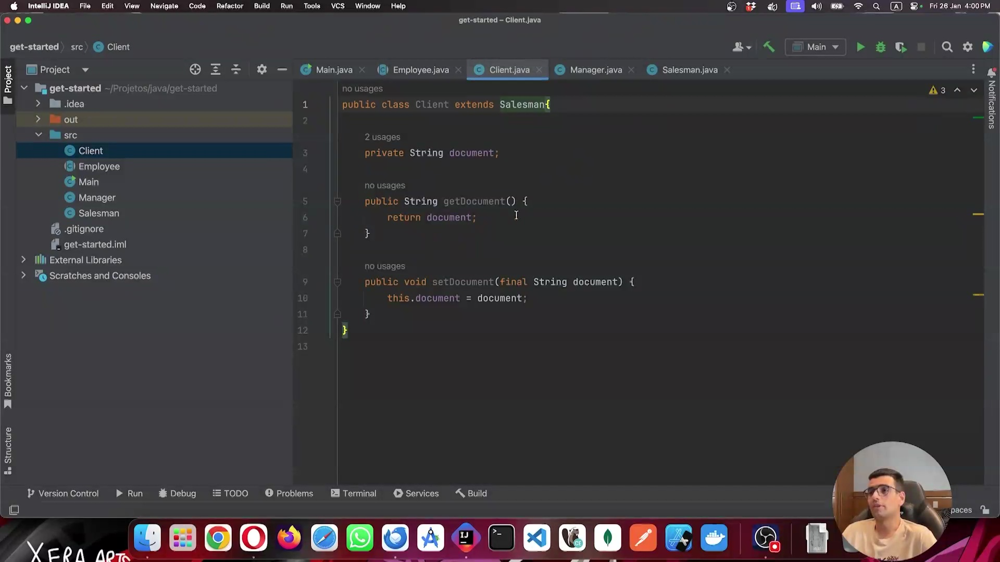
</p>

A imagem mostra o arquivo `Client.java` com a declaração `public class Client extends Salesman`. A classe `Client` possui apenas um atributo próprio (`document`) com getter e setter. O ponto de atenção aqui é semântico: embora o Java permita essa herança tecnicamente, ela não faz sentido no domínio do sistema — um cliente não é um vendedor. Essa situação exemplifica por que mecanismos de restrição de herança existem na linguagem.

```java
public class Client extends Salesman {

    private String document;

    public String getDocument() {
        return document;
    }

    public void setDocument(final String document) {
        this.document = document;
    }
}
```

#### Classe `Manager` marcada como `final` — impedindo extensão

<p align="center">
  
</p>

O arquivo `Manager.java` agora é declarado como `public final class Manager extends Employee`. A palavra-chave `final` sinaliza que esta classe é um nó terminal na hierarquia: nenhuma outra classe pode estendê-la. Isso é utilizado para proteger a integridade do modelo, impedindo que subclasses inesperadas sejam criadas a partir de `Manager`.

```java
public final class Manager extends Employee {

    private String login;

    private String password;

    private double commission;

    public String getLogin() {
        return login;
    }

    public void setLogin(final String login) {
        this.login = login;
    }

    public String getPassword() {
        return password;
    }
}
```

#### 3. Restrições de Herança: `final` e `sealed`
O Java oferece ferramentas para controlar quem pode herdar de quem, garantindo a integridade da regra de negócio:
*   **`final`:** Quando aplicada a uma classe, impede que qualquer outra classe herde dela. É o "fim da linha" na hierarquia.
*   **`sealed` (Classes Seladas):** Uma funcionalidade mais refinada que permite especificar exatamente quais classes têm permissão para herdar da superclasse (usando a cláusula `permits`). Isso evita que classes não relacionadas (como uma classe `Cliente`) tentem herdar comportamentos de `Colaborador`.

#### Erro ao herdar de classe `final` — `Client extends Salesman` bloqueado

<p align="center">
  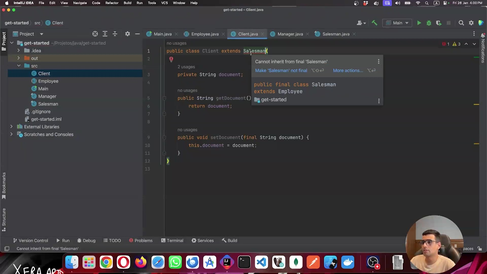
</p>

O IntelliJ exibe um tooltip de erro em `Client.java`: `"Cannot inherit from final 'Salesman'"`. Isso demonstra o efeito imediato de marcar `Salesman` como `final` — qualquer tentativa de criar uma subclasse dela resultará em erro de compilação. O IDE oferece a ação rápida `"Make 'Salesman' not final"`, mas o objetivo aqui é justamente manter a restrição para proteger a hierarquia.

```java
public class Client extends Salesman { // ❌ Cannot inherit from final 'Salesman'

    private String document;

    public String getDocument() {
        return document;
    }

    public void setDocument(final String document) {
        this.document = document;
    }
}
```

#### `Client` sem herança — classe isolada após remoção do `extends`

<p align="center">
  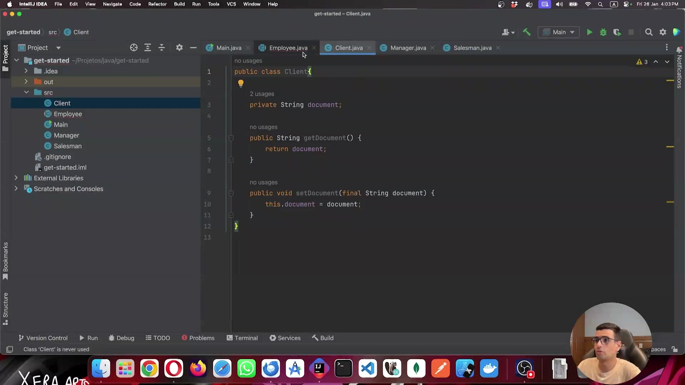
</p>

Após o exemplo de restrição com `final`, o `extends Salesman` foi removido de `Client`. A classe volta a ser simples e independente — `public class Client` — retendo apenas seu atributo `document` com getter e setter. A nota no rodapé do IDE (`"Class 'Client' is never used"`) confirma que ela existe no projeto mas não está sendo referenciada em nenhum ponto, o que é esperado neste contexto demonstrativo.

```java
public class Client {

    private String document;

    public String getDocument() {
        return document;
    }

    public void setDocument(final String document) {
        this.document = document;
    }
}
```

#### Classe `sealed` — controlando quais classes podem herdar de `Employee`

<p align="center">
  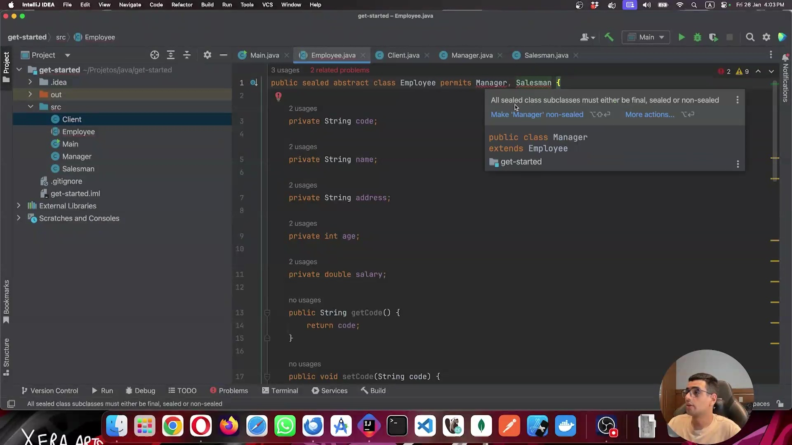
</p>

A imagem exibe `Employee.java` com a declaração `public sealed abstract class Employee permits Manager, Salesman`. O modificador `sealed` (introduzido no Java 17) permite ao desenvolvedor listar explicitamente quais classes têm permissão de estender a superclasse — no caso, apenas `Manager` e `Salesman`. O tooltip exibido alerta que as subclasses de uma classe `sealed` devem ser declaradas como `final`, `sealed` ou `non-sealed`, impondo uma regra estrutural ao restante da hierarquia.

```java
public sealed abstract class Employee permits Manager, Salesman {

    private String code;

    private String name;

    private String address;

    private int age;

    private double salary;

    public String getCode() {
        return code;
    }

    public void setCode(String code) {
        this.code = code;
    }
}
```

#### Classe `non-sealed` — `Manager` abrindo a hierarquia novamente

<p align="center">
  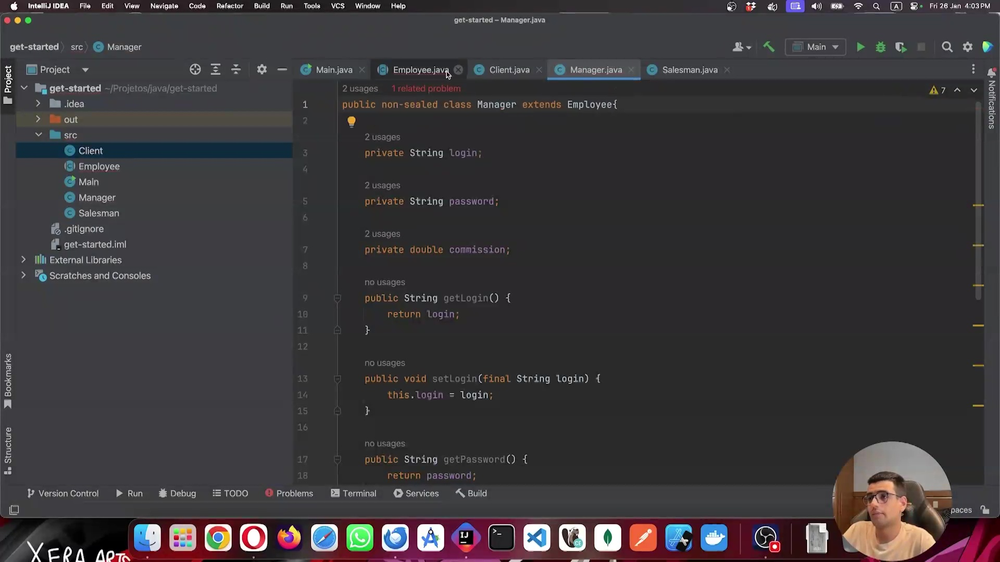
</p>

Para satisfazer a regra imposta pela classe `sealed`, `Manager` é declarada como `public non-sealed class Manager extends Employee`. O modificador `non-sealed` indica que, a partir de `Manager`, a hierarquia volta a ser aberta: qualquer outra classe pode estendê-la sem restrições. Essa é uma das três opções exigidas pelo Java quando uma superclasse `sealed` existe: a subclasse deve ser `final` (sem filhos), `sealed` (controlando seus próprios filhos) ou `non-sealed` (reabrindo a extensão livremente).

```java
public non-sealed class Manager extends Employee {

    private String login;

    private String password;

    private double commission;

    public String getLogin() {
        return login;
    }

    public void setLogin(final String login) {
        this.login = login;
    }

    public String getPassword() {
        return password;
    }
}
```


### 🟩 Vídeo 02 - Explorando Herança e Polimorfismo

<video width="60%" controls>
  <source src="000-Midia_e_Anexos/bootcamp_ntt_data_java_spring_ai-modulo.02-curso.02-video_02.webm" type="video/webm">
    Seu navegador não suporta vídeo HTML5.
</video>

link do vídeo: https://web.dio.me/track/ntt-data-2026-ai-java-back-end/course/heranca-e-polimorfismo-em-java/learning/1df116a3-f35a-4923-8dc5-669fd3d30de9?autoplay=1

### 🟩 Vídeo 03 - Reforçando instance of e sobrecarga de método

<video width="60%" controls>
  <source src="000-Midia_e_Anexos/bootcamp_ntt_data_java_spring_ai-modulo.02-curso.02-video_03.webm" type="video/webm">
    Seu navegador não suporta vídeo HTML5.
</video>

link do vídeo:

## Parte 2 - Exercícios: Herança e Polimorfismo em Java

### 🟩 Vídeo 04 - Exercícios

<video width="60%" controls>
  <source src="000-Midia_e_Anexos/bootcamp_ntt_data_java_spring_ai-modulo.02-curso.02-video_04.webm" type="video/webm">
    Seu navegador não suporta vídeo HTML5.
</video>

link do vídeo:

##  Materiais de Apoio

# Certificado: Herança e Polimorfismo em Java

- Link na plataforma: 
- Certificado em pdf: