## Instrutor

- José Luiz Abreu Cardoso Junior (Engenheiro de software sênior)
- Contato Linkedin: / [juniorjrjl](https://www.linkedin.com/in/juniorjrjl/)

## Parte 1 - Herança e Polimorfismo em Java

### 🟩 Vídeo 01 - Introdução a Herança e Polimorfismo

<video width="60%" controls>
  <source src="000-Midia_e_Anexos/bootcamp_ntt_data_java_spring_ai-modulo.02-curso.02-video_01.webm" type="video/webm">
    Seu navegador não suporta vídeo HTML5.
</video>

link do vídeo: https://web.dio.me/track/ntt-data-2026-ai-java-back-end/course/heranca-e-polimorfismo-em-java/learning/6a5ac493-307f-422f-a1fe-5ec59e442e03?autoplay=1

O vídeo aprofunda os conceitos fundamentais da Programação Orientada a Objetos (POO) aplicados à linguagem Java, focando em como estruturar hierarquias de classes eficientes, promover o reuso de código e controlar a extensibilidade do sistema.

### Anotações

### 1. O Conceito de Herança

A herança é apresentada através de uma analogia com o mundo real: assim como filhos herdam características genéticas dos pais (cor dos olhos, cabelo, predisposições), na programação, uma **subclasse** herda atributos e métodos de uma **superclasse**.
*   **Palavra-chave `extends`:** Utilizada para estabelecer a relação de herança.
*   **Reuso de Código:** Evita a duplicidade ao permitir que classes específicas (como `Manager` ou `Salesman`) aproveitem campos comuns definidos em uma classe base (`Employee`), como nome, idade e endereço 

#### Classe `Employee` — Definindo a Superclasse

<p align="center">
  
</p>

A imagem mostra o arquivo `Employee.java` aberto no IntelliJ IDEA. É a classe base da hierarquia que será construída ao longo da aula. Ela define quatro atributos privados — `code`, `name`, `address` e `age` — e apresenta o início dos métodos de acesso (`getCode` e `setCode`). Todos os atributos seguem a boa prática de encapsulamento com modificador `private`.

```java
public class Employee {

    private String code;

    private String name;

    private String address;

    private int age;

    public String getCode() {
        return code;
    }

    public void setCode(String code) {
        this.code = code;
    }
}
```

#### Classe `Manager` — Primeira Subclasse (sem herança ainda)

<p align="center">
  
</p>

A imagem exibe o arquivo `Manager.java` ainda sem a palavra-chave `extends`. A classe define atributos próprios do gerente: `login`, `password` e `commission`. Os métodos `getLogin`, `setLogin` e `getPassword` são visíveis. Neste momento, a classe existe de forma isolada — o problema da duplicação de código (repetir `name`, `age`, etc.) ainda não foi resolvido.

```java
public class Manager {

    private String login;

    private String password;

    private double commission;

    public String getLogin() {
        return login;
    }

    public void setLogin(final String login) {
        this.login = login;
    }

    public String getPassword() {
        return password;
    }
}
```

#### Herança aplicada — `Employee` com `salary`, `Manager` e `Salesman` no projeto

<p align="center">
  
</p>

O painel lateral agora mostra três classes no pacote `src`: `Employee`, `Main` e `Manager`, além da nova classe `Salesman` sendo adicionada ao projeto. O arquivo `Employee.java` exibido no editor já inclui um quinto atributo, `salary`, que passou a fazer parte da superclasse. Isso demonstra que atributos comuns a todos os colaboradores devem residir na classe pai, evitando duplicação nas subclasses.

```java
public class Employee {

    private String code;

    private String name;

    private String address;

    private int age;

    private double salary;

    public String getCode() {
        return code;
    }

    public void setCode(String code) {
        this.code = code;
    }
}
```

#### Herança em uso — `Main.java` utilizando atributos herdados e próprios de `Manager`

<p align="center">
  
</p>

A imagem mostra o `Main.java` instanciando `Employee` e `Manager` diretamente, e em seguida utilizando métodos dos dois tipos. `manager.setName("João")` é chamado com sucesso mesmo `name` não estando declarado em `Manager` — ele vem de `Employee` via herança. Da mesma forma, `getLogin()` e `getPassword()` pertencem ao próprio `Manager`. As três chamadas a `System.out.println` confirmam que ambos os grupos de atributos estão acessíveis no mesmo objeto, que é o resultado prático da relação de herança estabelecida com `extends`.

```java
public class Main {

    public static void main(String[] args) {
        Employee employee = new Employee();
        Manager manager = new Manager();

        manager.setName("João");
        manager.setLogin("joao");
        manager.setPassword("123456");

        System.out.println(manager.getName());
        System.out.println(manager.getLogin());
        System.out.println(manager.getPassword());
    }
}
```

#### Classe abstrata — `Employee` deixa de poder ser instanciada

<p align="center">
  
</p>

A palavra-chave `abstract` foi adicionada à declaração de `Employee`. Com isso, a classe se torna abstrata: ela define a estrutura comum a todos os colaboradores, mas não pode ser instanciada diretamente com `new Employee()`. Essa restrição força o uso das subclasses concretas (`Manager`, `Salesman`), garantindo que apenas tipos específicos de colaborador existam em tempo de execução.

```java
public abstract class Employee {

    private String code;

    private String name;

    private String address;

    private int age;

    private double salary;

    public String getCode() {
        return code;
    }

    public void setCode(String code) {
        this.code = code;
    }
}
```

#### Erro de compilação — tentativa de instanciar classe abstrata

<p align="center">
  
</p>

O `Main.java` exibe dois erros imediatamente após `Employee` ser declarada como abstrata. A linha 5 (`new Employee()`) é marcada com erro porque não é mais possível criar uma instância direta da classe abstrata. Já a linha 6 apresenta um erro diferente: `Employee manager = new Manager()` — o Java aponta incompatibilidade porque, neste momento, a variável do tipo `Employee` está recebendo um objeto do tipo `Manager`. Essa segunda situação introduz o conceito de polimorfismo, que será explorado na sequência.

```java
public class Main {

    public static void main(String[] args) {
        Employee employee = new Employee(); // ❌ Erro: Employee é abstrata
        Employee manager = new Manager();  // ❌ Erro indicado pelo IDE

        manager.setName("João");
        //manager.setLogin("joao");
        //manager.setPassword("123456");

        System.out.println(manager.getName());
        //System.out.println(manager.getLogin());
        //System.out.println(manager.getPassword());
    }
}
```

### 2. Polimorfismo: A Flexibilidade das Formas
O polimorfismo é a capacidade de um objeto ser referenciado de múltiplas formas dentro de uma hierarquia.
*   **Analogia da Maquininha de Cartão:** Uma máquina de cartão está preparada para receber um "Cartão". Não importa se o cartão específico é de "Crédito" ou "Débito"; a máquina trata ambos como o tipo genérico "Cartão" para iniciar a operação.
*   **Aplicação Prática:** É possível declarar uma variável do tipo `Employee` e instanciá-la como um `Manager`. Isso permite que o código trate diferentes subtipos de forma genérica, facilitando a manutenção.

#### Polimorfismo — variável do tipo `Employee` referenciando um `Manager`

<p align="center">
  
</p>

O IDE exibe o `Main.java` com a linha `Employee manager = new Manager()` marcada com erro e um tooltip de correção rápida. Isso ilustra um ponto central do polimorfismo: é possível declarar uma variável de um tipo mais genérico (`Employee`) e atribuir a ela um objeto de um tipo mais específico (`Manager`), desde que exista relação de herança entre eles. O erro visível aqui ocorre porque a linha acima (`new Employee()`) foi removida, mas a atribuição polimórfica em si é válida em Java. O menu de sugestão do IntelliJ confirma que o IDE reconhece a intenção e oferece opções de refatoração.

```java
public class Main {

    public static void main(String[] args) {
        Employee manager = new Manager(); // polimorfismo: tipo genérico, objeto específico

        manager.setName("João");
        //manager.setLogin("joao");
        //manager.setPassword("123456");

        System.out.println(manager.getName());
        //System.out.println(manager.getLogin());
        //System.out.println(manager.getPassword());
    }
}
```

#### Detalhamento

Em ambos os casos o **objeto criado é sempre um `Manager`**. O `new Manager()` é quem define o tipo real do objeto, independentemente do tipo da variável.

A diferença está apenas na **variável de referência**:

- Se fizéssemos `Manager manager = new Manager()` — variável do tipo `Manager`, apontaria para um objeto `Manager`. O compilador permitiria acessar tudo: membros de `Employee` e de `Manager`.

- `Employee manager = new Manager()` — variável do tipo `Employee`, ainda aponta para o **mesmo tipo de objeto**, um `Manager`. Mas o compilador só permite acessar os membros de `Employee` através dessa variável.

O objeto em si não está "errado" na segunda forma — ele continua sendo um `Manager` de verdade na memória. O que muda é a **lente** pela qual o compilador enxerga esse objeto: ao declarar a variável como `Employee`, você está dizendo ao compilador "trate isso aqui como um colaborador genérico", **PERDENDO ACESSO DIRETO** às especificidades do gerente como `getLogin()`.

**Isso é justamente o ponto do polimorfismo**: você pode ter uma variável genérica que em tempo de execução aponta para objetos de tipos diferentes (`Manager`, `Salesman`, etc.), e o código que usa essa variável não precisa saber qual é o tipo real.

#### Classe `Client` estendendo `Salesman` — herança fora do modelo de negócio

<p align="center">
  
</p>

A imagem mostra o arquivo `Client.java` com a declaração `public class Client extends Salesman`. A classe `Client` possui apenas um atributo próprio (`document`) com getter e setter. O ponto de atenção aqui é semântico: embora o Java permita essa herança tecnicamente, ela não faz sentido no domínio do sistema — um cliente não é um vendedor. Essa situação exemplifica por que mecanismos de restrição de herança existem na linguagem.

```java
public class Client extends Salesman {

    private String document;

    public String getDocument() {
        return document;
    }

    public void setDocument(final String document) {
        this.document = document;
    }
}
```

### 3. Restrições de Herança: `final` e `sealed`
O Java oferece ferramentas para controlar quem pode herdar de quem, garantindo a integridade da regra de negócio:
*   **`final`:** Quando aplicada a uma classe, impede que qualquer outra classe herde dela. É o "fim da linha" na hierarquia.
*   **`sealed` (Classes Seladas):** Uma funcionalidade mais refinada que permite especificar exatamente quais classes têm permissão para herdar da superclasse (usando a cláusula `permits`). Isso evita que classes não relacionadas (como uma classe `Cliente`) tentem herdar comportamentos de `Colaborador`.

#### Classe `Manager` marcada como `final` — impedindo extensão

<p align="center">
  
</p>

O arquivo `Manager.java` agora é declarado como `public final class Manager extends Employee`. A palavra-chave `final` sinaliza que esta classe é um nó terminal na hierarquia: nenhuma outra classe pode estendê-la. Isso é utilizado para proteger a integridade do modelo, impedindo que subclasses inesperadas sejam criadas a partir de `Manager`.

```java
public final class Manager extends Employee {

    private String login;

    private String password;

    private double commission;

    public String getLogin() {
        return login;
    }

    public void setLogin(final String login) {
        this.login = login;
    }

    public String getPassword() {
        return password;
    }
}
```

#### Erro ao herdar de classe `final` — `Client extends Salesman` bloqueado

<p align="center">
  
</p>

O IntelliJ exibe um tooltip de erro em `Client.java`: `"Cannot inherit from final 'Salesman'"`. Isso demonstra o efeito imediato de marcar `Salesman` como `final` — qualquer tentativa de criar uma subclasse dela resultará em erro de compilação. O IDE oferece a ação rápida `"Make 'Salesman' not final"`, mas o objetivo aqui é justamente manter a restrição para proteger a hierarquia.

```java
public class Client extends Salesman { // ❌ Cannot inherit from final 'Salesman'

    private String document;

    public String getDocument() {
        return document;
    }

    public void setDocument(final String document) {
        this.document = document;
    }
}
```

#### `Client` sem herança — classe isolada após remoção do `extends`

<p align="center">
  
</p>

Após o exemplo de restrição com `final`, o `extends Salesman` foi removido de `Client`. A classe volta a ser simples e independente — `public class Client` — retendo apenas seu atributo `document` com getter e setter. A nota no rodapé do IDE (`"Class 'Client' is never used"`) confirma que ela existe no projeto mas não está sendo referenciada em nenhum ponto, o que é esperado neste contexto demonstrativo.

```java
public class Client {

    private String document;

    public String getDocument() {
        return document;
    }

    public void setDocument(final String document) {
        this.document = document;
    }
}
```

#### Classe `sealed` — controlando quais classes podem herdar de `Employee`

<p align="center">
  
</p>

A imagem exibe `Employee.java` com a declaração `public sealed abstract class Employee permits Manager, Salesman`. O modificador `sealed` (introduzido no Java 17) permite ao desenvolvedor listar explicitamente quais classes têm permissão de estender a superclasse — no caso, apenas `Manager` e `Salesman`. O tooltip exibido alerta que as subclasses de uma classe `sealed` devem ser declaradas como `final`, `sealed` ou `non-sealed`, impondo uma regra estrutural ao restante da hierarquia.

```java
public sealed abstract class Employee permits Manager, Salesman {

    private String code;

    private String name;

    private String address;

    private int age;

    private double salary;

    public String getCode() {
        return code;
    }

    public void setCode(String code) {
        this.code = code;
    }
}
```

#### Classe `non-sealed` — `Manager` abrindo a hierarquia novamente

<p align="center">
  
</p>

Para satisfazer a regra imposta pela classe `sealed`, `Manager` é declarada como `public non-sealed class Manager extends Employee`. O modificador `non-sealed` indica que, a partir de `Manager`, a hierarquia volta a ser aberta: qualquer outra classe pode estendê-la sem restrições. Essa é uma das três opções exigidas pelo Java quando uma superclasse `sealed` existe: a subclasse deve ser `final` (sem filhos), `sealed` (controlando seus próprios filhos) ou `non-sealed` (reabrindo a extensão livremente).

```java
public non-sealed class Manager extends Employee {

    private String login;

    private String password;

    private double commission;

    public String getLogin() {
        return login;
    }

    public void setLogin(final String login) {
        this.login = login;
    }

    public String getPassword() {
        return password;
    }
}
```

### 🟩 Vídeo 02 - Explorando Herança e Polimorfismo

<video width="60%" controls>
  <source src="000-Midia_e_Anexos/bootcamp_ntt_data_java_spring_ai-modulo.02-curso.02-video_02.webm" type="video/webm">
    Seu navegador não suporta vídeo HTML5.
</video>

link do vídeo: https://web.dio.me/track/ntt-data-2026-ai-java-back-end/course/heranca-e-polimorfismo-em-java/learning/1df116a3-f35a-4923-8dc5-669fd3d30de9?autoplay=1

O vídeo explora os conceitos fundamentais e as funcionalidades modernas do Java (versões 17 e 21) relacionadas à herança, polimorfismo e estruturação de classes. O foco principal é como manipular diferentes tipos de objetos de forma segura e eficiente dentro de uma hierarquia de classes.

### Anotações

### 1. Polimorfismo e o Desafio do Casting
Ao instanciar uma subclasse (ex: `Manager`) usando uma referência da superclasse (ex: `Employee`), o Java limita o acesso apenas aos métodos e propriedades definidos na superclasse.
*   **Casting Manual:** Para acessar membros específicos da subclasse, é necessário realizar o *casting*.
*   **Risco:** Realizar casting sem verificação pode causar a exceção `ClassCastException`.

#### Polimorfismo por referência — instanciando Manager via Employee

<p align="center">
  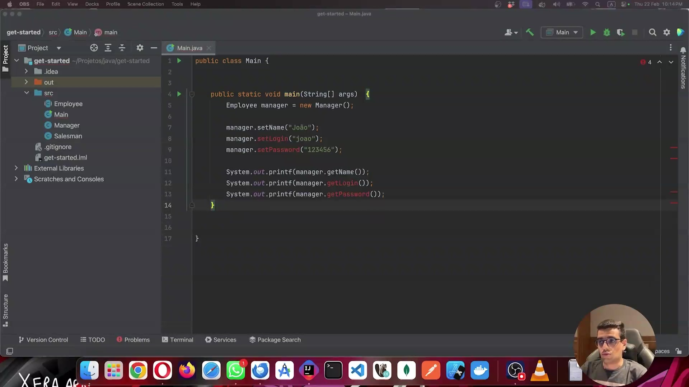
</p>

O arquivo `Main.java` mostra o ponto de partida da aula. Uma variável do tipo `Employee` é declarada e recebe uma instância de `Manager` — uma forma válida de polimorfismo em Java, pois `Manager` herda de `Employee`. Em seguida, o código usa `setName`, `setLogin` e `setPassword` via cast implícito, e imprime os valores com `getName`, `getLogin` e `getPassword`. O problema explorado aqui é que, ao declarar a variável como `Employee`, o compilador só enxerga os membros definidos em `Employee` — os métodos exclusivos de `Manager` (como `setLogin` e `setPassword`) não existem nessa referência, causando erro de compilação. Tentar acessá-los exige primeiro verificar o tipo real do objeto em tempo de execução; um cast cego sem essa verificação resulta em `ClassCastException`, conforme demonstrado nas imagens seguintes.

```java
public class Main {

    public static void main(String[] args) {
        Employee manager = new Manager();

        manager.setName("João");
        manager.setLogin("joao");
        manager.setPassword("123456");

        System.out.printf(manager.getName());
        System.out.printf(manager.getLogin());
        System.out.printf(manager.getPassword());
    }
}
```

#### Estrutura da classe Manager — atributos e métodos específicos

<p align="center">
  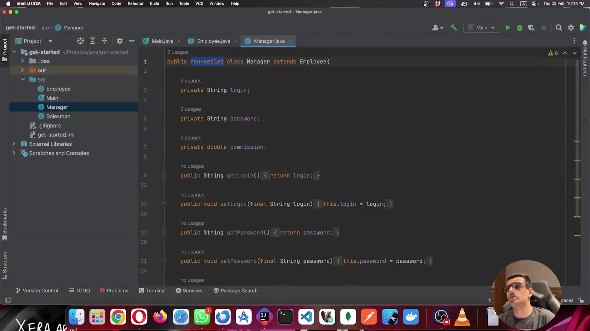
</p>

A classe `Manager.java` está marcada como `non-sealed`, sinalizando que ela pode ser herdada por outras classes (exigência da cadeia `sealed` iniciada em `Employee`). Além dos campos herdados de `Employee`, o `Manager` declara três atributos próprios: `login`, `password` e `commission`. Os métodos `getLogin`, `setLogin`, `getPassword` e `setPassword` são exibidos em sua forma compacta (inline), característicos de getters/setters gerados pelo IntelliJ.

```java
public non-sealed class Manager extends Employee {

    private String login;

    private String password;

    private double commission;

    public String getLogin() { return login; }

    public void setLogin(final String login) { this.login = login; }

    public String getPassword() { return password; }

    public void setPassword(final String password) { this.password = password; }
}
```

#### ClassCastException — problema ao converter Salesman para Manager

<p align="center">
  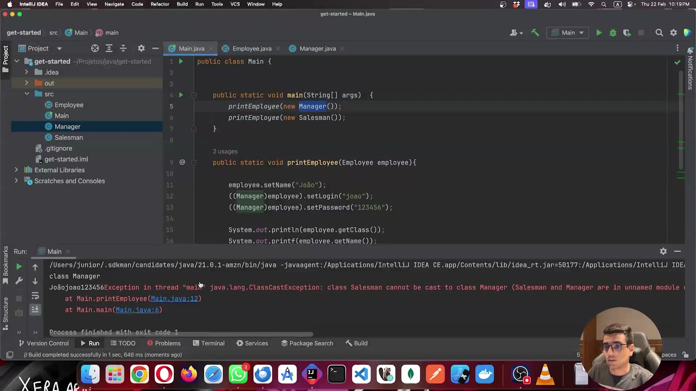
</p>

O método `printEmployee(Employee employee)` é chamado duas vezes: uma com `new Manager()` e outra com `new Salesman()`. Dentro do método, há um cast direto para `Manager` sem qualquer verificação de tipo, o que funciona para a primeira chamada, mas lança uma `ClassCastException` em tempo de execução na segunda. O console exibe claramente o erro: `class Salesman cannot be cast to class Manager`. `Manager` e `Salesman` estão na mesma cadeia de herança (ambos estendem `Employee`), mas são tipos irmãos — não há conversão direta entre eles.

```java
public static void main(String[] args) {
    printEmployee(new Manager());
    printEmployee(new Salesman());
}

public static void printEmployee(Employee employee) {
    employee.setName("João");
    ((Manager) employee).setLogin("joao");
    ((Manager) employee).setPassword("123456");

    System.out.println(employee.getClass());
    System.out.printf(employee.getName());
    // Lança ClassCastException quando employee é Salesman
}
```

> **Saída no console:**
> `class Manager`  
> `JoãojoaoException in thread "main" java.lang.ClassCastException: class Salesman cannot be cast to class Manager`

### 2. Evolução da Verificação de Tipos: `instanceof`
O Java evoluiu a forma como verificamos e convertemos tipos:
*   **Abordagem Clássica:** `if (obj instanceof Manager) { Manager m = (Manager) obj; ... }`
*   **Pattern Matching (Java 16+):** Permite verificar o tipo e criar uma variável local já convertida em uma única linha: `if (obj instanceof Manager manager) { ... }`.

#### Resolvendo o cast com instanceof — verificação de tipo antes da conversão

<p align="center">
  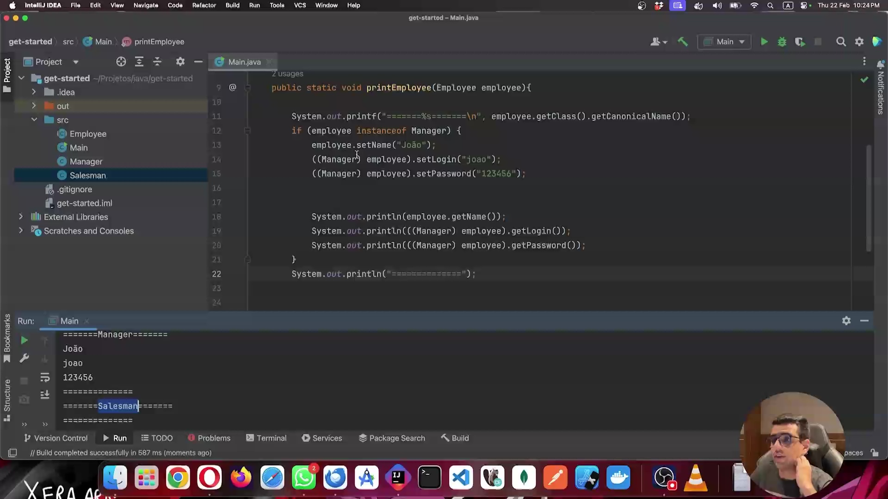
</p>

A solução imediata para o `ClassCastException` é envolver o cast em um bloco `if (employee instanceof Manager)`. Dessa forma, o cast `((Manager) employee)` só é executado quando a verificação confirma que o objeto é realmente uma instância de `Manager`. O console demonstra que agora o bloco do Manager é processado corretamente (imprimindo João, joao e 123456), enquanto o Salesman percorre o método sem erros — apenas sem exibir seus dados específicos, pois ainda não há bloco para ele.

```java
public static void printEmployee(Employee employee) {

    System.out.printf("=======%s=======\n", employee.getClass().getCanonicalName());

    if (employee instanceof Manager) {
        employee.setName("João");
        ((Manager) employee).setLogin("joao");
        ((Manager) employee).setPassword("123456");

        System.out.println(employee.getName());
        System.out.println(((Manager) employee).getLogin());
        System.out.println(((Manager) employee).getPassword());
    }

    System.out.println("==============");
}
```

> **Saída no console:**
> ```
> =======Manager=======
> João
> joao
> 123456
> ==============
> =======Salesman=======
> ==============
> ```

### 3. `Switch` com Pattern Matching e Classes Seladas
Uma das maiores inovações das versões recentes do Java é o uso do `switch` para verificar tipos:
*   **Sintaxe Moderna:** O `switch` pode agora receber um objeto e executar blocos baseados na sua instância específica.
*   **Vantagem das Sealed Classes:** Se a classe pai for `sealed` (selada), o compilador sabe exatamente quais são as subclasses possíveis. Isso elimina a necessidade de uma cláusula `default` no `switch`, tornando o código mais seguro e exaustivo.

#### Pattern Matching para instanceof — sintaxe moderna do Java 17

<p align="center">
  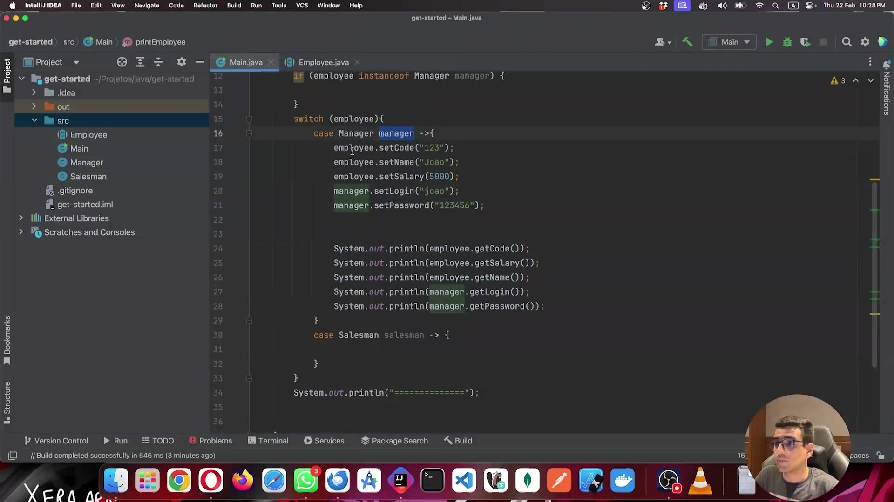
</p>

A imagem exibe a versão modernizada com **Pattern Matching para `instanceof`**, disponível a partir do Java 16/17 (LTS). Em vez de verificar e depois fazer cast manualmente em linhas separadas, é possível declarar a variável tipada diretamente na expressão `instanceof`. O código também introduz o `switch(employee)` com `case Manager manager ->`, que combina a verificação de tipo com a criação da variável em uma única construção.

```java
// Forma clássica (Java < 16)
if (employee instanceof Manager) {
    ((Manager) employee).setLogin("joao");
}

// Pattern Matching — Java 16+ (disponível em LTS a partir do Java 17)
if (employee instanceof Manager manager) {
    manager.setLogin("joao");
}

// switch com Pattern Matching
switch (employee) {
    case Manager manager -> {
        // variável 'manager' já disponível e tipada
    }
    case Salesman salesman -> {
        // variável 'salesman' já disponível e tipada
    }
}
```

#### switch com Pattern Matching — bloco do Manager com atributos

<p align="center">
  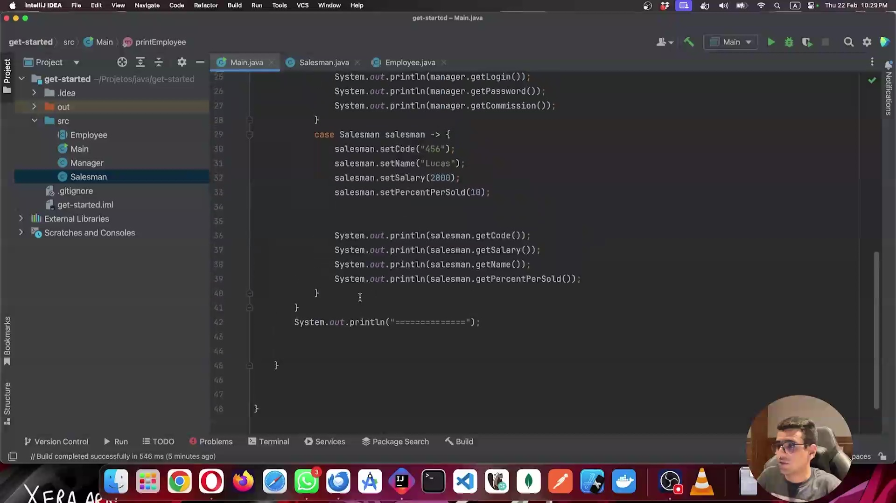
</p>

O bloco `case Manager manager` dentro do `switch` é preenchido com as atribuições de valores ao gerente. Dentro desse bloco, `employee` (referência do tipo pai) e `manager` (referência tipada do filho) coexistem — métodos comuns como `setCode`, `setName` e `setSalary` são chamados via `manager`, enquanto os específicos `setLogin` e `setPassword` também usam `manager`. O bloco `case Salesman salesman` ainda está vazio neste momento.

```java
public static void printEmployee(Employee employee) {

    System.out.printf("=======%s=======\n", employee.getClass().getCanonicalName());

    switch (employee) {
        case Manager manager -> {
            manager.setCode("123");
            manager.setName("João");
            manager.setSalary(5000);
            manager.setLogin("joao");
            manager.setPassword("123456");

            System.out.println(manager.getCode());
            System.out.println(manager.getSalary());
            System.out.println(manager.getName());
            System.out.println(manager.getLogin());
            System.out.println(manager.getPassword());
        }
        case Salesman salesman -> {

        }
    }

    System.out.println("==============");
}
```

#### switch completo — bloco do Salesman e saída no console

<p align="center">
  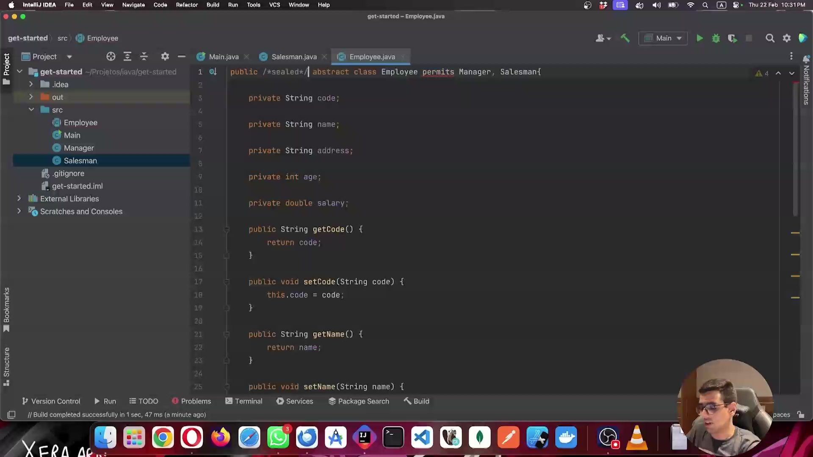
</p>

O bloco `case Salesman salesman` é preenchido com os dados de Lucas: código 456, salário 2800, nome e percentual de vendas de 10%. O console confirma a execução correta do switch para ambos os tipos: o Salesman exibe código, salário, nome e percentual corretamente. Neste momento a classe `Employee` ainda é `sealed`, o que permite ao compilador verificar exaustividade do `switch` sem necessidade de `default`.

```java
case Salesman salesman -> {
    salesman.setCode("456");
    salesman.setName("Lucas");
    salesman.setSalary(2800);
    salesman.setPercentPerSold(10);

    System.out.println(salesman.getCode());
    System.out.println(salesman.getSalary());
    System.out.println(salesman.getName());
    System.out.println(salesman.getPercentPerSold());
}
```

> **Saída no console:**
> ```
> SL456
> 2800.0
> Lucas
> 10.0
> ==============
> ```

#### Classe Salesman — atributos e métodos próprios

<p align="center">
  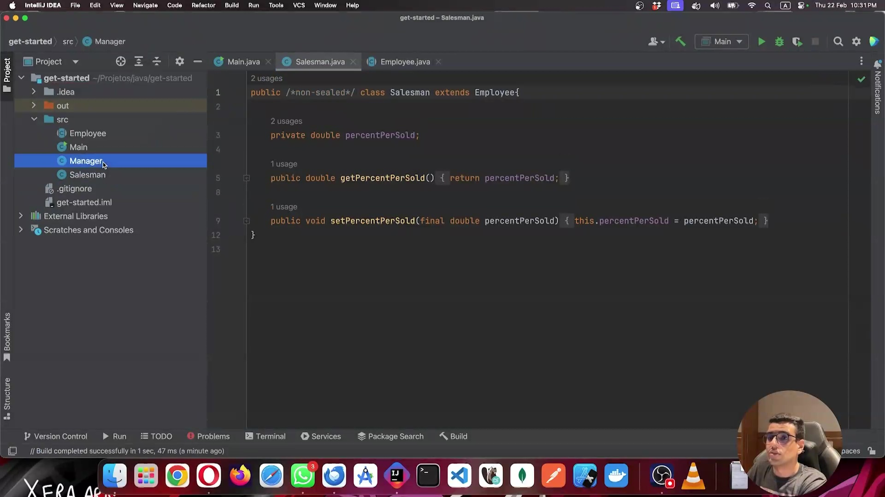
</p>

A classe `Salesman.java` (marcada como `non-sealed`) estende `Employee` e adiciona o atributo `percentPerSold`, que representa o percentual de comissão sobre vendas. Os métodos `getPercentPerSold` e `setPercentPerSold` são exibidos de forma compacta (inline). Neste momento a classe ainda não possui construtor explícito nem o atributo `soldAmount`, que serão acrescentados nos passos seguintes.

```java
public /*non-sealed*/ class Salesman extends Employee {

    private double percentPerSold;

    public double getPercentPerSold() { return percentPerSold; }

    public void setPercentPerSold(final double percentPerSold) { this.percentPerSold = percentPerSold; }
}
```

#### Classe Manager revisitada — corpo expandido dos métodos

<p align="center">
  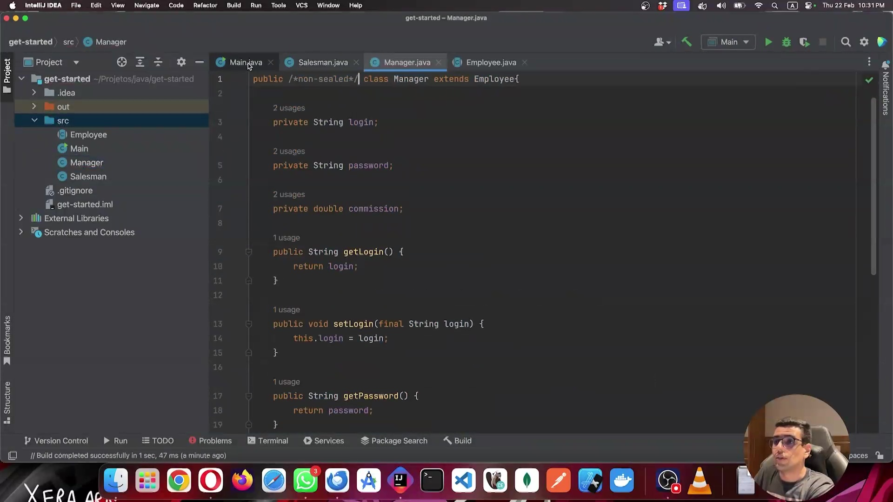
</p>

A classe `Manager.java` é revisitada agora com os corpos dos métodos exibidos em formato expandido (sem a forma inline compacta). Os atributos `login`, `password` e `commission` permanecem `private`. Os métodos `getLogin`, `setLogin` e `getPassword` são mostrados com seus corpos completos, facilitando a leitura e compreensão da estrutura.

```java
public /*non-sealed*/ class Manager extends Employee {

    private String login;

    private String password;

    private double commission;

    public String getLogin() {
        return login;
    }

    public void setLogin(final String login) {
        this.login = login;
    }

    public String getPassword() {
        return password;
    }
}
```

### 4. Construtores e a Palavra-Chave `super`

Na herança, a inicialização segue uma ordem hierárquica:
*   **Chamada Obrigatória:** Se a classe pai define um construtor com argumentos, as subclasses devem obrigatoriamente chamar esse construtor usando `super(...)`.
*   **Reuso:** O `super` permite reaproveitar a lógica de inicialização da classe base antes de adicionar comportamentos específicos da subclasse.

#### Construtor de Manager — uso da keyword super

<p align="center">
  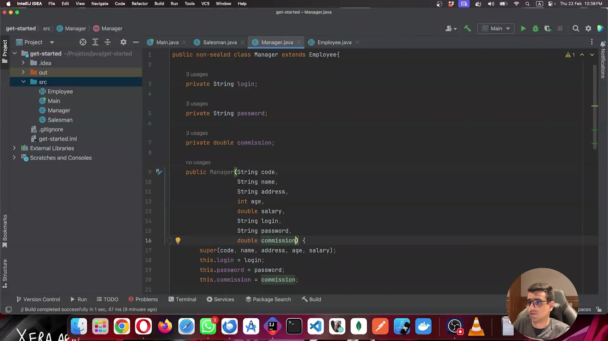
</p>

Um construtor completo é adicionado a `Manager`. Ele recebe todos os parâmetros necessários — tanto os herdados de `Employee` quanto os próprios. A palavra-chave `super(...)` é usada para invocar o construtor da classe pai, repassando `code`, `name`, `address`, `age` e `salary`. Os atributos específicos (`login`, `password`, `commission`) são inicializados diretamente com `this`. Quando uma classe pai define um construtor com argumentos, todas as subclasses são obrigadas a chamar `super(...)` explicitamente.

```java
public Manager(String code,
               String name,
               String address,
               int age,
               double salary,
               String login,
               String password,
               double commission) {
    super(code, name, address, age, salary);
    this.login = login;
    this.password = password;
    this.commission = commission;
}
```

### 5. Sobrescrita (`Override`) vs. Sobrecarga (`Overload`)
*   **Sobrescrita (@Override):** Altera o comportamento de um método herdado da classe pai. É possível usar `super.metodo()` para estender a lógica original em vez de apenas substituí-la.
*   **Sobrecarga:** Define múltiplos métodos com o mesmo nome, mas com assinaturas (parâmetros) diferentes, dentro da mesma classe ou na hierarquia.

#### Override de getCode() no Manager — prefixo "MN" com super.getCode()

<p align="center">
  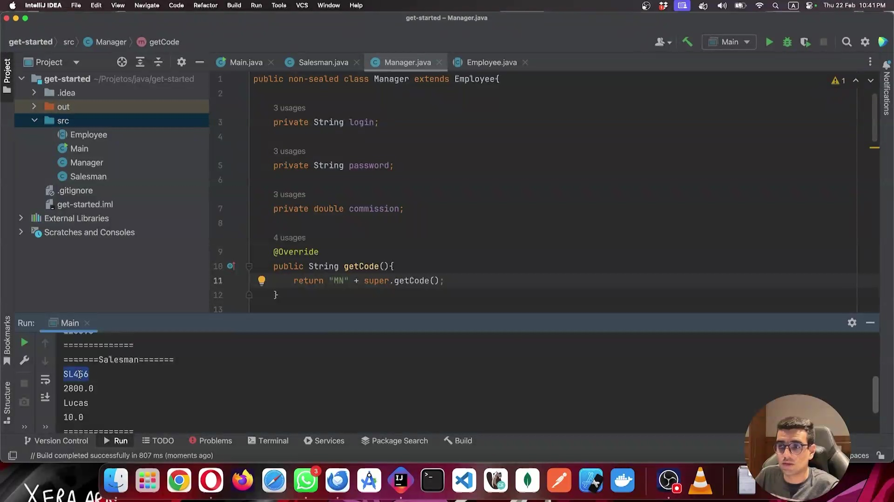
</p>

A **sobrescrita** (`@Override`) do método `getCode()` é implementada em `Manager`. Em vez de retornar apenas o código bruto, o método concatena o prefixo `"MN"` com o resultado de `super.getCode()`, reaproveitando o comportamento da classe pai. O console confirma: o código do Manager é exibido como `MN123` e o do Salesman como `SL456`. Isso demonstra que `super.método()` permite combinar a lógica da classe pai com comportamento adicional na subclasse.

```java
@Override
public String getCode() {
    return "MN" + super.getCode();
}
```

> **Saída no console (parcial):**
> ```
> SL456
> 2800.0
> Lucas
> 10.0
> ```

#### Modificador protected — atributos acessíveis na hierarquia

<p align="center">
  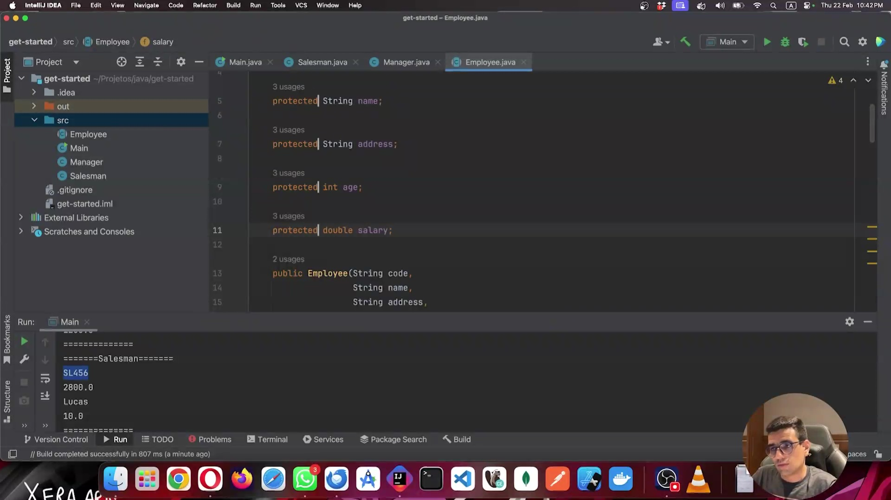
</p>

Os atributos de `Employee.java` são alterados de `private` para `protected`. Com `protected`, um atributo permanece inacessível a código externo genérico, mas pode ser acessado diretamente por classes que herdam de `Employee` — sem necessidade de getters/setters. A imagem também exibe o início do construtor de `Employee`, mostrando os parâmetros `code`, `name`, `address`. Essa alteração é necessária para que, por exemplo, `Manager.getCode()` possa referenciar `this.code` diretamente.

```java
public /*sealed*/ abstract class Employee permits Manager, Salesman {

    protected String code;  // antes: private

    protected String name;

    protected String address;

    protected int age;

    protected double salary;

    public Employee(String code,
                    String name,
                    String address,
                    ...
```

#### Erro ao acessar this.code em Manager fora do mesmo pacote

<p align="center">
  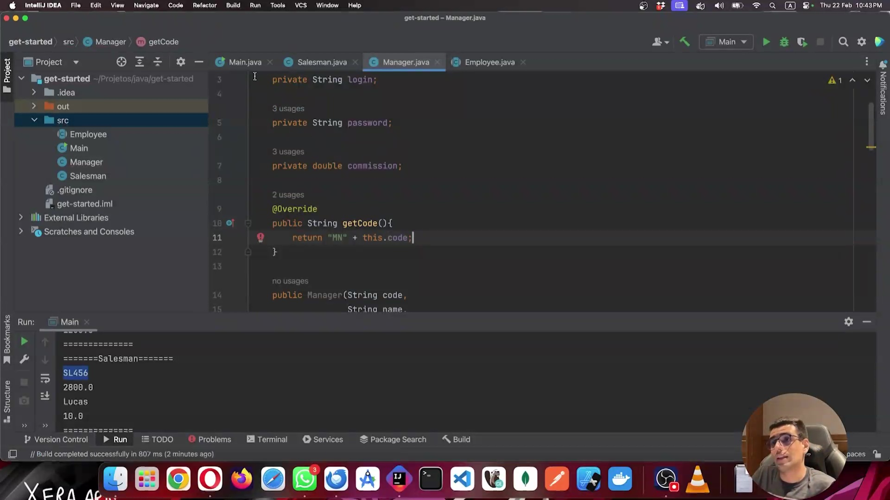
</p>

Em `Manager.java`, o `@Override` de `getCode()` tenta usar `this.code` (em vez de `super.getCode()`). O marcador de erro vermelho na linha 11 indica que o acesso não é permitido — apesar de `code` ser `protected` em `Employee`, há uma restrição: `protected` garante acesso dentro do mesmo **pacote** ou via herança, mas não quando as classes estão em pacotes diferentes sem relação de herança direta visível. A solução exibida nas imagens seguintes será mover as classes para um pacote comum (`domain`).

```java
@Override
public String getCode() {
    return "MN" + this.code;  // ❌ Erro: 'code' tem acesso protected em 'Employee'
}
```

#### Erro de acesso protected após mover para o pacote domain

<p align="center">
  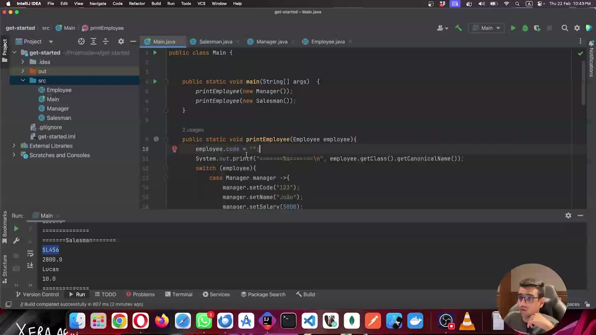
</p>

Após mover `Employee`, `Manager` e `Salesman` para o pacote `domain`, o `Main.java` (que permanece no pacote raiz) tenta acessar `employee.code` diretamente. O IntelliJ exibe um popup de erro: `'code' has protected access in 'domain.Employee'`. Isso ilustra a segunda regra do modificador `protected`: ele **não** permite acesso de fora do pacote onde o atributo foi declarado, a menos que a classe acesse via herança interna ao pacote. A sugestão do IDE é usar o setter (`Replace with setter`).

> **Regras do modificador `protected`:**
> - ✅ Acessível dentro do mesmo pacote
> - ✅ Acessível via herança (subclasse no mesmo pacote)
> - ❌ Não acessível de fora do pacote por classes não relacionadas

#### switch com Pattern Matching e aviso de acesso protegido

<p align="center">
  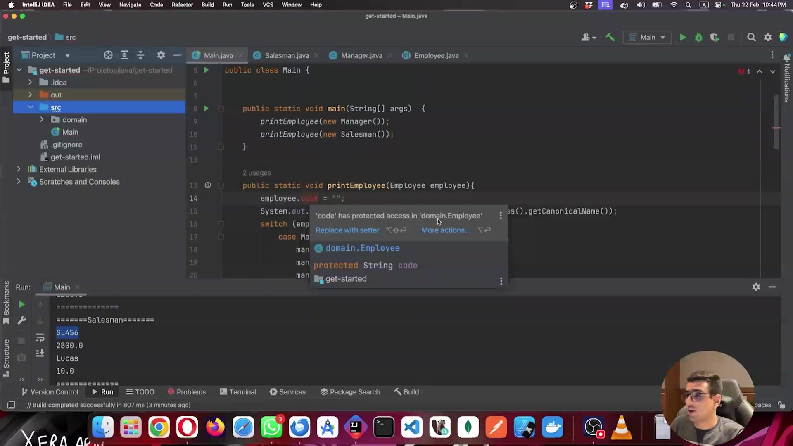
</p>

O `Main.java` revisado mostra que a tentativa de acessar `employee.code` diretamente (linha 10) ainda gera erro — confirmando o comportamento `protected` fora do pacote. O `switch (employee)` com `case Manager manager ->` está estruturado corretamente. O restante do bloco usa setters normais (`manager.setCode`, `manager.setName`, `manager.setSalary`) para contornar a restrição de acesso direto.

```java
public static void printEmployee(Employee employee) {
    // employee.code = "";  // ❌ Acesso protegido fora do pacote domain
    System.out.printf("=======%s=======\n", employee.getClass().getCanonicalName());
    switch (employee) {
        case Manager manager -> {
            manager.setCode("123");
            manager.setName("João");
            manager.setSalary(5000);
            // ...
        }
    }
}
```

### 6. Métodos e Classes Abstratas

*   **Classes Abstratas:** Funcionam como moldes e não podem ser instanciadas diretamente.
*   **Métodos Abstratos:** Definem um "contrato". A classe pai declara o método sem implementação, obrigando todas as subclasses não abstratas a fornecerem sua própria lógica (ex: cálculo de salário total).

#### Método getFullSalary abstrato e sobrecarga com parâmetro extra

<p align="center">
  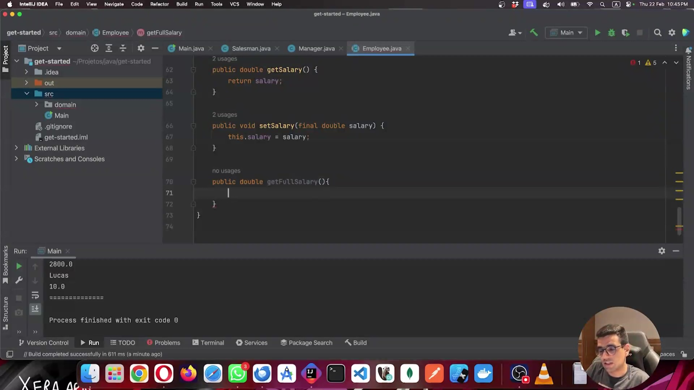
</p>

`Employee.java` recebe dois novos métodos. O primeiro é `getFullSalary()` declarado como `abstract` — isso força todas as subclasses concretas a fornecerem uma implementação, sob pena de erro de compilação. O segundo é uma sobrecarga: `getFullSalary(double extra)`, que chama internamente `this.getFullSalary()` (o abstrato, portanto polimórfico) e soma o valor extra. A sobrecarga não é abstrata — ela tem implementação e pode ser chamada diretamente na referência `Employee`.

```java
// Método abstrato — obriga subclasses a implementar
public abstract double getFullSalary();

// Sobrecarga concreta — reutiliza o método abstrato + adiciona bônus
public double getFullSalary(double extra) {
    return this.getFullSalary() + extra;
}
```

#### Construtor de Salesman — parâmetros incluindo soldAmount

<p align="center">
  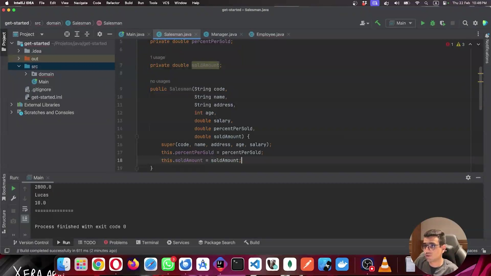
</p>

`Salesman.java` ganha um construtor completo. Além dos parâmetros herdados (`code`, `name`, `address`, `age`, `salary`), ele recebe `percentPerSold` e o novo atributo `soldAmount` (valor total vendido). O `super(...)` repassa os campos do pai, e os atributos próprios são inicializados via `this`. O atributo `soldAmount` (linha 7) é necessário para calcular a comissão do vendedor com base no volume de vendas.

```java
public class Salesman extends Employee {

    private double percentPerSold;

    private double soldAmount;

    public Salesman(String code,
                    String name,
                    String address,
                    int age,
                    double salary,
                    double percentPerSold,
                    double soldAmount) {
        super(code, name, address, age, salary);
        this.percentPerSold = percentPerSold;
        this.soldAmount = soldAmount;
    }
}
```

#### Getter e setter de soldAmount em Salesman

<p align="center">
  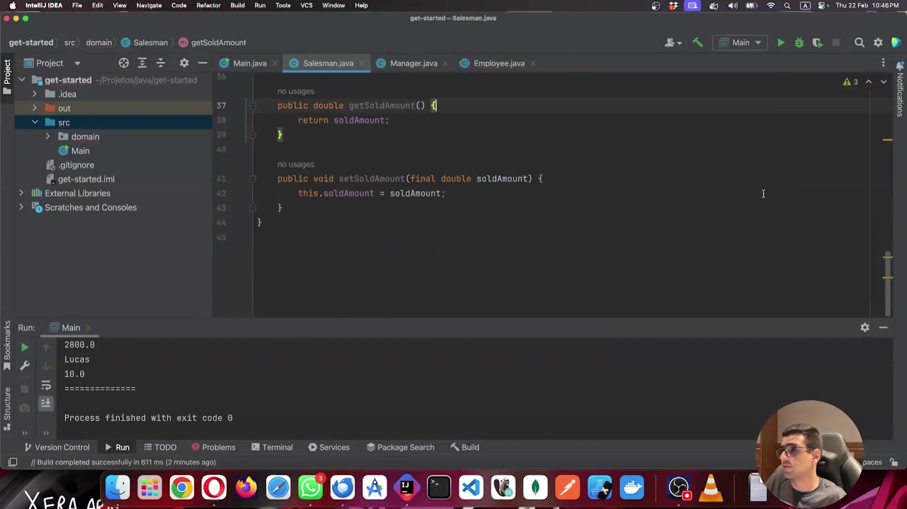
</p>

Os métodos de acesso `getSoldAmount()` e `setSoldAmount()` são gerados para o atributo `soldAmount` em `Salesman`. Esses métodos são necessários para que o `Main.java` possa atribuir e consultar o valor de vendas do vendedor sem acessar o atributo diretamente (encapsulamento). A saída no console exibida no painel inferior pertence a uma execução anterior e mostra os valores do Salesman Lucas.

```java
public double getSoldAmount() {
    return soldAmount;
}

public void setSoldAmount(final double soldAmount) {
    this.soldAmount = soldAmount;
}
```

#### Declaração do método abstrato getFullSalary em Employee

<p align="center">
  
</p>

`Employee.java` exibe a declaração final do método `getFullSalary()` como abstrato (linha 70). Um método abstrato não possui corpo — ele apenas define a assinatura. Qualquer classe concreta que herdar de `Employee` é obrigada a implementá-lo. Caso a subclasse não implemente, ela também precisará ser declarada como `abstract`. O aviso no rodapé do IDE (`Method 'getFullSalary()' is never used`) é temporário, pois o método ainda não está sendo chamado no `Main.java`.

```java
// Em Employee.java
public abstract double getFullSalary();
```

#### Stub gerado pelo IntelliJ — implementação vazia de getFullSalary em Salesman

<p align="center">
  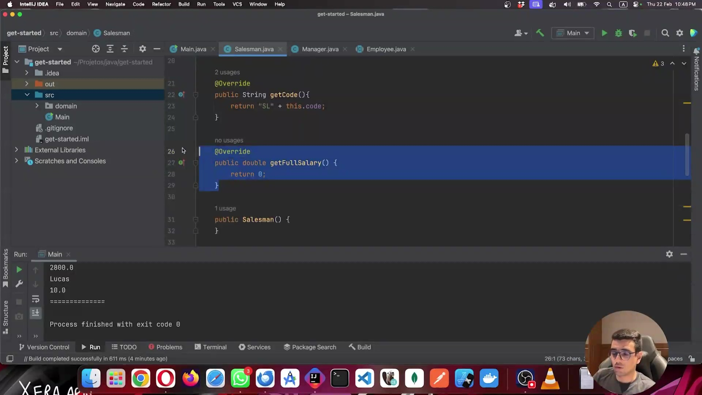
</p>

O IntelliJ gera automaticamente o stub de implementação do método abstrato em `Salesman`. O código `return 0` é apenas um placeholder — o compilador considera o contrato cumprido, mas a lógica de negócio ainda não está correta. A imagem destaca (em azul) o bloco gerado com `@Override`. O mesmo stub também é gerado automaticamente em `Manager`, visível nas próximas imagens.

```java
// Salesman.java — stub gerado automaticamente (ainda incorreto)
@Override
public double getFullSalary() {
    return 0;
}
```

#### Stub de getFullSalary em Manager — implementação pendente

<p align="center">
  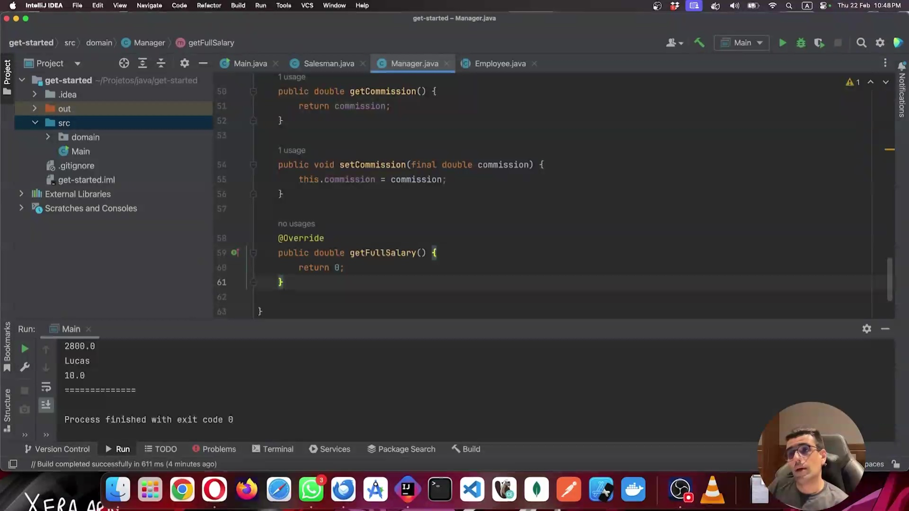
</p>

Em `Manager.java`, o mesmo stub `@Override public double getFullSalary() { return 0; }` é gerado pelo IntelliJ. Os métodos `getCommission()` e `setCommission()` já estão presentes e funcionais. O `return 0` será substituído pela lógica correta: salário base somado à comissão do gerente.

```java
// Manager.java — stub gerado automaticamente (ainda incorreto)
public double getCommission() {
    return commission;
}

public void setCommission(final double commission) {
    this.commission = commission;
}

@Override
public double getFullSalary() {
    return 0;  // será substituído por: this.salary + this.commission
}
```

#### Implementação real de getFullSalary em Salesman — cálculo com soldAmount

<p align="center">
  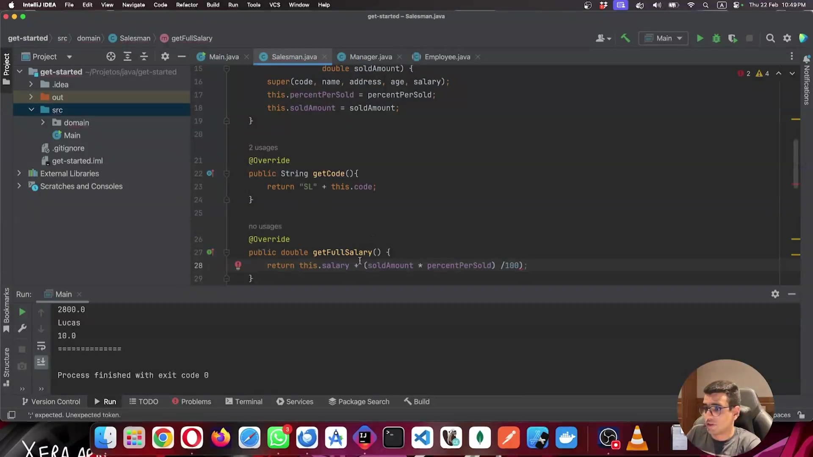
</p>

A implementação real de `getFullSalary()` em `Salesman` substitui o stub. A fórmula calcula o salário total como: salário base + (valor vendido × percentual de vendas / 100). O marcador de erro na linha 28 indica um pequeno problema de sintaxe (o operador `+` entre `this.salary` e a expressão parentética), que será corrigido a seguir.

```java
@Override
public double getFullSalary() {
    // Fórmula: salário base + comissão sobre vendas
    return this.salary + (soldAmount * percentPerSold) / 100;
}
```

#### Main atualizado — setSoldAmount e chamada de getFullSalary no Salesman

<p align="center">
  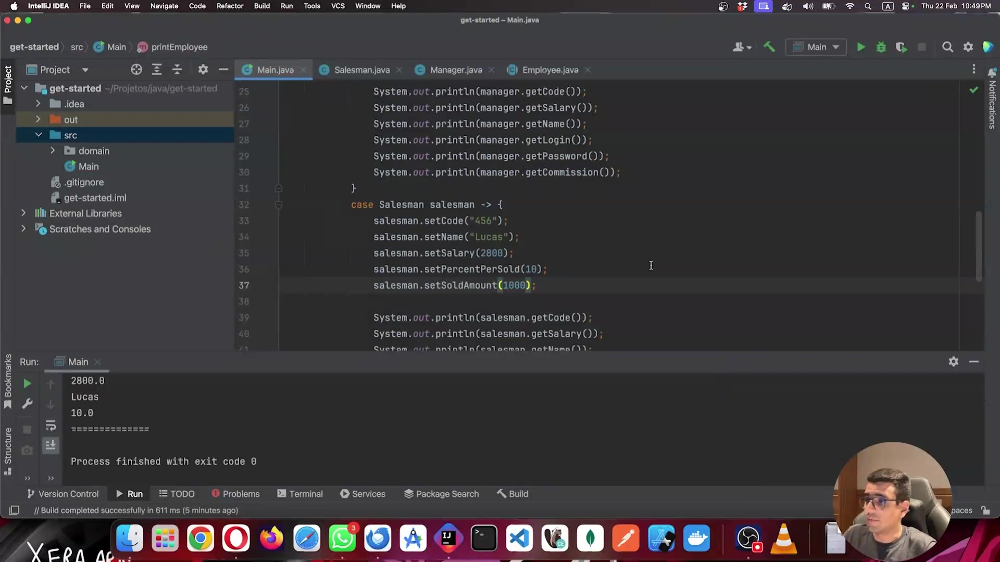
</p>

O bloco `case Salesman` no `Main.java` recebe `salesman.setSoldAmount(1000)` — definindo R$ 1.000 em vendas. As chamadas de impressão incluem `getCode()`, `getSalary()`, `getName()`, `getPercentPerSold()` e `getSoldAmount()`. Fora do switch, `employee.getFullSalary(extra: 500)` demonstra o uso da sobrecarga definida na classe pai, passando um bônus adicional.

```java
case Salesman salesman -> {
    salesman.setCode("456");
    salesman.setName("Lucas");
    salesman.setSalary(2800);
    salesman.setPercentPerSold(10);
    salesman.setSoldAmount(1000);

    System.out.println(salesman.getCode());
    System.out.println(salesman.getSalary());
    System.out.println(salesman.getName());
    System.out.println(salesman.getPercentPerSold());
    System.out.println(salesman.getSoldAmount());
}
// ...
System.out.println(employee.getFullSalary(/* extra */ 500));
System.out.println(employee.getFullSalary());
```

#### Implementação real de getFullSalary em Manager — salário + comissão

<p align="center">
  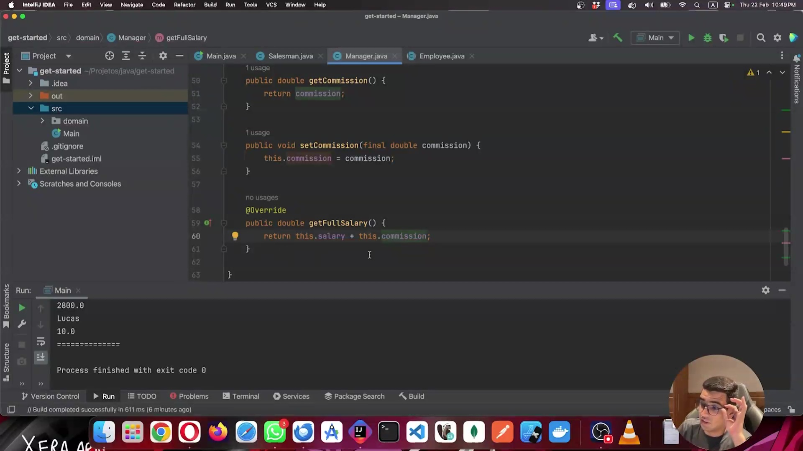
</p>

`Manager.java` recebe sua implementação correta de `getFullSalary()`: a soma de `this.salary` (herdado, agora `protected`) e `this.commission` (atributo próprio do gerente). A lógica é diferente da do Salesman — cada subclasse implementa o contrato abstrato à sua própria maneira, que é exatamente o objetivo do método abstrato: garantir a existência do comportamento sem ditar sua implementação.

```java
@Override
public double getFullSalary() {
    return this.salary + this.commission;
}
```

#### Employee.java — método abstrato e aviso de uso

<p align="center">
  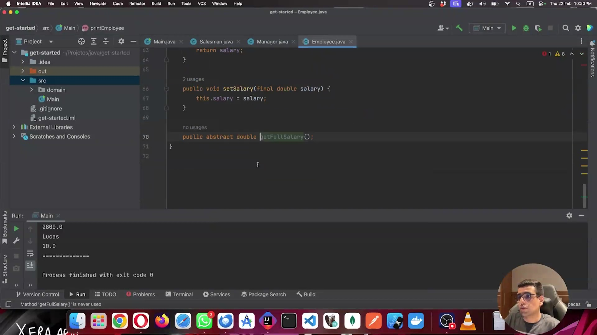
</p>

`Employee.java` é exibido na sua forma final, mostrando `public abstract double getFullSalary();` na linha 70. O rodapé do IDE exibe o aviso `Method 'getFullSalary()' is never used` — isso é esperado porque ainda não há chamada a esse método no `Main.java` neste momento (a chamada será inserida a seguir). O aviso desaparecerá assim que o método for chamado.

```java
// Employee.java — linha 70
public abstract double getFullSalary();
```

#### Saída completa do programa — Manager com getFullSalary e extra

<p align="center">
  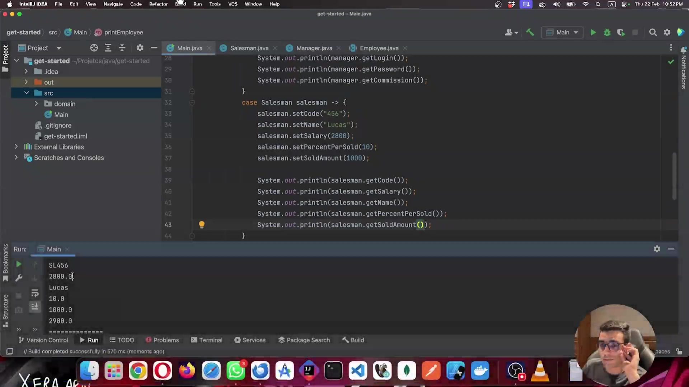
</p>

O `Main.java` exibe o bloco completo do Salesman com `setSoldAmount(1000)` e as impressões de todas as propriedades. O console confirma a execução correta: `SL456`, `2800.0`, `Lucas`, `10.0`, `1000.0`, `2900.0` (salário full = 2800 + 10% de 1000 = 2900). O bloco do Manager chama `manager.getFullSalary(extra: 500)`, usando a sobrecarga — o resultado é `5000 + 1200 + 500 = 6700`.

> **Saída no console (Manager):**
> ```
> joao
> 123456
> 1200.0
> 6700.0    ← getFullSalary(500): salary + commission + extra
> 6200.0    ← getFullSalary():    salary + commission
> ```
> **Saída no console (Salesman):**
> ```
> SL456
> 2800.0
> Lucas
> 10.0
> 1000.0
> 2900.0    ← getFullSalary(): 2800 + (1000 * 10 / 100)
> ```

#### Employee.java — visão final com método abstrato e sobrecarga

<p align="center">
  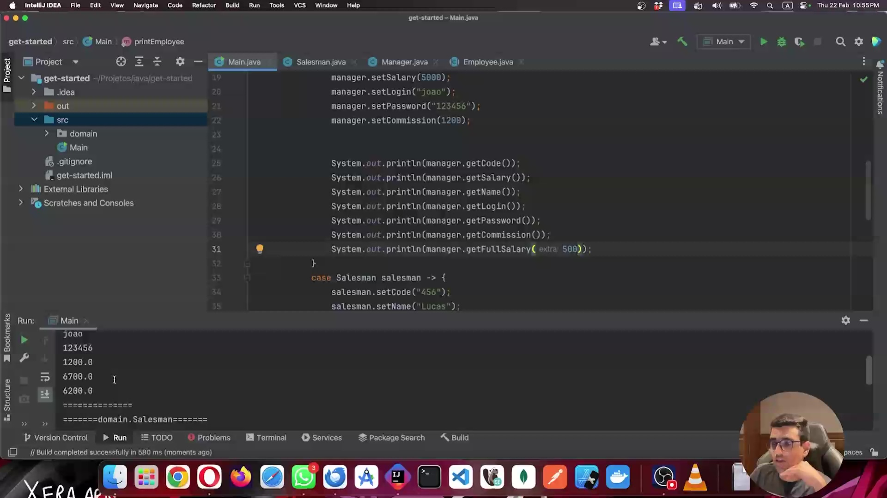
</p>

`Employee.java` é exibido na forma final. A linha 70 mantém `public abstract double getFullSalary();` e o aviso de uso não utilizado persiste (indicado no rodapé). Isso ocorre porque o método abstrato sem parâmetros é chamado indiretamente pela sobrecarga `getFullSalary(double extra)` — mas o IDE ainda sinaliza como "nunca usado" por não localizar uma chamada direta explícita. Em produção, o aviso pode ser suprimido ou ignorado.

```java
// Employee.java — estado final
public abstract double getFullSalary();                          // linha 70 — contrato obrigatório

public double getFullSalary(double extra) {                      // linha 72 — sobrecarga concreta
    return this.getFullSalary() + extra;
}
```

#### Main.java — bloco do Manager completo com comissão e getFullSalary

<p align="center">
  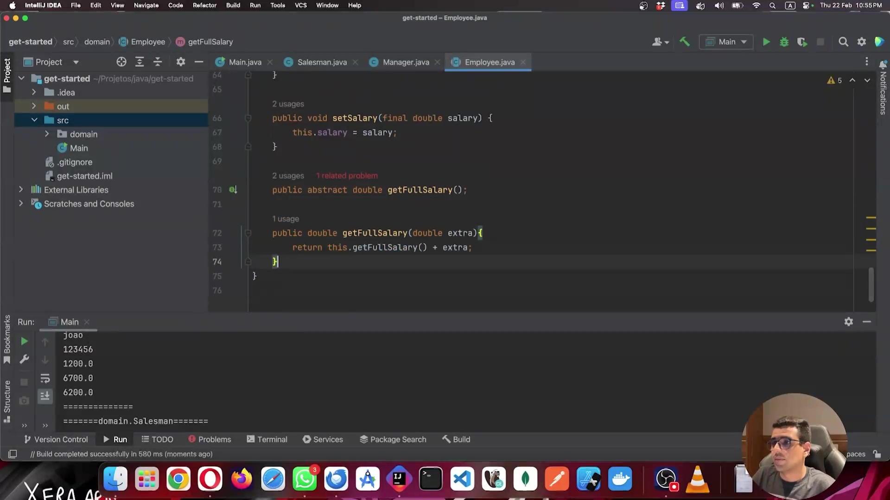
</p>

O bloco completo do Manager em `Main.java` é exibido. Após `setSalary(5000)`, `setLogin("joao")`, `setPassword("123456")` e `setCommission(1200)`, o código imprime todas as propriedades e então chama `manager.getFullSalary(extra: 500)`. O console exibe `6700.0` para a chamada com extra e `6200.0` para a chamada sem. A linha `======domain.Salesman======` ao fim indica que o bloco seguinte (Salesman) iniciará na próxima iteração.

```java
case Manager manager -> {
    manager.setCode("123");
    manager.setName("João");
    manager.setSalary(5000);
    manager.setLogin("joao");
    manager.setPassword("123456");
    manager.setCommission(1200);

    System.out.println(manager.getCode());
    System.out.println(manager.getSalary());
    System.out.println(manager.getName());
    System.out.println(manager.getLogin());
    System.out.println(manager.getPassword());
    System.out.println(manager.getCommission());
    System.out.println(manager.getFullSalary(/* extra */ 500));
}
```

#### Main.java — bloco do Salesman completo com getSoldAmount e getFullSalary

<p align="center">
  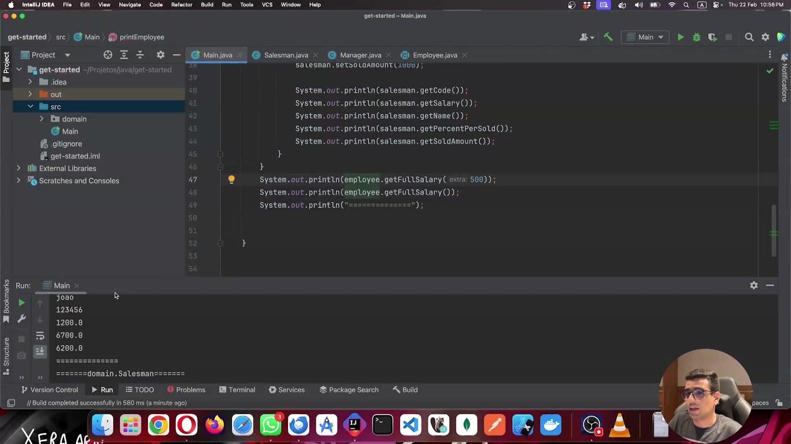
</p>

A última imagem exibe o bloco final do Salesman em `Main.java`. Após configurar todos os atributos (`setSoldAmount(1000)`), o código imprime `getCode()`, `getSalary()`, `getName()`, `getPercentPerSold()` e `getSoldAmount()`. Em seguida, fora do switch, `employee.getFullSalary(extra: 500)` e `employee.getFullSalary()` são chamados na referência genérica `Employee` — demonstrando polimorfismo: o Java resolve em tempo de execução qual implementação de `getFullSalary()` invocar com base no tipo real do objeto.

```java
case Salesman salesman -> {
    salesman.setCode("456");
    salesman.setName("Lucas");
    salesman.setSalary(2800);
    salesman.setPercentPerSold(10);
    salesman.setSoldAmount(1000);

    System.out.println(salesman.getCode());
    System.out.println(salesman.getSalary());
    System.out.println(salesman.getName());
    System.out.println(salesman.getPercentPerSold());
    System.out.println(salesman.getSoldAmount());
}

System.out.println(employee.getFullSalary(/* extra */ 500));
System.out.println(employee.getFullSalary());
System.out.println("==============");
```

### 🟩 Vídeo 03 - Reforçando `instanceof` e sobrecarga de método

<video width="60%" controls>
  <source src="000-Midia_e_Anexos/bootcamp_ntt_data_java_spring_ai-modulo.02-curso.02-video_03.webm" type="video/webm">
    Seu navegador não suporta vídeo HTML5.
</video>

link do vídeo: https://web.dio.me/track/ntt-data-2026-ai-java-back-end/course/heranca-e-polimorfismo-em-java/learning/8bb2b63f-8913-4118-b149-f022b118cebf?autoplay=1

O instrutor aprofunda o funcionamento do operador `instanceof` e a flexibilidade da sobrecarga de métodos. O objetivo é consolidar o entendimento sobre como o Java gerencia tipos e hierarquias de classes.

### Anotações

<p align="center">
  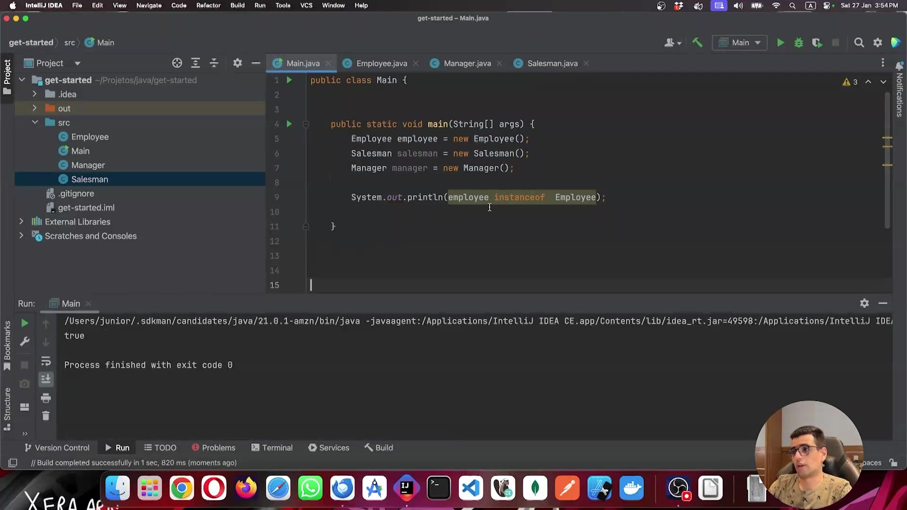
</p>

O código no método `main` instancia três objetos das classes presentes na hierarquia de herança: `Employee`, `Salesman` e `Manager`. Em seguida, é utilizado o operador `instanceof` para verificar se a variável `employee` é uma instância da classe `Employee`. O resultado impresso no console é `true`, o que confirma o comportamento esperado: um objeto é sempre reconhecido como instância da própria classe com a qual foi criado.

```java
public class Main {

    public static void main(String[] args) {
        Employee employee = new Employee();
        Salesman salesman = new Salesman();
        Manager manager = new Manager();

        System.out.println(employee instanceof Employee);
    }
}
```

> **Saída:** `true`

<p align="center">
  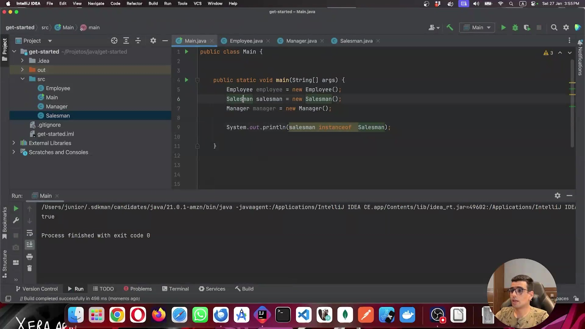
</p>

Neste trecho, a verificação com `instanceof` é feita sobre a variável `salesman` comparando-a com a classe `Salesman`. O resultado também é `true`. O ponto relevante aqui é que o `instanceof` não se limita a verificar o tipo exato da variável — ele percorre a **hierarquia de herança**. Por isso, uma instância de `Salesman` também seria reconhecida como instância de `Employee`, caso essa comparação fosse feita, uma vez que `Salesman` herda de `Employee`.

```java
public class Main {

    public static void main(String[] args) {
        Employee employee = new Employee();
        Salesman salesman = new Salesman();
        Manager manager = new Manager();

        System.out.println(salesman instanceof Salesman);
    }
}
```

> **Saída:** `true`

<p align="center">
  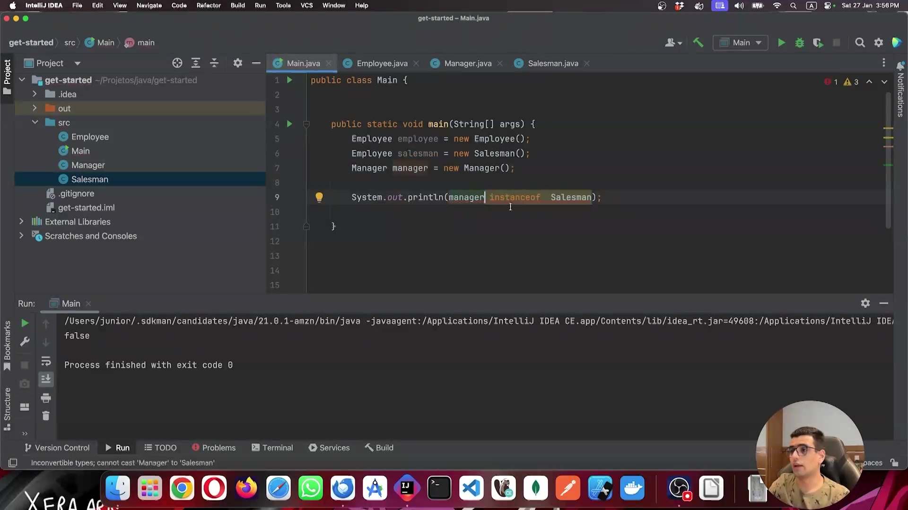
</p>

Aqui é demonstrado um caso que **não funciona**: comparar um objeto de uma classe com uma classe irmã dentro da hierarquia. A variável `salesman` foi declarada com o tipo `Employee` (superclasse), mas instanciada como `new Salesman()`. Ao tentar verificar `manager instanceof Salesman`, o compilador já aponta um erro — `Inconvertible types; cannot cast 'Manager' to 'Salesman'` — porque `Manager` e `Salesman` ramificam para lados diferentes da hierarquia. Eles compartilham apenas a superclasse `Employee`, mas não possuem relação de herança entre si. O resultado da execução é `false`.

```java
public class Main {

    public static void main(String[] args) {
        Employee employee = new Employee();
        Employee salesman = new Salesman();
        Manager manager = new Manager();

        System.out.println(manager instanceof Salesman);
    }
}
```

> **Saída:** `false`  
> **Aviso do compilador:** `Inconvertible types; cannot cast 'Manager' to 'Salesman'`


## Parte 2 - Exercícios: Herança e Polimorfismo em Java

### 🟩 Vídeo 04 - Exercícios

<video width="60%" controls>
  <source src="000-Midia_e_Anexos/bootcamp_ntt_data_java_spring_ai-modulo.02-curso.02-video_04.webm" type="video/webm">
    Seu navegador não suporta vídeo HTML5.
</video>

link do vídeo:

##  Materiais de Apoio

# Certificado: Herança e Polimorfismo em Java

- Link na plataforma: 
- Certificado em pdf: