## Instrutor

- José Luiz Abreu Cardoso Junior (Engenheiro de software sênior)
- Contato Linkedin: / [juniorjrjl](https://www.linkedin.com/in/juniorjrjl/)

## Parte 1 - Dominando Interfaces e Lambda em Java

Para este curso, ver também:

<p align="left">
  
</p>

- ☕️ Roadmap Java 
  - [Interfaces](https://github.com/ahaerdy/roadmap_java/tree/main/orientacao_a_objetos/aprofundando/interfaces)
  - [Expressões Lambda](https://github.com/ahaerdy/roadmap_java/tree/main/orientacao_a_objetos/recursos_modernos/expressoes_lambda)

### 🟩 Vídeo 01 - Interfaces

<video width="60%" controls>
  <source src="000-Midia_e_Anexos/bootcamp_ntt_data_java_spring_ai-modulo.02-curso.03-video_01.webm" type="video/webm">
    Seu navegador não suporta vídeo HTML5.
</video>

link do vídeo: https://web.dio.me/track/ntt-data-2026-ai-java-back-end/course/dominando-interfaces-e-lambda-em-java/learning/ef1f1e63-135d-495b-9bf1-fb8d5a057415?autoplay=1

A aula foca na definição, implementação e particularidades das **Interfaces** no ecossistema Java. O objetivo principal é diferenciar interfaces de classes abstratas, entender suas restrições de propriedades e explorar o poder da herança múltipla e do polimorfismo.

### Anotações

#### Métodos abstratos em interfaces — o erro de ter corpo no método

<p align="center">
  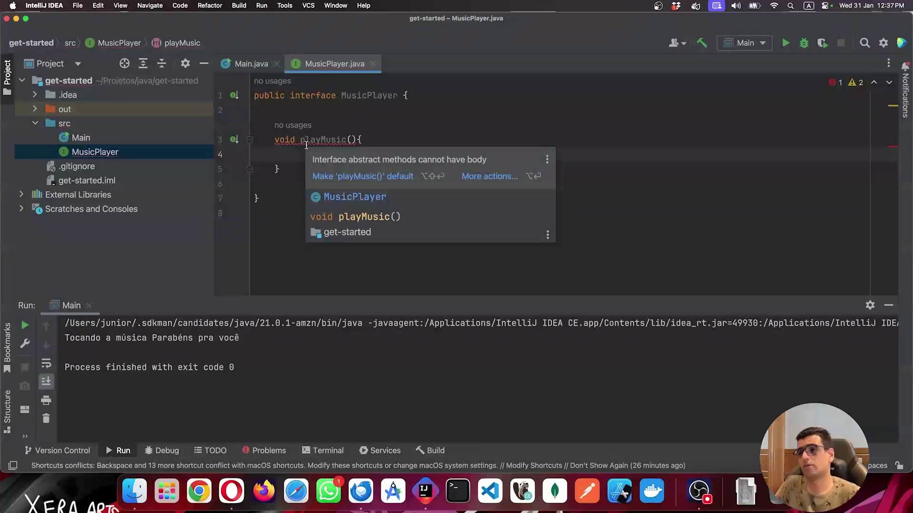
</p>

A imagem mostra a interface `MusicPlayer` sendo criada no IntelliJ IDEA. O método `playMusic()` foi declarado **com corpo** (chaves `{}`), o que causou um erro imediato. O IDE exibe o aviso: *"Interface abstract methods cannot have body"* — métodos abstratos de interface não podem ter implementação. O IntelliJ sugere como correção tornar o método `default`, mas neste momento da aula o objetivo é entender a regra fundamental: numa interface, os métodos são implicitamente abstratos e não possuem corpo.

```java
public interface MusicPlayer {
    void playMusic() { } // ERRO: métodos de interface não podem ter corpo
}
```

#### Propriedades de interface — tipo `String` e a regra de inicialização

<p align="center">
  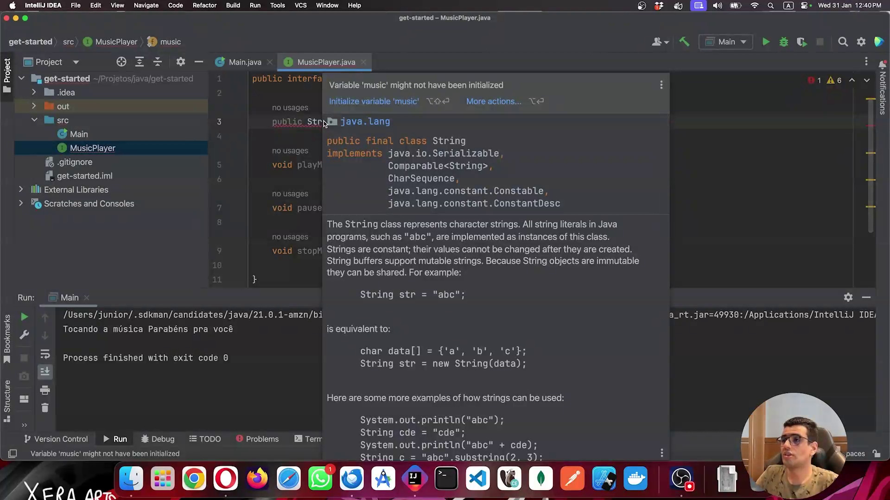
</p>

A imagem exibe a interface `MusicPlayer` com três métodos declarados corretamente (`playMusic`, `pauseMusic`, `stopMusic`) e o cursor sobre a declaração de uma variável do tipo `String`. O IntelliJ abre o painel de documentação da classe `java.lang.String`, mostrando que ela implementa `Serializable`, `Comparable<String>` e `CharSequence`. Paralelamente, aparece o aviso *"Variable 'music' might not have been initialized"*, sinalizando que campos de interface precisam obrigatoriamente ser inicializados — pois, como será visto na sequência, eles são tratados como `final`.

```java
public interface MusicPlayer {
    public String music; // ERRO: campo deve ser inicializado (é final implicitamente)

    void playMusic();
    void pauseMusic();
    void stopMusic();
}
```

#### Propriedades de interface com valor inicializado — `final` implícito

<p align="center">
  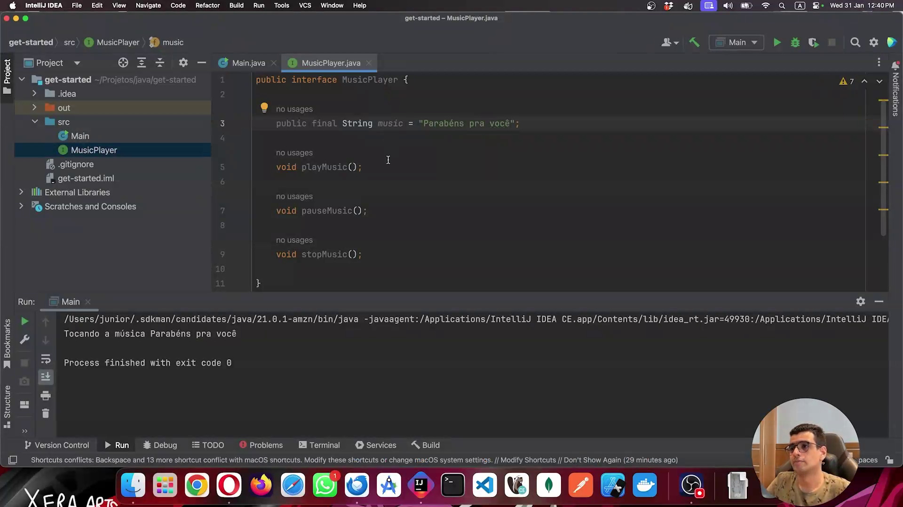
</p>

Aqui a variável foi inicializada com o valor `"Parabéns pra você"`. O campo agora é aceito pelo compilador, mas o IDE alerta: *"Modifier 'final' is redundant for interface fields"* — o modificador `final` é redundante porque todos os campos de uma interface já são `final` por padrão. A aula demonstra que não é necessário declarar `final` explicitamente; a interface impõe isso de forma implícita para qualquer propriedade declarada nela.

```java
public interface MusicPlayer {
    public final String music = "Parabéns pra você"; // 'final' é redundante aqui

    void playMusic();
    void pauseMusic();
    void stopMusic();
}
```

#### Propriedades de interface — `static` também é implícito

<p align="center">
  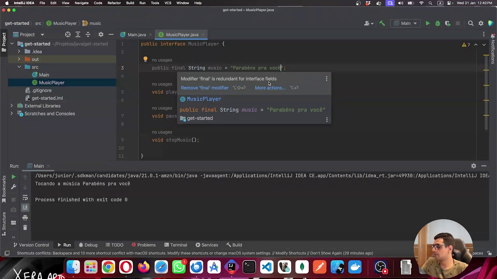
</p>

Nesta etapa, o modificador `static` foi adicionado explicitamente à declaração da propriedade. O IDE volta a avisar: *"Modifier 'static' is redundant for interface fields"* — assim como `final`, o modificador `static` também é implícito em todos os campos de uma interface. A conclusão da aula fica clara: qualquer propriedade declarada numa interface é obrigatoriamente **`public`**, **`static`** e **`final`** — ou seja, uma constante acessível diretamente pelo nome da interface, sem necessidade de instância.

```java
public interface MusicPlayer {
    public static final String music = "Parabéns pra você"; // tudo redundante; é o padrão

    void playMusic();
    void pauseMusic();
    void stopMusic();
}
```

#### Interfaces não podem ser instanciadas diretamente — classe anônima

<p align="center">
  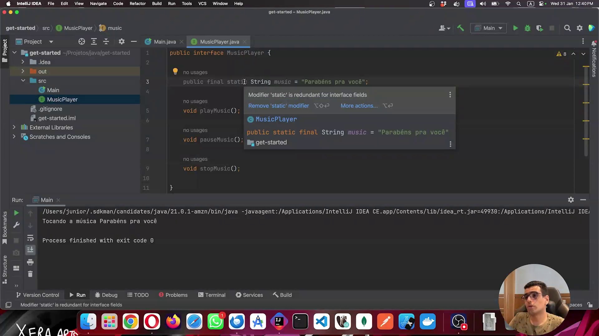
</p>

A imagem mostra a classe `Main` com a tentativa de instanciar `MusicPlayer` diretamente com `new MusicPlayer()`. O erro exibido é: *"'MusicPlayer' is abstract; cannot be instantiated"*. O IDE oferece a ação *"Implement methods"*, que gera uma **classe anônima** — uma implementação inline criada no próprio ponto de uso, sem declarar uma classe nomeada separada. Esse é o mecanismo que permite usar uma interface pontualmente sem criar um arquivo `.java` adicional.

```java
public class Main {
    public static void main(String[] args) {
        // ERRO: interface não pode ser instanciada diretamente
        var musicPlayer = new MusicPlayer(); // 'MusicPlayer' is abstract; cannot be instantiated
    }
}
```

#### Classe anônima em uso — implementando `MusicPlayer` inline

<p align="center">
  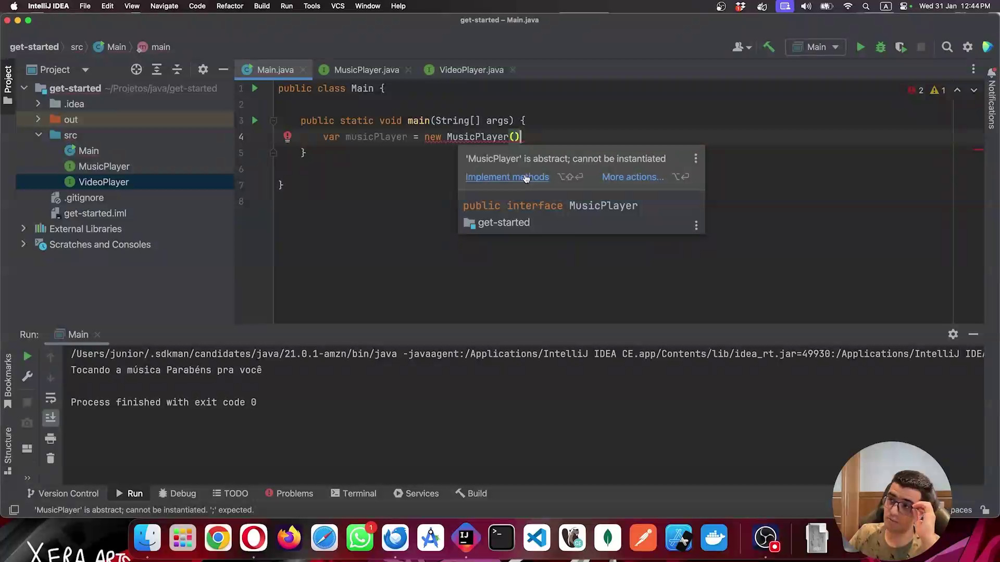
</p>

Após aceitar a sugestão do IDE, o IntelliJ gerou automaticamente a classe anônima dentro do método `main`. Os três métodos da interface (`playMusic`, `pauseMusic` e o terceiro fora da tela) foram implementados com `@Override` diretamente no bloco da instanciação. O método `playMusic()` já contém `System.out.println("Tocando a música")`. Esse padrão de classe anônima permite fornecer um comportamento concreto para uma interface sem criar uma classe nomeada — útil para usos pontuais e descartáveis.

```java
public class Main {
    public static void main(String[] args) {
        var musicPlayer = new MusicPlayer() {
            @Override
            public void playMusic() {
                System.out.println("Tocando a música");
            }

            @Override
            public void pauseMusic() {
                // implementação vazia
            }

            // stopMusic() implementado fora da área visível
        };

        musicPlayer.playMusic();
    }
}
```

#### `record` implementando uma interface — `MusicBox`

<p align="center">
  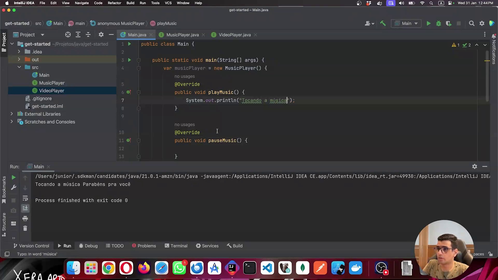
</p>

A imagem apresenta a declaração de `MusicBox` como um `record` que implementa `MusicPlayer`. O erro indicado é: *"Class 'MusicBox' must implement abstract method 'playMusic()' in 'MusicPlayer'"*, e o IDE oferece a ação *"Implement methods"*. O painel de detalhes confirma a hierarquia: `public record MusicBox extends Record implements MusicPlayer`. Esse trecho demonstra que, diferentemente de classes abstratas (que records não podem estender), **interfaces podem ser implementadas por records** sem restrições.

```java
public record MusicBox(String music, boolean isPaused) implements MusicPlayer {
    // deve implementar playMusic(), pauseMusic() e stopMusic()
}
```

#### Classe `Smartphone` implementando múltiplas interfaces

<p align="center">
  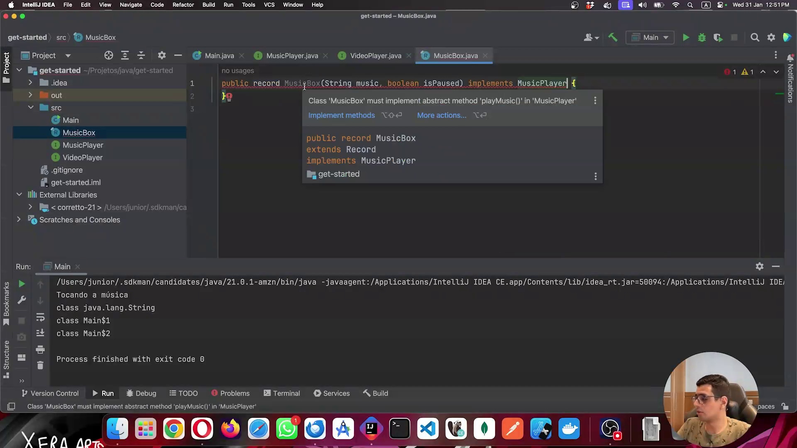
</p>

A classe `Smartphone` implementa simultaneamente `VideoPlayer` e `MusicPlayer`, ilustrando uma das principais vantagens das interfaces sobre a herança de classes: **uma classe pode implementar quantas interfaces quiser**, enquanto só pode herdar de uma única classe. Os métodos sobrescritos (`playMusic` e `pauseMusic`) imprimem mensagens como `"O smartphone está tocando música"` e `"O smartphone está pausando música"`, tornando o exemplo didático e direto ao ponto.

```java
public class Smartphone implements VideoPlayer, MusicPlayer {

    @Override
    public void playMusic() {
        System.out.println("O smartphone está tocando música");
    }

    @Override
    public void pauseMusic() {
        System.out.println("O smartphone está pausando música");
    }

    // stopMusic() e métodos de VideoPlayer implementados abaixo (fora da área visível)
}
```

#### Polimorfismo com interfaces — limitação de tipo na variável

<p align="center">
  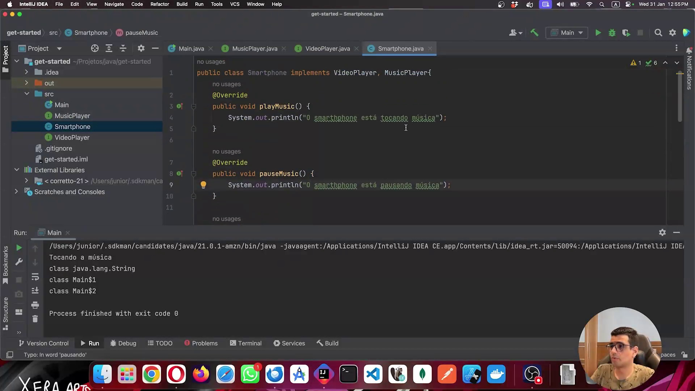
</p>

A imagem mostra a classe `Main` com métodos utilitários `runMusic(MusicPlayer)` e `runVideo(VideoPlayer)`, e uma variável `musicPlayer` declarada como `MusicPlayer` mas instanciada com `new Computer()`. O ponto central da discussão é: mesmo que `Computer` implemente tanto `MusicPlayer` quanto `VideoPlayer`, **a variável foi tipada como `MusicPlayer`**, portanto não pode ser passada diretamente para `runVideo()`. O compilador enxerga apenas o contrato da interface declarada. As soluções demonstradas são: declarar a variável com o tipo concreto (`Computer`), criar uma nova instância com `new Computer()` diretamente no argumento, ou usar um cast explícito `(VideoPlayer) musicPlayer`.

```java
public class Main {

    static void runVideo(VideoPlayer videoPlayer) {
        videoPlayer.playVideo();
    }

    static void runMusic(MusicPlayer musicPlayer) {
        musicPlayer.playMusic();
    }

    public static void main(String[] args) {
        MusicPlayer musicPlayer = new Computer();
        runMusic(musicPlayer);

        // ERRO: musicPlayer é do tipo MusicPlayer, não VideoPlayer
        // runVideo(musicPlayer); // não compila

        // Soluções:
        Computer computer = new Computer(); // tipo concreto
        runMusic(computer);
        runVideo(computer); // funciona pois Computer implementa ambas

        // ou cast explícito (menos elegante):
        runVideo((VideoPlayer) musicPlayer);
    }
}
```

### 🟩 Vídeo 02 - Interfaces Funcionais

<video width="60%" controls>
  <source src="000-Midia_e_Anexos/bootcamp_ntt_data_java_spring_ai-modulo.02-curso.03-video_02.webm" type="video/webm">
    Seu navegador não suporta vídeo HTML5.
</video>

link do vídeo: https://web.dio.me/track/ntt-data-2026-ai-java-back-end/course/dominando-interfaces-e-lambda-em-java/learning/1fa31db9-fe0a-41b7-b8e1-f1afc63c63bb?autoplay=1

### Anotações

<p align="center">
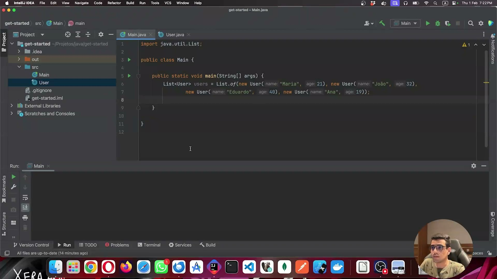
</p>

```java
import java.util.List;

public class Main {
    public static void main(String[] args) {
        List<User> users = List.of(
            new User("Maria", 21),
            new User("Joao", 32),
            new User("Eduardo", 40),
            new User("Ana", 19)
        );
    }
}
```

A imagem ilustra a criação de uma coleção de objetos do tipo `User` utilizando o método `List.of()`. Este método é empregado para instanciar uma lista imutável, garantindo que os elementos adicionados (neste caso, os usuários com seus respectivos nomes e idades) não possam ser alterados, adicionados ou removidos após a inicialização da coleção.

<p align="center">
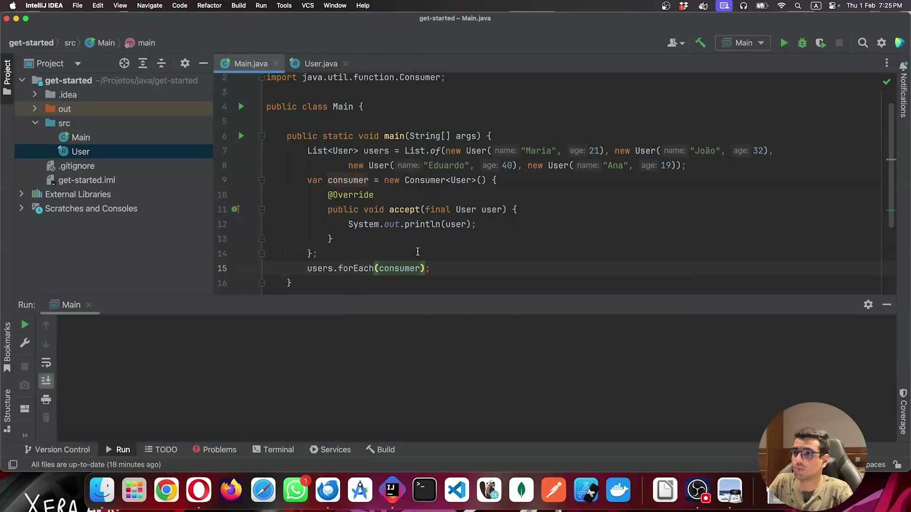
</p>

```java
var consumer = new Consumer<User>() {
    @Override
    public void accept(final User user) {
        System.out.println(user);
    }
};
users.forEach(consumer);
```

Neste trecho, demonstra-se a implementação da interface funcional `Consumer` por meio de uma classe anônima. O método `accept` é sobrescrito para definir a ação que será executada para cada elemento (imprimir o usuário no console). Em seguida, o método `forEach`, herdado da interface `Iterable`, é invocado na lista, recebendo essa implementação do `Consumer` para iterar sobre os itens.

<p align="center">
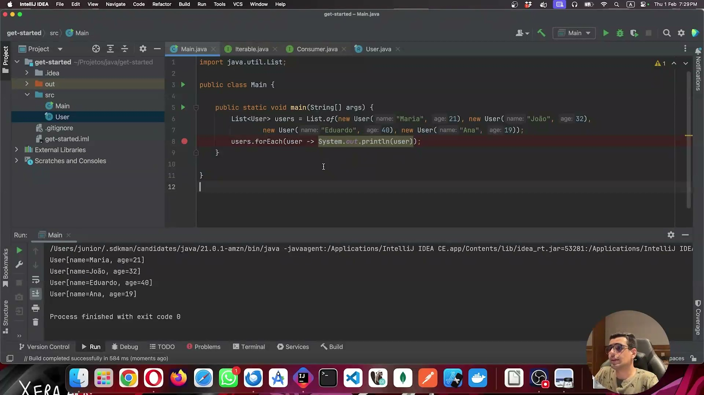
</p>

```java
users.forEach(user -> System.out.println(user));
```

A imagem apresenta a refatoração do código anterior, substituindo a verbosidade da classe anônima por uma expressão lambda. A sintaxe `user -> System.out.println(user)` cumpre exatamente o mesmo papel do método `accept` da interface `Consumer`, tornando o código mais conciso e legível. A saída exibida no console confirma a execução bem-sucedida da iteração sobre todos os usuários da lista.

<p align="center">
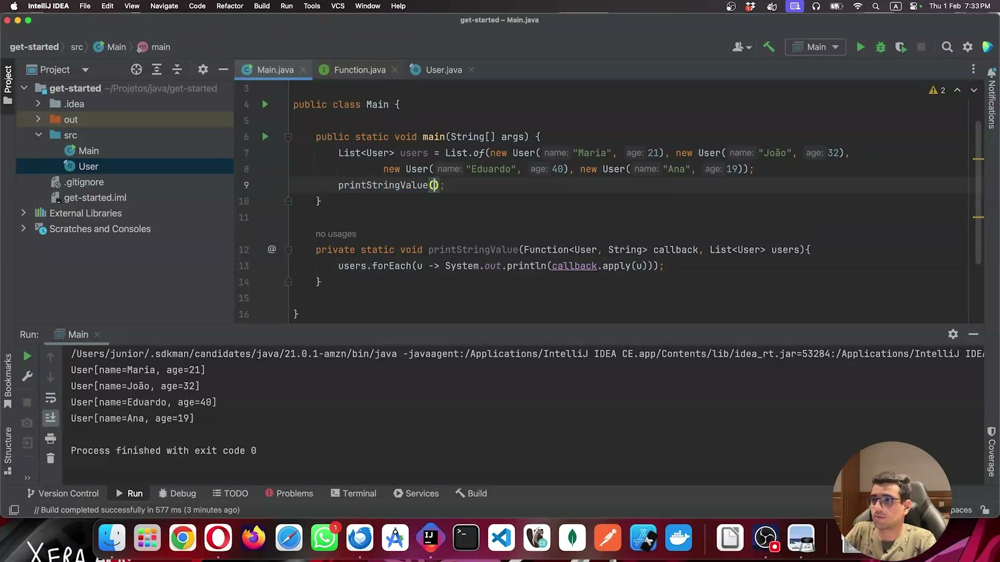
</p>

```java
private static void printStringValue(Function<User, String> callback, List<User> users) {
    users.forEach(u -> System.out.println(callback.apply(u)));
}
```

Aqui é introduzida outra interface funcional nativa, a `Function<T, R>`. Diferente do `Consumer`, a `Function` recebe um argumento de um tipo (neste caso, `User`) e retorna um resultado de outro tipo (neste caso, `String`). O método customizado `printStringValue` exemplifica como aplicar essa função de callback a cada elemento da lista, utilizando o método `apply` dentro de uma expressão lambda no `forEach`.

<p align="center">
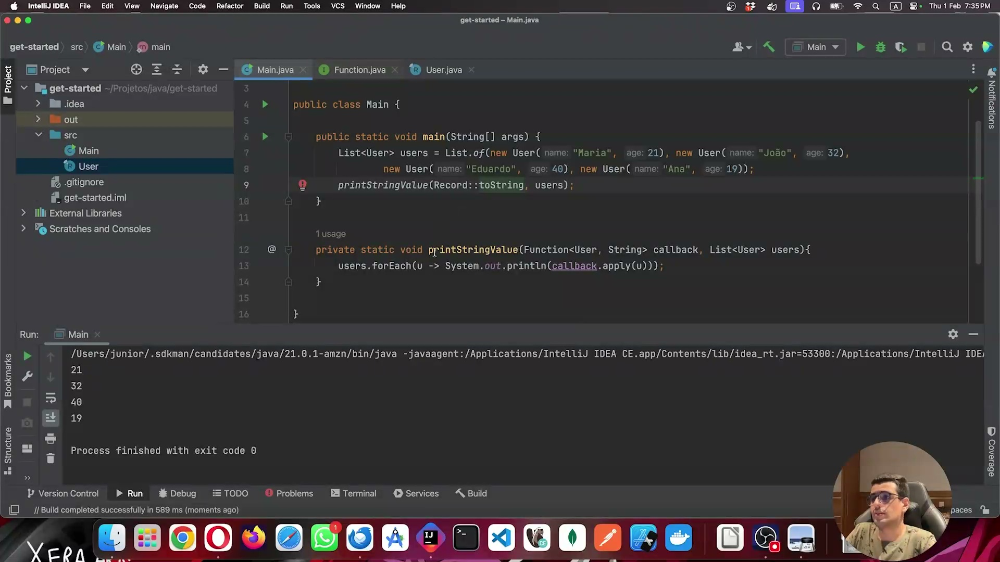
</p>

```java
printStringValue(Record::toString, users);
```

A imagem demonstra a simplificação máxima da chamada do método customizado através do uso de referências a métodos (*method references*). Em vez de escrever a expressão lambda completa, utiliza-se a sintaxe `Record::toString` (ou `User::toString`), que instrui o compilador a utilizar diretamente o método `toString` do objeto como implementação da interface funcional `Function`, resultando em um código ainda mais limpo e expressivo.      


### 🟩 Vídeo 03 - Entendendo algumas keywords usadas

<video width="60%" controls>
  <source src="000-Midia_e_Anexos/bootcamp_ntt_data_java_spring_ai-modulo.02-curso.03-video_03.webm" type="video/webm">
    Seu navegador não suporta vídeo HTML5.
</video>

link do vídeo:

## Parte 2 - Exercícios: Interfaces e Lambda em Java

### 🟩 Vídeo 04 - Exercícios

<video width="60%" controls>
  <source src="000-Midia_e_Anexos/bootcamp_ntt_data_java_spring_ai-modulo.02-curso.03-video_04.webm" type="video/webm">
    Seu navegador não suporta vídeo HTML5.
</video>

link do vídeo:

##  Materiais de Apoio

# Certificado: 

- Link na plataforma: 
- Certificado em pdf: