## Instrutor

- José Luiz Abreu Cardoso Junior (Engenheiro de software sênior)
- Contato Linkedin: / [juniorjrjl](https://www.linkedin.com/in/juniorjrjl/)

## Parte 1 - Praticando com Collections e Outras Classes Úteis do Java

### 🟩 Vídeo 01 - Trabalhando com Listas e Arrays

<video width="60%" controls>
  <source src="000-Midia_e_Anexos/bootcamp_ntt_data_java_spring_ai-modulo.02-curso.04-video_01.webm" type="video/webm">
    Seu navegador não suporta vídeo HTML5.
</video>

link do vídeo: https://web.dio.me/track/ntt-data-2026-ai-java-back-end/course/imersao-pratica-com-collections-e-outras-classes-uteis-do-java/learning/583ba61a-3460-403a-83d2-b263ca9d4ccd?autoplay=1


O vídeo resume os conceitos fundamentais de coleções em Java, focando na interface List e suas implementações mais comuns: `ArrayList`, `LinkedList` e `Vector`.

### Anotações

#### Arrays em Java — declaração e limitações

<p align="center">
  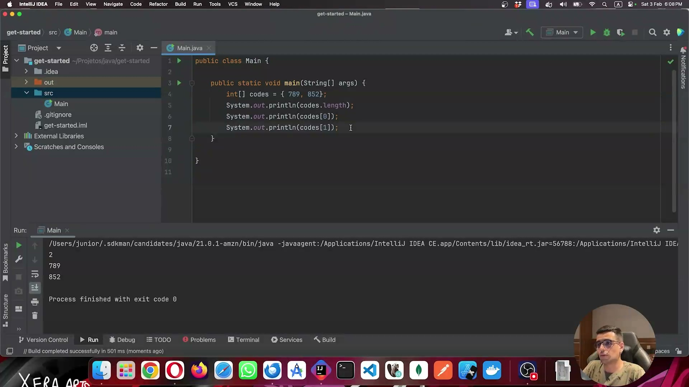
</p>

O código exibe a declaração de um array de inteiros com inicialização direta (`int[] codes = { 789, 852 }`). Em seguida são feitas três impressões: o tamanho do array via `codes.length` (resultado `2`), o primeiro elemento `codes[0]` (resultado `789`) e o segundo elemento `codes[1]` (resultado `852`). O console confirma a execução bem-sucedida com saída `2 / 789 / 852`. Essa imagem ilustra a forma mais básica de trabalhar com coleções em Java — o array estático — e seu comportamento de tamanho fixo, que é justamente a limitação que motiva o uso de `List`.

```java
public class Main {
    public static void main(String[] args) {
        int[] codes = { 789, 852 };
        System.out.println(codes.length);
        System.out.println(codes[0]);
        System.out.println(codes[1]);
    }
}
```

#### Introdução ao ArrayList

<p align="center">
  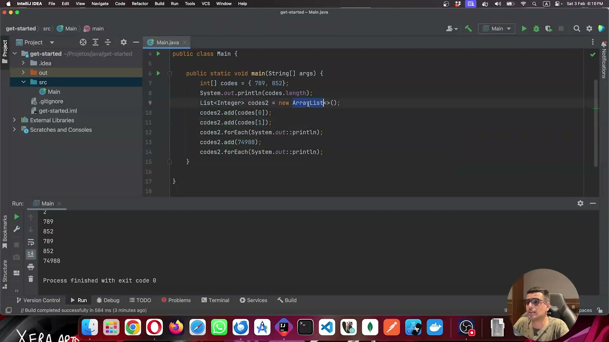
</p>

Aqui o array fixo é mantido, mas é criada uma `List<Integer>` usando `ArrayList<>()` — sem necessidade de declarar tamanho prévio. Os elementos do array original são adicionados via `codes2.add(codes[0])` e `codes2.add(codes[1])`, e a lista é percorrida com `forEach`. Em seguida um terceiro elemento (`74988`) é adicionado dinamicamente e a lista é impressa novamente. O console mostra as duas iterações: a primeira com `789` e `852`, e a segunda adicionando `74988`. Isso demonstra a principal vantagem do `ArrayList` sobre o array: **tamanho dinâmico**, sem necessidade de redeclararar ou realocar manualmente.

```java
public static void main(String[] args) {
    int[] codes = { 789, 852 };
    System.out.println(codes.length);
    List<Integer> codes2 = new ArrayList<>();
    codes2.add(codes[0]);
    codes2.add(codes[1]);
    codes2.forEach(System.out::println);
    codes2.add(74988);
    codes2.forEach(System.out::println);
}
```

#### LinkedList como alternativa ao ArrayList

<p align="center">
  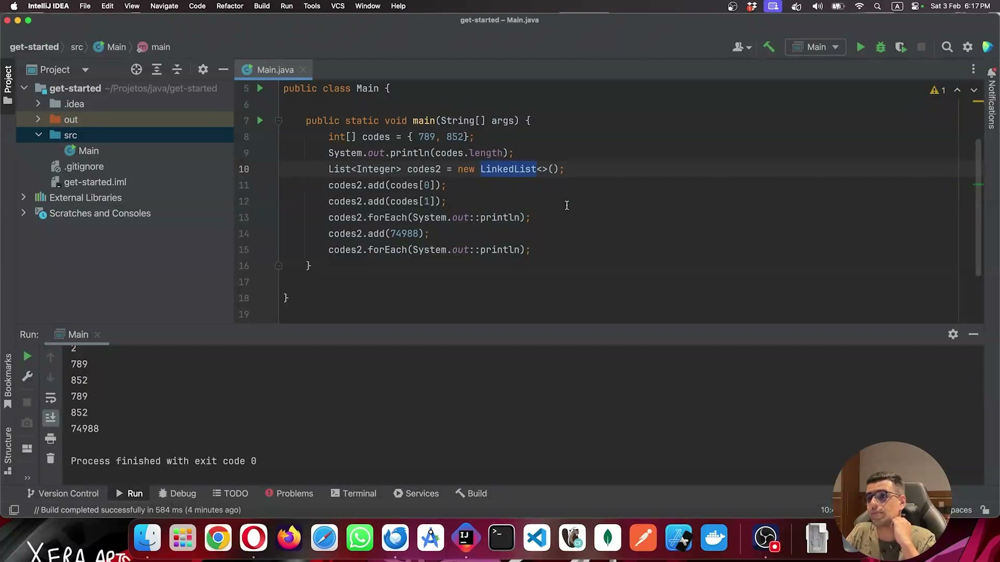
</p>

O código é praticamente idêntico ao anterior, com a única diferença sendo a substituição de `new ArrayList<>()` por `new LinkedList<>()` na linha 10. O resultado no console é o mesmo (`2 / 789 / 852 / 789 / 852 / 74988`), pois ambas as classes implementam a interface `List`. O ponto central é que, ao simplesmente trocar a implementação concreta, o comportamento externo se mantém — porém, internamente, a estrutura de dados muda. `LinkedList` é mais eficiente para **muitas inserções e remoções**, enquanto `ArrayList` se destaca em **acesso por índice e iterações**.

```java
public static void main(String[] args) {
    int[] codes = { 789, 852 };
    System.out.println(codes.length);
    List<Integer> codes2 = new LinkedList<>();
    codes2.add(codes[0]);
    codes2.add(codes[1]);
    codes2.forEach(System.out::println);
    codes2.add(74988);
    codes2.forEach(System.out::println);
}
```

#### Trabalhando com objetos na lista — classe User

<p align="center">
  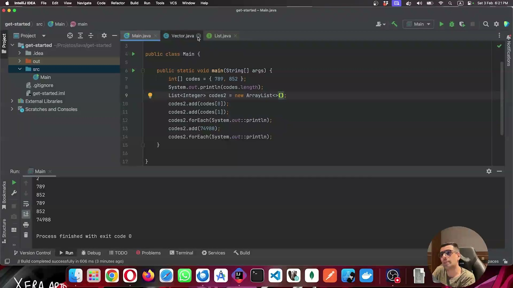
</p>

A lista agora armazena objetos do tipo `User`, com três instâncias adicionadas (Jão, Maria, Leo). O código usa métodos como `contains(user)`, `size()`, `isEmpty()`, `getFirst()`, `get(0)`, `getLast()` e `get(users.size() - 1)`. O console revela um comportamento inesperado: `contains(user)` retorna `true` (quando se passa a variável original), mas os objetos são impressos como `User@30f39991` — ou seja, o endereço de memória, e não os valores. Isso antecipa o problema da ausência do método `equals` e `toString` personalizados na classe `User`.

```java
public static void main(String[] args) {
    List<User> users = new ArrayList<>();
    var user = new User( code: 1,  name: "Jão");
    users.add(user);
    users.add(new User( code: 2,  name: "Maria"));
    users.add(new User( code: 3,  name: "Leo"));
    System.out.println(users.contains(user));
    System.out.println(users.size());
    System.out.println(users.isEmpty());
    System.out.println(users.getFirst());
    System.out.println(users.get(0));
    System.out.println(users.getLast());
    System.out.println(users.get(users.size() - 1));
}
```

#### O problema do equals padrão — endereço de memória

<p align="center">
  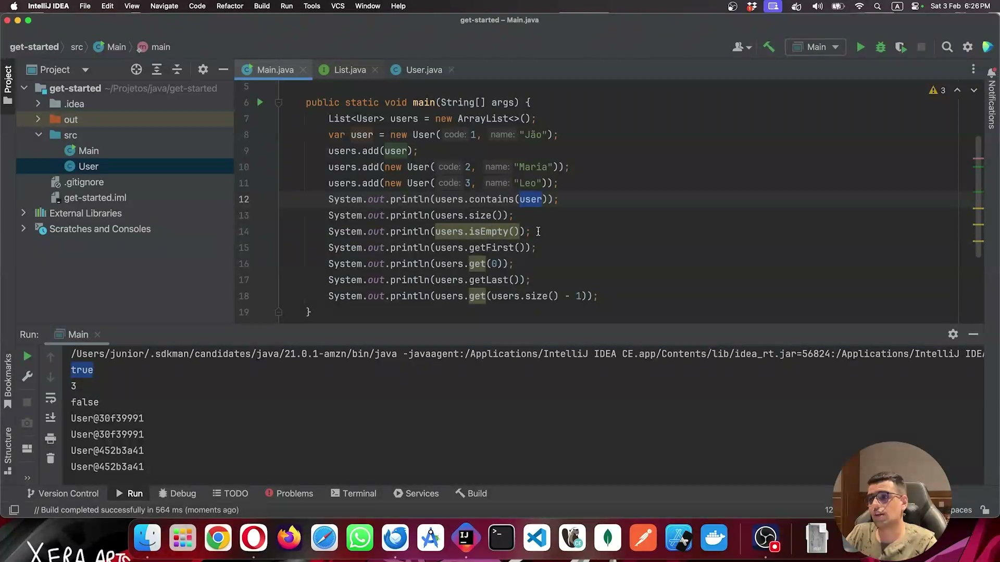
</p>

Nesta imagem, ao buscar um usuário novo na lista com `users.contains(new User(code: 1, name: "Jão"))`, o resultado é `false`, mesmo que exista um usuário com os mesmos dados. Isso ocorre porque o Java, por padrão, compara **endereços de memória** — e o novo objeto instanciado com `new` ocupa um endereço diferente. As linhas 14 e 15 mostram dois objetos distintos sendo impressos com suas representações de memória (`User@...`). Esse é o ponto de partida para implementar os métodos `equals` e `toString` na classe `User`.

```java
System.out.println(users.contains(user));                          // true
System.out.println(users.contains(new User( code: 1,  name: "Jão"))); // false
System.out.println(new User( code: 1,  name: "Jão"));
System.out.println(new User( code: 1,  name: "Jão"));
```

#### Implementação do método equals na classe User

<p align="center">
  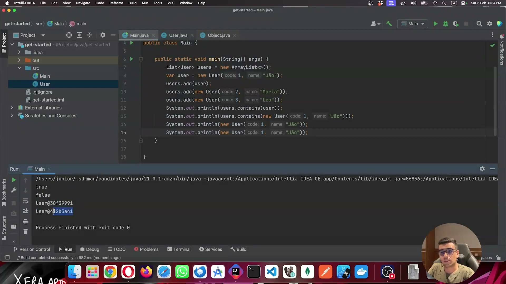
</p>

A classe `User` agora sobrescreve o método `equals` com `@Override`. A implementação verifica: (1) se o objeto recebido é uma instância de `User` via `instanceof`; (2) se é o mesmo endereço de memória (`this == user`), retornando `true` imediatamente; (3) se `code` e `name` são iguais usando `Objects.equals` para a String. A variável `isEqual` começa como `false` e é atualizada conforme as condições. O console ainda mostra a saída anterior (`true / false / User@... / User@...`), pois o `toString` ainda não foi implementado.

```java
@Override
public boolean equals(final Object obj) {
    var isEqual = false;
    if (obj instanceof User user) {
        if (this == user) isEqual = true;
        if (this.code == user.code && Objects.equals(this.name, user.name)) isEqual = true;
    }
    return isEqual;
}
```

#### equals funcionando — contains retorna true

<p align="center">
  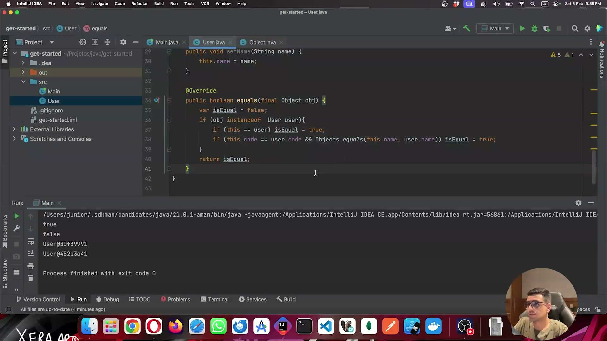
</p>

Com o `equals` devidamente implementado, `users.contains(new User(code: 1, name: "Jão"))` agora retorna `true`. O console exibe dois `true` — o primeiro para a variável original e o segundo para o novo objeto criado com `new`. Isso confirma que a comparação passou a ser feita por **valor das propriedades** e não mais por endereço de memória. Os objetos `User@...` ainda aparecem no console porque o método `toString` ainda não foi sobrescrito.

#### Implementação do método toString

<p align="center">
  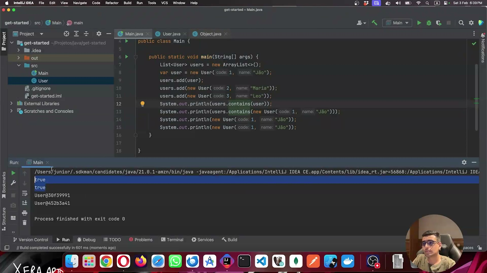
</p>

A classe `User` recebe também o `@Override` do método `toString`, que usa `String.format` para retornar uma representação legível no formato JSON simplificado: `{ 'code': %s, 'name': %s }`. O console agora exibe `true / true / { 'code': 1, 'name': Jão} / { 'code': 1, 'name': Jão}` — confirmando que os objetos são impressos com seus valores reais, e não mais com o endereço de memória.

```java
@Override
public String toString() {
    return String.format("{ 'code': %s, 'name': %s}", this.code, this.name);
}
```

#### Remoção de elementos e limpeza da lista

<p align="center">
  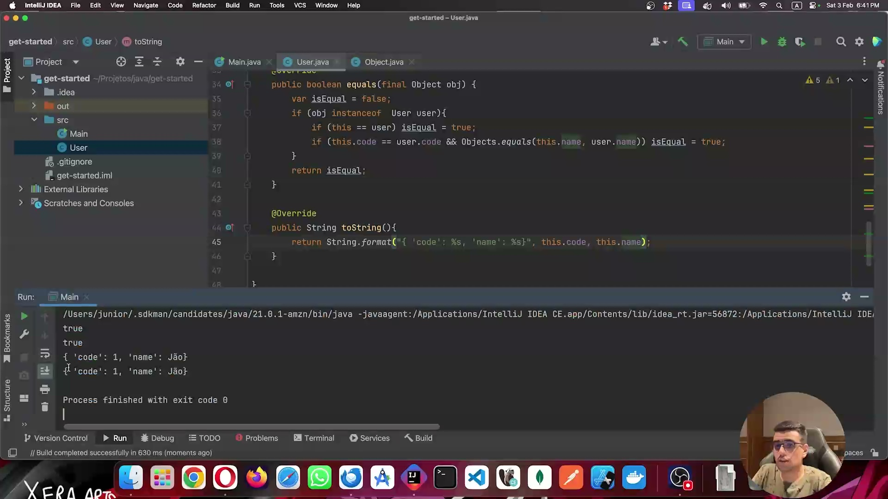
</p>

O foco agora é nos métodos de remoção da lista. `remove(new User(code: 8, name: "Leo"))` retorna `false` porque o usuário não existe (código diferente). `remove(index: 1)` remove o elemento na posição 1 (Maria) e **retorna o objeto removido**. Após a remoção por índice, a lista é impressa mostrando apenas Jão e Leo. Por fim, `users.clear()` esvazia completamente a lista, e a impressão final exibe `[]`.

```java
System.out.println(users);
System.out.println(users.remove(new User( code: 8,  name: "Leo")));  // false
System.out.println(users.remove( index: 1));                          // { 'code': 2, 'name': Maria}
System.out.println(users);
users.clear();
System.out.println(users);
```

### 🟩 Vídeo 02 - Trabalhando com Set

<video width="60%" controls>
  <source src="000-Midia_e_Anexos/bootcamp_ntt_data_java_spring_ai-modulo.02-curso.04-video_02.webm" type="video/webm">
    Seu navegador não suporta vídeo HTML5.
</video>

link do vídeo: https://web.dio.me/track/ntt-data-2026-ai-java-back-end/course/imersao-pratica-com-collections-e-outras-classes-uteis-do-java/learning/c10088f0-cd6d-449b-9833-e7f1bdc75531?autoplay=1

### Anotações

<p align="center">
  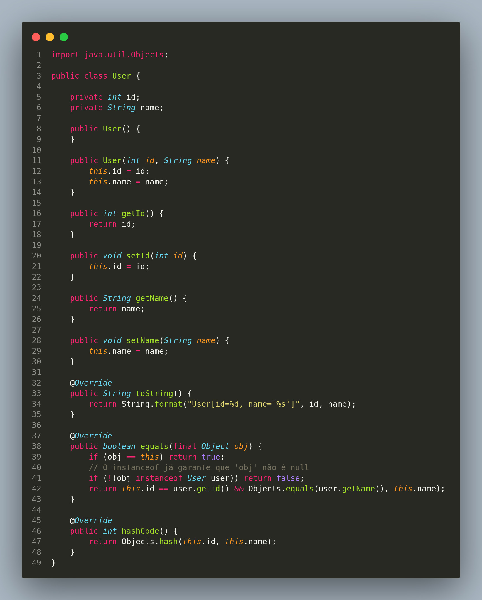
</p>

A imagem exibe a implementação completa da classe `User` em Java. A classe possui dois atributos privados (`int id` e `String name`), dois construtores (um sem argumentos e outro parametrizado), getters e setters para ambos os campos, e três métodos sobrescritos da classe `Object`: `toString()`, `equals()` e `hashCode()`.

O método `toString()` formata a representação textual do objeto. O `equals()` verifica identidade de referência primeiro (`obj == this`), depois confirma o tipo com `instanceof`, e por fim compara `id` e `name` usando `Objects.equals`. O `hashCode()` delega para `Objects.hash(this.id, this.name)`, garantindo que objetos iguais segundo `equals` produzam o mesmo hash.

```java
import java.util.Objects;

public class User {

    private int id;
    private String name;

    public User() {
    }

    public User(int id, String name) {
        this.id = id;
        this.name = name;
    }

    public int getId() {
        return id;
    }

    public void setId(int id) {
        this.id = id;
    }

    public String getName() {
        return name;
    }

    public void setName(String name) {
        this.name = name;
    }

    @Override
    public String toString() {
        return String.format("User[id=%d, name='%s']", id, name);
    }

    @Override
    public boolean equals(final Object obj) {
        if (obj == this) return true;
        // O instanceof já garante que 'obj' não é null
        if (!(obj instanceof User user)) return false;
        return this.id == user.getId() && Objects.equals(user.getName(), this.name);
    }

    @Override
    public int hashCode() {
        return Objects.hash(this.id, this.name);
    }
}
```

<p align="center">
  
</p>

A imagem mostra a classe `Main` no IntelliJ IDEA, onde um `Set<User>` é criado com a implementação `HashSet`. Quatro objetos `User` são adicionados ao conjunto com IDs 1 a 4. Em seguida, `users.contains(new User(id: 1, name: "Jão"))` é chamado e o resultado impresso no console é **`false`**.

Esse resultado demonstra um ponto fundamental: sem a sobrescrita de `equals` e `hashCode`, o `HashSet` usa a implementação padrão herdada de `Object`, que compara **referências de memória**. Mesmo que dois objetos `User` tenham os mesmos dados, eles são instâncias diferentes e, portanto, considerados objetos distintos pelo conjunto.

```java
public class Main {

    public static void main(String[] args) {
        Set<User> users = new HashSet<>();
        users.add(new User( id: 1,  name: "Jão"));
        users.add(new User( id: 2,  name: "Maria"));
        users.add(new User( id: 3,  name: "Juca"));
        users.add(new User( id: 4,  name: "Leo"));

        System.out.println(users.contains(new User( id: 1,  name: "Jão")));
    }
}
```

> **Saída:** `false`

<p align="center">
  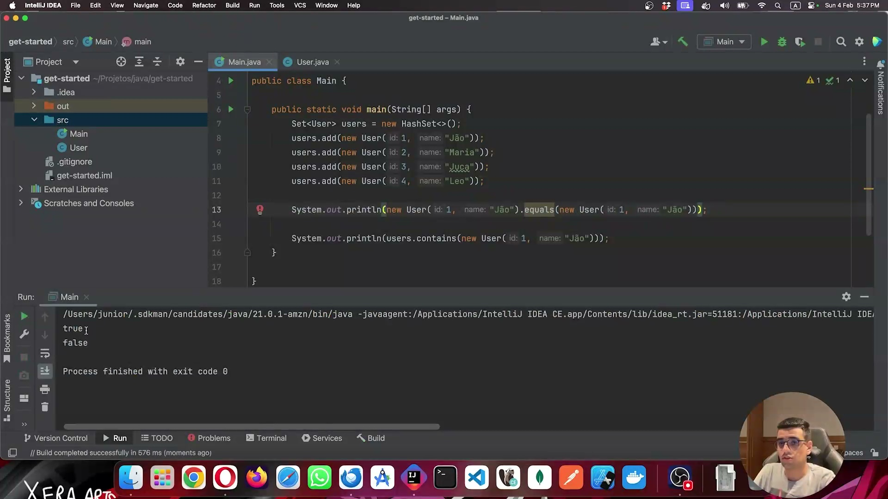
</p>

Nesta imagem, uma linha adicional (linha 13) chama explicitamente `equals` entre dois objetos `User` com os mesmos dados (`id: 1, name: "Jão"`). O console exibe **`true`** para esse `equals` e **`false`** para o `contains`.

Isso evidencia o comportamento após a implementação correta de `equals`: dois objetos com os mesmos atributos são reconhecidos como iguais pela comparação direta. Porém, o `HashSet` ainda retorna `false` no `contains`, pois ele utiliza **primeiro o `hashCode`** para localizar o bucket antes de usar `equals`. Enquanto `hashCode` não estiver sobrescrito, o `HashSet` não conseguirá encontrar o objeto.

```java
System.out.println(new User( id: 1,  name: "Jão").equals(new User( id: 1,  name: "Jão")));
// true

System.out.println(users.contains(new User( id: 1,  name: "Jão")));
// false
```

> **Saída:**
> ```
> true
> false
> ```

<p align="center">
  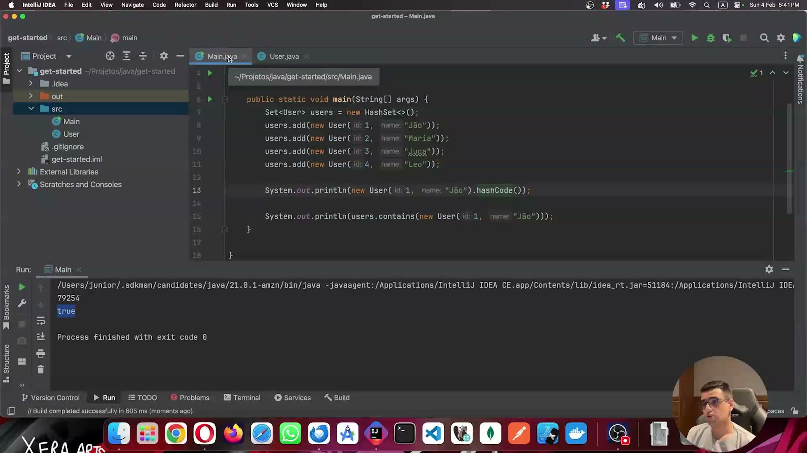
</p>

A imagem demonstra o comportamento após a implementação completa de `equals` **e** `hashCode`. O console agora exibe o hash gerado para um objeto `User(id: 1, name: "Jão")` (valor `79254`) e em seguida **`true`** para `users.contains`.

Com `hashCode` corretamente implementado, o `HashSet` consegue calcular o bucket correto e então utilizar `equals` para confirmar a igualdade. O ciclo está completo: mesmos dados → mesmo hash → mesmo bucket → `equals` retorna `true` → `contains` retorna `true`.

```java
System.out.println(new User( id: 1,  name: "Jão").hashCode());
// 79254

System.out.println(users.contains(new User( id: 1,  name: "Jão")));
// true
```

> **Saída:**
> ```
> 79254
> true
> ```

<p align="center">
  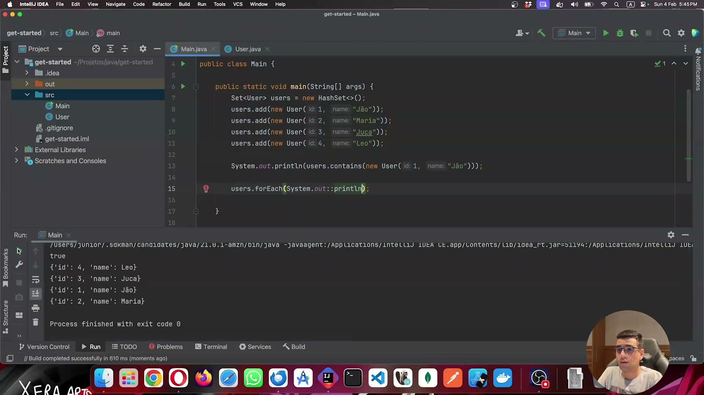
</p>

A imagem apresenta dois modos de iteração sobre o `HashSet`. O primeiro utiliza `users.forEach(System.out::println)` com referência de método. O segundo usa um `Iterator` explícito com laço `while (iterator.hasNext())`. Ambos produzem a mesma saída: os quatro usuários impressos em ordem não determinística (Leo, Juca, Jão, Maria).

Isso ilustra que o `HashSet` **não garante ordem de inserção**. A ordem de iteração depende dos valores de `hashCode` e da organização interna dos buckets.

```java
// Forma 1 — forEach com referência de método
users.forEach(System.out::println);

// Forma 2 — Iterator explícito
var iterator = users.iterator();
while (iterator.hasNext()) {
    System.out.println(iterator.next());
}
```

> **Saída (exemplo):**
> ```
> {'id': 4, 'name': Leo}
> {'id': 3, 'name': Juca}
> {'id': 1, 'name': Jão}
> {'id': 2, 'name': Maria}
> ```

<p align="center">
  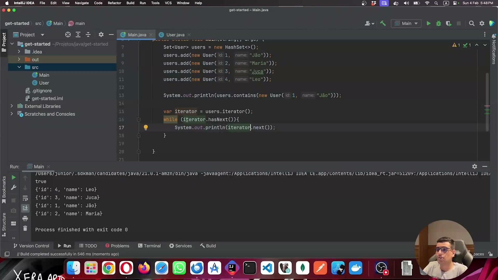
</p>

A imagem mostra o uso de `removeAll` para remover múltiplos elementos do conjunto de uma vez, passando uma coleção (`List.of(...)`) como argumento. Na primeira execução, tenta-se remover `User(id: 1, name: "Jão")` e `User(id: 2, name: "Lucas")` — como "Lucas" não existe no conjunto, apenas Jão é removido, restando Leo, Juca e Maria. Na segunda execução, verifica-se que `removeAll` retorna `false` quando nenhum elemento da coleção passada existe no conjunto.

```java
// Remove todos os elementos da coleção que existirem no Set
users.removeAll(List.of(new User( id: 1,  name: "Jão"), new User( id: 2,  name: "Lucas")));
System.out.println(users);
// [{'id': 4, 'name': Leo}, {'id': 3, 'name': Juca}, {'id': 2, 'name': Maria}]

System.out.println(users.removeAll(List.of(new User( id: 2,  name: "Jão"), new User( id: 2,  name: "Lucas"))));
// false
```

<p align="center">
  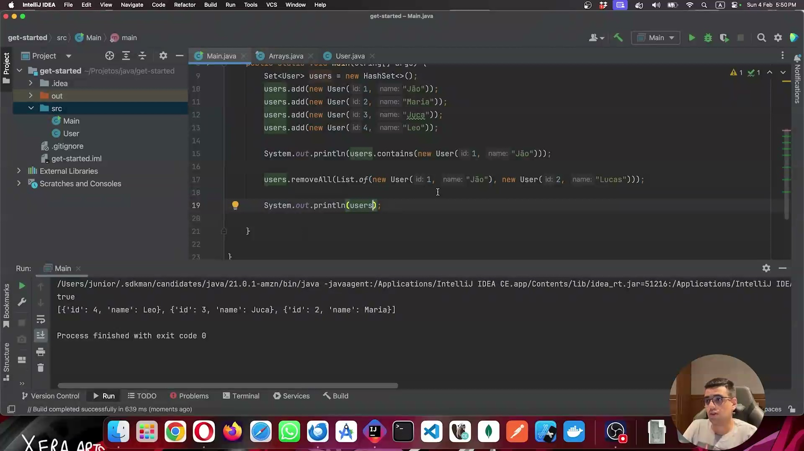
</p>

A imagem demonstra o método `removeIf`, que aceita um `Predicate` (expressão lambda) para remover elementos que satisfaçam uma condição. No exemplo, `user -> user.getId() > 2` remove os usuários com ID 3 e 4, deixando apenas Jão (id=1) e Maria (id=2) no conjunto.

`removeIf` é mais expressivo e seguro do que iterar manualmente e chamar `remove` dentro do laço, pois evita `ConcurrentModificationException`.

```java
users.removeIf(user -> user.getId() > 2);
System.out.println(users);
```

> **Saída:**
> ```
> [{'id': 1, 'name': Jão}, {'id': 2, 'name': Maria}]
> ```

<p align="center">
  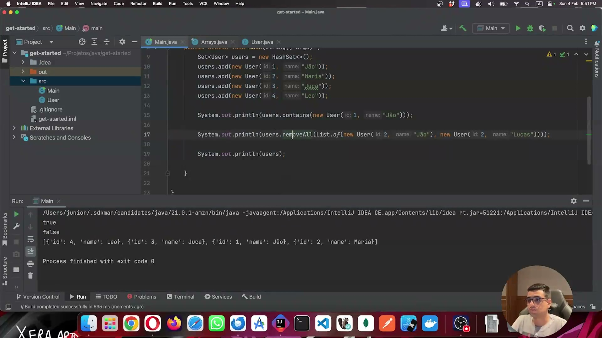
</p>

A imagem mostra o uso de `Predicate.not(...)` para **negar** a condição passada ao `removeIf`. Com `Predicate.not(user -> user.getId() > 2)`, o conjunto remove os elementos cujo ID **não** é maior que 2, ou seja, mantém apenas Leo (id=4) e Juca (id=3).

Isso evidencia a flexibilidade dos predicados: `Predicate.not` é um método estático que inverte qualquer `Predicate`, permitindo lógica de filtragem sem a necessidade de reescrever a condição com negação manual.

```java
users.removeIf(Predicate.not(user -> user.getId() > 2));
System.out.println(users);
```

> **Saída:**
> ```
> [{'id': 4, 'name': Leo}, {'id': 3, 'name': Juca}]
> ```

<p align="center">
  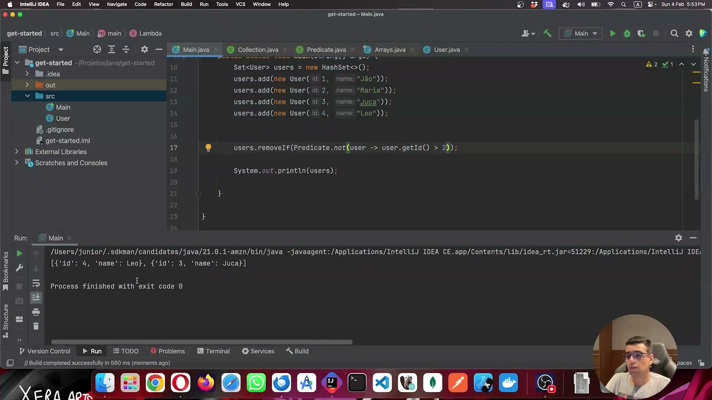
</p>

A imagem apresenta o uso de `removeAll` retornando `false` quando a coleção passada não contém nenhum elemento presente no `Set` atual. O console exibe `true` para `contains`, `false` para `removeAll` (nenhum elemento removido), e o conjunto completo com os quatro usuários.

Esse comportamento reforça que `removeAll` é uma operação segura: ele utiliza `equals` e `hashCode` para comparar os elementos, e retorna `false` se o conjunto não foi modificado — útil para verificar se uma remoção em lote teve efeito.

```java
System.out.println(users.contains(new User( id: 1,  name: "Jão")));
// true

System.out.println(users.removeAll(List.of(new User( id: 2,  name: "Jão"), new User( id: 2,  name: "Lucas"))));
// false

System.out.println(users);
// [{'id': 4, 'name': Leo}, {'id': 3, 'name': Juca}, {'id': 1, 'name': Jão}, {'id': 2, 'name': Maria}]
```

## Parte 2 - Trabalhando com Map e Wrappers

### 🟩 Vídeo 03 - Trabalhando com Map

<video width="60%" controls>
  <source src="000-Midia_e_Anexos/bootcamp_ntt_data_java_spring_ai-modulo.02-curso.04-video_03.webm" type="video/webm">
    Seu navegador não suporta vídeo HTML5.
</video>

link do vídeo:

### 🟩 Vídeo 04 - Tipos primitivos e Wrappers

<video width="60%" controls>
  <source src="000-Midia_e_Anexos/bootcamp_ntt_data_java_spring_ai-modulo.02-curso.04-video_04.webm" type="video/webm">
    Seu navegador não suporta vídeo HTML5.
</video>

link do vídeo:

## Parte 3 - Classes String, StringBuilder e StringBuffer

### 🟩 Vídeo 05 - Classe String

<video width="60%" controls>
  <source src="000-Midia_e_Anexos/bootcamp_ntt_data_java_spring_ai-modulo.02-curso.04-video_05.webm" type="video/webm">
    Seu navegador não suporta vídeo HTML5.
</video>

link do vídeo:

### 🟩 Vídeo 06 - Classes StringBuilder e StringBuffer

<video width="60%" controls>
  <source src="000-Midia_e_Anexos/bootcamp_ntt_data_java_spring_ai-modulo.02-curso.04-video_06.webm" type="video/webm">
    Seu navegador não suporta vídeo HTML5.
</video>

link do vídeo:

## Parte 4 - Aplicando o BigDecimal, Enums e Classe Optional

### 🟩 Vídeo 07 - Classe BigDecimal

<video width="60%" controls>
  <source src="000-Midia_e_Anexos/bootcamp_ntt_data_java_spring_ai-modulo.02-curso.04-video_07.webm" type="video/webm">
    Seu navegador não suporta vídeo HTML5.
</video>

link do vídeo:

### 🟩 Vídeo 08 - Enums

<video width="60%" controls>
  <source src="000-Midia_e_Anexos/bootcamp_ntt_data_java_spring_ai-modulo.02-curso.04-video_08.webm" type="video/webm">
    Seu navegador não suporta vídeo HTML5.
</video>

link do vídeo:

### 🟩 Vídeo 09 - Classe Optional

<video width="60%" controls>
  <source src="000-Midia_e_Anexos/bootcamp_ntt_data_java_spring_ai-modulo.02-curso.04-video_09.webm" type="video/webm">
    Seu navegador não suporta vídeo HTML5.
</video>

link do vídeo:

## Parte 5 - API de Streams e Generics

### 🟩 Vídeo 10 - Introdução à API de Streams

<video width="60%" controls>
  <source src="000-Midia_e_Anexos/bootcamp_ntt_data_java_spring_ai-modulo.02-curso.04-video_10.webm" type="video/webm">
    Seu navegador não suporta vídeo HTML5.
</video>

link do vídeo:

### 🟩 Vídeo 11 - Explorando API de Streams

<video width="60%" controls>
  <source src="000-Midia_e_Anexos/bootcamp_ntt_data_java_spring_ai-modulo.02-curso.04-video_11.webm" type="video/webm">
    Seu navegador não suporta vídeo HTML5.
</video>

link do vídeo:

### 🟩 Vídeo 12 - Generics

<video width="60%" controls>
  <source src="000-Midia_e_Anexos/bootcamp_ntt_data_java_spring_ai-modulo.02-curso.04-video_12.webm" type="video/webm">
    Seu navegador não suporta vídeo HTML5.
</video>

link do vídeo:

## Parte 6 - Classes Date e Calendar

### 🟩 Vídeo 13 - Classe Date

<video width="60%" controls>
  <source src="000-Midia_e_Anexos/bootcamp_ntt_data_java_spring_ai-modulo.02-curso.04-video_13.webm" type="video/webm">
    Seu navegador não suporta vídeo HTML5.
</video>

link do vídeo:

### 🟩 Vídeo 14 - Classe Calendar

<video width="60%" controls>
  <source src="000-Midia_e_Anexos/bootcamp_ntt_data_java_spring_ai-modulo.02-curso.04-video_14.webm" type="video/webm">
    Seu navegador não suporta vídeo HTML5.
</video>

link do vídeo:

## Parte 7 - Conhecendo as Classes OffsetDateTime OffsetTime LocalDate LocalDateTime e LocalTime

### 🟩 Vídeo 15 - Classes OffsetDateTime OffsetTime LocalDate LocalDateTime e LocalTime

<video width="60%" controls>
  <source src="000-Midia_e_Anexos/bootcamp_ntt_data_java_spring_ai-modulo.02-curso.04-video_15.webm" type="video/webm">
    Seu navegador não suporta vídeo HTML5.
</video>

link do vídeo:

## Parte 8 - Classe Thread e Interface Runnable

### 🟩 Vídeo 16 - Classe Thread e Interface Runnable

<video width="60%" controls>
  <source src="000-Midia_e_Anexos/bootcamp_ntt_data_java_spring_ai-modulo.02-curso.04-video_16.webm" type="video/webm">
    Seu navegador não suporta vídeo HTML5.
</video>

link do vídeo:

## Parte 9 - Exercícios: Collections e Outras Classes Úteis do Java

### 🟩 Vídeo 17 - Lista de Exercícios

<video width="60%" controls>
  <source src="000-Midia_e_Anexos/bootcamp_ntt_data_java_spring_ai-modulo.02-curso.04-video_17.webm" type="video/webm">
    Seu navegador não suporta vídeo HTML5.
</video>

link do vídeo: 

##  Materiais de Apoio

# Certificado: 

- Link na plataforma: 
- Certificado em pdf: