## Instrutor

- José Luiz Abreu Cardoso Junior (Engenheiro de software sênior)
- Contato Linkedin: / [juniorjrjl](https://www.linkedin.com/in/juniorjrjl/)

---

Para este curso, ver também:

<p align="left">
  
</p>

- ☕️ Roadmap Java
  - **Orientação a Objetos**
    - **Aprofundando em OOP**
      - [x] [Arrays vs ArrayList](https://github.com/ahaerdy/roadmap_java/tree/main/topicos_avancados_concorrencia/colecoes/arrays_vs_arraylist)
        - [x] [Arrays](https://github.com/ahaerdy/roadmap_java/tree/main/topicos_avancados_concorrencia/colecoes/arrays_vs_arraylist/arrays)
        - [x] [ArrayList](https://github.com/ahaerdy/roadmap_java/tree/main/topicos_avancados_concorrencia/colecoes/arrays_vs_arraylist/arraylist)    
  - **Tópicos Avançados & Concorrência**
    - **Coleções**
      - [x] [Enums](https://github.com/ahaerdy/roadmap_java/tree/main/orientacao_a_objetos/aprofundando/enums)  

---

## Parte 1 - Praticando com Collections e Outras Classes Úteis do Java

  
### 🟩 Vídeo 01 - Trabalhando com Listas e Arrays

<video width="60%" controls>
  <source src="000-Midia_e_Anexos/bootcamp_ntt_data_java_spring_ai-modulo.02-curso.04-video_01.webm" type="video/webm">
    Seu navegador não suporta vídeo HTML5.
</video>

link do vídeo: https://web.dio.me/track/ntt-data-2026-ai-java-back-end/course/imersao-pratica-com-collections-e-outras-classes-uteis-do-java/learning/583ba61a-3460-403a-83d2-b263ca9d4ccd?autoplay=1


O vídeo resume os conceitos fundamentais de coleções em Java, focando na interface List e suas implementações mais comuns: `ArrayList`, `LinkedList` e `Vector`.

### Anotações

#### Arrays em Java — declaração e limitações

<p align="center">
  
</p>

O código exibe a declaração de um array de inteiros com inicialização direta (`int[] codes = { 789, 852 }`). Em seguida são feitas três impressões: o tamanho do array via `codes.length` (resultado `2`), o primeiro elemento `codes[0]` (resultado `789`) e o segundo elemento `codes[1]` (resultado `852`). O console confirma a execução bem-sucedida com saída `2 / 789 / 852`. Essa imagem ilustra a forma mais básica de trabalhar com coleções em Java — o array estático — e seu comportamento de tamanho fixo, que é justamente a limitação que motiva o uso de `List`.

```java
public class Main {
    public static void main(String[] args) {
        int[] codes = { 789, 852 };
        System.out.println(codes.length);
        System.out.println(codes[0]);
        System.out.println(codes[1]);
    }
}
```

#### Introdução ao ArrayList

<p align="center">
  
</p>

Aqui o array fixo é mantido, mas é criada uma `List<Integer>` usando `ArrayList<>()` — sem necessidade de declarar tamanho prévio. Os elementos do array original são adicionados via `codes2.add(codes[0])` e `codes2.add(codes[1])`, e a lista é percorrida com `forEach`. Em seguida um terceiro elemento (`74988`) é adicionado dinamicamente e a lista é impressa novamente. O console mostra as duas iterações: a primeira com `789` e `852`, e a segunda adicionando `74988`. Isso demonstra a principal vantagem do `ArrayList` sobre o array: **tamanho dinâmico**, sem necessidade de redeclararar ou realocar manualmente.

```java
public static void main(String[] args) {
    int[] codes = { 789, 852 };
    System.out.println(codes.length);
    List<Integer> codes2 = new ArrayList<>();
    codes2.add(codes[0]);
    codes2.add(codes[1]);
    codes2.forEach(System.out::println);
    codes2.add(74988);
    codes2.forEach(System.out::println);
}
```

#### LinkedList como alternativa ao ArrayList

<p align="center">
  
</p>

O código é praticamente idêntico ao anterior, com a única diferença sendo a substituição de `new ArrayList<>()` por `new LinkedList<>()` na linha 10. O resultado no console é o mesmo (`2 / 789 / 852 / 789 / 852 / 74988`), pois ambas as classes implementam a interface `List`. O ponto central é que, ao simplesmente trocar a implementação concreta, o comportamento externo se mantém — porém, internamente, a estrutura de dados muda. `LinkedList` é mais eficiente para **muitas inserções e remoções**, enquanto `ArrayList` se destaca em **acesso por índice e iterações**.

```java
public static void main(String[] args) {
    int[] codes = { 789, 852 };
    System.out.println(codes.length);
    List<Integer> codes2 = new LinkedList<>();
    codes2.add(codes[0]);
    codes2.add(codes[1]);
    codes2.forEach(System.out::println);
    codes2.add(74988);
    codes2.forEach(System.out::println);
}
```

#### Trabalhando com objetos na lista — classe User

<p align="center">
  
</p>

A lista agora armazena objetos do tipo `User`, com três instâncias adicionadas (Jão, Maria, Leo). O código usa métodos como `contains(user)`, `size()`, `isEmpty()`, `getFirst()`, `get(0)`, `getLast()` e `get(users.size() - 1)`. O console revela um comportamento inesperado: `contains(user)` retorna `true` (quando se passa a variável original), mas os objetos são impressos como `User@30f39991` — ou seja, o endereço de memória, e não os valores. Isso antecipa o problema da ausência do método `equals` e `toString` personalizados na classe `User`.

```java
public static void main(String[] args) {
    List<User> users = new ArrayList<>();
    var user = new User( code: 1,  name: "Jão");
    users.add(user);
    users.add(new User( code: 2,  name: "Maria"));
    users.add(new User( code: 3,  name: "Leo"));
    System.out.println(users.contains(user));
    System.out.println(users.size());
    System.out.println(users.isEmpty());
    System.out.println(users.getFirst());
    System.out.println(users.get(0));
    System.out.println(users.getLast());
    System.out.println(users.get(users.size() - 1));
}
```

#### O problema do equals padrão — endereço de memória

<p align="center">
  
</p>

Nesta imagem, ao buscar um usuário novo na lista com `users.contains(new User(code: 1, name: "Jão"))`, o resultado é `false`, mesmo que exista um usuário com os mesmos dados. Isso ocorre porque o Java, por padrão, compara **endereços de memória** — e o novo objeto instanciado com `new` ocupa um endereço diferente. As linhas 14 e 15 mostram dois objetos distintos sendo impressos com suas representações de memória (`User@...`). Esse é o ponto de partida para implementar os métodos `equals` e `toString` na classe `User`.

```java
System.out.println(users.contains(user));                          // true
System.out.println(users.contains(new User( code: 1,  name: "Jão"))); // false
System.out.println(new User( code: 1,  name: "Jão"));
System.out.println(new User( code: 1,  name: "Jão"));
```

#### Implementação do método equals na classe User

<p align="center">
  
</p>

A classe `User` agora sobrescreve o método `equals` com `@Override`. A implementação verifica: (1) se o objeto recebido é uma instância de `User` via `instanceof`; (2) se é o mesmo endereço de memória (`this == user`), retornando `true` imediatamente; (3) se `code` e `name` são iguais usando `Objects.equals` para a String. A variável `isEqual` começa como `false` e é atualizada conforme as condições. O console ainda mostra a saída anterior (`true / false / User@... / User@...`), pois o `toString` ainda não foi implementado.

```java
@Override
public boolean equals(final Object obj) {
    var isEqual = false;
    if (obj instanceof User user) {
        if (this == user) isEqual = true;
        if (this.code == user.code && Objects.equals(this.name, user.name)) isEqual = true;
    }
    return isEqual;
}
```

#### equals funcionando — contains retorna true

<p align="center">
  
</p>

Com o `equals` devidamente implementado, `users.contains(new User(code: 1, name: "Jão"))` agora retorna `true`. O console exibe dois `true` — o primeiro para a variável original e o segundo para o novo objeto criado com `new`. Isso confirma que a comparação passou a ser feita por **valor das propriedades** e não mais por endereço de memória. Os objetos `User@...` ainda aparecem no console porque o método `toString` ainda não foi sobrescrito.

#### Implementação do método toString

<p align="center">
  
</p>

A classe `User` recebe também o `@Override` do método `toString`, que usa `String.format` para retornar uma representação legível no formato JSON simplificado: `{ 'code': %s, 'name': %s }`. O console agora exibe `true / true / { 'code': 1, 'name': Jão} / { 'code': 1, 'name': Jão}` — confirmando que os objetos são impressos com seus valores reais, e não mais com o endereço de memória.

```java
@Override
public String toString() {
    return String.format("{ 'code': %s, 'name': %s}", this.code, this.name);
}
```

#### Remoção de elementos e limpeza da lista

<p align="center">
  
</p>

O foco agora é nos métodos de remoção da lista. `remove(new User(code: 8, name: "Leo"))` retorna `false` porque o usuário não existe (código diferente). `remove(index: 1)` remove o elemento na posição 1 (Maria) e **retorna o objeto removido**. Após a remoção por índice, a lista é impressa mostrando apenas Jão e Leo. Por fim, `users.clear()` esvazia completamente a lista, e a impressão final exibe `[]`.

```java
System.out.println(users);
System.out.println(users.remove(new User( code: 8,  name: "Leo")));  // false
System.out.println(users.remove( index: 1));                          // { 'code': 2, 'name': Maria}
System.out.println(users);
users.clear();
System.out.println(users);
```

### 🟩 Vídeo 02 - Trabalhando com Set

<video width="60%" controls>
  <source src="000-Midia_e_Anexos/bootcamp_ntt_data_java_spring_ai-modulo.02-curso.04-video_02.webm" type="video/webm">
    Seu navegador não suporta vídeo HTML5.
</video>

link do vídeo: https://web.dio.me/track/ntt-data-2026-ai-java-back-end/course/imersao-pratica-com-collections-e-outras-classes-uteis-do-java/learning/c10088f0-cd6d-449b-9833-e7f1bdc75531?autoplay=1

### Anotações

Abaixo observamos a implementação completa da classe `User` em Java. A classe possui dois atributos privados (`int id` e `String name`), dois construtores (um sem argumentos e outro parametrizado), getters e setters para ambos os campos, e três métodos sobrescritos da classe `Object`: `toString()`, `equals()` e `hashCode()`.

O método `toString()` formata a representação textual do objeto. O `equals()` verifica identidade de referência primeiro (`obj == this`), depois confirma o tipo com `instanceof`, e por fim compara `id` e `name` usando `Objects.equals`. O `hashCode()` delega para `Objects.hash(this.id, this.name)`, garantindo que objetos iguais segundo `equals` produzam o mesmo hash.

```java
import java.util.Objects;

public class User {

    private int id;
    private String name;

    public User() {
    }

    public User(int id, String name) {
        this.id = id;
        this.name = name;
    }

    public int getId() {
        return id;
    }

    public void setId(int id) {
        this.id = id;
    }

    public String getName() {
        return name;
    }

    public void setName(String name) {
        this.name = name;
    }

    @Override
    public String toString() {
        return String.format("User[id=%d, name='%s']", id, name);
    }

    @Override
    public boolean equals(final Object obj) {
        if (obj == this) return true;
        // O instanceof já garante que 'obj' não é null
        if (!(obj instanceof User user)) return false;
        return this.id == user.getId() && Objects.equals(user.getName(), this.name);
    }

    @Override
    public int hashCode() {
        return Objects.hash(this.id, this.name);
    }
}
```

<p align="center">
  
</p>

A imagem mostra a classe `Main` no IntelliJ IDEA, onde um `Set<User>` é criado com a implementação `HashSet`. Quatro objetos `User` são adicionados ao conjunto com IDs 1 a 4. Em seguida, `users.contains(new User(id: 1, name: "Jão"))` é chamado e o resultado impresso no console é **`false`**.

Esse resultado demonstra um ponto fundamental: sem a sobrescrita de `equals` e `hashCode`, o `HashSet` usa a implementação padrão herdada de `Object`, que compara **referências de memória**. Mesmo que dois objetos `User` tenham os mesmos dados, eles são instâncias diferentes e, portanto, considerados objetos distintos pelo conjunto.

```java
public class Main {

    public static void main(String[] args) {
        Set<User> users = new HashSet<>();
        users.add(new User( id: 1,  name: "Jão"));
        users.add(new User( id: 2,  name: "Maria"));
        users.add(new User( id: 3,  name: "Juca"));
        users.add(new User( id: 4,  name: "Leo"));

        System.out.println(users.contains(new User( id: 1,  name: "Jão")));
    }
}
```

> **Saída:** `false`

<p align="center">
  
</p>

Nesta imagem, uma linha adicional (linha 13) chama explicitamente `equals` entre dois objetos `User` com os mesmos dados (`id: 1, name: "Jão"`). O console exibe **`true`** para esse `equals` e **`false`** para o `contains`.

Isso evidencia o comportamento após a implementação correta de `equals`: dois objetos com os mesmos atributos são reconhecidos como iguais pela comparação direta. Porém, o `HashSet` ainda retorna `false` no `contains`, pois ele utiliza **primeiro o `hashCode`** para localizar o bucket antes de usar `equals`. Enquanto `hashCode` não estiver sobrescrito, o `HashSet` não conseguirá encontrar o objeto.

```java
System.out.println(new User( id: 1,  name: "Jão").equals(new User( id: 1,  name: "Jão")));
// true

System.out.println(users.contains(new User( id: 1,  name: "Jão")));
// false
```

> **Saída:**
> ```
> true
> false
> ```

<p align="center">
  
</p>

A imagem demonstra o comportamento após a implementação completa de `equals` **e** `hashCode`. O console agora exibe o hash gerado para um objeto `User(id: 1, name: "Jão")` (valor `79254`) e em seguida **`true`** para `users.contains`.

Com `hashCode` corretamente implementado, o `HashSet` consegue calcular o bucket correto e então utilizar `equals` para confirmar a igualdade. O ciclo está completo: mesmos dados → mesmo hash → mesmo bucket → `equals` retorna `true` → `contains` retorna `true`.

```java
System.out.println(new User( id: 1,  name: "Jão").hashCode());
// 79254

System.out.println(users.contains(new User( id: 1,  name: "Jão")));
// true
```

> **Saída:**
> ```
> 79254
> true
> ```

<p align="center">
  
</p>

A imagem apresenta dois modos de iteração sobre o `HashSet`. O primeiro utiliza `users.forEach(System.out::println)` com referência de método. O segundo usa um `Iterator` explícito com laço `while (iterator.hasNext())`. Ambos produzem a mesma saída: os quatro usuários impressos em ordem não determinística (Leo, Juca, Jão, Maria).

Isso ilustra que o `HashSet` **não garante ordem de inserção**. A ordem de iteração depende dos valores de `hashCode` e da organização interna dos buckets.

```java
// Forma 1 — forEach com referência de método
users.forEach(System.out::println);

// Forma 2 — Iterator explícito
var iterator = users.iterator();
while (iterator.hasNext()) {
    System.out.println(iterator.next());
}
```

> **Saída (exemplo):**
> ```
> {'id': 4, 'name': Leo}
> {'id': 3, 'name': Juca}
> {'id': 1, 'name': Jão}
> {'id': 2, 'name': Maria}
> ```

<p align="center">
  
</p>

A imagem mostra o uso de `removeAll` para remover múltiplos elementos do conjunto de uma vez, passando uma coleção (`List.of(...)`) como argumento. Na primeira execução, tenta-se remover `User(id: 1, name: "Jão")` e `User(id: 2, name: "Lucas")` — como "Lucas" não existe no conjunto, apenas Jão é removido, restando Leo, Juca e Maria. Na segunda execução, verifica-se que `removeAll` retorna `false` quando nenhum elemento da coleção passada existe no conjunto.

```java
// Remove todos os elementos da coleção que existirem no Set
users.removeAll(List.of(new User( id: 1,  name: "Jão"), new User( id: 2,  name: "Lucas")));
System.out.println(users);
// [{'id': 4, 'name': Leo}, {'id': 3, 'name': Juca}, {'id': 2, 'name': Maria}]

System.out.println(users.removeAll(List.of(new User( id: 2,  name: "Jão"), new User( id: 2,  name: "Lucas"))));
// false
```

<p align="center">
  
</p>

A imagem demonstra o método `removeIf`, que aceita um `Predicate` (expressão lambda) para remover elementos que satisfaçam uma condição. No exemplo, `user -> user.getId() > 2` remove os usuários com ID 3 e 4, deixando apenas Jão (id=1) e Maria (id=2) no conjunto.

`removeIf` é mais expressivo e seguro do que iterar manualmente e chamar `remove` dentro do laço, pois evita `ConcurrentModificationException`.

```java
users.removeIf(user -> user.getId() > 2);
System.out.println(users);
```

> **Saída:**
> ```
> [{'id': 1, 'name': Jão}, {'id': 2, 'name': Maria}]
> ```

<p align="center">
  
</p>

A imagem mostra o uso de `Predicate.not(...)` para **negar** a condição passada ao `removeIf`. Com `Predicate.not(user -> user.getId() > 2)`, o conjunto remove os elementos cujo ID **não** é maior que 2, ou seja, mantém apenas Leo (id=4) e Juca (id=3).

Isso evidencia a flexibilidade dos predicados: `Predicate.not` é um método estático que inverte qualquer `Predicate`, permitindo lógica de filtragem sem a necessidade de reescrever a condição com negação manual.

```java
users.removeIf(Predicate.not(user -> user.getId() > 2));
System.out.println(users);
```

> **Saída:**
> ```
> [{'id': 4, 'name': Leo}, {'id': 3, 'name': Juca}]
> ```

<p align="center">
  
</p>

A imagem apresenta o uso de `removeAll` retornando `false` quando a coleção passada não contém nenhum elemento presente no `Set` atual. O console exibe `true` para `contains`, `false` para `removeAll` (nenhum elemento removido), e o conjunto completo com os quatro usuários.

Esse comportamento reforça que `removeAll` é uma operação segura: ele utiliza `equals` e `hashCode` para comparar os elementos, e retorna `false` se o conjunto não foi modificado — útil para verificar se uma remoção em lote teve efeito.

```java
System.out.println(users.contains(new User( id: 1,  name: "Jão")));
// true

System.out.println(users.removeAll(List.of(new User( id: 2,  name: "Jão"), new User( id: 2,  name: "Lucas"))));
// false

System.out.println(users);
// [{'id': 4, 'name': Leo}, {'id': 3, 'name': Juca}, {'id': 1, 'name': Jão}, {'id': 2, 'name': Maria}]
```

## Parte 2 - Trabalhando com Map e Wrappers

### 🟩 Vídeo 03 - Trabalhando com Map

<video width="60%" controls>
  <source src="000-Midia_e_Anexos/bootcamp_ntt_data_java_spring_ai-modulo.02-curso.04-video_03.webm" type="video/webm">
    Seu navegador não suporta vídeo HTML5.
</video>

link do vídeo: https://web.dio.me/track/ntt-data-2026-ai-java-back-end/course/imersao-pratica-com-collections-e-outras-classes-uteis-do-java/learning/e13a8fd0-8b11-41d3-8537-f6ff20c46637?autoplay=1

<p align="center">
  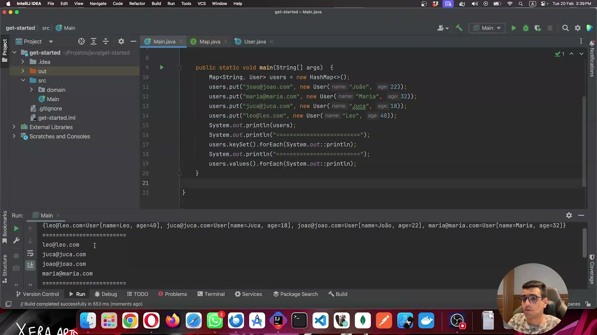
</p>

O código demonstra a criação de um `Map<String, User>` com a implementação `HashMap`. Quatro entradas são inseridas via `put`, associando um e-mail (a **chave**) a um objeto `User` (o **valor**). Em seguida, três formas de iteração são exibidas: impressão direta do mapa, iteração sobre `keySet()` e iteração sobre `values()`. O console mostra o conjunto de chaves (e-mails) separado pelo divisor, confirmando que a ordem de exibição não é garantida no `HashMap`.

```java
public static void main(String[] args) {
    Map<String, User> users = new HashMap<>();
    users.put("joao@joao.com",   new User( name: "João",  age: 22));
    users.put("maria@maria.com", new User( name: "Maria", age: 32));
    users.put("juca@juca.com",   new User( name: "Juca",  age: 18));
    users.put("leo@leo.com",     new User( name: "Leo",   age: 40));

    System.out.println(users);
    System.out.println("=========================");
    users.keySet().forEach(System.out::println);
    System.out.println("=========================");
    users.values().forEach(System.out::println);
}
```

<p align="center">
  
</p>

O console exibe a segunda parte da saída do mesmo código: após o separador de iguais, são listados os **valores** do mapa, ou seja, os objetos `User`. A ordem (`Leo`, `Juca`, `João`, `Maria`) confirma o comportamento do `HashMap`, que não preserva a ordem de inserção. Cada linha representa um `User` formatado pelo `toString` gerado automaticamente pelo `record`.

<p align="center">
  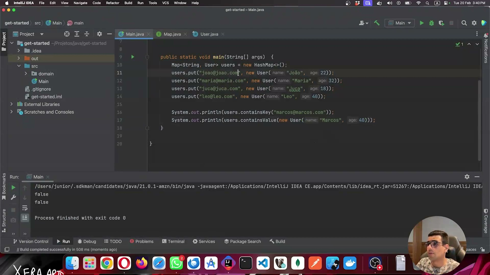
</p>

Demonstração dos métodos `containsKey` e `containsValue`. O código testa se a chave `"marcos@marcos.com"` existe no mapa e se o valor `new User("Marcos", 40)` está presente. Ambos retornam `false`, pois nem a chave nem o valor foram inseridos. O resultado `false / false` no console confirma isso.

```java
System.out.println(users.containsKey("marcos@marcos.com"));
System.out.println(users.containsValue(new User( name: "Marcos", age: 40)));
```

> **Importante:** `containsValue` depende da implementação correta de `equals` e `hashCode` na classe `User`. Por usar `record`, esses métodos são gerados automaticamente.

<p align="center">
  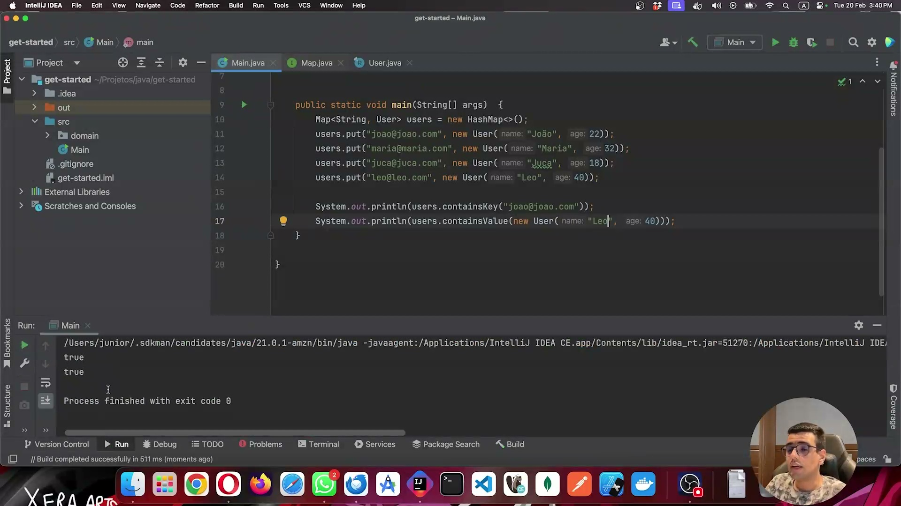
</p>

O mesmo par de chamadas agora com argumentos válidos: a chave `"joao@joao.com"` existe no mapa, e o valor `new User("Leo", 40)` também está presente (pois o `record` compara por valor de campo). Ambos retornam `true`, demonstrando que o `HashMap` localiza corretamente entradas via hash.

```java
System.out.println(users.containsKey("joao@joao.com"));
System.out.println(users.containsValue(new User( name: "Leo", age: 40)));
```

<p align="center">
  
</p>

Demonstração do método `remove(key)`. Ao passar a chave `"joao@joao.com"`, o mapa remove a entrada e **retorna o valor removido** — neste caso, `User[name=João, age=22]`. Esse comportamento é útil quando é preciso remover e ao mesmo tempo capturar o objeto que foi excluído.

```java
System.out.println(users.remove( key: "joao@joao.com"));
// Saída: User[name=João, age=22]
```

<p align="center">
  
</p>

Quando a chave passada ao `remove` contém um caractere extra (um espaço no final: `"joao@joao.com "`), ela não corresponde a nenhuma entrada do mapa. O método retorna `null` em vez do usuário, evidenciando que a comparação de chaves é exata — qualquer diferença de caractere resulta em não-encontrado.

```java
System.out.println(users.remove( key: "joao@joao.com "));
// Saída: null
```

<p align="center">
  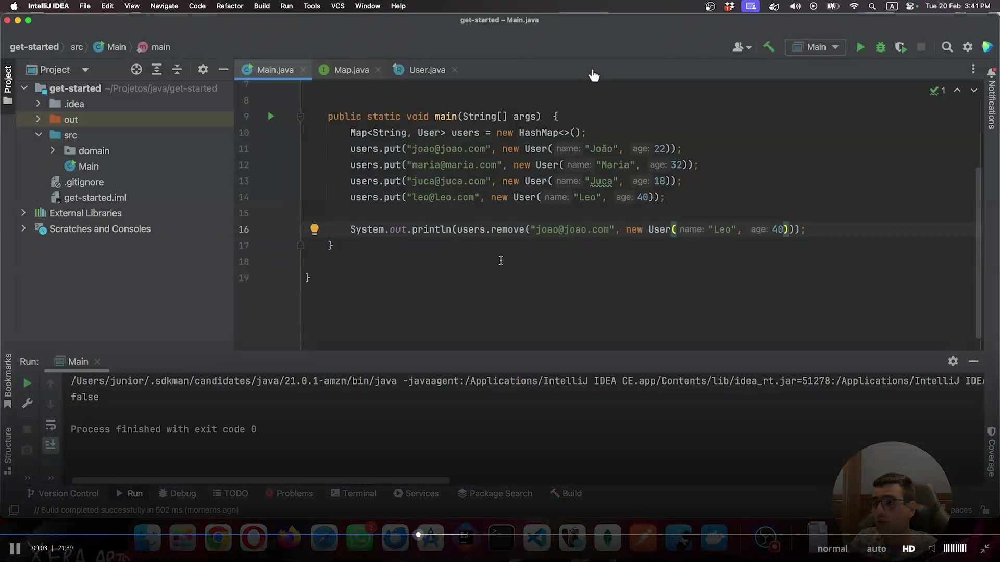
</p>

Demonstração da sobrecarga `remove(key, value)`, que só remove a entrada se **tanto a chave quanto o valor** corresponderem. Aqui, a chave é `"joao@joao.com"` mas o valor fornecido é `new User("Leo", 40)` — que não está associado a essa chave. O retorno é `false`, indicando que a remoção não ocorreu.

```java
System.out.println(users.remove("joao@joao.com", new User( name: "Leo", age: 40)));
// Saída: false
```

<p align="center">
  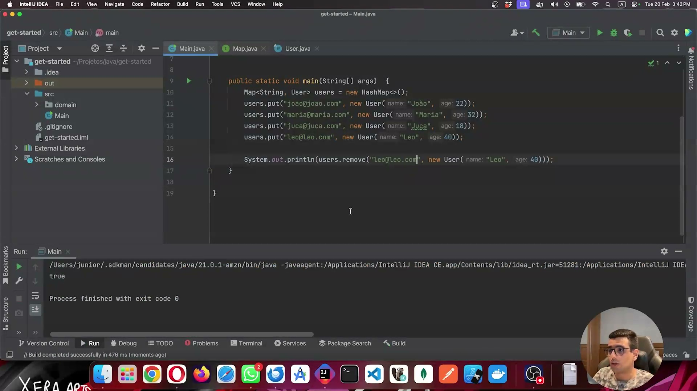
</p>

Agora a sobrecarga `remove(key, value)` é chamada com chave e valor **corretos e correspondentes**: chave `"leo@leo.com"` associada a `new User("Leo", 40)`. A remoção é realizada com sucesso e o método retorna `true`.

```java
System.out.println(users.remove("leo@leo.com", new User( name: "Leo", age: 40)));
// Saída: true
```

<p align="center">
  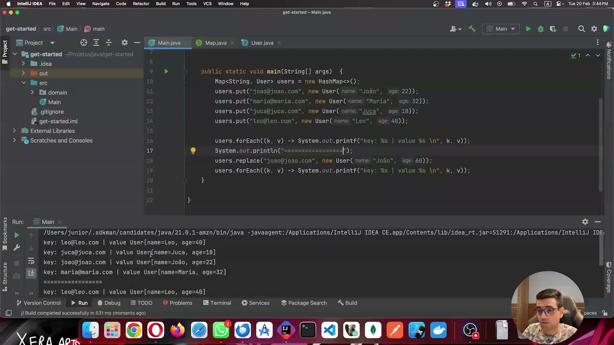
</p>

Demonstração do método `replace`. O mapa é iterado com `forEach` antes e depois da substituição para comparar os estados. O método `replace("joao@joao.com", new User("João", 60))` atualiza apenas o valor associado à chave, sem alterar as demais entradas. O console confirma que a idade de João passou de 22 para 60 após o `replace`.

```java
users.forEach((k, v) -> System.out.printf("key: %s | value %s \n", k, v));
System.out.println("==================");
users.replace("joao@joao.com", new User( name: "João", age: 60));
users.forEach((k, v) -> System.out.printf("key: %s | value %s \n", k, v));
```

<p align="center">
  
</p>

O console exibe o resultado completo da execução com `replace`. Na primeira iteração, João aparece com `age=22`; após o separador, a segunda iteração mostra João com `age=60`, enquanto os demais usuários (Leo, Juca, Maria) permanecem inalterados. Isso confirma que `replace` age de forma cirúrgica, alterando apenas o valor da chave especificada.

<p align="center">
  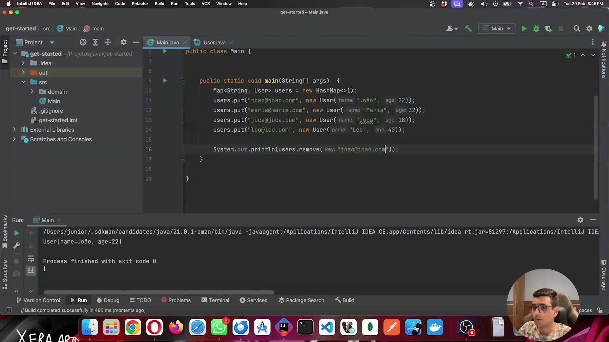
</p>

Retorno ao método `remove(key)` simples, agora em contexto de revisão. A chamada `users.remove("joao@joao.com")` retorna o `User` removido (`User[name=João, age=22]`), confirmando o mesmo comportamento observado anteriormente. O console exibe o objeto e encerra com código 0.

```java
System.out.println(users.remove( key: "joao@joao.com"));
// Saída: User[name=João, age=22]
```

<p align="center">
  
</p>

Demonstração de `containsValue` com valor **incorreto** (nome `"Leo,"` com vírgula, ou instância diferente sem correspondência). O resultado é `false`. A imagem reforça que a comparação de valores no `HashMap` é feita via `equals`, e qualquer diferença — mesmo mínima — resulta em não-encontrado.

```java
System.out.println(users.containsValue(new User( name: "Leo,", age: 40)));
// Saída: false
```

<p align="center">
  
</p>

Agora `containsValue` é chamado com o objeto correto: `new User("Leo", 40)`. O retorno é `true`, confirmando que o `record` `User` compara por igualdade de campos (graças ao `equals` gerado automaticamente), e que o valor existe no mapa.

```java
System.out.println(users.containsValue(new User( name: "Leo", age: 40)));
// Saída: true
```

<p align="center">
  
</p>

Demonstração do método `getOrDefault`. Quando a chave passada não existe no mapa (chave vazia `""`), o método retorna o valor padrão fornecido como segundo argumento: `User[name= , age=-1]`. Isso evita `NullPointerException` em situações onde a chave pode estar ausente.

```java
System.out.println(users.getOrDefault( key: " ", new User( name: " ", age: -1)));
// Saída: User[name= , age=-1]
```

<p align="center">
  
</p>

O mesmo `getOrDefault` agora com uma chave válida: `"juca@juca.com"`. Como essa chave existe no mapa, o método retorna o valor real associado (`User[name=Juca, age=18]`), ignorando o valor padrão. Isso demonstra a lógica condicional interna do método.

```java
System.out.println(users.getOrDefault( key: "juca@juca.com", new User( name: " ", age: -1)));
// Saída: User[name=Juca, age=18]
```

<p align="center">
  
</p>

Demonstração do método `get` simples. Ao passar a chave `"juca@juca.com"`, o mapa retorna `User[name=Juca, age=18]` diretamente. Diferente de `getOrDefault`, o `get` retornará `null` se a chave não existir — sem a possibilidade de fornecer um valor padrão.

```java
System.out.println(users.get("juca@juca.com"));
// Saída: User[name=Juca, age=18]
```

<p align="center">
  
</p>

Quando `get` recebe uma chave que não existe no mapa — aqui `"juca@juca.com "` com espaço extra —, o retorno é `null`. Isso evidencia o risco de usar `get` sem verificação prévia: o `null` pode causar `NullPointerException` se o resultado for utilizado sem tratamento.

```java
System.out.println(users.get("juca@juca.com "));
// Saída: null
```

<p align="center">
  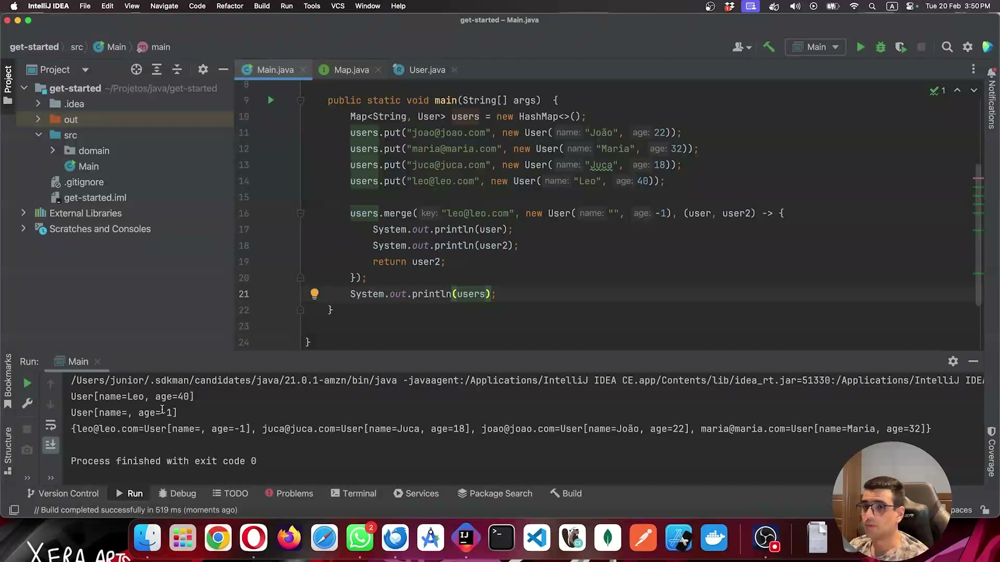
</p>

Demonstração do método `merge`. Ele recebe uma chave, um valor novo e uma `BiFunction`. Se a chave **não existir** no mapa, o valor novo é simplesmente inserido. Se a chave **já existir**, a função é invocada com o valor atual e o novo valor, permitindo decidir qual dos dois será mantido. No exemplo, a chave `"leo@leo.com"` existe, então a função é chamada: ela imprime ambos os usuários e retorna `user2` (o novo), substituindo o anterior. O estado final do mapa mostra Leo com `name=` e `age=-1`.

```java
users.merge( key: "leo@leo.com", new User( name: "", age: -1), (user, user2) -> {
    System.out.println(user);
    System.out.println(user2);
    return user2;
});
System.out.println(users);
```

### 🟩 Vídeo 04 - Tipos primitivos e Wrappers

<video width="60%" controls>
  <source src="000-Midia_e_Anexos/bootcamp_ntt_data_java_spring_ai-modulo.02-curso.04-video_04.webm" type="video/webm">
    Seu navegador não suporta vídeo HTML5.
</video>

link do vídeo: https://web.dio.me/track/ntt-data-2026-ai-java-back-end/course/imersao-pratica-com-collections-e-outras-classes-uteis-do-java/learning/7419b877-5e89-451b-9e53-b1b070bdc307?autoplay=1

### Anotações

#### Footprint de memória — tipos primitivos

<p align="center">
  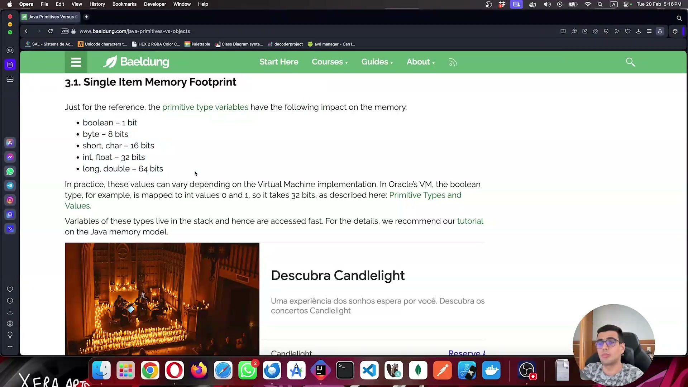
</p>

A imagem exibe o artigo do Baeldung aberto no navegador, na seção **3.1 – Single Item Memory Footprint**. O artigo lista o espaço ocupado em memória por cada tipo primitivo do Java:

| Tipo | Tamanho |
|---|---|
| `boolean` | 1 bit |
| `byte` | 8 bits |
| `short`, `char` | 16 bits |
| `int`, `float` | 32 bits |
| `long`, `double` | 64 bits |

Esses valores podem variar conforme a implementação da JVM. Na VM da Oracle, por exemplo, o tipo `boolean` é mapeado internamente como `int` (0 ou 1), ocupando 32 bits na prática. Variáveis primitivas vivem na **stack** e por isso são acessadas de forma muito eficiente.

#### Footprint de memória — tipos wrapper (objetos)

<p align="center">
  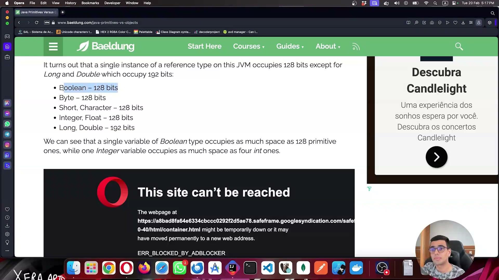
</p>

A imagem continua o artigo do Baeldung, agora mostrando o tamanho ocupado pelos **tipos wrapper** (classes que encapsulam os tipos primitivos) na JVM. Um único objeto de tipo de referência ocupa 128 bits, exceto `Long` e `Double`, que ocupam 192 bits:

| Wrapper | Tamanho |
|---|---|
| `Boolean` | 128 bits |
| `Byte` | 128 bits |
| `Short`, `Character` | 128 bits |
| `Integer`, `Float` | 128 bits |
| `Long`, `Double` | 192 bits |

Isso significa que um `Boolean` ocupa 128 vezes mais espaço que um `boolean` primitivo, e um `Integer` ocupa o equivalente a quatro variáveis `int`. Essa diferença substancial justifica a atenção à escolha entre primitivo e wrapper.

#### Autoboxing em loop — alerta do IntelliJ

<p align="center">
  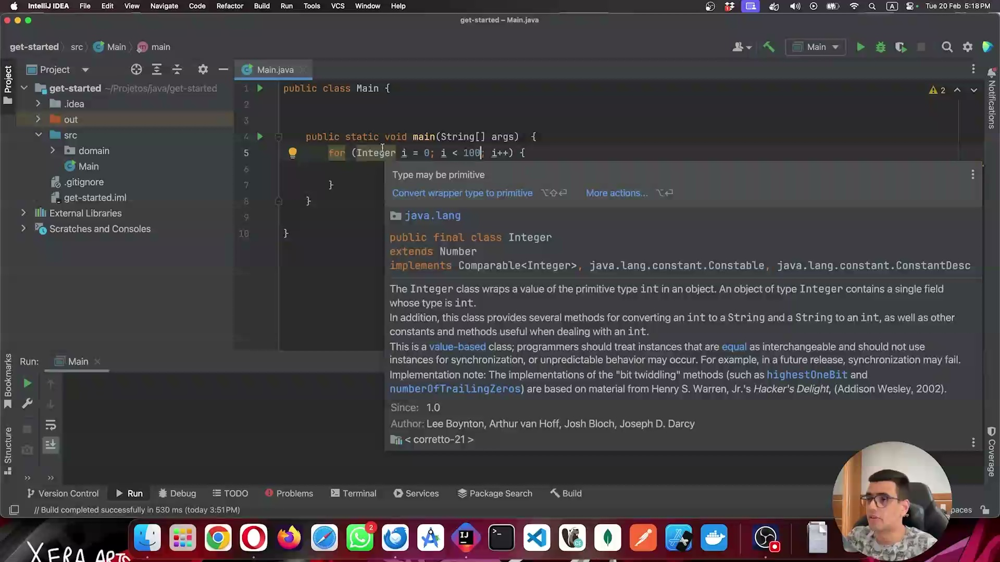
</p>

A imagem mostra o IntelliJ IDEA com um `for` loop declarando a variável de controle como `Integer` (wrapper) em vez de `int` (primitivo). O IDE emite um aviso — **"Type may be primitive"** — sugerindo converter o tipo wrapper para primitivo.

```java
for (Integer i = 0; i < 100; i++) {
    // ...
}
```

O alerta existe porque, a cada iteração, o Java realiza operações de **autoboxing** (empacotamento do `int` primitivo em `Integer`) e **unboxing** (desempacotamento de volta para `int`), gerando objetos temporários desnecessários e impondo custo extra ao garbage collector.

#### Autoboxing explícito e o custo de desempacotamento

<p align="center">
  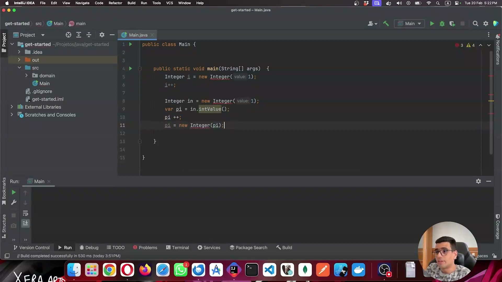
</p>

A imagem exibe um trecho de código que ilustra de forma explícita o que acontece por baixo dos panos quando se usa `Integer` com operações de incremento:

```java
Integer i = new Integer(value: 1);
i++;

Integer in = new Integer(value: 1);
var pi = in.intValue();
pi++;
pi = new Integer(pi);
```

O exemplo mostra que `i++` em um `Integer` equivale a: (1) desempacotar o valor primitivo com `intValue()`, (2) incrementá-lo, e (3) criar um **novo objeto `Integer`** para armazenar o resultado. Esse ciclo de criação e descarte de objetos é o custo real do autoboxing em operações repetitivas.

#### Tipos primitivos não aceitam null — erro de compilação

<p align="center">
  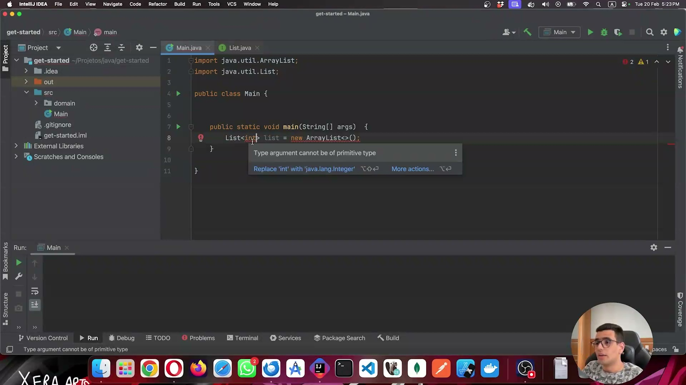
</p>

A imagem mostra o IntelliJ IDEA com um erro de compilação ao tentar atribuir `null` a uma variável do tipo primitivo `int`:

```java
int i = null; // ERRO: Incompatible types. Found: 'null', required: 'int'
```

O IDE indica que o tipo requerido é `int` mas foi fornecido `null`. Tipos primitivos **não aceitam valores nulos** — eles sempre têm um valor padrão (ex.: `0` para `int`). Quando a necessidade de representar ausência de valor (`null`) for requisito, o correto é usar o wrapper `Integer`, que por ser um objeto pode receber `null`.

#### Tipos primitivos — declaração dos 8 tipos

<p align="center">
  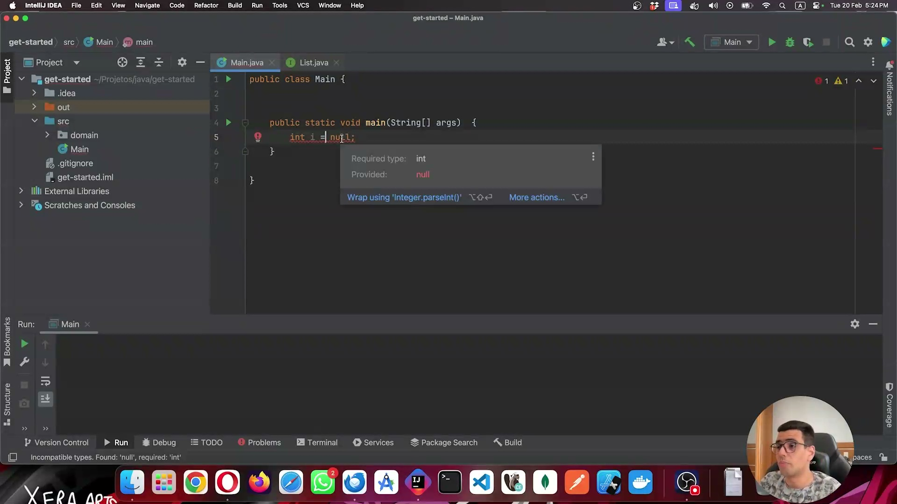
</p>

A imagem exibe todos os 8 tipos primitivos do Java declarados no método `main`:

```java
boolean b;
byte by;
short s;
char c;
int i;
float f;
long l;
double d;
```

O IDE exibe o aviso **"Variable 'b' is never used"**, pois as variáveis foram declaradas mas não utilizadas. Essa visão panorâmica serve para relembrar o conjunto completo de primitivos disponíveis em Java.

#### Tipos wrapper — declaração das classes correspondentes

<p align="center">
  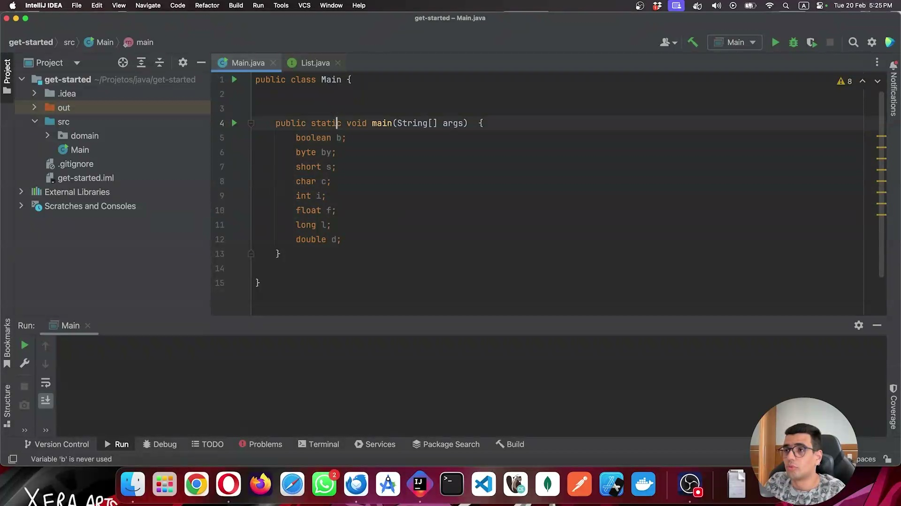
</p>

A imagem exibe a declaração das classes wrapper correspondentes a cada tipo primitivo:

```java
Boolean b;
Byte by;
Short s;
Character c;
Integer i;
Float f;
Long l;
Double d;
```

A regra geral para lembrar o nome do wrapper é **iniciar a primeira letra em maiúsculo**. As exceções são `char` → `Character` e `int` → `Integer`. Conhecer esse mapeamento é essencial para usar coleções genéricas (`List<Integer>`, `Map<String, Double>`, etc.), pois generics em Java **não aceitam tipos primitivos**.

#### Passagem por valor — comportamento com tipo primitivo

<p align="center">
  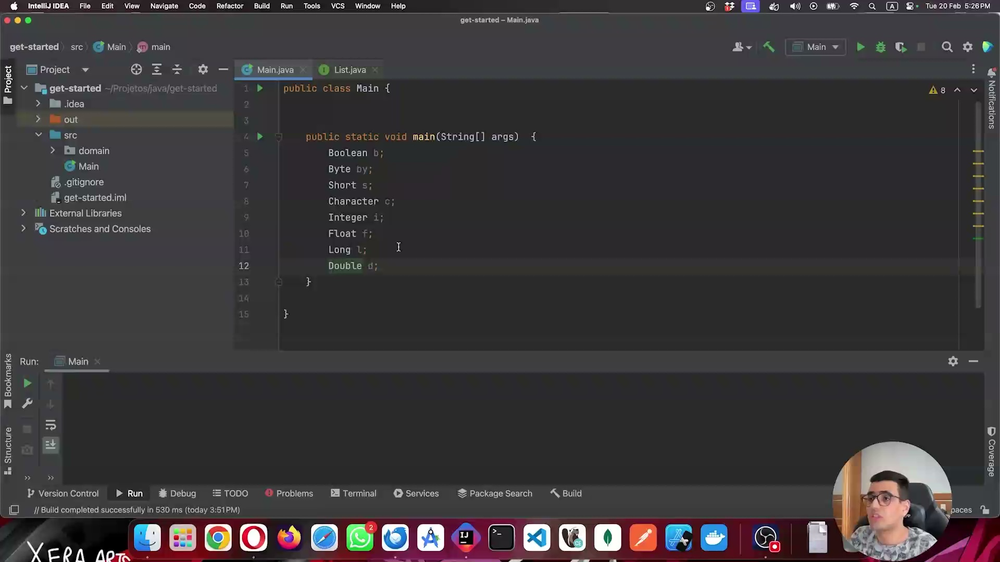
</p>

A imagem mostra um experimento clássico com **passagem por valor** em Java usando tipo primitivo:

```java
public static void main(String[] args) {
    int i = 0;
    printValue(i);
    System.out.println(i); // imprime 0
}

private static void printValue(int i) {
    System.out.println(++i); // imprime 1
}
```

A saída no console é `1` (dentro do método) e `0` (após o retorno). Isso demonstra que, ao passar um primitivo para um método, é feita uma **cópia do valor** — o incremento dentro de `printValue` não afeta a variável original em `main`.

#### Uso de `final` no parâmetro do método

<p align="center">
  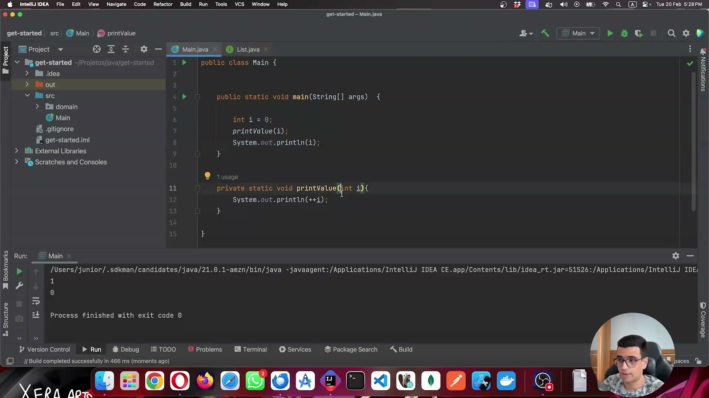
</p>

A imagem mostra a aplicação do modificador `final` no parâmetro do método para evitar reatribuições acidentais, e como contornar a restrição criando uma variável local:

```java
private static void printValue(final int i) {
    var ii = i;
    System.out.println(++ii); // imprime 1
}
```

Declarar o parâmetro como `final` impede que ele seja reatribuído diretamente dentro do método, tornando a intenção mais clara. Para realizar a operação de incremento, cria-se uma variável local `ii` que recebe o valor de `i` e pode ser manipulada livremente.

#### Passagem por referência — comportamento com objeto

<p align="center">
  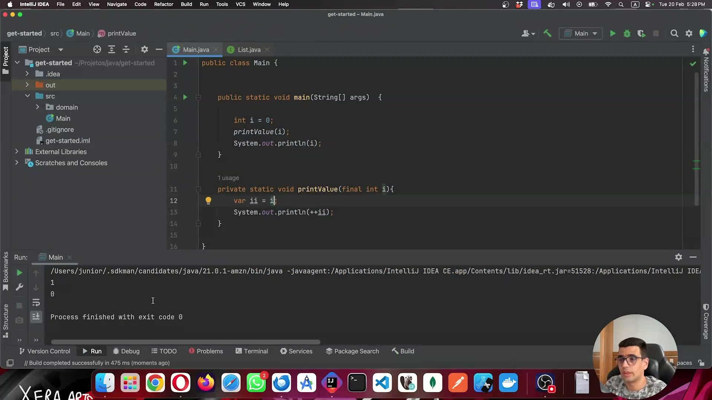
</p>

A imagem mostra o experimento análogo ao anterior, agora com um objeto do tipo `User` sendo passado ao método:

```java
public static void main(String[] args) {
    var user = new User(name: "João", age: 20);
    printValue(user);
    System.out.println(user); // User{name='Maria', age=33}
}

private static void printValue(User user) {
    user = new User(name: "Maria", age: 33);
    System.out.println(user); // User{name='Maria', age=33}
}
```

O console exibe `User{name='Maria', age=33}` seguido de `User{name='João', age=20}`. Quando um novo objeto é criado dentro do método (`user = new User(...)`), a referência local é substituída, mas a variável original em `main` permanece apontando para o objeto inicial — **reatribuir a referência localmente não afeta o chamador**.

#### Modificação de propriedades via referência com `final`

<p align="center">
  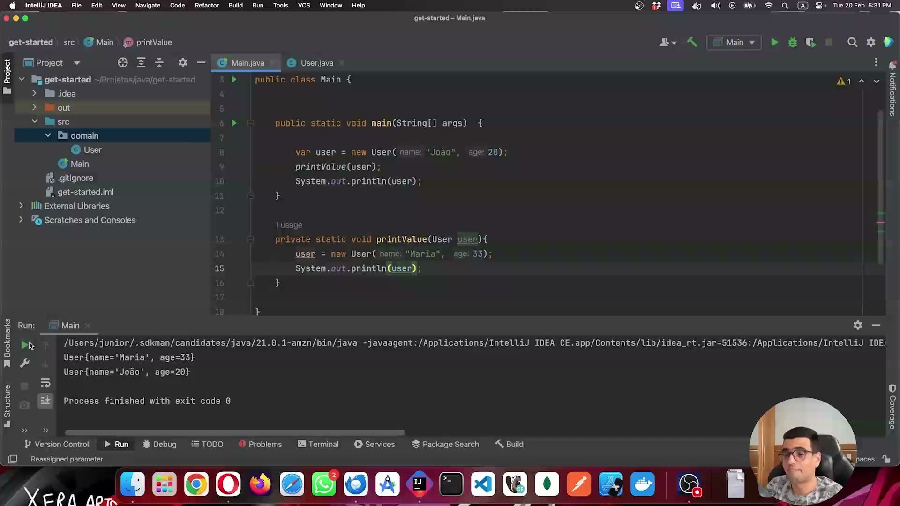
</p>

A imagem exibe o cenário em que o parâmetro do método é declarado como `final` para impedir a reatribuição da referência, mas as **propriedades internas do objeto ainda podem ser alteradas**:

```java
private static void printValue(final User user) {
    user.setName("Maria");
    user.setAge(33);
    System.out.println(user);
}
```

A saída mostra `User{name='Maria', age=33}` em ambas as linhas do console, pois o `final` protege a referência (impede `user = new User(...)`) mas **não torna as propriedades do objeto imutáveis**. Alterações feitas via setters refletem no objeto original, já que ambas as variáveis apontam para a mesma instância na heap.

#### Conclusão — primitivo vs. wrapper e boas práticas

<p align="center">
  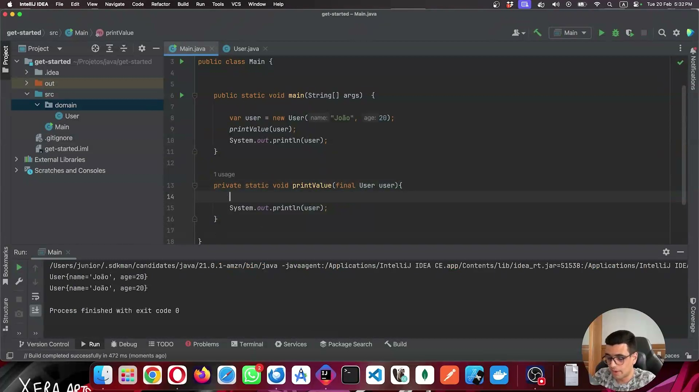
</p>

A imagem exibe o código final consolidado com `final` no parâmetro e o retorno do objeto modificado, acompanhado de um aviso do IntelliJ sinalizando que o valor de retorno não está sendo utilizado (`return value of methods never used`):

```java
private static void printValue(final User user) {
    user.setName("Maria");
    user.setAge(33);
    System.out.println(user);
}
```

A recomendação prática da aula é: prefira manipular objetos no **ponto onde foram criados** para evitar efeitos colaterais difíceis de rastrear. Se modificações dentro de um método forem inevitáveis, considere **retornar o objeto alterado** ao invés de depender da mutação por referência, tornando o fluxo de dados explícito.

#### Recapitulação — autoboxing e unboxing

<p align="center">
  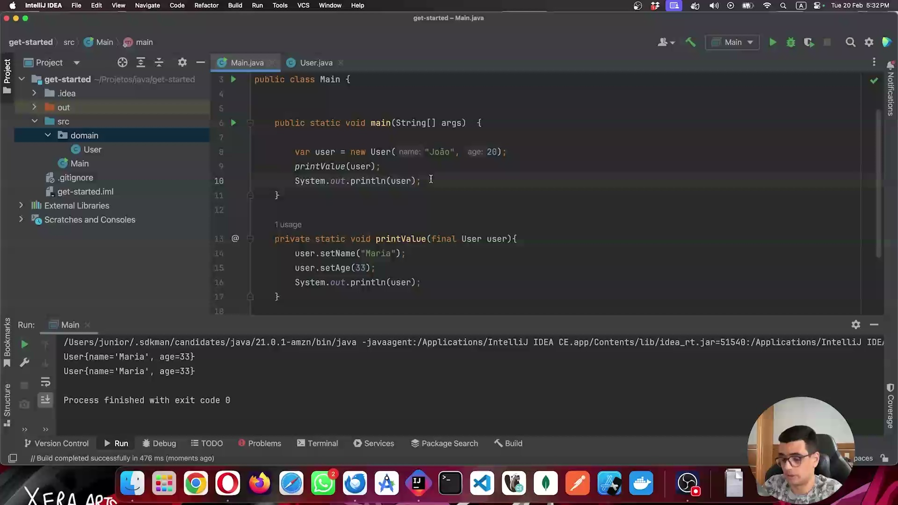
</p>

A imagem exibe a visão interna da classe `Integer` no IntelliJ, mostrando que ela estende `Number` e contém um campo `int value` (o primitivo encapsulado), além de constantes como `MIN_VALUE` e `MAX_VALUE` e a implementação de diversas interfaces:

```java
public final class Integer extends Number
    implements Comparable<Integer>, Constable, ConstantDesc {

    private final int value; // o primitivo armazenado internamente
    // ...
}
```

Essa estrutura interna explica por que os tipos wrapper ocupam tanto mais memória do que seus equivalentes primitivos — eles carregam metadados, herança de classe, cabeçalho de objeto da JVM e campos adicionais. O **autoboxing** (primitivo → objeto) e o **unboxing** (objeto → primitivo) são conversões automáticas introduzidas no Java 5 que, quando usadas de forma descuidada em loops ou operações repetitivas, podem impactar a performance e sobrecarregar o garbage collector.


## Parte 3 - Classes String, StringBuilder e StringBuffer

### 🟩 Vídeo 05 - Classe String

<video width="60%" controls>
  <source src="000-Midia_e_Anexos/bootcamp_ntt_data_java_spring_ai-modulo.02-curso.04-video_05.webm" type="video/webm">
    Seu navegador não suporta vídeo HTML5.
</video>

link do vídeo: https://web.dio.me/track/ntt-data-2026-ai-java-back-end/course/imersao-pratica-com-collections-e-outras-classes-uteis-do-java/learning/47b5dfa0-75b8-4c30-b042-0384cac77f5e?autoplay=1

### Anotações

#### `replace` — Substituindo caracteres em uma String

<p align="center">
  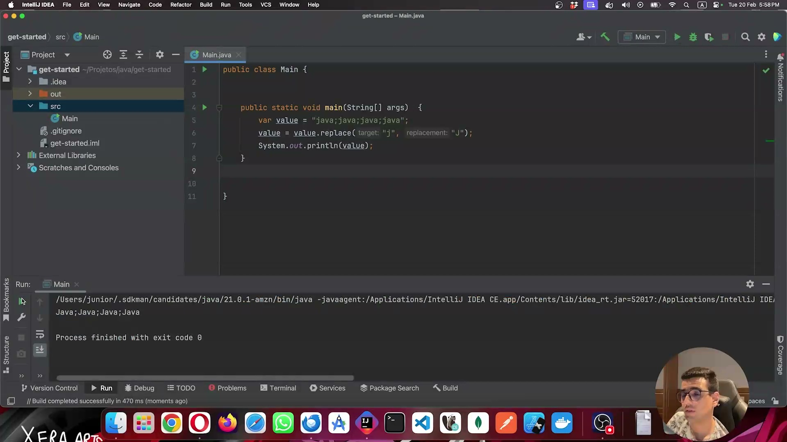
</p>

O método `replace` da classe `String` substitui **todas** as ocorrências de um caractere ou sequência por outro valor. No exemplo abaixo, todas as letras `"j"` minúsculas são trocadas por `"J"` maiúsculo na string `"java;java;java;java"`, e o resultado é impresso:

```java
public class Main {
    public static void main(String[] args) {
        var value = "java;java;java;java";
        value = value.replace("j", "J");
        System.out.println(value);
    }
}
```

**Saída:** `Java;Java;Java;Java`

> O método `replace` retorna uma **nova string** com as substituições aplicadas — por isso é necessário reatribuir o resultado à variável `value`.

#### `split` sem delimitador — Quebrando caractere a caractere

<p align="center">
  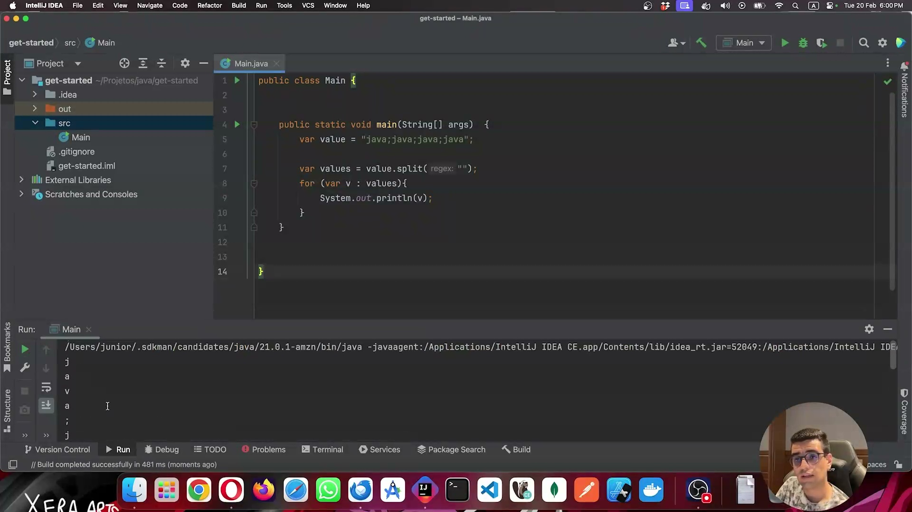
</p>

O método `split` divide uma string em um array de substrings com base em um padrão (regex). Quando chamado com uma string vazia (`""`), ele quebra **cada caractere individualmente**. O laço `for-each` percorre o array e imprime cada elemento:

```java
public class Main {
    public static void main(String[] args) {
        var value = "java;java;java;java";

        var values = value.split("");
        for (var v : values) {
            System.out.println(v);
        }
    }
}
```

**Saída:** cada caractere da string em uma linha separada (`j`, `a`, `v`, `a`, `;`, `j`, ...).

#### `split` com delimitador — Dividindo por ponto e vírgula

<p align="center">
  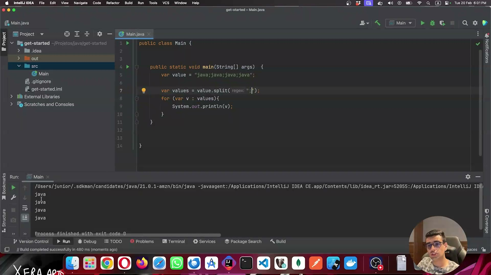
</p>

Ao passar `";"` como delimitador para o `split`, a string é dividida nos pontos onde o ponto e vírgula aparece. Cada parte resultante é um elemento do array:

```java
public class Main {
    public static void main(String[] args) {
        var value = "java;java;java;java";

        var values = value.split(";");
        for (var v : values) {
            System.out.println(v);
        }
    }
}
```

**Saída:**
```
java
java
java
java
```

#### `split` com limite — Controlando o número de divisões

<p align="center">
  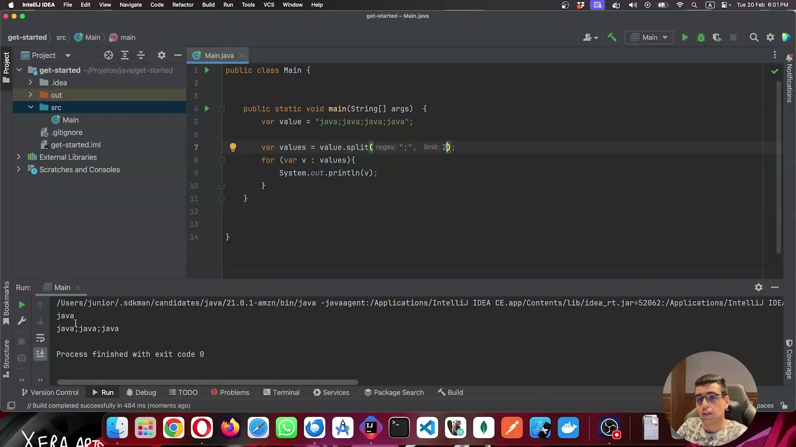
</p>

O método `split` aceita um segundo parâmetro `limit`, que define o número máximo de elementos no array resultante. Com `limit: 2`, apenas a **primeira ocorrência** do delimitador é usada para dividir:

```java
public class Main {
    public static void main(String[] args) {
        var value = "java;java;java;java";

        var values = value.split(";", 2);
        for (var v : values) {
            System.out.println(v);
        }
    }
}
```

**Saída:**
```
java
java;java;java
```

O primeiro elemento é `"java"` e o segundo contém o restante da string, sem novas divisões.

#### `toUpperCase` e `toLowerCase` — Alterando a capitalização

<p align="center">
  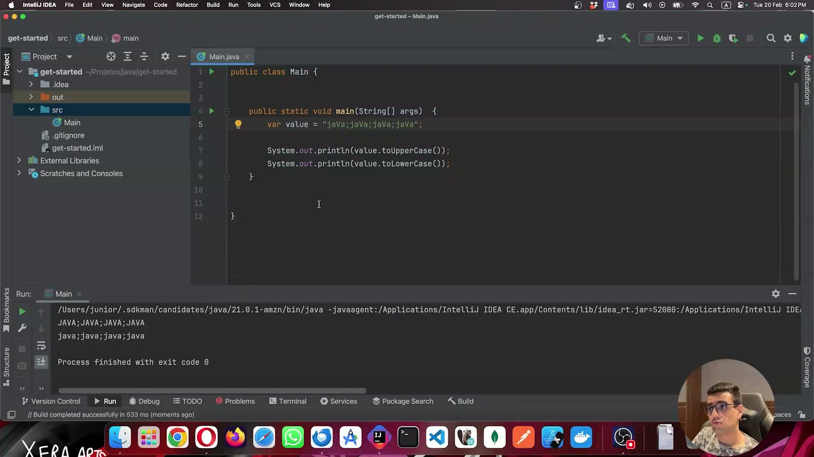
</p>

Os métodos `toUpperCase()` e `toLowerCase()` convertem todos os caracteres da string para maiúsculo ou minúsculo, respectivamente. Ambos retornam uma nova string sem modificar a original:

```java
public class Main {
    public static void main(String[] args) {
        var value = "jaVa;jaVa;jaVa;jaVa";

        System.out.println(value.toUpperCase());
        System.out.println(value.toLowerCase());
    }
}
```

**Saída:**
```
JAVA;JAVA;JAVA;JAVA
java;java;java;java
```

#### `contains` — Verificando a presença de uma substring

<p align="center">
  
</p>

O método `contains` verifica se a string contém uma determinada sequência de caracteres, retornando `true` ou `false`. A comparação é **case-sensitive** — letras maiúsculas e minúsculas são tratadas como diferentes:

```java
public class Main {
    public static void main(String[] args) {
        var value = "java;java;java;java";
        System.out.println(value.contains("V"));
    }
}
```

**Saída:** `false`

> O IntelliJ IDEA exibe um aviso de análise estática: `"Result of 'value.contains("V")' is always 'false'"`, pois a string literal não contém `"V"` maiúsculo.

#### `indexOf` — Encontrando o índice de uma substring

<p align="center">
  
</p>

O método `indexOf` retorna a posição (índice base zero) da primeira ocorrência de uma string dentro da string alvo. A sobrescrita com `fromIndex` permite definir a partir de qual posição a busca deve começar:

```java
public class Main {
    public static void main(String[] args) {
        var value = "java;java;java;java";
        System.out.println(value.indexOf("j", 1));
    }
}
```

**Saída:** `5`

Iniciando a busca a partir do índice `1`, o método ignora o `"j"` na posição `0` e encontra a próxima ocorrência na posição `5`.

#### `isEmpty` — Verificando se a string está vazia

<p align="center">
  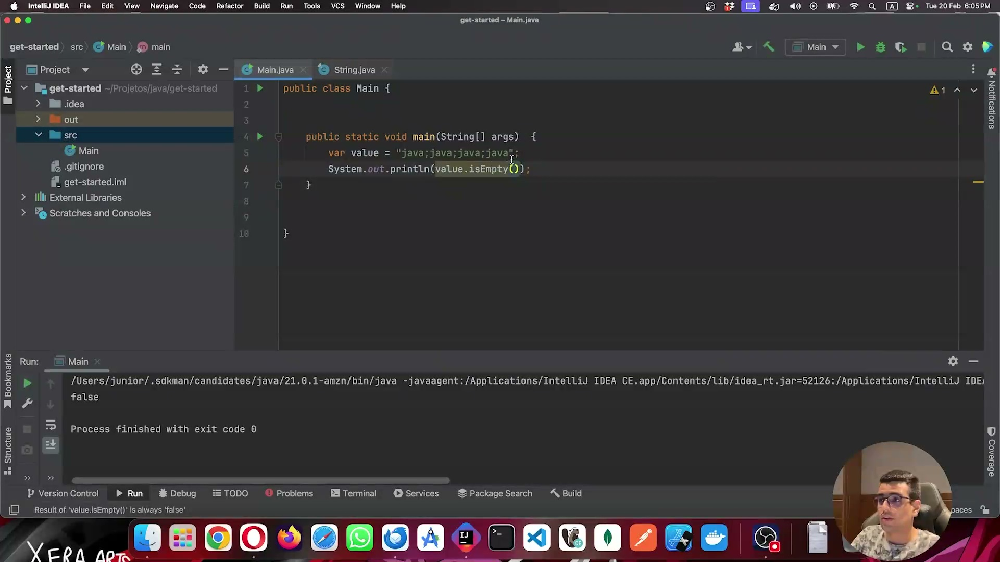
</p>

O método `isEmpty()` retorna `true` apenas se a string tiver comprimento zero (sem nenhum caractere). Strings que contêm apenas espaços em branco **não** são consideradas vazias por este método:

```java
public class Main {
    public static void main(String[] args) {
        var value = "java;java;java;java";
        System.out.println(value.isEmpty());
    }
}
```

**Saída:** `false`

> O IntelliJ exibe o aviso `"Result of 'value.isEmpty()' is always 'false'"`, pois a string é declarada com conteúdo fixo.

#### `isBlank` — Verificando se a string está em branco

<p align="center">
  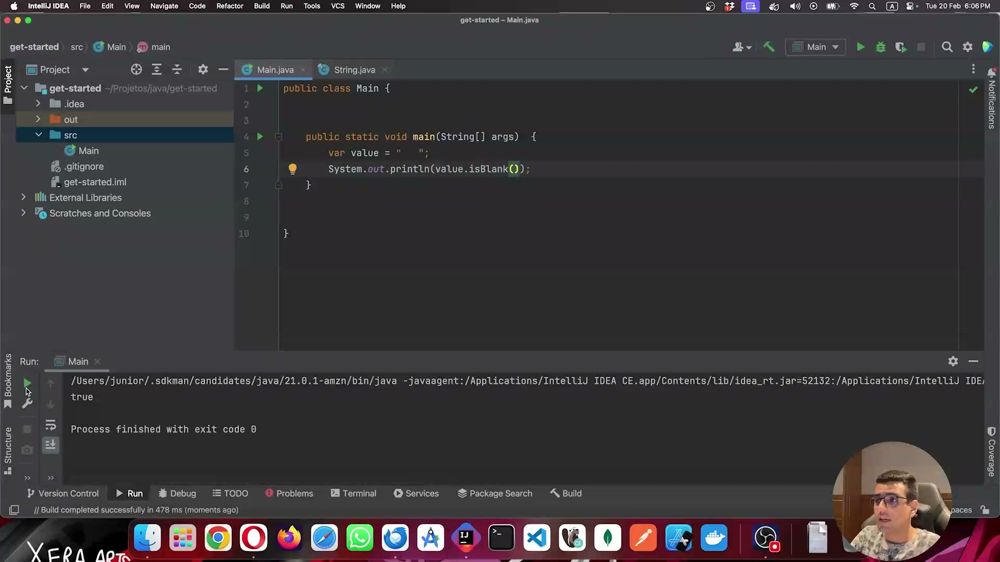
</p>

Diferente de `isEmpty`, o método `isBlank()` retorna `true` tanto para strings vazias quanto para strings compostas **apenas por espaços em branco**. Isso o torna mais adequado para validações de entrada do usuário:

```java
public class Main {
    public static void main(String[] args) {
        var value = "   ";
        System.out.println(value.isBlank());
    }
}
```

**Saída:** `true`

> Use `isBlank()` quando quiser garantir que a string não é apenas espaços; use `isEmpty()` quando precisar verificar se ela tem comprimento zero.

#### `substring` — Extraindo uma parte da string

<p align="center">
  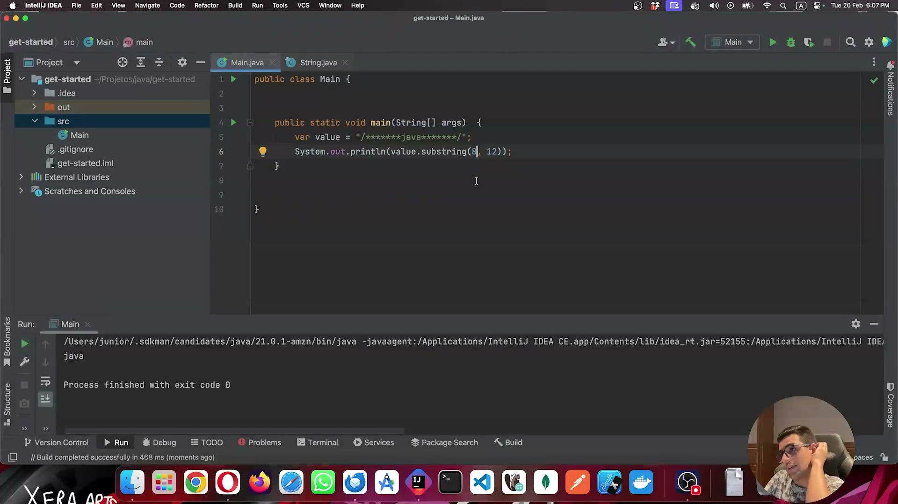
</p>

O método `substring(beginIndex, endIndex)` extrai uma porção da string. O `beginIndex` é **inclusivo** (o caractere nessa posição é incluído) e o `endIndex` é **exclusivo** (o caractere nessa posição não é incluído):

```java
public class Main {
    public static void main(String[] args) {
        var value = "/********java********/";
        System.out.println(value.substring(8, 12));
    }
}
```

**Saída:** `java`

Os índices `8` (inclusivo) a `12` (exclusivo) delimitam exatamente os quatro caracteres da palavra `"java"` dentro da string.

#### Manipulação de JSON com `replace` e `split`

<p align="center">
  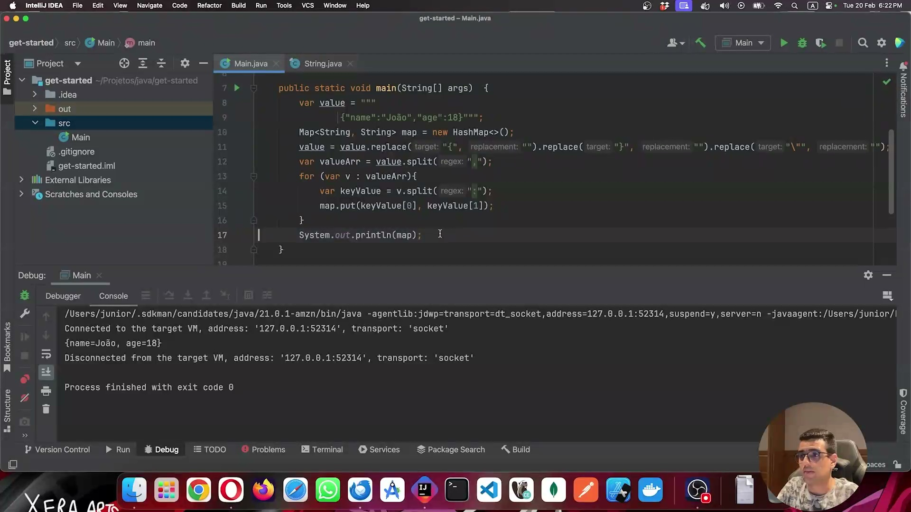
</p>

Este exemplo demonstra uma abordagem prática para parsear manualmente um JSON simples usando métodos da classe `String`. A estratégia é: remover os delimitadores estruturais (`{`, `}`, `"`) com `replace`, dividir a string resultante pela vírgula, e depois dividir cada par `chave:valor` pelos dois pontos para popular um `HashMap`:

```java
public class Main {
    public static void main(String[] args) {
        var value = """
                {"name":"João","age":18}""";

        Map<String, String> map = new HashMap<>();
        value = value.replace("{", "").replace("}", "").replace("\"", "");
        var valueArr = value.split(",");
        for (var v : valueArr) {
            var keyValue = v.split(":");
            map.put(keyValue[0], keyValue[1]);
        }
        System.out.println(map);
    }
}
```

**Saída:** `{name=João, age=18}`

> O uso de **text blocks** (aspas triplas `"""`) é uma funcionalidade introduzida no Java 15/17 que permite declarar strings com aspas duplas internas sem precisar de caracteres de escape.

#### Tabela de especificadores do `String.format`

<p align="center">
  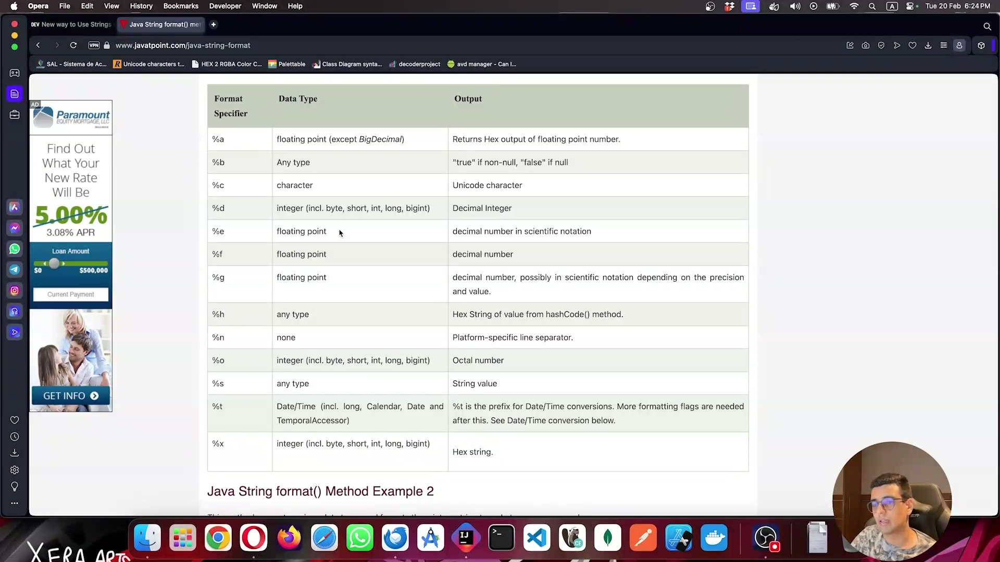
</p>

A imagem exibe uma tabela de referência do site JavaPoint com os especificadores de formato aceitos pelo método `String.format` (e pelo `System.out.printf`). Cada especificador define como um argumento será formatado na string de saída:

| Especificador | Tipo de dado | Saída |
|---|---|---|
| `%a` | ponto flutuante (exceto BigDecimal) | representação hexadecimal |
| `%b` | qualquer tipo | `"true"` se não-nulo, `"false"` se nulo |
| `%c` | caractere | Unicode do caractere |
| `%d` | inteiro (byte, short, int, long, bigint) | número inteiro decimal |
| `%e` | ponto flutuante | número decimal em notação científica |
| `%f` | ponto flutuante | número decimal |
| `%n` | nenhum | separador de linha da plataforma |
| `%o` | inteiro | número octal |
| `%s` | qualquer tipo | valor como String |
| `%x` | inteiro | string hexadecimal |

#### `String.format` — Formatando strings dinamicamente

<p align="center">
  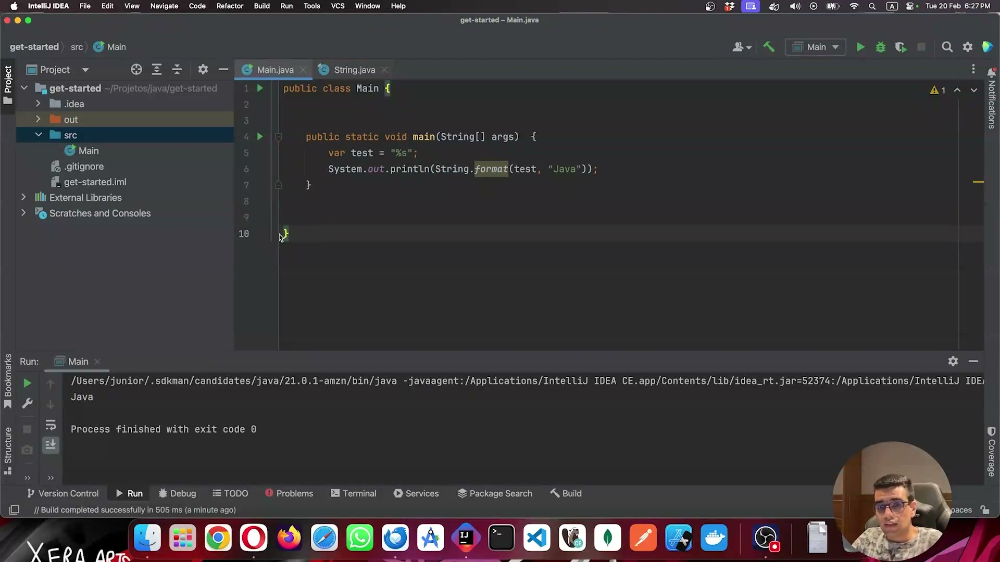
</p>

O método estático `String.format` permite construir strings formatadas usando especificadores como `%s` (para strings). É útil quando se precisa montar uma string com valores dinâmicos sem realizar impressão imediata — o resultado pode ser atribuído a uma variável:

```java
public class Main {
    public static void main(String[] args) {
        var test = "%s";
        System.out.println(String.format(test, "Java"));
    }
}
```

**Saída:** `Java`

> Além de `String.format`, o mesmo resultado pode ser obtido com `System.out.printf`. A diferença é que `printf` imprime diretamente, enquanto `String.format` retorna a string formatada, permitindo atribuição a uma variável para uso posterior.    


### 🟩 Vídeo 06 - Classes StringBuilder e StringBuffer

<video width="60%" controls>
  <source src="000-Midia_e_Anexos/bootcamp_ntt_data_java_spring_ai-modulo.02-curso.04-video_06.webm" type="video/webm">
    Seu navegador não suporta vídeo HTML5.
</video>

link do vídeo: https://web.dio.me/track/ntt-data-2026-ai-java-back-end/course/imersao-pratica-com-collections-e-outras-classes-uteis-do-java/learning/2e9561e8-5b04-4ca7-8719-66c9204a6a21?autoplay=1

### Anotações

#### String, StringBuilder e StringBuffer — Benchmark de Concatenação em Java

O código exibido implementa um **benchmark comparativo** entre três formas de concatenação de strings em Java, medindo o tempo de execução de cada uma com **200.000 iterações**. Cada bloco é cronometrado individualmente usando `OffsetDateTime.now()` como marcador de início e fim, com a diferença calculada em milissegundos pelo método auxiliar `getInterval`.

**Bloco 1 — `String` com `+=`** (linhas 10–25): A cada iteração, como `String` é **imutável**, o Java descarta o objeto anterior e aloca um novo na memória com o conteúdo concatenado. Repetido 200 mil vezes, esse comportamento gera um custo crescente de alocação e coleta de lixo (*garbage collection*).

**Bloco 2 — `StringBuilder` (single-thread)** (linhas 27–44): `StringBuilder` é **mutável** — mantém um buffer interno que cresce conforme necessário. O método `.append()` opera sobre o mesmo objeto em memória, sem criar objetos intermediários. É a escolha de maior desempenho para ambientes de thread única.

**Bloco 3 — `StringBuffer` (multi-thread)** (linhas 46–66): Possui o mesmo comportamento mutável do `StringBuilder`, porém seus métodos são **sincronizados** (`synchronized`), tornando-o seguro para acesso concorrente por múltiplas threads. Essa sincronização introduz um pequeno custo adicional em relação ao `StringBuilder`.

**Método auxiliar `getInterval`** (linhas 68–77): Recebe dois instantes `OffsetDateTime` e retorna a diferença em milissegundos via `Duration.between(...).toMillis()`, servindo como cronômetro reutilizável para os três blocos.

```java
import java.time.Duration;
import java.time.OffsetDateTime;

public class Main {
    public static void main(String[] args) {

        // =========================================================================
        // 1. ABORDAGEM TRADICIONAL: String com o operador +=
        // =========================================================================
        // Captura o momento exato antes de iniciar o loop da String.
        var stringStart = OffsetDateTime.now();

        String stringConcat = "";
        for (int i = 0; i < 200_000; i++) {
            // PROBLEMA CRÍTICO: Strings em Java são IMUTÁVEIS.
            // A cada iteração, o Java não "aumenta" a string existente.
            // Ele cria uma NOVA String na memória, copia o conteúdo antigo e adiciona o novo "i".
            // Fazer isso 200 mil vezes gera um overhead gigantesco de alocação de memória e lixo.
            stringConcat += i;
        }

        // Captura o momento em que o loop da String terminou.
        var stringEnd = OffsetDateTime.now();
        // Imprime o tempo gasto em milissegundos. Spoiler: vai demorar bastante!
        System.out.printf("String: %s \n", getInterval(stringStart, stringEnd));

        // =========================================================================
        // 2. ABORDAGEM PERFORMANCE (Single-thread): StringBuilder
        // =========================================================================
        // Captura o momento inicial para o teste do StringBuilder.
        var builderStart = OffsetDateTime.now();

        // StringBuilder é MUTÁVEL. Ele cria um buffer interno (array) que cresce conforme necessário.
        StringBuilder builderConcat = new StringBuilder();
        for (int i = 0; i < 200_000; i++) {
            // O método append() modifica o MESMO objeto na memória.
            // Não há criação de milhares de objetos temporários. É extremamente rápido.
            builderConcat.append(i);
        }

        // Captura o término do loop do StringBuilder.
        var builderEnd = OffsetDateTime.now();
        // Imprime o tempo. Será praticamente instantâneo comparado ao primeiro método.
        System.out.printf("StringBuilder(singlethread): %s \n", getInterval(builderStart, builderEnd));

        // =========================================================================
        // 3. ABORDAGEM SEGURA (Multi-thread): StringBuffer
        // =========================================================================
        // Captura o momento inicial para o teste do StringBuffer.
        var bufferStart = OffsetDateTime.now();

        // StringBuffer possui o mesmo comportamento mutável do StringBuilder, MAS seus métodos
        // são sincronizados (contêm a palavra-chave 'synchronized').
        // Isso o torna seguro para ser usado por várias Threads ao mesmo tempo (Thread-Safe).
        StringBuffer bufferConcat = new StringBuffer();
        for (int i = 0; i < 200_000; i++) {
            // Como este código roda em apenas uma Thread principal (main), o mecanismo de
            // sincronização gera um pequeno "pedágio" de performance desnecessário aqui.
            bufferConcat.append(i);
        }

        // Captura o término do loop do StringBuffer.
        var bufferEnd = OffsetDateTime.now();
        // Será muito mais rápido que a String pura, mas ligeiramente mais lento que o StringBuilder.
        System.out.printf("StringBuffer(multithread): %s \n", getInterval(bufferStart, bufferEnd));
    }

    /**
     * Método auxiliar para calcular a diferença de tempo entre dois pontos.
     * @param start  Ponto de partida no tempo
     * @param end    Ponto de chegada no tempo
     * @return       Duração total convertida em milissegundos
     */
    private static long getInterval(final OffsetDateTime start, final OffsetDateTime end) {
        // Calcula a duração entre as duas datas e retorna o valor em milissegundos (toMillis).
        return Duration.between(start, end).toMillis();
    }
}
```

#### Resultado da Execução no IntelliJ IDEA

<p align="center">
  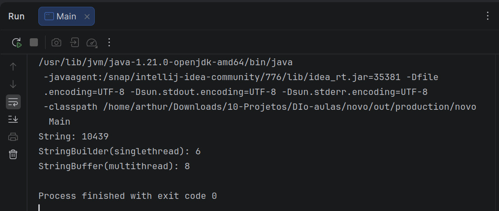
</p>

A saída do painel **Run** do IntelliJ IDEA exibe os tempos medidos em milissegundos para as três abordagens com 200.000 iterações:

| Abordagem | Tempo medido |
|---|---|
| `String` (operador `+=`) | **10.439 ms** (~10 segundos) |
| `StringBuilder` (single-thread) | **6 ms** |
| `StringBuffer` (multi-thread) | **8 ms** |

O resultado confirma na prática o impacto da imutabilidade da classe `String`: realizar 200 mil concatenações com `+=` consumiu mais de 10 segundos, enquanto `StringBuilder` e `StringBuffer` concluíram a mesma operação em menos de 10 milissegundos — uma diferença superior a **1.000×**.

A pequena diferença entre `StringBuilder` (6 ms) e `StringBuffer` (8 ms) é atribuída ao mecanismo de sincronização do `StringBuffer`. Como o código roda em uma única thread (a thread `main`), o overhead de sincronização é desnecessário nesse contexto — o que reforça que `StringBuilder` é a escolha adequada para ambientes single-thread, reservando `StringBuffer` para cenários com acesso concorrente real.


## Parte 4 - Aplicando o BigDecimal, Enums e Classe Optional

### 🟩 Vídeo 07 - Classe BigDecimal

<video width="60%" controls>
  <source src="000-Midia_e_Anexos/bootcamp_ntt_data_java_spring_ai-modulo.02-curso.04-video_07.webm" type="video/webm">
    Seu navegador não suporta vídeo HTML5.
</video>

link do vídeo: https://web.dio.me/track/ntt-data-2026-ai-java-back-end/course/imersao-pratica-com-collections-e-outras-classes-uteis-do-java/learning/51a2ca43-4d18-4f8c-8ed5-d8af42ed85d0?autoplay=1

### Anotações

#### Imprecisão com `double` primitivo

O exemplo de abertura da aula demonstra o problema de imprecisão com tipos de ponto flutuante primitivos em Java. São declaradas duas variáveis `var` recebendo os valores `0.1` e `0.2`, e em seguida é impresso o resultado da soma. Logo abaixo, uma série de subtrações de `2.00` por valores de `1.1` até `2` é executada — o objetivo é evidenciar como a representação binária do padrão IEEE 754 gera resultados inesperados mesmo em operações simples.

```java
import java.time.Duration;
import java.time.OffsetDateTime;

public class Main {
    public static void main(String[] args) {
        var value1 = 0.1;
        var value2 = 0.2;
        System.out.println(value1 + value2);

        System.out.println(2.00 - 1.1);
        System.out.println(2.00 - 1.2);
        System.out.println(2.00 - 1.3);
        System.out.println(2.00 - 1.4);
        System.out.println(2.00 - 1.5);
        System.out.println(2.00 - 1.6);
        System.out.println(2.00 - 1.7);
        System.out.println(2.00 - 1.8);
        System.out.println(2.00 - 1.9);
        System.out.println(2.00 - 2);
    }
}
```

#### Saída: imprecisão do `double` primitivo

<p align="center">
  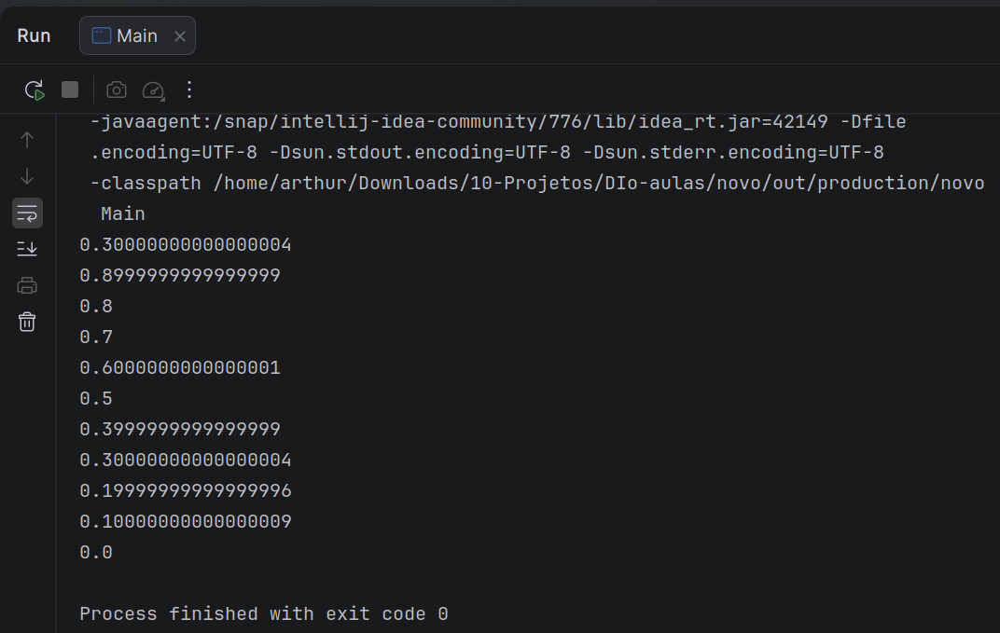
</p>

A saída do programa revela claramente o problema: `0.1 + 0.2` retorna `0.30000000000000004` em vez de `0.3`. As subtrações seguintes também apresentam erros: `2.00 - 1.1` produz `0.8999999999999999`, `2.00 - 1.5` retorna `0.6000000000000001`, e assim por diante. Apenas alguns valores "sortudos" — como `2.00 - 1.2`, `2.00 - 1.4` e `2.00 - 2` — retornam exatamente `0.8`, `0.6` e `0.0`. Isso evidencia que `double` não é adequado para cálculos que exigem precisão decimal garantida.

#### Tentativa com `Float` (wrapper)

Como alternativa, o instrutor experimenta o tipo `Float` (classe wrapper), usando o construtor `new Float(valor)` com literais `f`. A adição de `value1 + value2` ainda é testada, e as mesmas subtrações são refeitas com `new Float(2.00f) - new Float(1.xf)`. O construtor `new Float(...)` é marcado como depreciado pelo Java moderno, mas é utilizado aqui apenas para fins didáticos.

```java
public class Main {
    public static void main(String[] args) {
        Float value1 = 0.1f;
        Float value2 = 0.2f;
        System.out.println(value1 + value2);
        System.out.println("=============");
        System.out.println(new Float(2.00f) - new Float(1.1f));
        System.out.println(new Float(2.00f) - new Float(1.2f));
        System.out.println(new Float(2.00f) - new Float(1.3f));
        System.out.println(new Float(2.00f) - new Float(1.4f));
        System.out.println(new Float(2.00f) - new Float(1.5f));
        System.out.println(new Float(2.00f) - new Float(1.6f));
        System.out.println(new Float(2.00f) - new Float(1.7f));
        System.out.println(new Float(2.00f) - new Float(1.8f));
        System.out.println(new Float(2.00f) - new Float(1.9f));
        System.out.println(new Float(2.00f) - new Float(2f));
    }
}
```

#### Saída: imprecisão com `Float`

<p align="center">
  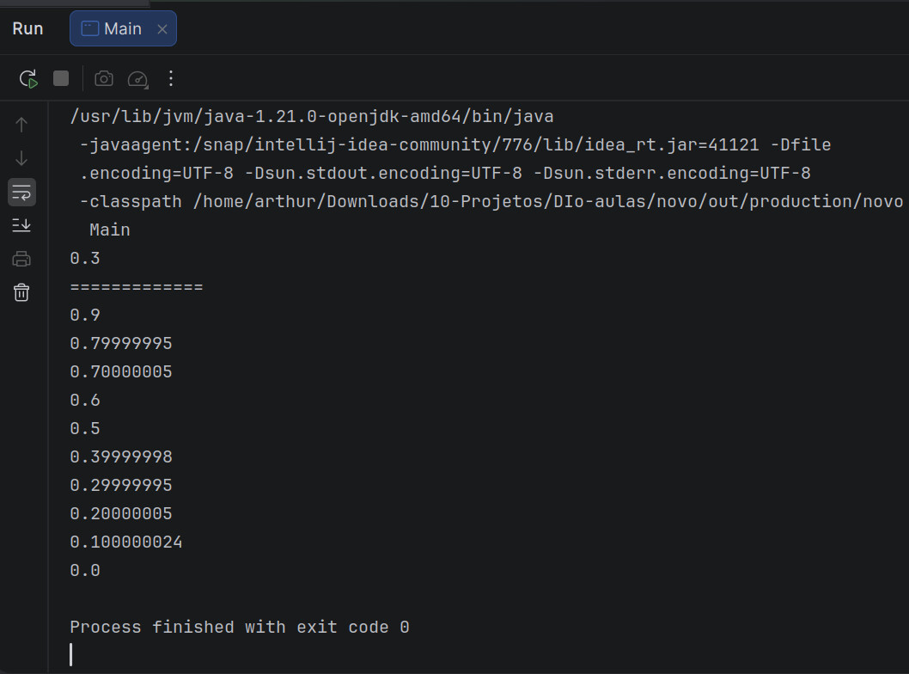
</p>

A saída com `Float` mostra um comportamento ligeiramente diferente do `double`, mas ainda impreciso: `0.1f + 0.2f` resulta em `0.3` (aparentemente correto pela menor precisão do tipo), porém as subtrações revelam erros como `0.79999995`, `0.70000005` e `0.39999998`. O `Float` tem menos bits de mantissa que o `double`, o que às vezes "esconde" o erro, mas não o elimina — e pode introduzir erros diferentes.

#### Tentativa com `Double` (wrapper)

O instrutor repete o experimento agora com a classe wrapper `Double`. Os literais `f` são removidos e os tipos passam a ser `Double value1 = 0.1` e `Double value2 = 0.2`. As subtrações são feitas com literais `double` diretamente (sem wrapper explícito nas operações). O objetivo é confirmar se usar o wrapper em vez do primitivo muda algo quanto à precisão.

```java
public class Main {
    public static void main(String[] args) {
        Double value1 = 0.1;
        Double value2 = 0.2;
        System.out.println(value1 + value2);
        System.out.println("=============");
        System.out.println(2.00 - 1.1);
        System.out.println(2.00 - 1.2);
        System.out.println(2.00 - 1.3);
        System.out.println(2.00 - 1.4);
        System.out.println(2.00 - 1.5);
        System.out.println(2.00 - 1.6);
        System.out.println(2.00 - 1.7);
        System.out.println(2.00 - 1.8);
        System.out.println(2.00 - 1.9);
        System.out.println(2.00 - 2);
    }
}
```

#### Saída: `Double` wrapper não resolve o problema

<p align="center">
  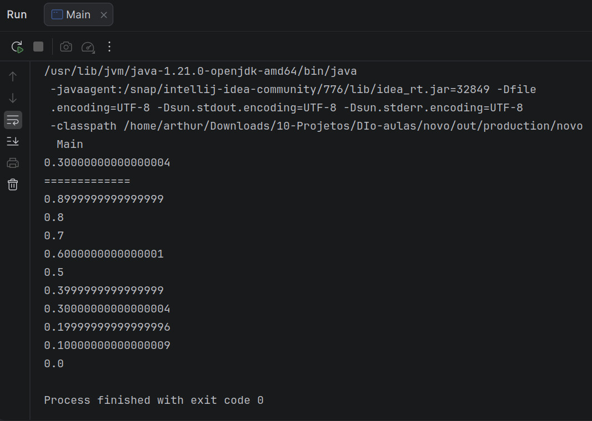
</p>

A saída com `Double` wrapper é idêntica à do `double` primitivo: `0.30000000000000004` para a soma, e os mesmos erros nas subtrações (`0.8999999999999999`, `0.6000000000000001`, etc.). Isso confirma que o problema não está no uso de primitivo versus wrapper — ambos compartilham a mesma representação IEEE 754 de 64 bits. A solução precisa ser outra.

#### Solução: `BigDecimal` com `subtract`

A solução apresentada é a classe `java.math.BigDecimal`. Os valores são passados como `String` para o construtor — prática recomendada para evitar que o `double` literal já entre com imprecisão antes mesmo de ser atribuído ao `BigDecimal`. A soma usa o método `.add()` e as subtrações usam `.subtract()`, já que o operador `-` não é aplicável a objetos.

```java
import java.math.BigDecimal;

public class Main {
    public static void main(String[] args) {
        var value1 = new BigDecimal("0.1");
        var value2 = new BigDecimal("0.2");
        System.out.println(value1.add(value2));
        System.out.println("========");

        System.out.println(new BigDecimal("2.00").subtract(new BigDecimal("1.1")));
        System.out.println(new BigDecimal("2.00").subtract(new BigDecimal("1.2")));
        System.out.println(new BigDecimal("2.00").subtract(new BigDecimal("1.3")));
        System.out.println(new BigDecimal("2.00").subtract(new BigDecimal("1.4")));
        System.out.println(new BigDecimal("2.00").subtract(new BigDecimal("1.5")));
        System.out.println(new BigDecimal("2.00").subtract(new BigDecimal("1.6")));
        System.out.println(new BigDecimal("2.00").subtract(new BigDecimal("1.7")));
        System.out.println(new BigDecimal("2.00").subtract(new BigDecimal("1.8")));
        System.out.println(new BigDecimal("2.00").subtract(new BigDecimal("1.9")));
        System.out.println(new BigDecimal("2.00").subtract(new BigDecimal("2")));
    }
}
```

#### Saída: `BigDecimal` com precisão exata

<p align="center">
  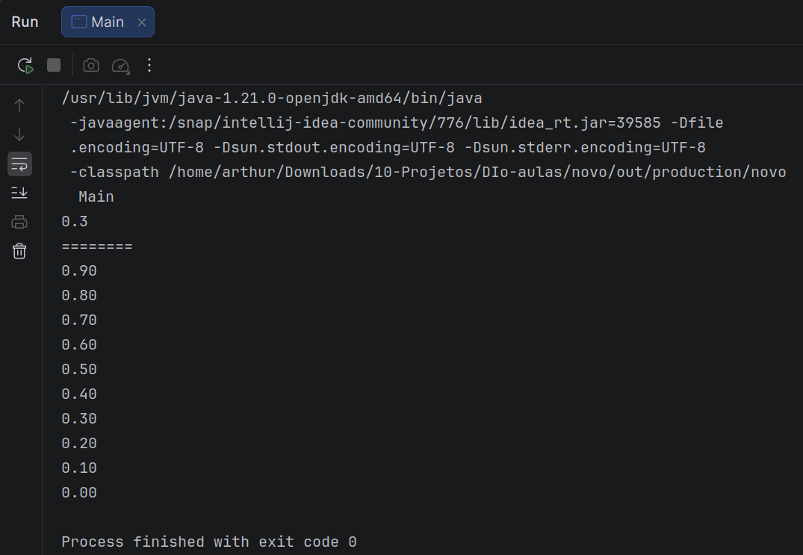
</p>

A saída com `BigDecimal` demonstra precisão decimal exata: `0.1 + 0.2 = 0.3`, e todas as subtrações retornam os valores esperados — `0.90`, `0.80`, `0.70`, `0.60`, `0.50`, `0.40`, `0.30`, `0.20`, `0.10`, `0.00`. O `BigDecimal` trabalha internamente com aritmética decimal arbitrária, sem a limitação da representação binária de ponto flutuante.

#### `BigDecimal`: multiplicação

<p align="center">
  
</p>

O instrutor explora o método `.multiply()` do `BigDecimal`. Com os valores `"0.1"` e `"0.2"`, o resultado de `value2.multiply(value1)` é `0.02` — correto e preciso. A operação de multiplicação não exige nenhum parâmetro adicional e retorna um novo `BigDecimal` com a precisão combinada dos dois operandos.

```java
public class Main {
    public static void main(String[] args) {
        var value1 = new BigDecimal("0.1");
        var value2 = new BigDecimal("0.2");
        System.out.println(value2.multiply(value1));
    }
}
// Saída: 0.02
```

#### `BigDecimal`: multiplicação com valores maiores

<p align="center">
  
</p>

Para tornar o resultado mais visível, os valores são trocados por `"56.3645"` e `"99.345"`. O `.multiply()` retorna `5599.5312525` — um número com muitas casas decimais, mas inteiramente preciso. Isso demonstra que o `BigDecimal` mantém todas as casas decimais significativas sem arredondamento implícito.

```java
public class Main {
    public static void main(String[] args) {
        var value1 = new BigDecimal("56.3645");
        var value2 = new BigDecimal("99.345");
        System.out.println(value2.multiply(value1));
    }
}
// Saída: 5599.5312525
```

#### `BigDecimal`: divisão com `RoundingMode`

<p align="center">
  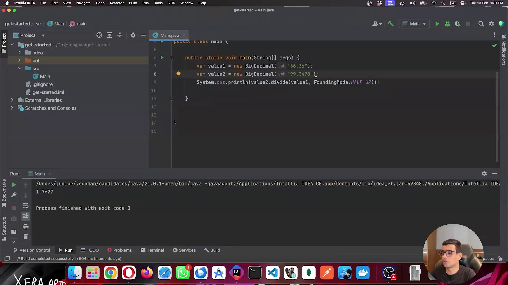
</p>

A divisão em `BigDecimal` requer atenção especial: se o resultado for uma dízima periódica (divisão infinita), o Java lança uma `ArithmeticException`. Para evitar isso, o método `.divide()` aceita um `RoundingMode` como segundo argumento. O exemplo utiliza `RoundingMode.HALF_UP` — que arredonda para cima quando o dígito seguinte é ≥ 5 — com os valores `"56.36"` e `"99.3478"`, retornando `1.7627`.

```java
import java.math.RoundingMode;

public class Main {
    public static void main(String[] args) {
        var value1 = new BigDecimal("56.36");
        var value2 = new BigDecimal("99.3478");
        System.out.println(value2.divide(value1, RoundingMode.HALF_UP));
    }
}
// Saída: 1.7627
```

#### `BigDecimal`: raiz quadrada com `MathContext`

<p align="center">
  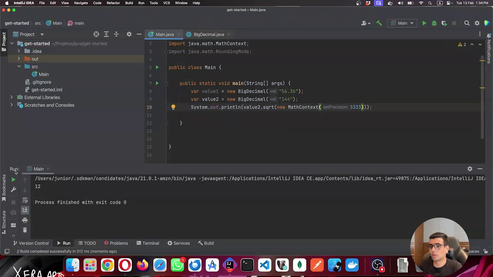
</p>

O método `.sqrt()` do `BigDecimal` exige um `MathContext` como argumento, que define a precisão (número de dígitos significativos) e o modo de arredondamento. No exemplo, `value2 = new BigDecimal("144")` tem sua raiz quadrada calculada com `new MathContext(3333)`, retornando `12` — resultado exato, pois 144 é um quadrado perfeito. O `MathContext` é especialmente útil em raízes e divisões onde o número de casas decimais precisa ser controlado.

```java
import java.math.MathContext;
import java.math.RoundingMode;

public class Main {
    public static void main(String[] args) {
        var value1 = new BigDecimal("56.36");
        var value2 = new BigDecimal("144");
        System.out.println(value2.sqrt(new MathContext(3333)));
    }
}
// Saída: 12
```      


### 🟩 Vídeo 08 - Enums

<video width="60%" controls>
  <source src="000-Midia_e_Anexos/bootcamp_ntt_data_java_spring_ai-modulo.02-curso.04-video_08.webm" type="video/webm">
    Seu navegador não suporta vídeo HTML5.
</video>

link do vídeo: https://web.dio.me/track/ntt-data-2026-ai-java-back-end/course/imersao-pratica-com-collections-e-outras-classes-uteis-do-java/learning/de7b907c-ce4f-4416-b954-3bd7711effe1?autoplay=1

### Anotações

#### Criando um Enum de estados com StateEnum

O código abaixo é um exemplo de criação de um `enum` chamado `StateEnum` dentro do package `enumeration` no IntelliJ IDEA. O enum contém as siglas de estados brasileiros como valores constantes: `SP`, `RJ`, `RS`, `MG` e `MT`. 

```java
package enumeration;

public enum StateEnum {
    SP, RJ, RS, MG, MT
}
```

Esse exemplo ilustra como enums são ideais para representar conjuntos de valores fixos e bem definidos, como os estados de um país, evitando o uso de Strings livres que poderiam conter erros de digitação ou valores inesperados.

#### Usando StateEnum como tipo de campo na classe User

Abaixo vemos a classe `User`, também dentro do package `enumeration`. Ela possui dois campos: `name` (do tipo `String`) e `state` (do tipo `StateEnum`), inicializado com o valor `StateEnum.RJ`. 

```java
public class User {

    private String name;

    private StateEnum state = StateEnum.RJ;

}
```

Ao declarar `state` como do tipo `StateEnum` em vez de `String`, o compilador garante que apenas valores válidos do enum possam ser atribuídos ao campo — eliminando a possibilidade de um valor arbitrário ou inválido ser inserido.

#### Estrutura do menu principal com while e Scanner

Abaixo temos a classe `Main` com o método `main`, que implementa um menu interativo de calculadora utilizando `Scanner` e um laço `while`. O loop continua enquanto a opção escolhida for diferente de `5` (sair). Há validação para opções fora do intervalo válido (menores que 1 ou maiores que 5), exibindo uma mensagem de erro e continuando o loop com `continue`. Quando o usuário escolhe a opção `5`, o `break` encerra o laço. A seleção da operação é feita via `OperationEnum.values()[option - 1]`, aproveitando a ordem de declaração do enum.

```java
import java.util.Scanner;

public class Main {
    public static void main(String[] args) {
        var scanner = new Scanner(System.in);
        var option = -1;
        while (option != 5) {
            System.out.println("Escolha uma opção pelo número:");
            System.out.println("1 - Soma");
            System.out.println("2 - Subtração");
            System.out.println("3 - Multiplicação");
            System.out.println("4 - Divisão");
            System.out.println("5 - Sair");
            option = scanner.nextInt();

            if (option > 5 || option < 1) {
                System.out.println("Selecione uma opção válida");
                continue;
            }

            if (option == 5) break;
            var selectedOption = OperationEnum.values()[option - 1];

            System.out.println("Informe o primeiro valor");
            var value1 = scanner.nextInt();
            System.out.println("Informe o segundo valor");
            var value2 = scanner.nextInt();

            var result = selectedOption.getCalculate().apply(value1, value2);

            System.out.printf("%s %s %s = %s \n\n", value1, selectedOption.getSymbol(), value2, result);
        }
    }
}
```

O uso de `OperationEnum.values()[option - 1]` elimina a necessidade de uma cadeia de `if`s para descobrir qual operação foi escolhida — a ordem de declaração dos valores no enum é suficiente para fazer o mapeamento direto.

#### OperationEnum com propriedades e BiFunction

O próximo trecho de código apresenta o enum `OperationEnum` completo, que vai além de simples constantes: cada valor carrega duas propriedades — uma `BiFunction<Integer, Integer, Integer>` chamada `calculate` (que define a operação matemática via lambda ou method reference) e uma `String` chamada `symbol` (o símbolo da operação). O construtor do enum recebe essas duas propriedades, e getters públicos permitem acessá-las externamente.

```java
import java.util.function.BiFunction;

public enum OperationEnum {

    SUM(Integer::sum, "+"),
    SUBTRACTION((Integer v1, Integer v2) -> v1 - v2, "-"),
    MULTIPLY((Integer v1, Integer v2) -> v1 * v2, "*"),
    DIVISION((Integer v1, Integer v2) -> v1 / v2, "/");

    private final BiFunction<Integer, Integer, Integer> calculate;

    private final String symbol;

    OperationEnum(BiFunction<Integer, Integer, Integer> calculate, String symbol) {
        this.calculate = calculate;
        this.symbol = symbol;
    }

    public BiFunction<Integer, Integer, Integer> getCalculate() {
        return calculate;
    }

    public String getSymbol() {
        return symbol;
    }

}
```

Cada constante do enum encapsula seu próprio comportamento: `SUM` usa um method reference (`Integer::sum`), enquanto as demais usam lambdas explícitas. Isso permite invocar a operação correta chamando apenas `selectedOption.getCalculate().apply(value1, value2)`, sem nenhum `if` ou `switch`.

#### Execução: resultado da soma (50 + 60 = 110)

<p align="center">
  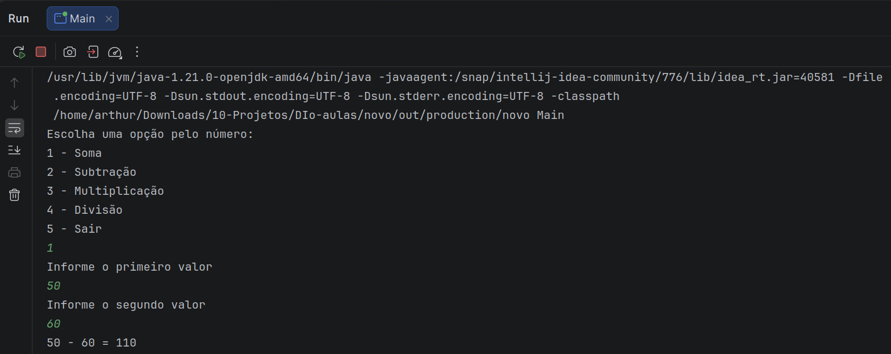
</p>

A imagem mostra a saída do programa no painel Run do IntelliJ após o usuário selecionar a opção `1` (Soma) e informar os valores `50` e `60`. O resultado `50 + 60 = 110` ainda não aparece formatado nesta execução — o professor menciona que esqueceu de incluir o `\n` no `printf`, o que será corrigido em seguida. O console confirma que a seleção via índice do enum está funcionando corretamente.

#### Execução: resultado da subtração (50 - 20 = 30)

<p align="center">
  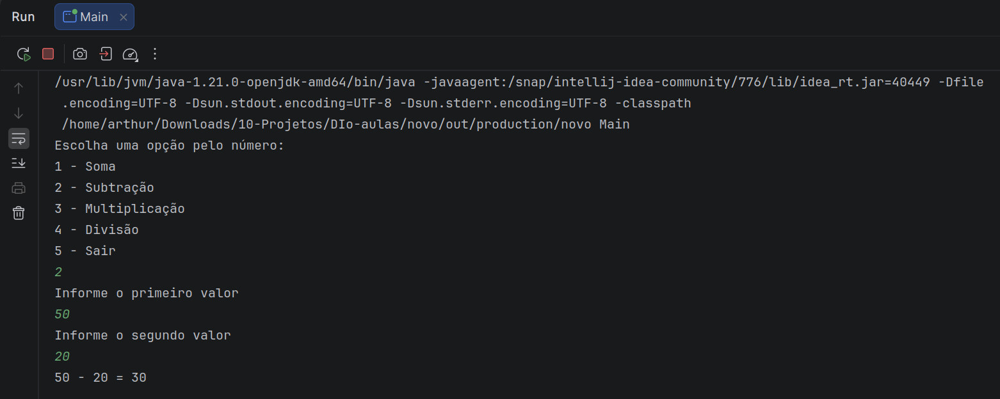
</p>

A imagem exibe a execução com a opção `2` (Subtração), valores `50` e `20`, produzindo o resultado formatado `50 - 20 = 30`. Aqui o `printf` já está com o `\n` correto, separando visualmente cada operação no console. O símbolo `-` exibido vem diretamente da propriedade `symbol` do enum `SUBTRACTION`.

#### Execução: resultado da multiplicação (80 * 99 = 7920)

<p align="center">
  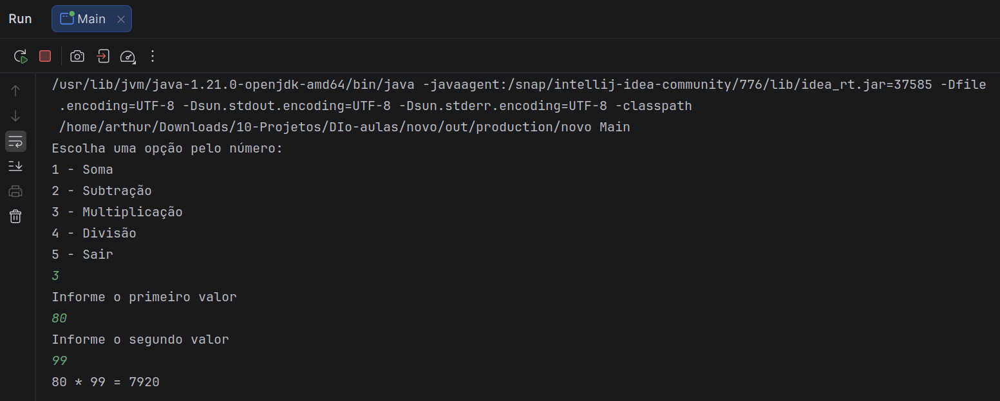
</p>

A imagem mostra o teste com a opção `3` (Multiplicação), valores `80` e `99`, com saída `80 * 99 = 7920`. O cálculo é executado pela lambda `(v1, v2) -> v1 * v2` armazenada na constante `MULTIPLY` do enum, sem qualquer `if` na classe `Main`.

#### Execução: resultado da divisão (50 / 5 = 10)

<p align="center">
  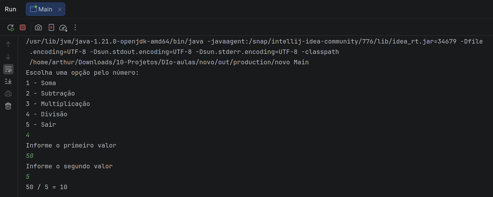
</p>

A imagem apresenta o teste da opção `4` (Divisão) com valores `50` e `5`, resultando em `50 / 5 = 10`. Com todos os quatro testes concluídos, a calculadora demonstra que enums com propriedades funcionais permitem implementar múltiplos comportamentos distintos de forma limpa, centralizada e sem repetição de lógica condicional.
      

### 🟩 Vídeo 09 - Classe Optional

<video width="60%" controls>
  <source src="000-Midia_e_Anexos/bootcamp_ntt_data_java_spring_ai-modulo.02-curso.04-video_09.webm" type="video/webm">
    Seu navegador não suporta vídeo HTML5.
</video>

link do vídeo: https://web.dio.me/track/ntt-data-2026-ai-java-back-end/course/imersao-pratica-com-collections-e-outras-classes-uteis-do-java/learning/da083763-0b0f-4a46-876b-e3317b668292?autoplay=1

### Anotações

<p align="center">
  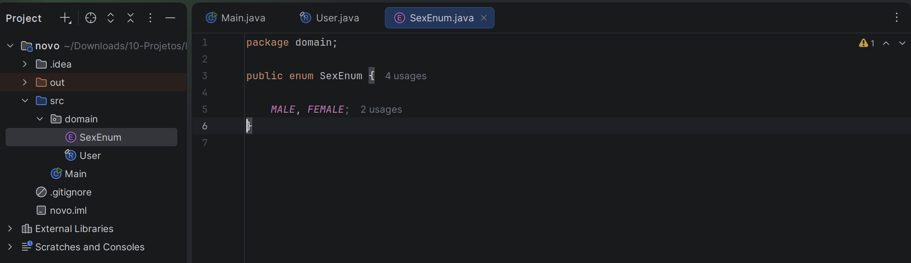
</p>

Este trecho mostra a definição de um **enum** em Java, chamado `SexEnum`, que contém os valores `MALE` e `FEMALE`. O uso de `enum` é útil para representar categorias fixas e bem definidas, evitando erros de digitação e garantindo consistência no código.

```java
package domain;

public enum SexEnum {
    MALE, FEMALE;
}
```

<p align="center">
  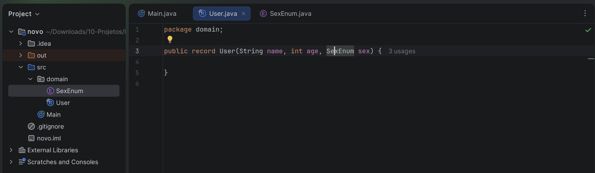
</p>

Aqui temos a criação de um **record** em Java chamado `User`. Esse record define três atributos: `name` (String), `age` (int) e `sex` (SexEnum). O uso de records simplifica a criação de classes imutáveis e é ideal para representar dados.

```java
package domain;

public record User(String name, int age, SexEnum sex) { }
```

<p align="center">
  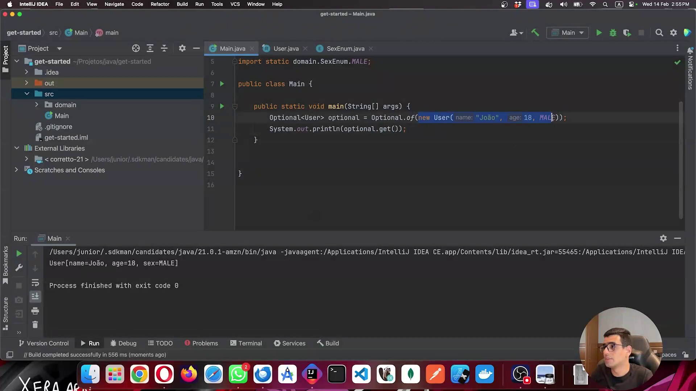
</p>

Neste ponto, vemos o uso da classe `Optional` para encapsular um objeto `User`. O método `Optional.of()` é utilizado para criar um `Optional` com um valor não nulo. Caso o valor seja nulo, ocorre uma exceção.

```java
Optional<User> optional = Optional.of(new User("João", 18, SexEnum.MALE));
System.out.println(optional.get());
```

<p align="center">
  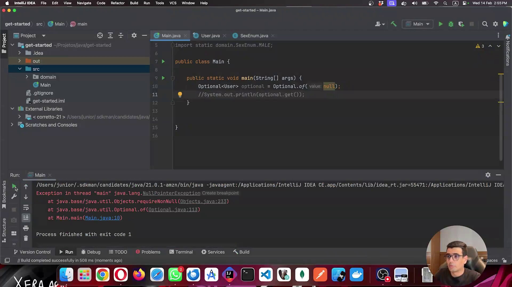
</p>

Aqui é mostrado o problema de usar `Optional.of()` com valores nulos. O código tenta criar um `Optional` com `null`, o que gera uma `NullPointerException`.

```java
Optional<User> optional = Optional.of(null);
// System.out.println(optional.get());
```

<p align="center">
  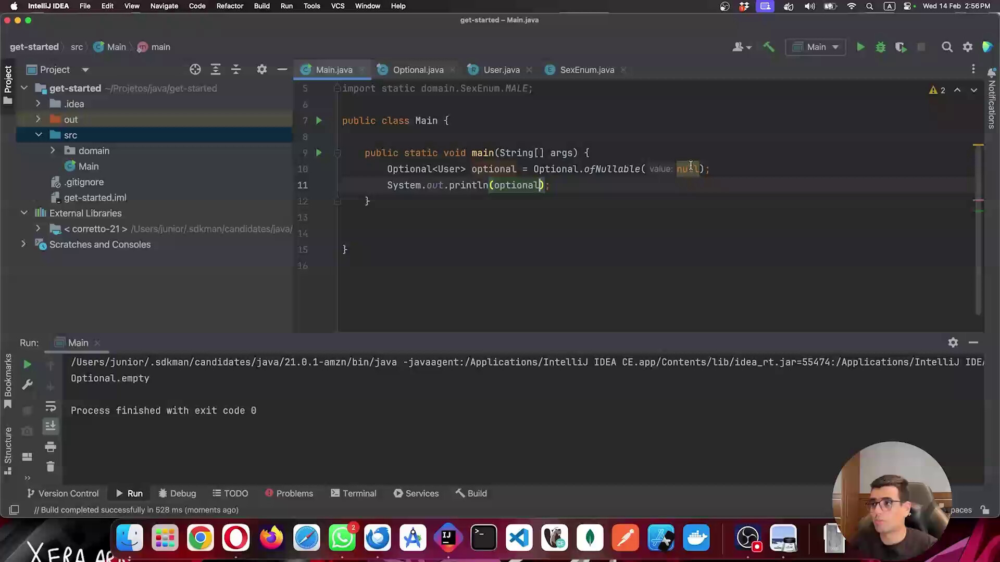
</p>

Neste exemplo, o método `Optional.ofNullable()` é utilizado. Ele permite criar um `Optional` que pode estar vazio caso o valor seja nulo, evitando a exceção.

```java
Optional<User> optional = Optional.ofNullable(null);
System.out.println(optional);
```

<p align="center">
  
</p>

Aqui vemos o uso do método `ifPresent`, que executa uma ação apenas se o valor estiver presente. Isso evita acessos indevidos a valores nulos.

```java
optional.ifPresent(System.out::println);
```

<p align="center">
  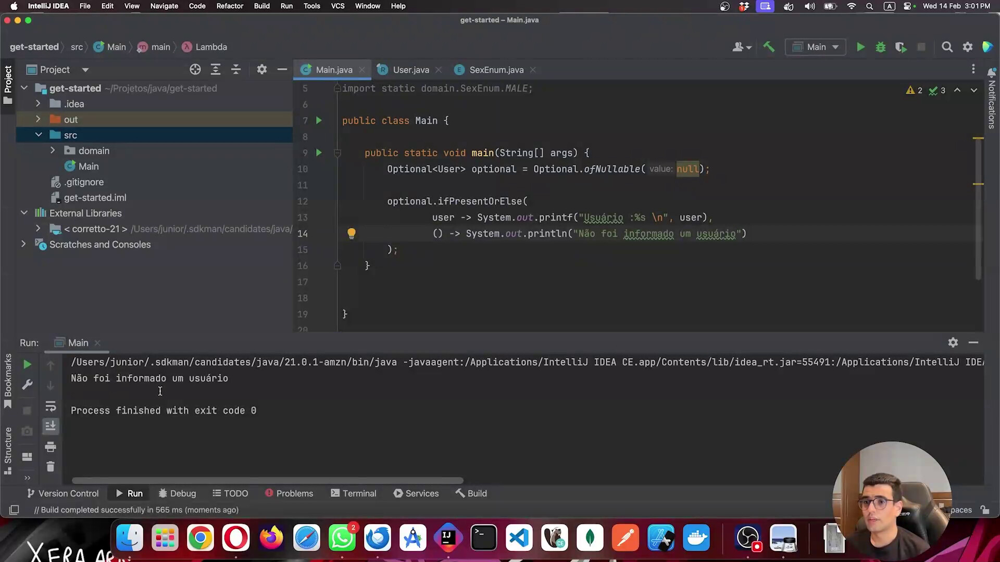
</p>

Neste trecho, é utilizado o método `ifPresentOrElse`, que permite definir uma ação para o caso de o valor estar presente e outra para o caso de estar ausente.

```java
optional.ifPresentOrElse(
    user -> System.out.printf("Usuário: %s%n", user),
    () -> System.out.println("Não foi informado um usuário")
);
```

<p align="center">
  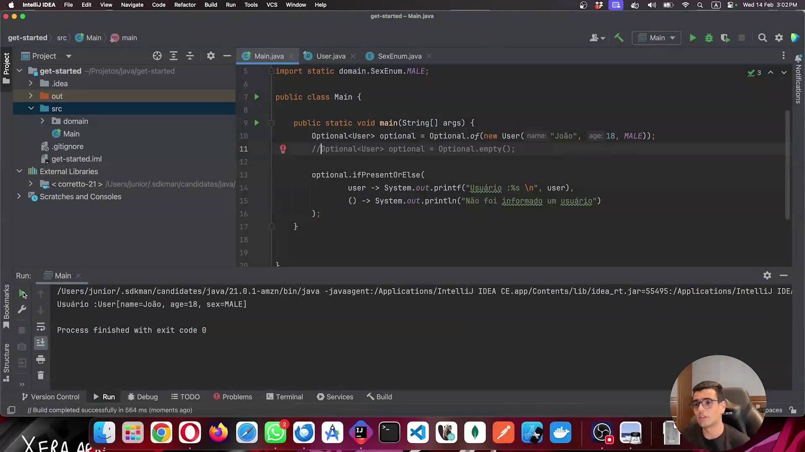
</p>

Aqui o `Optional` é inicializado com um valor válido, garantindo que o bloco `ifPresentOrElse` execute a ação de imprimir o usuário.

```java
Optional<User> optional = Optional.of(new User("João", 18, SexEnum.MALE));
optional.ifPresentOrElse(
    user -> System.out.printf("Usuário: %s%n", user),
    () -> System.out.println("Não foi informado um usuário")
);
```

<p align="center">
  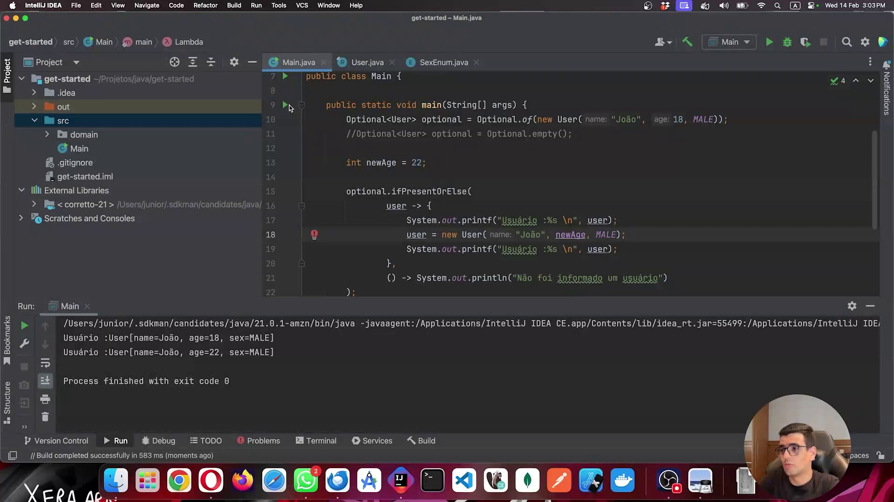
</p>

Neste exemplo, dentro do `ifPresentOrElse`, o objeto `User` é modificado para demonstrar como trabalhar com valores dentro de uma expressão lambda.

```java
int newAge = 22;
optional.ifPresentOrElse(
    user -> {
        System.out.printf("Usuário: %s%n", user);
        user = new User("João", newAge, SexEnum.MALE);
        System.out.printf("Usuário: %s%n", user);
    },
    () -> System.out.println("Não foi informado um usuário")
);
```

<p align="center">
  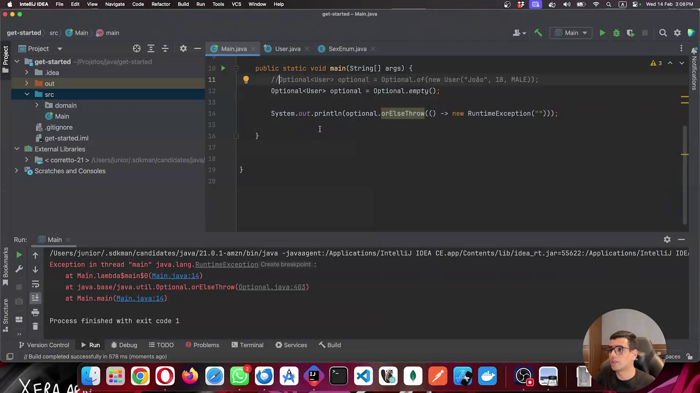
</p>

Aqui é demonstrado o uso de `orElseThrow`, que lança uma exceção caso o `Optional` esteja vazio. É útil quando se deseja garantir que o valor esteja presente.

```java
System.out.println(optional.orElseThrow(() -> new RuntimeException("")));
```

<p align="center">
  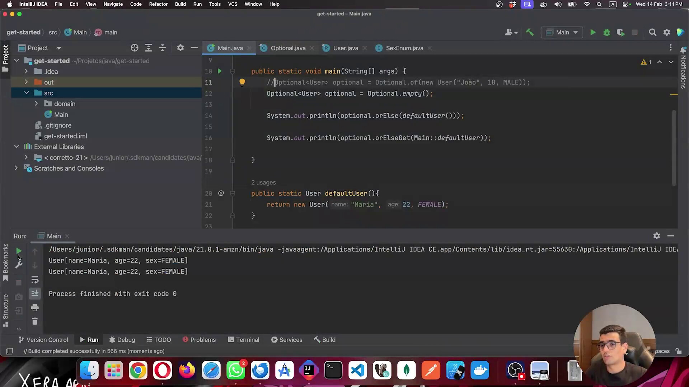
</p>

Neste trecho, vemos a diferença entre `orElse` e `orElseGet`. Ambos fornecem valores padrão, mas `orElseGet` só executa o código fornecido se o `Optional` estiver vazio, evitando processamento desnecessário.

```java
System.out.println(optional.orElse(defaultUser()));
System.out.println(optional.orElseGet(Main::defaultUser));

public static User defaultUser() {
    return new User("Maria", 22, SexEnum.FEMALE);
}
```      


## Parte 5 - API de Streams e Generics

### 🟩 Vídeo 10 - Introdução à API de Streams

<video width="60%" controls>
  <source src="000-Midia_e_Anexos/bootcamp_ntt_data_java_spring_ai-modulo.02-curso.04-video_10.webm" type="video/webm">
    Seu navegador não suporta vídeo HTML5.
</video>

link do vídeo: https://web.dio.me/track/ntt-data-2026-ai-java-back-end/course/imersao-pratica-com-collections-e-outras-classes-uteis-do-java/learning/da083763-0b0f-4a46-876b-e3317b668292?autoplay=1

### Anotações

Neste primeiro exemplo, estamos conhecendo a API de Streams do Java, que nos permite trabalhar com conceitos de programação funcional. O código demonstra como gerar streams infinitas e limitá-las.

Primeiro, declaramos uma variável `value1` e usamos o método `Stream.generate()`, passando um lambda que utiliza `new Random().nextInt()` para gerar números aleatórios. Como a stream rodaria indefinidamente, usamos `.limit(5)` para restringir a cinco elementos e `.toArray(Integer[]::new)` para coletar os resultados em um array tipado de `Integer`, utilizando um *method reference*.

Em seguida, para evitar problemas de *boxing* e *unboxing* (já que estamos trabalhando com tipos primitivos), o código mostra o uso de `IntStream`. Com `IntStream.generate()`, geramos números primitivos `int` (limitados a 100) e coletamos diretamente com `.toArray()`, que já retorna um array de `int` otimizado.

```java
import java.util.Random;
import java.util.stream.IntStream;
import java.util.stream.Stream;

public class Main {
    public static void main(String[] args) {
        // Cria um Stream infinito de Integers usando Random().nextInt()
        // .limit(5) restringe para apenas 5 números
        // .toArray(Integer[]::new) coleta em um array de Integer
        Integer[] value1 = Stream.generate(() -> new Random().nextInt())
                .limit(5)
                .toArray(Integer[]::new);

        // Percorre o array value1 e imprime cada número
        for (var v1 : value1) {
            System.out.println("value1: " + v1);
        }

        // Imprime uma linha de separação para organizar a saída
        System.out.println("==========");

        // Cria um IntStream infinito de ints usando Random().nextInt(100)
        // .nextInt(100) gera números entre 0 e 99
        // .limit(5) restringe para apenas 5 números
        // .toArray() coleta em um array de int
        var value2 = IntStream.generate(() -> new Random().nextInt(100))
                .limit(5)
                .toArray();

        // Percorre o array value2 e imprime cada número
        for (var v : value2) {
            System.out.println("value2: " + v);
        }
    }
}
```

<p align="center">
  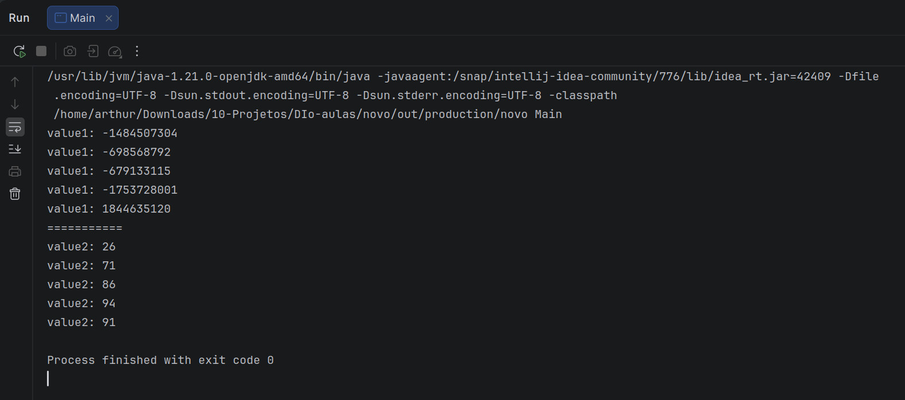
</p>

Ao executar o código anterior, podemos observar no console a saída gerada. Primeiro, são impressos os cinco números aleatórios gerados pelo `Stream.generate()` (que podem ser negativos ou positivos, pois não definimos um limite no `nextInt()`). Após a linha de separação, vemos os cinco números gerados pelo `IntStream.generate()`, que estão restritos entre 0 e 99.

<p align="center">
  
</p>

Outra forma muito comum de inicializar uma stream é através do método `Stream.of()`, que utiliza *varargs* para receber múltiplos valores. Neste exemplo, passamos uma lista de nomes.

Em seguida, aplicamos o método `.filter()`, que recebe um `Predicate` (uma função que retorna um booleano). Aqui, estamos filtrando apenas os nomes que terminam com a letra "a" (`name -> name.endsWith("a")`). Por fim, usamos a operação terminal `.toList()` para converter a stream resultante de volta para uma lista. O console mostra que apenas "Maria", "Luana" e "Marcia" foram selecionados.

```java
import java.util.stream.Stream;

public class Main {
    public static void main(String[] args) {
        var value = Stream.of("Maria", "João", "Marcio", "Luana", "Leandro", "Marcia")
                .filter(name -> name.endsWith("a"))
                .toList();

        System.out.println(value);
    }
}
```

<p align="center">
  
</p>

Alterando a condição do filtro para buscar nomes que terminam com a letra "o" (`name -> name.endsWith("o")`), o resultado muda de acordo. O console agora exibe `[João, Marcio, Leandro]`.

```java
import java.util.stream.Stream;

public class Main {
    public static void main(String[] args) {
        var value = Stream.of("Maria", "João", "Marcio", "Luana", "Leandro", "Marcia")
                .filter(name -> name.endsWith("o"))
                .toList();

        System.out.println(value);
    }
}
```

<p align="center">
  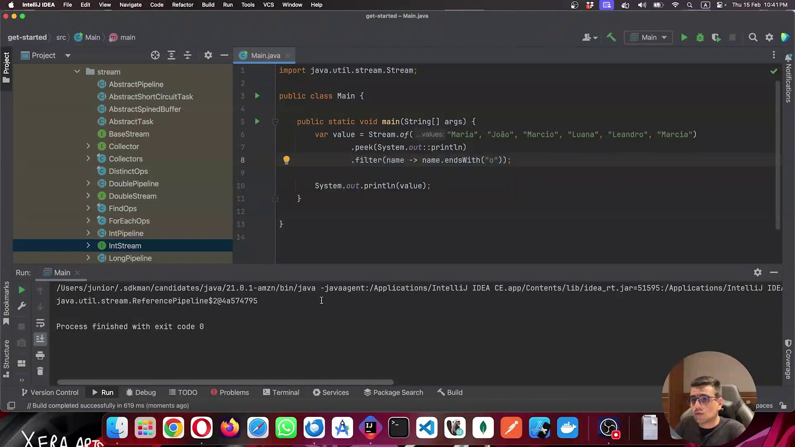
</p>

Agora introduzimos o método `.peek()`. Ele é uma **operação intermediária** que recebe um `Consumer` (consome o valor mas não retorna nada) e é muito utilizado para *debug*.

No entanto, observe que ao rodar o código sem uma **operação terminal** (como o `.toList()`), a stream não é processada. O `System.out.println(value)` imprime apenas a referência do objeto do pipeline da stream (`java.util.stream.ReferencePipeline...`), provando que as operações intermediárias são *lazy* (preguiçosas) e só executam quando uma operação terminal é invocada.

```java
import java.util.stream.Stream;

public class Main {
    public static void main(String[] args) {
        var value = Stream.of("Maria", "João", "Marcio", "Luana", "Leandro", "Marcia")
                .peek(System.out::println)
                .filter(name -> name.endsWith("o"));

        System.out.println(value);
    }
}
```

<p align="center">
  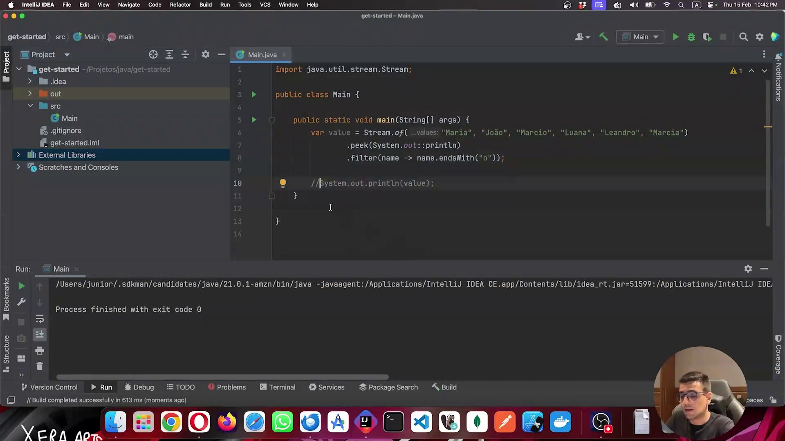
</p>

Neste momento, a linha que imprimia a variável `value` foi comentada. Como ainda não há uma operação terminal no pipeline da stream, o programa simplesmente finaliza com `exit code 0` sem imprimir nenhum dos nomes que deveriam passar pelo `peek`. Isso reforça que o `peek` não faz nada sozinho.

```java
import java.util.stream.Stream;

public class Main {
    public static void main(String[] args) {
        var value = Stream.of("Maria", "João", "Marcio", "Luana", "Leandro", "Marcia")
                .peek(System.out::println)
                .filter(name -> name.endsWith("o"));

        // System.out.println(value);
    }
}
```

<p align="center">
  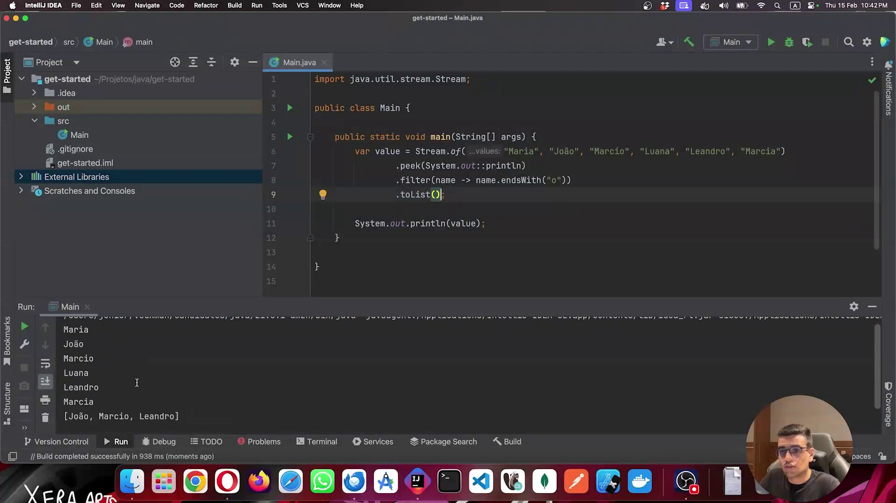
</p>

Ao adicionar a operação terminal `.toList()` ao final do pipeline, a stream é finalmente executada. O `peek` agora consegue interceptar e imprimir cada elemento à medida que passa pela stream (mostrando todos os nomes originais no console). Logo após, o `System.out.println(value)` imprime a lista final filtrada apenas com os nomes terminados em "o".

```java
import java.util.stream.Stream;

public class Main {
    public static void main(String[] args) {
        var value = Stream.of("Maria", "João", "Marcio", "Luana", "Leandro", "Marcia")
                .peek(System.out::println)
                .filter(name -> name.endsWith("o"))
                .toList();

        System.out.println(value);
    }
}
```

<p align="center">
  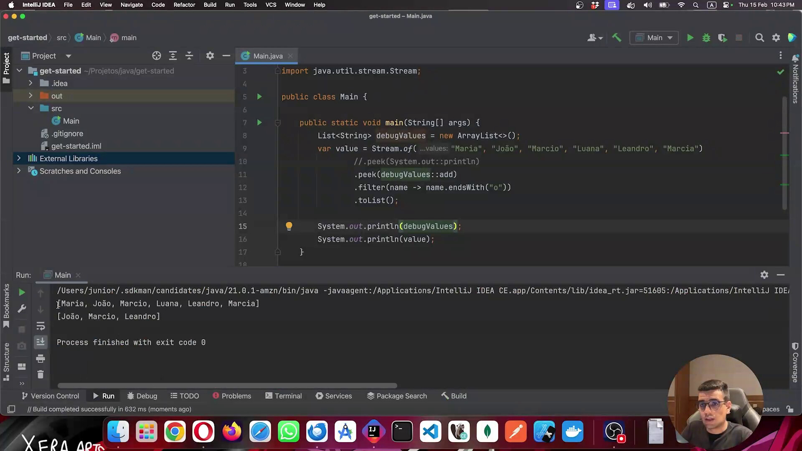
</p>

Para demonstrar outra forma de capturar valores durante o *debug*, criamos uma lista externa chamada `debugValues`. O `peek` foi alterado para adicionar cada elemento que passa por ele nessa lista (`debugValues::add`). Ao final, imprimimos primeiro a lista de debug (que contém todos os nomes) e depois a lista resultante do filtro.

```java
import java.util.ArrayList;
import java.util.List;
import java.util.stream.Stream;

public class Main {
    public static void main(String[] args) {
        List<String> debugValues = new ArrayList<>();
        var value = Stream.of("Maria", "João", "Marcio", "Luana", "Leandro", "Marcia")
                // .peek(System.out::println)
                .peek(debugValues::add)
                .filter(name -> name.endsWith("o"))
                .toList();

        System.out.println(debugValues);
        System.out.println(value);
    }
}
```

<p align="center">
  
</p>

Podemos encadear múltiplas operações intermediárias. Aqui, após o filtro, adicionamos um `.limit(2)`. Isso faz com que a stream processe e retorne apenas os dois primeiros elementos que satisfaçam a condição do filtro. O resultado no console é `[João, Marcio]`, deixando "Leandro" de fora.

```java
import java.util.stream.Stream;

public class Main {
    public static void main(String[] args) {
        var value = Stream.of("Maria", "João", "Marcio", "Luana", "Leandro", "Marcia")
                .filter(name -> name.endsWith("o"))
                .limit(2)
                .toList();

        System.out.println(value);
    }
}
```

<p align="center">
  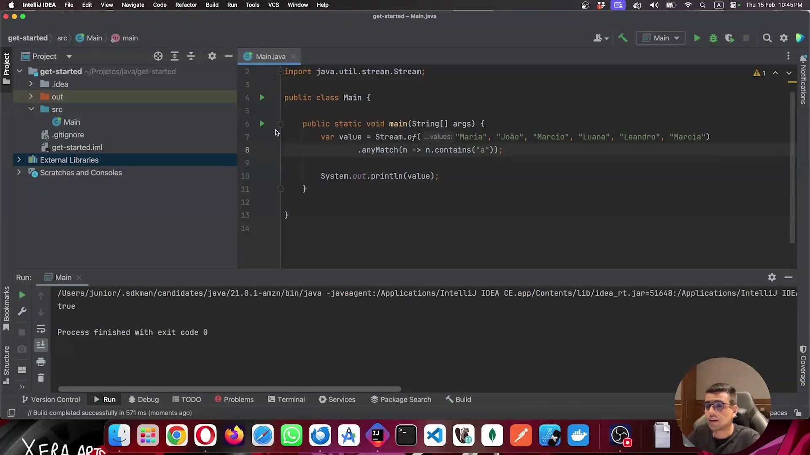
</p>

Além de retornar listas, as streams possuem operações terminais que retornam valores booleanos. O método `.anyMatch()` verifica se **pelo menos um** elemento da stream satisfaz a condição informada. Neste caso, estamos verificando se algum nome contém a letra "a". Como "Maria", "Luana" e "Marcia" contêm, o resultado impresso é `true`.

```java
import java.util.stream.Stream;

public class Main {
    public static void main(String[] args) {
        var value = Stream.of("Maria", "João", "Marcio", "Luana", "Leandro", "Marcia")
                .anyMatch(n -> n.contains("a"));

        System.out.println(value);
    }
}
```

<p align="center">
  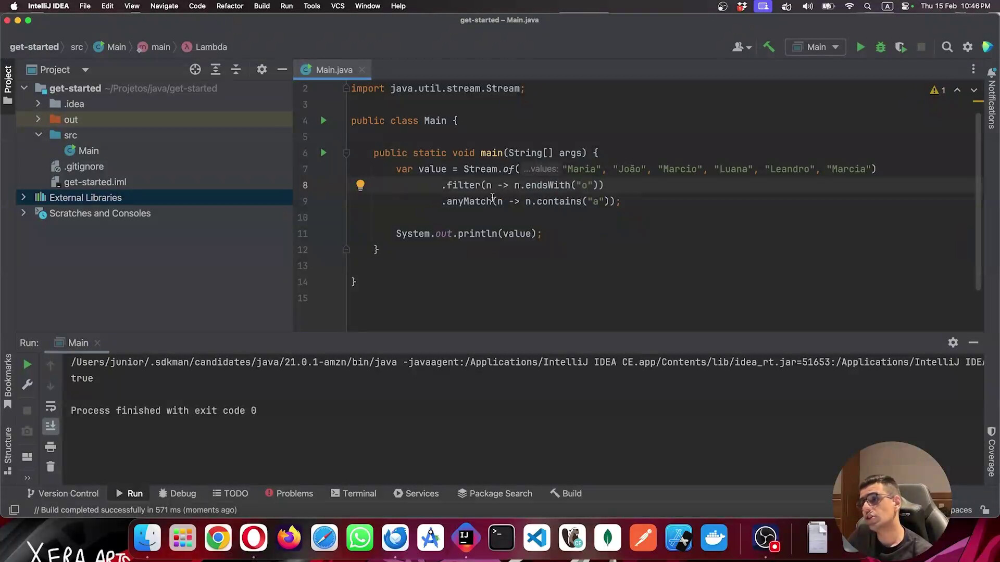
</p>

Podemos combinar filtros com essas operações booleanas. Aqui, primeiro filtramos os nomes que terminam com "o" (João, Marcio, Leandro) e depois verificamos com `.anyMatch()` se algum deles contém a letra "a". Como "João" e "Marcio" possuem a letra "a", o resultado continua sendo `true`.

```java
import java.util.stream.Stream;

public class Main {
    public static void main(String[] args) {
        var value = Stream.of("Maria", "João", "Marcio", "Luana", "Leandro", "Marcia")
                .filter(n -> n.endsWith("o"))
                .anyMatch(n -> n.contains("a"));

        System.out.println(value);
    }
}
```

<p align="center">
  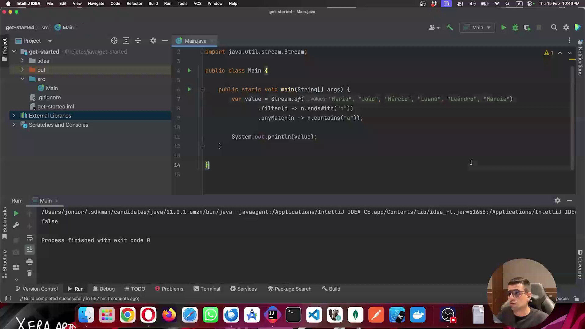
</p>

Alterando a condição do `.anyMatch()` para buscar a letra "z", o resultado passa a ser `false`. Nenhum dos nomes filtrados (terminados em "o") contém a letra "z".

```java
import java.util.stream.Stream;

public class Main {
    public static void main(String[] args) {
        var value = Stream.of("Maria", "João", "Marcio", "Luana", "Leandro", "Marcia")
                .filter(n -> n.endsWith("o"))
                .anyMatch(n -> n.contains("z"));

        System.out.println(value);
    }
}
```

<p align="center">
  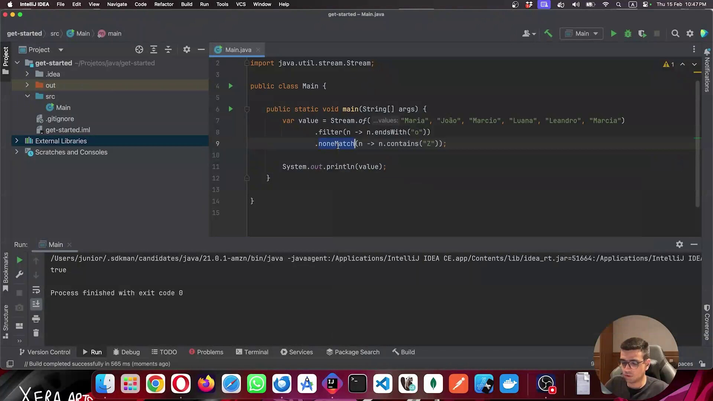
</p>

Outra operação booleana é o `.noneMatch()`, que retorna `true` apenas se **nenhum** elemento satisfizer a condição. Como verificamos se nenhum nome contém a letra "z", e de fato nenhum contém, o resultado impresso é `true`.

```java
import java.util.stream.Stream;

public class Main {
    public static void main(String[] args) {
        var value = Stream.of("Maria", "João", "Marcio", "Luana", "Leandro", "Marcia")
                .filter(n -> n.endsWith("o"))
                .noneMatch(n -> n.contains("z"));

        System.out.println(value);
    }
}
```

<p align="center">
  
</p>

Temos também o `.allMatch()`, que só retorna `true` se **todos** os elementos da stream coincidirem com a condição. Como filtramos previamente apenas os nomes que terminam com "o", a verificação se todos contêm a letra "o" naturalmente retorna `true`.

```java
import java.util.stream.Stream;

public class Main {
    public static void main(String[] args) {
        var value = Stream.of("Maria", "João", "Marcio", "Luana", "Leandro", "Marcia")
                .filter(n -> n.endsWith("o"))
                .allMatch(n -> n.contains("o"));

        System.out.println(value);
    }
}
```

<p align="center">
  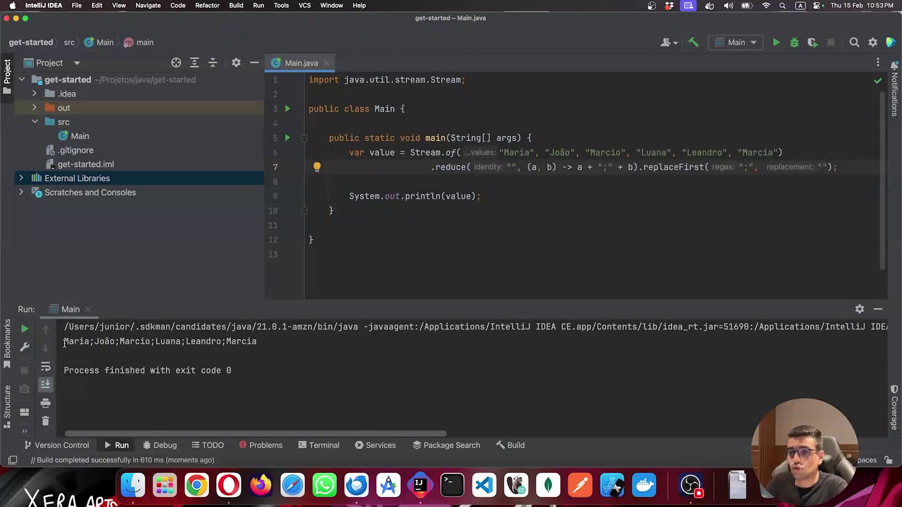
</p>

Avançando para operações de agregação, temos o `.reduce()`. Ele é uma operação terminal que transforma a stream em um único valor, utilizando um valor de identidade inicial e um `BinaryOperator` para acumular os resultados.

Neste exemplo, começamos com uma string vazia `""` e concatenamos cada elemento separando-os por ponto e vírgula `(a, b) -> a + ";" + b`. Como a identidade inicial era vazia, o resultado começa com um ponto e vírgula extra, que é removido em seguida utilizando o método `.replaceFirst(";", "")` da própria `String`. O resultado é uma única string com todos os nomes concatenados.

```java
import java.util.stream.Stream;

public class Main {
    public static void main(String[] args) {
        var value = Stream.of("Maria", "João", "Marcio", "Luana", "Leandro", "Marcia")
                .reduce("", (a, b) -> a + ";" + b).replaceFirst(";", "");

        System.out.println(value);
    }
}
```

<p align="center">
  
</p>

Por fim, vemos o método `.map()`, que é ideal para transformar os elementos da stream de um tipo para outro. Aqui, temos uma stream de números inteiros e utilizamos `.map(Object::toString)` para converter cada número em uma `String`. O resultado final coletado pelo `.toList()` é uma lista de strings contendo os números originais.

```java
import java.util.stream.Stream;

public class Main {
    public static void main(String[] args) {
        var value = Stream.of(1, 2, 3, 4, 5, 6, 7, 8, 7, 8, 7)
                .map(Object::toString)
                .toList();

        System.out.println(value);
    }
}
```

### 🟩 Vídeo 11 - Explorando API de Streams

<video width="60%" controls>
  <source src="000-Midia_e_Anexos/bootcamp_ntt_data_java_spring_ai-modulo.02-curso.04-video_11.webm" type="video/webm">
    Seu navegador não suporta vídeo HTML5.
</video>

link do vídeo: https://web.dio.me/track/ntt-data-2026-ai-java-back-end/course/imersao-pratica-com-collections-e-outras-classes-uteis-do-java/learning/9627f65c-e3c5-4982-8999-02e51108f436?autoplay=1

### Anotações

#### Record `Contact`

<p align="center">
  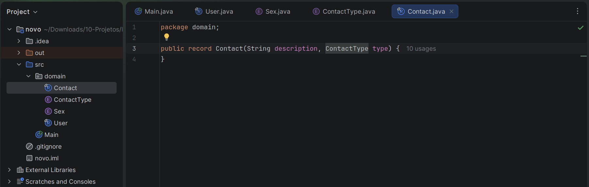
</p>

O `Contact` é definido como um **Java Record** no pacote `domain`. Um record é uma forma concisa de declarar classes portadoras de dados imutáveis — o compilador gera automaticamente construtor, getters, `equals`, `hashCode` e `toString`.

```java
package domain;

public record Contact(String description, ContactType type) { }
```

O record possui dois componentes: `description` (a string com o endereço de e-mail ou número de telefone) e `type` (um enum `ContactType` que classifica o contato).

#### Enum `ContactType`

<p align="center">
  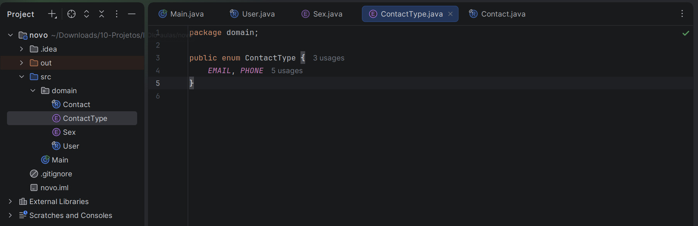
</p>

O enum `ContactType` define os dois tipos possíveis de contato aceitos pelo sistema.

```java
package domain;

public enum ContactType {
    EMAIL, PHONE
}
```

Ao usar um enum, o código ganha segurança de tipo em tempo de compilação: não é possível passar um tipo de contato inválido onde `ContactType` é esperado.

#### Enum `Sex`

<p align="center">
  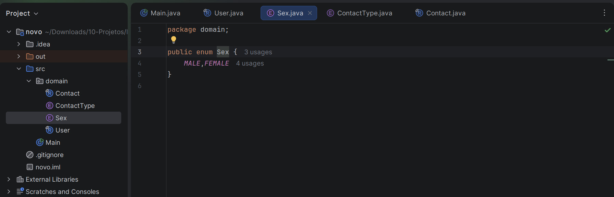
</p>

O enum `Sex` representa o sexo do usuário, com dois valores possíveis.

```java
package domain;

public enum Sex {
    MALE, FEMALE
}
```

Da mesma forma que `ContactType`, usar um enum aqui evita o uso de strings "mágicas" (`"M"`, `"F"`) e torna o código mais legível e seguro.

#### Record `User`

<p align="center">
  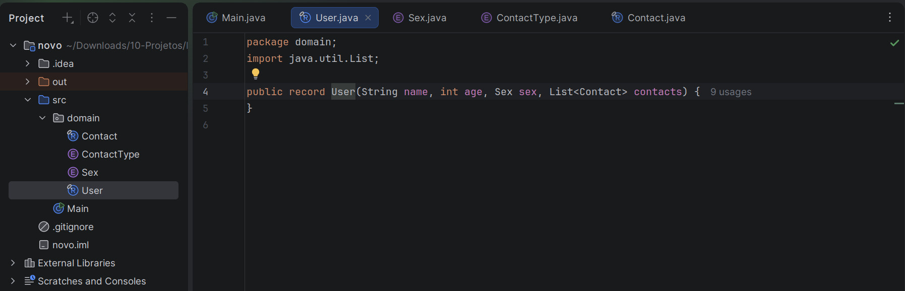
</p>

O `User` é também um **record**, desta vez com quatro componentes: nome, idade, sexo e uma lista de contatos.

```java
package domain;

import java.util.List;

public record User(String name, int age, Sex sex, List<Contact> contacts) { }
```

A presença de `List<Contact>` como componente torna o `User` a entidade central da estrutura de dados usada na aula — é ela que será consultada e transformada pela API de Streams.

#### Classe `Main` — Configuração inicial e ordenação

A classe `Main` reúne toda a lógica de exemplo. O método `generateUsers()` constrói uma lista de seis usuários com diferentes contatos. No `main`, a lista é ordenada pelo nome usando `Comparator.comparing` com method reference, e então impressa com `forEach`.

```java
import domain.Contact;
import domain.User;
import java.util.ArrayList;
import java.util.Comparator;
import java.util.List;

import static domain.ContactType.EMAIL;
import static domain.ContactType.PHONE;
import static domain.Sex.FEMALE;
import static domain.Sex.MALE;

public class Main {
    public static void main(String[] args) {

        List<User> users = new ArrayList<>(generateUsers());

        users.sort(Comparator.comparing(User::name));

        users.forEach(System.out::println);
    }

    private static List<User> generateUsers() {
        var contacts1 = List.of(
                new Contact("(19)90665-8104", PHONE),
                new Contact("joao@gmail.com", EMAIL)
        );
        var contacts2 = List.of(
                new Contact("(21)92121-0032", PHONE)
        );
        var contacts3 = List.of(
                new Contact("lucas@outlook.com", EMAIL)
        );
        var contacts4 = List.of(
                new Contact("andreia@outlook.com", EMAIL),
                new Contact("andreia@gmail.com", EMAIL)
        );
        var contacts5 = List.of(
                new Contact("(31)97785-4456", PHONE),
                new Contact("(31)92115-0011", PHONE)
        );

        var user1 = new User("João",   26, MALE,   new ArrayList<>(contacts1));
        var user2 = new User("Maria",  28, FEMALE, new ArrayList<>(contacts2));
        var user3 = new User("Lucas",  19, MALE,   new ArrayList<>(contacts3));
        var user4 = new User("Andreia",40, FEMALE, new ArrayList<>(contacts4));
        var user5 = new User("Vitor",  30, MALE,   new ArrayList<>(contacts5));
        var user6 = new User("Bruna",  36, FEMALE, new ArrayList<>());

        return List.of(user1, user2, user3, user4, user5, user6);
    }
}
```

Note que os contatos são criados com `List.of()` (imutável) e em seguida encapsulados em `new ArrayList<>()`. Isso é intencional: `List.of()` gera uma lista imutável, e para que operações futuras possam modificar a lista de contatos de um usuário é necessário convertê-la para uma `ArrayList` mutável.

#### Saída — Lista de usuários ordenada alfabeticamente

<p align="center">
  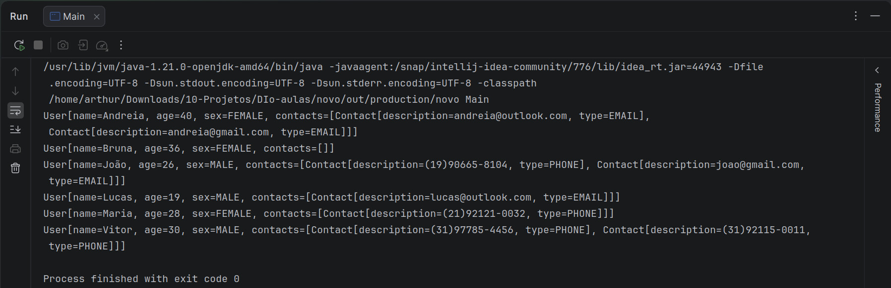
</p>

A saída do programa após a ordenação por nome mostra os seis usuários em ordem alfabética. O `toString` gerado automaticamente pelo record exibe todos os campos, incluindo a lista de contatos de cada usuário.

```
User[name=Andreia, age=40, sex=FEMALE, contacts=[Contact[description=andreia@outlook.com, type=EMAIL], Contact[description=andreia@gmail.com, type=EMAIL]]]
User[name=Bruna, age=36, sex=FEMALE, contacts=[]]
User[name=João, age=26, sex=MALE, contacts=[Contact[description=(19)90665-8104, type=PHONE], Contact[description=joao@gmail.com, type=EMAIL]]]
User[name=Lucas, age=19, sex=MALE, contacts=[Contact[description=lucas@outlook.com, type=EMAIL]]]
User[name=Maria, age=28, sex=FEMALE, contacts=[Contact[description=(21)92121-0032, type=PHONE]]]
User[name=Vitor, age=30, sex=MALE, contacts=[Contact[description=(31)97785-4456, type=PHONE], Contact[description=(31)92115-0011, type=PHONE]]]
```

Bruna aparece com uma lista de contatos vazia (`contacts=[]`), o que será útil nos exemplos de filtro a seguir.

#### Stream com `filter` — Usuários com pelo menos dois contatos

<p align="center">
  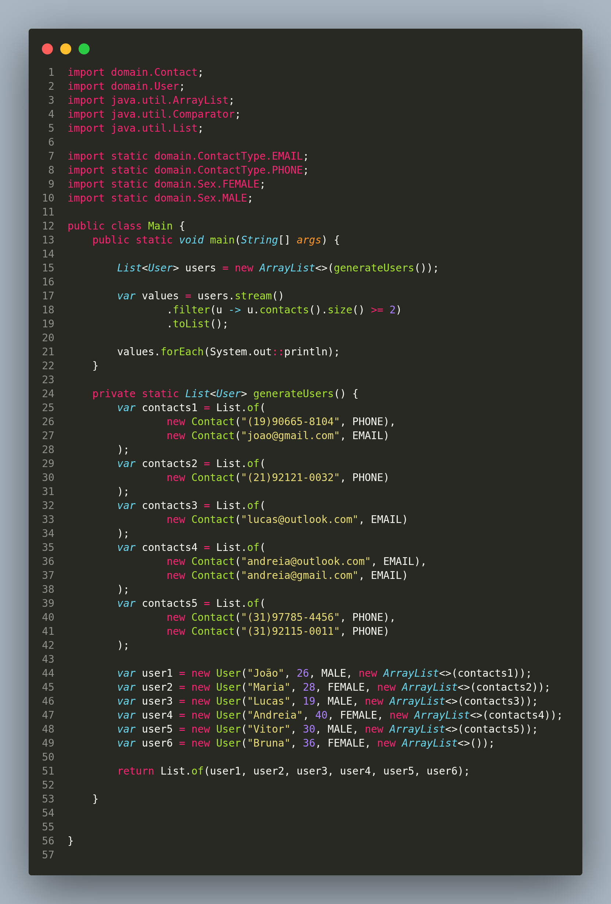
</p>

O método `filter` da Stream API permite selecionar apenas os elementos que satisfazem um predicado. Neste exemplo, o objetivo é obter somente os usuários que possuem **ao menos dois contatos**.

```java
var values = users.stream()
        .filter(u -> u.contacts().size() >= 2)
        .toList();

values.forEach(System.out::println);
```

O lambda `u -> u.contacts().size() >= 2` avalia o tamanho da lista de contatos de cada usuário. Apenas `João`, `Andreia` e `Vitor` satisfazem essa condição, pois são os únicos com dois ou mais contatos cadastrados.

#### Stream com `filter` — Usuários sem contatos

<p align="center">
  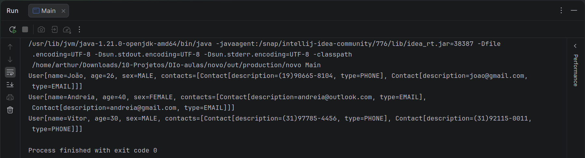
</p>

Aqui o predicado é invertido: busca-se usuários cuja lista de contatos seja nula **ou** vazia. Isso demonstra como combinar condições com o operador `||` dentro de um lambda.

```java
var values = users.stream()
        .filter(u -> u.contacts() != null && u.contacts().isEmpty())
        .toList();

values.forEach(System.out::println);
```

O resultado retorna apenas `Bruna`, que foi criada com `new ArrayList<>()` — uma lista vazia. A verificação `!= null` protege contra referências nulas caso algum usuário fosse criado sem lista de contatos.

#### Stream com `filter` e `anyMatch` — Usuários com contato do tipo EMAIL

<p align="center">
  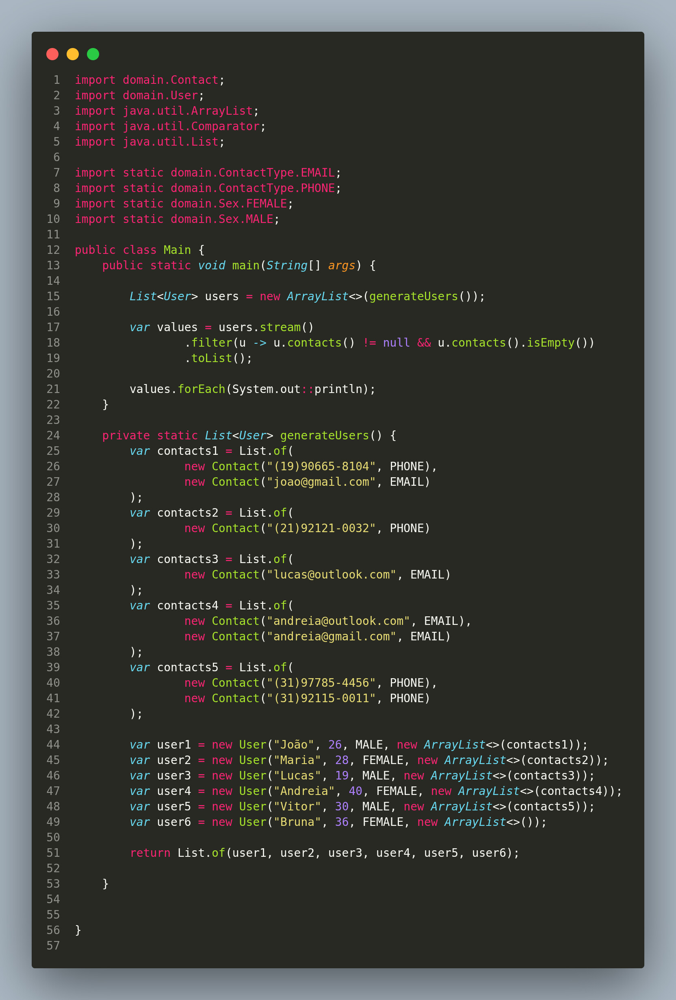
</p>

O método `anyMatch` é um **terminal de curto-circuito** da Stream API: ele retorna `true` assim que encontrar o primeiro elemento que satisfaça o predicado, sem percorrer o restante da stream. Neste exemplo, ele é usado dentro de um `filter` externo para selecionar usuários que possuam **ao menos um contato do tipo EMAIL**.

```java
var values = users.stream()
        .filter(u -> u.contacts().stream().anyMatch(c -> c.type() == EMAIL))
        .toList();

values.forEach(System.out::println);
```

A stream interna (`u.contacts().stream()`) percorre os contatos de cada usuário. Se qualquer contato for do tipo `EMAIL`, o usuário é incluído no resultado — mesmo que ele também possua contatos do tipo `PHONE`.

#### Saída — Usuários com pelo menos um contato EMAIL

<p align="center">
  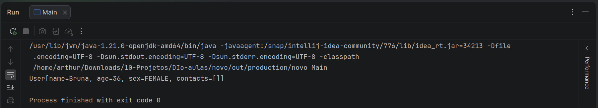
</p>

A saída confirma que `João`, `Lucas` e `Andreia` foram retornados — todos possuem ao menos um contato do tipo `EMAIL`. `João` também tem um contato `PHONE`, mas isso não impede sua inclusão pois o critério usa `anyMatch` (pelo menos um).

```
User[name=João, age=26, sex=MALE, contacts=[Contact[description=(19)90665-8104, type=PHONE], Contact[description=joao@gmail.com, type=EMAIL]]]
User[name=Lucas, age=19, sex=MALE, contacts=[Contact[description=lucas@outlook.com, type=EMAIL]]]
User[name=Andreia, age=40, sex=FEMALE, contacts=[Contact[description=andreia@outlook.com, type=EMAIL], Contact[description=andreia@gmail.com, type=EMAIL]]]
```

#### Stream com `flatMap` — Extraindo e filtrando contatos diretamente

<p align="center">
  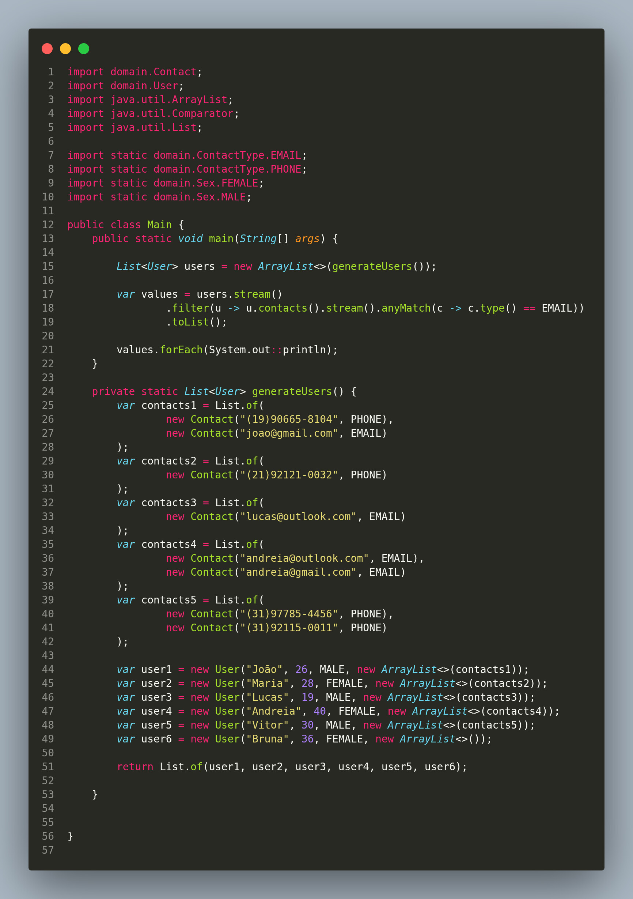
</p>

O `flatMap` é utilizado quando se quer **achatar** uma stream de coleções em uma única stream de elementos. Em vez de trabalhar com `Stream<List<Contact>>`, ele produz diretamente uma `Stream<Contact>`, permitindo filtrar e operar sobre os contatos de todos os usuários de forma unificada.

```java
var values = users.stream()
        .flatMap(u -> u.contacts().stream())
        .filter(c -> c.type() == EMAIL)
        .sorted(Comparator.comparing(Contact::description))
        .toList();

values.forEach(System.out::println);
```

O `flatMap` recebe uma função que, para cada `User`, retorna uma `Stream<Contact>`. Essas streams individuais são mescladas em uma única stream contínua. Em seguida, o `filter` seleciona apenas contatos do tipo `EMAIL` e o `sorted` os ordena alfabeticamente pela descrição.

#### Saída — Contatos do tipo EMAIL ordenados alfabeticamente

<p align="center">
  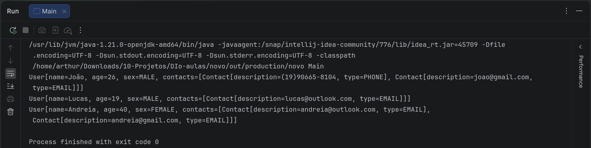
</p>

A saída exibe apenas os contatos do tipo `EMAIL`, ordenados alfabeticamente pela descrição. Todos os usuários foram "desmontados" pelo `flatMap`, e seus contatos foram reunidos em uma única sequência para filtragem e ordenação.

```
Contact[description=andreia@gmail.com, type=EMAIL]
Contact[description=andreia@outlook.com, type=EMAIL]
Contact[description=joao@gmail.com, type=EMAIL]
Contact[description=lucas@outlook.com, type=EMAIL]
```

#### Stream com `flatMap`, `filter`, `map` e `mapToLong` — Menor número de telefone

<p align="center">
  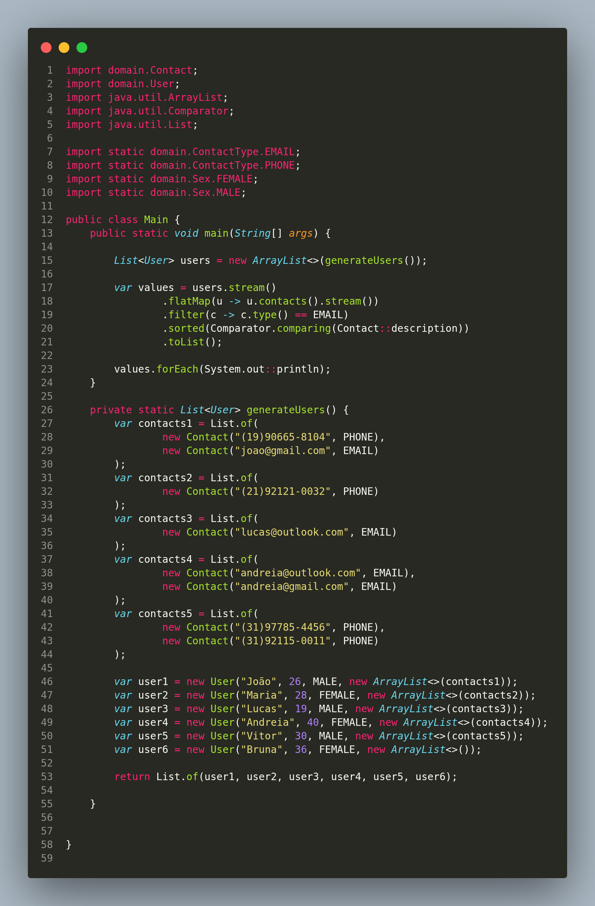
</p>

Este exemplo encadeia várias operações para transformar os números de telefone (armazenados como strings com formatação) em valores numéricos do tipo `long` e encontrar o menor deles.

```java
var values = users.stream()
        .flatMap(u -> u.contacts().stream())
        .filter(c -> c.type() == PHONE)
        .map(c -> c.description()
                .replace("(", "")
                .replace(")", "")
                .replace("-", ""))
        .mapToLong(Long::parseLong)
        .min();

System.out.println(values);
```

O `flatMap` desmonta os contatos de todos os usuários; o `filter` seleciona apenas os do tipo `PHONE`; o `map` remove os caracteres de máscara `(`, `)` e `-`, transformando, por exemplo, `"(19)90665-8104"` em `"1990665-8104"` e depois em `"19906658104"`; o `mapToLong` converte a string limpa para `long`; e por fim `min()` retorna um `OptionalLong` com o menor valor encontrado.

#### Saída — Menor número de telefone como `OptionalLong`

<p align="parameter">
  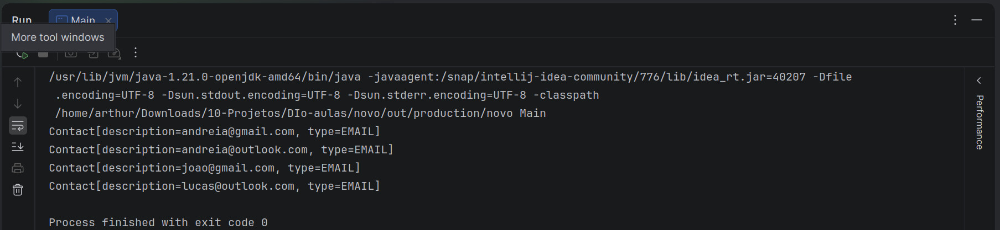
</p>

A saída mostra o resultado encapsulado em um `OptionalLong`, que é o tipo de retorno de `min()` em uma `LongStream`. O `Optional` existe porque a stream poderia estar vazia, caso não houvesse nenhum telefone cadastrado.

```
OptionalLong[19906658104]
```

O menor número encontrado foi `19906658104` (correspondente ao telefone de João com DDD 19), pois numericamente os números com DDD 19 iniciam com um valor menor que os DDDs 21 e 31.

#### Stream com `flatMap`, `filter`, `map` e `mapToLong` — Versão completa com `min()`

<p align="center">
  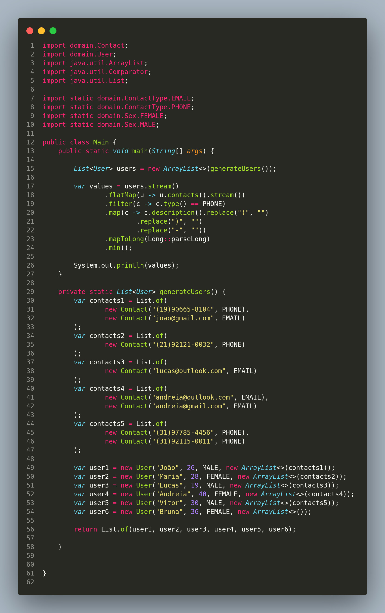
</p>

Esta imagem exibe o código completo da classe `Main` com o encadeamento final da stream, consolidando todos os conceitos apresentados na aula em um único exemplo coeso.

```java
import domain.Contact;
import domain.User;
import java.util.ArrayList;
import java.util.Comparator;
import java.util.List;

import static domain.ContactType.EMAIL;
import static domain.ContactType.PHONE;
import static domain.Sex.FEMALE;
import static domain.Sex.MALE;

public class Main {
    public static void main(String[] args) {

        List<User> users = new ArrayList<>(generateUsers());

        var values = users.stream()
                .flatMap(u -> u.contacts().stream())
                .filter(c -> c.type() == PHONE)
                .map(c -> c.description()
                        .replace("(", "")
                        .replace(")", "")
                        .replace("-", ""))
                .mapToLong(Long::parseLong)
                .min();

        System.out.println(values);
    }

    private static List<User> generateUsers() {
        var contacts1 = List.of(
                new Contact("(19)90665-8104", PHONE),
                new Contact("joao@gmail.com", EMAIL)
        );
        var contacts2 = List.of(
                new Contact("(21)92121-0032", PHONE)
        );
        var contacts3 = List.of(
                new Contact("lucas@outlook.com", EMAIL)
        );
        var contacts4 = List.of(
                new Contact("andreia@outlook.com", EMAIL),
                new Contact("andreia@gmail.com", EMAIL)
        );
        var contacts5 = List.of(
                new Contact("(31)97785-4456", PHONE),
                new Contact("(31)92115-0011", PHONE)
        );

        var user1 = new User("João",    26, MALE,   new ArrayList<>(contacts1));
        var user2 = new User("Maria",   28, FEMALE, new ArrayList<>(contacts2));
        var user3 = new User("Lucas",   19, MALE,   new ArrayList<>(contacts3));
        var user4 = new User("Andreia", 40, FEMALE, new ArrayList<>(contacts4));
        var user5 = new User("Vitor",   30, MALE,   new ArrayList<>(contacts5));
        var user6 = new User("Bruna",   36, FEMALE, new ArrayList<>());

        return List.of(user1, user2, user3, user4, user5, user6);
    }
}
```

O encadeamento demonstra como a Stream API permite construir pipelines de transformação expressivos e legíveis: cada operação intermediária (`flatMap`, `filter`, `map`, `mapToLong`) é aplicada de forma lazy, e `min()` dispara a execução de toda a pipeline retornando o resultado.

#### Saída final — `OptionalLong` com o menor número de telefone

<p align="center">
  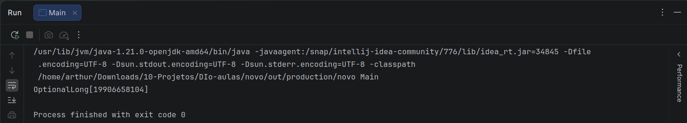
</p>

A saída final confirma o resultado já visto anteriormente: o menor número de telefone dentre todos os usuários, após a remoção da formatação e conversão para `long`, é `19906658104`.

```
OptionalLong[19906658104]
```

O uso de `OptionalLong` (em vez de um `long` primitivo) é a abordagem segura da linguagem para representar um resultado que pode ou não existir — neste caso, a stream poderia estar vazia se nenhum usuário tivesse contato do tipo `PHONE`. Para obter o valor primitivo, bastaria chamar `.getAsLong()` ou `.orElse(0L)` sobre o `Optional`.      


### 🟩 Vídeo 12 - Generics

<video width="60%" controls>
  <source src="000-Midia_e_Anexos/bootcamp_ntt_data_java_spring_ai-modulo.02-curso.04-video_12.webm" type="video/webm">
    Seu navegador não suporta vídeo HTML5.
</video>

link do vídeo: https://web.dio.me/track/ntt-data-2026-ai-java-back-end/course/imersao-pratica-com-collections-e-outras-classes-uteis-do-java/learning/618f4e62-63ea-46d3-898f-9f12c789768c?autoplay=1

### Anotações

<p align="center">
  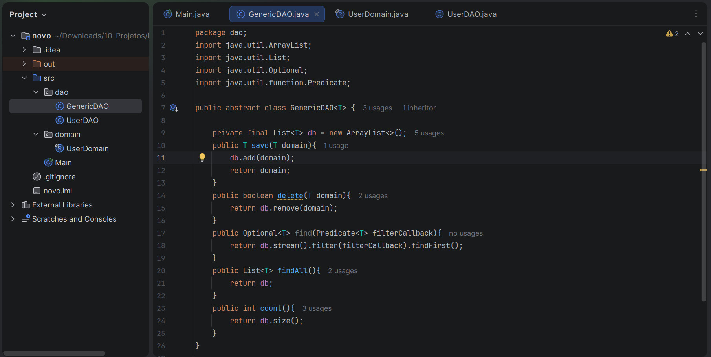
</p>

A imagem mostra a classe `GenericDAO<T>`, dentro do pacote `dao`, já com toda a estrutura básica implementada. Essa classe é abstrata e representa um DAO (Data Access Object) genérico, capaz de funcionar para qualquer tipo de domínio que venha a ser definido por `T`.

Ela mantém internamente uma lista (`db`) que simula um banco de dados em memória, e expõe os métodos fundamentais de acesso a dados: salvar, deletar, buscar com filtro, listar todos e contar registros.

```java
package dao;
import java.util.ArrayList;
import java.util.List;
import java.util.Optional;
import java.util.function.Predicate;

public abstract class GenericDAO<T> {

    private final List<T> db = new ArrayList<>();

    public T save(T domain){
        db.add(domain);
        return domain;
    }

    public boolean delete(T domain){
        return db.remove(domain);
    }

    public Optional<T> find(Predicate<T> filterCallback){
        return db.stream().filter(filterCallback).findFirst();
    }

    public List<T> findAll(){
        return db;
    }

    public int count(){
        return db.size();
    }
}
```

O uso do generics em `T` permite que essa mesma classe seja reaproveitada por qualquer entidade da aplicação, sem precisar reescrever a lógica de acesso a dados para cada uma delas.

<p align="center">
  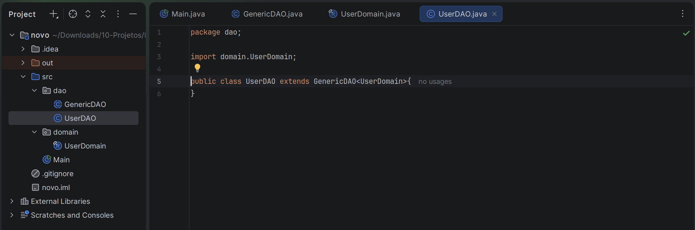
</p>

A imagem mostra a classe `UserDAO`, no pacote `dao`, que estende `GenericDAO<UserDomain>`. Essa é a implementação concreta do DAO genérico para a entidade de usuário: ao herdar de `GenericDAO`, `UserDAO` ganha automaticamente todos os métodos de `save`, `delete`, `find`, `findAll` e `count` já tipados para trabalhar com `UserDomain`, sem precisar reescrever nenhuma dessas operações.

```java
package dao;

import domain.UserDomain;

public class UserDAO extends GenericDAO<UserDomain>{
}
```

Esse é justamente o ganho de produtividade do uso de generics combinado com herança: a mesma estrutura de acesso a dados serve para qualquer domínio que se queira criar, bastando estender a classe genérica.

<p align="center">
  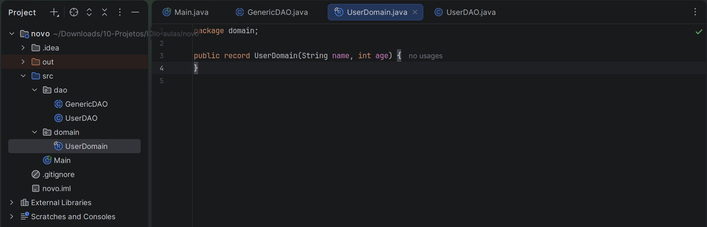
</p>

A imagem mostra a classe `UserDomain`, no pacote `domain`, implementada como um `record` do Java. Essa é a entidade concreta que representa um usuário, com os atributos `name` (String) e `age` (int).

```java
package domain;

public record UserDomain(String name, int age) {
}
```

Usar `record` aqui é uma forma simples e enxuta de criar uma entidade imutável, já que o Java gera automaticamente o construtor, os métodos de acesso, `equals`, `hashCode` e `toString` para os atributos declarados.

<p align="center">
  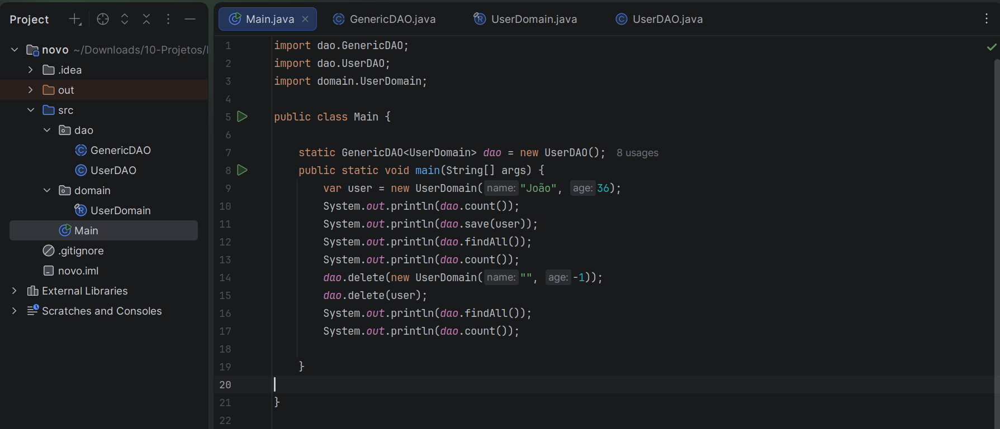
</p>

A imagem mostra a classe `Main`, que instancia o DAO genérico através da implementação concreta `UserDAO`, e executa uma sequência de operações para testar o comportamento do CRUD em memória.

```java
import dao.GenericDAO;
import dao.UserDAO;
import domain.UserDomain;

public class Main {

    static GenericDAO<UserDomain> dao = new UserDAO();
    public static void main(String[] args) {
        var user = new UserDomain("João", 36);
        System.out.println(dao.count());
        System.out.println(dao.save(user));
        System.out.println(dao.findAll());
        System.out.println(dao.count());
        dao.delete(new UserDomain("", -1));
        dao.delete(user);
        System.out.println(dao.findAll());
        System.out.println(dao.count());

    }

}
```

A sequência de chamadas testa, em ordem: a contagem inicial (vazia), o salvamento de um novo usuário, a listagem de todos os registros, a contagem após o `save`, uma tentativa de remoção de um usuário inexistente, a remoção do usuário que de fato existe, e por fim a listagem e a contagem finais para confirmar que o registro foi removido.

<p align="center">
  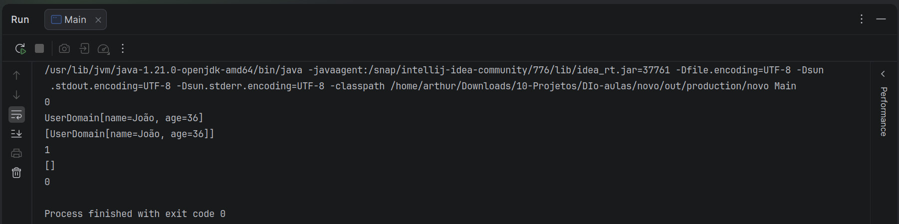
</p>

A imagem mostra a saída no console após a execução do `Main`, com o resultado de cada chamada feita anteriormente:

```
0
UserDomain[name=João, age=36]
[UserDomain[name=João, age=36]]
1
[]
0
```

Esse resultado confirma o comportamento esperado: a contagem inicial é `0`, o `save` retorna o próprio objeto salvo, o `findAll` mostra a lista com o usuário recém-adicionado, a contagem sobe para `1`, e após as duas chamadas de `delete` (uma para um usuário inexistente e outra para o usuário real) a lista volta a ficar vazia e a contagem retorna a `0`.

<p align="center">
  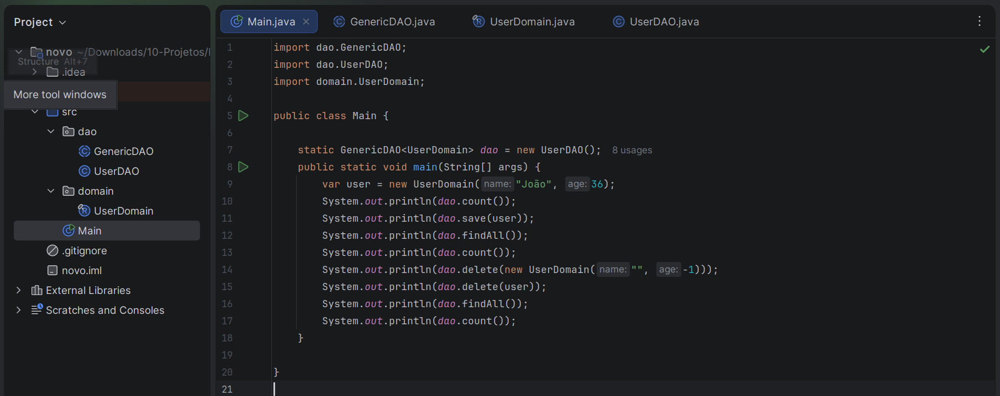
</p>

A imagem mostra uma nova versão da classe `Main`, com uma alteração em relação à anterior: agora as duas chamadas a `dao.delete(...)` estão envolvidas em `System.out.println`, para que o valor booleano retornado pelo método de remoção apareça diretamente no console.

```java
import dao.GenericDAO;
import dao.UserDAO;
import domain.UserDomain;

public class Main {

    static GenericDAO<UserDomain> dao = new UserDAO();
    public static void main(String[] args) {
        var user = new UserDomain("João", 36);
        System.out.println(dao.count());
        System.out.println(dao.save(user));
        System.out.println(dao.findAll());
        System.out.println(dao.count());
        System.out.println(dao.delete(new UserDomain("", -1)));
        System.out.println(dao.delete(user));
        System.out.println(dao.findAll());
        System.out.println(dao.count());
    }

}
```

Essa mudança evidencia que o método `delete` do `GenericDAO`, internamente, usa `db.remove(domain)`, que retorna `true` quando o elemento é encontrado e removido, e `false` quando o elemento não existe na lista.

<p align="center">
  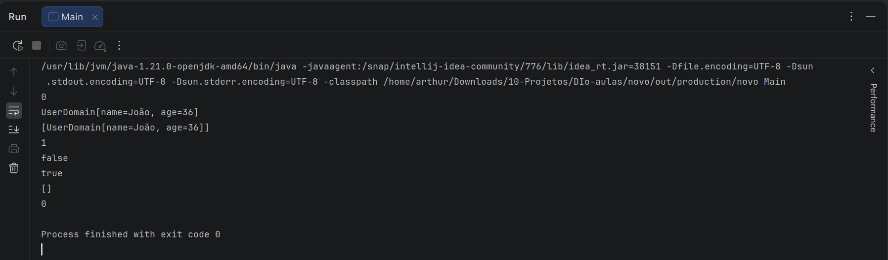
</p>

A imagem mostra a nova saída no console, agora exibindo também o resultado booleano das duas chamadas de `delete`:

```
0
UserDomain[name=João, age=36]
[UserDomain[name=João, age=36]]
1
false
true
[]
0
```

O `false` corresponde à tentativa de remover um usuário que não existe na lista (`new UserDomain("", -1)`), enquanto o `true` confirma que o usuário `João`, que de fato estava cadastrado, foi removido com sucesso. Em seguida, o `findAll` retorna uma lista vazia e o `count` volta a `0`, confirmando que a remoção funcionou corretamente.      


## Parte 6 - Classes Date e Calendar

### 🟩 Vídeo 13 - Classe Date

<video width="60%" controls>
  <source src="000-Midia_e_Anexos/bootcamp_ntt_data_java_spring_ai-modulo.02-curso.04-video_13.webm" type="video/webm">
    Seu navegador não suporta vídeo HTML5.
</video>

link do vídeo: https://web.dio.me/track/ntt-data-2026-ai-java-back-end/course/imersao-pratica-com-collections-e-outras-classes-uteis-do-java/learning/f0b51ae9-8785-4f7e-a757-ef7d0902de29?autoplay=1

### Anotações

<p align="center">
  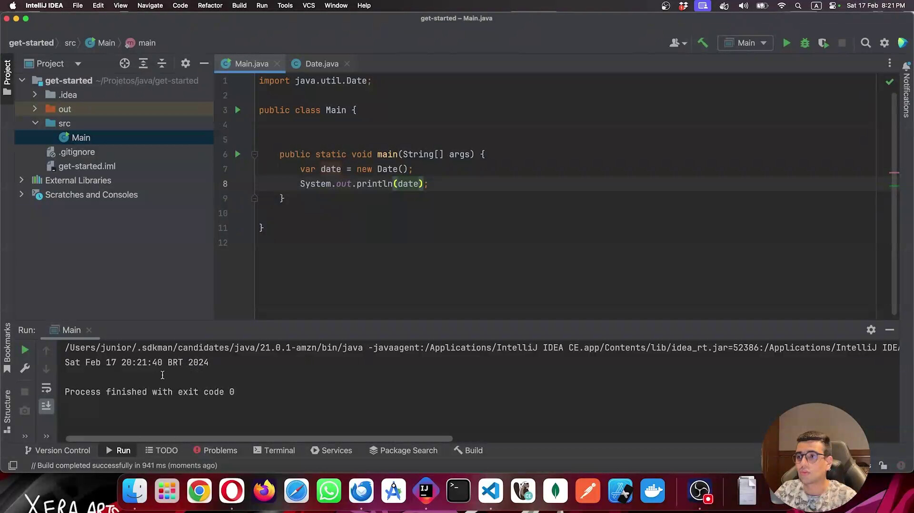
</p>

O primeiro exemplo da aula demonstra a forma mais simples de instanciar e exibir uma data em Java utilizando a classe `Date` do pacote `java.util`. O código cria um objeto `date` com `new Date()`, que automaticamente captura a data e hora atuais do sistema, e em seguida imprime seu valor com `System.out.println`. A saída exibida no console (`Sat Feb 17 20:21:40 BRT 2024`) revela o formato padrão da classe: dia da semana, mês abreviado, dia, hora completa com timezone e ano.

```java
import java.util.Date;

public class Main {
    public static void main(String[] args) {
        var date = new Date();
        System.out.println(date);
    }
}
```

> **Saída:** `Sat Feb 17 20:21:40 BRT 2024`

<p align="center">
  
</p>

Aqui é introduzida a formatação de datas com `SimpleDateFormat`, uma implementação concreta da classe abstrata `DateFormat` do pacote `java.text`. O padrão `"dd/MM/yyyy - hh:mm:ss"` é passado ao construtor — note que `MM` em maiúsculo representa o mês (para não confundir com `mm` minúsculo, que representa minutos). O `h` minúsculo no campo de hora trabalha no formato 12 horas: por isso o console exibiu `08:22:44` mesmo sendo 20h. A segunda linha imprime a data formatada via `formatter.format(date)`.

```java
import java.util.Date;

public class Main {
    public static void main(String[] args) {
        var date = new Date();
        DateFormat formatter = new SimpleDateFormat("dd/MM/yyyy - hh:mm:ss");
        System.out.println(date);
        System.out.println(formatter.format(date));
    }
}
```

> **Saída:**
> ```
> Sat Feb 17 20:22:44 BRT 2024
> 17/02/2024 - 08:22:44
> ```

<p align="center">
  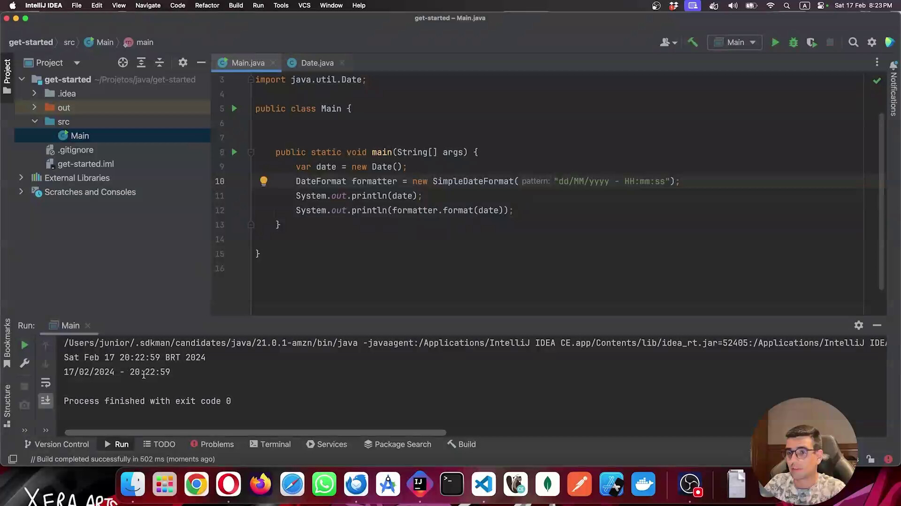
</p>

Esta imagem mostra a correção do formato de hora: substituindo o `hh` minúsculo por `HH` maiúsculo no padrão do `SimpleDateFormat`, a saída passa a usar o formato 24 horas. Agora o console exibe `20:22:59` corretamente, refletindo a hora real do sistema. Essa é uma distinção sutil mas importante nos padrões de formatação de datas em Java.

```java
import java.util.Date;

public class Main {
    public static void main(String[] args) {
        var date = new Date();
        DateFormat formatter = new SimpleDateFormat("dd/MM/yyyy - HH:mm:ss");
        System.out.println(date);
        System.out.println(formatter.format(date));
    }
}
```

> **Saída:**
> ```
> Sat Feb 17 20:22:59 BRT 2024
> 17/02/2024 - 20:22:59
> ```

<p align="center">
  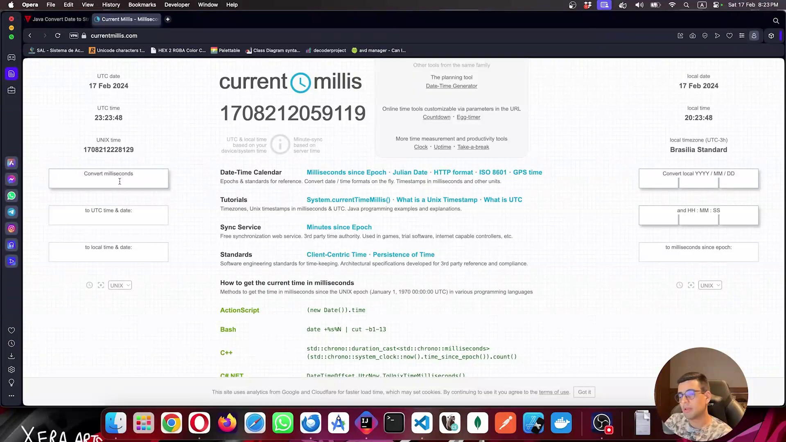
</p>

Esta imagem exibe o site **currentmillis.com**, acessado durante a aula para ilustrar o conceito de **Unix Epoch** — o ponto de origem da contagem de tempo em milissegundos adotado amplamente em sistemas computacionais. O valor mostrado (`1708212059119`) representa os milissegundos transcorridos desde **1º de janeiro de 1970 às 00:00:00 UTC**, data convencionada como marco zero do tempo Unix. O site também exibe a conversão para data local (17 Feb 2024, 20:23:48, fuso Brasilia Standard UTC-3h), reforçando a relação entre o valor numérico bruto e a data legível. Esse conceito é fundamental para entender o construtor `new Date(long)` da classe `Date` do Java.

<p align="center">
  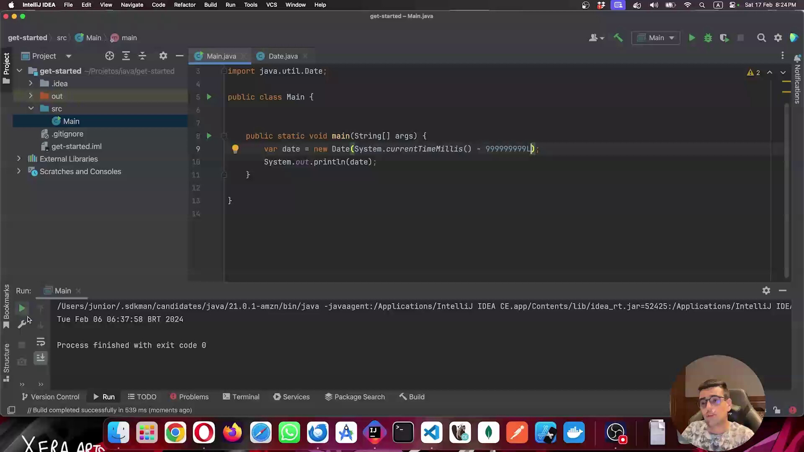
</p>

Aqui é demonstrado o construtor de `Date` que recebe um valor `long` representando milissegundos desde o Epoch. O código subtrai `999999999L` do tempo atual (`System.currentTimeMillis()`), gerando uma data no passado. O sufixo `L` é obrigatório para que o compilador trate o literal numérico como `long` e não como `int`. A saída `Tue Feb 06 06:37:58 BRT 2024` confirma que a data foi calculada corretamente a partir da diferença de milissegundos.

```java
import java.util.Date;

public class Main {
    public static void main(String[] args) {
        var date = new Date(System.currentTimeMillis() - 999999999L);
        System.out.println(date);
    }
}
```

> **Saída:** `Tue Feb 06 06:37:58 BRT 2024`

<p align="center">
  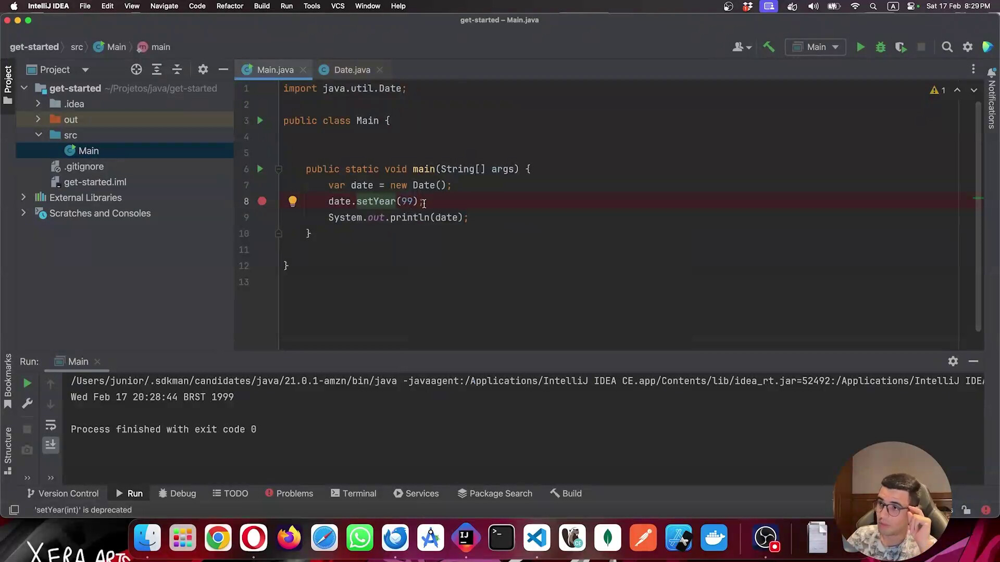
</p>

Esta imagem apresenta o uso do método `setYear()` — um dos mutadores da classe `Date` marcados como **`@Deprecated`** desde o JDK 1.1. O código chama `date.setYear(99)` e o resultado exibido no console é `Wed Feb 17 20:28:44 BRST 1999`. Isso revela o comportamento não intuitivo do método: ele **não recebe o ano diretamente**, mas sim um deslocamento a partir de 1900 — portanto, passar `99` resulta no ano `1900 + 99 = 1999`. A barra de status inferior do IntelliJ exibe o aviso `'setYear(int)' is deprecated`, confirmando que este método não deve ser usado em código novo.

```java
import java.util.Date;

public class Main {
    public static void main(String[] args) {
        var date = new Date();
        date.setYear(99);
        System.out.println(date);
    }
}
```

> **Saída:** `Wed Feb 17 20:28:44 BRST 1999`
>
> ⚠️ `setYear(int)` recebe o valor do ano **menos 1900**. Para definir o ano 1999, passe `99`. Para 2024, passe `124`.

<p align="center">
  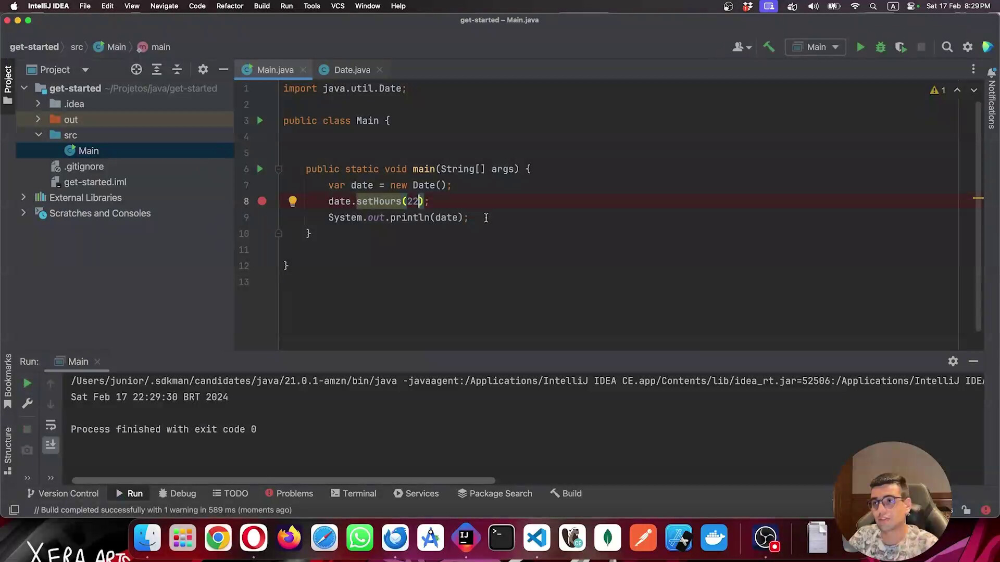
</p>

Aqui é demonstrado o método `setHours()`, outro mutador depreciado da classe `Date`. Ao contrário do `setYear()`, o comportamento de `setHours()` é mais direto: passando `22`, a hora do objeto é definida literalmente como 22h. A saída `Sat Feb 17 22:29:30 BRT 2024` confirma isso. O IntelliJ ainda exibe o aviso de método depreciado, mas o resultado é intuitivo — o valor passado corresponde diretamente à hora no formato 24h.

```java
import java.util.Date;

public class Main {
    public static void main(String[] args) {
        var date = new Date();
        date.setHours(22);
        System.out.println(date);
    }
}
```

> **Saída:** `Sat Feb 17 22:29:30 BRT 2024`

<p align="center">
  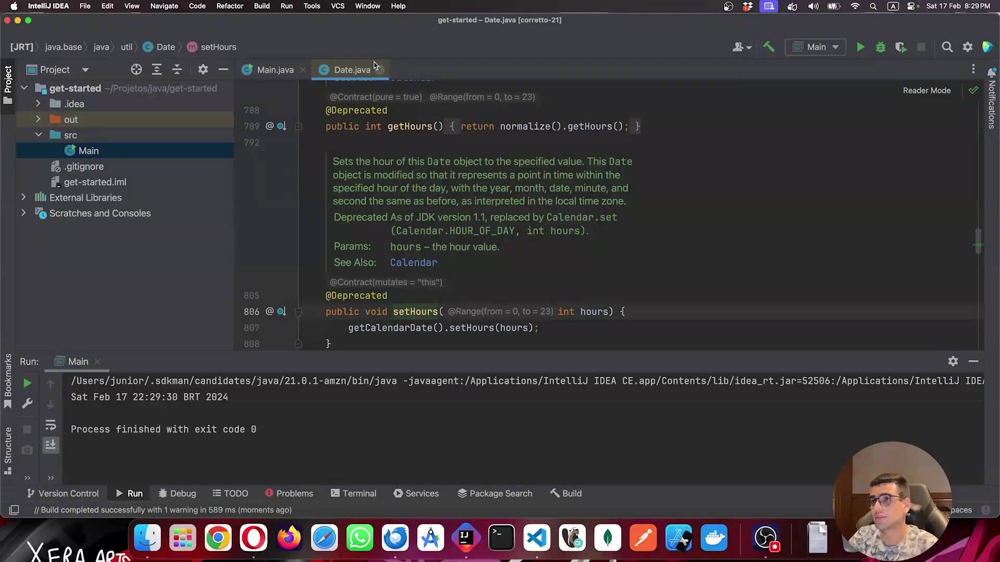
</p>

Esta imagem exibe a documentação interna do método `setHours()` aberta diretamente no IntelliJ IDEA (arquivo `Date.java` do JDK, linha 806). A documentação confirma que o método está marcado com `@Deprecated` e especifica seu comportamento: define a hora do objeto `Date` para o valor fornecido, modificando o ponto no tempo dentro do mesmo dia — mantendo ano, mês, data, minuto e segundo inalterados. A nota de depreciação indica que, desde o JDK 1.1, o método foi substituído por `Calendar.set(Calendar.HOUR_OF_DAY, int hours)`. O parâmetro aceita valores de 0 a 23.

<p align="center">
  
</p>

Esta imagem demonstra a comparação de datas com o método `equals()`. Duas instâncias de `Date` são criadas a partir do **mesmo valor de milissegundos** capturado em `System.currentTimeMillis()`, garantindo que representem o mesmo instante. A chamada `date.equals(newDate)` retorna `true`, pois ambos os objetos encapsulam o mesmo timestamp. Esse é o modo correto de verificar igualdade entre datas na API legada — nunca usando o operador `==`, que compara referências de objetos.

```java
import java.util.Date;

public class Main {
    public static void main(String[] args) {
        var milliseconds = System.currentTimeMillis();
        var date = new Date(milliseconds);
        var newDate = new Date(milliseconds);
        System.out.println(date.equals(newDate));
    }
}
```

> **Saída:** `true`

<p align="center">
  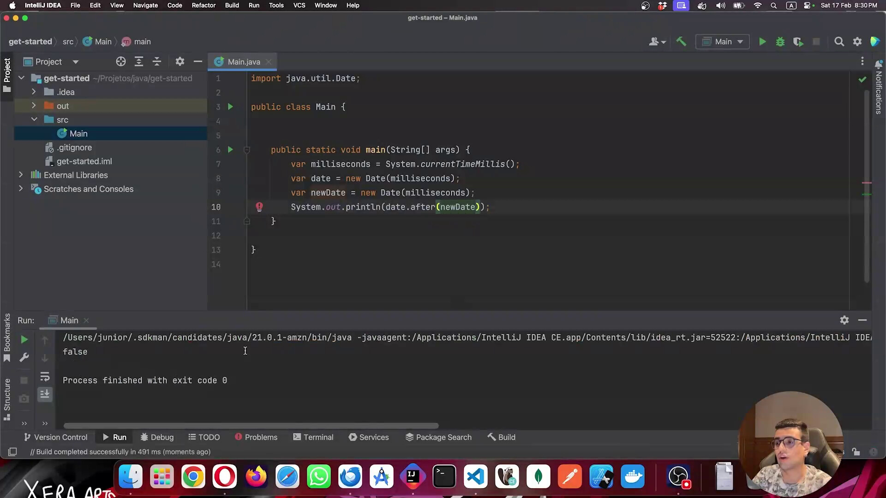
</p>


Aqui é mostrado o método `after()` aplicado à comparação entre os mesmos dois objetos `Date` com timestamps idênticos. O retorno é `false`, pois `date` **não é posterior** a `newDate` — eles representam o mesmo instante. O método `after(Date when)` retorna `true` apenas se o objeto receptor for estritamente mais recente do que o argumento passado. Com datas iguais, a condição não é satisfeita.

```java
import java.util.Date;

public class Main {
    public static void main(String[] args) {
        var milliseconds = System.currentTimeMillis();
        var date = new Date(milliseconds);
        var newDate = new Date(milliseconds);
        System.out.println(date.after(newDate));
    }
}
```

> **Saída:** `false`
>
> 💡 `after()` retorna `true` somente se `date` for **estritamente posterior** a `newDate`. Datas iguais resultam em `false`.

<p align="center">
  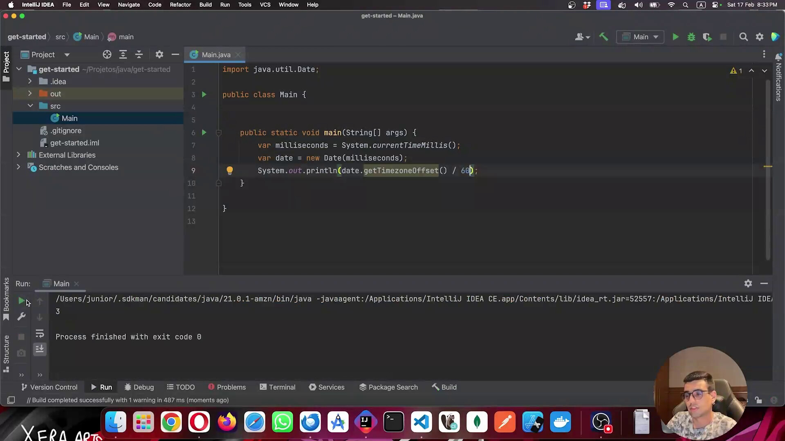
</p>

Esta última imagem da sequência exibe o método `getTimezoneOffset()`, que retorna o deslocamento de fuso horário em **minutos**. O valor é dividido por `60` para obter o resultado em horas. A saída `3` indica um offset de 3 horas em relação ao UTC — correspondente ao fuso horário de Brasília (BRT, UTC-3). Note que o método retorna o offset como positivo mesmo para fusos à esquerda do UTC, o que pode ser contra-intuitivo. Este é mais um método marcado como depreciado na API legada de datas do Java.

```java
import java.util.Date;

public class Main {
    public static void main(String[] args) {
        var milliseconds = System.currentTimeMillis();
        var date = new Date(milliseconds);
        System.out.println(date.getTimezoneOffset() / 60);
    }
}
```

> **Saída:** `3`
>
> ℹ️ O retorno representa o deslocamento em horas em relação ao UTC. Para o fuso de Brasília (UTC-3), o valor retornado é `3`.


### 🟩 Vídeo 14 - Classe Calendar

<video width="60%" controls>
  <source src="000-Midia_e_Anexos/bootcamp_ntt_data_java_spring_ai-modulo.02-curso.04-video_14.webm" type="video/webm">
    Seu navegador não suporta vídeo HTML5.
</video>

link do vídeo: https://web.dio.me/track/ntt-data-2026-ai-java-back-end/course/imersao-pratica-com-collections-e-outras-classes-uteis-do-java/learning/156c539f-7989-4eb3-b471-de027590d32f?autoplay=1

### Anotações

<p align="center">
  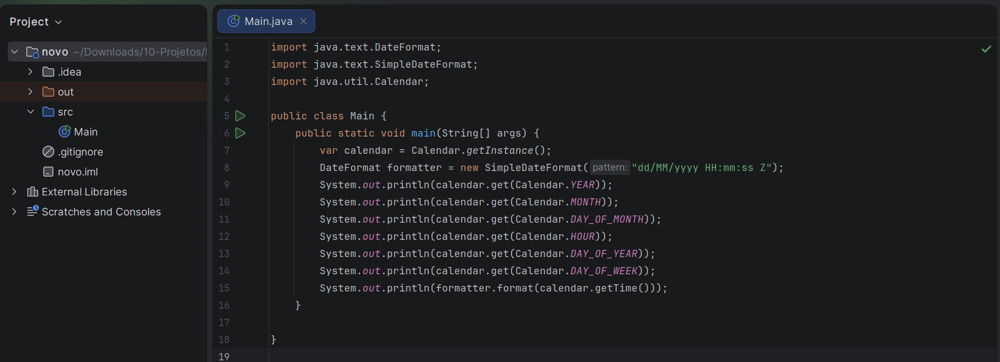
</p>

Aqui temos a instanciação inicial do `Calendar`. O código importa `java.text.DateFormat`, `java.text.SimpleDateFormat` e `java.util.Calendar`, e dentro do `main` cria um calendário com `Calendar.getInstance()` — a forma padrão de obter uma instância já preenchida com a data e hora atuais.

Na sequência, é criado um `DateFormat formatter = new SimpleDateFormat("dd/MM/yyyy HH:mm:ss Z")`, o mesmo recurso de formatação já usado anteriormente com `Date`, agora aplicado ao `Calendar`.

O restante do código explora o método `calendar.get(...)`, passando como parâmetro constantes da própria classe `Calendar`:

```java
import java.text.DateFormat;
import java.text.SimpleDateFormat;
import java.util.Calendar;

public class Main {
    public static void main(String[] args) {
        var calendar = Calendar.getInstance();
        DateFormat formatter = new SimpleDateFormat("dd/MM/yyyy HH:mm:ss Z");
        System.out.println(calendar.get(Calendar.YEAR));
        System.out.println(calendar.get(Calendar.MONTH));
        System.out.println(calendar.get(Calendar.DAY_OF_MONTH));
        System.out.println(calendar.get(Calendar.HOUR));
        System.out.println(calendar.get(Calendar.DAY_OF_YEAR));
        System.out.println(calendar.get(Calendar.DAY_OF_WEEK));
        System.out.println(formatter.format(calendar.getTime()));
    }
}
```

Cada chamada a `calendar.get(Calendar.X)` retorna uma informação específica da data: ano (`YEAR`), mês (`MONTH`), dia do mês (`DAY_OF_MONTH`), hora (`HOUR`), dia do ano (`DAY_OF_YEAR`) e dia da semana (`DAY_OF_WEEK`). Por fim, `formatter.format(calendar.getTime())` converte o `Calendar` para `Date` por meio de `getTime()` e formata o resultado como texto.

<p align="center">
  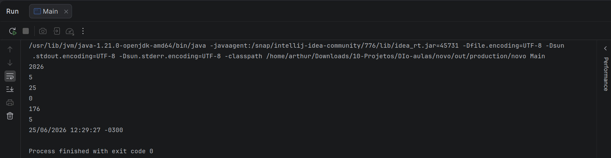
</p>

Esta imagem mostra a saída da execução do código anterior no console. Os valores impressos, na mesma ordem das chamadas a `calendar.get(...)`, foram:

```
2026
5
25
0
176
5
25/06/2026 12:29:27 -0300
```

Esses números evidenciam dois pontos importantes sobre a API `Calendar`: o `MONTH` retornou `5`, pois os meses são indexados a partir de zero (janeiro = 0), portanto `5` representa junho; e o `HOUR` retornou no formato de 12 horas (diferente de `HOUR_OF_DAY`, que traria o formato 24h). O `DAY_OF_YEAR` igual a `176` indica que a data corresponde ao 176º dia do ano, e `DAY_OF_WEEK` igual a `5` corresponde a quinta-feira, já que, na constante do `Calendar`, domingo equivale a `1`. A última linha mostra a data já formatada pelo `formatter`, no padrão `dd/MM/yyyy HH:mm:ss Z`.


<p align="center">
  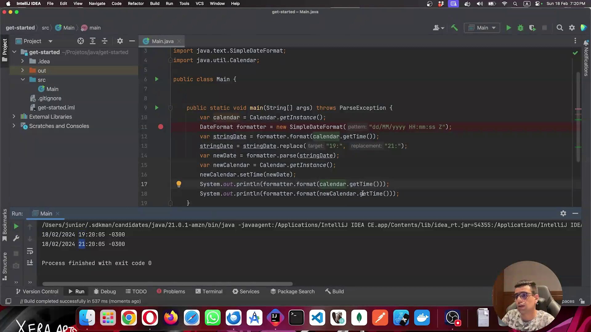
</p>

Nesta imagem o código evolui para demonstrar a conversão de `Calendar` para `String` e o caminho inverso, de `String` para `Calendar` passando por `Date`. O método `main` agora declara `throws ParseException`, já que `formatter.parse(...)` pode lançar essa exceção.

```java
public static void main(String[] args) throws ParseException {
    var calendar = Calendar.getInstance();
    DateFormat formatter = new SimpleDateFormat("dd/MM/yyyy HH:mm:ss Z");
    var stringDate = formatter.format(calendar.getTime());
    stringDate = stringDate.replace("19:", "21:");
    var newDate = formatter.parse(stringDate);
    var newCalendar = Calendar.getInstance();
    newCalendar.setTime(newDate);
    System.out.println(formatter.format(calendar.getTime()));
    System.out.println(formatter.format(newCalendar.getTime()));
}
```

O fluxo é o seguinte: primeiro o `Calendar` atual é convertido em `String` com `formatter.format(calendar.getTime())`. Em seguida, é feita uma alteração manual nessa string usando `stringDate.replace("19:", "21:")`, trocando a hora "19" por "21". Essa nova string é então convertida de volta em `Date` com `formatter.parse(stringDate)` — e é por isso que o método pode lançar `ParseException`. Como esse `parse` devolve um `Date` e não um `Calendar`, é criado um novo `Calendar` com `Calendar.getInstance()` e usado `newCalendar.setTime(newDate)` para "carregar" essa data dentro dele, já que o `set` do `Calendar` altera o objeto internamente mas não retorna um novo valor.

Ao final, os dois `println` comparam a hora original do `calendar` com a hora alterada no `newCalendar`, confirmando visualmente que a troca de "19:" para "21:" realmente modificou a hora exibida na segunda linha de saída.      


## Parte 7 - Conhecendo as Classes OffsetDateTime OffsetTime LocalDate LocalDateTime e LocalTime

### 🟩 Vídeo 15 - Classes OffsetDateTime, OffsetTime, LocalDate, LocalDateTime e LocalTime

<video width="60%" controls>
  <source src="000-Midia_e_Anexos/bootcamp_ntt_data_java_spring_ai-modulo.02-curso.04-video_15.webm" type="video/webm">
    Seu navegador não suporta vídeo HTML5.
</video>

link do vídeo: https://web.dio.me/track/ntt-data-2026-ai-java-back-end/course/imersao-pratica-com-collections-e-outras-classes-uteis-do-java/learning/f140cc1b-e275-429c-986d-380df6d21885?autoplay=1


## Parte 8 - Classe Thread e Interface Runnable

### 🟩 Vídeo 16 - Classe Thread e Interface Runnable

<video width="60%" controls>
  <source src="000-Midia_e_Anexos/bootcamp_ntt_data_java_spring_ai-modulo.02-curso.04-video_16.webm" type="video/webm">
    Seu navegador não suporta vídeo HTML5.
</video>

link do vídeo: https://web.dio.me/track/ntt-data-2026-ai-java-back-end/course/imersao-pratica-com-collections-e-outras-classes-uteis-do-java/learning/1d012f60-03b1-433c-84a2-c1232d3ce007?autoplay=1

## Parte 9 - Exercícios: Collections e Outras Classes Úteis do Java

### 🟩 Vídeo 17 - Lista de Exercícios

<video width="60%" controls>
  <source src="000-Midia_e_Anexos/bootcamp_ntt_data_java_spring_ai-modulo.02-curso.04-video_17.webm" type="video/webm">
    Seu navegador não suporta vídeo HTML5.
</video>

link do vídeo: https://web.dio.me/track/ntt-data-2026-ai-java-back-end/course/imersao-pratica-com-collections-e-outras-classes-uteis-do-java/learning/45a8b03c-14f2-4e71-a816-0b72babfc126?autoplay=1

##  Materiais de Apoio

# Certificado: 

- Link na plataforma: 
- Certificado em pdf: