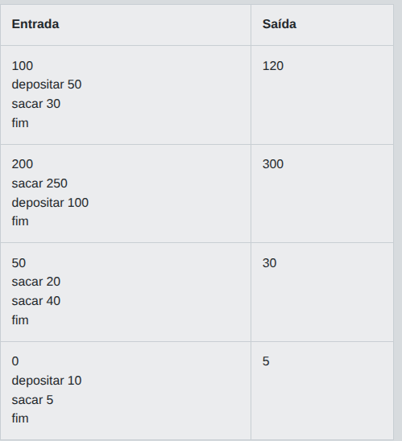
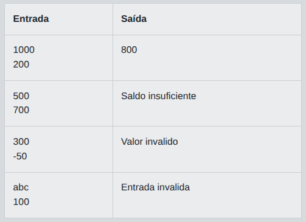

# Desafio 1 - ByteBank: Encapsulamento e Operações em Conta Bancária

Em um futuro próximo, o Banco Digital ByteBank revolucionou o gerenciamento de contas bancárias ao permitir que clientes controlem suas finanças de forma totalmente digital. Para garantir a segurança e organização dos dados, o ByteBank exige que todas as operações sejam realizadas por meio de métodos encapsulados, protegendo as informações sensíveis dos usuários. Você foi contratado para implementar uma parte fundamental desse sistema: a classe Conta, responsável por armazenar o saldo de um cliente e permitir operações básicas de depósito e saque, sempre respeitando as regras de encapsulamento.

Implemente uma classe chamada Conta que possua um saldo inicial definido no momento da criação. A classe deve disponibilizar métodos para depositar e sacar valores, garantindo que o saldo nunca fique negativo. Se uma tentativa de saque exceder o saldo disponível, a operação deve ser ignorada. Após uma sequência de operações, o programa deve exibir o saldo final da conta. Utilize encapsulamento para proteger o atributo saldo, permitindo acesso apenas por meio dos métodos definidos.

## Entrada

A primeira linha contém um inteiro representando o saldo inicial da conta. As linhas seguintes contêm comandos no formato "depositar X" ou "sacar X", onde X é um inteiro positivo. O processamento termina ao receber o comando "fim"

## Saída

Imprima uma única linha contendo o saldo final da conta após todas as operações.

Exemplos
A tabela abaixo apresenta exemplos de entrada e saída:

<p align="center">
  
</p>

## Código Exemplo

```java
import java.util.Scanner;

// Classe Conta com saldo encapsulado
class Conta {
    private int saldo;

    public Conta(int saldoInicial) {
        this.saldo = saldoInicial;
    }

    public void depositar(int valor) {
        if (valor > 0) {
            saldo += valor;
        }
    }

    public void sacar(int valor) {
        // TODO: Permitir saque apenas se houver saldo suficiente
        // Dica: cheque se 'valor' é menor ou igual ao saldo antes de subtrair
    }

    public int getSaldo() {
        return saldo;
    }
}

public class Main {
    public static void main(String[] args) {
        Scanner scanner = new Scanner(System.in);

        int saldoInicial = Integer.parseInt(scanner.nextLine());
        Conta conta = new Conta(saldoInicial);

        while (true) {
            String comando = scanner.nextLine().trim();
            if (comando.equals("fim")) break;

            String[] partes = comando.split(" ");
            String operacao = partes[0];
            int valor = Integer.parseInt(partes[1]);

            if (operacao.equals("depositar")) {
                conta.depositar(valor);
            } else if (operacao.equals("sacar")) {
                conta.sacar(valor);
            }
        }

        System.out.println(conta.getSaldo());
    }
}
```

## Solução

```java
import java.util.Scanner;

class Conta {
    private int saldo;

    public Conta(int saldoInicial) {
        this.saldo = saldoInicial;
    }

    public void depositar(int valor) {
        if (valor > 0) {
            saldo += valor;
        }
    }

    public void sacar(int valor) {
        if (valor > 0 && valor <= saldo) {
            saldo -= valor;
        }
    }

    public int getSaldo() {
        return saldo;
    }
}

public class Main {
    public static void main(String[] args) {
        Scanner scanner = new Scanner(System.in);

        int saldoInicial = Integer.parseInt(scanner.nextLine());
        Conta conta = new Conta(saldoInicial);

        while (true) {
            String comando = scanner.nextLine().trim();
            if (comando.equals("fim")) break;

            String[] partes = comando.split(" ");
            String operacao = partes[0];
            int valor = Integer.parseInt(partes[1]);

            if (operacao.equals("depositar")) {
                conta.depositar(valor);
            } else if (operacao.equals("sacar")) {
                conta.sacar(valor);
            }
        }

        System.out.println(conta.getSaldo());
    }
}
```

### Explicação detalhada

#### Encapsulamento

O atributo `saldo` é declarado como `private`, o que significa que **nenhum código fora da classe `Conta` pode lê-lo ou alterá-lo diretamente**. Todo acesso passa obrigatoriamente pelos métodos públicos — esse é o princípio do encapsulamento.

---

#### A classe `Conta`

| Membro | Tipo | Função |
|---|---|---|
| `saldo` | `private int` | Armazena o saldo; invisível de fora |
| `Conta(int)` | construtor | Define o saldo inicial |
| `depositar(int)` | método público | Soma ao saldo se valor > 0 |
| `sacar(int)` | método público | Subtrai do saldo, **somente se houver cobertura** |
| `getSaldo()` | método público | Retorna o saldo atual (leitura segura) |

---

#### O método `sacar` — passo a passo

```java
public void sacar(int valor) {
    if (valor > 0 && valor <= saldo) {  // ← dupla guarda
        saldo -= valor;
    }
    // se a condição falhar, simplesmente não faz nada
}
```

A condição tem duas verificações:

1. **`valor > 0`** — rejeita saques de valor zero ou negativo (que não fazem sentido).
2. **`valor <= saldo`** — garante que o saldo nunca ficará negativo. Se o valor pedido for maior que o saldo, a operação é **ignorada silenciosamente**, conforme o enunciado exige.

---

#### Verificação com os exemplos da tabela

| Entrada | Operações | Saldo final | Saída esperada | ✓ |
|---|---|---|---|---|
| 100, dep 50, sac 30 | 100+50=150, 150-30=120 | **120** | 120 | ✅ |
| 200, sac 250, dep 100 | saque ignorado (250>200), 200+100=300 | **300** | 300 | ✅ |
| 50, sac 20, sac 40 | 50-20=30, saque ignorado (40>30) | **30** | 30 | ✅ |
| 0, dep 10, sac 5 | 0+10=10, 10-5=5 | **5** | 5 | ✅ |

Todos os casos passam.

---

# Desafio 2 -Tratamento de Erros em Saques Bancários: Sistema Robusto em Java

Você foi contratado como desenvolvedor júnior para o Banco Futuro, uma instituição que está modernizando seu sistema bancário. Sua primeira tarefa é criar um módulo simples para processar saques em contas correntes. O sistema deve ser robusto: ao tentar sacar um valor inválido (como um número negativo, zero ou maior que o saldo disponível), o sistema deve identificar o erro e retornar uma mensagem apropriada, sem encerrar o programa abruptamente. Seu desafio é implementar o tratamento de exceções para garantir que o sistema responda corretamente a cada situação, ajudando o banco a evitar transtornos para os clientes e a manter a integridade das operações.

Implemente um programa que leia dois valores: o saldo atual da conta e o valor do saque solicitado. Se o saque for possível, exiba o novo saldo. Caso contrário, exiba uma mensagem de erro específica para cada situação: "Valor invalido" para saques negativos ou zero, e "Saldo insuficiente" para saques acima do saldo. Utilize o tratamento de exceções para lidar com possíveis erros de entrada, como valores não numéricos, exibindo "Entrada invalida" nesses casos.

## Entrada

Duas linhas, cada uma contendo um valor. A primeira linha representa o saldo atual (um número inteiro). A segunda linha representa o valor do saque solicitado (um número inteiro). Os valores podem ser positivos, zero, negativos ou não numéricos.

## Saída

Se o saque for realizado com sucesso, exiba o novo saldo (um número inteiro). Caso contrário, exiba uma das mensagens: "Valor invalido", "Saldo insuficiente" ou "Entrada invalida", conforme o caso.

A tabela abaixo apresenta exemplos de entrada e saída:

<p align="center">
  
</p>

## Código Exemplo

```java
import java.util.Scanner;

public class Main {
    public static void main(String[] args) {
        Scanner scanner = new Scanner(System.in);
        try {
            // Leitura dos valores de entrada
            String saldoInput = scanner.nextLine();
            String saqueInput = scanner.nextLine();

            int saldo = Integer.parseInt(saldoInput.trim());
            int valorSaque = Integer.parseInt(saqueInput.trim());

            // TODO: Verifique se o valor do saque é menor ou igual a zero e imprima "Valor invalido" se for o caso

            // Dica: Use uma estrutura condicional para validar o valor do saque antes de prosseguir

            // Verifica se há saldo suficiente para o saque
            if (valorSaque > saldo) {
                System.out.println("Saldo insuficiente");
                return;
            }

            // Saque realizado com sucesso
            System.out.println(saldo - valorSaque);

        } catch (NumberFormatException e) {
            System.out.println("Entrada invalida");
        }
    }
}
```

## Solução

