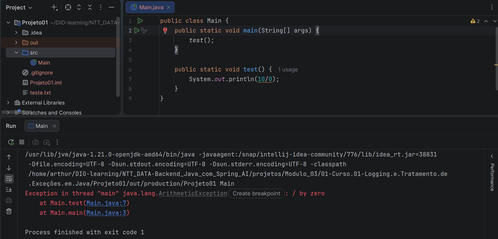
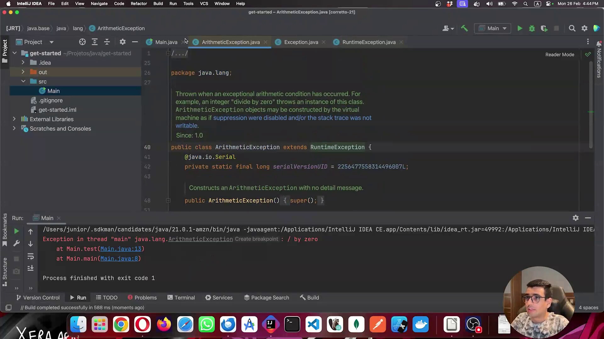
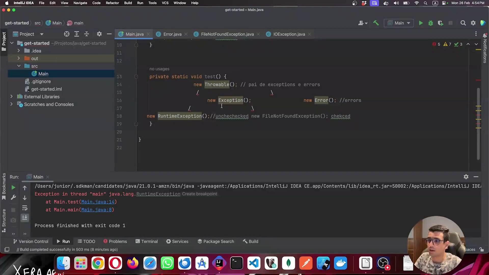
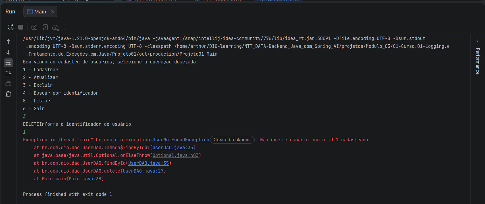
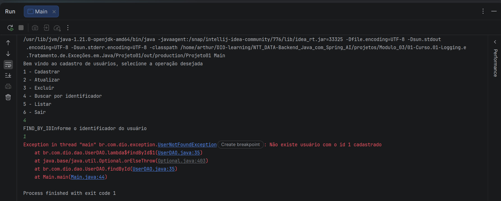
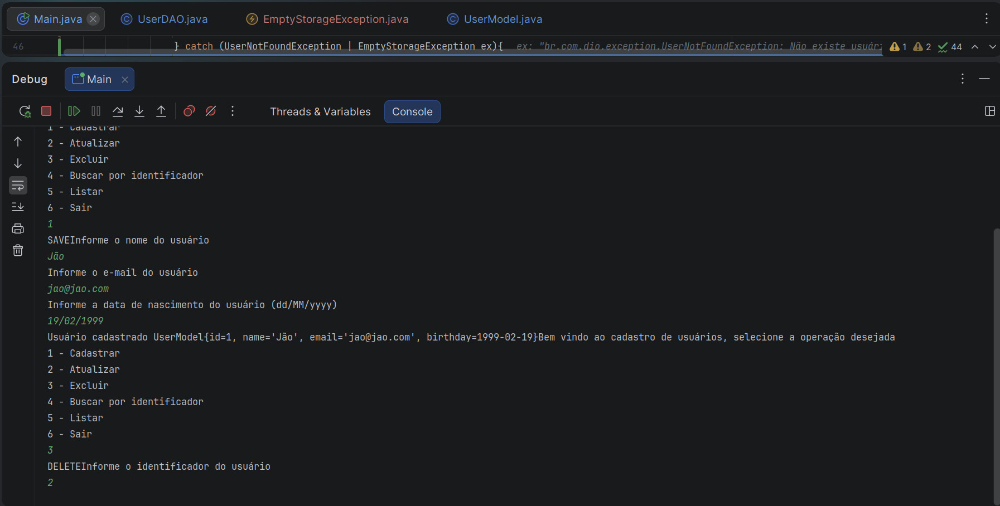
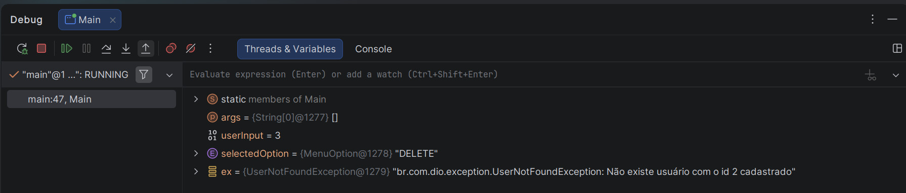

## Instrutor

- José Luiz Abreu Cardoso Junior (Engenheiro de software sênior)
- Contato Linkedin: / [juniorjrjl](https://www.linkedin.com/in/juniorjrjl/)

## Parte 1 - Introdução

### 🟩 Vídeo 01 - Entendendo Exceptions

<video width="60%" controls>
  <source src="000-Midia_e_Anexos/bootcamp_ntt_data_java_spring_ai-modulo.03-curso.01-video_01.webm" type="video/webm">
    Seu navegador não suporta vídeo HTML5.
</video>

link do vídeo: https://web.dio.me/track/ntt-data-2026-ai-java-back-end/course/debugging-e-o-tratamento-de-excecoes-em-java/learning/eb6df1a0-d71a-47d5-8e6e-ffb46aa82297?autoplay=1

### Anotações

<p align="center">
  
</p>

A imagem mostra o IntelliJ IDEA com a classe `Main`, contendo um método `test()` que executa uma divisão por zero (`10/0`) dentro de um `System.out.println`. Ao rodar o programa, o console exibe um erro em tempo de execução:

```
Exception in thread "main" java.lang.ArithmeticException: / by zero
    at Main.test(Main.java:7)
    at Main.main(Main.java:3)
```

```java
public class Main {
    public static void main(String[] args) {
        test();
    }

    public static void test() {
        System.out.println(10/0);
    }
}
```

Esse é o exemplo prático de uma exceção que ocorre **sem nenhum aviso prévio do compilador**: o código compila normalmente, mas falha apenas quando é executado, ao tentar dividir um número por zero. É a primeira demonstração de uma `ArithmeticException`, usada para introduzir o conceito de exceções não verificadas (que serão detalhadas mais adiante).

<p align="center">
  
</p>

Aqui o professor abre o código-fonte da própria classe `ArithmeticException` (dentro do pacote `java.lang`), mostrando sua documentação interna:

```java
/**
 * Thrown when an exceptional arithmetic condition has occurred. For
 * example, an integer "divide by zero" throws an instance of this class.
 * ArithmeticException objects may be constructed by the virtual
 * machine as if suppression were disabled and/or the stack trace was not
 * writable.
 *
 * Since: 1.0
 */
public class ArithmeticException extends RuntimeException {
    @java.io.Serial
    private static final long serialVersionUID = 2256477558314496007L;

    /**
     * Constructs an ArithmeticException with no detail message.
     */
    public ArithmeticException() { super(); }
```

No console, o mesmo erro de divisão por zero permanece visível, confirmando a origem da exceção mostrada anteriormente:

```
Exception in thread "main" java.lang.ArithmeticException: / by zero
    at Main.test(Main.java:13)
    at Main.main(Main.java:8)
```

Esse trecho evidencia visualmente o que a aula está explicando: a classe `ArithmeticException` **estende `RuntimeException`** (`extends RuntimeException`). É exatamente esse detalhe — a herança a partir de `RuntimeException` — que define a exceção como **não verificada**, ou seja, uma exceção que o Java não exige que seja tratada ou declarada com `throws`, podendo aparecer e interromper a execução do programa sem qualquer aviso em tempo de compilação.

<p align="center">
  
</p>

Nesta imagem, o professor monta um esquema visual dentro do próprio método `test()`, ilustrando a hierarquia das exceções em Java por meio de comentários e instanciações de objetos:

```java
private static void test() {
    new Throwable(); // pai de exceptions e errors

    new Exception();              new Error(); //errors

    new RuntimeException();//unchecked   new FileNotFoundException(); chekced
}
```

Esse esquema resume visualmente toda a hierarquia explicada ao longo da aula: **`Throwable`** é a classe-mãe de tudo — tanto de **exceções** (`Exception`) quanto de **erros** (`Error`). A partir de `Exception`, derivam-se dois ramos: as exceções **não verificadas** (*unchecked*), representadas por `RuntimeException` — que não exigem tratamento obrigatório do compilador — e as exceções **verificadas** (*checked*), representadas por `FileNotFoundException` — que obrigatoriamente precisam ser tratadas ou declaradas com `throws`. Essa imagem funciona como uma síntese visual de toda a árvore de exceções apresentada na aula.      

## Parte 2 - Debugging e o Tratamento de Exceções em Java

### 🟩 Vídeo 02 - Debugging e Exceções em Java

<video width="60%" controls>
  <source src="000-Midia_e_Anexos/bootcamp_ntt_data_java_spring_ai-modulo.03-curso.01-video_02.webm" type="video/webm">
    Seu navegador não suporta vídeo HTML5.
</video>

link do vídeo: https://web.dio.me/track/ntt-data-2026-ai-java-back-end/course/debugging-e-o-tratamento-de-excecoes-em-java/learning/7b54028a-0f26-41b5-876f-0425d3ecefe7?autoplay=1

### Anotações

O código abaixo mostra a classe `UserDAO`, criada no pacote `br.com.dio.dao` para representar a camada de acesso aos dados do cadastro de usuários. A classe mantém uma lista em memória de `UserModel` e um contador `nextId` usado para simular a geração de identificadores como em um banco de dados real.

O método `save` atribui um novo ID ao modelo recebido, incrementa o contador e adiciona o objeto à lista, retornando o usuário salvo. O método `update` localiza o registro existente pelo ID (reaproveitando `findById`), remove a versão antiga da lista e adiciona a nova em seu lugar. O método `delete` segue lógica semelhante: localiza o registro pelo ID e o remove da lista.

O método `findById` é o ponto em que a aula introduz tratamento de exceções: ele percorre a lista com `stream().filter()`, usa `findFirst()` para tentar localizar o usuário e, caso não exista, lança uma exceção customizada — `UserNotFoundException` — em vez da exceção genérica `NoSuchElementException` que o Java forneceria por padrão. A mensagem de erro é montada previamente com `String.format`, mas só é efetivamente usada se o usuário não for encontrado.

Por fim, `FindAll` simplesmente retorna a lista completa de modelos cadastrados.

```java
package br.com.dio.dao;
import br.com.dio.exception.UserNotFoundException;
import br.com.dio.model.UserModel;

import java.util.ArrayList;
import java.util.List;

public class UserDAO {

    private long nextId = 1L;
    private final List<UserModel> models = new ArrayList<>();

    public UserModel save(final UserModel model) {
        model.setId(nextId++);
        models.add(model);
        return model;
    }

    public UserModel update(final UserModel model) {
        var toUpdate = findById(model.getId());
        models.remove(toUpdate);
        models.add(model);
        return model;
    }

    public void delete(final long id) {
        var toDelete = findById(id);
        models.remove(toDelete);
    }

    public UserModel findById(final long id) {
        var message = String.format("Não existe usuário com o id %s cadastrado", id);
        return models.stream().filter(u -> u.getId() == id)
                .findFirst()
                .orElseThrow(() -> new UserNotFoundException(message));
    }

    public List<UserModel> FindAll() {
        return models;
    }
}
```

O código seguinte mostra a classe `UserNotFoundException`, criada no pacote `br.com.dio.exception`. Ela estende `RuntimeException`, o que significa que é uma exceção não verificada (*unchecked*): o compilador não obriga o código que a chama a tratá-la explicitamente com `try-catch` ou a declará-la na assinatura do método.

A classe define apenas um construtor que recebe uma `String message` e a repassa para o construtor da superclasse via `super(message)`. Essa mensagem é a que será exibida quando a exceção for lançada — exatamente a mensagem formatada no `findById`, indicando que não existe usuário cadastrado com o ID informado.

```java
package br.com.dio.exception;

public class UserNotFoundException extends RuntimeException {

    public UserNotFoundException(String message) {
        super(message);
    }
}
```

O próximo código mostra o enum `MenuOption`, criado no pacote `br.com.dio.model` para tornar o menu de interação mais robusto e organizado do que um simples número inteiro. Em vez de trabalhar diretamente com `int`, cada opção do menu é representada por uma constante nomeada em inglês: `SAVE`, `UPDATE`, `DELETE`, `FIND_BY_ID`, `FIND_ALL` e `EXIT`.

O uso do enum permite, mais adiante, usar o método `values()` para converter a entrada numérica do usuário na opção correspondente, além de possibilitar o uso de `switch` sobre essas constantes de forma mais legível e segura do que comparar números mágicos.

```java
package br.com.dio.model;

import br.com.dio.dao.UserDAO;

import java.util.function.Consumer;

public enum MenuOption {
    SAVE,
    UPDATE,
    DELETE,
    FIND_BY_ID,
    FIND_ALL,
    EXIT;

}
```

Abaixo, a classe `UserModel`, no pacote `br.com.dio.model`, que representa a entidade de usuário do cadastro. Diferente do plano inicial de usar um `record`, a aula optou por uma classe tradicional, pois o `record` é imutável e isso traria dificuldades para operações como `update`.

A classe possui quatro atributos privados — `id` (long), `name` (String), `email` (String) e `birthday` (OffsetDateTime) — além de dois construtores: um vazio (padrão) e outro com todos os argumentos. Para cada atributo há um par de métodos `getter`/`setter`.

A classe também sobrescreve três métodos padrão do Java: `equals`, que compara dois objetos `UserModel` considerando todos os atributos com o auxílio de `Objects.equals`; `hashCode`, que gera o código hash combinando todos os atributos via `Objects.hash`; e `toString`, que monta uma representação textual do objeto exibindo todos os seus campos.

```java
package br.com.dio.model;
import java.time.OffsetDateTime;
import java.util.Objects;

public class UserModel {
    private long id;
    private String name;
    private String email;
    private OffsetDateTime birthday;

    public UserModel() {
    }

    public UserModel(long id, String name, String email, OffsetDateTime birthday) {
        this.id = id;
        this.name = name;
        this.email = email;
        this.birthday = birthday;
    }

    public long getId() {
        return id;
    }

    public void setId(long id) {
        this.id = id;
    }

    public String getName() {
        return name;
    }

    public void setName(String name) {
        this.name = name;
    }

    public String getEmail() {
        return email;
    }

    public void setEmail(String email) {
        this.email = email;
    }

    public OffsetDateTime getBirthday() {
        return birthday;
    }

    public void setBirthday(OffsetDateTime birthday) {
        this.birthday = birthday;
    }

    @Override
    public boolean equals(Object o) {
        if (o == null || getClass() != o.getClass()) return false;
        UserModel userModel = (UserModel) o;
        return id == userModel.id &&
                Objects.equals(name, userModel.name) &&
                Objects.equals(email, userModel.email) &&
                Objects.equals(birthday, userModel.birthday);
    }

    @Override
    public int hashCode() {
        return Objects.hash(id, name, email, birthday);
    }

    @Override
    public String toString() {
        return "UserModel{" +
                "id=" + id +
                ", name='" + name + '\'' +
                ", email='" + email + '\'' +
                ", birthday=" + birthday +
                '}';
    }
}
```

Por fim, a classe `Main`, com o menu interativo completo do cadastro de usuários. A classe mantém como atributos estáticos uma instância de `UserDAO` e um `Scanner` para ler a entrada do usuário.

No método `main`, um laço `while (true)` exibe repetidamente as seis opções do menu (Cadastrar, Atualizar, Excluir, Buscar por identificador, Listar, Sair) e lê a escolha do usuário com `scanner.nextInt()`. Essa entrada numérica (1 a 6) é convertida na constante correspondente do enum `MenuOption` por meio de `MenuOption.values()[userInput - 1]`, já que o array de valores do enum é indexado a partir de zero.

Um `switch` sobre `selectedOption` direciona a execução para cada operação: `SAVE` chama `dao.save(requestToSave())` e imprime o usuário cadastrado; `UPDATE` chama `dao.update(requestToUpdate())` e imprime o usuário atualizado; `DELETE` chama `dao.delete(requestId())` e imprime confirmação de exclusão; `FIND_BY_ID` busca o usuário pelo ID informado e o imprime; `FIND_ALL` lista todos os usuários cadastrados, percorrendo a lista com `forEach(System.out::println)` entre marcadores de início e fim; e `EXIT` finaliza o programa com `System.exit(0)`.

Os métodos auxiliares `requestId`, `requestToSave` e `requestToUpdate` ficam responsáveis por coletar os dados digitados pelo usuário no terminal. `requestToSave` solicita nome, e-mail e data de nascimento (no formato `dd/MM/yyyy`, convertido para `OffsetDateTime` com `DateTimeFormatter`) e monta um novo `UserModel` com ID zero. `requestToUpdate` faz o mesmo, mas solicita também o identificador do usuário a ser atualizado.

```java
import br.com.dio.model.MenuOption;
import br.com.dio.dao.UserDAO;
import br.com.dio.model.UserModel;
import br.com.dio.model.MenuOption;

import javax.print.attribute.standard.RequestingUserName;
import java.time.OffsetDateTime;
import java.time.format.DateTimeFormatter;
import java.util.Scanner;

public class Main {

    private final static UserDAO dao = new UserDAO();
    private final static Scanner scanner = new Scanner(System.in);

    public static void main(String[] args) {
        while (true) {
            System.out.println("Bem vindo ao cadastro de usuários, selecione a operação desejada");
            System.out.println("1 - Cadastrar");
            System.out.println("2 - Atualizar");
            System.out.println("3 - Excluir");
            System.out.println("4 - Buscar por identificador");
            System.out.println("5 - Listar");
            System.out.println("6 - Sair");
            var userInput = scanner.nextInt();
            var selectedOption = MenuOption.values()[userInput -1];
            switch (selectedOption) {
                case SAVE -> {
                    var user = dao.save(requestToSave());
                    System.out.printf("Usuário cadastrado %s", user);
                }
                case UPDATE -> {
                    var user = dao.update(requestToUpdate());
                    System.out.printf("Usuário atualizado %s", user);
                }
                case DELETE -> {
                    dao.delete(requestId());
                    System.out.println("Usuário excluído");
                }
                case FIND_BY_ID -> {
                    var id = requestId();
                    var user = dao.findById(id);
                    System.out.printf("Usuario com id %s", id);
                    System.out.println(user);

                }
                case FIND_ALL -> {
                    var users = dao.FindAll();
                    System.out.println("Usuários cadastrados");
                    System.out.println("======================");
                    users.forEach(System.out::println);
                    System.out.println("======================fim======================");
                }
                case EXIT ->  System.exit(0);
            }
        }
    }

    private static long requestId(){
        System.out.println("Informe o identificador do usuário");
        return scanner.nextLong();
    }

    private static UserModel requestToSave() {
        System.out.println("Informe o nome do usuário");
        var name = scanner.next();
        System.out.println("Informe o e-mail do usuário");
        var email = scanner.next();
        System.out.println("Informe a data de nascimento do usuário (dd/MM/yyyy)");
        var birthdayString = scanner.next();
        var formatter = DateTimeFormatter.ofPattern("dd/MM/yyyy");
        var birthday = OffsetDateTime.parse(birthdayString, formatter);
        return new UserModel(0, name, email, birthday);
    }

    private static UserModel requestToUpdate() {
        System.out.println("Informe o identificador do usuário");
        var id = scanner.nextLong();
        System.out.println("Informe o nome do usuário");
        var name = scanner.next();
        System.out.println("Informe o e-mail do usuário");
        var email = scanner.next();
        System.out.println("Informe a data de nascimento do usuário (dd/MM/yyyy)");
        var birthdayString = scanner.next();
        var formatter = DateTimeFormatter.ofPattern("dd/MM/yyyy");
        var birthday = OffsetDateTime.parse(birthdayString, formatter);
        return new UserModel(id, name, email, birthday);
    }
}
```

<p align="center">
  
</p>

A imagem acima mostra o resultado da execução do programa no terminal da IDE. O menu é exibido normalmente com as seis opções, o usuário digita `3` (Excluir) e, em seguida, informa o identificador `1` quando solicitado.

Como nenhum usuário com esse ID havia sido cadastrado, o programa lança a exceção `UserNotFoundException`, exibindo a mensagem "Não existe usuário com o id 1 cadastrado". O terminal mostra também a *call stack* completa da exceção, indicando exatamente a sequência de chamadas que levou ao erro: a exceção é originada dentro da lambda do `findById` (`UserDAO.java:35`), passa pelo `Optional.orElseThrow` da própria API do Java, retorna ao `findById` (`UserDAO.java:35`), sobe até o `delete` que o chamou (`UserDAO.java:27`) e, por fim, até o ponto em `Main.main` (`Main.java:38`) onde a operação de exclusão foi disparada. Essa exceção foi provocada propositalmente para servir de ponto de partida ao estudo do tratamento de exceções nas próximas aulas.      


### 🟩 Vídeo 03 - Gerenciando Exceções em Java

<video width="60%" controls>
  <source src="000-Midia_e_Anexos/bootcamp_ntt_data_java_spring_ai-modulo.03-curso.01-video_03.webm" type="video/webm">
    Seu navegador não suporta vídeo HTML5.
</video>

link do vídeo: https://web.dio.me/track/ntt-data-2026-ai-java-back-end/course/debugging-e-o-tratamento-de-excecoes-em-java/learning/e99f4cc8-9aa6-4abe-bdec-3152797f31d7?autoplay=1

### Anotações

<p align="center">
  
</p>

A execução do programa de cadastro de usuários é interrompida por uma `UserNotFoundException`. Ao escolher a opção "4 - Buscar por identificador" e informar um id que não existe (`1`), o fluxo é encerrado abruptamente com a mensagem **"Não existe usuário com o id 1 cadastrado"**.

O stack trace mostra o caminho percorrido pela exceção até a sua origem:

```
at br.com.dio.dao.UserDAO.lambda$findById$1(UserDAO.java:35)
at java.base/java.util.Optional.orElseThrow(Optional.java:403)
at br.com.dio.dao.UserDAO.findById(UserDAO.java:35)
at Main.main(Main.java:44)
```

Essa é uma exceção *unchecked* (não verificada): ela estende `RuntimeException`, por isso o compilador não obriga o código a tratá-la. Como nenhum bloco `try/catch` foi implementado ainda, o programa simplesmente termina com `Process finished with exit code 1`.

O código abaixo apresenta a classe `UserDAO`, responsável por simular o armazenamento de usuários em memória através de uma `List<UserModel>`.

```java
package br.com.dio.dao;

import br.com.dio.exception.EmptyStorageException;
import br.com.dio.exception.UserNotFoundException;
import br.com.dio.model.UserModel;

import java.util.ArrayList;
import java.util.List;

public class UserDAO {

    private long nextId = 1L;
    private final List<UserModel> models = new ArrayList<>();

    public UserModel save(final UserModel model) {
        model.setId(nextId++);
        models.add(model);
        return model;
    }

    public UserModel update(final UserModel model) {
        var toUpdate = findById(model.getId());
        models.remove(toUpdate);
        models.add(model);
        return model;
    }

    public void delete(final long id) {
        var toDelete = findById(id);
        models.remove(toDelete);
    }

    public UserModel findById(final long id) {
        verifyStorage();
        var message = String.format("Não existe usuário com o id %s cadastrado", id);
        return models.stream()
                .filter(u -> u.getId() == id)
                .findFirst()
                .orElseThrow(() -> new UserNotFoundException(message));
    }

    public List<UserModel> FindAll() {
        List<UserModel> result;
        try {
            verifyStorage();
            result = models;
        } catch (EmptyStorageException ex) {
            ex.printStackTrace();
            result = new ArrayList<>();
        }
        return result;
    }

    private void verifyStorage(){
        if (models.isEmpty()) throw new EmptyStorageException("O armazenamento está vazio");
    }
}
```

A classe centraliza as operações de CRUD (`save`, `update`, `delete`, `findById`, `FindAll`). O método `findById` usa Stream API: filtra a lista pelo id desejado e, caso não encontre nenhum elemento, o `orElseThrow` dispara uma `UserNotFoundException` com uma mensagem personalizada construída via `String.format`.

Já o método `verifyStorage` centraliza a verificação se a lista está vazia, lançando uma `EmptyStorageException` quando necessário. Esse método é chamado tanto no `findById` quanto no `FindAll`, evitando repetição de código — sendo que em `findById` a exceção é propagada livremente, enquanto em `FindAll` ela é capturada localmente com um `try/catch`, registrando o erro via `printStackTrace()` e retornando uma lista vazia no lugar de interromper a execução.

Abaixo é exibida a classe `EmptyStorageException`, uma exceção customizada criada para indicar que o armazenamento de usuários está vazio.

```java
package br.com.dio.exception;

public class EmptyStorageException extends RuntimeException {

    public EmptyStorageException(final String message) {
        super(message);
    }
}
```

Por estender `RuntimeException`, trata-se de uma exceção *unchecked*: o código que a invoca não é obrigado pelo compilador a tratá-la com `try/catch`, podendo optar por deixá-la se propagar livremente pela pilha de chamadas ou capturá-la quando fizer sentido para a regra de negócio.

A seguir temos a classe `UserNotFoundException`, utilizada para indicar que um usuário com determinado identificador não foi encontrado na base.

```java
package br.com.dio.exception;

public class UserNotFoundException extends RuntimeException {

    public UserNotFoundException(String message) {
        super(message);
    }
}
```

Assim como a `EmptyStorageException`, ela também estende `RuntimeException`, sendo, portanto, uma exceção não verificada. Seu construtor recebe uma mensagem personalizada que é repassada ao construtor da superclasse via `super(message)`, permitindo que o consumidor da exceção tenha contexto exato sobre qual usuário não foi localizado.

o código seguinte apresenta o enum `MenuOption`, que representa as operações disponíveis no menu do programa de cadastro de usuários.

```java
package br.com.dio.model;

import br.com.dio.dao.UserDAO;

import java.util.function.Consumer;

public enum MenuOption {
    SAVE,
    UPDATE,
    DELETE,
    FIND_BY_ID,
    FIND_ALL,
    EXIT;
}
```

Cada constante do enum corresponde a uma opção do menu interativo exibido ao usuário: cadastrar, atualizar, excluir, buscar por identificador, listar todos os registros e sair do programa. Esse enum é usado na classe principal para mapear a entrada numérica digitada pelo usuário para a operação correspondente.

Aqui é exibida a classe `UserModel`, que representa a entidade de usuário utilizada em todo o sistema.

```java
package br.com.dio.model;

import java.time.LocalDate;
import java.time.LocalDateTime;
import java.time.LocalDate;
import java.util.Objects;

public class UserModel {
    private long id;
    private String name;
    private String email;
    private LocalDate birthday;

    public UserModel() {
    }

    public UserModel(long id, String name, String email, LocalDate birthday) {
        this.id = id;
        this.name = name;
        this.email = email;
        this.birthday = birthday;
    }

    public long getId() {
        return id;
    }

    public void setId(long id) {
        this.id = id;
    }

    public String getName() {
        return name;
    }

    public void setName(String name) {
        this.name = name;
    }

    public String getEmail() {
        return email;
    }

    public void setEmail(String email) {
        this.email = email;
    }

    public LocalDate getBirthday() {
        return birthday;
    }

    public void setBirthday(LocalDate birthday) {
        this.birthday = birthday;
    }

    @Override
    public boolean equals(Object o) {
        if (o == null || getClass() != o.getClass()) return false;
        UserModel userModel = (UserModel) o;
        return id == userModel.id &&
                Objects.equals(name, userModel.name) &&
                Objects.equals(email, userModel.email) &&
                Objects.equals(birthday, userModel.birthday);
    }

    @Override
    public int hashCode() {
        return Objects.hash(id, name, email, birthday);
    }

    @Override
    public String toString() {
        return "UserModel{" +
                "id=" + id +
                ", name='" + name + '\'' +
                ", email='" + email + '\'' +
                ", birthday=" + birthday +
                '}';
    }
}
```

A classe possui os atributos `id`, `name`, `email` e `birthday`, este último utilizando `LocalDate` no lugar de `LocalDateTime`/`OffsetDateTime`, já que para os fins didáticos da aula basta armazenar a data de nascimento sem informação de horário. Além dos getters e setters convencionais, a classe sobrescreve `equals`, `hashCode` e `toString`, possibilitando comparação correta entre instâncias e uma representação textual legível do objeto — útil, por exemplo, para exibir o usuário recém-cadastrado no console.

Por fim, temos a classe `Main`, ponto de entrada da aplicação, que implementa o menu interativo via console e orquestra as chamadas ao `UserDAO`.

```java
import br.com.dio.exception.EmptyStorageException;
import br.com.dio.exception.UserNotFoundException;
import br.com.dio.model.MenuOption;
import br.com.dio.dao.UserDAO;
import br.com.dio.model.UserModel;

import javax.print.attribute.standard.RequestingUserName;
import java.time.LocalDate;
import java.time.format.DateTimeFormatter;
import java.util.Scanner;

public class Main {

    private final static UserDAO dao = new UserDAO();
    private final static Scanner scanner = new Scanner(System.in);

    public static void main(String[] args) {
        while (true) {
            System.out.println("Bem vindo ao cadastro de usuários, selecione a operação desejada");
            System.out.println("1 - Cadastrar");
            System.out.println("2 - Atualizar");
            System.out.println("3 - Excluir");
            System.out.println("4 - Buscar por identificador");
            System.out.println("5 - Listar");
            System.out.println("6 - Sair");
            var userInput = scanner.nextInt();
            var selectedOption = MenuOption.values()[userInput -1];
            System.out.print(selectedOption.toString());
            switch (selectedOption) {
                case SAVE -> {
                    var user = dao.save(requestToSave());
                    System.out.printf("Usuário cadastrado %s", user);
                }
                case UPDATE -> {
                    try{
                        var user = dao.update(requestToUpdate());
                        System.out.printf("Usuário atualizado %s", user);
                    } catch (UserNotFoundException | EmptyStorageException ex){
                        System.out.println(ex.getMessage());
                    }
                }
                case DELETE -> {
                    try {
                        dao.delete(requestId());
                        System.out.println("Usuário excluído");
                    } catch (UserNotFoundException | EmptyStorageException ex){
                        System.out.println(ex.getMessage());
                    }
                }
                case FIND_BY_ID -> {
                    try {
                        var id = requestId();
                        var user = dao.findById(id);
                        System.out.printf("Usuario com id %s", id);
                        System.out.println(user);
                    } catch (UserNotFoundException | EmptyStorageException ex) {
                        System.out.println(ex.getMessage());
                    }
                }
                case FIND_ALL -> {
                    var users = dao.FindAll();
                    System.out.println("Usuários cadastrados");
                    System.out.println("====================");
                    users.forEach(System.out::println);
                    System.out.println("====================fim====================");
                }
                case EXIT ->  System.exit(0);
            }
        }
    }

    private static long requestId(){
        System.out.println("Informe o identificador do usuário");
        return scanner.nextLong();
    }

    private static UserModel requestToSave() {
        System.out.println("Informe o nome do usuário");
        var name = scanner.next();
        System.out.println("Informe o e-mail do usuário");
        var email = scanner.next();
        System.out.println("Informe a data de nascimento do usuário (dd/MM/yyyy)");
        var birthdayString = scanner.next();
        var formatter = DateTimeFormatter.ofPattern("dd/MM/yyyy");
        var birthday = LocalDate.parse(birthdayString, formatter);
        return new UserModel(0, name, email, birthday);
    }

    private static UserModel requestToUpdate() {
        System.out.println("Informe o identificador do usuário");
        var id = scanner.nextLong();
        System.out.println("Informe o nome do usuário");
        var name = scanner.next();
        System.out.println("Informe o e-mail do usuário");
        var email = scanner.next();
        System.out.println("Informe a data de nascimento do usuário (dd/MM/yyyy)");
        var birthdayString = scanner.next();
        var formatter = DateTimeFormatter.ofPattern("dd/MM/yyyy");
        var birthday = LocalDate.parse(birthdayString, formatter);
        return new UserModel(id, name, email, birthday);
    }
}
```

A classe `Main` exibe um menu em loop infinito (`while (true)`), lê a opção digitada pelo usuário e converte o número informado para o respectivo valor do enum `MenuOption`. O `switch` em cima do enum direciona a execução para o método apropriado do `UserDAO`.

Cada operação que pode lançar exceção (`UPDATE`, `DELETE`, `FIND_BY_ID`) está protegida por um bloco `try/catch` com captura combinada de `UserNotFoundException | EmptyStorageException`, imprimindo a mensagem da exceção no console em vez de interromper o programa. Já a operação `SAVE` não possui tratativa, pois apenas insere um novo registro, e `FIND_ALL` delega a tratativa interna de armazenamento vazio para o próprio `UserDAO.FindAll()`. Os métodos auxiliares `requestId`, `requestToSave` e `requestToUpdate` são responsáveis por capturar os dados digitados pelo usuário via `Scanner`, incluindo o parse da data de nascimento usando `DateTimeFormatter`.

<p align="center">
  
</p>

Esta imagem mostra uma sessão de depuração (debug) no console da IDE, exibindo a execução do menu com múltiplas operações em sequência.

Primeiro é realizado um cadastro (opção `1 - Cadastrar`), informando o nome "Jão", o e-mail "jao@jao.com" e a data de nascimento "19/02/1999". O programa confirma o cadastro exibindo `Usuário cadastrado UserModel{id=1, name='Jão', email='jao@jao.com', birthday=1999-02-19}` — resultado direto do `toString()` sobrescrito na classe `UserModel`.

Em seguida, é selecionada a opção `3 - Excluir`, informando o identificador `2`. Como esse id não corresponde a nenhum usuário cadastrado (apenas o id `1` existe), espera-se que essa tentativa de exclusão dispare uma exceção de usuário não encontrado.

<p align="center">
  
</p>

Esta imagem mostra o painel de variáveis (Threads & Variables) do depurador da IDE durante a execução em modo debug.

É possível observar o estado das variáveis no momento da pausa: `userInput = 3`, `selectedOption = "DELETE"` e a variável `ex`, do tipo `UserNotFoundException`, contendo a mensagem **"Não existe usuário com o id 2 cadastrado"**.

Esse painel confirma exatamente o comportamento esperado: a tentativa de excluir o usuário com id `2` (inexistente na base, que contém apenas o id `1`) resultou no disparo da `UserNotFoundException`, que foi capturada pelo bloco `catch` correspondente no menu, permitindo inspecionar a exceção em tempo de execução através do depurador.      

# Certificado: Logging e Tratamento de Exceções em Java

- Link na plataforma: 
- Certificado em pdf: