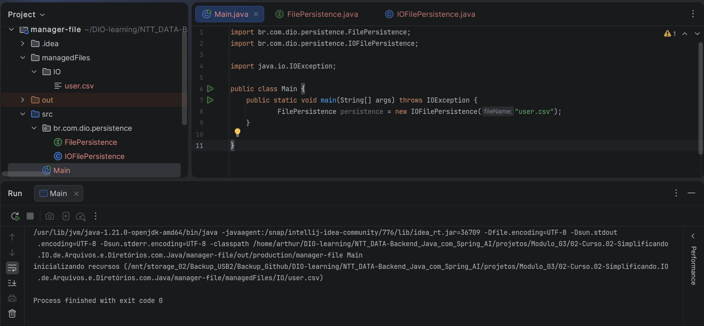
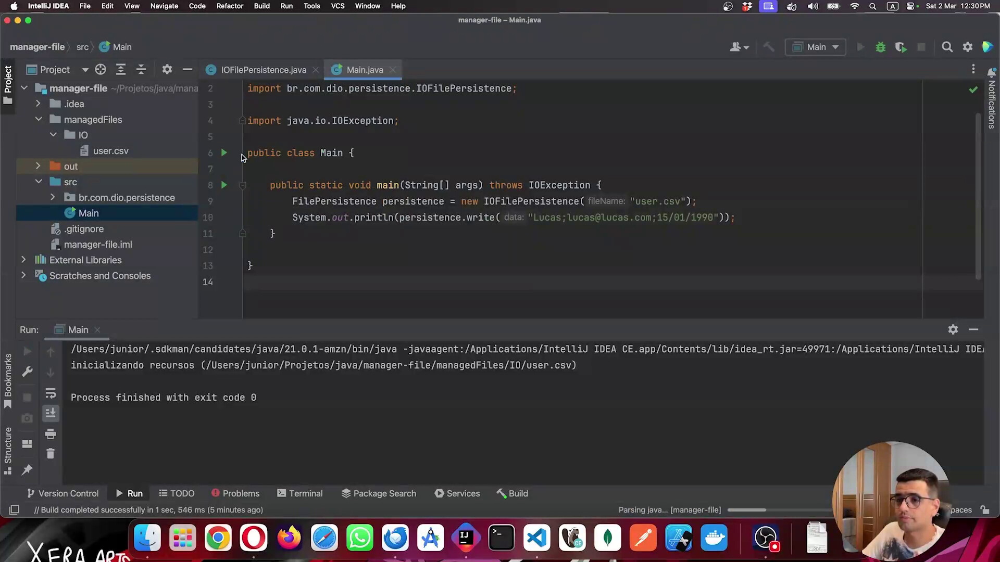
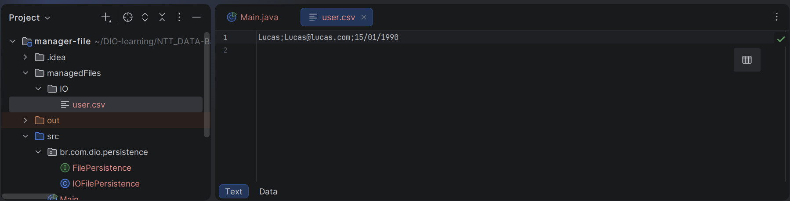
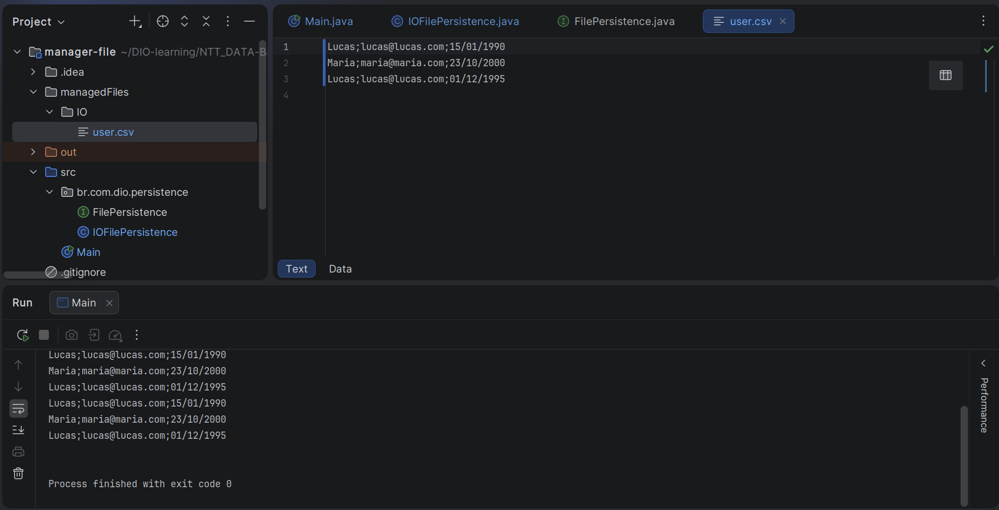
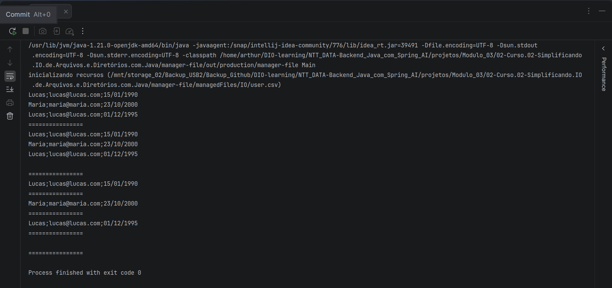
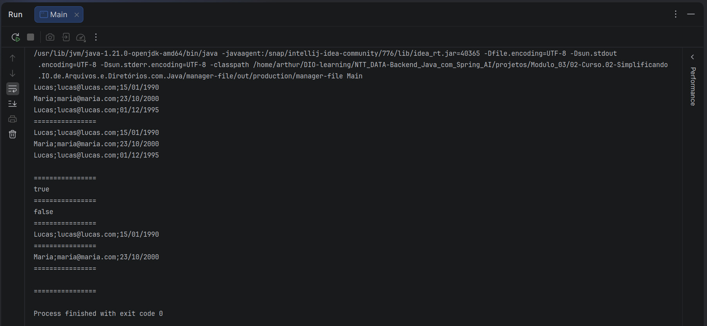
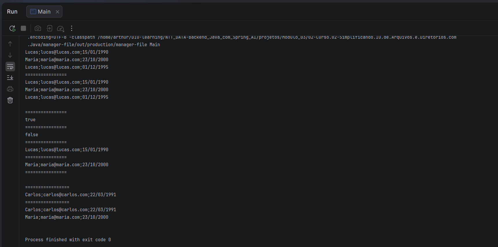

## Instrutor

- José Luiz Abreu Cardoso Junior (Engenheiro de software sênior)
- Contato Linkedin: / [juniorjrjl](https://www.linkedin.com/in/juniorjrjl/)

## Parte 1 - Trabalhando com java.io

### 🟩 Vídeo 01 - Começando com java.io

<video width="60%" controls>
  <source src="000-Midia_e_Anexos/bootcamp_ntt_data_java_spring_ai-modulo.03-curso.02-video_01.webm" type="video/webm">
    Seu navegador não suporta vídeo HTML5.
</video>

link do vídeo: https://web.dio.me/track/ntt-data-2026-ai-java-back-end/course/simplificando-io-de-arquivos-e-diretorios-com-java/learning/566a8795-7456-4b30-9142-8d71ec4c1fad?autoplay=1

### Anotações

Abaixo a definição da interface `FilePersistence`, criada no pacote `br.com.dio.persistence`. Ela estabelece o contrato que qualquer implementação de persistência de arquivos deverá seguir, com cinco operações: `write` (escreve um dado no arquivo), `remove` (remove um conteúdo a partir de uma sentença, retornando um booleano), `replace` (substitui um conteúdo antigo por um novo), `findAll` (retorna todo o conteúdo do arquivo) e `findBy` (busca um conteúdo específico a partir de uma sentença). A ideia é que diferentes formas de manipular arquivos no Java possam implementar essa mesma interface, mantendo um padrão único de uso.

```java
package br.com.dio.persistence;

public interface FilePersistence {

    String write(final String data);

    boolean remove(final String sentence);

    String replace(final String oldContent, final String newContent);

    String findAll();

    String findBy(final String sentence);

}
```

O próximo código implementa a classe `IOFilePersistence`, que implementa a interface `FilePersistence` utilizando as classes de I/O tradicionais do Java (`File`, `FileOutputStream`, `IOException`, `OutputStream`). No construtor, a classe recebe o nome do arquivo, monta o caminho a partir do diretório atual do projeto (`System.getProperty("user.dir")`) combinado com o diretório de armazenamento `/managedFiles/IO/`, e verifica se esse diretório já existe. Caso não exista e não seja possível criá-lo, uma exceção é lançada e convertida em `RuntimeException`. Ao final do construtor, o método `clearFile()` é chamado para garantir que o arquivo comece "limpo". Os métodos da interface (`write`, `remove`, `replace`, `findAll`, `findBy`) ainda estão como esqueleto, retornando valores vazios ou `false`, pois serão implementados nas etapas seguintes. O método privado `clearFile()` é responsável por abrir um `FileOutputStream` no caminho do arquivo, o que tem o efeito de truncar (limpar) seu conteúdo, exibindo uma mensagem informando que os recursos estão sendo inicializados. Já o método `createFile()` aparece apenas como um esqueleto vazio, ainda sem uso definido nesse momento.

```java
package br.com.dio.persistence;

import java.io.File;
import java.io.FileOutputStream;
import java.io.IOException;
import java.io.OutputStream;

public class IOFilePersistence implements FilePersistence {

    private final String currentDir = System.getProperty("user.dir");

    private final String storedDir = "/managedFiles/IO/";

    private final String fileName;

    public IOFilePersistence(String fileName) throws IOException {
        this.fileName = fileName;
        var file = new File(currentDir + storedDir);
        if (!file.exists() && !file.mkdirs()) try {
            throw new IOException("Erro ao criar arquivo");
        } catch (IOException ex) {
            throw new RuntimeException(ex);
        }
        clearFile();
    }

    @Override
    public String write(String data) {
        return "";
    }

    @Override
    public boolean remove(String sentence) {
        return false;
    }

    @Override
    public String replace(String oldContent, String newContent) {
        return "";
    }

    @Override
    public String findAll() {
        return "";
    }

    @Override
    public String findBy(String sentence) {
        return "";
    }

    private void clearFile(){
        try(OutputStream outputStream = new FileOutputStream(currentDir + storedDir + fileName)) {
            System.out.printf("inicializando recursos (%s) \n", currentDir + storedDir + fileName);
        }catch (IOException ex){
            ex.printStackTrace();
        }
    }

    private void createFile(){
    }
}
```

<p align="center">
  
</p>

Nesta imagem é mostrado o primeiro teste da classe `IOFilePersistence`, feito a partir de uma classe `Main` criada no projeto. Nela, é instanciada a `FilePersistence` passando `"user.csv"` como nome do arquivo. O painel de execução, na parte inferior, confirma que o construtor funcionou corretamente: aparece a mensagem "inicializando recursos" seguida do caminho completo do arquivo dentro de `managedFiles/IO/user.csv`, e o processo termina com exit code 0. Isso comprova que o diretório foi criado (quando necessário) e que o arquivo foi limpo/inicializado com sucesso pela lógica implementada no construtor e no método `clearFile()`.


O código a seguir mostra a evolução da classe `IOFilePersistence`, já com o método `write` implementado. Para isso, o import passa a ser `java.io.*`, simplificando as importações. Dentro do `write`, é utilizado um bloco `try` com *try-with-resources*, declarando três recursos: um `FileWriter` (apontando para o caminho do arquivo, com o parâmetro `true` indicando que a escrita deve ser feita em modo *append*, ou seja, adicionando conteúdo ao final do arquivo sem sobrescrever o que já existe), um `BufferedWriter` (que envolve o `FileWriter` para otimizar a escrita) e um `PrintWriter` (que envolve o `BufferedWriter` e é, de fato, quem escreve a informação no arquivo através do método `println`). Esse encadeamento de classes é uma forma clássica do Java para compor camadas de escrita em arquivo, cada uma agregando uma funcionalidade: o `FileWriter` lida com o arquivo em si, o `BufferedWriter` otimiza a performance com buffer, e o `PrintWriter` oferece métodos convenientes como `println`. Ao final, o método captura uma possível `IOException` com `printStackTrace()` e retorna o próprio `data` recebido como parâmetro, indicando que o conteúdo foi processado.

```java
package br.com.dio.persistence;

import java.io.*;

public class IOFilePersistence implements FilePersistence {

    private final String currentDir = System.getProperty("user.dir");
    private final String storedDir = "/managedFiles/IO/";
    private final String fileName;

    public IOFilePersistence(String fileName) throws IOException {
        this.fileName = fileName;
        var file = new File(currentDir + storedDir);
        if (!file.exists() && !file.mkdirs()) try {
            throw new IOException("Erro ao criar arquivo");
        } catch (IOException ex) {
            throw new RuntimeException(ex);
        }
        clearFile();
    }

    @Override
    public String write(String data) {
        try(
            var fileWriter = new FileWriter(currentDir + storedDir + fileName, true);
            var bufferedWrite = new BufferedWriter(fileWriter);
            var printWriter = new PrintWriter(bufferedWrite)
        ) {
            printWriter.println(data);
        } catch (IOException ex) {
            ex.printStackTrace();
        }
        return data;
    }

    @Override
    public boolean remove(String sentence) {
        return false;
    }

    @Override
    public String replace(String oldContent, String newContent) {
        return "";
    }

    @Override
    public String findAll() {
        return "";
    }

    @Override
    public String findBy(String sentence) {
        return "";
    }

    private void clearFile(){
        try(OutputStream outputStream = new FileOutputStream(currentDir + storedDir + fileName)) {
            System.out.printf("inicializando recursos (%s) \n", currentDir + storedDir + fileName);
        }catch (IOException ex){
            ex.printStackTrace();
        }
    }

    private void createFile(){

    }
}
```

<p align="center">
  
</p>

Aqui é exibida a classe `Main` já chamando o método `write` recém-implementado. A instância de `FilePersistence` é criada apontando para o arquivo `"user.csv"` e, em seguida, é feita a chamada `persistence.write(data: "Lucas;lucas@lucas.com;15/01/1990")`, simulando a escrita de um registro em formato CSV (nome, e-mail e data de nascimento separados por ponto e vírgula). O resultado é impresso com `System.out.println`. No painel de execução, abaixo, aparece novamente a mensagem de inicialização dos recursos do arquivo `user.csv`, e o processo finaliza com exit code 0, confirmando que a escrita ocorreu sem erros.

```java
import br.com.dio.persistence.FilePersistence;
import br.com.dio.persistence.IOFilePersistence;

import java.io.IOException;

public class Main {
    public static void main(String[] args) throws IOException {
        FilePersistence persistence = new IOFilePersistence("user.csv");
        System.out.println(persistence.write("Lucas;Lucas@lucas.com;15/01/1990"));
    }
}
```

<p align="center">
  
</p>

Esta imagem mostra o conteúdo final do arquivo `user.csv`, aberto diretamente no editor. Nele aparece a linha `Lucas;Lucas@lucas.com;15/01/1990`, comprovando visualmente que o método `write` da classe `IOFilePersistence` gravou corretamente o registro no arquivo, no formato CSV esperado (campos separados por ponto e vírgula). Essa é a confirmação prática de que toda a cadeia de escrita — `FileWriter`, `BufferedWriter` e `PrintWriter` dentro do *try-with-resources* — funcionou como planejado.      


### 🟩 Vídeo 02 - Concluindo implementação de java.io

<video width="60%" controls>
  <source src="000-Midia_e_Anexos/bootcamp_ntt_data_java_spring_ai-modulo.03-curso.02-video_02.webm" type="video/webm">
    Seu navegador não suporta vídeo HTML5.
</video>

link do vídeo: https://web.dio.me/track/ntt-data-2026-ai-java-back-end/course/simplificando-io-de-arquivos-e-diretorios-com-java/learning/6395a541-e246-47df-b9d9-61af2dd6b22f?autoplay=1

### Anotações

Segue abaixo a implementação inicial da classe `IOFilePersistence`, que implementa a interface `FilePersistence`. Neste estágio da aula, apenas o método `write` e o método `findAll` estão funcionais; os métodos `remove`, `replace` e `findBy` retornam valores vazios ou `false`, sinalizando que ainda serão implementados. O método `write` utiliza `FileWriter`, `BufferedWriter` e `PrintWriter` para gravar dados em modo _append_ no arquivo. O método `findAll` lê o arquivo linha a linha com `BufferedReader` e `FileReader`, acumulando o conteúdo em um `StringBuilder`. O método privado `clearFile` zera o arquivo usando `FileOutputStream`.

```java
package br.com.dio.persistence;

import java.io.*;

public class IOFilePersistence implements FilePersistence {

    private final String currentDir = System.getProperty("user.dir");
    private final String storedDir = "/managedFiles/IO/";
    private final String fileName;

    public IOFilePersistence(String fileName) throws IOException {
        this.fileName = fileName;
        var file = new File(currentDir + storedDir);
        if (!file.exists() && !file.mkdirs()) try {
            throw new IOException("Erro ao criar arquivo");
        } catch (IOException ex) {
            throw new RuntimeException(ex);
        }
        clearFile();
    }

    @Override
    public String write(String data) {
        try(
            var fileWriter = new FileWriter(currentDir + storedDir + fileName, true);
            var bufferedWrite = new BufferedWriter(fileWriter);
            var printWriter = new PrintWriter(bufferedWrite)
        ) {
            printWriter.println(data);
        } catch (IOException ex) {
            ex.printStackTrace();
        }
        return data;
    }

    @Override
    public boolean remove(String sentence) {
        return false;
    }

    @Override
    public String replace(String oldContent, String newContent) {
        return "";
    }

    @Override
    public String findAll() {
        var content = new StringBuilder();
        try (var reader = new BufferedReader(new FileReader(currentDir + storedDir + fileName))) {
            String line;
            do
            {
                line = reader.readLine();
                if ((line != null)) content.append(line)
                        .append(System.lineSeparator());
            } while (line != null);
        } catch (IOException e) {
            e.printStackTrace();
        }
        return content.toString();
    }

    @Override
    public String findBy(String sentence) {
        return "";
    }

    private void clearFile(){
        try(OutputStream outputStream = new FileOutputStream(currentDir + storedDir + fileName)) {
            System.out.printf("inicializando recursos (%s) \n", currentDir + storedDir + fileName);
        }catch (IOException ex){
            ex.printStackTrace();
        }
    }

    private void createFile(){

    }
}
```

A seguir a classe `Main` em um primeiro teste de uso, onde são gravadas três entradas no arquivo `user.csv` via `persistence.write(...)` e, em seguida, é chamado `persistence.findAll()` para exibir todo o conteúdo gravado. Este é o ponto em que o professor valida que o método `write` e o método `findAll` funcionam corretamente juntos.

```java
import br.com.dio.persistence.FilePersistence;
import br.com.dio.persistence.IOFilePersistence;

import java.io.IOException;

public class Main {
    public static void main(String[] args) throws IOException {
        FilePersistence persistence = new IOFilePersistence("user.csv");
        System.out.println(persistence.write("Lucas;lucas@lucas.com;15/01/1990"));
        System.out.println(persistence.write("Maria;maria@maria.com;23/10/2000"));
        System.out.println(persistence.write("Lucas;lucas@lucas.com;01/12/1995"));
        System.out.println(persistence.findAll());
    }
}
```

---

<p align="center">
  
</p>

A imagem exibe o ambiente IntelliJ IDEA com o arquivo `user.csv` aberto, mostrando o resultado da execução do `Main`. O arquivo gerado na pasta `managedFiles/IO/` contém exatamente as três linhas gravadas pelo método `write`. No painel de execução, é possível ver que os dados foram impressos duas vezes: primeiro como retorno de cada chamada a `write`, e depois como resultado do `findAll`, confirmando que ambos os métodos funcionam corretamente.

No código a seguir vemos uma versão evoluída de `IOFilePersistence`, agora com o método `findBy` implementado. O método percorre o arquivo linha a linha com `BufferedReader` e `FileReader`, verificando via `line.contains(sentence)` se a linha contém o trecho buscado. Quando encontrado, armazena a linha em `found` e interrompe o laço com `break`. Caso nenhuma linha corresponda, retorna uma `String` vazia.

```java
package br.com.dio.persistence;

import java.io.*;

public class IOFilePersistence implements FilePersistence {

    private final String currentDir = System.getProperty("user.dir");
    private final String storedDir = "/managedFiles/IO/";
    private final String fileName;

    public IOFilePersistence(String fileName) throws IOException {
        this.fileName = fileName;
        var file = new File(currentDir + storedDir);
        if (!file.exists() && !file.mkdirs()) try {
            throw new IOException("Erro ao criar arquivo");
        } catch (IOException ex) {
            throw new RuntimeException(ex);
        }
        clearFile();
    }

    @Override
    public String write(String data) {
        try(
            var fileWriter = new FileWriter(currentDir + storedDir + fileName, true);
            var bufferedWrite = new BufferedWriter(fileWriter);
            var printWriter = new PrintWriter(bufferedWrite)
        ) {
            printWriter.println(data);
        } catch (IOException ex) {
            ex.printStackTrace();
        }
        return data;
    }

    @Override
    public boolean remove(String sentence) {
        return false;
    }

    @Override
    public String replace(String oldContent, String newContent) {
        return "";
    }

    @Override
    public String findAll() {
        var content = new StringBuilder();
        try (var reader = new BufferedReader(new FileReader(currentDir + storedDir + fileName))) {
            String line;
            do
            {
                line = reader.readLine();
                if ((line != null)) content.append(line)
                        .append(System.lineSeparator());
            } while (line != null);
        } catch (IOException ex) {
            ex.printStackTrace();
        }
        return content.toString();
    }

    @Override
    public String findBy(String sentence) {
        String found = "";
        try (var reader = new BufferedReader(new FileReader(currentDir + storedDir + fileName))) {
            String line;
            while ((line = reader.readLine()) != null) {
                if (line.contains(sentence)) {
                    found = line;
                    break;
                }
            }
        } catch (IOException ex) {
            ex.printStackTrace();
        }
        return found;
    }

    private void clearFile(){
        try(OutputStream outputStream = new FileOutputStream(currentDir + storedDir + fileName)) {
            System.out.printf("inicializando recursos (%s) \n", currentDir + storedDir + fileName);
        }catch (IOException ex){
            ex.printStackTrace();
        }
    }

    private void createFile(){

    }
}
```

Abaixo temos a classe `Main` atualizada para testar o método `findBy` com diferentes sentenças de busca: pelo nome (`"Lucas;"`), pelo e-mail (`"Maria;"`), por parte de uma data (`"95"`) e por um valor inexistente (`"22;"`). Os separadores com `"================"` facilitam a leitura do resultado no console.

```java
import br.com.dio.persistence.FilePersistence;
import br.com.dio.persistence.IOFilePersistence;

import java.io.IOException;

public class Main {
    public static void main(String[] args) throws IOException {
        FilePersistence persistence = new IOFilePersistence("user.csv");
        System.out.println(persistence.write("Lucas;lucas@lucas.com;15/01/1990"));
        System.out.println(persistence.write("Maria;maria@maria.com;23/10/2000"));
        System.out.println(persistence.write("Lucas;lucas@lucas.com;01/12/1995"));
        System.out.println("================");
        System.out.println(persistence.findAll());
        System.out.println("================");
        System.out.println(persistence.findBy("Lucas;"));
        System.out.println("================");
        System.out.println(persistence.findBy("Maria;"));
        System.out.println("================");
        System.out.println(persistence.findBy("95"));
        System.out.println("================");
        System.out.println(persistence.findBy("22;"));
        System.out.println("================");
    }
}
```

---

<p align="center">
  
</p>

A imagem exibe o resultado da execução no console do IntelliJ, após os testes com `findBy`. É possível verificar que: a busca por `"Lucas;"` retornou a primeira ocorrência do nome Lucas; a busca por `"Maria;"` retornou a linha de Maria; a busca por `"95"` retornou a linha de Lucas com data `01/12/1995`; e a busca por `"22;"` retornou vazio, pois nenhuma linha continha essa sequência. O comportamento confirma que o método `findBy` opera por correspondência parcial de conteúdo.

O código a seguir apresenta a implementação do método `remove` na classe `IOFilePersistence`. A lógica consiste em: carregar todo o conteúdo do arquivo com `findAll()`; converter em uma `ArrayList` mutável usando `Stream.of(...).toList()` com quebra por `System.lineSeparator()`; verificar se alguma linha contém a sentença buscada — se não houver correspondência, retorna `false` imediatamente; caso contrário, chama `clearFile()` para limpar o arquivo e, em seguida, reescreve apenas as linhas que **não** contêm a sentença, usando `filter` + `forEach(this::write)`.

```java
package br.com.dio.persistence;

import java.io.*;
import java.util.ArrayList;
import java.util.stream.Stream;

public class IOFilePersistence implements FilePersistence {

    private final String currentDir = System.getProperty("user.dir");
    private final String storedDir = "/managedFiles/IO/";
    private final String fileName;

    // ... (construtor e outros métodos omitidos para brevidade)

    @Override
    public boolean remove(final String sentence) {
        var content = findAll();
        var contentList = new ArrayList<>(Stream.of(content.split(System.lineSeparator())).toList());
        if (contentList.stream().noneMatch(c -> c.contains(sentence))) return false;
        clearFile();
        contentList.stream()
                .filter(c -> !c.contains(sentence))
                .forEach(this::write);
        return true;
    }

    @Override
    public String replace(String oldContent, String newContent) {
        return "";
    }

    // ... (demais métodos)
}
```

A seguir, a classe `Main` atualizada para testar o método `remove`. Após gravar e listar os três registros, são realizadas duas tentativas de remoção: a primeira com `"/12/19"` (que corresponde à linha de João com data `01/12/1995`) deve retornar `true`; a segunda com `"/06/2021"` (inexistente no arquivo) deve retornar `false`. Em seguida, novas buscas por `findBy` verificam que João não é mais encontrado.

```java
import br.com.dio.persistence.FilePersistence;
import br.com.dio.persistence.IOFilePersistence;

import java.io.IOException;

public class Main {
    public static void main(String[] args) throws IOException {
        FilePersistence persistence = new IOFilePersistence("user.csv");
        System.out.println(persistence.write("Lucas;lucas@lucas.com;15/01/1990"));
        System.out.println(persistence.write("Maria;maria@maria.com;23/10/2000"));
        System.out.println(persistence.write("Lucas;lucas@lucas.com;01/12/1995"));
        System.out.println("================");
        System.out.println(persistence.findAll());
        System.out.println("================");
        System.out.println(persistence.remove("/12/19"));
        System.out.println("================");
        System.out.println(persistence.remove("/06/2021"));
        System.out.println("================");
        System.out.println(persistence.findBy("Lucas;"));
        System.out.println("================");
        System.out.println(persistence.findBy("Maria;"));
        System.out.println("================");
        System.out.println(persistence.findBy("95"));
        System.out.println("================");
    }
}
```

<p align="center">
  
</p>

A imagem exibe a saída do console após a execução com os testes de `remove`. O resultado confirma o comportamento esperado: o primeiro `remove("/12/19")` retornou `true` e removeu a linha de João; o segundo `remove("/06/2021")` retornou `false` pois nenhuma linha continha esse padrão. As buscas posteriores mostram que Lucas e Maria ainda estão presentes, mas a busca por `"95"` (referente à data de João) não retornou nenhum resultado, evidenciando que a remoção foi bem-sucedida.

Abaixo a versão completa da classe `IOFilePersistence`, agora com o método `replace` implementado e o método auxiliar privado `toListString()` extraído via refatoração. O método `replace` segue lógica semelhante ao `remove`: carrega o conteúdo como lista, verifica se o `oldContent` existe, limpa o arquivo e reescreve as linhas — substituindo, via `map`, as linhas que contêm `oldContent` pelo `newContent`. O método `toListString()` encapsula a conversão do conteúdo do arquivo em uma `List<String>` mutável, evitando duplicação de código.

```java
package br.com.dio.persistence;

import java.io.*;
import java.util.ArrayList;
import java.util.List;
import java.util.stream.Stream;

public class IOFilePersistence implements FilePersistence {

    private final String currentDir = System.getProperty("user.dir");
    private final String storedDir = "/managedFiles/IO/";
    private final String fileName;

    // ... (construtor omitido para brevidade)

    @Override
    public boolean remove(final String sentence) {
        var contentList = toListString();
        if (contentList.stream().noneMatch(c -> c.contains(sentence))) return false;
        clearFile();
        contentList.stream()
                .filter(c -> !c.contains(sentence))
                .forEach(this::write);
        return true;
    }

    @Override
    public String replace(final String oldContent, final String newContent) {
        var contentList = toListString();

        if (contentList.stream().noneMatch(c -> c.contains(oldContent))) return "";

        clearFile();
        contentList.stream()
                .map(c -> c.contains(oldContent) ? newContent : c)
                .forEach(this::write);
        return newContent;
    }

    @Override
    public String findAll() {
        var content = new StringBuilder();
        try (var reader = new BufferedReader(new FileReader(currentDir + storedDir + fileName))) {
            String line;
            do
            {
                line = reader.readLine();
                if ((line != null)) content.append(line)
                        .append(System.lineSeparator());
            } while (line != null);
        } catch (IOException ex) {
            ex.printStackTrace();
        }
        return content.toString();
    }

    @Override
    public String findBy(String sentence) {
        String found = "";
        try (var reader = new BufferedReader(new FileReader(currentDir + storedDir + fileName))) {
            String line;
            while ((line = reader.readLine()) != null) {
                if (line.contains(sentence)) {
                    found = line;
                    break;
                }
            }
        } catch (IOException ex) {
            ex.printStackTrace();
        }
        return found;
    }

    private List<String> toListString() {
        var content = findAll();
        return new ArrayList<>(Stream.of(content.split(System.lineSeparator())).toList());
    }

    private void clearFile(){
        try(OutputStream outputStream = new FileOutputStream(currentDir + storedDir + fileName)) {
        }catch (IOException ex){
            ex.printStackTrace();
        }
    }

    private void createFile(){

    }
}
```

Por fim, a classe `Main` com o teste completo de `replace`. Após remover João e listar os dados, é chamado `persistence.replace(".com;15/01/", "Carlos;carlos@carlos.com;22/03/1991")`, substituindo a linha de Lucas pela de Carlos. Em seguida, `findAll()` é chamado para exibir o estado final do arquivo e confirmar a substituição.

```java
import br.com.dio.persistence.FilePersistence;
import br.com.dio.persistence.IOFilePersistence;

import java.io.IOException;

public class Main {
    public static void main(String[] args) throws IOException {
        FilePersistence persistence = new IOFilePersistence("user.csv");
        System.out.println(persistence.write("Lucas;lucas@lucas.com;15/01/1990"));
        System.out.println(persistence.write("Maria;maria@maria.com;23/10/2000"));
        System.out.println(persistence.write("Lucas;lucas@lucas.com;01/12/1995"));
        System.out.println("================");
        System.out.println(persistence.findAll());
        System.out.println("================");
        System.out.println(persistence.remove("/12/19"));
        System.out.println("================");
        System.out.println(persistence.remove("/06/2021"));
        System.out.println("================");
        System.out.println(persistence.findBy("Lucas;"));
        System.out.println("================");
        System.out.println(persistence.findBy("Maria;"));
        System.out.println("================");
        System.out.println(persistence.findBy( "95;" ));
        System.out.println("================");
        System.out.println(persistence.replace(".com;15/01/", "Carlos;carlos@carlos.com;22/03/1991" ));
        System.out.println("================");
        System.out.println(persistence.findAll());
    }
}
```

---

<p align="center">
  
</p>

A imagem exibe a saída final do console, confirmando o funcionamento completo de todos os métodos da `IOFilePersistence`. O fluxo de execução mostra: gravação dos três registros, listagem completa, remoção bem-sucedida de João (`true`), tentativa de remoção inexistente (`false`), buscas por Lucas e Maria, o retorno do `replace` com o novo conteúdo (`Carlos;carlos@carlos.com;22/03/1991`), e o `findAll` final exibindo apenas Carlos e Maria no arquivo. Com isso, a implementação completa da API de IO do Java para gerenciamento de arquivos CSV está validada e funcional.


## Parte 2 - Trabalhando com java.nio

### 🟩 Vídeo 03 - Usando java.nio

<video width="60%" controls>
  <source src="000-Midia_e_Anexos/bootcamp_ntt_data_java_spring_ai-modulo.03-curso.02-video_03.webm" type="video/webm">
    Seu navegador não suporta vídeo HTML5.
</video>

link do vídeo: https://web.dio.me/track/ntt-data-2026-ai-java-back-end/course/simplificando-io-de-arquivos-e-diretorios-com-java/learning/af09c850-e686-4488-b820-d36b71b50adb?autoplay=1

### 🟩 Vídeo 04 - Concluindo implementação do java.nio

<video width="60%" controls>
  <source src="000-Midia_e_Anexos/bootcamp_ntt_data_java_spring_ai-modulo.03-curso.02-video_04.webm" type="video/webm">
    Seu navegador não suporta vídeo HTML5.
</video>

link do vídeo: https://web.dio.me/track/ntt-data-2026-ai-java-back-end/course/simplificando-io-de-arquivos-e-diretorios-com-java/learning/7230497d-7e54-4de6-9a67-89ccb0280150?autoplay=1

### 🟩 Vídeo 05 - Usando java.nio2

<video width="60%" controls>
  <source src="000-Midia_e_Anexos/bootcamp_ntt_data_java_spring_ai-modulo.03-curso.02-video_05.webm" type="video/webm">
    Seu navegador não suporta vídeo HTML5.
</video>

link do vídeo: https://web.dio.me/track/ntt-data-2026-ai-java-back-end/course/simplificando-io-de-arquivos-e-diretorios-com-java/learning/19f6a205-2026-4620-8fa0-980b9db73dcb?autoplay=1

##  Materiais de Apoio

# Certificado: Simplificando IO de Arquivos e Diretórios com Java

- Link na plataforma: 
- Certificado em pdf: