## Instrutor

- José Luiz Abreu Cardoso Junior (Engenheiro de software sênior)
- Contato Linkedin: / [juniorjrjl](https://www.linkedin.com/in/juniorjrjl/)

## Parte 1 - Instalação e Configuração do Maven 
#maven

### 🟩 Vídeo 01 - Instalando Maven

<video width="60%" controls>
  <source src="000-Midia_e_Anexos/bootcamp_ntt_data_java_spring_ai-modulo.03-curso.03-video_01.webm" type="video/webm">
    Seu navegador não suporta vídeo HTML5.
</video>

link do vídeo: https://web.dio.me/track/ntt-data-2026-ai-java-back-end/course/gerenciando-dependencias-com-maven-e-gradle/learning/d9d9f3b4-84fa-4114-8436-28067fffae34?autoplay=1

### Anotações

<p align="center">
  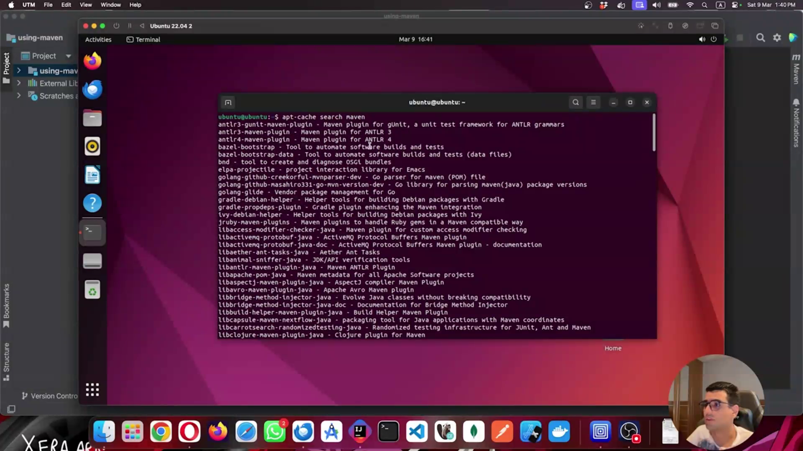
</p>

A aula trata da instalação e uso do Maven no Ubuntu/Linux. O instrutor explica que o Maven é uma ferramenta para gerenciar dependências e automatizar builds em projetos Java, mostrando como instalar via apt (forma convencional e simples) e também mencionando a alternativa manual de baixar diretamente do site oficial do Apache Maven, configurar variáveis de ambiente e usar versões mais atualizadas. O foco é demonstrar como preparar o ambiente para que o Maven esteja disponível no sistema e pronto para ser utilizado em projetos Java.

#### Preparando Ambiente Java + Maven no Kubuntu

#### 1. Verificar instalação do Java
Execute os comandos:
```bash
java -version
javac -version
```
Saída esperada (exemplo):
```
openjdk version "21.0.11"
javac 21.0.11
```

#### 2. Instalar o Maven
Atualize os pacotes e instale:
```bash
sudo apt update
sudo apt install maven
```

#### 3. Confirmar instalação do Maven
Verifique a versão:
```bash
mvn -version
```
Saída esperada (exemplo):
```
Apache Maven 3.9.12
Java version: 21.0.11
```

#### 4. Estrutura do Projeto
O projeto deve conter um arquivo `pom.xml` na raiz, que define:
- Dependências
- Plugins
- Configurações de build

#### 5. Compilar o Projeto
Dentro da pasta do projeto:
```bash
mvn compile
```

#### 6. Executar Testes
```bash
mvn test
```

#### 7. Gerar Arquivo JAR
```bash
mvn package
```
O `.jar` será criado em `target/`.

#### 8. Executar o Programa
```bash
java -jar target/meu-projeto-1.0-SNAPSHOT.jar
```

#### 9. Executar Diretamente sem JAR
```bash
mvn exec:java -Dexec.mainClass="com.seuprojeto.Main"
```

#### 10. Observações
- O IntelliJ IDEA reconhece automaticamente o `pom.xml` e baixa dependências.  
- O terminal usa o mesmo `pom.xml`, garantindo consistência entre IDE e linha de comando.  
- Maven facilita o gerenciamento de **dependências** e a **automatização de builds**.

### 🟩 Vídeo 02 - Instalando Maven com sdkman e criando projetos

<video width="60%" controls>
  <source src="000-Midia_e_Anexos/bootcamp_ntt_data_java_spring_ai-modulo.03-curso.03-video_02.webm" type="video/webm">
    Seu navegador não suporta vídeo HTML5.
</video>

link do vídeo: https://web.dio.me/track/ntt-data-2026-ai-java-back-end/course/gerenciando-dependencias-com-maven-e-gradle/learning/425b429c-c4bf-4bef-937d-4a523c4013ee?autoplay=1

### Anotações

#### Verificando a instalação do Maven via terminal

<p align="center">
  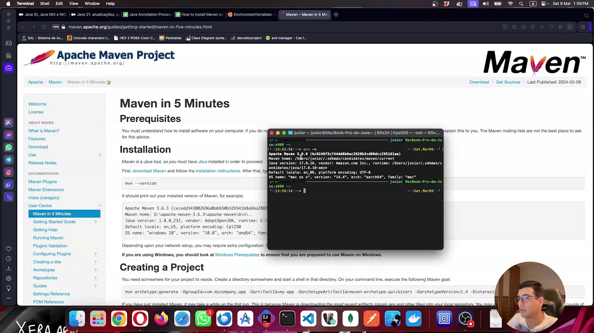
</p>

A imagem mostra o terminal com a checagem da instalação do Maven usando o comando `mvn -v`, ao lado da página oficial do Apache Maven ("Maven in 5 Minutes") aberta no navegador. A saída do comando confirma a versão do Maven instalada, o diretório `Maven home`, a versão do Java utilizada pelo runtime e informações do sistema operacional.

```bash
mvn -v
```
```
Apache Maven 3.9.6 (bc0240f3c744dd6b6ec2920b3cd08dcc295161ae)
Maven home: /Users/junior/.sdkman/candidates/maven/current
Java version: 17.0.10, vendor: Amazon.com Inc., runtime: /Users/junior/.sdkman/candidates/java/17.0.10-amzn
Default locale: en_BR, platform encoding: UTF-8
OS name: "mac os x", version: "14.4", arch: "aarch64", family: "mac"
```

#### Criando o projeto Maven no IntelliJ

<p align="center">
  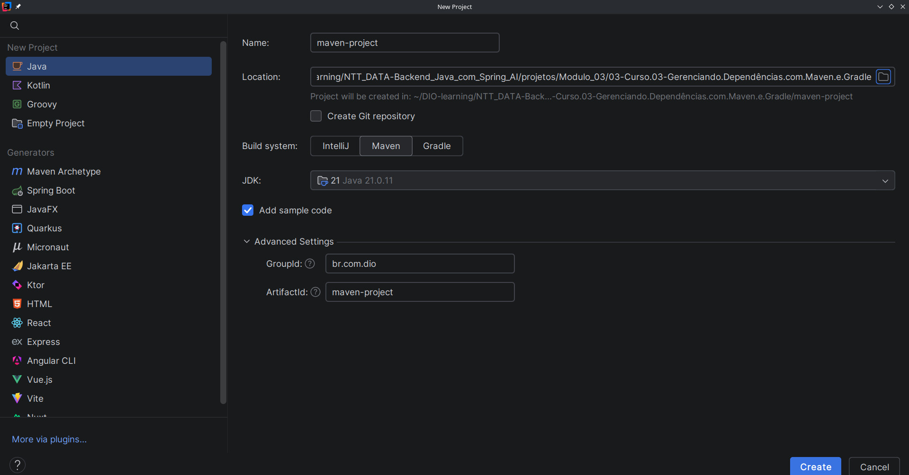
</p>

Nesta etapa, a criação do projeto é feita diretamente pela interface do IntelliJ, usando a tela de **New Project**. É selecionado o *Build system* **Maven**, a **JDK 21**, e preenchidos os campos de **GroupId** (`br.com.dio`) e **ArtifactId** (`maven-project`), definindo assim as coordenadas básicas que identificam o projeto dentro do ecossistema Maven.

#### Declarando as dependências do MapStruct e do Lombok no pom.xml

O `pom.xml` já reflete a organização das versões das bibliotecas em `<properties>`, evitando repetição de números de versão ao longo do arquivo, e referenciando-as nas dependências através da sintaxe `${...}`. São declaradas as dependências do **MapStruct** (`mapstruct` e `mapstruct-processor`) e do **Lombok** (`lombok` e `lombok-mapstruct-binding`), sendo esta última responsável por integrar corretamente o Lombok ao processo de geração de código do MapStruct.

```xml
<properties>
    <maven.compiler.source>21</maven.compiler.source>
    <maven.compiler.target>21</maven.compiler.target>
    <project.build.sourceEncoding>UTF-8</project.build.sourceEncoding>
    <org.mapstruct.version>1.5.5.Final</org.mapstruct.version>
    <org.projectlombok.version>1.18.30</org.projectlombok.version>
    <lombok-mapstruct-binding.version>0.2.0</lombok-mapstruct-binding.version>
</properties>

<dependencies>
    <dependency>
        <groupId>org.mapstruct</groupId>
        <artifactId>mapstruct</artifactId>
        <version>${org.mapstruct.version}</version>
    </dependency>
    <dependency>
        <groupId>org.mapstruct</groupId>
        <artifactId>mapstruct-processor</artifactId>
        <version>${org.mapstruct.version}</version>
    </dependency>
    <dependency>
        <groupId>org.projectlombok</groupId>
        <artifactId>lombok-mapstruct-binding</artifactId>
        <version>${lombok-mapstruct-binding.version}</version>
    </dependency>
    <dependency>
        <groupId>org.projectlombok</groupId>
        <artifactId>lombok</artifactId>
        <version>${org.projectlombok.version}</version>
    </dependency>
    <dependency>
        <groupId>org.projectlombok</groupId>
        <artifactId>lombok-mapstruct-binding</artifactId>
        <version>${lombok-mapstruct-binding.version}</version>
    </dependency>
</dependencies>
```
#### Dependências baixadas e disponíveis no projeto

<p align="center">
  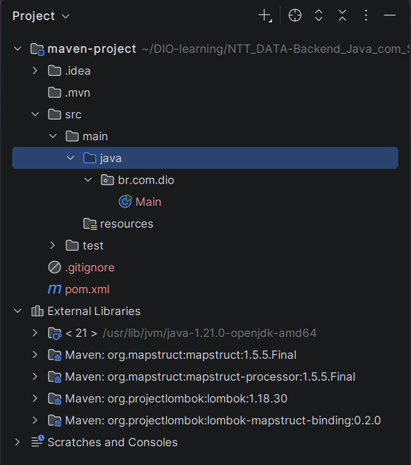
</p>

Após o *refresh* do Maven, o painel de **External Libraries** do IntelliJ passa a exibir as bibliotecas efetivamente baixadas: `mapstruct`, `mapstruct-processor`, `lombok` e `lombok-mapstruct-binding`, além da JDK do projeto. Isso confirma que o Maven resolveu corretamente as dependências declaradas no `pom.xml` e as disponibilizou como bibliotecas Java prontas para uso no código.

#### Página oficial do Project Lombok

<p align="center">
  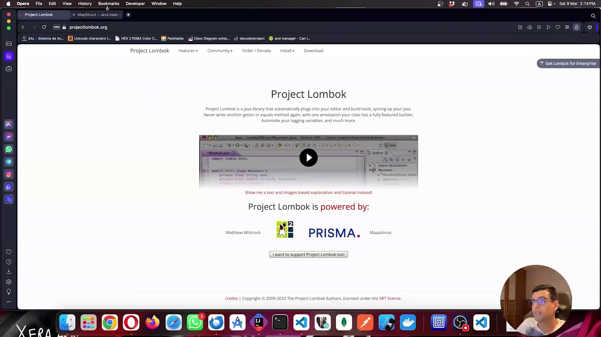
</p>


A imagem mostra a página inicial do **Project Lombok** (`projectlombok.org`), biblioteca Java que se integra ao editor e às ferramentas de build para reduzir a verbosidade do código, gerando automaticamente métodos como getters, setters, construtores, `equals`, `hashCode` e `toString` a partir de anotações.

#### Página oficial do MapStruct

<p align="center">
  
</p>

Aqui é exibida a página inicial do **MapStruct** (`mapstruct.org`), um gerador de código que simplifica o mapeamento entre diferentes tipos de objetos Java (por exemplo, entidades e DTOs). Por atuar como um *annotation processor* em tempo de compilação, o MapStruct produz mapeamentos type-safe e de alta performance, sem depender de reflection em tempo de execução.

#### Documentação de instalação do MapStruct via Maven

<p align="center">
  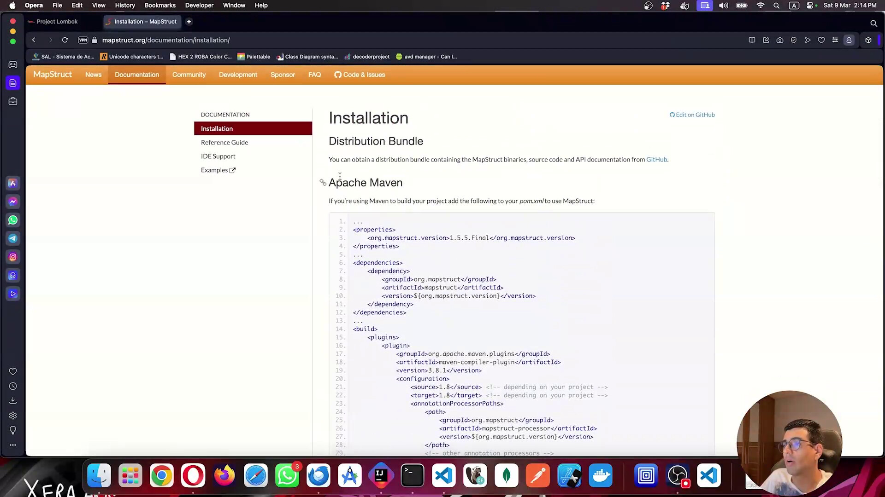
</p>

A documentação oficial do MapStruct apresenta o trecho de configuração necessário no `pom.xml` para o uso da biblioteca via Maven: a declaração da versão em `<properties>`, a dependência principal `mapstruct` e a configuração do plugin de compilação do Maven, incluindo o `mapstruct-processor` como *annotation processor path*.

#### Configuração final do plugin de compilação no pom.xml

O `pom.xml` completo mostra a seção `<build><plugins>`, onde o **maven-compiler-plugin** é configurado apontando para a versão do Java definida em `${java.version}` e declarando, em `<annotationProcessorPaths>`, os processadores de anotação necessários: `mapstruct-processor` e `lombok`. Essa configuração é essencial para que o Lombok e o MapStruct, que dependem fortemente de anotações, funcionem corretamente durante a compilação do projeto.

```xml
<build>
    <plugins>
        <plugin>
            <groupId>org.apache.maven.plugins</groupId>
            <artifactId>maven-compiler-plugin</artifactId>
            <version>3.12.1</version>
            <configuration>
                <source>${java.version}</source>
                <target>${java.version}</target>
                <annotationProcessorPaths>
                    <path>
                        <groupId>org.mapstruct</groupId>
                        <artifactId>mapstruct-processor</artifactId>
                        <version>${org.mapstruct.version}</version>
                    </path>
                    <path>
                        <groupId>org.projectlombok</groupId>
                        <artifactId>lombok</artifactId>
                        <version>${org.projectlombok.version}</version>
                    </path>
                    <path>
                        <groupId>org.mapstruct</groupId>
                        <artifactId>mapstruct-processor</artifactId>
                        <version>${org.mapstruct.version}</version>
                    </path>
                </annotationProcessorPaths>
            </configuration>
        </plugin>
    </plugins>
</build>
```

#### Instalando o plugin do Lombok no IntelliJ

<p align="center">
  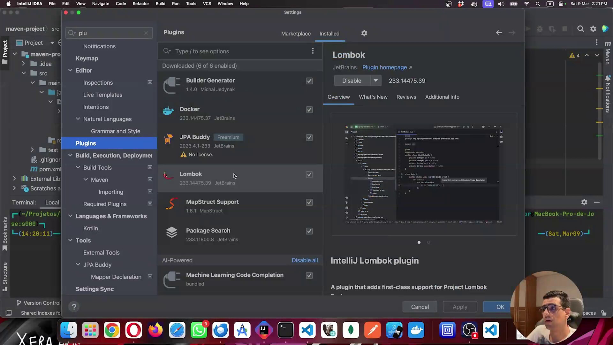
</p>

Na tela de **Settings > Plugins** do IntelliJ, o plugin **Lombok** aparece instalado e habilitado. Esse plugin é necessário para que a IDE reconheça corretamente o código gerado automaticamente pelo Lombok (como getters e setters), permitindo autocompletar e navegação normalmente, mesmo que esses métodos não existam explicitamente no código-fonte.

#### Instalando o plugin do MapStruct no IntelliJ

<p align="center">
  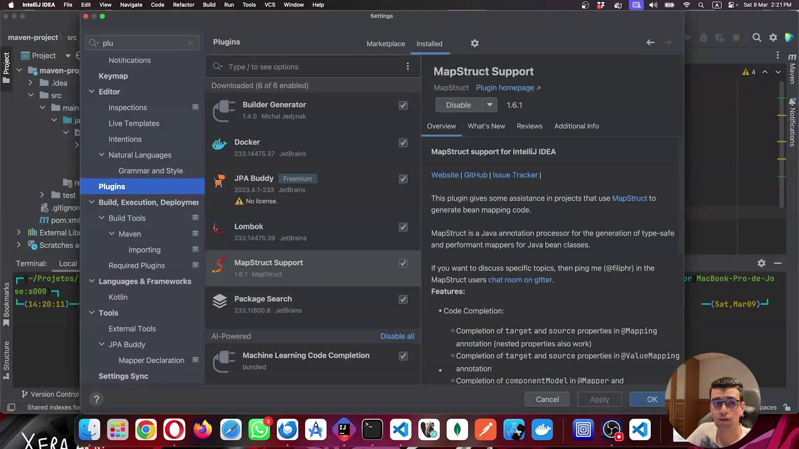
</p>

Ainda na tela de **Settings > Plugins**, é exibido o plugin **MapStruct Support**, também instalado e habilitado. Ele fornece suporte adicional da IDE para projetos que utilizam o MapStruct, como autocompletar de propriedades de origem e destino nas anotações `@Mapping` e `@ValueMapping`.

#### Criando a classe UserDTO com a anotação @Data

<p align="center">
  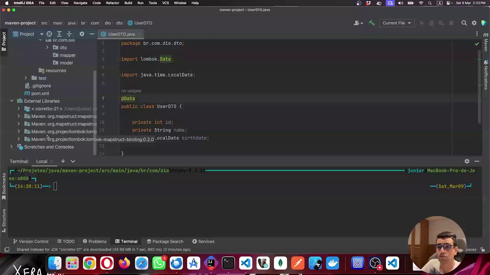
</p>

A classe `UserDTO` é criada com os atributos `id`, `name` e `birthdate`, e recebe a anotação `@Data` do Lombok. Essa anotação é responsável por gerar automaticamente, em tempo de compilação, os métodos de acesso e outros métodos utilitários da classe.

```java
package br.com.dio.dto;

import lombok.Data;
import java.time.LocalDate;

@Data
public class UserDTO {

    private int id;
    private String name;
    private LocalDate birthdate;

}
```

#### Testando o autocomplete dos métodos gerados pelo Lombok

<p align="center">
  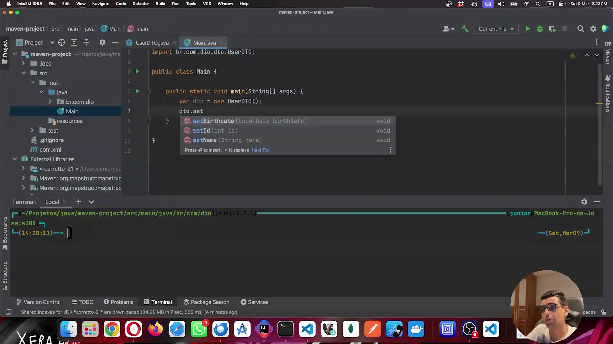
</p>

Ao instanciar um `UserDTO` na classe `Main` e digitar `dto.set`, o autocomplete do IntelliJ já exibe os métodos `setId`, `setName` e `setBirthdate`, mesmo sem esses métodos terem sido escritos manualmente no código. Isso evidencia, na prática, o efeito da anotação `@Data`: os setters (assim como os getters) são gerados automaticamente pelo Lombok durante a compilação.

```java
var dto = new UserDTO();
dto.set...
```

#### Compilando o projeto e gerando a pasta target

<p align="center">
  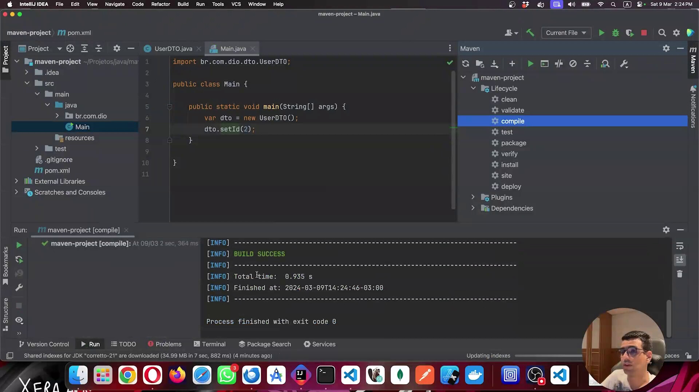
</p>

Após chamar `dto.setId(2);` na classe `Main`, o projeto é compilado através da tarefa **compile** do Maven, exibida no painel lateral. O resultado no console mostra `BUILD SUCCESS`, confirmando que a compilação foi concluída sem erros e que a pasta `target`, com os arquivos `.class` gerados, foi criada.

```java
public class Main {
    public static void main(String[] args) {
        var dto = new UserDTO();
        dto.setId(2);
    }
}
```

#### Inspecionando o bytecode decompilado de UserDTO (construtor e getters)

<p align="center">
  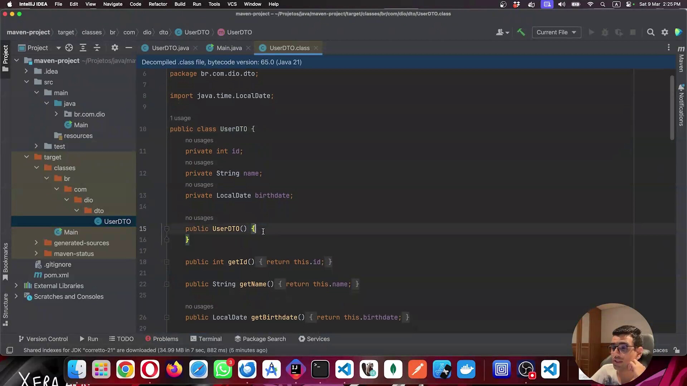
</p>

Abrindo o arquivo `UserDTO.class` gerado dentro de `target/classes`, o IntelliJ decompila o bytecode e mostra o código Java equivalente ao que o Lombok gerou. É possível ver o construtor sem argumentos (`public UserDTO() {}`) e os métodos `getId()` e `getName()`, criados automaticamente a partir da anotação `@Data`, sem que o desenvolvedor tenha escrito essas linhas manualmente.

#### Setters gerados e início do método equals()

<p align="center">
  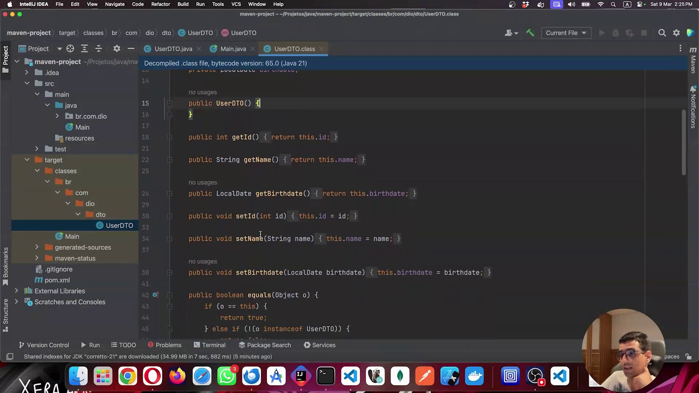
</p>

Rolando o arquivo decompilado, aparecem também os métodos `getBirthdate()`, `setId()`, `setName()` e `setBirthdate()`, além do início da implementação do método `equals(Object o)`, que compara os atributos da classe para determinar a igualdade entre duas instâncias de `UserDTO`. Todos esses métodos foram gerados automaticamente pelo Lombok.

#### Continuação do método equals() gerado pelo Lombok

<p align="center">
  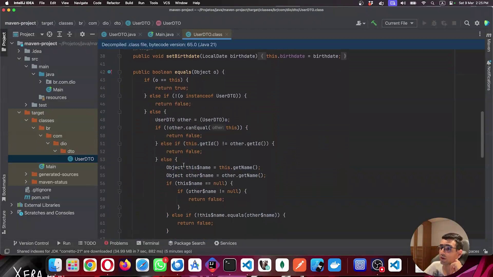
</p>

O restante do método `equals()` decompilado mostra a lógica interna gerada pelo Lombok: primeiro é verificado se o objeto comparado é do mesmo tipo, depois se os valores de `id` são iguais, e em seguida os valores de `name` são comparados de forma segura contra `null`. Esse tipo de implementação, embora simples, é repetitivo de escrever manualmente — exatamente o tipo de verbosidade que o Lombok elimina.

#### canEqual(), hashCode() e toString() gerados pelo Lombok

<p align="center">
  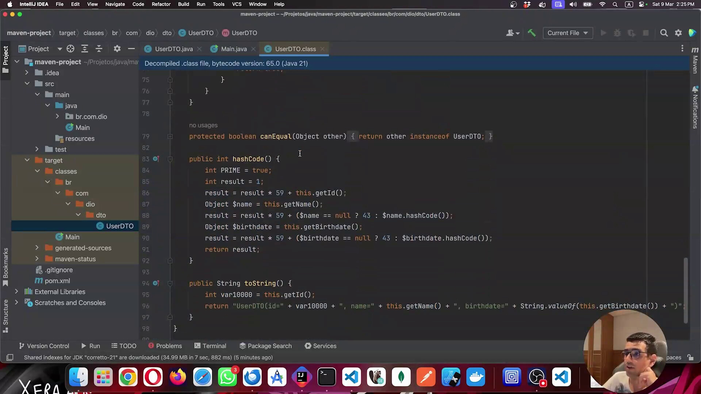
</p>

Por fim, o arquivo decompilado revela os métodos `canEqual()` (usado internamente pelo `equals()` para suportar herança com segurança), `hashCode()` (que combina os valores de `id`, `name` e `birthdate` em um único código hash) e `toString()` (que monta uma representação textual do objeto no formato `UserDTO(id=..., name=..., birthdate=...)`). Juntos, esses métodos — construtor, getters, setters, `equals`, `hashCode` e `toString` — resumem tudo o que a anotação `@Data` gera automaticamente para a classe.

#### Preenchendo os dados do UserDTO

<p align="center">
  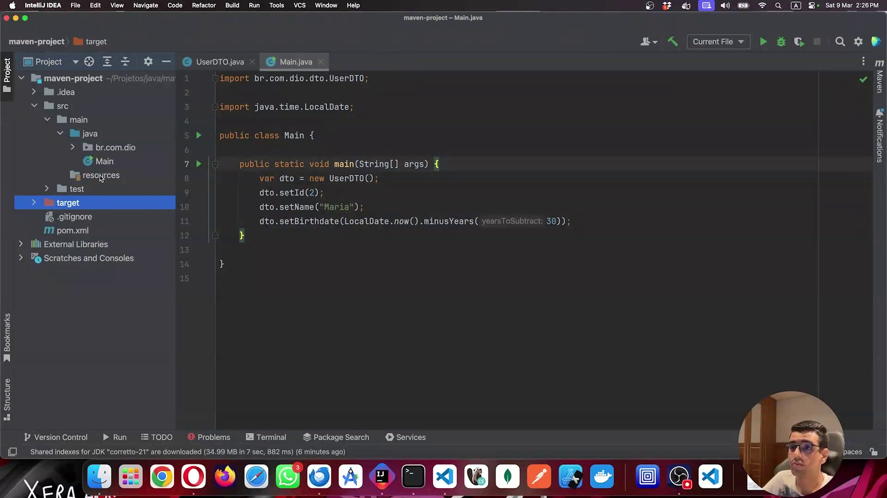
</p>

Na classe `Main`, o objeto `dto` tem seus atributos preenchidos utilizando os setters gerados pelo Lombok: o `id` recebe o valor `2`, o `name` recebe `"Maria"`, e o `birthdate` recebe uma data calculada a partir de `LocalDate.now().minusYears(30)`, ou seja, a data atual menos 30 anos.

```java
import br.com.dio.dto.UserDTO;
import java.time.LocalDate;

public class Main {

    public static void main(String[] args) {
        var dto = new UserDTO();
        dto.setId(2);
        dto.setName("Maria");
        dto.setBirthdate(LocalDate.now().minusYears(30));
    }

}
```

#### Executando mvn compile pelo terminal

<p align="center">
  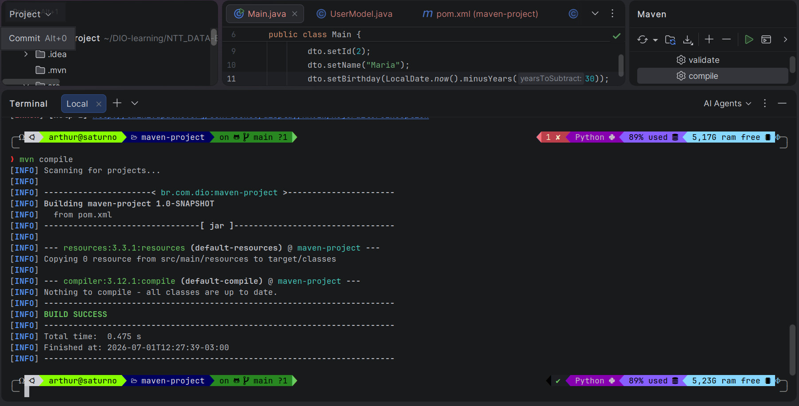
</p>

O comando `mvn compile` é executado diretamente pelo terminal integrado, a partir do diretório raiz do projeto `maven-project`. A saída mostra as fases de `resources` e `compile` do ciclo de vida do Maven sendo executadas, finalizando com `BUILD SUCCESS`, o que confirma que o projeto compila corretamente com a configuração atual do `pom.xml`.

```bash
mvn compile
```
```
[INFO] --- resources:3.3.1:resources (default-resources) @ maven-project ---
[INFO] Copying 0 resource from src/main/resources to target/classes
[INFO] --- compiler:3.12.1:compile (default-compile) @ maven-project ---
[INFO] Nothing to compile - all classes are up to date.
[INFO] ------------------------------------------------------------------------
[INFO] BUILD SUCCESS
[INFO] ------------------------------------------------------------------------
```

#### Recompilando o projeto após alterações no código-fonte

<p align="center">
  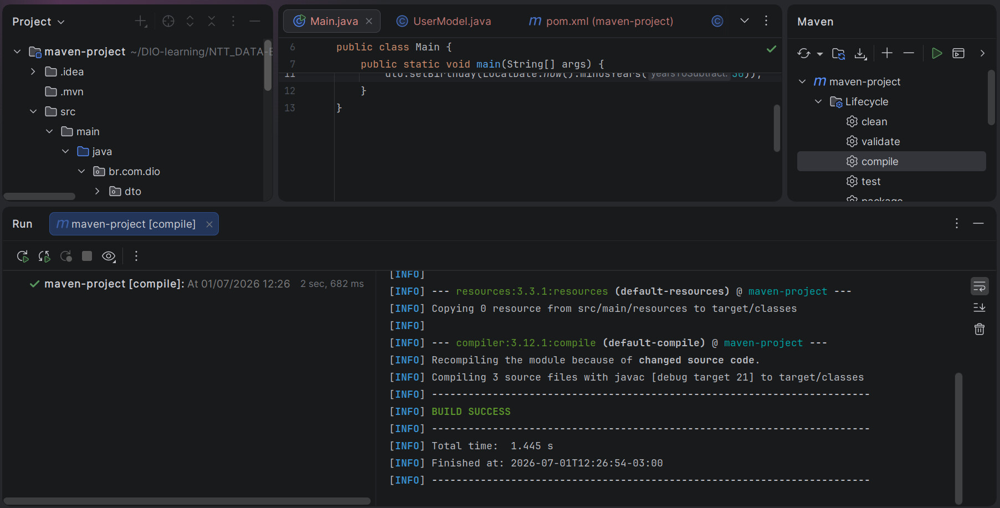
</p>

Ao rodar novamente a tarefa **compile** do Maven, agora pelo painel de execução do IntelliJ, o log indica que o módulo foi recompilado por conta de mudanças no código-fonte, compilando os **3 arquivos-fonte** existentes até este ponto (`Main`, `UserDTO` e a nova classe de modelo). O resultado é novamente `BUILD SUCCESS`.

```
[INFO] --- compiler:3.12.1:compile (default-compile) @ maven-project ---
[INFO] Recompiling the module because of changed source code.
[INFO] Compiling 3 source files with javac [debug target 21] to target/classes
[INFO] ------------------------------------------------------------------------
[INFO] BUILD SUCCESS
[INFO] ------------------------------------------------------------------------
```

#### Criando UserModel com anotações individuais do Lombok

<p align="center">
  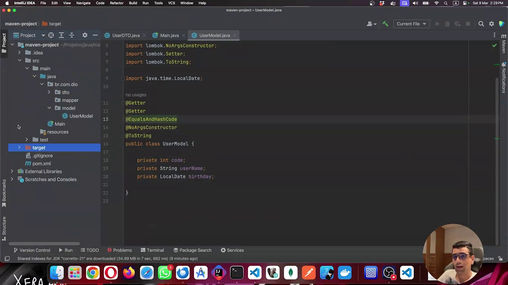
</p>

Para demonstrar que a anotação `@Data` é, na prática, um resumo de várias anotações menores do Lombok, a classe `UserModel` é criada utilizando essas anotações de forma explícita e individual: `@Getter`, `@Setter`, `@EqualsAndHashCode`, `@NoArgsConstructor` e `@ToString`. O resultado da compilação é equivalente ao obtido anteriormente com `@Data` na classe `UserDTO`.

```java
import lombok.Getter;
import lombok.NoArgsConstructor;
import lombok.Setter;
import lombok.ToString;
import lombok.EqualsAndHashCode;

import java.time.LocalDate;

@Getter
@Setter
@EqualsAndHashCode
@NoArgsConstructor
@ToString
public class UserModel {

    private int code;
    private String userName;
    private LocalDate birthday;

}
```


### 🟩 Vídeo 03 - Concluindo o projeto

<video width="60%" controls>
  <source src="000-Midia_e_Anexos/bootcamp_ntt_data_java_spring_ai-modulo.03-curso.03-video_03.webm" type="video/webm">
    Seu navegador não suporta vídeo HTML5.
</video>

link do vídeo: https://web.dio.me/track/ntt-data-2026-ai-java-back-end/course/gerenciando-dependencias-com-maven-e-gradle/learning/e7fcb087-73a3-40e5-8e4d-5a9516441bd6?autoplay=1

### Anotações

Este é o `pom.xml` do projeto Maven, já configurado com todas as dependências necessárias para o funcionamento conjunto do Lombok e do MapStruct. Nas propriedades estão definidas as versões (`org.mapstruct.version`, `org.projectlombok.version` e `lombok-mapstruct-binding.version`), e nas dependências constam o `mapstruct`, o `mapstruct-processor`, o `lombok` e o `lombok-mapstruct-binding` — este último essencial para que os dois annotation processors (Lombok e MapStruct) consigam trabalhar juntos sem conflitos durante a compilação. No `build`, o plugin `maven-compiler-plugin` referencia explicitamente esses processadores em `annotationProcessorPaths`.

```xml
<project xmlns="http://maven.apache.org/POM/4.0.0"
         xmlns:xsi="http://www.w3.org/2001/XMLSchema-instance"
         xsi:schemaLocation="http://maven.apache.org/POM/4.0.0 http://maven.apache.org/xsd/maven-4.0.0.xsd">
    <modelVersion>4.0.0</modelVersion>

    <groupId>br.com.dio</groupId>
    <artifactId>maven-project</artifactId>
    <version>1.0-SNAPSHOT</version>

    <properties>
        <maven.compiler.source>21</maven.compiler.source>
        <maven.compiler.target>21</maven.compiler.target>
        <java.version>21</java.version>
        <project.build.sourceEncoding>UTF-8</project.build.sourceEncoding>
        <org.mapstruct.version>1.5.5.Final</org.mapstruct.version>
        <org.projectlombok.version>1.18.30</org.projectlombok.version>
        <lombok-mapstruct-binding.version>0.2.0</lombok-mapstruct-binding.version>
    </properties>

    <dependencies>
        <dependency>
            <groupId>org.mapstruct</groupId>
            <artifactId>mapstruct</artifactId>
            <version>${org.mapstruct.version}</version>
        </dependency>
        <dependency>
            <groupId>org.mapstruct</groupId>
            <artifactId>mapstruct-processor</artifactId>
            <version>${org.mapstruct.version}</version>
        </dependency>
        <dependency>
            <groupId>org.projectlombok</groupId>
            <artifactId>lombok</artifactId>
            <version>${org.projectlombok.version}</version>
        </dependency>
        <dependency>
            <groupId>org.projectlombok</groupId>
            <artifactId>lombok-mapstruct-binding</artifactId>
            <version>${lombok-mapstruct-binding.version}</version>
        </dependency>
    </dependencies>

    <build>
        <plugins>
            <plugin>
                <groupId>org.apache.maven.plugins</groupId>
                <artifactId>maven-compiler-plugin</artifactId>
                <version>3.12.1</version>
                <configuration>
                    <source>${java.version}</source>
                    <target>${java.version}</target>
                    <annotationProcessorPaths>
                        <path>
                            <groupId>org.projectlombok</groupId>
                            <artifactId>lombok</artifactId>
                            <version>${org.projectlombok.version}</version>
                        </path>
                        <path>
                            <groupId>org.projectlombok</groupId>
                            <artifactId>lombok-mapstruct-binding</artifactId>
                            <version>${lombok-mapstruct-binding.version}</version>
                        </path>
                        <path>
                            <groupId>org.mapstruct</groupId>
                            <artifactId>mapstruct-processor</artifactId>
                            <version>${org.mapstruct.version}</version>
                        </path>
                    </annotationProcessorPaths>
                </configuration>
            </plugin>
        </plugins>
    </build>
</project>
```

Esta é a classe `UserDTO`, localizada no pacote `br.com.dio.dto`. Ela representa o objeto de transferência de dados (DTO) e utiliza a anotação `@Data` do Lombok para gerar automaticamente getters, setters e demais métodos utilitários. Seus campos são `id` (int), `name` (String) e `birthday` (LocalDate) — esses nomes são importantes porque serão usados como origem/destino nos mapeamentos feitos pelo MapStruct em seguida.

```java
package br.com.dio.dto;
import lombok.Data;
import java.time.LocalDate;

@Data
public class UserDTO {
    private int id;
    private String name;
    private LocalDate birthday;
}
```

Aqui está a interface `UserMapper`, criada no pacote `mapper` e anotada com `@Mapper`, a anotação que indica ao MapStruct que essa interface deve gerar automaticamente uma implementação de mapeamento entre objetos. São definidos dois métodos: `toModel`, que converte um `UserDTO` em `UserModel`, e `toDTO`, que faz o caminho inverso. Em cada método, as anotações `@Mapping(target = ..., source = ...)` indicam explicitamente qual campo de destino (`target`) deve receber o valor de qual campo de origem (`source`) — por exemplo, o campo `id` do DTO é mapeado para o campo `code` do model, e `name` é mapeado para `userName`, já que esses campos têm nomes diferentes entre as duas classes.

```java
package br.com.dio.mapper;

import br.com.dio.dto.UserDTO;
import br.com.dio.model.UserModel;
import org.mapstruct.Mapper;
import org.mapstruct.Mapping;

@Mapper
public interface UserMapper {
    @Mapping(target = "code", source = "id")
    @Mapping(target = "userName", source = "name")
    UserModel toModel(final UserDTO dto);

    @Mapping(target = "id", source = "code")
    @Mapping(target = "name", source = "userName")
    UserDTO toDTO(final UserModel model);
}
```

Esta é a classe `UserModel`, no pacote `br.com.dio.model`. Diferente do DTO, ela usa um conjunto de anotações do Lombok mais explícito: `@Getter`, `@Setter`, `@NoArgsConstructor` e `@AllArgsConstructor`, gerando os métodos de acesso e os construtores com e sem argumentos. Seus campos são `code` (int), `userName` (String) e `birthday` (LocalDate) — note que os nomes `code` e `userName` são propositalmente diferentes dos nomes `id` e `name` do `UserDTO`, exatamente para demonstrar o mapeamento explícito feito pelo MapStruct na interface `UserMapper`.

```java
package br.com.dio.model;
import lombok.*;
import java.time.LocalDate;

@Getter
@Setter
@NoArgsConstructor
@AllArgsConstructor
public class UserModel {
    private int code;
    private String userName;
    private LocalDate birthday;
}
```

Abaixo a classe `Main`, onde o mapper é instanciado e utilizado pela primeira vez. A linha `Mappers.getMapper(UserMapper.class)` é o ponto central: é a fábrica do MapStruct que devolve a implementação concreta da interface `UserMapper` (gerada em tempo de compilação, sem uso de reflection). Em seguida, um `UserModel` é criado e populado (`setCode(1)`, `setUserName("James")`, `setBirthday(...)`), e o resultado de `mapper.toDTO(model)` é impresso no console. Logo depois, um `UserDTO` é criado (`setId(2)`, `setName("Maria")`, `setBirthday(...)`) e o resultado de `mapper.toModel(dto)` também é impresso, demonstrando o mapeamento nos dois sentidos.

```java
import br.com.dio.dto.UserDTO;
import br.com.dio.mapper.UserMapper;
import br.com.dio.model.UserModel;
import org.mapstruct.factory.Mappers;
import java.time.LocalDate;

public class Main {
    private final static UserMapper mapper = Mappers.getMapper(UserMapper.class);

    public static void main(String[] args) {
        var model = new UserModel();
        model.setCode(1);
        model.setUserName("James");
        model.setBirthday(LocalDate.now().minusYears(20));
        System.out.println(mapper.toDTO(model));

        var dto = new UserDTO();
        dto.setId(2);
        dto.setName("Maria");
        dto.setBirthday(LocalDate.now().minusYears(30));
        System.out.println(mapper.toModel(dto));
    }
}
```

<p align="center">
  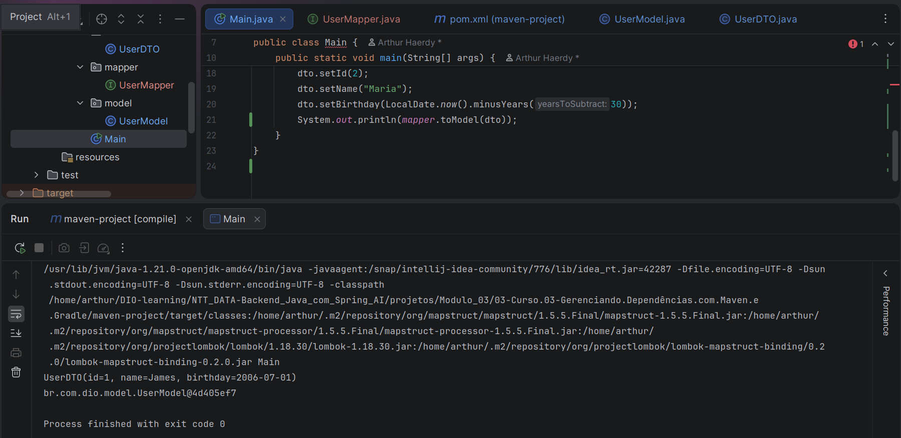
</p>

Esta captura mostra o momento da execução do código: no editor aparece o trecho final da classe `Main` (`dto.setId(2)`, `dto.setName("Maria")`, `dto.setBirthday(...)`, `System.out.println(mapper.toModel(dto))`), e no painel de execução, logo abaixo, o resultado impresso no console. Repare que a primeira linha impressa é `UserDTO(id=1, name=James, birthday=2006-07-01)`, resultado do `mapper.toDTO(model)` — mesmo sem nenhuma implementação escrita manualmente, o MapStruct já converteu o `UserModel` para `UserDTO` corretamente. A segunda linha, `br.com.dio.model.UserModel@4d405ef7`, é o resultado de `mapper.toModel(dto)` impresso sem um `toString()` sobrescrito na classe `UserModel`, por isso aparece apenas a referência do objeto em memória.

```
UserDTO(id=1, name=James, birthday=2006-07-01)
br.com.dio.model.UserModel@4d405ef7

Process finished with exit code 0
```

<p align="center">
  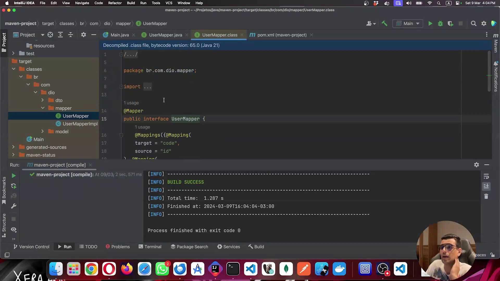
</p>

Após compilar o projeto (com `BUILD SUCCESS` visível no painel inferior), o professor abre o arquivo `.class` gerado para `UserMapper` a partir da pasta `target/classes`. O IntelliJ o exibe descompilado, revelando o bytecode traduzido de volta para código Java legível. Aqui aparece exatamente a mesma interface `UserMapper` criada anteriormente, apenas formatada de outro jeito pelo decompilador (`@Mappings({@Mapping(target = "code", source = "id") ...`) — ou seja, essa classe é só a interface original recompilada, e não a implementação real do mapeamento.

```java
package br.com.dio.mapper;

@Mapper
public interface UserMapper {
    @Mappings({@Mapping(
        target = "code",
        source = "id"
    )
    // ... demais @Mapping conforme definidos na interface original
}
```

Aqui está o verdadeiro "pulo do gato" do MapStruct: a classe `UserMapperImpl`, gerada automaticamente pelo annotation processor durante a compilação, implementando a interface `UserMapper`. É nela que fica o código de mapeamento de fato — puro Java, sem qualquer uso de reflection. No método `toModel`, o gerador criou um `UserModel`, tratou o caso de `dto` nulo e chamou diretamente os getters/setters (`userModel.setCode(dto.getId())`, `userModel.setUserName(dto.getName())`), inclusive mapeando `birthday` para `birthday` automaticamente, mesmo sem uma anotação `@Mapping` explícita para esse campo — o MapStruct faz esse mapeamento implícito porque os nomes das propriedades são idênticos nas duas classes.

```java
package br.com.dio.mapper;

public class UserMapperImpl implements UserMapper {

    public UserMapperImpl() {
    }

    public UserModel toModel(UserDTO dto) {
        if (dto == null) {
            return null;
        } else {
            UserModel userModel = new UserModel();
            userModel.setCode(dto.getId());
            userModel.setUserName(dto.getName());
            userModel.setBirthday(dto.getBirthday());
            return userModel;
        }
    }
}
```

<p align="center">
  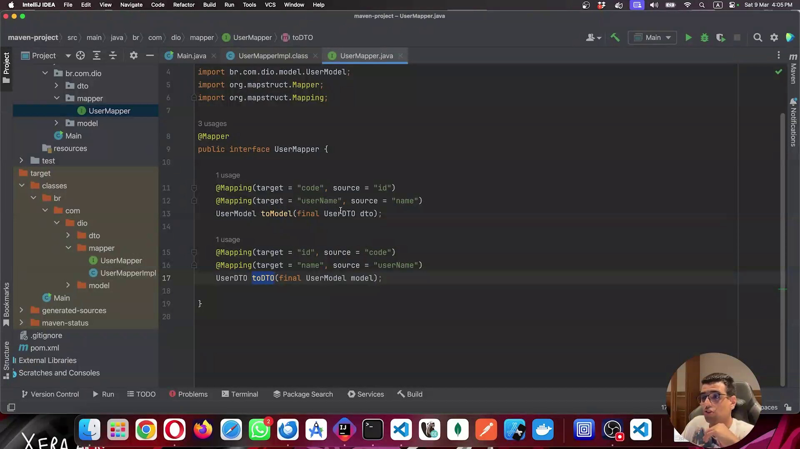
</p>

O professor volta ao código-fonte original da interface `UserMapper`, agora usando-o para explicar por que o campo `birthday` foi mapeado corretamente na implementação gerada, mesmo sem uma anotação `@Mapping` dedicada a ele. A explicação é que o MapStruct mapeia automaticamente propriedades que têm o mesmo nome no destino (`target`) e na origem (`source`) — como `birthday` existe com o mesmo nome tanto em `UserDTO` quanto em `UserModel`, o mapeamento é feito de forma implícita, sem necessidade de configuração manual.

<p align="center">
  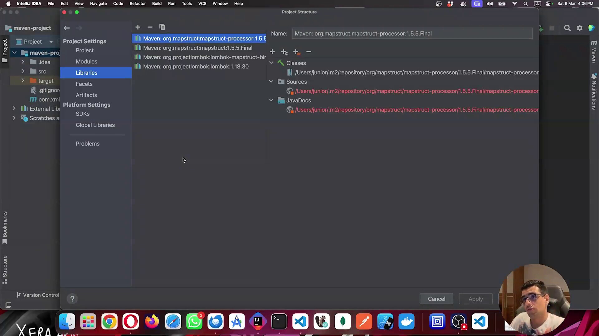
</p>

Esta imagem mostra a janela **Project Structure > Libraries** do IntelliJ, onde é possível visualizar as bibliotecas Maven já vinculadas ao projeto (`mapstruct-processor`, `mapstruct`, `lombok-mapstruct-binding` e `lombok`, todas resolvidas a partir do repositório local `.m2`). O professor usa essa tela para ilustrar o que seria necessário fazer caso o projeto não utilizasse o Maven: seria preciso adicionar cada uma dessas bibliotecas manualmente ao projeto, gerenciando à mão os arquivos `.jar` de cada dependência.

<p align="center">
  
</p>

Por fim, esta imagem mostra a página do **MvnRepository** (mvnrepository.com) para o artefato `org.mapstruct:mapstruct:1.5.5.Final`. A página exibe informações como licença (Apache 2.0), categoria (Code Generators), tags, e o trecho de configuração pronto para uso em Maven, Gradle, SBT, entre outros gerenciadores. Essa é a alternativa apontada para quando não se conhece o nome exato de uma biblioteca: pesquisar no Maven Repository e copiar o bloco de dependência correspondente diretamente para o `pom.xml`, evitando o trabalho manual de baixar e versionar arquivos `.jar` por conta própria.

```xml

<dependency>
    <groupId>org.mapstruct</groupId>
    <artifactId>mapstruct</artifactId>
    <version>1.5.5.Final</version>
</dependency>
```


## Parte 2 - Instalação e Configuração do Gradle 
#gradle

### 🟩 Vídeo 04 - Instalando Gradle

<video width="60%" controls>
  <source src="000-Midia_e_Anexos/bootcamp_ntt_data_java_spring_ai-modulo.03-curso.03-video_04.webm" type="video/webm">
    Seu navegador não suporta vídeo HTML5.
</video>

link do vídeo: https://web.dio.me/track/ntt-data-2026-ai-java-back-end/course/gerenciando-dependencias-com-maven-e-gradle/learning/b7d688f1-cd7a-4678-a786-6978c61eb002?autoplay=1

### Anotações

<p align="center">
  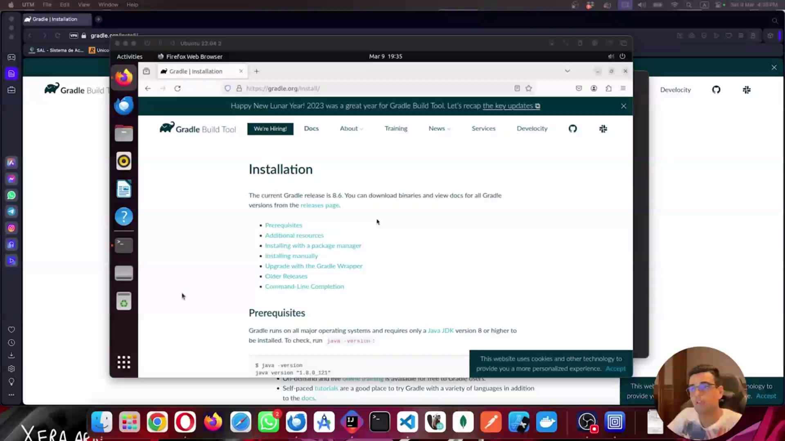
</p>

Esta aula apresenta o **Gradle** como uma alternativa moderna ao **Maven** para o gerenciamento de dependências em projetos **Java** e **Kotlin**. O instrutor compara as duas ferramentas, destacando que, embora o Maven seja mais tradicional e estável em ambientes web, o Gradle é amplamente preferido no ecossistema **Android** e oferece maior flexibilidade, apesar de exigir mais atenção a atualizações. O conteúdo demonstra dois métodos distintos de configuração: a **instalação manual**, que envolve o download de arquivos e a definição de variáveis de ambiente no sistema, e a utilização do **SDKMAN**, descrita como uma opção mais ágil. Durante o processo, são fornecidas orientações sobre comandos de terminal para extração de pacotes e verificação da versão instalada. O objetivo central é capacitar o aluno a preparar seu ambiente de desenvolvimento, permitindo que ele escolha a ferramenta que melhor se adapte às suas necessidades.    

A forma mais eficiente de gerenciar o Gradle no Linux (incluindo o Kubuntu) é através do **SDKMAN!**. Este método evita problemas com permissões de root e facilita a troca de versões conforme a necessidade de cada projeto.

#### 1. Instalação do SDKMAN!

Caso você ainda não tenha o gerenciador instalado, abra o seu terminal e execute:

```bash
curl -s "https://get.sdkman.io" | bash

```

Após finalizar, carregue as configurações do SDKMAN! no seu terminal atual com o comando:

```bash
source "$HOME/.sdkman/bin/sdkman-init.sh"

```

Verifique se a instalação ocorreu com sucesso digitando:

```bash
sdk version

```

#### 2. Listagem de versões do Gradle

Para visualizar todas as versões disponíveis para instalação, utilize:

```bash
sdk list gradle

```

#### 3. Instalação do Gradle

Com o SDKMAN! configurado, instale a versão desejada (exemplo com a versão 8.6, utilizada na aula):

```bash
sdk install gradle 8.6

```

#### 4. Verificação da instalação

Para confirmar que o Gradle está corretamente instalado e configurado, rode o comando:

```bash
gradle -v

```

#### Dicas Extras para seu Fluxo de Trabalho

* **Trocar de versão:** Caso precise mudar para outra versão em um projeto específico, basta rodar `sdk install gradle [versão]` e, posteriormente, alternar com `sdk use gradle [versão]`.
* **Definir versão padrão:** Se desejar fixar uma versão para todo o sistema, utilize o comando `sdk default gradle [versão]`.
* **Integração com IDE:** O IntelliJ IDEA detectará automaticamente os binários instalados via SDKMAN! ao configurar o JDK e o Gradle nas configurações do seu projeto.


### 🟩 Vídeo 05 - Criando um projeto Gradle

<video width="60%" controls>
  <source src="000-Midia_e_Anexos/bootcamp_ntt_data_java_spring_ai-modulo.03-curso.03-video_05.webm" type="video/webm">
    Seu navegador não suporta vídeo HTML5.
</video>

link do vídeo: https://web.dio.me/track/ntt-data-2026-ai-java-back-end/course/gerenciando-dependencias-com-maven-e-gradle/learning/5b675065-3f83-471a-9128-0a9b8c3a34cc?autoplay=1

### Anotações

#### Criando um projeto Gradle via linha de comando

<p align="center">
  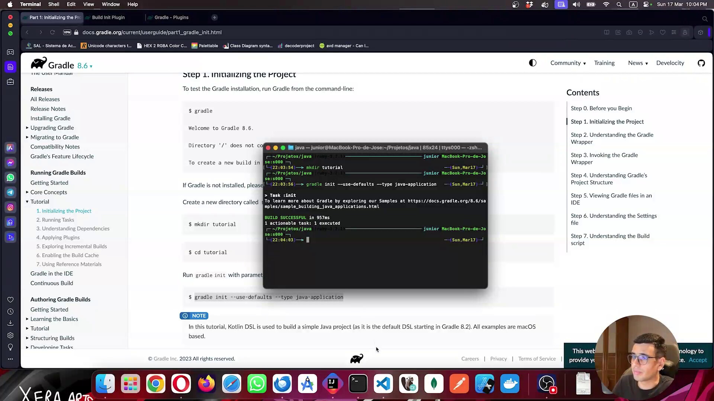
</p>

A imagem mostra um terminal sobreposto à documentação oficial do Gradle (página "Part 1: Initializing the Project"). Nele é executado o comando que gera rapidamente um projeto Java a partir da linha de comando, usando as configurações padrão do Gradle:

```bash
mkdir tutorial
cd tutorial
gradle init --use-defaults --type java-application
```

O retorno do terminal confirma a execução com sucesso da tarefa `:init` (`BUILD SUCCESSFUL`), indicando que o projeto foi criado sem a necessidade de responder a nenhuma pergunta interativa, já que a flag `--use-defaults` assume os valores padrão do Gradle.

#### Estrutura padrão do build.gradle gerado pelo IntelliJ (Groovy)

<p align="center">
  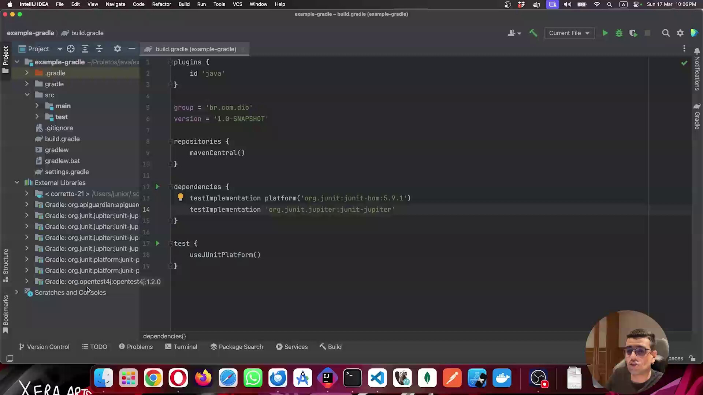
</p>

Este é o arquivo `build.gradle` gerado automaticamente pelo assistente de novo projeto do IntelliJ, escrito na DSL Groovy (a linguagem padrão de configuração do Gradle antes da popularização do Kotlin DSL):

```groovy
plugins {
    id 'java'
}

group = 'br.com.dio'
version = '1.0-SNAPSHOT'

repositories {
    mavenCentral()
}

dependencies {
    testImplementation platform('org.junit:junit-bom:5.9.1')
    testImplementation 'org.junit.jupiter:junit-jupiter'
}

test {
    useJUnitPlatform()
}
```

Diferente da criação via linha de comando, aqui o próprio assistente do IntelliJ já disponibiliza automaticamente uma dependência de testes (JUnit), configurando o repositório `mavenCentral()` e o bloco `test` para usar a plataforma JUnit.

#### Explorando o diretório de cache de dependências do Gradle

<p align="center">
  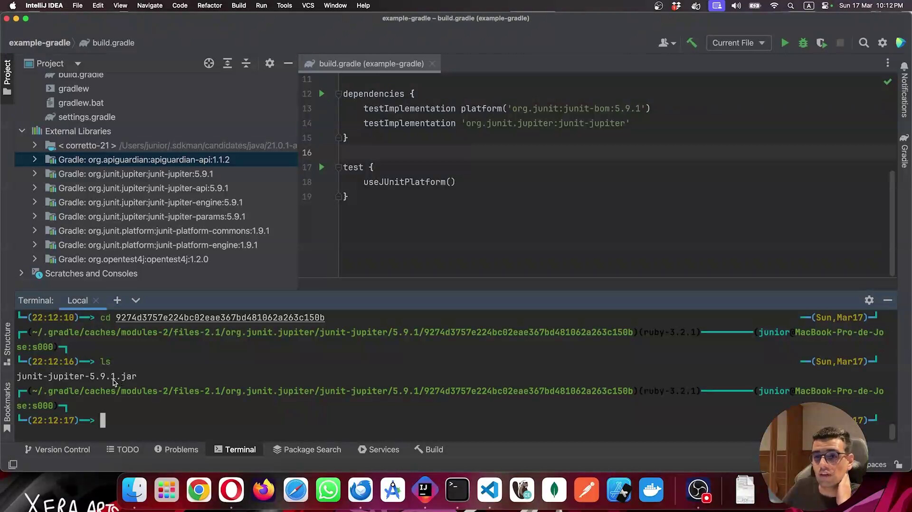
</p>

A imagem mostra o terminal integrado do IntelliJ navegando pela estrutura de cache local do Gradle, localizada em `~/.gradle/caches/modules-2/files-2.1/`. O objetivo é demonstrar onde as dependências baixadas (como o JUnit) ficam armazenadas no computador:

```bash
cd 9274d3757e224bc02eae367bd481062a263c150b
ls
```

O comando `ls` retorna o arquivo `junit-jupiter-5.9.1.jar`, confirmando que essa é a pasta onde o Gradle guarda fisicamente o artefato baixado do repositório Maven Central, dentro de uma estrutura organizada por grupo, artefato, versão e hash.

#### Criando um novo projeto Gradle com Kotlin DSL

<p align="center">
  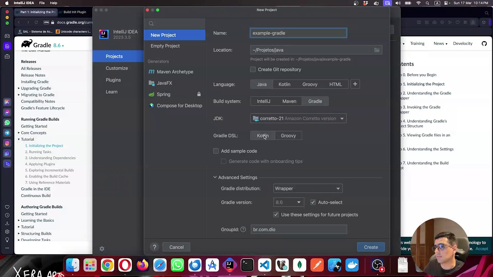
</p>

A imagem não contém código, mas sim o assistente gráfico ("New Project") do IntelliJ IDEA para a criação de um novo projeto Gradle. Nele são definidos: o nome do projeto (`example-gradle`), o local de armazenamento, a linguagem (Java), o sistema de build (Gradle), a JDK (Corretto 21) e, principalmente, a opção de **Gradle DSL**, onde a alternativa **Kotlin** é selecionada em vez de Groovy — diferindo da criação anterior, que usava a linguagem padrão. Também é definido o `GroupId` como `br.com.dio`, mantendo a distribuição do Gradle configurada como `Wrapper`.

#### Configurando dependências do MapStruct e Lombok no build.gradle.kts

<p align="center">
  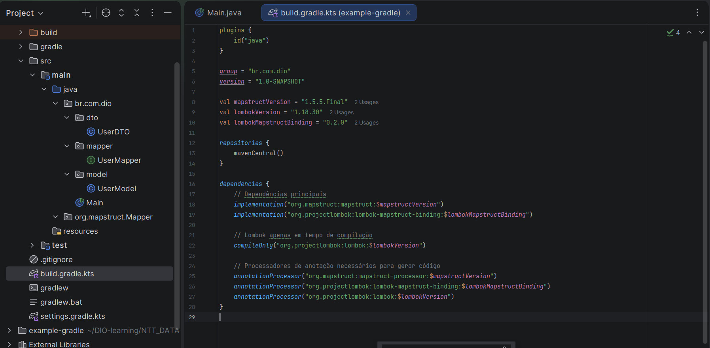
</p>

A imagem mostra o `build.gradle.kts` já configurado com a DSL Kotlin, incluindo a declaração de variáveis (`val`) para centralizar as versões das bibliotecas MapStruct e Lombok, evitando repetição de valores ao longo do arquivo:

```kotlin
plugins {
    id("java")
}

group = "br.com.dio"
version = "1.0-SNAPSHOT"

val mapstructVersion = "1.5.5.Final"
val lombokVersion = "1.18.30"
val lombokMapstructBinding = "0.2.0"

repositories {
    mavenCentral()
}

dependencies {
    // Dependências principais
    implementation("org.mapstruct:mapstruct:$mapstructVersion")
    implementation("org.projectlombok:lombok-mapstruct-binding:$lombokMapstructBinding")

    // Lombok apenas em tempo de compilação
    compileOnly("org.projectlombok:lombok:$lombokVersion")

    // Processadores de anotação necessários para gerar código
    annotationProcessor("org.mapstruct:mapstruct-processor:$mapstructVersion")
    annotationProcessor("org.projectlombok:lombok-mapstruct-binding:$lombokMapstructBinding")
    annotationProcessor("org.projectlombok:lombok:$lombokVersion")
}
```

Repare que, além das dependências de `implementation` e `compileOnly`, é necessário declarar os `annotationProcessor` correspondentes ao Lombok e ao MapStruct — sem isso, os processadores de anotação responsáveis por gerar o código (getters, setters, implementação do mapper) não são executados durante a compilação. A árvore de projeto à esquerda já mostra as classes `UserDTO`, `UserMapper` e `UserModel` criadas dentro do pacote `br.com.dio`.

#### Criando a estrutura de pacotes manualmente

<p align="center">
  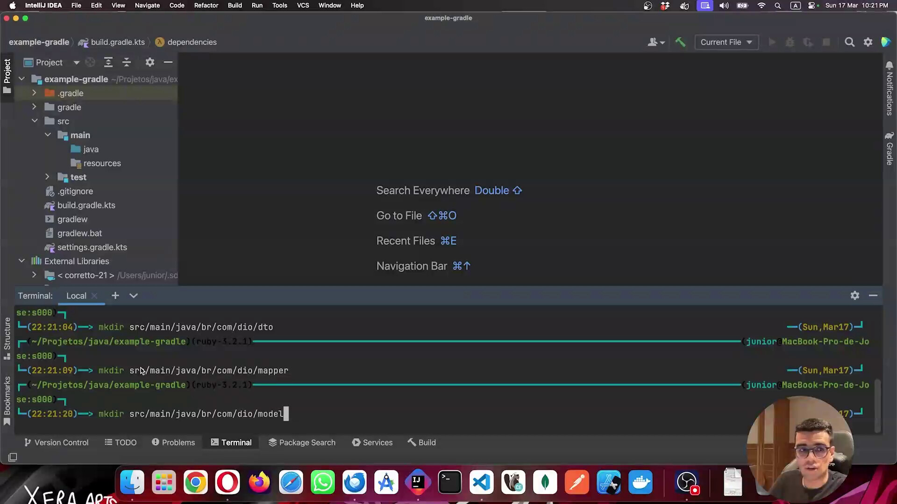
</p>

No terminal integrado, a estrutura de pacotes do projeto é criada manualmente via linha de comando, seguindo o mesmo padrão de organização (`dto`, `mapper`, `model`) já utilizado anteriormente com o Maven:

```bash
mkdir src/main/java/br/com/dio/dto
mkdir src/main/java/br/com/dio/mapper
mkdir src/main/java/br/com/dio/model
```

Essa abordagem evita perder tempo criando os pacotes manualmente pela interface gráfica, já que os diretórios ficam disponíveis no explorador de arquivos do IntelliJ assim que criados.

#### Classe UserDTO

<p align="center">
  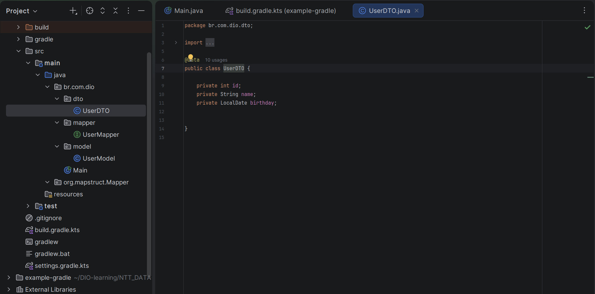
</p>

A imagem exibe o conteúdo da classe `UserDTO`, criada dentro do pacote `br.com.dio.dto`. Apesar da marcação automática indicar Python, o conteúdo real da imagem é código **Java**:

```java
package br.com.dio.dto;

import ...

@Data
public class UserDTO {

    private int id;
    private String name;
    private LocalDate birthday;

}
```

A anotação `@Data`, do Lombok, é responsável por gerar automaticamente em tempo de compilação os métodos `getters`, `setters`, `equals`, `hashCode` e `toString` para os atributos `id`, `name` e `birthday`, evitando a necessidade de escrevê-los manualmente.

#### Interface UserMapper

<p align="center">
  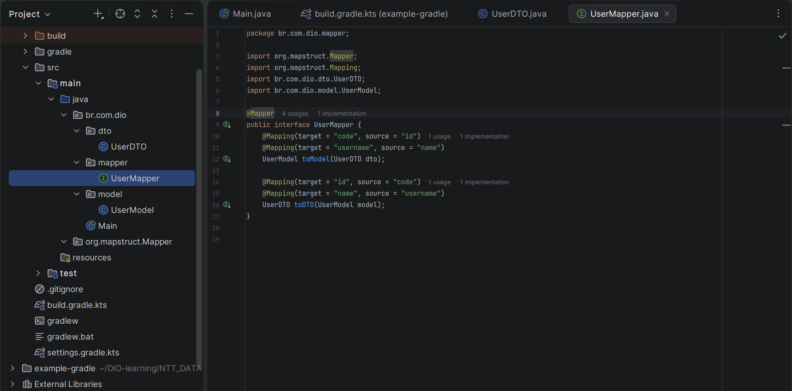
</p>

A imagem mostra a interface `UserMapper`, criada no pacote `br.com.dio.mapper`. Assim como na imagem anterior, o conteúdo real é código **Java** (apesar da marcação automática indicar Python):

```java
package br.com.dio.mapper;

import org.mapstruct.Mapper;
import org.mapstruct.Mapping;
import br.com.dio.dto.UserDTO;
import br.com.dio.model.UserModel;

@Mapper
public interface UserMapper {
    @Mapping(target = "code", source = "id")
    @Mapping(target = "username", source = "name")
    UserModel toModel(UserDTO dto);

    @Mapping(target = "id", source = "code")
    @Mapping(target = "name", source = "username")
    UserDTO toDTO(UserModel model);
}
```

A anotação `@Mapper` indica ao MapStruct que essa interface deve ter sua implementação gerada automaticamente em tempo de compilação. Como os atributos de `UserDTO` (`id`, `name`) têm nomes diferentes dos atributos de `UserModel` (`code`, `username`), as anotações `@Mapping` definem explicitamente a correspondência entre `target` (atributo de destino) e `source` (atributo de origem) em cada sentido da conversão.

#### Classe UserModel

<p align="center">
  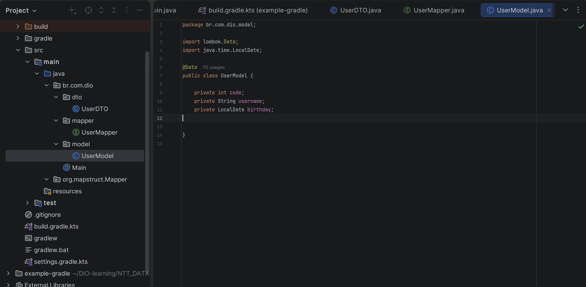
</p>

A imagem mostra a classe `UserModel`, criada no pacote `br.com.dio.model`. O conteúdo, novamente, é código **Java**:

```java
package br.com.dio.model;

import lombok.Data;
import java.time.LocalDate;

@Data
public class UserModel {

    private int code;
    private String username;
    private LocalDate birthday;

}
```

Essa classe foi criada copiando a estrutura da `UserDTO`, porém com nomes de atributos propositalmente diferentes (`code` no lugar de `id`, `username` no lugar de `name`), justamente para demonstrar, na sequência, como o MapStruct resolve esse tipo de divergência de nomenclatura entre objetos.

#### Classe Main: testando o mapeamento entre UserDTO e UserModel

<p align="center">
  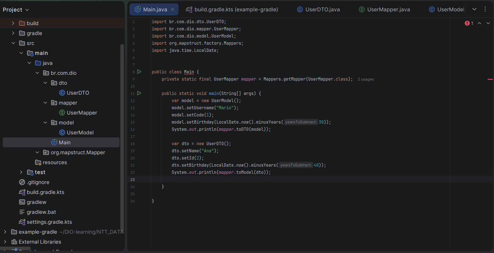
</p>

A imagem mostra a classe `Main`, responsável por testar o funcionamento do `UserMapper`. O conteúdo é código **Java**:

```java
import br.com.dio.dto.UserDTO;
import br.com.dio.mapper.UserMapper;
import br.com.dio.model.UserModel;
import org.mapstruct.factory.Mappers;
import java.time.LocalDate;

public class Main {
    private static final UserMapper mapper = Mappers.getMapper(UserMapper.class);

    public static void main(String[] args) {
        var model = new UserModel();
        model.setUsername("Mario");
        model.setCode(1);
        model.setBirthday(LocalDate.now().minusYears(30));
        System.out.println(mapper.toDTO(model));

        var dto = new UserDTO();
        dto.setName("Ana");
        dto.setId(2);
        dto.setBirthday(LocalDate.now().minusYears(40));
        System.out.println(mapper.toModel(dto));
    }
}
```

A instância do mapper é obtida por meio de `Mappers.getMapper(UserMapper.class)`, padrão típico do MapStruct para acessar a implementação gerada em tempo de compilação. Em seguida, o código cria um `UserModel` e converte para `UserDTO` (`mapper.toDTO`), e cria um `UserDTO` e converte para `UserModel` (`mapper.toModel`), imprimindo o resultado de cada conversão no console.

#### Resultado da execução no console

<p align="center">
  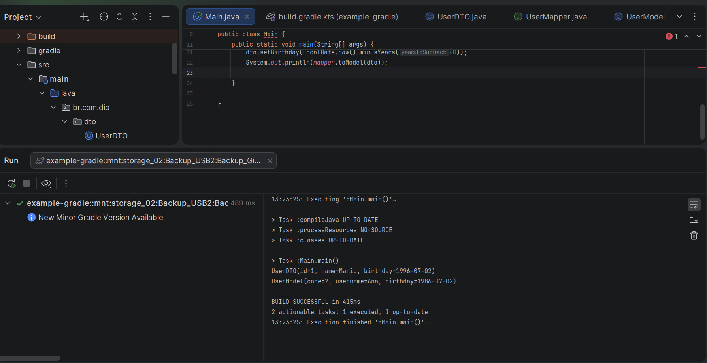
</p>

A imagem mostra a saída da execução do projeto (aba **Run**), exibindo o resultado impresso no console após rodar a classe `Main`:

```
> Task :Main.main()
UserDTO(id=1, name=Mario, birthday=1996-07-02)
UserModel(code=2, username=Ana, birthday=1986-07-02)

BUILD SUCCESSFUL in 415ms
```

O resultado confirma que o `UserMapper` converteu corretamente um `UserModel` (contendo `code` e `username`) em um `UserDTO` (com `id` e `name`), e vice-versa, validando que o mapeamento configurado nas anotações `@Mapping` funcionou como esperado, junto com a geração das datas via `LocalDate.now().minusYears(...)`.      


## Parte 3 - Comparação e Migração entre Ferramentas

### 🟩 Vídeo 06 - Mas afinal porque usar o Maven ou Gradle

<video width="60%" controls>
  <source src="000-Midia_e_Anexos/bootcamp_ntt_data_java_spring_ai-modulo.03-curso.03-video_06.webm" type="video/webm">
    Seu navegador não suporta vídeo HTML5.
</video>

link do vídeo: https://web.dio.me/track/ntt-data-2026-ai-java-back-end/course/gerenciando-dependencias-com-maven-e-gradle/learning/bd8894d6-5902-4e6b-8470-65453c8cede3?autoplay=1

### Anotações

#### Apache Commons Collections — página oficial

<p align="center">
  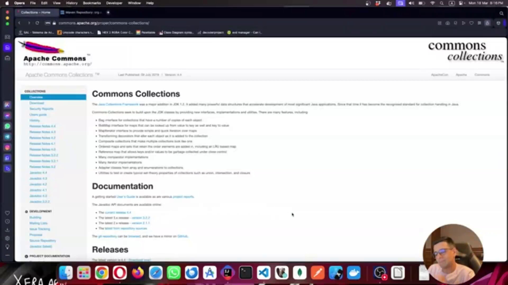
</p>

A imagem mostra a página oficial do projeto Apache Commons Collections, com a listagem das principais funcionalidades da biblioteca (interfaces como Bag, BidiMap, MultiMap, coleções ordenadas, comparadores, iteradores, entre outras) e a seção de documentação, com links para o guia inicial, relatórios do projeto e Javadocs. Essa é a lib escolhida como exemplo para demonstrar, de forma simples, os problemas que gerenciadores de dependência como Maven e Gradle resolvem no dia a dia.

#### Maven Repository — commons-collections4 4.4

<p align="center">
  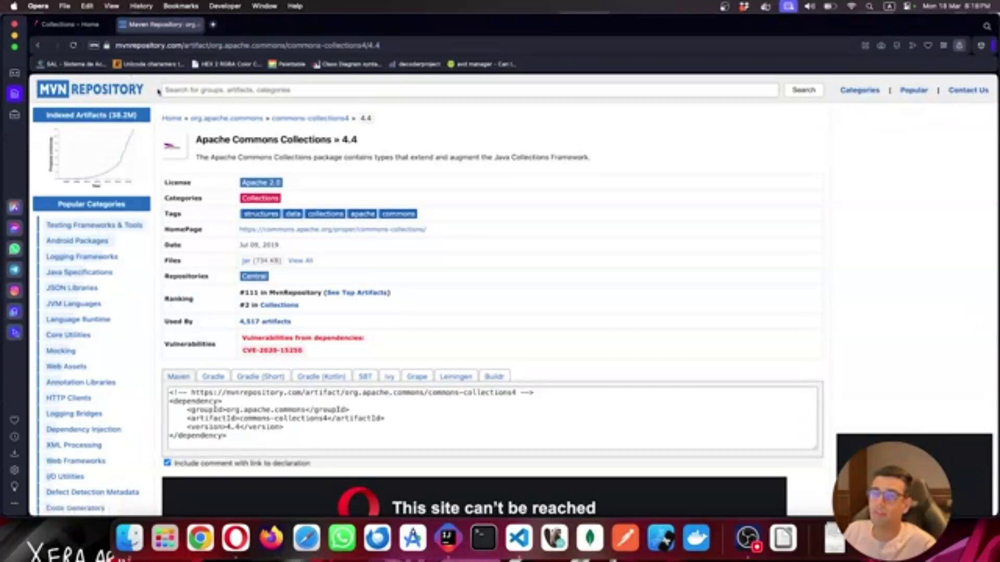
</p>

Aqui é exibida a página do artefato `commons-collections4` no MVN Repository, com informações como licença, categoria, ranking, número de projetos que utilizam a lib e vulnerabilidades conhecidas. Na parte inferior aparece o trecho pronto para configuração via Maven:

```xml

<dependency>
    <groupId>org.apache.commons</groupId>
    <artifactId>commons-collections4</artifactId>
    <version>4.4</version>
</dependency>
```

#### Maven Repository — configuração via Gradle

<p align="center">
  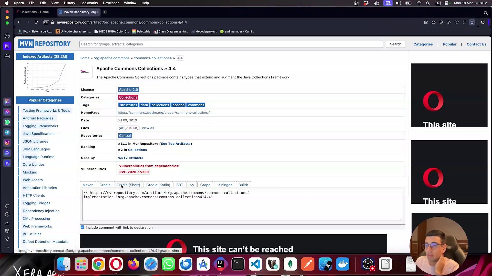
</p>

Na mesma página do artefato, agora com a aba "Gradle (Short)" selecionada, o repositório disponibiliza a mesma dependência em um formato compatível com o Gradle:

```gradle
// https://mvnrepository.com/artifact/org.apache.commons/commons-collections4
implementation 'org.apache.commons:commons-collections4:4.4'
```

Isso ilustra como o mesmo repositório central oferece a instrução de instalação já formatada para diferentes gerenciadores de dependência (Maven, Gradle, Gradle Kotlin, SBT, Ivy, entre outros).

#### Busca por dependência — MapStruct

<p align="center">
  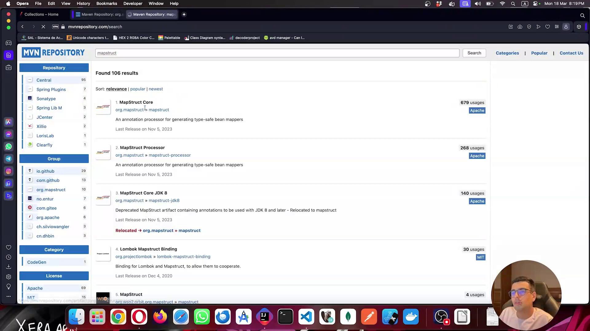
</p>

A imagem mostra o resultado da busca pelo termo "mapstruct" no MVN Repository, retornando 106 resultados, entre eles o MapStruct Core, o MapStruct Processor e a integração Lombok Mapstruct Binding. Esse é o exemplo usado para mostrar como é possível localizar rapidamente uma dependência pelo nome, sem precisar saber previamente o grupo (`groupId`) do artefato.

#### Busca por grupo — org.apache.commons

<p align="center">
  
</p>

Aqui a busca é feita não pelo nome específico de uma lib, mas pelo grupo `org.apache.commons`, retornando 253 resultados, entre eles Commons Lang, Commons Collections, Commons Text, Commons Compress e Commons Math. Essa é uma segunda forma de pesquisa no repositório, útil quando se quer explorar todas as bibliotecas de um mesmo fornecedor ou pacote.

#### Busca por plugin — maven-compiler-plugin

<p align="center">
  
</p>

Além de dependências, o MVN Repository também permite localizar plugins do Maven. A imagem mostra a busca por "maven-compiler-plugin", retornando o Apache Maven Compiler Plugin como primeiro resultado, junto com outros artefatos relacionados a compilação e ao ecossistema de plugins do Maven.

#### Detalhe do plugin — Apache Maven Compiler Plugin

<p align="center">
  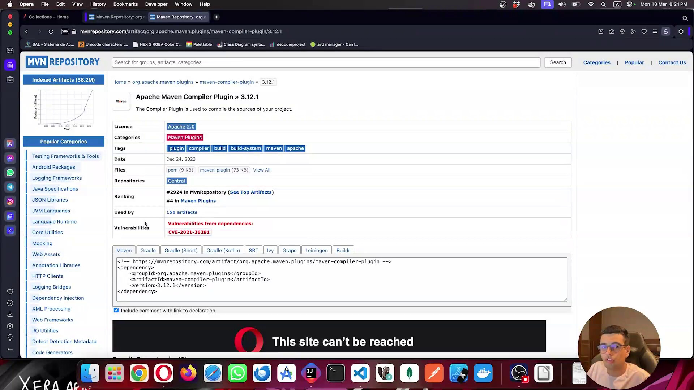
</p>

Nesta página de detalhe do Apache Maven Compiler Plugin (versão 3.12.1) é exibida a instrução de dependência a ser adicionada ao `pom.xml` para configurá-lo como plugin de compilação do projeto:

```xml

<dependency>
    <groupId>org.apache.maven.plugins</groupId>
    <artifactId>maven-compiler-plugin</artifactId>
    <version>3.12.1</version>
</dependency>
```

Assim como as dependências, os plugins também podem ser localizados e configurados a partir do mesmo repositório central.

#### Gradle Plugins — plugins.gradle.org

<p align="center">
  
</p>

A imagem mostra o site oficial de busca de plugins do Gradle (plugins.gradle.org), com uma listagem de plugins disponíveis para a comunidade, cada um com sua última versão e tags de categoria. Esse é o site específico usado quando o objetivo é localizar plugins voltados exclusivamente para projetos Gradle.

#### Download manual do JAR

<p align="center">
  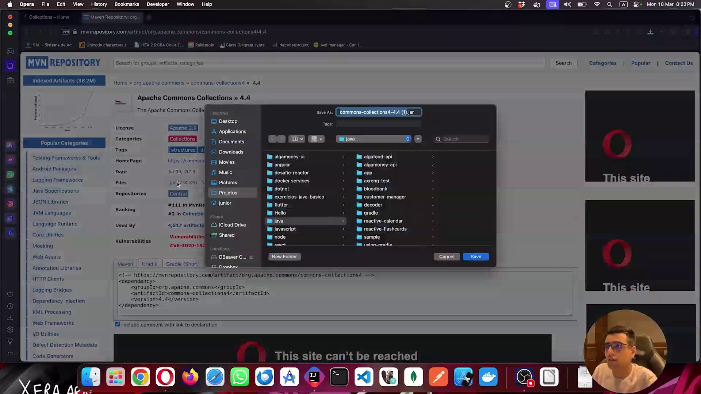
</p>

Esta imagem mostra a janela do sistema operacional para salvar o arquivo `commons-collections4-4.4.jar`, aberta a partir do link de download do JAR disponível na página do artefato no MVN Repository. Esse é o caminho manual de obtenção da biblioteca, sem uso de um gerenciador de dependências, que será usado em seguida para adicionar a lib diretamente ao projeto Java.

#### Criação da classe Main com List.of

<p align="center">
  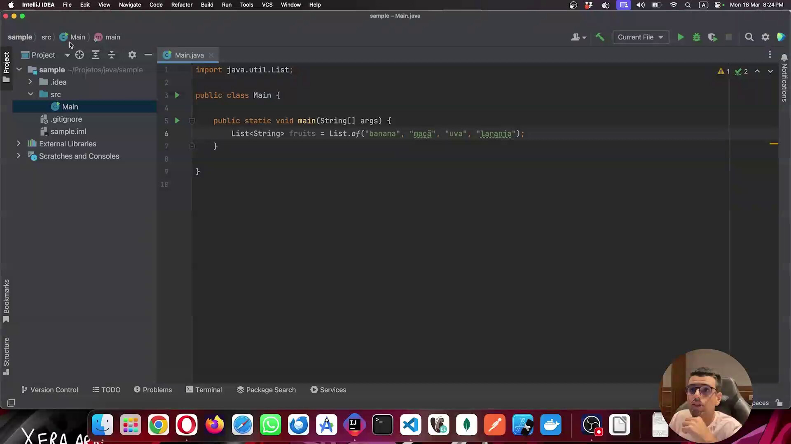
</p>

No IntelliJ IDEA, é criada a classe `Main` com um método `main` contendo uma lista de frutas construída com `List.of`:

```java
import java.util.List;

public class Main {

    public static void main(String[] args) {
        List<String> fruits = List.of("banana", "maçã", "uva", "laranja");
    }

}
```

Essa lista simples servirá de base para demonstrar, mais adiante, o uso de um método utilitário do Apache Commons Collections sobre coleções Java.

#### Project Structure — adicionando biblioteca manualmente

<p align="center">
  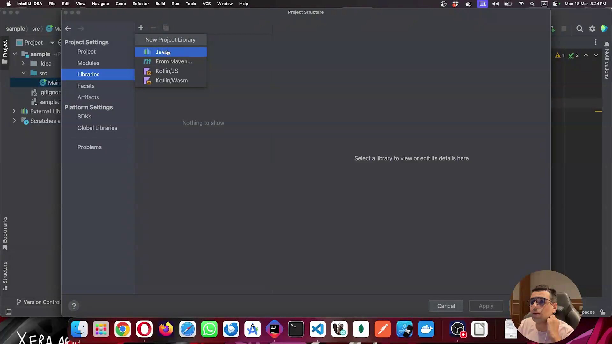
</p>

A imagem mostra a tela "Project Structure" do IntelliJ IDEA, na seção "Libraries", ainda vazia ("Nothing to show"). O menu de adição está aberto, exibindo as opções disponíveis para incluir uma nova biblioteca: Java, From Maven, Kotlin/JS e Kotlin/Wasm. É por aqui que o JAR baixado manualmente será associado ao projeto.

#### Selecionando o arquivo JAR baixado

<p align="center">
  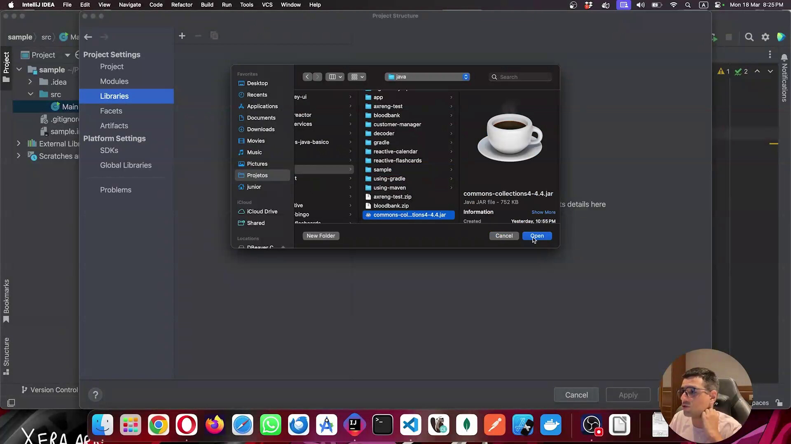
</p>

Nesta etapa, o seletor de arquivos do IntelliJ é usado para localizar e selecionar o arquivo `commons-collections4-4.4.jar` previamente baixado no computador, para então adicioná-lo como biblioteca Java do projeto.

#### Biblioteca adicionada ao projeto

<p align="center">
  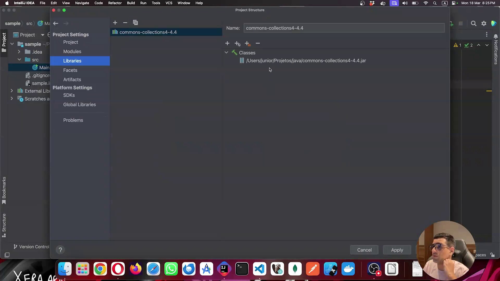
</p>

Após a seleção, a tela "Project Structure" passa a exibir a biblioteca `commons-collections4-4.4` já cadastrada, apontando para o caminho local do arquivo JAR (`/Users/.../Projetos/java/commons-collections4-4.4.jar`) dentro da seção "Classes". Esse é o resultado da associação manual da lib ao projeto.

#### Arquivo de configuração sample.iml

<p align="center">
  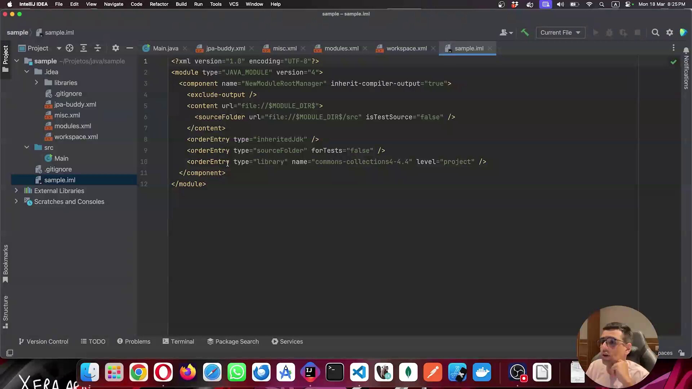
</p>

Ao inspecionar os arquivos ocultos do projeto, aparece o `sample.iml`, arquivo de configuração interno do IntelliJ onde a associação da biblioteca foi registrada automaticamente:

```xml
<?xml version="1.0" encoding="UTF-8"?>
<module type="JAVA_MODULE" version="4">
  <component name="NewModuleRootManager" inherit-compiler-output="true">
    <exclude-output />
    <content url="file://$MODULE_DIR$">
      <sourceFolder url="file://$MODULE_DIR$/src" isTestSource="false" />
    </content>
    <orderEntry type="inheritedJdk" />
    <orderEntry type="sourceFolder" forTests="false" />
    <orderEntry type="library" name="commons-collections4-4.4" level="project" />
  </component>
</module>
```

Esse arquivo evidencia a dependência do caminho local do JAR, um problema que apareceria caso o projeto fosse compartilhado em outra máquina sem o mesmo diretório de bibliotecas.

#### Uso do CollectionUtils.isEmpty — importação estática

<p align="center">
  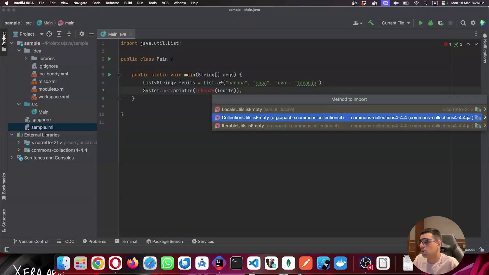
</p>

Ao chamar `isEmpty(fruits)` dentro de um `System.out.println`, o IntelliJ sugere as opções de importação estática disponíveis para o método, entre elas `LocaleUtils.isEmpty` (padrão do Java), `CollectionUtils.isEmpty` e `IterableUtils.isEmpty`, ambos vindos do pacote `org.apache.commons.collections4` adicionado ao projeto. A opção `CollectionUtils.isEmpty` é a selecionada, evidenciando que a lib do Apache Commons já está disponível para uso no código.

#### Execução com lista preenchida — retorno false

<p align="center">
  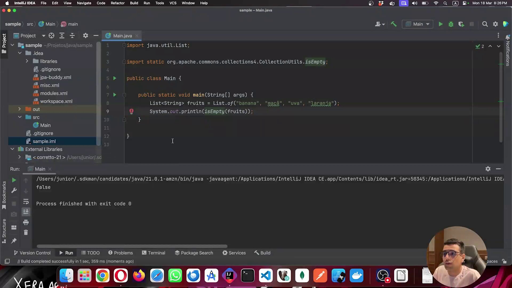
</p>

Com a importação estática já configurada, o código final e o resultado da execução são exibidos:

```java
import java.util.List;
import static org.apache.commons.collections4.CollectionUtils.isEmpty;

public class Main {

    public static void main(String[] args) {
        List<String> fruits = List.of("banana", "maçã", "uva", "laranja");
        System.out.println(isEmpty(fruits));
    }

}
```

Como a lista contém elementos, a saída no console é `false`, confirmando que o método `isEmpty` da lib está funcionando corretamente sobre a coleção Java.

#### Testando o comportamento null-safe

<p align="center">
  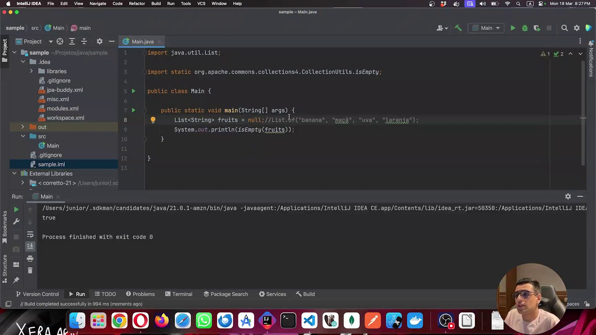
</p>

A lista agora é atribuída como `null` (o `List.of(...)` original é comentado), e o mesmo `isEmpty(fruits)` do Apache Commons é chamado:

```java
List<String> fruits = null; //List.of("banana", "maçã", "uva", "laranja");
System.out.println(isEmpty(fruits));
```

A execução retorna `true` sem lançar exceção, demonstrando que o método `CollectionUtils.isEmpty` da lib é *null-safe*: ele verifica internamente se a coleção é nula antes de checar se está vazia.

#### Comparando com o método nativo da coleção

<p align="center">
  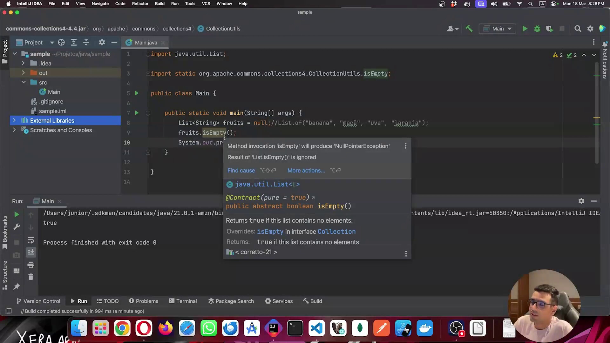
</p>

Por fim, é chamado o método `isEmpty()` diretamente na instância da lista (`fruits.isEmpty()`), o método nativo da interface `java.util.List`, e o próprio IntelliJ aponta o problema:

```java
List<String> fruits = null; //List.of("banana", "maçã", "uva", "laranja");
fruits.isEmpty();
```

O aviso exibido é claro: *"Method invocation 'isEmpty' will produce 'NullPointerException'"*. Diferente do `CollectionUtils.isEmpty` do Apache Commons, o método nativo `isEmpty()` da coleção **não é null-safe** — se a referência for nula, a chamada lança uma `NullPointerException`. Essa comparação evidencia uma das vantagens práticas de se utilizar bibliotecas utilitárias como o Apache Commons Collections.


### 🟩 Vídeo 07 - Migrando Projeto Maven para Gradle

<video width="60%" controls>
  <source src="000-Midia_e_Anexos/bootcamp_ntt_data_java_spring_ai-modulo.03-curso.03-video_07.webm" type="video/webm">
    Seu navegador não suporta vídeo HTML5.
</video>

link do vídeo: https://web.dio.me/track/ntt-data-2026-ai-java-back-end/course/gerenciando-dependencias-com-maven-e-gradle/learning/7414e848-1b25-41cc-a080-2091b6b509b8?autoplay=1

### Anotações

<p align="center">
  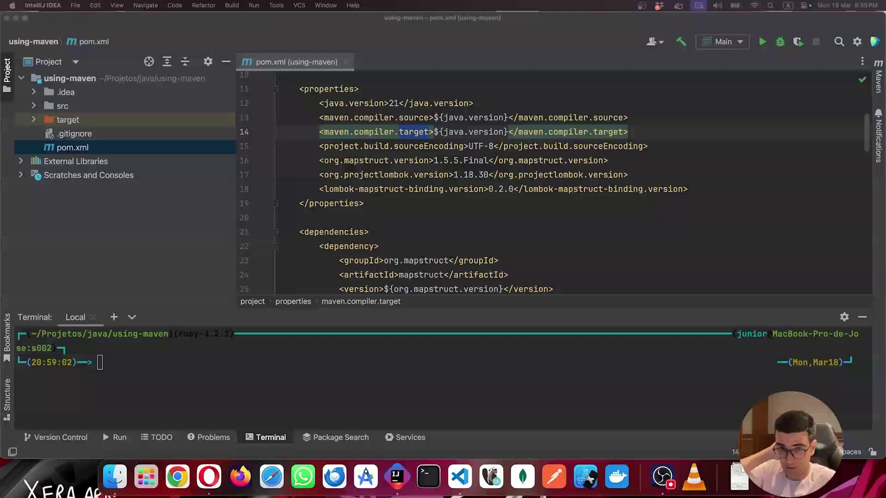
</p>

A imagem mostra o `pom.xml` do projeto Maven original, aberto no IntelliJ IDEA, exibindo o bloco `<properties>` com a versão do Java e as configurações de compilação, seguido do início do bloco `<dependencies>`:

```xml
<properties>
    <java.version>21</java.version>
    <maven.compiler.source>${java.version}</maven.compiler.source>
    <maven.compiler.target>${java.version}</maven.compiler.target>
    <project.build.sourceEncoding>UTF-8</project.build.sourceEncoding>
    <org.mapstruct.version>1.5.5.Final</org.mapstruct.version>
    <org.projectlombok.version>1.18.30</org.projectlombok.version>
    <lombok-mapstruct-binding.version>0.2.0</lombok-mapstruct-binding.version>
</properties>

<dependencies>
    <dependency>
        <groupId>org.mapstruct</groupId>
        <artifactId>mapstruct</artifactId>
        <version>${org.mapstruct.version}</version>
```

Esse é o ponto de partida da migração: o projeto Maven já existente, com suas dependências e propriedades definidas no `pom.xml`, que servirá de base para o Gradle gerar automaticamente o novo build.

<p align="center">
  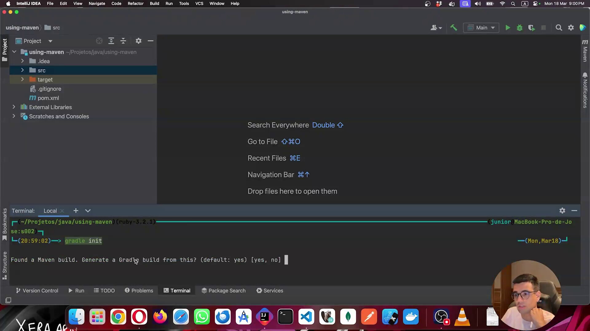
</p>

No terminal, é executado o comando responsável por iniciar a migração:

```bash
gradle init
```

Em seguida, o Gradle identifica automaticamente a existência de uma build Maven no diretório e pergunta se deve gerar uma build Gradle a partir dela:

```
Found a Maven build. Generate a Gradle build from this? (default: yes) [yes, no]
```

Esse é o primeiro passo prático da migração: como o Gradle já está instalado na máquina, basta rodar `gradle init` dentro do projeto para que a própria ferramenta detecte o `pom.xml` e ofereça a conversão automática.

<p align="center">
  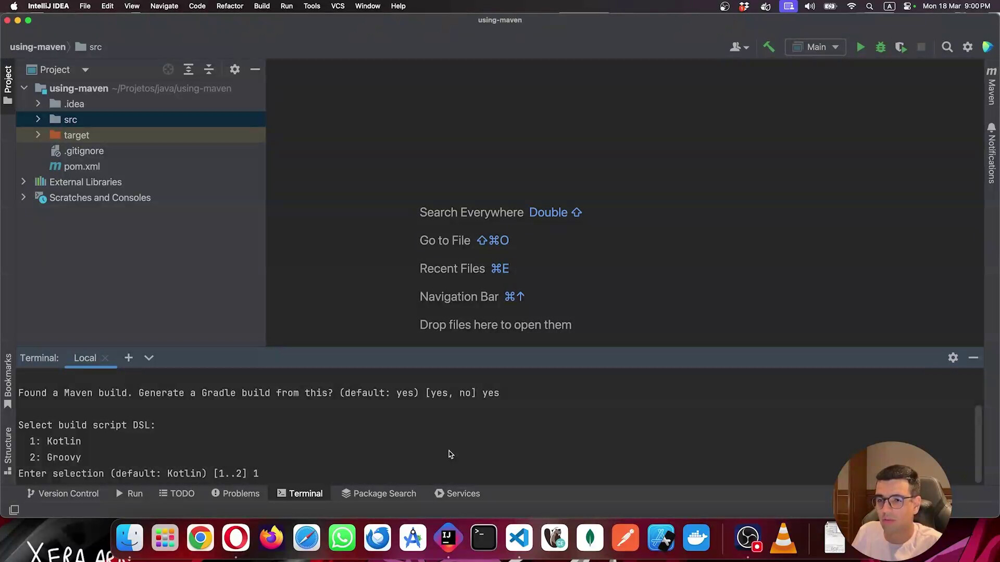
</p>

Após confirmar a geração da build a partir do Maven com `yes`, o Gradle passa para a próxima pergunta do assistente interativo, solicitando a escolha da linguagem do script de build:

```
Found a Maven build. Generate a Gradle build from this? (default: yes) [yes, no] yes

Select build script DSL:
  1: Kotlin
  2: Groovy
Enter selection (default: Kotlin) [1..2] 1
```

A opção escolhida foi o Kotlin (opção 1), considerada a alternativa mais interessante para o `build.gradle`, que na prática será gerado como `build.gradle.kts`.

<p align="center">
  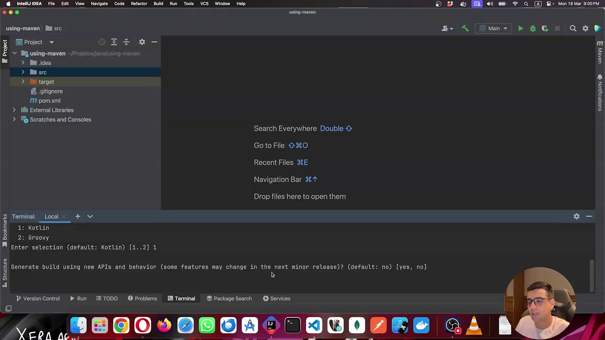
</p>

Na sequência do assistente do `gradle init`, surge uma nova pergunta sobre o uso de APIs e comportamentos mais recentes na geração da build:

```
Enter selection (default: Kotlin) [1..2] 1

Generate build using new APIs and behavior (some features may change in the next minor release)? (default: no) [yes, no]
```

A resposta escolhida é manter o valor padrão (`no`), já que a própria ferramenta alerta que algumas dessas funcionalidades mais novas podem sofrer alterações em versões futuras — optando-se, assim, por uma geração mais estável.

<p align="center">
  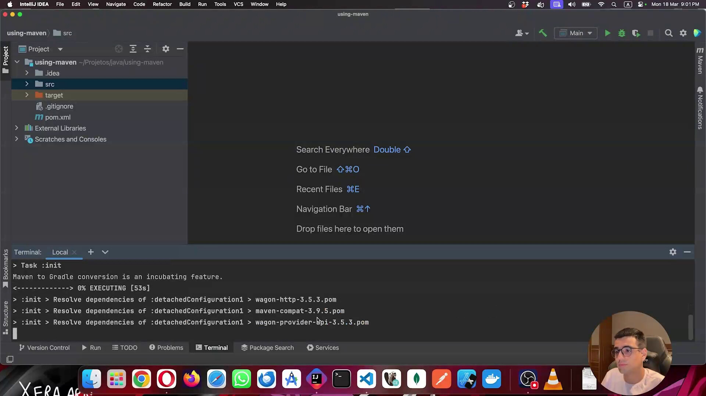
</p>

Com todas as respostas do assistente confirmadas, o Gradle inicia de fato o processo de conversão, exibindo no terminal a execução da task `:init` e a resolução das dependências necessárias para realizar a leitura do Maven:

```
> Task :init
Maven to Gradle conversion is an incubating feature.
<------------> 0% EXECUTING [53s]
> :init > Resolve dependencies of :detachedConfiguration1 > wagon-http-3.5.3.pom
> :init > Resolve dependencies of :detachedConfiguration1 > maven-compat-3.9.5.pom
> :init > Resolve dependencies of :detachedConfiguration1 > wagon-provider-api-3.5.3.pom
```

O próprio Gradle avisa que essa conversão de Maven para Gradle ainda é um recurso "incubating" (em fase de amadurecimento), e para conseguir interpretar o `pom.xml` ele precisa baixar bibliotecas auxiliares do próprio ecossistema Maven, como `wagon-http` e `maven-compat`.

<p align="center">
  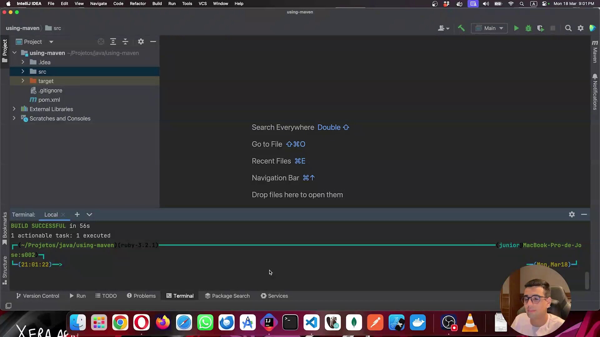
</p>

O terminal mostra o resultado final da execução do `gradle init`:

```
BUILD SUCCESSFUL in 56s
1 actionable task: 1 executed
```

A conversão foi concluída com sucesso. A partir daqui, o Gradle já gerou os arquivos de configuração do novo projeto — como o `build.gradle` e o `settings` — reaproveitando as informações que estavam presentes no `pom.xml` original.

<p align="center">
  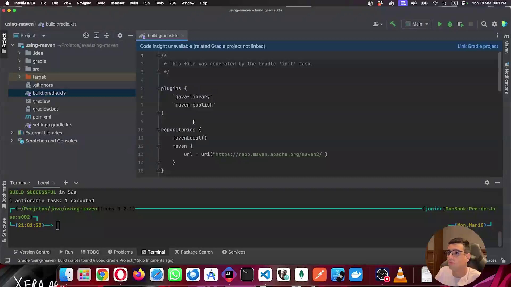
</p>

Com a migração concluída, o arquivo `build.gradle.kts` gerado automaticamente é aberto no editor:

```kotlin
/*
 * This file was generated by the Gradle 'init' task.
 */

plugins {
    `java-library`
    `maven-publish`
}

repositories {
    mavenLocal()
    maven {
        url = uri("https://repo.maven.apache.org/maven2/")
    }
}
```

O Gradle aplicou o plugin `java-library` para o projeto Java e também o plugin `maven-publish`, que é o responsável por permitir a publicação de artefatos em repositórios Maven — uma forma de manter compatibilidade com o ecossistema Maven mesmo após a migração.

<p align="center">
  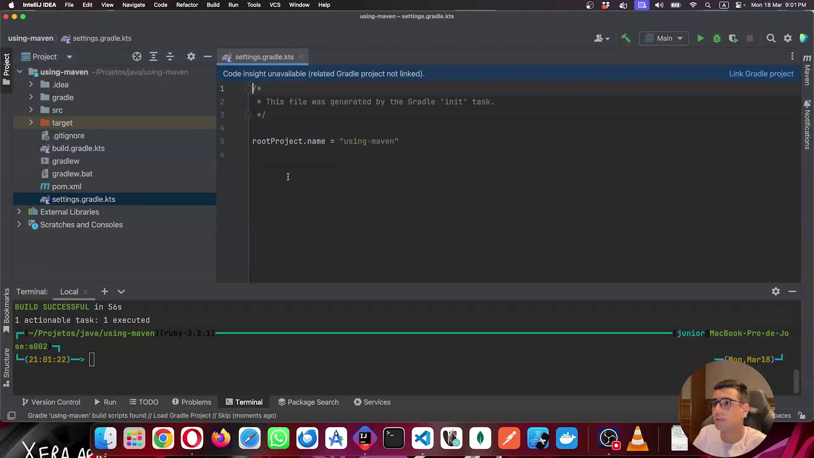
</p>

Ao lado do `build.gradle.kts`, o Gradle também gerou o arquivo `settings.gradle.kts`:

```kotlin
/*
 * This file was generated by the Gradle 'init' task.
 */

rootProject.name = "using-maven"
```

Esse arquivo define o nome raiz do projeto, mantendo a mesma identificação (`using-maven`) que era usada no projeto Maven original.

<p align="center">
  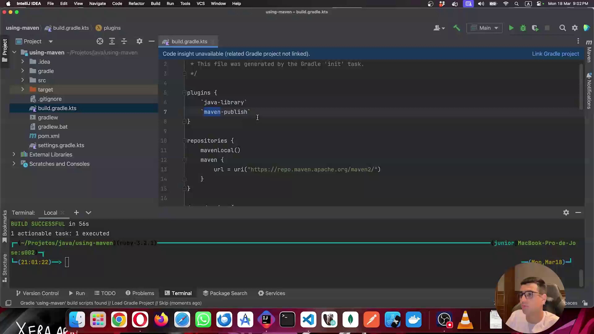
</p>

Voltando ao `build.gradle.kts`, o plugin `maven-publish` é destacado no editor, chamando atenção justamente para esse plugin do Gradle que foi incluído automaticamente durante a conversão a partir do `pom.xml`.

<p align="center">
  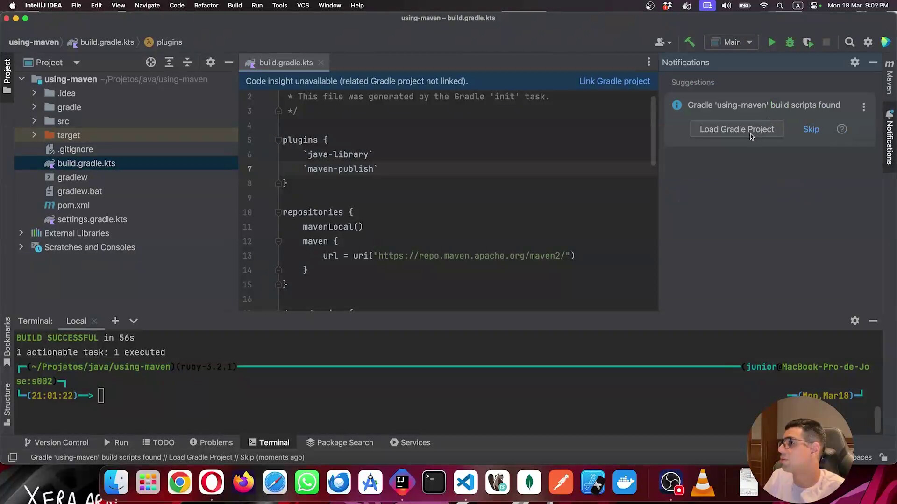
</p>

O IntelliJ IDEA detecta os novos arquivos de build do Gradle e exibe uma notificação:

```
Gradle 'using-maven' build scripts found
[Load Gradle Project]  [Skip]
```

A opção **Load Gradle Project** é selecionada para que a IDE vincule o projeto ao Gradle recém-gerado, permitindo que os arquivos `build.gradle.kts` e `settings.gradle.kts` passem a ser reconhecidos e indexados corretamente pelo editor.

<p align="center">
  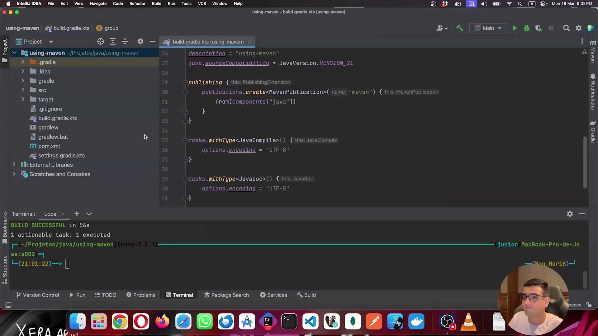
</p>

Após o carregamento do projeto Gradle pela IDE, é possível ver mais detalhes do `build.gradle.kts` já configurados automaticamente:

```kotlin
description = "using-maven"
java.sourceCompatibility = JavaVersion.VERSION_21

publishing {
    publications.create<MavenPublication>("maven") {
        from(components["java"])
    }
}

tasks.withType<JavaCompile>() {
    options.encoding = "UTF-8"
}

tasks.withType<Javadoc>() {
    options.encoding = "UTF-8"
}
```

O Gradle já configurou a versão do Java (`VERSION_21`), a codificação UTF-8 para compilação e geração de Javadoc, além do bloco de publicação Maven — informações que antes estavam espalhadas no `pom.xml` e agora foram reorganizadas no formato do Gradle.

<p align="center">
  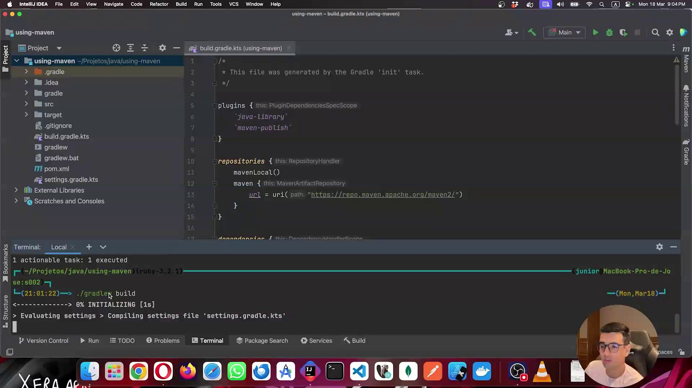
</p>

Com o projeto já vinculado ao Gradle, o `build.gradle.kts` completo é exibido pela IDE, agora com a inferência de tipos do editor (`this: PluginDependenciesSpecScope`, `this: RepositoryHandler`, `this: MavenArtifactRepository`):

```kotlin
plugins {
    `java-library`
    `maven-publish`
}

repositories {
    mavenLocal()
    maven {
        url = uri("https://repo.maven.apache.org/maven2/")
    }
}
```

No terminal, é iniciada a execução do wrapper do Gradle, gerado junto com o restante do projeto (`gradlew` / `gradlew.bat`), usado quando não há o Gradle instalado no ambiente:

```bash
./gradlew build
```

```
<------------> 0% INITIALIZING [1s]
> Evaluating settings > Compiling settings file 'settings.gradle.kts'
```

Esse comando dá início ao build do projeto já convertido, etapa em que, na sequência da aula, aparecem os ajustes necessários para tratar as configurações mais específicas do projeto original (como os processadores de anotação), que a ferramenta de migração não consegue transferir automaticamente com perfeição.


### 🟩 Vídeo 08 - Migrando projeto Gradle para Maven

<video width="60%" controls>
  <source src="000-Midia_e_Anexos/bootcamp_ntt_data_java_spring_ai-modulo.03-curso.03-video_08.webm" type="video/webm">
    Seu navegador não suporta vídeo HTML5.
</video>

link do vídeo: https://web.dio.me/track/ntt-data-2026-ai-java-back-end/course/gerenciando-dependencias-com-maven-e-gradle/learning/7414e848-1b25-41cc-a080-2091b6b509b8?autoplay=1

### Anotações

<p align="center">
  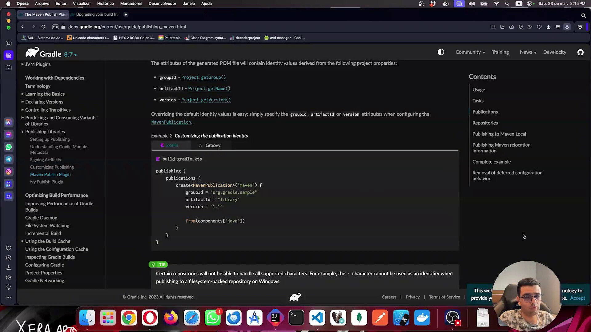
</p>

A imagem mostra a documentação oficial do Gradle (`docs.gradle.org`), na seção **The Maven Publish Plugin**. Nela é exibido um exemplo em Kotlin DSL (`build.gradle.kts`) de como configurar a identidade de uma publicação Maven. O bloco de código apresentado é:

```kotlin
publishing {
    publications {
        create<MavenPublication>("maven") {
            groupId = "org.gradle.sample"
            artifactId = "library"
            version = "1.1"

            from(components["java"])
        }
    }
}
```

Esse exemplo ilustra exatamente a estrutura que precisa ser adicionada ao arquivo `build.gradle` do projeto para configurar o plugin **Maven Publish**: um bloco `publishing`, contendo `publications`, onde é criada uma `MavenPublication` (aqui chamada `maven`) e associada ao componente `java` através do método `from(components["java"])`.

<p align="center">
  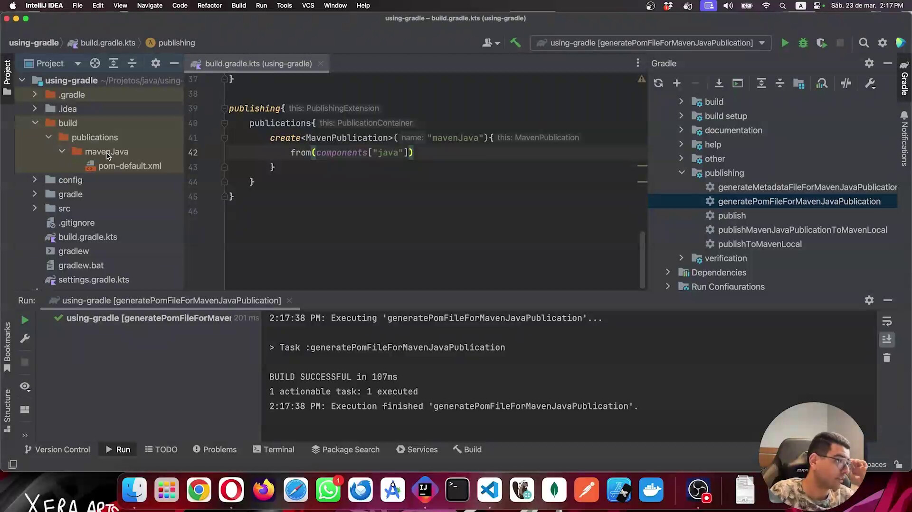
</p>

Aqui a configuração já foi aplicada no projeto real, dentro do IntelliJ IDEA, no arquivo `build.gradle.kts`:

```kotlin
publishing {
    publications {
        create<MavenPublication>(name: "mavenJava") {
            from(components["java"])
        }
    }
}
```

No painel lateral do Gradle, é possível ver a tarefa **generatePomFileForMavenJavaPublication** sendo executada com sucesso (`BUILD SUCCESSFUL`). No painel de projeto, à esquerda, nota-se que a pasta `build` foi criada contendo `publications/mavenJava/pom-default.xml`, ou seja, o Gradle gerou automaticamente um arquivo POM a partir da publicação configurada.

<p align="center">
  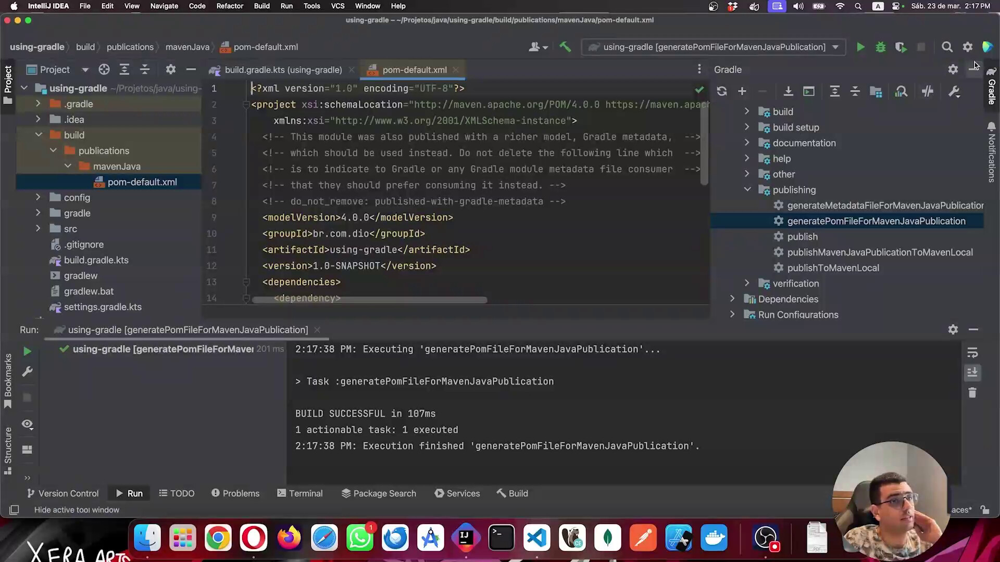
</p>

Nesta imagem, o arquivo `pom-default.xml`, gerado dentro de `build/publications/mavenJava`, está aberto no editor. Seu conteúdo inicial é:

```xml
<?xml version="1.0" encoding="UTF-8"?>
<project xsi:schemaLocation="http://maven.apache.org/POM/4.0.0 https://maven.apache..."
    xmlns:xsi="http://www.w3.org/2001/XMLSchema-instance">

  <!-- This module was also published with a richer model, Gradle metadata, -->
  <!-- which should be used instead. Do not delete the following line which -->
  <!-- is to indicate to Gradle or any Gradle module metadata consumer      -->
  <!-- that they should prefer consuming it instead.                       -->
  <!-- do_not_remove: published-with-gradle-metadata -->

  <modelVersion>4.0.0</modelVersion>
  <groupId>br.com.dio</groupId>
  <artifactId>using-gradle</artifactId>
  <version>1.0-SNAPSHOT</version>
  <dependencies>
    <dependency>
```

O arquivo contém comentários automáticos informando que o módulo também foi publicado com metadados mais completos do Gradle e que essa referência não deve ser removida. Logo em seguida aparecem os dados de identidade do projeto (`groupId`, `artifactId`, `version`) e o início da lista de `dependencies`, que corresponde às dependências de implementação do projeto.

<p align="center">
  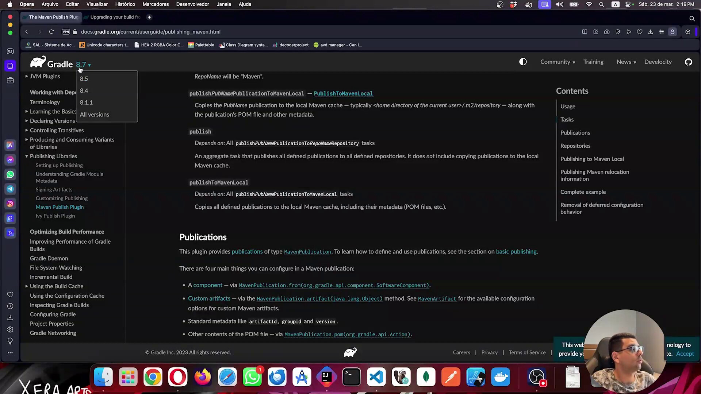
</p>

A imagem mostra novamente a documentação do Gradle, com o seletor de versão aberto no canto superior esquerdo, exibindo as opções **8.7**, **8.5**, **8.4** e **8.1.1**, além do link para "All versions". Abaixo, a página continua explicando as tarefas de publicação (`publish`, `publishToMavenLocal`) e a seção **Publications**, que descreve os quatro elementos configuráveis de uma publicação Maven: componente, artefatos customizados, metadados padrão (`artifactId`, `groupId`, `version`) e conteúdos adicionais do POM.

<p align="center">
  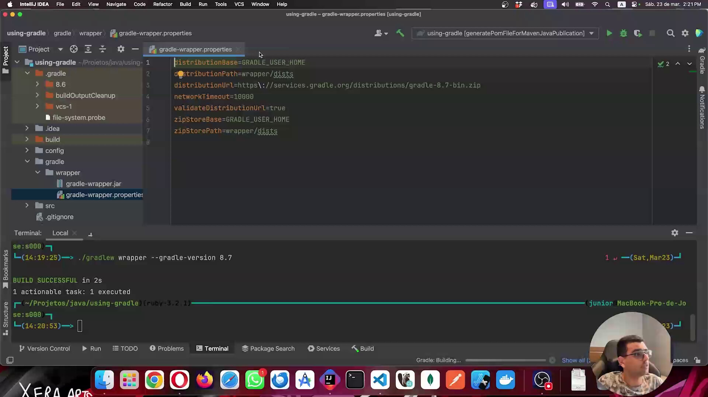
</p>

Nesta imagem, o arquivo `gradle-wrapper.properties` está aberto, já atualizado:

```properties
distributionBase=GRADLE_USER_HOME
distributionPath=wrapper/dists
distributionUrl=https\://services.gradle.org/distributions/gradle-8.7-bin.zip
networkTimeout=10000
validateDistributionUrl=true
zipStoreBase=GRADLE_USER_HOME
zipStorePath=wrapper/dists
```

No terminal, abaixo, é executado o comando de atualização do wrapper:

```bash
./gradlew wrapper --gradle-version 8.7
```

O resultado exibido é `BUILD SUCCESSFUL in 2s`, confirmando que o wrapper do projeto foi atualizado da versão 8.6 para a versão 8.7 do Gradle, refletindo a nova `distributionUrl` apontando para `gradle-8.7-bin.zip`.

<p align="center">
  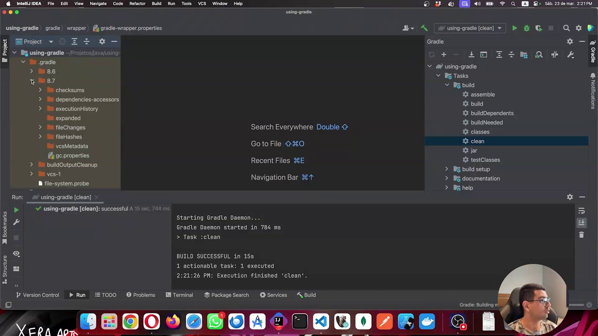
</p>

No painel de projeto do IntelliJ IDEA, dentro da pasta oculta `.gradle`, agora aparecem duas subpastas: **8.6** (a versão anterior) e **8.7** (a versão recém-baixada pelo wrapper), esta última já expandida mostrando diretórios internos como `checksums`, `dependencies-accessors`, `executionHistory`, `expanded`, `fileChanges`, `fileHashes` e `vcsMetadata`. No painel do Gradle, à direita, é selecionada a tarefa **clean**, e no console de execução aparece a saída:

```
Starting Gradle Daemon...
Gradle Daemon started in 784 ms
> Task :clean

BUILD SUCCESSFUL in 15s
1 actionable task: 1 executed
```

Isso confirma que a nova versão 8.7 do Gradle já está instalada e operante no ambiente local, sendo utilizada para executar as tarefas do projeto, enquanto a pasta da versão 8.6 permanece disponível para ser removida manualmente, já que não é rastreada pelo controle de versão.
      


##  Materiais de Apoio

# Certificado: 

- Link na plataforma: 
- Certificado em pdf: