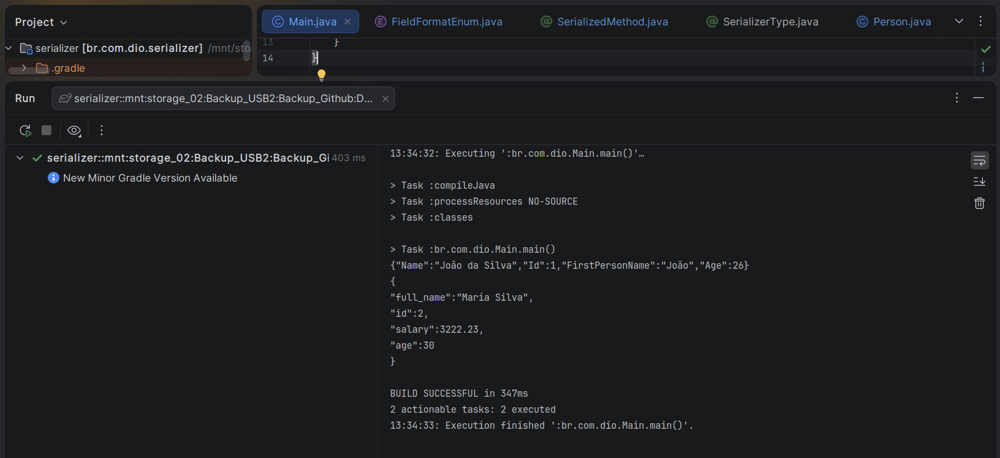

## Instrutor

- José Luiz Abreu Cardoso Junior (Engenheiro de software sênior)
- Contato Linkedin: / [juniorjrjl](https://www.linkedin.com/in/juniorjrjl/)

## Parte 1 - Introdução às Annotations em Runtime

### 🟩 Vídeo 01 - Introdução a Annotations em runtime

<video width="60%" controls>
  <source src="000-Midia_e_Anexos/bootcamp_ntt_data_java_spring_ai-modulo.03-curso.04-video_01.webm" type="video/webm">
    Seu navegador não suporta vídeo HTML5.
</video>

link do vídeo: https://web.dio.me/track/ntt-data-2026-ai-java-back-end/course/annotations-em-java-marcando-o-seu-codigo-de-maneira-inteligente/learning/24ed8e31-d0c0-44d5-b28a-2629ec6c80a4?autoplay=1

### Anotações

O código abaixo mostra o arquivo `build.gradle` do projeto Serializer já ajustado para a aula. O bloco `plugins` habilita o plugin `java`, e são definidos o `group` (`br.com.dio`) e a `version` (`1.0-SNAPSHOT`) do projeto. Em `repositories`, o Maven Central é configurado como fonte de dependências. Por fim, o bloco `dependencies` adiciona a biblioteca Guava, que será utilizada mais adiante para auxiliar na formatação dos nomes de campos.

```groovy
plugins {
    id("java")
}

group = "br.com.dio"
version = "1.0-SNAPSHOT"

repositories {
    mavenCentral()
}

dependencies {
    implementation("com.google.guava:guava:33.0.0-jre")
}
```

Aqui é apresentado o enum `FieldFormatEnum`, criado dentro do pacote `br.com.dio.annotation`. Cada constante do enum (`CAMEL_CASE`, `PASCAL_CASE`, `SNAKE_CASE`, `KEBAB_CASE`) recebe uma expressão lambda associada, do tipo `Function<String, String>`, responsável por converter um nome de campo para o padrão de escrita correspondente. Essas conversões utilizam o utilitário `CaseFormat` da biblioteca Guava, importado estaticamente no início do arquivo. O método `format(String field)` aplica a função definida na constante escolhida, retornando o campo já formatado.

```java
package br.com.dio.annotation;
import com.google.common.base.CaseFormat;
import java.util.function.Function;

import static com.google.common.base.CaseFormat.*;

public enum FieldFormatEnum {

    CAMEL_CASE(field -> field),
    PASCAL_CASE(field -> LOWER_CAMEL.to(UPPER_CAMEL, field)),
    SNAKE_CASE(field -> LOWER_CAMEL.to(LOWER_UNDERSCORE, field)),
    KEBAB_CASE(field -> LOWER_CAMEL.to(LOWER_HYPHEN, field));

    private final Function<String, String> format;

    FieldFormatEnum(final Function<String, String> format) {
        this.format = format;
    }

    public String format(String field) {
        return format.apply(field);
    }
}
```

O código seguinte traz a segunda anotação criada na aula, `SerializedMethod`, também no pacote `br.com.dio.annotation`. Ela utiliza `@Retention(RUNTIME)`, para que fique disponível em tempo de execução, e `@Target(METHOD)`, restringindo seu uso apenas a métodos. A anotação define uma propriedade `value` do tipo `String`, com valor padrão vazio (`""`), permitindo que o desenvolvedor informe um nome customizado para a propriedade que será gerada no JSON a partir do retorno de um método.

```java
package br.com.dio.annotation;

import java.lang.annotation.Retention;
import java.lang.annotation.Target;

import static java.lang.annotation.ElementType.METHOD;
import static java.lang.annotation.RetentionPolicy.RUNTIME;

@Retention(RUNTIME)
@Target(METHOD)
public @interface SerializedMethod {
    String value() default "";
}
```

Abaixo é exibida a anotação principal do projeto, `SerializerType`. Assim como a anotação anterior, ela usa `@Retention(RUNTIME)`, mas com `@Target(TYPE)`, o que indica que só pode ser aplicada em classes, interfaces, enums ou records. Ela define duas propriedades opcionais: `fieldFormat`, do tipo `FieldFormatEnum`, com valor padrão `CAMEL_CASE`, indicando o padrão de formatação dos campos ao gerar o JSON; e `prettify`, um `boolean` com valor padrão `true`, que define se o JSON gerado será formatado (identado) ou não. Por terem valores padrão, essas propriedades não obrigam quem for usar a anotação a defini-las explicitamente.

```java
package br.com.dio.annotation;

import java.lang.annotation.Retention;
import java.lang.annotation.Target;

import static br.com.dio.annotation.FieldFormatEnum.CAMEL_CASE;
import static java.lang.annotation.ElementType.TYPE;
import static java.lang.annotation.RetentionPolicy.RUNTIME;

@Retention(RUNTIME)
@Target(TYPE)
public @interface SerializerType {
    FieldFormatEnum fieldFormat() default CAMEL_CASE;

    boolean prettify() default true;
}
```

O código seguinte mostra a classe modelo `Person`, criada no pacote `br.com.dio.model`. A classe é anotada com `@SerializerType(fieldFormat = KEBAB_CASE, prettify = false)`, definindo explicitamente que o JSON gerado a partir dela usará o formato kebab-case e não será formatado (prettify desativado). A classe possui os atributos `id`, `name` e `age`, com construtores (vazio e completo) e os respectivos getters e setters. Ela também define o método `firstName()`, anotado com `@SerializedMethod("firstPersonName")`, que retorna apenas o primeiro nome extraído do campo `name` (usando `split(" ")[0]`) — esse método será serializado no JSON com o nome customizado `firstPersonName`, em vez do nome padrão do método.

```java
package br.com.dio.model;

import br.com.dio.annotation.SerializedMethod;
import br.com.dio.annotation.SerializerType;

import static br.com.dio.annotation.FieldFormatEnum.KEBAB_CASE;

@SerializerType(fieldFormat = KEBAB_CASE, prettify = false)
public class Person {

    private long id;

    private String name;

    private int age;

    public Person() {
    }

    public Person(final long id, final String name, final int age) {
        this.id = id;
        this.name = name;
        this.age = age;
    }

    public long getId() {
        return id;
    }

    public void setId(long id) {
        this.id = id;
    }

    public String getName() {
        return name;
    }

    public void setName(String name) {
        this.name = name;
    }

    public int getAge() {
        return age;
    }

    public void setAge(int age) {
        this.age = age;
    }

    @SerializedMethod("firstPersonName")
    public String firstName() {
        return name.split(" ")[0];
    }
}
```

A seguir o segundo modelo do projeto, `User`, implementado como um `record` no pacote `br.com.dio.model`. Diferentemente da classe `Person`, aqui a anotação `@SerializerType` é usada sem nenhum parâmetro customizado, ou seja, assumirá os valores padrão definidos na anotação (formato camel-case e JSON formatado). O record possui os componentes `id` (long), `fullName` (String), `age` (int) e `salary` (double), que serão utilizados como exemplo de uma estrutura mais simples e totalmente baseada nas configurações padrão.

```java
package br.com.dio.model;

import br.com.dio.annotation.SerializerType;

@SerializerType
public record User(
        long id,
        String fullName,
        int age,
        double salary
) { }
```

Por fim, temos a classe `Main`, criada no pacote raiz `br.com.dio`, contendo apenas o método `main` vazio. Essa classe serve como ponto de entrada da aplicação, onde futuramente será feito o processamento das anotações criadas para gerar o JSON a partir dos modelos `Person` e `User`.

```java
package br.com.dio;

public class Main {
    public static void main(String[] args) {

    }
}
```

### 1. Explicação geral

Annotations (anotações) em Java são **metadados** que você anexa a classes, métodos, campos, parâmetros etc. Elas **não mudam o comportamento do código por si só** — uma anotação sozinha, como `@SerializerType`, não faz nada acontecer magicamente. Ela apenas "marca" um elemento do código com uma informação extra, que **alguma outra coisa** (o compilador, uma ferramenta, ou o próprio programa em tempo de execução) vai ler e interpretar depois.

Pense nelas como **etiquetas adesivas**: você cola a etiqueta "frágil" numa caixa, mas quem realmente toma cuidado ao manusear a caixa é a transportadora que lê a etiqueta — a etiqueta em si não protege nada sozinha.

#### Para que essas "etiquetas" servem na prática?

- **Documentar/gerar código automaticamente**: ex. `@Override`, `@Entity` (JPA), `@GetMapping` (Spring).
- **Validar em tempo de compilação**: o compilador usa a anotação para checar algo (ex. `@Override` avisa erro se o método não sobrescreve nada).
- **Configurar comportamento de frameworks**: Spring, Hibernate, JUnit etc. leem anotações para saber como injetar dependências, mapear tabelas, rodar testes...
- **Gerar/transformar código em tempo de compilação**: os *Annotation Processors* (tema da Parte 2 da aula) leem anotações durante a compilação e podem gerar novos arquivos `.java` automaticamente (é assim, por exemplo, que o Lombok gera getters/setters).
- **Ler metadados em tempo de execução (Reflection)**: com `@Retention(RUNTIME)`, a anotação continua disponível depois de compilado, e o programa pode usar a API de *Reflection* para perguntar "essa classe tem essa anotação? quais valores ela tem?" e agir de acordo.

#### Peças-chave para entender uma anotação

1. **`@Retention`** — até quando a anotação "sobrevive":
   - `SOURCE`: só existe no código-fonte, some na compilação.
   - `CLASS`: vai para o `.class`, mas não é visível em runtime (padrão).
   - `RUNTIME`: continua disponível para ser lida via Reflection enquanto o programa roda. **É o tipo usado neste projeto.**
2. **`@Target`** — em que tipo de elemento a anotação pode ser usada (`TYPE` = classe/interface/enum/record, `METHOD` = método, `FIELD` = campo etc.).
3. **Elementos da anotação** (ex. `value()`, `fieldFormat()`) — são como "parâmetros" que quem usa a anotação pode preencher, geralmente com valores padrão (`default`) para tornar o uso opcional.

### 2. O que está sendo feito especificamente nesta aula

O projeto do curso é um **serializador de objetos para JSON feito na mão**, guiado por anotações. A ideia final (que será completada no `Main`, usando Reflection — assunto da Parte 2) é: dado um objeto qualquer (`Person`, `User`...), o programa vai **ler as anotações da classe** e decidir *como* gerar o JSON correspondente, sem precisar de biblioteca pronta (tipo Jackson/Gson).

Vamos por peça:

#### `FieldFormatEnum`
Não é uma anotação, é um **enum auxiliar** que define os estilos de nomenclatura possíveis para os campos no JSON final: `CAMEL_CASE`, `PASCAL_CASE`, `SNAKE_CASE`, `KEBAB_CASE`. Cada constante carrega uma função (`Function<String,String>`) que sabe converter um nome de campo de `camelCase` (padrão Java) para o estilo escolhido, usando o utilitário `CaseFormat` da Guava. Esse enum será usado *como valor* dentro da anotação `SerializerType`.

#### `@SerializedMethod`
- `@Retention(RUNTIME)` + `@Target(METHOD)`.
- Serve para marcar **métodos que devem ser incluídos no JSON** mesmo não sendo um getter convencional (no exemplo, `firstName()`), permitindo dar um **nome customizado** (`value`) para a propriedade gerada — no caso, `firstPersonName`.
- Sem essa anotação, o futuro processo de serialização (via Reflection) não teria como saber que aquele método deveria virar um campo no JSON, nem qual nome usar.

#### `@SerializerType`
- `@Retention(RUNTIME)` + `@Target(TYPE)` → só pode ser colocada em cima de classes/records/enums/interfaces.
- É a anotação "principal": configura **como aquela classe inteira deve ser serializada**:
  - `fieldFormat`: qual `FieldFormatEnum` usar para os nomes dos campos (padrão `CAMEL_CASE`).
  - `prettify`: se o JSON deve sair identado/formatado (padrão `true`).
- Como os dois parâmetros têm valor padrão, quem usa a anotação pode omitir tudo (como em `User`) e o comportamento padrão será aplicado.

#### `Person`
Usa `@SerializerType(fieldFormat = KEBAB_CASE, prettify = false)` — está dizendo explicitamente: "quando me serializar, use `kebab-case` nos nomes dos campos e não formate o JSON". Além disso, o método `firstName()` é anotado com `@SerializedMethod("firstPersonName")`, pedindo para aparecer no JSON com esse nome customizado, mesmo não sendo um getter tradicional.

#### `User`
Usa `@SerializerType` "pura", sem parâmetros — vai herdar os valores padrão da anotação (`camelCase` + JSON formatado). Serve como exemplo do caminho mais simples, contrastando com a customização feita em `Person`.

#### `Main`
Ainda vazio — é onde, futuramente (usando **Reflection**, com `Class.getAnnotation(...)`, `getDeclaredFields()`, `getDeclaredMethods()` etc.), o código vai:
1. Pegar a classe do objeto (`Person` ou `User`).
2. Ler a anotação `@SerializerType` dela para saber o formato dos campos e se deve "prettificar".
3. Percorrer campos e métodos anotados com `@SerializedMethod` para montar o JSON.
4. Aplicar a formatação de nomes (via `FieldFormatEnum`) e a formatação de saída.

Ou seja: **as anotações aqui não fazem nada sozinhas** — elas são a "receita"/configuração que o código de `Main` (ainda a ser escrito) vai ler via Reflection para decidir como transformar um objeto Java em uma `String` JSON.

### 3. Resuno de Fluxo 

As três anotações/enum são apenas **definições de metadados**. Elas são "coladas" nas classes `Person` e `User` para descrever *como* cada uma quer ser serializada. Só quando o código em `Main` (próxima etapa do curso, usando Reflection) **ler** essas anotações em tempo de execução é que elas passam a ter efeito real, guiando a geração do JSON final.


### 🟩 Vídeo 02 - Explorando Annotations em runtime

<video width="60%" controls>
  <source src="000-Midia_e_Anexos/bootcamp_ntt_data_java_spring_ai-modulo.03-curso.04-video_02.webm" type="video/webm">
    Seu navegador não suporta vídeo HTML5.
</video>

link do vídeo: https://web.dio.me/track/ntt-data-2026-ai-java-back-end/course/annotations-em-java-marcando-o-seu-codigo-de-maneira-inteligente/learning/6866303d-13cb-4ebb-ae8d-742b920c96b2?autoplay=1

### Anotações

#### FieldFormatEnum — formatos de nomenclatura de campos

```java
package br.com.dio.annotation;
import java.util.function.Function;
import static com.google.common.base.CaseFormat.*;

public enum FieldFormatEnum {

    CAMEL_CASE(field -> field),
    PASCAL_CASE(field -> LOWER_CAMEL.to(UPPER_CAMEL, field)),
    SNAKE_CASE(field -> LOWER_CAMEL.to(LOWER_UNDERSCORE, field)),
    KEBAB_CASE(field -> LOWER_CAMEL.to(LOWER_HYPHEN, field));

    private final Function<String, String> format;

    FieldFormatEnum(final Function<String, String> format) {
        this.format = format;
    }

    public Function<String, String> getFormat() { return format; }
}
```

O enum `FieldFormatEnum` define as opções de nomenclatura que os campos podem receber ao serem serializados em JSON: `CAMEL_CASE`, `PASCAL_CASE`, `SNAKE_CASE` e `KEBAB_CASE`. Cada constante recebe no construtor uma `Function<String, String>`, e a conversão entre os formatos é feita com a classe `CaseFormat` da biblioteca Guava, partindo sempre de `LOWER_CAMEL` (o padrão usado nos nomes de campo em Java) para o formato desejado.

#### SerializedMethod — anotação para métodos

```java
package br.com.dio.annotation;

import java.lang.annotation.Retention;
import java.lang.annotation.Target;
import static java.lang.annotation.ElementType.METHOD;
import static java.lang.annotation.RetentionPolicy.RUNTIME;

@Retention(RUNTIME)
@Target(METHOD)
public @interface SerializedMethod {
    String value() default "";
}
```

`SerializedMethod` é uma anotação de método, com retenção em tempo de execução (`RUNTIME`), o que permite que ela seja lida via reflection. Seu atributo `value` é opcional e serve para definir um nome customizado que a propriedade terá no JSON gerado, no lugar do nome padrão do método.

#### SerializerType — anotação para classes

```java
package br.com.dio.annotation;

import java.lang.annotation.Retention;
import java.lang.annotation.Target;

import static br.com.dio.annotation.FieldFormatEnum.CAMEL_CASE;
import static java.lang.annotation.ElementType.TYPE;
import static java.lang.annotation.RetentionPolicy.RUNTIME;

@Retention(RUNTIME)
@Target(TYPE)
public @interface SerializerType {
    FieldFormatEnum fieldFormat() default CAMEL_CASE;

    boolean prettify() default true;
}
```

`SerializerType` é a anotação aplicada na classe (ou record) que será serializada. Ela concentra duas configurações: `fieldFormat`, que indica qual das opções de `FieldFormatEnum` deve ser usada na formatação dos nomes de campo (com `CAMEL_CASE` como padrão), e `prettify`, que controla se o JSON de saída será formatado com indentação e quebras de linha ou compactado em uma única linha.

#### Person — modelo anotado com PascalCase

```java
package br.com.dio.model;

import br.com.dio.annotation.SerializedMethod;
import br.com.dio.annotation.SerializerType;

import static br.com.dio.annotation.FieldFormatEnum.PASCAL_CASE;

@SerializerType(fieldFormat = PASCAL_CASE, prettify = false)
public class Person {

    private long id;

    private String name;

    private int age;

    public Person() {
    }

    public Person(final long id, final String name, final int age) {
        this.id = id;
        this.name = name;
        this.age = age;
    }

    public long getId() {
        return id;
    }

    public void setId(long id) {
        this.id = id;
    }

    public String getName() {
        return name;
    }

    public void setName(String name) {
        this.name = name;
    }

    public int getAge() {
        return age;
    }

    public void setAge(int age) {
        this.age = age;
    }

    @SerializedMethod("firstPersonName")
    public String firstName() {
        return name.split(" ")[0];
    }
}
```

A classe `Person` é anotada com `@SerializerType(fieldFormat = PASCAL_CASE, prettify = false)`, ou seja, ao ser serializada seus campos aparecerão em PascalCase e o JSON resultante não será formatado com indentação. Além dos campos `id`, `name` e `age` com seus respectivos getters e setters, a classe possui o método `firstName()`, anotado com `@SerializedMethod("firstPersonName")`, que extrai apenas o primeiro nome a partir do campo `name` e será incluído no JSON sob a chave customizada `firstPersonName`.

#### User — record anotado com snake_case

```java
package br.com.dio.model;

import br.com.dio.annotation.SerializerType;
import static br.com.dio.annotation.FieldFormatEnum.SNAKE_CASE;

@SerializerType(fieldFormat = SNAKE_CASE)

public record User(
        long id,
        String fullName,
        int age,
        double salary
) { }
```

`User` é um record anotado com `@SerializerType(fieldFormat = SNAKE_CASE)`, mantendo o valor padrão de `prettify` (verdadeiro). Seus componentes `id`, `fullName`, `age` e `salary` serão convertidos para snake_case no momento da serialização, servindo como um segundo caso de teste, distinto do `Person`, para validar o processador de anotações com um formato de nomenclatura diferente e com uma classe declarada como record.

#### SerializerProcessor — construção do método de serialização

```java
package br.com.dio.processor;

import br.com.dio.annotation.SerializedMethod;
import br.com.dio.annotation.SerializerType;

import java.lang.reflect.InvocationTargetException;
import java.util.HashMap;
import java.util.Map;
import java.util.NoSuchElementException;
import java.util.Objects;
import java.util.stream.Stream;

import static java.util.stream.Collectors.joining;

public class SerializerProcessor {

    public String serializer(final Object object) throws IllegalAccessException, InvocationTargetException {
        Objects.requireNonNull(object, "Enter with non null object");

        var clazz = object.getClass();
        var typeAnnotation = Stream.of(clazz.getAnnotations())
                .flatMap(a -> (a instanceof SerializerType s) ? Stream.of(s) : Stream.empty())
                .findFirst()
                .orElseThrow(() -> new NoSuchElementException(
                        "For serialize object annotate it with @SerializerType"));

        var fieldNameFormatter = typeAnnotation.fieldFormat().getFormat();
        var prettify = typeAnnotation.prettify();

        Map<String, Object> elements = new HashMap<>();
        for (var field : clazz.getDeclaredFields()) {
            field.setAccessible(true);
            elements.put(field.getName(), field.get(object));
        }

        var annotatedMethods = Stream.of(object.getClass().getMethods())
                .filter(m -> Stream.of(m.getAnnotations())
                        .anyMatch(a -> a.annotationType().equals(SerializedMethod.class)))
                .toList(); // ou .collect(Collectors.toList()) se versão < 16

        for (var method : annotatedMethods) {
            method.setAccessible(true);
            String customName = method.getAnnotation(SerializedMethod.class).value();
            elements.put(customName.isBlank() ? method.getName() : customName, method.invoke(object));
        }

        var jsonFields = elements.entrySet().stream()
                .map(e -> String.format(
                        "\"%s\":%s",
                        fieldNameFormatter.apply(e.getKey()),
                        formatValue(e.getValue())
                ))
                .collect(joining(String.format(",%s", System.lineSeparator())));

        var json = String.format(
                "{%s%s%s}",
                System.lineSeparator(),
                jsonFields,
                System.lineSeparator()
        );

        return prettify ?
                json :
                json.replaceAll(System.lineSeparator(), "")
                        .replaceAll("    ", "");
    }

    private String formatValue(final Object value) {
        return value instanceof String s ?
                String.format("\"%s\"", s) :
                value.toString();
    }
}
```

Esse é o núcleo da aula: a classe `SerializerProcessor` implementa o método `serializer`, responsável por transformar um objeto qualquer em uma string JSON usando reflection. Primeiro, `Objects.requireNonNull` garante que o objeto recebido não é nulo. Em seguida, `object.getClass()` obtém a classe do objeto e o código busca, entre as anotações da classe, aquela do tipo `SerializerType` — usando `flatMap` combinado com `instanceof` para já obter a anotação no tipo correto, sem precisar de cast explícito, e lançando uma exceção caso a classe não esteja anotada. A partir da anotação, são extraídos o formatador de nomes de campo (`fieldNameFormatter`) e a flag `prettify`.

Depois, o método percorre `clazz.getDeclaredFields()`, tornando cada campo acessível com `setAccessible(true)` e armazenando nome e valor em um `Map<String, Object>` chamado `elements`. Em seguida, o mesmo mapa é complementado com os métodos anotados com `@SerializedMethod`: eles são filtrados a partir de `getMethods()`, e para cada um é obtido o nome customizado definido na anotação (ou o nome padrão do método, caso o valor esteja em branco) e o resultado de sua invocação via `method.invoke(object)`.

Com o mapa completo, os campos são transformados em uma stream, mapeados para o formato `"chave":valor` — aplicando o formatador de nomes e um método auxiliar `formatValue` que coloca aspas em valores do tipo `String` e apenas chama `toString()` para os demais tipos — e unidos com `joining`, separando cada entrada por vírgula e quebra de linha. Por fim, o JSON é montado entre chaves e, se `prettify` for falso, as quebras de linha e a indentação são removidas com `replaceAll`.

#### Main — execução e teste do serializador

```java
package br.com.dio;

import br.com.dio.model.Person;
import br.com.dio.model.User;
import br.com.dio.processor.SerializerProcessor;
import java.lang.reflect.InvocationTargetException;

public class Main {
    public static void main(String[] args) throws InvocationTargetException, IllegalAccessException {
        var processor = new SerializerProcessor();
        System.out.println(processor.serializer(new Person(1, "João da Silva", 26)));
        System.out.println(processor.serializer(new User(2, "Maria Silva", 30, 3222.23)));
    }
}
```

Na classe `Main`, um `SerializerProcessor` é instanciado e usado para serializar um `Person` e um `User`, imprimindo o resultado de cada chamada com `System.out.println`. Como o método `serializer` propaga as exceções de reflection (`InvocationTargetException` e `IllegalAccessException`), o `main` apenas as declara em sua assinatura, sem tratá-las, já que o foco da aula é o funcionamento das anotações e não o tratamento de erros.

#### Resultado da execução

<p align="center">
  
</p>

```
{"Name":"João da Silva","Id":1,"FirstPersonName":"João","Age":26}
{
"full_name":"Maria Silva",
"id":2,
"salary":3222.23,
"age":30
}
```

A execução do `Main` confirma o comportamento configurado em cada anotação: o `Person`, anotado com `PASCAL_CASE` e `prettify = false`, gera um JSON compactado com os campos em PascalCase, incluindo `FirstPersonName` obtido do método anotado com `@SerializedMethod`. Já o `User`, anotado com `SNAKE_CASE` e `prettify` no valor padrão (verdadeiro), gera um JSON formatado com indentação e os campos em snake_case, como `full_name`. O painel de execução mostra ainda que o build foi concluído com sucesso (`BUILD SUCCESSFUL`), validando que o processador de anotações funciona corretamente para os dois formatos testados.

Se você quiser aprofundar e entender em detalhes tudo o que foi construído nesta aula — desde o conceito de anotações customizadas e reflection até a explicação linha a linha de cada arquivo Java (`FieldFormatEnum`, `SerializedMethod`, `SerializerType`, `Person`, `User`, `SerializerProcessor` e `Main`) — preparei um tutorial completo, pensado para quem está vendo esses conceitos pela primeira vez. Nele você encontra a visão geral do projeto, a explicação de cada bloco de código e o passo a passo completo de como um objeto é transformado em JSON usando anotações. 

### Confira o tutorial detalhado aqui --> [Tutorial: Criando um Serializador de JSON com Anotações Customizadas em Java](000-Midia_e_Anexos/tutorial_annotations_java.md)


## Parte 2 - Explorando Annotation Processors

### 🟩 Vídeo 03 - Introdução a Annotation Processor

<video width="60%" controls>
  <source src="000-Midia_e_Anexos/bootcamp_ntt_data_java_spring_ai-modulo.03-curso.03-video_04.webm" type="video/webm">
    Seu navegador não suporta vídeo HTML5.
</video>

link do vídeo: https://web.dio.me/track/ntt-data-2026-ai-java-back-end/course/annotations-em-java-marcando-o-seu-codigo-de-maneira-inteligente/learning/66dde68f-f31a-4937-9a97-cc7d005cb892?autoplay=1

### 🟩 Vídeo 04 - Explorando Annotation Processor

<video width="60%" controls>
  <source src="000-Midia_e_Anexos/bootcamp_ntt_data_java_spring_ai-modulo.03-curso.04-video_04.webm" type="video/webm">
    Seu navegador não suporta vídeo HTML5.
</video>

link do vídeo: 

##  Materiais de Apoio

# Certificado: 

- Link na plataforma: 
- Certificado em pdf: