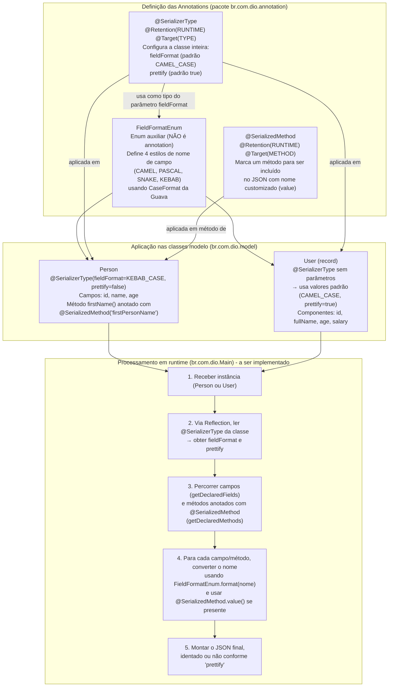

## Instrutor

- José Luiz Abreu Cardoso Junior (Engenheiro de software sênior)
- Contato Linkedin: / [juniorjrjl](https://www.linkedin.com/in/juniorjrjl/)

## Parte 1 - Introdução às Annotations em Runtime

### 🟩 Vídeo 01 - Introdução a Annotations em runtime

<video width="60%" controls>
  <source src="000-Midia_e_Anexos/bootcamp_ntt_data_java_spring_ai-modulo.03-curso.04-video_01.webm" type="video/webm">
    Seu navegador não suporta vídeo HTML5.
</video>

link do vídeo: https://web.dio.me/track/ntt-data-2026-ai-java-back-end/course/annotations-em-java-marcando-o-seu-codigo-de-maneira-inteligente/learning/24ed8e31-d0c0-44d5-b28a-2629ec6c80a4?autoplay=1

### Anotações

O código abaixo mostra o arquivo `build.gradle` do projeto Serializer já ajustado para a aula. O bloco `plugins` habilita o plugin `java`, e são definidos o `group` (`br.com.dio`) e a `version` (`1.0-SNAPSHOT`) do projeto. Em `repositories`, o Maven Central é configurado como fonte de dependências. Por fim, o bloco `dependencies` adiciona a biblioteca Guava, que será utilizada mais adiante para auxiliar na formatação dos nomes de campos.

```groovy
plugins {
    id("java")
}

group = "br.com.dio"
version = "1.0-SNAPSHOT"

repositories {
    mavenCentral()
}

dependencies {
    implementation("com.google.guava:guava:33.0.0-jre")
}
```

Aqui é apresentado o enum `FieldFormatEnum`, criado dentro do pacote `br.com.dio.annotation`. Cada constante do enum (`CAMEL_CASE`, `PASCAL_CASE`, `SNAKE_CASE`, `KEBAB_CASE`) recebe uma expressão lambda associada, do tipo `Function<String, String>`, responsável por converter um nome de campo para o padrão de escrita correspondente. Essas conversões utilizam o utilitário `CaseFormat` da biblioteca Guava, importado estaticamente no início do arquivo. O método `format(String field)` aplica a função definida na constante escolhida, retornando o campo já formatado.

```java
package br.com.dio.annotation;
import com.google.common.base.CaseFormat;
import java.util.function.Function;

import static com.google.common.base.CaseFormat.*;

public enum FieldFormatEnum {

    CAMEL_CASE(field -> field),
    PASCAL_CASE(field -> LOWER_CAMEL.to(UPPER_CAMEL, field)),
    SNAKE_CASE(field -> LOWER_CAMEL.to(LOWER_UNDERSCORE, field)),
    KEBAB_CASE(field -> LOWER_CAMEL.to(LOWER_HYPHEN, field));

    private final Function<String, String> format;

    FieldFormatEnum(final Function<String, String> format) {
        this.format = format;
    }

    public String format(String field) {
        return format.apply(field);
    }
}
```

O código seguinte traz a segunda anotação criada na aula, `SerializedMethod`, também no pacote `br.com.dio.annotation`. Ela utiliza `@Retention(RUNTIME)`, para que fique disponível em tempo de execução, e `@Target(METHOD)`, restringindo seu uso apenas a métodos. A anotação define uma propriedade `value` do tipo `String`, com valor padrão vazio (`""`), permitindo que o desenvolvedor informe um nome customizado para a propriedade que será gerada no JSON a partir do retorno de um método.

```java
package br.com.dio.annotation;

import java.lang.annotation.Retention;
import java.lang.annotation.Target;

import static java.lang.annotation.ElementType.METHOD;
import static java.lang.annotation.RetentionPolicy.RUNTIME;

@Retention(RUNTIME)
@Target(METHOD)
public @interface SerializedMethod {
    String value() default "";
}
```

Abaixo é exibida a anotação principal do projeto, `SerializerType`. Assim como a anotação anterior, ela usa `@Retention(RUNTIME)`, mas com `@Target(TYPE)`, o que indica que só pode ser aplicada em classes, interfaces, enums ou records. Ela define duas propriedades opcionais: `fieldFormat`, do tipo `FieldFormatEnum`, com valor padrão `CAMEL_CASE`, indicando o padrão de formatação dos campos ao gerar o JSON; e `prettify`, um `boolean` com valor padrão `true`, que define se o JSON gerado será formatado (identado) ou não. Por terem valores padrão, essas propriedades não obrigam quem for usar a anotação a defini-las explicitamente.

```java
package br.com.dio.annotation;

import java.lang.annotation.Retention;
import java.lang.annotation.Target;

import static br.com.dio.annotation.FieldFormatEnum.CAMEL_CASE;
import static java.lang.annotation.ElementType.TYPE;
import static java.lang.annotation.RetentionPolicy.RUNTIME;

@Retention(RUNTIME)
@Target(TYPE)
public @interface SerializerType {
    FieldFormatEnum fieldFormat() default CAMEL_CASE;

    boolean prettify() default true;
}
```

O código seguinte mostra a classe modelo `Person`, criada no pacote `br.com.dio.model`. A classe é anotada com `@SerializerType(fieldFormat = KEBAB_CASE, prettify = false)`, definindo explicitamente que o JSON gerado a partir dela usará o formato kebab-case e não será formatado (prettify desativado). A classe possui os atributos `id`, `name` e `age`, com construtores (vazio e completo) e os respectivos getters e setters. Ela também define o método `firstName()`, anotado com `@SerializedMethod("firstPersonName")`, que retorna apenas o primeiro nome extraído do campo `name` (usando `split(" ")[0]`) — esse método será serializado no JSON com o nome customizado `firstPersonName`, em vez do nome padrão do método.

```java
package br.com.dio.model;

import br.com.dio.annotation.SerializedMethod;
import br.com.dio.annotation.SerializerType;

import static br.com.dio.annotation.FieldFormatEnum.KEBAB_CASE;

@SerializerType(fieldFormat = KEBAB_CASE, prettify = false)
public class Person {

    private long id;

    private String name;

    private int age;

    public Person() {
    }

    public Person(final long id, final String name, final int age) {
        this.id = id;
        this.name = name;
        this.age = age;
    }

    public long getId() {
        return id;
    }

    public void setId(long id) {
        this.id = id;
    }

    public String getName() {
        return name;
    }

    public void setName(String name) {
        this.name = name;
    }

    public int getAge() {
        return age;
    }

    public void setAge(int age) {
        this.age = age;
    }

    @SerializedMethod("firstPersonName")
    public String firstName() {
        return name.split(" ")[0];
    }
}
```

A seguir o segundo modelo do projeto, `User`, implementado como um `record` no pacote `br.com.dio.model`. Diferentemente da classe `Person`, aqui a anotação `@SerializerType` é usada sem nenhum parâmetro customizado, ou seja, assumirá os valores padrão definidos na anotação (formato camel-case e JSON formatado). O record possui os componentes `id` (long), `fullName` (String), `age` (int) e `salary` (double), que serão utilizados como exemplo de uma estrutura mais simples e totalmente baseada nas configurações padrão.

```java
package br.com.dio.model;

import br.com.dio.annotation.SerializerType;

@SerializerType
public record User(
        long id,
        String fullName,
        int age,
        double salary
) { }
```

Por fim, temos a classe `Main`, criada no pacote raiz `br.com.dio`, contendo apenas o método `main` vazio. Essa classe serve como ponto de entrada da aplicação, onde futuramente será feito o processamento das anotações criadas para gerar o JSON a partir dos modelos `Person` e `User`.

```java
package br.com.dio;

public class Main {
    public static void main(String[] args) {

    }
}
```

# Para que servem as Annotations em Java?

## 1. Explicação geral

Annotations (anotações) em Java são **metadados** que você anexa a classes, métodos, campos, parâmetros etc. Elas **não mudam o comportamento do código por si só** — uma anotação sozinha, como `@SerializerType`, não faz nada acontecer magicamente. Ela apenas "marca" um elemento do código com uma informação extra, que **alguma outra coisa** (o compilador, uma ferramenta, ou o próprio programa em tempo de execução) vai ler e interpretar depois.

Pense nelas como **etiquetas adesivas**: você cola a etiqueta "frágil" numa caixa, mas quem realmente toma cuidado ao manusear a caixa é a transportadora que lê a etiqueta — a etiqueta em si não protege nada sozinha.

### Para que essas "etiquetas" servem na prática?

- **Documentar/gerar código automaticamente**: ex. `@Override`, `@Entity` (JPA), `@GetMapping` (Spring).
- **Validar em tempo de compilação**: o compilador usa a anotação para checar algo (ex. `@Override` avisa erro se o método não sobrescreve nada).
- **Configurar comportamento de frameworks**: Spring, Hibernate, JUnit etc. leem anotações para saber como injetar dependências, mapear tabelas, rodar testes...
- **Gerar/transformar código em tempo de compilação**: os *Annotation Processors* (tema da Parte 2 da aula) leem anotações durante a compilação e podem gerar novos arquivos `.java` automaticamente (é assim, por exemplo, que o Lombok gera getters/setters).
- **Ler metadados em tempo de execução (Reflection)**: com `@Retention(RUNTIME)`, a anotação continua disponível depois de compilado, e o programa pode usar a API de *Reflection* para perguntar "essa classe tem essa anotação? quais valores ela tem?" e agir de acordo.

### Peças-chave para entender uma anotação

1. **`@Retention`** — até quando a anotação "sobrevive":
   - `SOURCE`: só existe no código-fonte, some na compilação.
   - `CLASS`: vai para o `.class`, mas não é visível em runtime (padrão).
   - `RUNTIME`: continua disponível para ser lida via Reflection enquanto o programa roda. **É o tipo usado neste projeto.**
2. **`@Target`** — em que tipo de elemento a anotação pode ser usada (`TYPE` = classe/interface/enum/record, `METHOD` = método, `FIELD` = campo etc.).
3. **Elementos da anotação** (ex. `value()`, `fieldFormat()`) — são como "parâmetros" que quem usa a anotação pode preencher, geralmente com valores padrão (`default`) para tornar o uso opcional.

---

## 2. O que está sendo feito especificamente nesta aula

O projeto do curso é um **serializador de objetos para JSON feito na mão**, guiado por anotações. A ideia final (que será completada no `Main`, usando Reflection — assunto da Parte 2) é: dado um objeto qualquer (`Person`, `User`...), o programa vai **ler as anotações da classe** e decidir *como* gerar o JSON correspondente, sem precisar de biblioteca pronta (tipo Jackson/Gson).

Vamos por peça:

### `FieldFormatEnum`
Não é uma anotação, é um **enum auxiliar** que define os estilos de nomenclatura possíveis para os campos no JSON final: `CAMEL_CASE`, `PASCAL_CASE`, `SNAKE_CASE`, `KEBAB_CASE`. Cada constante carrega uma função (`Function<String,String>`) que sabe converter um nome de campo de `camelCase` (padrão Java) para o estilo escolhido, usando o utilitário `CaseFormat` da Guava. Esse enum será usado *como valor* dentro da anotação `SerializerType`.

### `@SerializedMethod`
- `@Retention(RUNTIME)` + `@Target(METHOD)`.
- Serve para marcar **métodos que devem ser incluídos no JSON** mesmo não sendo um getter convencional (no exemplo, `firstName()`), permitindo dar um **nome customizado** (`value`) para a propriedade gerada — no caso, `firstPersonName`.
- Sem essa anotação, o futuro processo de serialização (via Reflection) não teria como saber que aquele método deveria virar um campo no JSON, nem qual nome usar.

### `@SerializerType`
- `@Retention(RUNTIME)` + `@Target(TYPE)` → só pode ser colocada em cima de classes/records/enums/interfaces.
- É a anotação "principal": configura **como aquela classe inteira deve ser serializada**:
  - `fieldFormat`: qual `FieldFormatEnum` usar para os nomes dos campos (padrão `CAMEL_CASE`).
  - `prettify`: se o JSON deve sair identado/formatado (padrão `true`).
- Como os dois parâmetros têm valor padrão, quem usa a anotação pode omitir tudo (como em `User`) e o comportamento padrão será aplicado.

### `Person`
Usa `@SerializerType(fieldFormat = KEBAB_CASE, prettify = false)` — está dizendo explicitamente: "quando me serializar, use `kebab-case` nos nomes dos campos e não formate o JSON". Além disso, o método `firstName()` é anotado com `@SerializedMethod("firstPersonName")`, pedindo para aparecer no JSON com esse nome customizado, mesmo não sendo um getter tradicional.

### `User`
Usa `@SerializerType` "pura", sem parâmetros — vai herdar os valores padrão da anotação (`camelCase` + JSON formatado). Serve como exemplo do caminho mais simples, contrastando com a customização feita em `Person`.

### `Main`
Ainda vazio — é onde, futuramente (usando **Reflection**, com `Class.getAnnotation(...)`, `getDeclaredFields()`, `getDeclaredMethods()` etc.), o código vai:
1. Pegar a classe do objeto (`Person` ou `User`).
2. Ler a anotação `@SerializerType` dela para saber o formato dos campos e se deve "prettificar".
3. Percorrer campos e métodos anotados com `@SerializedMethod` para montar o JSON.
4. Aplicar a formatação de nomes (via `FieldFormatEnum`) e a formatação de saída.

Ou seja: **as anotações aqui não fazem nada sozinhas** — elas são a "receita"/configuração que o código de `Main` (ainda a ser escrito) vai ler via Reflection para decidir como transformar um objeto Java em uma `String` JSON.

---

## 3. Diagrama do fluxo completo



**Resumo do fluxo:** as três anotações/enum são apenas **definições de metadados**. Elas são "coladas" nas classes `Person` e `User` para descrever *como* cada uma quer ser serializada. Só quando o código em `Main` (próxima etapa do curso, usando Reflection) **ler** essas anotações em tempo de execução é que elas passam a ter efeito real, guiando a geração do JSON final.


### 🟩 Vídeo 02 - Explorando Annotations em runtime

<video width="60%" controls>
  <source src="000-Midia_e_Anexos/bootcamp_ntt_data_java_spring_ai-modulo.03-curso.04-video_02.webm" type="video/webm">
    Seu navegador não suporta vídeo HTML5.
</video>

link do vídeo: https://web.dio.me/track/ntt-data-2026-ai-java-back-end/course/annotations-em-java-marcando-o-seu-codigo-de-maneira-inteligente/learning/6866303d-13cb-4ebb-ae8d-742b920c96b2?autoplay=1


### 🟩 Vídeo 03 - Questionário: Introdução às Annotations em Runtime

<video width="60%" controls>
  <source src="000-Midia_e_Anexos/bootcamp_ntt_data_java_spring_ai-modulo.03-curso.04-video_03.webm" type="video/webm">
    Seu navegador não suporta vídeo HTML5.
</video>

link do vídeo: https://web.dio.me/track/ntt-data-2026-ai-java-back-end/course/annotations-em-java-marcando-o-seu-codigo-de-maneira-inteligente/learning/5414e2f1-1151-48d1-a95f-0ff04dd0dee6?autoplay=1

## Parte 2 - Explorando Annotation Processors

### 🟩 Vídeo 04 - Introdução a Annotation Processor

<video width="60%" controls>
  <source src="000-Midia_e_Anexos/bootcamp_ntt_data_java_spring_ai-modulo.03-curso.04-video_04.webm" type="video/webm">
    Seu navegador não suporta vídeo HTML5.
</video>

link do vídeo: https://web.dio.me/track/ntt-data-2026-ai-java-back-end/course/annotations-em-java-marcando-o-seu-codigo-de-maneira-inteligente/learning/66dde68f-f31a-4937-9a97-cc7d005cb892?autoplay=1

### 🟩 Vídeo 05 - Explorando Annotation Processor

<video width="60%" controls>
  <source src="000-Midia_e_Anexos/bootcamp_ntt_data_java_spring_ai-modulo.03-curso.04-video_05.webm" type="video/webm">
    Seu navegador não suporta vídeo HTML5.
</video>

link do vídeo: 

##  Materiais de Apoio

# Certificado: 

- Link na plataforma: 
- Certificado em pdf: