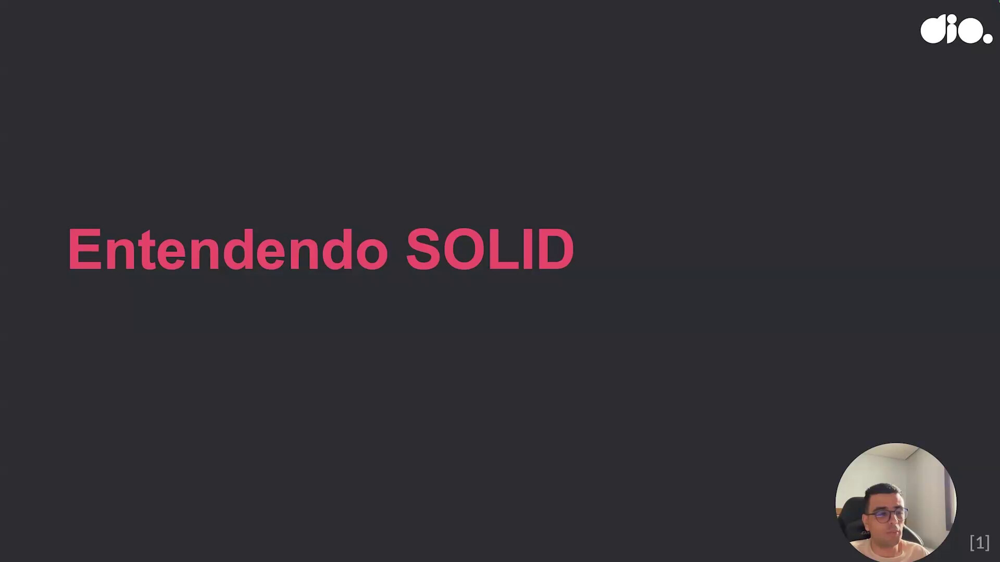
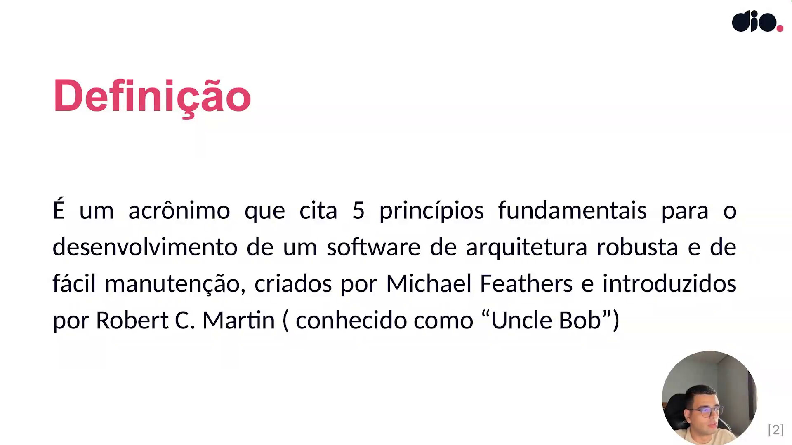
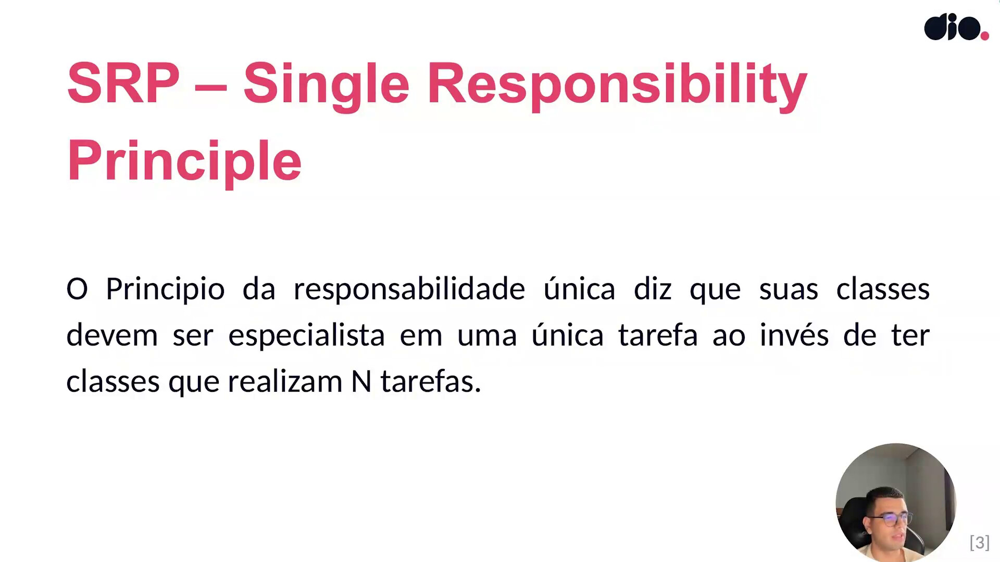
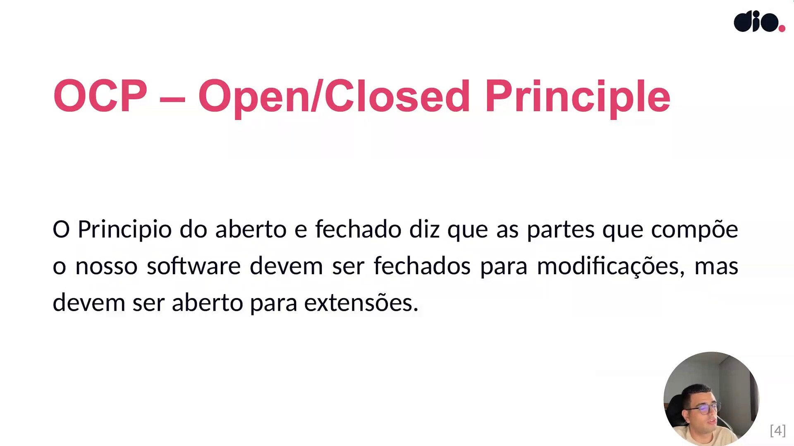
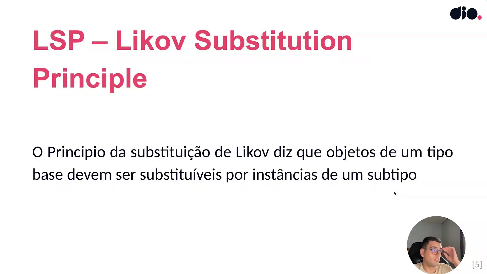
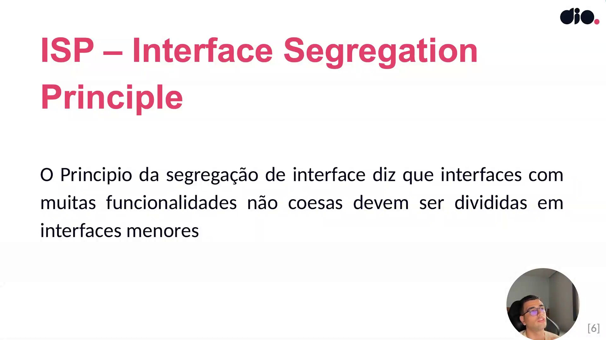
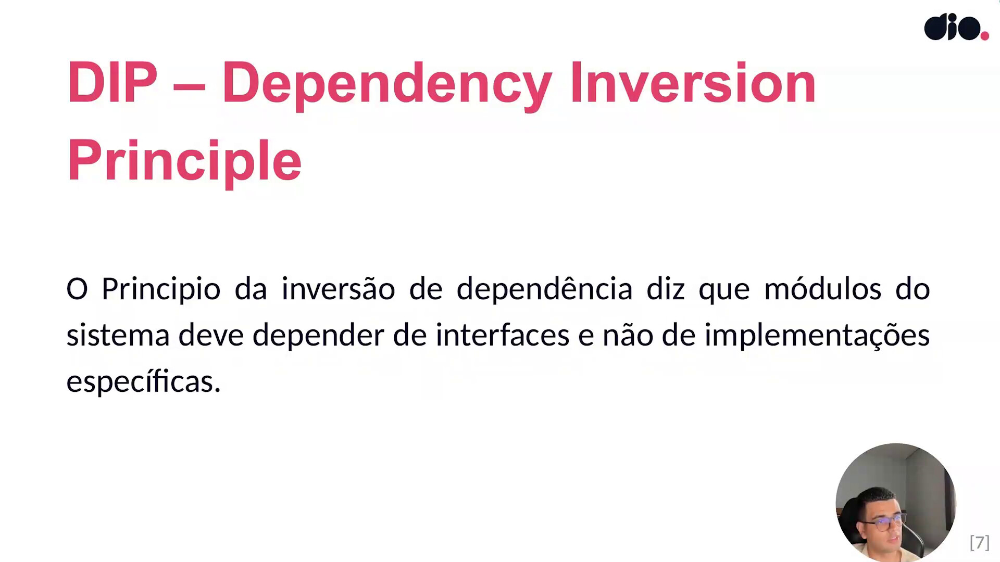
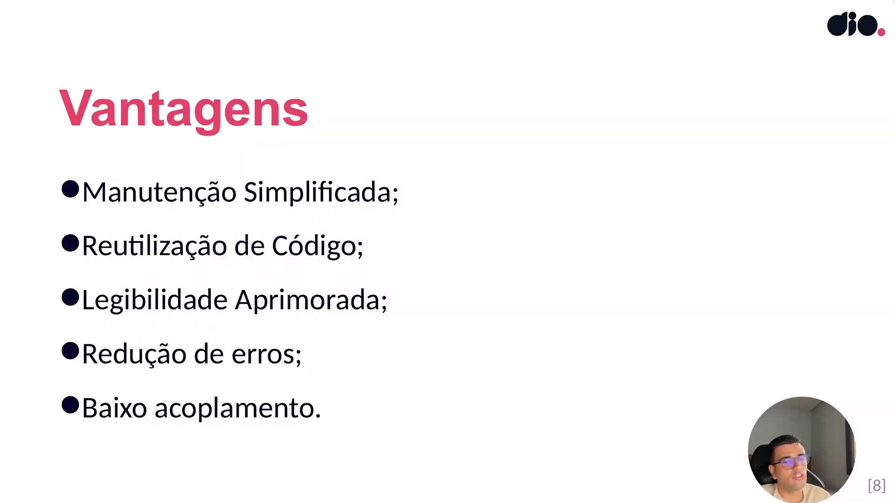
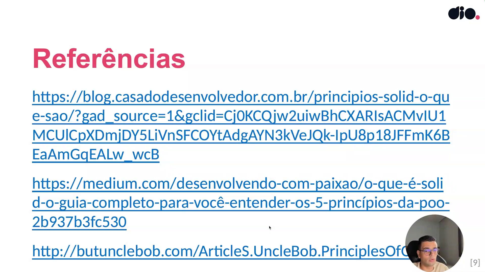

## Instrutor

- José Luiz Abreu Cardoso Junior (Engenheiro de software sênior)
- Contato Linkedin: / [juniorjrjl](https://www.linkedin.com/in/juniorjrjl/)

## Parte 1 - Entendendo SOLID

### 🟩 Vídeo 01 - Entendendo SOLID

<video width="60%" controls>
  <source src="000-Midia_e_Anexos/bootcamp_ntt_data_java_spring_ai-modulo.03-curso.05-video_01.webm" type="video/webm">
    Seu navegador não suporta vídeo HTML5.
</video>

link do vídeo: https://web.dio.me/track/ntt-data-2026-ai-java-back-end/course/solid-e-clean-code-em-java-escrevendo-codigo-de-alta-qualidade/learning/79094f1b-abaf-4243-8633-c64f7dac4551?autoplay=1

### Anotações

  

Slide de abertura da aula, trazendo o tema central que será tratado: os princípios SOLID.

  

SOLID é um acrônimo que reúne cinco princípios fundamentais para a construção de um software com arquitetura robusta e de fácil manutenção. Esses princípios têm origem em um artigo de Robert C. Martin, o "Uncle Bob", chamado *The Principles of OOD* (princípios do desenvolvimento orientado a objetos). Foi Michael Feathers quem, ao ler esse artigo, criou o acrônimo SOLID a partir das ideias apresentadas por Martin. Ou seja: o acrônimo é de Feathers, mas o conteúdo conceitual foi desenvolvido por Uncle Bob. Vale destacar que, embora o exemplo da aula seja voltado a Java, esses conceitos são agnósticos de linguagem e podem ser aplicados em qualquer projeto de desenvolvimento de software.

  

O primeiro princípio é o **SRP — Single Responsibility Principle** (Princípio da Responsabilidade Única). Ele diz que uma classe deve ser especialista em uma única tarefa, em vez de acumular várias responsabilidades. Na prática, isso significa separar, por exemplo, a classe responsável pela validação de cadastro de usuário, a classe que valida uma compra e a classe que envia dados para um gateway de pagamento, cada uma cuidando apenas da sua função. Seguir esse princípio melhora a organização do código e facilita a manutenção — algo especialmente importante em sistemas legados, onde classes com múltiplas responsabilidades costumam gerar medo de mexer no código, já que uma alteração pode acabar quebrando outras partes do sistema. Ignorar esse cuidado desde o início pode até garantir entregas mais rápidas no curto prazo, mas cobra um preço alto quando o software cresce, tornando a manutenção mais cara e trabalhosa.

  

O segundo princípio é o **OCP — Open/Closed Principle** (Princípio do Aberto/Fechado). Ele diz que as partes que compõem o software devem ser fechadas para modificações, mas abertas para extensão. Isso quer dizer que, quando um sistema precisa evoluir — por exemplo, trocar um gateway de pagamento por decisão estratégica —, o ideal é não alterar o código que já está funcionando, mas sim estendê-lo por meio de novas funcionalidades. Um exemplo prático: uma compra que hoje notifica o cliente apenas por SMS pode ganhar notificação por e-mail, WhatsApp ou Telegram sem que seja necessário modificar o que já existe — apenas criar extensões. Isso evita efeitos colaterais indesejados e preserva a integridade do código já validado.

  

O terceiro princípio é o **LSP — Liskov Substitution Principle** (Princípio da Substituição de Liskov). Ele diz que objetos de um tipo base devem ser substituíveis por instâncias de um subtipo. Um exemplo comum é uma camada de persistência de dados: se existe um tipo base (em Java, pensado como uma interface) para acesso a banco de dados SQL, e futuramente for necessário migrar para outro SQL ou até para um NoSQL como o MongoDB, basta criar uma nova implementação (por exemplo, um "PersistenceMongo") que possa substituir a implementação anterior sem quebrar o restante do sistema. Em Java isso normalmente é resolvido com interfaces ou classes abstratas; em outras linguagens, como Python — que não possui interfaces — o mesmo objetivo pode ser alcançado por meio de herança múltipla. Isso reforça que o SOLID não é exclusivo do Java, sendo agnóstico à linguagem de programação.

  

O quarto princípio é o **ISP — Interface Segregation Principle** (Princípio da Segregação de Interface). Ele diz que interfaces com muitas funcionalidades não coesas devem ser divididas em interfaces menores. Esse princípio se relaciona com a ideia de responsabilidade única, mas aplicada ao nível das interfaces. Por exemplo, uma interface de comunicação com o banco que reúne métodos como save, update, delete, findById, findByName e sortBy pode ser quebrada em interfaces menores, como uma interface de leitura e outra de escrita. Dessa forma, quem for implementar a interface tem menos trabalho e o código ganha mais coesão, agrupando apenas o que realmente faz sentido estar junto.

  

O quinto e último princípio é o **DIP — Dependency Inversion Principle** (Princípio da Inversão de Dependência). Ele diz que módulos de um sistema devem depender de interfaces, e não de implementações específicas. Isso garante baixo acoplamento entre as partes do software. Um exemplo prático: em um e-commerce, se o gateway de pagamento precisar ser trocado por outro fornecedor, os módulos que dependem apenas da interface (por exemplo, um método de "solicitar aprovação de pagamento") nem precisam saber qual implementação está sendo usada por trás. Assim, a troca de fornecedor afeta a menor parte possível do sistema, sem impactar módulos que não têm relação direta com essa mudança.

  

Aplicar corretamente os princípios do SOLID traz uma série de vantagens para o desenvolvimento:

- **Manutenção simplificada**: com o código dividido em módulos, cada responsabilidade fica no seu devido lugar, facilitando identificar e resolver problemas isoladamente (por exemplo, um problema de validação leva diretamente à classe responsável por validar).
- **Reutilização de código**: módulos bem definidos, como os de comunicação com meios de pagamento ou com banco de dados, podem ser reaproveitados em várias partes do sistema sem duplicar código.
- **Legibilidade aprimorada**: com o código bem dividido, ele continua legível mesmo quando o sistema cresce e se torna mais complexo.
- **Redução de erros**: como as responsabilidades estão isoladas, um erro tende a ficar contido em uma área específica, facilitando sua detecção e correção sem afetar outras partes do sistema.
- **Baixo acoplamento**: como as partes do código dependem de interfaces (do tipo mais abstrato possível) e não de implementações específicas, fica mais fácil realizar migrações e atualizações, como trocar uma biblioteca de comunicação com o banco de dados, sem quebrar outros pontos do sistema.

  

Slide final com as referências utilizadas na construção do material da aula, incluindo o artigo original de Robert C. Martin (Uncle Bob) sobre os princípios de desenvolvimento orientado a objetos.

## Parte 2 - Refatorando Código

### 🟩 Vídeo 02 - Refatorando Código

<video width="60%" controls>
  <source src="000-Midia_e_Anexos/bootcamp_ntt_data_java_spring_ai-modulo.03-curso.05-video_02.webm" type="video/webm">
    Seu navegador não suporta vídeo HTML5.
</video>

link do vídeo:

##  Materiais de Apoio

# Certificado: 

- Link na plataforma: 
- Certificado em pdf: