## Instrutor

- Venilton Falvo Jr (Doutor em Engenharia de Software, Education Tech Lead na DIO)
- Contato Linkedin: / [falvojr](https://www.linkedin.com/in/falvojr/)

### 🟩 Vídeo 01 - Apresentação inicial

<video width="60%" controls>
  <source src="000-Midia_e_Anexos/bootcamp_tqi_fullstack-modulo.07-curso.03-video_01.webm" type="video/webm">
    Seu navegador não suporta vídeo HTML5.
</video>

link do vídeo: https://web.dio.me/project/explorando-padroes-de-projetos-na-pratica-com-java/learning/e86281ce-844c-46d6-970f-6badc1a59f23?back=/track/tqi-fullstack-developer&tab=undefined&moduleId=undefined

O vídeo desceve a introdução ao desafio de projeto focado em Padrões de Projeto Java, apresentado por Venilton. O conteúdo abrange desde a definição técnica de padrões até a trajetória profissional do instrutor e sua filosofia de compartilhamento de conhecimento.

### Anotações

<p align="center">

</p>

Este desafio de projeto tem como objetivo explorar os padrões de projeto (Design Patterns) na prática, utilizando a linguagem de programação Java. Sob a condução de Venilton FalvoJr, Tech Lead na DIO , o conteúdo foca em soluções consolidadas na área de desenvolvimento de software. A abordagem didática prevê a implementação desses padrões de forma tradicional ("na unha") e também sua aplicação moderna utilizando o framework Spring.

<p align="center">

</p>

A apresentação detalha a trajetória e os valores do instrutor:

* **Início de Carreira:** Iniciou no setor de tecnologia em 2008 como estagiário.
* **Formação e Especialização:** É mestre em Engenharia da Computação e doutorando (com previsão de defesa para 2023). Sua experiência técnica abrange o ecossistema Java e o desenvolvimento mobile com transição para Kotlin.
* **Filosofia de Aprendizado:** O instrutor cita Warren Buffett: "Alguém está sentado na sombra hoje porque alguém plantou uma árvore há muito tempo". Essa frase reflete o compromisso com a disseminação de conhecimento para formar novos desenvolvedores.
* **Redes Sociais:** Disponibiliza perfis no LinkedIn e no GitHub para acompanhamento de projetos e networking.

### 🟩 Vídeo 02 - Padrões de Projeto

<video width="60%" controls>
  <source src="000-Midia_e_Anexos/bootcamp_tqi_fullstack-modulo.07-curso.03-video_02.webm" type="video/webm">
    Seu navegador não suporta vídeo HTML5.
</video>

link do vídeo: https://web.dio.me/lab/explorando-padroes-de-projetos-na-pratica-com-java/learning/dbad4e6b-fc8e-4215-b305-435b0ad652c1

OO vídeo explora o universo dos padrões de projeto, desde a sua fundamentação teórica baseada no "Gang of Four" (GoF) até a implementação prática. O foco principal é entender como soluções consolidadas para problemas recorrentes em Programação Orientada a Objetos (POO) podem ser aplicadas tanto em Java puro quanto de forma abstraída através do Spring Framework.

### Anotações

<p align="center">
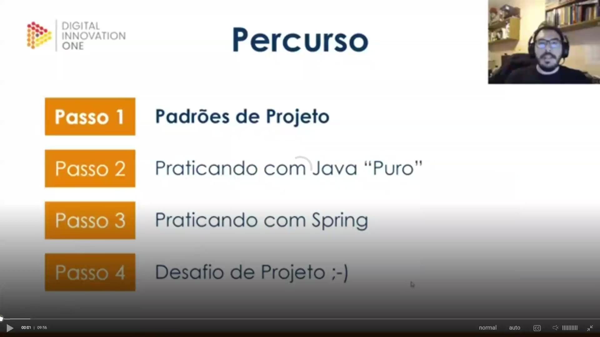
</p>

Este slide apresenta o **percurso do desafio de projeto**, estabelecendo um roteiro de aprendizado dividido em quatro etapas fundamentais:

* **Passo 1: Padrões de Projeto**: Introdução e formalização dos conceitos teóricos.
* **Passo 2: Praticando com Java "Puro"**: Implementação prática e manual ("na unha") dos padrões selecionados para consolidar o entendimento da lógica por trás de cada solução.
* **Passo 3: Praticando com Spring**: Uma análise comparativa de como o Spring Framework abstrai esses padrões, permitindo que o desenvolvedor utilize soluções robustas, muitas vezes de forma implícita (como no caso da injeção de dependências).
* **Passo 4: Desafio de Projeto**: A etapa final onde o conhecimento é consolidado na construção de um projeto completo e robusto.

A ideia central é permitir que você identifique padrões factuais na estrutura do código antes de confiar em abstrações automáticas de frameworks.

<p align="center">
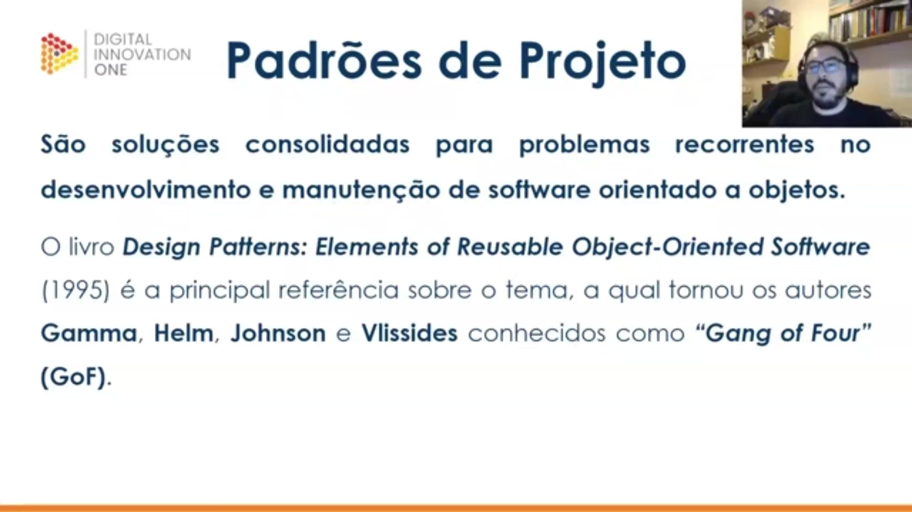
</p>

Nesta etapa, definimos formalmente o que são **Padrões de Projeto** (Design Patterns). Eles são soluções consolidadas para problemas que ocorrem de forma recorrente no desenvolvimento e na manutenção de software orientado a objetos.

A base teórica de todo o tema reside na obra seminal de 1995, **"Design Patterns: Elements of Reusable Object-Oriented Software"**. Os autores — Erich Gamma, Richard Helm, Ralph Johnson e John Vlissides — tornaram-se mundialmente conhecidos como a **"Gang of Four" (GoF)**. Mesmo sendo uma referência de décadas atrás, os fundamentos estabelecidos por eles continuam sendo o norte principal para qualquer implementação moderna de software orientado a objetos.

<p align="center">
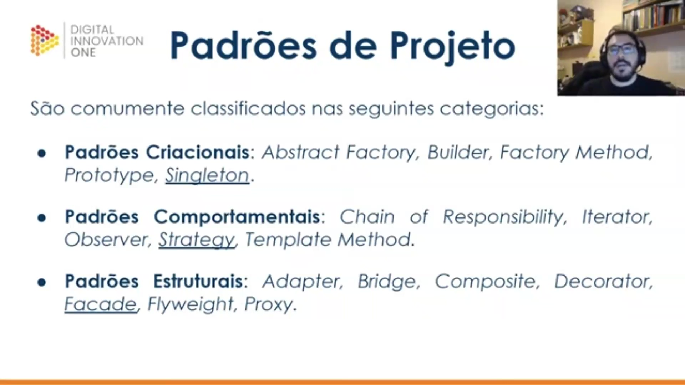
</p>

Os padrões de projeto são categorizados conforme a natureza do problema que resolvem, sendo divididos em três grandes classes:

* **Padrões Criacionais**: Focam no processo de criação/instanciação de objetos. Exemplos incluem o **Singleton** (garantir instância única) e o **Builder** (construção incremental de objetos complexos).
* **Padrões Comportamentais**: Tratam das interações e responsabilidades entre objetos. O foco aqui é como os objetos se comunicam de forma elegante e estruturada. Exemplos notáveis são o **Strategy** (definir uma família de algoritmos intercambiáveis) e o **Observer**.
* **Padrões Estruturais**: Lidam com a composição de classes ou objetos para formar estruturas maiores e mais eficientes, focando muitas vezes na integração com sistemas externos. Exemplos incluem o **Facade** (interface simplificada para sistemas complexos) e o **Adapter**.

Para o nosso desafio prático, focaremos em um representante de cada categoria: **Singleton** (Criacional), **Strategy** (Comportamental) e **Facade** (Estrutural).


### 🟩 Vídeo 03 - Praticando com Java Puro: Singleton

<video width="60%" controls>
  <source src="000-Midia_e_Anexos/bootcamp_tqi_fullstack-modulo.07-curso.03-video_03.webm" type="video/webm">
    Seu navegador não suporta vídeo HTML5.
</video>

link do vídeo: https://web.dio.me/lab/explorando-padroes-de-projetos-na-pratica-com-java/learning/fed94247-3cf7-4b04-a9b2-ead7bfd1c51a


O vídeo aborda a implementação prática do padrão de projeto Singleton utilizando Java puro. O Singleton é um dos padrões "Gang of Four" (GoF) e tem como objetivo principal garantir que uma classe tenha apenas uma instância durante todo o ciclo de vida da aplicação, fornecendo um ponto de acesso global a ela.

### Anotações

#### Percurso do Aprendizado

<p align="center">

</p>

Apresentação do roteiro de aprendizado focado na prática de padrões de projeto. O objetivo desta etapa é realizar a implementação manual utilizando Java "puro", sem o auxílio de frameworks, para consolidar a compreensão dos mecanismos internos de cada padrão antes de avançar para o Spring.

#### Conceito de Singleton

<p align="center">
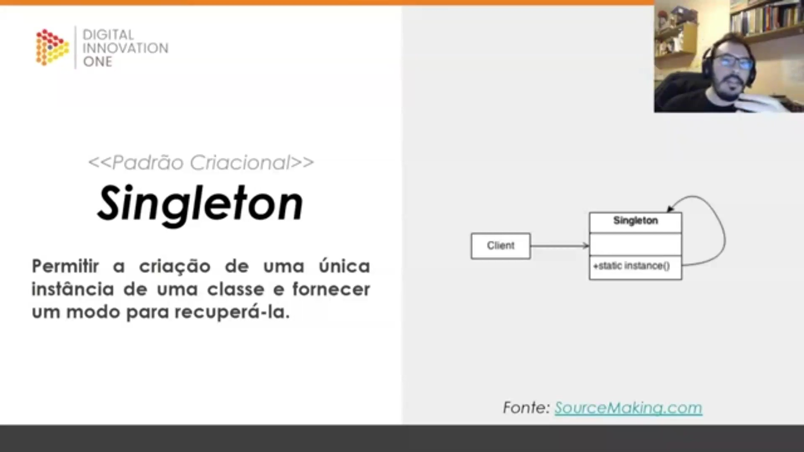
</p>

Introdução teórica ao padrão **Singleton**, um padrão criacional que garante a existência de uma única instância de uma determinada classe em toda a aplicação, fornecendo um ponto de acesso global a ela. O diagrama UML destaca que a classe mantém uma referência estática de si mesma e utiliza um método estático para gerenciar o acesso a essa instância única.

#### Criação do Projeto no Eclipse

<p align="center">
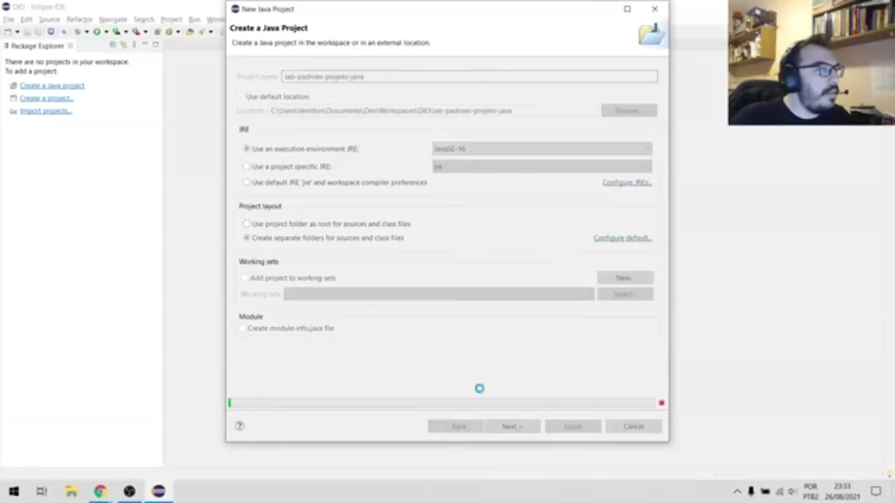
</p>

Início da implementação prática no Eclipse IDE. O processo começa com a criação de um novo *Java Project* nomeado `Lab Padrões de Projeto Java`, configurado para utilizar as definições padrão do ambiente de execução (JRE).

#### Organização de Pacotes

<p align="center">
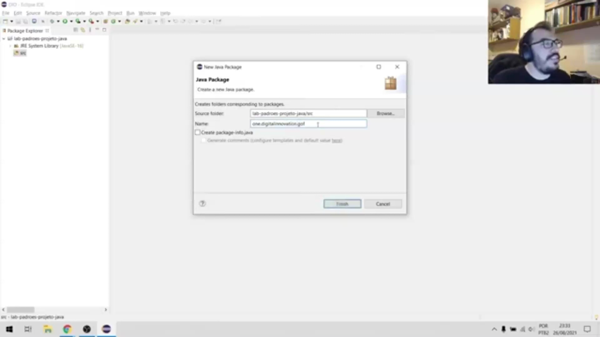
</p>

Estruturação do projeto através da criação do pacote `one.digitalinnovation.gof`. O sufixo "gof" remete ao termo *Gang of Four*, referência aos autores originais que catalogaram os padrões de projeto.

#### Interface de Desenvolvimento

<p align="center">
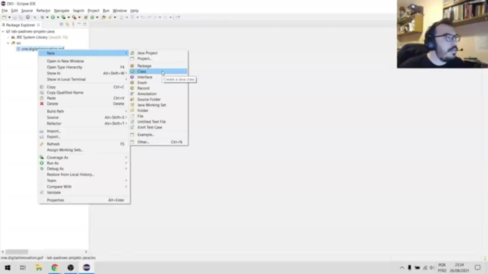
</p>

Utilização do menu de contexto da IDE para a criação da primeira classe do projeto, preparando o terreno para a codificação das variantes do Singleton.

#### Definição da Classe SingletonLazy

<p align="center">

</p>

Configuração da classe `SingletonLazy`. Esta versão é denominada "preguiçosa" porque a instância não é criada imediatamente; ela só será alocada na memória quando for solicitada pela primeira vez.

#### Estrutura Inicial do Código

<p align="center">
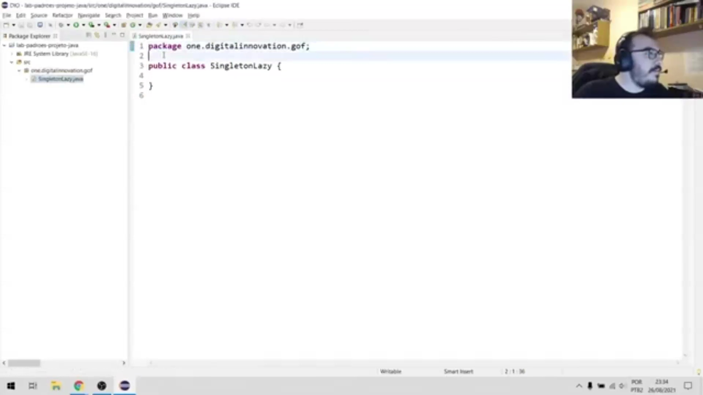
</p>

Esqueleto inicial da classe dentro do pacote definido, antes da inclusão da lógica de controle de instância.

```java
package one.digitalinnovation.gof;

public class SingletonLazy {

}
```

#### Atributo de Instância Estática

<p align="center">

</p>

Inclusão do atributo estático `instancia` do tipo `SingletonLazy`. Este campo é privado para garantir que o controle de criação seja restrito à própria classe, seguindo os princípios do padrão.

```java
package one.digitalinnovation.gof;

/**
 * Singleton "preguicoso".
 * * @author falvojr
 */
public class SingletonLazy {

	private static SingletonLazy instancia;

}
```

#### Implementação do Método de Acesso

<p align="center">
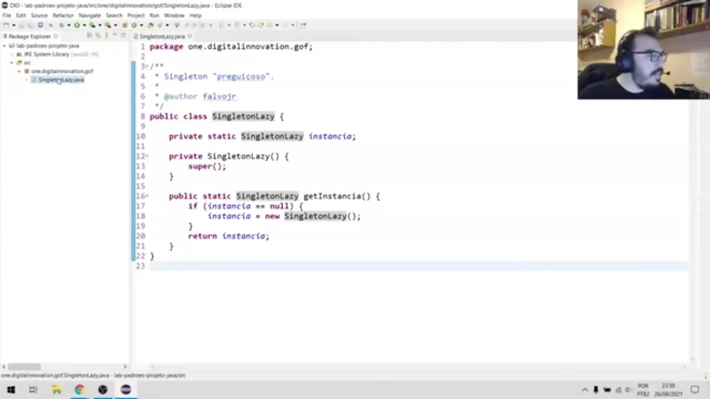
</p>

Finalização do Singleton Lazy. O mecanismo consiste em tornar o construtor `private` e implementar o método `getInstancia()`. Este método verifica se a variável `instancia` é nula; se for, cria o objeto. Em chamadas subsequentes, ele apenas retorna o objeto já criado.

```java
package one.digitalinnovation.gof;

/**
 * Singleton "preguicoso".
 * * @author falvojr
 */
public class SingletonLazy {

	private static SingletonLazy instancia;

	private SingletonLazy() {
		super();
	}

	public static SingletonLazy getInstancia() {
		if (instancia == null) {
			instancia = new SingletonLazy();
		}
		return instancia;
	}
}
```

#### Transição para Outras Variantes

<p align="center">

</p>

Demonstração da criação de novas classes para explorar diferentes abordagens do Singleton, como a variante "apressada" (Eager), que lida com a inicialização de forma distinta.

#### Singleton Eager (Apressado)

<p align="center">

</p>

Implementação do **Singleton Eager**. Diferente do Lazy, esta versão instancia o objeto no momento em que a classe é carregada pela JVM. É uma abordagem simples quando se tem certeza de que a instância será sempre utilizada durante a execução.

```java
package one.digitalinnovation.gof;

/**
 * Singleton "apressado".
 * * @author falvojr
 */
public class SingletonEager {

	private static SingletonEager instancia = new SingletonEager();

	private SingletonEager() {
		super();
	}

	public static SingletonEager getInstancia() {
		return instancia;
	}
}
```

#### Otimização com Lazy Holder

<p align="center">

</p>

Preparação para implementar o **Singleton Lazy Holder**, uma técnica que combina a inicialização tardia com segurança em ambientes de múltiplas threads (*thread-safe*).

#### Implementação do Lazy Holder

<p align="center">
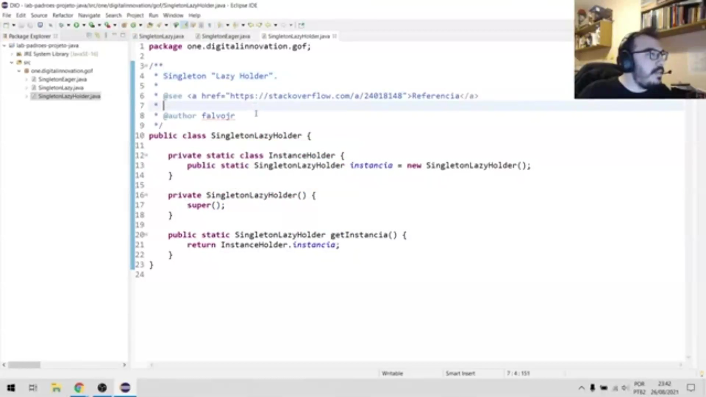
</p>

O `SingletonLazyHolder` utiliza uma classe interna estática (`InstanceHolder`) para encapsular a instância. A instância só é criada quando `InstanceHolder` é acessado pela primeira vez, garantindo eficiência.

```java
package one.digitalinnovation.gof;

/**
 * Singleton "Lazy Holder".
 * * @see <a href="https://stackoverflow.com/a/15019331">Referência</a>
 * * @author falvojr
 */
public class SingletonLazyHolder {

	private static class InstanceHolder {
		public static SingletonLazyHolder instancia = new SingletonLazyHolder();
	}

	private SingletonLazyHolder() {
		super();
	}

	public static SingletonLazyHolder getInstancia() {
		return InstanceHolder.instancia;
	}
}
```

#### Testes de Validação

<p align="center">
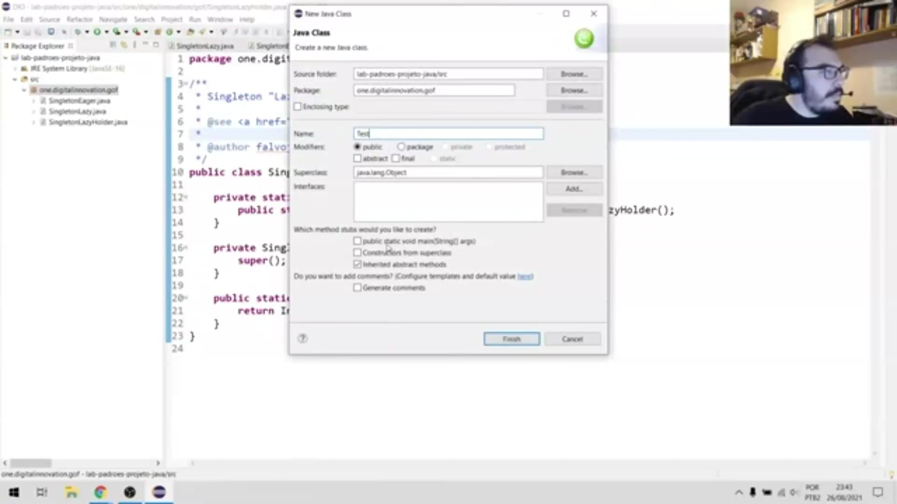
</p>

Criação da classe `Test` no pacote para verificar se todas as implementações do Singleton estão retornando corretamente a mesma instância de objeto.

#### Execução dos Testes

<p align="center">

</p>

No método `main`, cada variante do Singleton é chamada duas vezes. Os objetos retornados são impressos no console para que se possa comparar seus endereços de memória.

```java
package one.digitalinnovation.gof;

public class Test {

	public static void main(String[] args) {
		
		// Testes relacionados ao Design Pattern Singleton:
		
		SingletonLazy lazy = SingletonLazy.getInstancia();
		System.out.println(lazy);
		lazy = SingletonLazy.getInstancia();
		System.out.println(lazy);
		
		SingletonEager eager = SingletonEager.getInstancia();
		System.out.println(eager);
		eager = SingletonEager.getInstancia();
		System.out.println(eager);
		
		SingletonLazyHolder lazyHolder = SingletonLazyHolder.getInstancia();
		System.out.println(lazyHolder);
		lazyHolder = SingletonLazyHolder.getInstancia();
		System.out.println(lazyHolder);
	}
}
```

#### Resultados no Console

<p align="center">
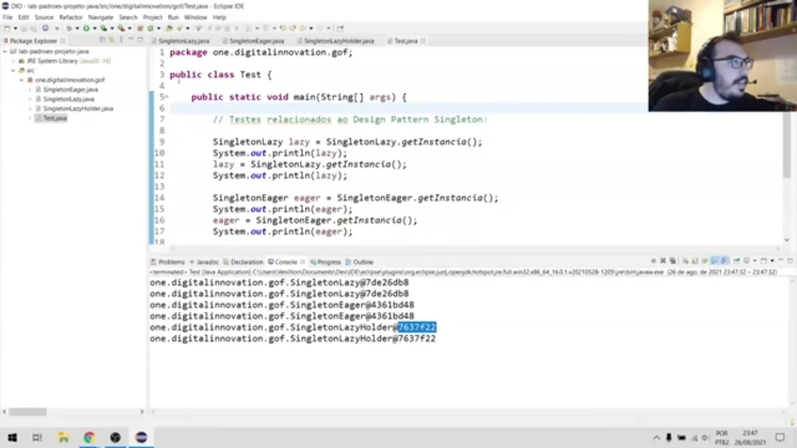
</p>

O resultado da execução confirma o sucesso da implementação. Como visto no console, para cada tipo de Singleton, as duas referências impressas possuem o mesmo ID de objeto (ex: `@7d6226db`), provando que a instância retornada é única.      


### 🟩 Vídeo 04 - Praticando com Java Puro: Strategy

<video width="60%" controls>
  <source src="000-Midia_e_Anexos/bootcamp_tqi_fullstack-modulo.07-curso.03-video_04.webm" type="video/webm">
    Seu navegador não suporta vídeo HTML5.
</video>

link do vídeo: https://web.dio.me/lab/explorando-padroes-de-projetos-na-pratica-com-java/learning/9fb47191-db28-4fe2-894b-274f8c5cd24f

Este guia explora o padrão de projeto Strategy, um padrão comportamental que permite definir uma família de algoritmos, encapsulá-los e torná-los intercambiáveis. O vídeo utiliza um exemplo prático de um robô com diferentes comportamentos de movimentação para ilustrar como o padrão facilita a variação de algoritmos através de uma interface comum.

### Anotações

#### Organização de Pacotes no Eclipse

<p align="center">

</p>

Para iniciar a implementação do padrão **Strategy**, é necessário organizar o projeto criando novos pacotes. A interface do Eclipse mostra a criação de um pacote específico para separar as implementações de estratégia das demais, como o Singleton, garantindo uma estrutura de diretórios limpa e coerente com as responsabilidades de cada classe.

#### Ajuste de Visualização Hierárquica

<p align="center">

</p>

A visualização do **Package Explorer** é alterada para o modo hierárquico. Essa configuração permite visualizar a árvore de pacotes de forma mais organizada, facilitando a identificação da relação entre o pacote principal e os subpacotes criados para o Strategy e o Singleton.

#### Criação de Novos Componentes

<p align="center">

</p>

Dentro do pacote de estratégia, o menu de contexto do Eclipse é utilizado para criar os elementos que comporão o padrão. O objetivo é definir uma interface que servirá como o contrato para as diferentes variações de algoritmos que serão implementadas a seguir.

#### Conceitos do Padrão Strategy

<p align="center">
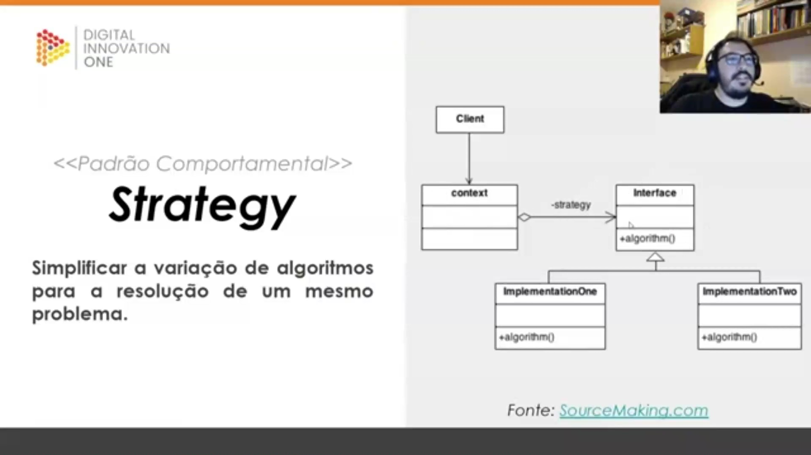
</p>

O diagrama UML apresenta a estrutura do padrão comportamental **Strategy**. Sua função principal é simplificar a variação de algoritmos para a resolução de um mesmo problema. No diagrama, observamos:

* **Client**: O componente que utiliza o contexto.
* **Context**: A classe que mantém uma referência para uma instância de Strategy.
* **Interface (Strategy)**: Define o contrato comum para todos os algoritmos suportados.
* **Implementações (One/Two)**: As variações concretas do algoritmo.

#### Definição da Interface de Comportamento

<p align="center">
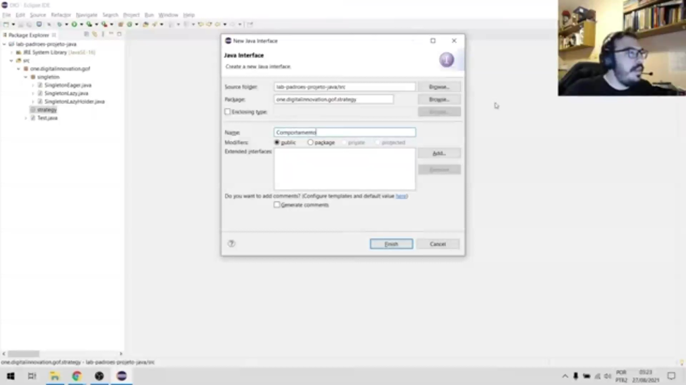
</p>

A interface `Comportamento` é criada para atuar como a nossa **Strategy**. Ela define o contrato que todas as variações de movimentação do robô devem seguir, estabelecendo o método base que será implementado pelas classes concretas.

```java
package one.digitalinnovation.gof.strategy;

public interface Comportamento {
    void mover();
}
```

#### Implementação do Comportamento Agressivo

<p align="center">
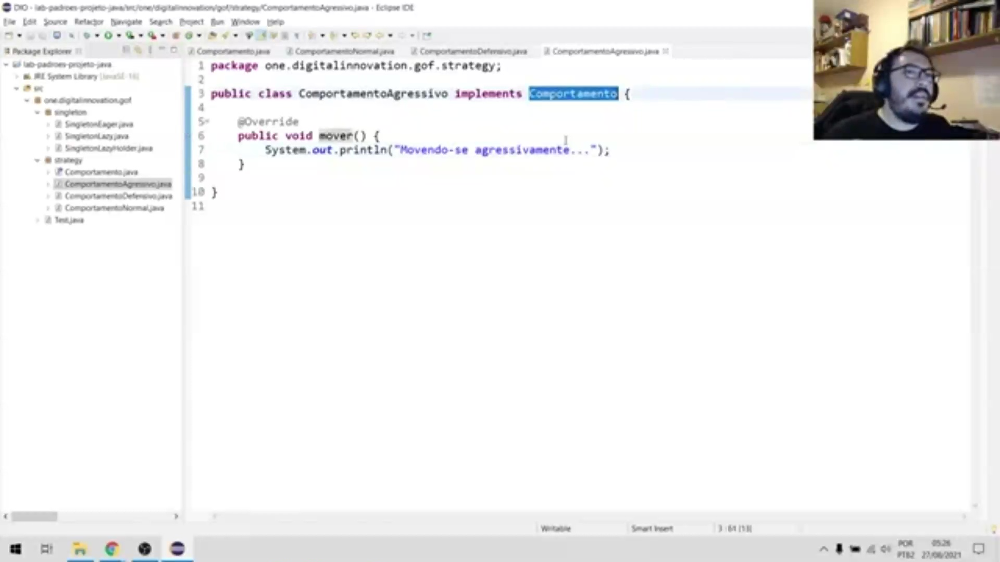
</p>

Esta classe representa uma variação específica da estratégia. Ao implementar a interface `Comportamento`, a classe `ComportamentoAgressivo` é obrigada a fornecer sua própria lógica para o método `mover()`.

```java
package one.digitalinnovation.gof.strategy;

public class ComportamentoAgressivo implements Comportamento {

	@Override
	public void mover() {
		System.out.println("Movendo-se agressivamente...");
	}
}
```

#### Implementação do Comportamento Defensivo

<p align="center">
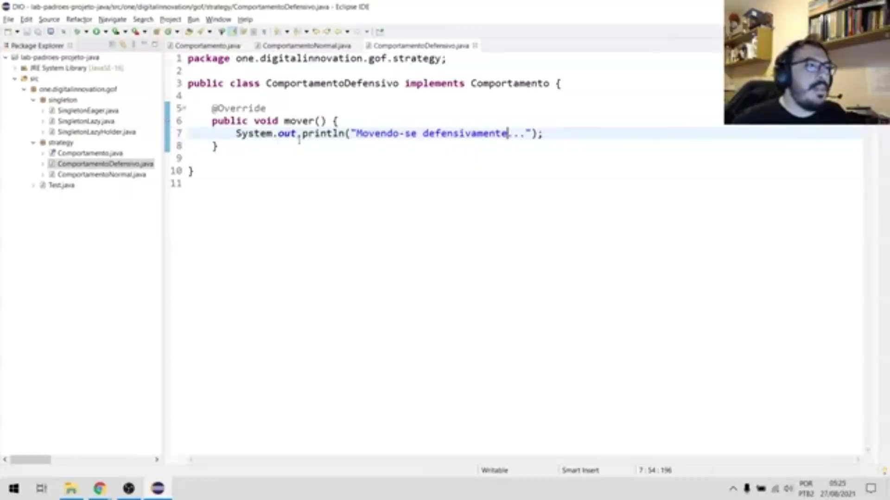
</p>

Seguindo o mesmo padrão de variação de algoritmos, a classe `ComportamentoDefensivo` implementa a interface de estratégia com uma lógica de movimentação distinta.

```java
package one.digitalinnovation.gof.strategy;

public class ComportamentoDefensivo implements Comportamento {

	@Override
	public void mover() {
		System.out.println("Movendo-se defensivamente...");
	}
}
```

#### Implementação do Comportamento Normal

<p align="center">
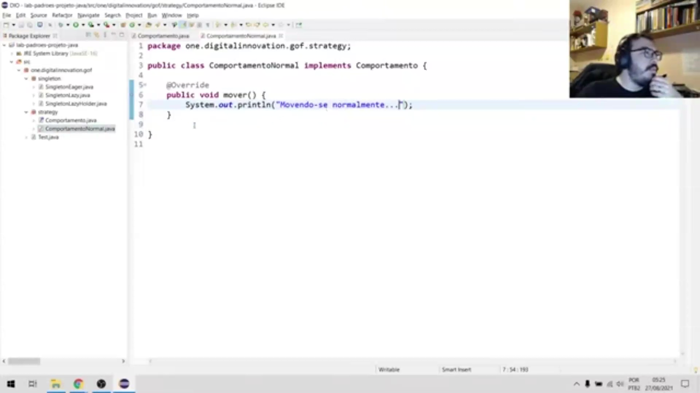
</p>

A classe `ComportamentoNormal` finaliza as nossas implementações de estratégia iniciais, fornecendo a movimentação padrão do robô.

```java
package one.digitalinnovation.gof.strategy;

public class ComportamentoNormal implements Comportamento {

	@Override
	public void mover() {
		System.out.println("Movendo-se normalmente...");
	}
}
```

#### Criação da Classe de Contexto

<p align="center">
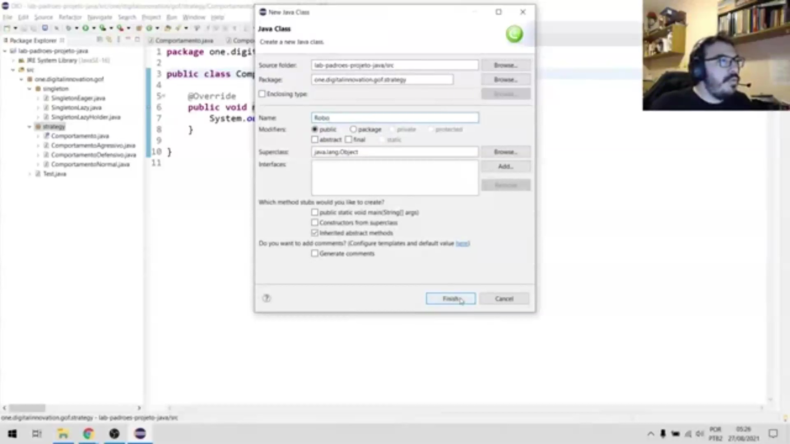
</p>

Após definir as estratégias, cria-se a classe `Robo`, que funcionará como o **Contexto** no padrão Strategy. Esta classe será responsável por utilizar as diferentes implementações de comportamento.

#### Estrutura da Classe Robo

<p align="center">

</p>

A classe `Robo` possui um atributo do tipo da interface `Comportamento`. Isso permite o uso de polimorfismo, onde o robô pode receber qualquer implementação da estratégia. O método `mover()` do robô delega a execução para a estratégia atualmente atribuída.

```java
package one.digitalinnovation.gof.strategy;

public class Robo {
	
	private Comportamento comportamento;

	public void setComportamento(Comportamento comportamento) {
		this.comportamento = comportamento;
	}
	
	public void mover() {
		comportamento.mover();
	}
}
```

#### Configuração do Cenário de Teste

<p align="center">

</p>

No código de teste, as instâncias das estratégias são criadas e o robô é inicializado. O exemplo demonstra a atribuição de um comportamento inicial (Normal) e a execução da ação de movimento.

```java
// Strategy
Comportamento defensivo = new ComportamentoDefensivo();
Comportamento normal = new ComportamentoNormal();
Comportamento agressivo = new ComportamentoAgressivo();

Robo robo = new Robo();
robo.setComportamento(normal);

robo.mover();
robo.mover();
```

#### Alternância de Estratégias em Tempo de Execução

<p align="center">
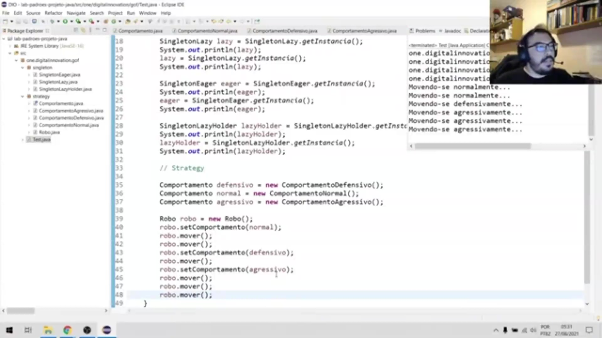
</p>

A flexibilidade do padrão é demonstrada ao alterar o comportamento do robô durante a execução. Ao trocar a estratégia via `setComportamento`, o mesmo método `robo.mover()` passa a produzir resultados diferentes, conforme exibido no console.

```java
robo.setComportamento(defensivo);
robo.mover();

robo.setComportamento(agressivo);
robo.mover();
robo.mover();
robo.mover();
```      

### 🟩 Vídeo 05 - Praticando com Java Puro: Facade

<video width="60%" controls>
  <source src="000-Midia_e_Anexos/bootcamp_tqi_fullstack-modulo.07-curso.03-video_05.webm" type="video/webm">
    Seu navegador não suporta vídeo HTML5.
</video>

link do vídeo: https://web.dio.me/lab/explorando-padroes-de-projetos-na-pratica-com-java/learning/b85aef03-dad2-4e21-bbbf-e40aa02a9519

O vídeo apresenta uma explanação teórica e prática sobre o padrão de projeto Facade (Fachada). O objetivo central é demonstrar como esse padrão pode simplificar a interação com sistemas complexos, provendo uma interface única e amigável para o desenvolvedor.

### Anotações

<p align="center">

</p>

O padrão de projeto **Facade** é classificado como um **Padrão Estrutural**. Sua principal finalidade é prover uma interface unificada e simplificada que reduza a complexidade nas integrações com diversos subsistemas. No diagrama, observa-se que o **Client** interage apenas com a **Facade**, que por sua vez gerencia a comunicação com múltiplos componentes internos de um sistema complexo, abstraindo as chamadas necessárias para realizar uma operação.

<p align="center">
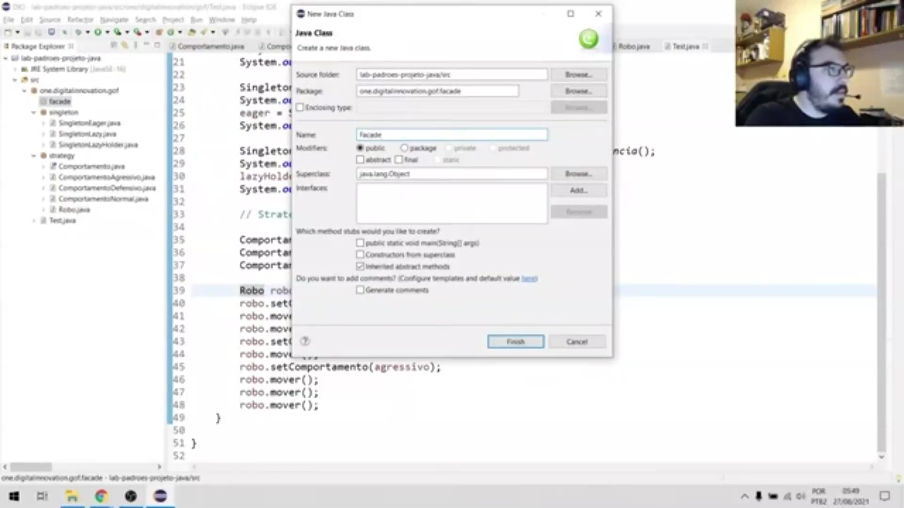
</p>

Para iniciar a implementação prática, o ambiente de desenvolvimento é preparado para a criação de um novo pacote voltado ao padrão Facade. A imagem demonstra a conclusão de exemplos anteriores baseados no padrão Strategy, onde um objeto do tipo `Robo` teve comportamentos alterados dinamicamente. Agora, o foco volta-se para a criação da classe `Facade` dentro da estrutura do projeto Java.

<p align="center">
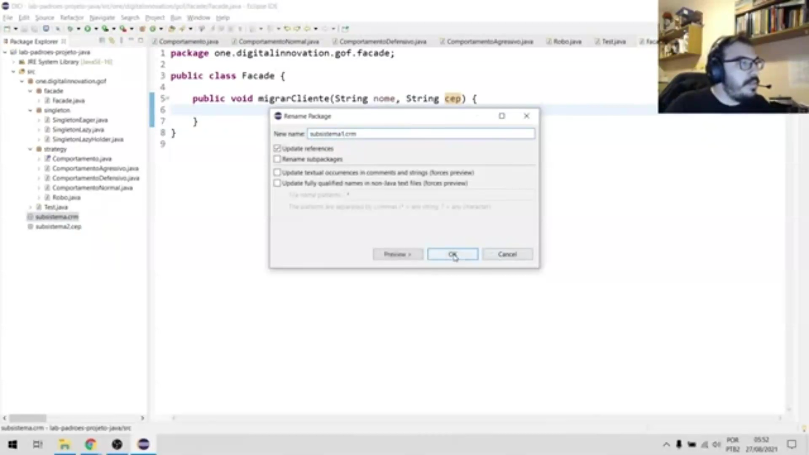
</p>

A classe `Facade` é definida no pacote `one.digitalinnovation.gof.facade`. O ponto central desta implementação é o método `migrarCliente`, que recebe parâmetros simples: o nome e o CEP do cliente. O objetivo é que esta interface oculte a complexidade de obter dados adicionais e realizar gravações em diferentes sistemas.

```java
package one.digitalinnovation.gof.facade;

public class Facade {

    public void migrarCliente(String nome, String cep) {
        
    }
}
```

<p align="center">

</p>

Para simular a complexidade que a Facade deve gerenciar, são criados subsistemas externos. O primeiro deles é o `CrmService`, localizado no pacote `subsistema1.crm`. Este componente representará um sistema de CRM (Customer Relationship Management) responsável pelo armazenamento definitivo dos dados dos clientes.

<p align="center">
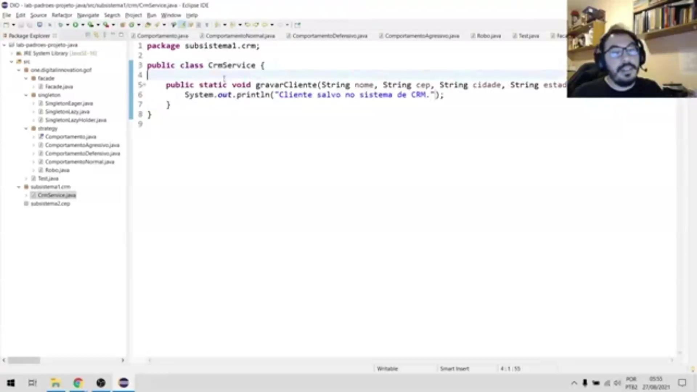
</p>

A implementação do `CrmService` utiliza um método estático chamado `gravarCliente`. Nota-se que a interface deste subsistema é mais exigente que a da Facade, requerendo não apenas o nome e o CEP, mas também cidade e estado. O uso de métodos estáticos permite o consumo sem a necessidade de instanciar a classe, centralizando a lógica de persistência simulada.

```java
package subsistema1.crm;

public class CrmService {

    private CrmService() {
        super();
    }

    public static void gravarCliente(String nome, String cep, String cidade, String estado) {
        System.out.println("Cliente salvo no sistema de CRM.");
    }
}
```

<p align="center">

</p>

O segundo subsistema, `CepApi`, é implementado no pacote `subsistema2.cep` seguindo o padrão **Singleton**. Ele simula uma API de busca de CEP, fornecendo os métodos `recuperarCidade` e `recuperarEstado`. Esta implementação distinta — uma usando Singleton e outra métodos estáticos — exemplifica as diferentes formas de integração que uma Facade pode consolidar em uma interface única.

```java
package subsistema2.cep;

public class CepApi {

    private static CepApi instancia = new CepApi();

    private CepApi() {
        super();
    }

    public static CepApi getInstancia() {
        return instancia;
    }

    public String recuperarCidade(String cep) {
        return "Araraquara";
    }

    public String recuperarEstado(String cep) {
        return "SP";
    }
}
```

<p align="center">

</p>

O `CrmService` é complementado com instruções de saída no console para validar a recepção correta das informações. O método agora imprime o nome, CEP, cidade e estado, permitindo verificar se a integração realizada pela Facade obteve os dados corretamente a partir da API de CEP e os repassou ao sistema de CRM.

```java
public static void gravarCliente(String nome, String cep, String cidade, String estado) {
    System.out.println("Cliente salvo no sistema de CRM:");
    System.out.println(nome);
    System.out.println(cep);
    System.out.println(cidade);
    System.out.println(estado);
}
```

<p align="center">

</p>

Na fase de testes, a classe `Test` instancia a `Facade` e executa o método `migrarCliente`. O resultado no console confirma que a Facade abstraiu com sucesso a complexidade: a partir de apenas um nome e um CEP, ela consultou a `CepApi` para obter "Araraquara" e "SP", e então acionou o `CrmService` para salvar o cliente com os dados completos.

```java
// Facade
Facade facade = new Facade();
facade.migrarCliente("Venilton", "14801788");
```

### 🟩 Vídeo 06 - Praticando com Spring: Introdução

<video width="60%" controls>
  <source src="000-Midia_e_Anexos/bootcamp_tqi_fullstack-modulo.07-curso.03-video_06.webm" type="video/webm">
    Seu navegador não suporta vídeo HTML5.
</video>

link do vídeo: https://web.dio.me/lab/explorando-padroes-de-projetos-na-pratica-com-java/learning/5da490c2-92d1-4976-a718-dd49d1b1c061

O vídeo explica como os conceitos teóricos de Design Patterns são aplicados na prática dentro do Spring Framework. O objetivo é correlacionar funcionalidades nativas do framework com padrões clássicos, otimizando o desenvolvimento e a manutenção de software.

### Anotações

#### Percurso de Aprendizado: Padrões de Projeto no Ecossistema Java 

<p align="center">

</p>

Este slide apresenta o roteiro estruturado para o domínio de padrões de projeto, dividindo a jornada em quatro etapas fundamentais:

* **Passo 1:** Foco inicial nos conceitos teóricos e padrões de projeto fundamentais.
* **Passo 2:** Prática de implementação utilizando Java "Puro", permitindo consolidar o entendimento estrutural sem abstrações de frameworks.
* **Passo 3:** Transição para o **Spring Framework**, correlacionando os padrões aprendidos com as funcionalidades automáticas do ecossistema.
* **Passo 4:** Consolidação final através de um **Desafio de Projeto** prático.

#### Mapeamento de Padrões GoF no Spring Framework 

<p align="center">

</p>

Nesta etapa, exploramos como o Spring Framework implementa nativamente padrões clássicos de projeto para otimizar o desenvolvimento:

* **Singleton:** Gerenciado pelo container de Inversão de Controle do Spring através das anotações `@Bean` e `@Autowired`. Por padrão, o framework entrega instâncias únicas (beans) para otimizar o consumo de memória,].
* **Strategy:** Aplicado por meio de `@Service` e `@Repository`. O `@Service` atua como a implementação concreta de uma estratégia de negócio], enquanto o `@Repository` abstrai a estratégia de persistência de dados].
* **Facade:** Uma **API REST** é utilizada como uma fachada para expor uma interface simples e coesa]. Ela abstrai a complexidade de integrações como o **Spring Data JPA** e o consumo de serviços externos como o **ViaCEP** via **Feign**].
* 
**Persistência:** Utiliza-se o banco de dados em memória **H2**. Essa escolha simplifica o projeto ao evitar configurações complexas de *connection strings* e drivers manuais durante a fase de aprendizado].


### 🟩 Vídeo 07 - Praticando com Spring: Conhecendo o Projeto Base

<video width="60%" controls>
  <source src="000-Midia_e_Anexos/bootcamp_tqi_fullstack-modulo.07-curso.03-video_07.webm" type="video/webm">
    Seu navegador não suporta vídeo HTML5.
</video>

link do vídeo: https://web.dio.me/lab/explorando-padroes-de-projetos-na-pratica-com-java/learning/975a7cad-08ec-43be-9f34-5c3c65aa6ba7

### Anotações

#### Spring Initializr

<p align="center">
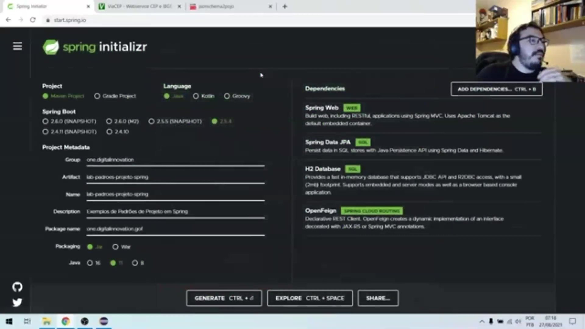
</p>

O ponto de partida para a criação do projeto é o **Spring Initializr** (`start.spring.io`), uma interface visual que permite selecionar as dependências necessárias e configurar a estrutura base de um projeto **Spring Boot**. A premissa dessa ferramenta é abstrair a complexidade inicial de configuração do Spring Framework, permitindo a escolha rápida de módulos para APIs REST, persistência e integração.

Neste projeto específico, foram selecionadas as seguintes dependências:

* **Spring Web:** Para prover a interface REST.
* **Spring Data JPA:** Para abstração da persistência em bancos relacionais.
* **H2 Database:** Banco de dados em memória para simplificar o desenvolvimento.
* **OpenFeign:** Cliente REST declarativo para consumo de APIs externas.

#### Classe Application e EnableFeignClients

<p align="center">
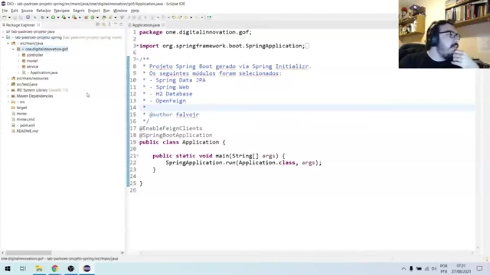
</p>

A classe principal do projeto, `Application`, é o ponto de entrada da aplicação Spring Boot. Além da anotação padrão `@SpringBootApplication`, foi incluída a anotação `@EnableFeignClients`. Esta configuração é essencial para habilitar o uso do **OpenFeign** dentro do projeto, permitindo que as interfaces anotadas como clientes sejam detectadas e injetadas pelo Spring.

```java
@EnableFeignClients
@SpringBootApplication
public class Application {
    public static void main(String[] args) {
        SpringApplication.run(Application.class, args);
    }
}

```

#### Metadados do Projeto no pom.xml

<p align="center">
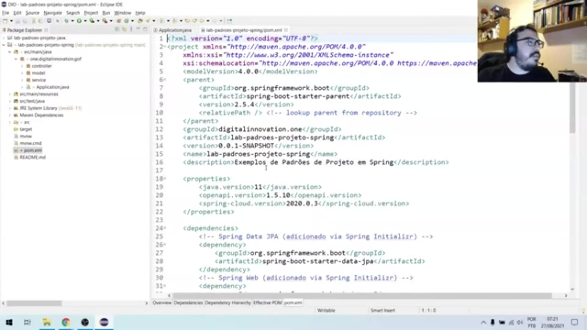
</p>

O arquivo `pom.xml` gerencia as dependências e configurações do Maven. Nele, definimos o projeto pai (`spring-boot-starter-parent`), que fornece configurações padrão do Spring Boot, e os metadados do projeto, como o **Artifact ID** (`lab-padroes-projeto-spring`) e a versão do **Java 11**, utilizada como base para este desenvolvimento.

```xml
<parent>
    <groupId>org.springframework.boot</groupId>
    <artifactId>spring-boot-starter-parent</artifactId>
    <version>2.5.4</version>
    <relativePath/>
</parent>
<groupId>digitalinnovation.one</groupId>
<artifactId>lab-padroes-projeto-spring</artifactId>
<version>0.0.1-SNAPSHOT</version>
<name>lab-padroes-projeto-spring</name>
```

#### Dependências do Projeto no pom.xml

<p align="center">
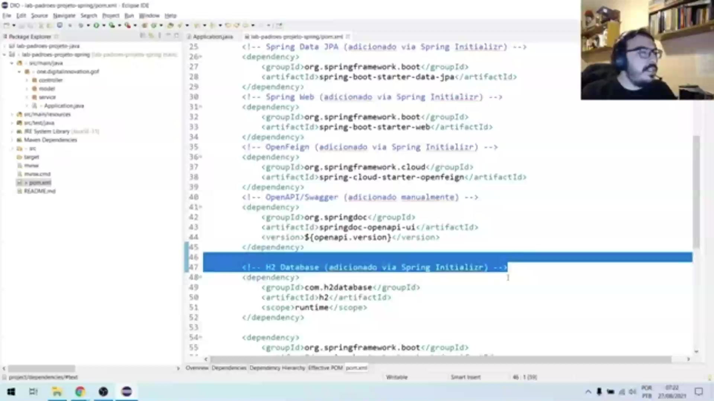
</p>

As dependências listadas no `pom.xml` incluem os módulos selecionados no Initializr e adições manuais para documentação. Destacam-se o **Spring Boot Starter Data JPA** para persistência, o **OpenFeign** para comunicação HTTP e o **Springdoc OpenAPI (Swagger)**, incluído manualmente para gerar a interface visual de testes da API.

```xml
<dependency>
    <groupId>org.springframework.boot</groupId>
    <artifactId>spring-boot-starter-data-jpa</artifactId>
</dependency>
<dependency>
    <groupId>org.springframework.boot</groupId>
    <artifactId>spring-boot-starter-web</artifactId>
</dependency>
<dependency>
    <groupId>org.springframework.cloud</groupId>
    <artifactId>spring-cloud-starter-openfeign</artifactId>
</dependency>
<dependency>
    <groupId>org.springdoc</groupId>
    <artifactId>springdoc-openapi-ui</artifactId>
    <version>${openapi.version}</version>
</dependency>
<dependency>
    <groupId>com.h2database</groupId>
    <artifactId>h2</artifactId>
    <scope>runtime</scope>
</dependency>
```

#### Modelo Cliente (Entity)

<p align="center">
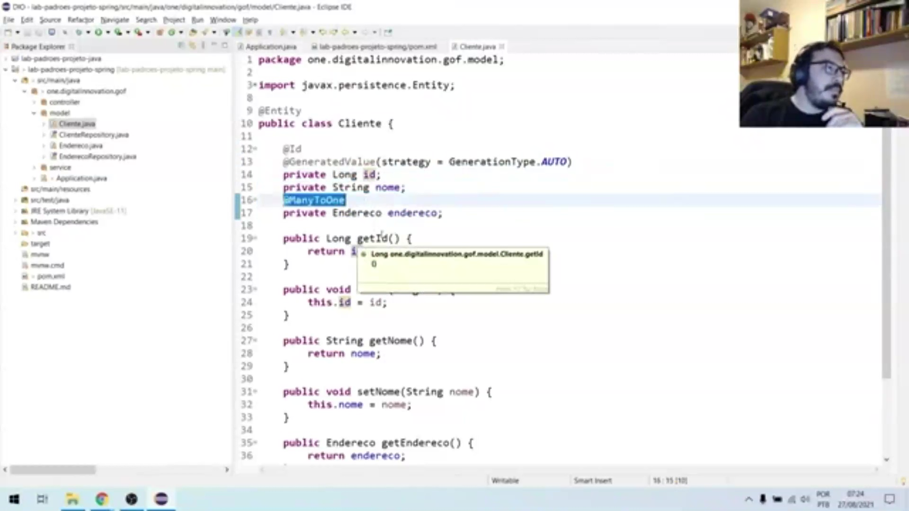
</p>

A classe `Cliente` representa uma entidade no banco de dados. Ela utiliza anotações do JPA para definir o mapeamento objeto-relacional (ORM), com um ID auto-gerado e uma relação de muitos para um (`@ManyToOne`) com a classe `Endereco`. Essa estrutura permite que múltiplos clientes compartilhem o mesmo registro de endereço baseado no CEP.

```java
@Entity
public class Cliente {
    @Id
    @GeneratedValue(strategy = GenerationType.AUTO)
    private Long id;
    private String nome;
    @ManyToOne
    private Endereco endereco;

    public Long getId() { return id; }
    public void setId(Long id) { this.id = id; }
    public String getNome() { return nome; }
    public void setNome(String nome) { this.nome = nome; }
}
```

#### Modelo Endereco e jsonschema2pojo

<p align="center">
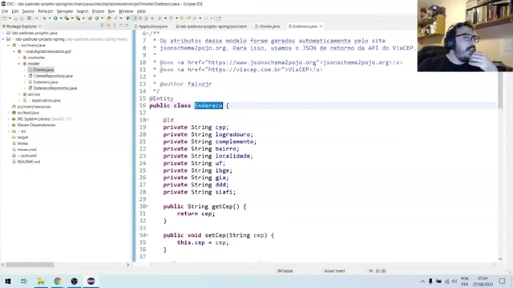
</p>

A entidade `Endereco` foi estruturada para refletir os dados retornados pela API do ViaCEP. Para agilizar o desenvolvimento, os atributos desta classe foram gerados automaticamente a partir do formato JSON, utilizando a ferramenta **jsonschema2pojo**. No Java, as anotações do JPA garantem que esses dados sejam persistidos de forma consistente no banco de dados H2.

```java
@Entity
public class Endereco {
    @Id
    private String cep;
    private String logradouro;
    private String complemento;
    private String bairro;
    private String localidade;
    private String uf;
    private String ibge;
    private String gia;
    private String ddd;
    private String siafi;

    public String getCep() { return cep; }
    public void setCep(String cep) { this.cep = cep; }
}
```

#### Documentação ViaCEP

<p align="center">
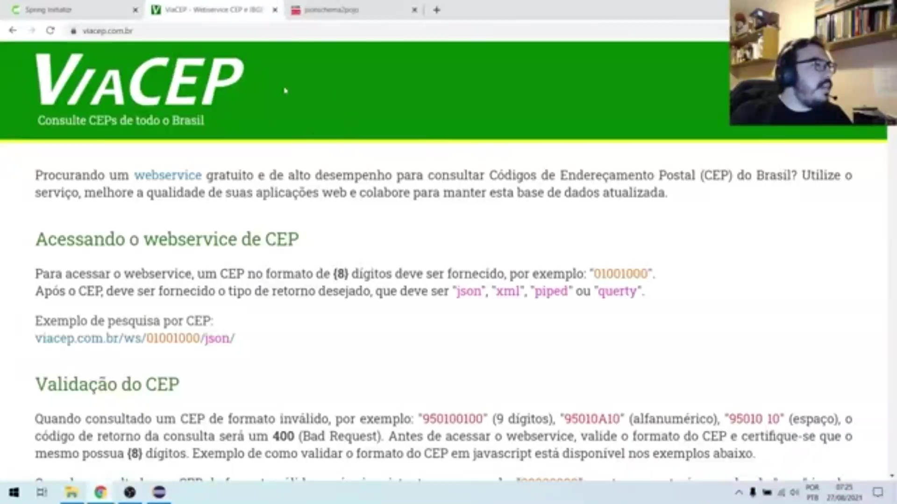
</p>

O serviço **ViaCEP** é utilizado como fonte externa para consulta de endereços. A documentação técnica do webservice especifica que as requisições devem seguir o formato de 8 dígitos para o CEP, permitindo retornos em diversos formatos, como JSON e XML. Este serviço é a base para o enriquecimento dos dados do cliente durante o cadastro.

#### Formatos de Retorno (JSON)

<p align="center">
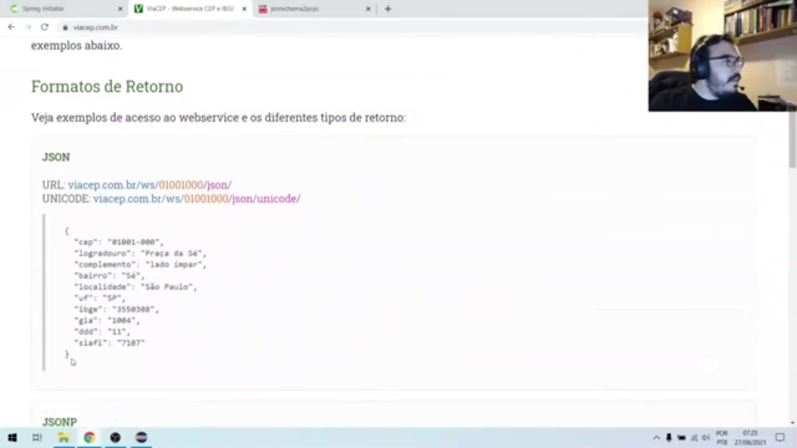
</p>

A imagem demonstra o formato de retorno **JSON** da API ViaCEP. Este objeto contém campos como `logradouro`, `bairro`, `localidade` e `uf`. É exatamente esta estrutura que foi copiada para servir de modelo na geração automática da classe Java, garantindo que o mapeamento dos campos seja compatível com a resposta do webservice.

#### Interface do jsonschema2pojo

<p align="center">
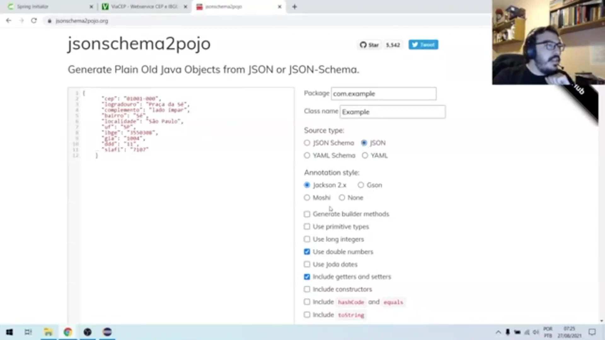
</p>

O site **jsonschema2pojo.org** é uma ferramenta utilitária que converte esquemas JSON ou instâncias JSON diretamente em POJOs (Plain Old Java Objects). Configurações como o estilo de anotação (Jackson, Gson), inclusão de getters/setters e construtores podem ser definidas na interface para automatizar a criação de classes de transporte de dados.

#### Preview de Código Gerado

<p align="center">
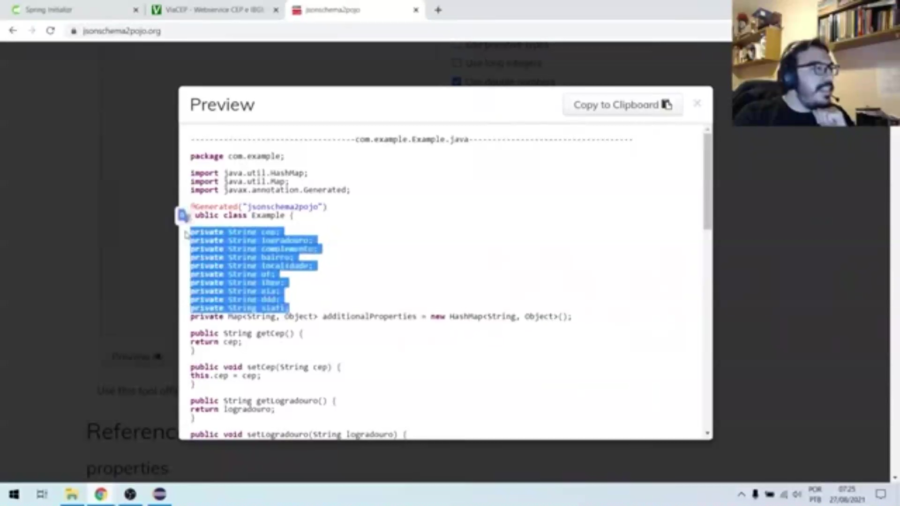
</p>

Após a inserção do JSON, a ferramenta gera uma visualização do código Java resultante. Este processo evita o trabalho repetitivo de digitação e mapeamento manual de campos de APIs externas, fornecendo uma base sólida que pode ser copiada diretamente para o projeto e enriquecida com anotações de persistência do Spring Data JPA.

#### Interface ClienteRepository

<p align="center">
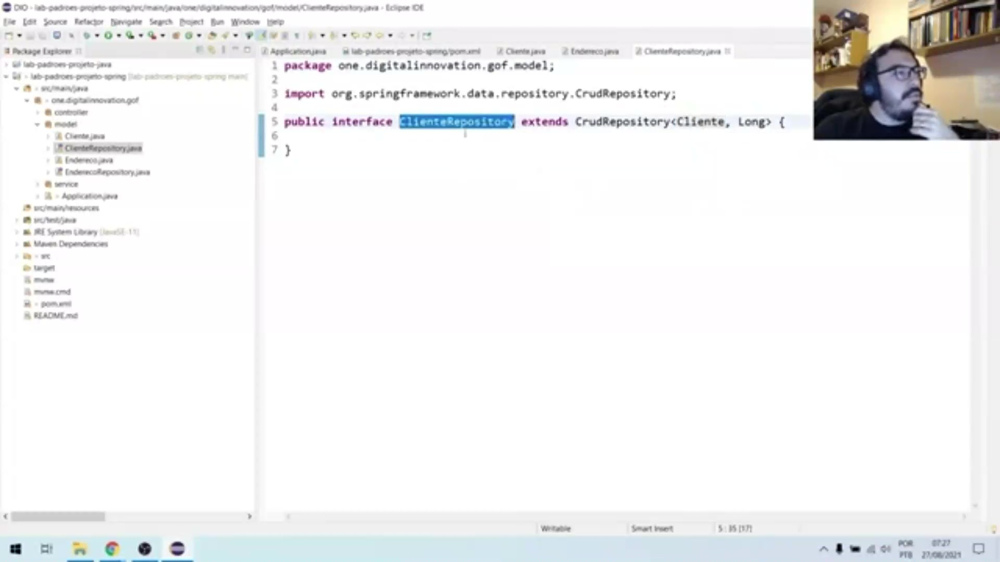
</p>

A interface `ClienteRepository` estende `CrudRepository`. Ao fazer isso, o Spring Data JPA injeta automaticamente as implementações concretas para operações básicas de banco de dados (inserir, buscar, deletar). Este padrão é um exemplo de como o Spring utiliza o padrão **Strategy** para definir comportamentos de acesso a dados.

```java
package one.digitalinnovation.gof.model;

import org.springframework.data.repository.CrudRepository;

public interface ClienteRepository extends CrudRepository<Cliente, Long> {
}
```

#### Interface CrudRepository (Spring Data)

<p align="center">
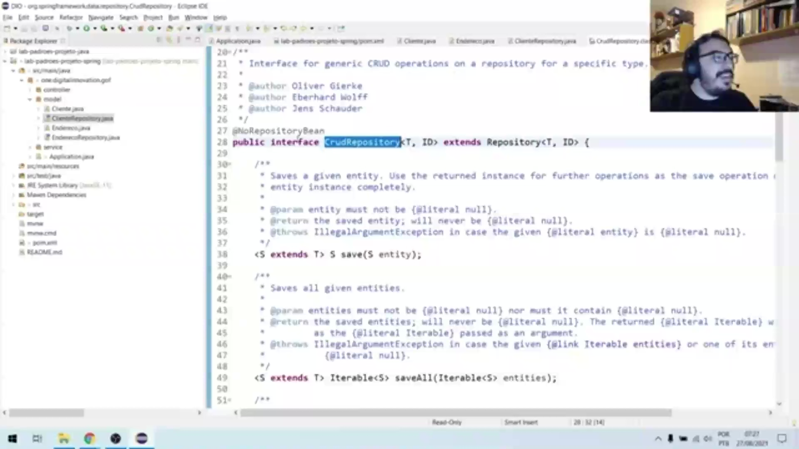
</p>

A interface genérica `CrudRepository` do Spring Data fornece os métodos padrão para operações de CRUD. Ela recebe como parâmetros o tipo da entidade (`T`) e o tipo do identificador (`ID`). Métodos como `save(S entity)` e `findAll()` são definidos aqui e utilizados pelas interfaces de repositório do projeto para interagir com o banco H2.

#### Interface ClienteService (Strategy)

<p align="center">
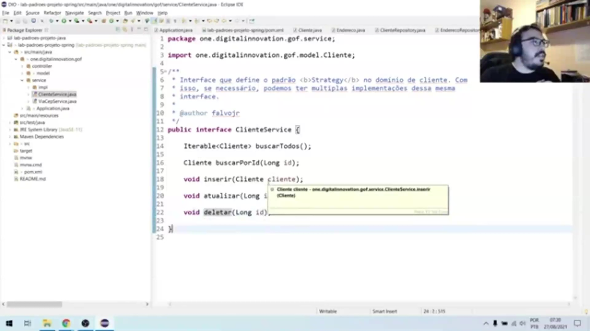
</p>

A camada de serviço utiliza uma interface para definir o contrato de operações de negócio. A interface `ClienteService` representa o padrão **Strategy**, definindo os métodos necessários para o gerenciamento de clientes. A implementação concreta dessas regras será realizada em uma classe separada, permitindo a troca de estratégias de implementação se necessário.

```java
public interface ClienteService {
    Iterable<Cliente> buscarTodos();
    Cliente buscarPorId(Long id);
    void inserir(Cliente cliente);
    void atualizar(Long id, Cliente cliente);
    void deletar(Long id);
}
```

#### ClienteRestController e Endpoints REST

<p align="center">
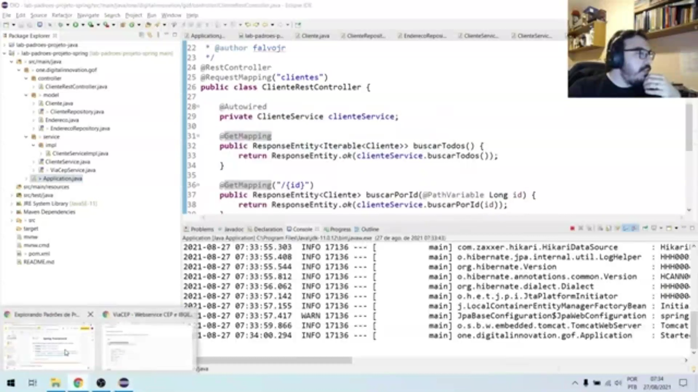
</p>

O `ClienteRestController` é o componente responsável por expor os endpoints da API. Ele utiliza anotações como `@RestController` e `@RequestMapping("clientes")`. O controlador delega as operações para o `ClienteService`, seguindo o padrão **Facade** para abstrair a complexidade da lógica de negócio e oferecer uma interface simples para o consumo via HTTP.

```java
@RestController
@RequestMapping("clientes")
public class ClienteRestController {
    @Autowired
    private ClienteService clienteService;

    @GetMapping
    public ResponseEntity<Iterable<Cliente>> buscarTodos() {
        return ResponseEntity.ok(clienteService.buscarTodos());
    }

    @GetMapping("/{id}")
    public ResponseEntity<Cliente> buscarPorId(@PathVariable Long id) {
        return ResponseEntity.ok(clienteService.buscarPorId(id));
    }
}
```

#### Interface Visual Swagger UI (OpenAPI)

<p align="center">
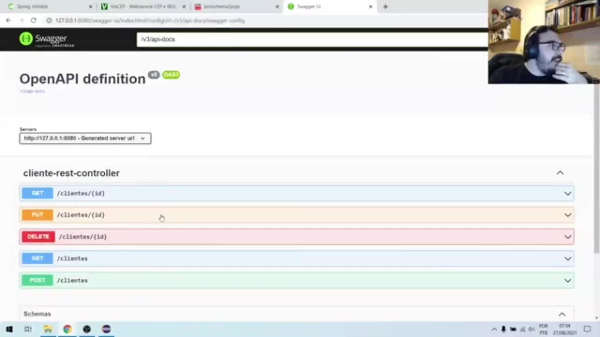
</p>

Ao executar a aplicação, a dependência do OpenAPI expõe automaticamente uma documentação interativa no endereço `localhost:8080/swagger-ui.html`. Esta interface lista todos os endpoints definidos no controlador, permitindo testar requisições GET, POST, PUT e DELETE diretamente do navegador, facilitando a validação das funcionalidades sem ferramentas externas como o Postman.


### 🟩 Vídeo 08 - Praticando com Spring: Padrões de Projeto em uma API REST

<video width="60%" controls>
  <source src="000-Midia_e_Anexos/bootcamp_tqi_fullstack-modulo.07-curso.03-video_08.webm" type="video/webm">
    Seu navegador não suporta vídeo HTML5.
</video>

link do vídeo: https://web.dio.me/lab/explorando-padroes-de-projetos-na-pratica-com-java/learning/5393f0ce-16cc-4132-9285-77743f5c6bb3

Aqui está o documento Markdown preenchido rigorosamente conforme solicitado. As explicações foram integradas logo após cada bloco visual, mantendo a estrutura original imutável e aplicando os conceitos abordados no contexto didático.

<p align="center">
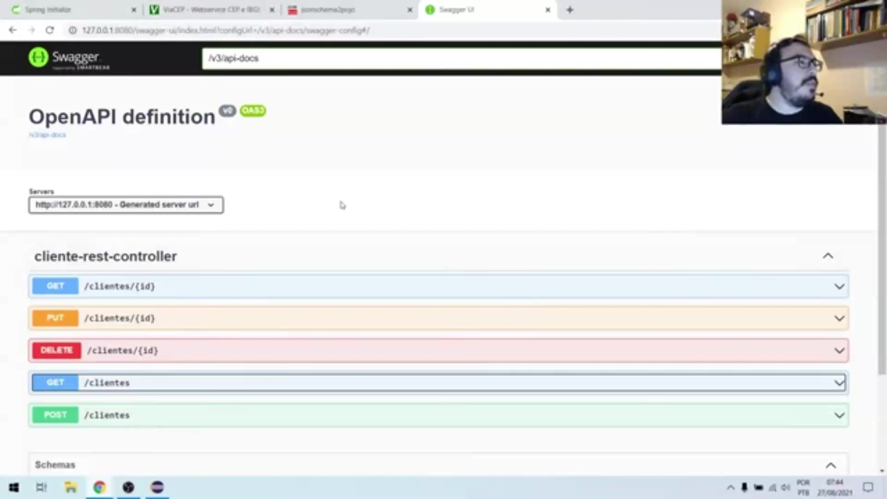
</p>

A imagem apresenta a interface gráfica do Swagger, gerada automaticamente pelo OpenAPI. Esta ferramenta fornece uma documentação interativa e amigável da API REST, listando os endpoints disponíveis para a entidade "clientes" , incluindo as operações HTTP padrão: `GET` para busca, `POST` para criação, `PUT` para atualização e `DELETE` para remoção de registros. O servidor local utilizado para acesso está rodando na porta 8080 (`127.0.0.1:8080`).

<p align="center">
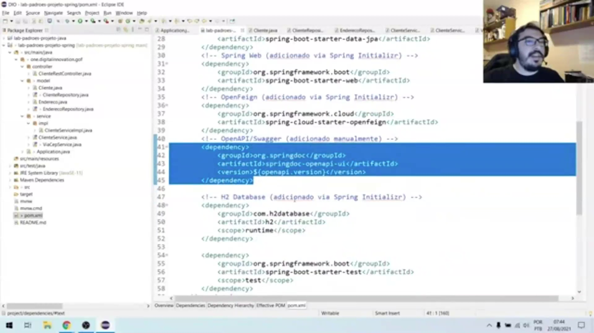
</p>

A visualização na IDE exibe o arquivo de configuração de dependências do projeto (o arquivo `pom.xml` no Maven). É destacada a adição manual da dependência `springdoc-openapi-ui`, responsável por importar a biblioteca do OpenAPI para o ecossistema Spring Boot, habilitando a interface visual explorada anteriormente.

```xml
<dependency>
    <groupId>org.springdoc</groupId> [cite: 88]
    <artifactId>springdoc-openapi-ui</artifactId> [cite: 89]
    <version>${openapi.version}</version> [cite: 90]
</dependency>
```

<p align="center">
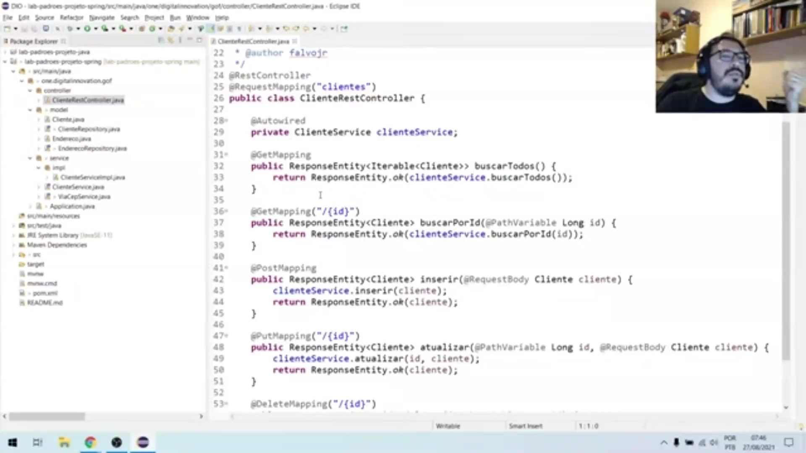
</p>

O código apresenta a estrutura base da classe `ClienteRestController`, que atua como o ponto de entrada principal para o recebimento das requisições externas na API. Utilizando as anotações semânticas do Spring MVC, como `@GetMapping` , `@PostMapping` , `@PutMapping` e `@DeleteMapping` , ela mapeia os verbos HTTP correspondentes para a rota principal `/clientes` definida em nível de classe.

<p align="center">
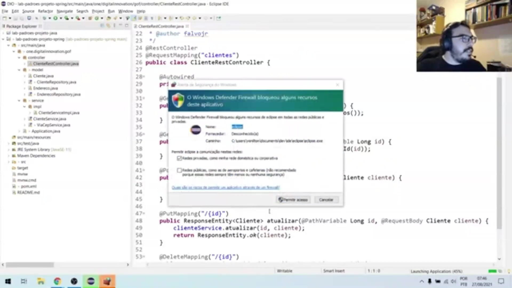
</p>

Durante o processo de execução inicial do servidor local embutido para fins de depuração (debug), é exibido um aviso de segurança do Windows Defender Firewall. Este alerta indica que regras de rede internas precisam de permissão para permitir que a IDE libere o tráfego nas portas de comunicação da aplicação.

<p align="center">
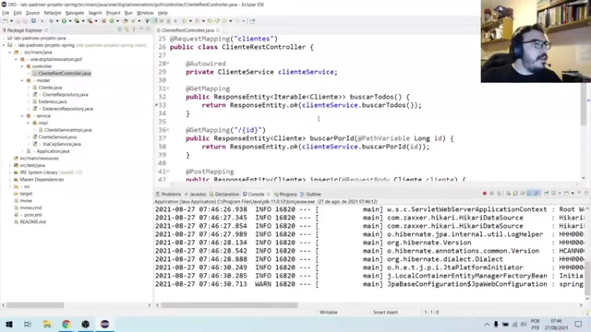
</p>

A aplicação se encontra em estado de depuração. Um ponto de interrupção (breakpoint) foi inserido e atingido na linha de retorno do método `buscarTodos()`, dentro do controlador REST. Esse mecanismo pausa a execução em tempo real, permitindo a inspeção detalhada do fluxo de processamento e das variáveis instanciadas naquele momento exato.

<p align="center">
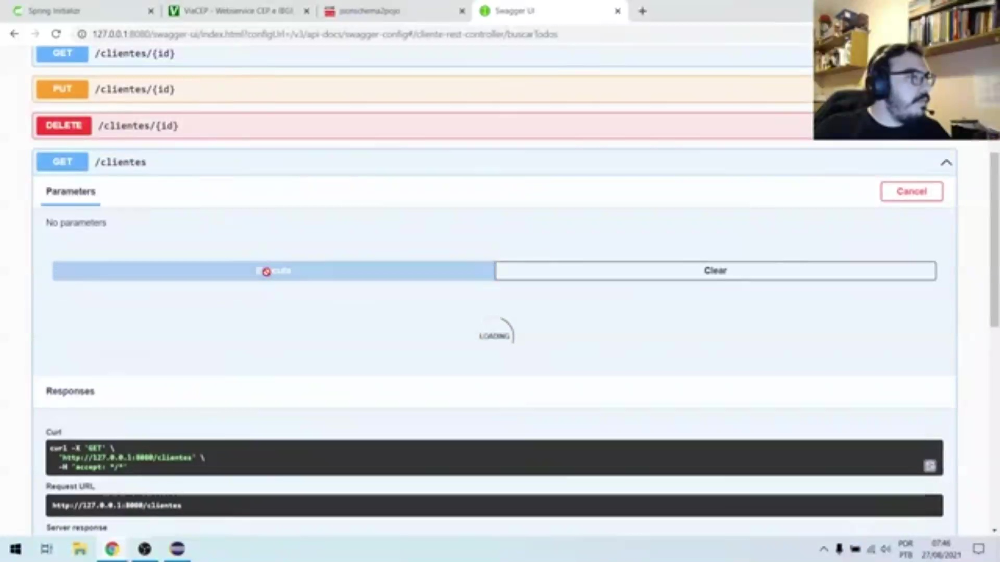
</p>

A interface do Swagger encontra-se bloqueada em um estado de "LOADING" após o acionamento de um endpoint (no caso, a URL de requisição `/clientes` ). Isso é o reflexo visual da interrupção causada pelo ponto de depuração (breakpoint) estabelecido no código-fonte; a resposta da requisição não foi finalizada e entregue de volta ao cliente HTTP.

<p align="center">
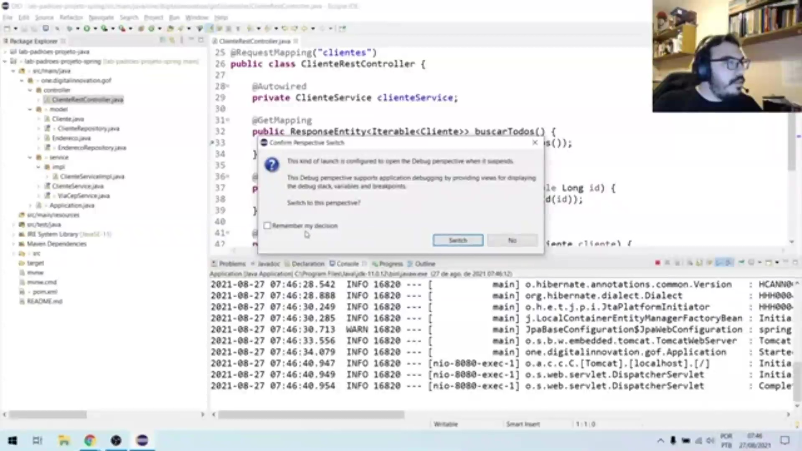
</p>

Pela inspeção flutuante na IDE durante o modo debug, nota-se que a variável `clienteService` foi injetada corretamente pelo contêiner do Spring. Em vez de uma interface abstrata, a injeção proveu uma classe concreta que implementa o comportamento esperado. O identificador numérico interno e final da referência de memória indica a instância específica desse objeto sendo administrada pelo framework.

<p align="center">
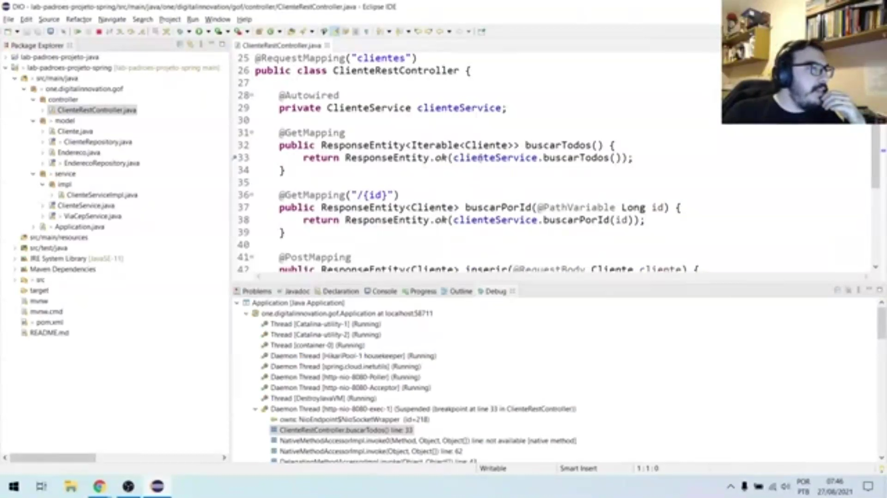
</p>

A visão consolidada na IDE demonstra o código do `ClienteRestController` na parte superior, onde o controlador realiza chamadas diretas para os métodos expostos pelo contrato de serviço (como `clienteService.buscarTodos()`). Na parte inferior, o painel de log (Console) registra eventos normais de execução, como inicialização de pools de threads  e mapeamento interno do Tomcat subjacente.

<p align="center">
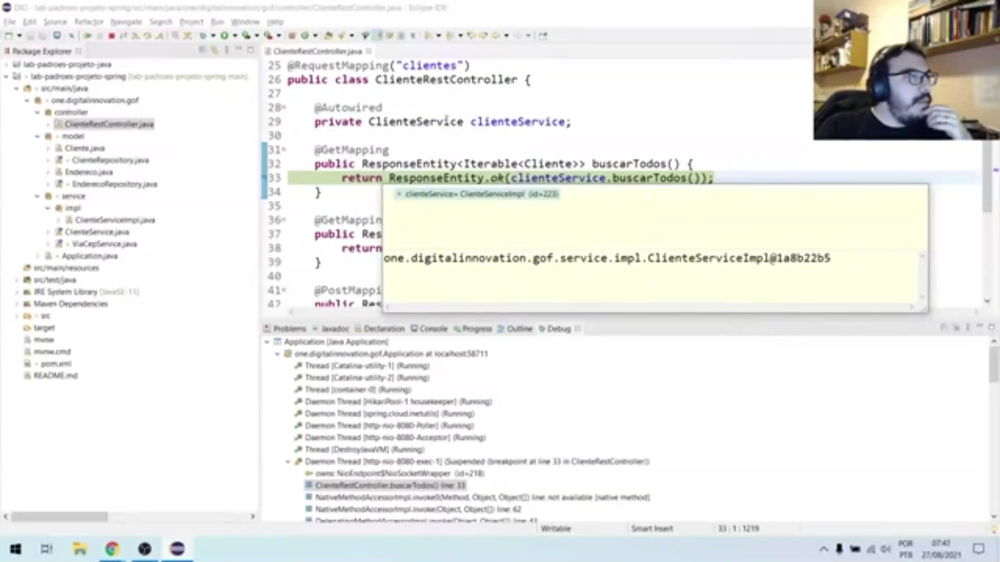
</p>

Inspecionando a variável injetada novamente após uma nova requisição, a referência do objeto instanciado visualizada via tooltip na IDE (`one.digitalinnovation.gof.service.impl.ClienteServiceImpl@1a8b22b5`)  continua idêntica. Isso evidencia na prática o padrão Singleton adotado como padrão pelo Spring: a mesma instância exata do componente de serviço gerencia e atende a chamadas repetidas no ciclo de vida da aplicação.

<p align="center">
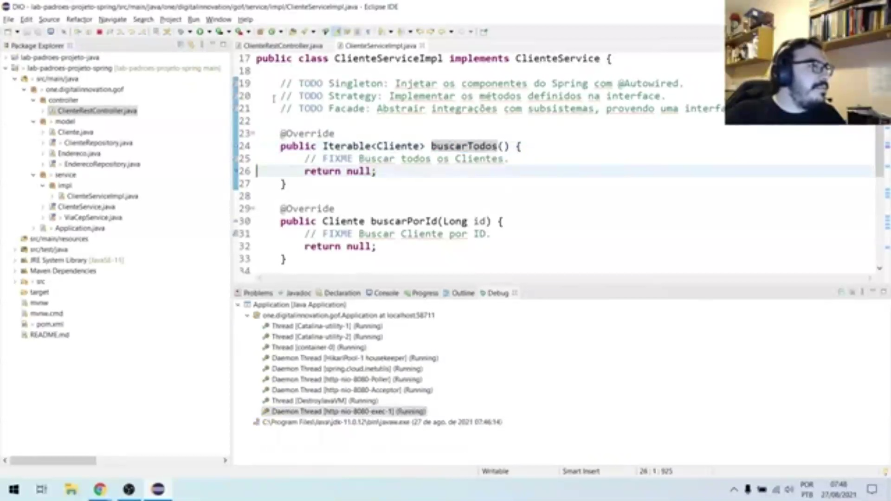
</p>

A estrutura inicial da classe `ClienteServiceImpl`, que implementa as regras de negócio definidas na interface base. São listadas as marcações semânticas via comentários "TODO", definindo os passos arquiteturais para compor a solução com injeção de dependências (Singleton), cumprimento de contratos (Strategy) e ocultação da complexidade das integrações (Facade).

```java
// TODO Singleton: Injetar os componentes do Spring com @Autowired. [cite: 508]
// TODO Strategy: Implementar os métodos definidos na interface. [cite: 511]
// TODO Facade: Abstrair integrações com subsistemas, provendo uma interfe [cite: 513]
```

<p align="center">
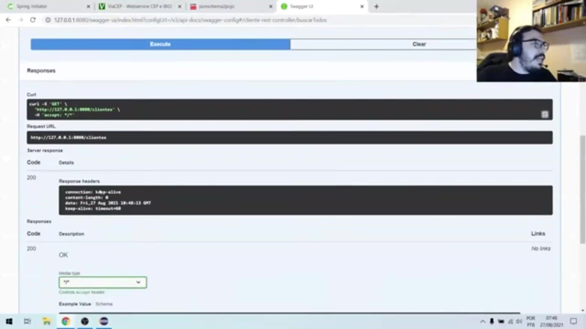
</p>

O contexto visual retorna brevemente à interface web de requisição, preparando as fundações mentais para iniciar a implementação da lógica. Reforça-se a ligação entre o painel de teste do Swagger e o impacto do código que deve ser redigido nos passos estipulados pelos indicadores de tarefa "TODO".

<p align="center">
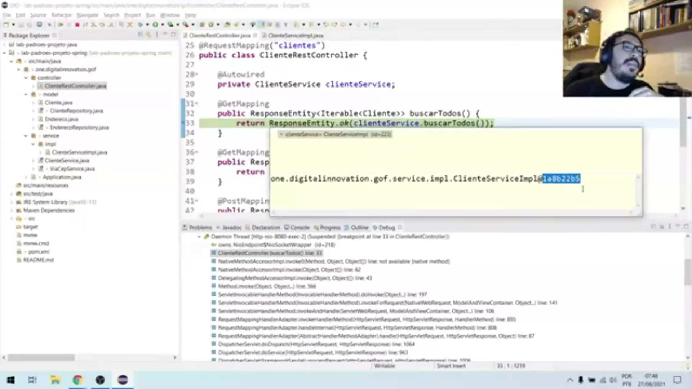
</p>

A perspectiva retorna à classe de infraestrutura web, reavaliando o controlador de rotas. Fica evidente que as diretrizes estruturais da lógica de negócio na retaguarda serão moldadas para suprir precisamente as necessidades de roteamento solicitadas na borda externa do sistema.

<p align="center">
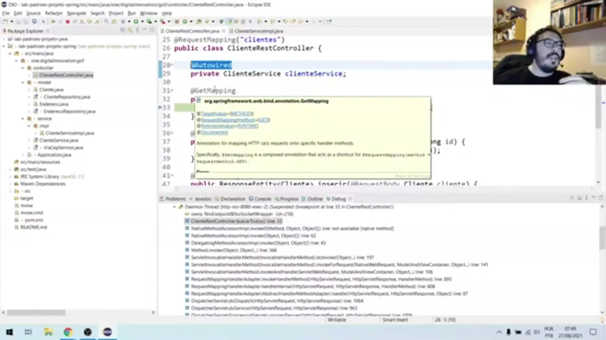
</p>

O instrutor destaca a anotação `@Autowired`, evidenciada via contextualização da IDE. Esse mecanismo chave do Spring realiza a configuração e a conexão autônoma de objetos geridos pelo framework, poupando a codificação manual e fortalecendo a adoção dos paradigmas fundamentais de Inversão de Controle e Injeção de Dependências.

<p align="center">
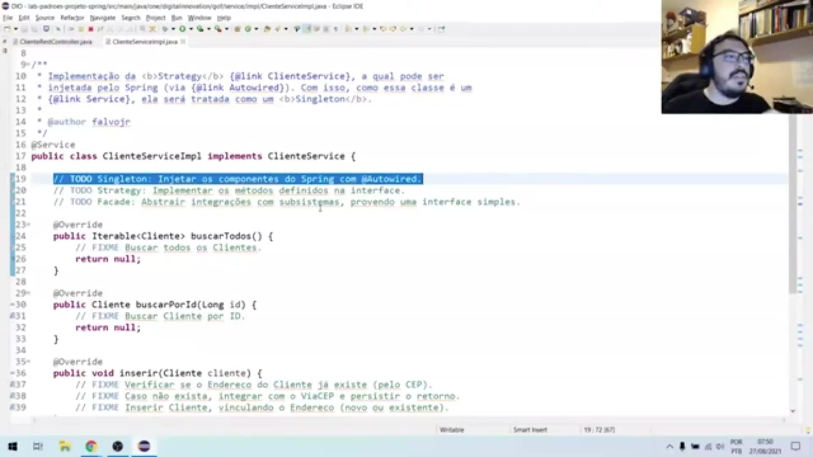
</p>

O foco centraliza-se em dar andamento prático ao primeiro item dos lembretes inseridos no escopo do serviço de clientes. O bloco selecionado define o alvo imediato de codificação: acoplar componentes fundamentais de manipulação de dados em bancos (como repositórios) na lógica central do negócio de clientes.

<p align="center">
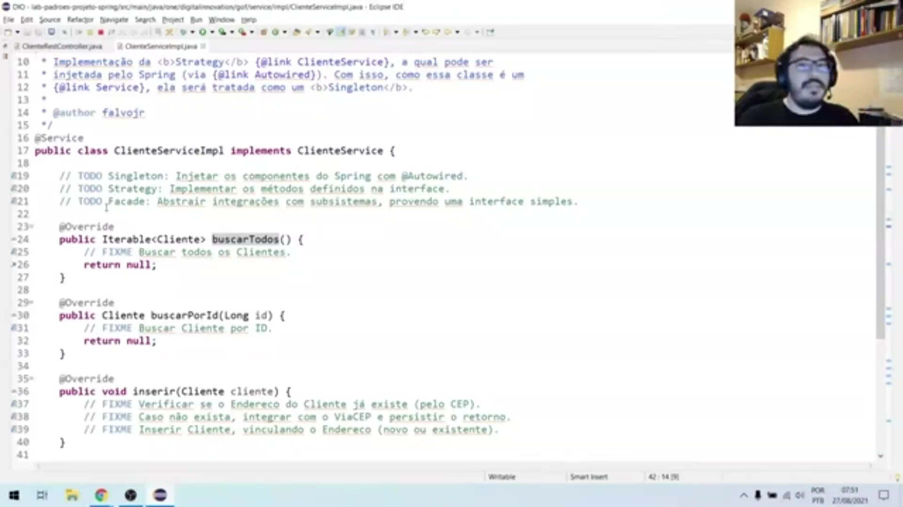
</p>

Linhas de espaçamento são inseridas imediatamente abaixo da meta estabelecida de injeção de dependências no `ClienteServiceImpl`. É o momento exato de estruturação antes da digitação das declarações para referenciar os artefatos de persistência através de anotações específicas.

<p align="center">
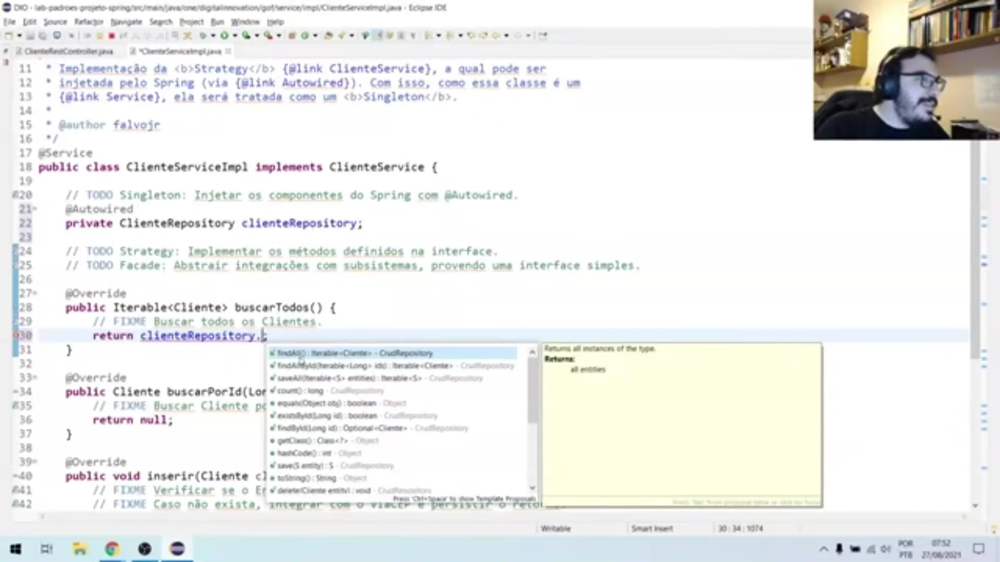
</p>

A injeção do primeiro componente chave, `ClienteRepository`, é devidamente codificada como um campo restrito (`private`). Em seguida, a IDE apresenta funções autocompletadas na primeira requisição funcional (buscar todos). O repositório é invocado delegando a operação padronizada de buscar dados generalistas.

<p align="center">
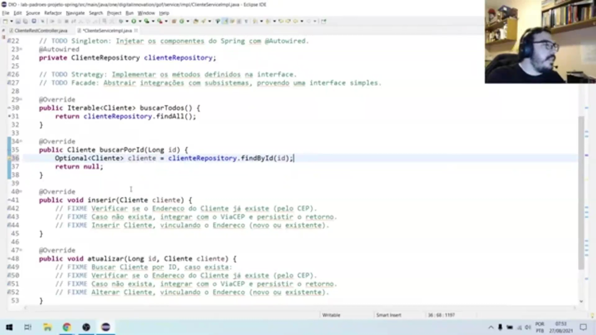
</p>

As duas operações simplificadas de consulta são estabelecidas. No contexto global da coleção, o repositório consome `findAll()`. Para as buscas individuais através de identificador único, um recurso semântico moderno do Java — classe empacotadora de contingência `Optional` — é acionado juntamente com o método utilitário nativo `findById()`.

```java
@Override
public Iterable<Cliente> buscarTodos() {
    return clienteRepository.findAll();
}

@Override
public Cliente buscarPorId(Long id) {
    Optional<Cliente> cliente = clienteRepository.findById(id);
    return null;
}
```

<p align="center">
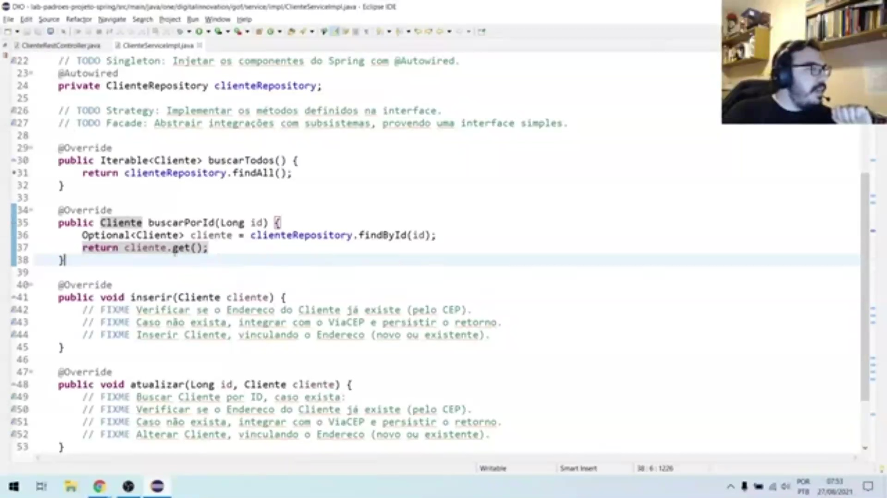
</p>

Complementando o escopo da operação pontual, o bloco de encapsulamento `Optional` tem seus limites transpassados com a evocação do comando `.get()`. Na prática adotada, priorizou-se de forma direta a remoção do invólucro para extrair o objeto purificado e enviá-lo de volta através da fronteira arquitetural.

<p align="center">
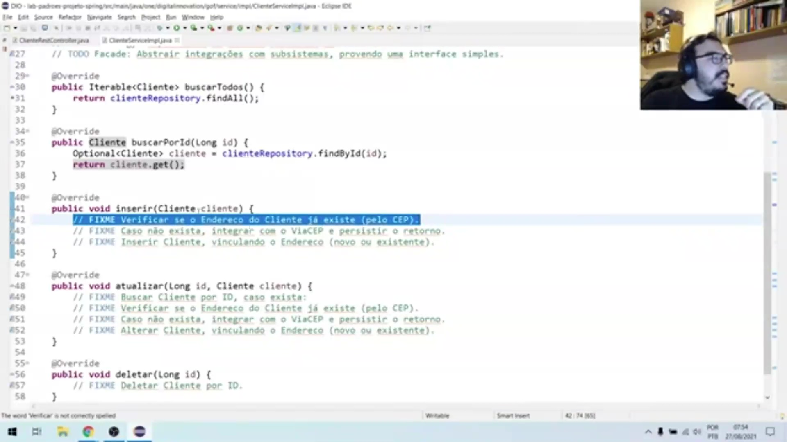
</p>

A atenção recai estrategicamente nas regras de criação de novas entidades. O instrutor seleciona o descritivo da lógica para verificar existência de registros complementares (endereços) anexos ao cliente principal através de suas chaves identificadoras exclusivas antes de aplicar comandos fixos no banco de dados local.

<p align="center">
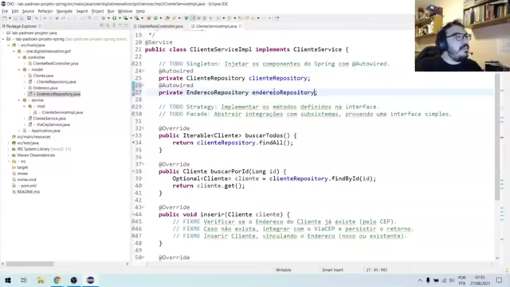
</p>

O componente responsável pelas rotinas de gestão isolada de endereços é instanciado. O recurso referenciado pelo identificador de repositório de endereço atuará lado a lado com a manipulação de objetos clientes primários para concretizar lógicas compostas.

```java
@Autowired
private EnderecoRepository enderecoRepository;
```

<p align="center">
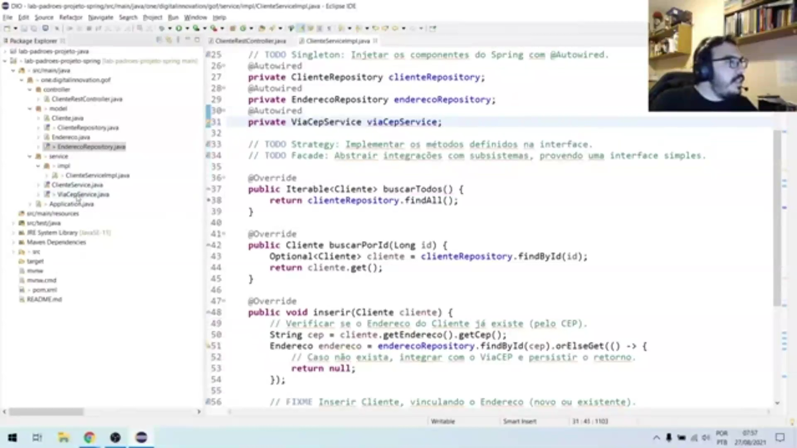
</p>

Uma infraestrutura de mensageria externa via REST (`ViaCepService` ) é providenciada e integrada nativamente no ambiente do Spring sob o guarda-chuva de cliente Feign. Com o acesso embutido, a função de salvamento avança resgatando a identificação (CEP) para uma varredura interna (Via repositório de endereço ). Um cenário alternativo de execução imperativa baseada na função utilitária `orElseGet` é planejado na contingência do endereço inexistir localmente.

```java
@Autowired
private ViaCepService viaCepService;

//...
@Override
public void inserir(Cliente cliente) {
    String cep = cliente.getEndereco().getCep();
    Endereco endereco = enderecoRepository.findById(cep).orElseGet(() -> {
        // ...
        return null;
    });
}
```

<p align="center">
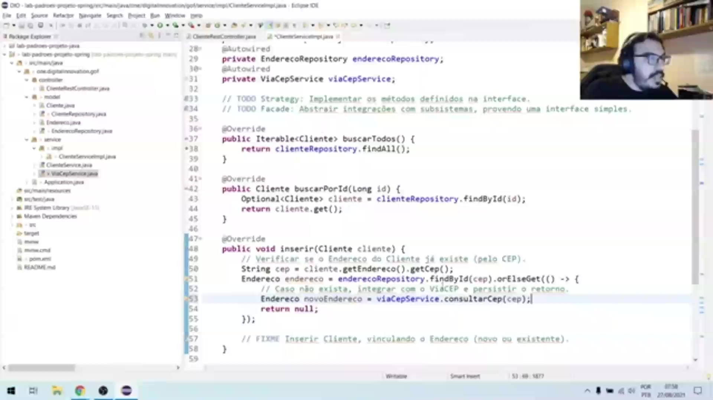
</p>

O acionamento inteligente deFallback toma formato completo no interior do lambda acoplado ao `orElseGet`. Conectando os limites do negócio (Facade), a falta de dado pré-existente engatilha a captação externa do dado atualizado nos correios, seguida imperativamente de sua submissão compulsória à unidade local de banco para posterior reúso futuro.

<p align="center">
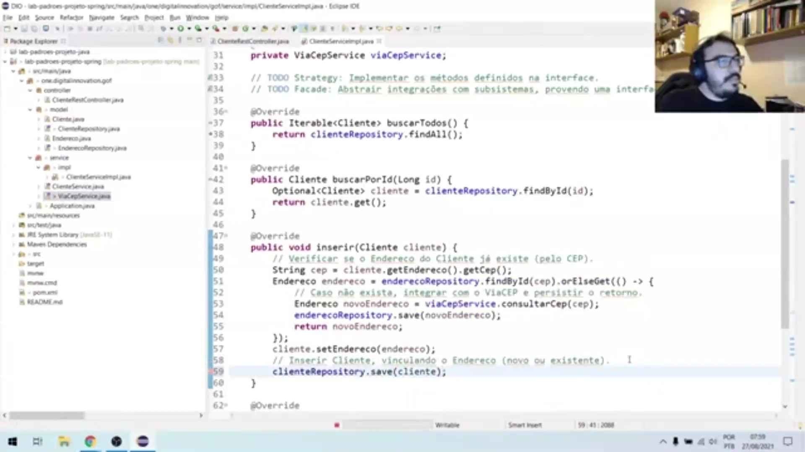
</p>

Concluídas as verificações colaterais e consolidadas as amarras de dados, encerra-se o procedimento primário fixando o dado auxiliar no modelo da entidade base. Por consequência natural e de forma encadeada, submete-se toda a estrutura de negócio (O cliente enriquecido) para a unidade responsável pelo registro final através da instrução de salvamento global.

```java
        return novoEndereco;
    });
    cliente.setEndereco(endereco);
    // Inserir Cliente, vinculando o Endereco (novo ou existente).
    clienteRepository.save(cliente);
}
```

<p align="center">
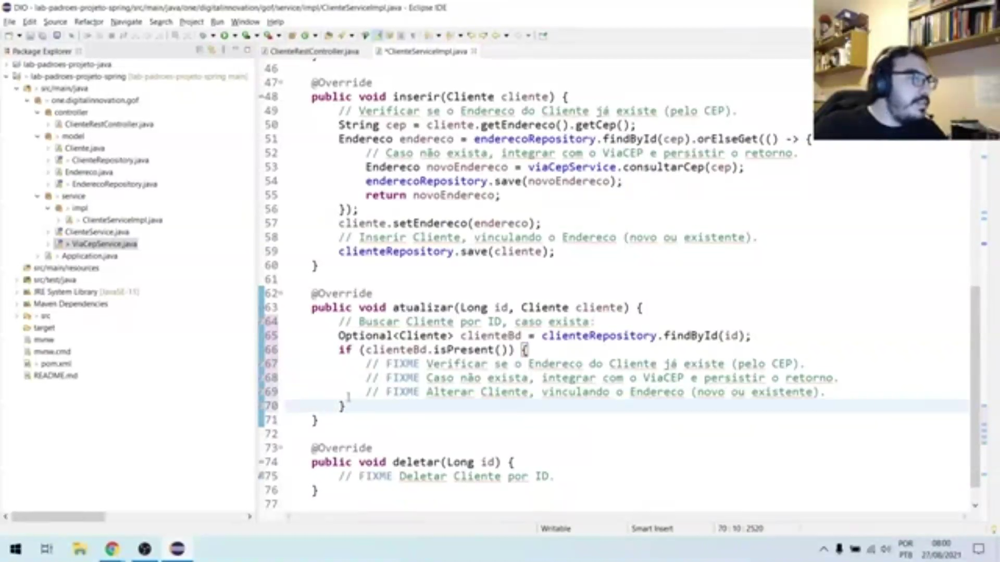
</p>

Passa-se o escopo ao bloco de atualização de entidades previamente existentes na base. Exibe-se que a mecânica fundamental para garantir que dados falsos não corrompam a fonte (verificando antes a integridade via identificador numérico com um teste booleano em caso de valor verdadeiro da empacotadora de resultados `Optional`). Após as garantias de viabilidade, o resto será rigorosamente espelhado ao salvamento primário.

<p align="center">
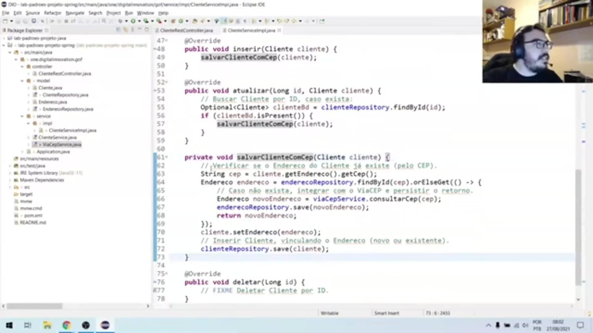
</p>

Adotando diretrizes essenciais (Don't Repeat Yourself), o agrupamento lógico maciço que compõe toda a complexa engenharia de preenchimento e busca externa de informações foi recortado em sua inteireza. Transformou-se todo esse volume numa conveniente declaração rotineira provada e nomeada sinteticamente como `salvarClienteComCep`.

```java
private void salvarClienteComCep(Cliente cliente) {
    // Verificar se o Endereco do Cliente já existe (pelo CEP).
    String cep = cliente.getEndereco().getCep();
    Endereco endereco = enderecoRepository.findById(cep).orElseGet(() -> {
        // Caso não exista, integrar com o ViaCEP e persistir o retorno.
        Endereco novoEndereco = viaCepService.consultarCep(cep);
        enderecoRepository.save(novoEndereco);
        return novoEndereco;
    });
    cliente.setEndereco(endereco);
    // Inserir Cliente, vinculando o Endereco (novo ou existente).
    clienteRepository.save(cliente);
}
```

<p align="center">
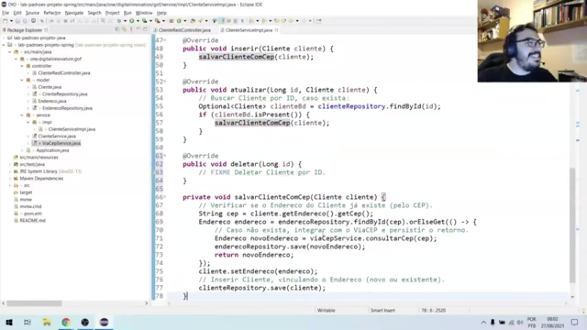
</p>

Os contratos definidores dos métodos ganharam elegância com a integração do auxílio prático contido no bloco segregado anterior. Tanto no segmento encarregado de injetar clientes novos, quanto no segmento responsável pelas alterações mediante constatação de registros precedentes, a robusta e agora reusada estrutura se faz presente diminuindo incertezas estruturais e simplificando os comandos.

```java
@Override
public void atualizar(Long id, Cliente cliente) {
    // Buscar Cliente por ID, caso exista
    Optional<Cliente> clienteBd = clienteRepository.findById(id);
    if (clienteBd.isPresent()) {
        salvarClienteComCep(cliente);
    }
}
```

<p align="center">
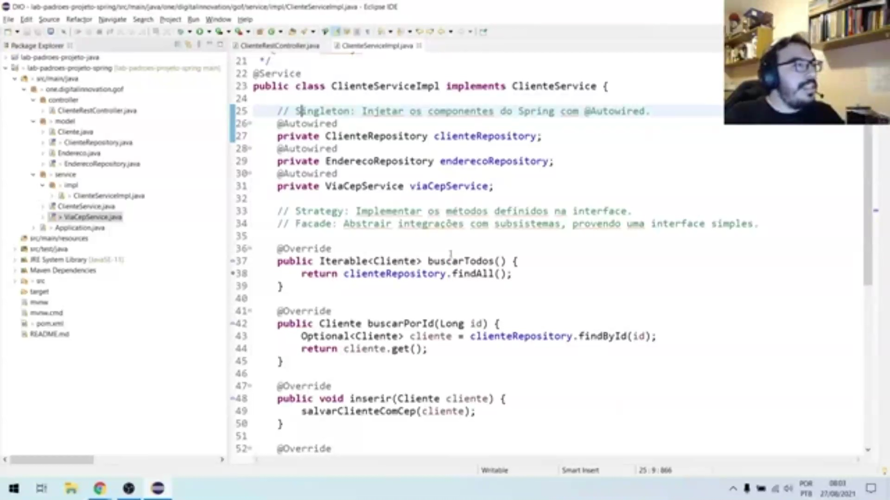
</p>

Para suprir os deveres finais definidos, despacha-se o requerimento simples que tem o condão de neutralizar permanentemente registros do armazenamento relacional subjacente. A unidade gerenciadora recebe via chave identificadora de transição primária a solicitação peremptória de exclusão de dados correspondente (`deleteById`).

```java
@Override
public void deletar(Long id) {
    // FIXME Deletar Cliente por ID.
    clienteRepository.deleteById(id);
}
```

<p align="center">
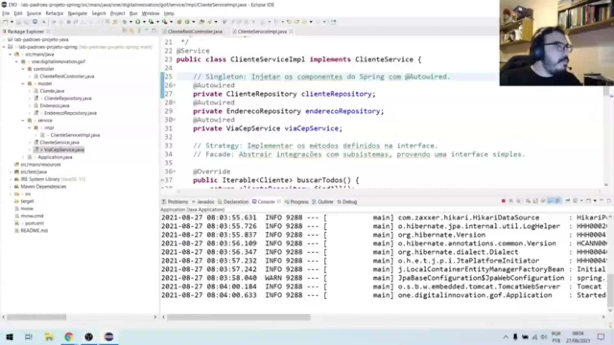
</p>

Finalizadas as implementações de dependência na retaguarda, um "restart" generalizado impulsiona novamente todo o emaranhado sistêmico do projeto Spring Boot. Informações na central consolidadora atestam o refazer bem sucedido de tramas cruciais do contêiner e a completa transição pacífica para uma situação estabilizada e receptiva do servidor embutido.

<p align="center">
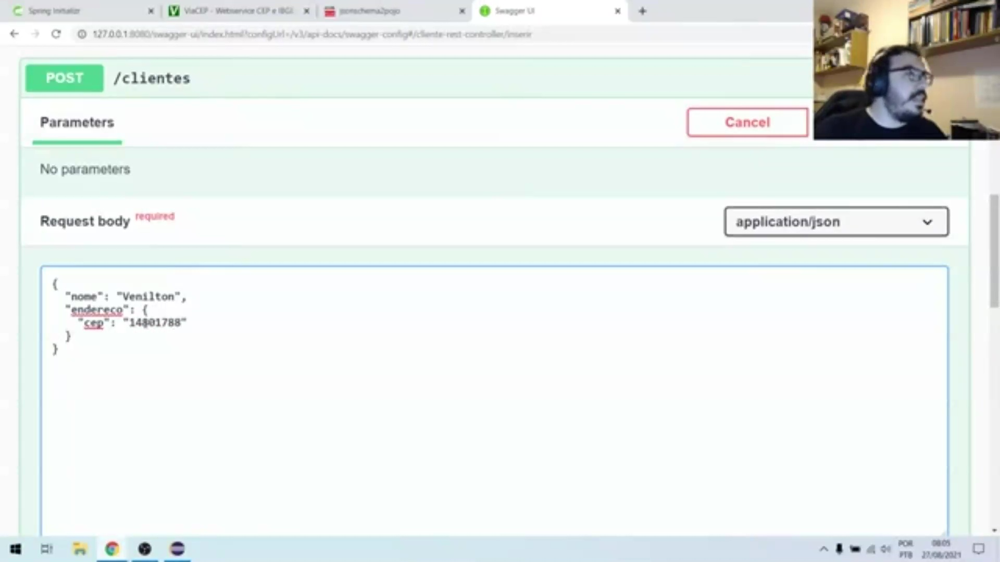
</p>

O teste dinâmico e visual da API tem início na porta de entrada da requisição de inserção (POST). Em demonstração direta, envia-se à matriz uma solicitação simples encapsulando dados elementares formatados em linguagem padrão (JSON), contendo puramente o nome fictício e o correspondente referencial numérico dos correios brasileiros (CEP).

```json
{
  "nome": "Venilton",
  "endereco": {
    "cep": "14801-788"
  }
}
```

<p align="center">
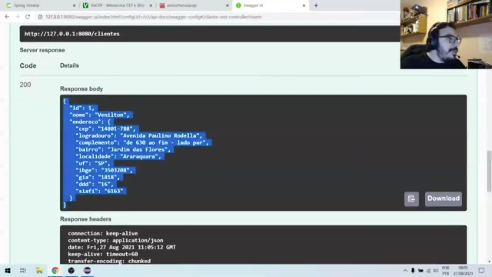
</p>

Como fruto da operação submetida e processada pelas lógicas de fachada e serviço consolidadas (Facade + ViaCepService), a devolução da camada restritiva comprova a metamorfose das informações. O fragmento elementar enviado desdobrou-se gerando no retorno não apenas um cliente instanciado (status 200 OK), como todos os predicativos espaciais e descritivos em cascata inerentes a referida localização extraídos confiavelmente de fonte exterior (logradouro, bairro, etc).

<p align="center">
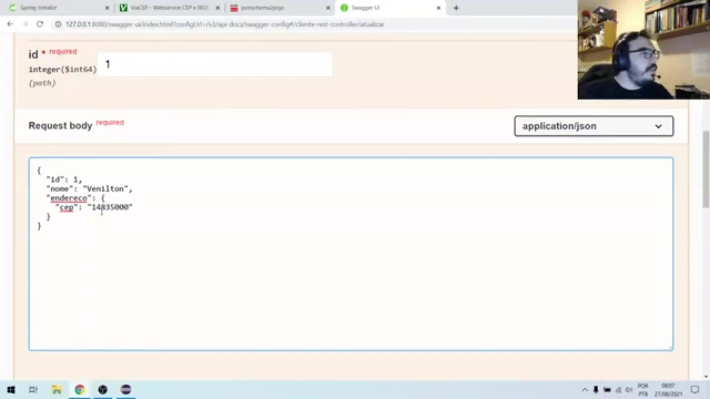
</p>

A averiguação evolui testando fluxos alternativos da implementação, acionando-se dessa vez o recurso normativo para alterações integrais do HTTP (Verbo PUT). Informando referencial numérico primário que indica o objeto gravado e transmitindo na retaguarda do modelo um identificador CEP levemente modificado (`14835-000`), a intenção é provar a robustez em atualizar informações anexas aos modelos.

```json
{
  "id": 1,
  "nome": "Venilton",
  "endereco": {
    "cep": "14835-000"
  }
}
```

<p align="center">
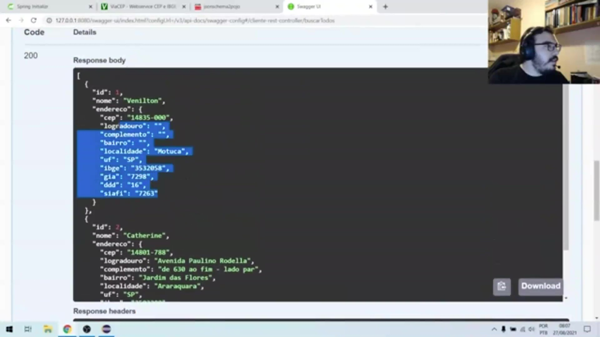
</p>

Concluídas as manipulações sistêmicas, a execução de uma requisição generalista explorando a amplitude de recursos (GET em lista) demonstra perfeitamente os efeitos combinados e o grau de consistência persistida. A modificação solicitada para a localidade da primeira inserção produziu resultado certeiro (localidade "Motuca", CEP "14835-000"), coexistindo com os demais registros sem quebras da base relacional.


### 🟩 Vídeo 09 - Desafio de Projeto

<video width="60%" controls>
  <source src="000-Midia_e_Anexos/bootcamp_tqi_fullstack-modulo.07-curso.03-video_09.webm" type="video/webm">
    Seu navegador não suporta vídeo HTML5.
</video>

link do vídeo: https://web.dio.me/lab/explorando-padroes-de-projetos-na-pratica-com-java/learning/fd169729-dfdd-4bc5-af7c-8bd74bbfc145

O vídeo resume as orientações finais para a conclusão do desafio de projeto sobre Padrões de Projeto (Design Patterns). O objetivo é consolidar o aprendizado prático, explorando desde implementações puras em Java até a utilização de frameworks robustos como o Spring Boot.

### Anotações

#### Percurso e Etapas do Desafio

<p align="center">
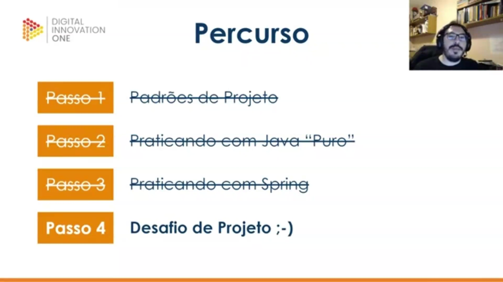
</p>

O roteiro de aprendizado para o domínio de padrões de projeto é estruturado em quatro etapas progressivas:

* **Passo 1**: Introdução aos conceitos e padrões de projeto.
* **Passo 2**: Prática de implementação utilizando Java "Puro".
* **Passo 3**: Desenvolvimento e abstração utilizando o framework Spring.
* **Passo 4**: Realização do Desafio de Projeto final.

#### Orientações para o Desafio de Projeto

<p align="center">
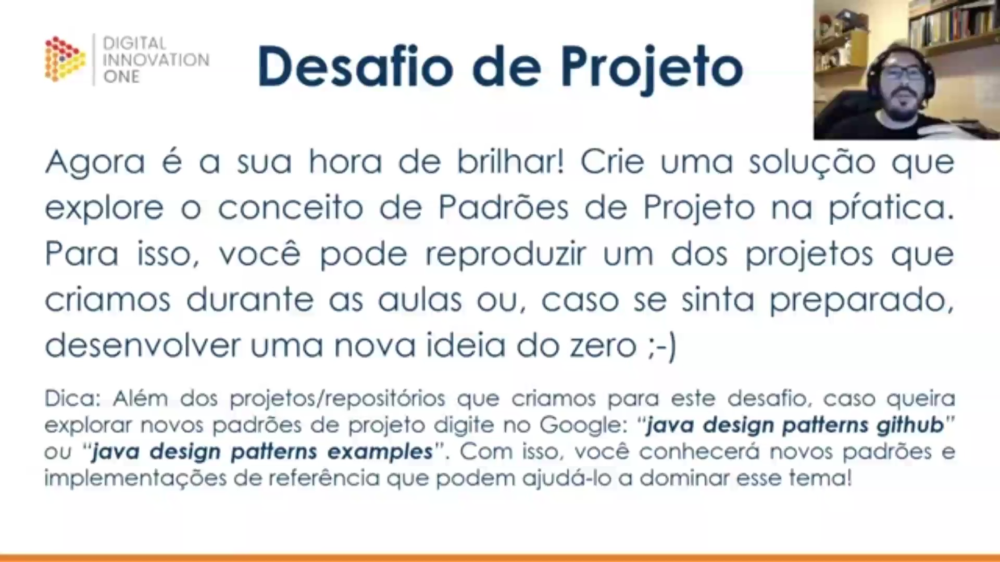
</p>

O desafio final propõe que o aluno crie uma solução prática explorando o conceito de Padrões de Projeto. Para a entrega, é possível seguir dois caminhos:

* Reproduzir e evoluir um dos projetos apresentados durante as aulas.
* Desenvolver uma nova ideia do zero, caso se sinta preparado para o desafio.

Como recomendação adicional, sugere-se a pesquisa por termos como "java design patterns github" e "java design patterns examples" para conhecer novas implementações de referência e aprofundar o domínio técnico.

#### Repositórios e Referências Técnicas

<p align="center">
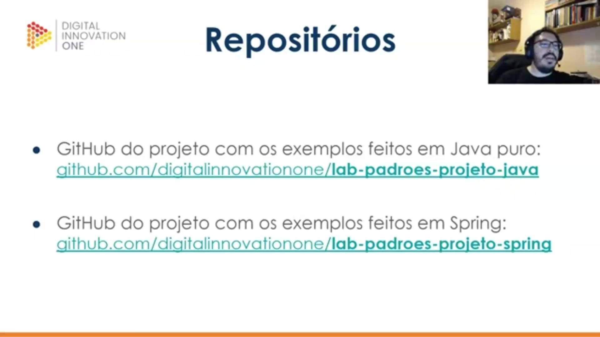
</p>

Para apoiar o desenvolvimento do projeto, são disponibilizados dois repositórios oficiais no GitHub que contêm os exemplos práticos trabalhados:

* **Java Puro**: `github.com/digitalinnovationone/lab-padroes-projeto-java`.
* **Spring Framework**: `github.com/digitalinnovationone/lab-padroes-projeto-spring`.

Esses repositórios servem como base para consultas técnicas e para o enriquecimento do portfólio pessoal do desenvolvedor.


### 🟩 Vídeo 10 - Entendendo o Desafio

#### Descrição do Desafio

Chegamos à etapa final da nossa jornada de aprendizado sobre Design Patterns.  
Agora é hora de aplicar os conceitos na prática e criar algo que agregue valor ao seu portfólio.

#### O Que Entregar?

- **Reproduzir e Evoluir**: Replique o projeto feito em sala e evolua com seus próprios toques.  
- **Criar do Zero**: Desenvolva uma nova ideia ou API utilizando os padrões aprendidos, com Java ou Spring.  
- **Focar em um Padrão**: Escolha um padrão específico para implementar ou reproduza exemplos usando Java puro.

#### Dicas

- **Pesquise Referências**: Busque por "java design patterns github" ou "java design patterns examples" para se inspirar e encontrar implementações de referência.  
- **Use o GitHub**: Faça fork dos repositórios oficiais dos labs para iniciar e evoluir o código.

#### Links Úteis

- [Slides da Apresentação](https://docs.google.com/presentation/d/1WU8gLHbB1s9XCIGsQ87gD36kt398qLch/edit?usp=sharing&ouid=116800384344091292704&rtpof=true&sd=true)  
- GitHub: [Padrões de Projeto com Java Puro](https://github.com/digitalinnovationone/lab-padroes-projeto-java) (implementação de referência)  
- GitHub: [Padrões de Projeto com Spring](https://github.com/digitalinnovationone/lab-padroes-projeto-spring) (implementação de referência)

# Certificado: Design Patterns com Java: Dos Clássicos (GoF) ao Spring Framework

- Link do repositório do projeto entregue: https://github.com/ahaerdy/dio-design-patterns-java
- Link do certificado: https://hermes.dio.me/certificates/EVFM2OQR.pdf
- Link do PDF local: [Certificado-Design_Patterns_com_Java_Dos_Classicos_GoF_ao_Spring_Framework.pdf](000-Midia_e_Anexos/Certificado-Design_Patterns_com_Java_Dos_Classicos_GoF_ao_Spring_Framework.pdf)