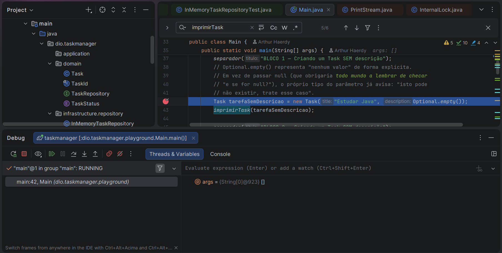
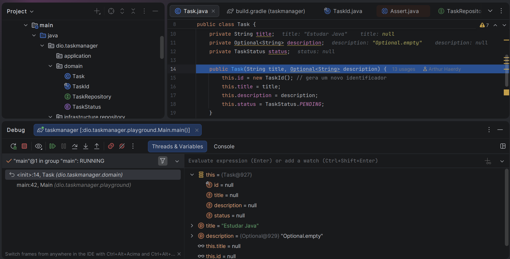
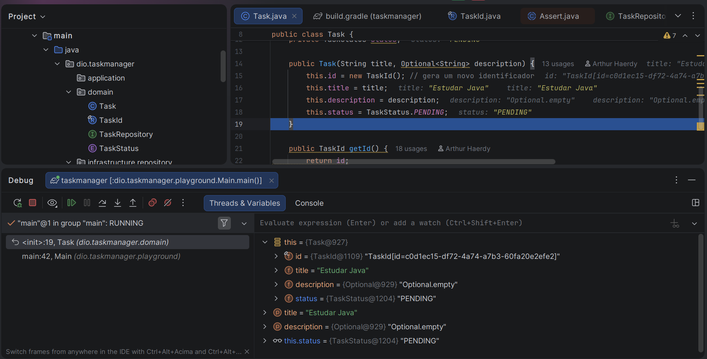
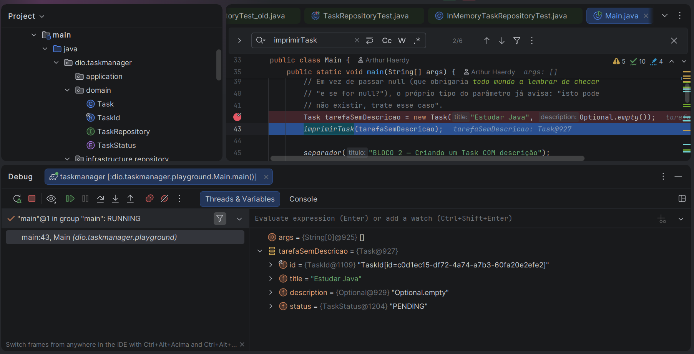

## Extra (fora do curso): uma classe `Main` para explorar manualmente

> **Nota:** esta seção não corresponde a nenhum vídeo do curso — é um material complementar, criado por iniciativa própria durante os estudos, aproveitando o código já construído nos Vídeos 01 a 03 para praticar e visualizar, no terminal, o comportamento de `Task` e `InMemoryTaskRepository`. Ela **não substitui** os testes automatizados (`TaskRepositoryTest` / `InMemoryTaskRepositoryTest`) — serve apenas como um laboratório manual, didático, para "ver com os próprios olhos" o que cada método faz antes (ou além) de confiar nos asserts do JUnit.

### Por que criar uma segunda classe com `main()`?

Um projeto Java pode ter quantas classes com método `main` você quiser — cada uma é só um *ponto de entrada* possível para rodar aquele arquivo específico. `TaskmanagerApplication` é o ponto de entrada **da aplicação**, que sobe o Spring Boot inteiro (o `ApplicationContext`, a injeção de dependências, etc.). Já a classe `Main` apresentada aqui é **Java puro**, sem nenhuma anotação do Spring — ela não sobe nenhum framework, só cria objetos `Task` e `InMemoryTaskRepository` na mão e imprime o resultado no console com `System.out.println`.

Isso só é possível porque `Task`, `TaskId`, `TaskStatus` e `InMemoryTaskRepository` foram desenhadas como **POJOs** (*Plain Old Java Objects*) na camada `domain`/`infrastructure` — objetos comuns, sem dependência do Spring para existir. É exatamente essa independência que torna a camada de domínio fácil de testar e de explorar isoladamente, seja via JUnit, seja "na unha" como fazemos aqui.

### Onde colocar o arquivo

```
src/main/java/dio/taskmanager/playground/Main.java
```

Foi criado um subpacote `playground` só para deixar visualmente claro, na árvore do projeto, que esta classe é um espaço de experimentação — e não faz parte da API/aplicação propriamente dita. Para executar, basta clicar com o botão direito no arquivo, dentro do IntelliJ, e escolher **Run 'Main.main()'**.

### O que cada bloco do código testa (e por quê)

O código está dividido em blocos numerados, cada um isolado por um separador impresso no console (`====...====`), para deixar a leitura da saída organizada. Aqui vai o detalhamento de cada um:

**Bloco 1 — Criando um `Task` sem descrição**
Cria uma tarefa passando `Optional.empty()` como descrição. É o primeiro contato com a ideia de que "descrição" é **opcional por design**: em vez de aceitar `null` e obrigar quem lê o código a adivinhar se pode vir vazio, o próprio tipo do parâmetro (`Optional<String>`) já avisa isso explicitamente.

**Bloco 2 — Criando um `Task` com descrição**
O mesmo construtor, agora com `Optional.of("...")`. Serve de contraste direto com o Bloco 1, mostrando as duas formas válidas de chamar o construtor.

**Bloco 3 — Testando o `Optional<String>` da descrição**
Aqui exploramos dois métodos centrais de `Optional`:
- `isPresent()` — pergunta "existe valor aqui?" sem arriscar um `NullPointerException`;
- `orElse(valorPadrao)` — devolve o valor real se existir, ou um valor padrão se estiver vazio.

Rodamos os dois em `tarefaSemDescricao` (onde `isPresent()` deve dar `false`) e em `tarefaComDescricao` (onde deve dar `true`), para comparar o comportamento lado a lado.

**Bloco 4 — Cada `Task` nasce com um `TaskId` próprio e status `PENDING`**
Cria uma terceira tarefa (`outraTarefa`) com o **mesmo título** de `tarefaSemDescricao`, só para provar que o `id` gerado é diferente em cada uma — porque o construtor de `Task` chama `new TaskId()` internamente, que por sua vez gera um `UUID` aleatório a cada chamada. Também confirmamos que toda `Task` nova nasce com `status = TaskStatus.PENDING`.

Este bloco inclui uma observação importante sobre o estado atual do código: como a classe `Task` só tem `@Getter` (via Lombok) e **nenhum setter**, hoje não existe uma forma pública de mudar o status de uma tarefa depois que ela foi criada — não há `setStatus()`, nem métodos como `iniciar()` ou `concluir()`. Isso não é um bug: é simplesmente um comportamento que ainda não foi implementado nesta etapa do curso (Vídeos 01 a 03) e ficará provavelmente para uma aula futura, quando o domínio for "orquestrado" com regras de transição de status.

**Bloco 5 — Criando o repositório em memória**
```java
TaskRepository repository = new InMemoryTaskRepository();
```
Repare que o **tipo declarado da variável é a interface** `TaskRepository`, não a classe concreta `InMemoryTaskRepository`. Só o lado direito do `=` sabe qual implementação está sendo usada por trás. Essa é a prática de "programar voltado à interface": todo o resto do código (inclusive este `Main`, a partir daqui) só enxerga os métodos definidos no contrato `TaskRepository` — o que permite, no futuro, trocar `InMemoryTaskRepository` por, digamos, uma implementação com banco de dados, sem mudar uma linha sequer de quem consome o repositório.

**Bloco 6 — Salvando tarefas no repositório**
As três tarefas criadas anteriormente são enviadas para `repository.save(...)`. Em seguida, `repository.findAll().size()` é usado para confirmar que as três realmente foram armazenadas.

**Bloco 7 — Listando todas as tarefas (`findAll`)**
Percorre a lista retornada por `findAll()` com um `for` simples, reaproveitando o método auxiliar `imprimirTask` (explicado mais abaixo) para mostrar `id`, `título`, `descrição` e `status` de cada uma.

**Bloco 8 — Buscando uma tarefa específica por id (`findById`)**
Guarda o `id` de `tarefaComDescricao` numa variável e usa `repository.findById(idProcurado)`. Como o retorno é `Optional<Task>`, usamos `isPresent()` para confirmar que foi encontrada, e `ifPresent(Main::imprimirTask)` para imprimir os dados só se o valor realmente existir — mais uma vez evitando checagens manuais de `null`.

**Bloco 9 — Buscando um id que NÃO existe no repositório**
Criamos um `TaskId` totalmente novo, com um `UUID` aleatório que nunca foi salvo, e chamamos `findById` com ele. O objetivo é observar o "caminho triste": `isPresent()` deve retornar `false`, e usamos `map(...).orElse(...)` para produzir uma mensagem amigável de fallback, em vez de deixar a ausência de valor "vazar" sem tratamento.

**Bloco 10 — `TaskId` é um `record`: igualdade por valor, não por referência**
Este é o bloco mais conceitual do arquivo. Como `TaskId` foi declarado como `record TaskId(UUID id)`, o próprio Java já gera automaticamente os métodos `equals()` e `hashCode()` comparando o `UUID` interno — e não o endereço de memória do objeto. Isso é demonstrado assim:

```java
TaskId original = tarefaSemDescricao.getId();
TaskId copiaComMesmoUuid = new TaskId(original.id()); // outro objeto, mesmo UUID

original == copiaComMesmoUuid          // false → são dois objetos DIFERENTES na memória
original.equals(copiaComMesmoUuid)     // true  → mas "valem" a mesma coisa
```

Isso não é só curiosidade acadêmica: é o motivo pelo qual `findById(copiaComMesmoUuid)` **consegue encontrar** a tarefa correta mesmo sem que esse objeto específico jamais tenha sido inserido no `HashMap` interno de `InMemoryTaskRepository`. Como o `HashMap` usa `equals()`/`hashCode()` para localizar chaves, e `TaskId` (por ser `record`) implementa essas comparações "por valor", qualquer `TaskId` que "embrulhe" o mesmo `UUID` funciona como chave válida de busca.

**Bloco 11 — Salvando novamente o MESMO objeto (mesmo `TaskId`)**
Chama `repository.save(tarefaSemDescricao)` uma segunda vez (ela já havia sido salva no Bloco 6) e compara `findAll().size()` antes e depois. O tamanho **não muda**, porque o `HashMap` está indexado por `TaskId` — salvar de novo uma tarefa cujo id já existe apenas **sobrescreve** a entrada anterior (`storage.put(...)` substitui o valor daquela chave), em vez de criar uma segunda entrada duplicada.

**Bloco 12 — Removendo uma tarefa (`delete`)**
Chama `repository.delete(tarefaComDescricao.getId())`, compara o tamanho de `findAll()` antes e depois (deve cair em 1), e finalmente tenta um `findById` para o mesmo id — que agora deve retornar `Optional.empty()`, confirmando que a remoção realmente aconteceu.

**Bloco final — resumo**
Imprime as tarefas restantes no repositório e fecha com um lembrete: tudo o que foi verificado "a olho nu" aqui é conceitualmente o mesmo tipo de verificação que `TaskRepositoryTest` e `InMemoryTaskRepositoryTest` fazem de forma automática, repetível e com assertivas (`assertEquals`, `assertTrue`...) — só que sem depender de alguém ler o console linha por linha.

### Dois métodos auxiliares

- **`imprimirTask(Task task)`** — extrai a repetição de 4 `println` (id, título, descrição, status) que apareceria toda vez que quiséssemos inspecionar uma tarefa. É um pequeno exemplo de reaproveitamento de código dentro da própria classe.
- **`separador(String titulo)`** — só imprime um cabeçalho com `"=".repeat(70)` antes de cada bloco, para deixar a saída no terminal mais fácil de acompanhar visualmente.

### Código completo

```java
package dio.taskmanager.playground;

import dio.taskmanager.domain.Task;
import dio.taskmanager.domain.TaskId;
import dio.taskmanager.domain.TaskRepository;
import dio.taskmanager.domain.TaskStatus;
import dio.taskmanager.infrastructure.repository.InMemoryTaskRepository;

import java.util.List;
import java.util.Optional;
import java.util.UUID;

/**
 * ATENÇÃO — CLASSE APENAS DIDÁTICA.
 *
 * Este ponto de entrada NÃO faz parte da aplicação Spring Boot e NÃO substitui
 * os testes automatizados (TaskRepositoryTest / InMemoryTaskRepositoryTest).
 * Ele existe só para você rodar manualmente, ver mensagens no terminal e
 * "brincar" com as classes Task e InMemoryTaskRepository sem precisar escrever
 * asserts do JUnit — bom para fixar, na prática, o que cada método faz.
 *
 * Repare que esta classe é um Java comum: não tem @SpringBootApplication,
 * não sobe nenhum ApplicationContext, não depende do Spring para rodar.
 * Isso é possível porque Task e InMemoryTaskRepository são POJOs (Plain Old
 * Java Objects) — objetos Java "puros", sem nenhuma amarração ao framework.
 * É exatamente essa independência que a camada "domain" foi desenhada para ter.
 *
 * Como executar: clique com o botão direito neste arquivo no IntelliJ e
 * escolha "Run 'Main.main()'" (ou o ícone de play ao lado do método main).
 * Um projeto Java pode ter vários métodos main — cada um é só um ponto de
 * entrada possível; você escolhe qual quer rodar a cada vez.
 */
public class Main {

    public static void main(String[] args) {

        separador("BLOCO 1 — Criando um Task SEM descrição");
        // Optional.empty() representa "nenhum valor" de forma explícita.
        // Em vez de passar null (que obrigaria todo mundo a lembrar de checar
        // "e se for null?"), o próprio tipo do parâmetro já avisa: "isto pode
        // não existir, trate esse caso".
        Task tarefaSemDescricao = new Task("Estudar Java", Optional.empty());
        imprimirTask(tarefaSemDescricao);

        separador("BLOCO 2 — Criando um Task COM descrição");
        Task tarefaComDescricao =
                new Task("Estudar Spring Boot", Optional.of("Revisar Inversão de Controle"));
        imprimirTask(tarefaComDescricao);

        separador("BLOCO 3 — Testando o Optional<String> da descrição");
        // Aqui mostramos duas formas comuns de "abrir" um Optional com segurança,
        // sem correr o risco de um NullPointerException.
        System.out.println("tarefaSemDescricao tem descrição? "
                + tarefaSemDescricao.getDescription().isPresent());
        System.out.println("Valor usado se estiver vazio: \""
                + tarefaSemDescricao.getDescription().orElse("(sem descrição informada)") + "\"");

        System.out.println("tarefaComDescricao tem descrição? "
                + tarefaComDescricao.getDescription().isPresent());
        System.out.println("Descrição: \""
                + tarefaComDescricao.getDescription().orElse("(sem descrição informada)") + "\"");

        separador("BLOCO 4 — Cada Task nasce com um TaskId próprio e status PENDING");
        // O construtor de Task chama "new TaskId()" internamente, que por sua vez
        // gera um UUID aleatório. Por isso cada Task tem um identificador único,
        // mesmo que o título seja repetido.
        Task outraTarefa = new Task("Estudar Java", Optional.empty());
        System.out.println("id de tarefaSemDescricao: " + tarefaSemDescricao.getId());
        System.out.println("id de outraTarefa:        " + outraTarefa.getId());
        System.out.println("Mesmo título, IDs iguais? "
                + tarefaSemDescricao.getId().equals(outraTarefa.getId()) + " (esperado: false)");
        System.out.println("Toda Task nasce com status: " + tarefaSemDescricao.getStatus());

        // IMPORTANTE (observação didática):
        // Repare que Task não tem nenhum método para MUDAR o status depois de criada
        // (não existe setStatus, porque a classe só tem @Getter, sem @Setter).
        // Ou seja: hoje, uma Task nasce PENDING e não tem, ainda, uma forma pública
        // de virar IN_PROGRESS ou COMPLETED. Isso é esperado nesta etapa do curso —
        // é um comportamento a ser adicionado em vídeos futuros (provavelmente um
        // método de domínio como "iniciar()" ou "concluir()", em vez de um setter
        // genérico, para manter as regras de negócio dentro da própria entidade).

        separador("BLOCO 5 — Criando o repositório em memória");
        // Note o tipo declarado da variável: TaskRepository (a INTERFACE), não
        // InMemoryTaskRepository (a implementação). Só o lado direito do "=" sabe
        // qual implementação concreta está sendo usada. Isso é programar voltado
        // à interface, e é o que permite trocar o repositório no futuro (por um
        // banco de dados, por exemplo) sem alterar quem o utiliza.
        TaskRepository repository = new InMemoryTaskRepository();
        System.out.println("Repositório criado: " + repository.getClass().getSimpleName());

        separador("BLOCO 6 — Salvando tarefas no repositório");
        repository.save(tarefaSemDescricao);
        repository.save(tarefaComDescricao);
        repository.save(outraTarefa);
        System.out.println("3 tarefas foram enviadas para save(). Total armazenado agora: "
                + repository.findAll().size());

        separador("BLOCO 7 — Listando todas as tarefas (findAll)");
        List<Task> todas = repository.findAll();
        for (Task t : todas) {
            imprimirTask(t);
        }

        separador("BLOCO 8 — Buscando uma tarefa específica por id (findById)");
        TaskId idProcurado = tarefaComDescricao.getId();
        Optional<Task> encontrada = repository.findById(idProcurado);
        System.out.println("Buscando id " + idProcurado + " ...");
        System.out.println("Encontrou? " + encontrada.isPresent());
        encontrada.ifPresent(Main::imprimirTask);

        separador("BLOCO 9 — Buscando um id que NÃO existe no repositório");
        // Criamos um TaskId com um UUID aleatório novo, que nunca foi salvo.
        TaskId idInexistente = new TaskId(UUID.randomUUID());
        Optional<Task> naoEncontrada = repository.findById(idInexistente);
        System.out.println("Encontrou? " + naoEncontrada.isPresent() + " (esperado: false)");
        // orElse() evita um "if" manual para tratar o caso de ausência de valor.
        System.out.println("Mensagem amigável: "
                + naoEncontrada.map(Task::getTitle).orElse("Nenhuma tarefa encontrada com esse id."));

        separador("BLOCO 10 — TaskId é um record: igualdade por VALOR, não por referência");
        // Como TaskId é declarado como "record TaskId(UUID id)", o Java já gera
        // automaticamente os métodos equals()/hashCode() comparando o UUID interno.
        // Isso é essencial aqui: o HashMap dentro de InMemoryTaskRepository usa
        // TaskId como chave, então duas instâncias DIFERENTES de TaskId que
        // "embrulham" o mesmo UUID precisam ser tratadas como a MESMA chave.
        TaskId original = tarefaSemDescricao.getId();
        TaskId copiaComMesmoUuid = new TaskId(original.id()); // outro objeto, mesmo UUID
        System.out.println("original == copiaComMesmoUuid (mesma referência)? "
                + (original == copiaComMesmoUuid) + " (esperado: false)");
        System.out.println("original.equals(copiaComMesmoUuid) (mesmo valor)?  "
                + original.equals(copiaComMesmoUuid) + " (esperado: true)");
        // Por causa desse equals() por valor, a busca abaixo funciona mesmo usando
        // um objeto TaskId que nunca foi literalmente guardado no HashMap:
        Optional<Task> encontradaPelaCopia = repository.findById(copiaComMesmoUuid);
        System.out.println("findById(copiaComMesmoUuid) encontrou a tarefa? "
                + encontradaPelaCopia.isPresent() + " (esperado: true)");

        separador("BLOCO 11 — Salvando novamente o MESMO objeto (mesmo TaskId)");
        // Como o HashMap é indexado por TaskId, salvar de novo uma Task cujo id já
        // existe simplesmente SOBRESCREVE a entrada anterior — não cria uma segunda.
        int totalAntes = repository.findAll().size();
        repository.save(tarefaSemDescricao); // já tinha sido salva no BLOCO 6
        int totalDepois = repository.findAll().size();
        System.out.println("Total antes de salvar de novo: " + totalAntes);
        System.out.println("Total depois de salvar de novo: " + totalDepois
                + " (esperado: igual ao de antes, pois o id já existia)");

        separador("BLOCO 12 — Removendo uma tarefa (delete)");
        System.out.println("Antes do delete, total: " + repository.findAll().size());
        repository.delete(tarefaComDescricao.getId());
        System.out.println("Depois do delete, total: " + repository.findAll().size());

        Optional<Task> buscaAposDelete = repository.findById(tarefaComDescricao.getId());
        System.out.println("A tarefa removida ainda é encontrada? "
                + buscaAposDelete.isPresent() + " (esperado: false)");

        separador("FIM — resumo final do repositório");
        System.out.println("Tarefas restantes no repositório:");
        repository.findAll().forEach(Main::imprimirTask);

        System.out.println();
        System.out.println("Lembrete: tudo o que foi validado aqui \"na mão\" (com o olho lendo o");
        System.out.println("terminal) é o mesmo tipo de verificação que TaskRepositoryTest e");
        System.out.println("InMemoryTaskRepositoryTest fazem de forma automática, repetível e");
        System.out.println("com assertivas (assertEquals, assertTrue...) em vez de println.");
    }

    /**
     * Imprime os principais campos de uma Task de forma organizada.
     * Extraído em um método à parte só para não repetir os mesmos 4 println
     * toda vez que quisermos inspecionar uma tarefa — um pequeno exemplo de
     * reaproveitamento de código dentro da própria classe.
     */
    private static void imprimirTask(Task task) {
        System.out.println("  id:          " + task.getId());
        System.out.println("  título:      " + task.getTitle());
        System.out.println("  descrição:   " + task.getDescription().orElse("(nenhuma)"));
        System.out.println("  status:      " + task.getStatus());
        System.out.println("  ------");
    }

    /** Só imprime um cabeçalho separador no terminal, para facilitar a leitura da saída. */
    private static void separador(String titulo) {
        System.out.println();
        System.out.println("=".repeat(70));
        System.out.println(titulo);
        System.out.println("=".repeat(70));
    }
}
```

### O que você deve ver ao rodar

Ao executar, o console mostra, bloco a bloco, os `println` descritos acima — incluindo confirmações como `(esperado: false)` e `(esperado: true)` ao lado de cada verificação, para que você compare mentalmente o que o Java devolveu com o que era esperado, mesmo sem um framework de testes fazendo essa comparação por você.

# ▶️ Saída

```log
15:25:07: Executing ':dio.taskmanager.playground.Main.main()'…

> Task :generateEffectiveLombokConfig UP-TO-DATE
> Task :compileJava UP-TO-DATE
> Task :processResources NO-SOURCE
> Task :classes UP-TO-DATE

> Task :dio.taskmanager.playground.Main.main()

======================================================================
BLOCO 1 — Criando um Task SEM descrição
======================================================================
  id:          TaskId[id=be5d8b33-fe15-46d0-aed1-bfe8bd848bc0]
  título:      Estudar Java
  descrição:   (nenhuma)
  status:      PENDING
  ------

======================================================================
BLOCO 2 — Criando um Task COM descrição
======================================================================
  id:          TaskId[id=189a6af4-acf5-48d2-bc13-3fc9ab744df9]
  título:      Estudar Spring Boot
  descrição:   Revisar Inversão de Controle
  status:      PENDING
  ------

======================================================================
BLOCO 3 — Testando o Optional<String> da descrição
======================================================================
tarefaSemDescricao tem descrição? false
Valor usado se estiver vazio: "(sem descrição informada)"
tarefaComDescricao tem descrição? true
Descrição: "Revisar Inversão de Controle"

======================================================================
BLOCO 4 — Cada Task nasce com um TaskId próprio e status PENDING
======================================================================
id de tarefaSemDescricao: TaskId[id=be5d8b33-fe15-46d0-aed1-bfe8bd848bc0]
id de outraTarefa:        TaskId[id=8d986962-22fe-48ff-b9c1-92250af5d458]
Mesmo título, IDs iguais? false (esperado: false)
Toda Task nasce com status: PENDING

======================================================================
BLOCO 5 — Criando o repositório em memória
======================================================================
Repositório criado: InMemoryTaskRepository

======================================================================
BLOCO 6 — Salvando tarefas no repositório
======================================================================
3 tarefas foram enviadas para save(). Total armazenado agora: 3

======================================================================
BLOCO 7 — Listando todas as tarefas (findAll)
======================================================================
  id:          TaskId[id=8d986962-22fe-48ff-b9c1-92250af5d458]
  título:      Estudar Java
  descrição:   (nenhuma)
  status:      PENDING
  ------
  id:          TaskId[id=be5d8b33-fe15-46d0-aed1-bfe8bd848bc0]
  título:      Estudar Java
  descrição:   (nenhuma)
  status:      PENDING
  ------
  id:          TaskId[id=189a6af4-acf5-48d2-bc13-3fc9ab744df9]
  título:      Estudar Spring Boot
  descrição:   Revisar Inversão de Controle
  status:      PENDING
  ------

======================================================================
BLOCO 8 — Buscando uma tarefa específica por id (findById)
======================================================================
Buscando id TaskId[id=189a6af4-acf5-48d2-bc13-3fc9ab744df9] ...
Encontrou? true
  id:          TaskId[id=189a6af4-acf5-48d2-bc13-3fc9ab744df9]
  título:      Estudar Spring Boot
  descrição:   Revisar Inversão de Controle
  status:      PENDING
  ------

======================================================================
BLOCO 9 — Buscando um id que NÃO existe no repositório
======================================================================
Encontrou? false (esperado: false)
Mensagem amigável: Nenhuma tarefa encontrada com esse id.

======================================================================
BLOCO 10 — TaskId é um record: igualdade por VALOR, não por referência
======================================================================
original == copiaComMesmoUuid (mesma referência)? false (esperado: false)
original.equals(copiaComMesmoUuid) (mesmo valor)?  true (esperado: true)
findById(copiaComMesmoUuid) encontrou a tarefa? true (esperado: true)

======================================================================
BLOCO 11 — Salvando novamente o MESMO objeto (mesmo TaskId)
======================================================================
Total antes de salvar de novo: 3
Total depois de salvar de novo: 3 (esperado: igual ao de antes, pois o id já existia)

======================================================================
BLOCO 12 — Removendo uma tarefa (delete)
======================================================================
Antes do delete, total: 3
Depois do delete, total: 2
A tarefa removida ainda é encontrada? false (esperado: false)

======================================================================
FIM — resumo final do repositório
======================================================================
Tarefas restantes no repositório:
  id:          TaskId[id=8d986962-22fe-48ff-b9c1-92250af5d458]
  título:      Estudar Java
  descrição:   (nenhuma)
  status:      PENDING
  ------
  id:          TaskId[id=be5d8b33-fe15-46d0-aed1-bfe8bd848bc0]
  título:      Estudar Java
  descrição:   (nenhuma)
  status:      PENDING
  ------

Lembrete: tudo o que foi validado aqui "na mão" (com o olho lendo o
terminal) é o mesmo tipo de verificação que TaskRepositoryTest e
InMemoryTaskRepositoryTest fazem de forma automática, repetível e
com assertivas (assertEquals, assertTrue...) em vez de println.

BUILD SUCCESSFUL in 1s
3 actionable tasks: 1 executed, 2 up-to-date
15:25:09: Execution finished ':dio.taskmanager.playground.Main.main()'.
```

# Debugging

O objetivo desta sessão guiada de depuração (*debugging*) é observar o comportamento do código em tempo real, mapeando como a Java Virtual Machine (JVM) aloca e manipula os nossos POJOs na memória. Ao longo das capturas a seguir, analisaremos:

* **O Nascimento dos Objetos:** A alocação das instâncias na memória Heap e a geração de identificadores únicos (UUID).
* **Transição de Estados:** O preenchimento dos atributos internos passo a passo durante a execução dos construtores.
* **Mecânica da Infraestrutura:** O comportamento interno do `InMemoryTaskRepository` e como o `HashMap` armazena as instâncias persistidas.
* **Escopo e Referências:** A diferença entre visualizar parâmetros recebidos, variáveis locais e o ponteiro `this` dentro do contexto de execução.

Abaixo, documentamos o estado da aplicação em pontos estratégicos de parada (*breakpoints*).

<p align="center">
  
</p>

Estado inicial, debugger disparado. Estado Limpo: Se você olhar para o painel de Variables (Variáveis) na parte inferior ou lateral da sua IDE, verá que a única coisa que existe no escopo local agora é o parâmetro args (o array de Strings vazio do método main).

**🎯 Próxima Ação:** Para não perdermos a oportunidade de ver a alocação de memória acontecer por dentro, utilizaremos o comando **Step Into (F7 - Entrar)**. Isso forçará o depurador a sair do método `main` e mergulhar diretamente no construtor da classe `Task`.

<p align="center">
  
</p>

### 🔍 Análise do Breakpoint: Construtor da Classe `Task`

O depurador está pausado exatamente na assinatura do construtor da classe `Task` (linha 14). Esta é a fase de inicialização, ideal para observar a diferença entre os dados recebidos (parâmetros) e o estado real do objeto na memória Heap (`this`).

#### 1. O Estado Atual na Memória (Painel de Variáveis)
* **Os Parâmetros (Dados de Entrada):**
  * `title`: `"Estudar Java"` (recebido com sucesso da classe `Main`).
  * `description`: `Optional.empty()` (representando explicitamente a ausência de descrição).
* **O Objeto em Construção (`this`):**
  * O objeto já possui um endereço físico alocado na memória Heap (`{Task@927}`).
  * Como as linhas internas do construtor **ainda não foram executadas**, os atributos internos do objeto (`this.title`, `this.id`, etc.) ainda estão com seus valores padrão de inicialização: **`null`**.

<p align="center">
  
</p>

### 🔍 Análise do Breakpoint: Evolução do Objeto `Task`

Como esperado, após a execução dos comandos de passo, as atribuições começaram a se consolidar na memória Heap da JVM. O objeto `this` começou a ganhar corpo e identidade própria.

#### 1. O Estado Atual na Memória (Painel de Variáveis)
* **`this.id` Inicializado:** O atributo `id` deixou de ser `null`. A linha `this.id = new TaskId();` foi executada, gerando um identificador único encapsulado na classe de valor `TaskId` (com o seu respectivo UUID).
* **`this.title` Atribuído:** O campo `this.title` agora aponta corretamente para a string `"Estudar Java"`, transferindo com sucesso o valor que veio do parâmetro do método.
* **Campos Restantes:** O depurador agora avança para carregar o `description` (como um `Optional.empty()`) e o `status` inicial da tarefa, que será definido como `TaskStatus.PENDING`.

<p align="center">
  
</p>

### 🔍 Análise do Breakpoint: Retorno ao Método Estático (`main`)

Após a conclusão do construtor da classe `Task`, o depurador encerra aquele escopo e retorna o fluxo de execução para a classe chamadora, parando na linha seguinte do `Main.java` (linha 43: `imprimirTask(tarefaSemDescricao);`).

#### 1. O Estado Atual na Memória (Painel de Variáveis)
* **Ausência do `this`:** Como estamos dentro do método `public static void main`, o painel de variáveis não exibe o ponteiro `this`. Métodos estáticos pertencem à classe como um todo, e não a uma instância específica, portanto, não há um "objeto atual" no escopo.
* **A Variável Local (`tarefaSemDescricao`):** Agora, a variável que criamos aparece disponível no painel. Ela guarda a referência para o objeto `{Task}` recém-criado na memória Heap. Expandindo essa variável, podemos confirmar que os atributos internos (`id`, `title`, `description` e `status`) foram inicializados com sucesso e contêm os valores exatos que vimos sendo atribuídos no passo anterior.

---