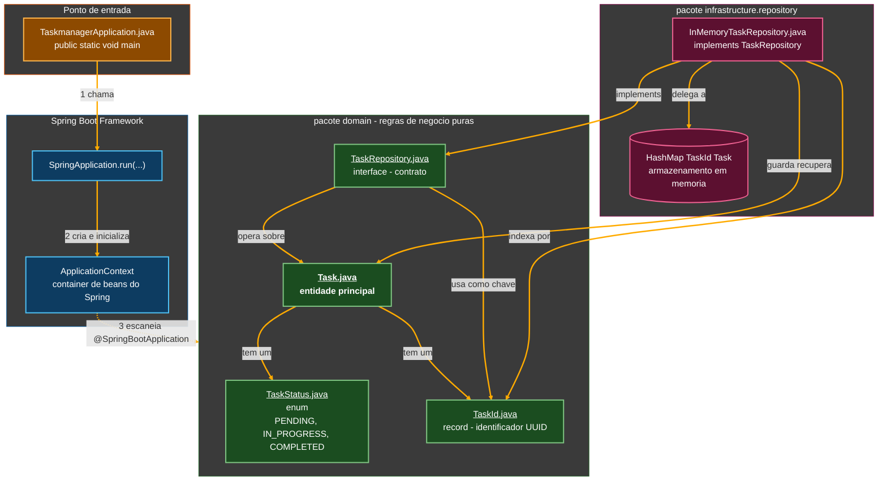

# Tutorial de Estudos — Construindo um Task Manager com Java e Spring Boot

**Do zero à modelagem de domínio — Vídeos 01 a 03**

- Curso: NTT Data — Jornada Tech (DIO) · Trilha Java + Spring
- Instrutor: Thiago Poiani
- Documento de referência pessoal — nível iniciante em Java

---

## Sobre este documento

Este tutorial foi criado a partir das anotações de aula (README) e do código-fonte real do projeto na etapa correspondente a cada vídeo. O objetivo é explicar, com riqueza de detalhes e em nível iniciante, cada instrução escrita até agora — o que ela faz, por que foi escrita daquela forma, e qual conceito de Java ou de arquitetura de software ela representa.

Este documento deve ser usado como um mapa: sempre que houver dúvida sobre "por que essa linha está aqui", deve-se voltar a ele. A ideia é que, relendo este material, consiga-se reconstruir o raciocínio da aula sem precisar assistir ao vídeo novamente.

> **Como este documento está organizado**
> Cada parte corresponde a um vídeo do curso. Dentro de cada parte, o código é apresentado em pequenos blocos, na ordem em que foi escrito na aula, seguido de uma explicação linha a linha. Ao final, há um glossário com os conceitos de Java utilizados e um retrato do estado atual do projeto.

---

## Parte 1 — Fundamentos de API REST (Vídeo 01)

O primeiro vídeo é teórico: antes de escrever qualquer código Java, a aula explica os conceitos que justificam as decisões de design que vêm a seguir. Como isto já se encontra detalhadamente  documentado no README, aqui vai um resumo objetivo dos pontos que realmente importam para entender o código das próximas partes.

### 1.1. Por que existe uma API REST

Aplicações modernas (site, app mobile, etc.) normalmente não guardam os dados por conta própria — elas pedem os dados para um servidor remoto. Essa comunicação acontece através do protocolo HTTP, que define como uma requisição (o pedido do cliente) e uma resposta (o retorno do servidor) devem ser trocadas pela rede.

### 1.2. Os quatro verbos HTTP que serão usados no projeto

- **`GET`** — ler um recurso, sem alterá-lo (ex.: listar tarefas).
- **`POST`** — criar um novo recurso (ex.: criar uma tarefa).
- **`PUT`** — atualizar/substituir um recurso existente.
- **`DELETE`** — remover um recurso.

Esses verbos irão, mais adiante no curso (a partir do Vídeo 04), se transformar em métodos anotados dentro de um Controller do Spring. Por enquanto, o projeto ainda não tem nenhum endpoint HTTP — o trabalho até o Vídeo 03 é inteiramente sobre modelar o domínio (as regras de negócio), sem nenhuma dependência de Web.

### 1.3. JSON como formato de troca de dados

O JSON é o formato usado para representar os dados que trafegam entre cliente e servidor, por ser leve e fácil de ler. Uma tarefa, por exemplo, seria representada como um objeto com campos como `id`, `task` e `completed`. O Spring Boot converte automaticamente objetos Java em JSON (e vice-versa) usando uma biblioteca interna chamada Jackson — nesta etapa essa biblioteca ainda não será usada diretamente, mas é bom já saber que esse trabalho é automático.

### 1.4. O papel do Spring Boot

Sem um framework, criar um servidor HTTP em Java do zero exigiria lidar manualmente com sockets de rede e fazer o parsing de JSON "na mão". O Spring Boot elimina essa complexidade: com anotações, ele configura um servidor pronto, converte JSON em objetos Java automaticamente e direciona cada requisição para o método certo da classe certa. É por isso que o projeto começa (Vídeo 02) já com uma estrutura de pacotes pensada em separar essa infraestrutura das regras de negócio.

### 1.5. O desenho da entidade Task

Ainda no Vídeo 01, a aula já antecipa o modelo de domínio que será implementado: uma entidade `Task` com identificador, título, descrição e um estado (Pendente, Em Progresso ou Concluído), seguindo os princípios de DDD (Domain-Driven Design) — ou seja, desenhando primeiro as regras de negócio, sem se preocupar ainda com banco de dados ou Web. Esse desenho é exatamente o que os Vídeos 02 e 03 colocam em prática, e é o assunto do restante deste tutorial.

---

## Parte 2 — Modelando a entidade Task (Vídeo 02)

Este vídeo é o primeiro em que código Java de fato é escrito. O objetivo é criar a entidade `Task` — o "coração" do sistema — seguindo os princípios de Domain-Driven Design (DDD): desenhar as regras de negócio antes de pensar em bancos de dados ou endpoints HTTP.

### 2.1. Estrutura de pacotes do projeto

Antes de criar qualquer classe, o projeto é organizado em três pacotes dentro de `dio.taskmanager`:

- **`domain`** — onde vivem as regras de negócio puras (as entidades, os estados possíveis, as interfaces de repositório). É o "cérebro" da aplicação, e não depende de mais nada.
- **`application`** — vai orquestrar chamadas e serviços (ainda não usado até o Vídeo 03; vai aparecer no Vídeo 04).
- **`infrastructure`** — tudo que é "detalhe técnico": banco de dados, APIs externas, e, como ainda será visto, a implementação do repositório em memória.

> **Por que separar em pacotes assim?**
> Essa separação existe para que as regras de negócio (`domain`) não fiquem "presas" a uma tecnologia específica. Se um dia banco de dados for trocado, ou parar de usar Spring, o pacote `domain` praticamente não muda — só o que está em `infrastructure`. Pense em `domain` como as regras do jogo, e `infrastructure` como o material usado para jogar (o tabuleiro físico, as peças).

A classe gerada automaticamente pelo Spring Initializr permanece como ponto de entrada da aplicação:

```java
package dio.taskmanager;

import org.springframework.boot.SpringApplication;
import org.springframework.boot.autoconfigure.SpringBootApplication;

@SpringBootApplication
public class TaskmanagerApplication {

    public static void main(String[] args) {
        SpringApplication.run(TaskmanagerApplication.class, args);
    }
}
```

Explicação linha a linha:

- **`package dio.taskmanager;`** — declara em qual "pasta lógica" essa classe vive. Em Java, o pacote normalmente reflete a estrutura de pastas do projeto (aqui, `src/main/java/dio/taskmanager`).
- **`import ...;`** — "importa" classes de outras bibliotecas para que possam ser usadas neste arquivo sem escrever o caminho completo toda vez.
- **`@SpringBootApplication`** — uma anotação (uma espécie de "etiqueta" que adiciona comportamento especial a uma classe). Ela avisa ao Spring: "esta é a classe principal; configure automaticamente tudo que for necessário para a aplicação rodar".
- **`public static void main(String[] args)`** — é o método padrão de entrada de qualquer programa Java: é por ele que a execução começa. `static` significa que ele pode ser chamado sem precisar criar um objeto `TaskmanagerApplication` antes; `void` indica que ele não devolve nenhum valor.
- **`SpringApplication.run(...)`** — é a instrução que efetivamente liga o motor do Spring Boot: sobe o servidor, lê as configurações e deixa a aplicação pronta para receber requisições (mais adiante no curso).

### 2.2. Criando a classe Task

Dentro do pacote `domain`, é criada a primeira classe do domínio: `Task`, representando uma tarefa. Ela recebe seus atributos iniciais:

```java
package dio.taskmanager.domain;

public class Task {
    private String id;
    private String title;
    private String description;
    private TaskStatus status;
}
```

- **`public class Task`** — declara uma nova classe chamada `Task`. Uma classe é como uma "planta baixa" (um molde) que descreve quais informações e comportamentos um objeto desse tipo vai ter. `public` significa que essa classe pode ser usada por qualquer outro pacote do projeto.
- **`private String id;`** — declara um atributo (também chamado de "campo") chamado `id`, do tipo texto (`String`). `private` significa que esse campo só pode ser acessado de dentro da própria classe `Task` — nenhuma outra classe consegue ler ou alterar `id` diretamente. Isso é a base do encapsulamento (ver glossário).
- **`title` e `description`** — seguem o mesmo padrão: dois campos de texto para armazenar o título e a descrição da tarefa.
- **`private TaskStatus status;`** — o campo `status` não é um texto solto, mas sim do tipo `TaskStatus`, um tipo próprio que ainda será criado. A ideia é evitar que qualquer texto ("pronto", "feito", "ok"...) possa ser usado como estado da tarefa — só os valores definidos no enum `TaskStatus` serão aceitos.

### 2.3. Criando o enum TaskStatus

Para restringir os estados possíveis de uma tarefa a um conjunto fixo e conhecido, é criado um enum (enumeração):

```java
package dio.taskmanager.domain;

public enum TaskStatus {
    PENDING,
    IN_PROGRESS,
    COMPLETED,
}
```

- **`public enum TaskStatus`** — um enum é um tipo especial de classe em Java cujos valores possíveis são uma lista fechada e nomeada. Diferente de uma `String`, não é possível criar um valor "fora da lista" por engano.
- **`PENDING, IN_PROGRESS, COMPLETED`** — são as três (e únicas) constantes possíveis para esse tipo: tarefa pendente, em progresso e concluída. Cada uma delas é, internamente, um objeto único do tipo `TaskStatus`.

> **Por que usar enum em vez de String?**
> Se o status fosse uma `String`, nada impediria alguém de escrever "Pendente", "pending" ou "PENDENTE" em lugares diferentes do código — três formas diferentes de dizer a mesma coisa, e o compilador não perceberia o erro. Com um enum, o próprio compilador Java barra qualquer valor que não seja `PENDING`, `IN_PROGRESS` ou `COMPLETED`, eliminando essa classe inteira de bugs.

### 2.4. Criando o record TaskId

Em vez de deixar o identificador da tarefa como uma `String` simples, a aula cria um tipo próprio, `TaskId`, usando um **record** — um tipo de classe do Java pensado especificamente para guardar dados de forma imutável e compacta.

```java
package dio.taskmanager.domain;

import java.util.UUID;

public record TaskId(UUID id) {
}
```

- **`public record TaskId(UUID id)`** — declara um record chamado `TaskId` que guarda um único valor, chamado `id`, do tipo `UUID` (Universally Unique Identifier: um identificador único e praticamente impossível de repetir, no formato de texto como `3f2504e0-4f89-11d3-9a0c-0305e82c3301`).

Ao declarar um record dessa forma, o Java gera automaticamente, sem você escrever nada a mais:

- Um construtor que recebe o `UUID` e guarda no campo `id` (chamado de construtor canônico).
- Um método `id()` para ler o valor (o equivalente a um "getter", mas com esse nome específico em records).
- Implementações prontas de `equals()`, `hashCode()` e `toString()` — métodos usados, por exemplo, para comparar dois `TaskId` ou exibi-los como texto.
- Imutabilidade automática: depois de criado, um `TaskId` nunca muda de valor.

Por que criar um tipo próprio em vez de usar `UUID` (ou `String`) diretamente pelo código? Porque isso deixa o código mais expressivo (um parâmetro do tipo `TaskId` deixa claro que ali se espera o identificador de uma tarefa, e não de qualquer outra coisa) e abre espaço para adicionar regras específicas de validação — que é exatamente o próximo passo.

**Construtor compacto: validando que o id nunca é nulo**

```java
package dio.taskmanager.domain;

import org.springframework.util.Assert;

import java.util.UUID;

public record TaskId(UUID id) {
    public TaskId {
        Assert.notNull(id, "id must not be null");
    }
}
```

- **`public TaskId { ... }`** — isso é chamado de construtor compacto. É uma forma especial de escrever o construtor de um record sem precisar repetir a lista de parâmetros nem escrever `this.id = id` manualmente — o Java faz essa atribuição sozinho, depois que o bloco de código dentro das chaves é executado. Ele serve para adicionar validações antes que o objeto seja efetivamente criado.
- **`Assert.notNull(id, "id must not be null");`** — `Assert` é uma classe utilitária do próprio Spring. O método `notNull` verifica se o valor passado (`id`) é diferente de `null`; se for `null`, ele lança automaticamente uma exceção (um erro em tempo de execução) com a mensagem informada, interrompendo a criação do objeto. Isso garante que nunca vai existir um `TaskId` "vazio" por engano.

**Construtor sem parâmetros: gerando um UUID automaticamente**

```java
package dio.taskmanager.domain;

import org.springframework.util.Assert;

import java.util.UUID;

public record TaskId(UUID id) {
    public TaskId {
        Assert.notNull(id, "id must not be null");
    }

    public TaskId() {
        this(UUID.randomUUID());
    }
}
```

- **`public TaskId() { this(UUID.randomUUID()); }`** — este é um segundo construtor, que não recebe nenhum parâmetro. A palavra `this(...)` chama o outro construtor da própria classe (o construtor compacto acima), passando um `UUID` gerado aleatoriamente por `UUID.randomUUID()`. Na prática, isso significa que basta escrever `new TaskId()` para obter um identificador novo e único, sem precisar gerar o UUID manualmente toda vez.

> **Dois construtores, dois usos**
> `TaskId(UUID id)` é usado quando você já tem um identificador (por exemplo, veio de um banco de dados ou de uma requisição). `TaskId()` é usado quando está criando uma tarefa nova do zero e precisa de um identificador inédito. Essa é uma técnica comum chamada **sobrecarga de construtor**: o mesmo nome, `TaskId`, com "formas de chamar" diferentes.

### 2.5. Evoluindo o construtor de Task

Com `TaskId` e `TaskStatus` prontos, a classe `Task` passa por uma série de pequenos ajustes, cada um resolvendo um problema específico. Veja a evolução passo a passo.

**Passo 1 — id passa a ser TaskId, e surge o primeiro construtor**

```java
package dio.taskmanager.domain;

public class Task {
    private TaskId id;
    private String title;
    private String description;
    private TaskStatus status;

    public Task(TaskId id, String title, String description, TaskStatus status) {
        this.id = id;
        this.title = title;
        this.description = description;
        this.status = status;
    }
}
```

- **`private TaskId id;`** — o campo `id` deixa de ser `String` e passa a ser do tipo `TaskId`, criado no passo anterior.
- **`public Task(TaskId id, String title, String description, TaskStatus status)`** — este é o construtor da classe: um método especial, com o mesmo nome da classe e sem tipo de retorno, que é executado toda vez que se escreve `new Task(...)`. Ele recebe quatro parâmetros, um para cada atributo.
- **`this.id = id;`** — a palavra `this` se refere "ao próprio objeto que está sendo criado". Essa linha diz: "pegue o valor do parâmetro `id` que chegou, e guarde no atributo `id` deste objeto". É necessário usar `this.` porque o parâmetro e o atributo têm o mesmo nome (`id`) — sem o `this`, o Java não saberia diferenciar um do outro.

As linhas seguintes (`title`, `description`, `status`) repetem exatamente a mesma lógica para os outros três atributos.

**Passo 2 — o id deixa de ser recebido de fora**

```java
public Task(String title, String description, TaskStatus status) {
    this.id = new TaskId();
    this.title = title;
    this.description = description;
    this.status = status;
}
```

- **`this.id = new TaskId();`** — em vez de receber um `TaskId` pronto como parâmetro, o próprio construtor cria um novo, usando o construtor sem parâmetros criado anteriormente (que gera um UUID aleatório). Isso garante uma regra de negócio importante: toda tarefa nasce com um identificador único, gerado automaticamente — quem cria uma tarefa não precisa (e não deve) se preocupar em inventar um id.

Note que o parâmetro `id` desaparece da lista de parâmetros do construtor: de quatro parâmetros, passa para três (`title`, `description`, `status`).

**Passo 3 — validando que o título não é nulo**

```java
package dio.taskmanager.domain;

import org.springframework.util.Assert;

public class Task {
    private TaskId id;
    private String title;
    private String description;
    private TaskStatus status;

    public Task(String title, String description, TaskStatus status) {
        Assert.notNull(title, "Title must not be null");

        this.id = new TaskId();
        this.title = title;
        this.description = description;
        this.status = status;
    }
}
```

- **`Assert.notNull(title, "Title must not be null");`** — mesma técnica usada em `TaskId`: antes de qualquer atribuição, o construtor verifica se `title` não é nulo. Se for, a criação da tarefa é interrompida com uma mensagem de erro clara. Essa validação expressa uma regra de negócio: "toda tarefa precisa ter um título".

**Passo 4 — descrição vira Optional&lt;String&gt;**

```java
package dio.taskmanager.domain;

import org.springframework.util.Assert;

import java.util.Optional;

public class Task {
    private TaskId id;
    private String title;
    private Optional<String> description;
    private TaskStatus status;

    public Task(String title, Optional<String> description, TaskStatus status) {
        Assert.notNull(title, "Title must not be null");

        this.id = new TaskId();
        this.title = title;
        this.description = description;
        this.status = status;
    }
}
```

- **`private Optional<String> description;`** — o tipo do campo `description` muda de `String` para `Optional<String>`. `Optional` é um "envelope" do Java que representa explicitamente a possibilidade de um valor não existir. Em vez de `description` ser simplesmente `null` quando a tarefa não tem descrição (o que costuma causar `NullPointerException` se alguém esquecer de checar), o próprio tipo já avisa: "aqui, pode não ter valor — trate esse caso".
- **`Task(String title, Optional<String> description, TaskStatus status)`** — o construtor passa a exigir explicitamente um `Optional<String>` para a descrição. Quem cria uma tarefa sem descrição precisa escrever `Optional.empty()`; quem cria com descrição escreve `Optional.of("texto da descrição")`.

**Passo 5 — status inicial fica implícito (PENDING por padrão)**

```java
package dio.taskmanager.domain;

import org.springframework.util.Assert;

import java.util.Optional;

public class Task {
    private TaskId id;
    private String title;
    private Optional<String> description;
    private TaskStatus status;

    public Task(String title, Optional<String> description) {
        Assert.notNull(title, "Title must not be null");

        this.id = new TaskId();
        this.title = title;
        this.description = description;
        this.status = TaskStatus.PENDING;
    }
}
```

- **`public Task(String title, Optional<String> description)`** — o parâmetro `status` é removido da lista de parâmetros do construtor. Agora só é preciso informar título e descrição para criar uma tarefa.
- **`this.status = TaskStatus.PENDING;`** — em vez de receber o status de fora, o construtor sempre define o mesmo valor inicial: `PENDING`. Essa é outra regra de negócio importante, agora garantida pelo próprio código: "toda tarefa nova começa pendente" — ninguém de fora consegue criar uma tarefa que já nasça, por exemplo, como `COMPLETED`.

> **O padrão por trás dessas cinco etapas**
> Repare que, a cada passo, o construtor de `Task` foi "ficando mais esperto": primeiro recebia tudo de fora (inclusive erros possíveis), e foi progressivamente assumindo a responsabilidade de garantir sozinho que uma `Task` só possa existir em um estado válido (com id, com título, com status inicial correto). Esse cuidado de nunca permitir que um objeto exista em um estado inconsistente é um princípio central de Domain-Driven Design, chamado de **proteger os invariantes do domínio**.

---
## Parte 3 — Modelando o repositório de tarefas (Vídeo 03)

Com a entidade `Task` pronta, o próximo problema é: onde e como guardar as tarefas criadas? Este vídeo introduz o padrão Repository, cria uma implementação em memória (sem banco de dados de verdade, por enquanto), adiciona a biblioteca Lombok para reduzir código repetitivo, e fecha com uma bateria de testes automatizados — incluindo uma técnica avançada chamada **teste de contrato**.

### 3.1. A interface TaskRepository

O primeiro passo é criar, dentro do pacote `domain`, uma interface vazia:

```java
package dio.taskmanager.domain;

public interface TaskRepository {
}
```

- **`public interface TaskRepository`** — uma interface, em Java, é um "contrato": ela declara quais métodos uma classe deve ter, mas não diz como esses métodos funcionam por dentro. Qualquer classe que decidir implementar `TaskRepository` se compromete a fornecer o comportamento de cada método declarado nela.

> **Por que uma interface, e não já a implementação?**
> Essa interface representa o padrão de projeto Repository: uma camada de abstração para o armazenamento de dados. Hoje ela pode ser implementada "em memória" (guardando tudo em uma variável, que se perde ao reiniciar a aplicação); amanhã pode ser implementada com um banco de dados real. O resto do sistema (o domínio) só depende da interface `TaskRepository`, nunca de uma implementação específica — assim, trocar a forma de guardar os dados no futuro não exige alterar as regras de negócio.

Em seguida, os métodos do contrato são definidos:

```java
package dio.taskmanager.domain;

import java.util.List;
import java.util.Optional;

public interface TaskRepository {
    Task save(Task task);
    List<Task> findAll();
    Optional<Task> findById(TaskId id);
    void delete(TaskId id);
}
```

- **`Task save(Task task);`** — declara que toda implementação precisa de um método `save`, que recebe uma `Task` e devolve uma `Task` (a mesma tarefa, já salva). Repare que não há corpo (chaves com código) — só a "assinatura" do método, terminada em ponto e vírgula. Isso é típico de interfaces.
- **`List<Task> findAll();`** — declara um método que devolve uma lista (`List`) de tarefas. `List<Task>` é um exemplo de generics: o `<Task>` entre os sinais de menor/maior diz "essa é uma lista especificamente de objetos `Task`", e não de qualquer outra coisa — o compilador passa a impedir, por exemplo, que um número seja colocado nessa lista por engano.
- **`Optional<Task> findById(TaskId id);`** — busca uma tarefa por identificador. O retorno é `Optional<Task>`, e não `Task` diretamente, porque a tarefa buscada pode simplesmente não existir. Se o método devolvesse `Task` e a tarefa não existisse, a alternativa seria devolver `null` — e aí qualquer código que esquecesse de checar antes de usar o valor sofreria um `NullPointerException`. Com `Optional`, essa possibilidade fica explícita na assinatura do método, obrigando quem chama a lidar com o caso "não encontrado".
- **`void delete(TaskId id);`** — remove uma tarefa pelo identificador. `void` indica que esse método não devolve nenhum valor.

Nos quatro métodos, o identificador usado é sempre `TaskId`, e não `String` ou `UUID` diretamente — reforçando o mesmo raciocínio do capítulo anterior: usar um tipo próprio deixa a assinatura mais clara e mais segura.

### 3.2. Gerando a implementação com o IDE

Em vez de escrever a classe do zero, a aula usa um recurso do IntelliJ chamado "Implement interface": o IDE lê os métodos declarados em `TaskRepository` e gera automaticamente uma classe com "esqueletos" (stubs) desses métodos, prontos para receber a lógica.

A nova classe recebe o nome `InMemoryTaskRepository` e é posicionada em um novo subpacote, `dio.taskmanager.infrastructure.repository` — reforçando que essa é uma decisão de infraestrutura (como os dados são guardados fisicamente), e não uma regra de negócio.

```java
package dio.taskmanager.infrastructure.repository;

import dio.taskmanager.domain.Task;
import dio.taskmanager.domain.TaskId;
import dio.taskmanager.domain.TaskRepository;
import java.util.List;
import java.util.Optional;

public class InMemoryTaskRepository implements TaskRepository {
    @Override
    public Task save(Task task) {
        return null;
    }

    @Override
    public List<Task> findAll() { return List.of(); }

    @Override
    public Optional<Task> findById(TaskId id) { return Optional.empty(); }

    @Override
    public void delete(TaskId id) {

    }
}
```

- **`public class InMemoryTaskRepository implements TaskRepository`** — a palavra `implements` declara que esta classe assume o compromisso do contrato `TaskRepository`. A partir daqui, o compilador Java exige que todos os métodos da interface estejam presentes nesta classe, com corpo (implementação) de verdade.
- **`@Override`** — essa anotação, colocada acima de cada método, avisa ao compilador (e a quem estiver lendo o código) que esse método está sobrescrevendo um método definido em outro lugar (aqui, na interface `TaskRepository`). Não é obrigatória para o código funcionar, mas é uma boa prática: se você escrever o nome do método errado, o compilador vai acusar erro imediatamente, em vez de você descobrir o problema só quando o programa já estiver rodando.

Repare que, neste momento, os métodos devolvem valores "vazios" só para o código compilar (`return null`, `List.of()`, `Optional.empty()`) — são placeholders que serão substituídos por lógica real nos próximos passos.

### 3.3. Guardando as tarefas em um Map

Para armazenar as tarefas de verdade, a aula escolhe um `Map` (mapa) em vez de uma lista simples:

```java
private final Map<TaskId, Task> storage = new HashMap<>();

@Override
public Task save(Task task) {
    storage.put();
    return null;
}
```

- **`private final Map<TaskId, Task> storage = new HashMap<>();`** — declara um campo chamado `storage`, do tipo `Map<TaskId, Task>`: uma estrutura de dados que associa uma chave (aqui, `TaskId`) a um valor (aqui, `Task`) — como um "dicionário", em que cada identificador de tarefa aponta diretamente para a tarefa correspondente. `HashMap` é a implementação concreta de `Map` escolhida, otimizada para buscas rápidas por chave. A palavra `final` indica que a variável `storage` sempre vai apontar para o mesmo `Map` (ele não pode ser trocado por outro depois de criado) — embora o conteúdo dentro dele possa mudar livremente.

> **Por que Map, e não List?**
> Se as tarefas fossem guardadas em uma `List<Task>` simples, para encontrar uma tarefa por id seria preciso percorrer a lista inteira, comparando um por um, até achar a tarefa certa. Com um `Map<TaskId, Task>`, buscar por id é direto: você usa a chave (`TaskId`) e o `Map` já devolve a `Task` correspondente, sem precisar percorrer nada.

- **`storage.put();`** — o método `put` de um `Map` recebe dois argumentos: a chave e o valor. Ao tentar escrever apenas `storage.put()` sem argumentos, o código não compila — e é justamente esse "erro proposital" que leva à próxima descoberta: de onde vem o `TaskId` de uma `Task`, já que o campo `id` da classe `Task` é privado?

### 3.4. Encapsulamento: por que é preciso um getId()

Como o campo `id` da classe `Task` é `private`, nenhuma outra classe (incluindo `InMemoryTaskRepository`) consegue acessá-lo diretamente escrevendo, por exemplo, `task.id`. Isso é o encapsulamento em ação: os dados internos de um objeto só podem ser lidos ou alterados através de métodos públicos que o próprio objeto expõe — os chamados **getters** (para ler) e **setters** (para escrever).

```java
public class Task {
    private String id;
    // ...

    public String getId() {
        return id;
    }

    public void setId(String id) {
        this.id = id;
    }
}
```

- **`public String getId() { return id; }`** — um getter: um método público que simplesmente devolve o valor atual do campo privado `id`, sem permitir alterá-lo. É assim que outras classes conseguem "ler" um campo privado de forma controlada.
- **`public void setId(String id) { this.id = id; }`** — um setter: um método público que permite alterar o valor do campo `id`, recebendo um novo valor como parâmetro. (Este exemplo específico de setter foi só ilustrativo nesta etapa da aula — como você verá a seguir, `id` acabou não ganhando um setter na versão final, pois não faz sentido trocar o identificador de uma tarefa depois que ela já existe.)

### 3.5. Lombok: eliminando código repetitivo

Escrever getters e setters manualmente para cada campo, em cada classe, é repetitivo e propenso a erros de copiar/colar. A solução adotada é o **Lombok**: uma biblioteca que gera esse código automaticamente durante a compilação, a partir de anotações.

O plugin oficial do Lombok para Gradle (`io.freefair.lombok`) é adicionado ao arquivo `build.gradle`, na seção `plugins`:

```groovy
plugins {
    id 'java'
    id 'org.springframework.boot' version '3.2.0'
    id 'io.spring.dependency-management' version '1.1.4'
    id("io.freefair.lombok") version "9.2.0"
}

group = 'dio.taskmanager'
version = '0.0.1-SNAPSHOT'

repositories {
    mavenCentral()
}

dependencies {
    implementation 'org.springframework.boot:spring-boot-starter'
    testImplementation 'org.springframework.boot:spring-boot-starter-test'
}
```

- **`plugins { ... }`** — o bloco `plugins`, no Gradle (a ferramenta que gerencia dependências e compila o projeto), declara quais "complementos" o build vai usar. Cada linha `id("...") version "..."` identifica um plugin específico e sua versão.
- **`id("io.freefair.lombok") version "9.2.0"`** — adiciona especificamente o plugin do Lombok, versão 9.2.0. A partir desse momento, o Gradle passa a baixar a biblioteca do Lombok automaticamente e a habilitar suas anotações no projeto.
- **`dependencies { ... }`** — este bloco lista as bibliotecas (dependências) que o código do projeto usa diretamente. `implementation 'org.springframework.boot:spring-boot-starter'` traz as bibliotecas essenciais do Spring Boot; `testImplementation 'org.springframework.boot:spring-boot-starter-test'` traz bibliotecas usadas apenas nos testes (incluindo o JUnit 5, usado mais adiante).
- **Diferença entre `implementation` e `testImplementation`:** `implementation` disponibiliza a biblioteca tanto para o código principal (`src/main`) quanto, indiretamente, para os testes; `testImplementation` disponibiliza a biblioteca apenas para o código de teste (`src/test`). Isso evita que bibliotecas usadas só para testar acabem "vazando" para o programa final que roda em produção.

**Aplicando @Getter na classe Task**

```java
package dio.taskmanager.domain;

import lombok.Getter;
import org.springframework.util.Assert;
import java.util.Optional;

@Getter
public class Task {
    private String id;
    private String title;
    private Optional<String> description;
    private TaskStatus status;

    public Task(String title, Optional<String> description, TaskStatus status) {
        Assert.notNull(title, "Title must not be null");

        this.id = new TaskId();
        this.title = title;
        this.description = description;
        this.status = TaskStatus.PENDING;
    }
}
```

- **`@Getter`** — colocada acima da classe inteira, essa anotação instrui o Lombok a gerar automaticamente, durante a compilação, um método `getX()` para cada campo privado da classe (`getId()`, `getTitle()`, `getDescription()`, `getStatus()`). O código-fonte que você escreve não muda visualmente, mas o arquivo `.class` compilado já contém esses métodos, como se você os tivesse escrito à mão.

> **O que "gerar em tempo de compilação" significa, na prática?**
> Você **NUNCA** vai ver os métodos `getId()`, `getTitle()` etc. escritos dentro do arquivo `Task.java` — mas pode chamá-los normalmente em qualquer outra classe, como `task.getTitle()`. O Lombok se conecta ao processo de compilação e injeta esse código automaticamente antes de gerar os arquivos `.class` finais. É um "atalho" apenas para quem escreve o código; o resultado final é idêntico a ter escrito os getters manualmente.

**Aplicando @Setter em InMemoryTaskRepository e finalizando o save**

```java
package dio.taskmanager.infrastructure.repository;

import dio.taskmanager.domain.Task;
import dio.taskmanager.domain.TaskId;
import dio.taskmanager.domain.TaskRepository;
import lombok.Setter;

import java.util.HashMap;
import java.util.List;
import java.util.Map;
import java.util.Optional;

@Setter
public class InMemoryTaskRepository implements TaskRepository {
    private final Map<TaskId, Task> storage = new HashMap<>();

    @Override
    public Task save(Task task) {
        storage.put(task.getId(), task);
        return task;
    }
    // ... outros métodos ainda como stub
}
```

- **`storage.put(task.getId(), task);`** — agora que existe um `getId()` (graças ao `@Getter` em `Task`), o método `put` pode finalmente ser chamado corretamente: `task.getId()` fornece a chave (o `TaskId` da tarefa), e `task` fornece o valor a ser guardado no `Map`.
- **`return task;`** — o método `save` devolve a própria tarefa recebida, já salva. Isso segue a assinatura definida na interface (`Task save(Task task);`) e é uma convenção comum: o chamador recebe de volta o objeto salvo, útil especialmente quando, no futuro, o salvamento em banco de dados adicionar informações extras ao objeto.

Nesta etapa, o `@Setter` foi colocado pensando em uma necessidade futura de atualizar valores de uma tarefa já existente — mas note que, na versão final do arquivo (mostrada na seção de checkpoint), o `@Setter` permanece na classe `InMemoryTaskRepository` sem estar ligado a um uso concreto ainda; ele volta a ganhar importância quando a atualização de tarefas for implementada, mais adiante no curso.

### 3.6. Implementando findAll, findById e delete

```java
@Override
public List<Task> findAll() {
    return new ArrayList<>(storage.values());
}
```

- **`storage.values()`** — todo `Map` oferece um método `values()`, que devolve todos os valores guardados (aqui, todas as `Task`), mas no formato de uma `Collection` genérica, e não especificamente de uma `List`.
- **`new ArrayList<>(storage.values())`** — como a interface `TaskRepository` promete devolver uma `List<Task>`, e não uma `Collection<Task>`, o resultado de `values()` é envolvido em um novo `ArrayList` (uma implementação concreta de `List`), que aceita qualquer `Collection` como ponto de partida e copia seus elementos para dentro de uma lista de verdade.

```java
@Override
public Optional<Task> findById(TaskId id) {
    return Optional.ofNullable(storage.get(id));
}

@Override
public void delete(TaskId id) {
    storage.remove(id);
}
```

- **`storage.get(id)`** — o método `get` de um `Map` devolve o valor associado à chave informada, ou `null` se a chave não existir no mapa.
- **`Optional.ofNullable(...)`** — envolve o resultado de `storage.get(id)` em um `Optional`, tratando corretamente tanto o caso em que a tarefa existe (o `Optional` guarda a `Task`) quanto o caso em que ela não existe (o `Optional` vem vazio, em vez de conter um `null` perigoso).
- **`storage.remove(id);`** — remove do `Map` a entrada cuja chave é o `id` informado. Se a chave não existir, esse método simplesmente não faz nada (não lança erro).

### 3.7. Testes automatizados com JUnit 5

Com a implementação pronta, a aula gera, pelo próprio IDE, uma classe de testes para validar o `InMemoryTaskRepository`. Antes de ver o código, alguns conceitos de teste automatizado que aparecem aqui pela primeira vez:

- **JUnit 5** — é a biblioteca (framework) mais usada para escrever e executar testes automatizados em Java. Um "teste" aqui é simplesmente um método que executa um trecho do seu código e verifica ("assert") se o resultado é o esperado.
- **`@Test`** — anotação que marca um método como um teste a ser executado pelo JUnit.
- **`@BeforeEach`** — anotação que marca um método a ser executado automaticamente antes de cada teste individual, geralmente usado para preparar ("arrumar a mesa") o cenário de cada teste.
- **`assertX(...)`** — métodos como `assertNotNull`, `assertEquals`, `assertTrue` e `assertFalse` comparam um valor obtido com um valor esperado; se a comparação falhar, o teste é marcado como "falhou", apontando exatamente qual verificação não passou.

```java
package dio.taskmanager.infrastructure.repository;

import dio.taskmanager.domain.Task;
import dio.taskmanager.domain.TaskStatus;
import org.junit.jupiter.api.BeforeEach;
import org.junit.jupiter.api.Test;

import java.util.Optional;

import static org.junit.jupiter.api.Assertions.*;

class InMemoryTaskRepositoryTest {

    private InMemoryTaskRepository repository;

    @BeforeEach
    void setUp() {
        repository = new InMemoryTaskRepository();
    }

    @Test
    void shouldSaveTask() {
        Task task = new Task("Estudar Java", Optional.of("Revisar coleções"));
        Task saved = repository.save(task);

        assertNotNull(saved.getId());
        assertEquals("Estudar Java", saved.getTitle());
        assertEquals(TaskStatus.PENDING, saved.getStatus());
    }
}
```

- **`import static org.junit.jupiter.api.Assertions.*;`** — um `import static` traz métodos de uma classe (aqui, todos os métodos de `Assertions`, graças ao asterisco) para serem usados diretamente pelo nome, sem precisar escrever `Assertions.assertEquals(...)` toda vez — basta `assertEquals(...)`.
- **`class InMemoryTaskRepositoryTest { ... }`** — por convenção, uma classe de teste tem o mesmo nome da classe testada, acrescido de `Test` no final. Repare que essa classe não é `public`: por padrão, o JUnit não exige que classes de teste sejam públicas.
- **`private InMemoryTaskRepository repository;`** — um campo que vai guardar a instância do repositório a ser testada em cada teste.
- **`void setUp() { repository = new InMemoryTaskRepository(); }`** — como está anotado com `@BeforeEach`, este método roda automaticamente antes de cada teste, criando um repositório novo e vazio. Isso garante isolamento entre testes: o que um teste salva não "vaza" para o próximo, evitando que a ordem de execução dos testes influencie o resultado.
- **`shouldSaveTask()`** — testa o método `save`. Cria uma `Task`, salva no repositório, e depois verifica três coisas: que um id foi gerado (`assertNotNull`), que o título foi mantido (`assertEquals("Estudar Java", saved.getTitle())`) e que o status inicial é `PENDING` (`assertEquals(TaskStatus.PENDING, saved.getStatus())`).

A mesma lógica se repete para os outros três testes: `shouldFindTaskById()` verifica se uma tarefa salva pode ser encontrada de volta pelo seu id; `shouldReturnAllTasks()` salva duas tarefas e confere se `findAll()` devolve as duas; `shouldDeleteTask()` salva, remove, e confirma que a busca posterior não encontra mais nada (`assertFalse(found.isPresent())`).

**Configurando o Gradle para rodar os testes**

```groovy
dependencies {
    implementation 'org.springframework.boot:spring-boot-starter'

    // Testes com Spring Boot + JUnit 5
    testImplementation 'org.springframework.boot:spring-boot-starter-test'
}

test {
    useJUnitPlatform()
}
```

- **`test { useJUnitPlatform() }`** — este bloco configura a task `test` do Gradle (a tarefa responsável por executar os testes) para usar a plataforma do JUnit 5. Sem essa linha, o Gradle pode não reconhecer corretamente os testes anotados com `@Test` do JUnit 5, e a suíte de testes simplesmente não executaria nada.

Ao rodar a suíte, o Gradle compila o projeto, executa os quatro testes e reporta `BUILD SUCCESSFUL`, confirmando que a implementação está correta.

### 3.8. Refatorando para um teste de contrato (contract test)

Depois dos quatro testes passarem, a aula observa algo importante: nenhum desses testes verifica nada específico de "estar guardado em memória" — eles verificam regras de negócio da interface `TaskRepository` (por exemplo: "todo `save` deve gerar um id"; "todo `findById` de algo salvo deve retornar presente"). Ou seja, esses mesmos quatro testes deveriam valer para qualquer implementação futura de `TaskRepository`, não só para a versão em memória.

> **O problema de deixar os testes presos à implementação**
> Se um dia surgir uma segunda implementação (por exemplo, `DatabaseTaskRepository`, usando um banco de dados real), copiar e colar os quatro testes para uma nova classe traria três riscos: duplicação de código, risco de as cópias divergirem ao longo do tempo (alguém ajusta um teste e esquece do outro), e o custo de precisar editar várias classes de teste sempre que uma regra de negócio mudar.

A solução aplicada é extrair os quatro testes para uma classe abstrata, que passa a viver ao lado da interface, dentro do pacote `domain`:

```java
package dio.taskmanager.domain;

import org.junit.jupiter.api.BeforeEach;
import org.junit.jupiter.api.Test;

import java.util.Optional;

import static org.junit.jupiter.api.Assertions.*;

public abstract class TaskRepositoryTest {

    protected TaskRepository repository;

    @BeforeEach
    void setUp() {
        repository = createRepository();
    }

    protected abstract TaskRepository createRepository();

    @Test
    void shouldSaveTask() {
        Task task = new Task("Estudar Java", Optional.of("Revisar coleções"));
        Task saved = repository.save(task);

        assertNotNull(saved.getId());
        assertEquals("Estudar Java", saved.getTitle());
        assertEquals(TaskStatus.PENDING, saved.getStatus());
    }

    // shouldFindTaskById(), shouldReturnAllTasks() e shouldDeleteTask()
    // seguem exatamente iguais aos testes originais.
}
```

- **`public abstract class TaskRepositoryTest`** — a palavra `abstract` indica que esta classe não pode ser instanciada diretamente (não é possível escrever `new TaskRepositoryTest()`). Ela existe apenas para ser estendida por outras classes, que herdam todo o seu conteúdo.
- **`protected TaskRepository repository;`** — repare que o campo é do tipo da interface (`TaskRepository`), não de uma implementação concreta. Isso garante que os testes escritos aqui só possam usar o que está definido no contrato — nada específico de `InMemoryTaskRepository`. A palavra `protected` permite que subclasses (em outros pacotes) também acessem este campo, o que `private` não permitiria.
- **`protected abstract TaskRepository createRepository();`** — um método abstrato: uma declaração sem corpo, que obriga toda subclasse concreta de `TaskRepositoryTest` a fornecer sua própria implementação. É exatamente esse método que vai "plugar" os testes genéricos a uma implementação específica.
- **`repository = createRepository();`** — dentro do `@BeforeEach`, em vez de criar diretamente `new InMemoryTaskRepository()`, o código chama `createRepository()` — um método que, nesta classe, ainda não sabe qual objeto vai devolver. Quem decide isso é a subclasse.

A classe concreta, ao lado da implementação em memória, fica extremamente enxuta:

```java
package dio.taskmanager.infrastructure.repository;

import dio.taskmanager.domain.TaskRepository;
import dio.taskmanager.domain.TaskRepositoryTest;

class InMemoryTaskRepositoryTest extends TaskRepositoryTest {

    @Override
    protected TaskRepository createRepository() {
        return new InMemoryTaskRepository();
    }
}
```

- **`class InMemoryTaskRepositoryTest extends TaskRepositoryTest`** — a palavra `extends` declara herança: `InMemoryTaskRepositoryTest` passa a ser uma subclasse de `TaskRepositoryTest`, herdando automaticamente tudo o que a superclasse define (exceto membros `private`) — inclusive os quatro métodos `@Test` e o `@BeforeEach`, mesmo sem reescrevê-los aqui.
- **`createRepository() { return new InMemoryTaskRepository(); }`** — a única responsabilidade que sobra para esta classe: dizer qual implementação concreta de `TaskRepository` deve ser testada. Todo o resto (os quatro testes) já vem pronto da superclasse.

> **Como o JUnit descobre testes herdados**
> Quando o JUnit executa uma classe de teste, ele usa **reflection** (uma técnica que permite a um programa Java "inspecionar" a estrutura de outras classes em tempo de execução) para escanear toda a cadeia de herança daquele objeto — não só a classe em si — procurando métodos anotados com `@Test` e `@BeforeEach`. Por isso os quatro testes definidos em `TaskRepositoryTest` aparecem e rodam normalmente quando você executa `InMemoryTaskRepositoryTest`, mesmo não estando escritos nesse arquivo.

Onde cada arquivo deve ficar (ambos dentro de `src/test/java`, nunca em `src/main/java`):

```
src/test/java/dio/taskmanager/domain/TaskRepositoryTest.java
src/test/java/dio/taskmanager/infrastructure/repository/InMemoryTaskRepositoryTest.java
```

Isso importa porque o Gradle separa a compilação de `src/main` (task `compileJava`) da compilação de `src/test` (task `compileTestJava`). Dependências marcadas como `testImplementation` (como o JUnit) só ficam disponíveis para `compileTestJava`. Se uma classe de teste for criada por engano dentro de `src/main/java`, o build falha com o erro `package org.junit.jupiter.api does not exist`, porque `compileJava` não tem acesso a essas dependências de teste.

Rodando os testes pelo terminal, na raiz do projeto:

```bash
./gradlew test
```

Ou, para rodar apenas a classe da implementação em memória:

```bash
./gradlew test --tests "dio.taskmanager.infrastructure.repository.InMemoryTaskRepositoryTest"
```

O resultado esperado é `BUILD SUCCESSFUL`, com os quatro testes aprovados — agora herdados, e não mais duplicados. O ganho fica claro pensando no futuro: se surgir uma `DatabaseTaskRepository`, basta criar uma `DatabaseTaskRepositoryTest extends TaskRepositoryTest` implementando `createRepository()` — os mesmos quatro testes de regra de negócio já cobrem a nova implementação automaticamente, sem escrever uma linha de teste a mais.

---
## Glossário de conceitos Java e Spring usados até aqui

Uma referência rápida, por bloco temático, de todos os conceitos técnicos que apareceram nos Vídeos 01 a 03. Use como consulta sempre que esquecer o que um termo significa.

### Estrutura da linguagem Java

| Termo | Significado |
|---|---|
| `package` | Declara em qual "pasta lógica" uma classe vive; organiza o código em grupos relacionados e evita conflito de nomes entre classes. |
| `import` | Traz uma classe de outro pacote para ser usada no arquivo atual sem escrever o caminho completo. |
| `class` | Um molde que descreve os dados (atributos) e comportamentos (métodos) de um tipo de objeto. |
| `interface` | Um contrato: declara métodos que uma classe deve implementar, sem dizer como. Permite que o resto do código dependa apenas do "o quê", não do "como". |
| `enum` | Um tipo cujos valores possíveis são uma lista fixa e nomeada de constantes (ex.: `PENDING`, `IN_PROGRESS`, `COMPLETED`). |
| `record` | Um tipo de classe compacto, pensado para guardar dados de forma imutável; gera automaticamente construtor, getters, `equals`, `hashCode` e `toString`. |
| `abstract class` | Uma classe que não pode ser instanciada diretamente; existe para ser estendida (herdada) por outras classes. |
| `extends` | Declara herança: uma classe passa a herdar atributos e métodos de outra (a superclasse). |
| `implements` | Declara que uma classe assume o contrato de uma interface, fornecendo implementação real para cada método declarado nela. |
| `private` / `public` / `protected` | Controlam quem pode acessar um campo ou método: `private` (só a própria classe), `protected` (a classe, subclasses e o mesmo pacote), `public` (qualquer lugar). |
| `this` | Referência ao próprio objeto que está sendo construído ou manipulado; usado para diferenciar um parâmetro de um atributo com o mesmo nome. |
| `final` | Indica que uma variável só pode ser atribuída uma vez (não pode ser reatribuída depois de inicializada). |
| `static` | Indica que um método ou campo pertence à classe em si, e não a um objeto específico — pode ser chamado sem criar uma instância. |
| `void` | Indica que um método não devolve nenhum valor. |
| construtor | Método especial, com o mesmo nome da classe, executado automaticamente ao criar um objeto com `new`; inicializa os atributos do objeto. |
| construtor compacto (record) | Forma especial de escrever o construtor de um record, sem repetir a lista de parâmetros; usado para validar valores antes da atribuição automática. |
| sobrecarga (overload) | Ter vários métodos ou construtores com o mesmo nome, mas parâmetros diferentes; o Java escolhe qual usar com base nos argumentos passados. |

### Tipos genéricos e nulidade

| Termo | Significado |
|---|---|
| Generics (`<T>`) | Mecanismo que permite declarar "uma lista de X", "um mapa de X para Y", etc., com o compilador garantindo que só objetos do tipo certo entrem na estrutura. Ex.: `List<Task>`. |
| `Optional<T>` | Um "envelope" que representa explicitamente a possibilidade de um valor não existir, evitando o uso direto de `null` e os riscos de `NullPointerException`. |
| `null` | Valor especial que representa "nenhum objeto"; usá-lo sem checagem prévia é a causa mais comum de erros em tempo de execução em Java (`NullPointerException`). |
| `UUID` | Universally Unique Identifier: um identificador de 128 bits, praticamente impossível de se repetir, usado aqui como base do `TaskId`. |

### Coleções (Collections)

| Termo | Significado |
|---|---|
| `List<T>` | Uma coleção ordenada de elementos, que permite duplicatas e acesso por posição. `ArrayList` é sua implementação mais comum. |
| `Map<K, V>` | Uma coleção que associa uma chave (`K`) a um valor (`V`), permitindo busca direta pela chave, sem percorrer todos os elementos. `HashMap` é sua implementação mais comum. |
| `Collection` | Interface mais genérica de uma coleção de elementos; `List` e o retorno de `Map.values()` são exemplos de `Collection`. |

### Anotações e bibliotecas

| Termo | Significado |
|---|---|
| `@SpringBootApplication` | Marca a classe principal de uma aplicação Spring Boot, habilitando a configuração automática do framework. |
| `@Override` | Avisa ao compilador que um método está sobrescrevendo um método de uma interface ou superclasse; ajuda a detectar erros de digitação no nome do método. |
| `@Getter` / `@Setter` (Lombok) | Geram automaticamente, em tempo de compilação, métodos `getX()`/`setX()` para os campos de uma classe, eliminando código repetitivo. |
| Lombok | Biblioteca Java que se integra ao compilador para gerar código repetitivo (getters, setters, construtores) a partir de anotações. |
| `Assert` (Spring) | Classe utilitária do Spring com métodos como `notNull`, que lançam uma exceção automaticamente se uma condição não for satisfeita. |
| `@Test` | Marca um método como um teste a ser executado pelo JUnit. |
| `@BeforeEach` | Marca um método a ser executado automaticamente antes de cada teste, geralmente para preparar o cenário do teste. |
| `assertEquals` / `assertTrue` / `assertFalse` / `assertNotNull` | Métodos do JUnit que comparam um valor obtido com o esperado; se a comparação falhar, o teste é marcado como reprovado. |

### Arquitetura e padrões de projeto

| Termo | Significado |
|---|---|
| DDD (Domain-Driven Design) | Abordagem de design que prioriza modelar as regras de negócio (o domínio) de forma isolada de preocupações técnicas como Web ou banco de dados. |
| Encapsulamento | Princípio de manter os dados internos de um objeto privados, expondo apenas métodos públicos controlados (getters/setters) para acessá-los. |
| Repository (padrão) | Padrão de projeto que abstrai o armazenamento de dados atrás de uma interface, permitindo trocar a forma de persistência sem alterar o domínio. |
| Contract test (teste de contrato) | Técnica de escrever os testes de regra de negócio de uma interface em uma classe abstrata, reutilizável por todas as implementações concretas dessa interface. |
| Reflection | Técnica que permite a um programa Java inspecionar, em tempo de execução, a estrutura de classes (métodos, anotações, herança) — usada pelo JUnit para encontrar métodos `@Test`. |

---

## Estado atual do projeto (checkpoint do Vídeo 03)

Este é o retrato fiel do código-fonte na etapa atual, conferido diretamente nos arquivos do projeto que você enviou. Use esta seção como "cola" caso precise conferir rapidamente como um arquivo deveria estar.

### Estrutura de pastas

```
taskmanager/
├── build.gradle
└── src/
    ├── main/java/dio/taskmanager/
    │   ├── TaskmanagerApplication.java
    │   ├── domain/
    │   │   ├── Task.java
    │   │   ├── TaskId.java
    │   │   ├── TaskRepository.java
    │   │   └── TaskStatus.java
    │   └── infrastructure/repository/
    │       └── InMemoryTaskRepository.java
    └── test/java/dio/taskmanager/
        ├── domain/
        │   └── TaskRepositoryTest.java   (abstrata)
        └── infrastructure/repository/
            └── InMemoryTaskRepositoryTest.java
```

### Task.java (versão final desta etapa)

```java
package dio.taskmanager.domain;

import lombok.Getter;
import org.springframework.util.Assert;
import java.util.Optional;

@Getter
public class Task {
    private final TaskId id;
    private String title;
    private Optional<String> description;
    private TaskStatus status;

    public Task(String title, Optional<String> description) {
        this.id = new TaskId(); // gera um novo identificador
        this.title = title;
        this.description = description;
        this.status = TaskStatus.PENDING;
    }

    public TaskId getId() {
        return id;
    }
}
```

> **Um detalhe fino que vale notar**
> Nesta versão final, o campo `id` ganhou o modificador `final` (não pode mais ser reatribuído depois de criado) e a validação `Assert.notNull(title, ...)` não aparece mais explicitamente no construtor mostrado no arquivo — o que sugere um pequeno ajuste feito durante a aula, possivelmente por já existir uma checagem equivalente em outro ponto do fluxo. Vale conferir esse detalhe no próximo vídeo, quando a criação de tarefas for orquestrada por uma camada de serviço.

### TaskId.java, TaskStatus.java e TaskRepository.java

Esses três arquivos permanecem exatamente como explicado nas seções 2.3, 2.4 e 3.1 deste documento — sem alterações adicionais nesta etapa.

### InMemoryTaskRepository.java (versão final desta etapa)

```java
package dio.taskmanager.infrastructure.repository;

import dio.taskmanager.domain.Task;
import dio.taskmanager.domain.TaskId;
import dio.taskmanager.domain.TaskRepository;
import lombok.Setter;

import java.util.*;

@Setter
public class InMemoryTaskRepository implements TaskRepository {
    private final Map<TaskId, Task> storage = new HashMap<>();

    @Override
    public Task save(Task task) {
        storage.put(task.getId(), task);
        return task;
    }

    @Override
    public List<Task> findAll() {
        return new ArrayList<>(storage.values());
    }

    @Override
    public Optional<Task> findById(TaskId id) {
        return Optional.ofNullable(storage.get(id));
    }

    @Override
    public void delete(TaskId id) {
        storage.remove(id);
    }
}
```

### Testes (contract test já aplicado)

A classe `TaskRepositoryTest` (abstrata, no pacote `domain`) e a classe `InMemoryTaskRepositoryTest` (concreta, no pacote `infrastructure.repository`) estão exatamente como descrito na seção 3.8. O arquivo antigo, com os testes escritos diretamente na implementação em memória, foi removido do fluxo principal — seu conteúdo foi absorvido pela classe abstrata.

> **Arquivo InMemoryTaskRepositoryTest_old.java**
> No projeto enviado, ainda existe um arquivo chamado `InMemoryTaskRepositoryTest_old.java`, guardado como histórico da versão anterior à refatoração para teste de contrato. Ele não faz mais parte do fluxo ativo do projeto — pode ser mantido apenas como referência de estudo (para comparar "antes e depois") ou removido com segurança, já que seu conteúdo foi totalmente absorvido pela classe abstrata `TaskRepositoryTest`.

---

## Próximos passos: o que vem a partir do Vídeo 04

Segundo o roteiro do curso, o que já foi construído até aqui é só a base (domínio + repositório em memória). Os próximos vídeos, ainda não documentados no seu README na época em que este tutorial foi escrito, devem seguir esta sequência:

- **Vídeo 04 — Orquestrando o domínio:** provavelmente introduz a camada `application`, criando um Service que usa o `TaskRepository` para coordenar casos de uso (criar tarefa, listar tarefas etc.), sem misturar essa orquestração com a lógica pura do domínio.
- **Vídeo 05 — Listagem de tarefas:** deve conectar a camada de aplicação a um primeiro endpoint HTTP `GET`, devolvendo a lista de tarefas em JSON — o primeiro ponto de contato real com os conceitos REST vistos no Vídeo 01.
- **Vídeo 06 — Infraestrutura e interface:** deve tratar da criação de um Controller (a classe que recebe requisições HTTP) e possivelmente de DTOs (objetos usados especificamente para representar dados de entrada/saída da API, diferentes das entidades de domínio).
- **Vídeo 07 — Consulta de tarefas:** provavelmente adiciona um endpoint `GET /tasks/{id}` para buscar uma tarefa específica, usando o `findById` já implementado.
- **Vídeo 08 — Validando dados:** deve introduzir validações automáticas de entrada (por exemplo, usando anotações como `@NotNull` ou `@Valid` do Bean Validation), tratando também respostas de erro (`400 Bad Request`) para dados inválidos.
- **Vídeo 09 — Documentando a API:** deve apresentar uma ferramenta de documentação automática de APIs (comumente o Swagger/OpenAPI no ecossistema Spring).
- **Vídeo 10 — Evoluindo a API:** deve fechar o curso com melhorias adicionais — possivelmente os endpoints de criação (`POST`), atualização (`PUT`) e remoção (`DELETE`) que ainda faltam.

> **Sugestão de uso deste documento**
> Depois de assistir a cada novo vídeo, adicione uma nova seção a este tutorial seguindo o mesmo formato: bloco de código → explicação linha a linha → um quadro de destaque com o "porquê" da decisão de design. Isso mantém o material sempre alinhado ao seu ritmo de estudo e cria, ao final do curso, um guia de referência completo e escrito com suas próprias palavras.

---

## Diagrama: como as classes se relacionam e como o projeto executa

Esta seção fecha o tutorial com uma visão *de cima*, em diagramas, de tudo o que foi construído nos vídeos 01 a 03. A ideia é simples: até aqui você já leu, linha por linha, o que cada arquivo faz — agora é hora de ver o **conjunto**.

Foram feitos dois diagramas, porque eles respondem a duas perguntas diferentes:

1. **"Quem depende de quem, e o que acontece quando a aplicação Spring Boot sobe?"** → diagrama de blocos (flowchart).
2. **"Quando eu rodo os testes, qual é a ordem exata das chamadas entre as classes?"** → diagrama de sequência.

### 1. Diagrama de blocos — dependências entre classes e boot da aplicação



**Como ler este diagrama:**

- As setas numeradas 1, 2, 3 mostram o que acontece, na ordem, quando você roda `TaskmanagerApplication`. Nesta etapa do curso (vídeos 01 a 03), o Spring apenas sobe o `ApplicationContext` — ainda não existe nenhum `@RestController` nem `@Service` registrado, então a aplicação inicializa mas não expõe nenhum endpoint HTTP ainda. Essa parte só chega nos vídeos 04 em diante (orquestração do domínio e Controllers), conforme antecipado na seção "Próximos passos" acima.
- As setas dentro de `domain` e `infrastructure.repository` **não são chamadas em tempo de execução do boot** — são relações estruturais de **dependência de código** (quem importa/usa quem). Elas explicam por que, quando um teste ou (futuramente) um serviço chamar `InMemoryTaskRepository.save(task)`, o fluxo real de objetos é: `Task` (já com `TaskId` e `TaskStatus` embutidos) → `InMemoryTaskRepository` grava tudo isso na `HashMap`.
- `TaskRepository` é uma **interface**: `InMemoryTaskRepository` é hoje sua única implementação, mas o desenho já deixa a porta aberta para uma futura `DatabaseTaskRepository`, exatamente como discutido na seção sobre o teste de contrato.

### 2. Diagrama de sequência — a execução dos testes automatizados

Este segundo diagrama responde a uma pergunta que o próprio README já discute em detalhe (seção de perguntas frequentes sobre o teste de contrato): *quando rodo `InMemoryTaskRepositoryTest`, e ela não tem nenhum método `@Test` escrito diretamente nela, o que exatamente é executado, e em que ordem?*

```mermaid
%%{init: {'theme': 'base', 'themeVariables': {
    'actorBkg': '#2c2c2c',
    'actorBorder': '#ffab00',
    'actorTextColor': '#ffffff',
    'actorLineColor': '#ffab00',
    'signalColor': '#ffab00',
    'signalTextColor': '#ffffff',
    'labelBoxBkgColor': '#37474f',
    'labelBoxBorderColor': '#4fc3f7',
    'labelTextColor': '#ffffff',
    'loopTextColor': '#ffffff',
    'noteBkgColor': '#5c1030',
    'noteBorderColor': '#f06292',
    'noteTextColor': '#ffffff',
    'activationBkgColor': '#455a64',
    'activationBorderColor': '#cfd8dc'
}}}%%
sequenceDiagram
    participant Gradle as Gradle (task test)
    participant JUnit as JUnit 5 (reflection)
    participant Concrete as InMemoryTaskRepositoryTest
    participant Abstract as TaskRepositoryTest (abstrata)
    participant Impl as InMemoryTaskRepository
    participant Map as HashMap interno

    Gradle->>JUnit: executa suite de testes
    JUnit->>Concrete: descobre a classe e escaneia toda a cadeia de heranca
    Note over Concrete,Abstract: InMemoryTaskRepositoryTest extends TaskRepositoryTest

    JUnit->>Abstract: chama @BeforeEach setUp()
    Abstract->>Concrete: repository = createRepository()
    Concrete->>Impl: new InMemoryTaskRepository()
    Impl-->>Abstract: instancia concreta pronta

    rect rgb(45, 45, 45)
    Note over JUnit,Map: 4 metodos @Test herdados de TaskRepositoryTest
    JUnit->>Abstract: shouldSaveTask()
    Abstract->>Impl: repository.save(task)
    Impl->>Map: storage.put(task.getId(), task)
    Impl-->>Abstract: task salva com TaskId gerado
    Abstract-->>JUnit: assertNotNull id / assertEquals title / assertEquals PENDING

    JUnit->>Abstract: shouldFindTaskById()
    Abstract->>Impl: repository.findById(id)
    Impl->>Map: storage.get(id)
    Map-->>Abstract: Optional Task
    Abstract-->>JUnit: assertTrue present / assertEquals title

    JUnit->>Abstract: shouldReturnAllTasks()
    Abstract->>Impl: repository.findAll()
    Impl->>Map: new ArrayList storage.values()
    Map-->>Abstract: List Task
    Abstract-->>JUnit: assertEquals 2 size

    JUnit->>Abstract: shouldDeleteTask()
    Abstract->>Impl: repository.delete(id)
    Impl->>Map: storage.remove(id)
    Abstract->>Impl: repository.findById(id)
    Impl->>Map: storage.get(id)
    Map-->>Abstract: Optional empty
    Abstract-->>JUnit: assertFalse present
    end

    JUnit-->>Gradle: 4 tests passed
    Gradle-->>Gradle: BUILD SUCCESSFUL
```



**Como ler este diagrama:**

- Repare que `InMemoryTaskRepositoryTest` (a classe "concreta") só aparece explicitamente em **duas** interações: quando o JUnit a descobre por reflection, e quando ela recebe a chamada `createRepository()`. Todo o resto — o `setUp()` e os 4 métodos de teste — acontece dentro da classe abstrata `TaskRepositoryTest`, exatamente como explicado no README: a subclasse concreta "empresta" seu objeto para que os testes herdados rodem sobre ele.
- O retângulo destacado agrupa os 4 testes porque, na prática, o JUnit os executa em sequência (a ordem exata entre eles não é garantida por padrão, mas cada um roda de forma isolada, com um `setUp()` novo — logo uma `InMemoryTaskRepository` e uma `HashMap` novas — antes de cada teste).
- `InMemoryTaskRepositoryTest_old.java` **não aparece neste diagrama de propósito**: como o próprio tutorial explica, esse arquivo ficou fora do fluxo ativo depois da refatoração para teste de contrato — ele existe apenas como material histórico de comparação "antes/depois", e não é mais descoberto/executado como parte da suíte que valida `InMemoryTaskRepository` (essa validação passou a vir inteiramente da herança de `TaskRepositoryTest`).

## Ver também:

- [Extra (fora do curso): uma classe `Main` para explorar manualmente](./001-B-extra_main_playground.md)
