## Instrutor

- Thiago Poiani (Principal Engineer at Skip)
- Contato Linkedin: / [thpoiani](https://www.linkedin.com/in/thpoiani/)

## Parte 1 - Introdução ao API REST

### 🟩 Vídeo 01 - Introdução ao API REST

<video width="60%" controls>
  <source src="000-Midia_e_Anexos/bootcamp_ntt_data_java_spring_ai-modulo.04-curso.01-video_01.webm" type="video/webm">
    Seu navegador não suporta vídeo HTML5.
</video>

link do vídeo: https://web.dio.me/track/ntt-data-2026-ai-java-back-end/course/criando-sua-primeira-api-rest-com-spring-boot/learning/1ba44230-a11d-4192-ba3d-6c26a0346bd3?autoplay=1

### Anotações

<p align="center">
  
</p>

**Agenda do Curso**, organizada em três blocos: Fundamentos e Conceitos, Estudo de Caso (com três etapas de desenvolvimento) e Roadmap do Aluno. Essa estrutura antecipa o percurso da aula: primeiro serão discutidos os fundamentos de desenvolvimento web, HTTP e REST; em seguida, um estudo de caso prático de construção de uma API; e por fim, um conteúdo complementar com sugestões de estudo autônomo.

<p align="center">
  
</p>

**"Criando sua Primeira API REST: Fundamentos Web"**, com o subtítulo "A arquitetura de comunicação por trás das aplicações modernas". Ele marca o início da explicação sobre os fundamentos de desenvolvimento web e o conceito de API REST, tema que será desenvolvido nos slides seguintes.

<p align="center">
  
</p>

**Sistemas Distribuídos**: aplicações modernas (sites, apps mobile, wearables) não guardam seus próprios dados — elas funcionam como "vitrines" que consomem recursos e regras de negócio hospedados em um servidor remoto, na nuvem. A pergunta central colocada é como plataformas tão diferentes conseguem se comunicar com um único servidor, o que motiva a introdução do protocolo HTTP a seguir.

<p align="center">
  
</p>

**Protocolo HTTP** como a "ponte universal" entre clientes e servidor remoto, garantindo que aplicativos e sites diferentes se entendam. A comunicação acontece por meio de uma Requisição (Request), enviada do cliente ao servidor, e de uma Resposta (Response), devolvida ao cliente. A analogia usada é a do navegador: ao acessar um site, o navegador atua como cliente, envia uma requisição HTTP GET ao servidor (via DNS e IP), recebe os dados de volta e os exibe na tela.

<p align="center">
  
</p>

**Anatomia de uma Requisição** HTTP, destacando três elementos: o **Method** (o verbo, que define a ação desejada — ler, criar, atualizar ou deletar), a **Request URL** (o endereço do recurso no servidor) e os **Headers** (metadados como tokens de autenticação e o formato dos dados). O exemplo de pacote HTTP mostrado é:

```http
POST /api/tasks HTTP/1.1
Host: api.exemplo.com
Authorization: Bearer token123
Content-Type: application/json
```

Nesse exemplo, o método é `POST`, a URL é `/api/tasks`, e os headers incluem o `Host` (indicando o servidor/DNS), o `Authorization` (usado para autenticação e autorização) e o `Content-Type` (que indica o formato do conteúdo enviado no corpo da requisição), além da versão do protocolo, `HTTP/1.1`.

<p align="center">
  
</p>

**JSON (JavaScript Object Notation)** como o "idioma oficial" para intercâmbio de dados, consolidado como padrão pela sua estrutura minimalista baseada em chaves e valores. O exemplo exibido é:

```json
{
  "id": 101,
  "task": "Estudar HTTP",
  "completed": false
}
```

São destacadas três vantagens do formato: **leveza** (sintaxe enxuta que consome menos banda de rede), **legibilidade** (estrutura previsível, fácil de ler e depurar) e **parseamento nativo** (interpretado de forma instantânea pelas linguagens modernas).

<p align="center">
  
</p>

O slide compara a **Evolução do Intercâmbio de Dados**, contrapondo XML/SOAP (o passado) ao JSON (o padrão atual). O SOAP é um paradigma mais antigo, que ainda é utilizado em alguns sistemas legados (integrações bancárias e corporativas), e seu pacote é estruturado em XML, com alta verbosidade devido ao uso de tags de abertura e fechamento. O exemplo de XML mostrado é:

```xml
<Task>
  <id>1</id>
  <name>Ler</name>
</Task>
```

Em contraste, o JSON equivalente é muito mais simplificado:

```json
{"id":1,"name":"Ler"}
```

Essa comparação evidencia por que o JSON se tornou mais leve, deixando o pacote mais enxuto e reduzindo o consumo de internet na transição da informação.

<p align="center">
  
</p>

**As Regras do Jogo: Restrições RESTful**. O protocolo HTTP, por si só, permite enviar qualquer dado para qualquer lugar, sem semântica definida — o que gera caos arquitetônico. Para organizar essa comunicação, utiliza-se o padrão REST (Representational State Transfer): não é uma ferramenta ou biblioteca instalável, mas sim um **<s>padrão</s> ESTILO semântico arquitetural** 💡, que **impõe restrições sobre como usar verbos e códigos de status** para tornar o tráfego **previsível**. Um exemplo dessa semântica: uma requisição `POST` significa que está sendo criado um recurso no serviço.

> 💡**Nota de Ajuste Conceitual**: Embora o termo "padrão" seja frequentemente usado no mercado de forma coloquial, tecnicamente o REST (Representational State Transfer) não é um padrão formalizado por comitês (como o SOAP é), mas sim um **ESTILO** Arquitetural. Ele foi definido originalmente na tese de doutorado de Roy Fielding (ano 2000) como um conjunto de restrições e boas práticas (como statelessness e interface uniforme). O protocolo HTTP é a ferramenta que escolhemos para implementar esse estilo, utilizando seus métodos nativos (GET, POST, PUT, DELETE) para dar semântica às operações.<br>tags: #rest #restful #arquitetura

<p align="center">
  
</p>

**Vocabulário REST: Verbos HTTP**, associando cada verbo a uma ação semântica:

- **GET** — Ler/Recuperar: busca uma representação do recurso no servidor sem alterá-lo (operação segura).
- **POST** — Criar: envia dados (normalmente em JSON) para gerar um recurso inteiramente novo.
- **PUT** — Atualizar: substitui integralmente um recurso existente pelo novo payload fornecido (o PATCH também pode ser usado para atualização).
- **DELETE** — Remover: exclui permanentemente o recurso especificado do servidor remoto.

Assim, através dos verbos HTTP ficou definido como um servidor e um cliente podem se comunicar seguindo o padrão REST.

<p align="center">
  
</p>

**O Feedback: Status Codes Semânticos**, que informam ao cliente o resultado de uma operação. Na série de **Sucesso (200)**: `200 OK` indica requisição processada com sucesso (padrão para GET e PUT); `201 CREATED` indica que um novo recurso foi gerado (padrão obrigatório para POST); `204 NO CONTENT` indica que a ação foi concluída, mas não há dados para devolver (o que acontece em um DELETE, por exemplo). Já na série de **Erro do Cliente (400)**: `400 BAD REQUEST` indica algum problema de validação, como um JSON malformado ou com campos faltando; `404 NOT FOUND` indica que a URL requisitada não aponta para nenhum recurso existente no servidor. Além dessas, também existem os erros de servidor da série 500 (como 503 e 504), que indicam falhas do servidor ou problemas de rede.

<p align="center">
  
</p>

**Síntese: A Requisição Perfeita**, resumindo o ciclo de vida completo de uma comunicação web em cinco etapas: (1) **O Gatilho** — um app mobile inicia a chamada; (2) **O Veículo** — um método HTTP (verbo) carrega um payload em JSON; (3) **A Ponte** — o tráfego passa pela rede via protocolo HTTP; (4) **O Servidor** — o processamento é validado pelas restrições do padrão REST; (5) **O Retorno** — o cliente recebe a resposta com o status code correspondente. Essa sequência orquestrada resume, de forma integrada, tudo o que foi visto sobre o gatilho pelo cliente (celular ou navegador), a transição do JSON via requisição HTTP até chegar ao servidor, que interpreta o padrão e devolve a resposta ao cliente.

<p align="center">
  
</p>

**O Fator Spring Boot: Abstração de Infraestrutura**, mostrando o framework como um "escudo" que elimina o trabalho braçal de infraestrutura para que o desenvolvedor foque apenas no problema do cliente. Por baixo desse escudo ficam tarefas complexas como o gerenciamento de sockets TCP e o parsing manual de JSON para objetos Java — dores que o Spring Boot resolve automaticamente. Assim, ao usar o Spring Boot não é preciso criar manualmente um servidor: através de anotações e dependências, ele já cria um servidor configurado seguindo boas práticas, cuida da conversão de JSON em objetos Java (usando bibliotecas internas como o Jackson) e, através de anotações e filtros, entende qual requisição HTTP chegou e qual método de qual classe deve executá-la.

<p align="center">
  
</p>

**Resumo da Arquitetura & Próximos Passos**, reforçando os quatro pilares vistos até aqui: Sistemas Distribuídos (a separação física entre clientes e servidores), HTTP & JSON (a ponte universal e o idioma padrão leve para dados), Semântica RESTful (verbos organizando ações e status codes dando feedback) e Spring Boot (a abstração robusta de sockets e parsing pesado). Como próxima fase, o slide anuncia que, com a ponte de comunicação já construída, o próximo passo será definir o que vai trafegar por ela — iniciando o Design de Domínio e a Modelagem de Entidades.

<p align="center">
  
</p>

**Design de API do Estudo de Caso: Sistema To-Do**. Na parte de Modelagem do Domínio, a entidade `Task` é definida com ID, Título, Descrição e Estado, sendo os estados possíveis Pendente, Em Progresso e Concluído — aplicando o foco no negócio (DDD) para isolar a lógica da tarefa de preocupações externas como Web e banco de dados. Na parte de Arquitetura e Recursos, o endpoint principal `/tasks` mapeia as ações de negócio para a semântica REST: Listar Tarefas → `GET`, Criar Tarefa → `POST` e Remover Tarefa → `DELETE`, com uma estratégia de persistência que separa o backend (orquestração) da listagem e do salvamento de dados. Esse design marca a transição da ideia para o design técnico da aplicação que será construída, uma entidade de tarefa com ID, título, descrição e estado (pendente, em progresso e concluído), sobre a qual serão implementadas as operações de transição de estado, atualização, criação, listagem e remoção de tarefas — inicialmente sem persistência real, utilizando um repositório em memória com foco em REST e Domain Driven Design.
      

## Parte 2 - Gerenciamento de tarefas

### 🟩 Vídeo 02 - Gerenciamento de tarefas

<video width="60%" controls>
  <source src="000-Midia_e_Anexos/bootcamp_ntt_data_java_spring_ai-modulo.04-curso.01-video_02.webm" type="video/webm">
    Seu navegador não suporta vídeo HTML5.
</video>

link do vídeo: https://web.dio.me/track/ntt-data-2026-ai-java-back-end/course/criando-sua-primeira-api-rest-com-spring-boot/learning/de99d3a8-04bd-47be-964b-ec807a35c99d?autoplay=1

### Anotações

<p align="center">
  
</p>

#### Estrutura de pacotes do projeto (Domain, Application e Infrastructure)

<p align="center">
  
</p>

O projeto **Task Manager**, criado com Spring Boot, é organizado seguindo os princípios do Domain Driven Design em três pacotes principais dentro de `dio.taskmanager`: `application` (orquestração de chamadas e serviços), `domain` (onde vivem as regras de negócio) e `infrastructure` (integrações externas, como banco de dados e APIs). A classe de entrada `TaskmanagerApplication` permanece com a estrutura padrão gerada pelo Spring Initializr:

```java
package dio.taskmanager;

import ...

@SpringBootApplication
public class TaskmanagerApplication {

    public static void main(String[] args) {
        SpringApplication.run(TaskmanagerApplication.class, args);
    }

}
```

Essa separação em camadas é o ponto de partida da arquitetura: o desenvolvimento começa pelo domínio, pois é essa camada que concentra as regras de negócio e reduz o viés técnico na construção da aplicação.

#### Criação da classe Task no pacote domain

<p align="center">
  
</p>

Dentro do pacote `domain`, é criada a primeira classe da aplicação: a entidade **Task**, que representa uma tarefa. O IntelliJ exibe o diálogo de criação de nova classe Java, com a opção `Class` selecionada, marcando o início da modelagem do domínio.

#### Definição inicial dos atributos da classe Task

<p align="center">
  
</p>

A classe `Task` recebe seus primeiros atributos: identificador, título, descrição e status. O status é tipado como `TaskStatus`, um enum que será criado em seguida, permitindo maior controle sobre os estados possíveis da tarefa.

```java
package dio.taskmanager.domain;

public class Task {
    private String id;
    private String title;
    private String description;
    private TaskStatus status;
}
```

#### Criação do enum TaskStatus

<p align="center">
  
</p>

Ainda no pacote `domain`, é aberto o diálogo de criação de nova classe Java para o tipo `TaskStatus`, desta vez com a opção `Enum` selecionada. Modelar o status como um enum facilita o controle dos estados válidos da tarefa e prepara o terreno para uma futura máquina de estados.

#### Estados possíveis de uma tarefa

<p align="center">
  
</p>

O enum `TaskStatus` é definido com três valores possíveis para representar o ciclo de vida de uma tarefa:

```java
package dio.taskmanager.domain;

public enum TaskStatus {
    PENDING,
    IN_PROGRESS,
    COMPLETED,
}
```

#### Criação do record TaskId

<p align="center">
  
</p>

Um novo tipo é criado no pacote `domain`, desta vez como um **record**: `TaskId`. A escolha de um objeto próprio para o identificador (em vez de usar diretamente `String` ou `Long`) visa dar extensibilidade ao modelo — por exemplo, permitindo transitar apenas a identidade da tarefa entre módulos futuros, ou deixar mais explícito, em uma API REST, o que exatamente está sendo buscado por um endpoint.

#### Declaração do record TaskId com a propriedade id

<p align="center">
  
</p>

O `TaskId` é declarado como um record contendo uma única propriedade `id`, do tipo `UUID`:

```java
package dio.taskmanager.domain;

import java.util.UUID;

public record TaskId(UUID id) {
}
```

Por ser um record, essa classe já ganha, de forma implícita, um construtor canônico gerado pelo próprio Java, além de ser imutável por natureza — características que ajudam a garantir que o identificador de uma tarefa nunca mude após sua criação.

#### Construtor compacto com validação do id

<p align="center">
  
</p>

É adicionado um **construtor compacto** ao record `TaskId`, responsável por validar que o `id` recebido nunca seja nulo, utilizando a classe utilitária `Assert` do Spring:

```java
package dio.taskmanager.domain;

import org.springframework.util.Assert;

import java.util.UUID;

public record TaskId(UUID id) {
    public TaskId {
        Assert.notNull(id, "id must not be null");
    }
}
```

#### Construtor canônico vazio com geração automática do UUID

<p align="center">
  
</p>

Um segundo construtor é adicionado ao `TaskId`, desta vez sem parâmetros, delegando para o construtor compacto um `UUID` gerado aleatoriamente. Assim, sempre que uma tarefa for criada sem um identificador explícito, o próprio `TaskId` se encarrega de gerar um valor único:

```java
package dio.taskmanager.domain;

import org.springframework.util.Assert;

import java.util.UUID;

public record TaskId(UUID id) {
    public TaskId {
        Assert.notNull(id, "id must not be null");
    }

    public TaskId() {
        this(UUID.randomUUID());
    }
}
```

#### Primeira versão do construtor de Task, recebendo o TaskId

<p align="center">
  
</p>

De volta à classe `Task`, o atributo `id` passa a ser do tipo `TaskId`, e um construtor básico é criado recebendo todos os atributos, incluindo o identificador, como parâmetros:

```java
package dio.taskmanager.domain;

public class Task {
    private TaskId id;
    private String title;
    private String description;
    private TaskStatus status;

    public Task(TaskId id, String title, String description, TaskStatus status) {
        this.id = id;
        this.title = title;
        this.description = description;
        this.status = status;
    }
}
```

#### Ajuste do construtor para que o id seja gerado internamente

<p align="center">
  
</p>

O construtor de `Task` é ajustado para não receber mais o `id` como parâmetro externo. Em vez disso, o próprio construtor instancia um novo `TaskId`, garantindo que toda tarefa criada já nasça com um identificador válido:

```java
public Task(String title, String description, TaskStatus status) {
    this.id = new TaskId();
    this.title = title;
    this.description = description;
    this.status = status;
}
```

#### Validação do título com Assert.notNull

<p align="center">
  
</p>

Uma validação é adicionada ao construtor de `Task` para garantir que o título não seja nulo, seguindo o mesmo padrão já aplicado em `TaskId`:

```java
package dio.taskmanager.domain;

import org.springframework.util.Assert;

public class Task {
    private TaskId id;
    private String title;
    private String description;
    private TaskStatus status;

    public Task(String title, String description, TaskStatus status) {
        Assert.notNull(title, "Title must not be null");

        this.id = new TaskId();
        this.title = title;
        this.description = description;
        this.status = status;
    }
}
```

#### Descrição como campo opcional com Optional&lt;String&gt;

<p align="center">
  
</p>

O atributo `description` passa a ser do tipo `Optional<String>`, refletindo o cenário em que a descrição de uma tarefa não é obrigatória e pode não ser enviada em uma requisição:

```java
package dio.taskmanager.domain;

import org.springframework.util.Assert;

import java.util.Optional;

public class Task {
    private TaskId id;
    private String title;
    private Optional<String> description;
    private TaskStatus status;

    public Task(String title, Optional<String> description, TaskStatus status) {
        Assert.notNull(title, "Title must not be null");

        this.id = new TaskId();
        this.title = title;
        this.description = description;
        this.status = status;
    }
}
```

#### Status padrão PENDING na criação da tarefa

<p align="center">
  
</p>

Por fim, o parâmetro `status` é removido do construtor de `Task`: como toda tarefa recém-criada começa no mesmo estado, o próprio construtor define o valor padrão `TaskStatus.PENDING`. Com isso, fecha-se a primeira versão da entidade `Task`, já com `TaskId`, título obrigatório, descrição opcional e status inicial definido internamente:

```java
package dio.taskmanager.domain;

import org.springframework.util.Assert;

import java.util.Optional;

public class Task {
    private TaskId id;
    private String title;
    private Optional<String> description;
    private TaskStatus status;

    public Task(String title, Optional<String> description) {
        Assert.notNull(title, "Title must not be null");

        this.id = new TaskId();
        this.title = title;
        this.description = description;
        this.status = TaskStatus.PENDING;
    }
}
```

#### Material de Apoio Até Esta Etapa

- Arquivos do projeto nesta etapa: [./000-Midia_e_Anexos/etapas_do_codigo/taskmanager_ate_o_video_02.zip](./000-Midia_e_Anexos/etapas_do_codigo/taskmanager_ate_o_video_02.zip)

## Parte 3 - Modelando o domínio de tarefas

### 🟩 Vídeo 03 - Modelando o domínio de tarefas

<video width="60%" controls>
  <source src="000-Midia_e_Anexos/bootcamp_ntt_data_java_spring_ai-modulo.04-curso.01-video_03.webm" type="video/webm">
    Seu navegador não suporta vídeo HTML5.
</video>

link do vídeo: https://web.dio.me/track/ntt-data-2026-ai-java-back-end/course/criando-sua-primeira-api-rest-com-spring-boot/learning/f45d8163-14cd-4153-af05-fac9e1cd1166?autoplay=1

### Anotações

#### Abertura: modelando o domínio de tarefas

<p align="center">
  
</p>

Slide de abertura da aula "Criando sua Primeira API REST com Spring Boot", da trilha Jornada Tech, com o tópico 03 — "Modelando o domínio de tarefas" — em destaque no roteiro, que também inclui introdução ao API REST, gerenciamento de tarefas, orquestração do domínio e listagem de tarefas.


#### Criando a interface TaskRepository

<p align="center">
  
</p>

```java
package dio.taskmanager.domain;

public interface TaskRepository {
}
```

A interface TaskRepository é criada, ainda vazia, dentro do pacote de domínio. Ela representa o padrão de projeto Repository: uma abstração da camada de armazenamento (seja banco de dados, arquivo ou memória), que mantém o domínio independente de como os dados serão persistidos.


#### Definindo os métodos do repositório

<p align="center">
  
</p>

```java
package dio.taskmanager.domain;

import java.util.List;
import java.util.Optional;

public interface TaskRepository {
    Task save(Task task);
    List<Task> findAll();
    Optional<Task> findById(TaskId id);
    void delete(TaskId id);
}
```

A interface é completada com os métodos `save`, `findAll`, `findById` e `delete`. O `findAll` retorna uma lista de tarefas, enquanto `findById` retorna um `Optional<Task>`, evitando `NullPointerException` caso a tarefa não exista. A busca usa o tipo `TaskId` em vez de `String`, tornando o código mais semântico.


#### Gerando a implementação da interface

<p align="center">
  
</p>

Pelo menu de ações do IDE, é selecionada a opção "Implement interface", que gera automaticamente uma classe concreta a partir da interface `TaskRepository`, servindo de ponto de partida para a implementação em memória.


#### Configurando a nova classe InMemoryTaskRepository

<p align="center">
  
</p>

Na caixa de diálogo de implementação, a classe recebe o nome `InMemoryTaskRepository` e é destinada ao pacote `dio.taskmanager.infrastructure.repository` — um novo subpacote dentro da camada de infraestrutura, pensado para comportar futuras implementações adicionais de repositório.


#### Selecionando os métodos a implementar

<p align="center">
  
</p>

O IDE lista os métodos definidos na interface (`save`, `findAll`, `findById` e `delete`) para que sejam gerados automaticamente na nova classe, com a opção "Insert @Override" habilitada.


#### Esqueleto inicial da implementação

<p align="center">
  
</p>

```java
package dio.taskmanager.infrastructure.repository;

import dio.taskmanager.domain.Task;
import dio.taskmanager.domain.TaskId;
import dio.taskmanager.domain.TaskRepository;
import java.util.List;
import java.util.Optional;

public class InMemoryTaskRepository implements TaskRepository {
    @Override
    public Task save(Task task) {
        return null;
    }

    @Override
    public List<Task> findAll() { return List.of(); }

    @Override
    public Optional<Task> findById(TaskId id) { return Optional.empty(); }

    @Override
    public void delete(TaskId id) {

    }
}
```

A classe é gerada com os métodos vazios (stubs), prontos para receber a lógica de armazenamento em memória.


#### Armazenando as tarefas em um Map

<p align="center">
  
</p>

```java
private final Map<TaskId, Task> storage = new HashMap<>();

@Override
public Task save(Task task) {
    storage.put();
    return null;
}
```

Para guardar as tarefas, é criado um `Map<TaskId, Task>` chamado `storage`, escolhido em vez de uma lista por facilitar a busca por identificador. Ao chamar `storage.put()`, fica evidente que é necessário informar o identificador da tarefa como chave — o que leva à discussão sobre como obter esse ID a partir de um objeto `Task` com propriedades privadas.


#### Encapsulamento e acesso via getters/setters

<p align="center">
  
</p>

```java
public class Task {
    private String id;
    private String title;
    private Optional<String> description;
    private TaskStatus status;

    public Task(String title, Optional<String> description, TaskStatus status) {
        Assert.notNull(title, "Title must not be null");

        this.id = new TaskId();
        this.title = title;
        this.description = description;
        this.status = TaskStatus.PENDING;
    }

    public String getId() {
        return id;
    }

    public void setId(String id) {
        this.id = id;
    }
}
```

A classe `Task` mantém suas propriedades privadas para garantir encapsulamento, permitindo aplicar regras específicas de armazenamento ou recuperação de dados dentro dos próprios getters e setters. Por isso, o acesso ao identificador da tarefa deve ocorrer por meio de um `getId()`, em vez de acessar o campo diretamente.


#### Explorando o plugin do Lombok para Gradle

<p align="center">
  
</p>

Com o aumento de classes contendo muitos getters e setters, escrevê-los manualmente se torna trabalhoso. A solução apresentada é o Lombok, cujo plugin oficial para Gradle, `io.freefair.lombok`, é localizado no repositório de plugins do Gradle.


#### Conhecendo o Project Lombok

<p align="center">
  
</p>

A página oficial do Project Lombok é aberta, mostrando que se trata de uma biblioteca Java que se integra ao editor e às ferramentas de build para gerar automaticamente getters, setters e outros métodos repetitivos por meio de anotações.


#### Integrando o Lombok ao Gradle

<p align="center">
  
</p>

A documentação explica como configurar o Lombok em projetos Gradle, reforçando que, além de getters e setters, a biblioteca também pode gerar construtores — uma ferramenta considerada interessante e que vale a pena ser estudada com mais profundidade.


#### Copiando o plugin para o projeto

<p align="center">
  
</p>

De volta à página do plugin, o trecho de configuração (`id("io.freefair.lombok") version "9.2.0"`) é copiado para ser adicionado ao arquivo `build.gradle` do projeto.


#### Adicionando o plugin do Lombok ao build.gradle

<p align="center">
  
</p>

```groovy
plugins {
    id 'java'
    id 'org.springframework.boot' version '3.2.0'
    id 'io.spring.dependency-management' version '1.1.4'
    id("io.freefair.lombok") version "9.2.0"
}

group = 'dio.taskmanager'
version = '0.0.1-SNAPSHOT'

repositories {
    mavenCentral()
}

dependencies {
    implementation 'org.springframework.boot:spring-boot-starter'
    testImplementation 'org.springframework.boot:spring-boot-starter-test'
}
```

O plugin do Lombok é inserido na seção `plugins` do `build.gradle`, junto aos plugins já existentes do Spring Boot, para que a biblioteca seja baixada e configurada automaticamente no projeto.


#### Anotando a classe Task com @Getter

<p align="center">
  
</p>

```java
package dio.taskmanager.domain;

import lombok.Getter;
import org.springframework.util.Assert;
import java.util.Optional;

@Getter
public class Task {
    private String id;
    private String title;
    private Optional<String> description;
    private TaskStatus status;

    public Task(String title, Optional<String> description, TaskStatus status) {
        Assert.notNull(title, "Title must not be null");

        this.id = new TaskId();
        this.title = title;
        this.description = description;
        this.status = TaskStatus.PENDING;
    }
}
```

Com a anotação `@Getter` do Lombok aplicada à classe, todos os métodos get são gerados automaticamente em tempo de compilação, eliminando a necessidade de escrevê-los manualmente.


#### Adicionando @Setter e finalizando o método save

<p align="center">
  
</p>

```java
import dio.taskmanager.domain.TaskId;
import dio.taskmanager.domain.TaskRepository;
import lombok.Setter;

import java.util.HashMap;
import java.util.List;
import java.util.Map;
import java.util.Optional;

public class InMemoryTaskRepository implements TaskRepository {
    private final Map<TaskId, Task> storage = new HashMap<>();

    @Override
    @Setter
    public Task save(Task task) {
        storage.put(task.getId(), task);
        return task;
    }

    @Override
    public List<Task> findAll() { return List.of(); }

    @Override
    public Optional<Task> findById(TaskId id) { return Optional.empty(); }

    @Override
    public void delete(TaskId id) {

    }
}
```

A anotação `@Setter` também é adicionada, pensando na futura necessidade de atualizar valores da tarefa. Com o `getId()` disponível, o método `save` é finalizado usando `storage.put(task.getId(), task)`, retornando a própria tarefa salva.


#### Implementando o findAll

<p align="center">
  
</p>

```java
@Override
public List<Task> findAll() {
    return new ArrayList<>(storage.values());
}
```

Como o método `values()` do `Map` retorna uma `Collection`, e não uma `List`, é necessário envolver o resultado em um `new ArrayList<>()` para atender ao tipo de retorno esperado por `findAll()`.

#### Implementando findById e delete

<p align="center">
  
</p>

```java
@Override
public Optional<Task> findById(TaskId id) {
    return Optional.ofNullable(storage.get(id));
}

@Override
public void delete(TaskId id) {
    storage.remove(id);
}
```

O método `get()` do `Map` pode retornar `null` caso a chave não exista, então o resultado é envolvido em `Optional.ofNullable()` para evitar a manipulação direta de valores nulos. O `delete` é implementado com `storage.remove(id)`, removendo a tarefa correspondente do mapa.

#### Gerando a classe de testes

<p align="center">
  
</p>

Pelo menu Generate do IDE, a opção "Test..." é selecionada para criar automaticamente uma classe de testes para o `InMemoryTaskRepository`.


#### Configurando dependências e execução de testes no Gradle

<p align="center">
  
</p>

```groovy
dependencies {
    implementation 'org.springframework.boot:spring-boot-starter'

    // Testes com Spring Boot + JUnit 5
    testImplementation 'org.springframework.boot:spring-boot-starter-test'
}

test {
    useJUnitPlatform()
}
```

O `build.gradle` é ajustado com a dependência de testes do Spring Boot (que inclui o JUnit 5) e com o bloco `test { useJUnitPlatform() }`, necessário para que os testes sejam executados corretamente pela plataforma JUnit.

#### Estrutura da classe de testes do repositório

```java
package dio.taskmanager.infrastructure.repository;
package dio.taskmanager.infrastructure.repository;

import dio.taskmanager.domain.Task;
import dio.taskmanager.domain.TaskId;
import dio.taskmanager.domain.TaskStatus;
import org.junit.jupiter.api.BeforeEach;
import org.junit.jupiter.api.Test;

import java.util.Optional;

import static org.junit.jupiter.api.Assertions.*;

// Classe de testes unitários para a implementação InMemoryTaskRepository.
// Cada método anotado com @Test valida um comportamento específico do repositório.
class repositoryInMemoryTaskRepositoryTest {

    // Instância do repositório que será testada.
    // É recriada antes de cada teste para garantir isolamento entre os casos de teste.
    private InMemoryTaskRepository repository;

    // Executado automaticamente pelo JUnit antes de CADA método de teste.
    // Garante que cada teste comece com um repositório novo e vazio,
    // evitando que dados de um teste "vazem" para outro.
    @BeforeEach
    void setUp() {
        repository = new InMemoryTaskRepository();
    }

    // Testa se uma tarefa é corretamente salva no repositório.
    @Test
    void shouldSaveTask() {
        // Cria uma nova tarefa com título e descrição.
        Task task = new Task("Estudar Java", Optional.of("Revisar coleções"));
        // Salva a tarefa e captura o retorno (a própria tarefa salva).
        Task saved = repository.save(task);

        // Verifica se um ID foi gerado automaticamente ao salvar.
        assertNotNull(saved.getId());
        // Verifica se o título foi mantido corretamente.
        assertEquals("Estudar Java", saved.getTitle());
        // Verifica se o status inicial padrão é PENDING.
        assertEquals(TaskStatus.PENDING, saved.getStatus());
    }

    // Testa se é possível buscar uma tarefa pelo seu ID após salvá-la.
    @Test
    void shouldFindTaskById() {
        // Cria uma tarefa sem descrição (Optional.empty()).
        Task task = new Task("Estudar Spring", Optional.empty());
        repository.save(task);

        // Busca a tarefa pelo ID gerado no save.
        Optional<Task> found = repository.findById(task.getId());

        // Confirma que a tarefa foi encontrada (Optional não está vazio).
        assertTrue(found.isPresent());
        // Confirma que o título da tarefa encontrada é o esperado.
        assertEquals("Estudar Spring", found.get().getTitle());
    }

    // Testa se o findAll retorna todas as tarefas salvas no repositório.
    @Test
    void shouldReturnAllTasks() {
        // Salva duas tarefas distintas.
        repository.save(new Task("Tarefa 1", Optional.empty()));
        repository.save(new Task("Tarefa 2", Optional.of("Com descrição")));

        // Verifica se o total de tarefas retornadas é igual a 2.
        assertEquals(2, repository.findAll().size());
    }

    // Testa se uma tarefa é corretamente removida do repositório.
    @Test
    void shouldDeleteTask() {
        // Cria e salva uma tarefa que será deletada em seguida.
        Task task = new Task("Tarefa para deletar", Optional.empty());
        repository.save(task);

        // Remove a tarefa do repositório usando seu ID.
        repository.delete(task.getId());

        // Tenta buscar a tarefa removida.
        Optional<Task> found = repository.findById(task.getId());
        // Confirma que a tarefa não está mais presente no repositório.
        assertFalse(found.isPresent());
    }
}
```

A classe de testes gerada instancia um novo `InMemoryTaskRepository` antes de cada teste (`@BeforeEach`) e valida individualmente os métodos `save`, `findById`, `findAll` e `delete`, verificando se os dados salvos, encontrados e removidos correspondem ao esperado.


**`setUp()` (`@BeforeEach`)**
Roda antes de cada teste individualmente. Cria uma nova instância de `InMemoryTaskRepository`, garantindo que cada teste comece com um repositório limpo — sem dados residuais de execuções anteriores. Isso é essencial em testes de armazenamento em memória, já que o `Map` interno persistiria dados entre testes se a instância fosse reaproveitada.

**`shouldSaveTask()`**
Valida o comportamento do método `save`. Cria uma `Task` com título e descrição, salva no repositório e verifica três coisas: (1) que um `id` foi atribuído automaticamente (`assertNotNull`), (2) que o título foi preservado sem alterações, e (3) que toda tarefa nova nasce com status `PENDING` por padrão. Esse teste garante que a regra de negócio "toda tarefa começa pendente" está sendo respeitada.

**`shouldFindTaskById()`**
Valida o método `findById`. Salva uma tarefa e, em seguida, busca-a pelo próprio `id` gerado. Confirma que o `Optional` retornado não está vazio (`isPresent()`) e que a tarefa devolvida é de fato a que foi salva, comparando o título. Isso testa a integridade da associação chave→valor no `Map` interno.

**`shouldReturnAllTasks()`**
Valida o método `findAll`. Salva duas tarefas diferentes e verifica se a lista retornada contém exatamente 2 elementos. O teste é propositalmente simples (checa apenas o tamanho, não o conteúdo), servindo para garantir que múltiplos registros coexistem corretamente no armazenamento.

**`shouldDeleteTask()`**
Valida o método `delete`. Salva uma tarefa, remove-a pelo `id` e depois tenta buscá-la novamente com `findById`. Espera que o `Optional` retornado esteja vazio (`assertFalse(found.isPresent())`), confirmando que a remoção efetivamente apaga o registro do `Map`, sem deixar resíduos.

Em conjunto, esses quatro testes cobrem o CRUD completo da interface `TaskRepository` (Create/Save, Read/FindById, Read/FindAll, Delete), validando tanto o "caminho feliz" de cada operação quanto a consistência dos dados entre elas.

#### Executando os testes com sucesso

<p align="center">
  
</p>

Ao rodar a suíte de testes `repositoryInMemoryTaskRepositoryTest`, o Gradle executa as tarefas de compilação e testes e encerra com "BUILD SUCCESSFUL", confirmando os 4 testes aprovados e validando a implementação do repositório em memória.

#### Extraindo um teste de contrato para a interface TaskRepository

O professor observa que os 4 testes criados (`shouldSaveTask`, `shouldFindTaskById`, `shouldReturnAllTasks`, `shouldDeleteTask`) não validam nada específico da implementação em memória — eles validam **regras de negócio da interface `TaskRepository`**. Por isso, ele extrai esses testes para uma classe abstrata que passa a viver ao lado da interface, no domínio, e faz a implementação concreta apenas informar qual repositório deve ser testado. Esse padrão é conhecido como **teste de contrato** (contract test): garante que qualquer implementação futura da interface (banco de dados, arquivo, etc.) seja validada pelas mesmas regras, sem duplicar código de teste.

**Como funciona:**

1. Uma classe abstrata `TaskRepositoryTest` concentra todos os testes de regra de negócio e possui um campo `protected TaskRepository repository`.
2. Um método abstrato `createRepository()` obriga cada subclasse a dizer qual implementação concreta será testada.
3. O `@BeforeEach` da classe abstrata chama `createRepository()` antes de cada teste, garantindo isolamento.
4. A classe `InMemoryTaskRepositoryTest` passa a **estender** `TaskRepositoryTest` e só implementa `createRepository()`, herdando os 4 testes automaticamente.

**Classe abstrata — contém os testes de regra de negócio:**

```java
package dio.taskmanager.domain;

import org.junit.jupiter.api.BeforeEach;
import org.junit.jupiter.api.Test;

import java.util.Optional;

import static org.junit.jupiter.api.Assertions.*;

public abstract class TaskRepositoryTest {

    protected TaskRepository repository;

    @BeforeEach
    void setUp() {
        repository = createRepository();
    }

    protected abstract TaskRepository createRepository();

    @Test
    void shouldSaveTask() {
        Task task = new Task("Estudar Java", Optional.of("Revisar coleções"));
        Task saved = repository.save(task);

        assertNotNull(saved.getId());
        assertEquals("Estudar Java", saved.getTitle());
        assertEquals(TaskStatus.PENDING, saved.getStatus());
    }

    @Test
    void shouldFindTaskById() {
        Task task = new Task("Estudar Spring", Optional.empty());
        repository.save(task);

        Optional<Task> found = repository.findById(task.getId());

        assertTrue(found.isPresent());
        assertEquals("Estudar Spring", found.get().getTitle());
    }

    @Test
    void shouldReturnAllTasks() {
        repository.save(new Task("Tarefa 1", Optional.empty()));
        repository.save(new Task("Tarefa 2", Optional.of("Com descrição")));

        assertEquals(2, repository.findAll().size());
    }

    @Test
    void shouldDeleteTask() {
        Task task = new Task("Tarefa para deletar", Optional.empty());
        repository.save(task);

        repository.delete(task.getId());

        Optional<Task> found = repository.findById(task.getId());
        assertFalse(found.isPresent());
    }
}
```

**Classe concreta — apenas informa qual repositório testar:**

```java
package dio.taskmanager.infrastructure.repository;

import dio.taskmanager.domain.TaskRepository;
import dio.taskmanager.domain.TaskRepositoryTest;

class InMemoryTaskRepositoryTest extends TaskRepositoryTest {

    @Override
    protected TaskRepository createRepository() {
        return new InMemoryTaskRepository();
    }
}
```

**Onde cada arquivo deve ficar:**

```
src/test/java/dio/taskmanager/domain/TaskRepositoryTest.java
src/test/java/dio/taskmanager/infrastructure/repository/InMemoryTaskRepositoryTest.java
```

Note que ambos ficam em `src/test/java`, nunca em `src/main/java`. As dependências de teste (JUnit 5, pacote `org.junit.jupiter.api`) são resolvidas pelo Gradle apenas via `testImplementation`, usada pela task `compileTestJava` — que só compila o conteúdo de `src/test`. Se qualquer uma dessas classes for criada dentro de `src/main/java` por engano, o build falha com o erro `package org.junit.jupiter.api does not exist`, porque a task `compileJava` (que compila `src/main`) não tem acesso às dependências de teste.

O arquivo antigo `repositoryInMemoryTaskRepositoryTest`, que continha os 4 testes escritos diretamente na implementação em memória, deve ser removido — seu conteúdo foi totalmente absorvido pela classe abstrata `TaskRepositoryTest`.

**Como rodar:**

Pela IDE: clique com o botão direito em `InMemoryTaskRepositoryTest` → **Run**. Os 4 testes aparecem na execução mesmo não estando escritos diretamente nessa classe, pois são herdados de `TaskRepositoryTest`.

Pelo terminal, na raiz do projeto:

```bash
./gradlew test
```

ou, para rodar apenas essa classe:

```bash
./gradlew test --tests "dio.taskmanager.infrastructure.repository.InMemoryTaskRepositoryTest"
```

**Ganho da abordagem:** se no futuro surgir uma implementação `DatabaseTaskRepository`, basta criar `DatabaseTaskRepositoryTest extends TaskRepositoryTest` e implementar `createRepository()` retornando a nova instância — os mesmos 4 testes de regra de negócio já cobrem essa nova implementação automaticamente, sem duplicação de código.

#### Executando o Teste de Contrato

Rodando os testes a partir da IDE:

<p align="center">
  
</p>

<p align="center">
  
</p>

**Resultado da execução:** o Gradle reporta `4 tests passed` e finaliza com `BUILD SUCCESSFUL`. É importante notar que esses 4 testes não estão escritos em `InMemoryTaskRepositoryTest` — eles são executados porque a classe herda de `TaskRepositoryTest`. Isso confirma, na prática, que a extração para o teste de contrato funcionou: o JUnit reconhece e executa os métodos herdados da classe abstrata como se pertencessem à subclasse concreta, validando o `InMemoryTaskRepository` contra as mesmas regras de negócio definidas para a interface `TaskRepository`.

### ✍️ Perguntas frequentes sobre o teste de contrato

Esta seção reúne, em forma de perguntas e respostas, os pontos que mais geram dúvida na primeira vez que se aplica esse padrão.

⭐️ **"BUILD SUCCESSFUL" já significa que todos os testes individuais passaram?**

Sim. O Gradle só reporta `BUILD SUCCESSFUL` se **todas** as tasks executadas terminarem sem erro — incluindo a task `:test`, que só passa se **todos** os métodos `@Test` executados tiverem passado em todas as suas assertions. Basta uma assertion falhar para o resultado virar `BUILD FAILED`, apontando exatamente qual teste quebrou. Ainda assim, vale sempre conferir o número explícito (`4 tests passed, 4 tests total`) no painel de resultados — ele garante que nenhum teste foi silenciosamente ignorado na descoberta (por exemplo, se só 3 de 4 tivessem sido descobertos, o build ainda apareceria como `SUCCESSFUL`, só que com uma contagem menor).

⭐️ **Ao rodar `InMemoryTaskRepositoryTest`, que só contém `createRepository()`, o que exatamente é executado?**

Quando uma classe **estende** outra em Java, todo objeto dessa subclasse **também é** um objeto da superclasse, e carrega consigo tudo o que ela define (exceto membros `private`). Isso não é cópia de código — é herança: os métodos `setUp()`, `shouldSaveTask()`, `shouldFindTaskById()`, `shouldReturnAllTasks()` e `shouldDeleteTask()`, embora escritos apenas em `TaskRepositoryTest`, passam a existir no objeto `InMemoryTaskRepositoryTest` assim que ele é instanciado.

O JUnit, ao rodar uma classe de teste, usa reflection para escanear **toda a cadeia de herança** daquele objeto — não só a própria classe — procurando métodos anotados com `@Test` e `@BeforeEach`. Por isso ele encontra e executa os 4 testes definidos na superclasse, mesmo eles não aparecendo no arquivo `InMemoryTaskRepositoryTest.java`. A única responsabilidade dessa subclasse é implementar o método abstrato `createRepository()`, que "liga" os testes genéricos a uma implementação concreta específica.

⭐️ **A refatoração mudou o que os testes realmente fazem em tempo de execução?**

Não. Tanto na versão antiga quanto na nova, o `save()` de um teste chama `storage.put(task.getId(), task)` dentro de `InMemoryTaskRepository`, gravando o objeto de fato em um `HashMap` real, na memória do processo. E um `findById()` de fato lê esse mesmo `HashMap`. Nada disso é simulado ou mockado — é idêntico nas duas versões.

O que mudou foi exclusivamente a **organização do código de teste**:

| | Antes | Depois |
|---|---|---|
| Onde estava o `new InMemoryTaskRepository()` | Dentro de um `setUp()` escrito na própria classe `InMemoryTaskRepositoryTest` | Dentro de `createRepository()`, também na classe `InMemoryTaskRepositoryTest` — só migrou de lugar |
| Onde estavam os 4 métodos `@Test` | Escritos diretamente em `InMemoryTaskRepositoryTest` | Escritos uma única vez em `TaskRepositoryTest` (abstrata) e herdados |
| O que é gravado/lido durante os testes | `HashMap` real, em memória, dentro de `InMemoryTaskRepository` | O mesmo `HashMap` real, sem alteração |

⭐️ **Por que a solução antiga não era considerada ideal, já que ela funcionava e gravava/lia dados de verdade?**

O problema nunca foi o comportamento em tempo de execução — era **onde a lógica de teste ficava presa**. Os 4 testes não verificam nada específico de "estar em memória"; eles verificam regras do **contrato da interface `TaskRepository`** (ex.: "todo `save` deve gerar um ID", "todo `findById` de algo salvo deve retornar presente"). <mark style='background:#00ffff'><font color='#000000'><strong>Escritos diretamente dentro de `InMemoryTaskRepositoryTest`, esses testes ficavam fisicamente amarrados a essa implementação</strong></font></mark>.

Isso trazia três riscos concretos para o futuro do projeto:

1. **Duplicação.** No dia em que surgisse uma segunda implementação (por exemplo, `DatabaseTaskRepository`), a única forma de garantir que ela também respeitasse as mesmas regras seria copiar e colar os 4 métodos de teste para uma nova classe, trocando apenas o `setUp()`.
2. **Divergência entre implementações.** Com testes duplicados, nada garante que as cópias continuem idênticas ao longo do tempo — alguém pode ajustar uma assertion em um lugar e esquecer do outro, fazendo com que implementações diferentes acabem sendo validadas por regras diferentes.
3. **Custo de manutenção multiplicado.** Se uma regra de negócio mudar (por exemplo, o status inicial de uma tarefa deixar de ser `PENDING`), seria preciso editar essa mudança em uma classe de teste para cada implementação existente. Com a classe abstrata, a mudança é feita uma única vez em `TaskRepositoryTest` e todas as implementações já ficam cobertas automaticamente.

⭐️ **Como adicionar uma nova implementação no futuro (ex.: `DatabaseTaskRepository`)?**

Sem alterar `InMemoryTaskRepositoryTest`, cria-se uma nova classe ao lado dela:

```java
package dio.taskmanager.infrastructure.repository;

import dio.taskmanager.domain.TaskRepository;
import dio.taskmanager.domain.TaskRepositoryTest;

class DatabaseTaskRepositoryTest extends TaskRepositoryTest {

    @Override
    protected TaskRepository createRepository() {
        return new DatabaseTaskRepository(/* ex.: um DataSource, EntityManager, etc. */);
    }
}
```

As duas classes concretas passam a coexistir, cada uma rodando os mesmos 4 testes de regra de negócio contra sua própria implementação, sem nenhuma interferência entre elas.

#### Material de Apoio Até Esta Etapa

- [001-Tutorial de Estudos — Construindo um Task Manager com Java e Spring Boot - Videos 01 a 03](./001-Tutorial_TaskManager_Java_Spring_Videos01a03_3.md)
  - [Implementação de uma classe `Main` para explorar manualmente](./001-B-extra_main_playground.md)
- Arquivos do projeto: [./000-Midia_e_Anexos/etapas_do_codigo/taskmanager_video_03](./000-Midia_e_Anexos/etapas_do_codigo/taskmanager_ate_o_video_03)

## Parte 4 - Orquestrando o domínio

### 🟩 Vídeo 04 - Orquestrando o domínio

<video width="60%" controls>
  <source src="000-Midia_e_Anexos/bootcamp_ntt_data_java_spring_ai-modulo.04-curso.01-video_04.webm" type="video/webm">
    Seu navegador não suporta vídeo HTML5.
</video>

link do vídeo: https://web.dio.me/track/ntt-data-2026-ai-java-back-end/course/criando-sua-primeira-api-rest-com-spring-boot/learning/9697c24a-da4d-4165-ae72-2b27f7066252?autoplay=1

### Anotações

#### Introdução: orquestrando o domínio com Use Cases

<p align="center">
  
</p>

Slide de abertura da aula "Criando sua Primeira API REST com Spring Boot", destacando o tópico atual do módulo: **Orquestrando o domínio**. A partir daqui a aula sai da camada de domínio (já construída nos vídeos anteriores, com entidade e repositório em memória) e avança para a camada de **application**, responsável por orquestrar as regras de negócio através do padrão de Use Case.


#### Criando a classe CreateTaskUseCase

<p align="center">
  
</p>

No IntelliJ, dentro do pacote `application`, é criada uma nova classe Java chamada `CreateTaskUseCase`. Ela representa o primeiro caso de uso da aplicação, seguindo o padrão *Use Case* do Clean Architecture: cada classe concentra uma única regra de negócio, aplicando o princípio de responsabilidade única (SRP), em vez de um único serviço genérico cheio de métodos `save`, `find`, `delete`, etc.


#### O método execute(): ponto de entrada do Use Case

<p align="center">
  
</p>

```java
package dio.taskmanager.application;

public class CreateTaskUseCase {
    void execute() {

    }
}
```

Por convenção, todo Use Case expõe um único método público chamado `execute`, que vai concentrar toda a lógica daquela regra de negócio específica — nesse caso, criar uma tarefa.


#### Criando o pacote input para o DTO de entrada

<p align="center">
  
</p>

Para instanciar uma `Task` é necessário receber título e descrição. Por isso é criado o pacote `application.input`, que vai abrigar o Data Transfer Object (DTO) responsável por representar os dados de entrada do caso de uso, em vez de acoplar o `execute` diretamente à entidade de domínio.


#### CreateTaskInput como record

<p align="center">
  
</p>

A classe de entrada é criada como um **record**, escolha recomendada por trazer imutabilidade por padrão — característica desejável para um DTO que apenas transporta dados entre camadas, sem comportamento próprio.


#### CreateTaskInput completo

<p align="center">
  
</p>

```java
package dio.taskmanager.application.input;

import java.util.Optional;

public record CreateTaskInput(String title, Optional<String> description) {
}
```

O `CreateTaskInput` carrega o título (obrigatório) e a descrição (opcional, representada com `Optional<String>`). Usar um DTO em vez de passar a entidade `Task` diretamente reduz o acoplamento entre a camada HTTP/controller e o Use Case: se no futuro a entrada deixar de vir de uma requisição REST e passar a vir de um evento, por exemplo, o Use Case permanece isolado e não precisa mudar.


#### Recebendo o CreateTaskInput no execute()

<p align="center">
  
</p>

```java
package dio.taskmanager.application;

import dio.taskmanager.application.input.CreateTaskInput;
import dio.taskmanager.domain.Task;

public class CreateTaskUseCase {
    void execute(CreateTaskInput input) {
        var task = new Task(input.title(), input.description());
    }
}
```

O método `execute` passa a receber o `CreateTaskInput` e usa seus dados (`title` e `description`) para instanciar uma nova `Task` do domínio.


#### Preparando o DTO de saída

<p align="center">
  
</p>

Depois de esboçar a criação da `Task` (marcada com o comentário `// repository`, indicando que ainda falta persistir os dados), a aula segue criando o pacote `application.output`, que vai conter o DTO de resposta do caso de uso — o mesmo raciocínio do DTO de entrada, agora aplicado à saída.


#### TaskOutput: o DTO de saída

<p align="center">
  
</p>

Assim como existe um DTO de entrada, é criado também um DTO de saída chamado `TaskOutput`, evitando expor a entidade `Task` de domínio para fora da camada de application. Isso mantém o domínio isolado e permite, por exemplo, reaproveitar esse mesmo `TaskOutput` em outros casos de uso, como listagem e busca.


#### Esqueleto inicial do TaskOutput

<p align="center">
  
</p>

```java
package dio.taskmanager.application.output;

public record TaskOutput() {
}
```

Neste momento, o record `TaskOutput` acabou de ser criado, ainda sem nenhum campo definido.


#### TaskOutput completo, com mapeamento a partir de Task

<p align="center">
  
</p>

```java
package dio.taskmanager.application.output;

import dio.taskmanager.domain.Task;
import java.util.Optional;

public record TaskOutput(String id, String title, Optional<String> description, String status) {
    public static TaskOutput from(Task task) {
        return new TaskOutput(task.getId().id().toString(),
                task.getTitle(),
                task.getDescription(),
                task.getStatus().name());
    }
}
```

O `TaskOutput` representa os dados de saída com tipos simples (`String`), inclusive convertendo o `status` (um enum no domínio) para texto. O método estático `from(Task)` centraliza o mapeamento entre a entidade de domínio `Task` e o DTO de resposta, isolando essa conversão em um único lugar.


#### Retomando o Use Case com o DTO de saída

<p align="center">
  
</p>

De volta à classe `CreateTaskUseCase`, o método `execute` ainda cria a `Task` e mantém o comentário `// repository` como lembrete do próximo passo: persistir a tarefa antes de devolver a resposta.


#### execute retornando TaskOutput

<p align="center">
  
</p>

```java
public TaskOutput execute(CreateTaskInput input) {
    var task = new Task(input.title(), input.description());
    // repository
    return TaskOutput.from(task);
}
```

O método `execute` agora retorna um `TaskOutput`, utilizando o método estático `from` para converter a `Task` recém-criada na resposta do caso de uso.


#### Injetando o TaskRepository via construtor

<p align="center">
  
</p>

```java
public class CreateTaskUseCase {
    private final TaskRepository repository;

    public CreateTaskUseCase(TaskRepository repository) {
        this.repository = repository;
    }

    public TaskOutput execute(CreateTaskInput input) {
        var task = new Task(input.title(), input.description());
        // repository.save
        return TaskOutput.from(task);
    }
}
```

Para persistir a `Task`, o `CreateTaskUseCase` passa a receber um `TaskRepository` pelo construtor — um exemplo de injeção de dependência manual, em que a classe declara o que precisa de fora (o repositório) sem se preocupar com qual implementação concreta será usada.


#### Chamando repository.save()

<p align="center">
  
</p>

```java
public TaskOutput execute(CreateTaskInput input) {
    var task = new Task(input.title(), input.description());
    var saved = repository.save(task);
    return TaskOutput.from(saved);
}
```

O comentário `// repository.save` dá lugar à chamada real `repository.save(task)`, que persiste a `Task` e retorna a instância salva. É essa instância (`saved`) que é convertida para `TaskOutput`.


#### Gerando um teste para o Use Case

<p align="center">
  
</p>

Com o Use Case implementado, o próximo passo é validar seu comportamento. Pelo menu de contexto do IntelliJ, a opção **Generate...** é usada para criar um teste automatizado para a classe `CreateTaskUseCase`.


#### Configurando o teste com JUnit5

<p align="center">
  
</p>

Na janela de criação de teste, é definida a biblioteca **JUnit5**, o nome da classe `CreateTaskUseCaseTest`, e o método `execute` é marcado para gerar automaticamente o esqueleto do teste correspondente.


#### Classe de teste recém-criada

<p align="center">
  
</p>

O IntelliJ gera a classe `CreateTaskUseCaseTest`, ainda vazia, pronta para receber o cenário de teste do caso de uso de criação de tarefa.


#### Teste com injeção de dependência manual

<p align="center">
  
</p>

```java
package dio.taskmanager.application;

import dio.taskmanager.application.input.CreateTaskInput;
import dio.taskmanager.application.output.TaskOutput;
import dio.taskmanager.infrastructure.repository.InMemoryTaskRepository;
import org.junit.jupiter.api.BeforeEach;
import org.junit.jupiter.api.Test;

import java.util.Optional;

import static org.junit.jupiter.api.Assertions.assertEquals;
import static org.junit.jupiter.api.Assertions.assertNotNull;

class CreateTaskUseCaseTest {
    CreateTaskUseCase useCase;

    @BeforeEach
    void setup() {
        this.useCase = new CreateTaskUseCase(new InMemoryTaskRepository());
    }

    @Test
    void should_create_task_successfully() {
        // given
        String descricaoEsperada = "Finalizar o módulo de Records";
        var input = new CreateTaskInput("Estudar Java", Optional.of(descricaoEsperada));

        // when
        TaskOutput output = useCase.execute(input);

        // then
        assertNotNull(output);
        assertNotNull(output.id());
        assertEquals("Estudar Java", output.title());
        assertEquals(Optional.of(descricaoEsperada), output.description());
    }
}
```

O teste faz uma injeção de dependência **manual**: a cada execução (`@BeforeEach`), instancia o `CreateTaskUseCase` passando diretamente um `InMemoryTaskRepository`. O cenário `should_create_task_successfully` cria um `CreateTaskInput`, executa o Use Case e valida se o `TaskOutput` retornado tem os dados esperados.


#### Teste executado com sucesso

<p align="center">
  
</p>

O painel de resultados confirma que o teste `should_create_task_successfully` passou, validando que o Use Case cria a `Task` corretamente e devolve o `TaskOutput` esperado usando a injeção de dependência manual.


#### Anotando o Use Case com @Service

<p align="center">
  
</p>

```java
@Service
public class CreateTaskUseCase {
    private final TaskRepository repository;
    // ...
}
```

Para que o Spring passe a gerenciar essa classe automaticamente, ela é anotada com `@Service` — uma das anotações do Spring para indicar componentes gerenciados pelo contêiner de injeção de dependência, ao lado de `@Component` e `@Repository`.


#### Erro de autowire: interface sem implementação

<p align="center">
  
</p>

Ao anotar a classe com `@Service`, o Spring tenta descobrir sozinho como instanciá-la, mas exibe o erro **"Could not autowire. No beans of 'TaskRepository' type found"** — porque `TaskRepository` é apenas uma interface, sem nenhuma implementação concreta registrada ainda no contexto do Spring.


#### O contrato TaskRepository

<p align="center">
  
</p>

```java
package dio.taskmanager.domain;

import java.util.List;
import java.util.Optional;

public interface TaskRepository {
    Task save(Task task);
    List<Task> findAll();
    Optional<Task> findById(TaskId id);
    void delete(TaskId id);
}
```

Esse é o contrato `TaskRepository`, definido na camada de domínio, com as operações `save`, `findAll`, `findById` e `delete`. Por ser uma interface, o Spring precisa de uma implementação concreta para saber o que injetar.


#### Navegando até a implementação

<p align="center">
  
</p>

Pelo menu de contexto sobre `TaskRepository`, a opção **Go To > Implementation** é usada para navegar até a implementação concreta dessa interface, que precisa ser anotada para o Spring conseguir reconhecê-la.


#### Anotando InMemoryTaskRepository com @Repository

<p align="center">
  
</p>

```java
package dio.taskmanager.infrastructure.repository;

@Repository
public class InMemoryTaskRepository implements TaskRepository {
    private final Map<TaskId, Task> storage = new HashMap<>();

    @Override
    public Task save(Task task) {
        storage.put(task.getId(), task);
        return task;
    }

    @Override
    public List<Task> findAll() {
        return new ArrayList<>(storage.values());
    }

    @Override
    public Optional<Task> findById(TaskId id) { return Optional.ofNullable(storage.get(id)); }
}
```

A implementação `InMemoryTaskRepository` é anotada com `@Repository`, informando ao Spring que, sempre que a interface `TaskRepository` for requisitada, essa classe deve ser injetada.


#### Trocando o construtor manual por @Autowired

<p align="center">
  
</p>

```java
@Service
public class CreateTaskUseCase {
    @Autowired
    private final TaskRepository repository;

    // public CreateTaskUseCase(TaskRepository repository) {
    //     this.repository = repository;
    // }

    public TaskOutput execute(CreateTaskInput input) {
        var task = new Task(input.title(), input.description());
        var saved = repository.save(task);
        return TaskOutput.from(saved);
    }
}
```

Com a implementação já reconhecida pelo Spring, o construtor manual é comentado e o campo `repository` passa a ser injetado via `@Autowired`, deixando o Spring responsável por resolver e instanciar a dependência automaticamente.


#### Testando com @SpringBootTest e @Autowired

<p align="center">
  
</p>

No teste, a instanciação manual é substituída por `@Autowired` no campo `useCase`, exigindo que a classe de teste seja anotada com `@SpringBootTest` para subir o contexto do Spring. Ao rodar em modo **Debug**, o Spring injeta automaticamente a implementação real (`InMemoryTaskRepository`) disponível no contexto.


#### Breakpoint na implementação real

<p align="center">
  
</p>

Um breakpoint é colocado dentro do método `save()` da `InMemoryTaskRepository` para confirmar, durante a depuração, que essa implementação real está sendo injetada pelo Spring e efetivamente chamada pelo Use Case.


#### Breakpoint atingido: injeção confirmada

<p align="center">
  
</p>

A execução em modo debug avança e o breakpoint é atingido, confirmando visualmente que a instância injetada pelo Spring é a implementação real de `TaskRepository` e que o método `save` foi de fato chamado.


#### Inspecionando o estado no debugger

<p align="center">
  
</p>

No painel de variáveis do depurador é possível inspecionar o estado no momento em que o breakpoint foi atingido: o objeto `task` recém-criado e o `storage` (ainda vazio, `size = 0`) da `InMemoryTaskRepository`, comprovando que o fluxo passou pela implementação real injetada automaticamente pelo Spring.


#### Preparando o teste com Mockito

<p align="center">
  
</p>

Nem sempre é viável testar contra uma implementação real — por exemplo, quando ela depende de um banco de dados ou de uma API externa. Para simular esse cenário, a classe de teste passa a usar também a extensão do **Mockito**, biblioteca de mocking que já vem integrada ao Spring Boot, através de `@ExtendWith(MockitoExtension.class)`.


#### Criando o mock do TaskRepository

<p align="center">
  
</p>

```java
@SpringBootTest
@ExtendWith(MockitoExtension.class)
class CreateTaskUseCaseTest {
    @Mock
    TaskRepository repository;

    @Autowired
    CreateTaskUseCase useCase;
    // ...
}
```

O campo `repository` é anotado com `@Mock`, criando uma "casca" da interface `TaskRepository` sem nenhuma implementação real por trás. Suas chamadas poderão ser manipuladas livremente dentro do teste.


#### Substituindo @Autowired por @InjectMocks

<p align="center">
  
</p>

```java
@Mock
TaskRepository repository;

@InjectMocks
CreateTaskUseCase useCase;
```

Em vez de `@Autowired`, o campo `useCase` passa a usar `@InjectMocks`, anotação do Mockito responsável por instanciar o `CreateTaskUseCase` injetando automaticamente os mocks declarados na classe de teste — nesse caso, o `repository` mockado.


#### Configurando o comportamento do mock

<p align="center">
  
</p>

```java
when(repository.save(any(Task.class)))
        .thenAnswer(invocation -> invocation.getArgument(0));
```

Com o mock configurado, é definido o comportamento simulado do método `save`: sempre que for chamado com qualquer `Task`, ele responde devolvendo o próprio argumento recebido — simulando, por exemplo, o que uma API real faria ao "aceitar" e devolver os dados enviados, sem depender de uma integração de verdade.


#### Verificando a chamada ao repositório

<p align="center">
  
</p>

```java
verify(repository, times(1)).save(any(Task.class));
```

Ao final do teste, `verify` garante que o método `save` do repositório mockado foi chamado exatamente uma vez, reforçando que o comportamento do Use Case está correto mesmo sem uma implementação real por trás.


#### Confirmando que a implementação real não foi acionada

<p align="center">
  
</p>

Repetindo a depuração com o breakpoint dentro de `InMemoryTaskRepository.save()`, dessa vez ele **não** é acionado — prova de que o Use Case está usando o repositório mockado, e não mais a implementação real em memória.


#### Teste passando com o repositório mockado

<p align="center">
  
</p>

O teste `should_create_task_successfully` passa novamente, agora usando o repositório mockado em vez da implementação real, encerrando a demonstração de como usar o Mockito para isolar o Use Case de dependências externas em testes unitários. Com isso, fica consolidado o conceito de Use Case como uma classe de responsabilidade única, testável tanto com injeção real (via `@Autowired`) quanto com mocks (via `@Mock`/`@InjectMocks`).

#### Material de Apoio Até Esta Etapa

- Arquivos do projeto (até o vídeo 04): [./000-Midia_e_Anexos/etapas_do_codigo/taskmanager_ate_o_video_04.zip](./000-Midia_e_Anexos/etapas_do_codigo/taskmanager_ate_o_video_04.zip)

## Parte 5 - Listagem de tarefas
### 🟩 Vídeo 05 - Listagem de tarefas

<video width="60%" controls>
  <source src="000-Midia_e_Anexos/bootcamp_ntt_data_java_spring_ai-modulo.04-curso.01-video_05.webm" type="video/webm">
    Seu navegador não suporta vídeo HTML5.
</video>

link do vídeo: https://web.dio.me/track/ntt-data-2026-ai-java-back-end/course/criando-sua-primeira-api-rest-com-spring-boot/learning/654ce2a1-7dc6-4406-b3aa-c13935b3d17b?autoplay=1

### Anotações

<p align="center">
  
</p>

Slide de abertura da aula "Criando sua Primeira API REST com Spring Boot", da trilha Jornada Tech. O sumário à direita mostra as cinco etapas do módulo — Introdução ao API REST, Gerenciamento de tarefas, Modelando o domínio de tarefas, Orquestrando o domínio e Listagem de tarefas —, com o item "Listagem de tarefas" destacado, indicando que esta é a etapa abordada a partir daqui: a construção dos casos de uso (use cases) que orquestram o domínio de tarefas.

<p align="center">
  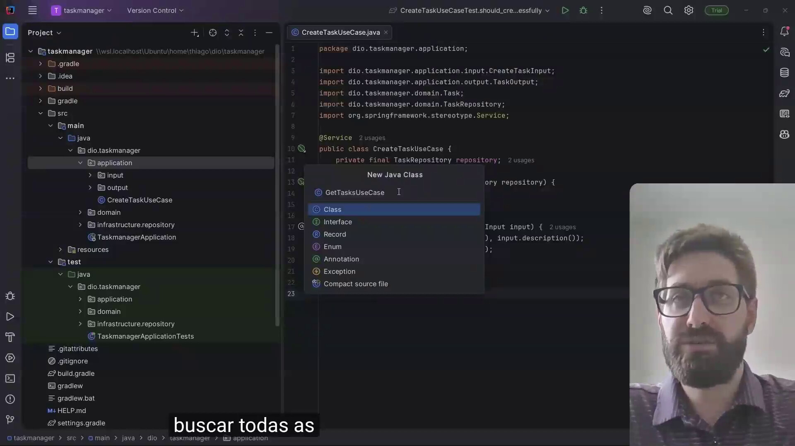
</p>

No IDE, com o `CreateTaskUseCase` já implementado como referência, é criada uma nova classe Java chamada `GetTasksUseCase`, responsável por buscar todas as tarefas cadastradas. A ideia desse use case é chamar o repositório, obter as tasks e convertê-las para o DTO de saída, seguindo a estratégia de DTOs já adotada no projeto.

```java
package dio.taskmanager.application;

import dio.taskmanager.application.input.CreateTaskInput;
import dio.taskmanager.application.output.TaskOutput;
import dio.taskmanager.domain.Task;
import dio.taskmanager.domain.TaskRepository;
import org.springframework.stereotype.Service;

@Service
public class CreateTaskUseCase {
    private final TaskRepository repository;
    // ...
}
```

<p align="center">
  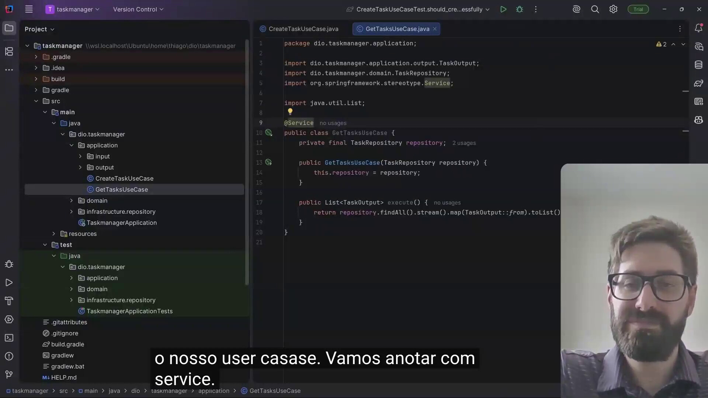
</p>

A classe `GetTasksUseCase` finalizada e anotada com `@Service`. O método `execute()` chama `repository.findAll()`, que retorna uma lista de tarefas, transforma essa lista em um `stream()`, aplica um `map` usando o método estático `TaskOutput::from` para converter cada `Task` em `TaskOutput`, e por fim reconverte o stream em lista com `toList()`. Ou seja: entra uma lista de tarefas do domínio e sai uma lista de DTOs de saída.

```java
package dio.taskmanager.application;

import dio.taskmanager.application.output.TaskOutput;
import dio.taskmanager.domain.TaskRepository;
import org.springframework.stereotype.Service;

import java.util.List;

@Service
public class GetTasksUseCase {
    private final TaskRepository repository;

    public GetTasksUseCase(TaskRepository repository) {
        this.repository = repository;
    }

    public List<TaskOutput> execute() {
        return repository.findAll().stream().map(TaskOutput::from).toList();
    }
}
```

<p align="center">
  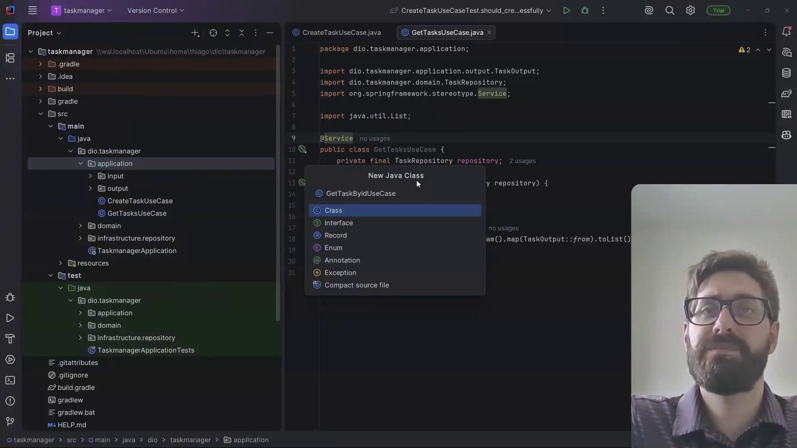
</p>

Criação da próxima classe: `GetTaskByIdUseCase`, responsável por buscar uma única tarefa a partir do seu identificador. Esse use case vai receber o `taskId` (representado por uma classe própria, e não apenas um `String` ou `Long`) e retornar um `TaskOutput`.

<p align="center">
  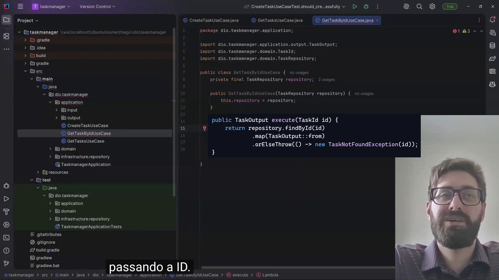
</p>

Implementação do método `execute` de `GetTaskByIdUseCase`. Ele chama `repository.findById(id)`, que devolve um `Optional<Task>` — ou seja, a tarefa pode existir ou não. Se existir, o `map` converte a `Task` em `TaskOutput`; se o `Optional` estiver vazio, o `orElseThrow` lança uma exceção customizada, passando o ID que não foi encontrado.

```java
public TaskOutput execute(TaskId id) {
    return repository.findById(id)
            .map(TaskOutput::from)
            .orElseThrow(() -> new TaskNotFoundException(id));
}
```

<p align="center">
  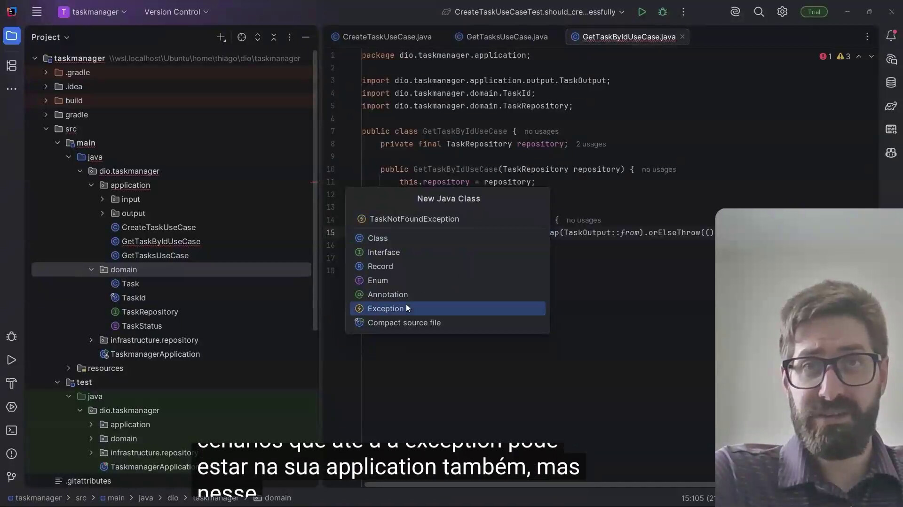
</p>

Para representar o cenário de tarefa não encontrada, é criada uma exceção customizada, `TaskNotFoundException`, no pacote de domínio (`domain`). A decisão de colocá-la no domínio, e não na camada de aplicação, se justifica porque essa é uma regra de negócio: "não encontrei uma task, então lanço uma exceção". Em outros cenários a exceção poderia estar na camada de aplicação, mas aqui faz mais sentido mantê-la junto da regra de negócio.

<p align="center">
  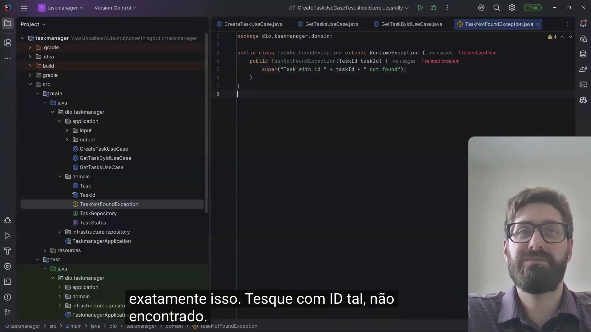
</p>

A classe `TaskNotFoundException` finalizada, estendendo `RuntimeException` e recebendo o `TaskId` no construtor. A mensagem da exceção é ajustada para o formato "Task com o ID tal não encontrada", deixando claro para quem consumir essa exceção qual tarefa não foi localizada.

```java
package dio.taskmanager.domain;

public class TaskNotFoundException extends RuntimeException {
    public TaskNotFoundException(TaskId taskId) {
        super("Task with id " + taskId + " not found");
    }
}
```

<p align="center">
  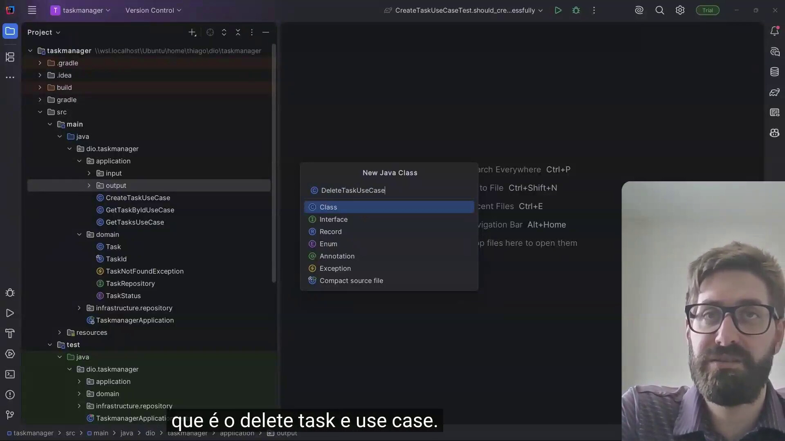
</p>

Com os use cases de criação, listagem e busca por ID prontos, agora é criada a classe `DeleteTaskUseCase`, que também recebe o repositório por injeção de dependência via construtor.

<p align="center">
  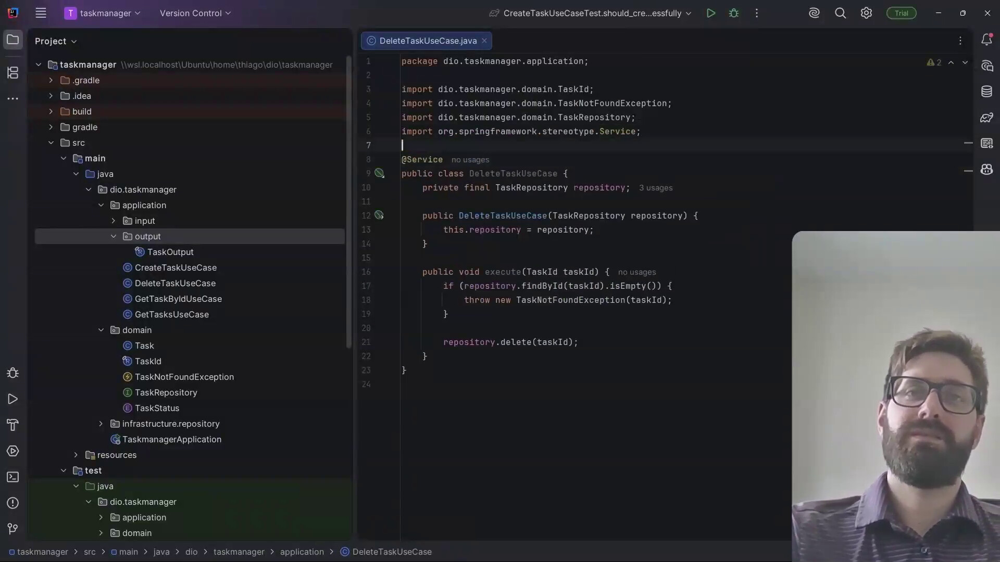
</p>

Implementação completa do `DeleteTaskUseCase`. No método `execute`, primeiro verifica-se se a task existe através de `repository.findById(taskId).isEmpty()`; se não existir, lança-se a `TaskNotFoundException`; se existir, o repositório executa o `delete`.

```java
package dio.taskmanager.application;

import dio.taskmanager.domain.TaskId;
import dio.taskmanager.domain.TaskNotFoundException;
import dio.taskmanager.domain.TaskRepository;
import org.springframework.stereotype.Service;

@Service
public class DeleteTaskUseCase {
    private final TaskRepository repository;

    public DeleteTaskUseCase(TaskRepository repository) {
        this.repository = repository;
    }

    public void execute(TaskId taskId) {
        if (repository.findById(taskId).isEmpty()) {
            throw new TaskNotFoundException(taskId);
        }

        repository.delete(taskId);
    }
}
```

<p align="center">
  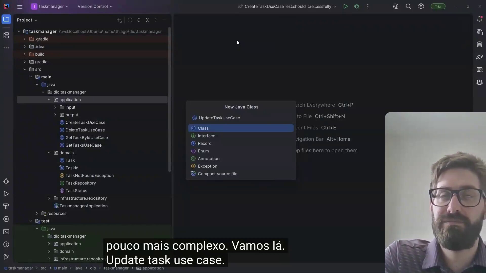
</p>

Início do último use case: `UpdateTaskUseCase`, apontado como um pouco mais complexo que os anteriores, pois envolve a atualização parcial de uma tarefa.

<p align="center">
  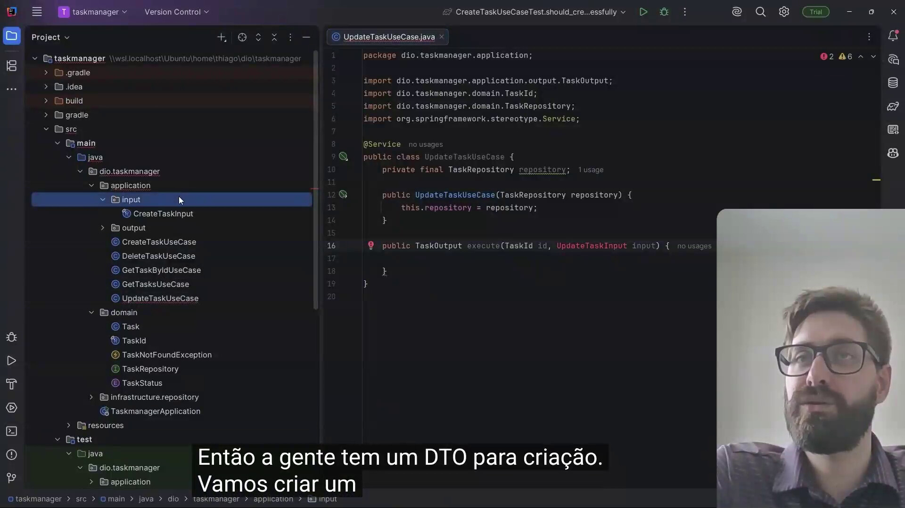
</p>

Estrutura inicial de `UpdateTaskUseCase`, já anotada com `@Service` e com o repositório injetado via construtor. A assinatura do método `execute` recebe um `TaskId` para identificar qual tarefa está sendo manipulada; o corpo do método ainda está vazio, sendo o próximo passo definir como receber os dados de atualização.

```java
package dio.taskmanager.application;

import dio.taskmanager.application.output.TaskOutput;
import dio.taskmanager.domain.TaskId;
import dio.taskmanager.domain.TaskRepository;
import org.springframework.stereotype.Service;

@Service
public class UpdateTaskUseCase {
    private final TaskRepository repository;

    public UpdateTaskUseCase(TaskRepository repository) {
        this.repository = repository;
    }

    public TaskOutput execute(TaskId id, UpdateTaskInput input) {

    }
}
```

<p align="center">
  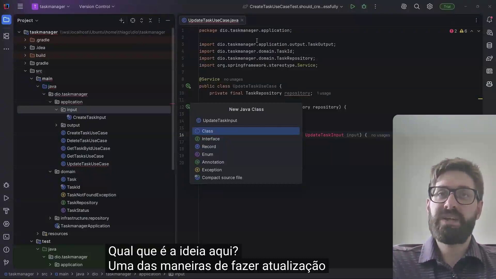
</p>

Dentro do pacote `input`, onde já existe o `CreateTaskInput` (DTO usado na criação de tarefas), é aberto o assistente de nova classe para criar um segundo DTO, exclusivo para a operação de atualização. A ideia é que, assim como existe um DTO de entrada para criação, exista outro específico para update, já que os dados e regras dessa operação são diferentes.

<p align="center">
  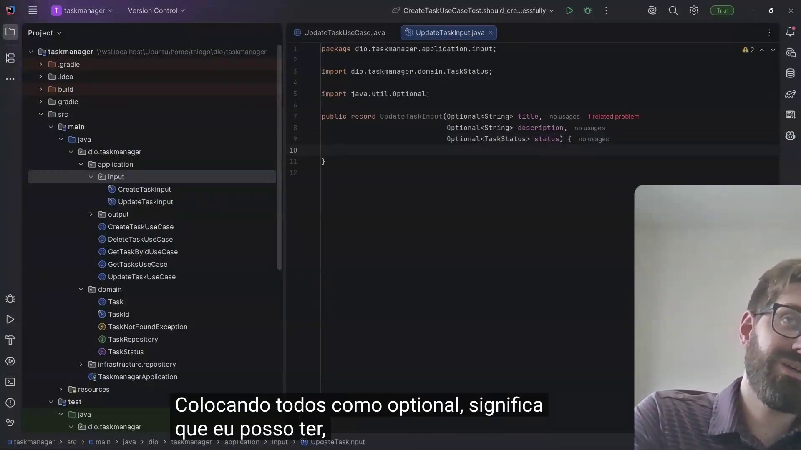
</p>

Criação da classe `UpdateTaskInput`. A ideia por trás desse DTO é viabilizar uma atualização no estilo PATCH via REST, em que é possível alterar qualquer propriedade da tarefa de forma independente — título, descrição ou status —, sem a necessidade de reenviar todos os campos. O ID não entra nesse DTO, pois não faz sentido alterá-lo.

<p align="center">
  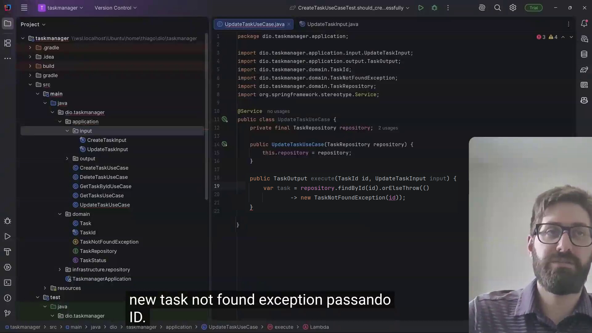
</p>

O `UpdateTaskInput` implementado como um `record` com três campos, todos envolvidos em `Optional`: `title`, `description` e `status`. Colocar todos como `Optional` permite que o cliente da API envie apenas o campo que deseja alterar — se um valor não for enviado, o campo correspondente permanece inalterado na tarefa, em vez de ser apagado.

```java
package dio.taskmanager.application.input;

import dio.taskmanager.domain.TaskStatus;

import java.util.Optional;

public record UpdateTaskInput(Optional<String> title,
                               Optional<String> description,
                               Optional<TaskStatus> status) {
}
```

<p align="center">
  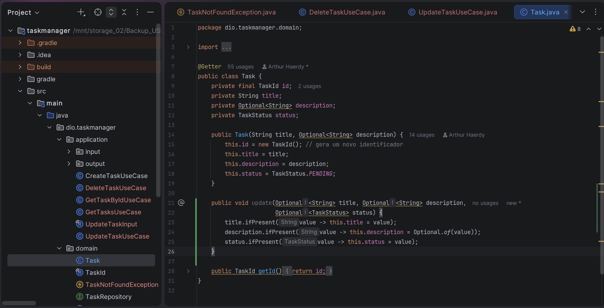
</p>

De volta ao `UpdateTaskUseCase`, o primeiro passo do método `execute` é localizar a tarefa: `repository.findById(id).orElseThrow(() -> new TaskNotFoundException(id))`. Com isso, ou a task é encontrada, ou a exceção customizada é lançada — reaproveitando o mesmo padrão já usado no `GetTaskByIdUseCase` e no `DeleteTaskUseCase`.

```java
public TaskOutput execute(TaskId id, UpdateTaskInput input) {
    var task = repository.findById(id).orElseThrow(()
            -> new TaskNotFoundException(id));
}
```

<p align="center">
  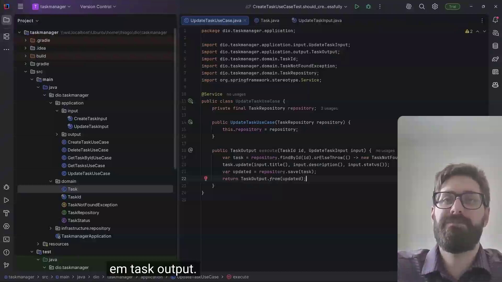
</p>

Etapa final do `UpdateTaskUseCase`. A regra de como atualizar os campos é colocada dentro da própria classe `Task`, no domínio — afinal, quem sabe como uma tarefa deve ser atualizada é a própria tarefa, e não o use case. O método `update` da `Task` usa `Optional.ifPresent` para cada campo: se `title` estiver presente, atualiza o título; o mesmo para `status`; já `description` usa `Optional.ofNullable`, permitindo diferenciar "não alterar" de "definir como vazio". No use case, depois de chamar `task.update(...)`, a tarefa atualizada é persistida com `repository.save(task)` e o resultado é convertido para `TaskOutput.from(updated)`. Com isso, os cinco use cases da camada de aplicação — criação, listagem, busca por ID, exclusão e atualização — estão completos, junto com a exceção customizada de tarefa não encontrada.

```java
public void update(Optional<String> title, Optional<String> description,
                    Optional<TaskStatus> status) {
    title.ifPresent(value -> this.title = value);
    description.ifPresent(value -> this.description = Optional.of(value));
    status.ifPresent(value -> this.status = value);
}
```

```java
public TaskOutput execute(TaskId id, UpdateTaskInput input) {
    var task = repository.findById(id).orElseThrow(()
            -> new TaskNotFoundException(id));
    task.update(input.title(), input.description(), input.status());
    var updated = repository.save(task);
    return TaskOutput.from(updated);
}
```

#### Material de Apoio Até Esta Etapa

- [002-Tutorial_TaskManager_Java_Spring_Videos04a05](./002-Tutorial_TaskManager_Java_Spring_Videos04a05.md)
- Arquivos do projeto nesta etapa: [./000-Midia_e_Anexos/etapas_do_codigo/taskmanager_ate_o_video_05.zip](./000-Midia_e_Anexos/etapas_do_codigo/taskmanager_ate_o_video_05.zip)


## Parte 6 - Infraestrutura e interface
### 🟩 Vídeo 06 - Infraestrutura e interface

<video width="60%" controls>
  <source src="000-Midia_e_Anexos/bootcamp_ntt_data_java_spring_ai-modulo.04-curso.01-video_06.webm" type="video/webm">
    Seu navegador não suporta vídeo HTML5.
</video>

link do vídeo: https://web.dio.me/track/ntt-data-2026-ai-java-back-end/course/criando-sua-primeira-api-rest-com-spring-boot/learning/f6ebfd53-da70-4503-941d-c5905d11ccec?autoplay=1

### Anotações

#### Abertura: Criando sua Primeira API REST com Spring Boot

<p align="center">
  
</p>

Slide de abertura da aula, apresentando o roteiro dos cinco tópicos que serão cobertos na construção da API REST com Spring Boot: infraestrutura e interface, consulta de tarefas, validação de dados, documentação da API e evolução da API. O foco inicial desta aula é o primeiro item, **Infraestrutura e interface**, que trata da camada HTTP responsável por receber as requisições do cliente.

#### Criando o pacote `http`

<p align="center">
  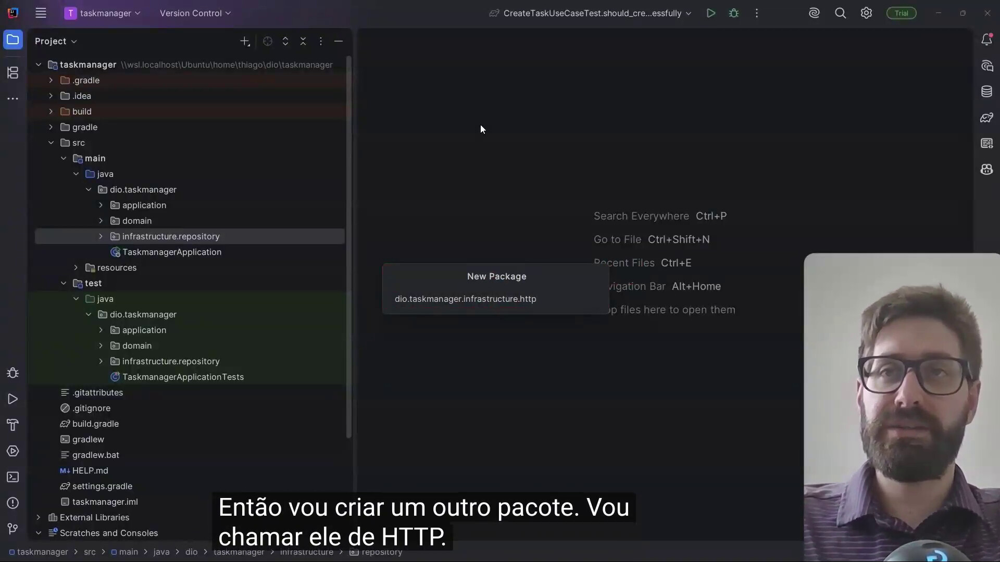
</p>

```text
dio.taskmanager.infrastructure.http
```

Dentro do pacote `infrastructure`, é criado um novo pacote chamado `http`. Seguindo os princípios de Domain Driven Design, a comunicação via HTTP é uma responsabilidade de infraestrutura, e não do domínio da aplicação — por isso ela fica isolada nesse pacote específico.

#### Criando a classe TaskController

<p align="center">
  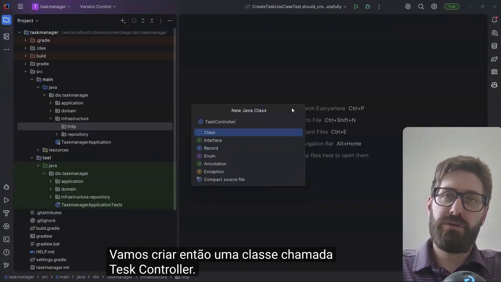
</p>

```text
TaskController
```

Dentro do pacote `http`, é criada uma nova classe chamada `TaskController`. O Controller é o padrão responsável por funcionar como ponto de entrada das requisições HTTP relacionadas a um recurso específico — neste caso, o recurso `task`.

#### Adicionando a dependência spring-boot-starter-web

<p align="center">
  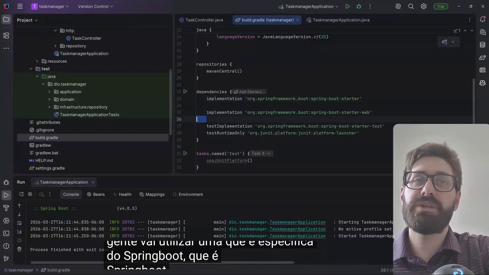
</p>

```groovy
dependencies {
    implementation 'org.springframework.boot:spring-boot-starter'

    implementation 'org.springframework.boot:spring-boot-starter-web'

    testImplementation 'org.springframework.boot:spring-boot-starter-test'
    testRuntimeOnly 'org.junit.platform:junit-platform-launcher'
}
```

Para trabalhar com HTTP no Spring Boot, é necessário adicionar uma dependência de web. É incluída no `build.gradle` a biblioteca `spring-boot-starter-web`, específica do Spring Boot. Ao adicionar essa dependência, a aplicação passa a ter acesso às anotações e classes relacionadas a controllers.

#### Classe principal da aplicação após importar a dependência web

<p align="center">
  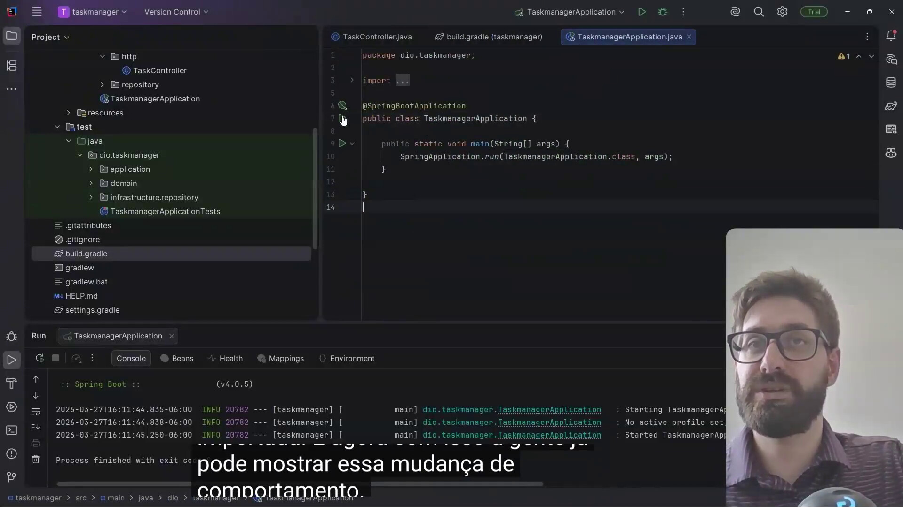
</p>

```java
package dio.taskmanager;

import ...

@SpringBootApplication
public class TaskmanagerApplication {

    public static void main(String[] args) {
        SpringApplication.run(TaskmanagerApplication.class, args);
    }

}
```

Com a biblioteca já importada, a classe principal `TaskmanagerApplication`, anotada com `@SpringBootApplication`, está pronta para demonstrar a mudança de comportamento causada pela dependência web: a aplicação passará a subir um servidor embutido em vez de apenas iniciar e finalizar.

#### Aplicação rodando com servidor Tomcat na porta 8080

<p align="center">
  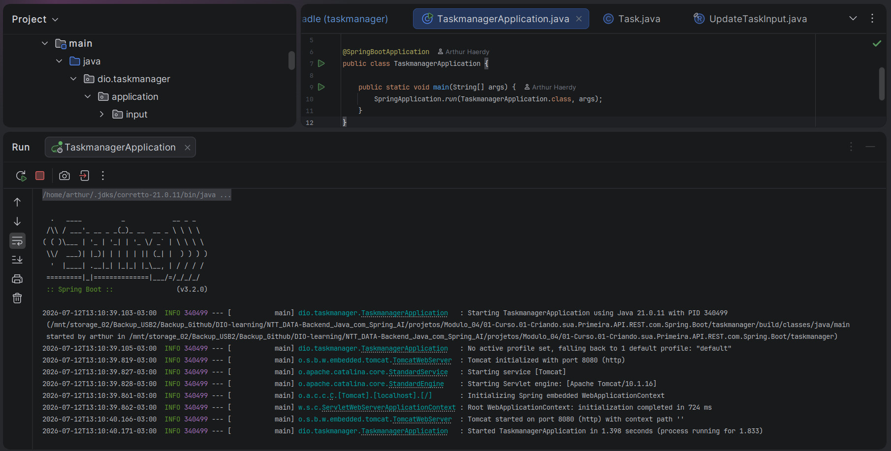
</p>

```bash
:: Spring Boot ::                (v4.0.5)

INFO --- dio.taskmanager.TaskmanagerApplication : Starting TaskmanagerApplication
INFO --- dio.taskmanager.TaskmanagerApplication : No active profile set
INFO --- dio.taskmanager.TaskmanagerApplication : Started TaskmanagerApplication in 1.398 seconds
```

Ao executar a aplicação novamente, o console mostra que o Spring Boot agora é capaz de subir um servidor Tomcat — evidenciado pela mensagem de inicialização do serviço Tomcat na porta 8080. A partir desse momento, a aplicação passa a se manter em execução, mantendo o servidor web ativo, em vez de encerrar imediatamente.

#### Anotando o TaskController com @RestController

<p align="center">
  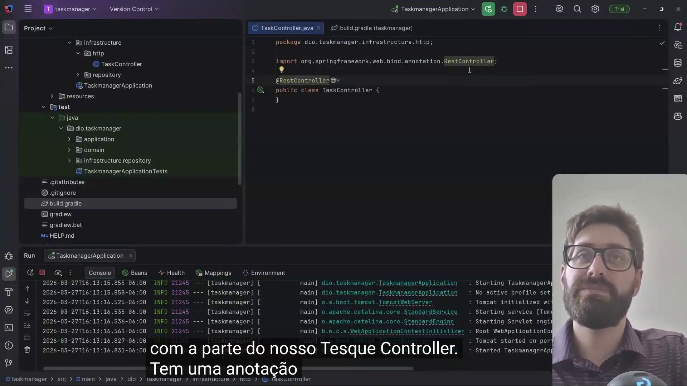
</p>

```java
package dio.taskmanager.infrastructure.http;

import org.springframework.web.bind.annotation.RestController;

@RestController
public class TaskController {
}
```

A classe `TaskController` recebe a anotação `@RestController`. Com essa anotação, o Spring Boot sabe como instanciar o controller e registrá-lo junto ao servidor Tomcat, tornando-o apto a receber requisições HTTP.

#### Injetando o CreateTaskUseCase via construtor

<p align="center">
  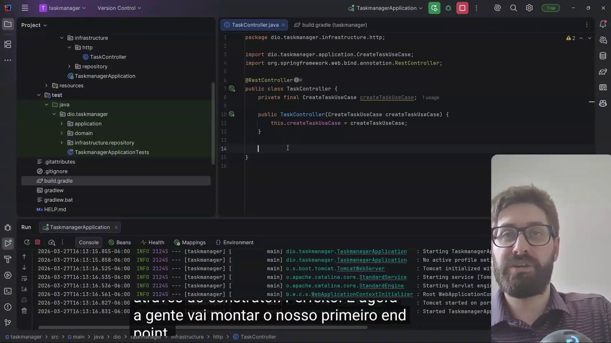
</p>

```java
@RestController
public class TaskController {
    private final CreateTaskUseCase createTaskUseCase;

    public TaskController(CreateTaskUseCase createTaskUseCase) {
        this.createTaskUseCase = createTaskUseCase;
    }

}
```

Em vez de acessar diretamente o repository, o controller recebe o `CreateTaskUseCase` criado anteriormente, feito por injeção de dependência através do construtor. Esse use case será chamado para executar a lógica de criação de uma tarefa a partir do endpoint que será montado a seguir.

#### Primeiro endpoint: @PostMapping

<p align="center">
  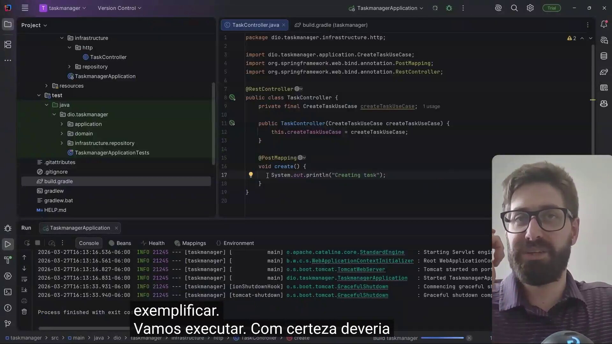
</p>

```java
@PostMapping
void create() {
    System.out.println("Creating task");
}
```

É criado o primeiro endpoint do controller, um método `create` anotado com `@PostMapping`. O nome do método em si não é o mais relevante — o que importa é o mapeamento: essa anotação indica que existe uma URL disponível para receber requisições HTTP do tipo POST. Como não há nenhum mapeamento adicional, uma requisição POST para a raiz do `localhost:8080` cairá nesse método. Um `System.out.println` foi adicionado apenas para exemplificar a execução.

#### Usando o HTTP Client do IntelliJ

<p align="center">
  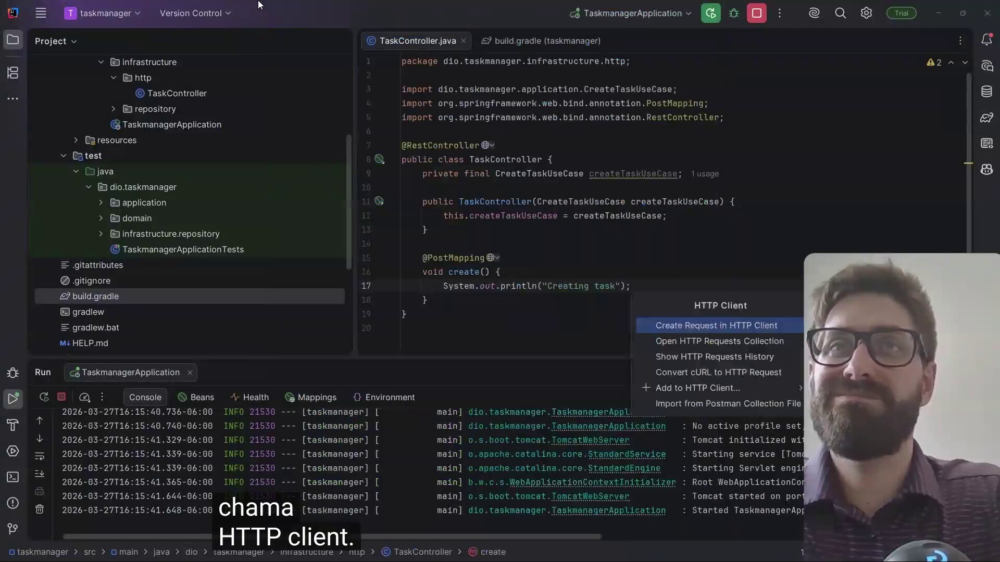
</p>

Para testar o endpoint, é utilizada a ferramenta HTTP Client do IntelliJ, acessada pelo menu de contexto com a opção **Create Request in HTTP Client**. Essa ferramenta permite montar e enviar requisições HTTP diretamente pela IDE.

#### Enviando a primeira requisição POST

<p align="center">
  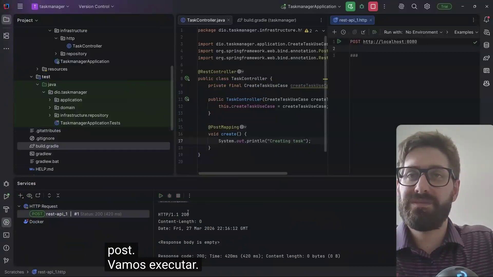
</p>

```http
POST http://localhost:8080
```

É montada uma requisição HTTP com o verbo POST para `localhost:8080`. Ao executá-la, o servidor responde com status 200, confirmando que a requisição foi processada com sucesso.

#### Aplicação em execução após a primeira requisição

<p align="center">
  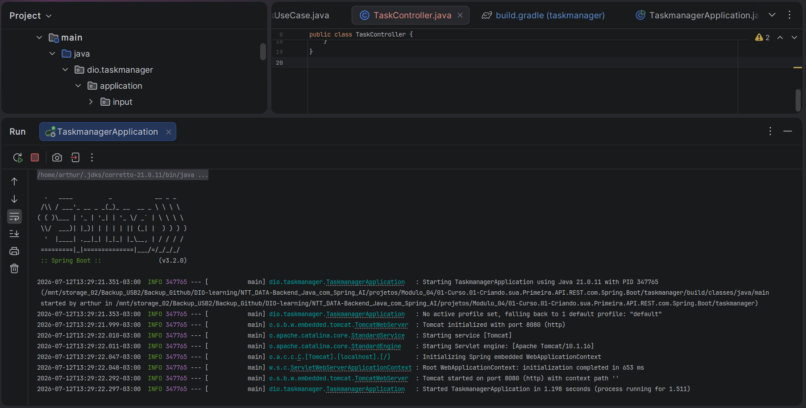
</p>

```bash
:: Spring Boot ::                (v3.2.0)

INFO --- dio.taskmanager.TaskmanagerApplication : Starting TaskmanagerApplication
INFO --- o.s.b.w.embedded.tomcat.TomcatWebServer : Tomcat initialized with port 8080
INFO --- dio.taskmanager.TaskmanagerApplication : Started TaskmanagerApplication in 1.198 seconds
```

A aplicação é reiniciada para validar o novo endpoint. O log confirma a subida do servidor Tomcat na porta 8080 e o início bem-sucedido da aplicação `TaskmanagerApplication`, deixando-a pronta para receber a requisição de teste.

#### Testando o endpoint via terminal com curl

<p align="center">
  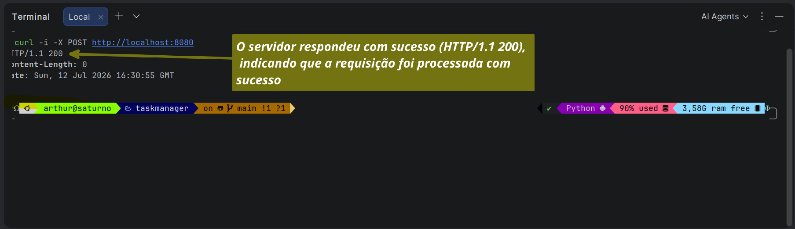
</p>

```bash
curl -i -X POST http://localhost:8080
```

Como alternativa ao HTTP Client, o endpoint também é testado diretamente pelo terminal com o comando `curl -i -X POST`. O servidor responde com `HTTP/1.1 200`, indicando que a requisição foi processada com sucesso.

#### Log confirmando a execução do método create

<p align="center">
  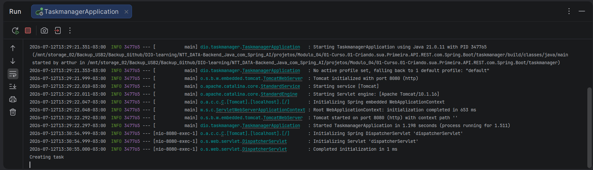
</p>

```bash
INFO --- [nio-8080-exec-1] o.a.c.c.C.[Tomcat].[localhost].[/] : Initializing Spring DispatcherServlet 'dispatcherServlet'
INFO --- [nio-8080-exec-1] o.s.web.servlet.DispatcherServlet : Initializing Servlet 'dispatcherServlet'
INFO --- [nio-8080-exec-1] o.s.web.servlet.DispatcherServlet : Completed initialization in 1 ms
Creating task
```

No console da aplicação, a mensagem `Creating task` confirma que a requisição enviada via curl efetivamente caiu dentro do método `create` do `TaskController`, validando que o mapeamento do endpoint está funcionando corretamente.

#### Resposta HTTP 200 sem corpo

<p align="center">
  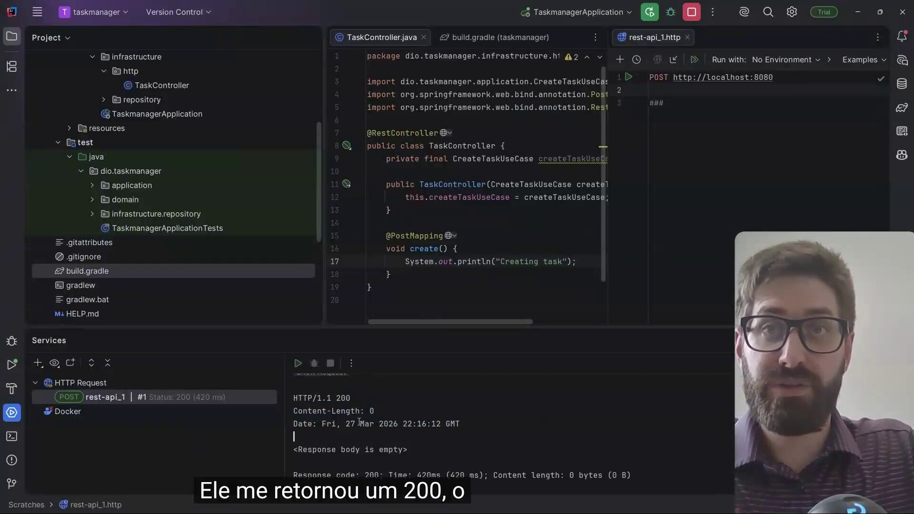
</p>

```http
HTTP/1.1 200
Content-Length: 0

<Response body is empty>
```

A resposta da requisição no HTTP Client mostra status 200 e corpo vazio, o que é esperado, já que o método `create` ainda não retorna nenhum conteúdo — apenas executa a lógica interna e imprime a mensagem no console.

#### Confirmando o fluxo completo da requisição

<p align="center">
  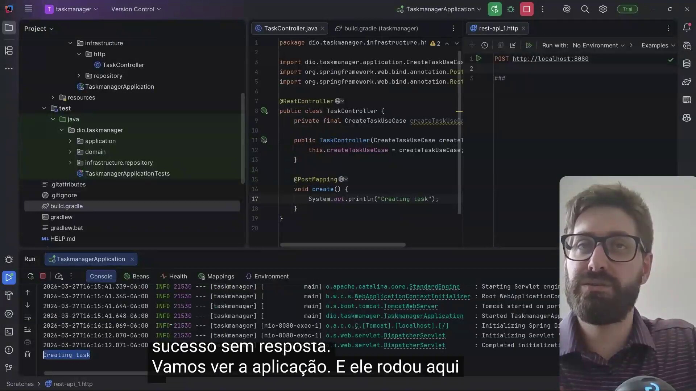
</p>

Com a resposta 200 confirmada no HTTP Client e a mensagem `Creating task` registrada no console, fica validado o fluxo completo: uma requisição POST enviada ao servidor é corretamente roteada até o método `create` do `TaskController`.

#### Instanciando manualmente um CreateTaskInput

<p align="center">
  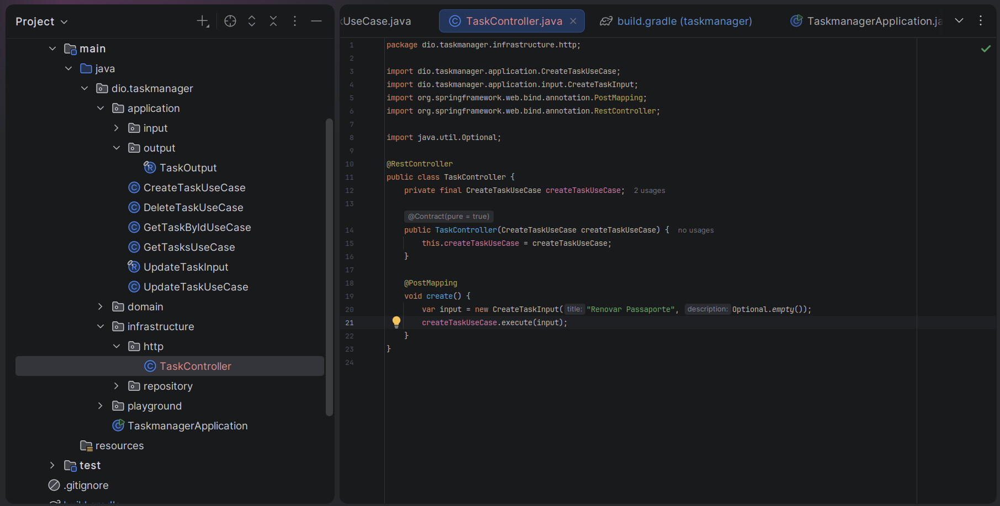
</p>

```java
@PostMapping
void create() {
    var input = new CreateTaskInput("Renovar Passaporte", Optional.empty());
    createTaskUseCase.execute(input);
}
```

Para validar que os dados da tarefa chegam até o use case, é feita uma instanciação manual de um `CreateTaskInput`, apenas para fins de teste, e o `createTaskUseCase` é chamado com esse input. Essa etapa é temporária e servirá de base para a extração dos dados reais da requisição HTTP nos próximos passos.

#### Revisando o InMemoryTaskRepository

<p align="center">
  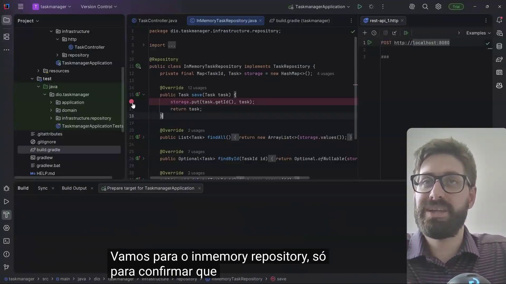
</p>

```java
@Repository
public class InMemoryTaskRepository implements TaskRepository {
    private final Map<TaskId, Task> storage = new HashMap<>();

    @Override
    public Task save(Task task) {
        storage.put(task.getId(), task);
        return task;
    }
    ...
}
```

Antes de testar com um breakpoint, é revisado o `InMemoryTaskRepository`, para confirmar que o método `save` armazena a task recebida no mapa em memória e a retorna em seguida.

#### Depurando o fluxo com breakpoint no repository

<p align="center">
  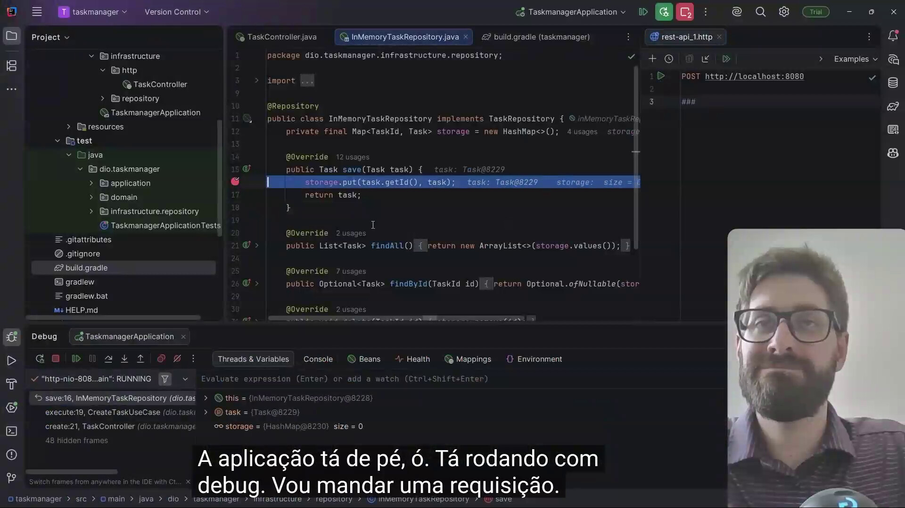
</p>

Um breakpoint é adicionado no método `save` do `InMemoryTaskRepository`. Ao rodar a aplicação em modo debug e enviar a requisição, a execução para nesse ponto, mostrando as variáveis `task` e `storage` — confirmando que a tarefa instanciada manualmente no controller realmente chega até a camada de persistência.

#### Aplicação conectada em modo debug

<p align="center">
  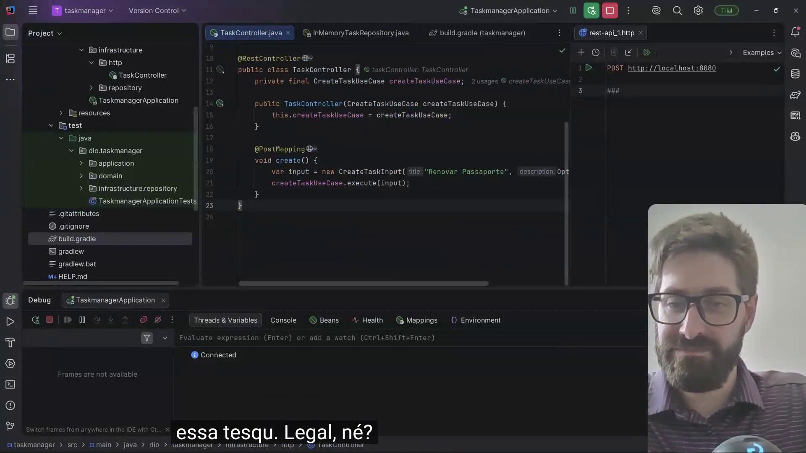
</p>

Com a aplicação em execução e o debugger conectado, uma nova requisição é enviada para confirmar que o fluxo cai corretamente no breakpoint configurado, validando de ponta a ponta a integração entre controller, use case e repository.

#### Mapeando o controller para o recurso /tasks

<p align="center">
  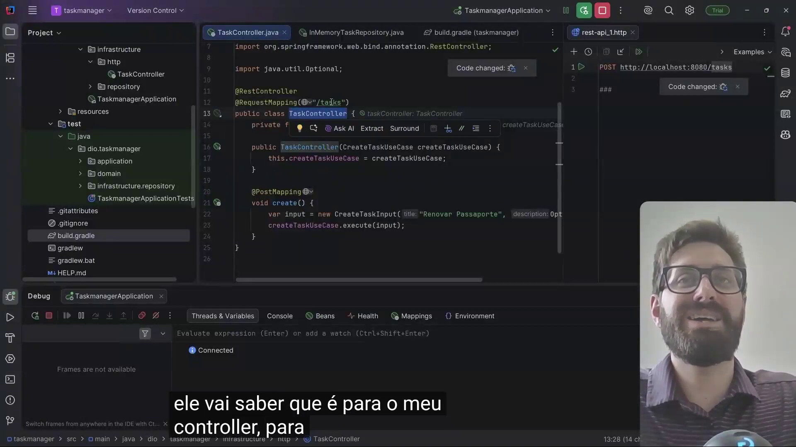
</p>

```java
@RestController
@RequestMapping("/tasks")
public class TaskController {
    ...
}
```

Em vez de responder na raiz da aplicação, o ideal é que o controller responda em um caminho específico do recurso, já que a aplicação pode ter outros recursos no futuro. Por isso, é adicionada a anotação `@RequestMapping("/tasks")` na classe, de forma que requisições para `/tasks` sejam direcionadas a esse controller. O `@PostMapping` continua mapeado para a raiz desse caminho, ou seja, o método `create` responde a um POST em `/tasks`.

#### Criando o pacote request para os DTOs

<p align="center">
  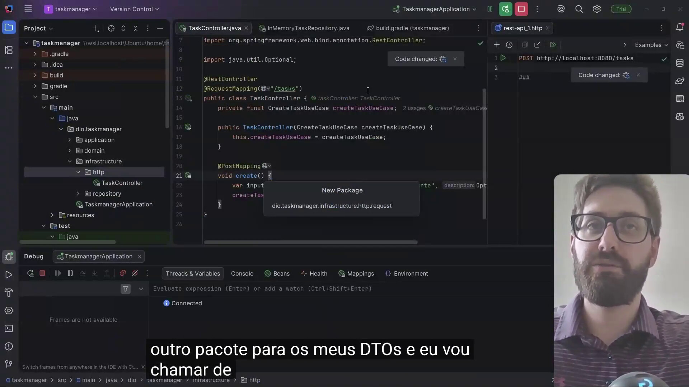
</p>

```text
dio.taskmanager.infrastructure.http.request
```

Para representar os dados recebidos pela API, é criado dentro do pacote `http` um novo pacote chamado `request`, destinado a armazenar os DTOs de entrada das requisições.

#### Criando a classe CreateTaskRequest

<p align="center">
  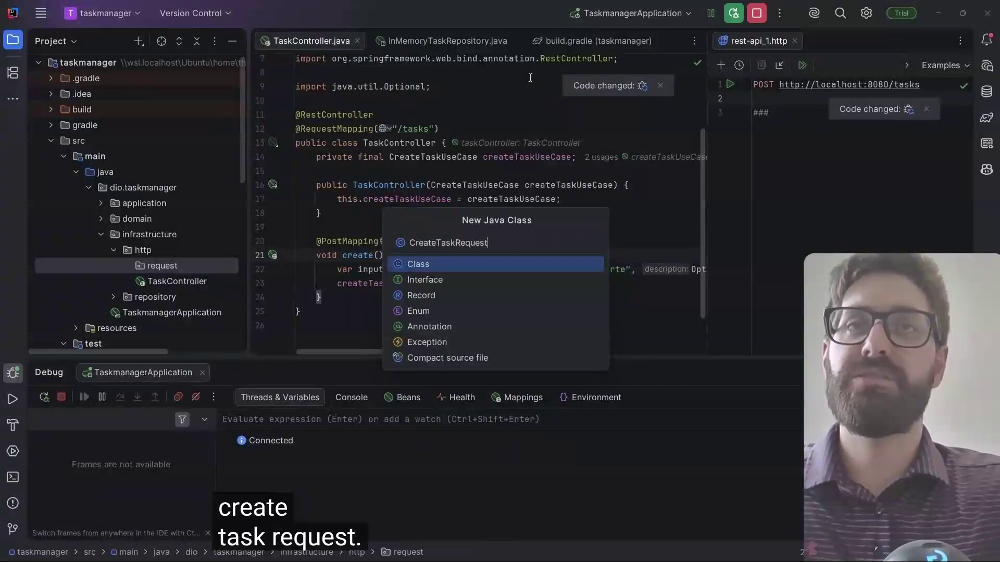
</p>

```text
CreateTaskRequest
```

Dentro do pacote `request`, é criada a classe `CreateTaskRequest`, que seguirá uma ideia próxima à do `CreateTaskInput`, representando os dados de criação de uma tarefa recebidos via HTTP.

#### Definindo o record CreateTaskRequest

<p align="center">
  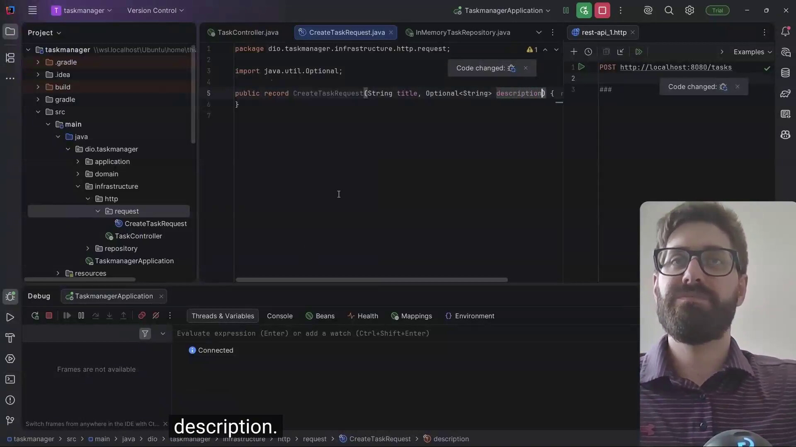
</p>

```java
package dio.taskmanager.infrastructure.http.request;

import java.util.Optional;

public record CreateTaskRequest(String title, Optional<String> description) {
}
```

O `CreateTaskRequest` é definido como um record contendo `title` (String) e `description` (Optional<String>), representando exatamente as informações que a API deve receber do cliente para criar uma nova tarefa.

#### Recebendo o CreateTaskRequest como @RequestBody

<p align="center">
  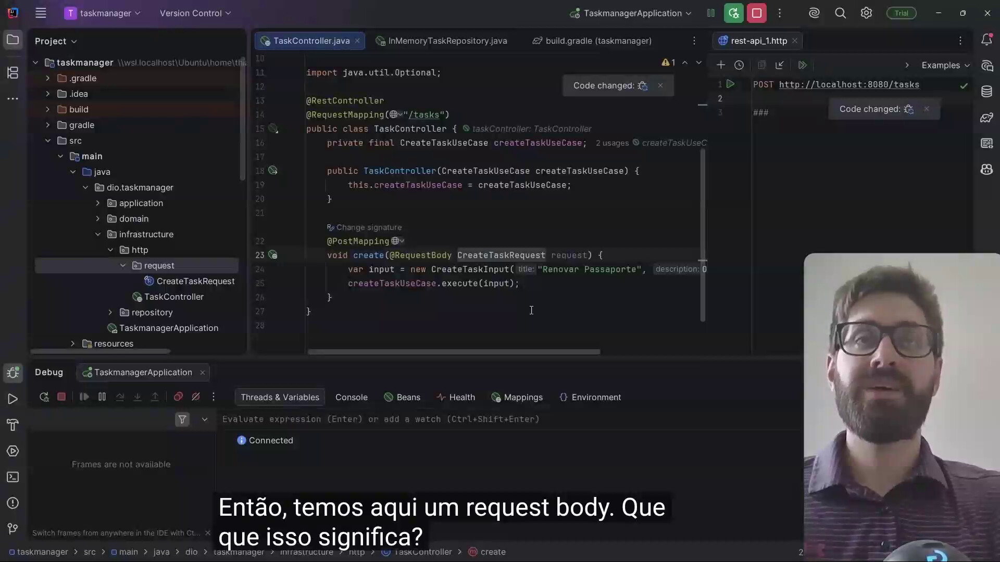
</p>

```java
@PostMapping
void create(@RequestBody CreateTaskRequest request) {
    var input = new CreateTaskInput("Renovar Passaporte", Optional.empty());
    createTaskUseCase.execute(input);
}
```

O método `create` passa a receber um parâmetro `CreateTaskRequest request`, anotado com `@RequestBody`. Essa anotação indica ao Spring que o corpo da requisição virá em um formato como JSON, e que ele deve ser automaticamente convertido (parseado) para essa classe Java.

#### Substituindo os dados fixos pelos dados da requisição

<p align="center">
  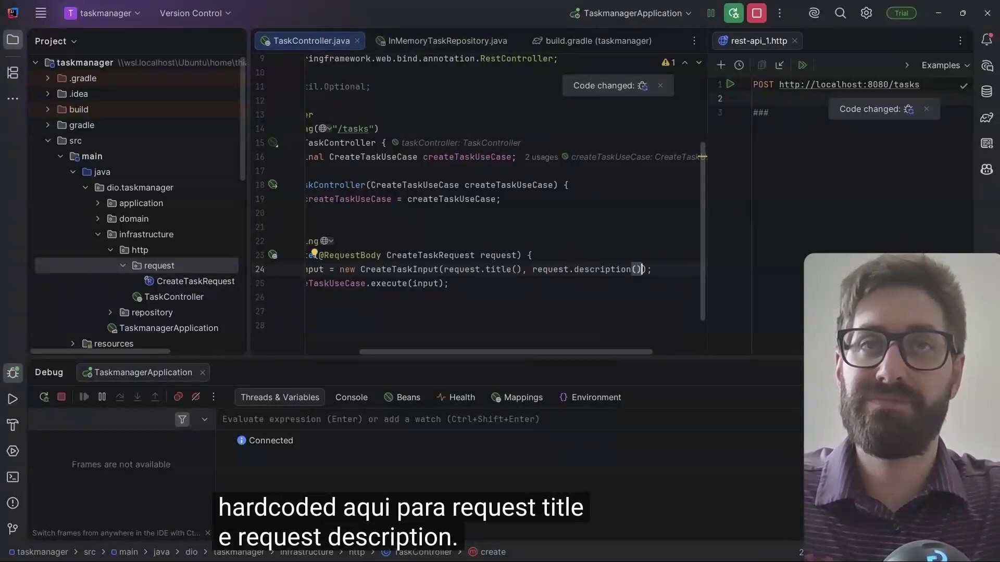
</p>

```java
@PostMapping
void create(@RequestBody CreateTaskRequest request) {
    var input = new CreateTaskInput(request.title(), request.description());
    createTaskUseCase.execute(input);
}
```

Os valores que antes estavam fixos (`"Renovar Passaporte"` e `Optional.empty()`) são substituídos pelos dados vindos efetivamente da requisição, `request.title()` e `request.description()`, eliminando a instância manual usada anteriormente para testes.

#### Erro 415 por ausência do Content-Type

<p align="center">
  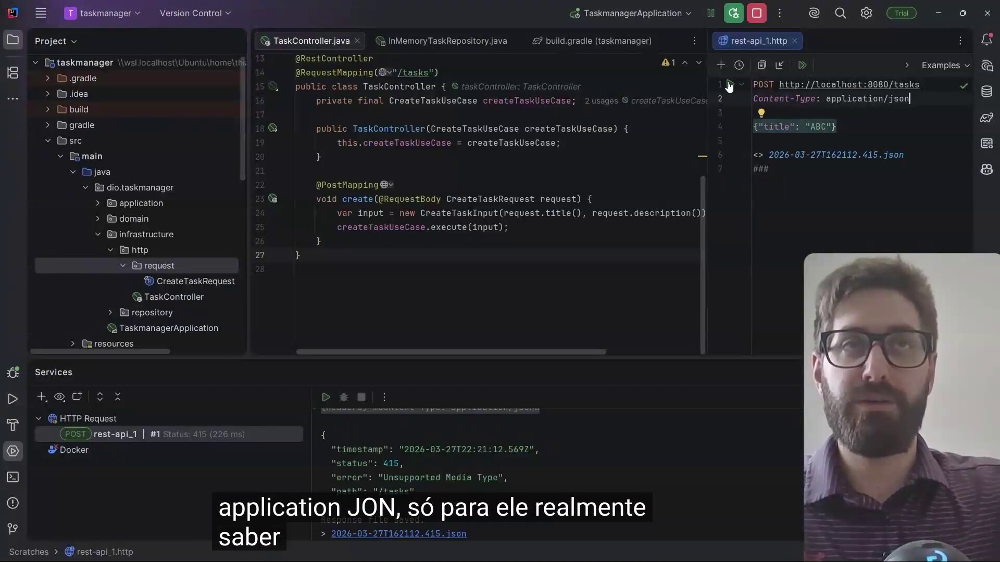
</p>

```http
POST http://localhost:8080/tasks
Content-Type: application/json

{"title": "ABC"}
```

Ao enviar a nova requisição com o corpo `{"title": "ABC"}`, é necessário incluir o cabeçalho `Content-Type: application/json`, para que o Spring saiba como converter o corpo recebido. Sem essa informação corretamente configurada na tentativa anterior, o servidor retornava um erro `415 Unsupported Media Type`.

#### Requisição bem-sucedida com Content-Type correto

<p align="center">
  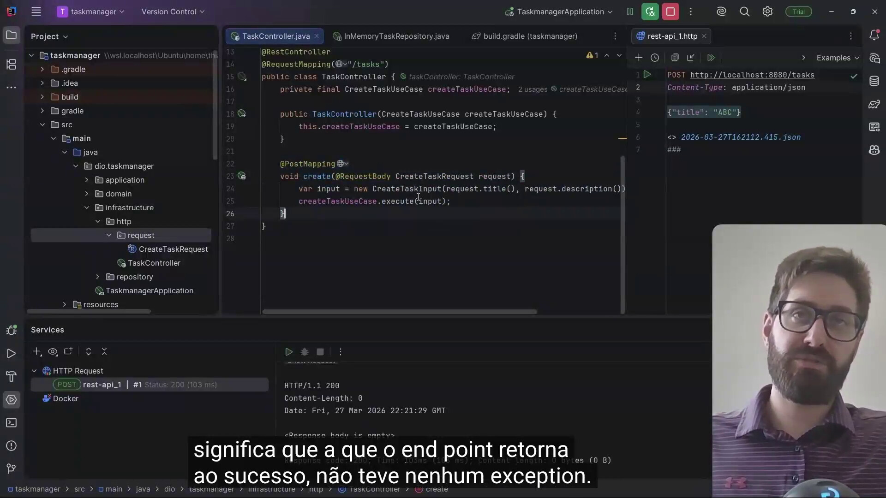
</p>

```http
HTTP/1.1 200
Content-Length: 0

<Response body is empty>
```

Com o `Content-Type: application/json` corretamente definido, a requisição é reenviada e o servidor retorna status 200, confirmando que o endpoint processou a requisição sem exceções, recebendo corretamente os dados enviados no corpo JSON.

#### Adicionando o método toInput() ao CreateTaskRequest

<p align="center">
  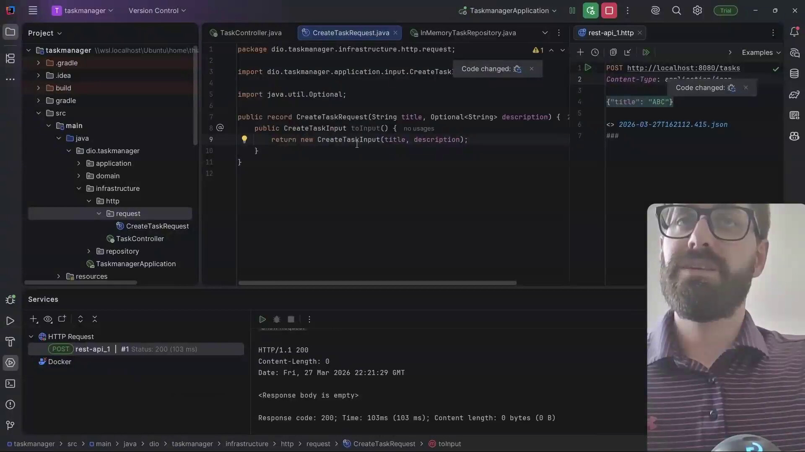
</p>

```java
public record CreateTaskRequest(String title, Optional<String> description) {
    public CreateTaskInput toInput() {
        return new CreateTaskInput(title, description);
    }
}
```

Para não misturar a responsabilidade de conversão de dados dentro do controller, é criado um método `toInput()` diretamente no `CreateTaskRequest`, responsável por transformar o DTO de requisição em um `CreateTaskInput` pronto para ser usado pelo use case.

#### Simplificando o controller com request.toInput()

<p align="center">
  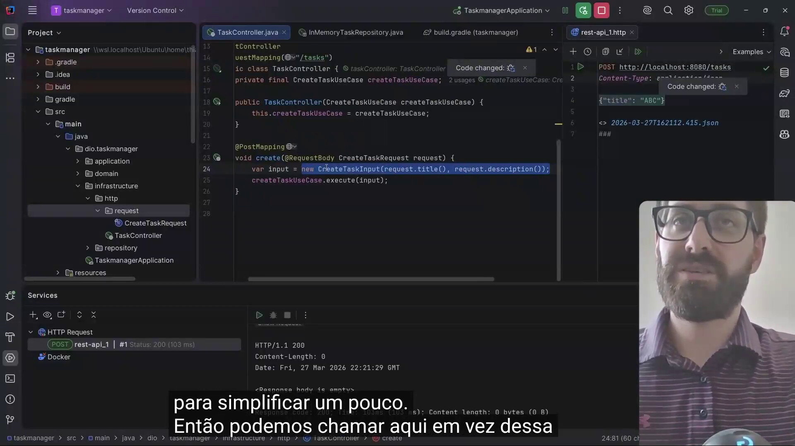
</p>

```java
@PostMapping
void create(@RequestBody CreateTaskRequest request) {
    var input = request.toInput();
    createTaskUseCase.execute(input);
}
```

No `TaskController`, a montagem manual do `CreateTaskInput` é substituída por uma simples chamada a `request.toInput()`, deixando o controller responsável apenas por gerenciar a requisição, sem conter regras de conversão de dados.

#### Capturando o output do use case e criando o pacote response

<p align="center">
  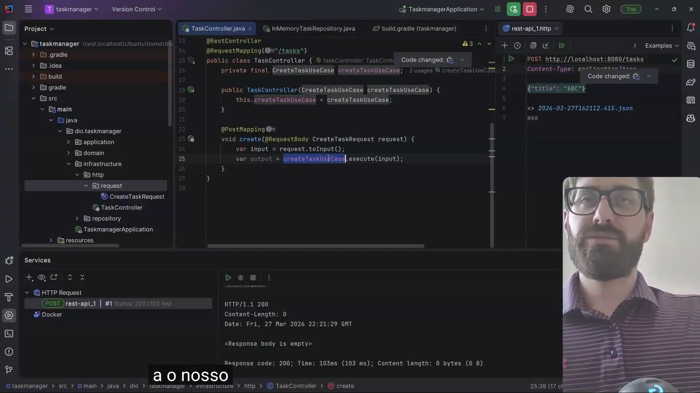
</p>

```java
void create(@RequestBody CreateTaskRequest request) {
    var input = request.toInput();
    var output = createTaskUseCase.execute(input);
}
```

O retorno do `createTaskUseCase.execute(input)`, que é um `TaskOutput`, passa a ser armazenado na variável `output`. Em seguida, é criado dentro do pacote `http` um novo pacote chamado `response`, destinado aos DTOs de saída da API.

#### Criando a classe TaskResponse

<p align="center">
  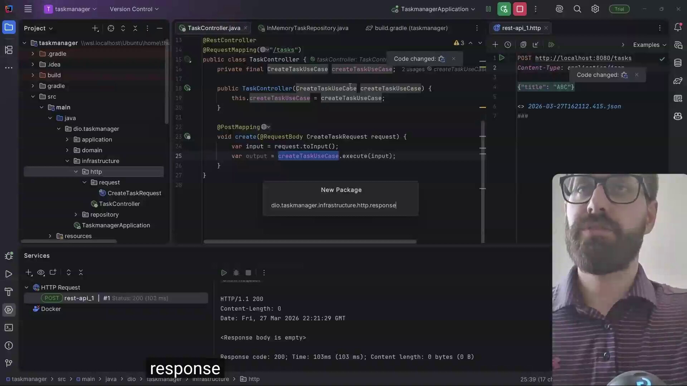
</p>

```text
TaskResponse
```

Dentro do pacote `response`, é criada a classe `TaskResponse`, responsável por representar os dados da tarefa que serão devolvidos ao cliente da API.

#### Definindo o record TaskResponse e o método from()

<p align="center">
  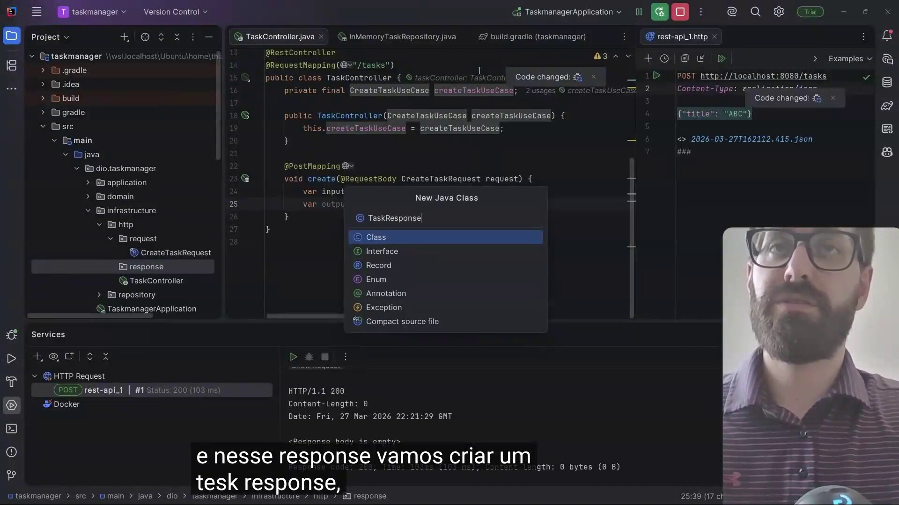
</p>

```java
package dio.taskmanager.infrastructure.http.response;

import com.fasterxml.jackson.annotation.JsonInclude;
import dio.taskmanager.application.output.TaskOutput;

@JsonInclude(JsonInclude.Include.NON_ABSENT)
public record TaskResponse(String id, String title, String description, String status) {
    public static TaskResponse from(TaskOutput output) {
        return new TaskResponse(output.id(),
                output.title(),
                output.description().orElse(null),
                output.status());
    }
}
```

O `TaskResponse` é definido como um record com `id`, `title`, `description` e `status`, todos como String — a descrição, que no domínio é `Optional`, é convertida para `null` quando ausente, já que retornar um `Optional` não faz sentido para uma resposta HTTP. A anotação `@JsonInclude(JsonInclude.Include.NON_ABSENT)` faz com que o Jackson remova do JSON as propriedades nulas. Um método estático `from(TaskOutput output)` é criado para converter o output do use case nesse DTO de resposta.

#### Alterando o retorno do endpoint para TaskResponse

<p align="center">
  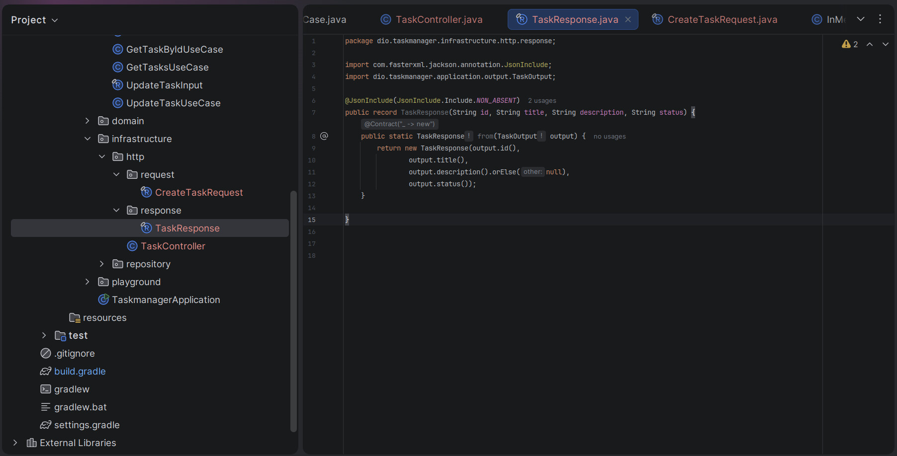
</p>

```java
TaskResponse create(@RequestBody CreateTaskRequest request) {
    var input = request.toInput();
    var output = createTaskUseCase.execute(input);
}
```

A assinatura do método `create` é alterada de `void` para `TaskResponse`, preparando o endpoint para devolver ao cliente as informações da tarefa criada, em vez de retornar apenas uma resposta vazia.

#### Retornando o TaskResponse convertido a partir do output

<p align="center">
  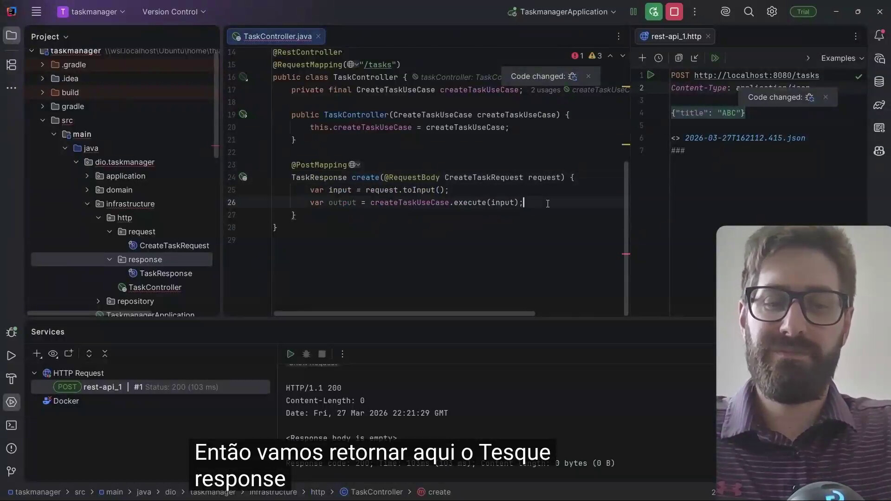
</p>

```java
TaskResponse create(@RequestBody CreateTaskRequest request) {
    var input = request.toInput();
    var output = createTaskUseCase.execute(input);
    return TaskResponse.from(output);
}
```

O método `create` passa a retornar `TaskResponse.from(output)`, convertendo o resultado do use case no DTO de resposta. A partir de agora, uma requisição de criação será persistida e a resposta trará de volta as informações que foram efetivamente salvas.

#### Testando a criação com apenas o título

<p align="center">
  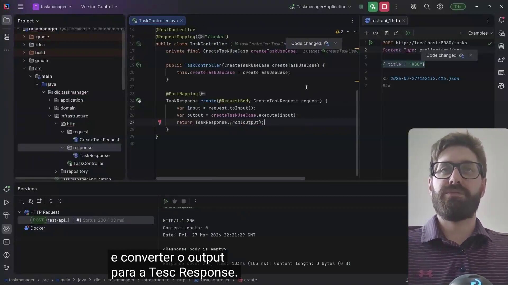
</p>

```http
POST http://localhost:8080/tasks
Content-Type: application/json

{"title": "ABC"}
```

É enviada uma nova requisição de teste contendo apenas o campo `title` com o valor `"ABC"`, para validar o fluxo completo agora que o endpoint retorna o `TaskResponse` correspondente.

#### Testando a criação com título e descrição

<p align="center">
  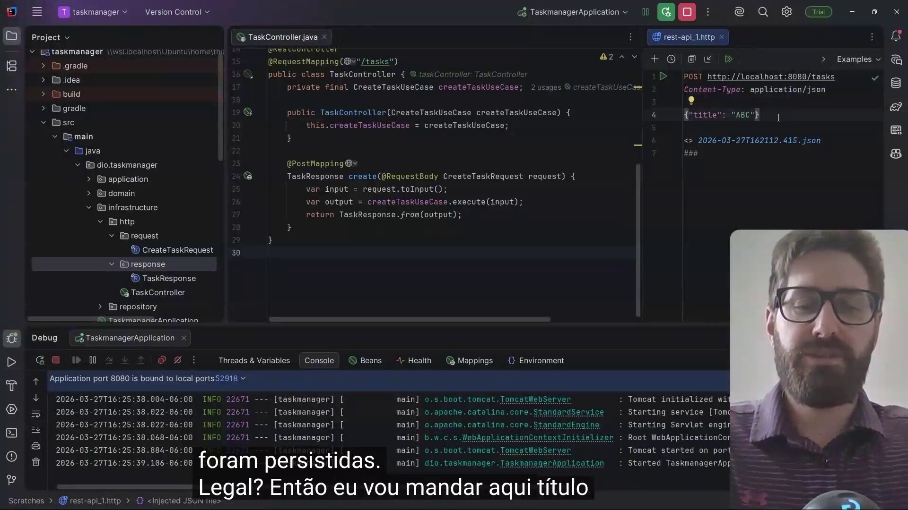
</p>

```http
POST http://localhost:8080/tasks
Content-Type: application/json

{"title": "ABC", "description": "qwerty"}
```

Uma nova requisição é enviada, agora incluindo também o campo `description` com o valor `"qwerty"`, para confirmar que ambos os campos do `CreateTaskRequest` são corretamente processados pelo endpoint.

#### Resposta com os dados da tarefa persistida

<p align="center">
  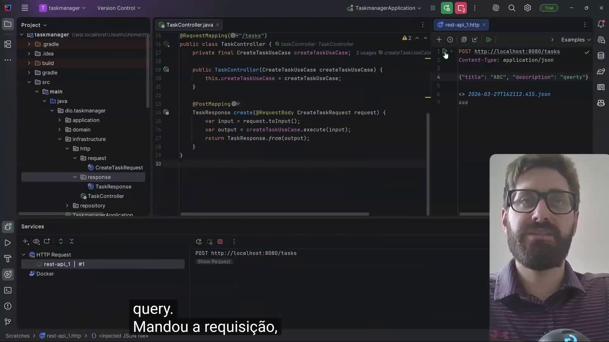
</p>

```json
{
  "id": "0483ebff-8063-4fb1-8b99-660098ff194b",
  "title": "ABC",
  "description": "qwerty",
  "status": "PENDING"
}
```

A resposta da requisição traz de volta o `id` gerado, o `title`, a `description` e o `status` da tarefa, confirmando que o fluxo completo de criação — do request ao response, passando pelo use case e pelo repository — está funcionando corretamente.

#### Explorando a ferramenta de Endpoints do IntelliJ

<p align="center">
  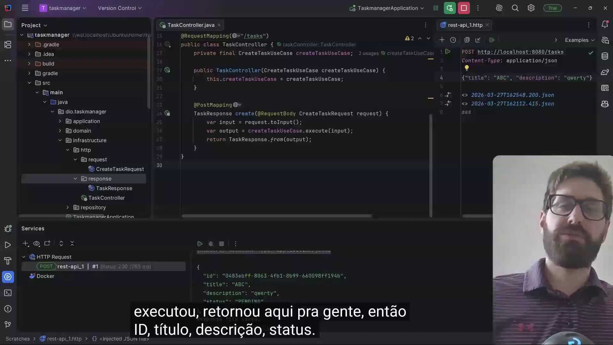
</p>

O IntelliJ disponibiliza uma ferramenta chamada **Endpoints**, acessível pelo menu de contexto do mapeamento através da opção **Show all endpoints of module**. Essa ferramenta lista todos os endpoints da aplicação, permitindo testá-los rapidamente conforme novos métodos vão sendo criados no controller.

#### Painel de Endpoints exibindo o mapeamento /tasks

<p align="center">
  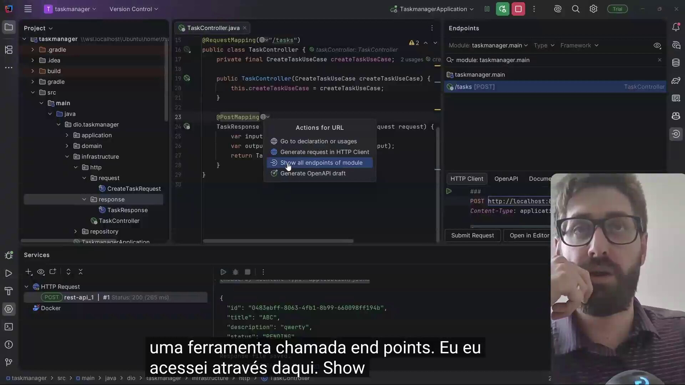
</p>

O painel de **Endpoints** exibe o mapeamento `/tasks [POST]` associado ao `TaskController`. A partir dele, é possível testar a requisição diretamente pelo HTTP Client, visualizar a especificação OpenAPI e a documentação gerada, ou exportar essa especificação para uso em ferramentas como Swagger ou Redoc.

#### Material de Apoio Até Esta Etapa

- [003-Tutorial_TaskManager_Java_Spring_Video06](./003-Tutorial_TaskManager_Java_Spring_Video06.md)
- Arquivos do projeto nesta etapa: [./000-Midia_e_Anexos/etapas_do_codigo/taskmanager_ate_o_video_06.zip](./000-Midia_e_Anexos/etapas_do_codigo/taskmanager_ate_o_video_06.zip)

## Parte 7 - Consulta de tarefas

### 🟩 Vídeo 07 - Consulta de tarefas

<video width="60%" controls>
  <source src="000-Midia_e_Anexos/bootcamp_ntt_data_java_spring_ai-modulo.04-curso.01-video_07.webm" type="video/webm">
    Seu navegador não suporta vídeo HTML5.
</video>

link do vídeo: https://web.dio.me/track/ntt-data-2026-ai-java-back-end/course/criando-sua-primeira-api-rest-com-spring-boot/learning/120ca8be-ecfc-4437-be09-e8496d314c04?autoplay=1

### Anotações

#### Abertura do módulo: Consulta de tarefas

<p align="center">
  
</p>

Slide de abertura da aula "Criando sua Primeira API REST com Spring Boot", da Jornada Tech. O sumário mostra as cinco etapas do curso, com o item **02 — Consulta de tarefas** em destaque, indicando que esta aula vai tratar da criação dos endpoints de leitura, atualização e remoção de tarefas na API.

#### Criando o endpoint de listagem (GET /tasks)

<p align="center">
  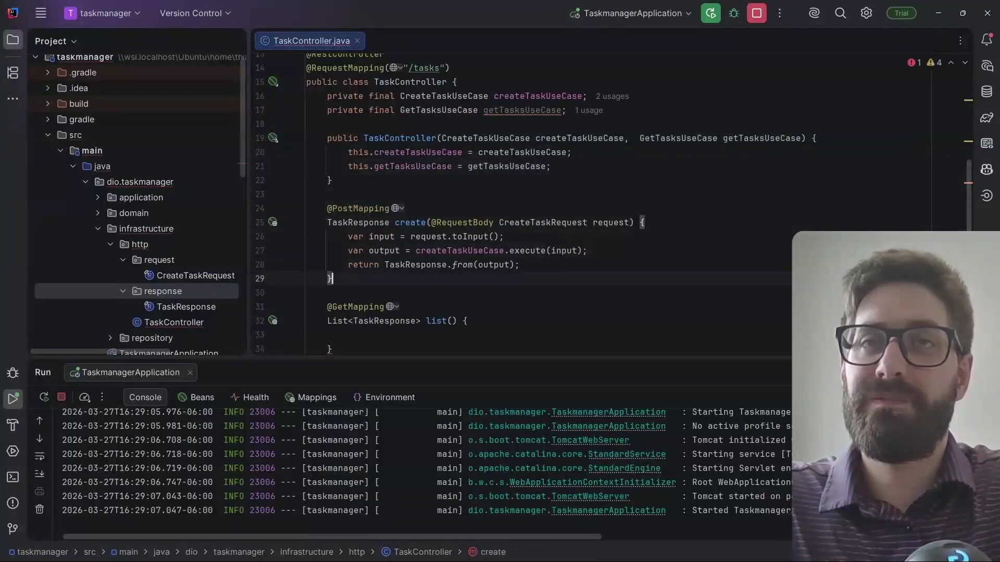
</p>

No `TaskController`, já existe o endpoint de criação (`@PostMapping`) usando o `CreateTaskUseCase`. Agora é criado um novo método `list()`, anotado com `@GetMapping`, mapeado para a raiz `/tasks`, que deve retornar uma lista de `TaskResponse`. Para isso, é necessário injetar mais um caso de uso no controller: o `GetTasksUseCase`.

```java
@GetMapping
List<TaskResponse> list() {

}
```

#### Implementando o método list() com Stream

<p align="center">
  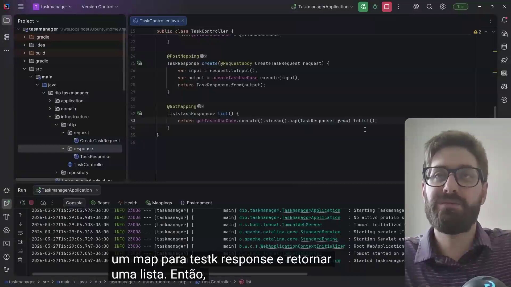
</p>

O corpo do método `list()` é implementado: o `getTasksUseCase.execute()` retorna uma lista de `TaskOutput`, que é convertida em uma lista de `TaskResponse` usando `stream().map(TaskResponse::from).toList()`.

```java
@GetMapping
List<TaskResponse> list() {
    return getTasksUseCase.execute().stream().map(TaskResponse::from).toList();
}
```

#### Testando o endpoint GET /tasks

<p align="center">
  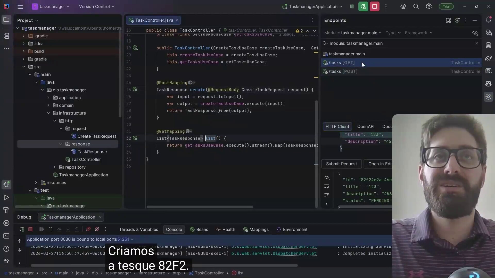
</p>

Com a aplicação reiniciada, o painel de *Endpoints* já lista `/tasks [GET]` e `/tasks [POST]`. Uma requisição de criação é enviada com título "123" e descrição "456...", gerando uma nova tarefa (identificada como 82F2) na base de persistência em memória.

#### Criando o stub do endpoint de busca por ID

<p align="center">
  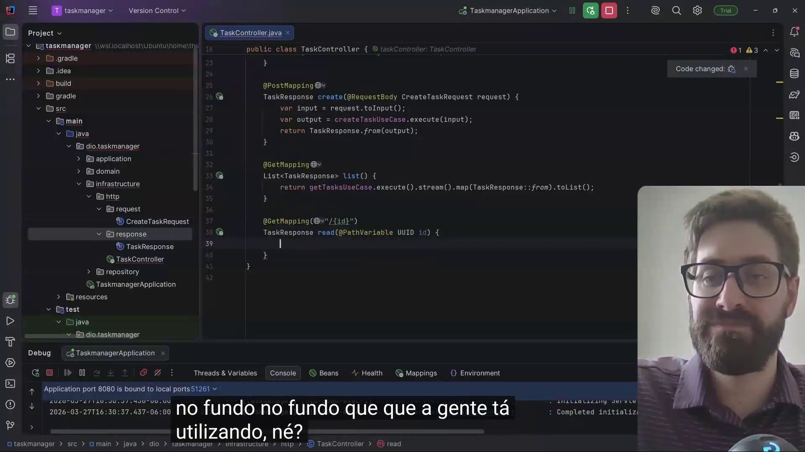
</p>

Após validar a listagem, é criado um novo endpoint para retornar apenas um elemento, buscado por ID. O método `read()` recebe o identificador via `@PathVariable`, ou seja, extraído diretamente da URL (diferente de um *query parameter*), seguindo o padrão REST.

```java
@GetMapping("/{id}")
TaskResponse read(@PathVariable UUID id) {

}
```

#### Injetando o GetTaskByIdUseCase

<p align="center">
  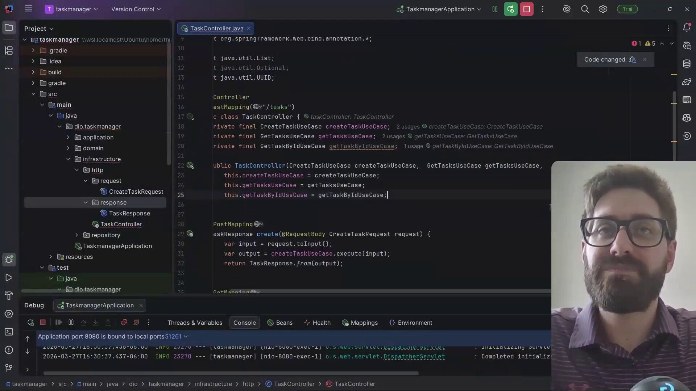
</p>

O parâmetro do identificador é recebido como `UUID`, que é de fato o tipo utilizado internamente para identificar as tarefas. O controller passa a receber um novo caso de uso em seu construtor, o `GetTaskByIdUseCase`, que será responsável por buscar a tarefa pelo ID informado.

#### Implementando o método read()

<p align="center">
  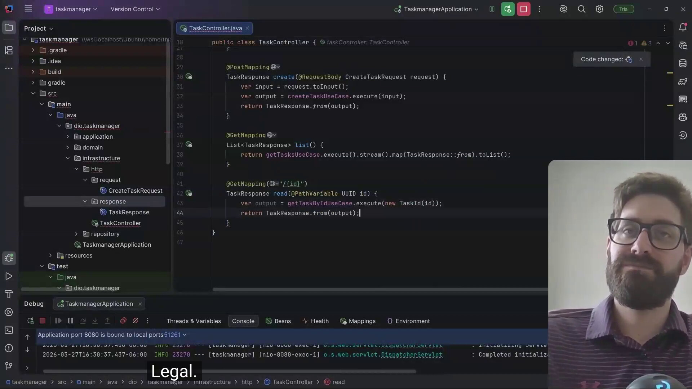
</p>

Com o caso de uso injetado, o método `read()` é implementado: o ID recebido da URL é usado para executar o `getTaskByIdUseCase`, e o resultado é convertido para `TaskResponse`.

```java
@GetMapping("/{id}")
TaskResponse read(@PathVariable UUID id) {
    var output = getTaskByIdUseCase.execute(new TaskId(id));
    return TaskResponse.from(output);
}
```

#### Novo endpoint disponível: GET /tasks/{id}

<p align="center">
  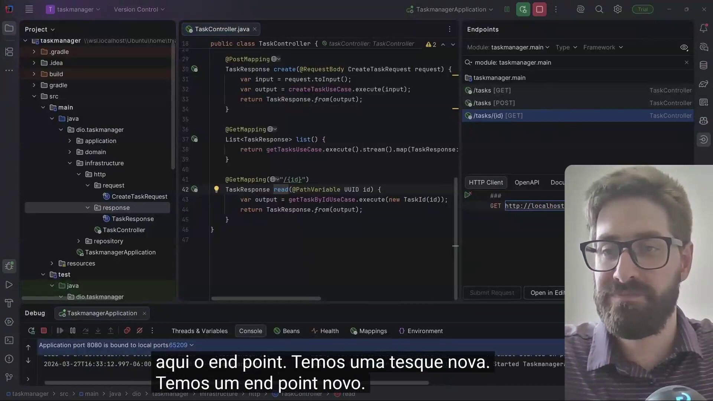
</p>

Com a aplicação novamente em execução, o painel de *Endpoints* passa a exibir também o novo mapeamento `/tasks/{id} [GET]`, confirmando que a rota foi registrada corretamente.

#### Erro 500 ao buscar um ID inexistente

<p align="center">
  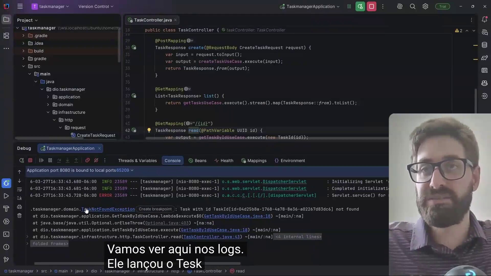
</p>

Ao testar o novo endpoint com um UUID aleatório (que não existe na base), a requisição retorna um erro **500**. Nos logs do console, é possível ver que a aplicação lançou uma `TaskNotFoundException`, que não estava sendo tratada — esse é o comportamento padrão do Spring quando uma exceção não tratada é lançada durante o processamento da requisição.

#### Criando a classe GlobalExceptionHandler

<p align="center">
  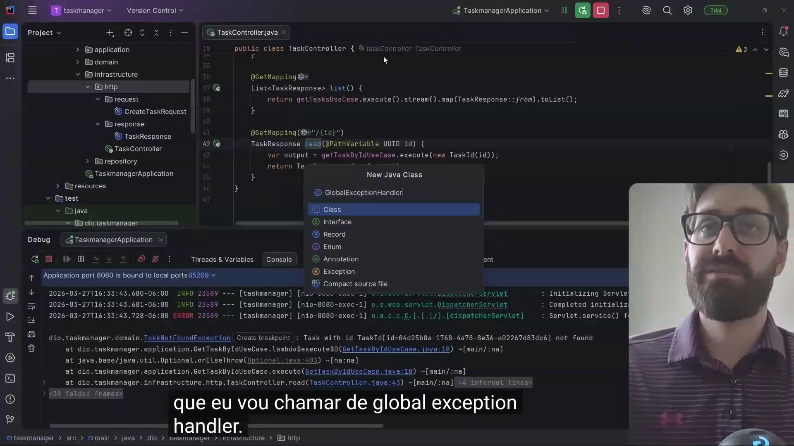
</p>

Para que um recurso não encontrado retorne o código HTTP correto (404, em vez de 500), é criada uma nova classe no pacote HTTP, chamada `GlobalExceptionHandler`. A proposta dessa classe é centralizar o tratamento de todas as exceções lançadas pela aplicação.

#### Estrutura inicial do GlobalExceptionHandler

<p align="center">
  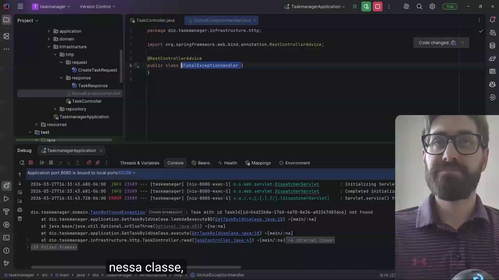
</p>

A classe é criada com a anotação `@RestControllerAdvice`, que permite que ela intercepte exceções lançadas por qualquer controller da aplicação.

```java
@RestControllerAdvice
public class GlobalExceptionHandler {

}
```

#### Tratando a TaskNotFoundException com @ExceptionHandler

<p align="center">
  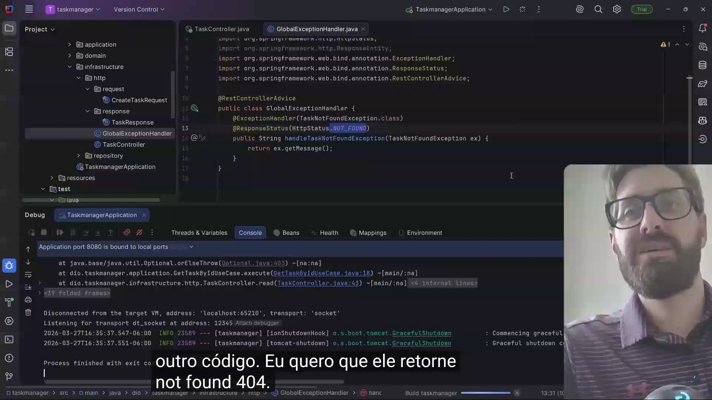
</p>

É implementado um método anotado com `@ExceptionHandler(TaskNotFoundException.class)`, que é acionado sempre que essa exceção específica ocorrer. O método retorna a mensagem da exceção e é anotado com `@ResponseStatus(HttpStatus.NOT_FOUND)`, garantindo que a resposta HTTP seja um 404 em vez do 500 padrão.

```java
@ExceptionHandler(TaskNotFoundException.class)
@ResponseStatus(HttpStatus.NOT_FOUND)
public String handleTaskNotFoundException(TaskNotFoundException ex) {
    return ex.getMessage();
}
```

#### Testando o retorno 404

<p align="center">
  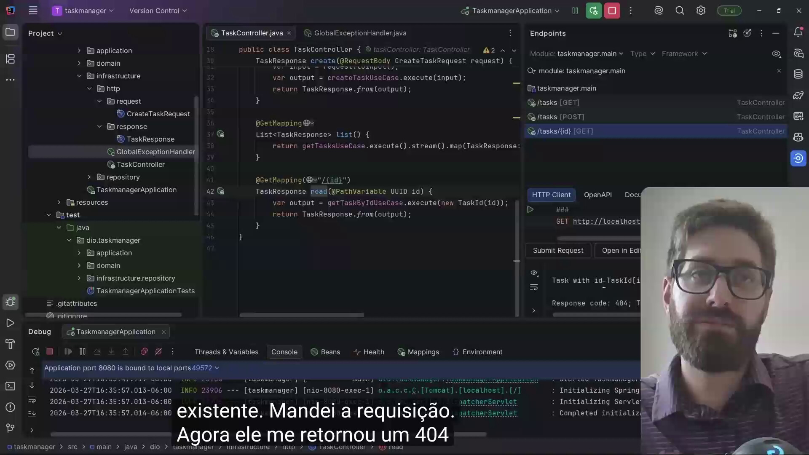
</p>

Uma nova requisição é enviada para o mesmo ID inexistente. Desta vez, a resposta traz o código **404**, com a mensagem informando que a tarefa com aquele ID não foi encontrada — exatamente o comportamento esperado para um recurso inexistente em uma API REST.

#### Exceção tratada corretamente

<p align="center">
  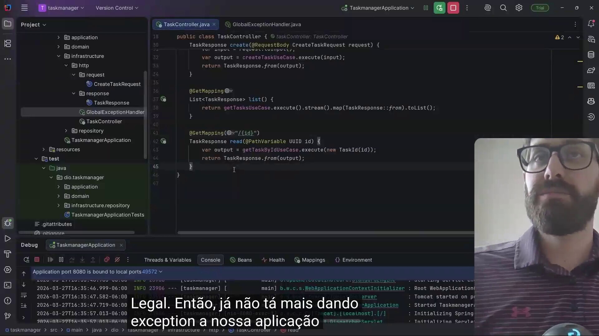
</p>

Com o `GlobalExceptionHandler` em funcionamento, a aplicação não interrompe mais o fluxo com uma exceção não tratada quando uma tarefa não é encontrada — a resposta agora é padronizada e devidamente sinalizada ao cliente da API.

#### Injetando o DeleteTaskUseCase

<p align="center">
  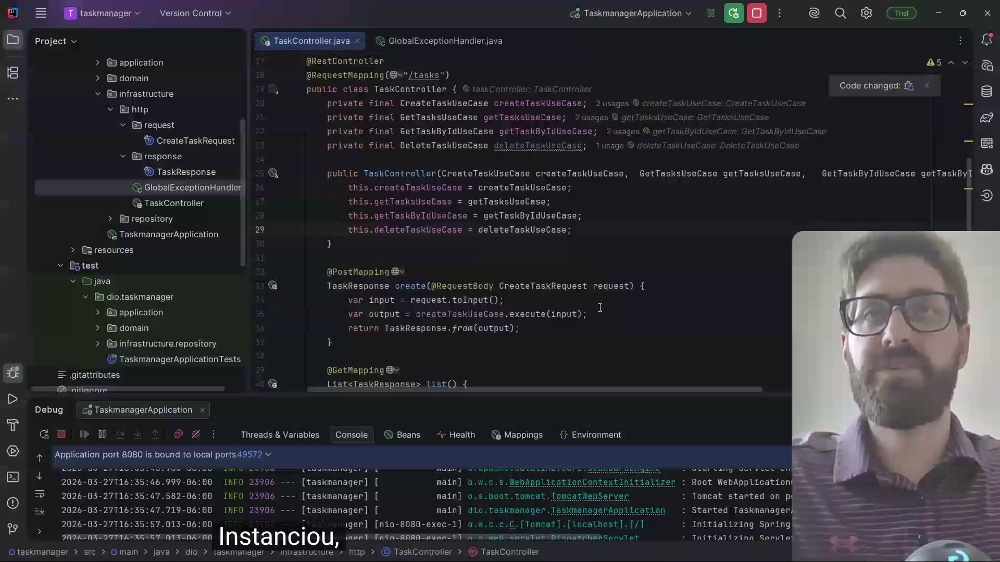
</p>

Avançando para o endpoint de remoção, o `DeleteTaskUseCase` é injetado como um novo campo do `TaskController`, seguindo o mesmo padrão de injeção de dependência via construtor usado para os demais casos de uso.

#### Implementando o endpoint DELETE com resposta 204

<p align="center">
  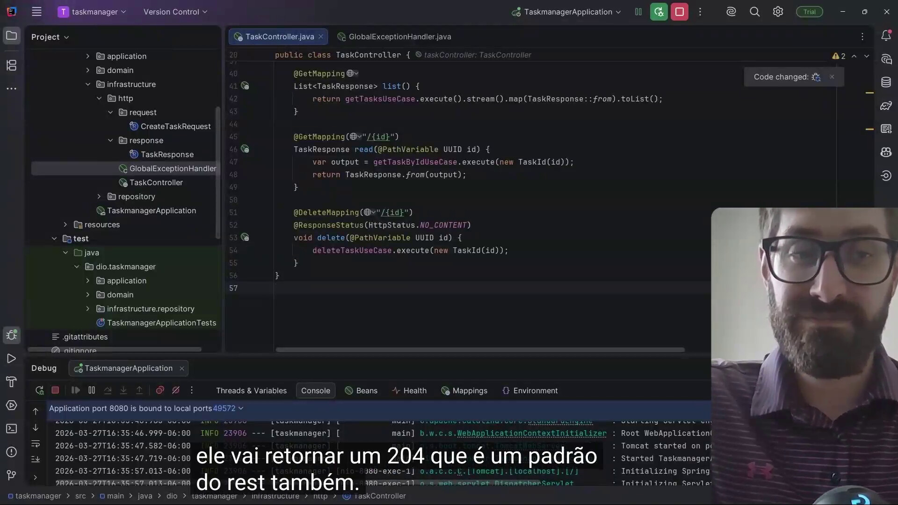
</p>

O endpoint de remoção é mapeado com `@DeleteMapping("/{id}")` e usa o mesmo padrão de rota dos demais endpoints. Por padrão, o `DELETE` responderia com 200, mas como uma remoção não retorna conteúdo, ele é anotado com `@ResponseStatus(HttpStatus.NO_CONTENT)`, fazendo a API responder com **204**, o código padrão REST para operações sem corpo de resposta.

```java
@DeleteMapping("/{id}")
@ResponseStatus(HttpStatus.NO_CONTENT)
void delete(@PathVariable UUID id) {
    deleteTaskUseCase.execute(new TaskId(id));
}
```

#### Iniciando o endpoint de atualização (PATCH)

<p align="center">
  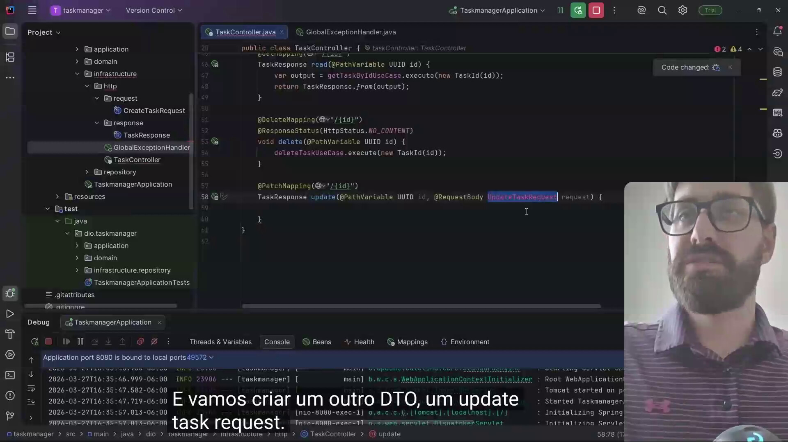
</p>

Por fim, falta implementar a atualização. A escolha é usar o verbo `PATCH` (em vez de `PUT`), por ser mais coerente com uma atualização parcial dos dados. O método `update()` é criado recebendo o ID pela URL e um corpo de requisição do tipo `UpdateTaskRequest`, um DTO que ainda precisa ser criado.

```java
@PatchMapping("/{id}")
TaskResponse update(@PathVariable UUID id, @RequestBody UpdateTaskRequest request) {

}
```

#### Criando o DTO UpdateTaskRequest

<p align="center">
  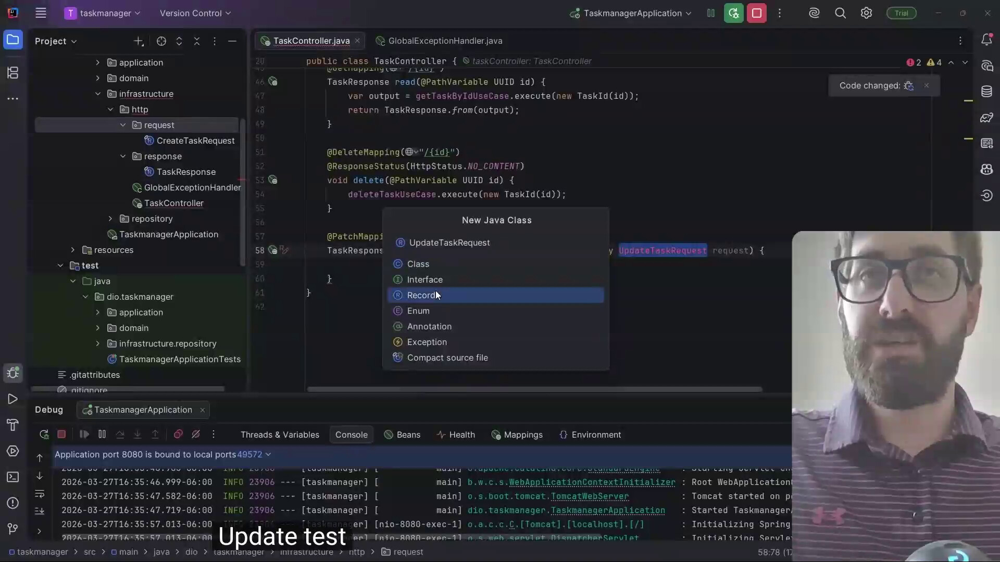
</p>

Uma nova classe é criada a partir do próprio nome usado no controller: `UpdateTaskRequest`, escolhida como um `record`, seguindo o mesmo padrão adotado para os demais DTOs da aplicação.

#### Implementando o record UpdateTaskRequest

<p align="center">
  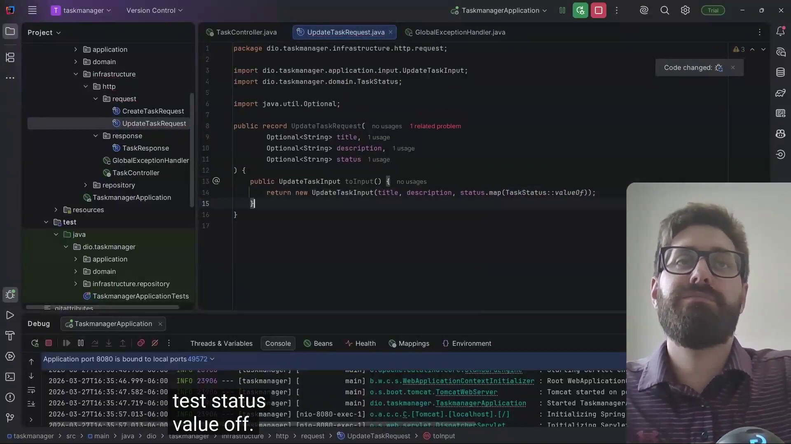
</p>

Diferente do `CreateTaskRequest`, todos os campos do `UpdateTaskRequest` são `Optional`: `title`, `description` e `status`. Essa escolha permite que o cliente da API envie apenas os campos que deseja alterar — se um campo nunca for enviado, ele simplesmente não é alterado. O método `toInput()` converte o request em um `UpdateTaskInput`, convertendo também a `status` (recebida como `String`) de volta para o enum `TaskStatus` através de `TaskStatus.valueOf`.

```java
public record UpdateTaskRequest(
        Optional<String> title,
        Optional<String> description,
        Optional<String> status
) {
    public UpdateTaskInput toInput() {
        return new UpdateTaskInput(title, description, status.map(TaskStatus::valueOf));
    }
}
```

#### Injetando o UpdateTaskUseCase no controller

<p align="center">
  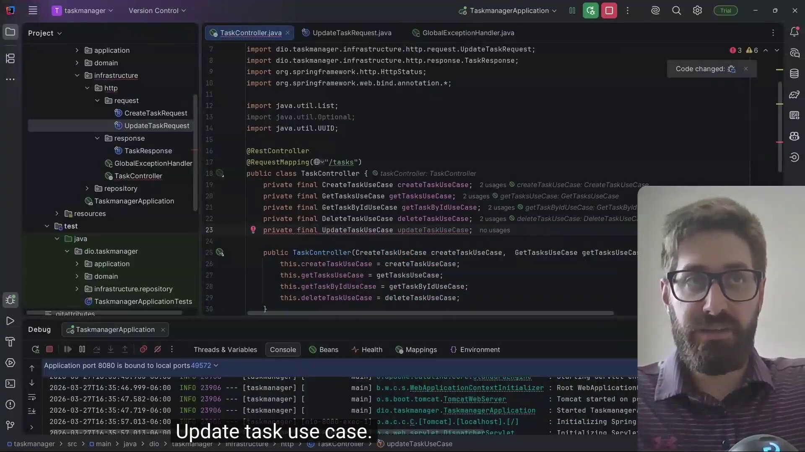
</p>

De volta ao `TaskController`, o DTO recém-criado já é importado e o campo `updateTaskUseCase` é declarado, ainda sem uso dentro do método `update()`, que será implementado em seguida.

#### Finalizando o método update()

<p align="center">
  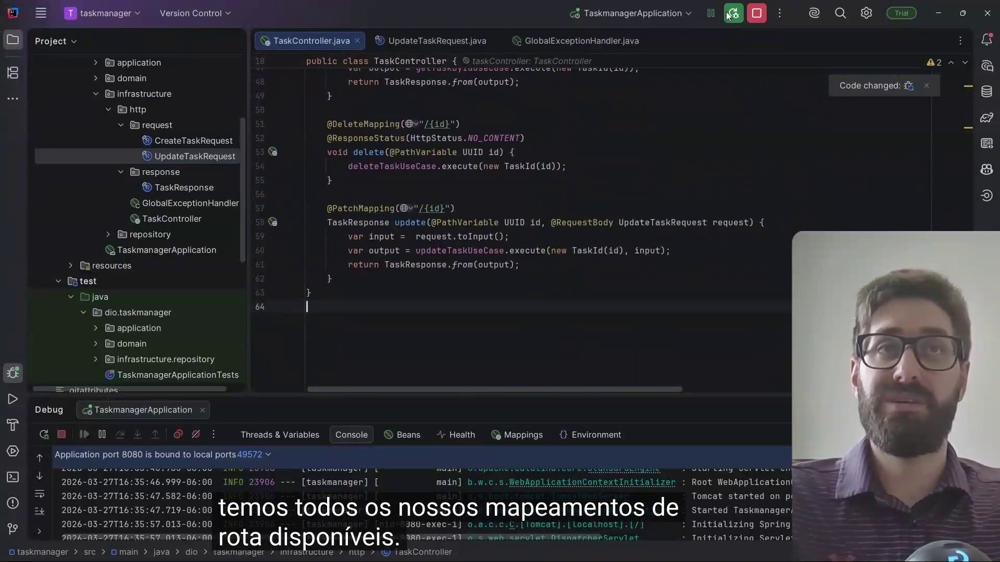
</p>

O corpo do método `update()` é concluído: o `request` é convertido em `input` através do `toInput()`, o `updateTaskUseCase` é executado recebendo o `TaskId` e o `input`, e o resultado é retornado como `TaskResponse`. Com isso, todos os mapeamentos de rota da API (criar, listar, buscar por ID, remover e atualizar) ficam disponíveis.

```java
@PatchMapping("/{id}")
TaskResponse update(@PathVariable UUID id, @RequestBody UpdateTaskRequest request) {
    var input = request.toInput();
    var output = updateTaskUseCase.execute(new TaskId(id), input);
    return TaskResponse.from(output);
}
```

#### Aplicação reiniciada com todos os endpoints

<p align="center">
  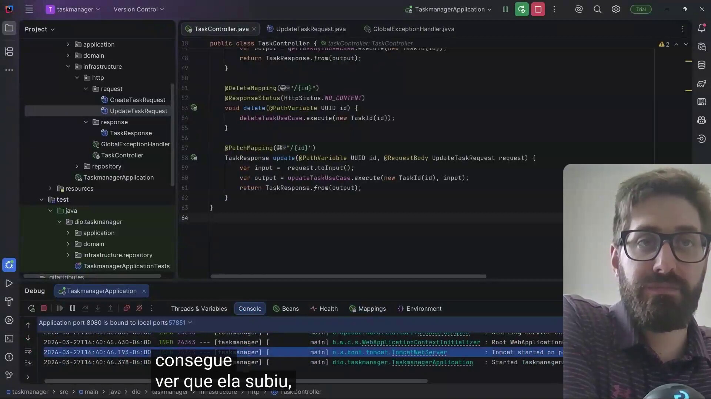
</p>

A aplicação é reiniciada e sobe normalmente na porta 8080. O painel de *Endpoints* agora lista as cinco rotas implementadas: `/tasks [GET]`, `/tasks [POST]`, `/tasks/{id} [GET]`, `/tasks/{id} [PATCH]` e `/tasks/{id} [DELETE]`, prontas para o teste manual completo da camada de API.

#### Teste manual: criação e consulta

<p align="center">
  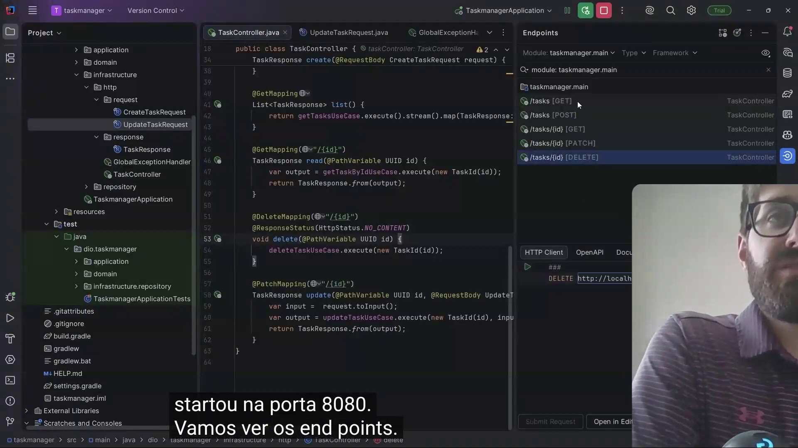
</p>

O teste começa executando o `GET`, que retorna uma lista vazia. Em seguida, é criada uma tarefa chamada "ABC", com descrição vazia — nota-se que a descrição não é retornada na resposta, pois o campo é removido quando a propriedade é nula.

#### Teste manual: atualização da tarefa

<p align="center">
  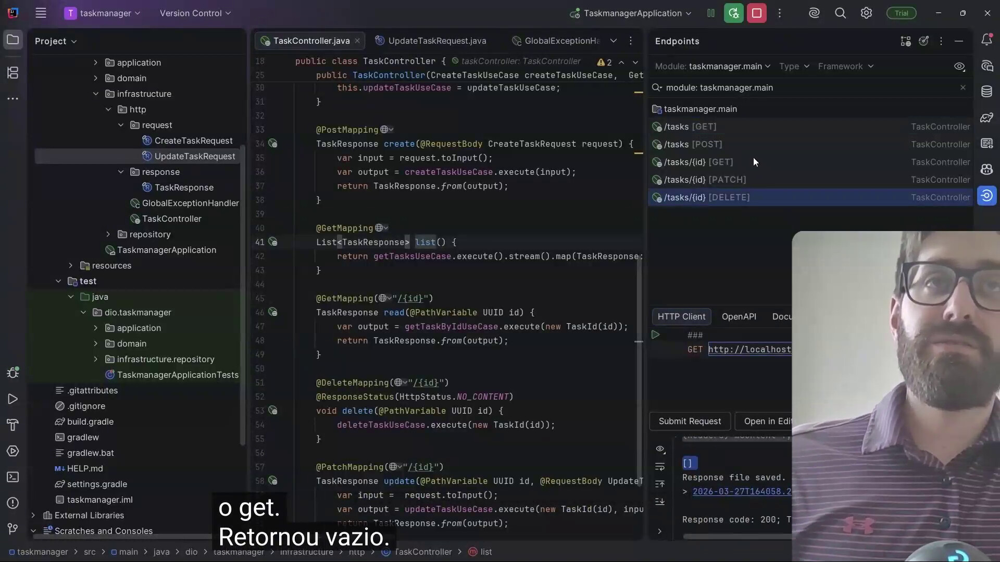
</p>

Com o ID da tarefa recém-criada em mãos, é feita uma busca por ID (que retorna a tarefa) e, na sequência, uma atualização: o título é mantido, uma descrição é adicionada e o status é alterado para "completed". A resposta confirma que apenas os campos enviados foram modificados.

#### Teste manual: remoção e verificação final

<p align="center">
  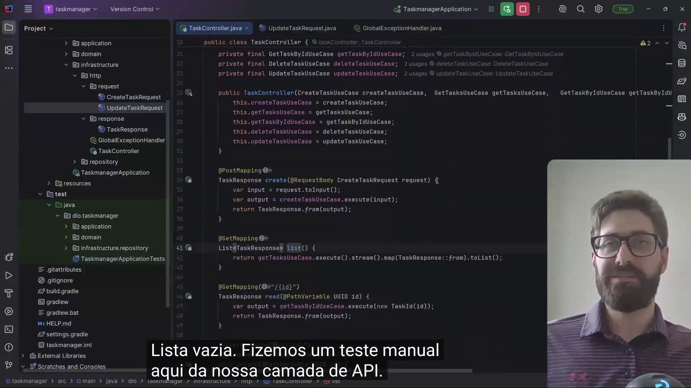
</p>

Por fim, a tarefa é deletada, retornando **204** com corpo vazio. Ao executar o `GET` novamente, a lista volta a ficar vazia, confirmando que a remoção funcionou. Assim, é concluído o teste manual completo da camada de API — cobrindo criação, listagem, busca por ID, atualização e remoção de tarefas.

#### Material de Apoio Até Esta Etapa

- [004-Tutorial_TaskManager_Java_Spring_Video07](./004-Tutorial_TaskManager_Java_Spring_Video07.md)
- Arquivos do projeto nesta etapa: [./000-Midia_e_Anexos/etapas_do_codigo/taskmanager_ate_o_video_07.zip](./000-Midia_e_Anexos/etapas_do_codigo/taskmanager_ate_o_video_07.zip)


## Parte 8 - Validando dados

### 🟩 Vídeo 08 - Validando dados

<video width="60%" controls>
  <source src="000-Midia_e_Anexos/bootcamp_ntt_data_java_spring_ai-modulo.04-curso.01-video_08.webm" type="video/webm">
    Seu navegador não suporta vídeo HTML5.
</video>

link do vídeo: https://web.dio.me/track/ntt-data-2026-ai-java-back-end/course/criando-sua-primeira-api-rest-com-spring-boot/learning/62807b08-307b-4a2e-9efb-a8a920b705ee?autoplay=1

### Anotações

<p align="center">
  
</p>

Slide de abertura do módulo "Criando sua Primeira API REST com Spring Boot", da Jornada Tech. O sumário lista cinco etapas do curso — Infraestrutura e interface, Consulta de tarefas, Validando dados, Documentando a API e Evoluindo a API — com o item **03/Validando dados** destacado, indicando que esta é a etapa que será abordada a seguir: a inclusão de regras de validação nos dados recebidos pela API.

<p align="center">
  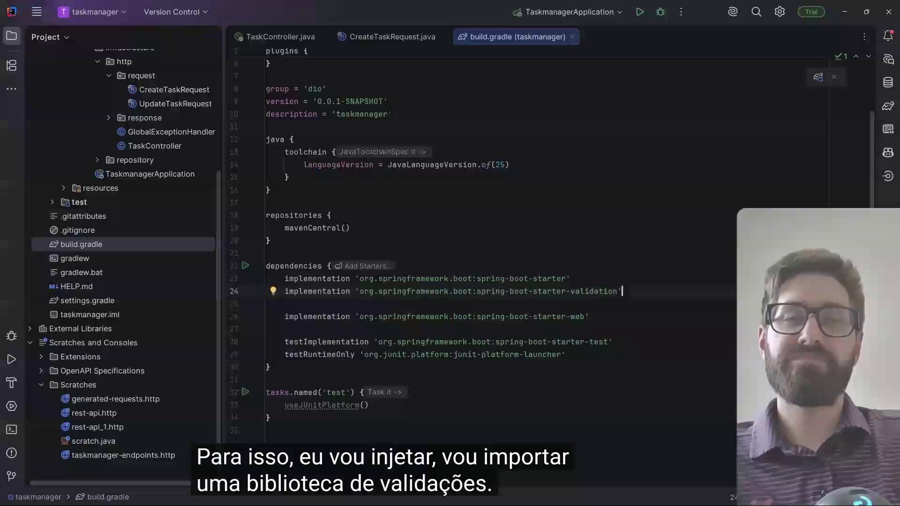
</p>

Nesta etapa, o arquivo `build.gradle` do projeto é aberto para adicionar a dependência responsável pelas validações. A linha inserida é a `spring-boot-starter-validation`, biblioteca própria do Spring Boot para validação de dados de entrada:

```gradle
dependencies {
    implementation 'org.springframework.boot:spring-boot-starter'
    implementation 'org.springframework.boot:spring-boot-starter-validation'

    implementation 'org.springframework.boot:spring-boot-starter-web'

    testImplementation 'org.springframework.boot:spring-boot-starter-test'
    testRuntimeOnly 'org.junit.platform:junit-platform-launcher'
}
```

Essa dependência é o ponto de partida para que as anotações de validação (como `@NotBlank` e `@Size`) possam ser utilizadas nos DTOs de request da aplicação.

<p align="center">
  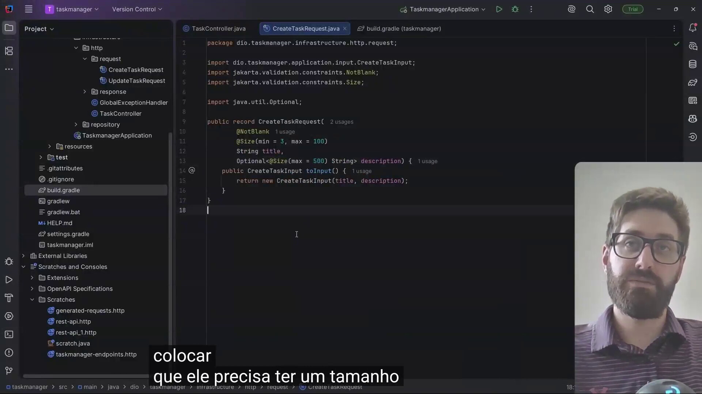
</p>

Com a dependência já disponível, o DTO `CreateTaskRequest` é alterado para receber as anotações de validação. O campo `title` recebe `@NotBlank` (não pode ser vazio) e `@Size(min = 3, max = 100)` (tamanho mínimo e máximo definidos), enquanto o campo `description` recebe `@Size(max = 500)` para limitar seu tamanho máximo:

```java
package dio.taskmanager.infrastructure.http.request;

import dio.taskmanager.application.input.CreateTaskInput;
import jakarta.validation.constraints.NotBlank;
import jakarta.validation.constraints.Size;

import java.util.Optional;

public record CreateTaskRequest(
        @NotBlank
        @Size(min = 3, max = 100)
        String title,
        Optional<@Size(max = 500) String> description) {
    public CreateTaskInput toInput() {
        return new CreateTaskInput(title, description);
    }
}
```

<p align="center">
  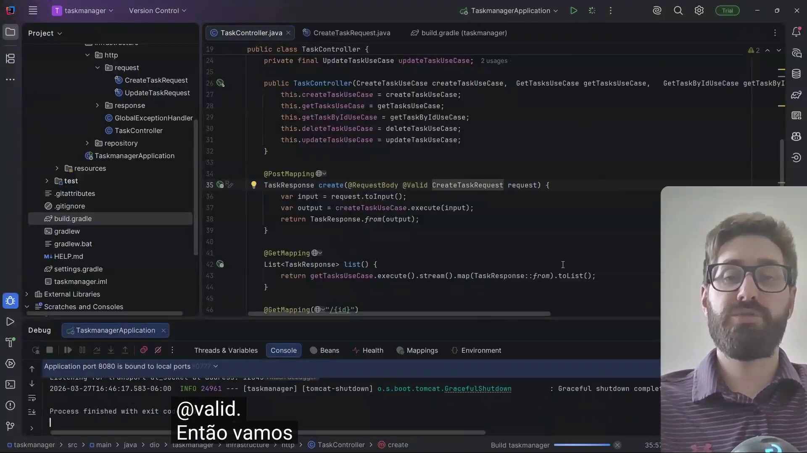
</p>

Para que as validações declaradas no DTO realmente entrem em ação, é necessário anotar o parâmetro do método do controller com `@Valid`, logo antes de `CreateTaskRequest`:

```java
@PostMapping
TaskResponse create(@RequestBody @Valid CreateTaskRequest request) {
    var input = request.toInput();
    var output = createTaskUseCase.execute(input);
    return TaskResponse.from(output);
}
```

No console, abaixo, é possível ver que a aplicação foi reiniciada com sucesso (`Process finished with exit code`), preparando o terreno para o teste da validação recém-configurada.

<p align="center">
  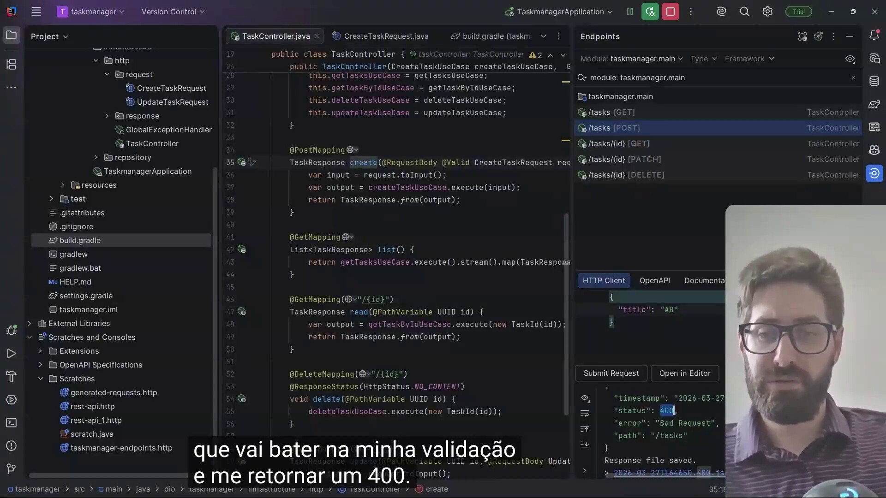
</p>

Teste prático da validação: uma requisição `POST /tasks` é enviada com o campo `title` igual a `"AB"`, ou seja, com apenas dois caracteres — abaixo do mínimo de três definido pelo `@Size(min = 3, max = 100)`:

```json
{
  "title": "AB"
}
```

Como esperado, a validação é acionada e a API retorna um erro `400 Bad Request`, confirmando que a regra de tamanho mínimo do título está funcionando corretamente:

```json
{
  "timestamp": "2026-03-27T16:...",
  "status": 400,
  "error": "Bad Request",
  "path": "/tasks"
}
```

<p align="center">
  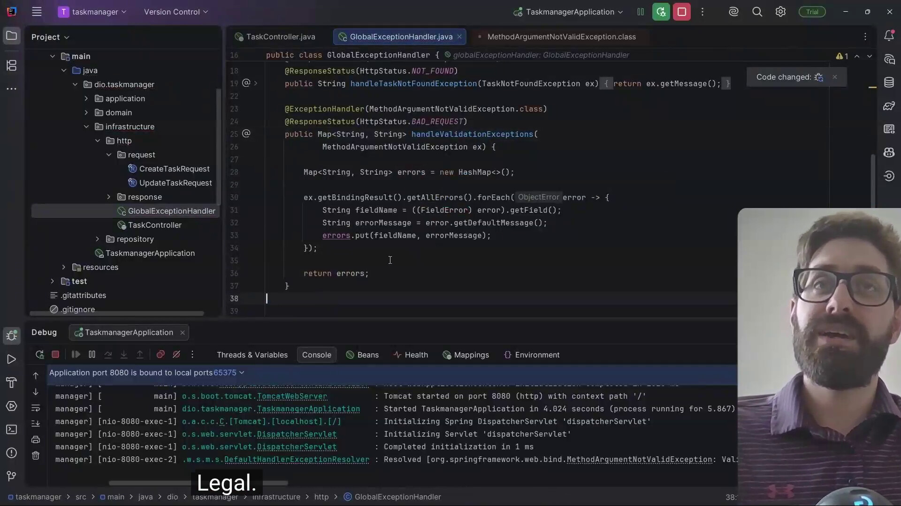
</p>

Como o retorno padrão `400` do Spring Boot não traz detalhes sobre qual campo falhou na validação, é criado um tratamento específico dentro do `GlobalExceptionHandler` usando `@ExceptionHandler(MethodArgumentNotValidException.class)` — a exceção lançada internamente pela biblioteca de validação sempre que uma regra é violada:

```java
@ExceptionHandler(MethodArgumentNotValidException.class)
@ResponseStatus(HttpStatus.BAD_REQUEST)
public Map<String, String> handleValidationExceptions(
        MethodArgumentNotValidException ex) {

    Map<String, String> errors = new HashMap<>();

    ex.getBindingResult().getAllErrors().forEach(error -> {
        String fieldName = ((FieldError) error).getField();
        String errorMessage = error.getDefaultMessage();
        errors.put(fieldName, errorMessage);
    });

    return errors;
}
```

O método continua retornando o status `400`, mas agora monta um mapa de chave-valor com o campo que falhou e a respectiva mensagem de erro, obtidos a partir de `ex.getBindingResult().getAllErrors()`.

<p align="center">
  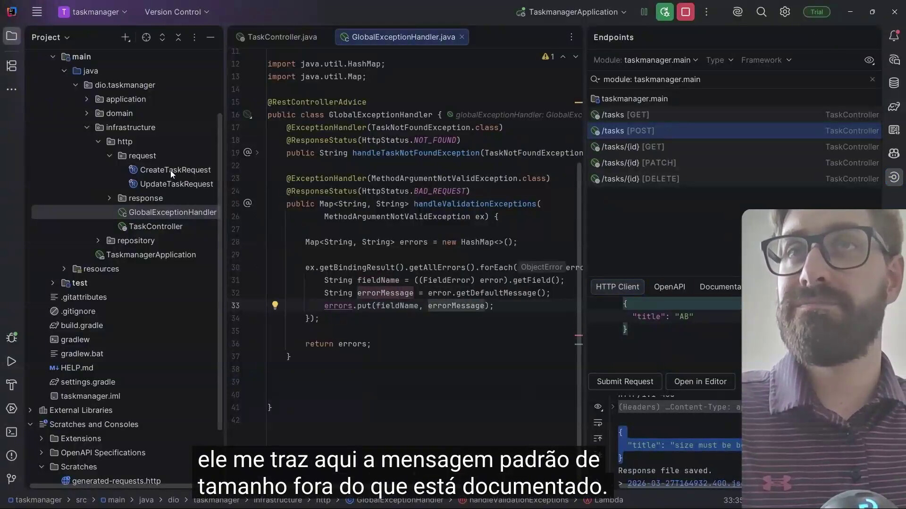
</p>

Classe completa `GlobalExceptionHandler`, anotada com `@RestControllerAdvice`, reunindo os dois tratamentos de exceção já implementados — o de tarefa não encontrada e o de validação:

```java
@RestControllerAdvice
public class GlobalExceptionHandler {

    @ExceptionHandler(TaskNotFoundException.class)
    @ResponseStatus(HttpStatus.NOT_FOUND)
    public String handleTaskNotFoundException(TaskNotFoundException ex) {
        return ex.getMessage();
    }

    @ExceptionHandler(MethodArgumentNotValidException.class)
    @ResponseStatus(HttpStatus.BAD_REQUEST)
    public Map<String, String> handleValidationExceptions(
            MethodArgumentNotValidException ex) {

        Map<String, String> errors = new HashMap<>();

        ex.getBindingResult().getAllErrors().forEach(error -> {
            String fieldName = ((FieldError) error).getField();
            String errorMessage = error.getDefaultMessage();
            errors.put(fieldName, errorMessage);
        });

        return errors;
    }
}
```

Repetindo o mesmo teste de antes (título `"AB"`), a resposta da API deixa de ser um `400` genérico e passa a trazer a mensagem específica de validação, indicando claramente qual campo falhou e por qual motivo — no caso, o tamanho do título fora do intervalo permitido:

```json
{
  "title": "size must be between 3 and 100"
}
```

Com esse handler, o cliente da API (seja uma aplicação mobile, web ou outro serviço) passa a receber uma informação objetiva sobre o erro, em vez de apenas um código de status sem contexto.


## Parte 9 - Documentando a API
### 🟩 Vídeo 09 - Documentando a API

<video width="60%" controls>
  <source src="000-Midia_e_Anexos/bootcamp_ntt_data_java_spring_ai-modulo.04-curso.01-video_09.webm" type="video/webm">
    Seu navegador não suporta vídeo HTML5.
</video>

link do vídeo: https://web.dio.me/track/ntt-data-2026-ai-java-back-end/course/criando-sua-primeira-api-rest-com-spring-boot/learning/508b5c2f-c3a6-48b6-98d2-3e9649f79c11?autoplay=1

## Parte 10 - Evoluindo a API
### 🟩 Vídeo 10 - Evoluindo a API

<video width="60%" controls>
  <source src="000-Midia_e_Anexos/bootcamp_ntt_data_java_spring_ai-modulo.04-curso.01-video_10.webm" type="video/webm">
    Seu navegador não suporta vídeo HTML5.
</video>

link do vídeo: https://web.dio.me/track/ntt-data-2026-ai-java-back-end/course/criando-sua-primeira-api-rest-com-spring-boot/learning/d19d5b00-9357-4a9a-9586-139b86cabcc1?autoplay=1


##  Materiais de Apoio

### Tutoriais

- [001-Tutorial de Estudos — Construindo um Task Manager com Java e Spring Boot - Videos 01 a 03](./001-Tutorial_TaskManager_Java_Spring_Videos01a03_3.md)
  - [Implementação de uma classe `Main` para explorar manualmente](./001-B-extra_main_playground.md)
- [002-Tutorial_TaskManager_Java_Spring_Videos04a05](./002-Tutorial_TaskManager_Java_Spring_Videos04a05.md)
- [003-Tutorial_TaskManager_Java_Spring_Video06](./003-Tutorial_TaskManager_Java_Spring_Video06.md)
- [004-Tutorial_TaskManager_Java_Spring_Video07](./004-Tutorial_TaskManager_Java_Spring_Video07.md)


### Arquivos do Projeto

- Até o vídeo 02: [./000-Midia_e_Anexos/etapas_do_codigo/taskmanager_ate_o_video_02.zip](./000-Midia_e_Anexos/etapas_do_codigo/taskmanager_ate_o_video_02.zip)
- Até o vídeo 03: [./000-Midia_e_Anexos/etapas_do_codigo/taskmanager_ate_o_video_03.zip](./000-Midia_e_Anexos/etapas_do_codigo/taskmanager_ate_o_video_03.zip)
- Até o vídeo 04: [./000-Midia_e_Anexos/etapas_do_codigo/taskmanager_ate_o_video_04.zip](./000-Midia_e_Anexos/etapas_do_codigo/taskmanager_ate_o_video_04.zip)
- Até o vídeo 05: [./000-Midia_e_Anexos/etapas_do_codigo/taskmanager_ate_o_video_05.zip](./000-Midia_e_Anexos/etapas_do_codigo/taskmanager_ate_o_video_05.zip)
- Até o vídeo 06: [./000-Midia_e_Anexos/etapas_do_codigo/taskmanager_ate_o_video_06.zip](./000-Midia_e_Anexos/etapas_do_codigo/taskmanager_ate_o_video_06.zip)
- Até o vídeo 06: [./000-Midia_e_Anexos/etapas_do_codigo/taskmanager_ate_o_video_07.zip](./000-Midia_e_Anexos/etapas_do_codigo/taskmanager_ate_o_video_07.zip)

# Certificado: 

- Link na plataforma: 
- Certificado em pdf: