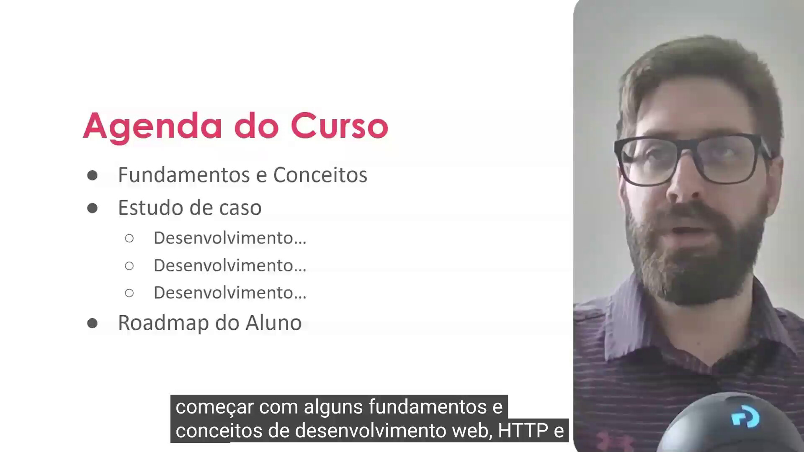
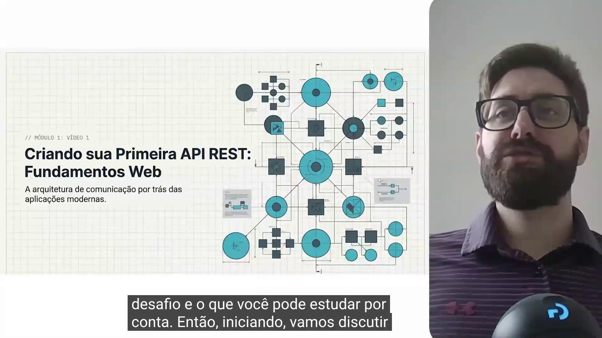
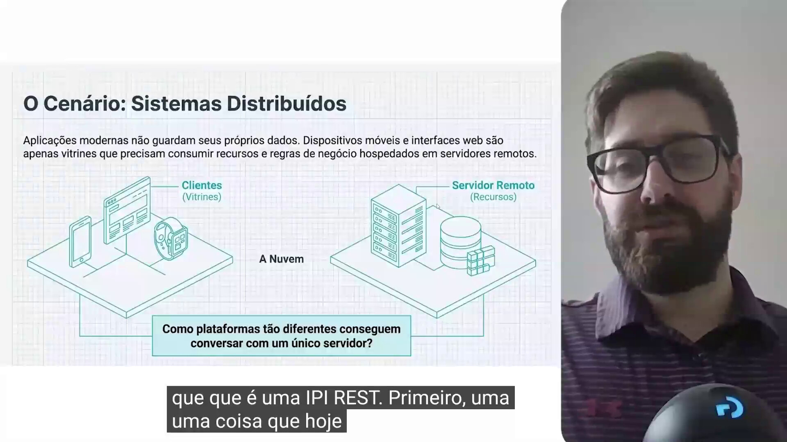
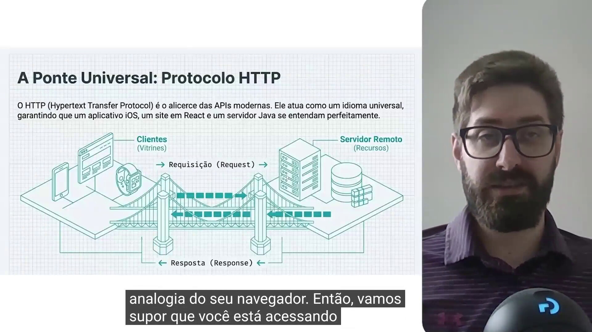

## Instrutor

- Thiago Poiani (Principal Engineer at Skip)
- Contato Linkedin: / [thpoiani](https://www.linkedin.com/in/thpoiani/)

## Parte 1 - Introdução ao API REST

### 🟩 Vídeo 01 - Introdução ao API REST

<video width="60%" controls>
  <source src="000-Midia_e_Anexos/bootcamp_ntt_data_java_spring_ai-modulo.04-curso.01-video_01.webm" type="video/webm">
    Seu navegador não suporta vídeo HTML5.
</video>

link do vídeo: https://web.dio.me/track/ntt-data-2026-ai-java-back-end/course/criando-sua-primeira-api-rest-com-spring-boot/learning/1ba44230-a11d-4192-ba3d-6c26a0346bd3?autoplay=1

### Anotações

  

O slide apresenta a **Agenda do Curso**, organizada em três blocos: Fundamentos e Conceitos, Estudo de Caso (com três etapas de desenvolvimento) e Roadmap do Aluno. Essa estrutura antecipa o percurso da aula: primeiro serão discutidos os fundamentos de desenvolvimento web, HTTP e REST; em seguida, um estudo de caso prático de construção de uma API; e por fim, um conteúdo complementar com sugestões de estudo autônomo.

  

Slide de abertura do módulo: **"Criando sua Primeira API REST: Fundamentos Web"**, com o subtítulo "A arquitetura de comunicação por trás das aplicações modernas". Ele marca o início da explicação sobre os fundamentos de desenvolvimento web e o conceito de API REST, tema que será desenvolvido nos slides seguintes.

  

O slide introduz o cenário de **Sistemas Distribuídos**: aplicações modernas (sites, apps mobile, wearables) não guardam seus próprios dados — elas funcionam como "vitrines" que consomem recursos e regras de negócio hospedados em um servidor remoto, na nuvem. A pergunta central colocada é como plataformas tão diferentes conseguem se comunicar com um único servidor, o que motiva a introdução do protocolo HTTP a seguir.

  

A imagem apresenta o **Protocolo HTTP** como a "ponte universal" entre clientes e servidor remoto, garantindo que aplicativos e sites diferentes se entendam. A comunicação acontece por meio de uma Requisição (Request), enviada do cliente ao servidor, e de uma Resposta (Response), devolvida ao cliente. A analogia usada é a do navegador: ao acessar um site, o navegador atua como cliente, envia      

## Parte 2 - Gerenciamento de tarefas
### 🟩 Vídeo 02 - Gerenciamento de tarefas

<video width="60%" controls>
  <source src="000-Midia_e_Anexos/bootcamp_ntt_data_java_spring_ai-modulo.04-curso.01-video_02.webm" type="video/webm">
    Seu navegador não suporta vídeo HTML5.
</video>

link do vídeo: https://web.dio.me/track/ntt-data-2026-ai-java-back-end/course/criando-sua-primeira-api-rest-com-spring-boot/learning/de99d3a8-04bd-47be-964b-ec807a35c99d?autoplay=1

## Parte 3 - Modelando o domínio de tarefas
### 🟩 Vídeo 03 - Modelando o domínio de tarefas

<video width="60%" controls>
  <source src="000-Midia_e_Anexos/bootcamp_ntt_data_java_spring_ai-modulo.04-curso.01-video_03.webm" type="video/webm">
    Seu navegador não suporta vídeo HTML5.
</video>

link do vídeo:

## Parte 4 - Orquestrando o domínio
### 🟩 Vídeo 04 - Orquestrando o domínio

<video width="60%" controls>
  <source src="000-Midia_e_Anexos/bootcamp_ntt_data_java_spring_ai-modulo.04-curso.01-video_04.webm" type="video/webm">
    Seu navegador não suporta vídeo HTML5.
</video>

link do vídeo:

## Parte 5 - Listagem de tarefas
### 🟩 Vídeo 05 - Listagem de tarefas

<video width="60%" controls>
  <source src="000-Midia_e_Anexos/bootcamp_ntt_data_java_spring_ai-modulo.04-curso.01-video_05.webm" type="video/webm">
    Seu navegador não suporta vídeo HTML5.
</video>

link do vídeo:

## Parte 6 - Infraestrutura e interface
### 🟩 Vídeo 06 - Infraestrutura e interface

<video width="60%" controls>
  <source src="000-Midia_e_Anexos/bootcamp_ntt_data_java_spring_ai-modulo.04-curso.01-video_06.webm" type="video/webm">
    Seu navegador não suporta vídeo HTML5.
</video>

link do vídeo:

## Parte 7 - Consulta de tarefas
### 🟩 Vídeo 07 - Consulta de tarefas

<video width="60%" controls>
  <source src="000-Midia_e_Anexos/bootcamp_ntt_data_java_spring_ai-modulo.04-curso.01-video_07.webm" type="video/webm">
    Seu navegador não suporta vídeo HTML5.
</video>

link do vídeo:

## Parte 8 - Validando dados
### 🟩 Vídeo 08 - Validando dados

<video width="60%" controls>
  <source src="000-Midia_e_Anexos/bootcamp_ntt_data_java_spring_ai-modulo.04-curso.01-video_08.webm" type="video/webm">
    Seu navegador não suporta vídeo HTML5.
</video>

link do vídeo:

## Parte 9 - Documentando a API
### 🟩 Vídeo 09 - Documentando a API

<video width="60%" controls>
  <source src="000-Midia_e_Anexos/bootcamp_ntt_data_java_spring_ai-modulo.04-curso.01-video_09.webm" type="video/webm">
    Seu navegador não suporta vídeo HTML5.
</video>

link do vídeo:

## Parte 10 - Evoluindo a API
### 🟩 Vídeo 10 - Evoluindo a API

<video width="60%" controls>
  <source src="000-Midia_e_Anexos/bootcamp_ntt_data_java_spring_ai-modulo.04-curso.01-video_10.webm" type="video/webm">
    Seu navegador não suporta vídeo HTML5.
</video>

link do vídeo:

##  Materiais de Apoio

# Certificado: 

- Link na plataforma: 
- Certificado em pdf: