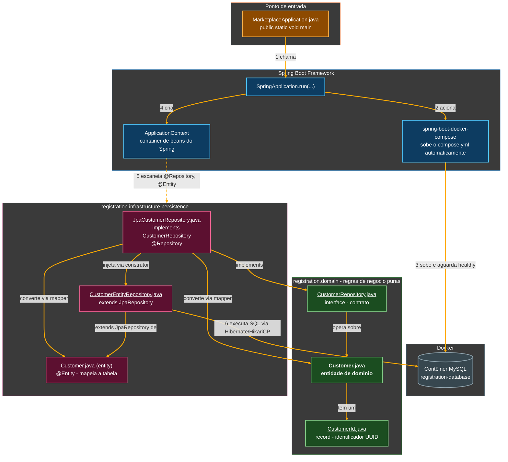
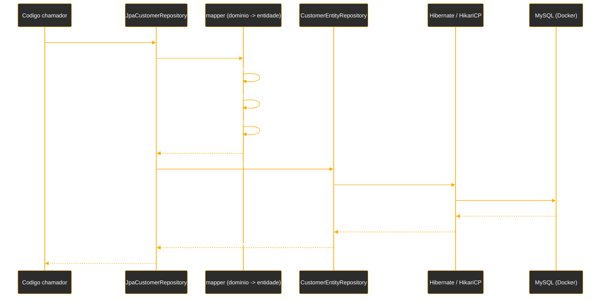

# Tutorial de Estudos — Conectando sua API com Banco de Dados Através do Spring Data

**Do zero à primeira persistência real com Spring Data JPA — Vídeos 01 e 02**

- Curso: NTT Data — Jornada Tech (DIO) · Módulo 4 — "Criando Soluções Inteligentes com Spring Boot e Java Moderno"
- Curso 2 do módulo: "Conectando sua API com Banco de Dados Através do Spring Data"
- Instrutor: Thiago Poiani (Principal Engineer at Skip)
- Projeto: `marketplace`
- Documento de referência pessoal — nível iniciante em Java

---

## Sobre este documento

Este tutorial foi criado a partir das anotações de aula (README) e do código-fonte real do projeto `marketplace`, na etapa correspondente ao Vídeo 02. O objetivo é explicar, com riqueza de detalhes e em nível iniciante, cada instrução escrita até agora — o que ela faz, por que foi escrita daquela forma, e qual conceito de Java, Spring ou de arquitetura de software ela representa.

Este documento deve ser usado como um mapa: sempre que houver dúvida sobre "por que essa linha está aqui", deve-se voltar a ele. A ideia é que, relendo este material, consiga-se reconstruir o raciocínio da aula sem precisar assistir ao vídeo novamente.

> **Como este documento está organizado**
> A Parte 1 resume o vídeo teórico (introdução ao curso). A Parte 2 é o núcleo do tutorial: o código é apresentado em pequenos blocos, na ordem em que foi escrito na aula, seguido de explicação linha a linha. Ao final, há um glossário, um checkpoint fiel do código real do seu projeto (conferido diretamente no `.zip` enviado), uma seção específica sobre pontos em que seu projeto diverge levemente do que o professor mostrou em aula, os próximos passos do curso e diagramas de como tudo se encaixa.

---

## Parte 1 — Fundamentos de persistência (Vídeo 01)

O primeiro vídeo do Curso 2 é teórico: antes de escrever qualquer código, a aula situa por que a persistência de dados é um problema tão importante — e por que ele evoluiu tanto ao longo do tempo. Como isso já está detalhadamente documentado no seu README, aqui vai um resumo objetivo dos pontos que realmente importam para entender o código escrito no Vídeo 02.

### 1.1. O problema: dois mundos diferentes de dados

A aula contrapõe dois "mundos" de armazenamento de dados:

- **Mundo Relacional** — dados organizados em tabelas rígidas, como um arquivo de gavetas: cada gaveta (tabela) tem um formato fixo, e cada ficha (linha) precisa se encaixar nesse formato.
- **Mundo Não-Relacional** — dados organizados de forma mais livre: documentos, pares chave-valor, grafos interligados. Cada "ficha" pode ter um formato diferente da outra.

Três pilares justificam a escolha entre um mundo e outro, dependendo da necessidade do negócio:

- **Integridade** — essencial para transações financeiras, onde um erro não pode acontecer (ex.: dinheiro sumir de uma conta sem aparecer em outra).
- **Flexibilidade** — essencial quando os dados mudam de formato constantemente (ex.: um evento de show tem atributos diferentes de um evento de conferência).
- **Velocidade** — essencial quando é preciso responder em milissegundos, mesmo sob tráfego massivo.

> **Por que isso importa para o código?**
> Essa distinção é o motivo pelo qual, mais adiante no curso, o projeto vai usar **três** bancos de dados diferentes ao mesmo tempo (PostgreSQL, MongoDB e Redis) — cada um resolvendo um desses três pilares. No Vídeo 02, você só vai mexer com o banco relacional (na prática, MySQL), mas é importante já entender que essa não é a única peça do quebra-cabeça.

### 1.2. A evolução histórica do acesso a dados em Java

A aula narra três "fases" da persistência em Java, e entender essa evolução ajuda a entender por que o Spring Data é tão mais simples do que parece:

1. **Fase 1 — A era do JDBC puro ("controle manual")**: o desenvolvedor precisa abrir e fechar conexões manualmente, mapear cada coluna do banco para um atributo do objeto Java "na mão", e lidar com blocos de tratamento de erro repetitivos (o famoso "Try/Catch hell"). Resultado: muito tempo gasto escrevendo infraestrutura, e pouco tempo escrevendo regra de negócio.
2. **Fase 2 — O salto do ORM (JPA e Hibernate)**: surge a ideia de mapear automaticamente um objeto Java para uma linha de tabela. A **JPA** é a especificação oficial do Java para isso; o **Hibernate** é a implementação (o "motor") mais usada dessa especificação. Com isso, o mapeamento manual desaparece.
3. **Fase 3 — A revolução Spring Data**: em vez de escrever a implementação de acesso a dados, basta **declarar uma interface** (ex.: `interface UserRepository`) descrevendo o que se precisa, e o Spring cria a implementação sozinho, em tempo de execução — inclusive interpretando nomes de métodos como consultas (ex.: um método chamado `findByEmail` já sabe buscar por e-mail, sem que uma linha de SQL seja escrita).

> **Por que isso importa para o código?**
> O Vídeo 02 é exatamente a Fase 3 em ação: você vai criar uma interface chamada `CustomerRepository` e, na infraestrutura, uma interface `CustomerEntityRepository` que estende `CrudRepository` — sem escrever nenhuma implementação de `save` ou `findAll` "na mão" para o banco.

### 1.3. Duas filosofias de design: ActiveRecord × Repository

A aula apresenta duas formas possíveis de organizar quem é responsável por salvar um objeto no banco:

- **ActiveRecord** (Caminho A) — a própria entidade sabe se salvar (ex.: `customer.save()`).
- **Repository** (Caminho B) — um objeto mediador, separado da entidade, é quem salva (ex.: `customerRepository.save(customer)`).

O projeto do curso adota o **padrão Repository**, que é também o padrão recomendado quando se quer manter as regras de negócio (domínio) desacopladas de como os dados são efetivamente armazenados.

### 1.4. O estudo de caso: um sistema de ticketing com persistência poliglota

A aula apresenta o projeto que será construído ao longo do curso: um sistema de venda de ingressos (*ticketing system*) que combina três bancos diferentes, cada um resolvendo um problema específico:

- **PostgreSQL** (via Spring Data JPA) — para pedidos e transações financeiras, onde a integridade é inegociável.
- **MongoDB** (via Spring Data MongoDB) — para o catálogo de eventos, que muda de formato dependendo do tipo de evento.
- **Redis** (via Spring Data Redis) — para o bloqueio temporário de assentos (*ticket locking*), com expiração automática (TTL), evitando que duas pessoas comprem o mesmo assento ao mesmo tempo.

> **E o projeto `marketplace` que você está construindo?**
> No seu README e no seu projeto, a implementação prática desse estudo de caso começa pelo módulo `registration` (cadastro de clientes), usando MySQL como banco relacional — uma variação didática do PostgreSQL mencionado na aula, mas resolvendo exatamente o mesmo tipo de problema (dados que exigem integridade). O restante deste tutorial documenta essa implementação prática, feita no Vídeo 02.

---

## Parte 2 — Construindo a primeira persistência real (Vídeo 02)

Este é o primeiro vídeo do Curso 2 em que código de fato é escrito. O objetivo do vídeo é sair do zero absoluto e chegar a uma aplicação Spring Boot que: (1) sobe um banco de dados MySQL automaticamente via Docker, (2) se conecta a ele sozinha, (3) cria a tabela `customer` sem SQL manual, e (4) já consegue salvar e listar clientes através do padrão Repository — tudo isso **sem ainda existir nenhum endpoint HTTP** (isso fica para o Vídeo 03).

### 2.1. Organizando o projeto em camadas

Antes de criar qualquer classe, o instrutor organiza o projeto seguindo os princípios de **Domain-Driven Design (DDD)**, criando três pacotes-base dentro de `dio.marketplace`:

- **`domain`** — onde vivem as regras de negócio puras: entidades, identificadores, interfaces de repositório. É o "cérebro" da aplicação e não depende de mais nada (nem de Spring, nem de banco de dados).
- **`application`** — a camada orquestradora, responsável por coordenar chamadas entre o domínio e a infraestrutura (ainda não é usada nesta etapa; deve aparecer em vídeos futuros, quando surgir a camada de serviço).
- **`infrastructure`** — tudo o que é "detalhe técnico": banco de dados, chamadas externas. É aqui que mora a implementação concreta de tudo o que o domínio apenas *declara* como necessário.

> **Por que separar em pacotes assim?**
> Essa separação existe para que as regras de negócio (`domain`) não fiquem "presas" a uma tecnologia específica. Se um dia o banco de dados for trocado de MySQL para PostgreSQL, ou de relacional para MongoDB, o pacote `domain` praticamente não muda — só o que está em `infrastructure` muda. Pense em `domain` como as regras do jogo, e `infrastructure` como o material físico usado para jogar (o tabuleiro, as peças).

Em seguida, como a primeira funcionalidade da aplicação é o **cadastro de clientes**, é criado um módulo próprio para isso: `dio.marketplace.registration`. A ideia é que esse módulo se comporte como uma "mini-aplicação" dentro do projeto, com sua própria divisão interna em `application`, `domain` e `infrastructure` — a mesma organização de camadas, só que aplicada especificamente ao assunto "cadastro".

```
dio.marketplace
├── domain            (camada geral do projeto)
├── application        (camada geral do projeto)
├── infrastructure      (camada geral do projeto)
└── registration        (módulo de cadastro de clientes)
    ├── application
    ├── domain
    └── infrastructure
```

> **Nota sobre o seu projeto**
> Conferindo o `.zip` que você enviou, seu código foi direto para dentro do módulo `registration` (`dio.marketplace.registration.domain`, `dio.marketplace.registration.infrastructure`, etc.) e os pacotes-base `dio.marketplace.domain`, `dio.marketplace.application` e `dio.marketplace.infrastructure` (soltos, fora de `registration`) não aparecem fisicamente como pacotes próprios no seu projeto. Isso não é um erro: como o `registration` é, até aqui, o único módulo da aplicação, ele acaba concentrando toda a estrutura de camadas. Se um segundo módulo for criado futuramente (por exemplo, `catalog` ou `ticketing`), pode fazer sentido voltar a ter pacotes verdadeiramente genéricos em `dio.marketplace` para código compartilhado entre módulos.

### 2.2. Criando a classe de domínio `Customer`

Dentro do pacote `domain` do módulo `registration`, é criada a primeira classe do módulo: `Customer`, representando o cliente cadastrado no sistema.

```java
package dio.marketplace.registration.domain;

public class Customer {
    private CustomerId id;
    private String name;
    private String email;
}
```

- **`public class Customer`** — declara uma nova classe chamada `Customer`. Uma classe é como uma "planta baixa" (um molde) que descreve quais dados e comportamentos um objeto desse tipo vai ter. `public` significa que qualquer outro pacote do projeto pode usar essa classe.
- **`private CustomerId id;`** — o primeiro atributo (campo) da classe é o identificador do cliente. Repare que, em vez de um `String` simples, o tipo é `CustomerId` — uma classe própria que ainda será criada. Essa escolha se chama **identificador fortemente tipado**: em vez de qualquer texto poder ser confundido com um ID de cliente, só um objeto `CustomerId` de verdade serve para esse campo. Isso deixa o código mais seguro e mais legível: em qualquer lugar em que aparecer um `CustomerId`, fica claro que aquele valor é especificamente um ID de `Customer` — e não, por exemplo, o ID de um produto ou de um pedido.
- **`private String name;`** e **`private String email;`** — dois campos de texto simples, para o nome e o e-mail do cliente. `private` significa que só a própria classe `Customer` pode acessar esses campos diretamente — nenhuma outra classe consegue ler ou alterar `name` ou `email` sem passar por um método público (esse é o princípio de **encapsulamento**).

### 2.3. Criando `CustomerId` como um `record`

Em vez de deixar o identificador como um `String` solto, é criada a classe `CustomerId` — e o instrutor escolhe implementá-la como um **`record`**, e não como uma classe tradicional.

```java
package dio.marketplace.registration.domain;

import java.util.UUID;
import org.springframework.util.Assert;

public record CustomerId(UUID id) {
    // Construtor Canônico (Valida a entrada)
    public CustomerId {
        Assert.notNull(id, "id must not be null");
    }

    // Construtor Alternativo (Gera UUID aleatório se chamado sem parâmetros)
    public CustomerId() {
        this(UUID.randomUUID());
    }
}
```

- **`public record CustomerId(UUID id)`** — declara um `record` chamado `CustomerId`, que guarda um único valor chamado `id`, do tipo `UUID` (*Universally Unique Identifier*: um identificador de 128 bits, praticamente impossível de se repetir, representado como texto no formato `3f2504e0-4f89-11d3-9a0c-0305e82c3301`). Ao declarar um record dessa forma, o Java automaticamente gera, sem que seja preciso escrever nada a mais: um construtor que recebe `id`, um método `id()` para ler o valor (equivalente a um *getter*), além de implementações prontas de `equals`, `hashCode` e `toString`.
- **`public CustomerId { Assert.notNull(id, "id must not be null"); }`** — este é um **construtor compacto** (*compact constructor*), uma sintaxe especial de record: repare que ele não tem parênteses com parâmetros, porque os parâmetros já vêm implícitos da declaração do record (`UUID id`). Esse construtor compacto roda **antes** de o valor ser efetivamente atribuído ao campo `id`, e serve para validar a entrada. `Assert.notNull(...)` é um método utilitário do Spring: se o valor passado (`id`) for `null`, ele lança automaticamente uma exceção com a mensagem informada, interrompendo a criação do objeto. Isso impede que exista, em qualquer lugar do sistema, um `CustomerId` com identificador nulo.
- **`public CustomerId() { this(UUID.randomUUID()); }`** — este é um **construtor alternativo** (uma forma de **sobrecarga de construtor**, ou *overload*): ele não recebe nenhum parâmetro, e delega para o construtor principal (`this(...)`) passando um `UUID` gerado aleatoriamente através de `UUID.randomUUID()`. Na prática, isso permite escrever `new CustomerId()` sempre que for necessário um identificador novo, sem precisar gerar o `UUID` manualmente em todo lugar que precisar de um `CustomerId`.

> **Por que usar `record` em vez de uma classe tradicional?**
> A aula explica essa escolha com um critério direto: classes tradicionais servem bem para objetos com um **ciclo de vida** — nascem, mudam de estado ao longo do tempo, morrem (ex.: um `Customer`, que pode ter seu nome atualizado depois de criado). Já um `record` representa um ***data value*** — um conjunto de dados que, juntos, representam um único valor, sem necessariamente ter identidade própria além dos dados que carrega. Um `CustomerId` é exatamente isso: dois `CustomerId` com o mesmo `UUID` dentro representam o mesmo identificador. Records já vêm prontos para trabalhar com **imutabilidade**: não existe um `setId(...)` gerado automaticamente — para "mudar" o valor, é preciso construir um `CustomerId` novo.

### 2.4. Evoluindo o construtor de `Customer`

Com `CustomerId` pronto, a classe `Customer` ganha seus construtores.

```java
package dio.marketplace.registration.domain;

import org.springframework.util.Assert;
import java.util.UUID;

public class Customer {
    private CustomerId id;
    private String name;
    private String email;

    // Construtor Principal
    public Customer(CustomerId id, String name, String email) {
        Assert.notNull(id, "Id must not be null");
        Assert.notNull(name, "Name must not be null");
        Assert.notNull(email, "Email must not be null");

        this.id = id;
        this.name = name;
        this.email = email;
    }

    // Construtor Secundário (Conveniência para novos cadastros)
    public Customer(String name, String email) {
        this(new CustomerId(UUID.randomUUID()), name, email);
    }
}
```

- **Construtor principal `Customer(CustomerId id, String name, String email)`** — recebe os três dados completos de um cliente já existente (por exemplo, um cliente que está sendo reconstruído a partir do banco de dados). Antes de atribuir qualquer valor, ele valida, um a um, que nenhum dos três parâmetros é `null`, usando `Assert.notNull(...)`. Só depois dessas três validações passarem é que `this.id = id;`, `this.name = name;` e `this.email = email;` são executados, preenchendo de fato o objeto.
- **`this.id = id;`** — a palavra-chave `this` se refere ao **próprio objeto** que está sendo construído. Como o parâmetro do construtor também se chama `id` (mesmo nome do atributo), o `this.id` é necessário para diferenciar "o atributo da classe" (`this.id`) do "parâmetro recebido" (`id`) — sem o `this`, o Java entenderia `id = id` como uma atribuição do parâmetro para ele mesmo, e o atributo da classe nunca seria de fato preenchido.
- **Construtor secundário `Customer(String name, String email)`** — pensado especificamente para o momento de **criar um novo cliente do zero**, quando ainda não existe nenhum identificador. Ele recebe apenas `name` e `email`, e delega (`this(...)`) para o construtor principal, passando um novo `CustomerId` gerado a partir de um `UUID.randomUUID()` recém-criado. Esse é outro exemplo de **sobrecarga de construtor**: a classe `Customer` tem dois construtores com o mesmo nome, mas assinaturas (lista de parâmetros) diferentes, e o Java escolhe automaticamente qual usar de acordo com os argumentos passados na hora do `new`.

> **Por que dois construtores?**
> Essa é uma decisão de design bastante comum: separar "reconstruir algo que já existe" (construtor principal, recebendo um `CustomerId` já pronto) de "criar algo novo" (construtor secundário, que gera o `CustomerId` automaticamente). Assim, quem for cadastrar um cliente novo não precisa se preocupar em gerar um `UUID` manualmente — só chama `new Customer(nome, email)` e o identificador aparece sozinho.

### 2.5. Criando a interface `CustomerRepository` (o contrato do domínio)

Como a ideia é armazenar e manipular dados de `Customer` através de um banco de dados, é criada a interface `CustomerRepository`, dentro do próprio pacote `domain`.

```java
package dio.marketplace.registration.domain;

import java.util.List;

public interface CustomerRepository {
    Customer save(Customer customer);
    List<Customer> findAll();
}
```

- **`public interface CustomerRepository`** — uma **interface** em Java é um contrato: ela declara *o que* precisa existir, sem dizer *como* deve ser feito. Nenhum dos dois métodos abaixo tem corpo (chaves `{ }` com código dentro) — apenas a assinatura de cada método.
- **`Customer save(Customer customer);`** — declara que qualquer classe que implementar este contrato precisa oferecer um método `save`, que recebe um `Customer` e devolve um `Customer` (normalmente o mesmo cliente, já persistido).
- **`List<Customer> findAll();`** — declara que também é necessário existir um método `findAll`, que devolve uma **lista** (`List`) de todos os clientes cadastrados. `List<Customer>` usa **generics** — o `<Customer>` garante, em tempo de compilação, que essa lista só pode conter objetos do tipo `Customer`, nunca de outro tipo.

> **Por que essa interface fica no `domain`, e não na `infrastructure`?**
> Essa é uma decisão central do padrão **Repository**: o domínio define **o que** a aplicação precisa (salvar um cliente, listar todos os clientes) sem saber **como** isso será feito por trás — se vai ser MySQL, PostgreSQL, MongoDB ou até um simples arquivo de texto. Essa interface ainda não tem nenhuma implementação concreta: é justamente essa implementação que será construída na camada de infraestrutura, nas próximas seções.

### 2.6. Organizando os pacotes de persistência

Dentro de `infrastructure`, ainda no módulo `registration`, o instrutor cria uma cadeia de subpacotes dedicada especificamente a tudo o que envolve banco de dados:

- **`infrastructure.persistence`** — pacote "guarda-chuva" para tudo que envolve banco de dados.
- **`infrastructure.persistence.entity`** — onde vai morar a definição (a abstração) da tabela `customer` no banco. É importante notar que essa entidade **não precisa ser idêntica** à classe de domínio `Customer` já criada — são coisas diferentes, com propósitos diferentes, mesmo tendo o mesmo nome.
- **`infrastructure.persistence.repository`** — onde vai morar a implementação concreta do `CustomerRepository`, específica para a tecnologia de banco usada (neste caso, JPA/MySQL).

> **Por que a entidade de persistência é uma classe separada da classe de domínio?**
> Se a mesma classe `Customer` fosse usada tanto para representar a regra de negócio quanto para representar a tabela do banco, qualquer decisão de banco de dados (como dividir `name` em `first_name` e `last_name`, como você vai ver já na próxima seção) vazaria diretamente para dentro do domínio. Mantendo as duas separadas, o domínio continua livre para representar as regras de negócio da forma que fizer mais sentido — mesmo que isso não bata exatamente com o formato das colunas do banco.

### 2.7. Esqueleto inicial de `JpaCustomerRepository`

Dentro de `infrastructure.persistence.repository`, é criada a classe `JpaCustomerRepository`, que será a implementação de `CustomerRepository` voltada para o banco relacional via JPA.

```java
package dio.marketplace.registration.infrastructure.persistence.repository;

import dio.marketplace.registration.domain.Customer;
import dio.marketplace.registration.domain.CustomerRepository;

import java.util.List;

public class JpaCustomerRepository implements CustomerRepository {
    @Override
    public Customer save(Customer customer) {
        return null;
    }

    @Override
    public List<Customer> findAll() {
        return List.of();
    }
}
```

- **`public class JpaCustomerRepository implements CustomerRepository`** — a palavra `implements` declara que a classe `JpaCustomerRepository` assume o contrato definido pela interface `CustomerRepository`. A partir daqui, ela é **obrigada** a fornecer uma implementação real de todo método declarado na interface — se faltar algum, o código simplesmente não compila.
- **`@Override`** — essa anotação avisa ao compilador que o método logo abaixo está sobrescrevendo um método que já existe em uma interface ou superclasse. Não é obrigatória para o código funcionar, mas é uma boa prática: se, por exemplo, o nome do método fosse digitado errado (`sav` em vez de `save`), o `@Override` faria o compilador acusar um erro imediatamente, em vez de silenciosamente criar um método novo, solto, que nunca seria chamado.
- **`return null;`** e **`return List.of();`** — nesta etapa, a IDE (IntelliJ) gera automaticamente esse "esqueleto" da implementação, só para o código compilar. `save` ainda devolve `null` (nada), e `findAll` devolve uma lista vazia através de `List.of()` (um jeito moderno e conciso do Java de criar uma lista imutável já com os elementos entre parênteses — aqui, nenhum). A implementação de verdade desses dois métodos só vai acontecer depois que o banco de dados estiver configurado (seções 2.19 em diante).

### 2.8. Subindo um banco de dados com Docker

Para ter um banco de dados disponível sem precisar instalar MySQL manualmente na máquina, o instrutor usa o **Docker**: uma ferramenta que permite rodar serviços dentro de **contêineres** — ambientes isolados e leves que empacotam tudo o que um programa precisa para rodar (no caso, um MySQL já configurado), sem interferir no resto do sistema operacional.

É criado, na raiz do projeto, um arquivo chamado `compose.yml`:

```yaml
services:
  registration-database:
    image: mysql:9.6
    environment:
      MYSQL_DATABASE: registration
      MYSQL_ROOT_PASSWORD: root
      MYSQL_USER: app
      MYSQL_PASSWORD: app
    ports:
      - "3307:3306"
    volumes:
      - registration_data:/var/lib/mysql
    healthcheck:
      test: [ "CMD", "mysqladmin", "ping", "-h", "localhost", "-uapp", "-papp" ]
      interval: 5s
      timeout: 5s
      retries: 5

volumes:
  registration_data:
```

- **`services:`** — bloco raiz do arquivo `compose.yml` (formato **YAML**, um formato de texto estruturado por indentação, muito usado para arquivos de configuração), onde cada item representa um contêiner (um "serviço") a ser executado.
- **`registration-database:`** — o nome escolhido para esse serviço. É um nome livre, escolhido pelo desenvolvedor, para identificar esse contêiner especificamente.
- **`image: mysql:9.6`** — diz qual **imagem** Docker usar como base: aqui, a imagem oficial do MySQL, versão 9.6. Uma imagem Docker é como uma "receita pronta" de um sistema já configurado.
- **`environment:`** — define **variáveis de ambiente** repassadas para dentro do contêiner na hora de subir; a imagem oficial do MySQL usa essas variáveis específicas para se autoconfigurar: `MYSQL_DATABASE` cria automaticamente um banco chamado `registration`, `MYSQL_ROOT_PASSWORD` define a senha do usuário administrador (`root`), e `MYSQL_USER`/`MYSQL_PASSWORD` criam um usuário comum, chamado `app`, com senha `app`.
- **`ports: - "3307:3306"`** — mapeia portas entre a máquina local e o contêiner. O MySQL, por padrão, escuta na porta `3306` **dentro** do contêiner; esse mapeamento faz com que a porta `3307` da sua máquina redirecione para a porta `3306` do contêiner. A porta local escolhida (`3307`, e não `3306`) evita conflito caso já exista uma instalação de MySQL rodando localmente na porta padrão.
- **`volumes: - registration_data:/var/lib/mysql`** — um **volume** é uma forma de persistir dados em disco de forma independente do ciclo de vida do contêiner. Sem um volume, todos os dados gravados no banco seriam perdidos toda vez que o contêiner fosse recriado. Aqui, tudo o que o MySQL grava na pasta interna `/var/lib/mysql` fica, de fato, salvo em um volume chamado `registration_data`, que sobrevive mesmo que o contêiner seja apagado e recriado.
- **`healthcheck:`** — define como o Docker deve verificar, periodicamente, se o serviço está realmente pronto para uso (e não apenas "ligado"). O comando `mysqladmin ping` tenta se conectar ao banco; o `interval: 5s` diz que essa checagem roda a cada 5 segundos, `timeout: 5s` é o tempo máximo de espera por uma resposta, e `retries: 5` é o número de tentativas falhas seguidas até o contêiner ser considerado "não saudável" (*unhealthy*).
- **`volumes: registration_data:`** (bloco final, fora de `services`) — declaração formal do volume nomeado `registration_data`, usado acima. Esse bloco separado é necessário no formato do Docker Compose para que o volume seja reconhecido e gerenciado pelo Docker.

> **Nota sobre o seu projeto**
> No seu `compose.yml` real, a imagem usada é `mysql:9.0`, e não `mysql:9.6` como no exemplo da aula. Isso é exatamente o tipo de ajuste mencionado por você: uma pequena diferença de versão para que o ambiente funcionasse corretamente na sua máquina — o restante do arquivo (variáveis de ambiente, portas, volume, healthcheck) está idêntico ao que foi ensinado.

### 2.9. Ensinando o Spring Boot a subir o Docker Compose sozinho

Só ter o `compose.yml` não é suficiente — é preciso avisar o Spring Boot que ele deve procurar por esse arquivo e subir o contêiner automaticamente. Isso é feito adicionando uma dependência no `build.gradle`:

```groovy
developmentOnly 'org.springframework.boot:spring-boot-docker-compose'
```

- **`developmentOnly`** — é uma **configuração de dependência** do Gradle (a ferramenta de build/gerenciamento de dependências usada no projeto). Diferente de `implementation` (que fica disponível em qualquer ambiente, incluindo produção), `developmentOnly` só inclui a biblioteca durante o desenvolvimento local — ela não é empacotada no artefato final da aplicação, já que em produção normalmente não faz sentido o próprio Spring Boot gerenciar containers de banco de dados.
- **`org.springframework.boot:spring-boot-docker-compose`** — o identificador da biblioteca, no formato `grupo:artefato`, dentro do repositório de dependências (Maven Central, configurado via `repositories { mavenCentral() }` no `build.gradle`).

Com essa dependência, o próprio Spring Boot passa a: detectar automaticamente o arquivo `compose.yml` na raiz do projeto, subir o(s) contêiner(es) definidos nele, **esperar** até que fiquem saudáveis (respeitando o `healthcheck` configurado) e, só então, configurar sozinho a conexão da aplicação com o banco — sem que seja necessário escrever manualmente URL, usuário ou senha de conexão em nenhum lugar.

### 2.10. Adicionando o Spring Data JPA e o driver do MySQL

Ainda no `build.gradle`, é adicionada a primeira dependência específica do **Spring Data**:

```groovy
implementation 'org.springframework.boot:spring-boot-starter-data-jpa'
runtimeOnly 'com.mysql:mysql-connector-j'
```

- **`spring-boot-starter-data-jpa`** — um *starter* (pacote "tudo em um") do Spring Boot que traz, de uma só vez, tudo o que é necessário para trabalhar com bancos relacionais via JPA: o próprio Hibernate (a implementação de JPA usada por padrão), o pool de conexões **HikariCP**, e as anotações e classes do Spring Data JPA (como `CrudRepository`, que você vai usar mais adiante).
- **`com.mysql:mysql-connector-j`** — o **driver JDBC** específico do MySQL: uma biblioteca que sabe, de fato, "conversar" com um servidor MySQL pela rede, traduzindo comandos genéricos de JDBC para o protocolo específico desse banco. Sem um driver correspondente ao banco usado, a aplicação não consegue se conectar a ele, não importa quantas dependências de JPA existam. `runtimeOnly` indica que essa biblioteca só é necessária durante a **execução** da aplicação, e não durante a compilação do código — nenhuma classe do projeto chama diretamente classes desse driver.

### 2.11. Primeira subida da aplicação e a conexão automática

Com essas dependências configuradas, a classe principal `MarketplaceApplication` é executada pela primeira vez, só para conferir se o contêiner do banco sobe automaticamente e se a aplicação consegue se conectar a ele.

O log de inicialização confirma, entre outras coisas:

```
.s.d.r.c.RepositoryConfigurationDelegate : Bootstrapping Spring Data JPA repositories in DEFAULT mode.
.s.d.r.c.RepositoryConfigurationDelegate : Finished Spring Data repository scanning in 32 ms. Found 3 JPA repositories.
com.zaxxer.hikari.HikariDataSource       : HikariPool-1 - Starting...
com.zaxxer.hikari.pool.HikariPool        : HikariPool-1 - Added connection conn0: url=jdbc:h2:mem:testdb user=SA
com.zaxxer.hikari.HikariDataSource       : HikariPool-1 - Start completed.
```

- A primeira linha confirma que o Spring Data JPA foi ativado e já saiu **escaneando** o projeto em busca de interfaces de repositório (como a `CustomerEntityRepository`, que ainda será criada).
- As linhas seguintes mostram o **HikariCP** (o pool de conexões incluído no `spring-boot-starter-data-jpa`) abrindo a primeira conexão com o banco.

> **Por que o log mostra uma conexão com `h2:mem:testdb`, e não com o MySQL do Docker?**
> Esse trecho específico de log faz parte de um exemplo de referência mais antigo, reaproveitado no material de apoio do curso, e não reflete literalmente a conexão MySQL/Docker deste projeto — mas a mecânica é idêntica: o Spring Boot detecta o `compose.yml`, sobe o contêiner, aguarda ele ficar saudável (*Healthy*) e só então conecta a aplicação a ele através do HikariCP, exatamente como descrito na aula. Como ainda não existe nenhum servidor web ativo nesta etapa do vídeo, a aplicação conecta, confirma que está tudo certo, e encerra logo em seguida — isso muda já na próxima seção, quando o Spring Web entra em cena.

### 2.12. Adicionando Spring Web e Actuator

São adicionadas mais duas dependências ao `build.gradle`:

```groovy
implementation 'org.springframework.boot:spring-boot-starter-web'
implementation 'org.springframework.boot:spring-boot-starter-actuator'
```

- **`spring-boot-starter-web`** — traz tudo o que é necessário para a aplicação se comportar como um servidor web: o servidor **Tomcat** embutido, e a infraestrutura para criar Controllers (que só vai aparecer no Vídeo 03). É essa dependência que faz a aplicação **permanecer de pé** depois de iniciar, em vez de encerrar sozinha como acontecia antes.
- **`spring-boot-starter-actuator`** — biblioteca do Spring Boot que expõe automaticamente uma série de **endpoints de monitoramento** da aplicação, como o de *health check* (verificação de saúde), permitindo checar, de fora, se a aplicação está no ar e corretamente conectada às suas dependências (como o banco de dados).

Com o Tomcat ativo, acessando `localhost:8080/actuator/health` no navegador, a resposta é:

```json
{"groups":["liveness","readiness"],"status":"UP"}
```

Poucas informações por enquanto, mas já suficientes para confirmar que o Actuator está disponível e que a aplicação está saudável (`status: UP`).

### 2.13. Configurando detalhes do health check e do ciclo de vida do Docker Compose

No `application.properties`, são adicionadas as primeiras configurações do projeto:

```properties
spring.application.name=marketplace
management.endpoint.health.show-details=always
spring.docker.compose.lifecycle-management=start-only
```

- **`spring.application.name=marketplace`** — define o nome lógico da aplicação, usado internamente pelo Spring (por exemplo, em logs e em ferramentas de observabilidade).
- **`management.endpoint.health.show-details=always`** — por padrão, o endpoint de *health* do Actuator mostra só um resumo (`UP`/`DOWN`). Com essa configuração, ele passa a exibir detalhes de cada componente monitorado — incluindo, mais importante para este vídeo, o status da conexão com o banco de dados.
- **`spring.docker.compose.lifecycle-management=start-only`** — por padrão, o Spring Boot **derruba** o contêiner do Docker Compose toda vez que a aplicação é encerrada, e sobe um novo na próxima execução. Com `start-only`, esse comportamento muda: o contêiner sobe **uma única vez** e permanece disponível entre uma execução e outra da aplicação, o que acelera bastante o ciclo de desenvolvimento (não é preciso esperar o MySQL inicializar do zero a cada `Run`).

Com essa configuração ativa, o endpoint `/actuator/health` passa a devolver bem mais detalhes, incluindo o componente `db`, confirmando que o **banco de dados está saudável**:

```json
{
  "status": "UP",
  "components": {
    "db": { "status": "UP", "details": { "database": "MySQL", "validationQuery": "isValid()" } },
    "diskSpace": { "status": "UP" },
    "livenessState": { "status": "UP" },
    "ping": { "status": "UP" },
    "readinessState": { "status": "UP" },
    "ssl": { "status": "UP" }
  }
}
```

### 2.14. Deixando o Hibernate criar as tabelas automaticamente

Duas novas configurações são adicionadas ao `application.properties`:

```properties
spring.jpa.hibernate.ddl-auto=create
spring.jpa.show-sql=true
```

- **`spring.jpa.hibernate.ddl-auto=create`** — instrui o **Hibernate** (a implementação de JPA usada por baixo dos panos) a **criar automaticamente** a estrutura de tabelas no banco de dados, a partir das entidades JPA que forem escritas no código (a próxima seção cria a primeira delas). Isso elimina, nesta fase, a necessidade de escrever comandos SQL manuais como `CREATE TABLE`.
- **`spring.jpa.show-sql=true`** — faz o Hibernate exibir, no console, cada comando SQL que ele efetivamente executa por trás dos panos — muito útil para aprender e para depurar problemas.

> **Cuidado: isso é uma prática de desenvolvimento, não de produção**
> `ddl-auto=create` apaga e recria as tabelas do zero toda vez que a aplicação sobe — ótimo para prototipar rapidamente durante os estudos, péssimo para um ambiente real, onde os dados já existentes precisam ser preservados. Em produção, o recomendado é usar ferramentas de ***data migration*** (como Flyway ou Liquibase), que aplicam mudanças de estrutura de forma controlada e versionada, sem apagar dados existentes.

### 2.15. Lombok: reduzindo código repetitivo

Para agilizar o desenvolvimento, o instrutor apresenta o **Project Lombok** — uma biblioteca Java que se integra ao compilador para **gerar automaticamente**, em tempo de compilação, métodos repetitivos como *getters*, *setters*, construtores e `toString()`, sem que o desenvolvedor precise escrevê-los manualmente.

No `build.gradle`, é adicionado o plugin do Lombok para Gradle:

```groovy
plugins {
    id 'java'
    id 'org.springframework.boot' version '3.3.2'
    id 'io.spring.dependency-management' version '1.1.6'
    id("io.freefair.lombok") version "9.2.0"
}
```

- **`id("io.freefair.lombok") version "9.2.0"`** — adiciona, junto aos plugins já existentes (`java`, `org.springframework.boot`, `io.spring.dependency-management`), o plugin `io.freefair.lombok`, disponível no *Gradle Plugin Portal*. Diferente de uma dependência comum, um **plugin** de build pode alterar o próprio processo de compilação — nesse caso, ativando o processador de anotações do Lombok, que "escreve" código extra dentro das classes anotadas, de forma invisível no arquivo-fonte, mas presente no `.class` compilado.

### 2.16. Criando a entidade JPA `Customer`

Dentro do pacote `entity`, é criada a primeira **entidade JPA** do projeto, também chamada `Customer` — mas é importante ter clareza de que essa é uma classe **diferente** da classe de domínio `Customer` criada na seção 2.2, mesmo compartilhando o nome. Essa entidade é a responsável por representar, especificamente, a tabela no banco de dados.

Primeira versão, ainda simples:

```java
@Entity
@Data
@RequiredArgsConstructor
public class Customer {
    @Id
    private UUID id;

    private String firstName;
    private String lastName;
    private String email;
    private Instant createdOn;
}
```

- **`@Entity`** — anotação do próprio JPA (não do Lombok) que marca essa classe como uma **entidade persistente**: uma classe cujos objetos representam, cada um, uma linha em uma tabela do banco de dados. É essa anotação que faz o Hibernate "enxergar" a classe e considerá-la ao criar a estrutura do banco (por causa do `ddl-auto=create` configurado antes).
- **`@Data`** (Lombok) — uma anotação "combo" que gera automaticamente, para todos os campos da classe: *getters*, *setters*, `equals()`, `hashCode()` e `toString()`. É uma forma rápida de evitar escrever manualmente dezenas de linhas de código repetitivo.
- **`@RequiredArgsConstructor`** (Lombok) — gera automaticamente um construtor que recebe como parâmetro apenas os campos marcados como `final` (nesta versão inicial, nenhum campo é `final`, então esse construtor gerado, por enquanto, não recebe nenhum parâmetro — equivalente a um construtor vazio).
- **`@Id`** — anotação do JPA que marca o campo `id` como a **chave primária** da tabela (o identificador único de cada linha).
- **`private UUID id;`**, **`private String firstName;`**, **`private String lastName;`**, **`private String email;`**, **`private Instant createdOn;`** — os campos da entidade, que vão se transformar, cada um, em uma coluna da tabela `customer` no banco. Repare que o nome (`name`) do domínio, aqui, virou dois campos separados: `firstName` e `lastName` — uma decisão de modelagem de banco, independente de como o domínio representa esse mesmo dado.

### 2.17. Validações com Bean Validation

É adicionada ao `build.gradle` a dependência `spring-boot-starter-validation`, que permite aplicar **validações declarativas** diretamente nos campos de uma classe, através de anotações:

```groovy
implementation 'org.springframework.boot:spring-boot-starter-validation'
```

Com essa dependência disponível, a entidade `Customer` é ajustada para sua versão final desta etapa:

```java
package dio.marketplace.registration.infrastructure.persistence.entity;
import jakarta.persistence.Column;
import jakarta.persistence.Entity;
import jakarta.persistence.Id;
import jakarta.validation.constraints.Email;
import jakarta.validation.constraints.NotBlank;
import lombok.Data;
import lombok.RequiredArgsConstructor;
import org.hibernate.annotations.CreationTimestamp;

import java.time.Instant;
import java.util.UUID;

@Entity
@Data
@RequiredArgsConstructor
public class Customer {
    @Id
    private UUID id;

    @NotBlank
    @Column(nullable = false)
    private String firstName;
    private String lastName;

    @NotBlank
    @Email
    @Column(nullable = false, unique = true)
    private String email;

    @CreationTimestamp
    @Column(nullable = false, updatable = false)
    private Instant createdOn;
}
```

- **`@NotBlank`** — anotação do **Bean Validation** (a especificação Java para validações declarativas, aqui representada pelo pacote `jakarta.validation`) que garante que o campo anotado não pode ser nulo, nem vazio, nem conter apenas espaços em branco.
- **`@Column(nullable = false)`** — anotação do JPA (não do Bean Validation) que age em outro nível: define, na estrutura da própria tabela no banco, que aquela coluna não aceita valor nulo (`NOT NULL`). É comum usar as duas juntas: `@NotBlank` valida o objeto Java **antes** de qualquer tentativa de salvar; `@Column(nullable = false)` reforça a mesma regra diretamente na estrutura do banco, como uma segunda camada de proteção.
- **`@Email`** — outra anotação do Bean Validation, específica para validar que o texto informado segue o formato de um endereço de e-mail válido.
- **`@Column(nullable = false, unique = true)`** no campo `email` — além de não aceitar nulo, o atributo `unique = true` cria uma restrição de **unicidade** na coluna `email`: o banco de dados passa a impedir, por conta própria, que dois clientes sejam cadastrados com o mesmo e-mail.
- **`@CreationTimestamp`** — anotação do Hibernate (não é padrão JPA nem Bean Validation) que faz o próprio framework preencher automaticamente esse campo com a data e hora exatas do momento em que o registro é criado — sem que o código da aplicação precise fazer isso manualmente.
- **`@Column(nullable = false, updatable = false)`** no campo `createdOn` — além de não aceitar nulo, `updatable = false` impede que esse valor seja alterado depois que o registro já foi persistido pela primeira vez: uma vez definida, a data de criação nunca muda.
- Note que o campo `id` **perdeu** qualquer anotação de geração automática (como `@GeneratedValue`, comum em outros projetos JPA): isso é proposital, porque o próprio `CustomerId` do domínio já gera o `UUID` (seção 2.3) — não faz sentido ter dois lugares diferentes gerando identificadores para o mesmo cliente.

### 2.18. Hibernate criando a estrutura do banco

Com `ddl-auto=create` já configurado (seção 2.14) e a entidade `Customer` completa, ao subir a aplicação novamente, o Hibernate identifica a entidade e cria automaticamente a tabela correspondente no banco — sem que uma única linha de SQL tenha sido escrita manualmente pelo desenvolvedor.

### 2.19. Criando `CustomerEntityRepository`: a interface de acesso do Spring Data

Enquanto a aplicação sobe, é criada, no pacote `repository`, a interface `CustomerEntityRepository` — a base da implementação concreta de acesso ao banco de dados.

```java
package dio.marketplace.registration.infrastructure.persistence.repository;

import dio.marketplace.registration.infrastructure.persistence.entity.Customer;
import org.springframework.data.repository.CrudRepository;

import java.util.UUID;

public interface CustomerEntityRepository extends CrudRepository<Customer, UUID> {
}
```

- **`public interface CustomerEntityRepository extends CrudRepository<Customer, UUID>`** — repare que essa interface está **vazia**: nenhum método é declarado dentro dela. Isso é possível porque ela **estende** (`extends`) a interface `CrudRepository`, que já é fornecida pronta pelo Spring Data, e já vem recheada de métodos de CRUD (*create, read, update, delete*) — como `save`, `findAll`, `findById`, `deleteById`, `existsById`, entre muitos outros — implementados automaticamente pelo Spring em tempo de execução, sem que uma linha de código de acesso ao banco precise ser escrita.
- **`CrudRepository<Customer, UUID>`** — os dois parâmetros genéricos dizem ao Spring Data: (1) qual é a **entidade** gerenciada por esse repositório (`Customer`, a entidade JPA da seção 2.16/2.17) e (2) qual é o **tipo do identificador** dessa entidade (`UUID`, batendo com o tipo do campo anotado com `@Id` dentro da entidade).

> **Este é exatamente o exemplo do slide "Fase 3: A Revolução Spring Data" do Vídeo 01**
> Basta **declarar a interface** — sem escrever nenhuma implementação — e o Spring cria a lógica em tempo de execução. É a materialização prática daquele conceito teórico.

### 2.20. Injetando o `CustomerEntityRepository` e marcando o repositório como um `@Repository`

De volta à classe `JpaCustomerRepository` (criada, ainda vazia, na seção 2.7), ela ganha um atributo e um construtor:

```java
private final CustomerEntityRepository customerEntityRepository;

public JpaCustomerRepository(CustomerEntityRepository customerEntityRepository) {
    this.customerEntityRepository = customerEntityRepository;
}
```

- **`private final CustomerEntityRepository customerEntityRepository;`** — um atributo que guarda uma referência à interface criada na seção anterior. `final` significa que, uma vez atribuído (dentro do construtor), esse valor nunca mais pode ser reatribuído — uma boa prática para dependências que não devem mudar depois que o objeto é criado.
- **Construtor recebendo `customerEntityRepository` como parâmetro** — em vez de a própria classe criar sua dependência (por exemplo, com `new CustomerEntityRepositoryImpl()`), ela **recebe** essa dependência já pronta de fora. Esse padrão se chama **injeção de dependência via construtor**, e é a base de como o Spring gerencia objetos: quando o Spring for criar um `JpaCustomerRepository`, ele automaticamente identifica que o construtor pede um `CustomerEntityRepository`, encontra (ou cria) uma instância compatível, e a "injeta" sozinho — sem que o desenvolvedor precise instanciar nada manualmente com `new`.

Além disso, é adicionada a anotação `@Repository` acima da classe:

```java
@Repository
public class JpaCustomerRepository implements CustomerRepository {
```

- **`@Repository`** — assim como `@Service` e `@Component`, essa anotação faz parte do mecanismo de **inversão de controle** do Spring: ela marca a classe como um **bean** gerenciado pelo Spring, tornando-a candidata a ser injetada automaticamente em qualquer outro lugar que dependa da interface `CustomerRepository` (o contrato do domínio, definido na seção 2.5). É essa anotação que efetivamente conecta a peça de domínio (`CustomerRepository`) com a peça de infraestrutura (`JpaCustomerRepository`) dentro do container do Spring.

### 2.21. Implementando o `mapper`: de domínio para entidade

Dentro do método `save`, começa a ser escrita a conversão do `Customer` de domínio para a entidade JPA:

```java
@Override
public Customer save(Customer customer) {
    var entity = mapper(customer);
    // ...
}

private static dio.marketplace.registration.infrastructure.persistence.entity.Customer mapper(Customer customer) {
    var entity = new dio.marketplace.registration.infrastructure.persistence.entity.Customer();

    entity.setId(customer.getId().id());
    entity.setFirstName(customer.getName());
    entity.setEmail(customer.getEmail());

    return entity;
}
```

- **`var entity = mapper(customer);`** — `var` é uma forma de o Java **inferir** automaticamente o tipo da variável a partir do valor atribuído, evitando repetir o nome completo do tipo duas vezes na mesma linha. O compilador ainda exige tipagem estática por trás dos panos — `var` só evita a repetição visual do nome do tipo.
- **`private static ... Customer mapper(Customer customer)`** — um método **privado** (só pode ser chamado de dentro da própria classe `JpaCustomerRepository`) e **estático** (`static`: pertence à classe em si, não a um objeto específico — pode ser chamado sem que uma instância de `JpaCustomerRepository` exista). Repare que o **nome completo** da entidade (`dio.marketplace.registration.infrastructure.persistence.entity.Customer`) precisa ser usado por extenso no tipo de retorno: como já existe uma classe `Customer` de domínio importada nesse mesmo arquivo, escrever apenas `Customer` seria ambíguo — o Java (e o compilador) não saberiam a qual das duas classes `Customer` o código está se referindo.
- **`entity.setId(customer.getId().id());`** — encadeamento de duas chamadas: `customer.getId()` devolve o `CustomerId` (o record) do cliente de domínio; `.id()` (o *getter* gerado automaticamente pelo record, seção 2.3) extrai o `UUID` puro de dentro dele. Esse `UUID` é então passado para `entity.setId(...)`, preenchendo o campo `id` da entidade.
- **`entity.setFirstName(customer.getName());`** e **`entity.setEmail(customer.getEmail());`** — copiam, respectivamente, o nome e o e-mail do domínio para a entidade. Repare que `lastName` **não** é preenchido aqui — nesta etapa do curso, o nome completo do domínio é todo colocado em `firstName`, e o campo `lastName` da entidade permanece `null` (isso é revertido na direção contrária, no `mapper` da seção 2.22).

Para que `customer.getId()`, `customer.getName()` e `customer.getEmail()` funcionem, a classe de domínio `Customer` precisa ganhar métodos *getters* — o que é resolvido adicionando a anotação `@Getter` do Lombok acima da classe:

```java
import lombok.Getter;

@Getter
public class Customer {
    private CustomerId id;
    private String name;
    private String email;
    // ...
}
```

- **`@Getter`** (Lombok) — gera automaticamente, para cada campo da classe, um método `getX()` correspondente (aqui, `getId()`, `getName()` e `getEmail()`), sem que seja necessário escrever esses métodos manualmente.

> **Por que esse `mapper` existe?**
> Esse método é a "ponte" entre o mundo do domínio (`Customer` com `CustomerId`, `name`, `email`) e o mundo da persistência (`Customer` com `id` (`UUID` puro), `firstName`, `lastName`, `email`, `createdOn`). Sem essa tradução explícita, o domínio ficaria diretamente acoplado ao formato das colunas do banco — exatamente o que a separação em camadas (seção 2.1) busca evitar.

### 2.22. Implementando o `mapper` inverso: de entidade para domínio

Para o método `findAll` funcionar, é preciso o caminho contrário: converter a entidade JPA (o que vem do banco) de volta para um `Customer` de domínio.

```java
private static Customer mapper(dio.marketplace.registration.infrastructure.persistence.entity.Customer entity) {
    String fullName = Optional.ofNullable(entity.getLastName())
            .map(lastName -> entity.getFirstName() + " " + lastName)
            .orElseGet(entity::getFirstName);

    return new Customer(new CustomerId(entity.getId()), fullName, entity.getEmail());
}
```

- **Sobrecarga de método (*overload*)** — repare que este `mapper` tem o **mesmo nome** do `mapper` criado na seção 2.21, mas um **parâmetro diferente** (aqui recebe a entidade, e devolve o domínio — o inverso do outro). Assim como acontece com construtores (visto na seção 2.4), métodos também podem ser sobrecarregados: o Java escolhe automaticamente qual dos dois `mapper` chamar de acordo com o tipo do argumento passado.
- **`Optional.ofNullable(entity.getLastName())`** — `Optional<T>` é um "envelope" do Java que representa explicitamente a possibilidade de um valor **não existir**, evitando o uso direto de `null` espalhado pelo código (e os riscos de uma `NullPointerException` inesperada). `Optional.ofNullable(...)` cria esse envelope a partir de um valor que **pode** ser nulo — aqui, `entity.getLastName()`, que, como visto na seção 2.21, pode não estar preenchido.
- **`.map(lastName -> entity.getFirstName() + " " + lastName)`** — se o `Optional` contiver um valor (ou seja, se `lastName` não for nulo), essa expressão lambda é executada, concatenando o primeiro nome, um espaço, e o sobrenome, produzindo o nome completo. Uma **expressão lambda** (`lastName -> ...`) é uma forma compacta do Java de escrever uma pequena função "anônima", sem precisar declarar um método separado — aqui, ela recebe `lastName` como parâmetro e devolve a concatenação como resultado.
- **`.orElseGet(entity::getFirstName)`** — se o `Optional` estiver **vazio** (ou seja, se não havia sobrenome), esse é o valor alternativo usado: apenas o primeiro nome, obtido chamando `entity.getFirstName()`. `entity::getFirstName` é uma **referência de método** (*method reference*) — uma forma ainda mais compacta de escrever uma lambda que apenas chama um método já existente, equivalente a escrever `() -> entity.getFirstName()`.
- **`return new Customer(new CustomerId(entity.getId()), fullName, entity.getEmail());`** — por fim, um novo `Customer` de domínio é criado, usando o construtor principal (seção 2.4): o `UUID` da entidade é embrulhado em um novo `CustomerId`, o nome completo montado acima é usado como `name`, e o e-mail é copiado diretamente.

> **Esse `mapper` ilustra bem a diferença entre entidade e domínio**
> Enquanto a entidade separa `firstName` e `lastName` (uma decisão de como a tabela do banco é estruturada), o domínio trabalha com um único campo `name` (uma decisão de como a regra de negócio enxerga um cliente). O `mapper` é o único lugar do código responsável por reconciliar essas duas visões diferentes do mesmo dado.

### 2.23. Finalizando os métodos `save` e `findAll`

Com os dois `mapper` prontos, os métodos da interface `CustomerRepository` são finalmente implementados por completo:

```java
@Override
public Customer save(Customer customer) {
    var entity = mapper(customer);
    customerEntityRepository.save(entity);
    return customer;
}

@Override
public List<Customer> findAll() {
    var iterable = customerEntityRepository.findAll();

    return StreamSupport.stream(iterable.spliterator(), false)
            .map(JpaCustomerRepository::mapper)
            .toList();
}
```

- **`save`** — converte o `Customer` de domínio para a entidade (`mapper(customer)`), persiste essa entidade chamando `customerEntityRepository.save(entity)` (método herdado automaticamente do `CrudRepository`, seção 2.19) e, por fim, devolve o próprio `customer` recebido — já que nada nele foi alterado durante o processo (o objeto de domínio original continua válido).
- **`customerEntityRepository.findAll()`** — método herdado do `CrudRepository`, que devolve um `Iterable<Customer>` (a entidade JPA) com todos os registros da tabela.
- **`StreamSupport.stream(iterable.spliterator(), false)`** — um `Iterable` sozinho não oferece os métodos convenientes de uma `Stream` (como `.map(...)`); `StreamSupport.stream(...)` é o utilitário do Java que converte um `Iterable` em uma `Stream`, a partir do seu `spliterator()` (um mecanismo interno de percorrer a coleção). O segundo parâmetro (`false`) indica que essa stream não deve ser processada em paralelo.
- **`.map(JpaCustomerRepository::mapper)`** — aplica o `mapper` (desta vez, o que converte de entidade para domínio, seção 2.22) a cada elemento da stream, um por um. `JpaCustomerRepository::mapper` é, novamente, uma **referência de método**: uma forma compacta de dizer "para cada elemento, chame o método `mapper` desta classe".
- **`.toList()`** — encerra a stream, coletando todos os elementos já convertidos em uma `List<Customer>` de domínio — o tipo de retorno exigido pela interface `CustomerRepository`.

### 2.24. Conferindo a tabela criada no banco de dados

Com a aplicação em execução, já conectada ao banco, o painel **Database** do IntelliJ permite acessar diretamente a tabela `customer`, criada automaticamente pelo Hibernate, confirmando visualmente a estrutura persistida: colunas `id` (binário — representação interna de um `UUID`), `email`, `first_name`, `last_name` e `created_on`.

Com `save` e `findAll` implementados, além de tudo o que o `CrudRepository` já oferece por padrão, a conexão entre a aplicação e o banco de dados através do Spring Data está funcionando de ponta a ponta — mesmo sem existir ainda nenhum endpoint HTTP para acioná-la de fora (isso é exatamente o assunto do Vídeo 03).

---

## Pontos de atenção: divergências entre a aula e o seu projeto

Comparando linha a linha o que está no seu `.zip` com o que a aula (e o README) descrevem, três pontos merecem destaque — nenhum deles impede a aplicação de compilar ou de subir, mas vale ter consciência deles:

1. **Versão da imagem do MySQL** — seu `compose.yml` usa `mysql:9.0`, enquanto a aula usa `mysql:9.6`. Ajuste consciente e sem impacto no que foi ensinado.

2. **Localização física de `MarketplaceApplication.java`** — no seu projeto, o arquivo está fisicamente salvo dentro da pasta `.../registration/`, mas seu conteúdo declara `package dio.marketplace;` (e não `package dio.marketplace.registration;`). Em Java, quem determina o "pacote real" de uma classe é a linha `package` declarada no arquivo — não a pasta em que ele está salvo (embora, por convenção, as duas coisas devessem coincidir). Como o Spring Boot escaneia, por padrão, o pacote da classe anotada com `@SpringBootApplication` e **todos os seus subpacotes**, e `dio.marketplace.registration` é tecnicamente um subpacote de `dio.marketplace`, o *component scan* continua funcionando normalmente. Ainda assim, é recomendável mover fisicamente esse arquivo para `src/main/java/dio/marketplace/` (fora da pasta `registration`) na próxima oportunidade, para que pasta e pacote voltem a coincidir — isso evita confusão futura e é a convenção esperada por praticamente todas as IDEs Java.

3. **`CustomerEntityRepository` estendendo `JpaRepository<Customer, String>`** — este é o ponto mais importante de revisar. No seu projeto, a interface está assim:

   ```java
   public interface CustomerEntityRepository extends JpaRepository<Customer, String> {
   }
   ```

   Repare em duas diferenças em relação ao que a aula ensina (`CrudRepository<Customer, UUID>`, seção 2.19 deste tutorial):

   - **`JpaRepository` em vez de `CrudRepository`** — não chega a ser um problema: `JpaRepository` é uma interface do Spring Data que **estende** `CrudRepository`, adicionando ainda mais funcionalidades (como paginação e operações em lote). Tudo o que `CrudRepository` oferece, `JpaRepository` também oferece.
   - **`String` em vez de `UUID` como tipo do identificador** — este sim é uma inconsistência real: o campo anotado com `@Id` na entidade `Customer` (seção 2.16/2.17) é do tipo `UUID`, não `String`. O Spring Data JPA valida, na inicialização da aplicação, se o tipo genérico declarado no repositório bate com o tipo real do campo `@Id` da entidade — e, quando isso é chamado de fato (ou seja, quando `save`/`findAll` são efetivamente executados), essa divergência tende a gerar um erro em tempo de execução. É provável que essa inconsistência ainda não tenha aparecido nos seus testes porque, até o Vídeo 02, nenhum endpoint HTTP dispara esses métodos de verdade — a aplicação apenas sobe e mantém a conexão saudável, sem que `save` ou `findAll` cheguem a ser chamados na prática.

   > **Recomendação:** corrija a assinatura para `JpaRepository<Customer, UUID>` antes de avançar para o Vídeo 03, quando um Controller passará a chamar `save` e `findAll` de verdade — nesse momento, a inconsistência de tipos deixaria de ser silenciosa e provavelmente derrubaria a aplicação ou lançaria uma exceção ao subir o contexto do Spring.

---

## Glossário de conceitos Java e Spring usados até aqui

Uma referência rápida, por bloco temático, de todos os conceitos técnicos que apareceram nos Vídeos 01 e 02. Use como consulta sempre que esquecer o que um termo significa.

### Estrutura da linguagem Java

| Termo | Significado |
|---|---|
| `package` | Declara em qual "pasta lógica" uma classe vive; organiza o código em grupos relacionados e evita conflito de nomes entre classes. |
| `import` | Traz uma classe de outro pacote para ser usada no arquivo atual sem escrever o caminho completo. |
| `class` | Um molde que descreve os dados (atributos) e comportamentos (métodos) de um tipo de objeto. |
| `interface` | Um contrato: declara métodos que uma classe deve implementar, sem dizer como. Permite que o resto do código dependa apenas do "o quê", não do "como". |
| `record` | Um tipo de classe compacto, pensado para guardar dados de forma imutável; gera automaticamente construtor, getters, `equals`, `hashCode` e `toString`. |
| construtor compacto (record) | Forma especial de escrever o construtor de um record, sem repetir a lista de parâmetros; usado para validar valores antes da atribuição automática. |
| `extends` | Declara herança entre interfaces ou classes: uma passa a herdar (ou, no caso de interfaces, a incorporar) os membros da outra. |
| `implements` | Declara que uma classe assume o contrato de uma interface, fornecendo implementação real para cada método declarado nela. |
| `private` / `public` | Controlam quem pode acessar um campo ou método: `private` (só a própria classe), `public` (qualquer lugar). |
| `this` | Referência ao próprio objeto que está sendo construído ou manipulado; usado para diferenciar um parâmetro de um atributo com o mesmo nome. |
| `final` | Indica que uma variável só pode ser atribuída uma vez (não pode ser reatribuída depois de inicializada). |
| `static` | Indica que um método ou campo pertence à classe em si, e não a um objeto específico — pode ser chamado sem criar uma instância. |
| `var` | Faz o compilador inferir automaticamente o tipo de uma variável a partir do valor atribuído, evitando repetir o nome do tipo. |
| sobrecarga (overload) | Ter vários métodos ou construtores com o mesmo nome, mas parâmetros diferentes; o Java escolhe qual usar com base nos argumentos passados. |
| expressão lambda (`x -> ...`) | Forma compacta de escrever uma função anônima, muito usada junto com Streams e Optionals. |
| referência de método (`Classe::metodo`) | Forma ainda mais compacta de uma lambda que apenas chama um método já existente. |

### Tipos genéricos, nulidade e coleções

| Termo | Significado |
|---|---|
| Generics (`<T>`) | Mecanismo que permite declarar "uma lista de X", "um repositório de X e Y", etc., com o compilador garantindo que só objetos do tipo certo sejam usados. Ex.: `List<Customer>`, `CrudRepository<Customer, UUID>`. |
| `Optional<T>` | Um "envelope" que representa explicitamente a possibilidade de um valor não existir, evitando o uso direto de `null`. |
| `UUID` | *Universally Unique Identifier*: um identificador de 128 bits, praticamente impossível de se repetir. |
| `List<T>` | Uma coleção ordenada de elementos, que permite duplicatas e acesso por posição. |
| `Iterable<T>` | Interface mais genérica que representa "algo que pode ser percorrido item a item" — não oferece, por si só, métodos como `.map(...)`. |
| `Stream<T>` | Uma sequência de elementos que oferece operações encadeáveis como `.map(...)`, `.filter(...)`, `.toList()`, muito usada para transformar coleções de forma declarativa. |
| `StreamSupport.stream(...)` | Utilitário para converter um `Iterable` (ou seu `spliterator()`) em uma `Stream`, permitindo usar operações de Stream sobre ele. |

### Anotações e bibliotecas

| Termo | Significado |
|---|---|
| `@Override` | Avisa ao compilador que um método está sobrescrevendo um método de uma interface ou superclasse; ajuda a detectar erros de digitação no nome do método. |
| `@Getter` (Lombok) | Gera automaticamente, em tempo de compilação, métodos `getX()` para os campos de uma classe. |
| `@Data` (Lombok) | Gera getters, setters, `equals`, `hashCode` e `toString` para todos os campos de uma classe, de uma só vez. |
| `@RequiredArgsConstructor` (Lombok) | Gera um construtor que recebe como parâmetros apenas os campos marcados como `final`. |
| Lombok | Biblioteca Java que se integra ao compilador para gerar código repetitivo (getters, setters, construtores) a partir de anotações. |
| `Assert` (Spring) | Classe utilitária do Spring com métodos como `notNull`, que lançam uma exceção automaticamente se uma condição não for satisfeita. |
| `@Entity` (JPA) | Marca uma classe como uma entidade persistente, cujos objetos representam linhas de uma tabela no banco de dados. |
| `@Id` (JPA) | Marca um campo como a chave primária da entidade. |
| `@Column` (JPA) | Configura detalhes de uma coluna do banco (ex.: `nullable`, `unique`, `updatable`), associada a um campo da entidade. |
| `@CreationTimestamp` (Hibernate) | Preenche automaticamente um campo com a data e hora do momento em que o registro é criado. |
| `@NotBlank` / `@Email` (Bean Validation) | Anotações declarativas de validação: garantem, respectivamente, que um texto não seja nulo/vazio, e que siga o formato de um e-mail válido. |
| `@Repository` (Spring) | Marca uma classe como um bean gerenciado pelo Spring, candidato à injeção de dependência em qualquer lugar que dependa da interface que ela implementa. |
| `CrudRepository<T, ID>` (Spring Data) | Interface pronta do Spring Data que já oferece métodos completos de CRUD, sem exigir implementação manual. |
| `JpaRepository<T, ID>` (Spring Data JPA) | Estende `CrudRepository`, adicionando funcionalidades extras específicas de JPA, como paginação e operações em lote. |
| `spring-boot-starter-data-jpa` | *Starter* que reúne JPA, Hibernate, HikariCP e as classes do Spring Data JPA em uma única dependência. |
| `spring-boot-docker-compose` | Biblioteca que faz o Spring Boot detectar e subir automaticamente os contêineres definidos em um `compose.yml`. |
| Actuator | Módulo do Spring Boot que expõe endpoints de monitoramento da aplicação, como `/actuator/health`. |
| HikariCP | O pool de conexões de banco de dados usado por padrão pelo Spring Boot; gerencia conexões reutilizáveis com o banco, evitando o custo de abrir/fechar uma conexão a cada operação. |

### Arquitetura e padrões de projeto

| Termo | Significado |
|---|---|
| DDD (Domain-Driven Design) | Abordagem de design que prioriza modelar as regras de negócio (o domínio) de forma isolada de preocupações técnicas como Web ou banco de dados. |
| Encapsulamento | Princípio de manter os dados internos de um objeto privados, expondo apenas métodos públicos controlados (getters/setters) para acessá-los. |
| Repository (padrão) | Padrão de projeto que abstrai o armazenamento de dados atrás de uma interface, permitindo trocar a forma de persistência sem alterar o domínio. |
| Identificador fortemente tipado | Técnica de usar uma classe própria (em vez de um `String` ou `Long` solto) para representar um identificador, tornando explícito no código a que entidade aquele ID pertence. |
| ORM (*Object-Relational Mapping*) | Técnica (e ferramentas, como o Hibernate) que mapeiam automaticamente objetos de um programa para linhas de tabelas de um banco relacional, e vice-versa. |
| Injeção de dependência | Técnica em que um objeto recebe suas dependências prontas de fora (ex.: via construtor), em vez de criá-las sozinho com `new`. É a base do container de beans do Spring. |
| Persistência poliglota | Estratégia de usar mais de um tipo de banco de dados na mesma aplicação, escolhendo cada um de acordo com a necessidade específica de cada parte do sistema. |
| *Data migration* (Flyway/Liquibase) | Ferramentas que aplicam mudanças de estrutura de banco de dados de forma controlada e versionada, recomendadas em produção no lugar de `ddl-auto=create`. |

---

## Estado atual do projeto (checkpoint do Vídeo 02)

Este é o retrato fiel do código-fonte na etapa atual, conferido diretamente nos arquivos do seu `.zip`. Use esta seção como "cola" caso precise conferir rapidamente como um arquivo deveria estar.

### Estrutura de pastas

```
marketplace/
├── build.gradle
├── compose.yml
└── src/
    ├── main/
    │   ├── java/dio/marketplace/registration/
    │   │   ├── MarketplaceApplication.java   (ver nota sobre package/pasta acima)
    │   │   ├── domain/
    │   │   │   ├── Customer.java
    │   │   │   ├── CustomerId.java
    │   │   │   └── CustomerRepository.java
    │   │   ├── application/                   (ainda vazio nesta etapa)
    │   │   └── infrastructure/persistence/
    │   │       ├── entity/
    │   │       │   └── Customer.java
    │   │       └── repository/
    │   │           ├── CustomerEntityRepository.java
    │   │           └── JpaCustomerRepository.java
    │   └── resources/
    │       └── application.properties
    └── test/                                    (ainda vazio nesta etapa)
```

### `MarketplaceApplication.java`

```java
package dio.marketplace;
import org.springframework.boot.SpringApplication;
import org.springframework.boot.autoconfigure.SpringBootApplication;

@SpringBootApplication
public class MarketplaceApplication {
    public static void main(String[] args) { SpringApplication.run(MarketplaceApplication.class, args); }
}
```

### `domain/Customer.java`

```java
package dio.marketplace.registration.domain;

import lombok.Getter;
import org.springframework.util.Assert;
import java.util.UUID;

@Getter
public class Customer {
    private CustomerId id;
    private String name;
    private String email;

    public Customer(CustomerId id, String name, String email) {
        Assert.notNull(id, "Id must not be null");
        Assert.notNull(name, "Name must not be null");
        Assert.notNull(email, "Email must not be null");

        this.id = id;
        this.name = name;
        this.email = email;
    }

    public Customer(String name, String email) {
        this(new CustomerId(UUID.randomUUID()), name, email);
    }
}
```

### `domain/CustomerId.java`

```java
package dio.marketplace.registration.domain;

import java.util.UUID;
import org.springframework.util.Assert;

public record CustomerId(UUID id) {
    public CustomerId {
        Assert.notNull(id, "id must not be null");
    }

    public CustomerId() {
        this(UUID.randomUUID());
    }
}
```

### `domain/CustomerRepository.java`

```java
package dio.marketplace.registration.domain;

import java.util.List;

public interface CustomerRepository {
    Customer save(Customer customer);
    List<Customer> findAll();
}
```

### `infrastructure/persistence/entity/Customer.java`

```java
package dio.marketplace.registration.infrastructure.persistence.entity;
import jakarta.persistence.Column;
import jakarta.persistence.Entity;
import jakarta.persistence.Id;
import jakarta.validation.constraints.Email;
import jakarta.validation.constraints.NotBlank;
import lombok.Data;
import lombok.RequiredArgsConstructor;
import org.hibernate.annotations.CreationTimestamp;

import java.time.Instant;
import java.util.UUID;

@Entity
@Data
@RequiredArgsConstructor
public class Customer {
    @Id
    private UUID id;

    @NotBlank
    @Column(nullable = false)
    private String firstName;
    private String lastName;

    @NotBlank
    @Email
    @Column(nullable = false, unique = true)
    private String email;

    @CreationTimestamp
    @Column(nullable = false, updatable = false)
    private Instant createdOn;
}
```

### `infrastructure/persistence/repository/CustomerEntityRepository.java`

```java
package dio.marketplace.registration.infrastructure.persistence.repository;

import org.springframework.data.jpa.repository.JpaRepository;
import dio.marketplace.registration.infrastructure.persistence.entity.Customer;

public interface CustomerEntityRepository extends JpaRepository<Customer, String> { // ver nota: deveria ser UUID
}
```

### `infrastructure/persistence/repository/JpaCustomerRepository.java`

```java
package dio.marketplace.registration.infrastructure.persistence.repository;

import dio.marketplace.registration.domain.Customer;
import dio.marketplace.registration.domain.CustomerId;
import dio.marketplace.registration.domain.CustomerRepository;
import org.springframework.stereotype.Repository;

import java.util.List;
import java.util.Optional;
import java.util.stream.StreamSupport;

@Repository
public class JpaCustomerRepository implements CustomerRepository {
    private final CustomerEntityRepository customerEntityRepository;

    public JpaCustomerRepository(CustomerEntityRepository customerEntityRepository) {
        this.customerEntityRepository = customerEntityRepository;
    }

    @Override
    public Customer save(Customer customer) {
        var entity = mapper(customer);
        customerEntityRepository.save(entity);
        return customer;
    }

    private static dio.marketplace.registration.infrastructure.persistence.entity.Customer mapper(Customer customer) {
        var entity = new dio.marketplace.registration.infrastructure.persistence.entity.Customer();

        entity.setId(customer.getId().id());
        entity.setFirstName(customer.getName());
        entity.setEmail(customer.getEmail());

        return entity;
    }

    private static Customer mapper(dio.marketplace.registration.infrastructure.persistence.entity.Customer entity) {
        String fullName = Optional.ofNullable(entity.getLastName())
                .map(lastName -> entity.getFirstName() + " " + lastName)
                .orElseGet(entity::getFirstName);

        return new Customer(new CustomerId(entity.getId()), fullName, entity.getEmail());
    }

    @Override
    public List<Customer> findAll() {
        var iterable = customerEntityRepository.findAll();
        return StreamSupport.stream(iterable.spliterator(), false)
                .map(JpaCustomerRepository::mapper).toList();
    }
}
```

### `build.gradle`

```groovy
plugins {
    id 'java'
    id 'org.springframework.boot' version '3.3.2'
    id 'io.spring.dependency-management' version '1.1.6'
    id("io.freefair.lombok") version "9.2.0"
}

group = 'dio'
version = '1.0-SNAPSHOT'

repositories {
    mavenCentral()
}

dependencies {
    testImplementation platform('org.junit:junit-bom:5.10.0')
    testImplementation 'org.junit.jupiter:junit-jupiter'
    testRuntimeOnly 'org.junit.platform:junit-platform-launcher'

    implementation 'org.springframework:spring-core:6.2.8'
    developmentOnly 'org.springframework.boot:spring-boot-docker-compose'

    implementation 'org.springframework.boot:spring-boot-starter-data-jpa'
    runtimeOnly 'com.mysql:mysql-connector-j'

    implementation 'org.springframework.boot:spring-boot-starter-web'
    implementation 'org.springframework.boot:spring-boot-starter-actuator'

    implementation 'org.springframework.boot:spring-boot-starter-validation'
}

test {
    useJUnitPlatform()
}
```

### `compose.yml`

```yaml
services:
  registration-database:
    image: mysql:9.0
    environment:
      MYSQL_DATABASE: registration
      MYSQL_ROOT_PASSWORD: root
      MYSQL_USER: app
      MYSQL_PASSWORD: app
    ports:
      - "3307:3306"
    volumes:
      - registration_data:/var/lib/mysql
    healthcheck:
      test: [ "CMD", "mysqladmin", "ping", "-h", "localhost", "-uapp", "-papp" ]
      interval: 5s
      timeout: 5s
      retries: 5

volumes:
  registration_data:
```

### `application.properties`

```properties
spring.application.name=marketplace

management.endpoint.health.show-details=always
spring.docker.compose.lifecycle-management=start-only

spring.jpa.hibernate.ddl-auto=create
spring.jpa.show-sql=true
```

---

## Próximos passos: o que vem a partir do Vídeo 03

Segundo o roteiro do curso (conferido no seu README), a sequência dos próximos vídeos deste Curso 2 é:

- **Vídeo 03 — Criando a API REST para Customers:** deve introduzir o primeiro `@RestController` do projeto, expondo endpoints HTTP (provavelmente `POST /customers` e `GET /customers`) que finalmente chamam, de fora, o `save` e o `findAll` implementados neste vídeo. É neste momento que a divergência do `JpaRepository<Customer, String>` (apontada na seção "Pontos de atenção") deve, de fato, ser corrigida — vale revisar esse ponto antes.
- **Vídeo 04 — Flexibilidade com NoSQL:** deve introduzir o **MongoDB** e o **Spring Data MongoDB**, aplicando a mesma lógica de Repository já usada aqui, mas para um banco não-relacional.
- **Vídeo 05 — Multi-Database com Docker:** deve expandir o `compose.yml` para orquestrar múltiplos bancos ao mesmo tempo (MySQL/PostgreSQL + MongoDB, possivelmente já antecipando o Redis).
- **Vídeo 06 — Criando Endpoints Customizados:** deve explorar consultas mais específicas do Spring Data, além dos métodos padrão de CRUD (como o exemplo `findByEmail`, mencionado no Vídeo 01).
- **Vídeo 07 — Implementando Redis com Spring Data:** deve introduzir o **Redis** e o mecanismo de *ticket locking* com TTL (expiração automática), mencionado no estudo de caso do Vídeo 01.
- **Vídeo 08 — Comunicação entre Microsserviços:** deve tratar de como diferentes módulos (ou serviços) do sistema trocam informações entre si.
- **Vídeo 09 — Implementando Persistência com Postgres:** deve retomar o PostgreSQL como o banco relacional "oficial" do estudo de caso original (o projeto `marketplace`, até aqui, usa MySQL como variação didática).
- **Vídeo 10 — Evitando Overbooking:** deve aplicar as ferramentas de concorrência (provavelmente o Redis já implementado) para resolver o problema de dois clientes tentarem reservar o mesmo assento ao mesmo tempo.
- **Vídeo 11 — Consistência e Governança:** deve fechar a parte de persistência com boas práticas de consistência de dados entre os múltiplos bancos usados.
- **Vídeo 12 — Questionário:** avaliação final do Curso 2.

> **Sugestão de uso deste documento**
> Depois de assistir a cada novo vídeo, adicione uma nova seção a este tutorial seguindo o mesmo formato: bloco de código → explicação linha a linha → um quadro de destaque com o "porquê" da decisão de design. Isso mantém o material sempre alinhado ao seu ritmo de estudo e cria, ao final do curso, um guia de referência completo e escrito com suas próprias palavras.

---

## Diagrama: como as classes se relacionam e como o projeto executa

Esta seção fecha o tutorial com uma visão *de cima*, em diagramas, de tudo o que foi construído no Vídeo 02. A ideia é simples: até aqui você já leu, linha por linha, o que cada arquivo faz — agora é hora de ver o **conjunto**.

### 1. Diagrama de blocos — camadas, dependências e o caminho de um `save`



**Como ler este diagrama:**

- As setas numeradas 1 a 6 mostram o que acontece, na ordem, quando você roda `MarketplaceApplication` até o momento em que o banco fica pronto para uso. Repare que, nesta etapa (Vídeo 02), ainda não existe nenhum `@RestController`: o passo 6 (executar SQL de verdade) só acontece de fato quando algum código chama `save` ou `findAll` — o que, até aqui, só acontece manualmente ou em testes, já que não há endpoint HTTP disparando isso ainda.
- As setas dentro de `domain` e `infrastructure.persistence` **não são chamadas em tempo de execução do boot** — são relações estruturais de **dependência de código** (quem importa/usa quem, e quem converte para quem através dos métodos `mapper`).
- `CustomerRepository` é uma **interface**: `JpaCustomerRepository` é hoje sua única implementação. Se, no futuro, o projeto ganhar um repositório para MongoDB ou para testes em memória, bastaria criar uma nova classe implementando o mesmo contrato — o domínio não precisaria mudar uma linha.

### 2. Diagrama de sequência — o caminho completo de um `save(customer)`

Este segundo diagrama responde a uma pergunta natural depois de ler tanto `mapper`: *quando alguém chama `customerRepository.save(customer)`, o que exatamente acontece, passo a passo, até o dado estar gravado no MySQL?*



**Como ler este diagrama:**

- Repare que o `customer` de domínio devolvido no final é o **mesmo objeto** recebido no início (`return customer;`, seção 2.23) — ele nunca é modificado durante o processo; apenas uma cópia traduzida (`entity`) é criada, enviada ao banco, e descartada depois de cumprir sua função.
- `CustomerEntityRepository` não aparece "implementando" nada explicitamente no código: toda a lógica de `save` (o `INSERT` gerado, a conexão via HikariCP, o SQL propriamente dito) é fornecida automaticamente pelo Spring Data, a partir apenas da interface `extends JpaRepository<...>` — daí o nome "Fase 3: A Revolução Spring Data", mencionado no Vídeo 01.
- Um fluxo equivalente, mas na direção contrária, acontece em `findAll()`: `CustomerEntityRepository.findAll()` gera um `SELECT`, o Hibernate converte cada linha retornada em uma entidade `Customer`, e o segundo `mapper` (entidade → domínio, seção 2.22) traduz cada uma de volta para o domínio antes de a lista final ser devolvida ao chamador.
