## Instrutor

- Thiago Poiani (Principal Engineer at Skip)
- Contato Linkedin: / [thpoiani](https://www.linkedin.com/in/thpoiani/)

### 🟩 Vídeo 01 - Introdução ao conectando sua API

<video width="60%" controls>
  <source src="000-Midia_e_Anexos/bootcamp_ntt_data_java_spring_ai-modulo.04-curso.02-video_01.webm" type="video/webm">
    Seu navegador não suporta vídeo HTML5.
</video>

link do vídeo: https://web.dio.me/track/ntt-data-2026-ai-java-back-end/course/conectando-sua-api-com-banco-de-dados-atraves-do-spring-data/learning/fec2f224-9679-45fb-9833-e571d8e7e3b3?autoplay=1

### Anotações

<p align="center">
  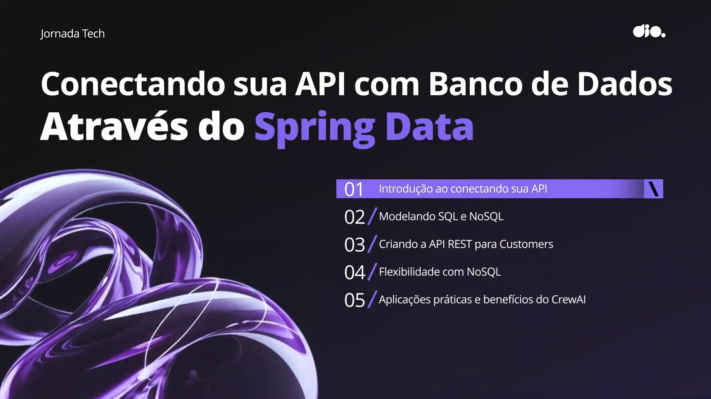
</p>

Slide de abertura da aula. Ele apresenta o título do curso, **"Conectando sua API com Banco de Dados Através do Spring Data"**, dentro da trilha Jornada Tech, e traz a agenda dividida em cinco blocos:

1. Introdução ao conectando sua API
2. Modelando SQL e NoSQL
3. Criando a API REST para Customers
4. Flexibilidade com NoSQL
5. Aplicações práticas e benefícios do CrewAI

Esse é o slide de abertura, indicando o panorama geral do que será abordado ao longo da jornada.

<p align="center">
  
</p>

Slide "Agenda do Curso", detalhando a estrutura específica deste vídeo introdutório:

- **Fundamentos e Conceitos**
- **Estudo de caso**, desdobrado em três etapas de desenvolvimento
- **Roadmap do Aluno**

Essa agenda confirma o formato do curso: primeiro os fundamentos teóricos sobre persistência, em seguida a apresentação do estudo de caso, depois uma sequência de vídeos de desenvolvimento prático e, por fim, um vídeo de roadmap com desafios e sugestões de aprofundamento.

<p align="center">
  
</p>

Slide "O Desafio da Persistência Moderna", contrastando o **Mundo Relacional** (representado por um arquivo de gavetas, remetendo a tabelas rígidas) e o **Mundo Não-Relacional** (representado por documentos, chaves-valor e grafos interligados).

Três pilares são destacados:

- **Integridade** — transações financeiras impecáveis
- **Flexibilidade** — estruturas dinâmicas que mudam a cada requisição
- **Velocidade** — acesso em milissegundos sob tráfego massivo

É um slide conceitual que ilustra por que a arquitetura moderna precisa de um ecossistema poliglota, combinando bancos relacionais (com garantias como o ACID) e bancos não relacionais, cada um atendendo a uma necessidade diferente de negócio.

<p align="center">
  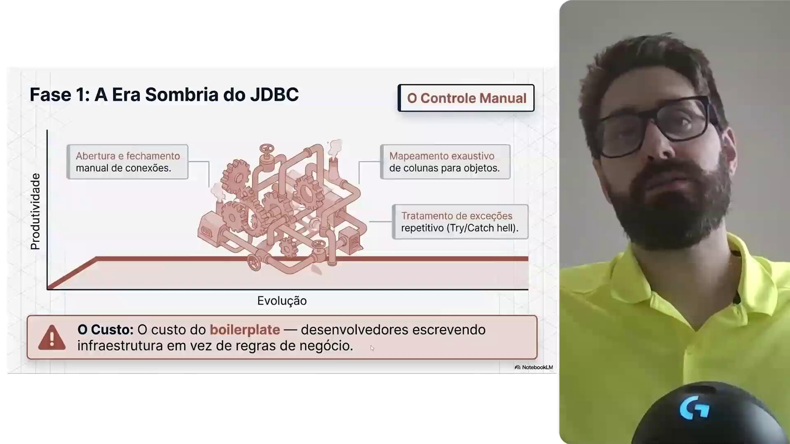
</p>

Slide "Fase 1: A Era Sombria do JDBC", subtitulado **"O Controle Manual"**. Ele descreve os três grandes fardos do desenvolvimento com JDBC puro:

- Abertura e fechamento manual de conexões
- Mapeamento exaustivo de colunas para objetos
- Tratamento de exceções repetitivo (o famoso "Try/Catch hell")

O destaque final é o custo do **boilerplate**: desenvolvedores gastando tempo escrevendo infraestrutura de acesso a dados em vez de regras de negócio. 

<p align="center">
  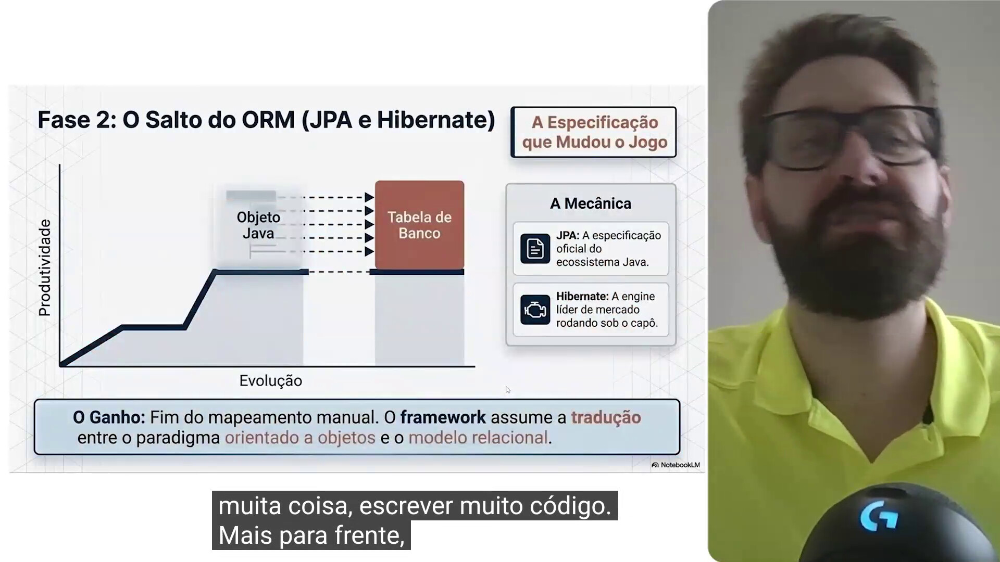
</p>

Slide "Fase 2: O Salto do ORM (JPA e Hibernate)", subtitulado **"A Especificação que Mudou o Jogo"**. Ele mostra a transição de um Objeto Java para uma Tabela de Banco por meio de mapeamento automático, e explica a mecânica por trás disso:

- **JPA**: a especificação oficial do ecossistema Java para persistência
- **Hibernate**: a engine (ORM) líder de mercado que roda por baixo dos panos

O ganho destacado é o fim do mapeamento manual: o framework passa a assumir a tradução entre o paradigma orientado a objetos e o modelo relacional. 

<p align="center">
  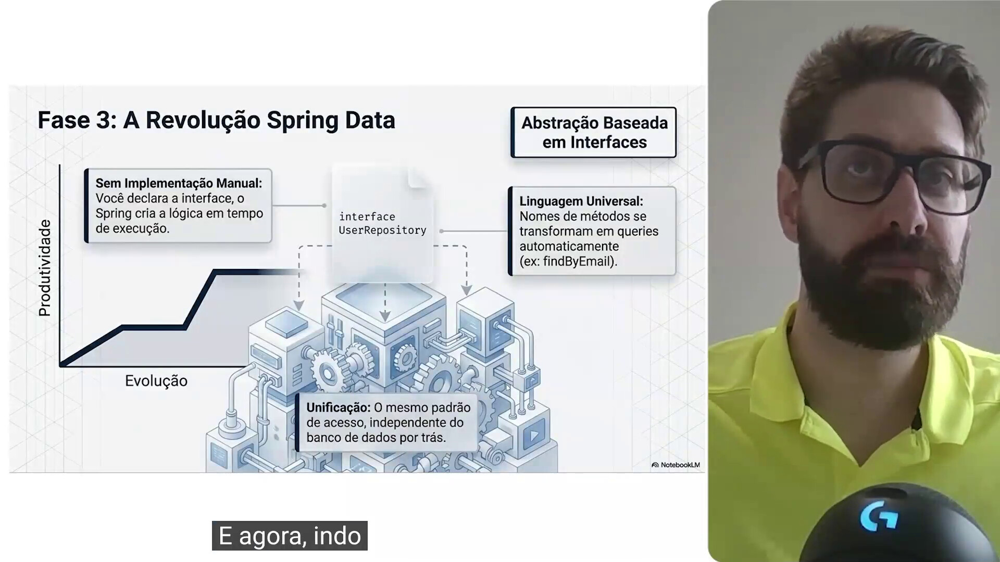
</p>

Slide "Fase 3: A Revolução Spring Data", subtitulado **"Abstração Baseada em Interfaces"**. Ele ilustra o salto seguinte na evolução da persistência:

- **Sem Implementação Manual**: basta declarar a interface (o exemplo exibido é `interface UserRepository`) e o Spring cria a lógica em tempo de execução.
- **Linguagem Universal**: nomes de métodos se transformam automaticamente em consultas, como no exemplo `findByEmail`.
- **Unificação**: o mesmo padrão de acesso é usado independentemente do banco de dados por trás.

<p align="center">
  
</p>

Slide "Padrões de Design: Onde Fica a Lógica?", que apresenta as duas filosofias arquiteturais possíveis para persistência:

- **ActiveRecord** (Caminho A): a própria entidade se salva.
- **Repository** (Caminho B): um mediador especializado salva a entidade.

O slide reforça que toda ferramenta de abstração precisa escolher uma dessas filosofias de design.

<p align="center">
  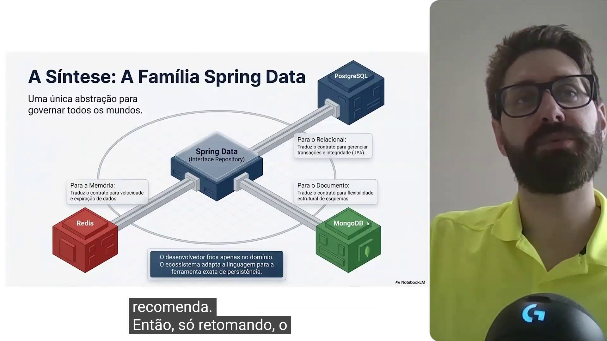
</p>

Slide "A Síntese: A Família Spring Data", subtitulado **"Uma única abstração para governar todos os mundos"**. Ele mostra a interface Repository do Spring Data no centro, conectando-se a diferentes bancos:

- **PostgreSQL** — traduz o contrato para gerenciar transações e integridade (JPA)
- **MongoDB** — traduz o contrato para flexibilidade estrutural de esquemas
- **Redis** — traduz o contrato para velocidade e expiração de dados

A mensagem central é que o desenvolvedor foca apenas no domínio da aplicação, enquanto o próprio ecossistema Spring Data adapta a linguagem para a ferramenta exata de persistência escolhida.

<p align="center">
  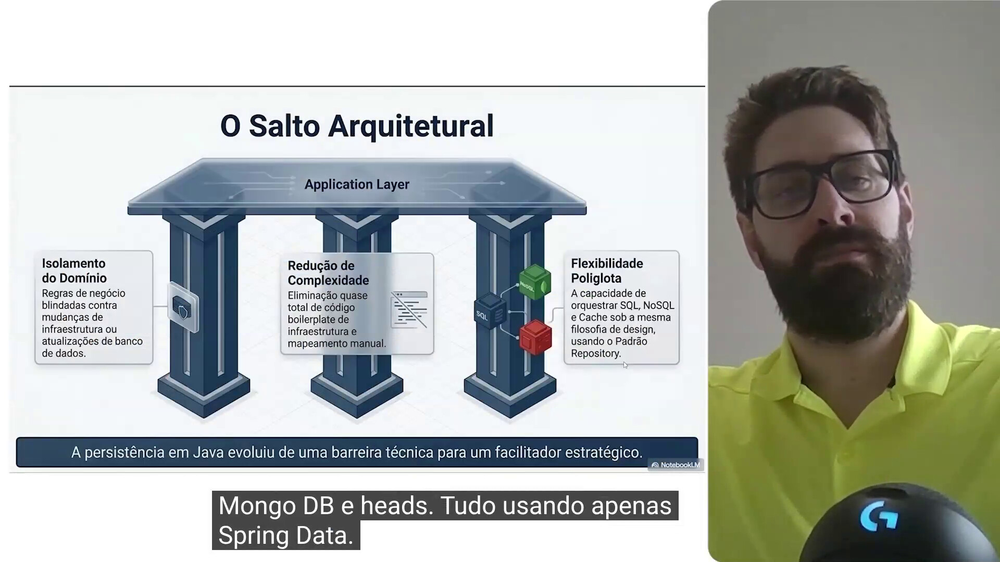
</p>

Slide "O Salto Arquitetural", que resume os benefícios estratégicos de toda a evolução apresentada até aqui, sustentados por uma "Application Layer":

- **Isolamento do Domínio**: regras de negócio blindadas contra mudanças de infraestrutura ou atualizações de banco de dados.
- **Redução de Complexidade**: eliminação quase total de código boilerplate de infraestrutura e mapeamento manual.
- **Flexibilidade Poliglota**: capacidade de orquestrar SQL, NoSQL e Cache sob a mesma filosofia de design, usando o Padrão Repository.

A conclusão do slide resume o raciocínio de toda a fase conceitual do vídeo: a persistência em Java evoluiu de uma barreira técnica para um facilitador estratégico. 

<p align="center">
  
</p>

Slide "Persistência Poliglota: O Caso do Ticketing System", que introduz o estudo de caso prático do curso: uma arquitetura poliglota usando PostgreSQL (seguro), MongoDB (flexível) e Redis (veloz) para desafios específicos de um sistema de ticketing. O slide organiza a justificativa técnica em quatro frentes:

- **Estratégias de Armazenamento** (Spring Data JPA / PostgreSQL): garante transações financeiras atômicas (ACID) e integridade referencial absoluta nos pedidos.
- **Flexibilidade** (Spring Data MongoDB): gerencia catálogos dinâmicos, já que eventos diferentes (shows vs. conferências) possuem atributos distintos.
- **Performance** (Spring Data Redis): implementa o bloqueio temporário de assentos (Ticket Locking) com expiração automática (TTL).
- **Gestão de Concorrência**: o uso do Redis evita sobrecarga no banco principal durante picos de acesso na escolha de assentos.

Esse slide é o ponto de virada da aula: encerrada a parte conceitual, ele apresenta a justificativa técnica para o estudo de caso que será construído ao longo do curso — um sistema de catálogo de eventos, gerenciamento de usuários e escolha de assentos, combinando bancos relacionais e não relacionais conforme a necessidade de cada domínio.


### 🟩 Vídeo 02 - Modelando SQL e NoSQL

<video width="60%" controls>
  <source src="000-Midia_e_Anexos/bootcamp_ntt_data_java_spring_ai-modulo.04-curso.02-video_02.webm" type="video/webm">
    Seu navegador não suporta vídeo HTML5.
</video>

link do vídeo: https://web.dio.me/track/ntt-data-2026-ai-java-back-end/course/conectando-sua-api-com-banco-de-dados-atraves-do-spring-data/learning/13762d00-abe3-4831-95f8-7eb6441eccef?autoplay=1

### Anotações

#### Abertura: Conectando sua API com Banco de Dados através do Spring Data

<p align="center">
  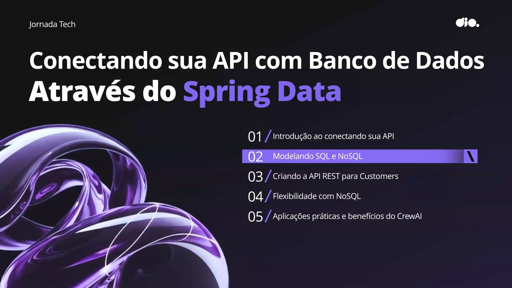
</p>

Slide de abertura da aula, parte da trilha **Jornada Tech**. O título situa o tema do encontro — integrar uma API com um banco de dados usando o **Spring Data** — e o sumário à direita mostra que a aula está no tópico **02, "Modelando SQL e NoSQL"**, dentro de uma sequência maior que também abordará a criação da API REST para Customers, flexibilidade com NoSQL e aplicações práticas com CrewAI.

#### Retomada do estudo de caso: persistência poliglota

<p align="center">
  
</p>

O instrutor **Thiago Poiani** retoma a aula explicando o estudo de caso que guiará o desenvolvimento: um sistema de ticketing que usa **persistência poliglota**, combinando **PostgreSQL** para dados que exigem consistência (transações financeiras, integridade referencial), **MongoDB** para catálogos flexíveis de eventos distintos e **Redis** para o bloqueio temporário de assentos, garantindo performance na gestão de concorrência. Essa é a motivação por trás do projeto que será construído ao longo do curso.

#### Criando o pacote `domain`

<p align="center">
  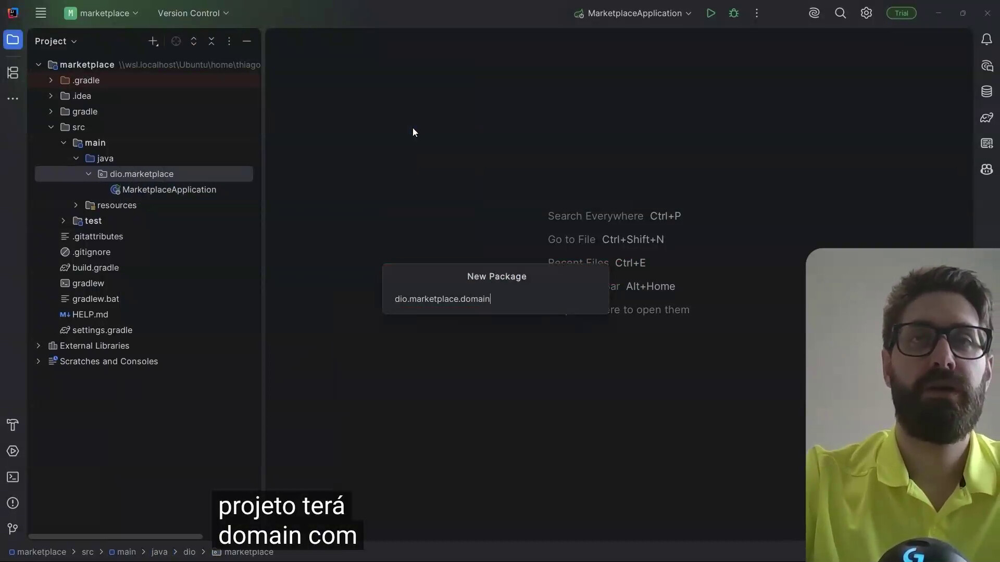
</p>

No IntelliJ IDEA, dentro do projeto **marketplace** (criado com Spring Boot e Java 25), o instrutor cria o primeiro pacote da estrutura baseada em **Domain-Driven Design**: `dio.marketplace.domain`. Esse pacote concentrará as regras de negócio da aplicação.

#### Criando o pacote `application`

<p align="center">
  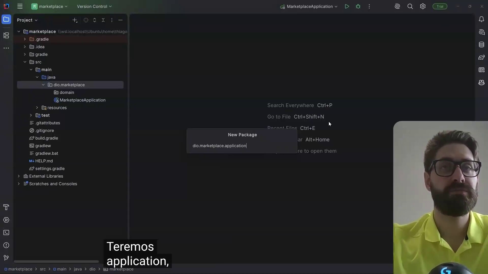
</p>

Em seguida é criado o pacote `dio.marketplace.application`, que funcionará como camada orquestradora, responsável por interagir tanto com o domínio quanto com a infraestrutura.

#### Criando o pacote `infrastructure`

<p align="center">
  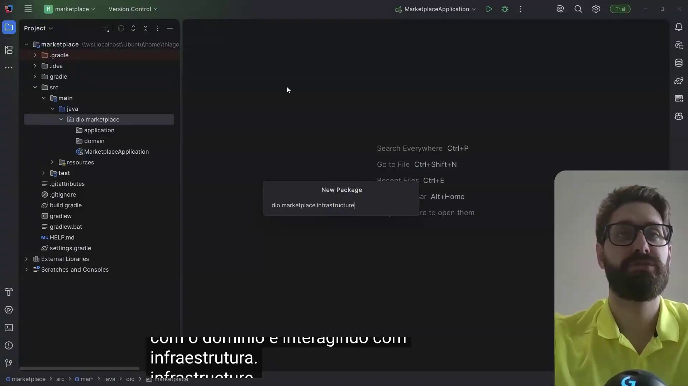
</p>

Por fim, dentro da divisão de camadas, é criado o pacote `dio.marketplace.infrastructure`, responsável pela parte mais externa da aplicação — comunicação com banco de dados e requisições externas. Com `domain`, `application` e `infrastructure` criados, fica definida a estratégia de camadas do projeto.

#### Criando o módulo `registration`

<p align="center">
  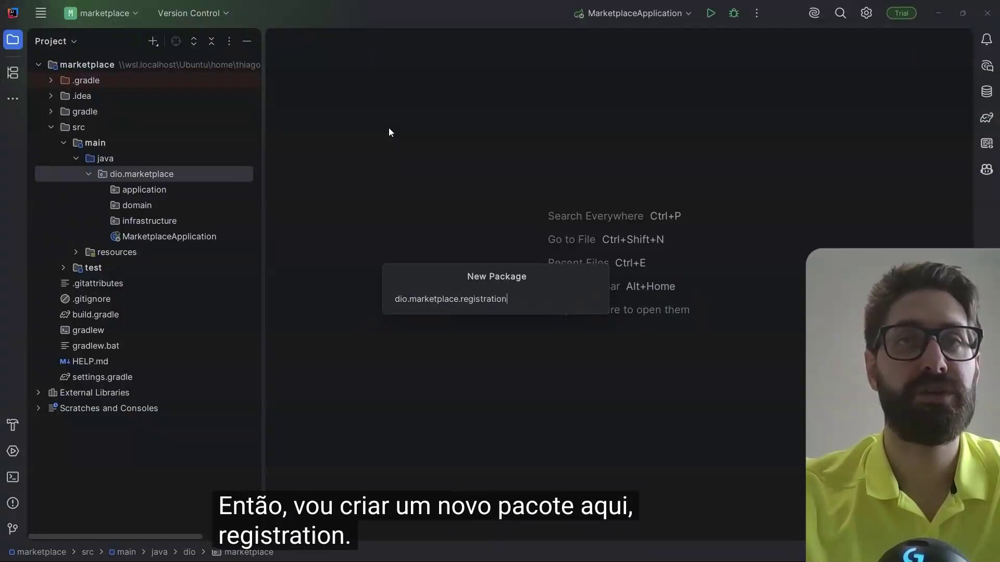
</p>

A primeira funcionalidade da aplicação será voltada ao **registro de usuários**. Para isso, é criado um novo pacote, `dio.marketplace.registration`, que funcionará como um módulo próprio — a ideia é que a aplicação evolua e ganhe outros módulos semelhantes no futuro.

#### Estrutura interna do módulo `registration`

<p align="center">
  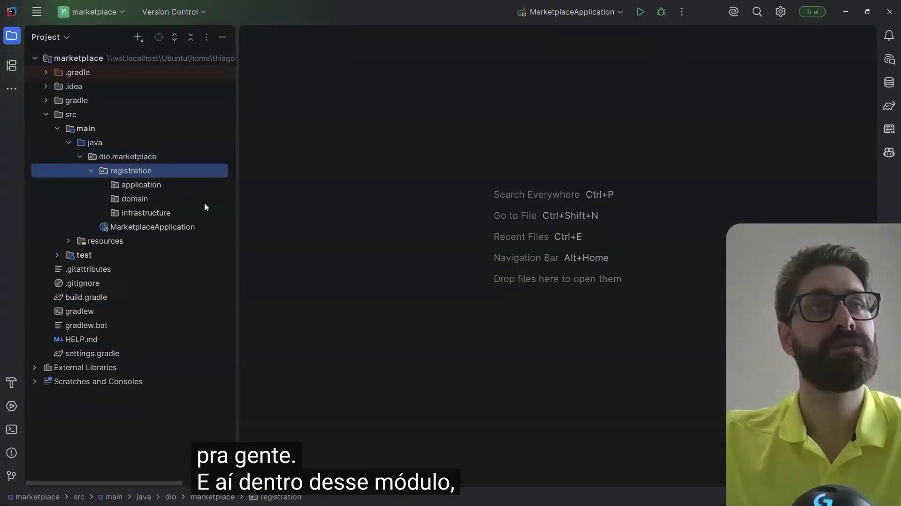
</p>

Dentro do módulo `registration` são criados os subpacotes `application`, `domain` e `infrastructure`, repetindo a mesma divisão em camadas já definida para o projeto como um todo, agora aplicada especificamente a esse módulo de cadastro.

#### Criando a classe `Customer`

<p align="center">
  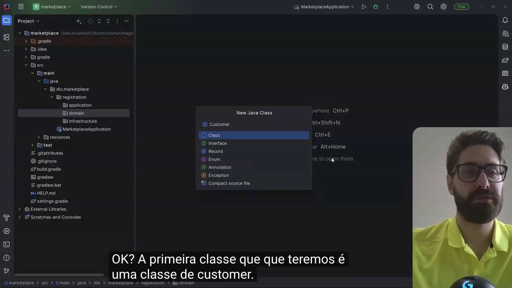
</p>

Dentro do pacote `domain` do módulo `registration`, é criada a primeira classe do módulo: `Customer`, que representará o cliente cadastrado no sistema.

#### Primeiro atributo de `Customer`: o identificador

<p align="center">
  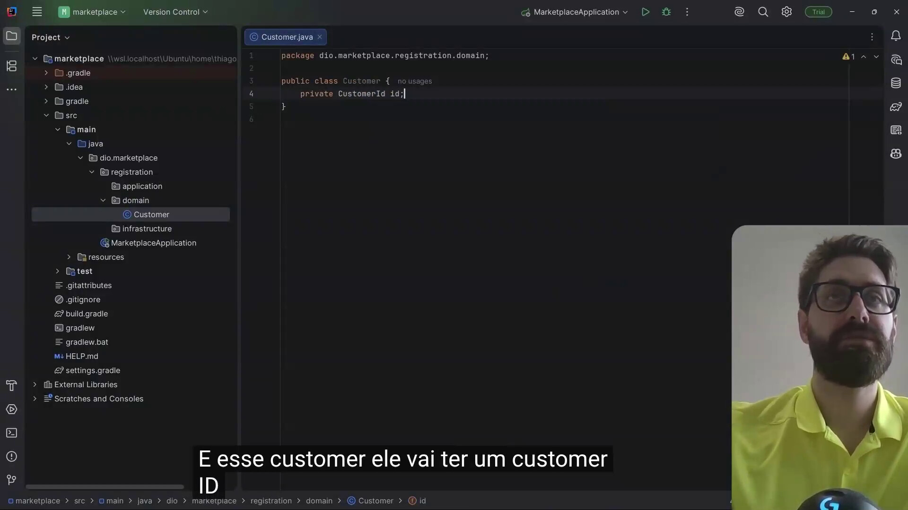
</p>

A classe `Customer` recebe seu primeiro atributo, `private CustomerId id;`. Em vez de usar um simples `String` como identificador, o instrutor opta por criar um **identificador fortemente tipado** — uma classe própria (`CustomerId`) para representar o ID do cliente, deixando mais claro no código, em qualquer lugar em que esse identificador for usado, que se trata especificamente de um ID de `Customer`.

#### Criando `CustomerId` como um `record`

<p align="center">
  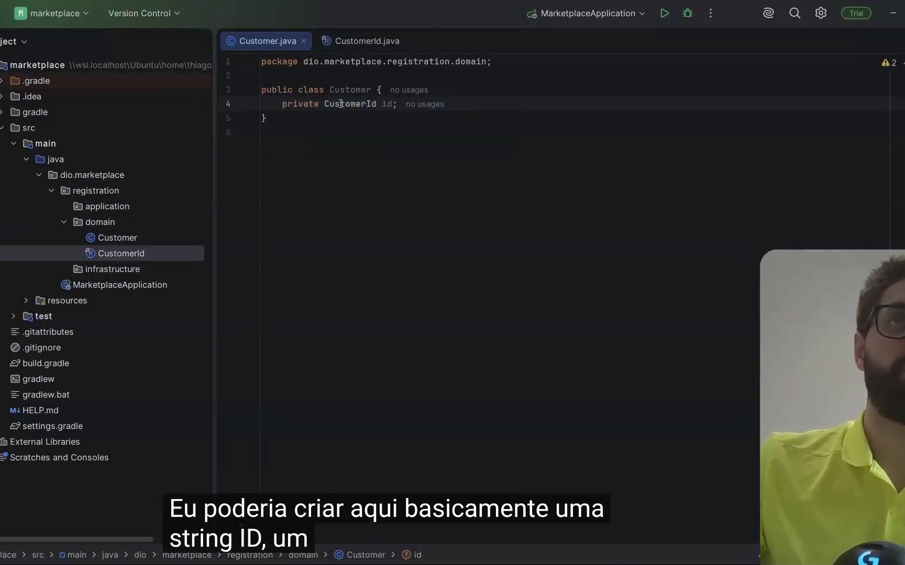
</p>

É criada a classe `CustomerId`, e o instrutor explica a escolha de utilizá-la como um **record** em vez de uma classe tradicional: classes são usadas para objetos com um ciclo de vida bem definido, enquanto um record representa um *data value* — um conjunto de atributos sem necessariamente ter identidade própria. Records já vêm com construtores canônicos prontos e trabalham naturalmente com imutabilidade: para alterar um valor, é preciso reconstruir o objeto.

#### Código completo da classe `Customer`

```java
package dio.marketplace.registration.domain;

import org.springframework.util.Assert;
import java.util.UUID; // Adicionado para gerar o UUID aleatório

public class Customer {
    private CustomerId id;
    private String name;
    private String email;

    // Construtor Principal
    public Customer(CustomerId id, String name, String email) {
        Assert.notNull(id, "Id must not be null"); // Validação de segurança adicionada
        Assert.notNull(name, "Name must not be null");
        Assert.notNull(email, "Email must not be null");

        this.id = id;
        this.name = name;
        this.email = email;
    }

    // Construtor Secundário (Conveniência para novos cadastros)
    public Customer(String name, String email) {
        this(new CustomerId(UUID.randomUUID()), name, email); // Corrigido aqui!
    }
}
```

A classe `Customer` fica com os atributos `id`, `name` e `email`. O construtor principal recebe os três valores e faz validações com `Assert.notNull` para garantir que nenhum deles seja nulo. Já o construtor secundário recebe apenas `name` e `email` — pensado para o momento de criação de um novo cadastro — e delega ao construtor principal, gerando automaticamente um novo `CustomerId` a partir de um `UUID.randomUUID()`.

#### Código completo do `record CustomerId`

```java
package dio.marketplace.registration.domain;

import java.util.UUID;
import org.springframework.util.Assert;

public record CustomerId(UUID id) {
    public CustomerId {
        Assert.notNull(id, "id must not be null");
    }

    public CustomerId customerId() {
        this(UUID.randomUUID());
    }
}
```

O `record CustomerId` encapsula um `UUID` e usa um **construtor compacto** para validar que o `id` não é nulo. O método `customerId()` demonstra a facilidade de gerar um novo identificador aleatório a partir do record.

#### Criando a interface `CustomerRepository`

<p align="center">
  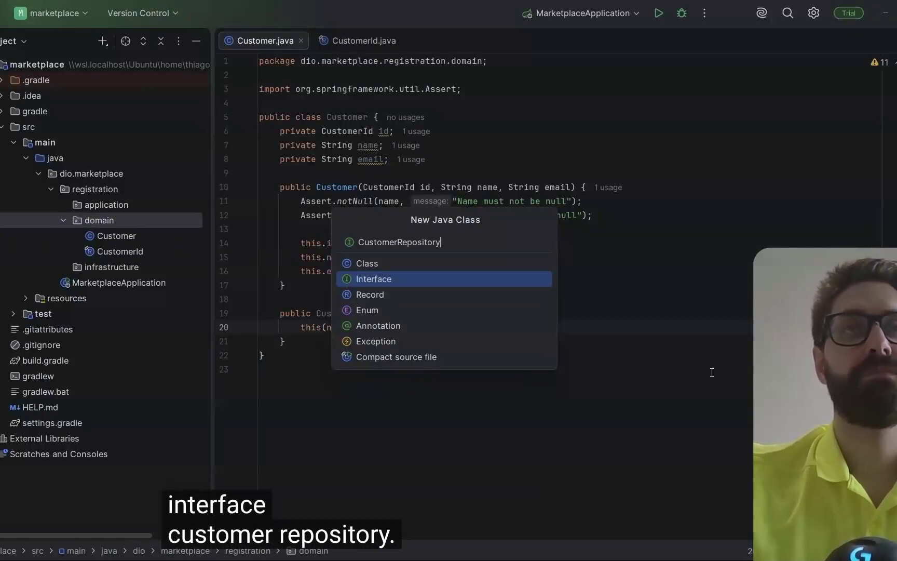
</p>

Como a ideia é armazenar e manipular os dados de um `Customer` através de um banco de dados, é criada a interface `CustomerRepository`, dentro do pacote `domain`. Ter essa interface no domínio está relacionado às regras de negócio: é ali que se define o que a aplicação precisa fazer, independentemente de qual tecnologia de banco será usada.

#### Interface `CustomerRepository` definida

<p align="center">
  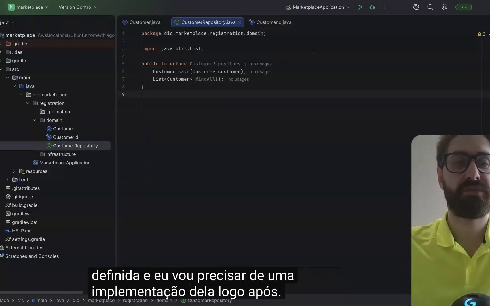
</p>

```java
package dio.marketplace.registration.domain;

import java.util.List;

public interface CustomerRepository {
    Customer save(Customer customer);
    List<Customer> findAll();
}
```

A interface expõe apenas os métodos necessários para as regras de negócio já identificadas: salvar um `Customer` (`save`) e listar todos os clientes (`findAll`). Essa interface precisará de uma implementação concreta, que será criada na camada de infraestrutura.

#### Criando o pacote `persistence`

<p align="center">
  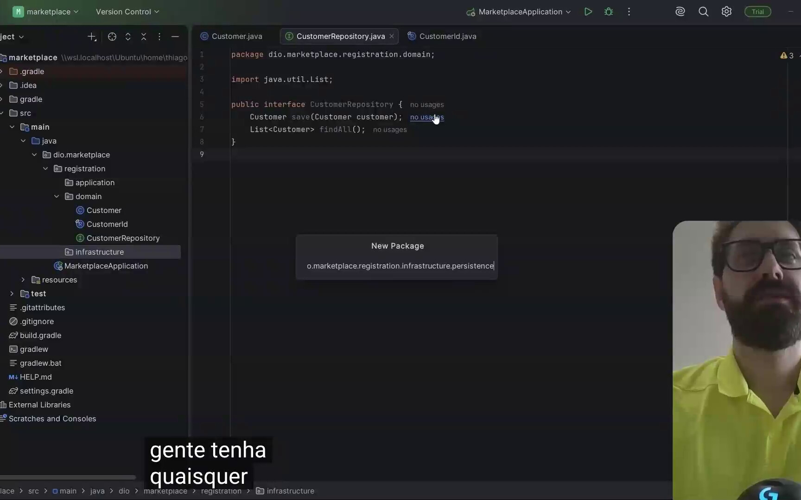
</p>

Dentro de `infrastructure`, é criado o pacote `infrastructure.persistence`, destinado a concentrar tudo o que envolve o banco de dados.

#### Criando o pacote `entity`

<p align="center">
  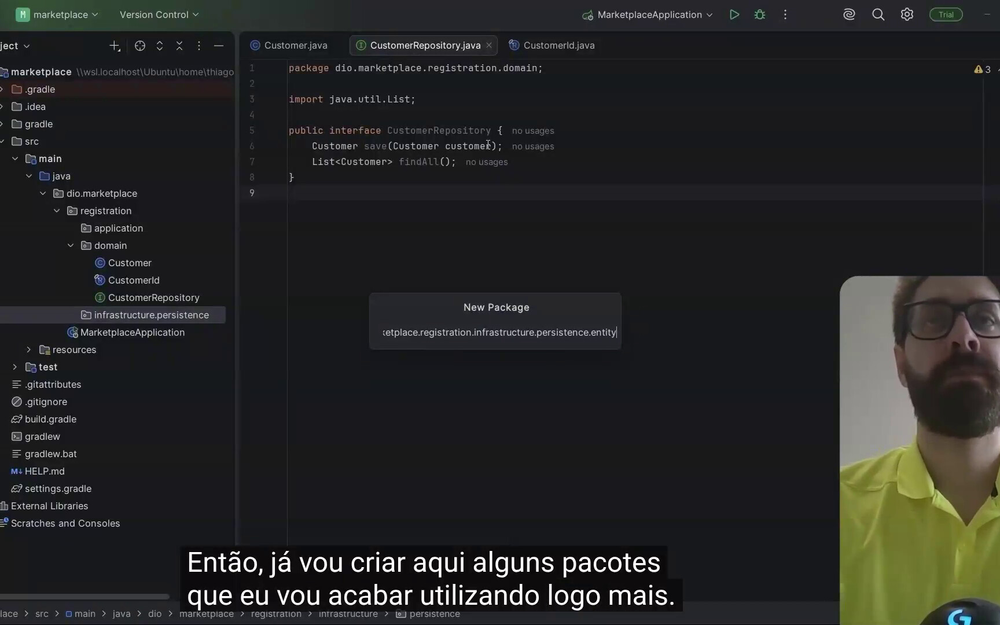
</p>

Dentro de `persistence`, é criado o subpacote `entity`, onde ficará a definição — a abstração — da tabela `customer` no banco de dados, que não precisa necessariamente ser idêntica à classe de domínio `Customer`.

#### Criando o pacote `repository`

<p align="center">
  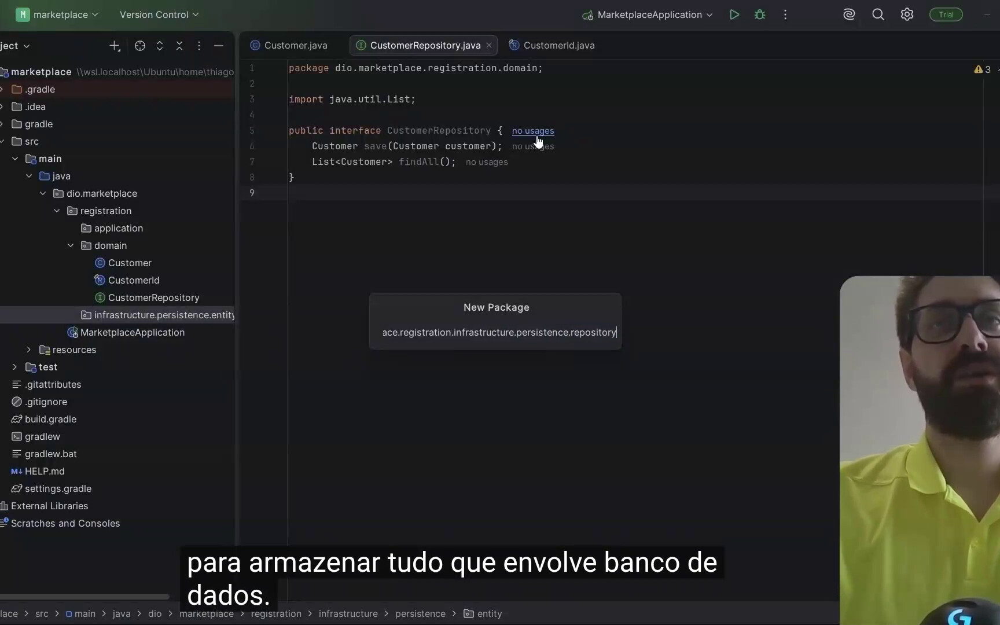
</p>

Ainda dentro de `persistence`, é criado o subpacote `repository`, que armazenará a implementação concreta do `CustomerRepository`, específica para o banco de dados utilizado.

#### Criando a classe `JpaCustomerRepository`

<p align="center">
  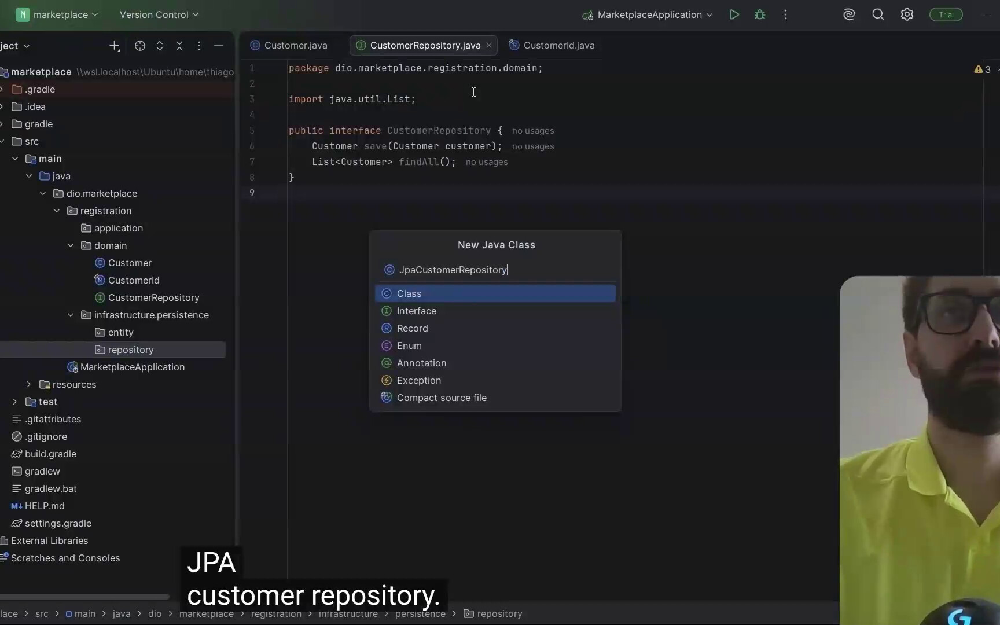
</p>

É criada a classe `JpaCustomerRepository`, dentro do pacote `repository`, que será a implementação do `CustomerRepository` voltada para o banco relacional via JPA.

#### Esqueleto inicial de `JpaCustomerRepository`

<p align="center">
  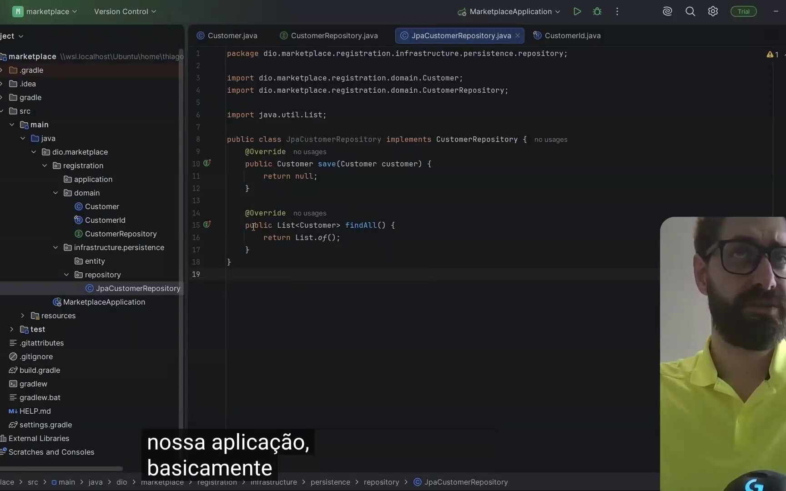
</p>

```java
package dio.marketplace.registration.infrastructure.persistence.repository;

import dio.marketplace.registration.domain.Customer;
import dio.marketplace.registration.domain.CustomerRepository;

import java.util.List;

public class JpaCustomerRepository implements CustomerRepository {
    @Override
    public Customer save(Customer customer) {
        return null;
    }

    @Override
    public List<Customer> findAll() {
        return List.of();
    }
}
```

A IDE gera automaticamente o esqueleto da classe `JpaCustomerRepository`, implementando `CustomerRepository` com os métodos `save` e `findAll` ainda vazios (retornando `null` e uma lista vazia, respectivamente). Esses métodos serão implementados de fato mais adiante.

#### Criando o arquivo `compose.yml`

<p align="center">
  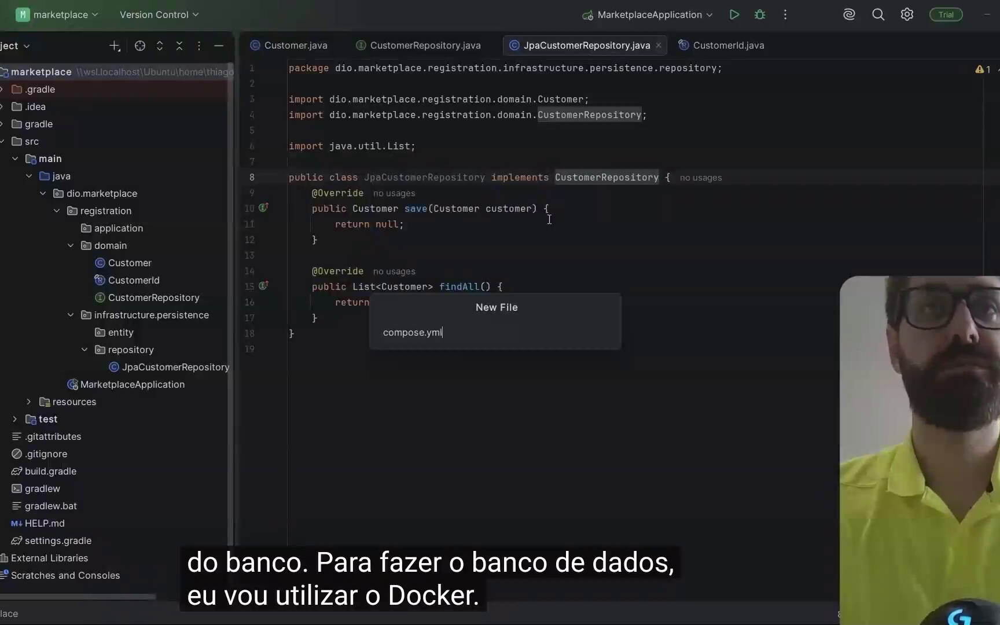
</p>

Para ter um banco de dados disponível, o instrutor decide utilizar o **Docker**: uma ferramenta que permite instanciar serviços dentro de contêineres — abstrações leves de Linux que rodam na máquina local. É criado um novo arquivo `compose.yml` na raiz do projeto.

#### Definindo o serviço de banco de dados no `compose.yml`

<p align="center">
  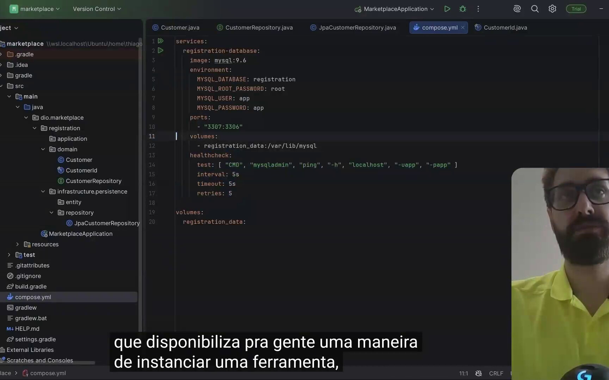
</p>

```yaml
services:
  registration-database:
    image: mysql:9.6
    environment:
      MYSQL_DATABASE: registration
      MYSQL_ROOT_PASSWORD: root
      MYSQL_USER: app
      MYSQL_PASSWORD: app
    ports:
      - "3307:3306"
    volumes:
      - registration_data:/var/lib/mysql
    healthcheck:
      test: [ "CMD", "mysqladmin", "ping", "-h", "localhost", "-uapp", "-papp" ]
      interval: 5s
      timeout: 5s
      retries: 5

volumes:
  registration_data:
```

O serviço `registration-database` usa a imagem **MySQL 9.6**, define variáveis de ambiente para o nome do banco, usuário e senha, mapeia a porta padrão do MySQL (3306) para a porta local 3307 — evitando conflito com uma instalação local do MySQL — e usa um **volume** para persistir os dados em disco entre reinicializações do contêiner. O **healthcheck** verifica a cada 5 segundos se o contêiner está saudável, considerando-o instável após 5 tentativas falhas.

#### Suporte do Spring Boot ao Docker Compose

<p align="center">
  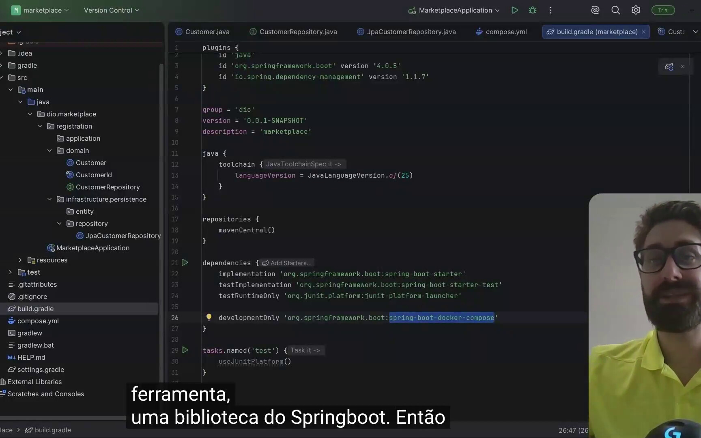
</p>

No `build.gradle`, é adicionada a dependência `developmentOnly 'org.springframework.boot:spring-boot-docker-compose'`. Essa biblioteca do Spring Boot permite que o próprio framework detecte o arquivo `compose.yml`, suba os contêineres automaticamente ao iniciar a aplicação, aguarde que fiquem saudáveis e configure sozinho a conexão com o banco de dados, sem necessidade de configuração manual adicional.

#### Adicionando o Spring Data JPA e o driver do MySQL

<p align="center">
  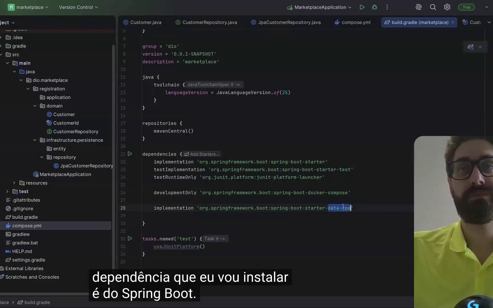
</p>

Ainda no `build.gradle`, é adicionada a dependência `implementation 'org.springframework.boot:spring-boot-starter-data-jpa'` — a primeira dependência específica do **Spring Data**, voltada para bancos relacionais via JPA. Como o banco utilizado é o MySQL, também é necessário um driver de conexão específico para ele.

#### Subindo a aplicação pela primeira vez

<p align="center">
  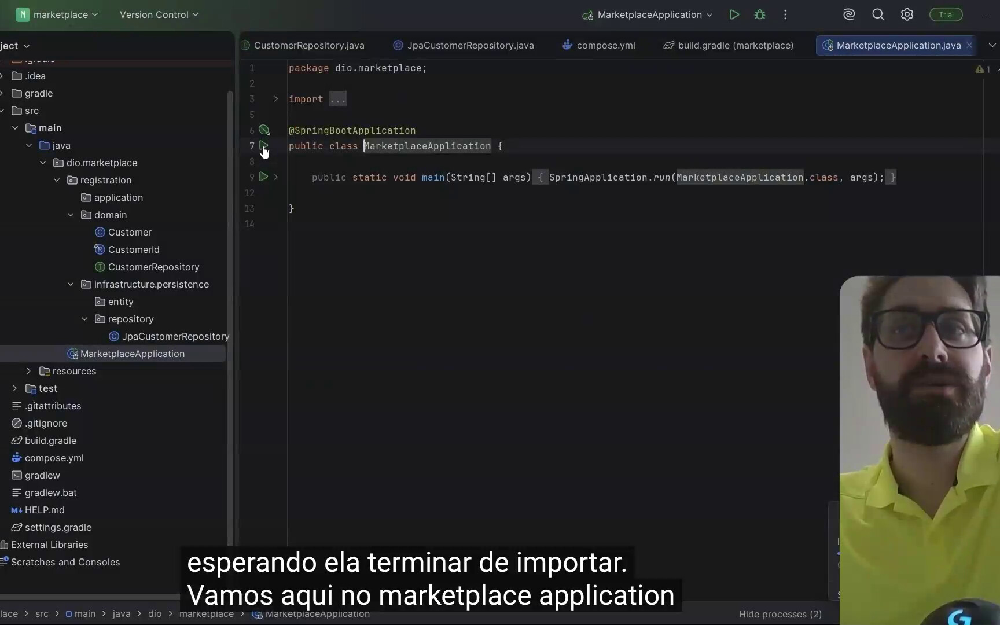
</p>

Com as dependências configuradas, o instrutor aguarda a importação do projeto terminar e inicia a classe principal `MarketplaceApplication`, para verificar se o contêiner do banco sobe automaticamente e se a aplicação consegue se conectar a ele.

#### Log de inicialização: contêiner e conexão com o banco

```
.   ____          _            __ _ _
 /\\ / ___'_ __ _ _(_)_ __  __ _ \ \ \ \
( ( )\___ | '_ | '_| | '_ \/ _` | \ \ \ \
 \\/  ___)| |_)| |  | | | || (_| |  ) ) ) )
  '  |____| .__|_|  |_|_| |_\__, | / / / /
 =========|_|==============|___/=/_/_/_/
 :: Spring Boot ::                (v3.2.2)

2026-03-24T18:14:16.891-03:00  INFO 144510 --- [           main] br.com.tqi.analisecredito.Application   : Starting Application v0.0.1-SNAPSHOT using Java 17.0.10 with PID 144510 (/home/arthur/workspace/tqi_bootcamp/analisecredito/target/classes started by arthur in /home/arthur/workspace/tqi_bootcamp/analisecredito)
2026-03-24T18:14:16.893-03:00  INFO 144510 --- [           main] br.com.tqi.analisecredito.Application   : No active profile set, falling back to 1 default profile: "default"
2026-03-24T18:14:17.388-03:00  INFO 144510 --- [           main] .s.d.r.c.RepositoryConfigurationDelegate : Bootstrapping Spring Data JPA repositories in DEFAULT mode.
2026-03-24T18:14:17.424-03:00  INFO 144510 --- [           main] .s.d.r.c.RepositoryConfigurationDelegate : Finished Spring Data repository scanning in 32 ms. Found 3 JPA repositories.
2026-03-24T18:14:17.844-03:00  INFO 144510 --- [           main] o.s.b.w.embedded.tomcat.TomcatWebServer  : Tomcat initialized with port 8080 (http)
2026-03-24T18:14:17.850-03:00  INFO 144510 --- [           main] o.apache.catalina.core.StandardService   : Starting service [Tomcat]
2026-03-24T18:14:17.851-03:00  INFO 144510 --- [           main] o.apache.catalina.core.StandardEngine    : Starting Servlet engine: [Apache Tomcat/10.1.18]
2026-03-24T18:14:17.892-03:00  INFO 144510 --- [           main] o.a.c.c.C.[Tomcat].[localhost].[/]       : Initializing Spring embedded WebApplicationContext
2026-03-24T18:14:17.893-03:00  INFO 144510 --- [           main] w.s.c.ServletWebServerApplicationContext : Root WebApplicationContext: initialization completed in 959 ms
2026-03-24T18:14:18.016-03:00  INFO 144510 --- [           main] o.hibernate.jpa.internal.util.LogHelper  : HHH000204: Processing PersistenceUnitInfo [name: default]
2026-03-24T18:14:18.055-03:00  INFO 144510 --- [           main] org.hibernate.Version                    : HHH000412: Hibernate ORM core version 6.4.1.Final
2026-03-24T18:14:18.081-03:00  INFO 144510 --- [           main] o.h.c.internal.RegionFactoryInitiator    : HHH000256: Hibernate L2 cache provider: org.hibernate.cache.internal.NoCachingRegionFactory
2026-03-24T18:14:18.231-03:00  INFO 144510 --- [           main] o.s.o.j.p.SpringPersistenceUnitInfo      : No LoadTimeWeaver setup: PSR-174 class transformer voided
2026-03-24T18:14:18.253-03:00  INFO 144510 --- [           main] com.zaxxer.hikari.HikariDataSource       : HikariPool-1 - Starting...
2026-03-24T18:14:18.374-03:00  INFO 144510 --- [           main] com.zaxxer.hikari.pool.HikariPool        : HikariPool-1 - Added connection conn0: url=jdbc:h2:mem:testdb user=SA
2026-03-24T18:14:18.375-03:00  INFO 144510 --- [           main] com.zaxxer.hikari.HikariDataSource       : HikariPool-1 - Start completed.
2026-03-24T18:14:18.810-03:00  INFO 144510 --- [           main] o.h.e.t.j.p.i.JtaPlatformInitiator       : HHH000490: Using JtaPlatform implementation: [org.hibernate.engine.transaction.jta.platform.internal.NoJtaPlatform]
2026-03-24T18:14:18.851-03:00  INFO 144510 --- [           main] o.s.o.j.LocalContainerEntityManagerFactoryBean : Initialized JPA EntityManagerFactory for persistence unit 'default'
2026-03-24T18:14:19.141-03:00  WARN 144510 --- [           main] JpaBaseConfiguration$JpaWebConfiguration : spring.jpa.open-in-view is enabled by default. Therefore, database queries may be performed during view rendering. Explicitly configure spring.jpa.open-in-view to disable this warning.
2026-03-24T18:14:19.349-03:00  INFO 144510 --- [           main] o.s.b.a.e.web.EndpointLinksResolver      : Exposing 1 endpoint(s) beneath base path '/actuator'
2026-03-24T18:14:19.394-03:00  INFO 144510 --- [           main] o.s.b.w.embedded.tomcat.TomcatWebServer  : Tomcat started on port 8080 (http) with context path ''
2026-03-24T18:14:19.402-03:00  INFO 144510 --- [           main] br.com.tqi.analisecredito.Application   : Started Application in 2.822 seconds (process running for 3.125)

Process finished with exit code 0
```

O log confirma que o Spring Boot detecta o `compose.yml`, cria e sobe automaticamente o contêiner do banco, aguarda até que ele fique saudável (*Healthy*) e só então conecta a aplicação a ele através do pool de conexões **HikariCP**. Como ainda não há nenhum servidor web mantendo a aplicação ativa, ela se conecta, confirma que está tudo certo e encerra logo em seguida.

#### Detalhes da conexão JDBC estabelecida

<p align="center">
  
</p>

O console mostra as informações da conexão já estabelecida com o banco: driver **MySQL Connector/J**, dialeto **MySQLDialect**, versão do banco 9.6, isolamento `REPEATABLE_READ`, entre outros detalhes. Isso confirma que o Spring Data já identificou o banco pela imagem do contêiner e configurou a conexão automaticamente, sem esforço manual de configuração.

#### Adicionando Spring Web e Actuator

<p align="center">
  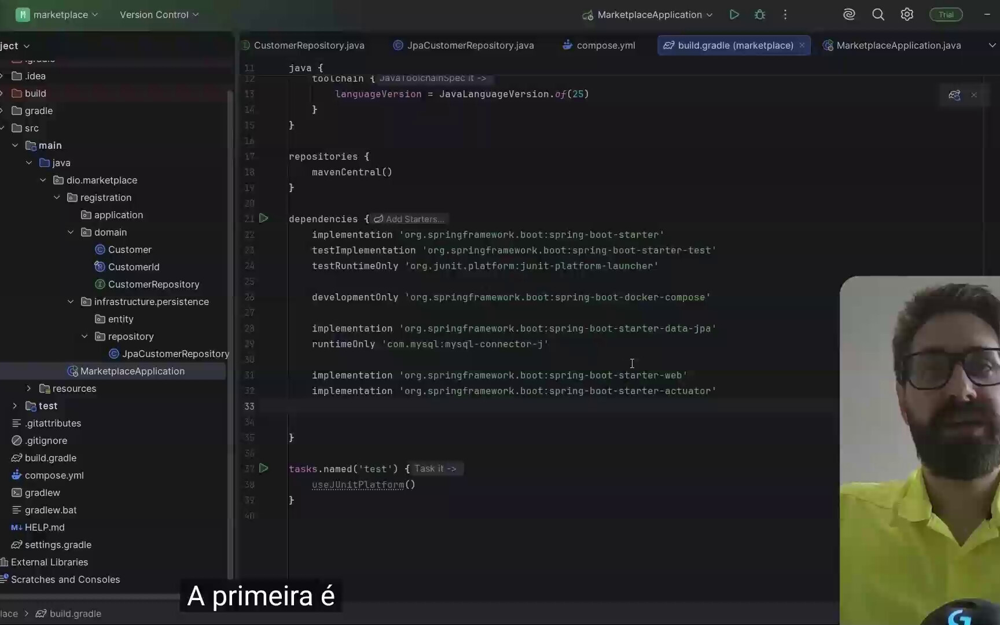
</p>

São adicionadas mais duas dependências ao `build.gradle`: `spring-boot-starter-web`, para permitir a criação de controllers e o acesso a um servidor web dentro da aplicação, e `spring-boot-starter-actuator`, ferramenta do Spring Boot que disponibiliza endpoints como o de *health check*, permitindo verificar se a aplicação está de pé e corretamente conectada ao banco.

#### Aplicação em execução com o Tomcat ativo

<p align="center">
  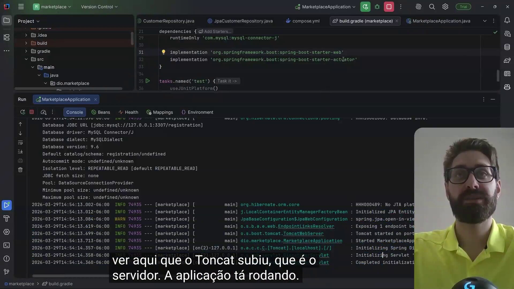
</p>

Com o Spring Boot Web adicionado, a aplicação sobe, conecta-se novamente ao banco e, dessa vez, permanece ativa: o log mostra o servidor **Tomcat** iniciado, o que mantém a aplicação de pé em vez de encerrar como antes.

#### Painel Health do Actuator na IDE

<p align="center">
  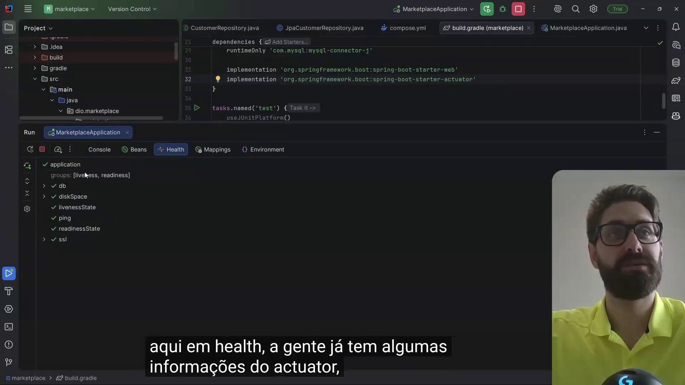
</p>

Na aba **Health** do painel de execução do IntelliJ, já é possível visualizar algumas informações fornecidas pelo Actuator, como os grupos `liveness` e `readiness` e o status geral da aplicação.

#### Endpoint `/actuator/health` no navegador

<p align="center">
  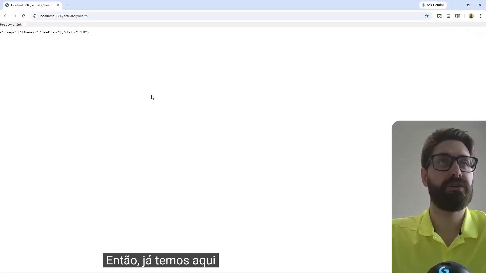
</p>

Acessando `localhost:8080/actuator/health` diretamente no navegador, o retorno é `{"groups":["liveness","readiness"],"status":"UP"}`. São poucas informações neste momento, mas já confirmam que o Actuator está disponível e a aplicação está saudável.

#### Configurando detalhes do health check e do Docker Compose

<p align="center">
  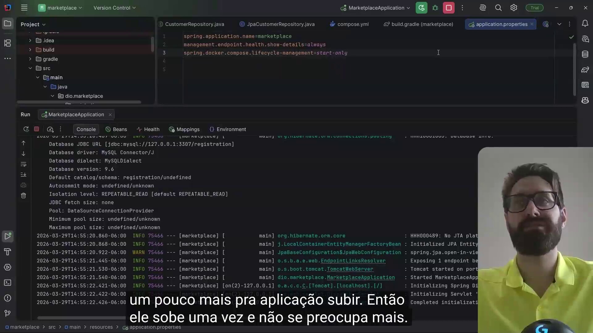
</p>

No `application.properties`, são adicionadas duas configurações:

```properties
spring.application.name=marketplace
management.endpoint.health.show-details=always
spring.docker.compose.lifecycle-management=start-only
```

`management.endpoint.health.show-details=always` faz com que o endpoint de *health* exiba mais detalhes, incluindo a conexão com o banco. Já `spring.docker.compose.lifecycle-management=start-only` evita que o Spring Boot derrube o contêiner a cada vez que a aplicação é encerrada — o contêiner sobe uma única vez e permanece disponível nas execuções seguintes, o que agiliza o ciclo de desenvolvimento.

#### Health check com mais detalhes (JSON não formatado)

<p align="center">
  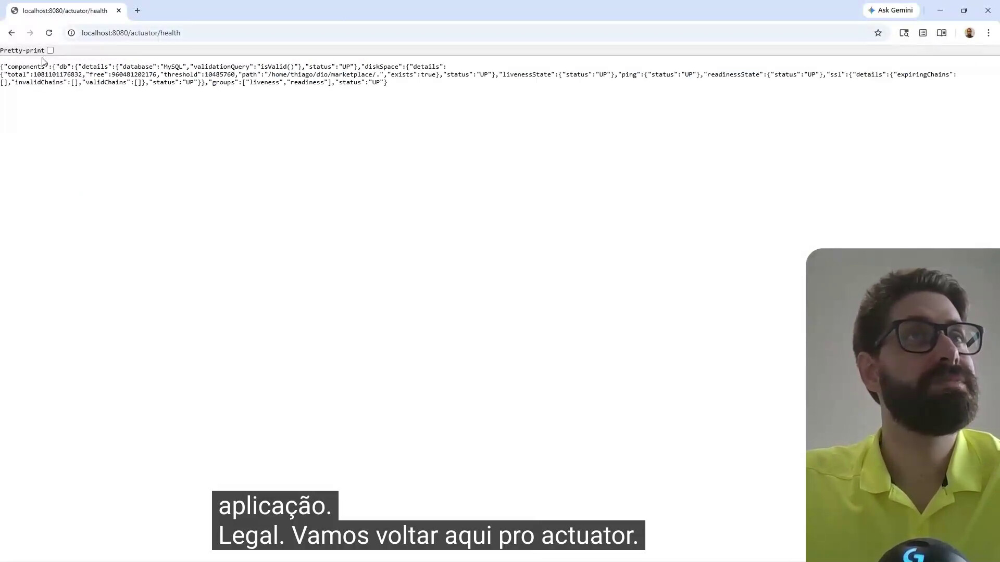
</p>

Voltando ao endpoint `/actuator/health` no navegador, agora com mais detalhes habilitados, o retorno passa a incluir o componente `db`, confirmando que o banco de dados está saudável (`status: UP`), além de outras informações como espaço em disco e SSL.

#### Health check com JSON formatado (pretty-print)

<p align="center">
  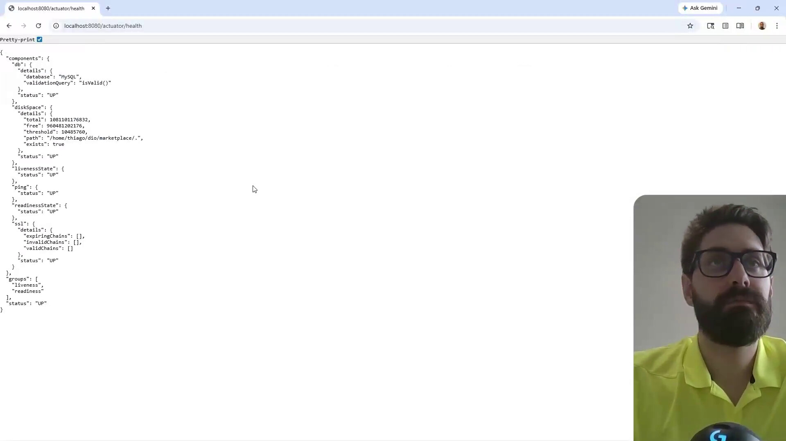
</p>

Com a opção *Pretty-print* marcada no navegador, o mesmo retorno do endpoint de *health* fica formatado de maneira legível, deixando claro cada componente monitorado (`db`, `diskSpace`, `livenessState`, `ping`, `readinessState`, `ssl`) e o status geral `UP` da aplicação.

#### Configurando criação automática do banco pelo Hibernate

<p align="center">
  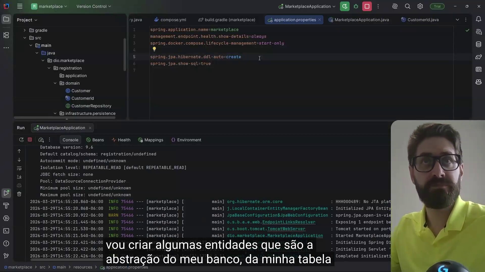
</p>

Novas configurações são adicionadas ao `application.properties`:

```properties
spring.jpa.hibernate.ddl-auto=create
spring.jpa.show-sql=true
```

A ideia, a partir daqui, é criar entidades que representem a abstração das tabelas do banco de dados. Com `ddl-auto=create`, o **Hibernate** (implementação do JPA) cria automaticamente a estrutura do banco a partir dessas entidades, sem a necessidade de escrever SQL manualmente — prática ágil para desenvolvimento, mas não recomendada para produção, onde o ideal é trabalhar com ferramentas de *data migration*, como Flyway ou Liquibase. Já `show-sql=true` exibe no console os comandos SQL executados pela aplicação.

#### Site oficial do Project Lombok

<p align="center">
  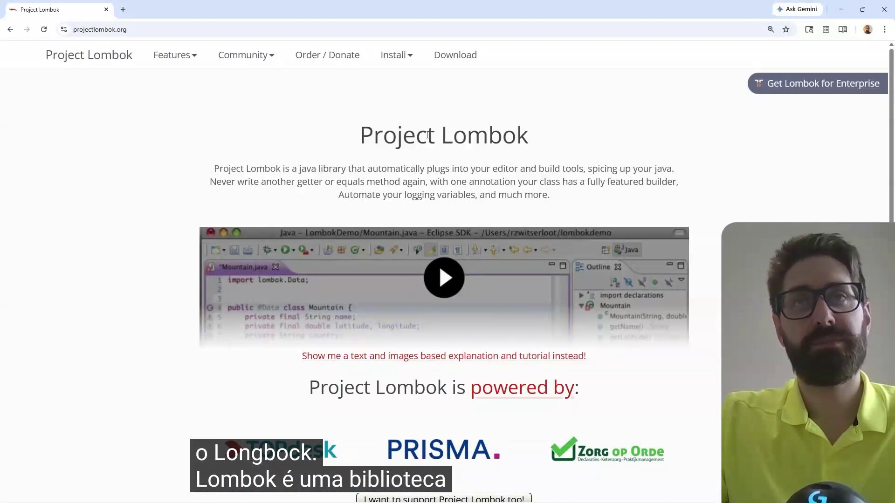
</p>

Para agilizar o desenvolvimento, o instrutor apresenta o **Project Lombok**, biblioteca Java que se integra ao editor e à ferramenta de build, permitindo gerar automaticamente métodos como *getters*, *setters* e construtores, sem a necessidade de escrevê-los manualmente.

#### Plugin do Gradle para o Lombok

<p align="center">
  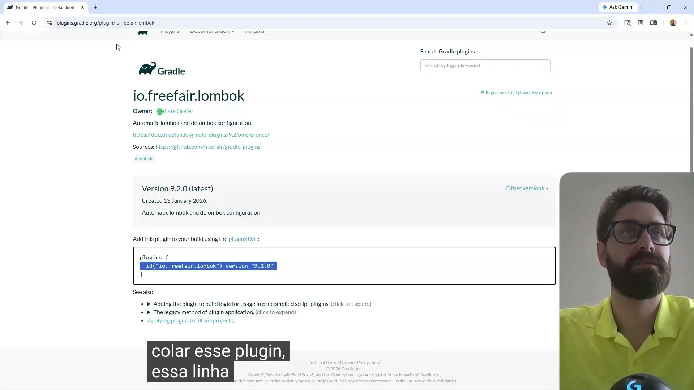
</p>

Na página do plugin **`io.freefair.lombok`** (Gradle Plugin Portal), é copiada a linha de configuração do plugin para ser adicionada ao `build.gradle` do projeto, viabilizando o uso do Lombok.

#### Plugin do Lombok adicionado ao `build.gradle`

<p align="center">
  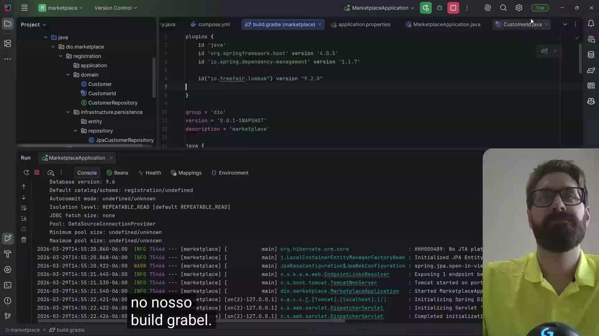
</p>

O plugin do Lombok é colado no bloco `plugins` do `build.gradle`, junto aos demais plugins já existentes (`java`, `org.springframework.boot`, `io.spring.dependency-management`).

#### Criando a entidade `Customer`

<p align="center">
  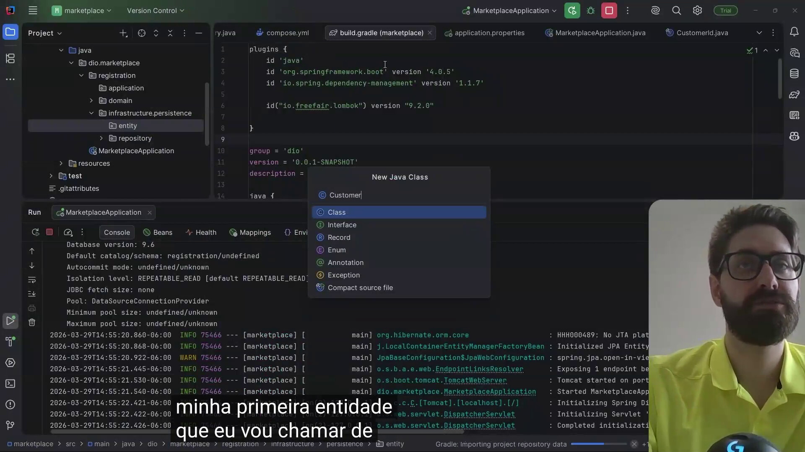
</p>

Dentro do pacote `entity`, é criada a primeira entidade JPA do projeto, também chamada `Customer` — reforçando que ela é diferente da classe de domínio de mesmo nome, criada anteriormente. Essa entidade será a responsável por representar a tabela no banco de dados.

#### Estrutura inicial da entidade `Customer`

<p align="center">
  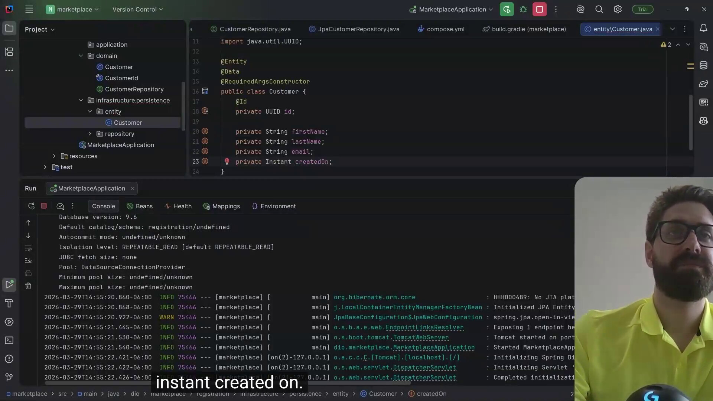
</p>

```java
@Entity
@Data
@RequiredArgsConstructor
public class Customer {
    @Id
    private UUID id;

    private String firstName;
    private String lastName;
    private String email;
    private Instant createdOn;
}
```

A entidade recebe a anotação `@Entity` do próprio JPA e as anotações `@Data` e `@RequiredArgsConstructor` do Lombok, que geram automaticamente getters, setters, construtores e `toString`. São definidos os campos `id`, `firstName`, `lastName`, `email` e `createdOn`, representando as colunas da tabela `customer` no banco.

#### Adicionando o Spring Boot Validation

<p align="center">
  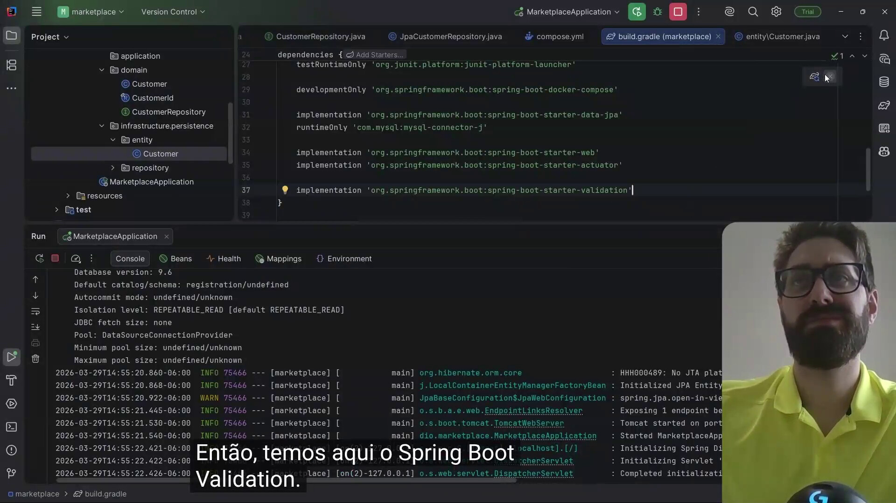
</p>

É adicionada ao `build.gradle` a dependência `implementation 'org.springframework.boot:spring-boot-starter-validation'`, que permitirá aplicar validações declarativas nos campos da entidade, como a obrigatoriedade de preenchimento de determinados atributos.

#### Entidade `Customer` com validações e ajustes finais

```java
package dio.marketplace.registration.infrastructure.persistence.entity;
import jakarta.persistence.Column;
import jakarta.persistence.Entity;
import jakarta.persistence.Id;
import jakarta.validation.constraints.Email;
import jakarta.validation.constraints.NotBlank;
import lombok.Data;
import lombok.RequiredArgsConstructor;
import org.hibernate.annotations.CreationTimestamp;

import java.time.Instant;
import java.util.UUID;

@Entity
@Data
@RequiredArgsConstructor
public class Customer {
    @Id
    private UUID id;

    @NotBlank
    @Column(nullable = false)
    private String firstName;
    private String lastName;

    @NotBlank
    @Email
    @Column(nullable = false, unique = true)
    private String email;

    @CreationTimestamp
    @Column(nullable = false, updatable = false)
    private Instant createdOn;
}
```

A entidade é ajustada: a geração automática do `id` é removida (o `CustomerId` já é gerado pela própria aplicação, via `UUID`), e são acrescentadas validações — `@NotBlank` e `@Column(nullable = false)` no `firstName`; `@NotBlank`, `@Email` e `@Column(nullable = false, unique = true)` no `email`. O campo `createdOn` recebe `@CreationTimestamp`, que preenche automaticamente a data de criação, e `@Column(nullable = false, updatable = false)`, impedindo que esse valor seja alterado após a persistência.

#### Hibernate criando a estrutura do banco

```log
.   ____          _            __ _ _
 /\\ / ___'_ __ _ _(_)_ __  __ _ \ \ \ \
( ( )\___ | '_ | '_| | '_ \/ _` | \ \ \ \
 \\/  ___)| |_)| |  | | | || (_| |  ) ) ) )
  '  |____| .__|_|  |_|_| |_\__, | / / / /
 =========|_|==============|___/=/_/_/_/
 :: Spring Boot ::                (v3.2.2)

2026-03-24T18:14:16.891-03:00  INFO 144510 --- [           main] br.com.tqi.analisecredito.Application   : Starting Application v0.0.1-SNAPSHOT using Java 17.0.10 with PID 144510 (/home/arthur/workspace/tqi_bootcamp/analisecredito/target/classes started by arthur in /home/arthur/workspace/tqi_bootcamp/analisecredito)
2026-03-24T18:14:16.893-03:00  INFO 144510 --- [           main] br.com.tqi.analisecredito.Application   : No active profile set, falling back to 1 default profile: "default"
2026-03-24T18:14:17.388-03:00  INFO 144510 --- [           main] .s.d.r.c.RepositoryConfigurationDelegate : Bootstrapping Spring Data JPA repositories in DEFAULT mode.
2026-03-24T18:14:17.424-03:00  INFO 144510 --- [           main] .s.d.r.c.RepositoryConfigurationDelegate : Finished Spring Data repository scanning in 32 ms. Found 3 JPA repositories.
2026-03-24T18:14:17.844-03:00  INFO 144510 --- [           main] o.s.b.w.embedded.tomcat.TomcatWebServer  : Tomcat initialized with port 8080 (http)
2026-03-24T18:14:17.850-03:00  INFO 144510 --- [           main] o.apache.catalina.core.StandardService   : Starting service [Tomcat]
2026-03-24T18:14:17.851-03:00  INFO 144510 --- [           main] o.apache.catalina.core.StandardEngine    : Starting Servlet engine: [Apache Tomcat/10.1.18]
2026-03-24T18:14:17.892-03:00  INFO 144510 --- [           main] o.a.c.c.C.[Tomcat].[localhost].[/]       : Initializing Spring embedded WebApplicationContext
2026-03-24T18:14:17.893-03:00  INFO 144510 --- [           main] w.s.c.ServletWebServerApplicationContext : Root WebApplicationContext: initialization completed in 959 ms
2026-03-24T18:14:18.016-03:00  INFO 144510 --- [           main] o.hibernate.jpa.internal.util.LogHelper  : HHH000204: Processing PersistenceUnitInfo [name: default]
2026-03-24T18:14:18.055-03:00  INFO 144510 --- [           main] org.hibernate.Version                    : HHH000412: Hibernate ORM core version 6.4.1.Final
2026-03-24T18:14:18.081-03:00  INFO 144510 --- [           main] o.h.c.internal.RegionFactoryInitiator    : HHH000256: Hibernate L2 cache provider: org.hibernate.cache.internal.NoCachingRegionFactory
2026-03-24T18:14:18.231-03:00  INFO 144510 --- [           main] o.s.o.j.p.SpringPersistenceUnitInfo      : No LoadTimeWeaver setup: PSR-174 class transformer voided
2026-03-24T18:14:18.253-03:00  INFO 144510 --- [           main] com.zaxxer.hikari.HikariDataSource       : HikariPool-1 - Starting...
2026-03-24T18:14:18.374-03:00  INFO 144510 --- [           main] com.zaxxer.hikari.pool.HikariPool        : HikariPool-1 - Added connection conn0: url=jdbc:h2:mem:testdb user=SA
2026-03-24T18:14:18.375-03:00  INFO 144510 --- [           main] com.zaxxer.hikari.HikariDataSource       : HikariPool-1 - Start completed.
2026-03-24T18:14:18.810-03:00  INFO 144510 --- [           main] o.h.e.t.j.p.i.JtaPlatformInitiator       : HHH000490: Using JtaPlatform implementation: [org.hibernate.engine.transaction.jta.platform.internal.NoJtaPlatform]
2026-03-24T18:14:18.851-03:00  INFO 144510 --- [           main] o.s.o.j.LocalContainerEntityManagerFactoryBean : Initialized JPA EntityManagerFactory for persistence unit 'default'
2026-03-24T18:14:19.141-03:00  WARN 144510 --- [           main] JpaBaseConfiguration$JpaWebConfiguration : spring.jpa.open-in-view is enabled by default. Therefore, database queries may be performed during view rendering. Explicitly configure spring.jpa.open-in-view to disable this warning.
2026-03-24T18:14:19.349-03:00  INFO 144510 --- [           main] o.s.b.a.e.web.EndpointLinksResolver      : Exposing 1 endpoint(s) beneath base path '/actuator'
2026-03-24T18:14:19.394-03:00  INFO 144510 --- [           main] o.s.b.w.embedded.tomcat.TomcatWebServer  : Tomcat started on port 8080 (http) with context path ''
2026-03-24T18:14:19.402-03:00  INFO 144510 --- [           main] br.com.tqi.analisecredito.Application   : Started Application in 2.822 seconds (process running for 3.125)
```

Com a marcação `ddl-auto=create` já configurada, ao subir a aplicação novamente o **Hibernate** identifica a entidade `Customer` e cria automaticamente a estrutura correspondente no banco de dados, sem a necessidade de scripts SQL manuais nesta fase de desenvolvimento.

#### Criando a interface `CustomerEntityRepository`

<p align="center">
  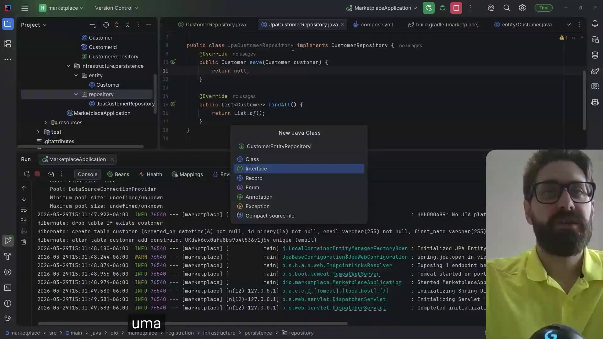
</p>

Enquanto a aplicação sobe, é criada a interface `CustomerEntityRepository`, no pacote `repository`, que será a base da implementação concreta de acesso ao banco de dados.

#### `CustomerEntityRepository` estendendo `CrudRepository`

<p align="center">
  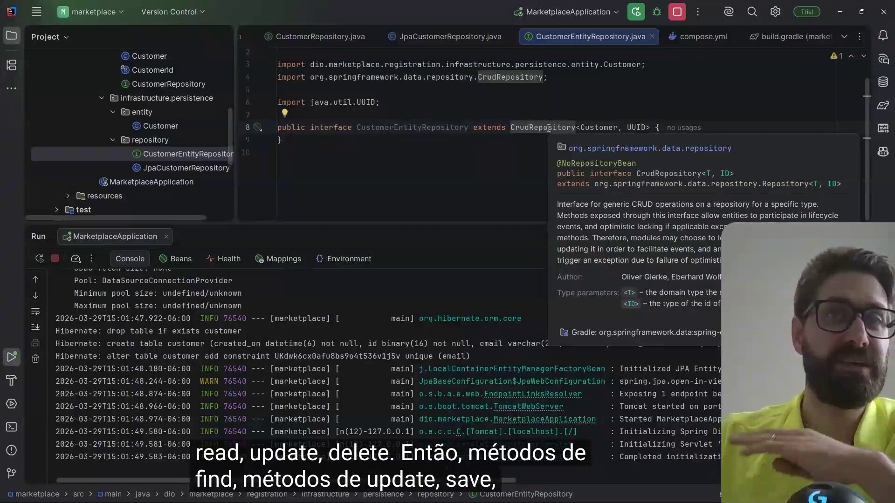
</p>

```java
package dio.marketplace.registration.infrastructure.persistence.repository;

import dio.marketplace.registration.infrastructure.persistence.entity.Customer;
import org.springframework.data.repository.CrudRepository;

import java.util.UUID;

public interface CustomerEntityRepository extends CrudRepository<Customer, UUID> {
}
```

Ao estender `CrudRepository<Customer, UUID>` — interface do Spring Data que já disponibiliza operações completas de CRUD (*create, read, update, delete*) — a interface `CustomerEntityRepository` ganha automaticamente métodos como `save`, `findAll`, `deleteById`, `existsById`, entre muitos outros, sem que seja necessário implementar nada manualmente.

#### Injetando o `CustomerEntityRepository` via construtor

<p align="center">
  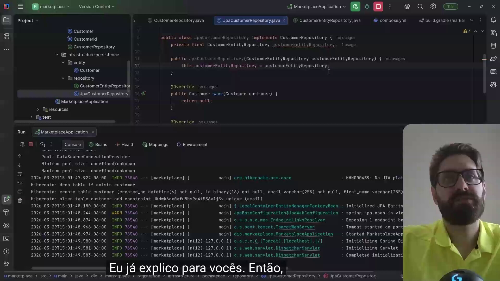
</p>

Na classe `JpaCustomerRepository`, é adicionado um atributo `private final CustomerEntityRepository customerEntityRepository`, recebido por parâmetro no construtor da classe. Essa é a base para a **injeção de dependência**: o Spring será responsável por fornecer automaticamente essa dependência quando a classe for instanciada.

#### Anotando `JpaCustomerRepository` com `@Repository`

<p align="center">
  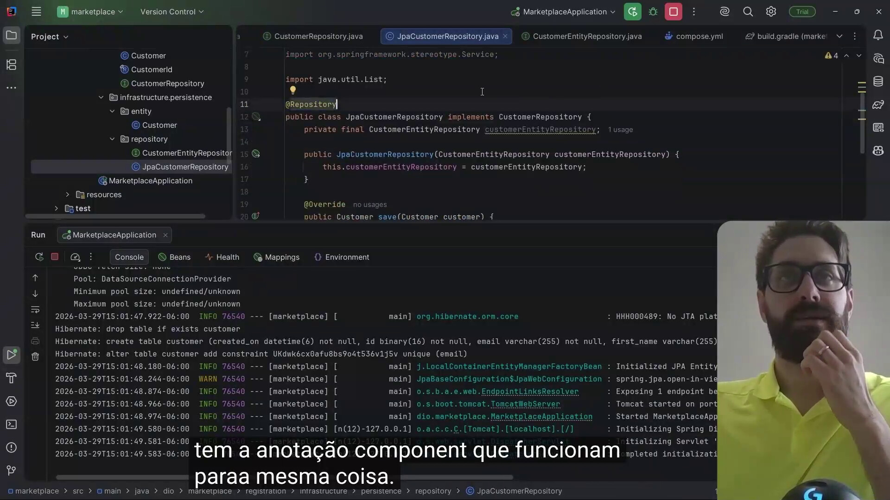
</p>

É adicionada a anotação `@Repository` acima da classe `JpaCustomerRepository`. Essa anotação — assim como `@Service` e `@Component` — faz parte do mecanismo de injeção de dependência e inversão de controle do Spring, permitindo que a aplicação identifique essa classe como a implementação concreta a ser utilizada onde a interface `CustomerRepository` for requisitada.

#### Iniciando a implementação do método `save`

<p align="center">
  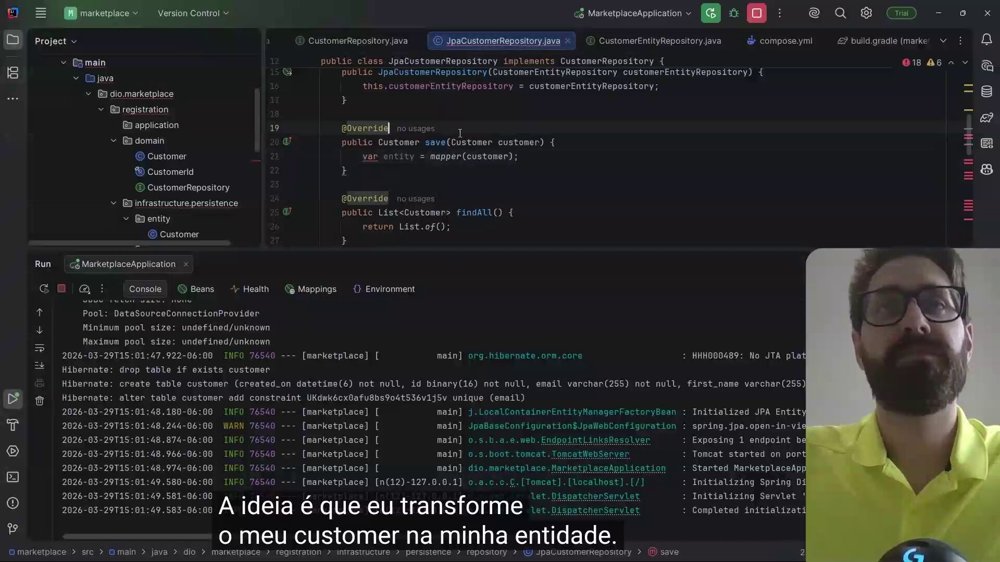
</p>

Dentro do método `save`, começa a ser escrita a conversão do `Customer` de domínio para a entidade JPA, através da chamada `var entity = mapper(customer);` — o próximo passo será implementar esse método `mapper` responsável por essa transformação.

#### Implementação do método `mapper` (domínio → entidade)

<p align="center">
  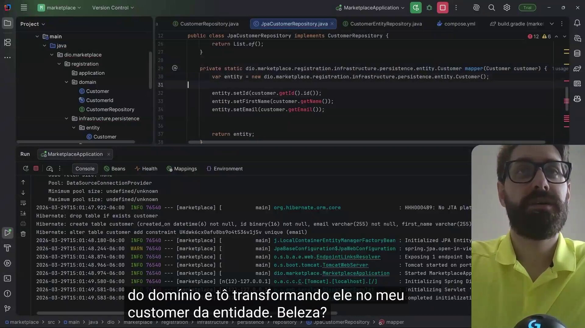
</p>

```java
private static dio.marketplace.registration.infrastructure.persistence.entity.Customer mapper(Customer customer) {
    var entity = new dio.marketplace.registration.infrastructure.persistence.entity.Customer();

    entity.setId(customer.getId().id());
    entity.setFirstName(customer.getName());
    entity.setEmail(customer.getEmail());

    return entity;
}
```

O método `mapper` recebe o `Customer` de domínio e monta uma nova instância da entidade JPA, copiando o `id` (extraído do `record CustomerId`), o nome e o e-mail. Assim, o domínio e a entidade de persistência permanecem desacoplados, mesmo compartilhando os mesmos dados.

#### Adicionando `@Getter` na classe de domínio `Customer`

<p align="center">
  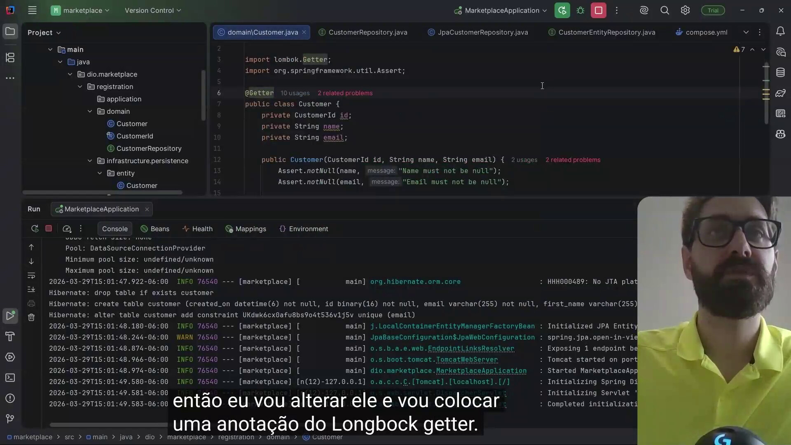
</p>

Como a classe de domínio `Customer` ainda não possuía métodos *getters*, o instrutor adiciona a anotação `@Getter`, do Lombok, que gera automaticamente `getId()`, `getName()` e `getEmail()`, necessários para o método `mapper` acessar os dados do `Customer`.

#### Revisando a conversão de domínio para entidade

<p align="center">
  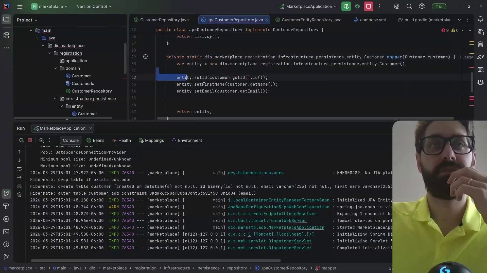
</p>

Com o `@Getter` aplicado, o método `mapper` da classe `JpaCustomerRepository` já consegue acessar corretamente `customer.getId().id()`, `customer.getName()` e `customer.getEmail()` para preencher os campos da entidade `Customer` de persistência.

#### Implementando o `mapper` inverso (entidade → domínio)

<p align="center">
  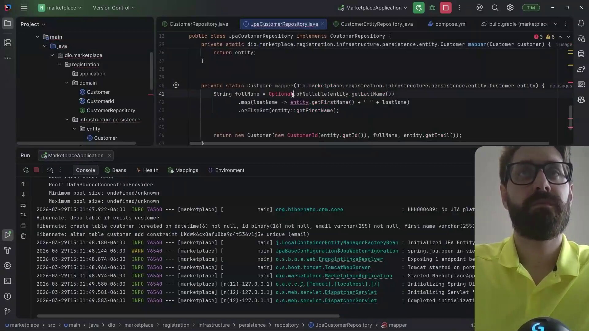
</p>

É iniciada a implementação do `mapper` no sentido contrário, convertendo a entidade JPA de volta para o `Customer` de domínio, necessário para o método `findAll`.

#### `mapper` completo: unindo `firstName` e `lastName`

<p align="center">
  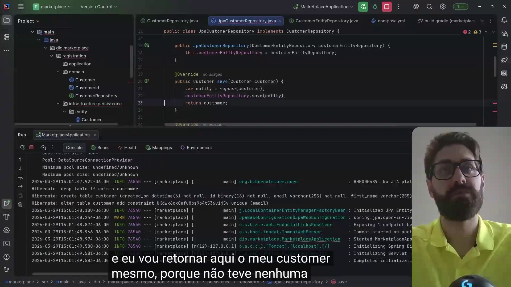
</p>

```java
private static Customer mapper(dio.marketplace.registration.infrastructure.persistence.entity.Customer entity) {
    String fullName = Optional.ofNullable(entity.getLastName())
            .map(lastName -> entity.getFirstName() + " " + lastName)
            .orElseGet(entity::getFirstName);

    return new Customer(new CustomerId(entity.getId()), fullName, entity.getEmail());
}
```

Esse `mapper` ilustra bem a diferença entre entidade e domínio: enquanto a entidade separa `firstName` e `lastName`, a classe de domínio `Customer` possui apenas o atributo `name`. Usando `Optional`, o código concatena sobrenome ao nome quando ele existir, ou usa apenas o primeiro nome caso contrário, retornando então um novo `Customer` de domínio a partir do `CustomerId`, do nome completo montado e do e-mail.

#### Finalizando o método `save`

<p align="center">
  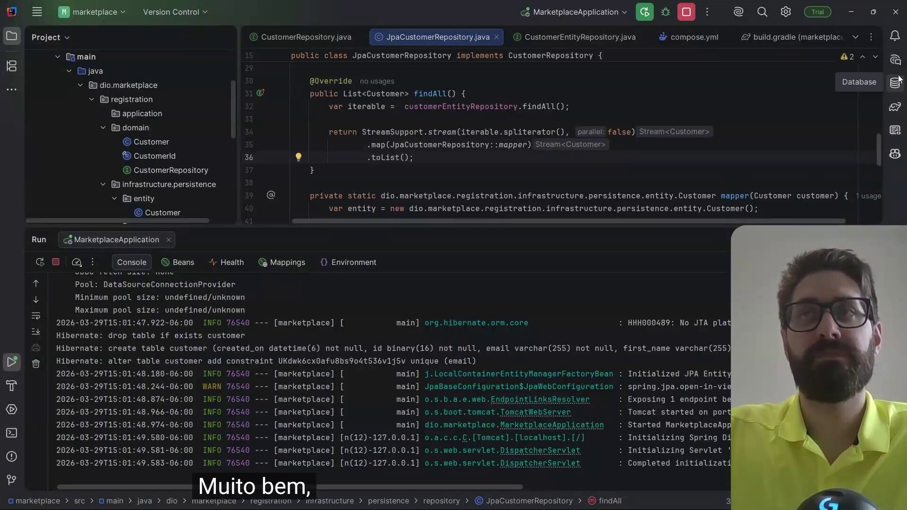
</p>

```java
@Override
public Customer save(Customer customer) {
    var entity = mapper(customer);
    customerEntityRepository.save(entity);
    return customer;
}
```

O método `save` fica completo: converte o `Customer` de domínio para a entidade através do `mapper`, persiste a entidade usando o `customerEntityRepository` (herdado do `CrudRepository`) e retorna o próprio `customer` recebido, já que não houve nenhuma alteração nele durante o processo.

#### Implementando o método `findAll`

```java
@Override
public List<Customer> findAll() {
    var iterable = customerEntityRepository.findAll();

    return StreamSupport.stream(iterable.spliterator(), false)
            .map(JpaCustomerRepository::mapper)
            .toList();
}
```

O `findAll()` do `CrudRepository` retorna um `Iterable` de entidades. Esse iterável é transformado em uma `Stream` com `StreamSupport.stream`, permitindo aplicar o `mapper` (no sentido entidade → domínio) a cada item e, por fim, convertê-los em uma `List<Customer>` de domínio com `toList()`.

#### Consultando a tabela `customer` no banco de dados

<p align="center">
  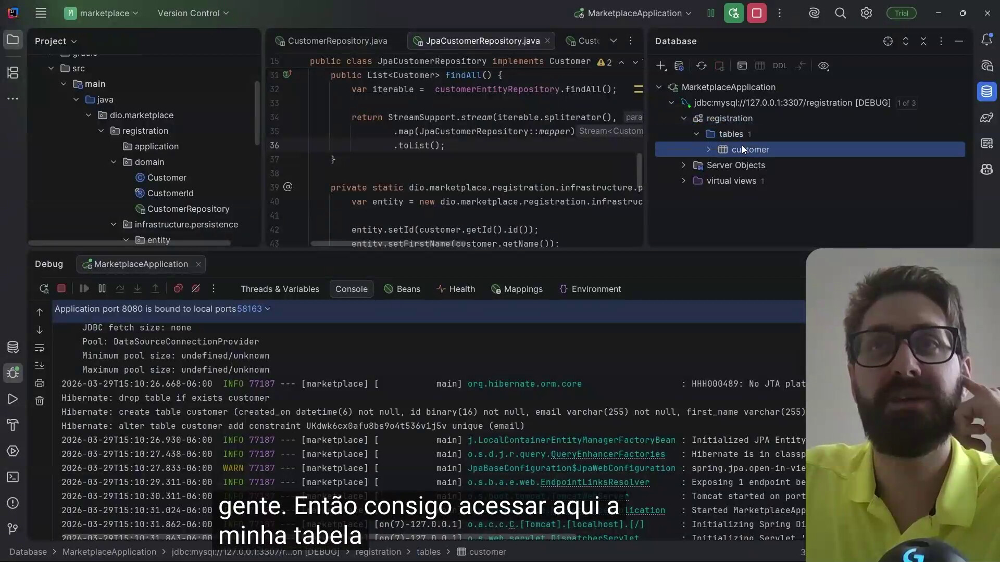
</p>

Com a aplicação em execução e já conectada ao banco, o painel **Database** do IntelliJ permite acessar diretamente a tabela `customer` criada pelo Hibernate, confirmando visualmente a estrutura persistida — com colunas como `id` (binário), `email`, `first_name`, `last_name` e `created_on`. Com o `save` e o `findAll` implementados, além de tudo o que o `CrudRepository` já disponibiliza por padrão, a conexão entre a API e o banco de dados através do Spring Data está funcionando de ponta a ponta.
   
#### Material de Apoio Até Esta Etapa

- Arquivos do projeto nesta etapa: [./000-Midia_e_Anexos/marketplace_ate_o_video_02.zip](./000-Midia_e_Anexos/etapas_do_codigo/marketplace_ate_o_video_02.zip)
- [001-Tutorial_Marketplace_Java_Spring_Data_Videos01a02](./001-Tutorial_Marketplace_Java_Spring_Data_Videos01a02.md)

### 🟩 Vídeo 03 - Criando a API REST para Customers

<video width="60%" controls>
  <source src="000-Midia_e_Anexos/bootcamp_ntt_data_java_spring_ai-modulo.04-curso.02-video_03.webm" type="video/webm">
    Seu navegador não suporta vídeo HTML5.
</video>

link do vídeo: https://web.dio.me/track/ntt-data-2026-ai-java-back-end/course/conectando-sua-api-com-banco-de-dados-atraves-do-spring-data/learning/cccb92aa-2e9e-429d-8d8a-ba56939b4599?autoplay=1

### Anotações

#### Abertura da aula: conectando a API ao banco com Spring Data

<p align="center">
  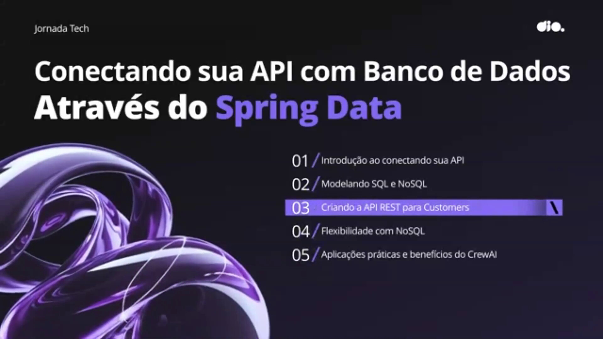
</p>

Slide de abertura da Jornada Tech, apresentando o tema da aula: **"Conectando sua API com Banco de Dados Através do Spring Data"**. O sumário à direita mostra o roteiro do módulo, com destaque para o tópico atual, **"Criando a API REST para Customers"**, que é exatamente o assunto desenvolvido a partir daqui: expor a camada de persistência já construída (entidade `Customer` e repositório) como uma API RESTful usando os recursos do Spring Data.

#### Adicionando a dependência do Spring Data REST

<p align="center">
  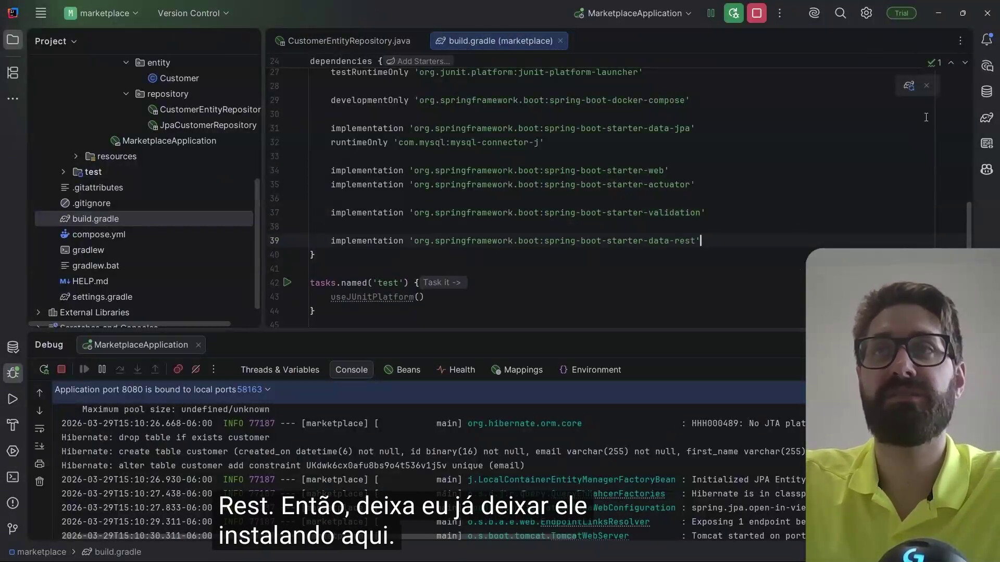
</p>

Nesta etapa, o `build.gradle` do projeto **marketplace** está sendo editado para incluir a dependência responsável por expor repositórios como endpoints REST automaticamente:

```groovy
dependencies {
    testRuntimeOnly 'org.junit.platform:junit-platform-launcher'

    developmentOnly 'org.springframework.boot:spring-boot-docker-compose'

    implementation 'org.springframework.boot:spring-boot-starter-data-jpa'
    runtimeOnly 'com.mysql:mysql-connector-j'

    implementation 'org.springframework.boot:spring-boot-starter-web'
    implementation 'org.springframework.boot:spring-boot-starter-actuator'

    implementation 'org.springframework.boot:spring-boot-starter-validation'

    implementation 'org.springframework.boot:spring-boot-starter-data-rest'
}
```

A última linha, `spring-boot-starter-data-rest`, é a novidade: ela habilita o **Spring Data REST**, biblioteca que transforma repositórios `CrudRepository` em controllers REST sem a necessidade de escrever manualmente controller, service ou use case.

#### Anotando o repositório com @RepositoryRestResource

<p align="center">
  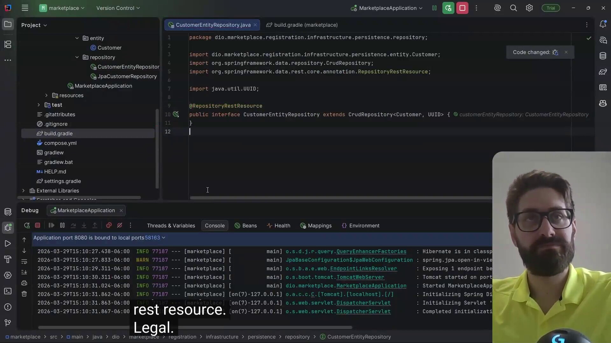
</p>

Com a dependência instalada, basta uma anotação no repositório para expor todo o CRUD como API:

```java
package dio.marketplace.registration.infrastructure.persistence.repository;

import dio.marketplace.registration.infrastructure.persistence.entity.Customer;
import org.springframework.data.repository.CrudRepository;
import org.springframework.data.rest.core.annotation.RepositoryRestResource;

import java.util.UUID;

@RepositoryRestResource
public interface CustomerEntityRepository extends CrudRepository<Customer, UUID> {
}
```

A anotação `@RepositoryRestResource` informa ao Spring que aquele repositório deve ser tratado como um controller REST, expondo automaticamente as operações do `CrudRepository` (criar, buscar, atualizar e remover) como endpoints HTTP.

#### Reiniciando a aplicação com o novo recurso REST

<p align="center">
  
</p>

Log de inicialização do Spring Boot após a alteração. A aplicação sobe normalmente, confirmando que a anotação `@RepositoryRestResource` foi aplicada sem erros e que o novo endpoint REST já está disponível para uso.

#### Estendendo o repositório com PagingAndSortingRepository

<p align="center">
  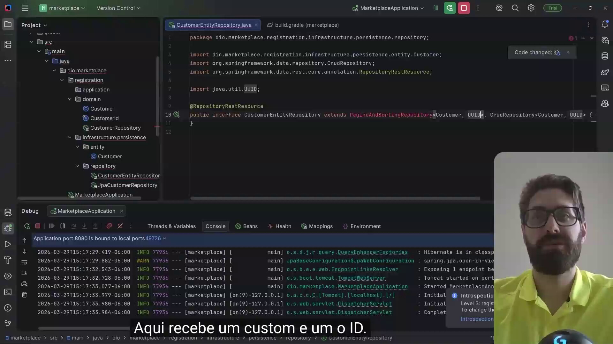
</p>

O repositório está sendo estendido para herdar também de `PagingAndSortingRepository<Customer, UUID>`, que recebe como parâmetros o tipo da entidade (`Customer`) e o tipo do identificador (`UUID`):

```java
@RepositoryRestResource
public interface CustomerEntityRepository extends
        PagingAndSortingRepository<Customer, UUID>,
        CrudRepository<Customer, UUID> {
}
```

Essa interface adiciona à API recursos de **paginação** e **ordenação** além do CRUD já disponibilizado pelo `CrudRepository`.

#### Import do PagingAndSortingRepository adicionado

<p align="center">
  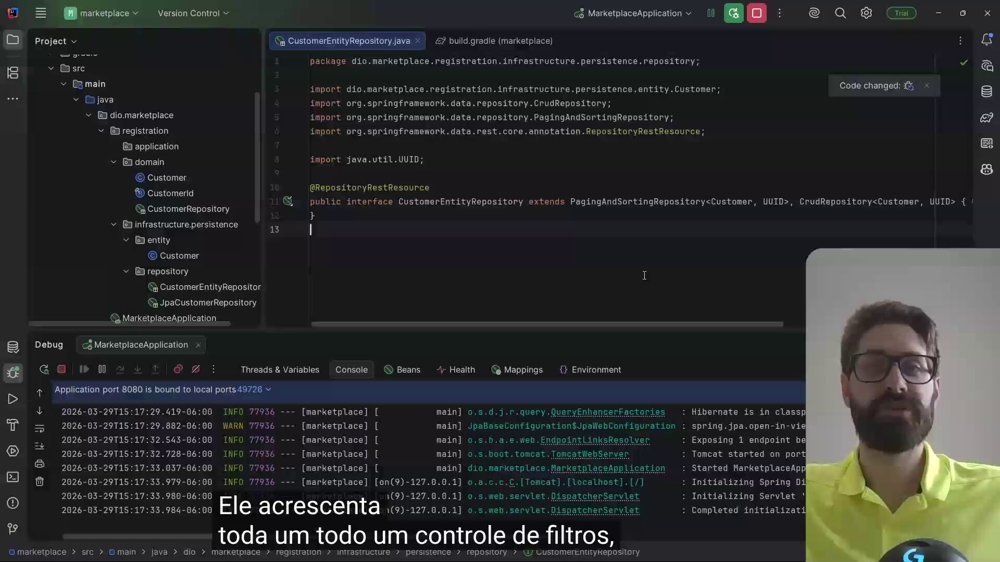
</p>

Após a IDE sugerir e completar o import necessário, o repositório fica assim:

```java
package dio.marketplace.registration.infrastructure.persistence.repository;

import dio.marketplace.registration.infrastructure.persistence.entity.Customer;
import org.springframework.data.repository.CrudRepository;
import org.springframework.data.repository.PagingAndSortingRepository;
import org.springframework.data.rest.core.annotation.RepositoryRestResource;

import java.util.UUID;

@RepositoryRestResource
public interface CustomerEntityRepository extends
        PagingAndSortingRepository<Customer, UUID>,
        CrudRepository<Customer, UUID> {
}
```

Com essa combinação, a API de customers passa a suportar filtros de **página**, **tamanho de página** e **ordenação** automaticamente.

#### Abrindo o HTTP Client da IDE

<p align="center">
  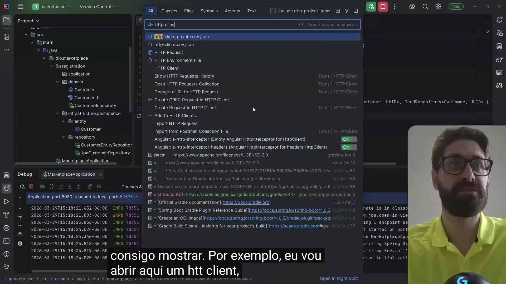
</p>

Para testar a API recém-exposta, a busca rápida da IDE (*Search Everywhere*) é usada para localizar a ferramenta **HTTP Client**, que permite montar e disparar requisições HTTP diretamente do ambiente de desenvolvimento, sem depender de uma ferramenta externa como Postman ou Insomnia.

#### Criando uma nova requisição no HTTP Client

<p align="center">
  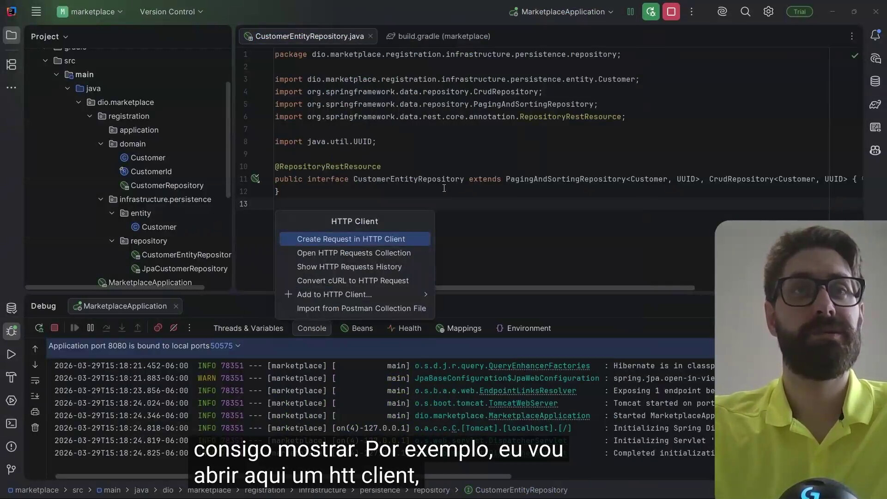
</p>

Menu de contexto do HTTP Client sendo aberto, com a opção **"Create Request in HTTP Client"** selecionada. A partir daqui será criado um arquivo `.http` para montar a primeira requisição de teste contra a API que acabou de ser exposta pelo Spring Data REST.

#### Primeira requisição GET na raiz da API

<p align="center">
  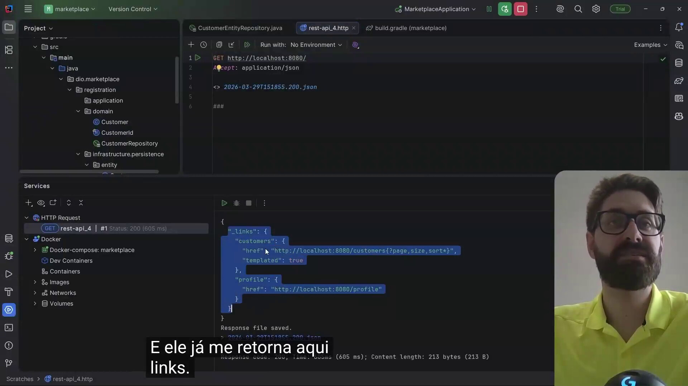
</p>

Requisição `GET` feita para a raiz da aplicação:

```http
GET http://localhost:8080/
Accept: application/json
```

A resposta já demonstra o padrão **HATEOAS** (Hypermedia as the Engine of Application State):

```json
{
  "_links": {
    "customers": {
      "href": "http://localhost:8080/customers{?page,size,sort*}",
      "templated": true
    },
    "profile": {
      "href": "http://localhost:8080/profile"
    }
  }
}
```

Ou seja, ao acessar a raiz da API, o próprio Spring Data REST devolve **links** apontando para os recursos disponíveis — nesse caso, `customers` (com suporte a paginação/ordenação via template) e `profile`.

#### Explorando o link de profile

<p align="center">
  
</p>

Seguindo o link `profile` retornado anteriormente, uma nova requisição é feita:

```http
GET http://localhost:8080/profile
Accept: application/json
```

Resposta:

```json
{
  "_links": {
    "self": {
      "href": "http://localhost:8080/profile"
    },
    "customers": {
      "href": "http://localhost:8080/profile/customers"
    }
  }
}
```

O `profile` funciona como uma porta de entrada para a documentação de cada recurso exposto pela API — nesse caso, aponta para o profile específico de `customers`.

#### Detalhes do profile de customers

<p align="center">
  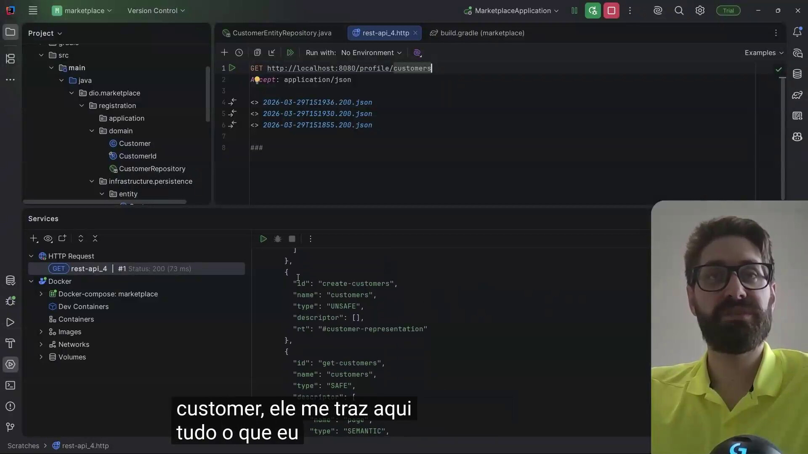
</p>

Acessando `http://localhost:8080/profile/customers`, a API retorna metadados detalhados sobre as operações disponíveis para o recurso `customers`, como `create-customers` (tipo `UNSAFE`, ou seja, uma operação que modifica dados) e `get-customers` (tipo `SAFE`, apenas leitura), incluindo os descritores de cada campo aceito, como o parâmetro `page`. Essas informações descrevem exatamente o que é necessário enviar para criar ou consultar um customer, funcionando como uma documentação viva da API.

#### Adicionando o HAL Explorer

<p align="center">
  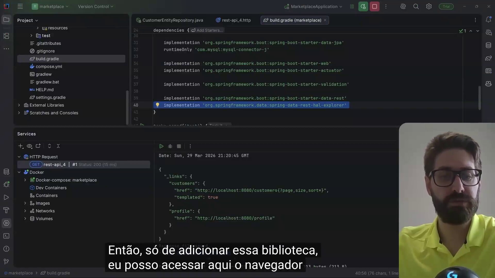
</p>

Uma nova dependência é incluída no `build.gradle`:

```groovy
implementation 'org.springframework.data:spring-data-rest-hal-explorer'
```

O **HAL** (Hypertext Application Language) é o formato de resposta usado pelo Spring Data REST, visível nos JSONs anteriores por meio do campo `_links`. O **HAL Explorer** é uma interface web que sabe interpretar esse formato e permite navegar visualmente por toda a API, sem precisar montar cada requisição manualmente.

#### Navegando pela API com o HAL Explorer

<p align="center">
  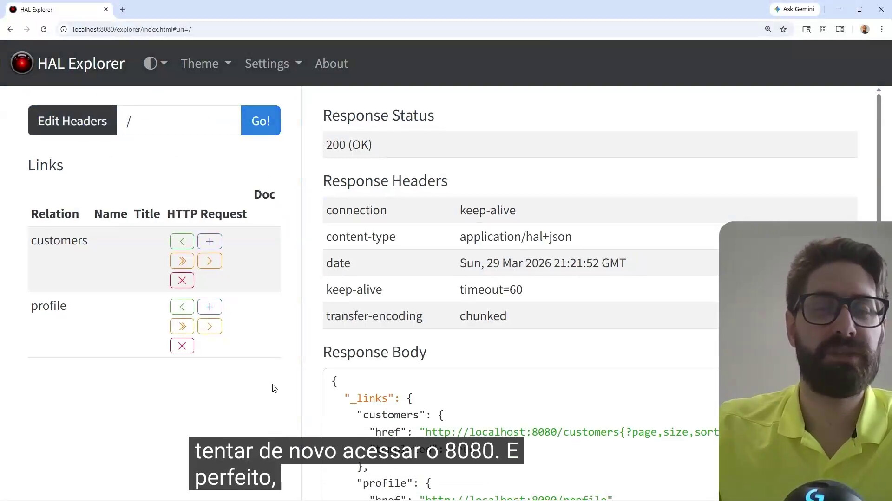
</p>

Com a dependência adicionada, acessar `http://localhost:8080` no navegador agora abre a interface do **HAL Explorer**. Ela lista automaticamente os links disponíveis na raiz da API — `customers` e `profile` — e exibe ao lado o status da resposta, os headers e o corpo JSON retornado, oferecendo uma forma visual e interativa de explorar os mesmos recursos vistos anteriormente pelo HTTP Client.

#### Montando uma requisição GET pelo HAL Explorer

<p align="center">
  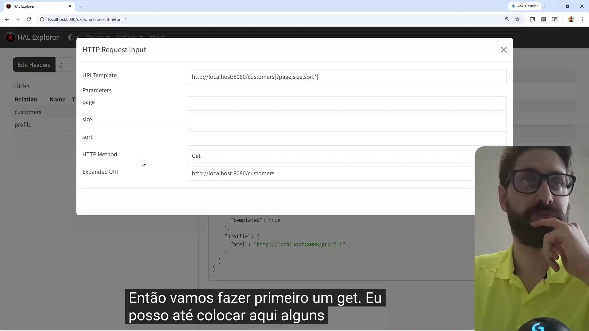
</p>

Ao clicar no link `customers`, o HAL Explorer abre um formulário de **HTTP Request Input** baseado no URI Template retornado pela API (`http://localhost:8080/customers{?page,size,sort*}`), com campos para preencher os parâmetros `page`, `size` e `sort`. Não preenchendo nada, o método HTTP é `GET` e a URL expandida (*Expanded URI*) resultante é simplesmente `http://localhost:8080/customers`.

#### Resposta da listagem de customers (ainda vazia)

<p align="center">
  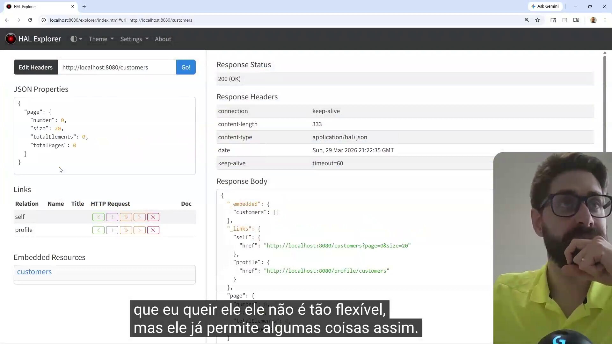
</p>

O `GET` em `/customers` retorna:

```json
{
  "_embedded": {
    "customers": []
  },
  "_links": {
    "self": {
      "href": "http://localhost:8080/customers?page=0&size=20"
    },
    "profile": {
      "href": "http://localhost:8080/profile/customers"
    }
  },
  "page": {
    "number": 0,
    "size": 20,
    "totalElements": 0,
    "totalPages": 0
  }
}
```

A lista de customers ainda está vazia, mas já é possível ver a estrutura padrão de resposta paginada do Spring Data REST: recursos embutidos em `_embedded`, links de navegação em `_links` e metadados de paginação em `page`. O formulário do HAL Explorer não é totalmente flexível, mas já permite montar boa parte dessas requisições.

#### A mesma consulta feita pelo HTTP Client

<p align="center">
  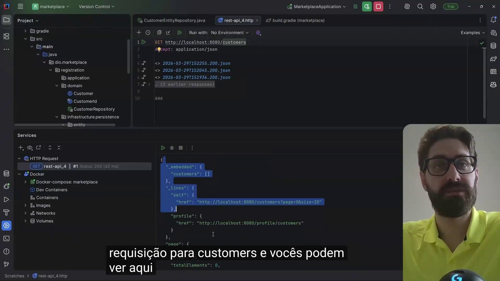
</p>

De volta ao HTTP Client da IDE, a mesma requisição é repetida:

```http
GET http://localhost:8080/customers
Accept: application/json
```

E a resposta confirma a mesma estrutura vista no HAL Explorer — `_embedded.customers` vazio, `_links` com `self` apontando para `customers?page=0&size=20`, e o bloco `page` com os metadados de paginação.

#### Criando o primeiro customer via HAL Explorer

<p align="center">
  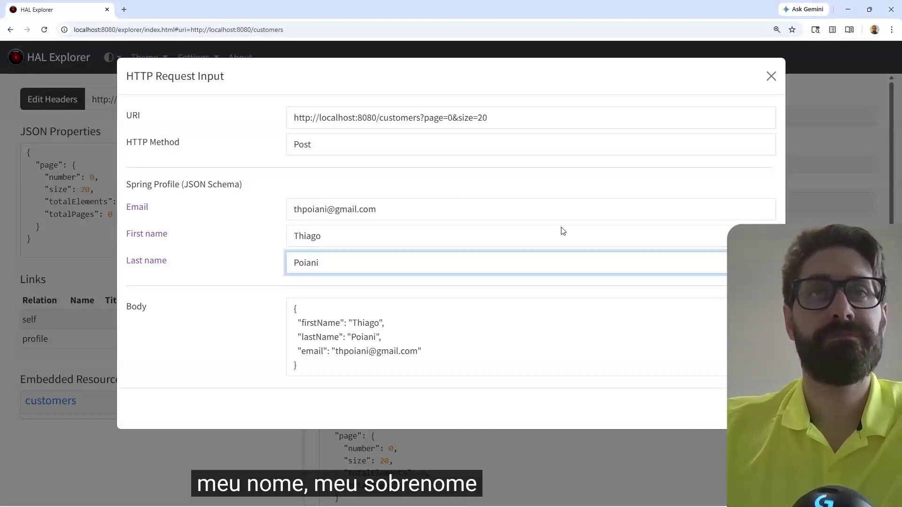
</p>

Ainda no HAL Explorer, ao avançar para o link de criação, é montado um `POST` com base no *JSON Schema* do profile de customers. O formulário apresenta campos para `Email`, `First name` e `Last name`, gerando o corpo da requisição:

```json
{
  "firstName": "Thiago",
  "lastName": "Poiani",
  "email": "thpoiani@gmail.com"
}
```

Esse é o primeiro teste de criação de um customer através da API recém-exposta.

#### Erro ao persistir sem ID definido

<p align="center">
  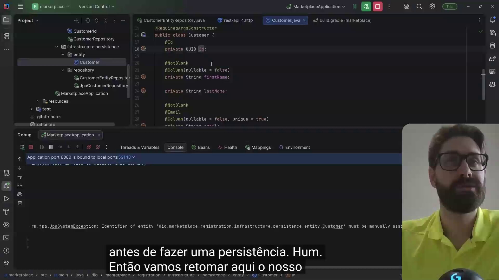
</p>

Ao tentar enviar o `POST` acima, a aplicação retorna um erro. Voltando ao código da entidade `Customer`, o problema fica claro: o campo `id` é do tipo `UUID` e está anotado apenas com `@Id`, sem nenhuma estratégia de geração automática:

```java
@RequiredArgsConstructor
public class Customer {
    @Id
    private UUID id;

    @NotBlank
    @Column(nullable = false)
    private String firstName;

    private String lastName;

    @NotBlank
    @Email
    @Column(nullable = false, unique = true)
    private String email;
```

O erro reportado no console é claro:

```
org.hibernate.jpa.JpaSystemException: Identifier of entity 'dio.marketplace.registration.infrastructure.persistence.entity.Customer' must be manually assigned...
```

Ou seja, o Hibernate exige que o identificador seja definido manualmente antes da persistência, já que não há nenhuma estratégia de geração (`@GeneratedValue`) configurada.

#### Gerando o ID manualmente com @PrePersist

<p align="center">
  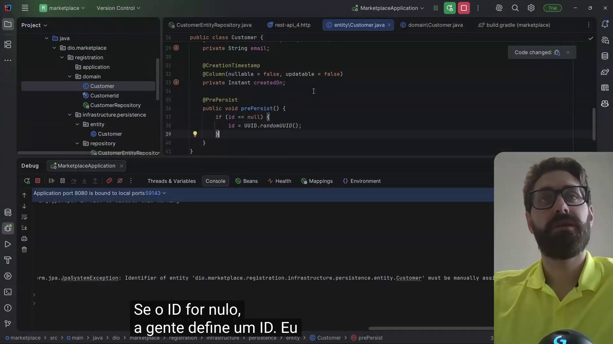
</p>

A solução aplicada na entidade `Customer` é criar o ID manualmente antes da persistência, usando o hook de ciclo de vida `@PrePersist`:

```java
public class Customer {
    private String email;

    @CreationTimestamp
    @Column(nullable = false, updatable = false)
    private Instant createdOn;

    @PrePersist
    public void prePersist() {
        if (id == null) {
            id = UUID.randomUUID();
        }
    }
}
```

O método `prePersist()` verifica se o `id` ainda é nulo e, se for, gera um novo `UUID` aleatório. Essa abordagem foi escolhida no lugar da anotação `@GeneratedValue` porque dá mais controle para, futuramente, manipular a geração do ID junto com regras de negócio.

#### Ajustando o application.properties

<p align="center">
  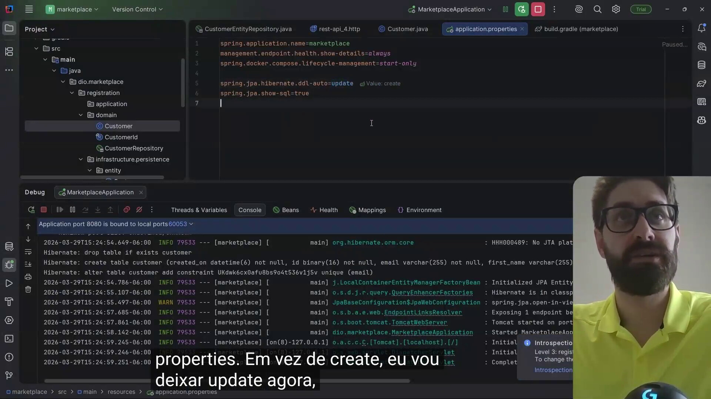
</p>

Antes de repetir a criação do customer, o `application.properties` é ajustado:

```properties
spring.application.name=marketplace
management.endpoint.health.show-details=always
spring.docker.compose.lifecycle-management=start-only

spring.jpa.hibernate.ddl-auto=update
spring.jpa.show-sql=true
```

A propriedade `spring.jpa.hibernate.ddl-auto` é alterada de `create` para `update`. Com `create`, o schema do banco seria recriado do zero a cada subida da aplicação, apagando os dados existentes; com `update`, os dados são preservados e o schema só é alterado quando necessário.

#### Repetindo a criação do customer

<p align="center">
  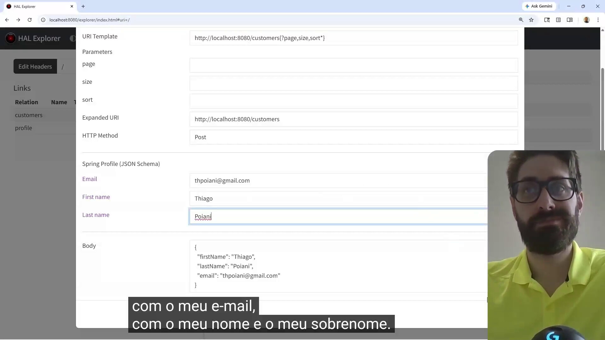
</p>

Com o ID sendo gerado corretamente, a requisição de criação é refeita pelo HAL Explorer, preenchendo novamente o formulário do `POST` com e-mail, nome e sobrenome (`thpoiani@gmail.com`, `Thiago`, `Poiani`), gerando o mesmo corpo JSON de antes.

#### Customer criado com sucesso (201 Created)

<p align="center">
  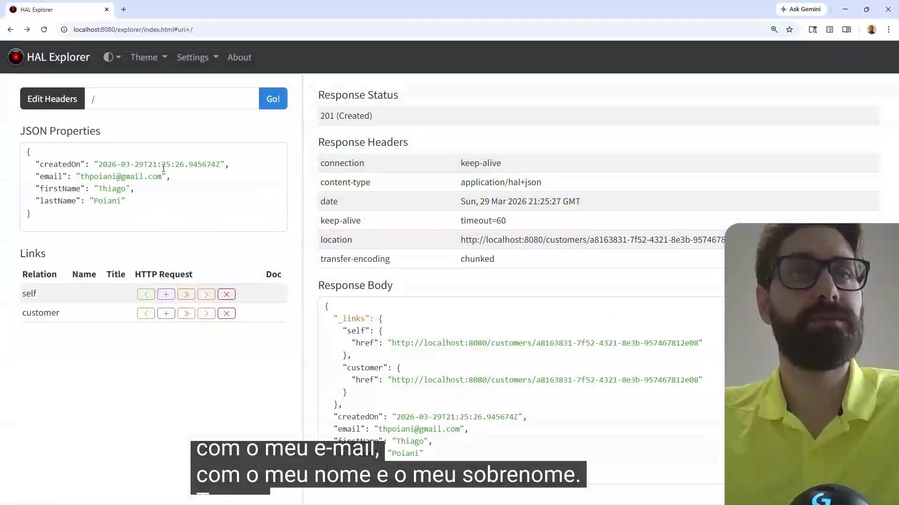
</p>

Desta vez a resposta é um **201 (Created)**, confirmando a persistência:

```json
{
  "_links": {
    "self": {
      "href": "http://localhost:8080/customers/a8163831-7f52-4321-8e3b-957467812e08"
    },
    "customer": {
      "href": "http://localhost:8080/customers/a8163831-7f52-4321-8e3b-957467812e08"
    }
  },
  "createdOn": "2026-03-29T21:25:26.945674Z",
  "email": "thpoiani@gmail.com",
  "firstName": "Thiago",
  "lastName": "Poiani"
}
```

Além dos dados enviados, a resposta já traz o `createdOn`, preenchido automaticamente pelo Hibernate, e os links `self`/`customer` apontando para a URL específica desse novo registro.

#### Confirmando a persistência direto no banco

<p align="center">
  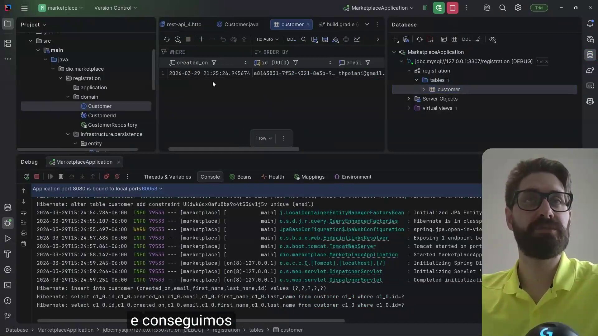
</p>

Para validar que o registro realmente foi salvo, a tabela `customer` é consultada diretamente no banco de dados através do plugin de banco da IDE. A linha criada aparece com os valores de `created_on`, `id` (UUID) e `email` correspondentes exatamente aos dados enviados na requisição anterior, confirmando que a API REST está persistindo corretamente os dados através do Spring Data.

#### Testando a exclusão de um customer

<p align="center">
  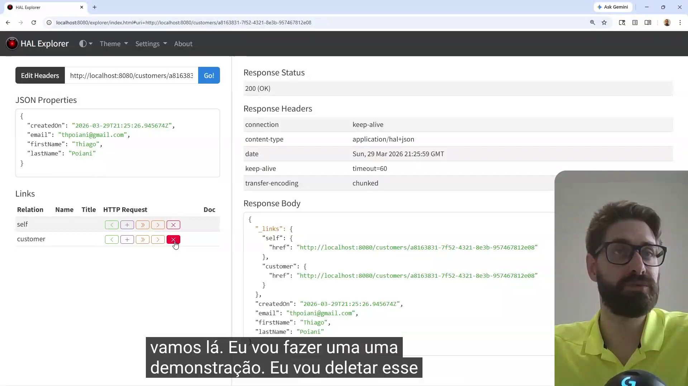
</p>

Ainda no HAL Explorer, acessando o customer recém-criado, é feita uma demonstração do método `DELETE`, clicando no botão vermelho de exclusão (X) ao lado do link `customer`.

#### Confirmando que o DELETE funcionou

<p align="center">
  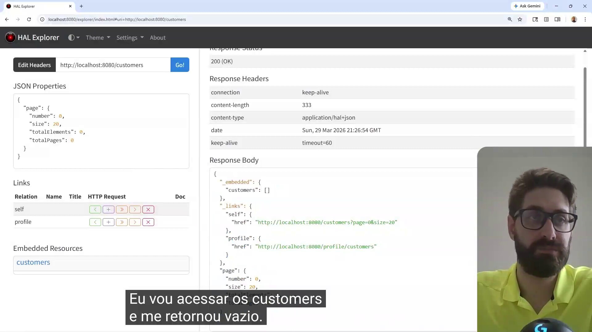
</p>

Após o `DELETE`, uma nova consulta a `GET /customers` retorna a lista novamente vazia (`_embedded.customers: []`), confirmando que a exclusão funcionou corretamente e que o Spring Data REST expõe, por padrão, também a operação de remoção sem nenhuma configuração adicional.

#### Restringindo o método deleteById

<p align="center">
  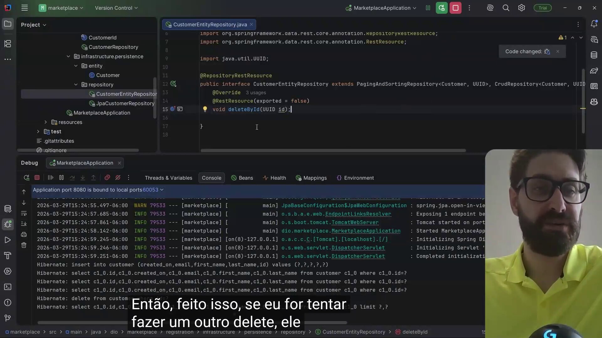
</p>

Para impedir que o `DELETE` continue exposto publicamente, o repositório é ajustado sobrescrevendo o método `deleteById`, herdado do `CrudRepository`, e desativando sua exposição via REST:

```java
@Override
@RestResource(exported = false)
void deleteById(UUID id);
```

A anotação `@RestResource(exported = false)` remove especificamente esse método do conjunto de endpoints disponibilizados pela API, mesmo que ele continue funcionando internamente.

#### Adicionando uma consulta por nome (query method)

<p align="center">
  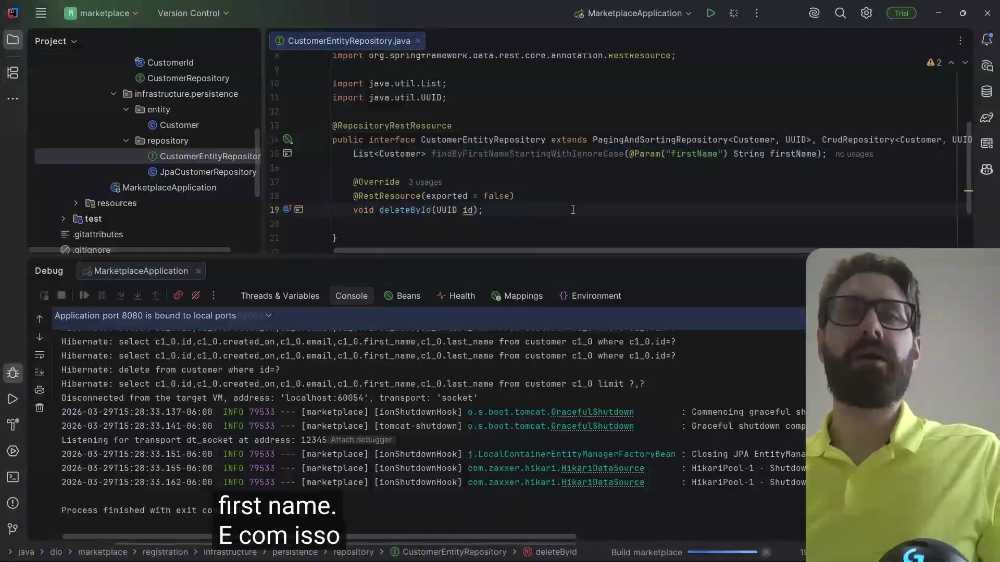
</p>

Depois de restringir o delete, uma nova consulta é adicionada ao repositório usando a convenção de nomenclatura do Spring Data:

```java
@RepositoryRestResource
public interface CustomerEntityRepository extends
        PagingAndSortingRepository<Customer, UUID>,
        CrudRepository<Customer, UUID> {

    List<Customer> findByFirstNameStartingWithIgnoreCase(@Param("firstName") String firstName);

    @Override
    @RestResource(exported = false)
    void deleteById(UUID id);
}
```

O método `findByFirstNameStartingWithIgnoreCase` é implementado automaticamente pelo Spring Data e pelo Hibernate apenas a partir do nome do método — não é preciso escrever nenhuma implementação manual. O parâmetro `firstName` é exposto via `@Param` para ser usado na busca por meio da API.

#### Criando customers dinamicamente com timestamp

<p align="center">
  
</p>

Para popular a base com vários registros de teste, uma nova requisição é criada no arquivo `rest-api_5.http`, usando a variável dinâmica `{{$timestamp}}` para gerar valores diferentes a cada envio:

```http
POST http://localhost:8080/customers
Accept: application/json

{
  "firstName":"{{$timestamp}}",
  "email":"{{$timestamp}}@email.com"
}

```

Cada execução dessa requisição cria um customer novo, com `firstName` e `email` baseados no timestamp atual.

#### Múltiplos customers criados em sequência

<p align="center">
  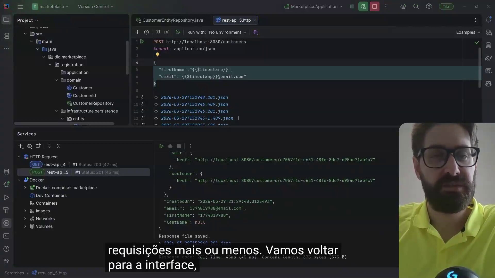
</p>

A requisição anterior é disparada várias vezes seguidas (cerca de dez execuções), cada uma gerando um novo customer com um timestamp diferente como `firstName` e `email`. O painel de histórico de respostas, à esquerda, acumula o resultado de cada chamada `POST` feita, todas retornando `201 Created`.

#### Listagem com todos os customers criados

<p align="center">
  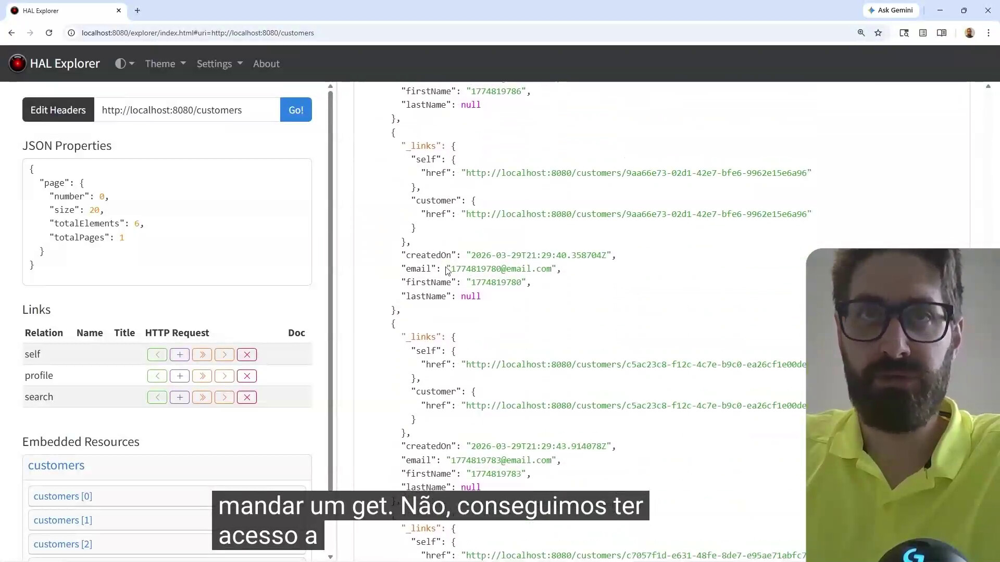
</p>

Voltando ao HAL Explorer e executando um `GET` em `/customers`, agora a resposta traz seis elementos na coleção (`totalElements: 6`), cada um representando um dos customers criados com timestamps diferentes. A resposta também já expõe um novo link, `search`, além dos já conhecidos `self` e `profile`.

#### Descobrindo o endpoint de busca

<p align="center">
  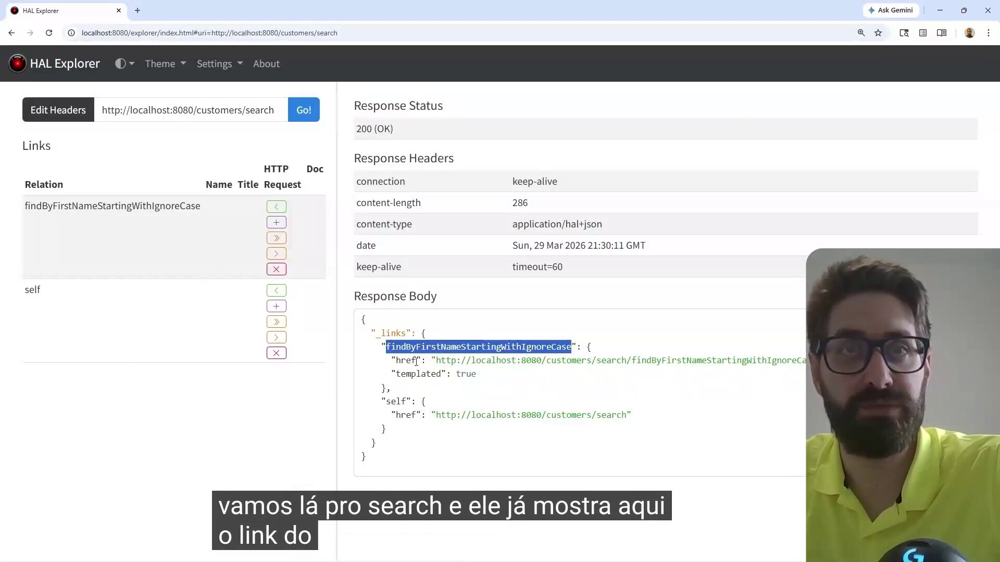
</p>

Seguindo o link `search`, a API retorna os endpoints de consulta disponíveis:

```json
{
  "_links": {
    "findByFirstNameStartingWithIgnoreCase": {
      "href": "http://localhost:8080/customers/search/findByFirstNameStartingWithIgnoreCase{?firstName}",
      "templated": true
    },
    "self": {
      "href": "http://localhost:8080/customers/search"
    }
  }
}
```

Esse link corresponde exatamente ao query method `findByFirstNameStartingWithIgnoreCase` criado anteriormente no repositório — o Spring Data REST expõe automaticamente as consultas personalizadas do repositório como endpoints de busca.

#### Acionando a busca por firstName

<p align="center">
  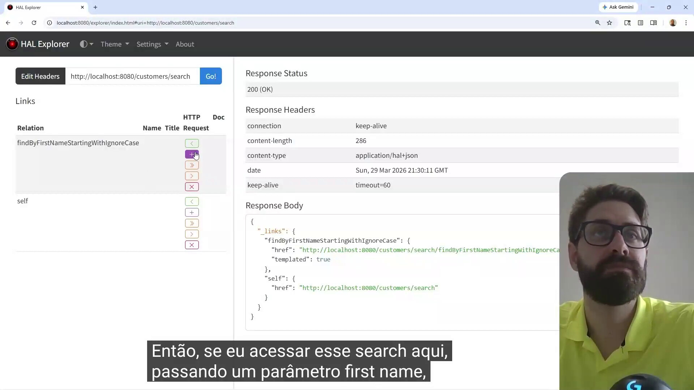
</p>

Ao clicar no botão de adicionar parâmetro (`+`) do link `findByFirstNameStartingWithIgnoreCase`, o HAL Explorer abre um formulário para informar o valor do parâmetro `firstName`, que será usado para filtrar os customers cujo nome começa com o texto informado (ignorando maiúsculas/minúsculas).

#### Preenchendo o parâmetro de busca

<p align="center">
  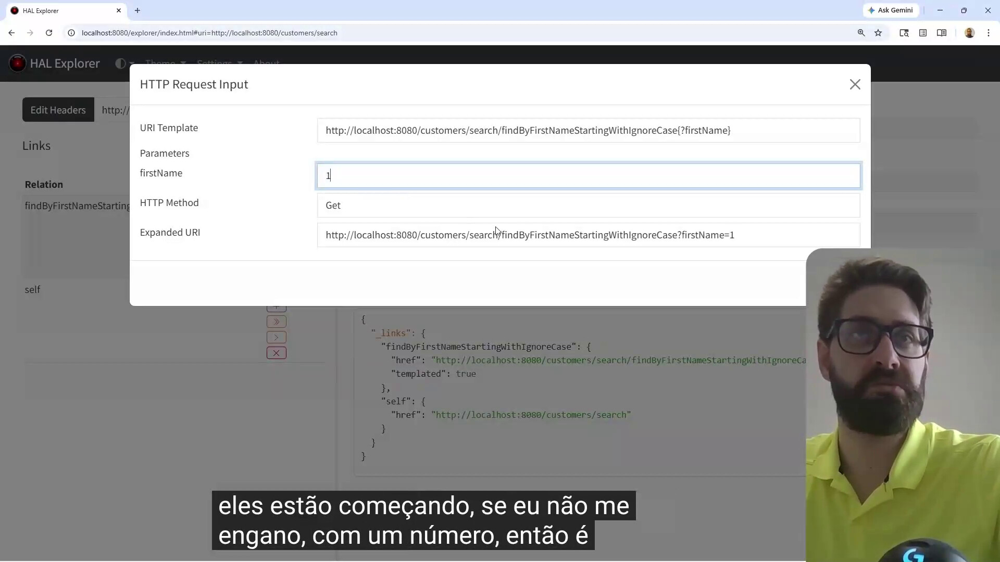
</p>

Como os nomes dos customers de teste foram gerados a partir de timestamps (números), o valor `1` é informado no campo `firstName`. O formulário mostra a URI expandida resultante:

```
http://localhost:8080/customers/search/findByFirstNameStartingWithIgnoreCase?firstName=1
```

#### Resultado da busca por customers cujo nome começa com "1"

<p align="center">
  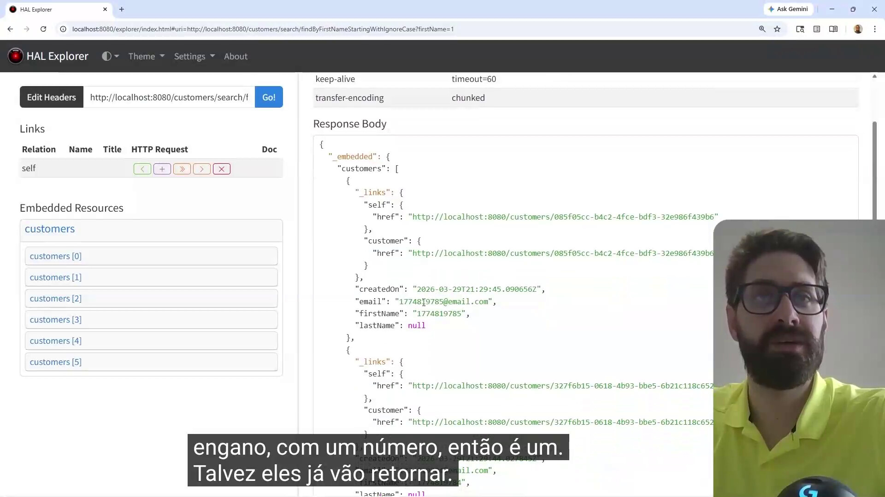
</p>

A busca retorna, dentro de `_embedded.customers`, todos os registros cujo `firstName` começa com `1` — já que os nomes de teste são timestamps numéricos, vários resultados aparecem na lista (`customers [0]` a `customers [5]`).

#### Selecionando um customer para nova tentativa de exclusão

<p align="center">
  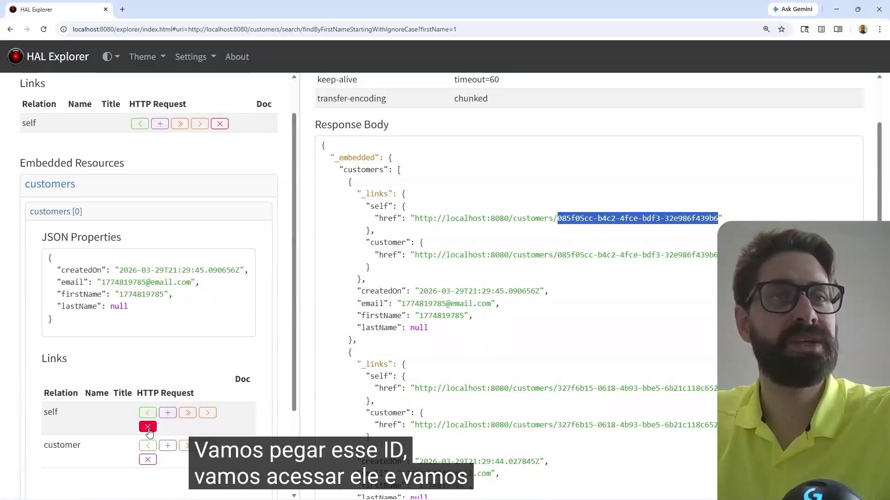
</p>

Um dos IDs retornados pela busca é selecionado (`085f05cc-b4c2-4fce-bdf3-32e986f439b6`) para acessar diretamente aquele customer e, em seguida, tentar excluí-lo pelo botão de delete (X) — desta vez testando o efeito da restrição aplicada anteriormente no repositório.

#### Confirmando que o DELETE está bloqueado

<p align="center">
  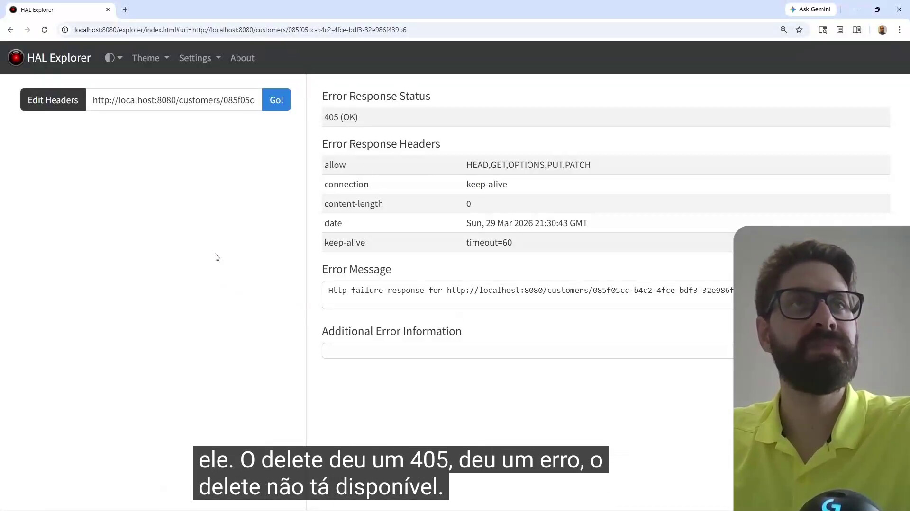
</p>

A tentativa de exclusão agora retorna um erro **405**, com o header `allow` informando apenas os métodos permitidos: `HEAD, GET, OPTIONS, PUT, PATCH`. Isso confirma que a anotação `@RestResource(exported = false)` aplicada ao `deleteById` funcionou: o método continua existindo internamente, mas deixou de estar disponível como operação da API.

#### Os seis customers continuam disponíveis

<p align="center">
  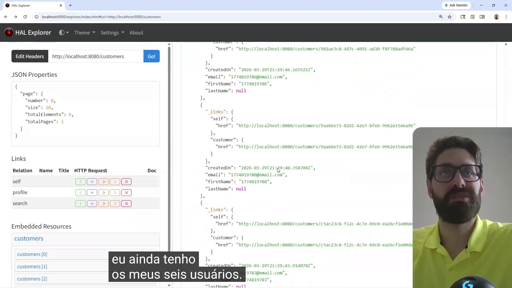
</p>

Voltando à listagem geral de `/customers`, os seis usuários criados anteriormente continuam presentes, confirmando que nenhum deles foi removido após a tentativa de `DELETE` bloqueada.

#### Atualizando um customer com PATCH

<p align="center">
  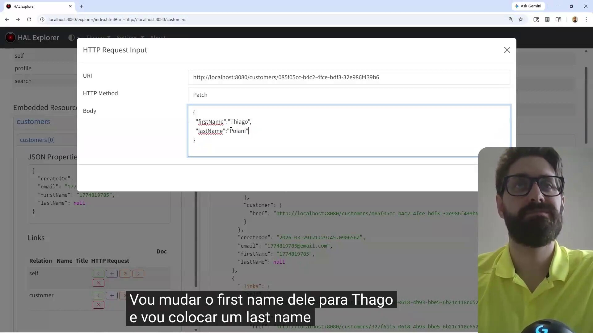
</p>

Um novo teste é feito, desta vez com o método `PATCH`, alterando os dados de um dos customers criados:

```json
{
  "firstName":"Thiago",
  "lastName":"Poiani"
}
```

O `PATCH` permite atualizar apenas os campos informados, sem a necessidade de reenviar o objeto completo.

#### Customer atualizado com sucesso

<p align="center">
  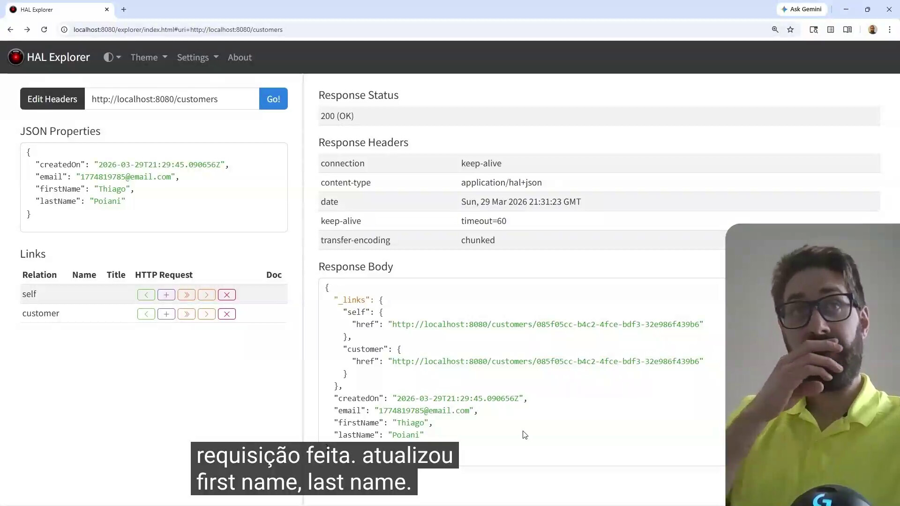
</p>

A resposta confirma a atualização: `firstName` e `lastName` agora aparecem como `Thiago` e `Poiani`, enquanto os demais campos (como `email` e `createdOn`) permanecem inalterados — exatamente o comportamento esperado de uma operação `PATCH`.

#### Criando a entidade Address

<p align="center">
  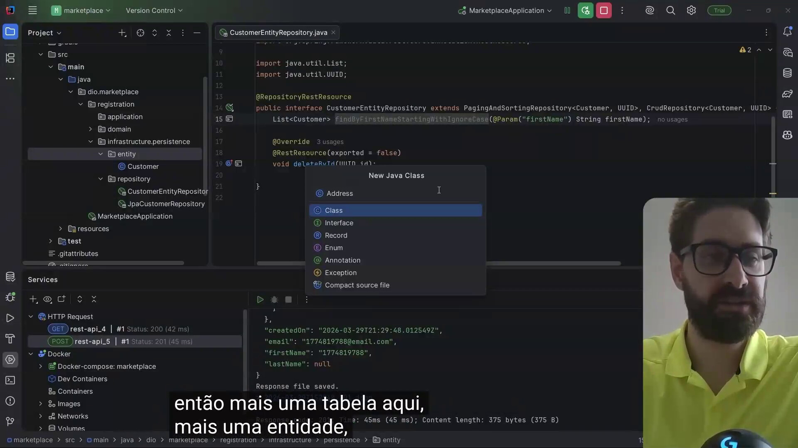
</p>

Para evoluir o modelo com uma integração de endereço, uma nova classe é criada dentro do pacote de entidades: `Address`. Essa nova entidade vai representar a tabela de endereços do customer.

#### Modelando a entidade Address

<p align="center">
  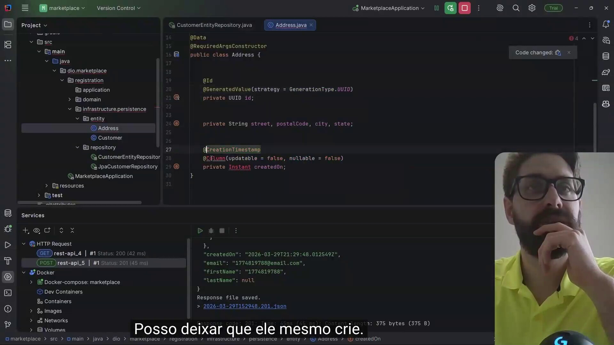
</p>

A entidade `Address` é implementada com Lombok e JPA:

```java
@Data
@RequiredArgsConstructor
public class Address {

    @Id
    @GeneratedValue(strategy = GenerationType.UUID)
    private UUID id;

    private String street, postalCode, city, state;

    @CreationTimestamp
    @Column(updatable = false, nullable = false)
    private Instant createdOn;
}
```

Diferente da entidade `Customer`, aqui o `id` usa `@GeneratedValue(strategy = GenerationType.UUID)`, deixando o próprio JPA responsável por gerar o identificador automaticamente — já que, para esse caso, não há necessidade de controlar manualmente essa geração.

#### Relacionando Customer e Address

<p align="center">
  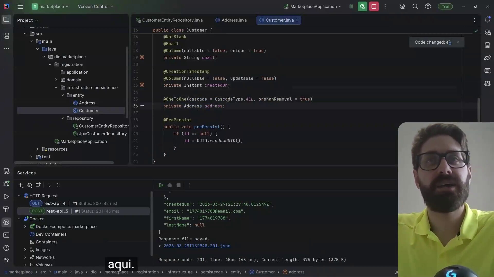
</p>

De volta à entidade `Customer`, é adicionado o mapeamento do relacionamento com `Address`:

```java
@OneToOne(cascade = CascadeType.ALL, orphanRemoval = true)
private Address address;
```

O relacionamento `@OneToOne` indica que cada customer possui um único endereço. O `cascade = CascadeType.ALL` propaga as operações de persistência (criar, atualizar, remover) do customer para o endereço associado, e `orphanRemoval = true` garante que, se o endereço for desvinculado do customer, ele seja removido do banco.

#### Duas tabelas no banco de dados

<p align="center">
  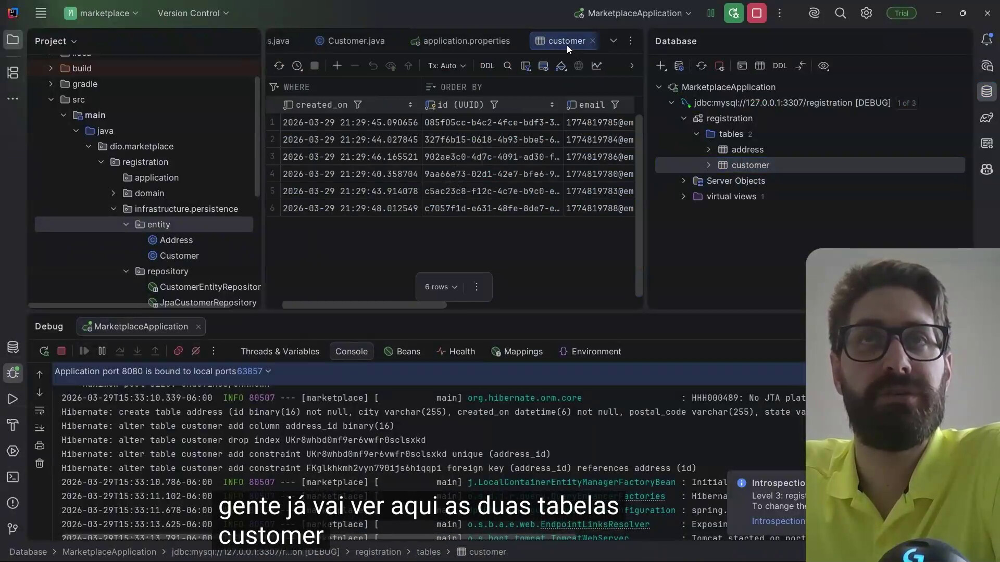
</p>

Ao subir a aplicação novamente, o Hibernate cria a nova estrutura de relacionamento no banco. Consultando a tabela `customer`, os seis registros criados anteriormente continuam lá, agora com uma coluna adicional referenciando o endereço.

#### Tabela address recém-criada

<p align="center">
  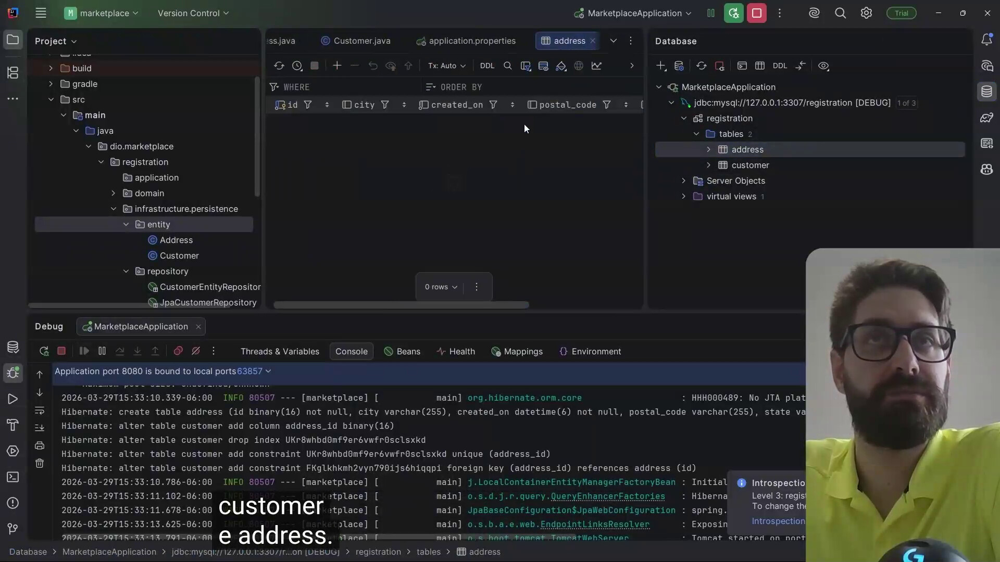
</p>

A nova tabela `address`, correspondente à entidade criada anteriormente, aparece no banco de dados ainda vazia (0 linhas), já que nenhum customer teve um endereço associado até este momento.

#### Address aparece como nulo na API

<p align="center">
  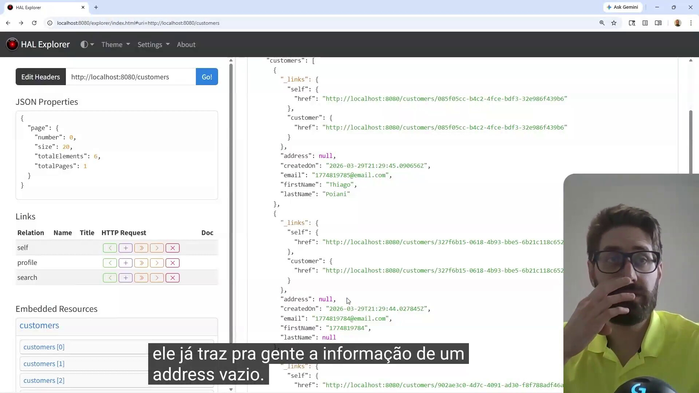
</p>

Consultando `/customers` no HAL Explorer, cada customer agora exibe um novo campo na resposta JSON: `"address": null`, refletindo o relacionamento `@OneToOne` recém-mapeado — como nenhum endereço foi associado ainda, o valor retornado é nulo.

#### Criando um customer com endereço

<p align="center">
  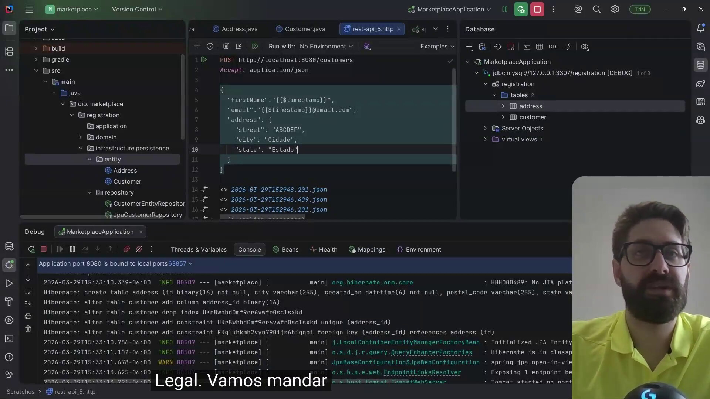
</p>

Uma nova requisição é montada no HTTP Client, desta vez incluindo um objeto `address` no corpo da requisição:

```http
POST http://localhost:8080/customers
Accept: application/json

{
  "firstName":"{{$timestamp}}",
  "email":"{{$timestamp}}@email.com",
  "address": {
    "street": "ABCDEF",
    "city": "Cidade",
    "state": "Estado"
  }
}
```

Apenas os campos `street`, `city` e `state` são preenchidos, deixando `postalCode` de fora.

#### Endereço persistido junto com o customer

<p align="center">
  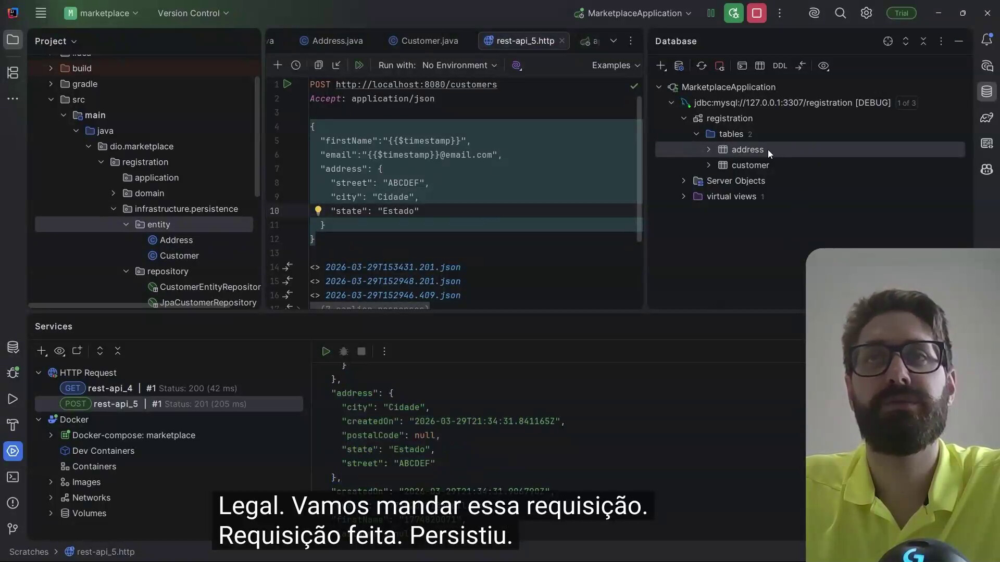
</p>

A requisição é enviada e retorna `201 Created`. O corpo da resposta já traz o objeto `address` completo, incluindo o `createdOn` gerado automaticamente e o `postalCode` como `null`, já que não foi informado. Isso confirma que o `cascade = CascadeType.ALL` está funcionando: ao salvar o customer, o endereço associado também é persistido automaticamente.

#### Confirmando o endereço no banco de dados

<p align="center">
  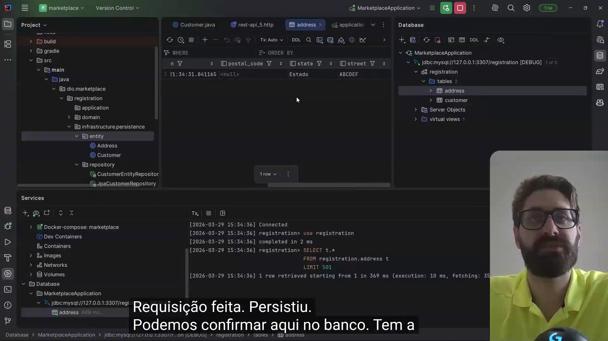
</p>

Consultando diretamente a tabela `address` no banco, agora aparece uma linha com os dados enviados (`state: Estado`, `street: ABCDEF`), confirmando no nível do banco que a persistência em cascata do relacionamento `Customer` → `Address` funcionou corretamente.

#### Criando uma projeção: CustomerExcerpt

<p align="center">
  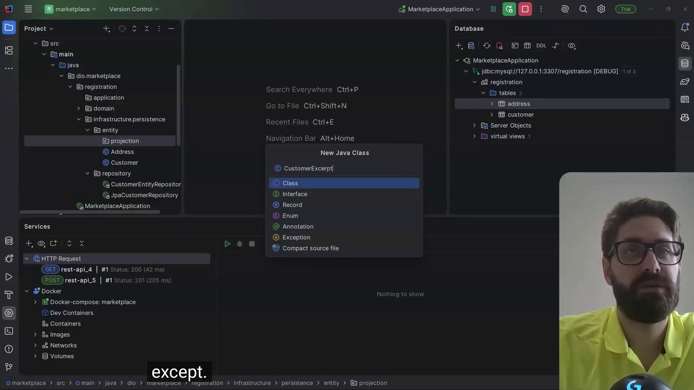
</p>

O Spring Data REST oferece outro recurso interessante: as **projeções**. Elas precisam ser criadas dentro (ou junto) do pacote da entidade — por isso uma nova classe, `CustomerExcerpt`, é criada dentro de um subpacote `projection` da entidade `Customer`.

#### Primeira versão da projeção CustomerExcerpt

<p align="center">
  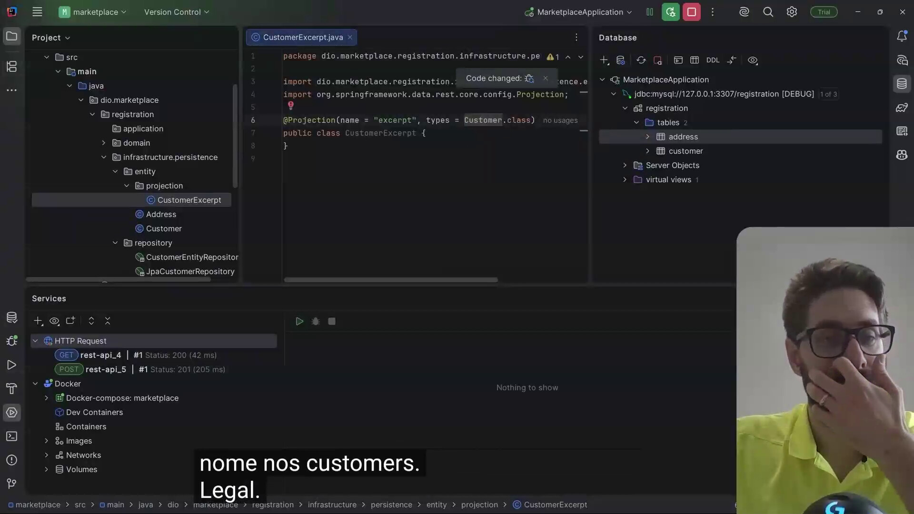
</p>

A classe é anotada com `@Projection`, associando-a à entidade `Customer` e dando a ela o nome `excerpt`:

```java
@Projection(name = "excerpt", types = Customer.class)
public class CustomerExcerpt {
}
```

Uma projeção é basicamente uma forma de esconder ou adicionar informações diferentes das que a entidade original expõe — útil, por exemplo, para simplificar a resposta da API em determinados contextos.

#### Transformando a projeção em interface

<p align="center">
  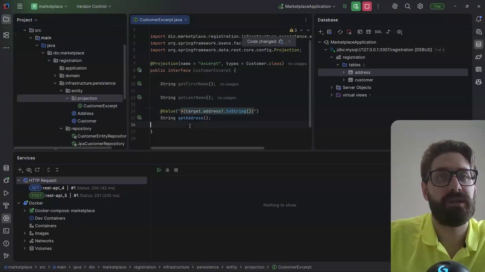
</p>

A classe é convertida para interface, com os métodos que definem quais campos a projeção deve expor:

```java
@Projection(name = "excerpt", types = Customer.class)
public interface CustomerExcerpt {

    String getFirstName();

    String getLastName();

    @Value("#{target.address?.toString()}")
    String getAddress();
}
```

Além de `getFirstName()` e `getLastName()`, que espelham diretamente os campos da entidade, o método `getAddress()` usa a anotação `@Value` com uma expressão SpEL para retornar o `toString()` do endereço do customer, em vez do objeto completo.

#### Implementando o toString() de Address

<p align="center">
  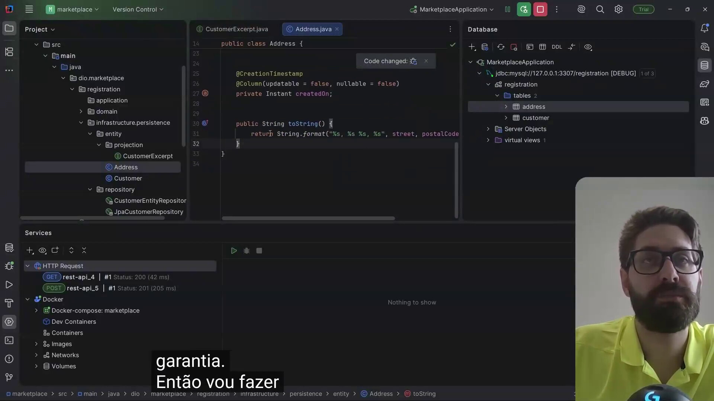
</p>

Para que a expressão da projeção funcione como esperado, um método `toString()` é adicionado manualmente à entidade `Address`:

```java
public String toString() {
    return String.format("%s, %s %s, %s", street, postalCode, city, state);
}
```

Embora o Lombok pudesse gerar um `toString()` automático, ele é implementado manualmente aqui para garantir o formato exato desejado na concatenação dos campos do endereço.

#### Resumindo o endereço em uma única string

<p align="center">
  
</p>

Com o `toString()` definido, a projeção `CustomerExcerpt` passa a retornar, no campo `address`, uma única string concatenada com os dados do endereço, em vez de todo o objeto `address` com suas propriedades separadas (`street`, `city`, `state`, `postalCode`, `createdOn`).

#### Aplicando a projeção como padrão do repositório

<p align="center">
  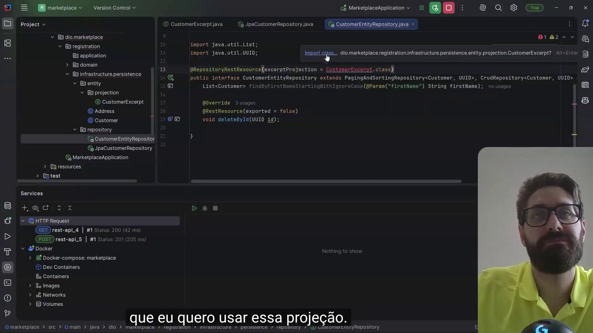
</p>

No repositório, a projeção é configurada como a projeção padrão de exibição (*excerpt projection*):

```java
@RepositoryRestResource(excerptProjection = CustomerExcerpt.class)
public interface CustomerEntityRepository extends
        PagingAndSortingRepository<Customer, UUID>,
        CrudRepository<Customer, UUID> {

    List<Customer> findByFirstNameStartingWithIgnoreCase(@Param("firstName") String firstName);

    @Override
    @RestResource(exported = false)
    void deleteById(UUID id);
}
```

O atributo `excerptProjection` informa ao Spring Data REST qual projeção deve ser usada automaticamente ao listar os recursos da coleção.

#### Listagem ainda no formato completo

<p align="center">
  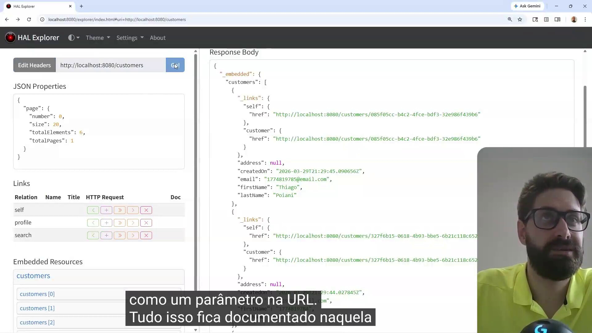
</p>

Consultando `/customers` logo após configurar a projeção, os campos ainda aparecem no formato completo (`address: null`), pois a projeção configurada como `excerptProjection` é aplicada principalmente na listagem — e, quando usada em uma consulta por ID, precisa ser referenciada explicitamente como parâmetro na URL, conforme documentado no `profile` da API.

#### Endereço aparece resumido como string

<p align="center">
  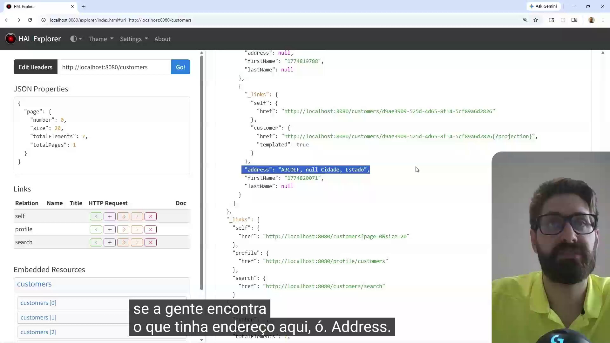
</p>

Ao rolar a listagem e localizar um customer que possui endereço cadastrado, o campo `address` já aparece resumido como uma única string (`"ABCDEF, null Cidade, Estado"`), enquanto os demais customers, sem endereço, continuam com o campo `null`. Isso confirma que a projeção `excerpt` está sendo aplicada por padrão na listagem da coleção.

#### Detalhando o customer com endereço resumido

<p align="center">
  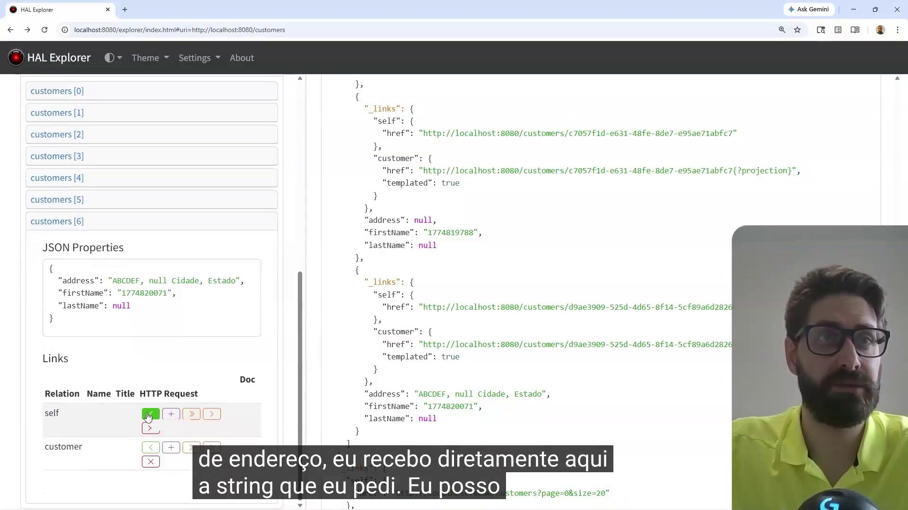
</p>

Abrindo o registro específico desse customer dentro da listagem embutida (`customers`), o campo `address` continua sendo entregue diretamente como a string formatada, em vez do objeto completo — resultado direto da projeção `CustomerExcerpt` configurada como padrão.

#### Acessando o customer diretamente pelo ID

<p align="center">
  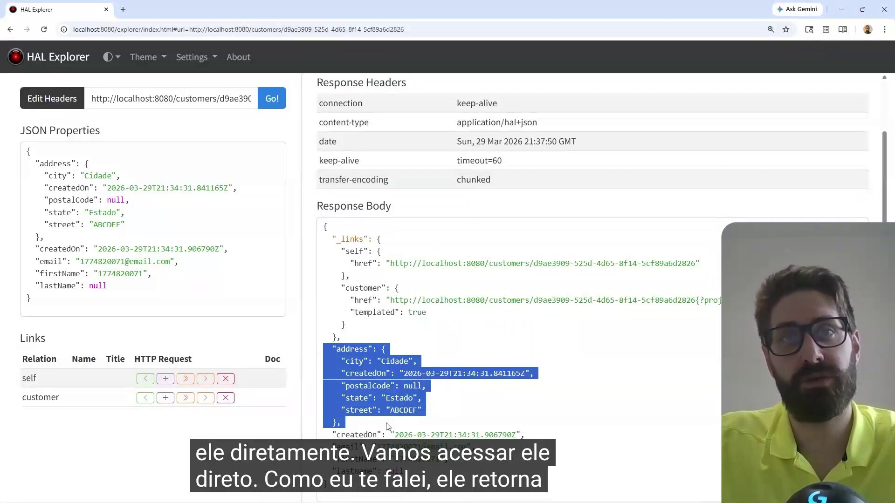
</p>

Ao acessar o recurso diretamente pela URL do customer (fora da listagem embutida), o comportamento muda: o campo `address` volta a ser retornado como o objeto completo, com `city`, `createdOn`, `postalCode` e `state`. Isso acontece porque, fora da listagem, a projeção não é aplicada automaticamente.

#### Aplicando a projeção manualmente via parâmetro

<p align="center">
  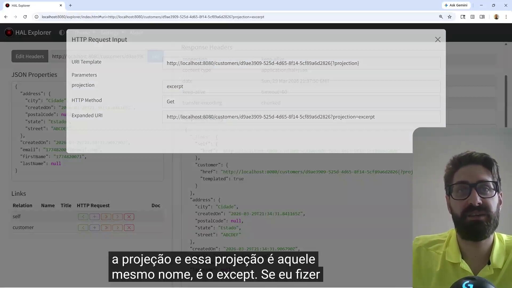
</p>

Para obter o mesmo resumo também na consulta direta por ID, é usado o parâmetro `projection`, com o mesmo nome definido na anotação `@Projection` (`excerpt`):

```
http://localhost:8080/customers/d9ae3909-525d-4d65-8f14-5cf89a6d2826?projection=excerpt
```

O HAL Explorer disponibiliza esse parâmetro diretamente no formulário de requisição.

#### Resultado da projeção aplicada manualmente

<p align="center">
  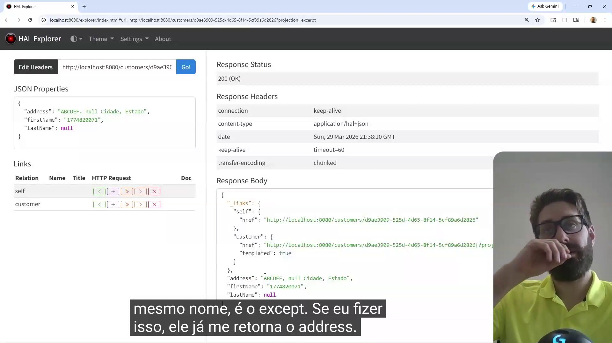
</p>

Com o parâmetro `projection=excerpt` informado, a resposta passa a retornar o campo `address` já resumido como string (`"ABCDEF, null Cidade, Estado"`), junto com `firstName` e `lastName` — exatamente os três campos definidos na interface `CustomerExcerpt`. Isso mostra como diferentes projeções podem ser combinadas para montar respostas específicas para diferentes consumidores da API, como uma aplicação web ou mobile.

#### Criando um listener de eventos do repositório

<p align="center">
  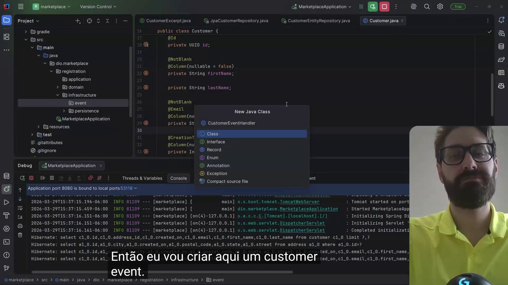
</p>

Avançando para outro recurso do Spring Data REST, um novo pacote de eventos é criado na camada de infraestrutura, e dentro dele uma nova classe: `CustomerEventHandler`. O Spring e o Hibernate disponibilizam listeners para o ciclo de vida das alterações feitas nas entidades — como `save`, `create`, `update` e `delete`.

#### Anotando a classe com @RepositoryEventHandler

<p align="center">
  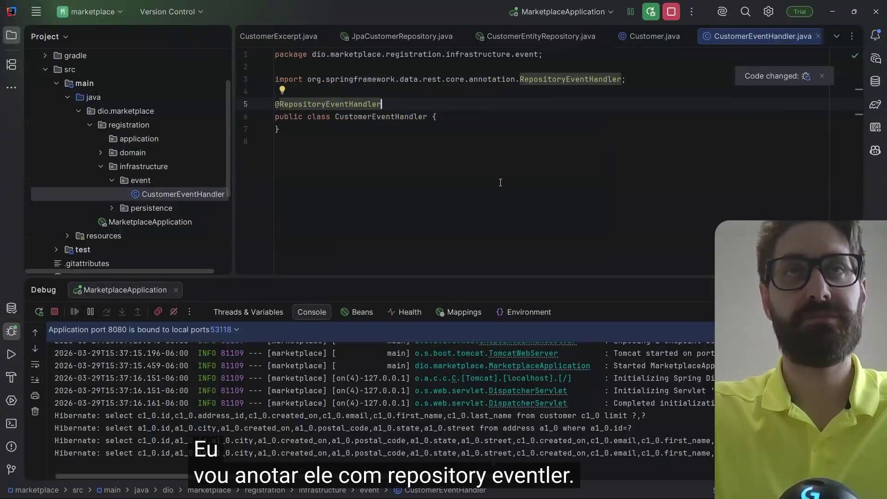
</p>

A classe recém-criada é anotada com `@RepositoryEventHandler`:

```java
package dio.marketplace.registration.infrastructure.event;

import org.springframework.data.rest.core.annotation.RepositoryEventHandler;

@RepositoryEventHandler
public class CustomerEventHandler {
}
```

Essa anotação dá acesso a todos os eventos que o Spring Data REST dispara durante o ciclo de vida das operações do repositório, como criação, atualização e exclusão.

#### Adicionando um logger para acompanhar os eventos

<p align="center">
  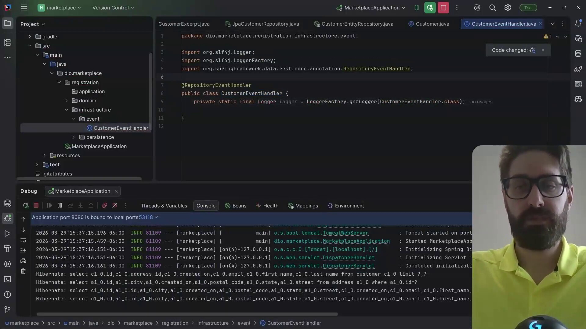
</p>

Para visualizar de forma mais clara o que está acontecendo, um `Logger` é adicionado à classe:

```java
package dio.marketplace.registration.infrastructure.event;

import org.slf4j.Logger;
import org.slf4j.LoggerFactory;
import org.springframework.data.rest.core.annotation.RepositoryEventHandler;

@RepositoryEventHandler
public class CustomerEventHandler {
    private static final Logger logger = LoggerFactory.getLogger(CustomerEventHandler.class);
}
```

#### Registrando a classe como um Component do Spring

<p align="center">
  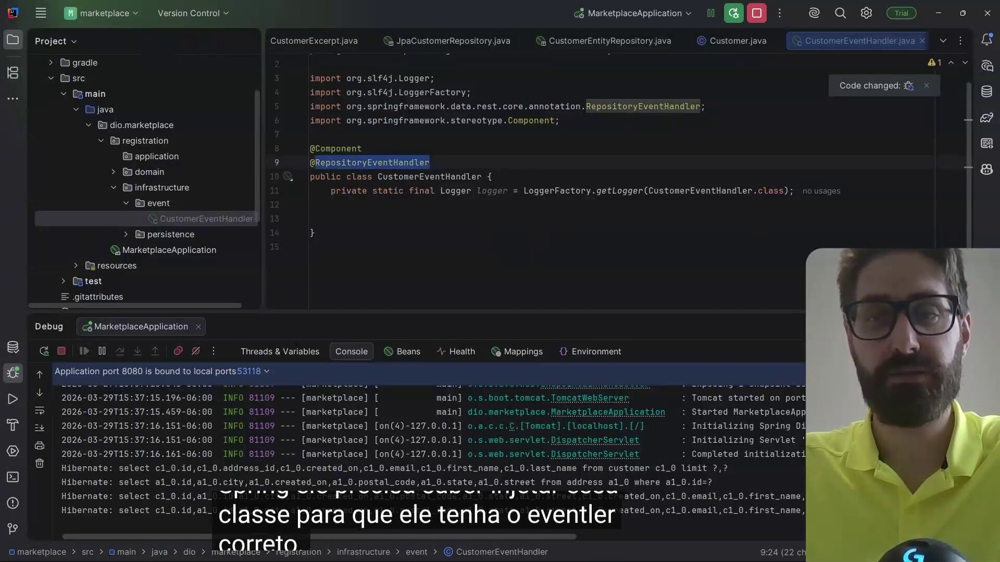
</p>

A classe também é anotada com `@Component`, para que o Spring saiba injetá-la corretamente e associá-la ao *event handler* certo:

```java
import org.springframework.stereotype.Component;

@Component
@RepositoryEventHandler
public class CustomerEventHandler {
    private static final Logger logger = LoggerFactory.getLogger(CustomerEventHandler.class);
}
```

Sem essa anotação, o Spring não reconheceria a classe como um bean gerenciado, e os métodos de evento que serão criados a seguir não seriam acionados.

#### Implementando os métodos de ciclo de vida

<p align="center">
  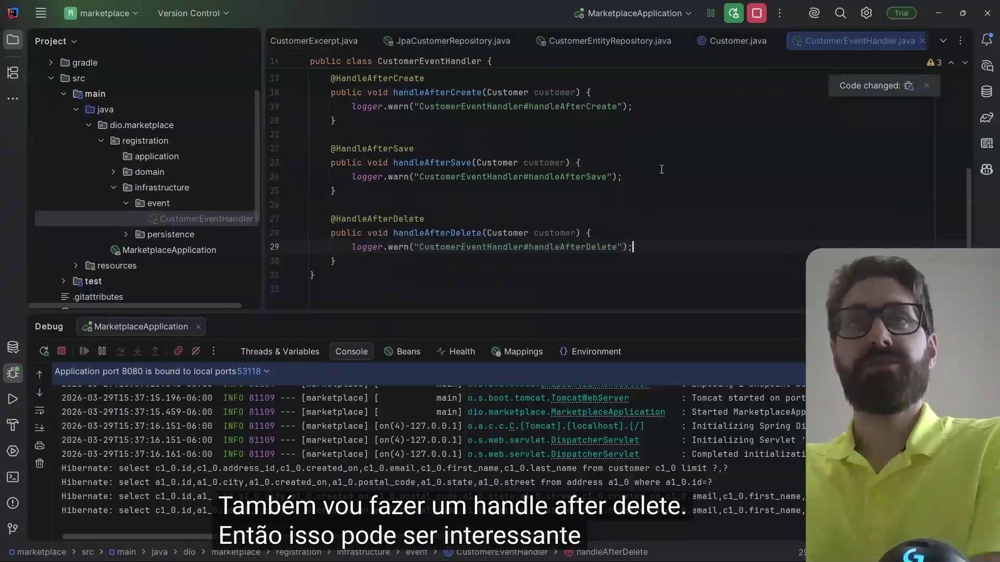
</p>

Três métodos são criados para reagir aos principais eventos do ciclo de vida de `Customer`:

```java
@HandleAfterCreate
public void handleAfterCreate(Customer customer) {
    logger.warn("CustomerEventHandler#handleAfterCreate");
}

@HandleAfterSave
public void handleAfterSave(Customer customer) {
    logger.warn("CustomerEventHandler#handleAfterSave");
}

@HandleAfterDelete
public void handleAfterDelete(Customer customer) {
    logger.warn("CustomerEventHandler#handleAfterDelete");
}
```

Cada método é disparado automaticamente pelo Spring Data REST depois que a respectiva operação (criação, atualização ou remoção) é concluída. Esse mecanismo pode ser bastante útil quando a aplicação precisar reagir a essas mudanças — por exemplo, para que outro componente da aplicação seja notificado quando um customer for criado.

#### Revisando a implementação do handleAfterDelete

<p align="center">
  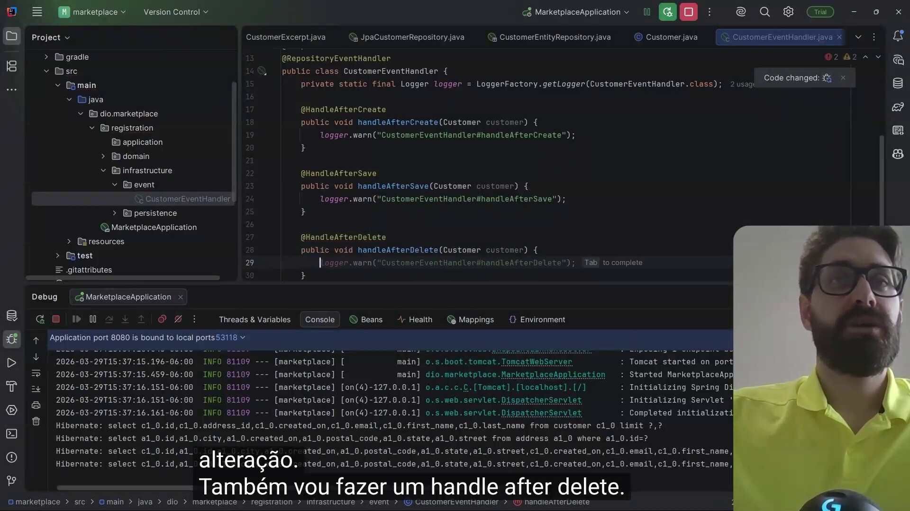
</p>

A IDE sugere completar automaticamente a linha de log dentro do método `handleAfterDelete`, seguindo o mesmo padrão já utilizado nos métodos `handleAfterCreate` e `handleAfterSave`, todos registrando um aviso (`logger.warn`) identificando qual evento foi disparado.

#### Disparando um novo evento de criação

<p align="center">
  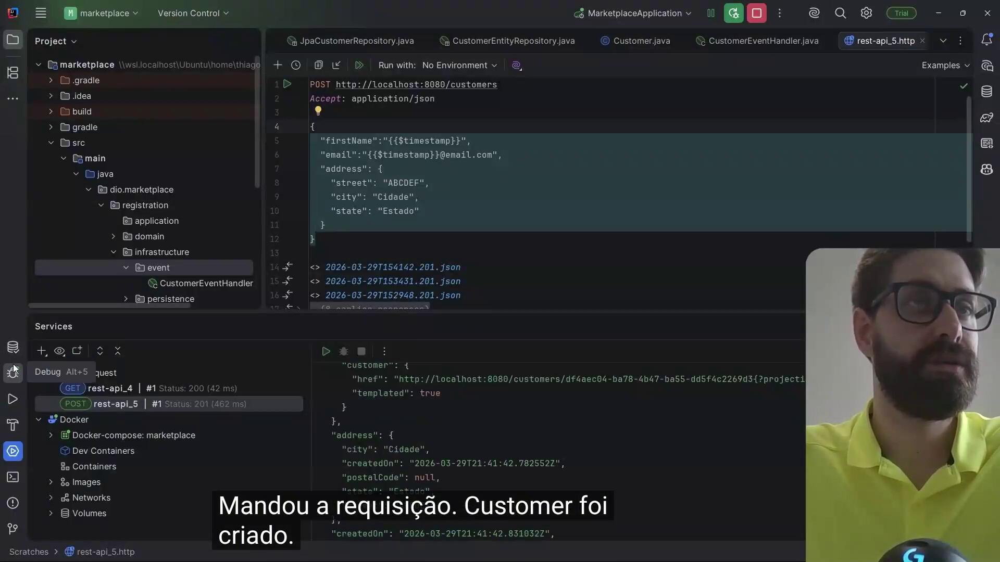
</p>

Um novo customer é criado através do HTTP Client, reutilizando a requisição que envia `firstName`, `email` e `address` com valores dinâmicos baseados em `{{$timestamp}}`. A criação é concluída com sucesso, o que deve acionar o `handleAfterCreate` implementado na classe de eventos.

#### Log do event handler confirmando o disparo do evento

<p align="center">
  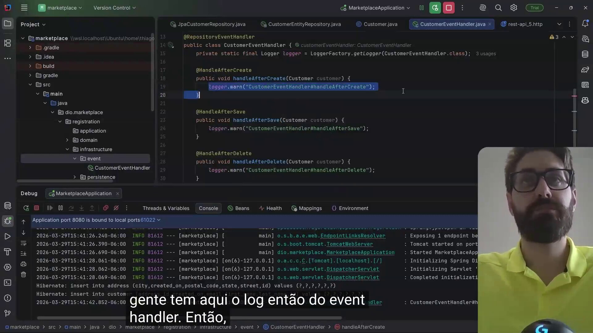
</p>

No console de debug da aplicação, aparece o log gerado pelo `CustomerEventHandler`, confirmando que, após a criação do novo customer, o método `handleAfterCreate` foi disparado automaticamente pelo Spring Data REST — validando que o listener de eventos está funcionando corretamente.

      
#### Material de Apoio Até Esta Etapa

- Arquivos do projeto nesta etapa: [./000-Midia_e_Anexos/marketplace_ate_o_video_03.zip](./000-Midia_e_Anexos/etapas_do_codigo/marketplace_ate_o_video_03.zip)
- [001-Tutorial_Marketplace_Java_Spring_Data_Video03](./001-Tutorial_Marketplace_Java_Spring_Data_Video03.md)

### 🟩 Vídeo 04 - Flexibilidade com NoSQL

<video width="60%" controls>
  <source src="000-Midia_e_Anexos/bootcamp_ntt_data_java_spring_ai-modulo.04-curso.02-video_04.webm" type="video/webm">
    Seu navegador não suporta vídeo HTML5.
</video>

link do vídeo: https://web.dio.me/track/ntt-data-2026-ai-java-back-end/course/conectando-sua-api-com-banco-de-dados-atraves-do-spring-data/learning/2d8650ae-24db-445f-8ace-9e2be8acd60a?autoplay=1

### 🟩 Vídeo 05 - Multi-Database com Docker

<video width="60%" controls>
  <source src="000-Midia_e_Anexos/bootcamp_ntt_data_java_spring_ai-modulo.04-curso.02-video_05.webm" type="video/webm">
    Seu navegador não suporta vídeo HTML5.
</video>

link do vídeo: https://web.dio.me/track/ntt-data-2026-ai-java-back-end/course/conectando-sua-api-com-banco-de-dados-atraves-do-spring-data/learning/8bc989da-d704-412a-904d-a3162da4eb4f?autoplay=1


### 🟩 Vídeo 06 - Criando Endpoints Customizados

<video width="60%" controls>
  <source src="000-Midia_e_Anexos/bootcamp_ntt_data_java_spring_ai-modulo.04-curso.02-video_06.webm" type="video/webm">
    Seu navegador não suporta vídeo HTML5.
</video>

link do vídeo: https://web.dio.me/track/ntt-data-2026-ai-java-back-end/course/conectando-sua-api-com-banco-de-dados-atraves-do-spring-data/learning/724e6f38-489f-4559-9a22-c0d2793c4cd8?autoplay=1

### 🟩 Vídeo 07 - Implementando Redis com Spring Data

<video width="60%" controls>
  <source src="000-Midia_e_Anexos/bootcamp_ntt_data_java_spring_ai-modulo.04-curso.02-video_07.webm" type="video/webm">
    Seu navegador não suporta vídeo HTML5.
</video>

link do vídeo: https://web.dio.me/track/ntt-data-2026-ai-java-back-end/course/conectando-sua-api-com-banco-de-dados-atraves-do-spring-data/learning/55a501a0-f3f4-449c-bca4-ae2862063fda?autoplay=1

### 🟩 Vídeo 08 - Comunicação entre Microsserviços

<video width="60%" controls>
  <source src="000-Midia_e_Anexos/bootcamp_ntt_data_java_spring_ai-modulo.04-curso.02-video_08.webm" type="video/webm">
    Seu navegador não suporta vídeo HTML5.
</video>

link do vídeo: https://web.dio.me/track/ntt-data-2026-ai-java-back-end/course/conectando-sua-api-com-banco-de-dados-atraves-do-spring-data/learning/7dbcac03-57b6-4066-a388-1f77910bd509?autoplay=1


### 🟩 Vídeo 09 - Implementando Persistência com Postgres

<video width="60%" controls>
  <source src="000-Midia_e_Anexos/bootcamp_ntt_data_java_spring_ai-modulo.04-curso.02-video_09.webm" type="video/webm">
    Seu navegador não suporta vídeo HTML5.
</video>

link do vídeo: https://web.dio.me/track/ntt-data-2026-ai-java-back-end/course/conectando-sua-api-com-banco-de-dados-atraves-do-spring-data/learning/0345270c-911c-46c1-be50-550e11fc4576?autoplay=1


### 🟩 Vídeo 10 - Evitando Overbooking

<video width="60%" controls>
  <source src="000-Midia_e_Anexos/bootcamp_ntt_data_java_spring_ai-modulo.04-curso.02-video_10.webm" type="video/webm">
    Seu navegador não suporta vídeo HTML5.
</video>

link do vídeo:

### 🟩 Vídeo 11 - Consistência e Governança

<video width="60%" controls>
  <source src="000-Midia_e_Anexos/bootcamp_ntt_data_java_spring_ai-modulo.04-curso.02-video_11.webm" type="video/webm">
    Seu navegador não suporta vídeo HTML5.
</video>

link do vídeo:

### 🟩 Vídeo 12 - Questionário - Conectando sua API com Banco de Dados Através do Spring Data

<video width="60%" controls>
  <source src="000-Midia_e_Anexos/bootcamp_ntt_data_java_spring_ai-modulo.04-curso.02-video_12.webm" type="video/webm">
    Seu navegador não suporta vídeo HTML5.
</video>

link do vídeo:


### Tutoriais

- [001-Tutorial_Marketplace_Java_Spring_Data_Videos01a02](./001-Tutorial_Marketplace_Java_Spring_Data_Videos01a02.md)


### Arquivos do Projeto

- Até o vídeo 02: [./000-Midia_e_Anexos/etapas_do_codigo/marketplace_ate_o_video_02.zip)(./000-Midia_e_Anexos/etapas_do_codigo/marketplace_ate_o_video_02.zip).

# Certificado: 

- Link na plataforma: 
- Certificado em pdf: