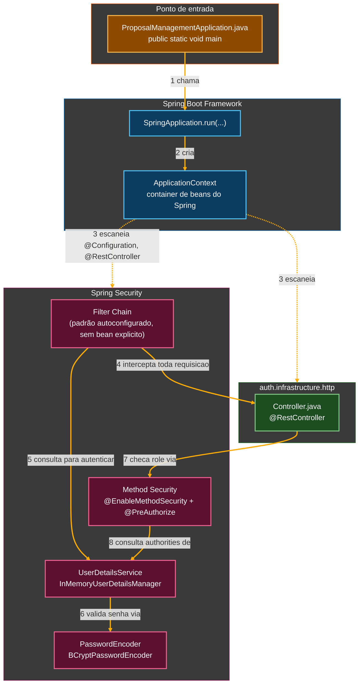
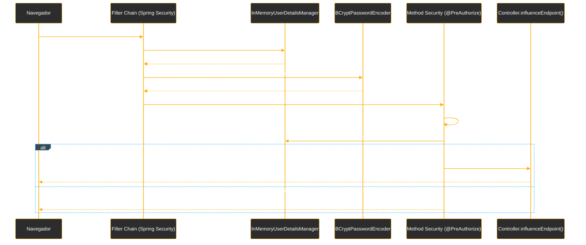

# Tutorial de Estudos — Simplificando a Segurança em APIs REST com Spring Security

**Do zero à primeira autenticação e autorização por papéis — Vídeos 01 e 02**

- Curso: NTT Data — Jornada Tech (DIO) · Módulo 4 — Bootcamp Java + Spring + AI
- Curso: "Simplificando a Segurança em APIs REST com Spring Security"
- Instrutor: Thiago Poiani (Principal Engineer at Skip)
- Projeto: `proposal-managemnet` (pacote base `dio.proposalmanagement`)
- Documento de referência pessoal — nível iniciante em Java

---

## Sobre este documento

Este tutorial foi criado a partir das suas anotações de aula (README) e do código-fonte real do projeto `proposal-managemnet`, na etapa correspondente ao final do Vídeo 02 (arquivo `proposal-managemnet_ate_o_video02.zip`). O objetivo é explicar, com riqueza de detalhes e em nível iniciante, cada instrução escrita até agora — o que ela faz, por que foi escrita daquela forma, e qual conceito de Java, Spring ou de segurança ela representa.

Este documento deve ser usado como um mapa: sempre que houver dúvida sobre "por que essa linha está aqui", volte a ele. A ideia é que, relendo este material, você consiga reconstruir o raciocínio da aula sem precisar assistir ao vídeo novamente.

> **Como este documento está organizado**
> A Parte 1 resume o vídeo teórico (fundamentos de segurança). A Parte 2 é o núcleo do tutorial: o código é apresentado em pequenos blocos, na ordem em que foi escrito na aula, seguido de explicação linha a linha. Ao final, há uma seção sobre pontos em que o código real do seu projeto diverge do que o professor mostrou em aula, um glossário, um checkpoint fiel do código real do seu projeto (conferido diretamente no `.zip` enviado), os próximos passos do curso e diagramas de como tudo se encaixa.
>
> Este é o **primeiro tutorial** desta série (relativo aos Vídeos 01 e 02). Os próximos tutoriais, um por vídeo, devem continuar a numeração e a partir deste ponto de partida.

---

## Parte 1 — Fundamentos de Segurança em APIs (Vídeo 01)

O primeiro vídeo do curso é teórico: antes de escrever qualquer código, a aula constrói o vocabulário e os modelos mentais necessários para entender *por que* o Spring Security é configurado do jeito que é configurado nos vídeos seguintes. Como isso já está detalhadamente documentado no seu README (com todas as imagens dos slides), aqui vai um resumo objetivo, focado no que realmente importa para entender o código escrito no Vídeo 02.

### 1.1. A grande divisão: Autenticação × Autorização

Toda a disciplina de segurança de APIs se apoia em dois pilares, que respondem a perguntas diferentes:

- **Autenticação (AuthN)** — responde a "**você é quem diz ser?**". É o ato de comprovar a identidade de quem está fazendo a requisição.
- **Autorização (AuthO)** — responde a "**você pode acessar este recurso?**". É o ato de conceder ou negar permissão para uma ação específica, já assumindo que a identidade foi confirmada.

> **Por que isso importa para o código?**
> O Vídeo 02 constrói exatamente essas duas coisas, em duas fases separadas: primeiro a autenticação (usuário/senha via formulário de login), depois a autorização (roles `INFLUENCER` e `BRAND`, restringindo endpoints). Sempre que você ler `@PreAuthorize` no código, isso é autorização; sempre que você ler `UserDetailsService`, isso é autenticação.

### 1.2. Elevando a confiança na autenticação: os três fatores

A aula apresenta os três fatores que compõem a autenticação moderna: **algo que você sabe** (senha, PIN), **algo que você possui** (token físico, celular, app autenticador) e **algo que você é** (biometria). Combinar mais de um fator é o que chamamos de **autenticação multifator (MFA)**, e é o ponto de maior confiança possível.

No Vídeo 02, o projeto usa apenas o primeiro fator (usuário e senha), o que é normal e esperado numa etapa inicial de aprendizado — MFA é um refinamento que fica para depois, se o curso chegar lá.

### 1.3. Protocolos e métodos de autenticação

A aula compara os principais métodos usados hoje:

| Método | Características |
|---|---|
| **Basic Authentication** | Simples e legado: envia usuário e senha a cada requisição. Pouco seguro e pouco escalável. |
| **Bearer / JWT** | Token criptografado que já carrega as informações do usuário autenticado, tornando a aplicação *stateless* (sem controle de sessão no servidor). Padrão mais usado entre microsserviços. |
| **OAuth 2.0** | Voltado a acesso delegado (ex.: "entrar com Google/Facebook" em um app de terceiros). |
| **OpenID Connect** | Camada de identidade sobre o OAuth 2.0, viabilizando Single Sign-On (SSO). |
| **mTLS** | Certificados mútuos entre dois serviços; ideal para comunicação service-to-service. |

> **Por que isso importa para o código?**
> O Vídeo 02 usa, na prática, uma variação de **Basic Authentication via formulário HTML** (o `formLogin()` do Spring Security, explicado adiante) — a forma mais simples possível de autenticação, adequada para o primeiro contato com o framework. É esperado que, em vídeos futuros do curso, o projeto evolua para algo mais próximo de Bearer/JWT, que é o padrão real usado em APIs REST de produção.

### 1.4. Delegando complexidade: Identity Providers

A mentalidade "Production-Ready" recomenda **não implementar** o gerenciamento de credenciais dentro da própria aplicação. Esse trabalho deveria ser centralizado em um **Identity Provider** especializado — como Keycloak (open source), Auth0 ou Okta (pagos) — que entrega à API um token já confiável. Isso evita manter, dentro do próprio sistema, uma camada inteira de segurança (senhas, reset de senha, integrações externas) sempre atualizada.

> **E o `InMemoryUserDetailsManager` do Vídeo 02?**
> Guardar usuários "na memória", como o Vídeo 02 faz, é exatamente o **oposto** dessa recomendação — e isso é proposital: é uma etapa didática, para aprender o mecanismo do Spring Security sem a complexidade extra de um banco de dados ou de um Identity Provider externo. O roteiro do curso (visível no seu README, nos títulos dos próximos vídeos) já indica que isso vai evoluir para persistência em banco de dados nos vídeos seguintes.

### 1.5. Defense in Depth: a mentalidade Production-Ready

A segurança real não deve depender de um único ponto de falha, e sim de **barreiras concêntricas**: se uma camada falhar, a próxima mitiga o ataque.

- **Camada de Rede** — firewall, WAF, mTLS.
- **Camada de Aplicação** — Spring Security, validação de JWT, validação de entrada.
- **Camada de Banco de Dados** — criptografia dos dados, Row-Level Security.

O Vídeo 02 constrói exclusivamente a camada de **Aplicação** — é ali que o Spring Security atua.

### 1.6. O espectro da autorização: coarse-grained × fine-grained

A autorização pode ser mais ampla (**coarse-grained**, "grão grosso" — ex.: qualquer `admin` acessa qualquer coisa) ou mais específica (**fine-grained**, "grão fino" — ex.: só o próprio dono de um registro pode editá-lo).

### 1.7. RBAC × ABAC

Dois modelos de controle de acesso são comparados:

- **RBAC (Role-Based Access Control)** — focado em cargos/papéis (roles). Rígido, mas rápido de implementar. É o modelo usado no Vídeo 02, com as roles `INFLUENCER` e `BRAND`.
- **ABAC (Attribute-Based Access Control)** — mais flexível e complexo, avaliando atributos dinâmicos (do usuário, do recurso, do contexto — horário, localização) em tempo real.

> **Por que isso importa para o código?**
> Toda vez que você ler `hasRole('INFLUENCER')` no Vídeo 02, isso é RBAC em ação — a decisão de autorizar ou não depende exclusivamente do papel atribuído ao usuário, e não de nenhum outro atributo dinâmico.

### 1.8. O modelo NIST de orquestração da decisão

O NIST (National Institute of Standards and Technology) define quatro componentes que orquestram uma decisão de autorização:

- **PEP (Policy Enforcement Point)** — a "catraca": recebe a requisição e aplica a autorização. No Spring Security, é a **filter chain** (a corrente de filtros HTTP).
- **PAP (Policy Administration Point)** — define as regras de negócio (roles, contexto).
- **PIP (Policy Information Point)** — recupera dados de contexto do usuário e da requisição.
- **PDP (Policy Decision Point)** — o "cérebro": reúne as informações e decide se o usuário prossegue ou é bloqueado.

> **Por que isso importa para o código?**
> Quando você vir, no Vídeo 02, a requisição passando pela `SecurityFilterChain` e depois sendo barrada por um `@PreAuthorize`, você está literalmente vendo o PEP (a filter chain, e depois a checagem do método anotado) consultando o PDP (a lógica que avalia `hasRole(...)`) antes de liberar o acesso ao Controller.

### 1.9. O estudo de caso do curso: Influencer & Brand Connect

A aula apresenta o projeto que será construído ao longo do curso: uma **plataforma de gerenciamento de propostas entre influenciadores digitais e marcas**.

- O **Influenciador** pode criar propostas de mídia, mas só pode ver as próprias propostas — não as de outros influenciadores.
- A **Marca** pode visualizar propostas públicas disponíveis para contratação, mas não pode criar propostas (isso é exclusivo do papel Influenciador).

Esse controle é implementado com **RBAC** (papéis `Influenciador` e `Marca`), e o uso de **UUIDs** e **Java Records** é indicado como forma de garantir integridade e rastreabilidade dos contratos gerados.

> **E o projeto `proposal-managemnet` que você está construindo?**
> No seu README e no seu projeto, a implementação prática desse estudo de caso começa exatamente pelo pilar de **autenticação**, criando o módulo `auth` e dois usuários em memória — `influencer` e `brand` — cada um com sua própria role. O restante deste tutorial documenta essa implementação prática, feita no Vídeo 02.

---

## Parte 2 — Primeiros Passos com Spring Security (Vídeo 02)

Este é o primeiro vídeo do curso em que código de fato é escrito. O objetivo do vídeo é sair do zero absoluto e chegar a uma aplicação Spring Boot que: (1) exige autenticação para qualquer requisição, (2) reconhece dois usuários diferentes, cada um com sua própria role, e (3) restringe o acesso a determinados endpoints de acordo com a role do usuário autenticado — tudo isso usando **autenticação via formulário** e **autorização baseada em roles a nível de método** (`@PreAuthorize`).

### 2.1. Criando o projeto no Spring Initializr

O projeto é criado através do IntelliJ IDEA, usando o gerador **Spring Boot** (equivalente ao site `start.spring.io`), com as seguintes escolhas:

- **Nome:** `proposal-management`
- **Grupo:** `dio`
- **Pacote base:** `dio.proposalmanagement`
- **Sistema de build:** Gradle - Groovy
- **Versão do Java:** Java 25 (via Eclipse Temurin, gerenciado pelo SDKMAN)

> **Nota sobre o seu projeto**
> Conferindo o `.zip` que você enviou, o `build.gradle` real usa `JavaLanguageVersion.of(17)` e Spring Boot `3.2.5`, não Java 25. Isso não impede nada do que foi ensinado — é apenas uma diferença de ambiente de desenvolvimento (talvez o SDK 25 não estivesse disponível na sua máquina no momento da criação do projeto). Toda a sintaxe usada nesta etapa do curso (classes, anotações, lambdas) já funciona perfeitamente em Java 17, que é uma versão LTS (*Long-Term Support*) amplamente usada em produção. Fique atento caso vídeos futuros usem alguma sintaxe exclusiva de versões mais novas do Java (como certas evoluções de *pattern matching*) — nesse caso, será necessário atualizar o `toolchain` do projeto.

- **`java { toolchain { languageVersion = JavaLanguageVersion.of(17) } }`** — este bloco, presente no seu `build.gradle`, é a forma do Gradle dizer "compile e execute este projeto usando especificamente esta versão do JDK", independentemente de qual versão de Java esteja instalada por padrão no seu computador. Um **toolchain** é a definição de um kit de ferramentas de compilação (compilador, JDK) a ser usado, gerenciado automaticamente pelo Gradle.

### 2.2. Adicionando as duas primeiras dependências

No arquivo `build.gradle`, logo após a criação do projeto, são adicionadas as duas primeiras dependências:

```groovy
implementation 'org.springframework.boot:spring-boot-starter-security'
implementation 'org.springframework.boot:spring-boot-starter-web'
```

- **`spring-boot-starter-security`** — o *starter* (pacote "tudo em um") que traz o **Spring Security** para dentro do projeto: todas as classes, anotações e mecanismos necessários para autenticação e autorização.
- **`spring-boot-starter-web`** — traz tudo o que é necessário para a aplicação se comportar como um servidor web: o servidor **Tomcat** embutido e a infraestrutura para criar Controllers. É essa dependência que permite, na prática, **observar** como a segurança se comporta em requisições HTTP reais.

> **Efeito colateral importante de adicionar `spring-boot-starter-security` sozinho**
> A partir do momento em que essa dependência entra no classpath, o Spring Boot passa a aplicar, **automaticamente**, uma configuração de segurança padrão: toda e qualquer requisição HTTP passa a exigir autenticação, e um usuário chamado `user` é gerado com uma senha aleatória impressa no console a cada `Run`. Isso acontece mesmo **antes** de você escrever qualquer linha de configuração própria — é esse comportamento "de fábrica" que a aula assume como ponto de partida, e que a classe `SecurityConfig` (próxima seção) vai começar a **customizar**.

### 2.3. Organizando o projeto em camadas: o módulo `auth`

Antes de escrever qualquer classe de configuração, o instrutor organiza o código seguindo os princípios de **Domain-Driven Design (DDD)**, criando um pacote dedicado ao tema "segurança": `dio.proposalmanagement.auth`, reunindo autenticação e autorização em um único módulo.

Dentro de `auth`, são criados três subpacotes, seguindo a mesma divisão em camadas usada em outros cursos da trilha:

- **`application`** — a camada orquestradora, responsável por coordenar chamadas entre o domínio e a infraestrutura (ainda vazia nesta etapa; deve ganhar conteúdo em vídeos futuros, quando surgir alguma regra de negócio própria de autenticação).
- **`domain`** — a camada mais interna, onde ficam as regras de negócio puras, sem dependência de frameworks externos (também ainda vazia nesta etapa).
- **`infrastructure`** — tudo o que é "detalhe técnico": controllers, configurações de autenticação, acesso a dados externos. É aqui que mora, até agora, **todo** o código escrito no Vídeo 02.

```
dio.proposalmanagement.auth
├── application       (ainda vazio nesta etapa)
├── domain             (ainda vazio nesta etapa)
└── infrastructure
    ├── SecurityConfig.java
    └── http
        └── Controller.java
```

> **Por que separar em pacotes assim, se dois deles ainda estão vazios?**
> Essa separação existe para que as regras de negócio (`domain`) não fiquem "presas" a uma tecnologia específica, e para que a camada de orquestração (`application`) fique isolada de detalhes técnicos (`infrastructure`). Criar os três pacotes desde já, mesmo vazios, é uma decisão de **planejamento arquitetural**: o instrutor já está reservando o "endereço" onde o código de autenticação vai crescer nos próximos vídeos (por exemplo, quando surgir um serviço de cadastro de usuários com persistência em banco, é bem provável que ele vá para `auth.domain` e `auth.application`, e não mais direto em `infrastructure`).

### 2.4. Criando a classe `SecurityConfig`

Dentro de `auth.infrastructure`, é criada a primeira classe de configuração do módulo, chamada `SecurityConfig`, responsável por centralizar as configurações do Spring Security.

```java
package dio.proposalmanagement.auth.infrastructure;

import org.springframework.context.annotation.Configuration;

@Configuration
public class SecurityConfig {
}
```

- **`package dio.proposalmanagement.auth.infrastructure;`** — declara em qual pacote lógico esta classe vive, refletindo a organização em camadas descrita na seção anterior.
- **`@Configuration`** — anotação do Spring que sinaliza que essa classe deve ser processada e inicializada durante o ***component scan*** (o processo em que o Spring Boot varre o projeto em busca de classes anotadas para transformar em *beans* gerenciados). É o mesmo mecanismo usado por `@SpringBootApplication` para descobrir classes de configuração espalhadas pelo projeto.
- **`public class SecurityConfig { }`** — por enquanto, uma classe vazia: apenas o "esqueleto" onde a configuração de segurança vai ser escrita nas próximas seções.

### 2.5. Ativando o Spring Security explicitamente

É adicionada a anotação `@EnableWebSecurity`:

```java
@Configuration
@EnableWebSecurity
public class SecurityConfig {
}
```

- **`@EnableWebSecurity`** — anotação que indica, de forma explícita, que o Spring Security deve ser habilitado e customizável para esta aplicação web. Tecnicamente, o Spring Boot já ativaria uma configuração de segurança básica apenas por ter `spring-boot-starter-security` no classpath (como explicado na seção 2.2) — mas `@EnableWebSecurity` é o que "abre a porta" para que essa configuração seja **substituída** pela sua própria, através de beans como o `SecurityFilterChain` que será visto a seguir.

### 2.6. O bean `SecurityFilterChain`: o ponto central da configuração

O instrutor inicia a criação do bean mais importante da classe: o `SecurityFilterChain`, o ponto central de configuração de segurança do Spring Security — é ele quem define por quais filtros as requisições HTTP vão passar antes de chegar a um Controller.

```java
@Bean
SecurityFilterChain securityFilterChain(HttpSecurity http) throws Exception {

}
```

E, em seguida, o corpo do método é completado, definindo que qualquer requisição precisa estar autenticada, e habilitando a autenticação via formulário (*form login*) com as configurações padrão:

```java
@Bean
SecurityFilterChain securityFilterChain(HttpSecurity http) throws Exception {
    http
        .authorizeHttpRequests(auth -> auth
            .anyRequest().authenticated())
        .formLogin(Customizer.withDefaults());

    return http.build();
}
```

- **`@Bean`** — anotação do Spring que marca este método como responsável por **produzir** um objeto (um *bean*) que deve ser gerenciado pelo container do Spring, disponível para ser injetado em qualquer outro ponto da aplicação que precise dele.
- **`SecurityFilterChain securityFilterChain(HttpSecurity http)`** — o método recebe, como parâmetro, um objeto `HttpSecurity`, injetado automaticamente pelo Spring. `HttpSecurity` é um objeto construtor (um *builder*) que oferece uma API fluente para configurar, passo a passo, como a segurança HTTP da aplicação deve se comportar.
- **`throws Exception`** — a API do `HttpSecurity` pode lançar exceções verificadas (*checked exceptions*) durante sua configuração; declarar `throws Exception` delega o tratamento dessas exceções para quem chamar este método (no caso, o próprio Spring, na inicialização da aplicação).
- **`.authorizeHttpRequests(auth -> auth.anyRequest().authenticated())`** — configura a regra de **autorização**: `auth -> auth...` é uma expressão lambda que recebe um objeto configurador de regras de autorização e devolve a mesma configuração encadeada; `.anyRequest().authenticated()` traduz-se como "**qualquer** requisição feita a **qualquer** endpoint da aplicação exige que o usuário esteja autenticado". Ainda não há distinção por role nesta etapa — isso só chega mais adiante, com `@PreAuthorize`.
- **`.formLogin(Customizer.withDefaults())`** — habilita a **autenticação via formulário HTML**, usando as configurações padrão do Spring Security (uma página de login pronta, em `/login`, gerada automaticamente pelo framework). `Customizer.withDefaults()` é um utilitário que significa, literalmente, "use o comportamento padrão, sem nenhuma customização adicional".
- **`return http.build();`** — finaliza a configuração encadeada e constrói, de fato, o objeto `SecurityFilterChain`, que passa a ser o bean gerenciado pelo Spring, aplicado a toda requisição HTTP recebida pela aplicação.

Esse formulário padrão é a forma mais simples que o Spring Security oferece para coletar usuário e senha antes de conceder acesso.

> **Atenção: este bean não está presente na versão final do seu `.zip`**
> Este ponto é detalhado na seção **"Pontos de atenção"**, mais adiante neste tutorial — vale a leitura, porque explica por que a aplicação, mesmo sem esse bean explícito no código final, ainda se comporta exatamente como a aula descreve.

### 2.7. Criando o primeiro usuário em memória

Para validar usuário e senha, é criado um bean `UserDetailsService`, responsável por fornecer os dados de autenticação para o `AuthenticationProvider` (o componente interno do Spring Security que efetivamente compara a senha digitada com a senha armazenada). O primeiro usuário é criado usando `User.withDefaultPasswordEncoder()`, deixando o Spring escolher automaticamente o algoritmo de criptografia (nesse caso, **BCrypt**) para a senha:

```java
@Bean
UserDetailsService userDetailsService() {
    UserDetails user = User.withDefaultPasswordEncoder()
}
```

- **`UserDetailsService`** — interface central do Spring Security responsável por **carregar** os dados de um usuário (nome de usuário, senha criptografada, roles) a partir de algum lugar (nesta etapa, da memória; em vídeos futuros, provavelmente de um banco de dados).
- **`User.withDefaultPasswordEncoder()`** — um método utilitário estático da classe `User` (do próprio Spring Security) que inicia a construção fluente (*builder*) de um objeto `UserDetails`, já aplicando automaticamente um algoritmo de criptografia padrão às senhas informadas.

O próprio IntelliJ sinaliza que o método `withDefaultPasswordEncoder()` está **deprecated (obsoleto)**, alertando que essa abordagem não é segura para aplicações em produção — ela é indicada apenas para fins de exemplo e prototipagem rápida, já que a senha em texto puro acaba compilada junto ao código-fonte antes de ser criptografada em memória (ou seja, qualquer pessoa com acesso ao `.class` compilado ou ao código-fonte veria a senha em texto puro).

O primeiro usuário em memória é finalizado: username `influencer`, senha `password` e role `INFLUENCER`. Esse usuário é então registrado em um `InMemoryUserDetailsManager`, retornado pelo bean `UserDetailsService`:

```java
@Bean
UserDetailsService userDetailsService() {
    UserDetails user = User.withDefaultPasswordEncoder()
            .username("influencer")
            .password("password")
            .roles("INFLUENCER")
            .build();

    return new InMemoryUserDetailsManager(user);
}
```

- **`.username("influencer")`**, **`.password("password")`**, **`.roles("INFLUENCER")`** — métodos encadeados (*method chaining*) do *builder*, cada um preenchendo uma parte dos dados do usuário: nome de login, senha em texto puro (que será criptografada automaticamente pelo encoder padrão) e a role atribuída a ele.
- **`.build()`** — finaliza a construção encadeada e devolve, de fato, o objeto `UserDetails` pronto.
- **`InMemoryUserDetailsManager`** — uma implementação de `UserDetailsService` (e também de outra interface, `UserDetailsManager`) que guarda a lista de usuários **em memória** (numa lista Java comum, dentro do próprio processo da aplicação) em vez de em um banco de dados externo. É uma implementação pensada para estudos e protótipos — os usuários somem assim que a aplicação é reiniciada.

Com essa configuração ativa, a aplicação Spring Boot é iniciada com sucesso na porta 8080, e o console confirma que a configuração inicial do Spring Security está funcional — destacando-se, no log, o aviso de que `User.withDefaultPasswordEncoder()` não é seguro para produção, e a listagem da cadeia padrão de filtros de segurança (`DefaultSecurityFilterChain`) que passa a proteger qualquer requisição feita à aplicação.

### 2.8. Primeiro teste: login via formulário

Acessando `localhost:8080` no navegador, a aplicação redireciona automaticamente para a tela de login padrão do Spring Security (`/login`). São informados usuário `influencer` e senha `password` para autenticação.

Após o login bem-sucedido, o Spring Security tenta redirecionar para a URL originalmente solicitada através do parâmetro `continue` (ex.: `/login?continue`), mas como ainda não existe nenhum endpoint mapeado na aplicação, é exibida a **Whitelabel Error Page** com status `404 Not Found`.

> **Por que um erro 404 é, na verdade, uma boa notícia aqui?**
> Um `404 Not Found` confirma exatamente que a autenticação **funcionou**: se as credenciais estivessem erradas, o Spring Security teria devolvido você para a tela de login com uma mensagem de erro, e nunca teria tentado redirecionar para outra página. O `404` só aparece **depois** de o login ser aceito — falta apenas criar um endpoint para receber a requisição, o que acontece na seção 2.11.

### 2.9. Evoluindo para dois usuários e um `PasswordEncoder` explícito

A classe `SecurityConfig` é evoluída: agora existem dois usuários em memória, `influencer` e `brand`, ambos com senha `password`, e um bean `PasswordEncoder` explícito, baseado em `BCryptPasswordEncoder`, é declarado — substituindo o uso do encoder padrão (obsoleto) por um encoder configurado de forma explícita:

```java
UserDetails brand = User.withUsername("brand")
        .password(passwordEncoder.encode("password"))
        .roles("BRAND")
        .build();

return new InMemoryUserDetailsManager(influencer, brand);
```

- **`User.withUsername("brand")`** — diferente de `withDefaultPasswordEncoder()` (visto na seção 2.7), este método **não** aplica nenhum encoder de senha automaticamente — ele espera que a senha já venha criptografada (ou você mesmo se encarregue de criptografá-la, como acontece na linha seguinte).
- **`.password(passwordEncoder.encode("password"))`** — em vez de passar a senha em texto puro, ela é explicitamente criptografada, chamando `passwordEncoder.encode(...)` **antes** de ser atribuída ao usuário. `passwordEncoder` aqui é uma instância de `PasswordEncoder` (o bean declarado a seguir), injetada como parâmetro do método `userDetailsService`.
- **`new InMemoryUserDetailsManager(influencer, brand);`** — o construtor de `InMemoryUserDetailsManager` aceita múltiplos usuários como argumentos (usando *varargs*), então o mesmo gerenciador em memória passa a conhecer os dois usuários simultaneamente.

E o bean do encoder é declarado separadamente:

```java
@Bean
PasswordEncoder passwordEncoder() {
    return new BCryptPasswordEncoder();
}
```

- **`PasswordEncoder`** — interface do Spring Security com um contrato simples: recebe uma senha em texto puro e devolve uma versão criptografada dela (método `encode`), além de saber comparar uma senha em texto puro com uma já criptografada (método `matches`).
- **`BCryptPasswordEncoder`** — a implementação mais usada dessa interface, baseada no algoritmo **BCrypt**: um algoritmo de *hashing* de senha propositalmente lento (para dificultar ataques de força bruta) e que já inclui, dentro do próprio resultado criptografado, um valor aleatório (*salt*), evitando que duas senhas iguais gerem exatamente o mesmo texto criptografado.

Ao declarar esse bean explicitamente e injetá-lo no método `userDetailsService`, a aplicação deixa de depender do encoder "escolhido escondido" por trás de `withDefaultPasswordEncoder()`, tornando explícito, em um único lugar do código, qual algoritmo de criptografia de senha está sendo usado.

### 2.10. Criando o primeiro Controller

Dentro de `auth.infrastructure`, é criado o subpacote `http`, destinado a abrigar os controllers da aplicação. Nele, é criada a primeira classe de controller do projeto, chamada simplesmente `Controller` — ainda sem um nome mais específico, já que o objetivo inicial é apenas validar o comportamento da autenticação.

```java
@RestController
@RequestMapping
public class Controller {

    @GetMapping
    public String hello() {
        return "Hello World";
    }
}
```

- **`@RestController`** — anotação "combo" do Spring que marca a classe como um controller REST: cada método público anotado com um mapeamento HTTP (como `@GetMapping`) passa a responder a requisições, e o valor de retorno é automaticamente escrito no corpo da resposta HTTP (em vez de ser interpretado como o nome de uma página HTML a ser renderizada, como aconteceria com a anotação `@Controller` tradicional do Spring MVC).
- **`@RequestMapping`** — usada aqui **sem nenhum caminho especificado**, o que faz com que ela mapeie a raiz da aplicação (`/`). Em controllers maiores, `@RequestMapping("/algum-prefixo")` na classe costuma servir como prefixo comum para todos os endpoints declarados dentro dela.
- **`@GetMapping`** — também sem caminho especificado, mapeando este método especificamente para requisições `GET` na raiz (`/`), combinando com o `@RequestMapping` da classe.
- **`public String hello() { return "Hello World"; }`** — o método mais simples possível: recebe a requisição e devolve, como resposta, o texto `"Hello World"`.

Ao acessar `localhost:8080` novamente, a tela de login é exibida uma vez mais (confirmando que **qualquer** endpoint da aplicação exige autenticação prévia, por causa da regra `.anyRequest().authenticated()` vista na seção 2.6). Após informar usuário `influencer` e senha `password`, o navegador finalmente exibe o resultado do endpoint `GET /`: a mensagem **"Hello World"**, validando que o fluxo de autenticação via formulário está funcionando de ponta a ponta.

### 2.11. Identificando quem fez login: `@AuthenticationPrincipal`

O endpoint do `Controller` é alterado para receber o usuário autenticado através da anotação `@AuthenticationPrincipal`, que devolve um `UserDetails` com as informações de quem fez login. A resposta passa a incluir o nome do usuário autenticado:

```java
@GetMapping
public String hello(@AuthenticationPrincipal UserDetails user) {
    return "Hello World " + user.getUsername();
}
```

- **`@AuthenticationPrincipal`** — anotação de parâmetro do Spring Security que injeta, diretamente no método do controller, o objeto que representa o usuário atualmente autenticado (tecnicamente, o *principal* da autenticação atual, extraído do `SecurityContext` mantido pelo Spring Security durante a requisição). Sem essa anotação, seria necessário buscar manualmente essa informação através de classes utilitárias mais verbosas, como `SecurityContextHolder.getContext().getAuthentication()`.
- **`UserDetails user`** — o tipo do parâmetro injetado: a mesma interface usada para **construir** os usuários em memória (seção 2.7 e 2.9) agora reaparece para **ler** os dados de quem está logado. `user.getUsername()` devolve, como o próprio nome sugere, o nome de usuário de quem se autenticou.
- **`"Hello World " + user.getUsername()`** — concatenação simples de texto (`String`), montando uma resposta personalizada de acordo com quem está fazendo a requisição.

Após reiniciar a aplicação, o acesso a `localhost:8080` é feito novamente, agora autenticando com o usuário `brand` e senha `password`. Com o usuário `brand` autenticado, a resposta do endpoint passa a exibir **"Hello World brand"**, confirmando que o `@AuthenticationPrincipal` está corretamente retornando o nome de quem está logado.

### 2.12. Habilitando segurança a nível de método: `@EnableMethodSecurity`

É adicionada a anotação `@EnableMethodSecurity`, habilitando o uso de anotações de segurança diretamente em métodos — como em controllers, services ou repositories — permitindo restringir o acesso com base na role do usuário autenticado.

```java
@Configuration
@EnableWebSecurity
@EnableMethodSecurity
public class SecurityConfig {
    // ...
}
```

- **`@EnableMethodSecurity`** — habilita, em toda a aplicação, o processamento de anotações de autorização declaradas diretamente em métodos, como `@PreAuthorize`, `@PostAuthorize` e `@Secured`. Sem essa anotação ativa em algum lugar da aplicação, anotações como `@PreAuthorize` são simplesmente **ignoradas** — o método executaria normalmente, sem nenhuma checagem de permissão, mesmo que a anotação estivesse presente no código.

> **Nota sobre o seu projeto**
> No seu `.zip`, `@EnableMethodSecurity` está presente na classe `Controller` (dentro de `auth.infrastructure.http`), e **não** na classe `SecurityConfig` como a aula ensina. Este ponto é detalhado na seção **"Pontos de atenção"**, mais adiante neste tutorial.

### 2.13. Criando endpoints por role, ainda sem restrição

Dois novos endpoints são criados no `Controller`: `GET /influencer` e `GET /brand`. Como ainda não possuem nenhuma anotação de segurança específica, neste momento **qualquer** usuário autenticado consegue acessar ambos, independentemente da sua role:

```java
@GetMapping("/influencer")
public String influenceEndpoint() {
    return "Hello INFLUENCER";
}

@GetMapping("/brand")
public String brandEndpoint() {
    return "Hello BRAND";
}
```

Neste ponto, esses dois métodos são funcionalmente idênticos ao endpoint `GET /` — a única diferença é o caminho e o texto de resposta. A restrição por role só entra em cena na próxima seção.

### 2.14. Restringindo por role com `@PreAuthorize`

Cada endpoint recebe a anotação `@PreAuthorize`, exigindo que o usuário autenticado possua a role correspondente para poder acessá-lo:

```java
@GetMapping("/influencer")
@PreAuthorize("hasRole('INFLUENCER')")
public String influenceEndpoint() {
    return "Hello INFLUENCER";
}

@GetMapping("/brand")
@PreAuthorize("hasRole('BRAND')")
public String brandEndpoint() {
    return "Hello BRAND";
}
```

- **`@PreAuthorize("hasRole('INFLUENCER')")`** — anotação de autorização declarativa que é avaliada **antes** de o corpo do método ser executado (daí o prefixo *Pre*). O texto entre aspas (`"hasRole('INFLUENCER')"`) é escrito em **SpEL** (*Spring Expression Language*), uma linguagem de expressões própria do Spring que permite escrever pequenas condições lógicas dentro de anotações e arquivos de configuração.
- **`hasRole('INFLUENCER')`** — uma função pronta do SpEL, disponibilizada pelo Spring Security especificamente para expressões de autorização. Ela verifica se o usuário atualmente autenticado possui, entre suas *authorities* (permissões), uma role chamada `ROLE_INFLUENCER`. Repare que o `ROLE_` é adicionado **automaticamente** pelo Spring — tanto aqui quanto em `.roles("INFLUENCER")` (seções 2.7 e 2.9), você escreve apenas `INFLUENCER`, e o framework se encarrega de completar o prefixo internamente, de forma consistente nos dois lugares.
- Se a expressão `hasRole(...)` for avaliada como `false`, o método **nunca chega a ser executado**: o Spring Security intercepta a chamada e devolve, para quem fez a requisição, um erro **`403 Forbidden`** — "autenticado, mas sem permissão", diferente de um `401 Unauthorized`, que significaria "nem sequer autenticado".

### 2.15. Testando as regras de autorização por role

Com a aplicação reiniciada, uma sequência de testes valida o comportamento combinado de autenticação (formulário) e autorização (`@PreAuthorize`):

1. **Login como `influencer`, tentando acessar `/brand` diretamente antes do login** — como o último endpoint acessado antes do login foi `/brand`, o Spring Security tenta redirecionar para lá após a autenticação. Mas o usuário logado é `influencer`, que não possui a role `BRAND` exigida pelo `@PreAuthorize` daquele endpoint — resultando em uma **Whitelabel Error Page** com status **`403 Forbidden`**.
2. **`influencer` acessando `/influencer` diretamente** — o acesso é permitido, já que o usuário possui a role exigida (`INFLUENCER`), e a resposta **"Hello INFLUENCER"** é exibida.
3. **Login como `brand` (em uma janela anônima)** — após o login, o redirecionamento para `/continue` retorna a mensagem do endpoint raiz, **"Hello World brand"**, confirmando a autenticação do usuário `brand`.
4. **`brand` tentando acessar `/influencer`** — endpoint restrito à role `INFLUENCER`; a aplicação retorna a **Whitelabel Error Page** com status **`403 Forbidden`**, pois o usuário `brand` não possui a role necessária.
5. **`brand` acessando `/brand`** — endpoint para o qual ele possui a role exigida (`BRAND`), recebendo como resposta **"Hello BRAND"**.

Esse teste fecha a demonstração de autenticação via formulário combinada com autorização baseada em roles a nível de método, usando `@PreAuthorize`.

> **Por que `403` e não `404` ou `401`?**
> Esses três códigos de status HTTP costumam ser confundidos por quem está começando, mas cada um comunica algo diferente: `401 Unauthorized` significa "você não está autenticado — faça login"; `403 Forbidden` significa "você **está** autenticado, mas não tem permissão para isso"; `404 Not Found` significa "esse endereço simplesmente não existe". No fluxo testado acima, os usuários **estavam** autenticados corretamente — o problema era exclusivamente de permissão (role incorreta para aquele endpoint), por isso o código correto retornado é sempre `403`.

---

## Pontos de atenção: divergências entre a aula e o seu projeto

Comparando linha a linha o que está no seu `.zip` com o que a aula (e o README) descrevem, três pontos merecem destaque — nenhum deles impede a aplicação de compilar ou de se comportar corretamente nos testes descritos, mas vale ter consciência deles:

1. **Java 25 na aula × Java 17 no seu projeto.** O `build.gradle` do seu `.zip` declara `JavaLanguageVersion.of(17)`, enquanto o README registra que a aula usou Java 25 (via SDKMAN) na criação do projeto. Toda a sintaxe usada até aqui (classes, anotações, expressões lambda) é compatível com Java 17, que é uma versão LTS amplamente usada em produção — então isso não deve gerar nenhum erro nesta etapa. Vale ficar atento em vídeos futuros: se o curso usar alguma sintaxe mais recente do Java (por exemplo, certas evoluções de *pattern matching* introduzidas em versões posteriores à 17), pode ser necessário atualizar o `toolchain` do seu projeto.

2. **O bean `SecurityFilterChain` não aparece no seu `SecurityConfig.java` final.** A aula (seção 2.6 deste tutorial) mostra a criação explícita de:

   ```java
   @Bean
   SecurityFilterChain securityFilterChain(HttpSecurity http) throws Exception {
       http
           .authorizeHttpRequests(auth -> auth.anyRequest().authenticated())
           .formLogin(Customizer.withDefaults());
       return http.build();
   }
   ```

   No seu `.zip`, esse bean **não existe** — a classe `SecurityConfig` contém apenas os beans `userDetailsService` e `passwordEncoder`.

   > **Por que a aplicação ainda se comporta exatamente como a aula descreve, então?** Como explicado na seção 2.2 deste tutorial, a simples presença de `spring-boot-starter-security` no classpath já ativa, **automaticamente**, uma configuração de segurança padrão do Spring Boot — e essa configuração padrão é, coincidentemente, **idêntica** ao que o bean manual da seção 2.6 configura: exigir autenticação para qualquer requisição e habilitar autenticação via formulário com página de login padrão. Ou seja: nesta etapa específica do curso, escrever o bean manualmente ou deixar o Spring Boot aplicar seu padrão dá exatamente no mesmo resultado. Isso deixa de ser verdade a partir do momento em que você quiser customizar esse comportamento (por exemplo, liberar algum endpoint público sem exigir login) — nesse momento, será necessário declarar o bean `SecurityFilterChain` explicitamente, porque só assim é possível sobrescrever o padrão automático do Spring Boot.
   >
   > **Recomendação:** se o próximo vídeo do curso continuar sem mencionar esse bean, tudo bem manter como está. Se, em algum momento, for necessário liberar algum endpoint sem autenticação (por exemplo, um endpoint público de "health check"), esse é o bean que precisará ser adicionado (ou reintroduzido) no seu `SecurityConfig`.

3. **`@EnableMethodSecurity` está no `Controller`, não no `SecurityConfig`.** A aula (seção 2.12 deste tutorial) adiciona essa anotação à classe `SecurityConfig`, junto de `@Configuration` e `@EnableWebSecurity`. No seu `.zip`, ela está na classe `Controller`:

   ```java
   @RestController
   @RequestMapping
   @EnableMethodSecurity
   public class Controller {
       // ...
   }
   ```

   Funcionalmente, isso **não impede** a aplicação de funcionar: `@EnableMethodSecurity` é processada pelo Spring a partir de qualquer classe que seja, ela mesma, gerenciada como um bean pelo container — e `@RestController` é justamente uma dessas anotações que registra a classe como bean. Por isso, os testes da seção 2.15 (endpoints `/influencer` e `/brand` retornando `403 Forbidden` corretamente) funcionam normalmente mesmo com a anotação nesse lugar "inesperado".

   Ainda assim, colocar `@EnableMethodSecurity` em um `@RestController` não é a convenção esperada pela comunidade Spring: por ser uma anotação de **configuração global** de segurança (ela afeta o comportamento de segurança de métodos em **toda** a aplicação, não apenas dentro do `Controller`), o lugar semanticamente correto para ela é junto das outras anotações de configuração de segurança, na classe `SecurityConfig` — deixando claro, para quem lê o código, que ali é o único lugar que concentra toda a configuração de segurança da aplicação.

   > **Recomendação:** mover `@EnableMethodSecurity` de `Controller` para `SecurityConfig` na próxima oportunidade, antes que o projeto cresça e mais controllers sejam criados — nesse cenário, deixar essa anotação "escondida" dentro de um controller específico se tornaria uma fonte real de confusão (alguém poderia até removê-la sem perceber que ela é responsável por proteger toda a aplicação).

---

## Glossário de conceitos Java e Spring usados até aqui

Uma referência rápida, por bloco temático, de todos os conceitos técnicos que apareceram nos Vídeos 01 e 02. Use como consulta sempre que esquecer o que um termo significa.

### Estrutura da linguagem Java

| Termo | Significado |
|---|---|
| `package` | Declara em qual "pasta lógica" uma classe vive; organiza o código em grupos relacionados e evita conflito de nomes entre classes. |
| `import` | Traz uma classe de outro pacote para ser usada no arquivo atual sem escrever o caminho completo. |
| `class` | Um molde que descreve os dados (atributos) e comportamentos (métodos) de um tipo de objeto. |
| `interface` | Um contrato: declara métodos que uma classe deve implementar, sem dizer como. Permite que o resto do código dependa apenas do "o quê", não do "como". |
| *method chaining* (encadeamento de métodos) | Estilo de código em que cada método devolve o próprio objeto (ou um objeto relacionado), permitindo encadear várias chamadas em sequência, como em `User.withUsername(...).password(...).roles(...).build()`. |
| expressão lambda (`x -> ...`) | Forma compacta de escrever uma função anônima, muito usada em APIs fluentes como a de `HttpSecurity` (ex.: `auth -> auth.anyRequest().authenticated()`). |
| *checked exception* | Um tipo de exceção que o compilador Java obriga a ser tratada (com `try/catch`) ou declarada explicitamente com `throws` no método, como acontece com o `throws Exception` do bean `securityFilterChain`. |

### Anotações e conceitos do Spring / Spring Boot

| Termo | Significado |
|---|---|
| `@Configuration` | Marca uma classe como fonte de definições de *beans*, processada durante o *component scan* do Spring. |
| `@Bean` | Marca um método como responsável por produzir um objeto (*bean*) gerenciado pelo container do Spring. |
| *bean* | Um objeto cuja criação e ciclo de vida são gerenciados pelo Spring, em vez de criado manualmente com `new` em cada lugar que precisar dele. |
| *component scan* | O processo pelo qual o Spring Boot varre os pacotes do projeto em busca de classes anotadas (`@Configuration`, `@RestController`, `@Component`, etc.) para registrá-las como *beans*. |
| Injeção de dependência | Técnica em que um objeto recebe suas dependências prontas de fora (ex.: como parâmetro de método ou de construtor), em vez de criá-las sozinho com `new`. É a base do container de *beans* do Spring. |
| *starter* (Spring Boot) | Um pacote de dependências "tudo em um", que agrupa várias bibliotecas relacionadas sob um único artefato (ex.: `spring-boot-starter-security`, `spring-boot-starter-web`). |
| `SpringApplication.run(...)` | Método estático que efetivamente inicializa a aplicação Spring Boot: cria o container de *beans*, processa as configurações e sobe o servidor web embutido. |

### Anotações e conceitos do Spring Security

| Termo | Significado |
|---|---|
| `@EnableWebSecurity` | Habilita explicitamente a customização da segurança web da aplicação, permitindo que beans como `SecurityFilterChain` substituam o comportamento padrão. |
| `SecurityFilterChain` | O *bean* central de configuração de segurança do Spring Security; define a cadeia de filtros HTTP por onde toda requisição passa antes de chegar a um Controller. |
| `HttpSecurity` | Objeto construtor (*builder*) com API fluente, usado dentro do bean `SecurityFilterChain` para configurar regras de autorização, login, logout, entre outras. |
| `.authorizeHttpRequests(...)` | Método de `HttpSecurity` que define **quais** requisições exigem autenticação/autorização, e quais são liberadas. |
| `.formLogin(...)` | Habilita a autenticação via formulário HTML, com uma página de login pronta gerada pelo próprio Spring Security. |
| `UserDetailsService` | Interface central do Spring Security responsável por carregar os dados de um usuário (nome, senha, roles) a partir de alguma fonte de dados. |
| `UserDetails` | Interface que representa os dados de um usuário autenticável: nome de usuário, senha, roles/*authorities*, e flags de conta (expirada, bloqueada, etc.). |
| `User` (builder) | Classe utilitária do Spring Security com métodos estáticos (`withUsername`, `withDefaultPasswordEncoder`) para construir objetos `UserDetails` de forma fluente. |
| `InMemoryUserDetailsManager` | Implementação de `UserDetailsService` que guarda os usuários em memória (em uma lista Java), útil para estudos e protótipos — os dados somem ao reiniciar a aplicação. |
| `PasswordEncoder` | Interface que define como uma senha é criptografada (`encode`) e como uma senha em texto puro é comparada com uma versão já criptografada (`matches`). |
| `BCryptPasswordEncoder` | Implementação de `PasswordEncoder` baseada no algoritmo BCrypt: propositalmente lento (dificulta força bruta) e usa *salt* automático (evita que senhas iguais gerem o mesmo hash). |
| `@AuthenticationPrincipal` | Anotação de parâmetro que injeta, diretamente em um método de controller, o objeto (`UserDetails`) do usuário atualmente autenticado. |
| `@EnableMethodSecurity` | Habilita, em toda a aplicação, o processamento de anotações de autorização declaradas em métodos, como `@PreAuthorize`. |
| `@PreAuthorize("expressão")` | Anotação de autorização declarativa, avaliada **antes** da execução do método; se a expressão SpEL resultar em `false`, o método nunca é executado e um `403 Forbidden` é devolvido. |
| SpEL (*Spring Expression Language*) | Linguagem de expressões do Spring usada dentro de anotações e configurações, como em `"hasRole('INFLUENCER')"`. |
| `hasRole('X')` | Função pronta do SpEL, disponibilizada pelo Spring Security, que verifica se o usuário autenticado possui a role `ROLE_X` entre suas *authorities* (o prefixo `ROLE_` é adicionado automaticamente pelo framework). |
| Role / *authority* | Um rótulo de permissão atribuído a um usuário (ex.: `INFLUENCER`, `BRAND`), usado como critério de decisão em regras de autorização (RBAC). |

### Anotações do Spring Web (MVC)

| Termo | Significado |
|---|---|
| `@RestController` | Anotação "combo" que marca uma classe como controller REST, onde o retorno dos métodos é escrito diretamente no corpo da resposta HTTP. |
| `@RequestMapping` | Define o caminho (URL) base ao qual uma classe ou método responde; sem argumento, mapeia a raiz (`/`). |
| `@GetMapping` | Especialização de `@RequestMapping` para requisições HTTP `GET`. |

### Códigos de status HTTP relevantes

| Código | Significado | Quando aparece neste vídeo |
|---|---|---|
| `200 OK` | Requisição bem-sucedida. | Ao acessar qualquer endpoint autenticado e autorizado corretamente (ex.: `influencer` acessando `/influencer`). |
| `401 Unauthorized` | O usuário **não** está autenticado. | Não chega a aparecer explicitamente nos testes, pois o `formLogin` intercepta e redireciona para `/login` antes disso. |
| `403 Forbidden` | O usuário **está** autenticado, mas não tem permissão (role incorreta) para o recurso solicitado. | `influencer` tentando acessar `/brand`; `brand` tentando acessar `/influencer`. |
| `404 Not Found` | O endereço solicitado não existe na aplicação. | Logo após o primeiro login bem-sucedido, antes de qualquer `Controller` existir (seção 2.8). |

### Arquitetura e padrões de projeto

| Termo | Significado |
|---|---|
| DDD (Domain-Driven Design) | Abordagem de design que prioriza modelar as regras de negócio (o domínio) de forma isolada de preocupações técnicas como Web ou banco de dados. |
| Camada `domain` | A camada mais interna de um módulo, onde vivem as regras de negócio puras, sem dependência de frameworks externos. |
| Camada `application` | A camada orquestradora, responsável por coordenar chamadas entre o domínio e a infraestrutura. |
| Camada `infrastructure` | A camada mais externa, onde moram os detalhes técnicos: controllers, configurações, acesso a dados externos. |
| RBAC (*Role-Based Access Control*) | Modelo de controle de acesso baseado em papéis (roles) atribuídos a usuários; rígido, mas rápido de implementar. |
| ABAC (*Attribute-Based Access Control*) | Modelo de controle de acesso mais flexível, baseado em atributos dinâmicos do usuário, do recurso e do contexto. |
| Defense in Depth (defesa em profundidade) | Estratégia de segurança baseada em múltiplas camadas de proteção concêntricas (rede, aplicação, banco de dados), para que a falha de uma camada não comprometa o sistema inteiro. |
| Modelo NIST (PEP/PAP/PIP/PDP) | Modelo de referência que descreve os quatro componentes que orquestram uma decisão de autorização: ponto de aplicação, de administração, de informação e de decisão de políticas. |
| *Identity Provider* (IdP) | Serviço especializado (ex.: Keycloak, Auth0, Okta) responsável por centralizar o gerenciamento de credenciais e emitir tokens confiáveis para as aplicações. |

---

## Estado atual do projeto (checkpoint do Vídeo 02)

Este é o retrato fiel do código-fonte na etapa atual, conferido diretamente nos arquivos do seu `.zip`. Use esta seção como "cola" caso precise conferir rapidamente como um arquivo deveria estar.

### Estrutura de pastas

```
proposal-managemnet/
├── build.gradle
├── settings.gradle
└── src/
    ├── main/
    │   ├── java/dio/proposalmanagement/
    │   │   ├── ProposalManagementApplication.java
    │   │   └── auth/
    │   │       ├── application/            (ainda vazio nesta etapa)
    │   │       ├── domain/                  (ainda vazio nesta etapa)
    │   │       └── infrastructure/
    │   │           ├── SecurityConfig.java
    │   │           └── http/
    │   │               └── Controller.java
    │   └── resources/                       (ainda vazio nesta etapa — sem application.properties)
    └── test/                                 (ainda vazio nesta etapa)
```

### `ProposalManagementApplication.java`

```java
package dio.proposalmanagement;

import org.springframework.boot.SpringApplication;
import org.springframework.boot.autoconfigure.SpringBootApplication;

@SpringBootApplication
public class ProposalManagementApplication {

    public static void main(String[] args) {
        SpringApplication.run(ProposalManagementApplication.class, args);
    }
}
```

### `auth/infrastructure/SecurityConfig.java`

```java
package dio.proposalmanagement.auth.infrastructure;

import org.springframework.context.annotation.Bean;
import org.springframework.context.annotation.Configuration;
import org.springframework.security.config.Customizer;
import org.springframework.security.config.annotation.web.builders.HttpSecurity;
import org.springframework.security.config.annotation.web.configuration.EnableWebSecurity;
import org.springframework.security.core.userdetails.User;
import org.springframework.security.core.userdetails.UserDetails;
import org.springframework.security.core.userdetails.UserDetailsService;
import org.springframework.security.crypto.bcrypt.BCryptPasswordEncoder;
import org.springframework.security.crypto.password.PasswordEncoder;
import org.springframework.security.provisioning.InMemoryUserDetailsManager;
import org.springframework.security.web.SecurityFilterChain;

@Configuration
@EnableWebSecurity
public class SecurityConfig {

    @Bean
    UserDetailsService userDetailsService(PasswordEncoder passwordEncoder) {
        UserDetails influencer = User.withUsername("influencer")
                .password(passwordEncoder.encode("password"))
                .roles("INFLUENCER")
                .build();

        UserDetails brand = User.withUsername("brand")
                .password(passwordEncoder.encode("password"))
                .roles("BRAND")
                .build();

        return new InMemoryUserDetailsManager(influencer, brand);
    }

    @Bean
    PasswordEncoder passwordEncoder() {
        return new BCryptPasswordEncoder();
    }
}
```

> Note que os `import`s de `Customizer`, `HttpSecurity` e `SecurityFilterChain` continuam presentes no topo do arquivo, mesmo sem nenhum bean `SecurityFilterChain` declarado no corpo da classe — resquício da etapa em que esse bean foi escrito e depois removido (ver "Pontos de atenção" acima). Isso não gera erro de compilação, mas o IntelliJ provavelmente já está sinalizando esses `import`s como não utilizados (*unused imports*), destacados em cinza.

### `auth/infrastructure/http/Controller.java`

```java
package dio.proposalmanagement.auth.infrastructure.http;

import org.springframework.security.access.prepost.PreAuthorize;
import org.springframework.security.config.annotation.method.configuration.EnableMethodSecurity;
import org.springframework.security.core.annotation.AuthenticationPrincipal;
import org.springframework.security.core.userdetails.UserDetails;
import org.springframework.web.bind.annotation.GetMapping;
import org.springframework.web.bind.annotation.RequestMapping;
import org.springframework.web.bind.annotation.RestController;

@RestController
@RequestMapping
@EnableMethodSecurity
public class Controller {

    @GetMapping
    public String hello(@AuthenticationPrincipal UserDetails user) {
        return "Hello World " + user.getUsername();
    }

    @GetMapping("/influencer")
    @PreAuthorize("hasRole('INFLUENCER')")
    public String influenceEndpoint() {
        return "Hello INFLUENCER";
    }

    @GetMapping("/brand")
    @PreAuthorize("hasRole('BRAND')")
    public String brandEndpoint() {
        return "Hello BRAND";
    }
}
```

### `build.gradle`

```groovy
plugins {
    id 'java'
    id 'org.springframework.boot' version '3.2.5'
    id 'io.spring.dependency-management' version '1.1.4'
}

group = 'dio'
version = '1.0-SNAPSHOT'

java {
    toolchain {
        languageVersion = JavaLanguageVersion.of(17)
    }
}

repositories {
    mavenCentral()
}

dependencies {
    implementation 'org.springframework.boot:spring-boot-starter-security'
    implementation 'org.springframework.boot:spring-boot-starter-web'

    testImplementation platform('org.junit:junit-bom:6.0.0')
    testImplementation 'org.junit.jupiter:junit-jupiter'
    testRuntimeOnly 'org.junit.platform:junit-platform-launcher'
}

test {
    useJUnitPlatform()
}
```

### `settings.gradle`

```groovy
rootProject.name = 'proposal-managemnet'
```

---

## Próximos passos: o que vem a partir do Vídeo 03

Segundo o roteiro do curso (conferido no seu README), a sequência dos próximos vídeos é:

- **Vídeo 03 — Primeiros Passos com Spring Security (continuação):** provavelmente dá sequência ao que foi iniciado no Vídeo 02, possivelmente revisando ou consolidando os conceitos de autenticação/autorização básica antes de avançar.
- **Vídeo 04 — Evoluindo a Autenticação:** deve substituir (ou complementar) o `InMemoryUserDetailsManager` por uma fonte de dados mais realista, possivelmente introduzindo persistência de usuários — este é um bom momento para revisar a divergência do bean `SecurityFilterChain`, apontada na seção "Pontos de atenção", caso algum endpoint precise ficar público.
- **Vídeo 05 — Segurança com Banco de Dados:** deve conectar a aplicação a um banco de dados real (nos moldes do que outros cursos da trilha fazem com Spring Data), armazenando usuários e credenciais de forma persistente, em vez de em memória.
- **Vídeo 06 — Segurança Baseada em Papéis:** deve aprofundar o uso de RBAC, possivelmente introduzindo múltiplas roles por usuário, hierarquia de roles, ou autorização a nível mais fino (fine-grained), retomando o "espectro de autorização" apresentado no Vídeo 01.
- **Vídeo 07 — Implementando o Use Case de Listagem:** deve introduzir a primeira funcionalidade de negócio real do estudo de caso "Influencer & Brand Connect" — provavelmente a listagem de propostas.
- **Vídeo 08 — Criando Entidades de Persistência:** deve modelar as entidades JPA relacionadas a propostas (`Proposal`), possivelmente reaproveitando UUIDs e Records, como sugerido no Vídeo 01.
- **Vídeo 09 — Implementando o ProposalController:** deve criar o controller real da aplicação (substituindo o `Controller` genérico criado no Vídeo 02), com endpoints de negócio para criação e consulta de propostas.
- **Vídeo 10 — Segurança Escalável:** deve fechar o curso discutindo como fazer essa configuração de segurança crescer de forma sustentável (por exemplo, migrando de `InMemoryUserDetailsManager` e RBAC simples para um Identity Provider real, como o Keycloak mencionado no Vídeo 01).

> **Sugestão de uso deste documento**
> Depois de assistir a cada novo vídeo, crie um novo tutorial numerado (ex.: `003-Tutorial_..._Video03.md`) seguindo o mesmo formato: bloco de código → explicação linha a linha → um quadro de destaque com o "porquê" da decisão de design, e uma seção de "Pontos de atenção" comparando o código real do seu projeto com o que a aula ensina. Isso mantém o material sempre alinhado ao seu ritmo de estudo e cria, ao final do curso, um guia de referência completo e escrito com suas próprias palavras.

---

## Diagrama: como as classes se relacionam e como a requisição é processada

Esta seção fecha o tutorial com uma visão *de cima*, em diagramas, de tudo o que foi construído no Vídeo 02.

### 1. Diagrama de blocos — camadas e componentes



**Como ler este diagrama:**

- As setas numeradas 1 a 8 mostram o que acontece, na ordem, desde a inicialização (`main`) até uma requisição autorizada chegar ao `Controller`.
- A caixa **"Filter Chain"** representa a cadeia de filtros de segurança que, nesta etapa do seu projeto, **não** é declarada explicitamente através de um bean `SecurityFilterChain` — ela existe apenas porque o Spring Boot a cria automaticamente ao detectar `spring-boot-starter-security` no classpath (ver seção "Pontos de atenção").
- `@EnableMethodSecurity`, embora fisicamente declarada dentro de `Controller.java` no seu projeto (e não em `SecurityConfig.java`), tem efeito **global** sobre toda a aplicação — por isso aparece no diagrama como um componente próprio de "Method Security", e não como algo restrito à caixa do `Controller`.

### 2. Diagrama de sequência — o caminho completo de uma requisição autorizada

Este segundo diagrama responde a uma pergunta natural depois de ler todo o código: *quando o usuário `influencer` acessa `GET /influencer` já autenticado, o que exatamente acontece, passo a passo, até a resposta `"Hello INFLUENCER"` ser devolvida?*



**Como ler este diagrama:**

- Repare que, no ramo `alt`, o método `influenceEndpoint()` só é efetivamente chamado se a checagem de `@PreAuthorize` passar — se o usuário não tiver a role certa, o método nunca roda, e o `403 Forbidden` é devolvido diretamente pela camada de Method Security, sem que nenhuma linha do `Controller` seja executada.
- Um fluxo equivalente, mas trocando `INFLUENCER` por `BRAND`, acontece quando o usuário `brand` acessa `GET /brand` — e o inverso (`403`) acontece quando qualquer um dos dois usuários tenta acessar o endpoint da role do outro, como testado na seção 2.15.
- O passo de "validação de credenciais" (`Enc` no diagrama) só acontece de fato, com uso do `BCryptPasswordEncoder`, no **momento do login** (quando o usuário informa usuário e senha no formulário) — em requisições subsequentes dentro da mesma sessão autenticada, o Spring Security normalmente reutiliza a identidade já validada, sem re-verificar a senha a cada requisição.
