## Instrutor

- Thiago Poiani (Principal Engineer at Skip)
- Contato Linkedin: / [thpoiani](https://www.linkedin.com/in/thpoiani/)

## Parte 1 - Introdução ao simplificando a segurança

### 🟩 Vídeo 01 - Introdução ao simplificando a segurança

<video width="60%" controls>
  <source src="000-Midia_e_Anexos/bootcamp_ntt_data_java_spring_ai-modulo.04-curso.02-video_01.webm" type="video/webm">
    Seu navegador não suporta vídeo HTML5.
</video>

link do vídeo: https://web.dio.me/track/ntt-data-2026-ai-java-back-end/course/simplificando-a-seguranca-em-apis-rest-com-spring-security/learning/0f9aeabb-1614-435a-8808-c250a854e956?autoplay=1

### Anotações
     
#### Simplificando a Segurança em APIs REST com Spring Security

  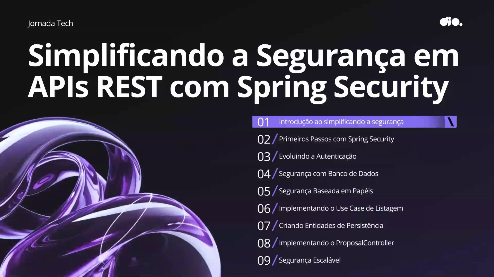

Slide de abertura do curso "Jornada Tech", apresentando o tema central — segurança em APIs REST com Spring Security — e a agenda completa do módulo em nove etapas, desde a introdução aos fundamentos até a construção de um caso prático com segurança escalável.

#### Agenda do Curso

  

O instrutor apresenta a estrutura da aula: primeiro os fundamentos e conceitos de segurança (autenticação e autorização), em seguida um estudo de caso prático que será desenvolvido ao longo do curso, e por fim um roadmap com sugestões de próximos passos para o aluno.

#### A Grande Divisão: Comprovação vs. Permissão

  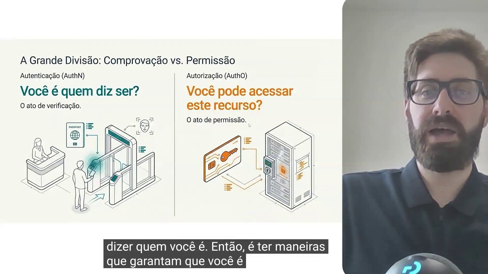

Este slide estabelece a diferença fundamental entre os dois pilares da segurança. Autenticação (AuthN) responde à pergunta "você é quem diz ser?" — é o ato de verificação da identidade. Autorização (AuthO) responde a "você pode acessar este recurso?" — é o ato de conceder ou negar permissão para uma ação ou acesso específico, já assumindo que a identidade foi confirmada.

#### Elevando a confiança na Autenticação (AuthN)

  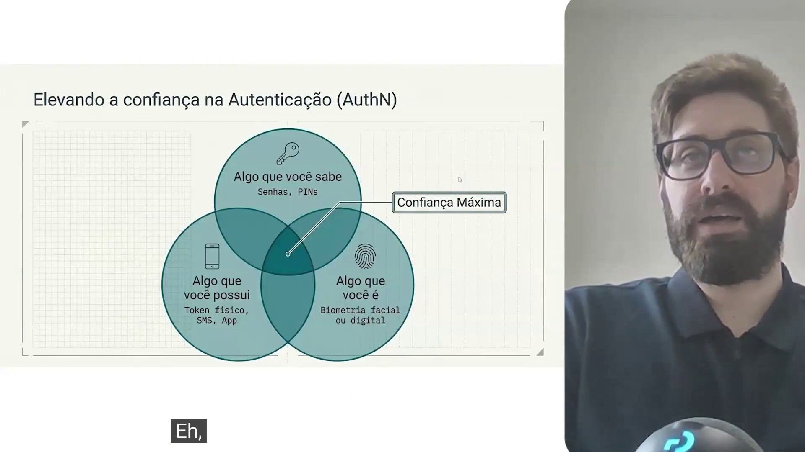

O diagrama de três círculos mostra os fatores que compõem a autenticação moderna: algo que você sabe (senhas, PINs), algo que você possui (token físico, SMS, app) e algo que você é (biometria facial ou digital). Sistemas que combinam múltiplos fatores — o conceito de autenticação multifator (MFA) — atingem o ponto de confiança máxima, representado pela interseção dos três círculos.

#### Matriz de Protocolos e Métodos de Autenticação

  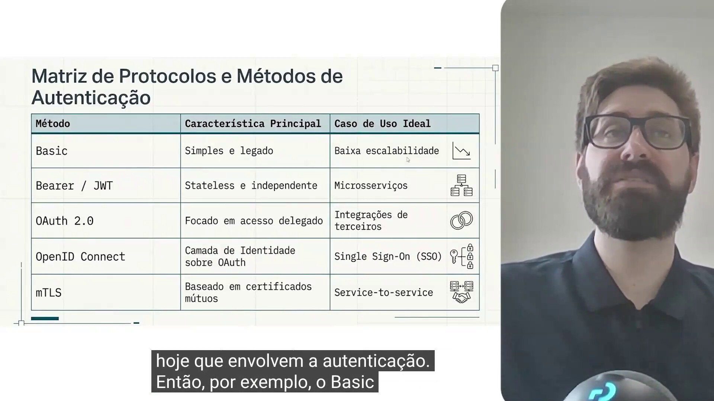

A tabela resume os principais métodos de autenticação usados hoje. O Basic Authentication é simples e legado, enviando usuário e senha a cada requisição, por isso pouco seguro e pouco escalável. O Bearer/JWT (JSON Web Token) carrega as informações do usuário já autenticado dentro de um token criptografado, tornando a aplicação stateless — sem necessidade de controlar sessões — e é o padrão mais usado em comunicação entre microsserviços. O OAuth 2.0 é voltado a acesso delegado, como o login via redes sociais em aplicações de terceiros. O OpenID Connect adiciona uma camada de identidade sobre o OAuth, viabilizando Single Sign-On (SSO). Por fim, o mTLS (Mutual TLS) usa certificados mútuos entre dois serviços, sendo ideal para comunicação service-to-service.

#### Delegação de complexidade via Identity Providers

  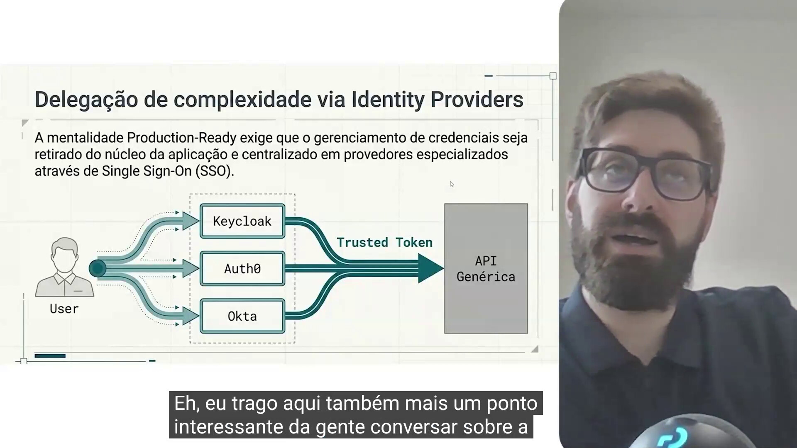

A mentalidade "Production-Ready" recomenda não implementar o gerenciamento de credenciais dentro da própria aplicação. Em vez disso, esse gerenciamento é centralizado em um Identity Provider especializado — como Keycloak, Auth0 ou Okta — que entrega um token confiável (Trusted Token) para a API. O Keycloak é a opção open source recomendada; Auth0 e Okta são alternativas pagas. Delegar essa responsabilidade evita o esforço de manter uma camada inteira de segurança (senhas, reset, integrações externas) sempre atualizada dentro do próprio sistema.

#### Defense in Depth: A mentalidade Production-Ready

  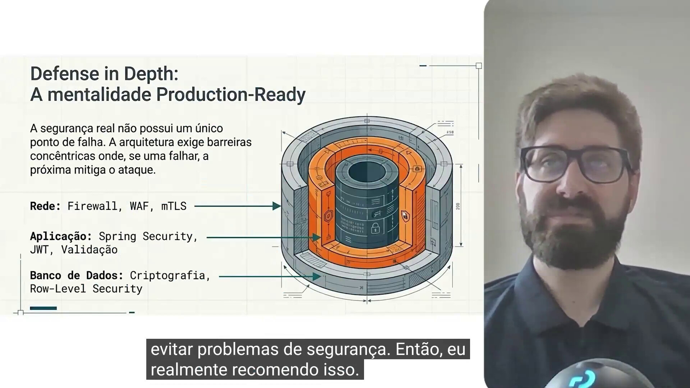

O conceito de Defense in Depth (defesa em profundidade) parte da ideia de que a segurança real não deve depender de um único ponto de falha, mas sim de barreiras concêntricas: se uma camada falhar, a próxima mitiga o ataque. Na camada de Rede, isso envolve firewall, WAF e mTLS. Na camada de Aplicação, o uso de Spring Security, validação de JWT e validações de entrada. Na camada de Banco de Dados, criptografia dos dados e mecanismos como Row-Level Security, que restringem o acesso a registros conforme o usuário.

#### O espectro da Autorização (AuthO)

  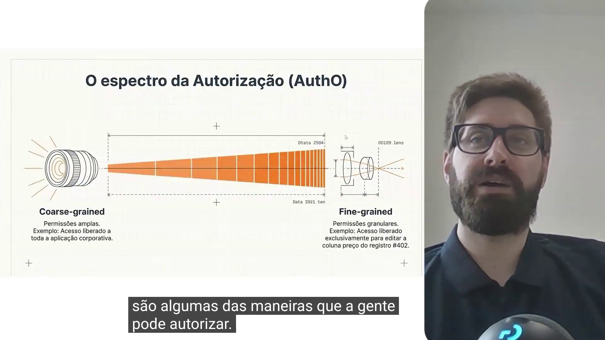

A ilustração da lente representa o espectro de granularidade da autorização. No extremo coarse-grained (grão grosso), as permissões são amplas — por exemplo, acesso liberado a toda a aplicação com base em uma role simples, como admin ou user. No extremo fine-grained (grão fino), as permissões são muito mais específicas, podendo restringir o acesso a uma ação sobre um único registro, como editar apenas um campo de um item específico.

#### Modelos de Decisão: Estrutura vs. Contexto

  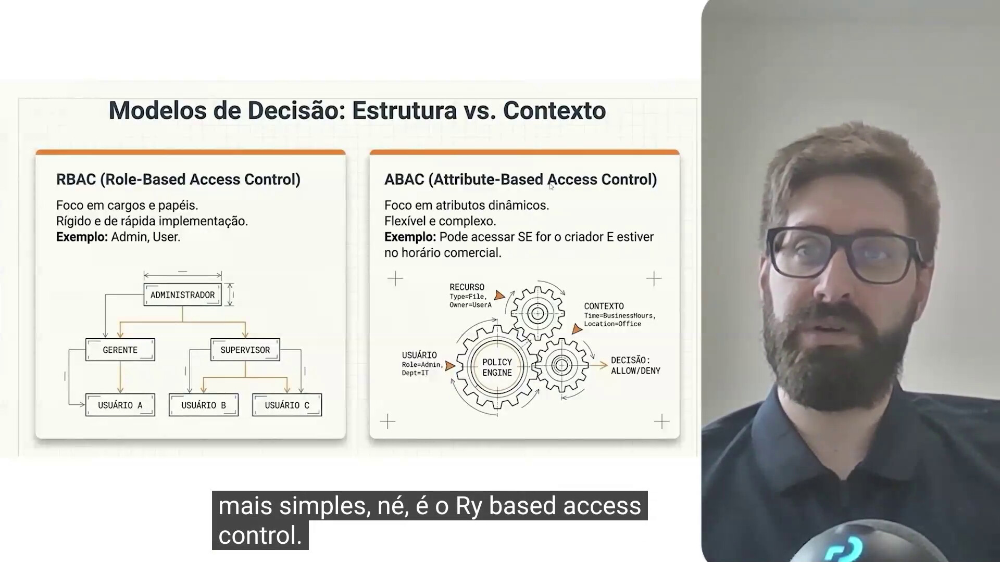

Dois modelos de controle de acesso são comparados. O RBAC (Role-Based Access Control) é focado em cargos e papéis, é rígido e de implementação rápida — o exemplo clássico é a distinção entre roles como admin e user, organizadas hierarquicamente. Já o ABAC (Attribute-Based Access Control) é mais flexível e complexo, avaliando atributos dinâmicos do usuário, do recurso e do contexto (como horário ou localização) para decidir, em tempo real, se o acesso deve ser permitido ou negado.

#### A orquestração da decisão: O modelo NIST

  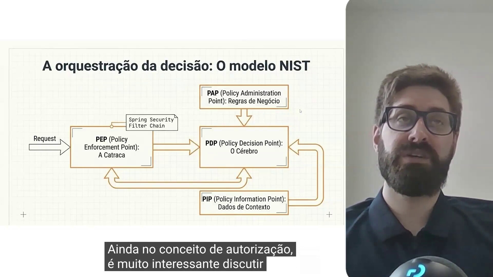

O diagrama apresenta o modelo de autorização definido pelo NIST (National Institute of Standards and Technology), organizado em quatro componentes principais. O PEP (Policy Enforcement Point) é a "catraca" — o ponto central que recebe a requisição e aplica a autorização; no Spring Security, esse papel é exercido pela filter chain, e em arquiteturas maiores pode ser um API Gateway ou o próprio Keycloak. O PAP (Policy Administration Point) define as regras de negócio, como roles, contexto e a forma como as políticas se aplicam. O PIP (Policy Information Point) recupera os dados de contexto do usuário e da requisição. Por fim, o PDP (Policy Decision Point) — o "cérebro" — reúne todas essas informações, avalia as políticas relacionadas ao endpoint e decide se o usuário pode prosseguir ou é bloqueado. No Spring Security esses componentes já vêm integrados; ao usar o Keycloak, os recursos completos do modelo só entram em ação se o Keycloak Authorization Services for habilitado — caso contrário, o Keycloak cobre principalmente a autenticação.

#### A anatomia completa de uma requisição segura

  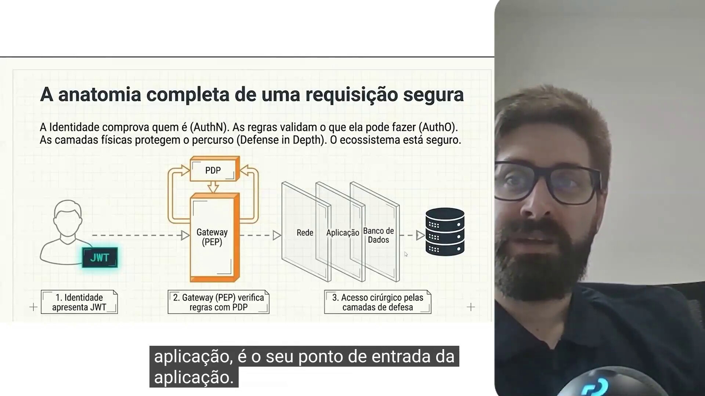

Este diagrama resume o fluxo completo de uma requisição segura: a identidade comprova quem o usuário é (AuthN) por meio de uma credencial como o JWT; o Gateway, atuando como PEP, verifica as regras junto ao PDP; e, uma vez validado, o acesso é concedido de forma cirúrgica através das camadas de defesa — rede, aplicação e banco de dados — até alcançar o recurso solicitado. É a junção prática de tudo o que foi discutido sobre autenticação, autorização e defesa em profundidade.

#### Influencer & Brand Connect: O Modelo de Segurança

  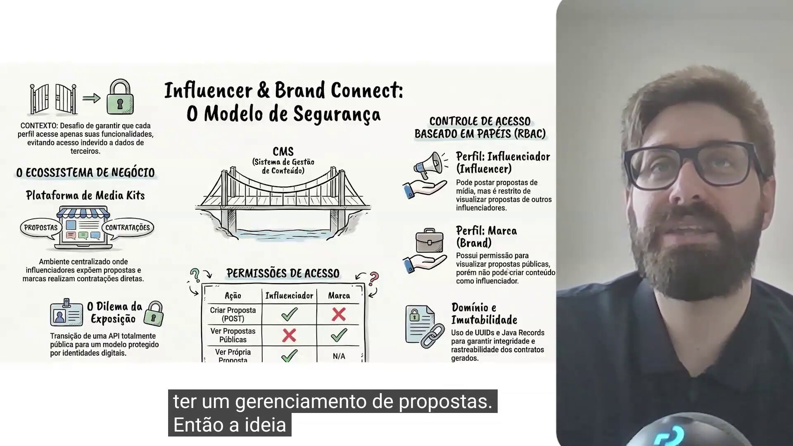

Apresentação do estudo de caso que será desenvolvido no curso: uma plataforma de gerenciamento de propostas entre influenciadores digitais e marcas. O influenciador pode criar propostas de mídia, mas não tem acesso às propostas de outros influenciadores — só pode ver as suas próprias. A marca, por sua vez, pode visualizar as propostas públicas disponíveis para contratação, mas não pode criar propostas como um influenciador faria. Esse controle de acesso é implementado com RBAC (papéis de Influenciador e Marca), e a tabela de permissões deixa claro quem pode criar, ver propostas públicas ou ver a própria proposta. O uso de UUIDs e Java Records é indicado como forma de garantir integridade e rastreabilidade dos contratos gerados.

### 🟩 Vídeo 02 - Primeiros Passos com Spring Security

<video width="60%" controls>
  <source src="000-Midia_e_Anexos/bootcamp_ntt_data_java_spring_ai-modulo.04-curso.02-video_02.webm" type="video/webm">
    Seu navegador não suporta vídeo HTML5.
</video>

link do vídeo: https://web.dio.me/track/ntt-data-2026-ai-java-back-end/course/simplificando-a-seguranca-em-apis-rest-com-spring-security/learning/acb58be5-1969-47f8-b340-2b1eca9e74f4?autoplay=1

### Anotações

### 🟩 Vídeo 03 - Primeiros Passos com Spring Security

<video width="60%" controls>
  <source src="000-Midia_e_Anexos/bootcamp_ntt_data_java_spring_ai-modulo.04-curso.02-video_03.webm" type="video/webm">
    Seu navegador não suporta vídeo HTML5.
</video>

link do vídeo:

### 🟩 Vídeo 04 - Evoluindo a Autenticação

<video width="60%" controls>
  <source src="000-Midia_e_Anexos/bootcamp_ntt_data_java_spring_ai-modulo.04-curso.02-video_04.webm" type="video/webm">
    Seu navegador não suporta vídeo HTML5.
</video>

link do vídeo:

### 🟩 Vídeo 05 - Segurança com Banco de Dados

<video width="60%" controls>
  <source src="000-Midia_e_Anexos/bootcamp_ntt_data_java_spring_ai-modulo.04-curso.02-video_05.webm" type="video/webm">
    Seu navegador não suporta vídeo HTML5.
</video>

link do vídeo:

### 🟩 Vídeo 06 - Segurança Baseada em Papéis

<video width="60%" controls>
  <source src="000-Midia_e_Anexos/bootcamp_ntt_data_java_spring_ai-modulo.04-curso.02-video_06.webm" type="video/webm">
    Seu navegador não suporta vídeo HTML5.
</video>

link do vídeo:

### 🟩 Vídeo 07 - Implementando o Use Case de Listagem

<video width="60%" controls>
  <source src="000-Midia_e_Anexos/bootcamp_ntt_data_java_spring_ai-modulo.04-curso.02-video_07.webm" type="video/webm">
    Seu navegador não suporta vídeo HTML5.
</video>

link do vídeo:

### 🟩 Vídeo 08 - Criando Entidades de Persistência

<video width="60%" controls>
  <source src="000-Midia_e_Anexos/bootcamp_ntt_data_java_spring_ai-modulo.04-curso.02-video_08.webm" type="video/webm">
    Seu navegador não suporta vídeo HTML5.
</video>

link do vídeo:

### 🟩 Vídeo 09 - Implementando o ProposalController

<video width="60%" controls>
  <source src="000-Midia_e_Anexos/bootcamp_ntt_data_java_spring_ai-modulo.04-curso.02-video_09.webm" type="video/webm">
    Seu navegador não suporta vídeo HTML5.
</video>

link do vídeo:

### 🟩 Vídeo 10 - Segurança Escalável

<video width="60%" controls>
  <source src="000-Midia_e_Anexos/bootcamp_ntt_data_java_spring_ai-modulo.04-curso.02-video_10.webm" type="video/webm">
    Seu navegador não suporta vídeo HTML5.
</video>

link do vídeo:

### Tutoriais

### Arquivos do Projeto

# Certificado: Simplificando a Segurança em APIs REST com Spring Security

- Link na plataforma: 
- Certificado em pdf: