## Instrutor

- Thiago Poiani (Principal Engineer at Skip)
- Contato Linkedin: / [thpoiani](https://www.linkedin.com/in/thpoiani/)

## Parte 1 - Introdução ao simplificando a segurança

### 🟩 Vídeo 01 - Introdução ao simplificando a segurança

<video width="60%" controls>
  <source src="000-Midia_e_Anexos/bootcamp_ntt_data_java_spring_ai-modulo.04-curso.02-video_01.webm" type="video/webm">
    Seu navegador não suporta vídeo HTML5.
</video>

link do vídeo: https://web.dio.me/track/ntt-data-2026-ai-java-back-end/course/simplificando-a-seguranca-em-apis-rest-com-spring-security/learning/0f9aeabb-1614-435a-8808-c250a854e956?autoplay=1

### Anotações
     
#### Simplificando a Segurança em APIs REST com Spring Security

<p align="center">
  
</p>

Slide de abertura do curso "Jornada Tech", apresentando o tema central — segurança em APIs REST com Spring Security — e a agenda completa do módulo em nove etapas, desde a introdução aos fundamentos até a construção de um caso prático com segurança escalável.

#### Agenda do Curso

<p align="center">
  
</p>

O instrutor apresenta a estrutura da aula: primeiro os fundamentos e conceitos de segurança (autenticação e autorização), em seguida um estudo de caso prático que será desenvolvido ao longo do curso, e por fim um roadmap com sugestões de próximos passos para o aluno.

#### A Grande Divisão: Comprovação vs. Permissão

<p align="center">
  
</p>

Este slide estabelece a diferença fundamental entre os dois pilares da segurança. Autenticação (AuthN) responde à pergunta "você é quem diz ser?" — é o ato de verificação da identidade. Autorização (AuthO) responde a "você pode acessar este recurso?" — é o ato de conceder ou negar permissão para uma ação ou acesso específico, já assumindo que a identidade foi confirmada.

#### Elevando a confiança na Autenticação (AuthN)

<p align="center">
  
</p>

O diagrama de três círculos mostra os fatores que compõem a autenticação moderna: algo que você sabe (senhas, PINs), algo que você possui (token físico, SMS, app) e algo que você é (biometria facial ou digital). Sistemas que combinam múltiplos fatores — o conceito de autenticação multifator (MFA) — atingem o ponto de confiança máxima, representado pela interseção dos três círculos.

#### Matriz de Protocolos e Métodos de Autenticação

<p align="center">
  
</p>

A tabela resume os principais métodos de autenticação usados hoje. O Basic Authentication é simples e legado, enviando usuário e senha a cada requisição, por isso pouco seguro e pouco escalável. O Bearer/JWT (JSON Web Token) carrega as informações do usuário já autenticado dentro de um token criptografado, tornando a aplicação stateless — sem necessidade de controlar sessões — e é o padrão mais usado em comunicação entre microsserviços. O OAuth 2.0 é voltado a acesso delegado, como o login via redes sociais em aplicações de terceiros. O OpenID Connect adiciona uma camada de identidade sobre o OAuth, viabilizando Single Sign-On (SSO). Por fim, o mTLS (Mutual TLS) usa certificados mútuos entre dois serviços, sendo ideal para comunicação service-to-service.

#### Delegação de complexidade via Identity Providers

<p align="center">
  
</p>

A mentalidade "Production-Ready" recomenda não implementar o gerenciamento de credenciais dentro da própria aplicação. Em vez disso, esse gerenciamento é centralizado em um Identity Provider especializado — como Keycloak, Auth0 ou Okta — que entrega um token confiável (Trusted Token) para a API. O Keycloak é a opção open source recomendada; Auth0 e Okta são alternativas pagas. Delegar essa responsabilidade evita o esforço de manter uma camada inteira de segurança (senhas, reset, integrações externas) sempre atualizada dentro do próprio sistema.

#### Defense in Depth: A mentalidade Production-Ready

<p align="center">
  
</p>

O conceito de Defense in Depth (defesa em profundidade) parte da ideia de que a segurança real não deve depender de um único ponto de falha, mas sim de barreiras concêntricas: se uma camada falhar, a próxima mitiga o ataque. Na camada de Rede, isso envolve firewall, WAF e mTLS. Na camada de Aplicação, o uso de Spring Security, validação de JWT e validações de entrada. Na camada de Banco de Dados, criptografia dos dados e mecanismos como Row-Level Security, que restringem o acesso a registros conforme o usuário.

#### O espectro da Autorização (AuthO)

<p align="center">
  
</p>

A ilustração da lente representa o espectro de granularidade da autorização. No extremo coarse-grained (grão grosso), as permissões são amplas — por exemplo, acesso liberado a toda a aplicação com base em uma role simples, como admin ou user. No extremo fine-grained (grão fino), as permissões são muito mais específicas, podendo restringir o acesso a uma ação sobre um único registro, como editar apenas um campo de um item específico.

#### Modelos de Decisão: Estrutura vs. Contexto

<p align="center">
  
</p>

Dois modelos de controle de acesso são comparados. O RBAC (Role-Based Access Control) é focado em cargos e papéis, é rígido e de implementação rápida — o exemplo clássico é a distinção entre roles como admin e user, organizadas hierarquicamente. Já o ABAC (Attribute-Based Access Control) é mais flexível e complexo, avaliando atributos dinâmicos do usuário, do recurso e do contexto (como horário ou localização) para decidir, em tempo real, se o acesso deve ser permitido ou negado.

#### A orquestração da decisão: O modelo NIST

<p align="center">
  
</p>

O diagrama apresenta o modelo de autorização definido pelo NIST (National Institute of Standards and Technology), organizado em quatro componentes principais. O PEP (Policy Enforcement Point) é a "catraca" — o ponto central que recebe a requisição e aplica a autorização; no Spring Security, esse papel é exercido pela filter chain, e em arquiteturas maiores pode ser um API Gateway ou o próprio Keycloak. O PAP (Policy Administration Point) define as regras de negócio, como roles, contexto e a forma como as políticas se aplicam. O PIP (Policy Information Point) recupera os dados de contexto do usuário e da requisição. Por fim, o PDP (Policy Decision Point) — o "cérebro" — reúne todas essas informações, avalia as políticas relacionadas ao endpoint e decide se o usuário pode prosseguir ou é bloqueado. No Spring Security esses componentes já vêm integrados; ao usar o Keycloak, os recursos completos do modelo só entram em ação se o Keycloak Authorization Services for habilitado — caso contrário, o Keycloak cobre principalmente a autenticação.

#### A anatomia completa de uma requisição segura

<p align="center">
  
</p>

Este diagrama resume o fluxo completo de uma requisição segura: a identidade comprova quem o usuário é (AuthN) por meio de uma credencial como o JWT; o Gateway, atuando como PEP, verifica as regras junto ao PDP; e, uma vez validado, o acesso é concedido de forma cirúrgica através das camadas de defesa — rede, aplicação e banco de dados — até alcançar o recurso solicitado. É a junção prática de tudo o que foi discutido sobre autenticação, autorização e defesa em profundidade.

#### Influencer & Brand Connect: O Modelo de Segurança

<p align="center">
  
</p>

Apresentação do estudo de caso que será desenvolvido no curso: uma plataforma de gerenciamento de propostas entre influenciadores digitais e marcas. O influenciador pode criar propostas de mídia, mas não tem acesso às propostas de outros influenciadores — só pode ver as suas próprias. A marca, por sua vez, pode visualizar as propostas públicas disponíveis para contratação, mas não pode criar propostas como um influenciador faria. Esse controle de acesso é implementado com RBAC (papéis de Influenciador e Marca), e a tabela de permissões deixa claro quem pode criar, ver propostas públicas ou ver a própria proposta. O uso de UUIDs e Java Records é indicado como forma de garantir integridade e rastreabilidade dos contratos gerados.


### 🟩 Vídeo 02 - Primeiros Passos com Spring Security

<video width="60%" controls>
  <source src="000-Midia_e_Anexos/bootcamp_ntt_data_java_spring_ai-modulo.04-curso.02-video_02.webm" type="video/webm">
    Seu navegador não suporta vídeo HTML5.
</video>

link do vídeo: https://web.dio.me/track/ntt-data-2026-ai-java-back-end/course/simplificando-a-seguranca-em-apis-rest-com-spring-security/learning/acb58be5-1969-47f8-b340-2b1eca9e74f4?autoplay=1

### Anotações

<p align="center">
  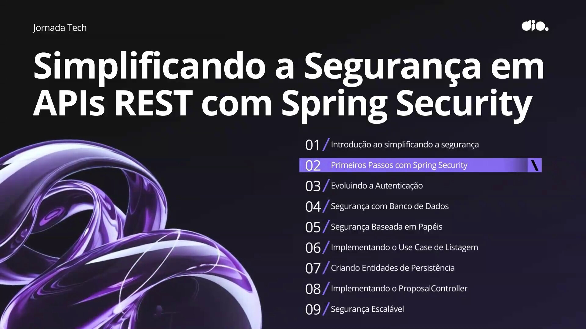
</p>

Slide de abertura da aula, parte da trilha **Jornada Tech**. O tema apresentado é *"Simplificando a Segurança em APIs REST com Spring Security"*, com o sumário do módulo em destaque no item 02, **"Primeiros Passos com Spring Security"** — que é justamente o assunto tratado nesta aula.

<p align="center">
  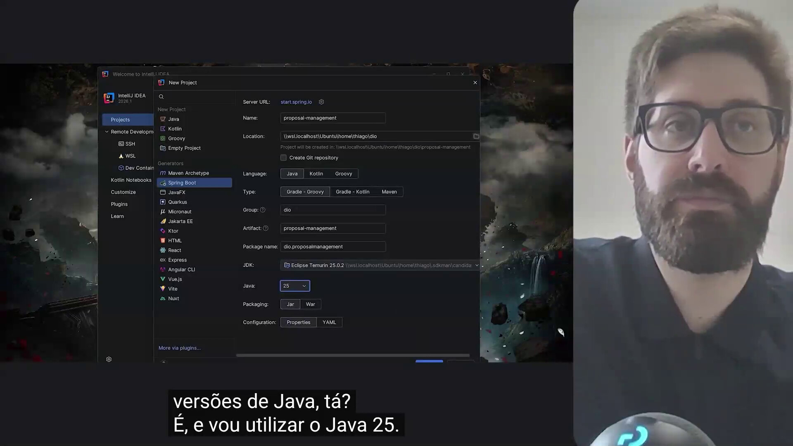
</p>

Tela de criação de um novo projeto no IntelliJ IDEA usando o gerador **Spring Boot** (start.spring.io). O projeto recebe o nome `proposal-management`, grupo `dio`, pacote `dio.proposalmanagement`, build **Gradle - Groovy** e a versão de linguagem definida é **Java 25** (via Eclipse Temurin, gerenciado pelo SDKMAN).

<p align="center">
  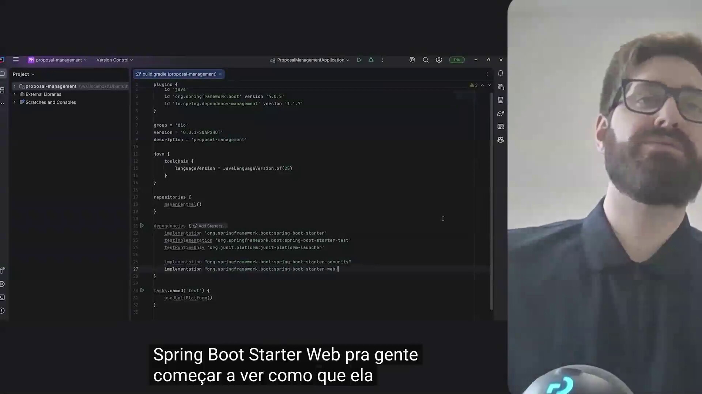
</p>

Arquivo `build.gradle` do projeto recém-criado, já configurado com o toolchain para Java 25. Nesse momento são adicionadas as duas primeiras dependências do projeto:

```groovy
implementation 'org.springframework.boot:spring-boot-starter-security'
implementation 'org.springframework.boot:spring-boot-starter-web'
```

O *Spring Boot Starter Security* traz o Spring Security para o projeto, e o *Starter Web* permite observar como a segurança se comporta em uma aplicação web.

<p align="center">
  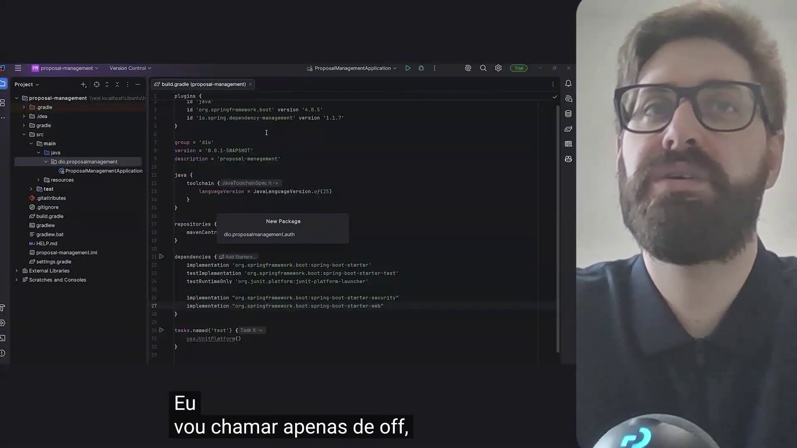
</p>

Criação do primeiro pacote do projeto, chamado `auth` (dentro de `dio.proposalmanagement`), reunindo os conceitos de autenticação e autorização em um único módulo.

<p align="center">
  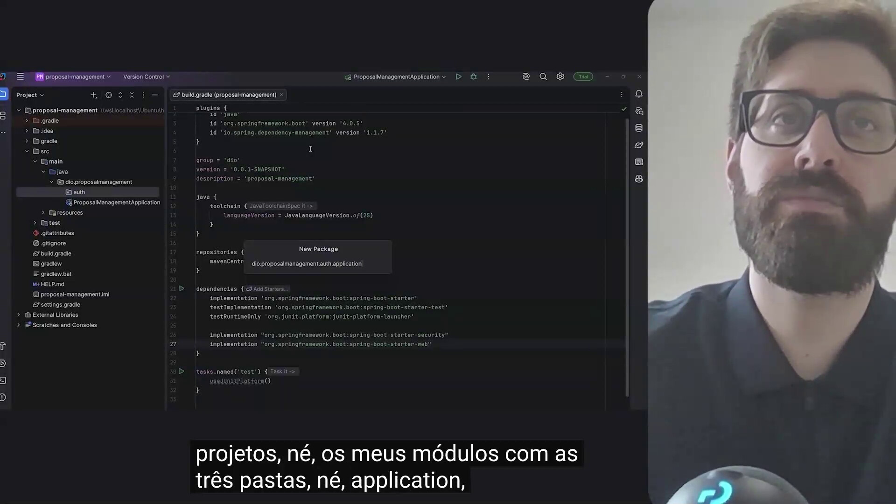
</p>

Dentro do pacote `auth`, é criado o subpacote `application`, seguindo a organização em camadas do Domain Driven Design. A camada de aplicação é responsável por orquestrar as regras de negócio, chamando services e repositories.

<p align="center">
  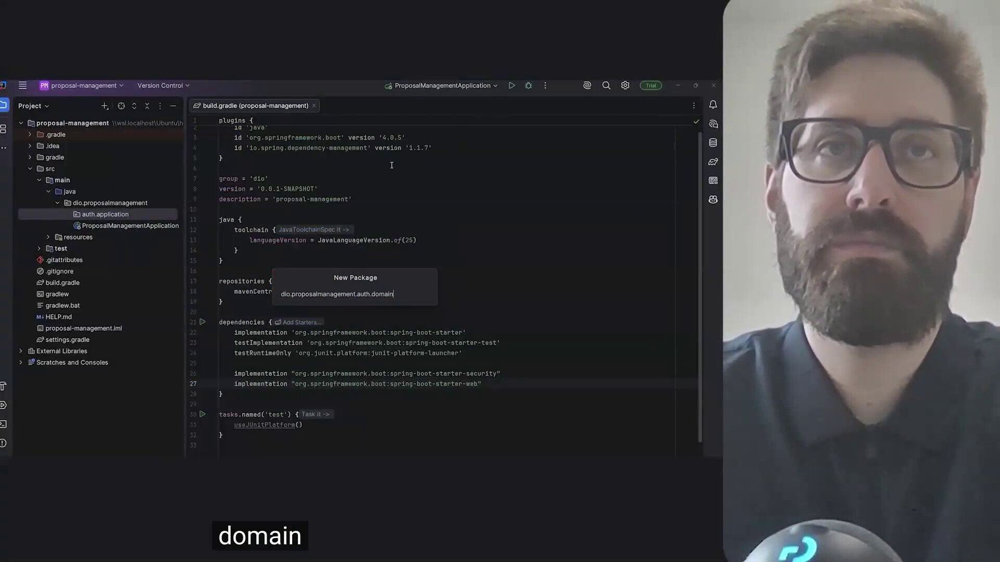
</p>

Em seguida, é criado o subpacote `domain`, que representa a camada mais interna do módulo — onde ficam as regras de negócio, sem dependência de frameworks externos.

<p align="center">
  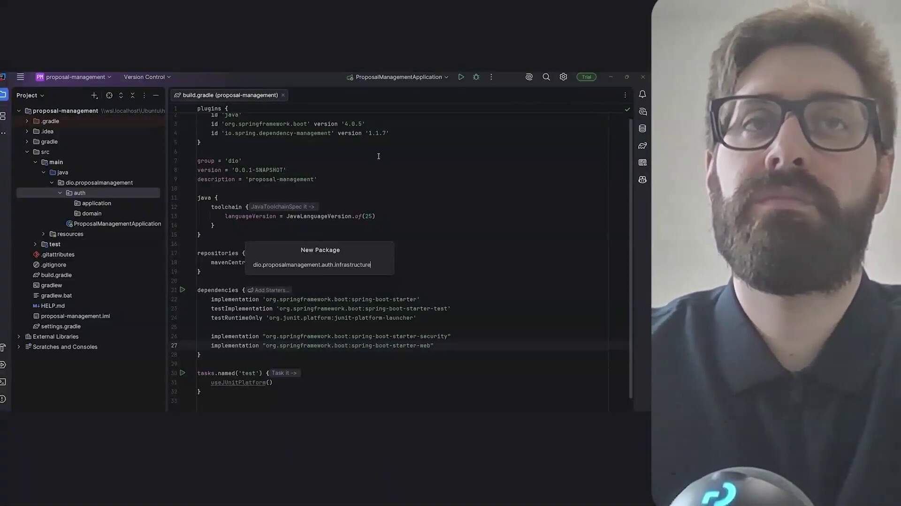
</p>

Por fim, é criado o subpacote `infrastructure`, responsável por tudo que é externo ao domínio: controllers, configurações de autenticação, acesso a banco de dados, entre outros. Com isso, o módulo `auth` fica estruturado nas três camadas: `application`, `domain` e `infrastructure`.

<p align="center">
  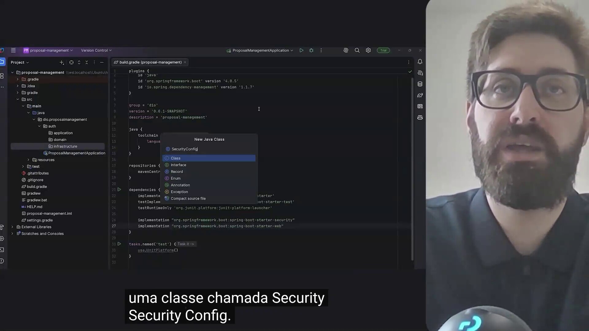
</p>

Criação da primeira classe de configuração do módulo, chamada **SecurityConfig**, que ficará responsável por centralizar as configurações do Spring Security.

<p align="center">
  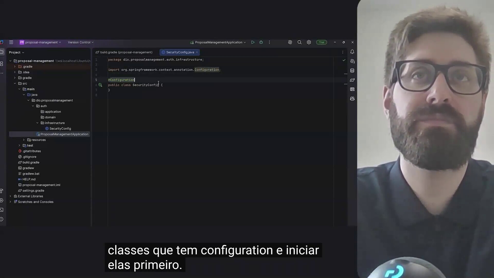
</p>

A classe `SecurityConfig` recém-criada é anotada com `@Configuration`, anotação do Spring que sinaliza que essa classe deve ser processada e inicializada durante o `component scan`, o mesmo mecanismo usado por `@SpringBootApplication` para descobrir classes de configuração.

```java
package dio.proposalmanagement.auth.infrastructure;

import org.springframework.context.annotation.Configuration;

@Configuration
public class SecurityConfig {
}
```

<p align="center">
  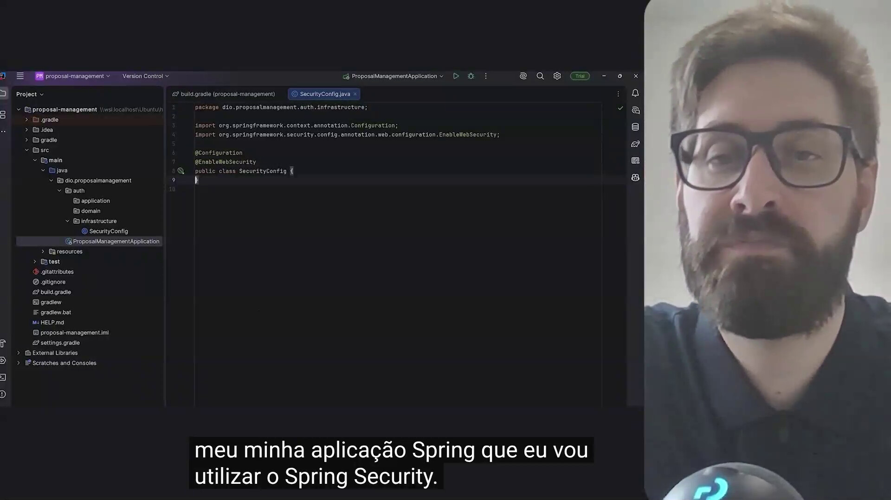
</p>

É adicionada a anotação `@EnableWebSecurity`, que indica explicitamente à aplicação Spring que o Spring Security deve ser utilizado.

```java
@Configuration
@EnableWebSecurity
public class SecurityConfig {
}
```

<p align="center">
  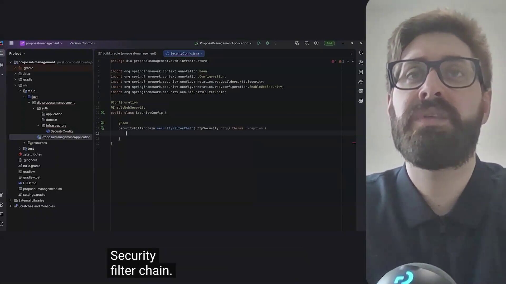
</p>

Início da criação do bean `SecurityFilterChain`, o ponto central de configuração de segurança do Spring Security — é ele quem define por quais filtros as requisições HTTP vão passar.

```java
@Bean
SecurityFilterChain securityFilterChain(HttpSecurity http) throws Exception {

}
```

<p align="center">
  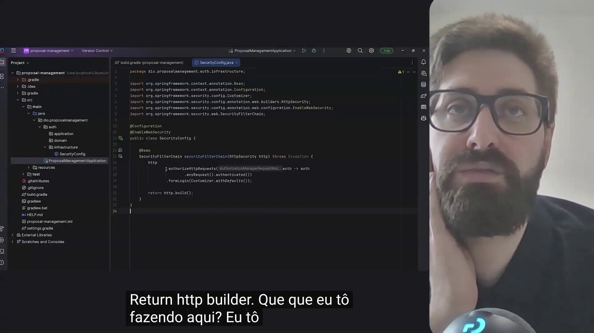
</p>

O corpo do bean `SecurityFilterChain` é completado, definindo que qualquer requisição precisa estar autenticada e habilitando a autenticação via formulário (`form login`) com as configurações padrão:

```java
@Bean
SecurityFilterChain securityFilterChain(HttpSecurity http) throws Exception {
    http
        .authorizeHttpRequests(auth -> auth
            .anyRequest().authenticated())
        .formLogin(Customizer.withDefaults());

    return http.build();
}
```

Esse formulário padrão é a forma mais simples que o Spring Security oferece para coletar usuário e senha antes de conceder acesso.

<p align="center">
  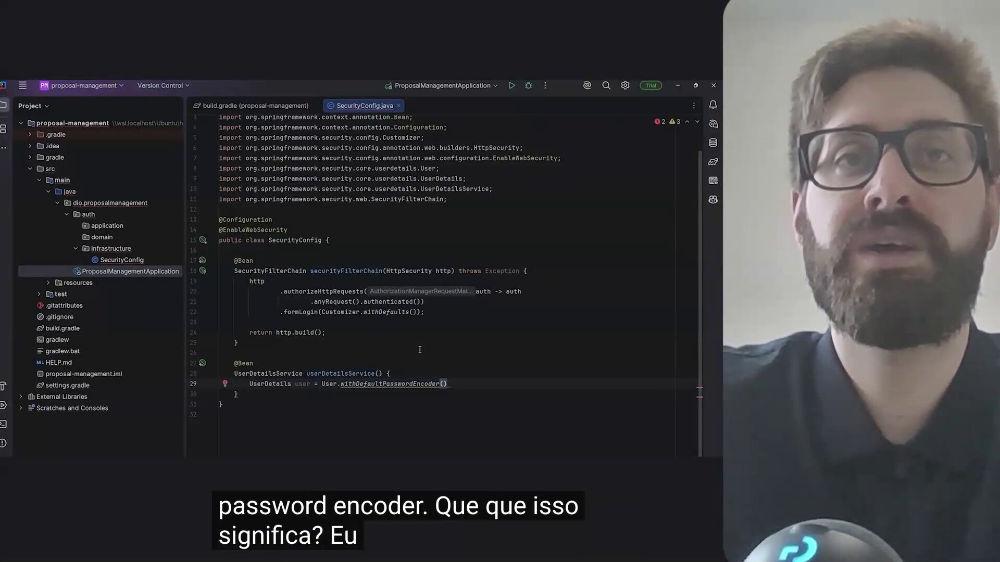
</p>

Para validar usuário e senha, é criado um bean `UserDetailsService`, responsável por fornecer os dados de autenticação para o `AuthenticationProvider`. O primeiro usuário é criado com `User.withDefaultPasswordEncoder()`, deixando o Spring escolher automaticamente o algoritmo de criptografia (nesse caso, BCrypt) para a senha:

```java
@Bean
UserDetailsService userDetailsService() {
    UserDetails user = User.withDefaultPasswordEncoder()
}
```

<p align="center">
  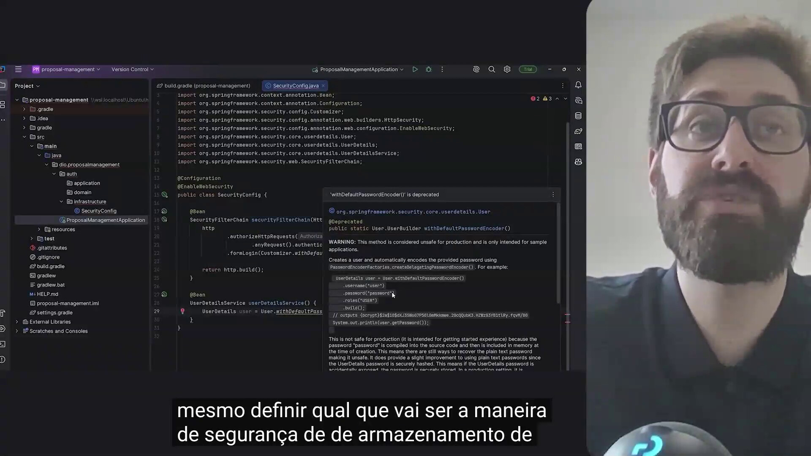
</p>

O próprio IntelliJ sinaliza que o método `withDefaultPasswordEncoder()` está **deprecated (obsoleto)**, alertando que essa abordagem não é segura para aplicações em produção — ela é indicada apenas para fins de exemplo, já que a senha em texto puro acaba compilada junto ao código-fonte antes de ser criptografada em memória.

<p align="center">
  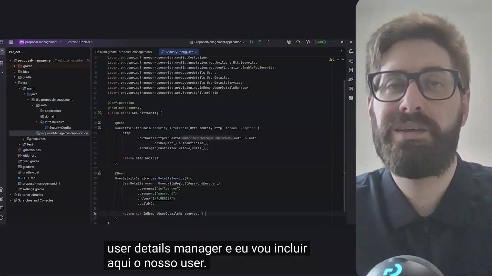
</p>

O primeiro usuário em memória é finalizado: username `influencer`, senha `password` e role `INFLUENCER`. Esse usuário é então registrado em um `InMemoryUserDetailsManager`, retornado pelo bean `UserDetailsService`:

```java
@Bean
UserDetailsService userDetailsService() {
    UserDetails user = User.withDefaultPasswordEncoder()
            .username("influencer")
            .password("password")
            .roles("INFLUENCER")
            .build();

    return new InMemoryUserDetailsManager(user);
}
```

<p align="center">
  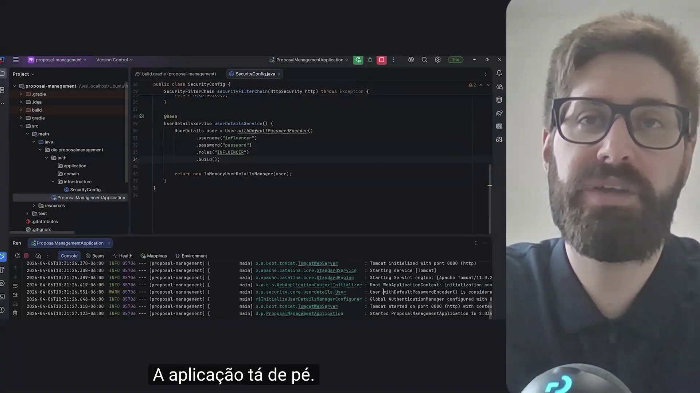
</p>

Console do IntelliJ mostrando a aplicação Spring Boot iniciada com sucesso na porta 8080, confirmando que a configuração inicial do Spring Security está funcional.

<p align="center">
  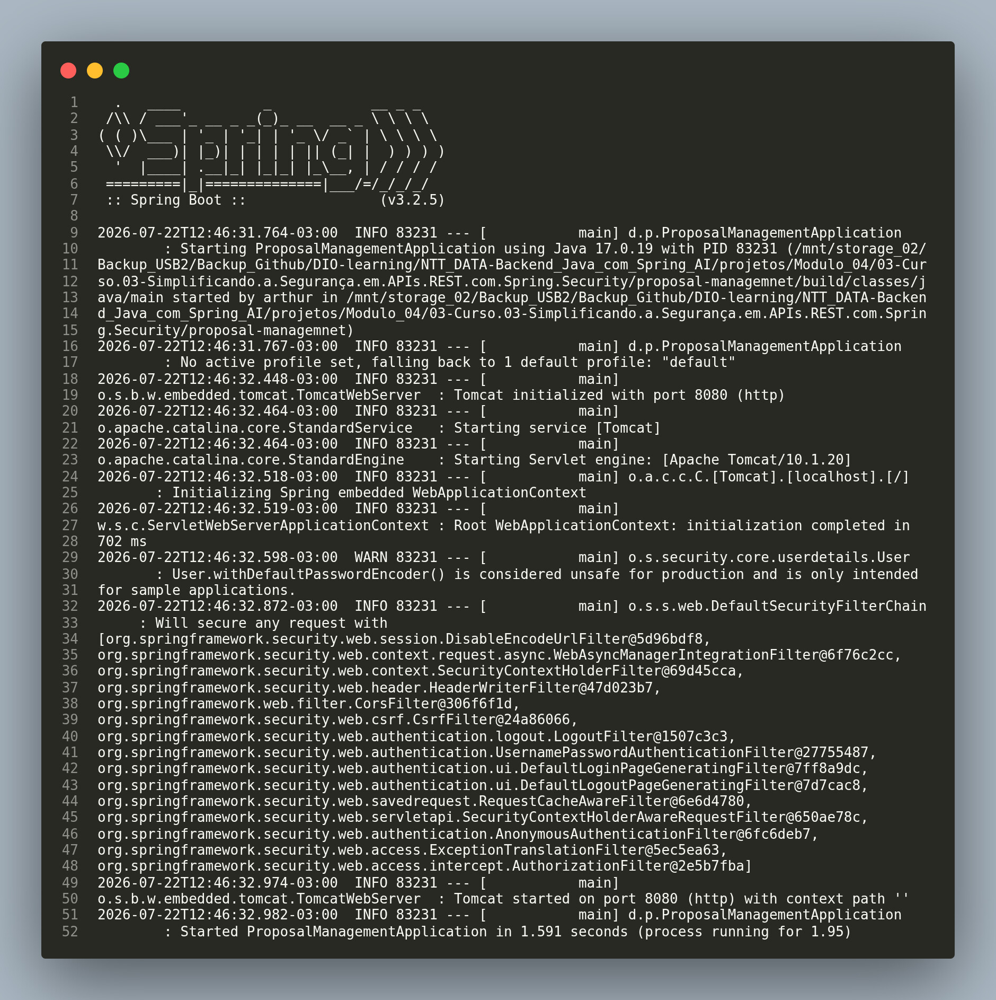
</p>

Saída completa do terminal ao subir a aplicação: o banner ASCII do Spring Boot, seguido do log de inicialização. Destaca-se o aviso de que `User.withDefaultPasswordEncoder()` não é seguro para produção, e a listagem da cadeia padrão de filtros de segurança (`DefaultSecurityFilterChain`) que passa a proteger qualquer requisição feita à aplicação.

<p align="center">
  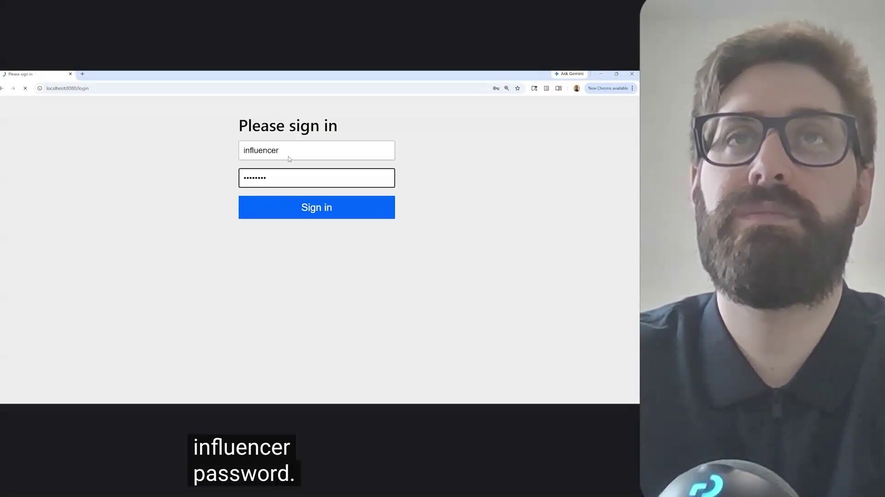
</p>

Acessando `localhost:8080`, a aplicação redireciona automaticamente para a tela de login padrão do Spring Security (`/login`). São informados usuário `influencer` e senha `password` para autenticação.

<p align="center">
  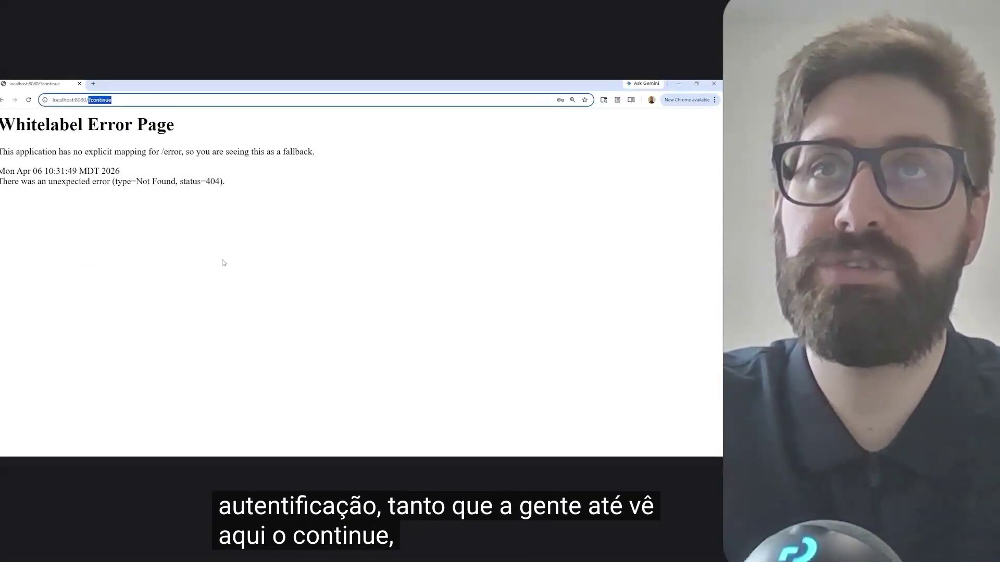
</p>

Após o login bem-sucedido, o Spring Security tenta redirecionar para a URL originalmente solicitada através do parâmetro `/continue`, mas como ainda não existe nenhum endpoint mapeado na aplicação, é exibida a **Whitelabel Error Page** com status `404 Not Found`. Isso confirma que a autenticação funcionou — falta apenas criar um endpoint para receber a requisição.

<p align="center">
  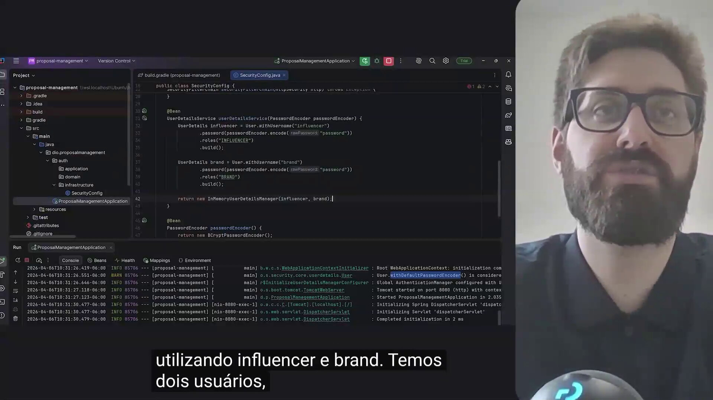
</p>

A classe `SecurityConfig` é evoluída: agora existem dois usuários em memória, `influencer` e `brand`, ambos com senha `password`, e um bean `PasswordEncoder` baseado em `BCryptPasswordEncoder` é declarado, preparando o terreno para substituir o encoder padrão (obsoleto) por um explícito:

```java
UserDetails brand = User.withUsername("brand")
        .password(passwordEncoder.encode("password"))
        .roles("BRAND")
        .build();

return new InMemoryUserDetailsManager(influencer, brand);
```

<p align="center">
  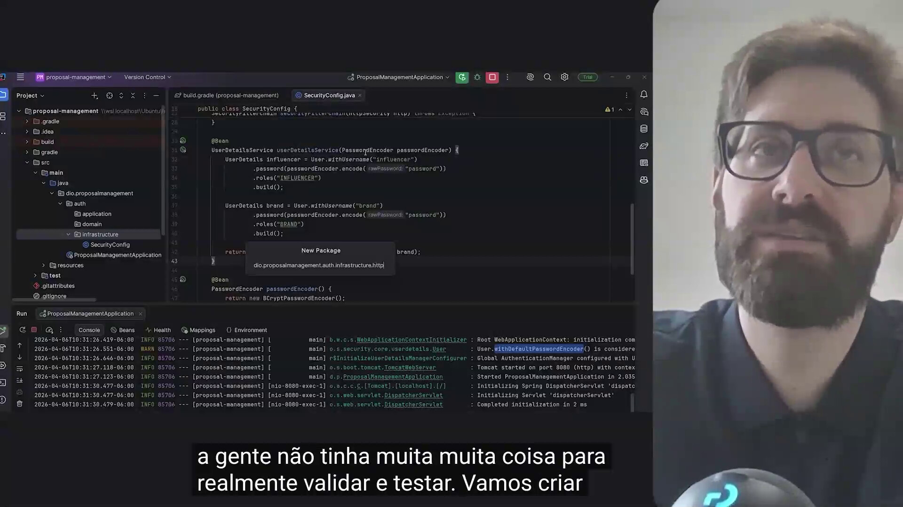
</p>

Dentro de `infrastructure`, é criado o subpacote `http`, destinado a abrigar os controllers da aplicação.

<p align="center">
  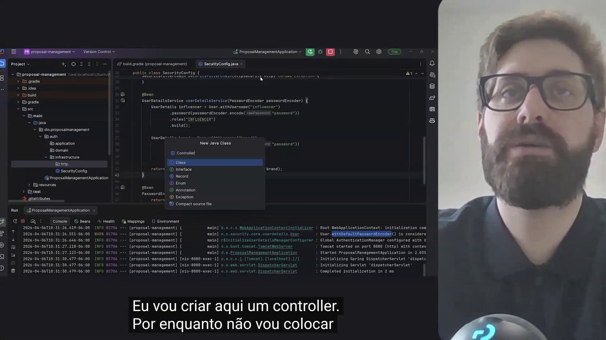
</p>

Criação da primeira classe de controller do projeto, chamada simplesmente `Controller`, ainda sem um nome mais específico, já que o objetivo inicial é apenas validar o comportamento da autenticação.

<p align="center">
  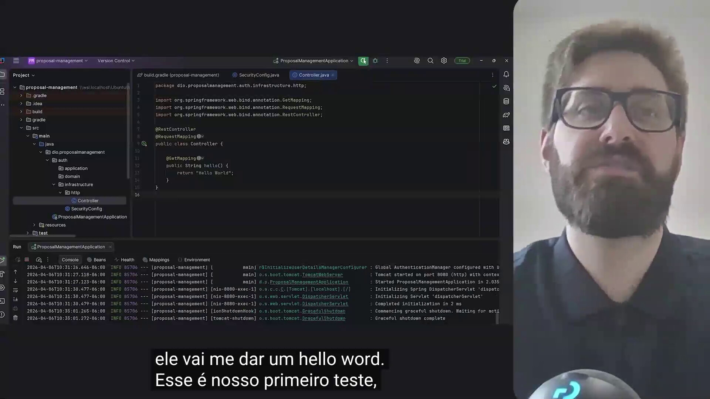
</p>

O `Controller` é implementado com `@RestController` e `@RequestMapping` na raiz (`/`), expondo um endpoint `GET` que devolve a mensagem `"Hello World"`, servindo como primeiro teste de autenticação:

```java
@RestController
@RequestMapping
public class Controller {

    @GetMapping
    public String hello() {
        return "Hello World";
    }
}
```

<p align="center">
  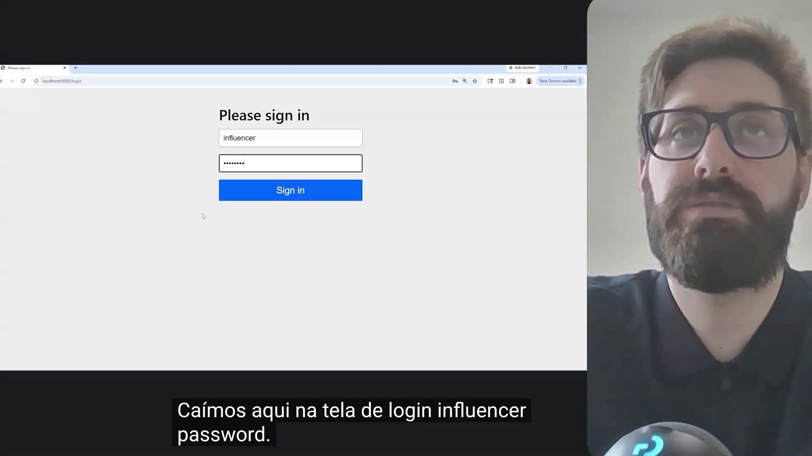
</p>

Ao acessar `localhost:8080` novamente, a tela de login é exibida uma vez mais, confirmando que qualquer endpoint da aplicação exige autenticação prévia. É informado o usuário `influencer` com a senha `password`.

<p align="center">
  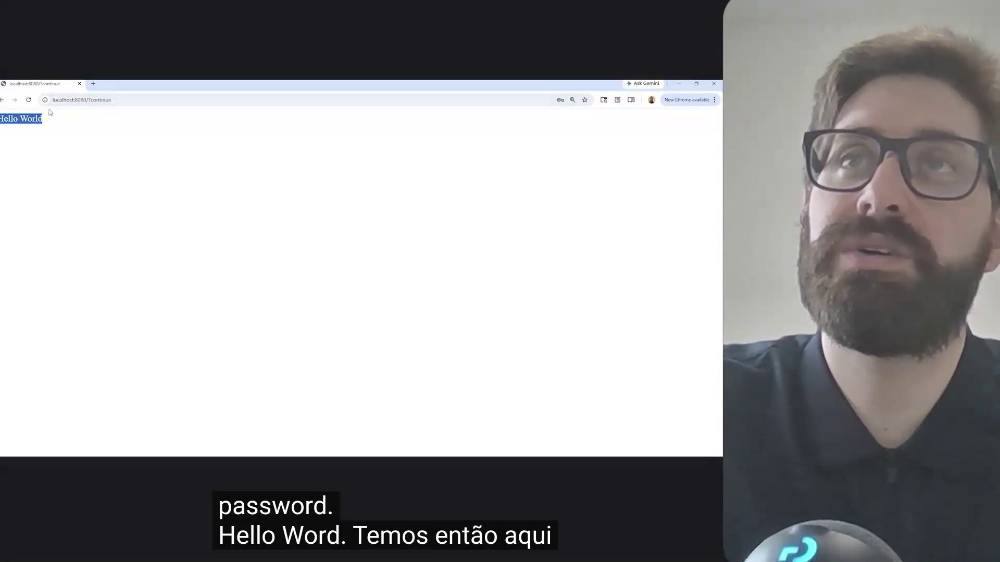
</p>

Após autenticar como `influencer`, o navegador finalmente exibe o resultado do endpoint `GET /`: a mensagem **"Hello World"**, validando que o fluxo de autenticação via formulário está funcionando de ponta a ponta.

<p align="center">
  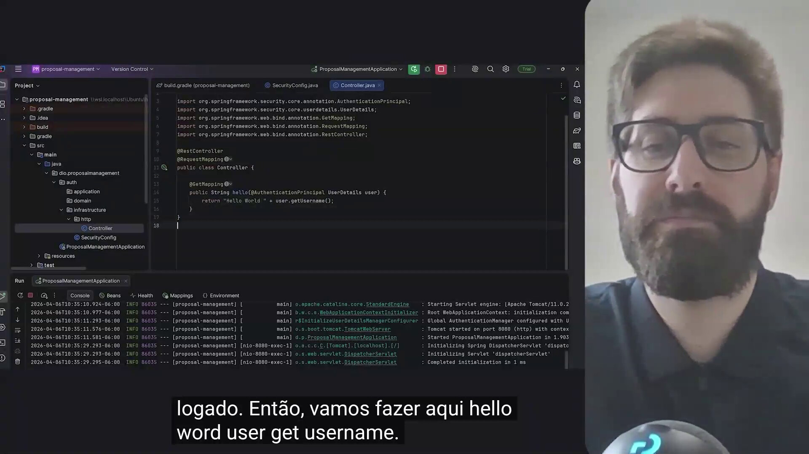
</p>

O endpoint do `Controller` é alterado para receber o usuário autenticado através da anotação `@AuthenticationPrincipal`, que retorna um `UserDetails` com as informações de quem fez login. A resposta passa a incluir o nome do usuário autenticado:

```java
@GetMapping
public String hello(@AuthenticationPrincipal UserDetails user) {
    return "Hello World " + user.getUsername();
}
```

<p align="center">
  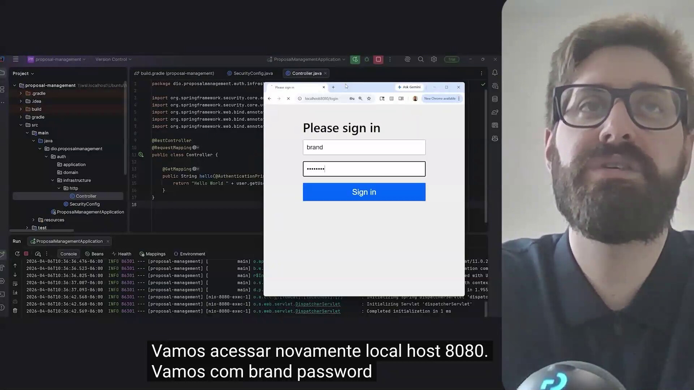
</p>

Após reiniciar a aplicação, o acesso a `localhost:8080` é feito novamente, dessa vez autenticando com o usuário `brand` e senha `password`.

<p align="center">
  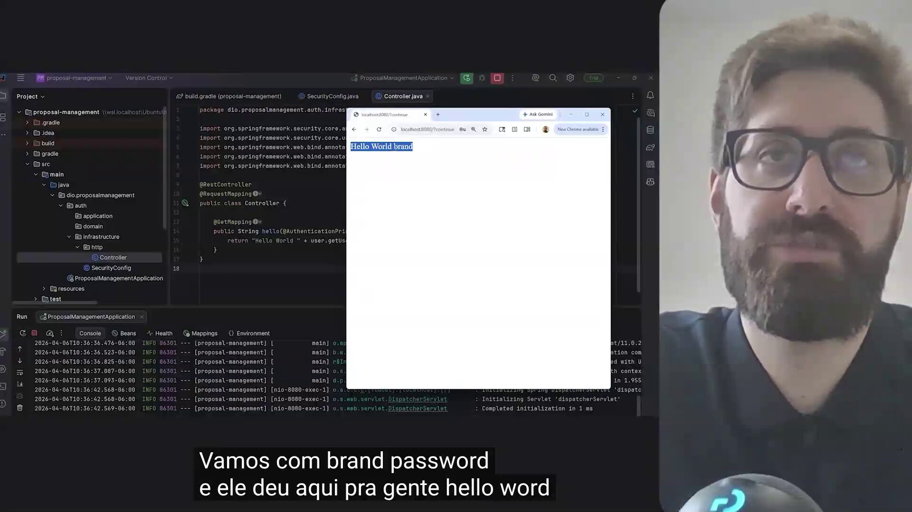
</p>

Com o usuário `brand` autenticado, a resposta do endpoint passa a exibir **"Hello World brand"**, confirmando que o `@AuthenticationPrincipal` está corretamente retornando o nome de quem está logado.

<p align="center">
  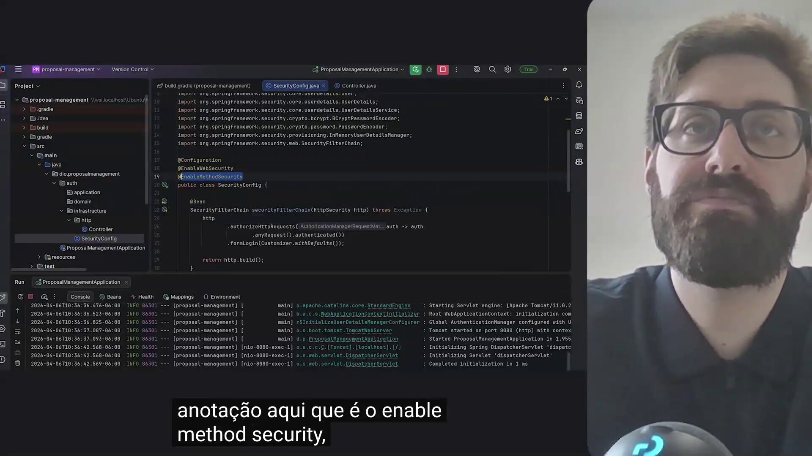
</p>

É adicionada a anotação `@EnableMethodSecurity` à classe `SecurityConfig`, habilitando o uso de anotações de segurança diretamente em métodos — como em controllers, services ou repositories — permitindo restringir o acesso com base na role do usuário autenticado.

<p align="center">
  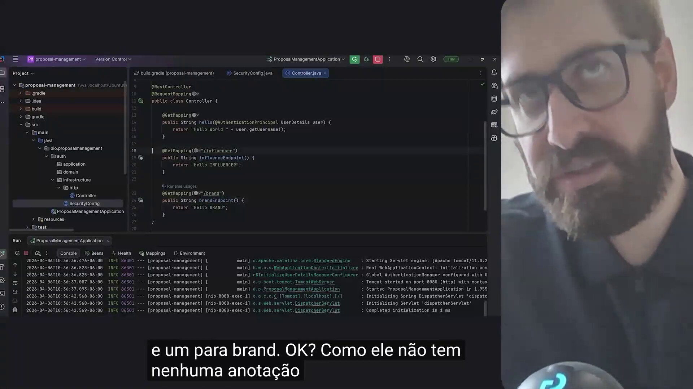
</p>

Dois novos endpoints são criados no `Controller`: `GET /influencer` e `GET /brand`. Como ainda não possuem nenhuma anotação de segurança específica, nesse momento qualquer usuário autenticado consegue acessar ambos, independentemente da sua role:

```java
@GetMapping("/influencer")
public String influenceEndpoint() {
    return "Hello INFLUENCER";
}

@GetMapping("/brand")
public String brandEndpoint() {
    return "Hello BRAND";
}
```

<p align="center">
  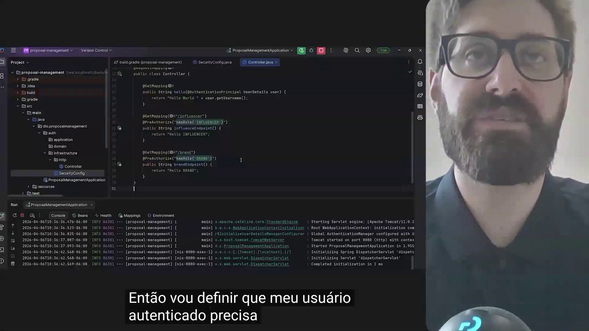
</p>

Cada endpoint recebe a anotação `@PreAuthorize`, exigindo que o usuário autenticado possua a role correspondente para poder acessá-lo:

```java
@GetMapping("/influencer")
@PreAuthorize("hasRole('INFLUENCER')")
public String influenceEndpoint() {
    return "Hello INFLUENCER";
}

@GetMapping("/brand")
@PreAuthorize("hasRole('BRAND')")
public String brandEndpoint() {
    return "Hello BRAND";
}
```

<p align="center">
  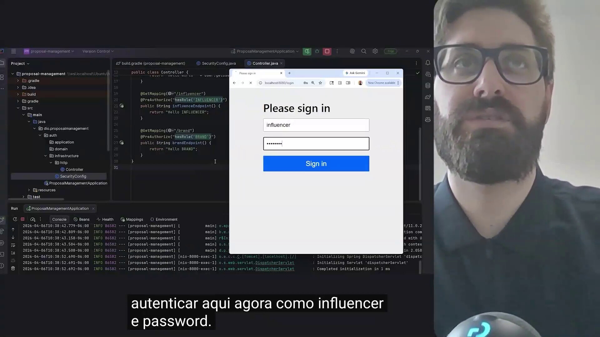
</p>

A aplicação é reiniciada e a autenticação é feita com o usuário `influencer` e senha `password`, para testar as novas regras de autorização por role.

<p align="center">
  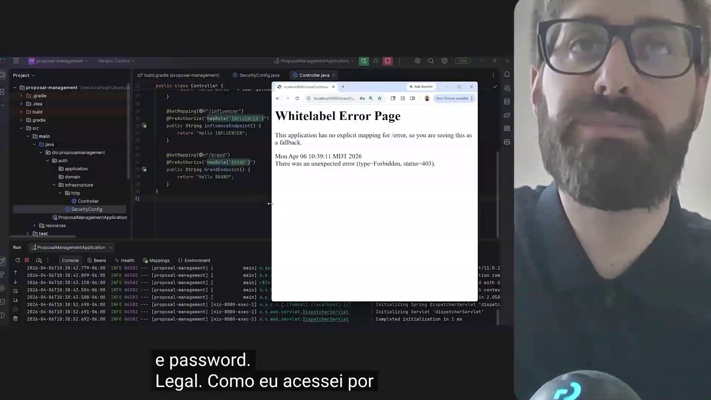
</p>

Como o último endpoint acessado antes do login foi `/brand`, o Spring Security tenta redirecionar para lá após a autenticação. Só que o usuário logado é `influencer`, que não possui a role `BRAND` exigida pelo `@PreAuthorize` daquele endpoint — resultando em uma **Whitelabel Error Page** com status `403 Forbidden`.

<p align="center">
  
</p>

Ao acessar diretamente `/influencer` estando autenticado como `influencer`, o acesso é permitido, já que o usuário possui a role exigida (`INFLUENCER`), e a resposta **"Hello INFLUENCER"** é exibida.

<p align="center">
  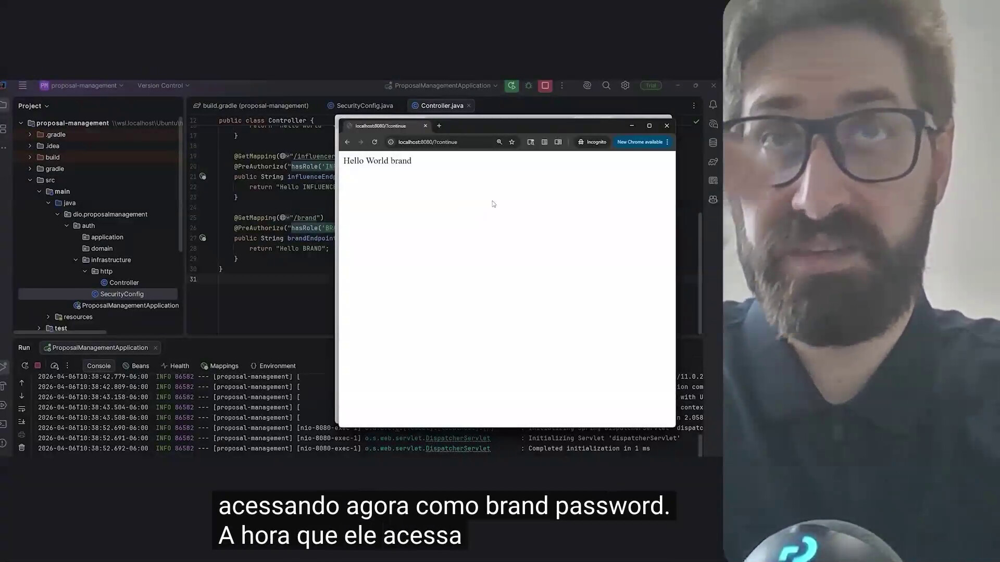
</p>

Em uma janela anônima, o teste é repetido autenticando como `brand`. Após o login, o redirecionamento para `/continue` retorna a mensagem do endpoint raiz, **"Hello World brand"**, confirmando novamente a autenticação do usuário `brand`.

<p align="center">
  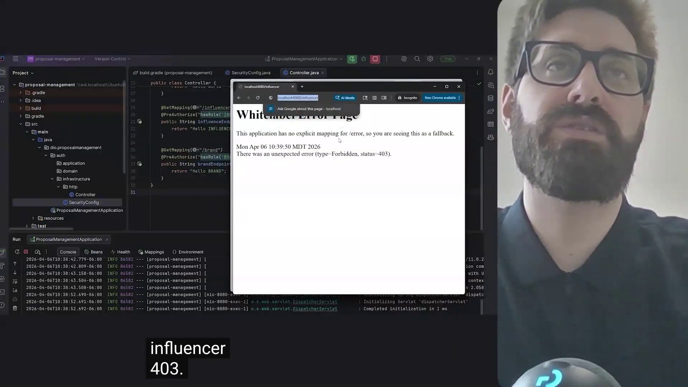
</p>

Ainda autenticado como `brand`, ao tentar acessar `/influencer` — endpoint restrito à role `INFLUENCER` — a aplicação retorna a **Whitelabel Error Page** com status `403 Forbidden`, pois o usuário `brand` não possui a role necessária.

<p align="center">
  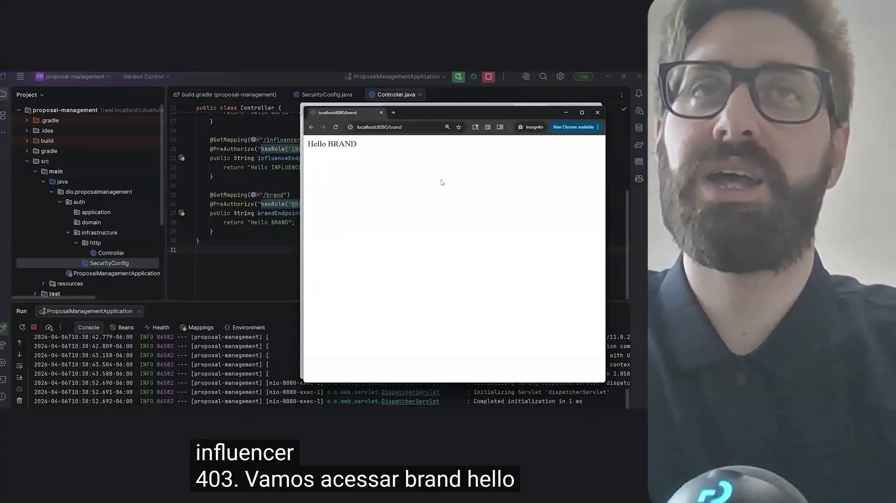
</p>

Por fim, o usuário `brand` acessa `/brand`, endpoint para o qual ele possui a role exigida (`BRAND`), recebendo como resposta **"Hello BRAND"**. Esse teste fecha a demonstração de autenticação via formulário combinada com autorização baseada em roles a nível de método, usando `@PreAuthorize`.


#### Material de Apoio Até Esta Etapa

- Arquivos do projeto nesta etapa: [./000-Midia_e_Anexos/proposal-managemnet_ate_o_video02.zip](./000-Midia_e_Anexos/etapas_do_codigo/proposal-managemnet_ate_o_video02.zip)
- [001-Tutorial_ProposalManagement_Spring_Security_Videos01a02.md](./001-Tutorial_ProposalManagement_Spring_Security_Videos01a02.md)


### 🟩 Vídeo 03 - Evoluindo a Autenticação

<video width="60%" controls>
  <source src="000-Midia_e_Anexos/bootcamp_ntt_data_java_spring_ai-modulo.04-curso.02-video_03.webm" type="video/webm">
    Seu navegador não suporta vídeo HTML5.
</video>

link do vídeo: https://web.dio.me/track/ntt-data-2026-ai-java-back-end/course/simplificando-a-seguranca-em-apis-rest-com-spring-security/learning/a32d0aa7-df06-4de2-9e2a-6f884af941d8?autoplay=1

### Anotações

#### Abertura do módulo: Evoluindo a Autenticação

<p align="center">
  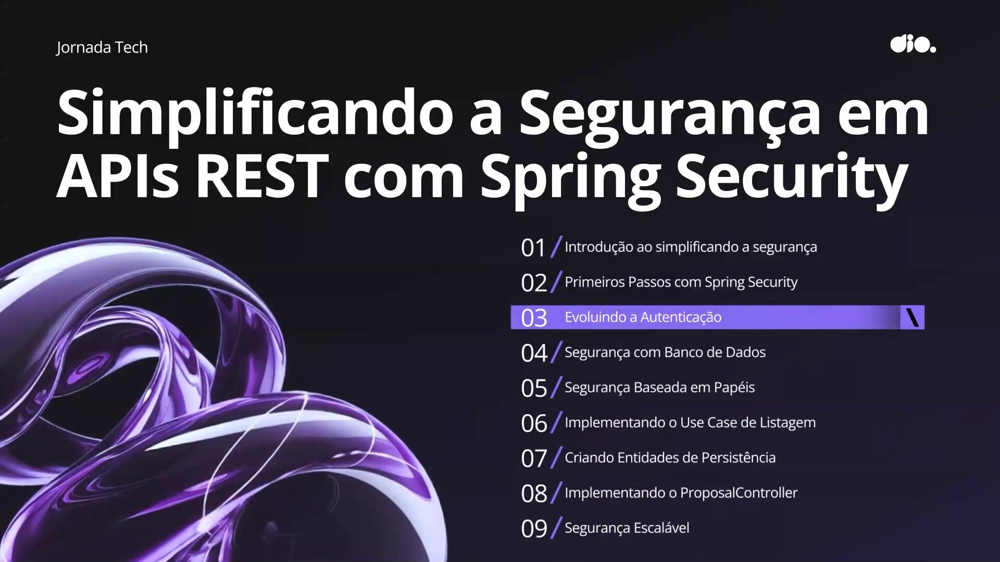
</p>

Slide de abertura da aula "Simplificando a Segurança em APIs REST com Spring Security", destacando o módulo 03 — Evoluindo a Autenticação. A partir daqui, a proposta é sair de uma configuração básica (todas as URLs autenticadas, login via formulário e usuários em memória) e evoluir para uma autenticação feita via API REST.

#### O campo oculto de CSRF no formulário de login

<p align="center">
  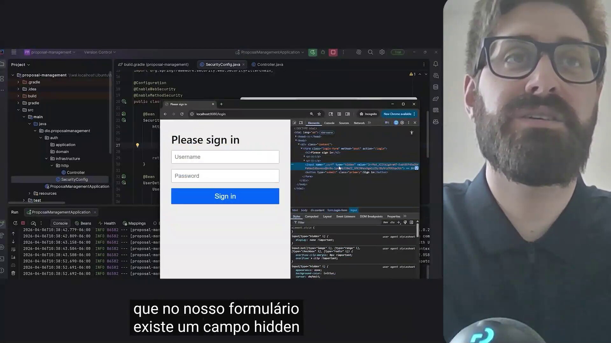
</p>

Na tela padrão de login gerada pelo Spring Security ("Please sign in"), com o DevTools do navegador aberto, é possível observar no HTML um campo `input` do tipo `hidden` chamado `_csrf`. Esse campo existe porque o Spring Security mantém a proteção contra CSRF (Cross-Site Request Forgery) habilitada por padrão: a cada requisição de formulário, um token único é enviado junto e validado no servidor, garantindo que a requisição realmente partiu daquele formulário gerado pela aplicação.

#### Desabilitando o CSRF para os testes da API

<p align="center">
  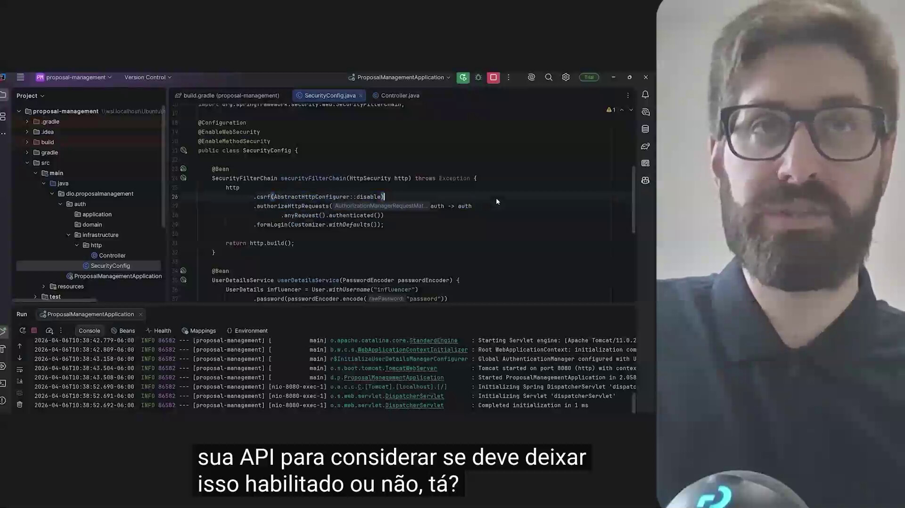
</p>

No `SecurityConfig.java`, a linha `.csrf(AbstractHttpConfigurer::disable)` desativa a proteção CSRF na cadeia de filtros de segurança. Essa decisão é tomada aqui apenas para simplificar os testes: em cenários de navegador, o CSRF costuma ser relevante, mas em aplicações mobile ou SPAs (que consultam o token de outra forma) a necessidade pode ser menor. Vale sempre avaliar o tipo de cliente que vai consumir a API antes de desabilitar essa proteção em produção.

#### Documentação oficial: como funciona o Form Login

<p align="center">
  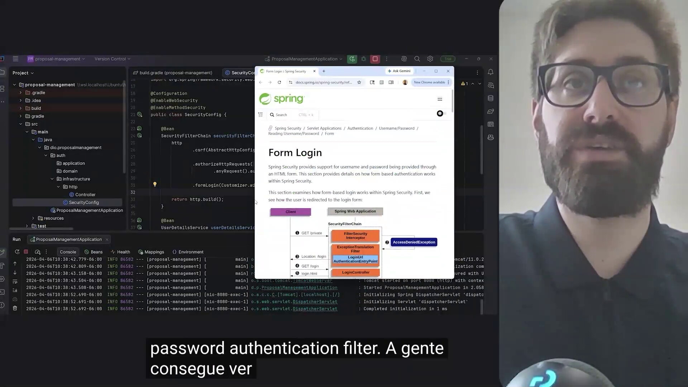
</p>

Consulta à documentação oficial do Spring Security sobre "Form Login", mostrando o diagrama geral da cadeia de filtros (`SecurityFilterChain`) envolvida na autenticação por formulário: o `FilterSecurityInterceptor`, o `ExceptionTranslationFilter` e o `LoginUrlAuthenticationEntryPoint`, que redireciona o cliente para a tela de login quando necessário. Esse é o mecanismo que, por baixo dos panos, utiliza o `UsernamePasswordAuthenticationFilter`.

#### Detalhamento do UsernamePasswordAuthenticationFilter

<p align="center">
  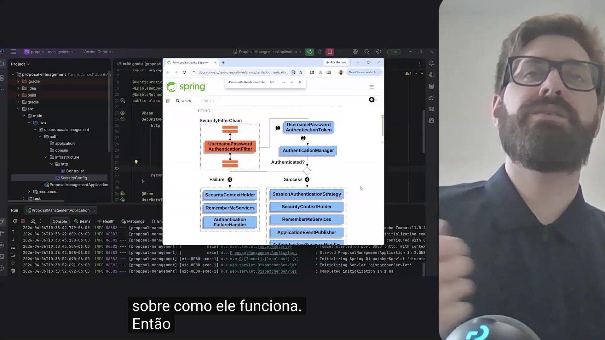
</p>

Diagrama mais detalhado da documentação mostrando o fluxo interno do `UsernamePasswordAuthenticationFilter`: a requisição gera um `UsernamePasswordAuthenticationToken`, que é enviado ao `AuthenticationManager` para validação ("Authenticated?"). Em caso de falha, o fluxo segue para o `AuthenticationFailureHandler`; em caso de sucesso, entram em ação o `SessionAuthenticationStrategy`, o `SecurityContextHolder`, o `RememberMeServices` e o `AuthenticationSuccessHandler`, entre outros componentes responsáveis por manter o usuário autenticado.

#### Criando o pacote `security`

<p align="center">
  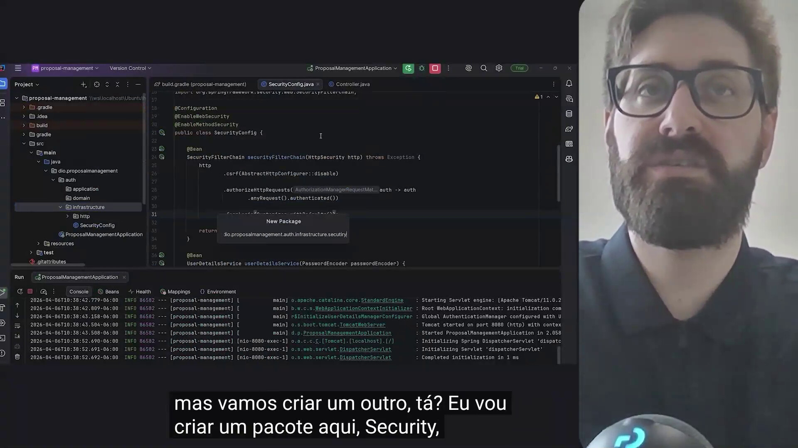
</p>

Criação de um novo pacote dentro de `dio.proposalmanagement.auth.infrastructure`, chamado `security`, para organizar as futuras classes de configuração de autenticação, mantendo o código mais coeso.

#### Criando a classe RestUsernamePasswordAuthenticationFilter

<p align="center">
  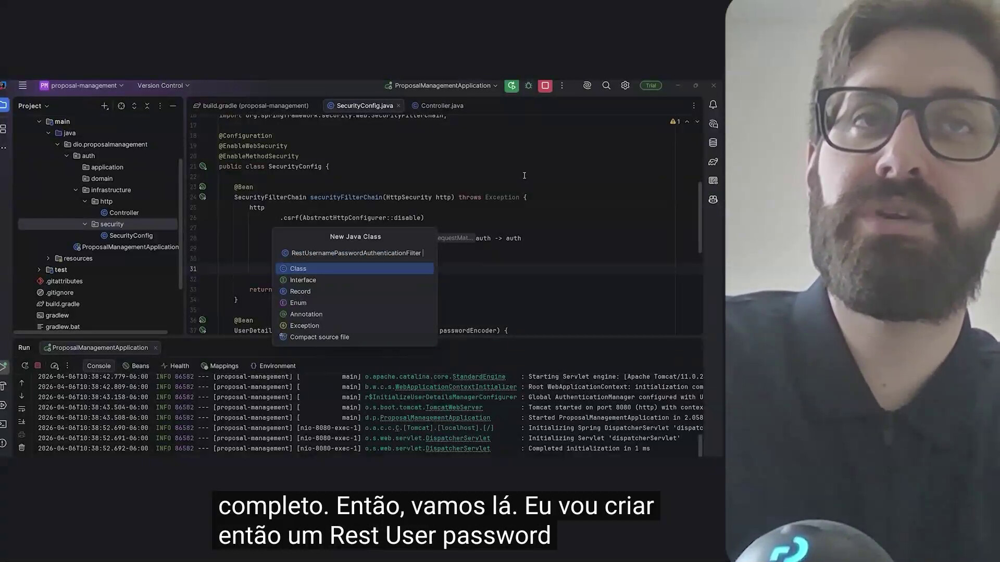
</p>

Dentro do pacote `security`, é criada uma nova classe Java chamada `RestUsernamePasswordAuthenticationFilter`. Essa classe será uma implementação própria, baseada no filtro padrão do Spring Security, mas adaptada para receber a autenticação via requisição REST (JSON) em vez de formulário HTML.

#### Estrutura inicial do filtro customizado

<p align="center">
  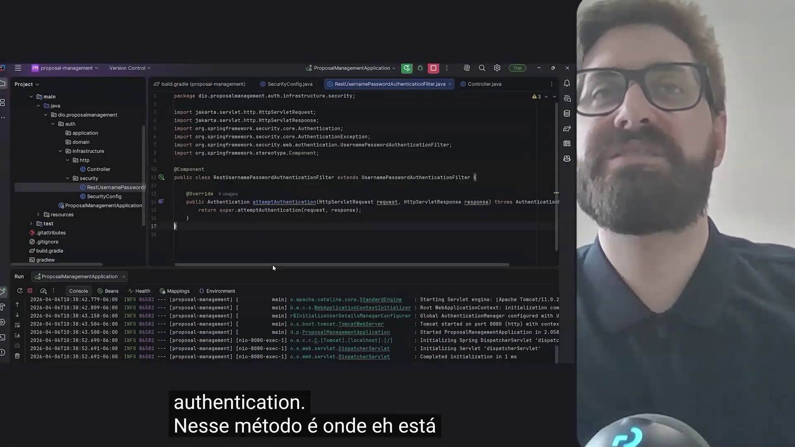
</p>

```java
@Component
public class RestUsernamePasswordAuthenticationFilter extends UsernamePasswordAuthenticationFilter {

    @Override
    public Authentication attemptAuthentication(HttpServletRequest request, HttpServletResponse response) throws AuthenticationException {
        return super.attemptAuthentication(request, response);
    }
}
```

A classe estende `UsernamePasswordAuthenticationFilter` e é anotada com `@Component` para que o Spring consiga identificá-la e gerenciá-la como um bean assim que a aplicação sobe. O método sobrescrito `attemptAuthentication` é justamente onde fica definida a lógica de como a autenticação vai ocorrer — é ali que a implementação customizada será construída.

#### Criando o DTO LoginRequest

<p align="center">
  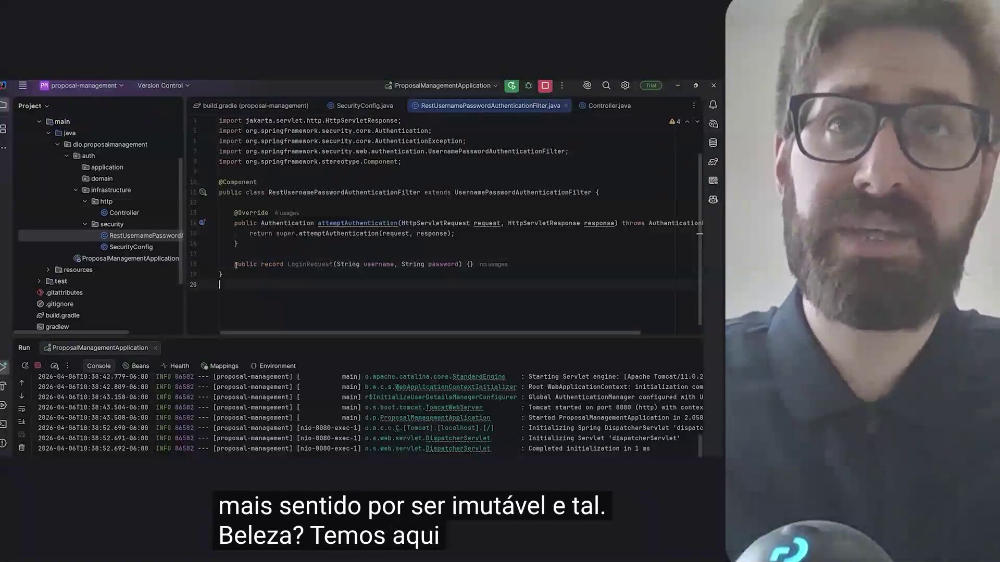
</p>

```java
public record LoginRequest(String username, String password) {}
```

Antes de tratar a autenticação em si, é necessário modelar o formato do JSON que a API vai receber. Para isso, é criado um `record` chamado `LoginRequest`, com as propriedades `username` e `password`. O uso de `record` (em vez de uma classe tradicional) faz sentido aqui por ser um objeto imutável, adequado para representar um payload de entrada.

#### Adicionando o ObjectMapper

<p align="center">
  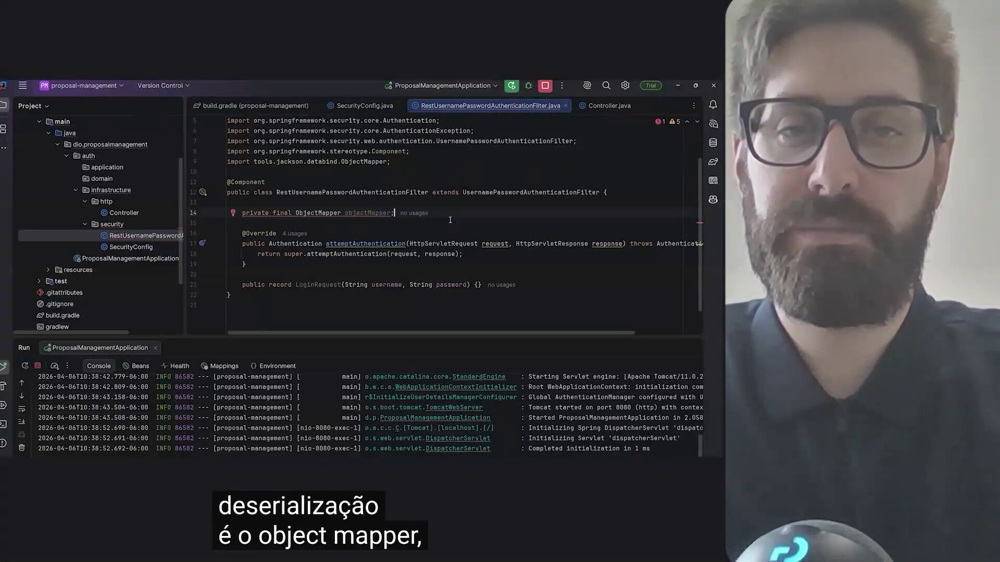
</p>

```java
private final ObjectMapper objectMapper;
```

Para transformar o JSON recebido na requisição em um objeto `LoginRequest` (processo de desserialização), é adicionado um campo `ObjectMapper`, classe do Spring responsável por converter JSON em objetos Java e vice-versa.

#### Construtor do filtro e definição da URL de processamento

<p align="center">
  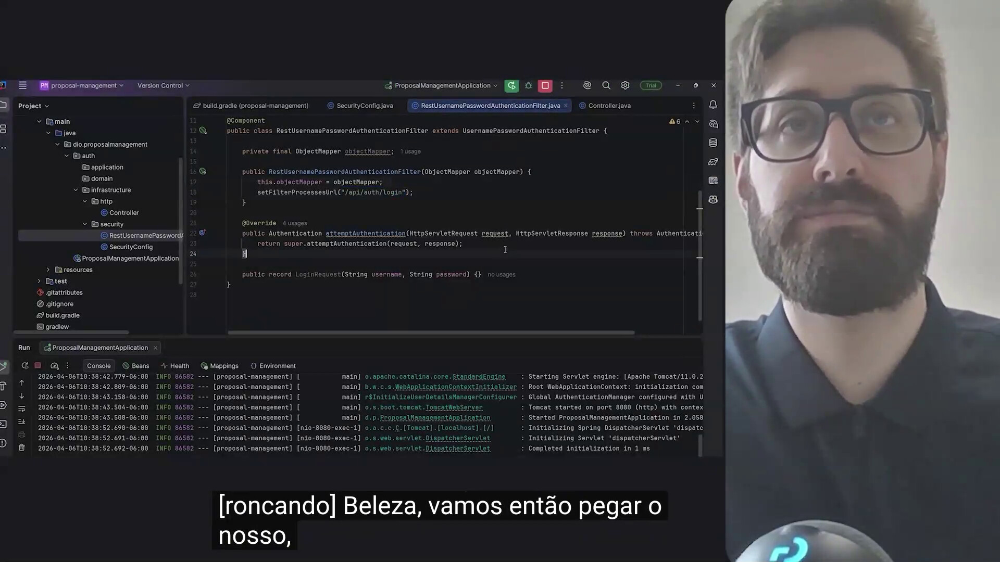
</p>

```java
public RestUsernamePasswordAuthenticationFilter(ObjectMapper objectMapper) {
    this.objectMapper = objectMapper;
    setFilterProcessesUrl("/api/auth/login");
}
```

O `ObjectMapper` é injetado por dependência via construtor. Além disso, é definida uma URL própria para o filtro por meio de `setFilterProcessesUrl("/api/auth/login")` — assim como o form login usa `/login` por padrão, esse novo filtro passa a responder no endpoint `/api/auth/login`.

#### Lendo o JSON e criando o token de autenticação

<p align="center">
  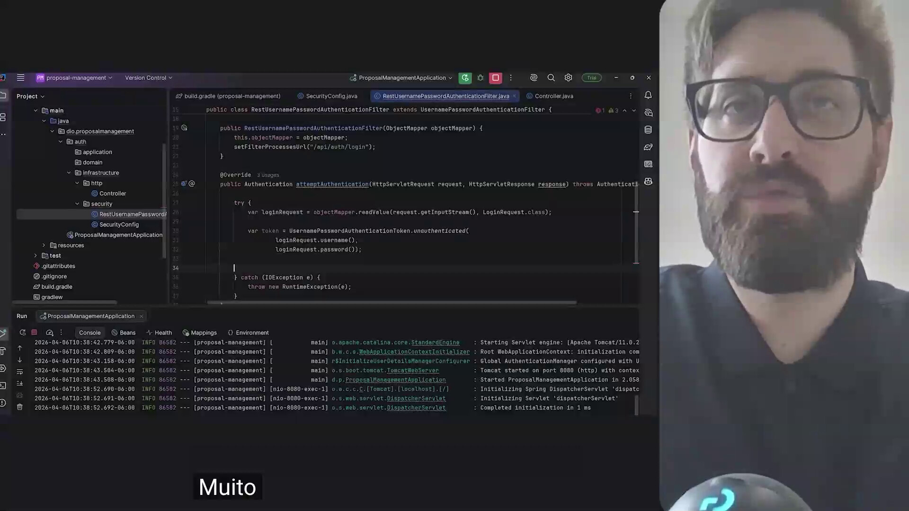
</p>

```java
try {
    var loginRequest = objectMapper.readValue(request.getInputStream(), LoginRequest.class);

    var token = UsernamePasswordAuthenticationToken.unauthenticated(
            loginRequest.username(),
            loginRequest.password());

} catch (IOException e) {
    throw new RuntimeException(e);
}
```

Dentro de `attemptAuthentication`, o `objectMapper.readValue` converte o corpo da requisição (`request.getInputStream()`) em um `LoginRequest`. Em seguida, é criado um `UsernamePasswordAuthenticationToken.unauthenticated`, um objeto que carrega usuário e senha e que o Spring Security consegue manipular durante o processo de autenticação.

#### Chamando o AuthenticationManager para autenticar

<p align="center">
  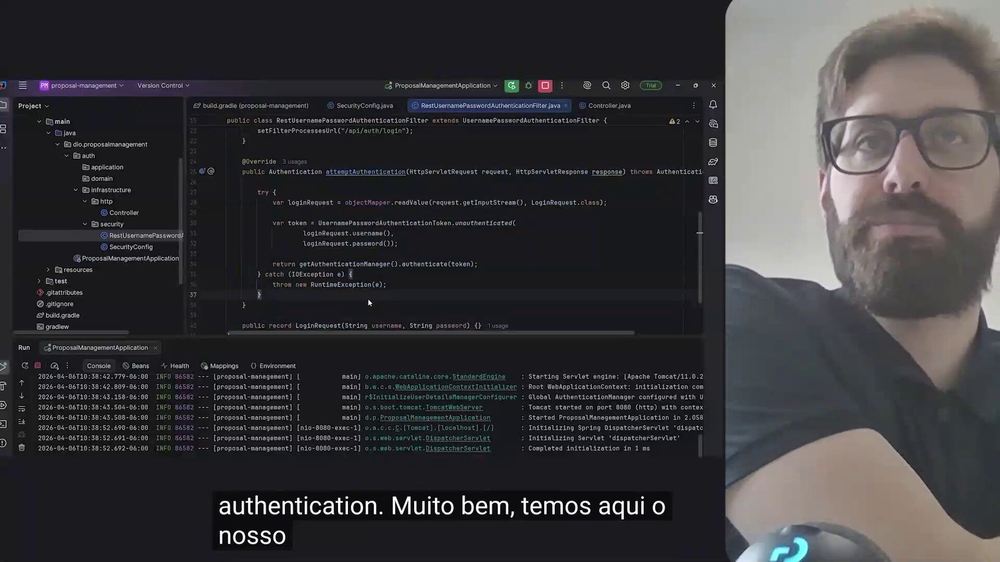
</p>

```java
return getAuthenticationManager().authenticate(token);
```

Com o token criado, o próximo passo é tentar efetivamente autenticar o usuário chamando `getAuthenticationManager().authenticate(token)`, método herdado da classe pai. Esse método verifica o usuário no `UserDetailsService`, aplica o `PasswordEncoder` configurado e valida se a senha enviada corresponde à senha registrada, retornando o objeto `Authentication` em caso de sucesso.

#### Erro ao subir a aplicação: AuthenticationManager não definido

<p align="center">
  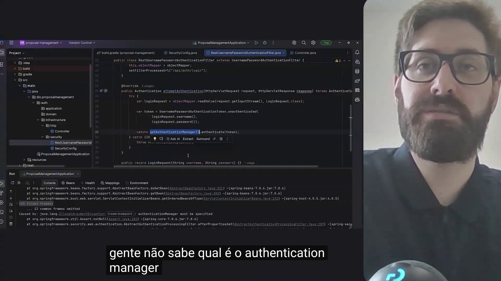
</p>

Ao subir a aplicação, ocorre uma exceção: `IllegalArgumentException: authenticationManager must be specified`. Isso acontece porque o filtro customizado ainda não sabe qual `AuthenticationManager` deve utilizar — diferente do form login padrão, que já vem com essa configuração pronta, o filtro criado manualmente precisa recebê-la explicitamente.

#### Ajustando o construtor para receber o AuthenticationConfiguration

<p align="center">
  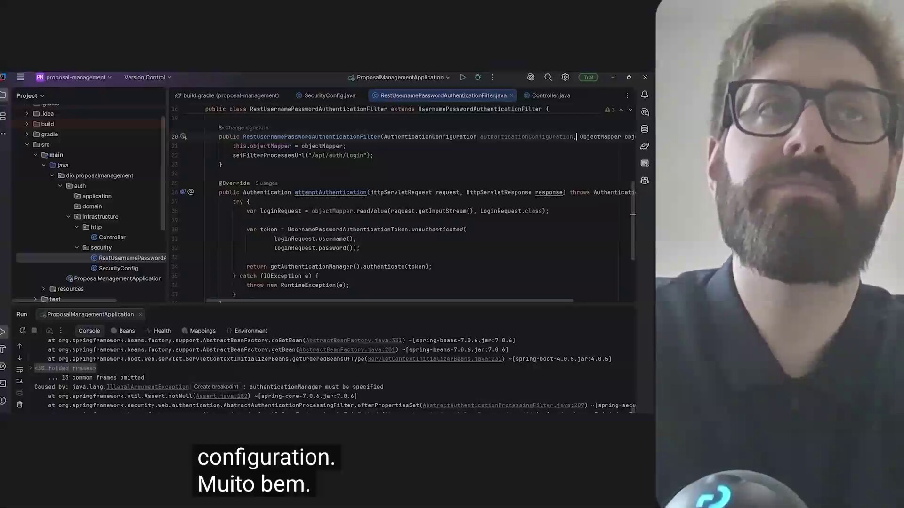
</p>

Para resolver o problema, o construtor do filtro é alterado para também receber um `AuthenticationConfiguration`, objeto que o Spring Security disponibiliza e que expõe o `AuthenticationManager` padrão da aplicação — o mesmo utilizado pelo `DaoAuthenticationProvider`, baseado no `UserDetailsService` e no `PasswordEncoder` já configurados.

#### Passando o AuthenticationManager para a classe pai

<p align="center">
  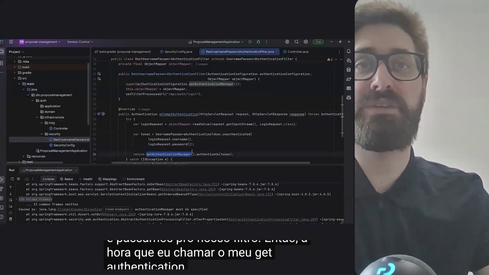
</p>

```java
public RestUsernamePasswordAuthenticationFilter(AuthenticationConfiguration authenticationConfiguration,
                                                  ObjectMapper objectMapper) {
    super(authenticationConfiguration.getAuthenticationManager());
    this.objectMapper = objectMapper;
    setFilterProcessesUrl("/api/auth/login");
}
```

O construtor agora chama `super(authenticationConfiguration.getAuthenticationManager())`, repassando o `AuthenticationManager` padrão para a classe pai (`UsernamePasswordAuthenticationFilter`). A partir disso, toda chamada a `getAuthenticationManager()` dentro do filtro utiliza esse manager já configurado, e a aplicação volta a subir sem erros.

#### Liberando o endpoint de login na configuração de segurança

<p align="center">
  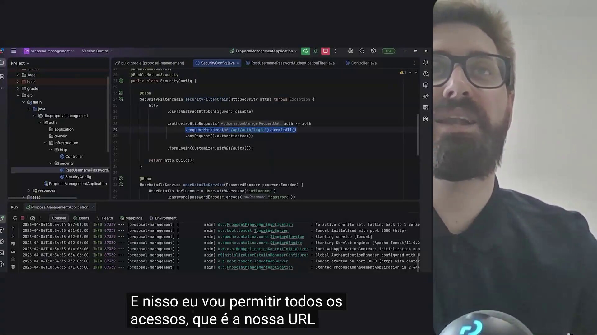
</p>

```java
.requestMatchers("/api/auth/login").permitAll()
```

No `SecurityConfig`, é adicionada uma nova regra liberando o acesso público ao endpoint `/api/auth/login`, já que é justamente essa URL que os usuários não autenticados vão utilizar para efetuar login.

#### Removendo o form login

<p align="center">
  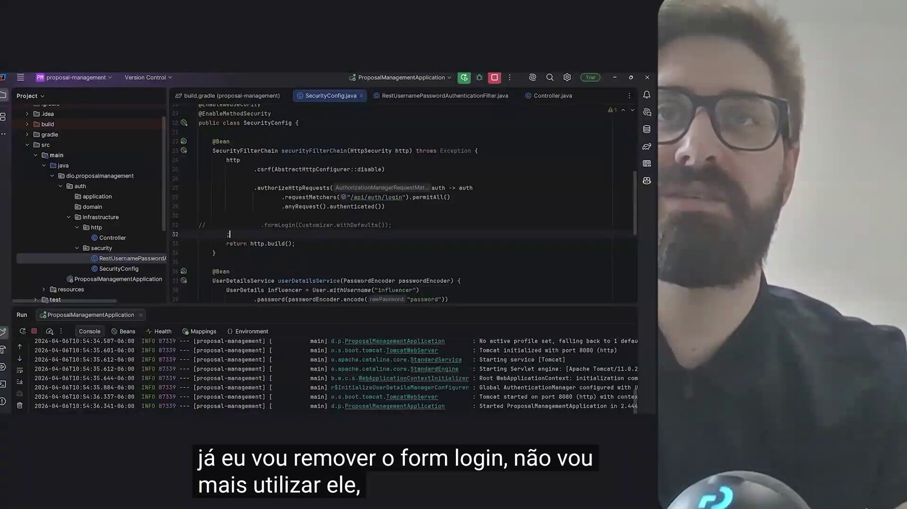
</p>

```java
// .formLogin(Customizer.withDefaults());
```

A configuração `.formLogin(Customizer.withDefaults())` é comentada, já que a aplicação deixará de utilizar a tela de login por formulário e passará a depender exclusivamente da autenticação via REST.

#### Registrando o novo filtro na cadeia de segurança

<p align="center">
  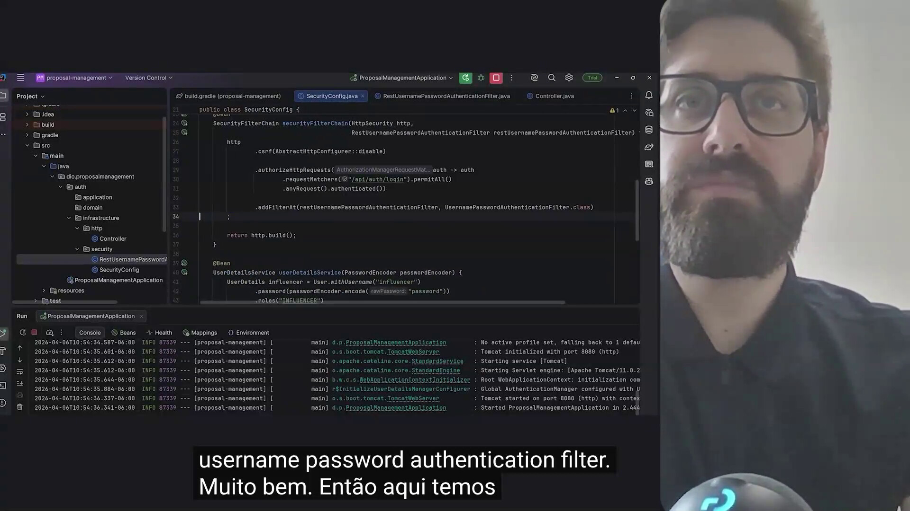
</p>

```java
.addFilterAt(restUsernamePasswordAuthenticationFilter, UsernamePasswordAuthenticationFilter.class)
```

O `RestUsernamePasswordAuthenticationFilter` é injetado como parâmetro do próprio bean `securityFilterChain`, permitindo que o Spring realize a injeção de dependência automaticamente. Em seguida, `addFilterAt` posiciona esse filtro customizado no lugar do `UsernamePasswordAuthenticationFilter` padrão dentro da cadeia de filtros de segurança.

#### Visão consolidada do SecurityConfig atualizado

<p align="center">
  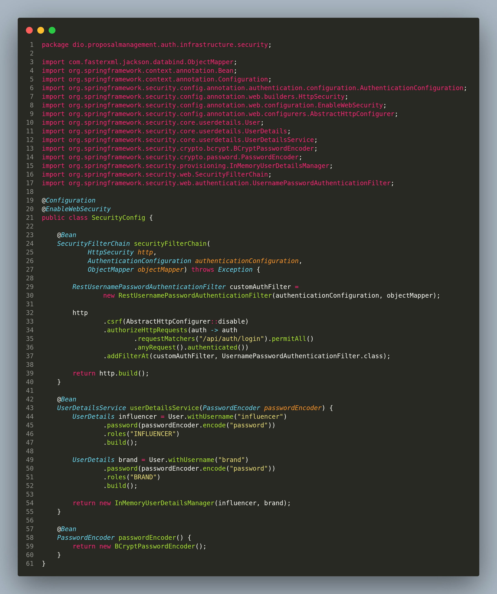
</p>

```java
package dio.proposalmanagement.auth.infrastructure.security;

import com.fasterxml.jackson.databind.ObjectMapper;
import org.springframework.context.annotation.Bean;
import org.springframework.context.annotation.Configuration;
import org.springframework.security.config.annotation.authentication.configuration.AuthenticationConfiguration;
import org.springframework.security.config.annotation.web.builders.HttpSecurity;
import org.springframework.security.config.annotation.web.configuration.EnableWebSecurity;
import org.springframework.security.config.annotation.web.configurers.AbstractHttpConfigurer;
import org.springframework.security.core.userdetails.User;
import org.springframework.security.core.userdetails.UserDetails;
import org.springframework.security.core.userdetails.UserDetailsService;
import org.springframework.security.crypto.bcrypt.BCryptPasswordEncoder;
import org.springframework.security.crypto.password.PasswordEncoder;
import org.springframework.security.provisioning.InMemoryUserDetailsManager;
import org.springframework.security.web.SecurityFilterChain;
import org.springframework.security.web.authentication.UsernamePasswordAuthenticationFilter;

@Configuration
@EnableWebSecurity
public class SecurityConfig {

    @Bean
    SecurityFilterChain securityFilterChain(
            HttpSecurity http,
            AuthenticationConfiguration authenticationConfiguration,
            ObjectMapper objectMapper) throws Exception {

        RestUsernamePasswordAuthenticationFilter customAuthFilter =
                new RestUsernamePasswordAuthenticationFilter(authenticationConfiguration, objectMapper);

        http
                .csrf(AbstractHttpConfigurer::disable)
                .authorizeHttpRequests(auth -> auth
                        .requestMatchers("/api/auth/login").permitAll()
                        .anyRequest().authenticated())
                .addFilterAt(customAuthFilter, UsernamePasswordAuthenticationFilter.class);

        return http.build();
    }

    @Bean
    UserDetailsService userDetailsService(PasswordEncoder passwordEncoder) {
        UserDetails influencer = User.withUsername("influencer")
                .password(passwordEncoder.encode("password"))
                .roles("INFLUENCER")
                .build();

        UserDetails brand = User.withUsername("brand")
                .password(passwordEncoder.encode("password"))
                .roles("BRAND")
                .build();

        return new InMemoryUserDetailsManager(influencer, brand);
    }

    @Bean
    PasswordEncoder passwordEncoder() {
        return new BCryptPasswordEncoder();
    }
}
```

Visão geral da classe `SecurityConfig` já com todas as mudanças aplicadas: CSRF desabilitado, a URL `/api/auth/login` liberada, o filtro customizado registrado no lugar do padrão, e os beans de `UserDetailsService` (com os usuários `influencer` e `brand`) e `PasswordEncoder` mantidos como no vídeo anterior.

#### Primeiro teste: requisição de login via HTTP Client

<p align="center">
  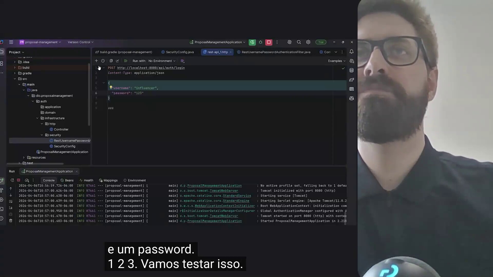
</p>

```http
POST http://localhost:8080/api/auth/login
Content-Type: application/json

{
  "username": "influencer",
  "password": "123"
}
```

Utilizando a ferramenta HTTP Client do IntelliJ, é montada uma requisição `POST` para `/api/auth/login`, enviando um JSON com usuário `influencer` e senha `123` (propositalmente incorreta neste primeiro teste).

#### Primeiro resultado: 403 por credenciais inválidas

<p align="center">
  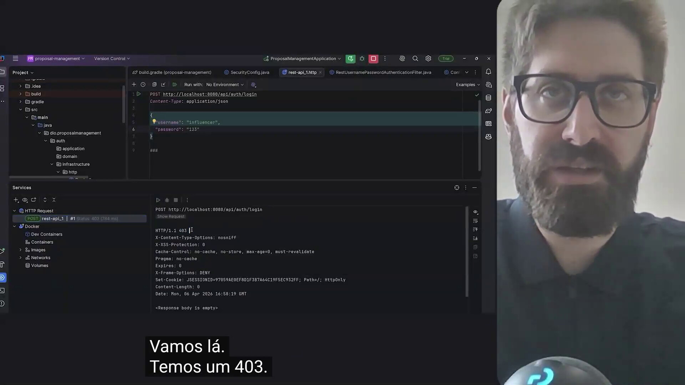
</p>

A resposta retorna `HTTP/1.1 403`, indicativo de que o Spring Security lançou uma exceção do tipo `BadCredentialsException`, já que a senha enviada (`123`) não corresponde à senha cadastrada para o usuário.

#### Corrigindo a senha e identificando o comportamento de redirect

<p align="center">
  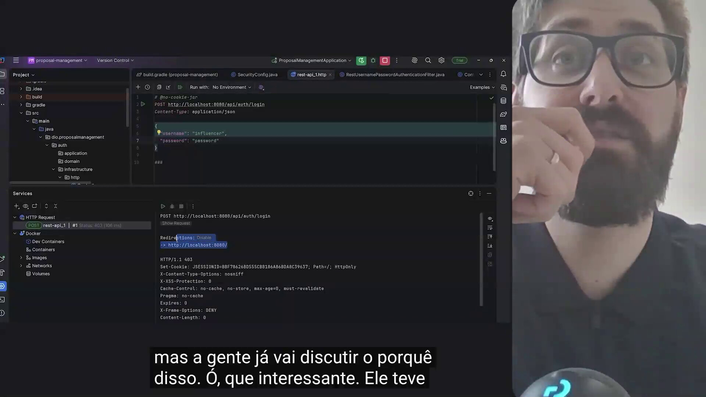
</p>

Com a anotação `@no-cookie-jar` (para sempre visualizar o cookie retornado, sem reaproveitá-lo automaticamente) e a senha corrigida para `password`, a requisição ainda retorna `403`, mas agora mostrando um `Redirection` para `http://localhost:8080/`. Esse comportamento vem do próprio `UsernamePasswordAuthenticationFilter`, que por padrão redireciona o cliente para `/` após uma autenticação bem-sucedida — um comportamento pensado para aplicações web tradicionais, mas que não faz sentido em uma API REST.

#### Substituindo o redirect por uma resposta 200

<p align="center">
  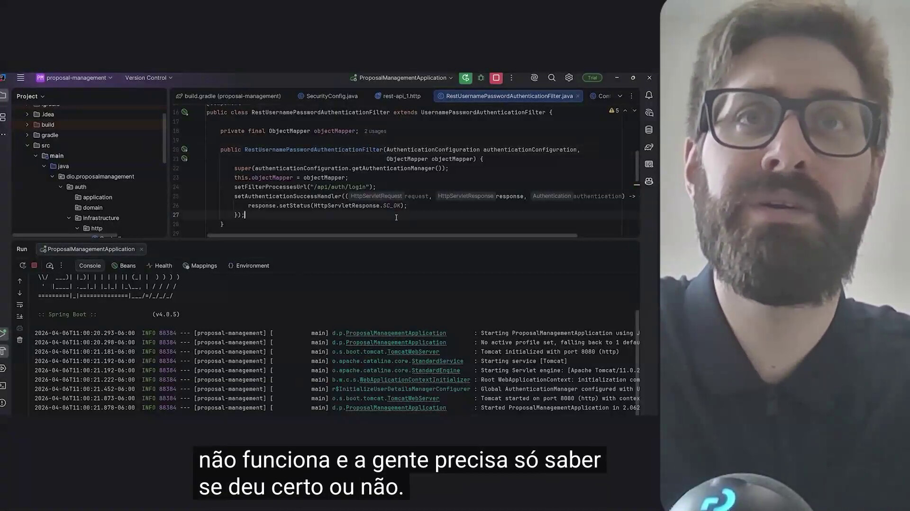
</p>

```java
setAuthenticationSuccessHandler((HttpServletRequest request, HttpServletResponse response, Authentication authentication) ->
        response.setStatus(HttpServletResponse.SC_OK)
);
```

Para eliminar o redirecionamento indesejado, é definido um `AuthenticationSuccessHandler` customizado, que simplesmente retorna o status `200 (OK)` quando a autenticação é bem-sucedida — sem redirecionar o cliente para nenhuma outra URL.

#### Autenticado, mas sem sessão: novo 403 ao acessar outra rota

<p align="center">
  
</p>

```java
.securityContext(context -> context.requireExplicitSave(false))
```

Mesmo com a resposta `200`, ao tentar acessar a rota `/` logo em seguida, o resultado ainda é `403`. Isso ocorre porque a autenticação por si só não garante uma sessão — é preciso que a próxima requisição informe qual sessão está sendo usada, por meio de um cookie. Para resolver isso, é adicionada a configuração `.securityContext(context -> context.requireExplicitSave(false))`, instruindo o Spring Security a salvar a sessão automaticamente.

#### Entendendo o requireExplicitSave(false)

<p align="center">
  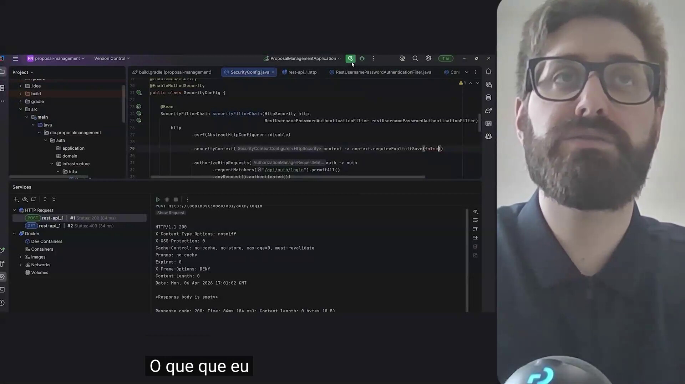
</p>

Continuação da explicação sobre a configuração anterior: normalmente, o `UsernamePasswordAuthenticationFilter` salva a sessão internamente através do `AuthenticationSuccessHandler` padrão. Como esse handler foi substituído por uma implementação simples (que apenas retorna `200`), é necessário pedir explicitamente ao `SecurityContext` para persistir a sessão automaticamente, sem depender de um salvamento manual.

#### Cookie de sessão retornado na resposta

<p align="center">
  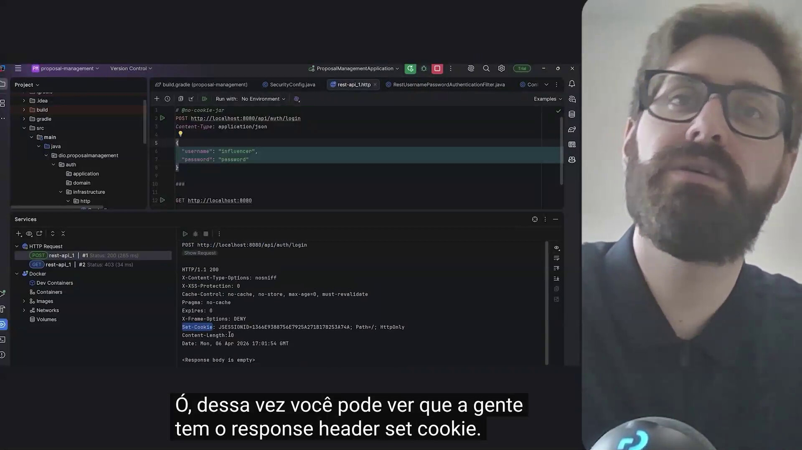
</p>

Ao reenviar a requisição de login, a resposta `200` agora traz um cabeçalho `Set-Cookie` contendo o `JSESSIONID`. Esse cookie identifica a sessão criada para o usuário autenticado e deve ser enviado nas próximas requisições para que o servidor reconheça o cliente como autenticado.

#### Acessando uma rota protegida com o cookie de sessão

<p align="center">
  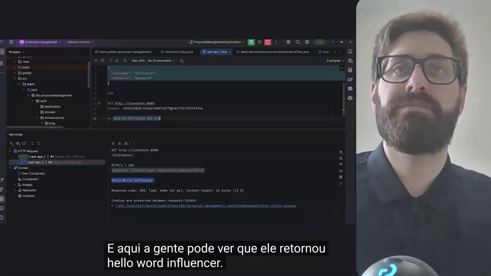
</p>

```http
GET http://localhost:8080
Cookie: JSESSIONID=1366E9388756E7925A271B178253A74A
```

Uma requisição `GET` para `/` sem o cookie retornaria `403`. Enviando o cookie de sessão obtido no login, a resposta retorna `200` com o corpo `Hello World influencer`, confirmando que a sessão do usuário `influencer` está sendo reconhecida corretamente.

#### Autenticando com o segundo usuário (brand)

<p align="center">
  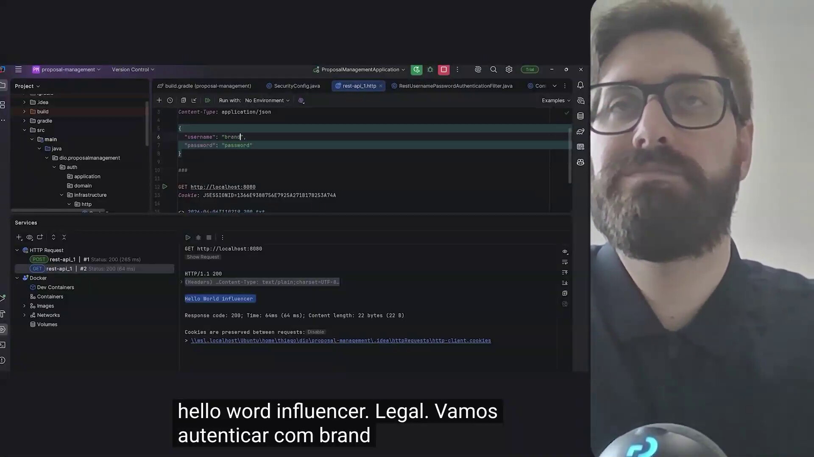
</p>

```http
POST http://localhost:8080/api/auth/login
Content-Type: application/json

{
  "username": "brand",
  "password": "password"
}
```

Repetindo o processo de login, agora com o usuário `brand`, para demonstrar que cada usuário autenticado recebe sua própria sessão, independente da sessão já criada para o `influencer`.

#### Novo cookie de sessão gerado para o usuário brand

<p align="center">
  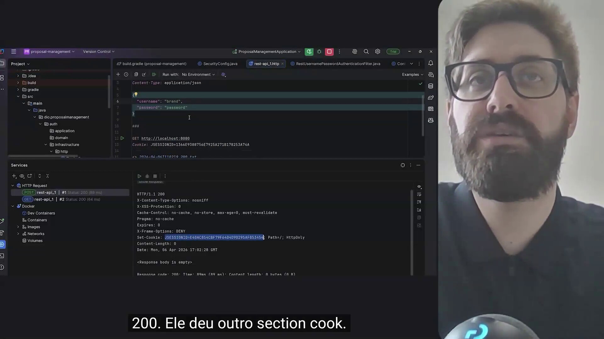
</p>

A resposta `200` traz um novo `Set-Cookie`, com um `JSESSIONID` diferente do gerado anteriormente para o `influencer`, evidenciando que cada login gera sua própria sessão isolada.

#### Confirmando o isolamento das sessões

<p align="center">
  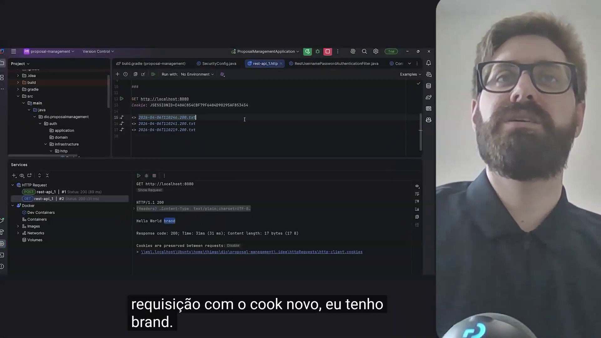
</p>

Ao repetir a requisição `GET /` usando o cookie de sessão do `influencer`, a resposta continua retornando `Hello World influencer`. Já ao usar o cookie mais recente, gerado para o `brand`, a resposta passa a ser `Hello World brand`. Isso confirma que a aplicação, mesmo utilizando autenticação REST, ainda mantém o comportamento stateful herdado do `UsernamePasswordAuthenticationFilter`: cada sessão é controlada em memória e vinculada a um usuário específico, o que traz limitações — como a impossibilidade de escalar horizontalmente ou de reaproveitar a sessão após um reinício da aplicação — pontos que serão abordados nas próximas etapas do curso.

#### Material de Apoio Até Esta Etapa

- Arquivos do projeto nesta etapa: [./000-Midia_e_Anexos/R](./000-Midia_e_Anexos/etapas_do_codigo/R)
- [yyy-yyyyyyyyyyyy](./yyy-xxxxxxxxxxxxxxxxx.md)


### 🟩 Vídeo 04 - Segurança com Banco de Dados

<video width="60%" controls>
  <source src="000-Midia_e_Anexos/bootcamp_ntt_data_java_spring_ai-modulo.04-curso.02-video_04.webm" type="video/webm">
    Seu navegador não suporta vídeo HTML5.
</video>

link do vídeo: https://web.dio.me/track/ntt-data-2026-ai-java-back-end/course/simplificando-a-seguranca-em-apis-rest-com-spring-security/learning/345dee1d-d60f-4224-ada1-14af162d5058?autoplay=1

### Anotações

<p align="center">
  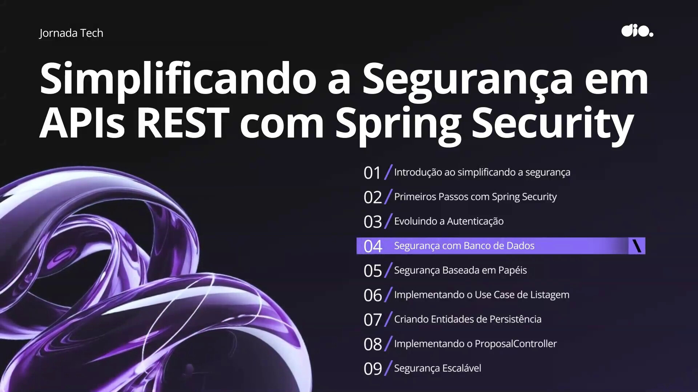
</p>

Slide de abertura da aula, parte da série **Jornada Tech** (DIO), sobre "Simplificando a Segurança em APIs REST com Spring Security". O sumário à direita mostra os nove módulos do curso, com o item **04 — Segurança com Banco de Dados** destacado, indicando que este vídeo trata da integração da aplicação (que já possuía autenticação via filtro customizado) com uma base de dados real, substituindo o armazenamento de usuários em memória.

<p align="center">
  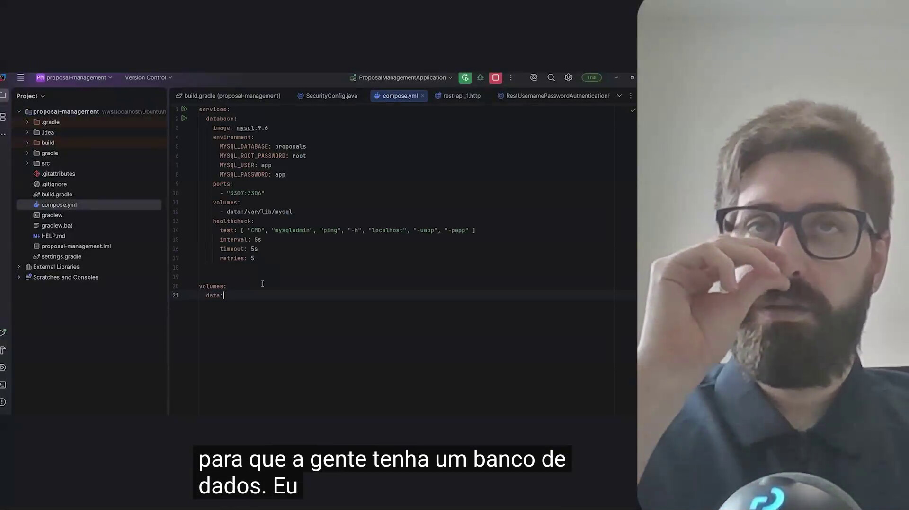
</p>

Edição do arquivo `compose.yml` para provisionar o banco de dados via Docker Compose. É definido um serviço `database` usando a imagem `mysql:9.6`, com banco `proposals`, usuário e senha `app`, exposto na porta local `3307` (mapeada para a `3306` do container, evitando conflito com um MySQL local) e um `healthcheck` que verifica a disponibilidade do banco via `mysqladmin ping`.

```yaml
services:
  database:
    image: mysql:9.6
    environment:
      MYSQL_DATABASE: proposals
      MYSQL_ROOT_PASSWORD: root
      MYSQL_USER: app
      MYSQL_PASSWORD: app
    ports:
      - "3307:3306"
    volumes:
      - data:/var/lib/mysql
    healthcheck:
      test: [ "CMD", "mysqladmin", "ping", "-h", "localhost", "-uapp", "-papp" ]
      interval: 5s
      timeout: 5s
      retries: 5

volumes:
  data:
```

<p align="center">
  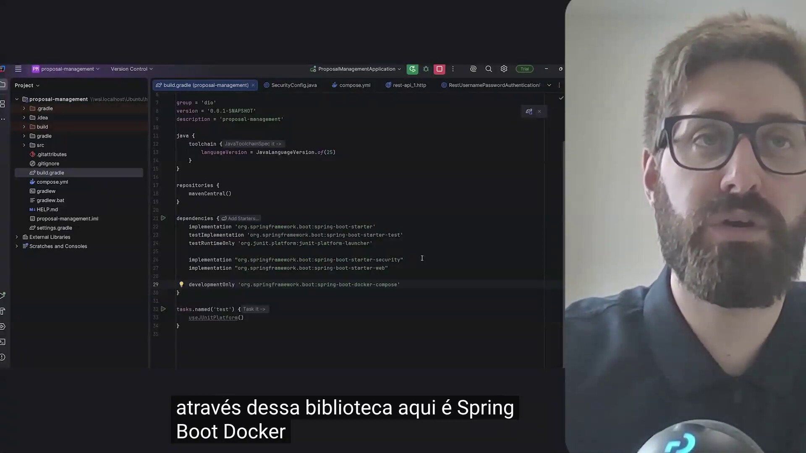
</p>

No `build.gradle`, é adicionada a dependência `spring-boot-docker-compose` como `developmentOnly`. Essa biblioteca permite que o Spring Boot gerencie automaticamente o ciclo de vida dos containers definidos no `compose.yml`: ao iniciar a aplicação, os containers sobem junto; ao encerrá-la, eles também são finalizados.

```gradle
dependencies {
    implementation 'org.springframework.boot:spring-boot-starter'
    testImplementation 'org.springframework.boot:spring-boot-starter-test'
    testRuntimeOnly 'org.junit.platform:junit-platform-launcher'

    implementation "org.springframework.boot:spring-boot-starter-security"
    implementation "org.springframework.boot:spring-boot-starter-web"

    developmentOnly 'org.springframework.boot:spring-boot-docker-compose'
}
```

<p align="center">
  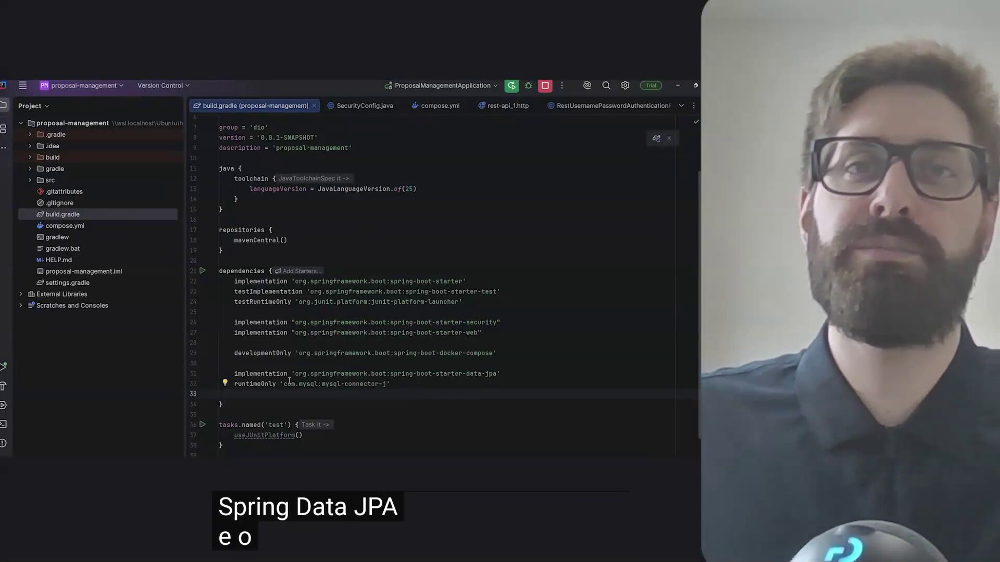
</p>

Continuando a configuração do `build.gradle`, são adicionadas as dependências do **Spring Data JPA** e do conector do MySQL. Com essas bibliotecas, assim que o container do banco sobe (via Docker Compose), o Spring Data já é autoconfigurado — portas, usuário e senha são detectados automaticamente, sem necessidade de configuração manual de conexão.

```gradle
    developmentOnly 'org.springframework.boot:spring-boot-docker-compose'

    implementation 'org.springframework.boot:spring-boot-starter-data-jpa'
    runtimeOnly 'com.mysql:mysql-connector-j'
```

<p align="center">
  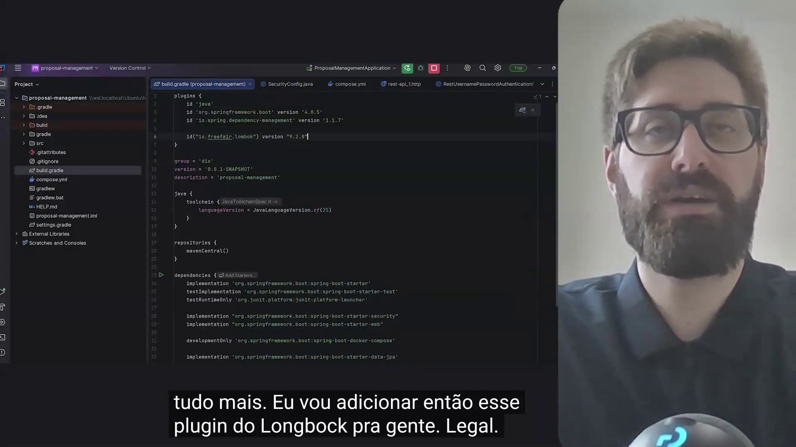
</p>

É adicionado o plugin do **Lombok** ao `build.gradle`. O Lombok é uma biblioteca amplamente usada no dia a dia com Spring, responsável por gerar automaticamente código repetitivo, como *getters*, *setters* e construtores, reduzindo a verbosidade das classes de entidade que serão criadas a seguir.

```gradle
plugins {
    id 'java'
    id 'org.springframework.boot' version '4.0.5'
    id 'io.spring.dependency-management' version '1.1.7'

    id("io.freefair.lombok") version "9.2.0"
}
```

<p align="center">
  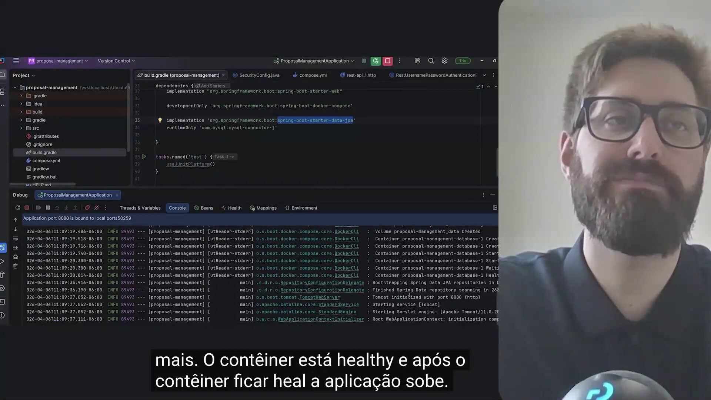
</p>

Console de execução da aplicação mostrando o Docker Compose subindo o container do banco de dados (criação de volume e container, aguardando o `healthcheck`). Somente depois que o container é considerado *healthy* é que a aplicação Spring Boot efetivamente inicia — evidenciado pelos logs de bootstrap do Spring Data JPA e do Tomcat na porta 8080.

```
[proposal-management] DockerCli : Volume proposal-management_data Created
[proposal-management] DockerCli : Container proposal-management-database-1 Created
[proposal-management] DockerCli : Container proposal-management-database-1 Starting
[proposal-management] DockerCli : Container proposal-management-database-1 Waiting
[proposal-management] DockerCli : Container proposal-management-database-1 Healthy
main : Bootstrapping Spring Data JPA repositories
main : Tomcat initialized with port 8080 (http)
```

<p align="center">
  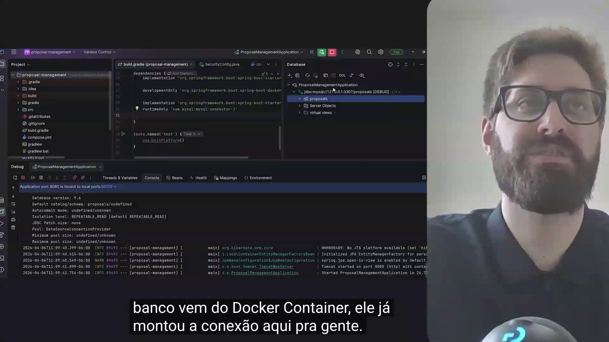
</p>

Painel de banco de dados do IntelliJ exibindo a conexão já configurada automaticamente com o MySQL (`jdbc:mysql://127.0.0.1:3307/proposals`). Como o banco veio do container gerenciado pelo Docker Compose integrado ao Spring Boot, a IDE consegue, por introspecção, detectar essa conexão sem que seja necessário configurá-la manualmente.

<p align="center">
  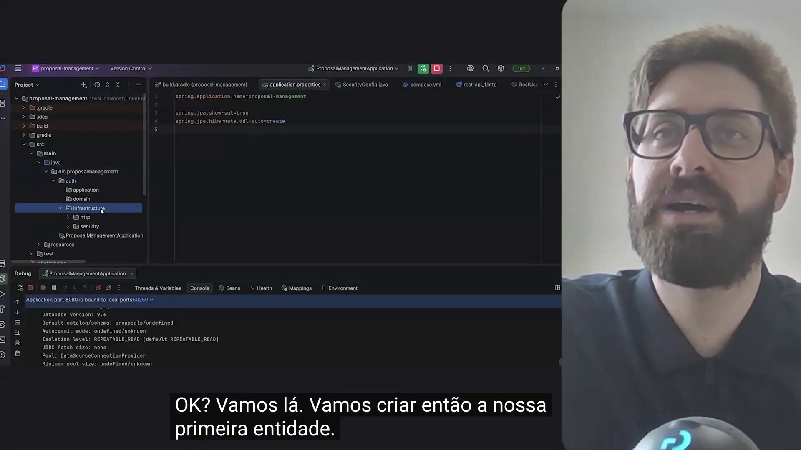
</p>

Arquivo `application.properties` recebendo duas configurações adicionais: `spring.jpa.show-sql=true`, para exibir no console os comandos SQL executados pelo Hibernate, e `spring.jpa.hibernate.ddl-auto=create`, para que o próprio JPA crie o esquema do banco a partir das entidades. É reforçado que essa abordagem não é indicada para produção, onde o recomendado é o uso de *migrations*.

```properties
spring.application.name=proposal-management

spring.jpa.show-sql=true
spring.jpa.hibernate.ddl-auto=create
```

<p align="center">
  
</p>

Criação de um novo pacote `persistence` dentro da camada `infrastructure`, dando início à organização da camada de persistência da aplicação, onde ficarão as entidades e os repositórios.

<p align="center">
  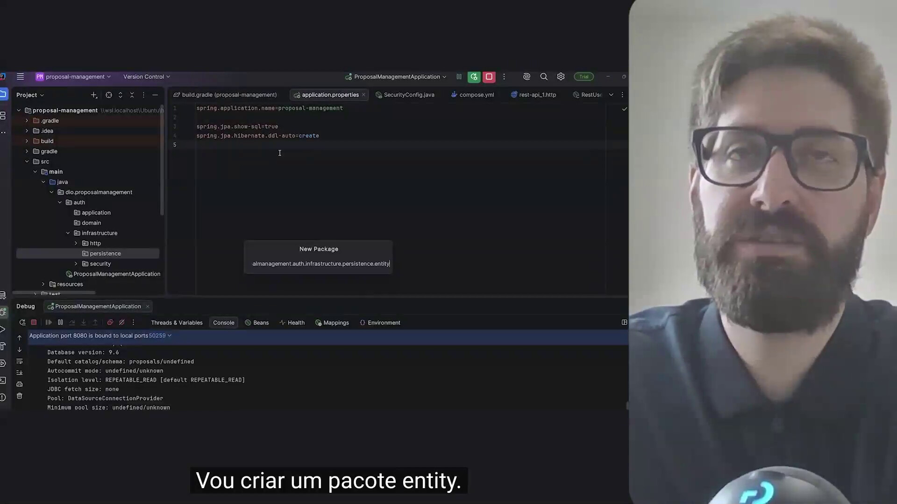
</p>

Dentro do pacote `persistence`, é criado o subpacote `entity`, que vai concentrar as classes que representam tabelas do banco de dados (entidades JPA).

<p align="center">
  
</p>

Criação da primeira entidade da aplicação: a classe `User`, dentro do pacote `entity`. Essa classe representará a tabela de usuários no banco de dados.

<p align="center">
  
</p>

Definição da classe `UserRole`, criada no pacote de domínio (`auth.domain`), como um `enum` com os papéis possíveis de um usuário: `INFLUENCER` e `BRAND`. Optou-se por deixá-la no domínio, e não dentro da entidade, por ser um conceito mais amplo do sistema, não restrito apenas à persistência.

```java
package dio.proposalmanagement.auth.domain;

public enum UserRole {
    INFLUENCER,
    BRAND,
}
```

<p align="center">
  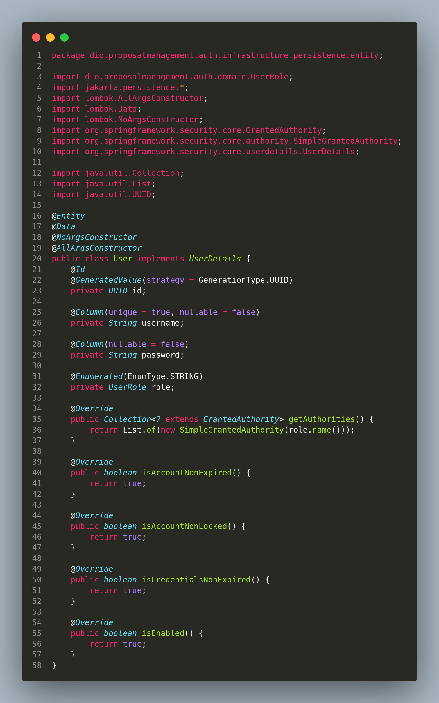
</p>

Implementação completa da entidade `User`. A classe é anotada com `@Entity` (mapeando-a para uma tabela do banco) e com as anotações do Lombok `@Data`, `@NoArgsConstructor` e `@AllArgsConstructor`, que geram automaticamente *getters*, *setters* e construtores — o construtor vazio é exigido pelo Hibernate.

O ponto central é que `User` implementa a interface `UserDetails` do Spring Security, o que permite reaproveitar toda a infraestrutura de autenticação já existente. São definidos os campos `id` (chave primária gerada via UUID), `username` (único e obrigatório), `password` (obrigatório) e `role` (um `UserRole` persistido como texto). Os métodos exigidos pela interface `UserDetails` são implementados: `getAuthorities()` retorna a *role* do usuário como uma `SimpleGrantedAuthority`, e os métodos de status da conta (`isAccountNonExpired`, `isAccountNonLocked`, `isCredentialsNonExpired`, `isEnabled`) retornam `true`, já que não há regras de expiração ou bloqueio neste momento.

```java
package dio.proposalmanagement.auth.infrastructure.persistence.entity;

import dio.proposalmanagement.auth.domain.UserRole;
import jakarta.persistence.*;
import lombok.AllArgsConstructor;
import lombok.Data;
import lombok.NoArgsConstructor;
import org.springframework.security.core.GrantedAuthority;
import org.springframework.security.core.authority.SimpleGrantedAuthority;
import org.springframework.security.core.userdetails.UserDetails;

import java.util.Collection;
import java.util.List;
import java.util.UUID;

@Entity
@Data
@NoArgsConstructor
@AllArgsConstructor
public class User implements UserDetails {
    @Id
    @GeneratedValue(strategy = GenerationType.UUID)
    private UUID id;

    @Column(unique = true, nullable = false)
    private String username;

    @Column(nullable = false)
    private String password;

    @Enumerated(EnumType.STRING)
    private UserRole role;

    @Override
    public Collection<? extends GrantedAuthority> getAuthorities() {
        return List.of(new SimpleGrantedAuthority(role.name()));
    }

    @Override
    public boolean isAccountNonExpired() {
        return true;
    }

    @Override
    public boolean isAccountNonLocked() {
        return true;
    }

    @Override
    public boolean isCredentialsNonExpired() {
        return true;
    }

    @Override
    public boolean isEnabled() {
        return true;
    }
}
```

<p align="center">
  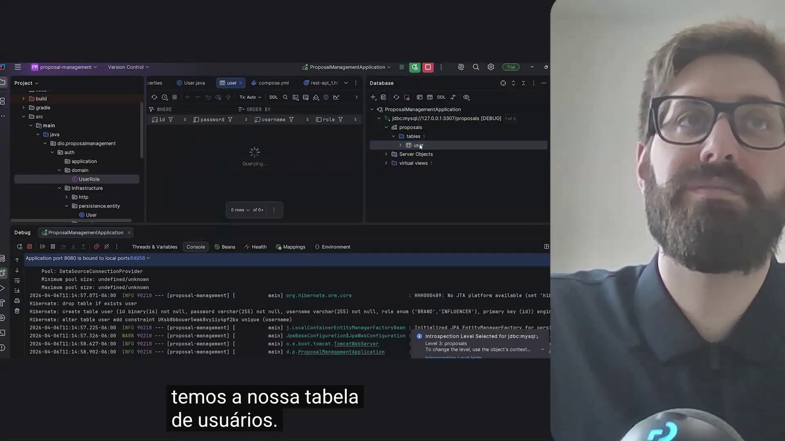
</p>

Painel de banco de dados mostrando a tabela `user` recém-criada, ainda vazia (0 linhas). Ela foi gerada automaticamente pelo Hibernate a partir da entidade `User`, confirmando que a configuração `ddl-auto=create` e o mapeamento JPA funcionaram corretamente.

<p align="center">
  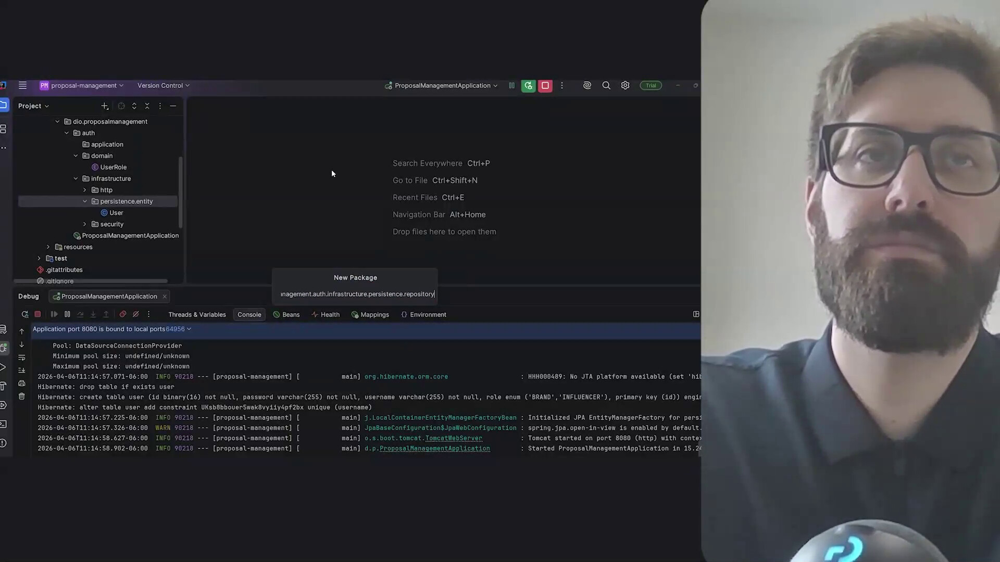
</p>

Criação de um novo pacote `repository` dentro de `persistence`, que abrigará as interfaces responsáveis por consultar e persistir dados no banco.

<p align="center">
  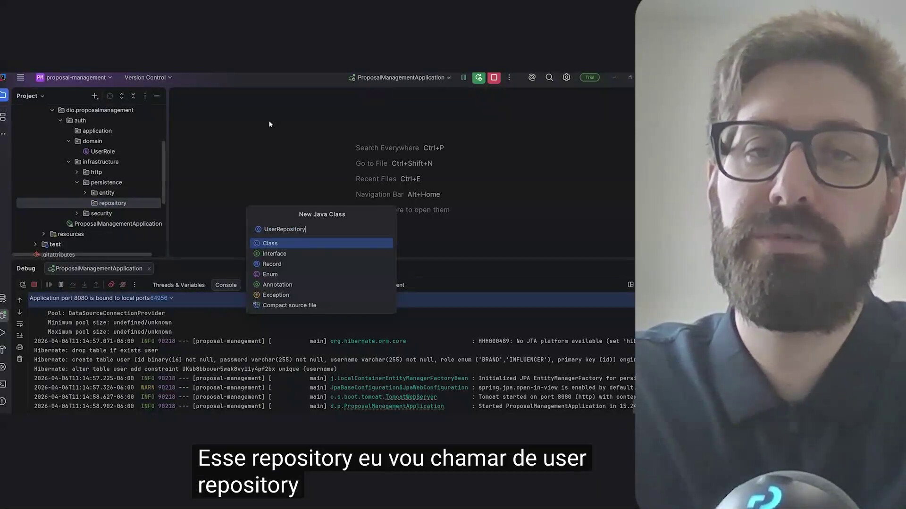
</p>

Criação da classe/interface `UserRepository` dentro do pacote `repository`, que será responsável por buscar os usuários no banco de dados para uso posterior no serviço de autenticação.

<p align="center">
  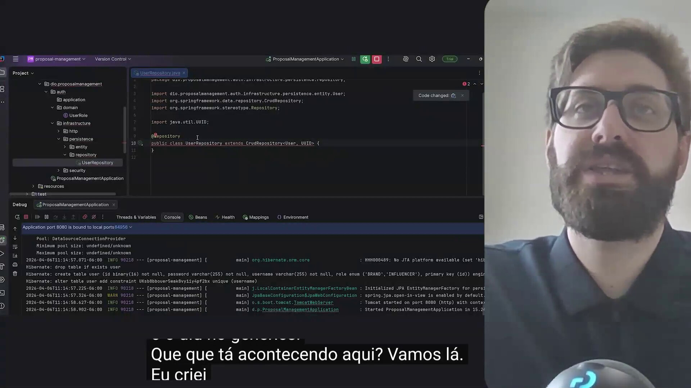
</p>

Primeira versão do `UserRepository`, estendendo `CrudRepository<User, UUID>`, o que já disponibiliza operações prontas como `save`, `find`, `findAll` e `findById`. Nesse momento a classe ainda está declarada como `class` (e não como `interface`), o que gera os erros indicados pela IDE — esse ponto será corrigido logo em seguida.

```java
package dio.proposalmanagement.auth.infrastructure.persistence.repository;

import dio.proposalmanagement.auth.infrastructure.persistence.entity.User;
import org.springframework.data.repository.CrudRepository;
import org.springframework.stereotype.Repository;

import java.util.UUID;

@Repository
public class UserRepository extends CrudRepository<User, UUID> {
}
```

<p align="center">
  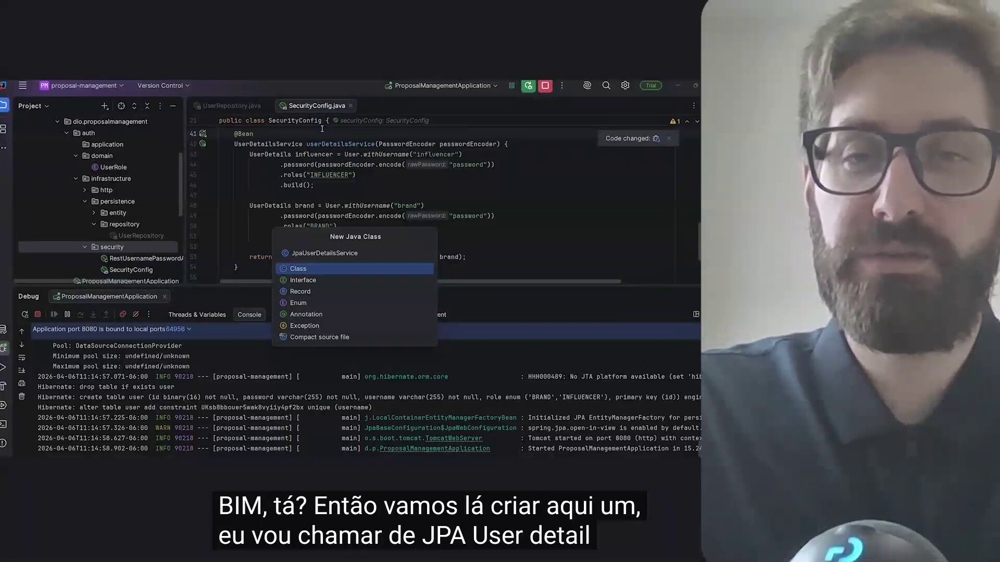
</p>

Criação da classe `JpaUserDetailsService`, dentro do pacote `security`, que substituirá a implementação em memória do `UserDetailsService` mostrada ao fundo (com os usuários `influencer` e `brand` criados via `User.withUsername(...)`). Essa nova classe passará a buscar os usuários diretamente do banco de dados.

<p align="center">
  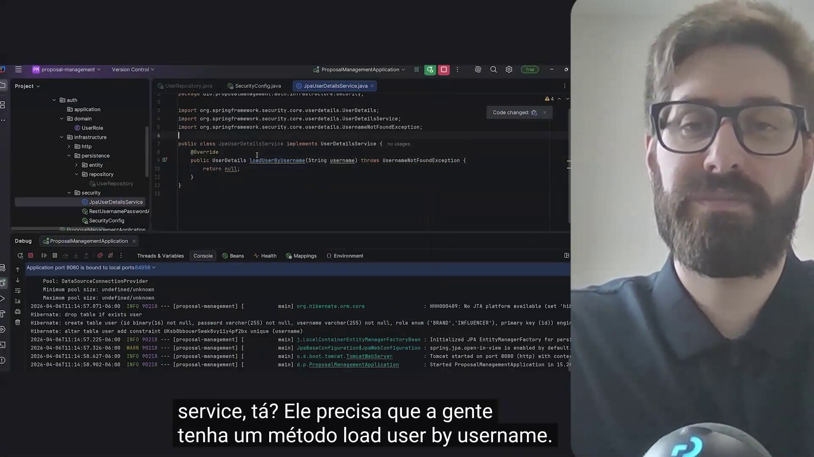
</p>

Estrutura inicial da classe `JpaUserDetailsService`, implementando a interface `UserDetailsService` do Spring Security, que exige a implementação do método `loadUserByUsername`, ainda retornando `null` neste momento.

```java
package dio.proposalmanagement.auth.infrastructure.security;

import org.springframework.security.core.userdetails.UserDetails;
import org.springframework.security.core.userdetails.UserDetailsService;
import org.springframework.security.core.userdetails.UsernameNotFoundException;

public class JpaUserDetailsService implements UserDetailsService {
    @Override
    public UserDetails loadUserByUsername(String username) throws UsernameNotFoundException {
        return null;
    }
}
```

<p align="center">
  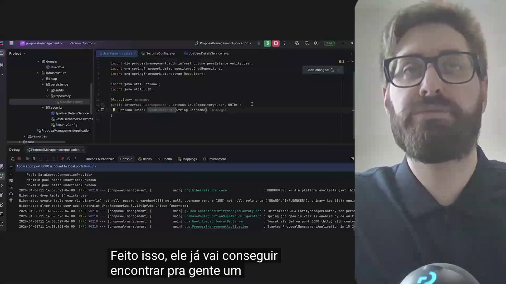
</p>

Correção do `UserRepository`: agora declarado corretamente como `interface` (e não mais `class`), com a assinatura do método `findByUsername`, que retorna um `Optional<User>`. Basta declarar a assinatura seguindo a convenção de nomes do Spring Data JPA/Hibernate para que a implementação da consulta seja gerada automaticamente.

```java
package dio.proposalmanagement.auth.infrastructure.persistence.repository;

import dio.proposalmanagement.auth.infrastructure.persistence.entity.User;
import org.springframework.data.repository.CrudRepository;
import org.springframework.stereotype.Repository;

import java.util.Optional;
import java.util.UUID;

@Repository
public interface UserRepository extends CrudRepository<User, UUID> {
    Optional<User> findByUsername(String username);
}
```

<p align="center">
  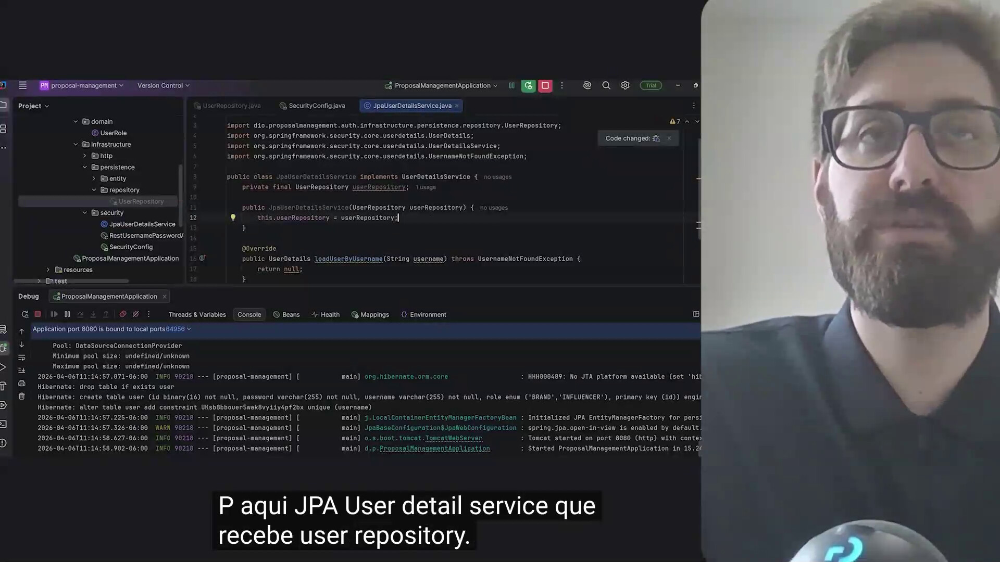
</p>

No `JpaUserDetailsService`, é injetado o `UserRepository` via construtor. O Spring já sabe como fornecer essa dependência porque o repositório está anotado com `@Repository`.

```java
import dio.proposalmanagement.auth.infrastructure.persistence.repository.UserRepository;
import org.springframework.security.core.userdetails.UserDetails;
import org.springframework.security.core.userdetails.UserDetailsService;
import org.springframework.security.core.userdetails.UsernameNotFoundException;

public class JpaUserDetailsService implements UserDetailsService {
    private final UserRepository userRepository;

    public JpaUserDetailsService(UserRepository userRepository) {
        this.userRepository = userRepository;
    }

    @Override
    public UserDetails loadUserByUsername(String username) throws UsernameNotFoundException {
        return null;
    }
}
```

<p align="center">
  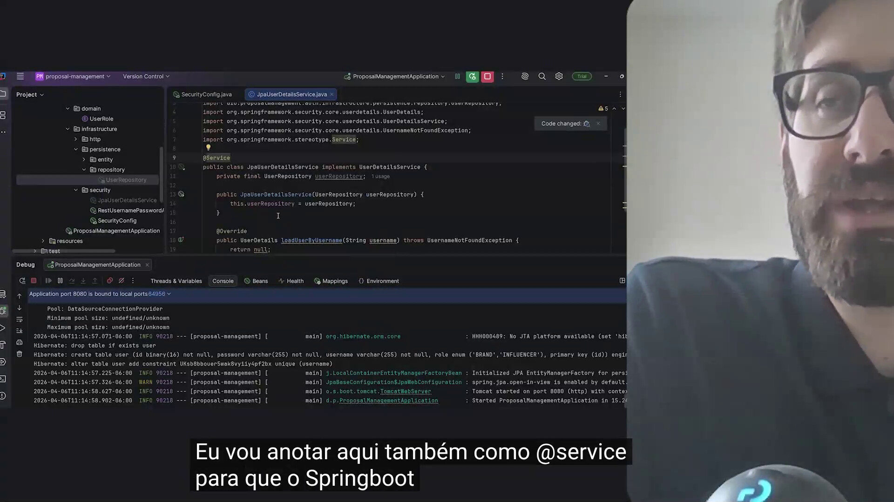
</p>

A classe `JpaUserDetailsService` é anotada com `@Service`, para que o próprio Spring Boot consiga realizar a injeção de dependência dessa implementação de `UserDetailsService` onde ela for necessária (por exemplo, no `DaoAuthenticationManager`).

```java
import org.springframework.stereotype.Service;

@Service
public class JpaUserDetailsService implements UserDetailsService {
    private final UserRepository userRepository;

    public JpaUserDetailsService(UserRepository userRepository) {
        this.userRepository = userRepository;
    }
    // ...
}
```

<p align="center">
  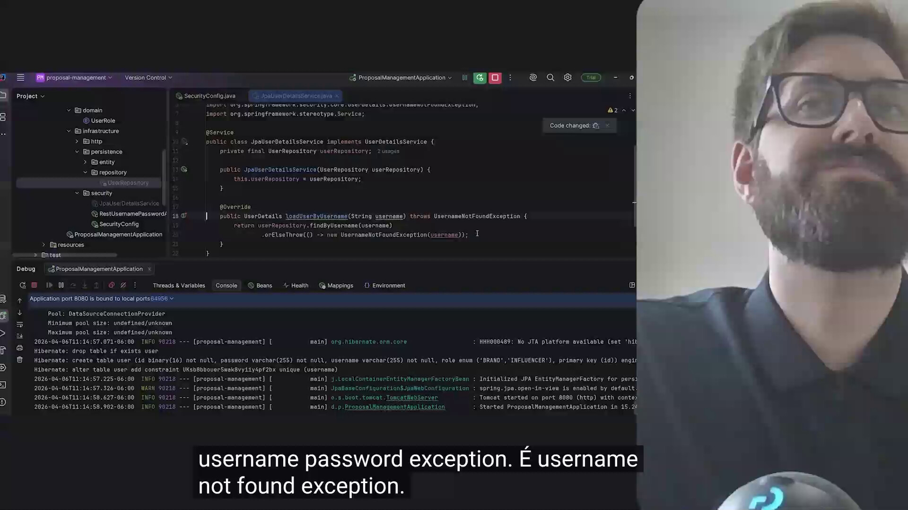
</p>

Implementação final do método `loadUserByUsername`: ele chama `userRepository.findByUsername(username)`, que retorna um `Optional`; caso esteja vazio, é lançada uma `UsernameNotFoundException`. Essa é exatamente a assinatura esperada por um `UserDetailsService`.

```java
@Override
public UserDetails loadUserByUsername(String username) throws UsernameNotFoundException {
    return userRepository.findByUsername(username)
            .orElseThrow(() -> new UsernameNotFoundException(username));
}
```

<p align="center">
  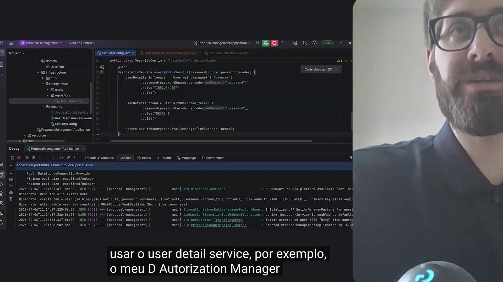
</p>

Revisão do bean antigo, ainda presente no `SecurityConfig`, que criava um `UserDetailsService` em memória com os usuários `influencer` e `brand`. Como agora existe uma implementação própria de `UserDetailsService` (o `JpaUserDetailsService`), esse bean se torna redundante e pode ser removido, pois o Spring passará a injetar automaticamente a implementação baseada em banco de dados nos componentes que dependem de um `UserDetailsService` — como o `DaoAuthenticationManager`.

```java
@Bean
UserDetailsService userDetailsService(PasswordEncoder passwordEncoder) {
    UserDetails influencer = User.withUsername("influencer")
            .password(passwordEncoder.encode("password"))
            .roles("INFLUENCER")
            .build();

    UserDetails brand = User.withUsername("brand")
            .password(passwordEncoder.encode("password"))
            .roles("BRAND")
            .build();

    return new InMemoryUserDetailsManager(influencer, brand);
}
```

<p align="center">
  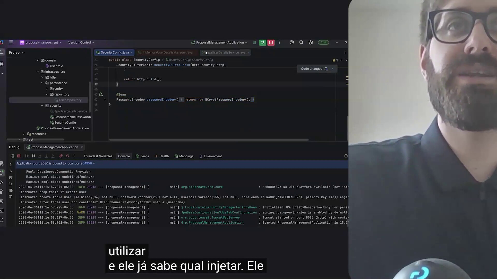
</p>

Após a remoção do bean de `UserDetailsService` em memória, o `SecurityConfig` permanece apenas com a definição do `PasswordEncoder`. A partir de agora, a autenticação passa a depender exclusivamente do `JpaUserDetailsService`, que consulta os usuários no banco de dados.

```java
@Bean
PasswordEncoder passwordEncoder() { return new BCryptPasswordEncoder(); }
```

<p align="center">
  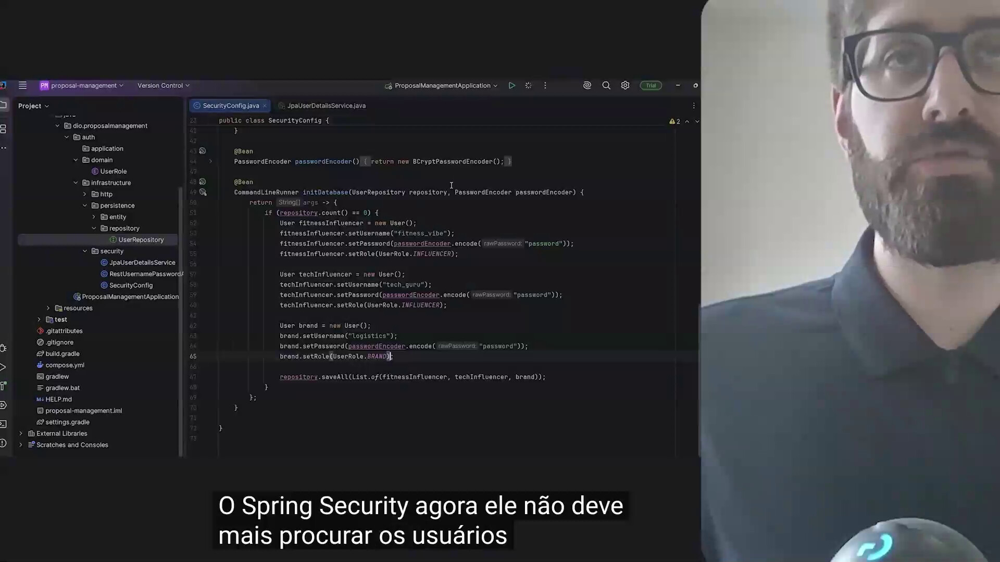
</p>

Adição de um bean `CommandLineRunner` no `SecurityConfig`, executado automaticamente na inicialização da aplicação. Ele verifica se o repositório de usuários está vazio e, em caso afirmativo, cria três usuários de exemplo — `fitness_vibe` e `tech_guru` com a *role* `INFLUENCER`, e `logistics` com a *role* `BRAND` — persistindo-os via `repository.saveAll(...)`. A partir deste momento, o Spring Security deixa de buscar usuários em memória e passa a autenticá-los diretamente a partir do banco de dados.

```java
@Bean
CommandLineRunner initDatabase(UserRepository repository, PasswordEncoder passwordEncoder) {
    return args -> {
        if (repository.count() == 0) {
            User fitnessInfluencer = new User();
            fitnessInfluencer.setUsername("fitness_vibe");
            fitnessInfluencer.setPassword(passwordEncoder.encode("password"));
            fitnessInfluencer.setRole(UserRole.INFLUENCER);

            User techInfluencer = new User();
            techInfluencer.setUsername("tech_guru");
            techInfluencer.setPassword(passwordEncoder.encode("password"));
            techInfluencer.setRole(UserRole.INFLUENCER);

            User brand = new User();
            brand.setUsername("logistics");
            brand.setPassword(passwordEncoder.encode("password"));
            brand.setRole(UserRole.BRAND);

            repository.saveAll(List.of(fitnessInfluencer, techInfluencer, brand));
        }
    };
}
```

<p align="center">
  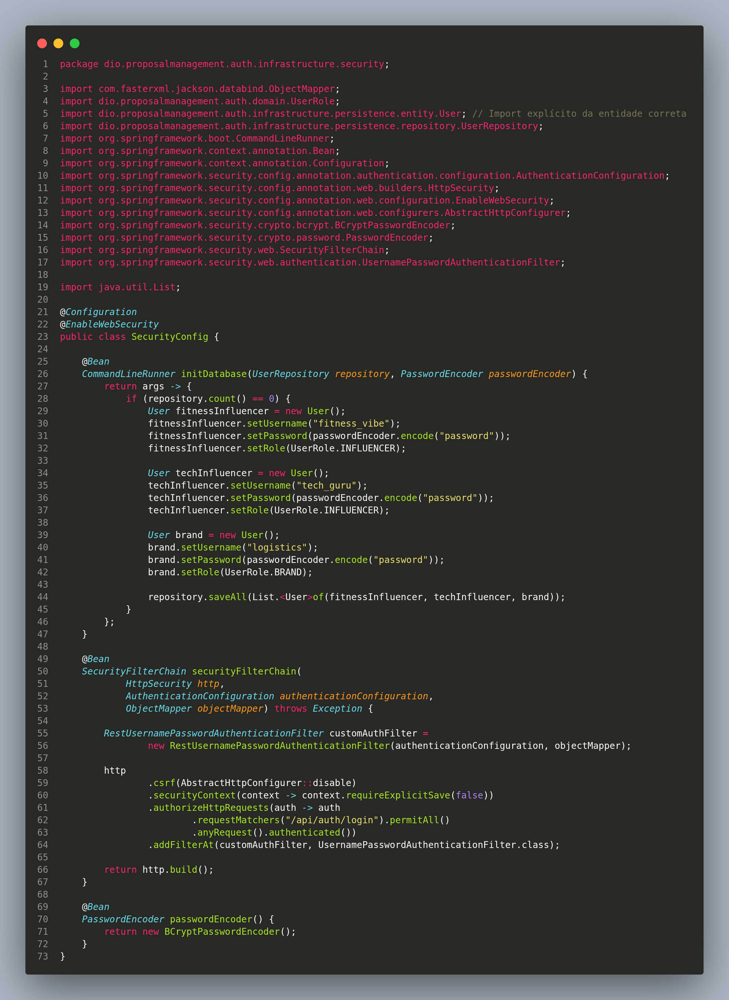
</p>

Visão completa e consolidada da classe `SecurityConfig` neste ponto da aula, reunindo o `CommandLineRunner` de inicialização dos usuários, a cadeia de filtros de segurança (`SecurityFilterChain`) com o filtro customizado de autenticação (`RestUsernamePasswordAuthenticationFilter`) e o bean de `PasswordEncoder` baseado em BCrypt.

```java
package dio.proposalmanagement.auth.infrastructure.security;

import com.fasterxml.jackson.databind.ObjectMapper;
import dio.proposalmanagement.auth.domain.UserRole;
import dio.proposalmanagement.auth.infrastructure.persistence.entity.User; // Import explícito da entidade correta
import dio.proposalmanagement.auth.infrastructure.persistence.repository.UserRepository;
import org.springframework.boot.CommandLineRunner;
import org.springframework.context.annotation.Bean;
import org.springframework.context.annotation.Configuration;
import org.springframework.security.config.annotation.authentication.configuration.AuthenticationConfiguration;
import org.springframework.security.config.annotation.web.builders.HttpSecurity;
import org.springframework.security.config.annotation.web.configuration.EnableWebSecurity;
import org.springframework.security.config.annotation.web.configurers.AbstractHttpConfigurer;
import org.springframework.security.crypto.bcrypt.BCryptPasswordEncoder;
import org.springframework.security.crypto.password.PasswordEncoder;
import org.springframework.security.web.SecurityFilterChain;
import org.springframework.security.web.authentication.UsernamePasswordAuthenticationFilter;

import java.util.List;

@Configuration
@EnableWebSecurity
public class SecurityConfig {

    @Bean
    CommandLineRunner initDatabase(UserRepository repository, PasswordEncoder passwordEncoder) {
        return args -> {
            if (repository.count() == 0) {
                User fitnessInfluencer = new User();
                fitnessInfluencer.setUsername("fitness_vibe");
                fitnessInfluencer.setPassword(passwordEncoder.encode("password"));
                fitnessInfluencer.setRole(UserRole.INFLUENCER);

                User techInfluencer = new User();
                techInfluencer.setUsername("tech_guru");
                techInfluencer.setPassword(passwordEncoder.encode("password"));
                techInfluencer.setRole(UserRole.INFLUENCER);

                User brand = new User();
                brand.setUsername("logistics");
                brand.setPassword(passwordEncoder.encode("password"));
                brand.setRole(UserRole.BRAND);

                repository.saveAll(List.<User>of(fitnessInfluencer, techInfluencer, brand));
            }
        };
    }

    @Bean
    SecurityFilterChain securityFilterChain(
            HttpSecurity http,
            AuthenticationConfiguration authenticationConfiguration,
            ObjectMapper objectMapper) throws Exception {

        RestUsernamePasswordAuthenticationFilter customAuthFilter =
                new RestUsernamePasswordAuthenticationFilter(authenticationConfiguration, objectMapper);

        http
                .csrf(AbstractHttpConfigurer::disable)
                .securityContext(context -> context.requireExplicitSave(false))
                .authorizeHttpRequests(auth -> auth
                        .requestMatchers("/api/auth/login").permitAll()
                        .anyRequest().authenticated())
                .addFilterAt(customAuthFilter, UsernamePasswordAuthenticationFilter.class);

        return http.build();
    }

    @Bean
    PasswordEncoder passwordEncoder() {
        return new BCryptPasswordEncoder();
    }
}
```

<p align="center">
  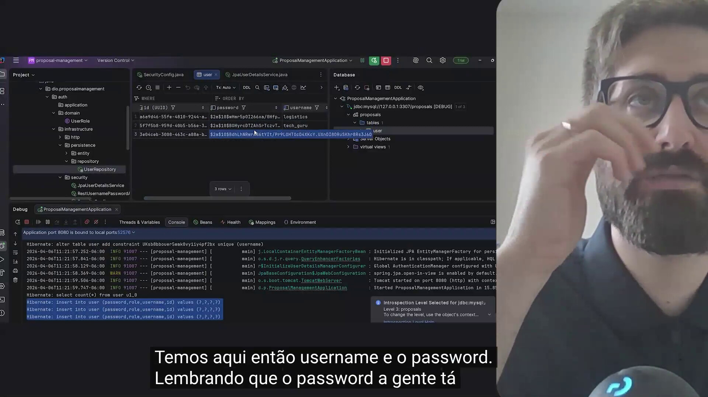
</p>

Consulta à tabela `user` no banco de dados confirmando que os três usuários foram persistidos com sucesso, exibindo as colunas `id` (UUID), `password` (já criptografada com BCrypt, evidenciado pelo prefixo `$2a$10$...`) e `username`.

<p align="center">
  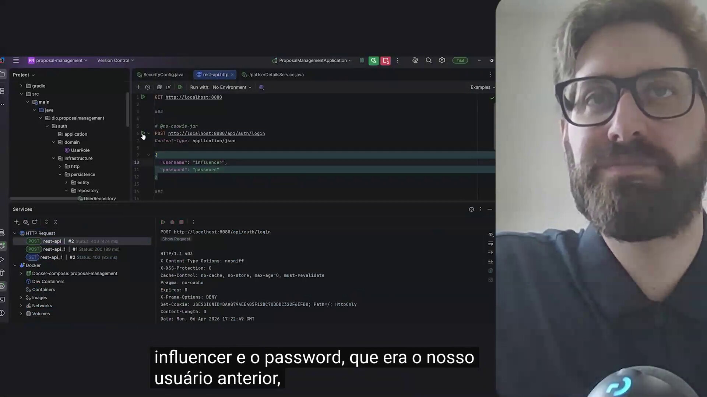
</p>

Primeiro teste de autenticação usando o cliente HTTP: uma requisição `POST` para `/api/auth/login` com o usuário `influencer` (que era válido na implementação anterior, em memória) e senha `password`. Como esse usuário não existe mais no banco de dados, a resposta é `403`.

<p align="center">
  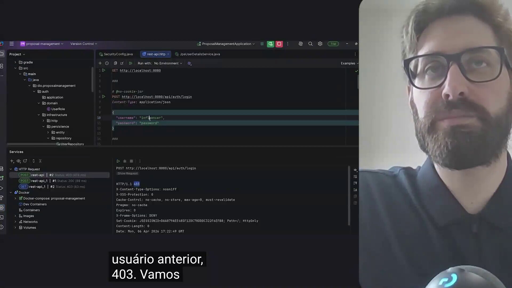
</p>

Confirmação do resultado da requisição anterior: código de status `403`, indicando que a autenticação com o usuário `influencer` falhou, já que esse usuário não foi migrado para o banco.

<p align="center">
  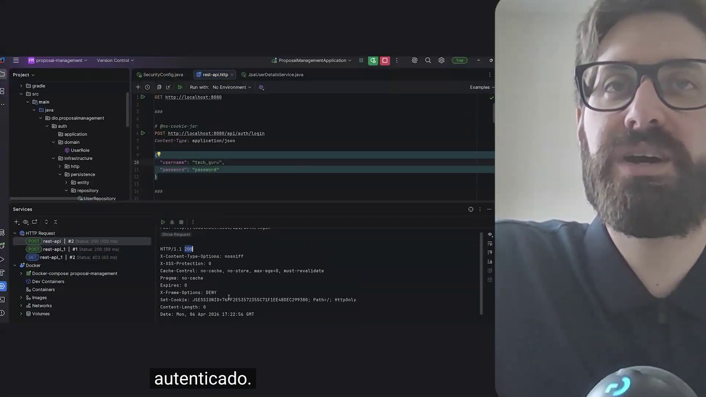
</p>

Nova tentativa de login, agora com o usuário `tech_guru` (criado pelo `CommandLineRunner` e persistido no banco), utilizando a mesma senha `password`. A resposta é `200`, confirmando que a autenticação via banco de dados funcionou.

<p align="center">
  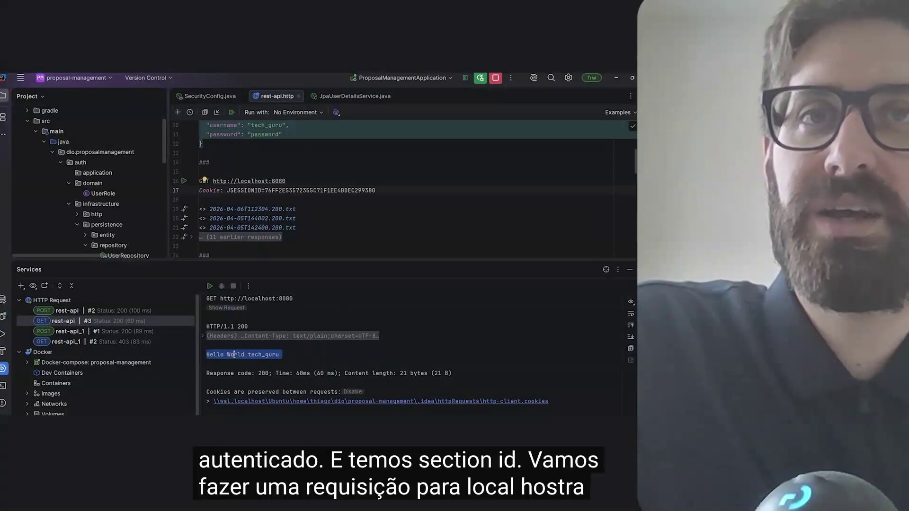
</p>

Utilizando o cookie de sessão (`JSESSIONID`) obtido no login anterior, é feita uma requisição `GET` para `http://localhost:8080`. A resposta retorna `Hello World tech_guru`, confirmando que o usuário autenticado foi corretamente identificado pela aplicação.

<p align="center">
  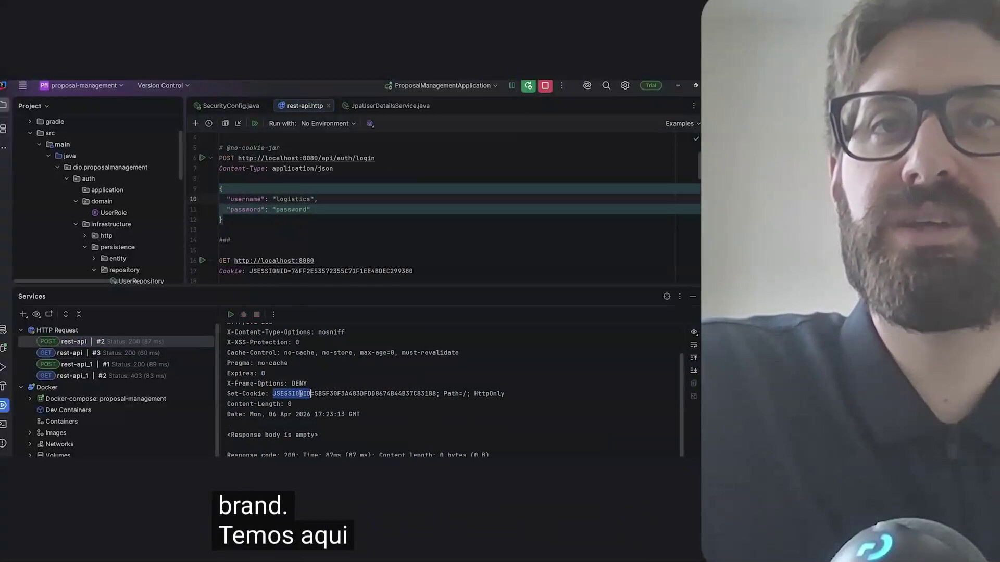
</p>

Novo login, dessa vez com o usuário `logistics` (a *brand* criada no banco), utilizando a senha `password`. A resposta `200` e o novo `Set-Cookie` confirmam a autenticação bem-sucedida.

<p align="center">
  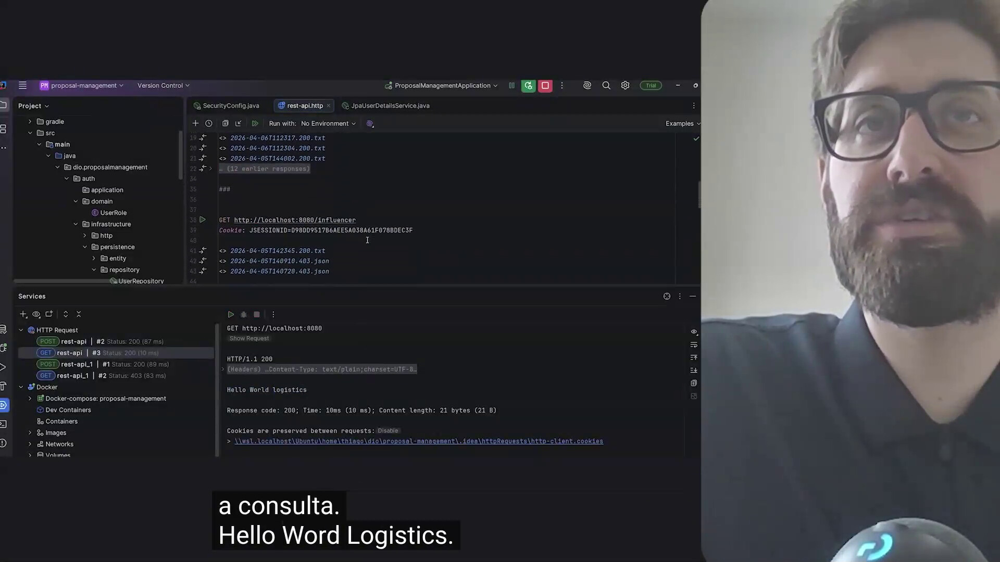
</p>

Requisição `GET` para `http://localhost:8080` usando o cookie de sessão do usuário `logistics`. A resposta retorna `Hello World logistics`, validando que a autenticação da *brand*, agora vinda do banco de dados, também está funcionando corretamente.

<p align="center">
  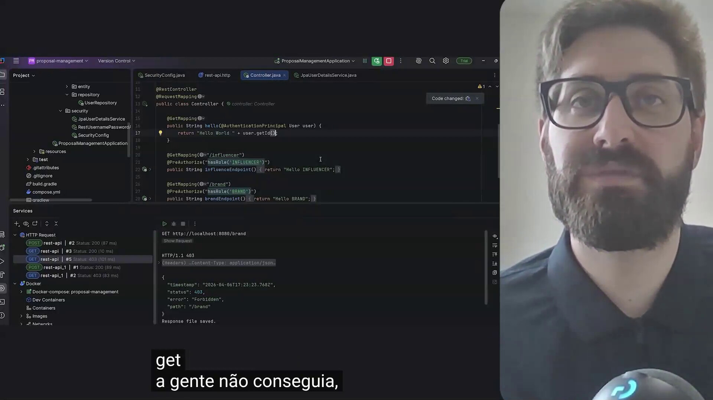
</p>

Código do `Controller`, mostrando o endpoint principal `hello`, que recebe o usuário autenticado via `@AuthenticationPrincipal User user` e retorna `"Hello World " + user.getId()` — algo que não era possível anteriormente com o `UserDetails` padrão, que só expunha `username` e `password`. Também são mostrados os endpoints `/influencer` e `/brand`, protegidos por `@PreAuthorize` com as respectivas *roles*. A requisição para `/brand` retornou `403 Forbidden`, um problema relacionado à forma como as *roles* estão definidas.

```java
@RestController
@RequestMapping
public class Controller {

    @GetMapping
    public String hello(@AuthenticationPrincipal User user) {
        return "Hello World " + user.getId();
    }

    @GetMapping("/influencer")
    @PreAuthorize("hasRole('INFLUENCER')")
    public String influencerEndpoint() { return "Hello INFLUENCER"; }

    @GetMapping("/brand")
    @PreAuthorize("hasRole('BRAND')")
    public String brandEndpoint() { return "Hello BRAND"; }
}
```

<p align="center">
  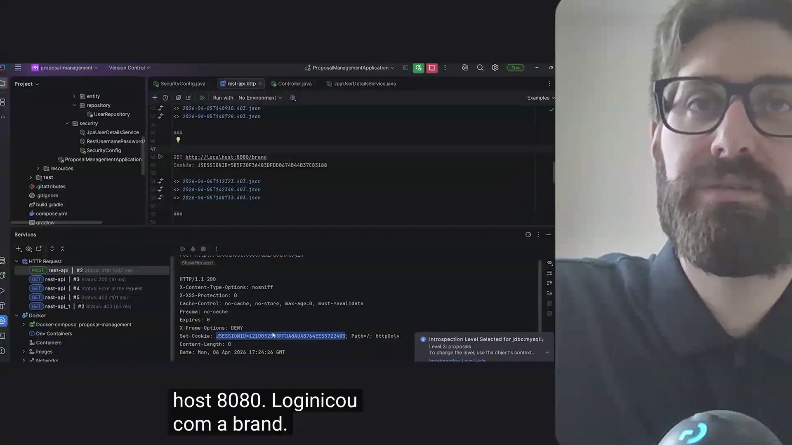
</p>

Novo login realizado com o usuário `logistics` (*brand*), obtendo um novo cookie de sessão para testar o endpoint protegido `/brand`.

<p align="center">
  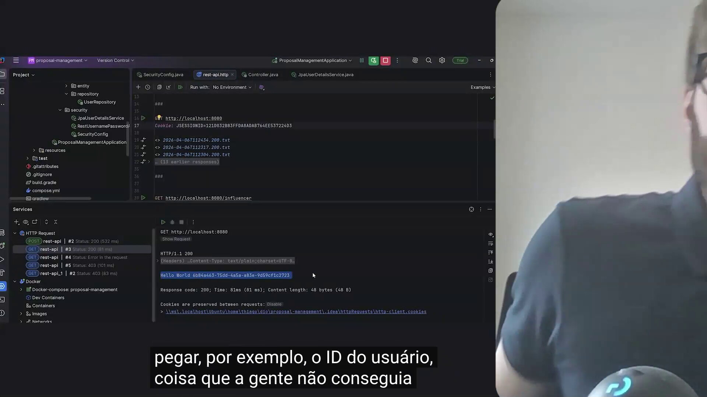
</p>

Requisição ao endpoint raiz utilizando o cookie do usuário autenticado, retornando `Hello World` seguido do UUID do usuário (por exemplo, `6b84a463-75dd-4a5a-a83e-9d59cf1c2723`). Isso demonstra, na prática, o ganho de usar a entidade `User` própria em vez do `UserDetails` genérico: agora é possível acessar diretamente o `id` do usuário autenticado.

<p align="center">
  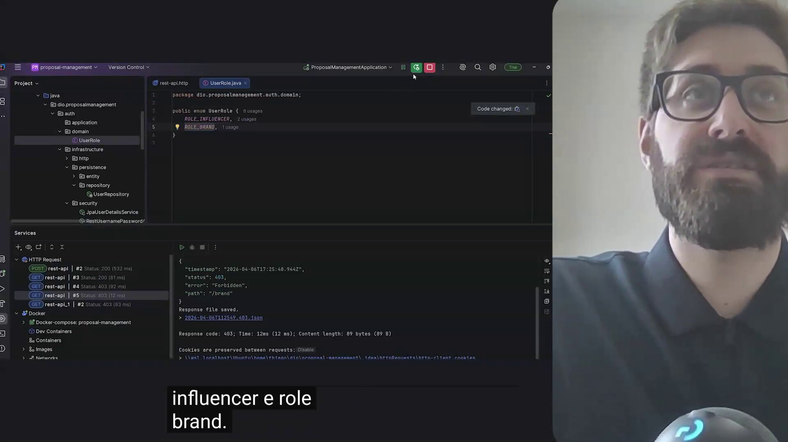
</p>

Ajuste no `UserRole`: os valores do enum são renomeados de `INFLUENCER`/`BRAND` para `ROLE_INFLUENCER`/`ROLE_BRAND`. Isso é necessário porque o Spring Security espera, internamente, que as autoridades (*authorities*) tenham o prefixo `ROLE_` quando utilizadas em conjunto com `hasRole(...)` nas anotações `@PreAuthorize`. Antes dessa correção, a requisição para `/brand` retornava `403`.

```java
package dio.proposalmanagement.auth.domain;

public enum UserRole {
    ROLE_INFLUENCER,
    ROLE_BRAND,
}
```

<p align="center">
  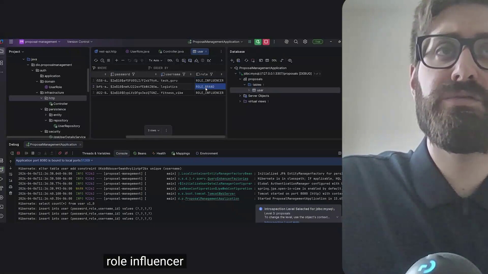
</p>

Consulta à tabela `user` no banco de dados após reiniciar a aplicação, confirmando que as *roles* foram atualizadas para `ROLE_INFLUENCER` e `ROLE_BRAND`. Com esse ajuste, o `@PreAuthorize("hasRole('BRAND')")` do endpoint `/brand` passa a reconhecer corretamente a autoridade do usuário `logistics`, permitindo o acesso que antes era negado.
      
#### Material de Apoio Até Esta Etapa

- Arquivos do projeto nesta etapa: [./000-Midia_e_Anexos/proposal-managemnet_ate_o_video04.zip](./000-Midia_e_Anexos/etapas_do_codigo/proposal-managemnet_ate_o_video04.zip)
- [yyy-yyyyyyyyyyyy](./yyy-xxxxxxxxxxxxxxxxx.md)


### 🟩 Vídeo 05 - Segurança com Banco de Dados

<video width="60%" controls>
  <source src="000-Midia_e_Anexos/bootcamp_ntt_data_java_spring_ai-modulo.04-curso.02-video_05.webm" type="video/webm">
    Seu navegador não suporta vídeo HTML5.
</video>

link do vídeo: https://web.dio.me/track/ntt-data-2026-ai-java-back-end/course/simplificando-a-seguranca-em-apis-rest-com-spring-security/learning/54d0c000-6178-4510-bf96-6124f45075b1?autoplay=1

### 🟩 Vídeo 06 - Segurança Baseada em Papéis

<video width="60%" controls>
  <source src="000-Midia_e_Anexos/bootcamp_ntt_data_java_spring_ai-modulo.04-curso.02-video_06.webm" type="video/webm">
    Seu navegador não suporta vídeo HTML5.
</video>

link do vídeo:

### 🟩 Vídeo 07 - Implementando o Use Case de Listagem

<video width="60%" controls>
  <source src="000-Midia_e_Anexos/bootcamp_ntt_data_java_spring_ai-modulo.04-curso.02-video_07.webm" type="video/webm">
    Seu navegador não suporta vídeo HTML5.
</video>

link do vídeo:

### 🟩 Vídeo 08 - Criando Entidades de Persistência

<video width="60%" controls>
  <source src="000-Midia_e_Anexos/bootcamp_ntt_data_java_spring_ai-modulo.04-curso.02-video_08.webm" type="video/webm">
    Seu navegador não suporta vídeo HTML5.
</video>

link do vídeo:

### 🟩 Vídeo 09 - Implementando o ProposalController

<video width="60%" controls>
  <source src="000-Midia_e_Anexos/bootcamp_ntt_data_java_spring_ai-modulo.04-curso.02-video_09.webm" type="video/webm">
    Seu navegador não suporta vídeo HTML5.
</video>

link do vídeo:

### 🟩 Vídeo 10 - Segurança Escalável

<video width="60%" controls>
  <source src="000-Midia_e_Anexos/bootcamp_ntt_data_java_spring_ai-modulo.04-curso.02-video_10.webm" type="video/webm">
    Seu navegador não suporta vídeo HTML5.
</video>

link do vídeo:

### Tutoriais


### Arquivos do Projeto


# Certificado: Simplificando a Segurança em APIs REST com Spring Security

- Link na plataforma: 
- Certificado em pdf: