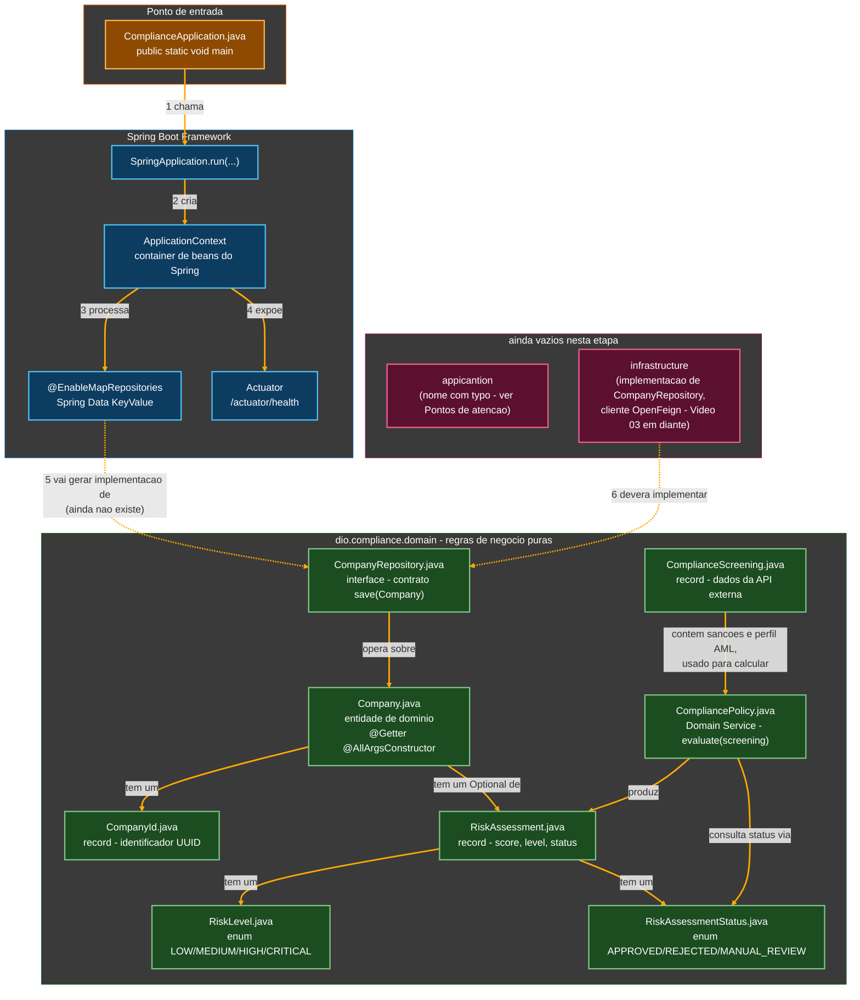
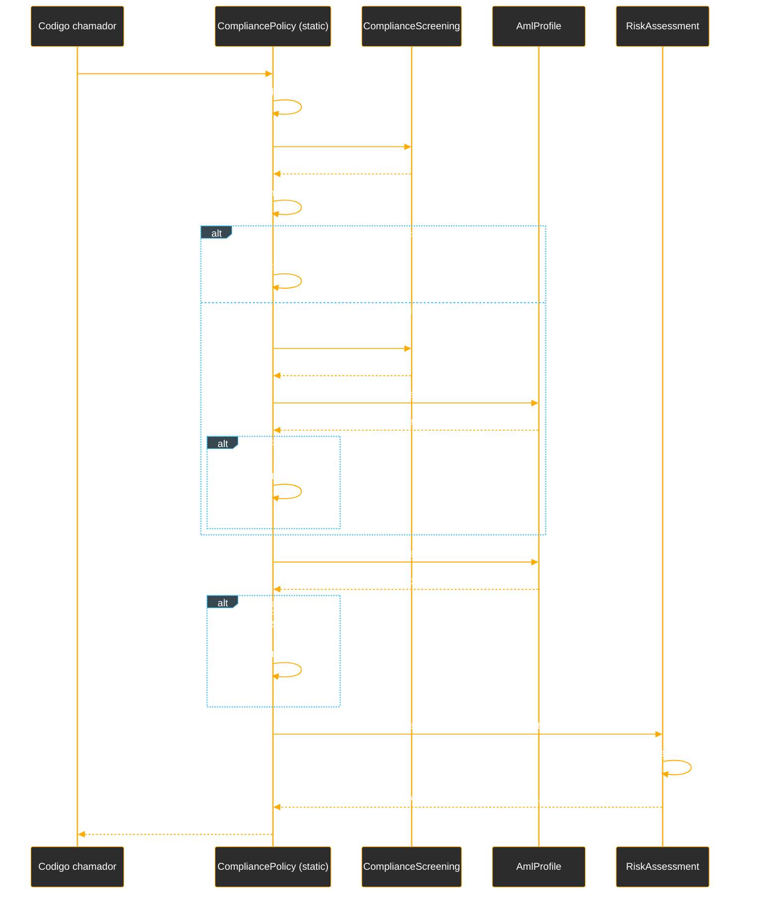

# Tutorial de Estudos — Consumindo APIs Externas com o Spring Cloud OpenFeign

**Do zero ao coração do domínio de Compliance — Vídeos 01 e 02**

- Curso: NTT Data — Jornada Tech (DIO) · Módulo 04 — Java/Spring com IA
- Curso 4 do módulo: "Consumindo APIs Externas com a Spring Cloud OpenFeign"
- Instrutor: Thiago Poiani (Principal Engineer at Skip)
- Projeto: `compliance`
- Documento de referência pessoal — nível iniciante em Java

---

## Sobre este documento

Este tutorial foi criado a partir das anotações de aula (README), da transcrição em áudio do Vídeo 02 e do código-fonte real do projeto `compliance`, na etapa correspondente ao **Vídeo 02**. O objetivo é explicar, com riqueza de detalhes e em nível iniciante, cada instrução escrita até agora — o que ela faz, por que foi escrita daquela forma, e qual conceito de Java, Spring ou de arquitetura de software ela representa.

Este documento deve ser usado como um mapa: sempre que houver dúvida sobre "por que essa linha está aqui", volte a ele. A ideia é que, relendo este material, seja possível reconstruir o raciocínio da aula sem precisar assistir ao vídeo novamente.

> **Como este documento está organizado**
> A Parte 1 resume o vídeo teórico de abertura do curso (Vídeo 01). A Parte 2 é o núcleo do tutorial: o código é apresentado em pequenos blocos, na ordem em que foi escrito na aula, seguido de explicação linha a linha. Ao final, há uma seção sobre pontos em que o projeto real diverge levemente do que foi mostrado em aula, um glossário, um checkpoint fiel do código real (conferido diretamente no `.zip` enviado), os próximos passos do curso e diagramas de como tudo se encaixa.

---

## Parte 1 — Fundamentos: de provedor a consumidor de dados (Vídeo 01)

O primeiro vídeo do curso é teórico: antes de escrever qualquer código, a aula situa por que um backend moderno raramente vive sozinho — e por que isso exige uma ferramenta como o Spring Cloud OpenFeign.

### 1.1. De "Backend Isolado" a "Backend Consumidor"

A aula contrasta dois papéis que um servidor pode assumir:

- **Backend Isolado** (modelo tradicional) — apenas recebe requisições de clientes (navegador, celular) e responde com dados do seu próprio banco de dados. Um fluxo de mão única.
- **Backend Consumidor** (modelo distribuído moderno) — além de atender clientes, o próprio servidor faz requisições ativas para fora: para uma nuvem, para um serviço de terceiros, para outro microsserviço. O servidor passa a ser, ao mesmo tempo, provedor e cliente de dados.

> **Por que isso importa para o código?**
> É exatamente esse segundo papel — o de "Backend Consumidor" — que o projeto `compliance` vai exercitar. A aplicação vai manter empresas cadastradas (papel de provedor, para quem consulta o sistema) e, ao mesmo tempo, consultar uma API externa de sanções (papel de consumidor). O Spring Cloud OpenFeign, que dá nome ao curso, é a ferramenta que torna esse segundo papel simples de implementar.

### 1.2. HTTP como o "idioma comum" dos sistemas distribuídos

Como aplicações construídas em tecnologias diferentes (uma em Java, outra em Python, outra em Node.js) precisam conversar entre si, é necessária uma semântica rígida, universal e previsível. Esse é o papel do protocolo **HTTP**: verbos (`GET`, `POST`, `PUT`/`PATCH`, `DELETE`) indicam a *intenção* da requisição, e faixas de código de status (`2xx` sucesso, `4xx` erro do cliente, `5xx` erro do servidor) confirmam o que de fato aconteceu. Essa combinação — verbo + código de status — forma o que a aula chama de "contrato inquebrável" entre cliente e servidor.

### 1.3. O custo escondido de integrar "na unha"

Antes de apresentar o OpenFeign, a aula mostra o problema que ele resolve: fazer uma integração HTTP manualmente consome, segundo o material do curso, cerca de **80% do tempo do desenvolvedor** só com infraestrutura — abrir e fechar conexões (sockets) manualmente, configurar tudo de forma verbosa e imperativa, converter strings JSON para objetos Java "na mão", e tratar erros de rede sem nenhum contexto de negócio. Apenas os 20% restantes sobram, de fato, para a lógica de negócio.

### 1.4. A virada declarativa: Spring Cloud OpenFeign

O OpenFeign propõe o oposto: "diga o que você quer, não como fazer". Em vez de escrever a implementação de uma chamada HTTP, basta **declarar uma interface** anotada, descrevendo o contrato da API externa — o próprio Spring gera a implementação em tempo de execução, cuidando de toda a mecânica de rede e de conversão JSON → objeto por trás das anotações.

Essa mudança de abordagem se reflete em quatro dimensões, segundo a comparação feita na aula:

| Dimensão | Abordagem manual (antiga) | Abordagem OpenFeign (nova) |
|---|---|---|
| Foco do código | Implementação da rede | Declaração do contrato de negócio |
| Mapeamento HTTP | Hardcoded / manipulação de strings | Anotações nativas, semântica limpa |
| Conversão de dados | Parsing manual explícito (Jackson/Gson) | Parsing automático e transparente |
| Manutenibilidade | Alta complexidade, refatoração frágil | Simplicidade baseada em interfaces |

Quando essa inversão acontece, o esforço do desenvolvedor se inverte também: em vez de 80% em infraestrutura, a aula estima que **95% do tempo** passa a ser dedicado à lógica de negócio e ao domínio da aplicação, contra apenas 5% em declaração de contrato. Os REST Clients deixam de ser um mero atalho de produtividade e passam a ser descritos como "viabilizadores de escala" e um mecanismo de "isolamento de domínio": ao delegar a complexidade de rede ao Spring Cloud OpenFeign, a aplicação permanece pura, focada nas suas próprias regras, e relativamente imune ao caos do ecossistema externo (indisponibilidades, lentidão, mudanças de contrato de terceiros).

### 1.5. O estudo de caso: Compliance Digital, KYC e AML

Por fim, a aula apresenta o projeto que será construído ao longo do curso, sob o título "Compliance Digital: O Escudo de KYC e AML":

- **KYC (Know Your Customer)** — o processo crítico de identificação para validar a identidade de um cliente no início do relacionamento com uma plataforma.
- **AML (Anti-Money Laundering)** — a mitigação de riscos de lavagem de dinheiro, apoiada em dados externos vitais para segurança e legalidade.
- **Provedores de sanções** — a aula usa como exemplo o **OpenSanctions**, um serviço real que mantém listas globais de pessoas e empresas sancionadas ou politicamente expostas; no curso, esse tipo de fonte será *simulado* por uma API mocada.
- **Resiliência obrigatória** — como o serviço externo consumido não é perfeito, a aplicação precisará lidar com respostas lentas, instáveis ou indisponíveis (tema que a aula promete revisitar em vídeos futuros, sobre tolerância a falhas).

> **E o projeto `compliance` que você está construindo?**
> É exatamente essa a aplicação: um sistema que mantém **empresas (`Company`)** cadastradas e consulta uma **API mocada de compliance** para verificar se essas empresas — ou seus membros — possuem sanções internacionais, envolvimento com lavagem de dinheiro, ou se são pessoas politicamente expostas (PEP). O restante deste tutorial documenta o início prático dessa implementação, feito no Vídeo 02.

---

## Parte 2 — Construindo o coração do domínio de Compliance (Vídeo 02)

Este é o primeiro vídeo do curso em que código de fato é escrito. O objetivo do vídeo é sair do zero absoluto — criar o projeto Spring Boot — e chegar até as classes centrais do domínio de compliance: `Company`, `RiskAssessment`, `ComplianceScreening` e o serviço de domínio `CompliancePolicy`, que calcula o risco de uma empresa a partir dos dados de uma varredura de compliance. **Nenhum endpoint HTTP, nenhuma chamada real ao OpenFeign e nenhuma persistência de fato acontecem ainda nesta etapa** — isso fica para os próximos vídeos.

### 2.1. Criando o projeto e organizando os pacotes em camadas (DDD)

O projeto é criado no IntelliJ IDEA, nomeado **`compliance`**, grupo **`dio`**, pacote-base **`dio.compliance`**, com build **Gradle (Groovy)**. Antes de escrever qualquer classe, o instrutor organiza a estrutura seguindo os princípios de **Domain-Driven Design (DDD)**, criando três pacotes principais dentro de `dio.compliance`:

```
dio.compliance
├── domain            (regras de negócio, com o mínimo de dependência de frameworks)
├── application        (orquestração e interação entre domain e infrastructure)
└── infrastructure      (camada externa: banco de dados, comunicação com APIs)
```

- **`domain`** — concentra as regras de negócio da aplicação: entidades, identificadores, interfaces de repositório, serviços de domínio. É o "cérebro" do sistema, e deve depender o mínimo possível de frameworks externos (nesta etapa, praticamente não importa nada do Spring, à exceção de uma classe utilitária pontual).
- **`application`** — camada orquestradora, responsável por coordenar chamadas entre `domain` e `infrastructure` (ainda vazia nesta etapa; deve ganhar conteúdo quando os *use cases* forem estruturados, no Vídeo 04).
- **`infrastructure`** — tudo o que é "detalhe técnico": implementação concreta de repositórios, clientes HTTP para a API externa de compliance. Também ainda vazia nesta etapa.

> **Por que separar em pacotes assim?**
> Essa separação existe para que as regras de negócio (`domain`) não fiquem "presas" a uma tecnologia específica de persistência ou de comunicação. Se um dia a API mocada de compliance for trocada por outra, real, ou se o armazenamento em memória (usado nesta etapa) for trocado por um banco de dados de verdade, o pacote `domain` praticamente não muda — só o que está em `infrastructure` muda. Pense em `domain` como as regras do jogo, e `infrastructure` como o material físico usado para jogar.

### 2.2. `build.gradle` inicial: apenas o essencial

O projeto é criado deliberadamente **sem dependências**, para que elas sejam adicionadas conforme a necessidade surgir durante a aula:

```groovy
plugins {
    id 'java'
    id 'org.springframework.boot' version '4.0.5'
    id 'io.spring.dependency-management' version '1.1.7'
}

group = 'dio'
version = '0.0.1-SNAPSHOT'
description = 'compliance'

java {
    toolchain {
        languageVersion = JavaLanguageVersion.of(25)
    }
}

repositories {
    mavenCentral()
}

dependencies {
    implementation 'org.springframework.boot:spring-boot-starter'
    testImplementation 'org.springframework.boot:spring-boot-starter-test'
    testRuntimeOnly 'org.junit.platform:junit-platform-launcher'
}

tasks.named('test') {
    useJUnitPlatform()
}
```

- **`plugins { ... }`** — declara os plugins do Gradle usados para construir o projeto: o plugin `java` (habilita compilação Java), o plugin do Spring Boot (empacota a aplicação como um executável autocontido) e o plugin de gerenciamento de dependências do Spring (resolve automaticamente versões compatíveis entre as bibliotecas do ecossistema Spring).
- **`java { toolchain { languageVersion = JavaLanguageVersion.of(25) } }`** — define qual versão do JDK o Gradle deve usar para compilar e rodar o projeto, mesmo que a versão instalada na máquina seja outra: aqui, a aula pede Java 25.
- **`dependencies { ... }`** — bloco onde cada biblioteca externa usada pelo projeto é listada. `implementation` significa "essa dependência é necessária para compilar e rodar o código principal"; `testImplementation`, apenas para os testes; `testRuntimeOnly`, apenas em tempo de execução dos testes.

> **Por que começar sem dependências?**
> É uma escolha didática: em vez de gerar um projeto já cheio de bibliotecas, o instrutor prefere adicionar cada dependência exatamente no momento em que ela se torna necessária, para que fique claro *por que* cada uma existe ali. Isso é diferente do hábito comum de aceitar tudo que o gerador de projetos sugere sem entender o motivo.

### 2.3. Adicionando o Lombok via plugin `io.freefair.lombok`

Para reduzir código repetitivo (getters, setters, construtores), a aula recorre ao **Project Lombok**. Em vez de adicionar o Lombok como uma dependência comum, o instrutor usa o plugin Gradle da comunidade `io.freefair.lombok`, que configura automaticamente tanto a dependência quanto o processador de anotações necessário para o Lombok funcionar:

```groovy
plugins {
    id 'java'
    id 'org.springframework.boot' version '4.0.5'
    id 'io.spring.dependency-management' version '1.1.7'

    id("io.freefair.lombok") version "9.2.0"
}
```

> **Por que isso importa?**
> **Lombok** é uma biblioteca Java que se integra ao compilador: durante a compilação, ela lê anotações como `@Getter` ou `@AllArgsConstructor` colocadas em uma classe e gera, "por baixo dos panos", o código Java equivalente (métodos `getNome()`, construtores completos, etc.), sem que o desenvolvedor precise escrever essas linhas manualmente. O plugin `io.freefair.lombok` é apenas uma forma alternativa e mais moderna de habilitar isso no Gradle, em vez de declarar Lombok como uma dependência comum (`compileOnly` + `annotationProcessor`).

### 2.4. Dependências de persistência em memória, REST e monitoramento

Como o projeto ainda não vai usar um banco de dados tradicional, a aula opta pelo **Spring Data KeyValue** — um módulo do Spring Data que permite criar repositórios que manipulam dados **em memória** (um mapa chave-valor), com a mesma API de um repositório "de verdade". Junto dele, entram mais três dependências:

```groovy
dependencies {
    implementation 'org.springframework.boot:spring-boot-starter'
    testImplementation 'org.springframework.boot:spring-boot-starter-test'
    testRuntimeOnly 'org.junit.platform:junit-platform-launcher'

    implementation 'org.springframework.data:spring-data-keyvalue'
    implementation 'org.springframework.boot:spring-boot-starter-data-rest'
    implementation 'org.springframework.boot:spring-boot-starter-web'
    implementation 'org.springframework.boot:spring-boot-starter-actuator'
}
```

- **`spring-data-keyvalue`** — fornece repositórios que guardam objetos em um mapa Java em memória, sem exigir um banco de dados externo. Ideal para prototipar rapidamente a camada de persistência antes de decidir a tecnologia definitiva.
- **`spring-boot-starter-data-rest`** — expõe automaticamente repositórios do Spring Data como *endpoints* REST, sem que seja preciso escrever um `@RestController` manualmente para operações básicas de CRUD.
- **`spring-boot-starter-web`** — traz o servidor web embutido (Tomcat, por padrão) e toda a infraestrutura necessária para a aplicação responder a requisições HTTP.
- **`spring-boot-starter-actuator`** — adiciona endpoints de monitoramento da saúde e do funcionamento interno da aplicação (como `/actuator/health`), úteis tanto em desenvolvimento quanto em produção.

> **Por que isso importa para o restante do curso?**
> A persistência em memória via `spring-data-keyvalue` é uma escolha propositalmente simples para esta fase do curso: ela permite que o projeto tenha repositórios funcionais desde já, sem a complexidade de configurar um banco de dados real. Isso mantém o foco da aula onde ele precisa estar: no domínio de compliance e, mais adiante, no consumo da API externa com OpenFeign — o verdadeiro tema do curso.

### 2.5. Habilitando os repositórios em memória com `@EnableMapRepositories`

Para que o Spring Data KeyValue realmente crie as implementações dos repositórios em tempo de execução, é preciso habilitar explicitamente esse mecanismo na classe principal da aplicação:

```java
package dio.compliance;

import org.springframework.boot.SpringApplication;
import org.springframework.boot.autoconfigure.SpringBootApplication;
import org.springframework.data.map.repository.config.EnableMapRepositories;

@SpringBootApplication
@EnableMapRepositories
public class ComplianceApplication {

    public static void main(String[] args) { SpringApplication.run(ComplianceApplication.class, args); }

}
```

- **`@SpringBootApplication`** — anotação "guarda-chuva" que combina três outras: habilita a configuração automática do Spring Boot, habilita o escaneamento de componentes (o Spring procura, automaticamente, por classes anotadas como `@Component`, `@Repository`, etc. dentro do pacote atual e de seus subpacotes) e marca esta classe como uma classe de configuração.
- **`@EnableMapRepositories`** — anotação específica do Spring Data KeyValue: instrui o Spring a procurar por interfaces de repositório e gerar, para cada uma, uma implementação que guarda os dados em um mapa (`Map`) em memória, em vez de em um banco de dados relacional.
- **`public static void main(String[] args)`** — o método `main` é o ponto de entrada de qualquer aplicação Java: é ele que a JVM (*Java Virtual Machine*) chama primeiro ao executar o programa. `static` indica que esse método pertence à própria classe `ComplianceApplication`, e não a um objeto específico — por isso pode ser chamado sem que ninguém precise antes criar um `new ComplianceApplication()`.
- **`SpringApplication.run(ComplianceApplication.class, args)`** — inicializa todo o container do Spring (o `ApplicationContext`), sobe o servidor web embutido, processa as anotações de configuração (como `@EnableMapRepositories`) e deixa a aplicação pronta para uso.

### 2.6. Criando a classe de domínio `Company`

Dentro do pacote `domain`, é criada a primeira classe do projeto: `Company`, representando a empresa que passará pelo processo de compliance. Ela começa apenas com o campo de identificador:

```java
public class Company {
    private CompanyId id;
}
```

- **`public class Company`** — declara uma nova classe chamada `Company`. Uma classe é como uma "planta baixa" (um molde) que descreve quais dados e comportamentos um objeto desse tipo terá. `public` significa que qualquer outro pacote do projeto pode usar essa classe.
- **`private CompanyId id;`** — o primeiro atributo (campo) da classe. Repare que, em vez de usar um `String` ou um `Long` simples, o tipo escolhido é `CompanyId` — uma classe própria, ainda a ser criada.

> **Por que não usar `String id` diretamente?**
> A escolha de `Company` ter um `id` do tipo `Company`**`Id`**, e não um `String` solto, se chama **identificador fortemente tipado**. Se o projeto crescer e existirem, por exemplo, `PersonId` ou `ScreeningId`, um `String` qualquer poderia ser passado por engano para o método errado, sem que o compilador acuse nada — afinal, "texto é texto". Com um tipo próprio, só um `CompanyId` de verdade serve nesse campo, o que deixa o código mais seguro e autoexplicativo.

### 2.7. Criando `CompanyId` como um `record`

Em vez de deixar o identificador como um tipo primitivo qualquer, é criada a classe `CompanyId` — e o instrutor escolhe implementá-la como um **`record`**, pela clareza que essa sintaxe traz ao passar o identificador entre métodos:

```java
package dio.compliance.domain;

import java.util.UUID;

public record CompanyId(UUID id) {
}
```

- **`public record CompanyId(UUID id)`** — declara um `record` chamado `CompanyId`, que guarda um único valor chamado `id`, do tipo `UUID`. Um **`record`** é um tipo especial de classe do Java, pensado para representar dados de forma imutável e compacta: ao declará-lo dessa forma, o compilador gera automaticamente — sem que seja preciso escrever nada a mais — um construtor que recebe `id`, um método `id()` para ler o valor (equivalente a um *getter*), além de implementações prontas de `equals`, `hashCode` e `toString`.
- **`UUID`** (*Universally Unique Identifier*) — um identificador de 128 bits, praticamente impossível de se repetir entre sistemas diferentes, normalmente representado como texto no formato `3f2504e0-4f89-11d3-9a0c-0305e82c3301`. É um tipo padrão do Java (`java.util.UUID`), muito usado como identificador único quando não se quer depender de um contador sequencial de banco de dados.

> **Por que `record` em vez de uma classe comum aqui, mas não em `Company`?**
> A escolha segue um critério consistente ao longo de toda a aula: classes com **ciclo de vida** e **identidade própria bem definida** — como `Company`, que pode ser criada, atualizada, ter seu risco reavaliado — são modeladas como classes comuns. Já tipos que representam apenas um **valor imutável**, sem esse ciclo de vida — como um identificador (`CompanyId`) — são modelados como `record`. Essa distinção reaparece mais adiante, na escolha entre `Company` (classe) e `RiskAssessment` (record).

### 2.8. Ligando `Company` ao seu identificador tipado

Com `CompanyId` definido, `Company` passa a usá-lo como tipo do campo `id`:

```java
public class Company {
    private CompanyId id;
}
```

Esse trecho é, na prática, o mesmo já mostrado na seção 2.6 — a aula retoma a classe `Company` para confirmar que o campo `id` agora aponta para o tipo `CompanyId` recém-criado, e não para um tipo genérico qualquer.

### 2.9. Completando os campos de `Company`

Em seguida, `Company` recebe os demais atributos: o nome da empresa, o número de registro (CNPJ) e uma avaliação de risco, que pode ainda não existir no momento do cadastro:

```java
public class Company {
    private CompanyId id;
    private String name;
    private String registrationNumber;
    private Optional<RiskAssessment> riskAssessment;
}
```

- **`private String name;`** e **`private String registrationNumber;`** — dois campos de texto simples: o nome da empresa e o seu número de registro (o equivalente ao CNPJ, no contexto brasileiro). `private` significa que só a própria classe `Company` pode acessar esses campos diretamente — nenhuma outra classe consegue ler ou alterar `name` ou `registrationNumber` sem passar por um método público. Esse é o princípio de **encapsulamento**: os dados internos de um objeto ficam protegidos, e o acesso a eles é controlado.
- **`private Optional<RiskAssessment> riskAssessment;`** — o campo de avaliação de risco de compliance, mas envolto em um `Optional<T>`. Um **`Optional`** é um "envelope" que representa explicitamente a possibilidade de um valor não existir, evitando o uso direto de `null`. Aqui, isso captura uma regra de negócio real: uma empresa recém-cadastrada ainda não passou pela verificação de compliance, então seu `RiskAssessment` pode legitimamente **não existir ainda** — e o tipo `Optional<RiskAssessment>` deixa essa possibilidade visível só de olhar a assinatura do campo, em vez de depender de um `RiskAssessment` que pode silenciosamente valer `null`.
- **`<RiskAssessment>`** — os símbolos `< >` indicam o uso de **Generics**: em vez de um `Optional` genérico que poderia guardar qualquer tipo de objeto, `Optional<RiskAssessment>` deixa explícito, para o compilador e para quem lê o código, que esse envelope só pode conter (ou não conter) especificamente um `RiskAssessment`.

### 2.10. Modelando `RiskAssessment` como `record` (primeira versão)

`RiskAssessment` é criado como um `record`, já que — ao contrário de `Company` — não possui um ciclo de vida ou uma identidade próprios tão bem definidos: ele é, essencialmente, um retrato imutável do resultado de uma avaliação de risco em um dado momento.

```java
public record RiskAssessment(int score, RiskLevel level, RiskAssessmentStatus status) {
}
```

- **`int score`** — a pontuação numérica da avaliação de risco (um `int`, tipo primitivo de número inteiro do Java).
- **`RiskLevel level`** — o nível de risco classificado, referenciando um enum ainda a ser criado.
- **`RiskAssessmentStatus status`** — o status da avaliação (aprovado, rejeitado, etc.), também referenciando um enum ainda a ser criado.

Assim como em `CompanyId`, ao declarar esses três componentes entre parênteses, o Java gera automaticamente o construtor, os métodos de leitura `score()`, `level()` e `status()`, além de `equals`, `hashCode` e `toString` — sem que uma linha adicional precise ser escrita nesta etapa.

### 2.11. Enum `RiskLevel`: os quatro níveis de risco

```java
public enum RiskLevel {
    LOW,
    MEDIUM,
    HIGH,
    CRITICAL
}
```

- **`enum`** (*enumeration*) — um tipo especial do Java usado para representar um conjunto **fixo e conhecido** de valores possíveis. Em vez de usar um `String` livre (que poderia conter qualquer texto, inclusive digitado errado, como `"midle"`), um `enum` restringe as opções válidas a exatamente essas quatro constantes: `LOW`, `MEDIUM`, `HIGH` e `CRITICAL`. O compilador impede, em tempo de compilação, que qualquer outro valor seja atribuído a uma variável do tipo `RiskLevel`.

### 2.12. Enum `RiskAssessmentStatus`: os três estados possíveis

```java
public enum RiskAssessmentStatus {
    APPROVED,
    REJECTED,
    MANUAL_REVIEW
}
```

Segue o mesmo raciocínio do enum anterior, mas agora representando o **status** da avaliação: `APPROVED` (empresa aprovada, sem indícios relevantes de risco), `REJECTED` (empresa rejeitada, por sanção crítica identificada) e `MANUAL_REVIEW` (caso que exige intervenção humana — por exemplo, quando há indícios de risco, mas não conclusivos o bastante para uma rejeição automática).

### 2.13. A interface `CompanyRepository` (o contrato do domínio)

Ainda dentro de `domain`, é definida a interface que representa a capacidade de persistir uma `Company`, sem que o domínio saiba **como** isso será feito de fato:

```java
public interface CompanyRepository {
    Company save(Company company);
}
```

- **`public interface CompanyRepository`** — uma **interface** é um contrato: ela declara métodos que uma classe deve implementar, sem dizer *como* esses métodos funcionam por dentro. Isso permite que o restante do código dependa apenas do "o quê" (salvar uma empresa), e não do "como" (se isso acontece em memória, em um banco relacional, em um banco de documentos, etc.).
- **`Company save(Company company);`** — declara um método chamado `save`, que recebe uma `Company` como parâmetro e devolve uma `Company` (geralmente a mesma, já persistida). Repare que não há corpo de método (nenhum `{ ... }` com código dentro) — é apenas a assinatura, o compromisso de que **alguma classe**, em algum lugar, vai fornecer essa implementação de verdade.

> **Por que isso importa?**
> A implementação real desse repositório será feita na camada `infrastructure` (ainda não criada nesta etapa), seguindo o princípio de **inversão de dependência**: o domínio define o contrato (`CompanyRepository`), e a infraestrutura o implementa. O Spring, através de **injeção de dependência**, identifica automaticamente qual implementação concreta usar sempre que outra classe declarar que depende de `CompanyRepository` — sem que seja preciso escrever `new` em lugar nenhum para instanciar essa implementação manualmente.

### 2.14. Reduzindo boilerplate em `Company` com Lombok

Com o Lombok já habilitado no `build.gradle` (seção 2.3), a classe `Company` recebe duas anotações que eliminam a necessidade de escrever getters e um construtor manualmente:

```java
package dio.compliance.domain;

import lombok.AllArgsConstructor;
import lombok.Getter;

import java.util.Optional;

@Getter
@AllArgsConstructor
public class Company {
    private CompanyId id;
    private String name;
    private String registrationNumber;
    private Optional<RiskAssessment> riskAssessment;
}
```

- **`@Getter`** (Lombok) — gera automaticamente, em tempo de compilação, um método `getX()` para cada campo da classe (por exemplo, `getId()`, `getName()`, `getRegistrationNumber()`, `getRiskAssessment()`), sem que seja preciso escrevê-los manualmente.
- **`@AllArgsConstructor`** (Lombok) — gera um construtor que recebe, como parâmetros, **todos** os campos da classe, na ordem em que foram declarados (equivalente a escrever `public Company(CompanyId id, String name, String registrationNumber, Optional<RiskAssessment> riskAssessment) { this.id = id; ... }` manualmente).
- **`import java.util.Optional;`** — a instrução `import` traz uma classe de outro pacote (aqui, o pacote padrão do Java `java.util`) para ser usada no arquivo atual sem precisar escrever o caminho completo (`java.util.Optional`) toda vez.

> **Por que isso importa?**
> Sem Lombok, cada classe de domínio exigiria dezenas de linhas repetitivas de getters e construtores — código que não expressa nenhuma regra de negócio, apenas "cola" mecânica. Ao delegar essa geração para o Lombok, a classe `Company` permanece curta e legível, deixando claro, de relance, quais são os dados que de fato importam para uma empresa dentro do domínio de compliance.

### 2.15. `ComplianceScreening`: modelando o retorno da API externa

Criada dentro de `domain`, a classe `ComplianceScreening` é responsável por representar os dados retornados por uma consulta de compliance a uma API externa — a mesma API mocada anunciada na Parte 1. Ela começa com a lista de sanções encontradas:

```java
package dio.compliance.domain;

import java.util.List;

public record ComplianceScreening(
        List<SanctionIdentity> sanctions,
        AmlProfile amlProfile
) {
    public record SanctionIdentity(
            String name,
            String sourceList,
            String reason,
            double confidence
    ) {
    }

    public record AmlProfile() {}
}
```

- **`public record ComplianceScreening(List<SanctionIdentity> sanctions, AmlProfile amlProfile)`** — outro `record`, pelo mesmo motivo de `RiskAssessment`: representa um retrato imutável de um resultado (o resultado de uma varredura de compliance), sem identidade ou ciclo de vida próprios.
- **`List<SanctionIdentity> sanctions`** — uma lista de sanções encontradas para a empresa consultada. **`List<T>`** é uma coleção ordenada de elementos, que permite duplicatas e acesso por posição; aqui, cada elemento é do tipo `SanctionIdentity`.
- **`public record SanctionIdentity(String name, String sourceList, String reason, double confidence)`** — um **record aninhado** (declarado dentro de `ComplianceScreening`), representando uma sanção individual: o nome sancionado, a lista/fonte de origem da sanção (por exemplo, uma lista da ONU ou da OFAC), o motivo da sanção, e um `double confidence` — a confiança (de 0.0 a 1.0) que a API atribui a esse resultado.
- **`public record AmlProfile() {}`** — nesta primeira versão, um record vazio, apenas para reservar o lugar do perfil de anti-lavagem de dinheiro na estrutura, ainda a ser completado.

> **Por que agrupar `SanctionIdentity` dentro de `ComplianceScreening`?**
> Aninhar um record dentro de outro é uma forma de comunicar, pela própria estrutura do código, que `SanctionIdentity` só faz sentido **no contexto** de um `ComplianceScreening` — ele não é um conceito independente do domínio, e sim um detalhe de como um screening é composto. Esse é um padrão comum em modelagens que espelham o formato de resposta de APIs externas, como bases de dados de sanções no estilo do **OpenSanctions**, citado na aula como exemplo real desse tipo de serviço.

### 2.16. Completando `AmlProfile` e `PoliticalExposure`

O record `AmlProfile`, até então vazio, é completado com os campos que de fato descrevem o risco de lavagem de dinheiro de uma empresa:

```java
public record ComplianceScreening(
        List<SanctionIdentity> sanctions,
        AmlProfile amlProfile
) {
    public record SanctionIdentity(
            String name,
            String sourceList,
            String reason,
            double confidence
    ) {
    }

    public record AmlProfile(
            int riskScore,
            List<String> riskFlags,
            boolean isPepPresent,
            List<PoliticalExposure> exposures
    ) {

        public record PoliticalExposure(
                String personName,
                String publicOffice
        ) {}
    }
}
```

- **`int riskScore`** — a pontuação de risco de lavagem de dinheiro atribuída pela API externa.
- **`List<String> riskFlags`** — uma lista de sinalizadores textuais de risco (por exemplo, algo como `"HIGH_CASH_VOLUME"` ou `"SHELL_COMPANY_PATTERN"`, hipoteticamente).
- **`boolean isPepPresent`** — um valor verdadeiro/falso (`boolean`) indicando se algum membro da empresa é uma **PEP** (pessoa politicamente exposta), conceito apresentado já na Parte 1 deste tutorial.
- **`List<PoliticalExposure> exposures`** — a lista com os detalhes de cada exposição política encontrada.
- **`public record PoliticalExposure(String personName, String publicOffice)`** — outro record aninhado (desta vez, dentro de `AmlProfile`), guardando o nome da pessoa politicamente exposta e o cargo público que ela ocupa ou ocupou.

> **Por que isso importa para o negócio?**
> Essa estrutura em camadas (`ComplianceScreening` → `AmlProfile` → `PoliticalExposure`) espelha, propositalmente, o formato típico de resposta de um serviço real de KYC/AML: um resultado de varredura reúne tanto sanções (listas de bloqueio) quanto um perfil de risco de lavagem de dinheiro, que por sua vez pode conter uma ou mais exposições políticas relevantes. Modelar isso já nesta granularidade prepara o terreno para, mais adiante no curso, mapear a resposta JSON real da API mocada diretamente para essas classes, via OpenFeign.

### 2.17. `CompliancePolicy`: o serviço de domínio que decide o risco

Com os dados de entrada (`ComplianceScreening`) e o resultado desejado (`RiskAssessment`) já modelados, a aula cria a peça que liga os dois: `CompliancePolicy`, um **Domain Service** responsável por aplicar a regra de negócio de avaliação de risco.

```java
public class CompliancePolicy {

    public static RiskAssessment evaluate(ComplianceScreening screening) {
        var status = RiskAssessmentStatus.APPROVED;

        boolean hasCriticalSanction = screening.sanctions().stream()
                .anyMatch((ComplianceScreening.SanctionIdentity s) -> s.confidence() > 0.8);

        if (hasCriticalSanction) {
            status = RiskAssessmentStatus.REJECTED;
        } else if (screening.amlProfile().isPepPresent()) {
            status = RiskAssessmentStatus.MANUAL_REVIEW;
        }

        int amlScore = screening.amlProfile().riskScore();

        if (status == RiskAssessmentStatus.APPROVED && amlScore > 70) {
            status = RiskAssessmentStatus.MANUAL_REVIEW;
        }

        return new RiskAssessment(amlScore, status);
    }

}
```

- **`public class CompliancePolicy`** — uma classe comum, e não um record: ela não guarda dados, apenas comportamento (a lógica de avaliação). É o que a aula chama de **Domain Service** — um conceito de DDD para regras de negócio que não pertencem naturalmente a nenhuma entidade específica (não faria muito sentido esse método viver dentro de `Company` ou de `ComplianceScreening`, já que ele relaciona os dois).
- **`public static RiskAssessment evaluate(ComplianceScreening screening)`** — um método **`static`**, ou seja, que pertence à classe `CompliancePolicy` em si, e não a uma instância dela. Isso é coerente com o papel do método: ele não depende de nenhum estado interno guardado em um objeto `CompliancePolicy` — apenas transforma um `ComplianceScreening` de entrada em um `RiskAssessment` de saída, de forma previsível (a mesma entrada sempre produz a mesma saída).
- **`var status = RiskAssessmentStatus.APPROVED;`** — `var` faz o compilador **inferir automaticamente** o tipo da variável a partir do valor atribuído (aqui, `RiskAssessmentStatus`), evitando repetir o nome do tipo por extenso. O status começa, por padrão, como `APPROVED` — a regra de negócio parte do princípio de que a empresa está aprovada, e só é rebaixada se algum critério de risco for encontrado.
- **`screening.sanctions().stream().anyMatch((ComplianceScreening.SanctionIdentity s) -> s.confidence() > 0.8)`** — esta linha combina vários conceitos:
  - **`screening.sanctions()`** — chama o método de leitura gerado automaticamente pelo record `ComplianceScreening` para acessar a lista de sanções (equivalente a um *getter*).
  - **`.stream()`** — converte a `List<SanctionIdentity>` em uma **`Stream<SanctionIdentity>`**, uma sequência de elementos que oferece operações encadeáveis (`.map(...)`, `.filter(...)`, `.anyMatch(...)`), muito usada para processar coleções de forma declarativa, em vez de escrever um laço `for` manual.
  - **`.anyMatch((ComplianceScreening.SanctionIdentity s) -> s.confidence() > 0.8)`** — `anyMatch` percorre a stream e devolve `true` assim que **qualquer** elemento satisfizer a condição informada (e `false` se nenhum satisfizer). A condição é escrita como uma **expressão lambda**: `(ComplianceScreening.SanctionIdentity s) -> s.confidence() > 0.8` é uma forma compacta de escrever uma função anônima que recebe um `s` (uma `SanctionIdentity`) e devolve `true` se a confiança dessa sanção for maior que `0.8` (ou seja, maior que 80%).
  - **`ComplianceScreening.SanctionIdentity`** — repare que o tipo do parâmetro da lambda precisa ser escrito de forma **qualificada** (com o nome da classe externa na frente). Isso acontece porque `SanctionIdentity` é um record aninhado *dentro* de `ComplianceScreening` (seção 2.15) — mesmo estando no mesmo pacote, fora do corpo de `ComplianceScreening` é preciso referenciá-lo pelo caminho completo `ComplianceScreening.SanctionIdentity`, a menos que se use uma importação estática.
- **`if (hasCriticalSanction) { status = RiskAssessmentStatus.REJECTED; } else if (screening.amlProfile().isPepPresent()) { status = RiskAssessmentStatus.MANUAL_REVIEW; }`** — a primeira parte da regra de negócio: se existir qualquer sanção com confiança acima de 80%, o status é imediatamente rebaixado para `REJECTED`. Caso contrário (`else if`), se houver alguma pessoa politicamente exposta associada à empresa, o status passa para `MANUAL_REVIEW` — a aula trata a presença de PEP como um sinal de atenção, mas não automaticamente desqualificante.
- **`int amlScore = screening.amlProfile().riskScore();`** — extrai a pontuação de risco de lavagem de dinheiro do perfil AML, guardando-a em uma variável para reutilização.
- **`if (status == RiskAssessmentStatus.APPROVED && amlScore > 70) { status = RiskAssessmentStatus.MANUAL_REVIEW; }`** — a segunda parte da regra: mesmo sem sanção crítica nem PEP, se o status ainda estiver como `APPROVED` **e** o score de AML for maior que 70, a empresa também é enviada para revisão manual. O operador **`&&`** ("e" lógico) exige que **ambas** as condições sejam verdadeiras para que o bloco execute.
- **`return new RiskAssessment(amlScore, status);`** — ao final, um novo `RiskAssessment` é criado a partir do score de AML e do status calculado. Repare que esse construtor recebe apenas **dois** argumentos (`score` e `status`), enquanto o record `RiskAssessment` foi declarado com **três** componentes (`score`, `level`, `status` — seção 2.10). Isso só é possível porque a próxima seção adiciona um **construtor customizado** a `RiskAssessment`.

> **Por que essa lógica vive em uma classe separada, e não dentro de `Company` ou de `ComplianceScreening`?**
> Colocar essa regra em um Domain Service como `CompliancePolicy` evita que `Company` (uma entidade com ciclo de vida) ou `ComplianceScreening` (um retrato imutável de um resultado externo) acumulem responsabilidades que não são naturalmente suas. Se, no futuro, a política de risco mudar (por exemplo, o limite de `0.8` de confiança em sanções virar `0.9`), a mudança fica isolada em um único lugar, sem tocar nas classes que representam os dados em si.

### 2.18. Construtor customizado: `RiskAssessment` calcula seu próprio nível de risco

Para permitir a chamada `new RiskAssessment(amlScore, status)` vista na seção anterior — passando apenas dois argumentos, em vez dos três componentes do record — `RiskAssessment` ganha um **construtor customizado**, além do construtor canônico gerado automaticamente pelo record:

```java
public record RiskAssessment(int score, RiskLevel level, RiskAssessmentStatus status) {

    public RiskAssessment(int score, RiskAssessmentStatus status) {
        this(score, determineRiskLevel(score, status), status);
    }

    private static RiskLevel determineRiskLevel(int score, RiskAssessmentStatus status) {
        if (status == RiskAssessmentStatus.REJECTED) return RiskLevel.CRITICAL;
        if (score > 70) return RiskLevel.HIGH;
        if (score > 30) return RiskLevel.MEDIUM;
        return RiskLevel.LOW;
    }

}
```

- **`public RiskAssessment(int score, RiskAssessmentStatus status) { ... }`** — este é um segundo construtor, além do construtor canônico `RiskAssessment(int score, RiskLevel level, RiskAssessmentStatus status)` que o record já possui por padrão. Ter dois construtores com o **mesmo nome** (o nome da classe), mas com **parâmetros diferentes**, é o que se chama **sobrecarga (overload)** de construtor — o Java decide automaticamente qual dos dois usar de acordo com a quantidade e o tipo dos argumentos passados na chamada.
- **`this(score, determineRiskLevel(score, status), status);`** — dentro deste construtor customizado, a palavra-chave **`this(...)`** chama o **outro** construtor da própria classe (o construtor canônico de três parâmetros), repassando `score`, o `status` recebido, e um `level` que é **calculado na hora**, chamando o método `determineRiskLevel`. Isso evita duplicar a lógica de atribuição dos campos: o construtor customizado apenas *decide* qual `level` usar, e delega a construção de fato para o construtor original.
- **`private static RiskLevel determineRiskLevel(int score, RiskAssessmentStatus status)`** — um método auxiliar **privado** (só pode ser chamado de dentro da própria classe `RiskAssessment`) e **estático** (não depende de nenhuma instância já criada — faz sentido, já que ele é chamado *antes* de o objeto existir, dentro do próprio construtor). Sua lógica: se o status já foi `REJECTED`, o nível de risco é automaticamente `CRITICAL`, independentemente do score; caso contrário, o nível é calculado por faixas de score — acima de 70 é `HIGH`, acima de 30 é `MEDIUM`, e qualquer valor menor ou igual a 30 é `LOW`.

> **Por que isso importa?**
> Esse construtor customizado mantém a lógica de classificação de risco **dentro da própria classe `RiskAssessment`**, e não espalhada em `CompliancePolicy` ou em qualquer outro lugar que precise criar um `RiskAssessment`. Isso é um exemplo do princípio de que uma entidade (ou, neste caso, um record) deve ser responsável por manter seus próprios dados **sempre em um estado válido e coerente** — não é possível, por exemplo, criar um `RiskAssessment` com status `REJECTED` e nível `LOW`, porque o próprio construtor customizado impede essa combinação inconsistente, sempre que essa via de criação for utilizada. Com isso, encerram-se as classes principais de domínio construídas neste vídeo.

---

## Pontos de atenção: divergências entre a aula e o seu projeto

Comparando linha a linha o que está no seu `.zip` com o que a aula, o README e a transcrição descrevem, quatro pontos merecem destaque — nenhum deles impede a aplicação de compilar ou de subir, mas vale ter consciência deles:

1. **Versão do Spring Boot** — o README e a transcrição indicam Spring Boot **4.0.5**, mas o `build.gradle` real do seu projeto usa a versão **4.1.0**. É provável que essa diferença reflita uma atualização de versão feita pelo IntelliJ entre a gravação da aula e o momento em que você criou o projeto (ou uma correção proposital do instrutor). Como a diferença é de uma versão de *patch/minor*, não há impacto esperado no conteúdo ensinado até aqui — mas, se algum comportamento do Spring Boot divergir do vídeo em etapas futuras, esse é o primeiro lugar a conferir.

2. **Versão do JDK (toolchain)** — tanto o README (seção "Criação do projeto Spring Boot") quanto a transcrição do áudio mencionam explicitamente **JDK Java 25**. No entanto, o `build.gradle` real do seu projeto define `JavaLanguageVersion.of(21)` — ou seja, o projeto está configurado para compilar com **Java 21**, não Java 25. Isso é uma divergência real: como o código escrito até aqui (records, `var`, streams, lambdas) é compatível com Java 21 sem qualquer alteração, a aplicação funciona normalmente por enquanto. Ainda assim, vale decidir conscientemente qual versão seguir daqui para frente — se pretende acompanhar a aula à risca, ajustar o toolchain para `JavaLanguageVersion.of(25)` (exigindo um JDK 25 instalado na sua máquina); se preferir manter Java 21 (uma LTS mais amplamente adotada em produção no momento), está tudo bem, desde que a decisão seja intencional e não um esquecimento.

3. **Pacote `application` com nome grafado incorretamente** — ao conferir a estrutura de pastas do `.zip`, o pacote correspondente à camada de orquestração foi criado como `dio.compliance.appicantion`, e não `dio.compliance.application` (repare na troca de letras: "appicantion" em vez de "application"). Como esse pacote está **vazio** nesta etapa (nenhuma classe foi criada dentro dele ainda), o erro de digitação não quebra nada agora — mas é importante corrigi-lo **antes** de começar a criar classes ali (o que deve acontecer no Vídeo 04, "Estruturando Use Cases", segundo o roteiro do curso). Renomear um pacote vazio é trivial; renomear um pacote já cheio de classes, imports e referências espalhadas pelo projeto dá bem mais trabalho.

   > **Recomendação:** renomeie a pasta `appicantion` para `application` agora, enquanto ela ainda está vazia, evitando arrastar esse erro de digitação para os próximos vídeos.

4. **Qualificação do tipo da lambda em `CompliancePolicy`** — o slide exibido na aula (e reproduzido no README) mostra a expressão `.anyMatch(SanctionIdentity s -> s.confidence() > 0.8)`, usando `SanctionIdentity` sem qualificação. No seu projeto real, a mesma linha está escrita como `.anyMatch((ComplianceScreening.SanctionIdentity s) -> s.confidence() > 0.8)`, com o tipo do parâmetro qualificado pelo nome da classe externa e entre parênteses. Isso não é um erro no seu código — é, na verdade, a forma **correta e necessária** de compilar: como `SanctionIdentity` é um record aninhado dentro de `ComplianceScreening` (seção 2.15), referenciá-lo fora do corpo de `ComplianceScreening` exige o caminho qualificado `ComplianceScreening.SanctionIdentity`, a menos que exista uma importação estática (`import static ...SanctionIdentity;`) — o que não é o caso aqui. É provável que o slide da aula tenha simplificado a sintaxe apenas para caber na tela, mas o código real precisa (e, no seu projeto, já está) da forma qualificada para compilar sem erros.

---

## Glossário de conceitos Java e Spring usados até aqui

Uma referência rápida, por bloco temático, de todos os conceitos técnicos que apareceram nos Vídeos 01 e 02. Use como consulta sempre que esquecer o que um termo significa.

### Estrutura da linguagem Java

| Termo | Significado |
|---|---|
| `package` | Declara em qual "pasta lógica" uma classe vive; organiza o código em grupos relacionados e evita conflito de nomes entre classes. |
| `import` | Traz uma classe de outro pacote para ser usada no arquivo atual sem escrever o caminho completo. |
| `class` | Um molde que descreve os dados (atributos) e comportamentos (métodos) de um tipo de objeto. |
| `interface` | Um contrato: declara métodos que uma classe deve implementar, sem dizer como. Permite que o resto do código dependa apenas do "o quê", não do "como". |
| `record` | Um tipo de classe compacto, pensado para guardar dados de forma imutável; gera automaticamente construtor, getters, `equals`, `hashCode` e `toString`. |
| `enum` | Tipo especial que representa um conjunto fixo e conhecido de valores possíveis, impedindo, em tempo de compilação, que qualquer outro valor seja usado. |
| record aninhado | Um `record` declarado dentro de outro `record` ou classe, usado quando um conceito só faz sentido no contexto do tipo que o contém. Fora desse contexto, precisa ser referenciado de forma qualificada (`Externo.Aninhado`). |
| `private` / `public` | Controlam quem pode acessar um campo, método ou classe: `private` (só a própria classe), `public` (qualquer lugar). |
| `this(...)` (chamada de construtor) | Dentro de um construtor, chama outro construtor da mesma classe, evitando duplicar lógica de inicialização. |
| `static` | Indica que um método ou campo pertence à classe em si, e não a um objeto específico — pode ser chamado sem criar uma instância. |
| `var` | Faz o compilador inferir automaticamente o tipo de uma variável a partir do valor atribuído, evitando repetir o nome do tipo. |
| sobrecarga (overload) | Ter vários métodos ou construtores com o mesmo nome, mas parâmetros diferentes; o Java escolhe qual usar com base nos argumentos passados. |
| expressão lambda (`x -> ...`) | Forma compacta de escrever uma função anônima, muito usada junto com Streams e Optionals. |
| operador `&&` | "E" lógico: exige que ambas as condições ao seu redor sejam verdadeiras para que a expressão inteira seja verdadeira. |

### Tipos genéricos, nulidade e coleções

| Termo | Significado |
|---|---|
| Generics (`<T>`) | Mecanismo que permite declarar "uma lista de X", "um envelope de X", etc., com o compilador garantindo que só objetos do tipo certo sejam usados. Ex.: `List<SanctionIdentity>`, `Optional<RiskAssessment>`. |
| `Optional<T>` | Um "envelope" que representa explicitamente a possibilidade de um valor não existir, evitando o uso direto de `null`. |
| `UUID` | *Universally Unique Identifier*: um identificador de 128 bits, praticamente impossível de se repetir. |
| `List<T>` | Uma coleção ordenada de elementos, que permite duplicatas e acesso por posição. |
| `Stream<T>` | Uma sequência de elementos que oferece operações encadeáveis como `.map(...)`, `.filter(...)`, `.anyMatch(...)`, muito usada para transformar ou consultar coleções de forma declarativa. |
| `.anyMatch(...)` | Operação de Stream que devolve `true` assim que qualquer elemento satisfizer a condição informada, e `false` se nenhum satisfizer. |
| `boolean` | Tipo primitivo do Java que representa apenas dois valores possíveis: `true` ou `false`. |
| `double` | Tipo primitivo do Java para números com casas decimais (ponto flutuante), usado aqui para representar a confiança (`confidence`) de uma sanção. |

### Anotações e bibliotecas

| Termo | Significado |
|---|---|
| `@SpringBootApplication` | Anotação "guarda-chuva" que habilita configuração automática, escaneamento de componentes e marca a classe como ponto de configuração da aplicação Spring Boot. |
| `@EnableMapRepositories` (Spring Data KeyValue) | Habilita a criação automática de implementações de repositórios que armazenam dados em um mapa (`Map`) em memória, em vez de em um banco de dados relacional. |
| `@Getter` (Lombok) | Gera automaticamente, em tempo de compilação, métodos `getX()` para os campos de uma classe. |
| `@AllArgsConstructor` (Lombok) | Gera um construtor que recebe, como parâmetros, todos os campos da classe, na ordem em que foram declarados. |
| Lombok | Biblioteca Java que se integra ao compilador para gerar código repetitivo (getters, setters, construtores) a partir de anotações. |
| `io.freefair.lombok` (plugin Gradle) | Plugin da comunidade que configura automaticamente o Lombok (dependência + processador de anotações) no processo de build do Gradle. |
| `spring-data-keyvalue` | Módulo do Spring Data que permite criar repositórios que armazenam objetos em memória (mapa chave-valor), sem exigir um banco de dados externo. |
| `spring-boot-starter-data-rest` | *Starter* que expõe automaticamente repositórios do Spring Data como endpoints REST, sem exigir um `@RestController` manual para operações básicas de CRUD. |
| `spring-boot-starter-web` | *Starter* que traz o servidor web embutido e a infraestrutura necessária para responder a requisições HTTP. |
| `spring-boot-starter-actuator` | Módulo do Spring Boot que expõe endpoints de monitoramento da aplicação, como `/actuator/health`. |
| Spring Cloud OpenFeign | Biblioteca do ecossistema Spring que permite declarar clientes HTTP para APIs externas por meio de interfaces anotadas, eliminando código imperativo de rede (tema central do curso, ainda não introduzida no código até o Vídeo 02). |

### Arquitetura e padrões de projeto

| Termo | Significado |
|---|---|
| DDD (Domain-Driven Design) | Abordagem de design que prioriza modelar as regras de negócio (o domínio) de forma isolada de preocupações técnicas como Web ou banco de dados. |
| Encapsulamento | Princípio de manter os dados internos de um objeto privados, expondo apenas métodos públicos controlados (getters) para acessá-los. |
| Repository (padrão) | Padrão de projeto que abstrai o armazenamento de dados atrás de uma interface, permitindo trocar a forma de persistência sem alterar o domínio. |
| Domain Service | Classe de domínio que concentra uma regra de negócio que não pertence naturalmente a nenhuma entidade específica, geralmente relacionando duas ou mais delas (aqui, `CompliancePolicy`, que relaciona `ComplianceScreening` e `RiskAssessment`). |
| Identificador fortemente tipado | Técnica de usar uma classe própria (em vez de um `String` ou `UUID` solto) para representar um identificador, tornando explícito no código a que entidade aquele ID pertence. |
| Injeção de dependência | Técnica em que um objeto recebe suas dependências prontas de fora (ex.: via construtor), em vez de criá-las sozinho com `new`. É a base do container de beans do Spring. |
| Inversão de dependência | Princípio pelo qual o domínio define contratos (interfaces) e a infraestrutura os implementa, mantendo o domínio livre de detalhes técnicos concretos. |
| KYC (*Know Your Customer*) | Processo de identificação e validação da identidade de um cliente no início de um relacionamento com uma plataforma. |
| AML (*Anti-Money Laundering*) | Conjunto de práticas e controles voltados à mitigação de riscos de lavagem de dinheiro. |
| PEP (Pessoa Politicamente Exposta) | Classificação usada em processos de compliance para indicar que uma pessoa ocupa (ou ocupou) um cargo público relevante, exigindo atenção extra em análises de risco. |

---

## Estado atual do projeto (checkpoint do Vídeo 02)

Este é o retrato fiel do código-fonte na etapa atual, conferido diretamente nos arquivos do seu `.zip`. Use esta seção como "cola" caso precise conferir rapidamente como um arquivo deveria estar.

### Estrutura de pastas

```
compliance/
├── build.gradle
├── settings.gradle
└── src/
    ├── main/
    │   ├── java/dio/compliance/
    │   │   ├── ComplianceApplication.java
    │   │   ├── domain/
    │   │   │   ├── Company.java
    │   │   │   ├── CompanyId.java
    │   │   │   ├── CompanyRepository.java
    │   │   │   ├── CompliancePolicy.java
    │   │   │   ├── ComplianceScreening.java
    │   │   │   ├── RiskAssessment.java
    │   │   │   ├── RiskAssessmentStatus.java
    │   │   │   └── RiskLevel.java
    │   │   ├── appicantion/                    (vazio — ver nota sobre grafia no "Pontos de atenção")
    │   │   └── infrastructure/                  (vazio nesta etapa)
    │   └── resources/
    │       └── application.properties
    └── test/
        └── java/dio/compliance/
            └── ComplianceApplicationTests.java   (teste padrão gerado pelo IntelliJ)
```

### `ComplianceApplication.java`

```java
package dio.compliance;

import org.springframework.boot.SpringApplication;
import org.springframework.boot.autoconfigure.SpringBootApplication;
import org.springframework.data.map.repository.config.EnableMapRepositories;

@SpringBootApplication
@EnableMapRepositories
public class ComplianceApplication {

    public static void main(String[] args) { SpringApplication.run(ComplianceApplication.class, args); }

}
```

### `domain/Company.java`

```java
package dio.compliance.domain;

import lombok.AllArgsConstructor;
import lombok.Getter;

import java.util.Optional;

@Getter
@AllArgsConstructor
public class Company {
    private CompanyId id;
    private String name;
    private String registrationNumber;
    private Optional<RiskAssessment> riskAssessment;
}
```

### `domain/CompanyId.java`

```java
package dio.compliance.domain;

import java.util.UUID;

public record CompanyId(UUID id) {
}
```

### `domain/CompanyRepository.java`

```java
package dio.compliance.domain;

public interface CompanyRepository {
    Company save(Company company);
}
```

### `domain/CompliancePolicy.java`

```java
package dio.compliance.domain;

public class CompliancePolicy {

    public static RiskAssessment evaluate(ComplianceScreening screening) {
        var status = RiskAssessmentStatus.APPROVED;

        boolean hasCriticalSanction = screening.sanctions().stream()
                .anyMatch((ComplianceScreening.SanctionIdentity s) -> s.confidence() > 0.8);

        if (hasCriticalSanction) {
            status = RiskAssessmentStatus.REJECTED;
        } else if (screening.amlProfile().isPepPresent()) {
            status = RiskAssessmentStatus.MANUAL_REVIEW;
        }

        int amlScore = screening.amlProfile().riskScore();

        if (status == RiskAssessmentStatus.APPROVED && amlScore > 70) {
            status = RiskAssessmentStatus.MANUAL_REVIEW;
        }

        return new RiskAssessment(amlScore, status);
    }
}
```

### `domain/ComplianceScreening.java`

```java
package dio.compliance.domain;

import java.util.List;

public record ComplianceScreening(
        List<SanctionIdentity> sanctions,
        AmlProfile amlProfile
) {
    public record SanctionIdentity(
            String name,
            String sourceList,
            String reason,
            double confidence
    ) {
    }

    public record AmlProfile(
            int riskScore,
            List<String> riskFlags,
            boolean isPepPresent,
            List<PoliticalExposure> exposures
    ) {
        public record PoliticalExposure(
                String personName,
                String publicOffice
        ) {}
    }
}
```

### `domain/RiskAssessment.java`

```java
package dio.compliance.domain;

public record RiskAssessment(int score, RiskLevel level, RiskAssessmentStatus status) {

    public RiskAssessment(int score, RiskAssessmentStatus status) {
        this(score, determineRiskLevel(score, status), status);
    }

    private static RiskLevel determineRiskLevel(int score, RiskAssessmentStatus status) {
        if (status == RiskAssessmentStatus.REJECTED) return RiskLevel.CRITICAL;
        if (score > 70) return RiskLevel.HIGH;
        if (score > 30) return RiskLevel.MEDIUM;
        return RiskLevel.LOW;
    }

}
```

### `domain/RiskAssessmentStatus.java`

```java
package dio.compliance.domain;

public enum RiskAssessmentStatus {
    APPROVED,
    REJECTED,
    MANUAL_REVIEW
}
```

### `domain/RiskLevel.java`

```java
package dio.compliance.domain;

public enum RiskLevel {
    LOW,
    MEDIUM,
    HIGH,
    CRITICAL
}
```

### `build.gradle`

```groovy
plugins {
    id 'java'
    id 'org.springframework.boot' version '4.1.0'
    id 'io.spring.dependency-management' version '1.1.7'

    id("io.freefair.lombok") version "9.2.0"

}

group = 'dio'
version = '0.0.1-SNAPSHOT'
description = 'compliance'

java {
    toolchain {
        languageVersion = JavaLanguageVersion.of(21)
    }
}

repositories {
    mavenCentral()
}

dependencies {
    implementation 'org.springframework.boot:spring-boot-starter'
    testImplementation 'org.springframework.boot:spring-boot-starter-test'
    testRuntimeOnly 'org.junit.platform:junit-platform-launcher'

    implementation 'org.springframework.data:spring-data-keyvalue'
    implementation 'org.springframework.boot:spring-boot-starter-data-rest'
    implementation 'org.springframework.boot:spring-boot-starter-web'
    implementation 'org.springframework.boot:spring-boot-starter-actuator'
}

tasks.named('test') {
    useJUnitPlatform()
}
```

> Note a divergência de versões do Spring Boot (`4.1.0`) e do toolchain Java (`21`) em relação ao que a aula e o README indicam — já detalhada na seção "Pontos de atenção" acima.

### `settings.gradle`

```groovy
rootProject.name = 'compliance'
```

### `application.properties`

```properties
spring.application.name=compliance
```

### `ComplianceApplicationTests.java`

```java
package dio.compliance;

import org.junit.jupiter.api.Test;
import org.springframework.boot.test.context.SpringBootTest;

@SpringBootTest
class ComplianceApplicationTests {

    @Test
    void contextLoads() {
    }

}
```

Este é o teste padrão gerado automaticamente pelo IntelliJ na criação do projeto — ele apenas verifica se o contexto do Spring sobe sem erros, sem testar nenhuma regra de negócio específica ainda.

---

## Próximos passos: o que vem a partir do Vídeo 03

Segundo o roteiro do curso (conferido no seu README), a sequência dos próximos vídeos é:

- **Vídeo 03 — Modelando Empresas com Spring Data:** deve conectar as classes de domínio já criadas (`Company`, `CompanyRepository`) à implementação real do Spring Data KeyValue na camada `infrastructure`, provavelmente criando a primeira classe concreta que implementa `CompanyRepository` e testando a persistência em memória de fato.
- **Vídeo 04 — Estruturando Use Cases:** deve dar conteúdo ao pacote `application` (ainda vazio, e ainda com o nome grafado como `appicantion` — vale corrigir isso antes deste vídeo), orquestrando chamadas entre `domain` e `infrastructure` através de classes de caso de uso.
- **Vídeo 05 — Monitorando Requisições e Respostas:** deve explorar mais a fundo o Actuator, já adicionado ao projeto nesta etapa, e possivelmente introduzir logging estruturado de requisições HTTP.
- **Vídeo 06 — Configurando Cenários de Exceção:** deve tratar de tratamento de erros e exceções, possivelmente relacionadas a falhas na comunicação com a API externa de compliance.
- **Vídeo 07 — Consumindo Dados Complexos:** deve ser o momento em que o **Spring Cloud OpenFeign** — tema central do curso, ainda não introduzido no código até aqui — finalmente entra em cena, consumindo de fato a API mocada de sanções e AML descrita na Parte 1 deste tutorial, populando um `ComplianceScreening` real a partir de uma resposta HTTP.
- **Vídeo 08 — Estratégias de Tolerância a Falhas:** deve fechar o curso tratando de resiliência (timeouts, retries, fallbacks) diante de falhas da API externa — tema já anunciado na Parte 1, quando a aula menciona que "o serviço consumido não é perfeito".

> **Sugestão de uso deste documento**
> Depois de assistir a cada novo vídeo, adicione uma nova seção a este tutorial (ou crie um novo arquivo `003-Tutorial_Compliance_OpenFeign_Videos03.md`, dando continuidade a este) seguindo o mesmo formato: bloco de código → explicação linha a linha → um quadro de destaque com o "porquê" da decisão de design, mais uma seção de "Pontos de atenção" comparando o vídeo com o seu `.zip` mais recente. Isso mantém o material sempre alinhado ao seu ritmo de estudo e cria, ao final do curso, um guia de referência completo e escrito com suas próprias palavras.

---

## Diagrama: como as classes se relacionam e como o projeto executa

Esta seção fecha o tutorial com uma visão *de cima*, em diagramas, de tudo o que foi construído no Vídeo 02. A ideia é simples: até aqui você já leu, linha por linha, o que cada arquivo faz — agora é hora de ver o **conjunto**.

### 1. Diagrama de blocos — camadas, dependências e o que já existe (e o que ainda não existe)



**Como ler este diagrama:**

- As setas numeradas 1 a 4 mostram o que acontece, na ordem, quando você roda `ComplianceApplication` até a aplicação ficar de pé: o Spring cria o container de beans, processa a anotação `@EnableMapRepositories` (que passaria a gerar implementações de repositórios em memória, caso já existisse alguma interface pronta para isso além de `CompanyRepository`) e expõe o Actuator.
- As setas dentro do bloco `domain` **não são chamadas em tempo de execução do boot** — são relações estruturais de **dependência de código** (quem usa quem): `Company` tem um `CompanyId` e, opcionalmente, um `RiskAssessment`; `CompliancePolicy` recebe um `ComplianceScreening` e produz um `RiskAssessment`.
- As setas tracejadas (5 e 6) apontam para o que **ainda não existe** nesta etapa: nenhuma classe implementa `CompanyRepository` de verdade ainda, e os pacotes `appicantion`/`infrastructure` estão vazios. Isso é esperado — a conexão entre o contrato `CompanyRepository` e uma implementação real de fato é o assunto do Vídeo 03.

### 2. Diagrama de sequência — o caminho completo de um `CompliancePolicy.evaluate(screening)`

Diferente do projeto de referência usado como modelo (que já tinha persistência real funcionando no Vídeo 02), neste curso a peça mais "executável" construída até aqui é a lógica de negócio de `CompliancePolicy`. Este segundo diagrama responde a uma pergunta natural depois de ler a seção 2.17: *quando alguém chama `CompliancePolicy.evaluate(screening)`, o que exatamente acontece, passo a passo, até um `RiskAssessment` final ser devolvido?*



**Como ler este diagrama:**

- Repare que a decisão sobre o `status` acontece em **camadas sucessivas**: primeiro se verifica sanção crítica (que sozinha já basta para rejeitar); só se não houver sanção crítica é que a presença de PEP é considerada; e só se, mesmo assim, o status continuar `APPROVED`, é que o score de AML entra como último critério de revisão manual. Essa ordem — do critério mais grave para o mais brando — é o que garante que uma `REJECTED` nunca seja "sobrescrita" por um critério mais fraco depois dela.
- A criação do `RiskAssessment` final, ao fim do diagrama, não é um passo simples: ela própria dispara internamente o cálculo de `determineRiskLevel` (seção 2.18), que decide o `RiskLevel` a partir do `score` e do `status` já definidos. Esse é o motivo de o construtor de dois argumentos existir: ele encapsula essa decisão dentro da própria classe `RiskAssessment`, em vez de deixar `CompliancePolicy` calcular o nível de risco por conta própria.
- Este fluxo ainda não é disparado por nenhum endpoint HTTP real, nem recebe um `ComplianceScreening` vindo de uma API de verdade — até o Vídeo 02, ele só pode ser exercitado manualmente (por exemplo, em um teste) construindo um `ComplianceScreening` "na mão". A ponte entre uma resposta HTTP real da API mocada e um `ComplianceScreening` populado é exatamente o que o Spring Cloud OpenFeign, no Vídeo 07, deve resolver.

---

*Este documento cobre os Vídeos 01 e 02 do curso. O próximo tutorial da série deve continuar a partir daqui, documentando o Vídeo 03 ("Modelando Empresas com Spring Data") com o mesmo nível de detalhe.*
